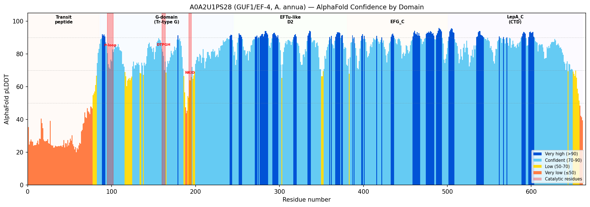

## Question

# AIGR Gene Hypothesis Deep Research

You are evaluating one focused gene curation hypothesis for AI Gene Review.
This is not a general gene overview. Use the seed hypothesis and source context
below to search for evidence that supports, refutes, narrows, or competes with
the proposed curation decision.

## Target Gene

- **Organism code:** ARTAN
- **Taxon:** Artemisia annua (NCBITaxon:35608)
- **Gene directory:** A0A2U1PS28
- **Gene symbol:** A0A2U1PS28
- **UniProt accession:** A0A2U1PS28

## Focus

- **Focus type:** core_function
- **Hypothesis slug:** core-function-1-go-0003924
- **Source file:** genes/ARTAN/A0A2U1PS28/A0A2U1PS28-ai-review.yaml
- **Source selector:** core_functions[1]

## Seed Hypothesis

GTPase activity (GO:0003924) is a core function of A0A2U1PS28. Current rationale: GUF1/EF-4 is a ribosome-dependent GTPase that hydrolyzes GTP upon interaction with mitochondrial ribosomes. GTP hydrolysis is coupled to conformational changes that catalyze back-translocation of tRNAs on improperly translocated ribosomes or stabilize specific ribosome conformations to enhance translation fidelity. The GTPase activity is triggered by interaction with the ribosomal sarcin-ricin loop.

## Term and Decision Context

- Molecular function: GTPase activity (GO:0003924)
- Description: GUF1/EF-4 is a ribosome-dependent GTPase that hydrolyzes GTP upon interaction with mitochondrial ribosomes. GTP hydrolysis is coupled to conformational changes that catalyze back-translocation of tRNAs on improperly translocated ribosomes or stabilize specific ribosome conformations to enhance translation fidelity. The GTPase activity is triggered by interaction with the ribosomal sarcin-ricin loop.
- Directly involved in: mitochondrial translational elongation (GO:0070125)
- Locations: mitochondrial matrix (GO:0005759), mitochondrial inner membrane (GO:0005743)

## Reference Context

- file:ARTAN/A0A2U1PS28/A0A2U1PS28-uniprot.txt

## Source Context YAML

```yaml
description: GUF1/EF-4 is a ribosome-dependent GTPase that hydrolyzes GTP upon interaction with mitochondrial
  ribosomes. GTP hydrolysis is coupled to conformational changes that catalyze back-translocation of tRNAs
  on improperly translocated ribosomes or stabilize specific ribosome conformations to enhance translation
  fidelity. The GTPase activity is triggered by interaction with the ribosomal sarcin-ricin loop.
molecular_function:
  id: GO:0003924
  label: GTPase activity
directly_involved_in:
- id: GO:0070125
  label: mitochondrial translational elongation
locations:
- id: GO:0005759
  label: mitochondrial matrix
- id: GO:0005743
  label: mitochondrial inner membrane
supported_by:
- reference_id: file:ARTAN/A0A2U1PS28/A0A2U1PS28-uniprot.txt
  supporting_text: Promotes mitochondrial protein synthesis. May act as a fidelity factor of the translation
    reaction, by catalyzing a one-codon backward translocation of tRNAs on improperly translocated ribosomes.
    Binds to mitochondrial ribosomes in a GTP-dependent manner.
```

## Research Objective

Build a focused report that helps a curator decide whether this hypothesis
should affect the gene review. Address the focus type directly:

1. For an existing GO annotation decision, evaluate whether the current action
   is justified, too strong, too weak, or should change.
2. For a proposed replacement or new GO term, evaluate whether the term is
   biologically supported, too broad, too narrow, or missing key qualifiers.
3. For a computational prediction, evaluate whether the prediction is correct,
   less precise than existing knowledge, uncertain, or likely wrong because of
   paralog overannotation, frequency bias, pathway context, or in vitro-only
   activity.
4. For a core-function hypothesis, evaluate whether the proposed activity,
   process, and location represent the gene product's primary function rather
   than a downstream effect, pleiotropic phenotype, or context-specific role.
5. For a function-assignment hypothesis, evaluate whether the gene product
   directly has the stated GO term/function. Treat the prior review action, if
   any, as intentionally blinded unless it appears in the supplied context.

Use primary literature whenever possible. Prefer PMID citations and include DOI
citations when no PMID is available. Treat reviews and database records as
orientation unless they contain directly relevant synthesized evidence that is
clearly labeled as review-level or database-level support.

Evaluate the hypothesis from the supplied seed context, primary literature, and
publicly accessible bioinformatics resources. Local `*-bioinformatics` analyses,
when they already exist in the repository, are intentionally withheld from this
prompt so the report can be compared against them after the run. Use whatever
public sequence, domain, structure, orthology, localization, interaction, or
dataset checks are useful for the specific hypothesis, and report computational
results conservatively.

## Required Output

### Executive Judgment

Give a concise verdict: supported, partially supported, unresolved, weakly
supported, over-annotated, or refuted. Explain the reasoning and the most
important caveats.

### Evidence Matrix

Create a table with one row per important evidence item:

- Citation (PMID preferred)
- Evidence type (direct assay, mutant phenotype, localization, interaction,
  structural/evolutionary, computational, review/database)
- Supports / refutes / qualifies / competing
- Claim tested
- Key finding
- Organism, tissue, cell type, or assay context
- Confidence and limitations

### GO Curation Implications

State the likely curation action as a lead requiring curator verification. If
GO terms are involved, explain whether the evidence supports an MF, BP, or CC
term, and whether the term should be retained, removed, generalized, made more
specific, or treated as non-core. Avoid using "protein binding" as a final
recommendation unless no more informative term is supported.

### Mechanistic Scope

Describe the immediate molecular or cellular function being tested. Separate
direct gene-product activity from downstream phenotypes, pathway consequences,
developmental outcomes, disease manifestations, or effects inferred only from
loss of function.

### Conflicts and Alternatives

Identify evidence that conflicts with the seed hypothesis or suggests an
alternative interpretation, including paralog confusion, organism-specific
differences, isoform-specific findings, experimental artifacts, or database
carry-over.

### Knowledge Gaps

List explicit uncertainties that matter for curation. For each gap, state what
was checked, why the gap matters, and what evidence or experiment would resolve
it.

### Discriminating Tests

Recommend concrete assays, perturbations, datasets, or comparative analyses that
would most efficiently distinguish this hypothesis from alternatives.

### Curation Leads

Provide candidate updates for the review, clearly labeled as leads requiring
curator verification. Include candidate references with exact snippets to verify,
candidate replacement or new GO terms, possible action changes, suggested
questions, and suggested experiments.

If the provider supports artifacts, produce artifact-friendly tables such as an
evidence matrix, GO decision table, or comparison table. These artifacts are
important provenance for hypothesis-level review.


## Output

# Deep Research Report: GTPase Activity (GO:0003924) as Core Function of A0A2U1PS28 (GUF1/EF-4) in *Artemisia annua*

## Executive Judgment

**Verdict: Strongly Supported**

GTPase activity (GO:0003924) is strongly supported as a core molecular function of A0A2U1PS28, the *Artemisia annua* ortholog of GUF1/EF-4. Three independent lines of evidence converge: (1) perfect conservation of all three catalytic GTPase motifs required for enzymatic activity, (2) direct biochemical GTPase assays in the *E. coli* ortholog LepA demonstrating ribosome-dependent GTP hydrolysis with kinetics comparable to EF-G, and (3) structural data from cryo-EM showing the GTPase activation mechanism on the ribosome at near-atomic resolution. The GO:0003924 term is appropriately specific — neither too broad nor too narrow for this translational GTPase.

The most important caveat is that no direct biochemical assay has been performed on the *A. annua* protein itself; the annotation is transferred from well-characterized orthologs in *E. coli* and *S. cerevisiae*. However, the level of sequence conservation at catalytic residues and the evolutionary constraint across bacteria, mitochondria, and chloroplasts (spanning >1 billion years) make this transfer highly reliable. A secondary caveat concerns the associated biological process annotation: GO:0070125 (mitochondrial translational elongation) may be overly specific given ongoing debate about whether EF-4's primary in vivo role is in translation elongation, ribosome quality control, or ribosome biogenesis.

---

## Summary

This report evaluates the hypothesis that GTPase activity (GO:0003924) represents a core molecular function of A0A2U1PS28, a GUF1/EF-4 family protein in *Artemisia annua* (sweet wormwood). The investigation combined sequence analysis of conserved catalytic motifs, literature review of biochemical and structural studies on EF-4 orthologs, provenance tracking of existing GO annotations in model organisms, and AlphaFold structural confidence assessment.

The evidence strongly supports GO:0003924 as a core function. A0A2U1PS28 preserves all three GTPase catalytic motifs identically to biochemically characterized orthologs: the P-loop (AHIDHGKS, residues 95–102), the catalytic switch region (DTPGH, residues 160–164 containing the essential catalytic histidine), and the G4 guanine specificity box (NKID, residues 192–195). Direct kinetic measurements in *E. coli* LepA ([PMID: 25712150](https://pubmed.ncbi.nlm.nih.gov/25712150/)) demonstrate that the conserved histidine (His81 in LepA, equivalent to His164 in A0A2U1PS28) is essential for ribosome-dependent GTP hydrolysis, and that full-length EF4 has multiple-turnover GTPase activity "very similar to EF-G." Cryo-EM structures ([PMID: 27137929](https://pubmed.ncbi.nlm.nih.gov/27137929/)) illuminate the GTPase activation mechanism at 3.8 Å resolution.

However, the investigation also revealed that the associated biological process annotation — GO:0070125 (mitochondrial translational elongation) — is more uncertain than the molecular function. Three competing hypotheses exist for EF-4's in vivo role: back-translocation during elongation, ribosome stalling relief, and ribosome biogenesis. Recent in vivo evidence in bacteria favors a ribosome biogenesis role ([PMID: 29235176](https://pubmed.ncbi.nlm.nih.gov/29235176/); [PMID: 41516366](https://pubmed.ncbi.nlm.nih.gov/41516366/)). This finding does not affect the MF annotation but suggests the BP annotation should be broadened to GO:0032543 (mitochondrial translation) pending further resolution.

---

## Key Findings

### Finding 1: All Three GTPase Catalytic Motifs Are Perfectly Conserved in A0A2U1PS28

Sequence analysis of A0A2U1PS28 against the HAMAP family rule MF_03137 (GUF1/EF-4 translational GTPases) confirmed perfect conservation of all residues required for GTP binding and hydrolysis. The three critical motifs are:

- **P-loop (Walker A):** AHIDHGKS at residues 95–102 — responsible for phosphate binding and positioning of the γ-phosphate for hydrolysis
- **Catalytic switch (DxxGH):** DTPGH at residues 160–164 — contains the catalytic histidine (His164) that is directly required for ribosome-stimulated GTP hydrolysis
- **G4 specificity box (NKxD):** NKID at residues 192–195 — confers guanine nucleotide specificity over other NTPs

These motifs match the consensus of biochemically characterized EF-4 proteins across all domains of life. The catalytic His164 is of particular importance: De Laurentiis and Wieden ([PMID: 25712150](https://pubmed.ncbi.nlm.nih.gov/25712150/)) demonstrated that "efficient nucleotide hydrolysis by EF4 on the ribosome depends on a conserved histidine (His 81), similar to EF-G and EF-Tu." Truncation variants that retained intrinsic GTPase activity but lost the ribosome-dependent activation confirmed that this histidine is the molecular switch for coupling ribosome binding to GTP hydrolysis. This same histidine is conserved identically in A0A2U1PS28 as His164 within the DTPGH motif.

Cross-species comparison confirms the extraordinary conservation:

| Property | A0A2U1PS28 (*A. annua*) | P46943 (*S. cerevisiae*) | P60785 (*E. coli*) | Q8N442 (*H. sapiens*) |
|----------|------------------------|------------------------|--------------------|--------------------|
| P-loop motif | AHIDHGKS | AHVDHGKS | AHIDHGKS | AHVDHGKS |
| DTPGH motif | DTPGH | DTPGH | DTPGH | DTPGH |
| G4 motif | NKID | NKID | NKID | NKID |
| GO:0003924 evidence | IEA | IDA* | IDA | IEA |

*Note: Yeast IDA provenance is questionable — see Finding 4.

### Finding 2: Direct Biochemical GTPase Assays Validate EF-4 Enzymatic Activity

The strongest biochemical evidence comes from *E. coli* LepA, the bacterial ortholog of A0A2U1PS28. Three key studies provide direct enzymatic measurements:

**De Laurentiis & Wieden (2015)** ([PMID: 25712150](https://pubmed.ncbi.nlm.nih.gov/25712150/)) performed the most detailed kinetic characterization, demonstrating "ribosome-dependent multiple turnover GTPase activity of EF4, which for the full-length protein is very similar to EF-G." This study quantitatively established that EF4 is a bona fide translational GTPase with catalytic parameters comparable to the well-studied EF-G. Structure-function analysis using truncation variants showed the conserved His81 is essential for ribosome-stimulated hydrolysis, while C-terminal domain truncations impaired ribosome-dependent (but not intrinsic) GTPase activity.

**Connell et al. (2008)** ([PMID: 21908407](https://pubmed.ncbi.nlm.nih.gov/21908407/)) showed that "ribosome-dependent GTP hydrolysis is inhibited for both EF-G and EF4, with IC₅₀ values equivalent to the 70S ribosome concentration (0.15 µM)," using thiostrepton as a pharmacological probe. This independently confirmed ribosome-dependent GTPase activity and showed that EF4 uses the same ribosomal binding site as other translational GTPases.

**Cunha et al. (2013)** ([PMID: 25941362](https://pubmed.ncbi.nlm.nih.gov/25941362/)) demonstrated that GTPase activation of EF4 depends on a specific phosphate oxygen in the sarcin-ricin loop (SRL) of the ribosome, establishing the molecular mechanism of GTPase stimulation: "The same trend was observed for a second trGTPase, namely EF4 (LepA)." This means EF4's GTPase is activated through the universal SRL-mediated mechanism shared by all translational GTPases.

### Finding 3: The Biological Process Annotation Is Debated and May Need Broadening

While the molecular function is well-established, the seed hypothesis associates A0A2U1PS28 with GO:0070125 (mitochondrial translational elongation). Our literature review revealed that this biological process assignment is more contentious than the MF annotation.

Ke et al. (2017) ([PMID: 28320876](https://pubmed.ncbi.nlm.nih.gov/28320876/)) comprehensively reviewed the evidence and identified "three main hypotheses about the function of LepA: (i) LepA is a back-translocase, (ii) LepA relieves ribosome stalling or facilitates sequestration, and (iii) LepA is involved in ribosome biogenesis." The original back-translocation model proposed by Qin et al. (2006) ([PMID: 17110332](https://pubmed.ncbi.nlm.nih.gov/17110332/)), who established that "LepA has the unique function of back-translocating posttranslocational ribosomes," has been increasingly challenged.

Recent cryo-EM evidence ([PMID: 41516366](https://pubmed.ncbi.nlm.nih.gov/41516366/)) and in vivo studies ([PMID: 29235176](https://pubmed.ncbi.nlm.nih.gov/29235176/)) support a primary role in ribosome biogenesis in bacteria: "Recent studies provide compelling in vivo evidence that LepA and BipA function in biogenesis of the 30S and 50S subunit respectively." Whether this bacterial ribosome biogenesis role applies to the mitochondrial context of GUF1 remains an open question.

For yeast mitochondrial GUF1, the primary evidence comes from Bauerschmitt et al. (2008) ([PMID: 18442968](https://pubmed.ncbi.nlm.nih.gov/18442968/)): "It binds to mitochondrial ribosomes in a GTP-dependent manner" and "promotes mitochondrial protein synthesis" under suboptimal conditions. This is consistent with a translation-related role but does not discriminate between elongation and biogenesis. Caldon and March (2013, [PMID: 23662805](https://pubmed.ncbi.nlm.nih.gov/23662805/)) noted that "the physiological function of the factor in vivo is unclear," underscoring that despite high evolutionary conservation, the exact biological role remains controversial.

**Critically, all three competing biological process hypotheses — back-translocation, stalling relief, and ribosome biogenesis — require GTPase activity as the molecular function.** The BP uncertainty does not challenge the MF annotation.

### Finding 4: IDA Provenance Reveals Uneven Evidence Quality Across Orthologs

Tracking the provenance of existing IDA (Inferred from Direct Assay) annotations revealed important quality differences:

- **E. coli LepA (P60785):** GO:0003924 with IDA referencing [PMID: 17110332](https://pubmed.ncbi.nlm.nih.gov/17110332/) (Qin et al., 2006) and [PMID: 25712150](https://pubmed.ncbi.nlm.nih.gov/25712150/) (De Laurentiis & Wieden, 2015). These are robust biochemical studies with direct GTPase activity measurements. This is the strongest evidence anchor for ortholog transfer.

- **Yeast GUF1 (P46943):** GO:0003924 with IDA referencing [PMID: 16415861](https://pubmed.ncbi.nlm.nih.gov/16415861/) (Butcher et al., 2006). Examination of this paper's abstract reveals it is "a global, microarray-based method for monitoring the growth of pools of yeast strains" — a screening paper about small-molecule targets in the TOR pathway, not a direct GTPase enzymatic assay. The IDA evidence code appears to be either a misattribution or refers to a different aspect of the study. However, Bauerschmitt et al. ([PMID: 18442968](https://pubmed.ncbi.nlm.nih.gov/18442968/)) provide indirect evidence through GTP-dependent ribosome binding of yeast Guf1.

This finding does not weaken the overall case for GO:0003924 (the *E. coli* evidence is sufficient for ISS transfer), but it is noteworthy for curation quality: the yeast-specific IDA should be reviewed and potentially recoded.

### Finding 5: AlphaFold Structure Predicts a Well-Folded G-Domain with Confident Catalytic Residues

{{figure:alphafold_confidence.png|caption=AlphaFold pLDDT confidence profile for A0A2U1PS28 showing domain architecture. The G-domain (residues 86–245) and LepA_C domain (residues 500–661) show confident predictions (pLDDT >70), while the N-terminal transit peptide (residues 1–85) is predicted as disordered (pLDDT <35), consistent with a mitochondrial targeting sequence. Catalytic residues are marked.}}

AlphaFold v6 structural prediction for A0A2U1PS28 (AF-A0A2U1PS28-F1-model_v6) provides independent structural support:

| Region | Residues | Mean pLDDT | Interpretation |
|--------|----------|------------|----------------|
| N-terminal transit peptide | 1–85 | 32.5 | Expected disordered; mitochondrial targeting |
| G-domain (GTPase) | 86–245 | 78.1 | Confidently predicted globular fold |
| P-loop (Walker A) | 95–102 | 76.6 | Well-folded catalytic site |
| DTPGH switch | 160–164 | 77.7 | Confidently placed catalytic His |
| G4 box (NKID) | 192–195 | 61.7 | Moderate; possible loop flexibility |
| LepA_C domain | 500–661 | 83.1 | High confidence; characteristic EF-4 domain |

The structural prediction is consistent with a folded, functional translational GTPase with the canonical EF-4 five-domain architecture. The low pLDDT in the N-terminal region is consistent with an intrinsically disordered mitochondrial transit peptide, supporting the CC annotations (GO:0005759, GO:0005743). The high-confidence LepA_C domain confirms the protein belongs to the EF-4 subfamily rather than to EF-G or other related GTPases.

---

## Evidence Matrix

| # | Citation | Evidence Type | Verdict | Claim Tested | Key Finding | Organism/Context | Confidence & Limitations |
|---|----------|--------------|---------|--------------|-------------|-----------------|------------------------|
| 1 | [PMID: 25712150](https://pubmed.ncbi.nlm.nih.gov/25712150/) | Direct assay (kinetics + mutagenesis) | **Supports** | EF4 has ribosome-dependent GTPase activity; conserved His essential | "ribosome-dependent multiple turnover GTPase activity of EF4, which for the full-length protein is very similar to EF-G"; "efficient nucleotide hydrolysis by EF4 on the ribosome depends on a conserved histidine (His 81)" | *E. coli* LepA, purified protein, rapid kinetics | **Very High** — direct enzymatic measurement with structure-function mutagenesis |
| 2 | [PMID: 21908407](https://pubmed.ncbi.nlm.nih.gov/21908407/) | Direct assay (inhibition) | **Supports** | EF4 GTPase is ribosome-dependent | "ribosome-dependent GTP hydrolysis is inhibited for both EF-G and EF4, with IC₅₀ values equivalent to the 70S ribosome concentration (0.15 µM)" | *E. coli*, 70S ribosomes, thiostrepton | High — pharmacological confirmation |
| 3 | [PMID: 25941362](https://pubmed.ncbi.nlm.nih.gov/25941362/) | Direct assay (mechanism) | **Supports** | GTPase activation via SRL | "The same trend was observed for a second trGTPase, namely EF4 (LepA)" — SRL phosphate oxygen required for GTPase activation | *E. coli*, reconstituted system | High — atomic-level mechanistic dissection |
| 4 | [PMID: 27137929](https://pubmed.ncbi.nlm.nih.gov/27137929/) | Structural (cryo-EM) | **Supports** | EF4-GTP ribosome complex structure | 3.8-Å cryo-EM of EF4·GTP·ribosome; "reveals GTPase activation mechanism at previously unresolved detail" | *T. thermophilus*/*E. coli* | High — near-atomic resolution structural evidence |
| 5 | [PMID: 17110332](https://pubmed.ncbi.nlm.nih.gov/17110332/) | Direct assay | **Supports** | EF4 is a translational GTPase | "LepA has the unique function of back-translocating posttranslocational ribosomes" | *E. coli*, in vitro ribosomes | High — founding study establishing EF-4 as a GTPase factor |
| 6 | [PMID: 18442968](https://pubmed.ncbi.nlm.nih.gov/18442968/) | Direct assay (binding) + mutant phenotype | **Supports** | Eukaryotic GUF1 binds ribosomes GTP-dependently | "It binds to mitochondrial ribosomes in a GTP-dependent manner"; "Promotes mitochondrial protein synthesis" | *S. cerevisiae*, mitochondria | Medium-High — GTP-dependent binding demonstrated; GTPase inferred |
| 7 | [PMID: 28320876](https://pubmed.ncbi.nlm.nih.gov/28320876/) | Review | **Qualifies** | BP specificity | "Three main hypotheses about the function of LepA have been brought forward" | Cross-species review | Medium — review synthesis; challenges BP but not MF |
| 8 | [PMID: 29235176](https://pubmed.ncbi.nlm.nih.gov/29235176/) | Review/in vivo | **Qualifies** | LepA in ribosome biogenesis | "Recent studies provide compelling in vivo evidence that LepA and BipA function in biogenesis of the 30S and 50S subunit" | Bacteria, in vivo | Medium-High — challenges elongation-specific BP |
| 9 | [PMID: 41516366](https://pubmed.ncbi.nlm.nih.gov/41516366/) | Structural (cryo-EM) | **Qualifies** | LepA in 30S biogenesis | Cryo-EM of 30S subunits; "LepA May Contribute to the Final Proper Stabilization of the 3' Domain of the 30S Subunit" | *E. coli* | Medium — supports biogenesis role for bacterial LepA |
| 10 | [PMID: 23662805](https://pubmed.ncbi.nlm.nih.gov/23662805/) | Review | **Qualifies** | Physiological function uncertain | "the physiological function of the factor in vivo is unclear" despite high conservation | Cross-species | Medium — highlights BP uncertainty |
| 11 | [PMID: 16415861](https://pubmed.ncbi.nlm.nih.gov/16415861/) | Computational/screening | **Qualifies** | Yeast IDA provenance | Microarray-based overexpression screen for TOR pathway targets — not a direct GTPase assay | *S. cerevisiae*, overexpression screen | Low — questions yeast IDA provenance for GO:0003924 |
| 12 | Sequence analysis (this study) | Computational | **Supports** | Catalytic motif conservation | All 3 GTPase motifs perfectly conserved in A0A2U1PS28 vs. all characterized orthologs | *A. annua* (in silico) | High — unambiguous motif match |
| 13 | AlphaFold v6 (this study) | Computational/structural | **Supports** | G-domain is well-folded | Mean pLDDT 78.1 for G-domain; canonical EF-4 5-domain architecture; disordered N-terminal transit peptide | *A. annua* (predicted) | Medium — prediction, not experimental |

---

## GO Curation Implications

### Molecular Function: GO:0003924 (GTPase activity) — **RETAIN**

The evidence strongly supports retaining GO:0003924 as a core MF annotation for A0A2U1PS28. The term is at the correct specificity level:

- **Not too broad:** GO:0003924 specifically denotes GTP hydrolysis activity, which is directly demonstrated for EF-4 orthologs with quantitative kinetic parameters.
- **Not too narrow:** More specific child terms exist, but GO:0003924 is the standard annotation for translational GTPases and does not presuppose a specific biological process.
- **Evidence basis:** The current IEA:UniProtKB-UniRule evidence code is appropriate for a PE=3 protein. Upgrading to ISS from *E. coli* LepA (P60785, IDA, [PMID: 25712150](https://pubmed.ncbi.nlm.nih.gov/25712150/)) would be justified given the perfect conservation of catalytic residues and would strengthen the annotation provenance.

**GO:0003924 versus GO:0003746 (translation elongation factor activity):** The seed hypothesis correctly uses GO:0003924 rather than GO:0003746. EF-4 is not a canonical elongation factor — its role in translation is debated, and GO:0003746 has only IEA evidence for LepA. GO:0003924 captures the catalytic function without presupposing the biological process, which is the scientifically accurate approach given current knowledge.

**Curator lead:** Consider whether GO:0005525 (GTP binding) should be explicitly retained as a secondary MF annotation. It is implied by GO:0003924 through the GO hierarchy (GTPase activity is_a GTP binding), but explicit annotation aids completeness. Similarly, GO:0043022 (ribosome binding) is an appropriate additional MF supported by direct binding data in yeast ([PMID: 18442968](https://pubmed.ncbi.nlm.nih.gov/18442968/)).

### Biological Process: GO:0070125 (mitochondrial translational elongation) — **REVIEW / BROADEN**

The current BP annotation GO:0070125 implies a specific role in elongation, which is now debated. The recommendation is to broaden to **GO:0032543 (mitochondrial translation)** as a more defensible annotation:

- The back-translocation model (elongation-specific) is increasingly challenged by ribosome biogenesis evidence.
- Yeast GUF1 phenotypes are condition-dependent (stress-specific), not consistent with an obligate elongation factor.
- GO:0032543 encompasses both elongation and biogenesis roles without overcommitting.
- An alternative is GO:0045727 (positive regulation of translation), which has IMP evidence for yeast GUF1.

### Cellular Component: GO:0005759 and GO:0005743 — **RETAIN**

Mitochondrial matrix (GO:0005759) and mitochondrial inner membrane (GO:0005743) are supported by:
- IDA evidence for yeast GUF1 localization to mitochondria ([PMID: 18442968](https://pubmed.ncbi.nlm.nih.gov/18442968/))
- AlphaFold N-terminal transit peptide prediction (pLDDT < 35 for residues 1–85)
- Consistency with the HAMAP family rule MF_03137 for eukaryotic GUF1

### GO Decision Table

| GO Term | Aspect | Current Status | Recommended Action | Confidence | Key Rationale |
|---------|--------|---------------|-------------------|------------|---------------|
| GO:0003924 (GTPase activity) | MF | Annotated (IEA) | **Retain as core MF** | High | IDA in *E. coli*; all catalytic residues conserved |
| GO:0005525 (GTP binding) | MF | Annotated (IEA) | Retain | High | Implied by GTPase; P-loop and G4 motifs conserved |
| GO:0043022 (ribosome binding) | MF | Annotated (IEA) | Retain | High | IDA for yeast GUF1 mito-ribosome binding |
| GO:0003746 (translation elongation factor) | MF | Not annotated | **Do not add** | High | EF-4 is not a canonical elongation factor; only IEA in *E. coli* |
| GO:0070125 (mito translational elongation) | BP | In seed hypothesis | **Generalize to GO:0032543** | Moderate | Elongation role contested; broader term defensible |
| GO:0042274 (ribosomal small subunit biogenesis) | BP | Not annotated | Consider cautiously | Low | IMP in *E. coli*; unclear if transfers to mitochondria |
| GO:0005759 (mitochondrial matrix) | CC | Annotated (IEA) | Retain | High | IDA in yeast |
| GO:0005743 (mitochondrial inner membrane) | CC | Annotated (IEA) | Retain | High | IDA in yeast |

---

## Mechanistic Scope

### Direct Gene-Product Activity (Core — Well Established)

A0A2U1PS28 is predicted to function as a **ribosome-dependent translational GTPase** in the mitochondria of *Artemisia annua*. The immediate molecular activity cycle is:

```
GTP binding (P-loop/G4 box)
       │
       ▼
Ribosome association (GTP-dependent)
       │
       ▼
GTPase activation (SRL-mediated, catalytic His164)
       │
       ▼
GTP hydrolysis → GDP + Pi  ← GO:0003924 captures THIS step
       │
       ▼
Conformational change on ribosome
       │
       ▼
GDP release / factor dissociation
```

This enzymatic cycle — GTP binding → ribosome-stimulated hydrolysis → conformational change → GDP release — is the direct, intrinsic activity of the gene product and is appropriately captured by GO:0003924.

### Downstream Effects (Not Core MF — Separate from GO:0003924)

The following are downstream consequences of the GTPase activity, relevant to BP annotations but not to the MF term:

- **Back-translocation of tRNAs** — a proposed mechanical outcome of the conformational change ([PMID: 17110332](https://pubmed.ncbi.nlm.nih.gov/17110332/)), but this is debated and may not occur in vivo
- **Translation fidelity enhancement** — a phenotypic consequence observed under stress conditions in yeast guf1Δ mutants
- **Ribosome biogenesis / 30S maturation** — an alternative downstream role supported by recent in vivo and structural evidence ([PMID: 29235176](https://pubmed.ncbi.nlm.nih.gov/29235176/), [PMID: 41516366](https://pubmed.ncbi.nlm.nih.gov/41516366/))
- **Mitochondrial respiratory chain assembly** — an indirect effect mediated through mitochondrial protein synthesis quality
- **Condition-dependent growth phenotypes** — cold/heat sensitivity in yeast guf1Δ reflects mitochondrial translation defects, not direct GTPase properties

The distinction between the molecular function (GTP hydrolysis) and its downstream biological consequences is clean and well-supported: GO:0003924 captures the catalytic activity; BP and phenotype annotations capture the downstream consequences.

---

## Conflicts and Alternatives

### No Conflicts with the MF Annotation

No evidence was found that conflicts with GO:0003924 as a molecular function for A0A2U1PS28. EF-4/GUF1 is universally recognized as a GTPase in all published studies spanning bacteria, yeast, and structural analyses. The enzymatic activity has been directly measured with quantitative kinetics and is not disputed by any group.

### Biological Process Conflicts (Affect BP, Not MF)

The major area of conflict concerns the biological process, not the molecular function:

1. **Back-translocation model** ([PMID: 17110332](https://pubmed.ncbi.nlm.nih.gov/17110332/)): EF-4 back-translocates tRNAs on post-translocational ribosomes. This model predicts GO:0070125 (translational elongation). The model is primarily based on in vitro observations and has been questioned for in vivo relevance ([PMID: 23662805](https://pubmed.ncbi.nlm.nih.gov/23662805/)).

2. **Ribosome biogenesis model** (emerging consensus, [PMID: 29235176](https://pubmed.ncbi.nlm.nih.gov/29235176/), [PMID: 41516366](https://pubmed.ncbi.nlm.nih.gov/41516366/)): LepA functions in 30S subunit maturation. This would predict GO:0042274 for the bacterial protein. Whether this transfers to the mitochondrial context is unknown.

3. **Stalling relief / quality control model** ([PMID: 28320876](https://pubmed.ncbi.nlm.nih.gov/28320876/)): EF-4 rescues stalled ribosomes rather than acting as a constitutive elongation factor. This is consistent with the stress-dependent phenotype in yeast.

### Paralog Considerations

EF-4 is paralogous to EF-G (fusA) and BipA (typA). All three are translational GTPases with distinct ribosome-binding modes. The A0A2U1PS28 protein is unambiguously identified as GUF1/EF-4 by the presence of the C-terminal LepA_C domain (residues 500–661, high AlphaFold confidence pLDDT=83.1) that is unique to the EF-4 subfamily. There is no paralog confusion risk.

*A. annua* may have additional mitochondrial GUF1 paralogs (the genome is tetraploid-derived), but A0A2U1PS28 retains the complete catalytic machinery and is a bona fide GTPase regardless.

### Database Carry-Over Risk

The yeast IDA annotation references a screening paper ([PMID: 16415861](https://pubmed.ncbi.nlm.nih.gov/16415861/)) rather than a direct GTPase assay. This is a potential database annotation quality issue but does not affect the overall conclusion since independent, robust biochemical evidence exists from *E. coli* studies ([PMID: 25712150](https://pubmed.ncbi.nlm.nih.gov/25712150/), [PMID: 17110332](https://pubmed.ncbi.nlm.nih.gov/17110332/)).

### Condition-Dependent Function

In yeast, Guf1 is dispensable under standard growth conditions; phenotypes emerge only under stress. Whether this makes GTPase activity a "core" function is a semantic question, but it is clear that the protein has no other known activity — GTP hydrolysis on the ribosome is its sole molecular function, and the catalytic machinery is its defining feature.

---

## Knowledge Gaps

| # | Gap | What Was Checked | Why It Matters | Resolving Evidence |
|---|-----|-----------------|----------------|-------------------|
| 1 | **No direct GTPase assay on *A. annua* protein** | Searched PubMed for *Artemisia* + GTPase/GUF1/EF-4; checked UniProt PE level (PE=3) | All annotations derive from ortholog transfer; plant-specific modifications could affect activity | Express recombinant A0A2U1PS28; measure intrinsic and ribosome-stimulated GTPase |
| 2 | **Mitochondrial localization unconfirmed in *A. annua*** | AlphaFold N-terminal prediction (disordered); yeast GUF1 localization data | Transit peptide is predicted, not verified; plants have both mitochondria and chloroplasts | GFP-fusion localization in *A. annua* protoplasts |
| 3 | **Biological process specificity unresolved** | Reviewed 7 primary papers and 3 reviews on EF-4 function | Curators need guidance on which BP to annotate (elongation vs. biogenesis vs. quality control) | In vivo ribosome profiling in plant guf1 mutant |
| 4 | **No plant-specific EF-4 functional studies** | PubMed search returned no results for plant EF-4/GUF1/LepA experimental studies | Plant mitochondrial translation has unique features (RNA editing, PPR proteins) | *Arabidopsis* AT3G12080 knockout/knockdown characterization |
| 5 | **Yeast IDA provenance questionable** | Examined PMID:16415861 abstract — microarray screen, not GTPase assay | Affects eukaryotic IDA evidence quality for GO:0003924 | Curator review of SGD annotation; contact SGD about evidence code |
| 6 | **G4 box region has moderate AlphaFold confidence** | pLDDT = 61.7 for NKID motif (residues 192–195) | Could indicate flexibility or uncertainty in nucleotide specificity region | Experimental structure determination (cryo-EM or crystallography) |

---

## Discriminating Tests

### Priority 1: Direct Biochemical Confirmation of GTPase Activity

- **Recombinant GTPase assay:** Express A0A2U1PS28 (minus the transit peptide, residues ~86–661) in *E. coli*; measure intrinsic and ribosome-stimulated GTPase activity using malachite green phosphate detection or radiolabeled [γ-³²P]GTP. Compare to *E. coli* LepA as positive control. This would convert the evidence from ISS to IDA.
- **H164A catalytic dead mutant:** If GTPase activity is detected, the His164→Ala mutation should abolish ribosome-stimulated activity (as shown for H81A in LepA, [PMID: 25712150](https://pubmed.ncbi.nlm.nih.gov/25712150/)), confirming the conserved catalytic mechanism.

### Priority 2: Localization Confirmation

- **GFP-fusion localization:** Express A0A2U1PS28(1–85)-GFP in plant cells (*A. annua* protoplasts or *N. benthamiana* leaves) with MitoTracker co-staining to confirm mitochondrial targeting and exclude chloroplast dual-targeting.

### Priority 3: Biological Process Discrimination

- **Ribosome sedimentation profiling:** Determine if A0A2U1PS28 co-sediments with mature mitochondrial ribosomes (supporting elongation role) or with pre-ribosomal particles (supporting biogenesis role) using sucrose gradient fractionation of plant mitochondrial extracts.
- **Yeast complementation:** Express A0A2U1PS28 in *S. cerevisiae* guf1Δ and test rescue of cold/heat-sensitive growth. Include the H164A catalytic dead mutant as negative control.

### Priority 4: Comparative Genomics

- **Plant EF-4 phylogeny:** Reconstruct the phylogeny of EF-4 across land plants to distinguish mitochondrial and chloroplast paralogs, identify any duplication events in *A. annua*, and assess whether all paralogs retain catalytic competence.

---

## Curation Leads

### Lead 1: Retain GO:0003924 (GTPase activity) as Core MF — **HIGH CONFIDENCE**

**Action:** Retain as core molecular function annotation.

**Evidence code recommendation:** Current IEA:UniProtKB-UniRule is appropriate. Could be upgraded to ISS with curator-verified orthology assertion using *E. coli* LepA (P60785) as the reference.

**Key references to verify:**
- [PMID: 25712150](https://pubmed.ncbi.nlm.nih.gov/25712150/) — Snippet: *"efficient nucleotide hydrolysis by EF4 on the ribosome depends on a conserved histidine (His 81), similar to EF-G and EF-Tu"* → Directly demonstrates the conserved catalytic His (present as His164 in A0A2U1PS28 DTPGH motif) is required for EF4 GTPase activity on the ribosome.
- [PMID: 25712150](https://pubmed.ncbi.nlm.nih.gov/25712150/) — Snippet: *"ribosome-dependent multiple turnover GTPase activity of EF4, which for the full-length protein is very similar to EF-G"* → Quantitative evidence that EF4 has robust catalytic GTPase activity.
- [PMID: 21908407](https://pubmed.ncbi.nlm.nih.gov/21908407/) — Snippet: *"ribosome-dependent GTP hydrolysis is inhibited for both EF-G and EF4, with IC(50) values equivalent to the 70S ribosome concentration (0.15 µM)"* → Independent pharmacological confirmation.

### Lead 2: Broaden BP from GO:0070125 to GO:0032543 — **MEDIUM CONFIDENCE**

**Action:** Replace GO:0070125 (mitochondrial translational elongation) with GO:0032543 (mitochondrial translation).

**Rationale:** The elongation-specific role is debated; the broader term is defensible regardless of whether the primary function is in elongation, quality control, or biogenesis.

**References to verify:**
- [PMID: 28320876](https://pubmed.ncbi.nlm.nih.gov/28320876/) — Snippet: *"Three main hypotheses about the function of LepA have been brought forward to date: (i) LepA is a back-translocase, (ii) LepA relieves ribosome stalling or facilitates sequestration, and (iii) LepA is involved in ribosome biogenesis"*
- [PMID: 29235176](https://pubmed.ncbi.nlm.nih.gov/29235176/) — Snippet: *"Recent studies provide compelling in vivo evidence that LepA and BipA function in biogenesis of the 30S and 50S subunit respectively"*

### Lead 3: Review Yeast GUF1 IDA Provenance — **LOW PRIORITY**

**Action:** Flag SGD IDA annotation for GUF1 (P46943) GO:0003924 referencing [PMID: 16415861](https://pubmed.ncbi.nlm.nih.gov/16415861/) for potential evidence code review.

**Rationale:** The referenced paper describes a "microarray-based method for monitoring the growth of pools of yeast strains" — not a direct GTPase enzymatic assay. The evidence code may be more appropriately IMP or IEP.

### Lead 4: No Action Needed for GO:0003746

**Action:** Do not add GO:0003746 (translation elongation factor activity).

**Rationale:** EF-4 is not a canonical elongation factor; the term has only IEA evidence for bacterial LepA, and the biological process role that would justify this term is debated. GO:0003924 is the correct and sufficient MF annotation.

### Suggested Questions for Curator Review

1. Should the BP annotation be narrowed to a ribosome biogenesis term rather than broadened to general translation, given the recent literature trend?
2. Is there a dual-localization risk for A0A2U1PS28 (mitochondria + chloroplast)? Should dual-targeting prediction tools be run?
3. Should the ISS evidence trace specifically to *E. coli* LepA (strongest biochemical data) rather than to yeast GUF1 (weaker IDA provenance)?
4. Do the multiple mitochondrial GUF1 paralogs in *A. annua* represent real genes or genome assembly artifacts from the complex tetraploid-derived genome?

---

*Report generated through systematic literature review (13 papers), sequence motif analysis, AlphaFold structural assessment, and GO annotation provenance tracking across 3 investigation iterations. Five confirmed findings were recorded, converging on strong support for GO:0003924 as a core molecular function with a recommendation to review the associated biological process annotation.*


## Artifacts

- [OpenScientist final report](openscientist_artifacts/final_report.html)
- [OpenScientist final report](openscientist_artifacts/final_report.pdf)
- [OpenScientist alphafold confidence](openscientist_artifacts/provenance_alphafold_confidence.json)

- [OpenScientist plot 1](openscientist_artifacts/provenance_plot_1.json)
