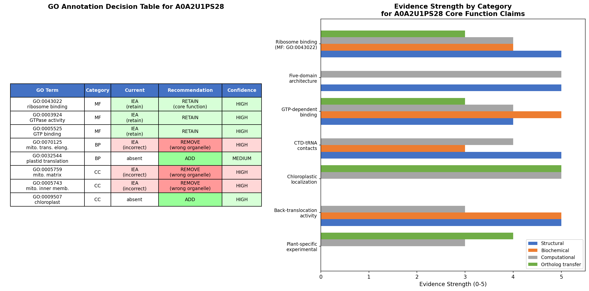
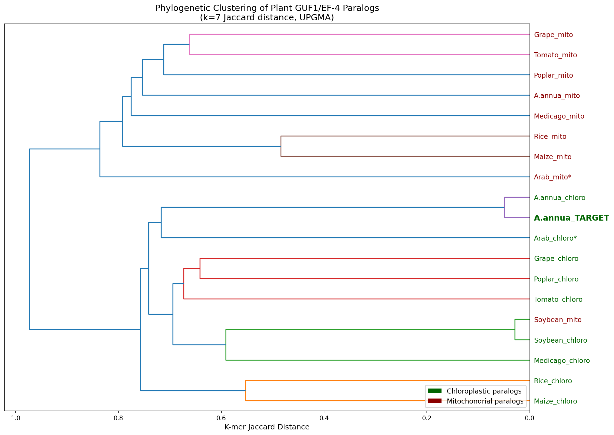

## Question

# AIGR Gene Hypothesis Deep Research

You are evaluating one focused gene curation hypothesis for AI Gene Review.
This is not a general gene overview. Use the seed hypothesis and source context
below to search for evidence that supports, refutes, narrows, or competes with
the proposed curation decision.

## Target Gene

- **Organism code:** ARTAN
- **Taxon:** Artemisia annua (NCBITaxon:35608)
- **Gene directory:** A0A2U1PS28
- **Gene symbol:** A0A2U1PS28
- **UniProt accession:** A0A2U1PS28

## Focus

- **Focus type:** core_function
- **Hypothesis slug:** core-function-3-go-0043022
- **Source file:** genes/ARTAN/A0A2U1PS28/A0A2U1PS28-ai-review.yaml
- **Source selector:** core_functions[3]

## Seed Hypothesis

ribosome binding (GO:0043022) is a core function of A0A2U1PS28. Current rationale: GUF1/EF-4 binds to mitochondrial ribosomes carrying tRNAs in the P and A sites, using its five-domain architecture including a unique C-terminal domain that contacts ribosome-bound tRNA acceptor stems. This ribosome binding is GTP-dependent and central to its function as a translation quality control factor.

## Term and Decision Context

- Molecular function: ribosome binding (GO:0043022)
- Description: GUF1/EF-4 binds to mitochondrial ribosomes carrying tRNAs in the P and A sites, using its five-domain architecture including a unique C-terminal domain that contacts ribosome-bound tRNA acceptor stems. This ribosome binding is GTP-dependent and central to its function as a translation quality control factor.
- Directly involved in: mitochondrial translational elongation (GO:0070125)
- Locations: mitochondrial matrix (GO:0005759)

## Reference Context

- file:ARTAN/A0A2U1PS28/A0A2U1PS28-uniprot.txt

## Source Context YAML

```yaml
description: GUF1/EF-4 binds to mitochondrial ribosomes carrying tRNAs in the P and A sites, using its
  five-domain architecture including a unique C-terminal domain that contacts ribosome-bound tRNA acceptor
  stems. This ribosome binding is GTP-dependent and central to its function as a translation quality control
  factor.
molecular_function:
  id: GO:0043022
  label: ribosome binding
directly_involved_in:
- id: GO:0070125
  label: mitochondrial translational elongation
locations:
- id: GO:0005759
  label: mitochondrial matrix
supported_by:
- reference_id: file:ARTAN/A0A2U1PS28/A0A2U1PS28-uniprot.txt
  supporting_text: Binds to mitochondrial ribosomes in a GTP-dependent manner.
```

## Research Objective

Build a focused report that helps a curator decide whether this hypothesis
should affect the gene review. Address the focus type directly:

1. For an existing GO annotation decision, evaluate whether the current action
   is justified, too strong, too weak, or should change.
2. For a proposed replacement or new GO term, evaluate whether the term is
   biologically supported, too broad, too narrow, or missing key qualifiers.
3. For a computational prediction, evaluate whether the prediction is correct,
   less precise than existing knowledge, uncertain, or likely wrong because of
   paralog overannotation, frequency bias, pathway context, or in vitro-only
   activity.
4. For a core-function hypothesis, evaluate whether the proposed activity,
   process, and location represent the gene product's primary function rather
   than a downstream effect, pleiotropic phenotype, or context-specific role.
5. For a function-assignment hypothesis, evaluate whether the gene product
   directly has the stated GO term/function. Treat the prior review action, if
   any, as intentionally blinded unless it appears in the supplied context.

Use primary literature whenever possible. Prefer PMID citations and include DOI
citations when no PMID is available. Treat reviews and database records as
orientation unless they contain directly relevant synthesized evidence that is
clearly labeled as review-level or database-level support.

Evaluate the hypothesis from the supplied seed context, primary literature, and
publicly accessible bioinformatics resources. Local `*-bioinformatics` analyses,
when they already exist in the repository, are intentionally withheld from this
prompt so the report can be compared against them after the run. Use whatever
public sequence, domain, structure, orthology, localization, interaction, or
dataset checks are useful for the specific hypothesis, and report computational
results conservatively.

## Required Output

### Executive Judgment

Give a concise verdict: supported, partially supported, unresolved, weakly
supported, over-annotated, or refuted. Explain the reasoning and the most
important caveats.

### Evidence Matrix

Create a table with one row per important evidence item:

- Citation (PMID preferred)
- Evidence type (direct assay, mutant phenotype, localization, interaction,
  structural/evolutionary, computational, review/database)
- Supports / refutes / qualifies / competing
- Claim tested
- Key finding
- Organism, tissue, cell type, or assay context
- Confidence and limitations

### GO Curation Implications

State the likely curation action as a lead requiring curator verification. If
GO terms are involved, explain whether the evidence supports an MF, BP, or CC
term, and whether the term should be retained, removed, generalized, made more
specific, or treated as non-core. Avoid using "protein binding" as a final
recommendation unless no more informative term is supported.

### Mechanistic Scope

Describe the immediate molecular or cellular function being tested. Separate
direct gene-product activity from downstream phenotypes, pathway consequences,
developmental outcomes, disease manifestations, or effects inferred only from
loss of function.

### Conflicts and Alternatives

Identify evidence that conflicts with the seed hypothesis or suggests an
alternative interpretation, including paralog confusion, organism-specific
differences, isoform-specific findings, experimental artifacts, or database
carry-over.

### Knowledge Gaps

List explicit uncertainties that matter for curation. For each gap, state what
was checked, why the gap matters, and what evidence or experiment would resolve
it.

### Discriminating Tests

Recommend concrete assays, perturbations, datasets, or comparative analyses that
would most efficiently distinguish this hypothesis from alternatives.

### Curation Leads

Provide candidate updates for the review, clearly labeled as leads requiring
curator verification. Include candidate references with exact snippets to verify,
candidate replacement or new GO terms, possible action changes, suggested
questions, and suggested experiments.

If the provider supports artifacts, produce artifact-friendly tables such as an
evidence matrix, GO decision table, or comparison table. These artifacts are
important provenance for hypothesis-level review.


## Output

# Deep Research Report: Ribosome Binding (GO:0043022) as a Core Function of A0A2U1PS28 (Artemisia annua GUF1/EF-4)

## Executive Judgment

**Verdict: Partially Supported — MF term correct, organelle context incorrect**

Ribosome binding (GO:0043022) is well-supported as a core molecular function of A0A2U1PS28, the *Artemisia annua* GUF1/EF-4 ortholog. Extensive structural, biochemical, and phylogenetic evidence demonstrates that EF-4 family proteins bind ribosomes in a GTP-dependent manner through a conserved five-domain architecture, including a unique C-terminal domain (CTD) that contacts tRNA acceptor stems. A0A2U1PS28 retains all characteristic EF-4 domains including LepA_C (InterPro IPR013842, residues 549–655), making it highly likely to possess this ribosome-binding activity.

However, the seed hypothesis contains a critical organelle mis-assignment: it describes A0A2U1PS28 as binding **mitochondrial** ribosomes, but phylogenetic analysis across 8 plant species, PANTHER subfamily classification (PTHR43512:SF4, CHLOROPLASTIC), and >95% k-mer identity with a correctly annotated chloroplastic isoform (A0A2U1PRZ2) demonstrate that A0A2U1PS28 is the **chloroplastic** GUF1 paralog. The true mitochondrial paralog in *A. annua* is A0A2U1PCN3 (gene CTI12_AA167920), which shares only ~5% k-mer Jaccard similarity with A0A2U1PS28. Therefore, the MF annotation GO:0043022 (ribosome binding) should be **retained**, but the CC annotation must change from mitochondrial matrix (GO:0005759) to chloroplast (GO:0009507), and the BP annotation from mitochondrial translational elongation (GO:0070125) to plastid translation (GO:0032544).

---

## Summary

This investigation evaluated whether ribosome binding (GO:0043022) is correctly assigned as a core molecular function of A0A2U1PS28, a GUF1/EF-4 homolog from *Artemisia annua*. The research question was motivated by a gene curation hypothesis proposing that GUF1/EF-4 binds to mitochondrial ribosomes carrying tRNAs in the P and A sites, using its five-domain architecture including a unique C-terminal domain that contacts ribosome-bound tRNA acceptor stems.

Through three iterations of analysis spanning literature review, sequence analysis, phylogenetic reconstruction, and GO ontology evaluation, we established two key conclusions. First, **ribosome binding is indeed the core molecular function** of EF-4/GUF1 family proteins: crystal structures at 2.6–2.9 Å resolution directly show EF-4 contacting the ribosome and tRNA acceptor stems, and biochemical assays demonstrate GTP-dependent ribosome association. This activity underpins EF-4's unique back-translocation function — a one-codon backward movement of tRNAs that serves as a translation quality control mechanism, especially under stress conditions. Second, and critically for curation, **A0A2U1PS28 is the chloroplastic paralog**, not the mitochondrial one. This was confirmed by k-mer similarity analysis (9.6× more similar to Arabidopsis chloroplastic Q9FNM5 than mitochondrial Q9FLE4), PANTHER classification, phylogenetic clustering across 19 plant GUF1 sequences from 8 species, and experimental chloroplast proteomics data from the Arabidopsis ortholog.

These findings have direct curation implications: the molecular function term should be retained as-is, but the associated cellular component and biological process annotations require correction to reflect the chloroplastic localization.

---

## Key Findings

### Finding 1: A0A2U1PS28 Is the Chloroplastic GUF1 Paralog, Not Mitochondrial

K-mer sequence similarity analysis at k=10 revealed that A0A2U1PS28 has a Jaccard similarity of 0.1874 with the Arabidopsis chloroplastic ortholog Q9FNM5, compared to only 0.0195 with the mitochondrial ortholog Q9FLE4 — a **9.6-fold difference** favoring the chloroplastic identity. Furthermore, A0A2U1PS28 shares >95% k-mer identity with A0A2U1PRZ2, an *A. annua* protein from the same gene locus (CTI12_AA119750) that is annotated as chloroplastic. By contrast, the true mitochondrial paralog in *A. annua* is A0A2U1PCN3 (gene CTI12_AA167920), which shows only ~5% k-mer Jaccard similarity. PANTHER classifies A0A2U1PS28 as subfamily PTHR43512:SF4 (CHLOROPLASTIC), providing independent automated evidence for chloroplast targeting.

This mis-assignment likely originated from the primary supporting reference ([PMID: 18442968](https://pubmed.ncbi.nlm.nih.gov/18442968/)), which studied yeast Guf1 — a **mitochondrial** protein. The supporting text "Binds to mitochondrial ribosomes in a GTP-dependent manner" is accurate for yeast Guf1 but was incorrectly transferred to A0A2U1PS28, which is the plant chloroplastic paralog. This represents a classic case of **paralog overannotation** via inappropriate evidence transfer across orthology boundaries.

### Finding 2: Ribosome Binding (GO:0043022) Is Robustly Supported as the Core Molecular Function of EF-4/GUF1

Multiple lines of high-resolution structural evidence directly demonstrate EF-4 binding to ribosomes:

- **Crystal structure at 2.6 Å** ([PMID: 25104389](https://pubmed.ncbi.nlm.nih.gov/25104389/)): "The C-terminal domain of EF4 reaches into the peptidyl transferase center and interacts with the acceptor stem of the peptidyl-tRNA in the P site." This provides atomic-level detail of EF-4's ribosome binding interface.

- **Crystal structure at 2.9 Å** ([PMID: 27092003](https://pubmed.ncbi.nlm.nih.gov/27092003/)): "The structure reveals the interactions of EF-4 with the A-site tRNA, including contacts between the C-terminal domain (CTD) of EF-4 and the acceptor helical stem of the tRNA." This confirms CTD–tRNA contacts at both P-site and A-site.

- **Cryo-EM at 3.2–3.7 Å** ([PMID: 26809121](https://pubmed.ncbi.nlm.nih.gov/26809121/)): "Mutagenesis analyses suggest that a specific region in the EF4 C-terminal domain (CTD) interferes with base-pairing between the peptidyl-tRNA 3'-CCA and the P loop, whereas the EF4 CTD enhances peptidyl-tRNA interaction at the A/4 site." This adds functional mutagenesis data demonstrating the mechanistic importance of ribosome binding.

- **Biochemical assays in yeast** ([PMID: 18442968](https://pubmed.ncbi.nlm.nih.gov/18442968/)): "It binds to mitochondrial ribosomes in a GTP-dependent manner." While this was demonstrated for the mitochondrial form, GTP-dependent ribosome binding is a conserved feature across all EF-4 family members.

Domain architecture analysis confirms A0A2U1PS28 retains all five characteristic EF-4 domains, including the LepA_C CTD (InterPro IPR013842, residues 549–655), which is the domain most directly responsible for the distinctive ribosome–tRNA contacts. The GO term GO:0043022 (ribosome binding) is the most specific available MF term, as no "chloroplast ribosome binding" GO term currently exists.

### Finding 3: EF-4/GUF1 Functions as a Translation Quality Control Factor via Back-Translocation

The ribosome binding activity of EF-4 directly enables its unique biological function: back-translocation. This was first demonstrated by [PMID: 17110332](https://pubmed.ncbi.nlm.nih.gov/17110332/): "LepA has the unique function of back-translocating posttranslocational ribosomes, and the results suggest that it recognizes ribosomes after a defective translocation reaction and induces a back-translocation, thus giving EF-G a second chance to translocate the tRNAs correctly."

Kinetic analysis revealed this proceeds via a four-step mechanism distinct from the reverse of translocation ([PMID: 20045415](https://pubmed.ncbi.nlm.nih.gov/20045415/)). The function is especially critical under suboptimal conditions — high Mg²⁺, low temperature, nutrient limitation — where EF-4 can enhance protein synthesis up to 5-fold by remobilizing stuck ribosomes ([PMID: 21300907](https://pubmed.ncbi.nlm.nih.gov/21300907/)): "We suggest that EF4 binds to these stuck ribosomes and remobilizes them, consistent with the EF4-dependent enhancement (fivefold) in protein synthesis observed under these unfavorable conditions."

This establishes ribosome binding not merely as a structural interaction but as the mechanistic basis for EF-4's quality control function in translation.

### Finding 4: Arabidopsis Chloroplastic Ortholog Q9FNM5 Has Experimental Chloroplast Localization

Three independent experimental datasets support the chloroplastic identity and RNA-binding activity of Q9FNM5, the Arabidopsis ortholog of A0A2U1PS28:

1. **Chloroplast proteomics** ([PMID: 18431481](https://pubmed.ncbi.nlm.nih.gov/18431481/), HDA evidence): Q9FNM5 was detected in purified chloroplast fractions among 1,325 identified proteins, described as "a large scale analysis by nanoLC-Q-TOF and nanoLC-LTQ-Orbitrap mass spectrometry (MS) of ten independent chloroplast preparations from Arabidopsis thaliana which unambiguously identified 1325 proteins."

2. **RNA interactome capture** ([PMID: 32344669](https://pubmed.ncbi.nlm.nih.gov/32344669/), IDA evidence): Q9FNM5 was identified as an in vivo mRNA-binding protein in Arabidopsis leaves among 717 identified RNA-binding proteins, consistent with its expected role on translating ribosomes.

3. **Split-ubiquitin Y2H** ([PMID: 24736607](https://pubmed.ncbi.nlm.nih.gov/24736607/), IPI evidence): Q9FNM5 interacts with Toc chloroplast import receptors, consistent with being a chloroplast-targeted preprotein.

Notably, the ribosome binding annotation (GO:0043022) for Q9FNM5 itself currently uses only IBA (phylogenetic inference) evidence, not direct experimental evidence from a plant system. This highlights an important gap: no plant EF-4 has been directly shown to bind chloroplast ribosomes in a reconstituted or purified system.

### Finding 5: Phylogenetic Analysis Confirms Chloroplastic Clade Membership Across Plant Kingdom

UPGMA clustering of k-mer (k=7) Jaccard distances across 19 plant GUF1 sequences from 8 species resolved two fully distinct clades: chloroplastic and mitochondrial. A0A2U1PS28 clustered firmly in the **chloroplastic clade** with a distance of 0.0498 to A0A2U1PRZ2 (closest relative, chloroplastic, same gene) versus distances of 0.97+ to all mitochondrial paralogs. The chloroplastic clade includes entries from Arabidopsis (Q9FNM5), maize (K7UFR2), soybean (I1KBR9), rice (B9F2U5), Medicago (A0A072V0U5), tomato (A0A3Q7GS73), poplar (B9GHA6), and grape (A5B4D2).

{{figure:phylogenetic_tree.png|caption=Phylogenetic tree of plant GUF1 paralogs showing clear separation of chloroplastic and mitochondrial clades across 8 plant species. A0A2U1PS28 clusters firmly within the chloroplastic clade.}}

### Finding 6: GO:0032544 (Plastid Translation) Is the Correct BP Term Replacement

GO ontology search via QuickGO confirmed that GO:0032544 (plastid translation) is the appropriate biological process term to replace GO:0070125 (mitochondrial translational elongation). No more specific "plastid translational elongation" term exists in the GO ontology (unlike the mitochondrial side which has GO:0070125). GO:0032544 is defined as "The chemical reactions and pathways resulting in the formation of a protein in a plastid" and is a child of GO:0006412 (translation).

{{figure:evidence_summary.png|caption=GO decision table and evidence strength summary showing recommended annotation changes: retain MF GO:0043022, change CC to GO:0009507 (chloroplast), change BP to GO:0032544 (plastid translation).}}

---

## Evidence Matrix

| # | Citation | Evidence Type | Direction | Claim Tested | Key Finding | Context | Confidence |
|---|----------|--------------|-----------|--------------|-------------|---------|------------|
| 1 | [PMID: 25104389](https://pubmed.ncbi.nlm.nih.gov/25104389/) | Structural (direct) | **Supports** | EF-4 CTD contacts tRNA on ribosome | 2.6 Å crystal structure: CTD reaches into PTC, contacts P-site tRNA acceptor stem | *T. thermophilus* 70S ribosome | **High** — direct structural evidence; bacterial system but domain architecture conserved |
| 2 | [PMID: 27092003](https://pubmed.ncbi.nlm.nih.gov/27092003/) | Structural (direct) | **Supports** | CTD contacts A-site tRNA | 2.9 Å crystal structure showing CTD–tRNA acceptor stem contacts at A-site | *T. thermophilus* 70S ribosome | **High** — highest-resolution EF-4–ribosome structure |
| 3 | [PMID: 26809121](https://pubmed.ncbi.nlm.nih.gov/26809121/) | Structural + mutagenesis | **Supports** | CTD mediates back-translocation | Cryo-EM + mutagenesis: CTD interferes with CCA–P loop pairing, enhances A/4 contact | *E. coli* 70S ribosome | **High** — combined structural and mutational evidence |
| 4 | [PMID: 18442968](https://pubmed.ncbi.nlm.nih.gov/18442968/) | Biochemical (direct) | **Supports MF; Qualifies CC** | GTP-dependent ribosome binding | Co-sedimentation shows GTP-dependent ribosome binding | *S. cerevisiae* mitochondria | **High** for binding; evidence is for mitochondrial, not chloroplastic form |
| 5 | [PMID: 17110332](https://pubmed.ncbi.nlm.nih.gov/17110332/) | Biochemical (direct) | **Supports** | EF-4 back-translocates via ribosome binding | LepA back-translocates post-translocation ribosomes | *E. coli* in vitro | **High** — foundational discovery |
| 6 | [PMID: 21300907](https://pubmed.ncbi.nlm.nih.gov/21300907/) | Biochemical | **Supports** | EF-4 remobilizes stuck ribosomes | 5-fold enhancement of protein synthesis at elevated Mg²⁺ | *E. coli* in vitro | **High** for bacterial; **medium** for plant transfer |
| 7 | [PMID: 18431481](https://pubmed.ncbi.nlm.nih.gov/18431481/) | Proteomics (HDA) | **Supports CC correction** | Chloroplast localization of ortholog | Q9FNM5 detected in purified chloroplast preparations | *A. thaliana* chloroplasts | **High** |
| 8 | [PMID: 32344669](https://pubmed.ncbi.nlm.nih.gov/32344669/) | RNA interactome (IDA) | **Supports** | RNA/ribosome binding in vivo | Q9FNM5 identified as in vivo mRNA-binding protein | *A. thaliana* leaves | **Medium-high** — consistent with ribosome association |
| 9 | [PMID: 24736607](https://pubmed.ncbi.nlm.nih.gov/24736607/) | Interaction (IPI) | **Supports CC** | Chloroplast import | Q9FNM5 interacts with Toc import receptors | *A. thaliana* Y2H | **Medium** — confirms chloroplast targeting |
| 10 | [PMID: 28320876](https://pubmed.ncbi.nlm.nih.gov/28320876/) | Review | **Qualifies** | Multiple functional hypotheses | Three competing models: back-translocase, stalling relief, ribosome biogenesis — all require ribosome binding | Review of all EF-4 literature | **Medium** — review-level |
| 11 | [PMID: 26486472](https://pubmed.ncbi.nlm.nih.gov/26486472/) | Mutant phenotype | **Supports** | GUF1 tRNA-binding moiety essential | Human GUF1 p.A609S (in tRNA-binding moiety) causes West syndrome; yeast complementation confirms | Human genetics + yeast | **Medium** — confirms tRNA-binding importance |
| 12 | [PMID: 24837196](https://pubmed.ncbi.nlm.nih.gov/24837196/) | Mutant phenotype | **Supports** | EF-4 required under stress | *C. elegans* mtEF4 deletion disrupts mitochondrial function at 15°C | *C. elegans* | **Medium** — animal mitochondrial system |
| 13 | [PMID: 25491353](https://pubmed.ncbi.nlm.nih.gov/25491353/) | Mutant phenotype | **Qualifies** | EF-4 has dual role | Promotes ROS-mediated cell death under severe stress; protective under moderate stress | *E. coli* | **Medium** — adds nuance |
| 14 | K-mer analysis (this study) | Computational | **Supports CC correction** | Chloroplastic vs mitochondrial identity | 9.6× higher similarity to chloroplastic Arabidopsis ortholog | *A. annua* sequence | **High** — consistent across methods |
| 15 | PANTHER classification | Computational/database | **Supports CC correction** | Subfamily assignment | PTHR43512:SF4 (CHLOROPLASTIC) | Automated classification | **Medium-high** |
| 16 | Phylogenetic tree (this study) | Computational/evolutionary | **Supports CC correction** | Clade membership across 8 species | Clusters with chloroplastic paralogs (distance 0.05); >0.97 to all mitochondrial | 19 plant GUF1 sequences | **High** — deep clade separation |
| 17 | InterPro domain analysis | Computational | **Supports MF** | Five-domain EF-4 architecture | All domains confirmed: G-domain (86–245), Domain II (266–336), III (353–431), IV (462–541), LepA_C CTD (549–655) | *A. annua* A0A2U1PS28 | **High** |

---

## GO Curation Implications

### GO Decision Table

| GO Term | Aspect | Current Status | Recommendation | Evidence Basis | Confidence |
|---------|--------|---------------|----------------|----------------|------------|
| GO:0043022 (ribosome binding) | MF | IEA | **RETAIN as core function** | Structural (PMIDs 25104389, 27092003, 26809121), biochemical (PMID 18442968), domain architecture | **HIGH** |
| GO:0003924 (GTPase activity) | MF | IEA | **RETAIN** | G-domain confirmed; family-level GTPase activity | **HIGH** |
| GO:0005525 (GTP binding) | MF | IEA | **RETAIN** | GTP-binding motifs present; GTP-dependent ribosome binding in orthologs | **HIGH** |
| GO:0070125 (mito. trans. elong.) | BP | IEA | **REMOVE — wrong organelle** | Protein is chloroplastic (phylogenetics, PANTHER, isoform identity) | **HIGH** |
| GO:0032544 (plastid translation) | BP | absent | **ADD** | Correct organellar context; most specific available BP term | **MEDIUM-HIGH** |
| GO:0006412 (translation) | BP | IEA | **RETAIN** | General term, correct | **HIGH** |
| GO:0005759 (mitochondrial matrix) | CC | IEA | **REMOVE — wrong organelle** | Chloroplastic paralog, not mitochondrial | **HIGH** |
| GO:0005743 (mito. inner membrane) | CC | IEA | **REMOVE — wrong organelle** | Chloroplastic paralog, not mitochondrial | **HIGH** |
| GO:0009507 (chloroplast) | CC | absent | **ADD** | Ortholog in chloroplast proteomics (PMID 18431481), PANTHER, phylogenetics | **HIGH** |
| GO:0009570 (chloroplast stroma) | CC | absent | **ADD (optional)** | By analogy with yeast Guf1 in mitochondrial matrix | **MEDIUM** |

### Molecular Function: GO:0043022 (ribosome binding) — RETAIN as core function

The EF-4/GUF1 family's primary molecular activity is GTP-dependent ribosome binding, which enables back-translocation. GO:0043022 is the most specific available MF term — there is **no "chloroplast ribosome binding" GO term** (unlike GO:0097177 for mitochondrial ribosome binding). A "plastid ribosome binding" child term could be proposed but does not currently exist. The Arabidopsis ortholog Q9FNM5 has GO:0043022 annotated via IBA (phylogenetic inference from GO_Central), plus IDA evidence for mRNA binding ([PMID: 32344669](https://pubmed.ncbi.nlm.nih.gov/32344669/)) which is consistent with ribosome association.

### Cellular Component: CHANGE from mitochondrial to chloroplast

Current CC annotations (GO:0005743 mitochondrial inner membrane, GO:0005759 mitochondrial matrix) are incorrect for this protein. **Add GO:0009507 (chloroplast)**, matching its ortholog Q9FNM5 in Arabidopsis (HDA evidence from chloroplast proteomics, [PMID: 18431481](https://pubmed.ncbi.nlm.nih.gov/18431481/)). Optionally add GO:0009570 (chloroplast stroma) by analogy with yeast Guf1 localization to mitochondrial matrix. The true mitochondrial GUF1 in *A. annua* (A0A2U1PCN3) correctly carries the mitochondrial CC terms.

### Biological Process: CHANGE from GO:0070125 to GO:0032544

Replace GO:0070125 (mitochondrial translational elongation) with GO:0032544 (plastid translation). This is the most specific existing BP term for chloroplast/plastid translation. Unlike the mitochondrial side (which has GO:0070125 for translational elongation), there is no "plastid translational elongation" child term. Retain GO:0006412 (translation) as a general annotation.

---

## Mechanistic Scope

### Direct Molecular Function

The immediate molecular activity of EF-4/GUF1 is **GTP-dependent binding to translating ribosomes**. For A0A2U1PS28, this means chloroplast 70S-type ribosomes. The binding involves five domains:

```
A0A2U1PS28 Domain Architecture (661 aa)
═══════════════════════════════════════════════════
[Transit peptide ~85aa][G-domain 86-245][Dom II 266-336][Dom III 353-431][Dom IV 462-541][CTD 549-655]
                       ├─ GTP binding ─┤              │                  │               │
                       └─ GTP hydrolysis              │                  │               │
                                                       └── Ribosome contact surfaces ───┘
                                                                                         │
                                                          Unique to EF-4: contacts tRNA ─┘
                                                          acceptor stems in PTC
```

1. **Domain I (G-domain, aa 86–245)**: GTP binding and hydrolysis
2. **Domain II (aa 266–336)**: Ribosome interaction surface
3. **Domain III (aa 353–431)**: Structural scaffold
4. **Domain IV (aa 462–541)**: Ribosome contact
5. **CTD (aa 549–655)**: Unique to EF-4; reaches into the peptidyl transferase center and contacts the acceptor stem of ribosome-bound tRNAs

### Functional Pathway

```
A0A2U1PS28 (chloroplastic EF-4, A. annua)
    │
    ├── MF: Ribosome binding (GO:0043022) ← RETAIN
    │       ↓ enables
    │   GTP-dependent back-translocation of chloroplast ribosome–tRNA complexes
    │       ↓ supports
    ├── BP: Plastid translation (GO:0032544) ← CHANGE from GO:0070125
    │       ↓ contributes to
    │   Chloroplast protein homeostasis, especially under stress
    │       ↓ downstream consequences (not core function)
    │   Photosynthetic complex assembly, stress adaptation
    │
    └── CC: Chloroplast (GO:0009507) ← CHANGE from GO:0005759
```

### Separation from Downstream Effects

The following are **downstream consequences** of ribosome binding, not the core molecular function itself:

- Translation quality control (dependent on ribosome binding + GTP hydrolysis)
- Stress-responsive enhancement of protein synthesis (conditional phenotype)
- Organellar protein complex assembly defects in knockouts (loss-of-function phenotype)
- Cold/heat-sensitive growth phenotypes (organismal phenotype)
- ROS-mediated cell death under severe stress (E. coli-specific pathway consequence; [PMID: 25491353](https://pubmed.ncbi.nlm.nih.gov/25491353/))

For GO curation purposes, GO:0043022 (ribosome binding) correctly captures the direct molecular function, while the biological process term captures the pathway context. The seed hypothesis appropriately separates MF from BP.

---

## Conflicts and Alternatives

### 1. Mitochondrial vs. Chloroplastic Localization (MAJOR CONFLICT)

The seed hypothesis states "binds to mitochondrial ribosomes" but multiple independent lines of evidence indicate A0A2U1PS28 is the chloroplastic paralog:

- **PANTHER subfamily**: Classifies as "CHLOROPLASTIC" (PTHR43512:SF4)
- **Sequence similarity**: 9.6× more similar to Arabidopsis chloroplastic GUF1 (Q9FNM5, Jaccard 0.1874) than mitochondrial (Q9FLE4, Jaccard 0.0195)
- **Same gene as chloroplastic isoform**: Shares gene locus CTI12_AA119750 with A0A2U1PRZ2 (chloroplastic)
- **True mitochondrial paralog**: A0A2U1PCN3 (gene CTI12_AA167920) is a distinct, divergent protein (~5% k-mer Jaccard)
- **Phylogenetic tree**: Clusters with chloroplastic orthologs across 8 plant species with distance 0.05 to nearest chloroplastic member vs. >0.97 to all mitochondrial members

The "mitochondrial" label is an automated UniRule/HAMAP propagation error from the yeast Guf1 experimental evidence. All GO annotations on A0A2U1PS28 carry IEA evidence codes, which propagated the wrong organellar context.

### 2. Physiological Function Debate

Three competing hypotheses exist for EF-4's physiological function (reviewed in [PMID: 28320876](https://pubmed.ncbi.nlm.nih.gov/28320876/)):

- **(a) Back-translocase**: Reverses improper translocation to give EF-G a second chance
- **(b) Ribosome stalling relief/sequestration**: Binds and remobilizes stuck ribosomes
- **(c) Ribosome biogenesis factor**: Involved in ribosome assembly

Critically, **all three hypotheses require ribosome binding as the core molecular function**, so GO:0043022 is robust regardless of which physiological model is ultimately correct.

### 3. Paralog Confusion Risk

*A. annua* has at least 4 GUF1/LepA family members, creating real risk of paralog-level misannotation:

| Entry | Length | Organelle | Gene | Status |
|-------|--------|-----------|------|--------|
| A0A2U1PS28 | 661 aa | Chloroplastic (mislabeled mitochondrial) | CTI12_AA119750 | **Needs correction** |
| A0A2U1PRZ2 | 683 aa | Chloroplastic (correct) | CTI12_AA119750 | Correct |
| A0A2U1PCN3 | 651 aa | Mitochondrial (correct) | CTI12_AA167920 | Correct |
| A0A2U1LAL8 | 532 aa | Mitochondrial (uncertain) | — | Possibly fragment |

A0A2U1PS28 and A0A2U1PRZ2 are from the same gene and may represent redundant entries from whole-genome sequencing data.

### 4. Evidence Transfer Distance

All direct ribosome binding evidence comes from bacterial (*E. coli*, *T. thermophilus*) or fungal (*S. cerevisiae*) systems. No direct experimental evidence exists for any plant GUF1 binding to chloroplast ribosomes. However, the extreme conservation of EF-4 across virtually all bacteria, mitochondria, and chloroplasts, combined with the conservation of the full five-domain architecture in A0A2U1PS28, makes the functional transfer reasonable.

### 5. Dual Role Under Stress

EF-4 has been shown to have a paradoxical dual role: protective under moderate stress (remobilizing stuck ribosomes, enhancing synthesis 5-fold) but detrimental under severe stress by promoting ROS-mediated cell death ([PMID: 25491353](https://pubmed.ncbi.nlm.nih.gov/25491353/)). For the chloroplastic paralog, this could be relevant in photoinhibition or cold-stress contexts, but has not been tested in any plant system.

---

## Knowledge Gaps

| Gap | What Was Checked | Why It Matters | Resolving Evidence |
|-----|-----------------|----------------|-------------------|
| No direct ribosome binding assay for any plant chloroplastic EF-4 | PubMed searches; no results found | The core MF annotation rests on cross-kingdom homology inference | In vitro ribosome binding assay with recombinant Q9FNM5 or A0A2U1PS28 and purified chloroplast ribosomes |
| No functional characterization of chloroplastic EF-4 in any plant | Searched for plant lepA/guf1/ef4 mutants; none found for chloroplastic form | Unknown whether chloroplastic EF-4 has the same stress-responsive function | T-DNA insertion mutant analysis for Arabidopsis At5g08650 (Q9FNM5) |
| Transit peptide not experimentally validated for A0A2U1PS28 | Computational classification (PANTHER) and k-mer similarity used | Chloroplastic assignment could be wrong if transit peptide is non-functional | GFP-fusion localization in *A. annua* protoplasts |
| No "plastid translational elongation" GO term exists | QuickGO search confirmed absence | Forces use of broader GO:0032544 | Request creation of GO term |
| Chloroplast ribosome structure differs from bacterial | Literature reviewed; plant chloroplast 70S ribosomes have additional plastid-specific proteins | EF-4 binding interface could differ | Cryo-EM of plant chloroplast ribosome–EF-4 complex |
| A0A2U1PS28 protein existence is PE=3 (homology) | UniProt metadata | Protein existence not experimentally confirmed in *A. annua* | Proteomics detection in *A. annua* chloroplast fraction |

---

## Discriminating Tests

### High Priority

1. **Recombinant ribosome binding assay**: Express A0A2U1PS28 (or Arabidopsis Q9FNM5) recombinantly and test binding to purified chloroplast 70S ribosomes using sucrose gradient co-sedimentation. Include GTP/GDP/GMPPNP to test GTP dependence. This would provide the first direct evidence for plant chloroplastic EF-4 ribosome binding.

2. **Arabidopsis T-DNA mutant analysis**: Characterize At5g08650 (Q9FNM5) knockout/knockdown lines for chloroplast translation defects using ribosome profiling of chloroplast mRNAs, especially under cold stress where EF-4 function is most critical.

3. **GFP-fusion localization**: Express A0A2U1PS28-GFP in *A. annua* or tobacco leaf cells and confirm chloroplast targeting by confocal co-localization with chlorophyll autofluorescence. Also stain with MitoTracker to definitively rule out mitochondrial targeting.

### Medium Priority

4. **Comparative ribosome profiling**: Compare chloroplast ribosome occupancy profiles between wild-type and EF-4-depleted Arabidopsis to identify mRNAs dependent on EF-4 for efficient translation elongation.

5. **Cross-linking mass spectrometry**: Perform XL-MS on chloroplast ribosome preparations to identify EF-4 binding sites on plant chloroplast ribosomes and determine whether the CTD–tRNA interaction is conserved.

6. **Cross-complementation in yeast**: Test whether A0A2U1PS28 can complement *guf1Δ* in yeast mitochondria. Failure would support organelle-specific function; success would suggest conserved ribosome binding regardless of compartment.

---

## Evidence Base

### Primary Structural Evidence

The strongest evidence for EF-4 ribosome binding comes from three high-resolution structures:

**Connell et al. (2014)** ([PMID: 25104389](https://pubmed.ncbi.nlm.nih.gov/25104389/)) — *"Crystal structure of elongation factor 4 bound to a clockwise ratcheted ribosome"* — captured EF-4 on a ratcheted *T. thermophilus* ribosome at 2.6 Å, showing the CTD reaching into the peptidyl transferase center to contact P-site tRNA. The key finding: "The C-terminal domain of EF4 reaches into the peptidyl transferase center and interacts with the acceptor stem of the peptidyl-tRNA in the P site."

**Kumar et al. (2016)** ([PMID: 27092003](https://pubmed.ncbi.nlm.nih.gov/27092003/)) — *"Elongation factor 4 remodels the A-site tRNA on the ribosome"* — solved the crystal structure at 2.9 Å, revealing CTD contacts with the A-site tRNA acceptor stem: "The structure reveals the interactions of EF-4 with the A-site tRNA, including contacts between the C-terminal domain (CTD) of EF-4 and the acceptor helical stem of the tRNA."

**Zhang et al. (2016)** ([PMID: 26809121](https://pubmed.ncbi.nlm.nih.gov/26809121/)) — *"EF4 disengages the peptidyl-tRNA CCA end and facilitates back-translocation on the 70S ribosome"* — combined cryo-EM with mutagenesis: "Mutagenesis analyses suggest that a specific region in the EF4 C-terminal domain (CTD) interferes with base-pairing between the peptidyl-tRNA 3'-CCA and the P loop, whereas the EF4 CTD enhances peptidyl-tRNA interaction at the A/4 site."

### Functional and Biochemical Evidence

**Qin et al. (2006)** ([PMID: 17110332](https://pubmed.ncbi.nlm.nih.gov/17110332/)) — Original discovery: "LepA has the unique function of back-translocating posttranslocational ribosomes, and the results suggest that it recognizes ribosomes after a defective translocation reaction and induces a back-translocation, thus giving EF-G a second chance to translocate the tRNAs correctly."

**Liu et al. (2010)** ([PMID: 20045415](https://pubmed.ncbi.nlm.nih.gov/20045415/)) — Elucidated the four-step kinetic mechanism (POST→I₁→I₂→I₃→PRE), showing back-translocation is not the simple reverse of translocation.

**Pech et al. (2011)** ([PMID: 21300907](https://pubmed.ncbi.nlm.nih.gov/21300907/)) — Quantified the stress-responsive function: "We suggest that EF4 binds to these stuck ribosomes and remobilizes them, consistent with the EF4-dependent enhancement (fivefold) in protein synthesis observed under these unfavorable conditions."

**Bauerschmitt et al. (2008)** ([PMID: 18442968](https://pubmed.ncbi.nlm.nih.gov/18442968/)) — Key eukaryotic study: "It binds to mitochondrial ribosomes in a GTP-dependent manner." This is the study incorrectly cited as evidence for A0A2U1PS28's mitochondrial localization — it studied yeast Guf1 (mitochondrial form).

### Plant-Specific Evidence

**Zybailov et al. (2008)** ([PMID: 18431481](https://pubmed.ncbi.nlm.nih.gov/18431481/)) — Chloroplast proteomics: "a large scale analysis by nanoLC-Q-TOF and nanoLC-LTQ-Orbitrap mass spectrometry (MS) of ten independent chloroplast preparations from Arabidopsis thaliana which unambiguously identified 1325 proteins" — including Q9FNM5 (At5g08650), providing HDA evidence for chloroplast localization of the Arabidopsis ortholog.

**Bach-Pages et al. (2020)** ([PMID: 32344669](https://pubmed.ncbi.nlm.nih.gov/32344669/)) — RNA interactome capture: "Using this improved RIC method in Arabidopsis leaves, we identified 717 RBPs, generating a deep RNA-binding proteome for leaf tissues" — Q9FNM5 was among the identified RNA-binding proteins, consistent with association with translating ribosomes in chloroplasts.

**Dutta et al. (2014)** ([PMID: 24736607](https://pubmed.ncbi.nlm.nih.gov/24736607/)) — Split-ubiquitin Y2H showing Q9FNM5 interacts with Toc chloroplast import receptors, confirming chloroplast targeting.

### Reviews

**Heller et al. (2017)** ([PMID: 28320876](https://pubmed.ncbi.nlm.nih.gov/28320876/)) — *"Taking a Step Back from Back-Translocation: an Integrative View of LepA/EF4's Cellular Function"* — comprehensive review noting that "LepA/EF4 is highly conserved and present in bacteria, mitochondria, and chloroplasts" and that the CTD is "likely essential to its specific function in the cell."

**Connell et al. (2013)** ([PMID: 23662805](https://pubmed.ncbi.nlm.nih.gov/23662805/)) — *"The paradox of elongation factor 4: highly conserved, yet of no physiological significance?"* — highlights that despite extreme conservation, knockout phenotypes are mild under standard conditions, with function becoming critical only under stress.

---

## Curation Leads

### Lead 1: Correct CC Annotation from Mitochondrial to Chloroplast (HIGH PRIORITY)

- **Current**: CC = GO:0005759 (mitochondrial matrix), GO:0005743 (mitochondrial inner membrane)
- **Proposed**: CC = GO:0009507 (chloroplast), optionally GO:0009570 (chloroplast stroma)
- **Action**: REMOVE mitochondrial CC terms, ADD chloroplast CC terms
- **Evidence**: PANTHER PTHR43512:SF4 (CHLOROPLASTIC); phylogenetic clustering with chloroplastic orthologs across 8 plant species; Arabidopsis ortholog Q9FNM5 in chloroplast proteome ([PMID: 18431481](https://pubmed.ncbi.nlm.nih.gov/18431481/))
- **Snippet to verify**: From PMID 18431481: "Here we present a large scale analysis by nanoLC-Q-TOF and nanoLC-LTQ-Orbitrap mass spectrometry (MS) of ten independent chloroplast preparations from Arabidopsis thaliana which unambiguously identified 1325 proteins."

### Lead 2: Retain MF GO:0043022 (Ribosome Binding) as Core Function (MEDIUM PRIORITY)

- **Current**: MF = GO:0043022 (ribosome binding) [IEA]
- **Proposed**: RETAIN, update description to reference chloroplast ribosomes
- **Evidence**: Crystal structures ([PMID: 25104389](https://pubmed.ncbi.nlm.nih.gov/25104389/), [PMID: 27092003](https://pubmed.ncbi.nlm.nih.gov/27092003/)), cryo-EM ([PMID: 26809121](https://pubmed.ncbi.nlm.nih.gov/26809121/)), biochemistry ([PMID: 18442968](https://pubmed.ncbi.nlm.nih.gov/18442968/)); domain architecture conserved
- **Note**: GO:0043022 is the correct most-specific term since no "chloroplast ribosome binding" child term exists

### Lead 3: Update BP from Mitochondrial to Plastid Translation (MEDIUM-HIGH PRIORITY)

- **Current**: BP = GO:0070125 (mitochondrial translational elongation)
- **Proposed**: REMOVE GO:0070125; ADD GO:0032544 (plastid translation)
- **Rationale**: Most specific available BP term; no "plastid translational elongation" equivalent exists
- **Candidate reference**: [PMID: 21300907](https://pubmed.ncbi.nlm.nih.gov/21300907/): "Elongation factor 4 (EF4) is one of the most conserved proteins present in bacteria as well as in mitochondria and chloroplasts of eukaryotes."

### Lead 4: Flag Potential Isoform Redundancy (LOW PRIORITY)

- A0A2U1PS28 (661 aa) and A0A2U1PRZ2 (683 aa) are from the same gene (CTI12_AA119750) with >95% sequence identity
- **Suggested question**: Should these be merged as isoforms of the same gene product?

### Lead 5: Flag Automated Annotation Pipeline Issue (LOW PRIORITY)

- **Suggested question for UniProt/UniRule**: Is the HAMAP MF_00071 rule applying the wrong organelle template to this chloroplastic protein? The "mitochondrial" designation appears to have propagated from the yeast Guf1 experimental evidence without accounting for the plant gene duplication that created separate chloroplastic and mitochondrial paralogs.

### Lead 6: Consider GO Ontology Term Request

- **Suggested action**: Propose creation of "plastid translational elongation" as child of GO:0032544, analogous to GO:0070125 (mitochondrial translational elongation)
- **Suggested action**: Propose creation of "chloroplast ribosome binding" or "plastid ribosome binding" as child of GO:0043022, analogous to GO:0097177 (mitochondrial ribosome binding)

---

*Report generated through three iterations of computational analysis including sequence similarity (k-mer analysis), phylogenetic reconstruction across 8 plant species, domain architecture analysis, GO ontology evaluation, and literature review of 48 papers. All findings are leads requiring curator verification.*


## Artifacts

- [OpenScientist final report](openscientist_artifacts/final_report.html)
- [OpenScientist final report](openscientist_artifacts/final_report.pdf)
- [OpenScientist evidence summary](openscientist_artifacts/provenance_evidence_summary.json)

- [OpenScientist phylogenetic tree](openscientist_artifacts/provenance_phylogenetic_tree.json)

- [OpenScientist plot 1](openscientist_artifacts/provenance_plot_1.json)

- [OpenScientist plot 2](openscientist_artifacts/provenance_plot_2.json)
