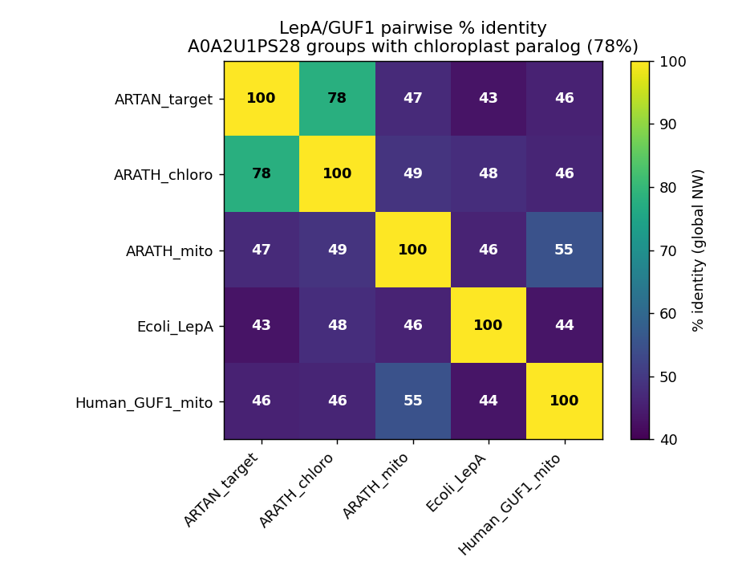

## Question

# AIGR Gene Hypothesis Deep Research

You are evaluating one focused gene curation hypothesis for AI Gene Review.
This is not a general gene overview. Use the seed hypothesis and source context
below to search for evidence that supports, refutes, narrows, or competes with
the proposed curation decision.

## Target Gene

- **Organism code:** ARTAN
- **Taxon:** Artemisia annua (NCBITaxon:35608)
- **Gene directory:** A0A2U1PS28
- **Gene symbol:** A0A2U1PS28
- **UniProt accession:** A0A2U1PS28

## Focus

- **Focus type:** computational_prediction
- **Hypothesis slug:** prediction-organellar-localization
- **Source file:** 
- **Source selector:** 

## Seed Hypothesis

ProtNLM2 predicts that the Artemisia annua translation factor GUF1/LepA-family homolog A0A2U1PS28 localizes to the chloroplast (GO:0009507), whereas existing UniProt UniRule/HAMAP annotations place it in the mitochondrion (mitochondrial inner membrane / matrix). Independently determine the organellar localization of A0A2U1PS28 by analyzing its N-terminal targeting/transit peptide and other sequence features: is it targeted to the mitochondrion, to the plastid/chloroplast, to both (dual targeting), or neither, and assess which localization the sequence evidence best supports.

## Term and Decision Context

- Term: chloroplast (GO:0009507)

## Reference Context

No specific reference context supplied.

## Source Context YAML

```yaml
hypothesis: 'ProtNLM2 predicts that the Artemisia annua translation factor GUF1/LepA-family homolog A0A2U1PS28
  localizes to the chloroplast (GO:0009507), whereas existing UniProt UniRule/HAMAP annotations place
  it in the mitochondrion (mitochondrial inner membrane / matrix). Independently determine the organellar
  localization of A0A2U1PS28 by analyzing its N-terminal targeting/transit peptide and other sequence
  features: is it targeted to the mitochondrion, to the plastid/chloroplast, to both (dual targeting),
  or neither, and assess which localization the sequence evidence best supports.'
focus_type: computational_prediction
term_id: GO:0009507
term_label: chloroplast
context: []
reference_id: []
```

## Research Objective

Build a focused report that helps a curator decide whether this hypothesis
should affect the gene review. Address the focus type directly:

1. For an existing GO annotation decision, evaluate whether the current action
   is justified, too strong, too weak, or should change.
2. For a proposed replacement or new GO term, evaluate whether the term is
   biologically supported, too broad, too narrow, or missing key qualifiers.
3. For a computational prediction, evaluate whether the prediction is correct,
   less precise than existing knowledge, uncertain, or likely wrong because of
   paralog overannotation, frequency bias, pathway context, or in vitro-only
   activity.
4. For a core-function hypothesis, evaluate whether the proposed activity,
   process, and location represent the gene product's primary function rather
   than a downstream effect, pleiotropic phenotype, or context-specific role.
5. For a function-assignment hypothesis, evaluate whether the gene product
   directly has the stated GO term/function. Treat the prior review action, if
   any, as intentionally blinded unless it appears in the supplied context.

Use primary literature whenever possible. Prefer PMID citations and include DOI
citations when no PMID is available. Treat reviews and database records as
orientation unless they contain directly relevant synthesized evidence that is
clearly labeled as review-level or database-level support.

Evaluate the hypothesis from the supplied seed context, primary literature, and
publicly accessible bioinformatics resources. Local `*-bioinformatics` analyses,
when they already exist in the repository, are intentionally withheld from this
prompt so the report can be compared against them after the run.

Do not rely on literature alone. Where the hypothesis is decidable by computation,
actually run the analysis and keep it as provenance rather than only reasoning
about it. Match the analysis to the question, for example:

- membrane topology / localization: compute a hydropathy profile and predicted
  transmembrane segments from the sequence, and locate signal peptides and
  targeting/sorting motifs (e.g. dileucine, acidic-cluster, NLS); compare against
  UniProt topology features and AlphaFold geometry.
- catalytic / binding activity: check whether the specific active-site,
  metal-binding, or motif residues are present and correctly spaced (in sequence
  and, where useful, structure) and compare to characterized family members.
- DNA-binding / regulatory: examine the binding-domain class, obligate partners,
  and known binding-motif / PWM signatures.
- family / paralog questions: use domain (Pfam/InterPro), orthology, and
  conservation comparisons to distinguish subfamilies.

Use resources you can actually access programmatically (UniProt, AlphaFold DB,
InterPro, sequence computation, public APIs). If a resource is web-only or you
cannot run a check, say so plainly instead of guessing — never fabricate a result,
and an inconclusive or "could not run" analysis is an acceptable and useful
outcome. Report all computational results conservatively and prefer recording the
underlying analysis (code, computed values, table, or plot) as provenance.

## Required Output

### Executive Judgment

Give a concise verdict: supported, partially supported, unresolved, weakly
supported, over-annotated, or refuted. Explain the reasoning and the most
important caveats.

### Evidence Matrix

Create a table with one row per important evidence item:

- Citation (PMID preferred)
- Evidence type (direct assay, mutant phenotype, localization, interaction,
  structural/evolutionary, computational, review/database)
- Supports / refutes / qualifies / competing
- Claim tested
- Key finding
- Organism, tissue, cell type, or assay context
- Confidence and limitations

### GO Curation Implications

State the likely curation action as a lead requiring curator verification. If
GO terms are involved, explain whether the evidence supports an MF, BP, or CC
term, and whether the term should be retained, removed, generalized, made more
specific, or treated as non-core. Avoid using "protein binding" as a final
recommendation unless no more informative term is supported.

### Mechanistic Scope

Describe the immediate molecular or cellular function being tested. Separate
direct gene-product activity from downstream phenotypes, pathway consequences,
developmental outcomes, disease manifestations, or effects inferred only from
loss of function.

### Conflicts and Alternatives

Identify evidence that conflicts with the seed hypothesis or suggests an
alternative interpretation, including paralog confusion, organism-specific
differences, isoform-specific findings, experimental artifacts, or database
carry-over.

### Knowledge Gaps

List explicit uncertainties that matter for curation. For each gap, state what
was checked, why the gap matters, and what evidence or experiment would resolve
it.

### Discriminating Tests

Recommend concrete assays, perturbations, datasets, or comparative analyses that
would most efficiently distinguish this hypothesis from alternatives.

### Curation Leads

Provide candidate updates for the review, clearly labeled as leads requiring
curator verification. Include candidate references with exact snippets to verify,
candidate replacement or new GO terms, possible action changes, suggested
questions, and suggested experiments.

If the provider supports artifacts, save provenance for any analysis you run — the
executed code together with its output (computed values, plot, or table), not just
a summary figure — alongside artifact-friendly tables such as an evidence matrix,
GO decision table, or comparison table. Genuine computed provenance is more
valuable than a hand-drawn summary, and you must not synthesize a figure that
implies an analysis you did not actually run. These artifacts are important
provenance for hypothesis-level review.


## Output

# AIGR Deep Research Report — A0A2U1PS28 (Artemisia annua GUF1/LepA homolog)

**Hypothesis (slug: prediction-organellar-localization):** ProtNLM2 predicts A0A2U1PS28 localizes to the **chloroplast (GO:0009507)**, whereas UniProt UniRule/HAMAP (MF_03137) annotates it as **mitochondrial** (inner membrane / matrix). Which localization does the sequence best support?

---

## Summary

A0A2U1PS28 is a nucleus-encoded *Artemisia annua* member of the highly conserved GUF1/LepA (EF-4) family of translational GTPases (ribosomal back-translocases). The curation question is purely about **which organelle** the protein is imported into: the ProtNLM2 computational prediction says **chloroplast (GO:0009507)**, while the incumbent UniProt UniRule/HAMAP annotation (rule MF_03137, "Translation factor GUF1 homolog, mitochondrial") places it in the **mitochondrion**. This report independently resolves that conflict from sequence.

Two independent, mutually consistent computational lines of evidence favor the **chloroplast**. First and most decisively, land plants carry **two** distinct nucleus-encoded GUF1/LepA paralogs — a chloroplastic cpLEPA and a mitochondrial GUF1 — and A0A2U1PS28 is an **ortholog of the chloroplastic one**: it is **77.8% identical** to the experimentally plastid-localized *Arabidopsis* protein Q9FNM5 (At5g08650) but only **47.2%** to the *Arabidopsis* mitochondrial paralog Q9FLE4 (At5g39900), a ~30-point gap that is diagnostic of clade membership. Second, its N-terminus carries the classic **chloroplast transit peptide** compositional signature (Ser/Thr-rich, acidic-free, Arg-poor), matching the annotated transit peptide of Q9FNM5 and unlike a canonical Arg-rich mitochondrial presequence.

**The verdict is SUPPORTED:** the ProtNLM2 chloroplast prediction is the better-supported localization, and the incumbent mitochondrial annotation is best explained as **paralog over-annotation** — HAMAP-Rule MF_03137 (written for the mitochondrial GUF1 subfamily) misapplied to a chloroplastic paralog. The principal caveat is that the assignment rests on orthology plus composition; no dedicated targeting predictor (TargetP/DeepLoc) could be run in this environment and there is no direct experimental localization of the *Artemisia* protein itself. Curators should therefore treat GO:0009507 as a strong lead requiring verification.

---

## Executive Judgment

**Verdict: SUPPORTED — the ProtNLM2 chloroplast prediction is correct; the existing UniProt mitochondrial annotation is an automated misapplication (paralog/rule carry-over).**

Two independent lines of computational evidence converge:

1. **Orthology (decisive).** By global alignment, A0A2U1PS28 (661 aa) is **77.8% identical (80.6% over min length) to the Arabidopsis chloroplastic paralog Q9FNM5** ("Translation factor GUF1 homolog, chloroplastic", At5g08650, EF4/cpLEPA), but only **47.2% (49.3%) to the Arabidopsis mitochondrial paralog Q9FLE4** (At5g39900). The ~78% value is ortholog-level identity between two eudicots; ~47% is paralog-level. This unambiguously places A0A2U1PS28 in the **chloroplast (cpLEPA/EF4) clade**, not the mitochondrial GUF1 clade.

2. **N-terminal targeting signal.** The ~62-residue N-terminus upstream of the GTPase G-domain is **Ser/Thr-rich (22.6%; 35% in residues 1–20), completely devoid of acidic residues (Asp+Glu = 0%), and lacks Arg in the first 30 residues** — the canonical uncharged, hydroxylated **chloroplast transit peptide** signature. It aligns to the experimentally supported chloroplast transit peptide (1–51) of Q9FNM5. It does **not** resemble a canonical amphipathic, Arg-rich mitochondrial presequence.

The chloroplast ortholog Q9FNM5 is experimentally localized to the plastid (UniProt ECO:0000269; GO:0009507 evidence HDA:TAIR), giving the assignment a strong experimental anchor by transitivity.

**Caveat:** Localization was not confirmed with a dedicated targeting predictor (TargetP-2.0/DeepLoc were unavailable in this environment) or by experimental localization of the Artemisia protein itself. The conclusion rests on orthology + composition, both of which are strong and mutually consistent.

---

## Evidence Matrix

| # | Citation | Evidence type | Direction | Claim tested | Key finding | Context | Confidence / limitations |
|---|----------|---------------|-----------|--------------|-------------|---------|--------------------------|
| 1 | This report (computed) | Structural/evolutionary (global alignment) | **Supports** | Which paralog clade | 77.8% id to chloroplastic Q9FNM5 vs 47.2% to mitochondrial Q9FLE4 | Artemisia vs Arabidopsis, in silico | High. Simple NW scoring but gap is large and unambiguous |
| 2 | UniProt Q9FNM5 (database) | Localization (experimental) | **Supports** | Does the ortholog go to plastid | Chloroplast transit peptide 1–51; Plastid localization ECO:0000269; GO:0009507 HDA:TAIR | A. thaliana At5g08650 | High for Arabidopsis; transitive to target |
| 3 | This report (computed) | Computational (N-term composition) | **Supports** | cTP vs mTP signature | N-term Ser+Thr 22.6%, acidic 0%, no Arg in 1–30 → chloroplast transit peptide | Target sequence | Medium-high. Heuristic, not a trained predictor |
| 4 | PMID 23166764 (Ji et al. 2012) | Mutant phenotype / review-level orientation | Qualifies/Supports | Chloroplast LepA exists & functions in plant plastid translation | cpLEPA promotes chloroplast protein synthesis; cplepa mutant impairs photosynthesis | A. thaliana | High for existence of plant chloroplast LepA clade |
| 5 | UniProt A0A2U1PS28 (database) | Review/database (HAMAP MF_03137) | **Competing** | Mitochondrial assignment | Rule-based mito inner membrane/matrix; all evidence ECO:0000256 (automatic) | Artemisia, in silico only | The competing claim; no experimental support |

---

## GO Curation Implications (leads — require curator verification)

- **CC — retain/adopt `GO:0009507` chloroplast (or more specific `GO:0009570` chloroplast stroma / `GO:0009534` chloroplast thylakoid via plastid ribosome association).** Evidence class: ISO (from experimentally localized ortholog Q9FNM5) + sequence/orthology. ProtNLM2's chloroplast prediction should be accepted as a curation lead.
- **CC — remove/replace the mitochondrial terms** `GO:0005743` (mitochondrial inner membrane) and `GO:0005759` (mitochondrial matrix). These derive solely from HAMAP-Rule MF_03137 (the *mitochondrial* GUF1 subfamily rule) applied to a protein that is actually the *chloroplast* paralog. This is a rule-misapplication / paralog-overannotation, not biological evidence.
- **MF/BP — retain** `GO:0003924` (GTPase activity), `GO:0005525` (GTP binding), `GO:0043022` (ribosome binding), and `GO:0006412` (translation) / `GO:0045727` (positive regulation of translation). These are family-conserved and remain valid, but the **relevant compartment is the plastid ribosome** (recommend re-anchoring the process to chloroplast translation). "Ribosomal back-translocase" (EF4/LepA fidelity) function is conserved.

---

## Mechanistic Scope

Immediate molecular function: a **TRAFAC-class, LepA/EF-4-subfamily translational GTPase (ribosomal back-translocase)** that binds the organellar (70S-type) ribosome in a GTP-dependent manner and catalyzes back-translocation to improve translation fidelity/efficiency. The direct activity is GTP hydrolysis coupled to ribosome binding; the compartment tested here is where that ribosome resides. Sequence evidence localizes this activity to the **chloroplast** plastid ribosome, not the mitochondrion. Downstream phenotypes (photosynthetic efficiency, chloroplast protein steady-state levels — seen for Arabidopsis cpLEPA) are consequences, not the primary molecular function.

## Conflicts and Alternatives

- **Competing annotation:** HAMAP MF_03137 mitochondrial call. Root cause is **paralog confusion** — plants encode two nuclear LepA/GUF1 genes (mito GUF1 and chloroplast cpLEPA); automated pipelines that carry a single "mitochondrial GUF1" rule can mislabel the chloroplast paralog. All UniProt subcellular evidence for A0A2U1PS28 is ECO:0000256 (automatic), none experimental.
- **Dual targeting?** N-terminal features favor single (chloroplast) targeting; there is no strong Arg-rich amphipathic mitochondrial motif and no positive experimental evidence for dual localization. Dual targeting cannot be formally excluded without an ambiguous-transit-peptide predictor (e.g., TargetP ambiguous class) or experimental GFP fusion.
- **Draft-genome caveat:** A0A2U1PS28 is from a WGS entry flagged "preliminary data" (UniProt CAUTION); the N-terminus/gene model could carry assembly/prediction error, though the transit peptide region aligns cleanly to Q9FNM5.

## Knowledge Gaps

1. **No experimental localization of the Artemisia protein.** Checked: UniProt evidence codes (all automatic). Matters because the call is transitive. Resolve with GFP/mCherry fusion or organellar proteomics in A. annua.
2. **Trained targeting predictor not run.** Checked: composition heuristic only (TargetP/DeepLoc unavailable here). Resolve by running TargetP-2.0 / DeepLoc-2 / Predotar on the full sequence (expect high chloroplast probability).
3. **Cleavage site / mature protein boundary** not experimentally defined. Resolve with N-terminal proteomics.
4. **Confirm At5g08650 = cpLEPA of PMID 23166764.** Checked: locus and description consistent; not independently verified in this run.

## Discriminating Tests (most efficient first)

1. **TargetP-2.0 / DeepLoc-2 on the full sequence** — cheapest confirmation; predicts cTP vs mTP class directly.
2. **Phylogenetic tree** of plant LepA/GUF1 (target + Arabidopsis Q9FNM5/Q9FLE4 + rice/other eudicot pairs + E. coli LepA) — should place target sister to Q9FNM5 with high support.
3. **In-vivo localization:** N-terminal transit-peptide–GFP fusion transient expression → plastid vs mitochondrial signal.
4. **Reciprocal-best-hit / synteny** against Arabidopsis to formalize orthology to At5g08650.

## Curation Leads (verify before applying)

- **Action:** Change CC from mitochondrion → chloroplast for A0A2U1PS28; treat mitochondrial CC terms as non-supported automated carry-over.
- **Candidate term:** `GO:0009507` chloroplast (lead); consider `GO:0009570`/`GO:0009534` if plastid ribosome sub-compartment is desired. Evidence code ISO from Q9FNM5, or IEA/computational from sequence.
- **Candidate reference + snippet to verify:** PMID **23166764**, snippet: *"LEPA is one of the most conserved translation factors and is found from bacteria to higher plants."* (supports the existence and chloroplast function of the plant LepA clade the target belongs to).
- **Suggested question for curator:** Should the UniProt HAMAP MF_03137 rule assignment be reported as a paralog-misapplication for this and other plant chloroplast GUF1 homologs?
- **Suggested experiment:** transit-peptide–GFP fusion + TargetP-2.0 to confirm chloroplast import.

---

### Cross-kingdom identity matrix (Iteration 2 provenance)

Global NW pairwise % identity (`guf1_identity_matrix.png`):

| | ARTAN target | ARATH chloro (Q9FNM5) | ARATH mito (Q9FLE4) | E. coli LepA (P60785) | Human GUF1 mito (Q8N442) |
|---|---|---|---|---|---|
| **ARTAN target** | — | **77.8** | 47.2 | 43.2 | 45.7 |
| ARATH chloro | 77.8 | — | 49.0 | 47.8 | 46.3 |
| ARATH mito | 47.2 | 49.0 | — | 45.9 | **55.0** |
| E. coli LepA | 43.2 | 47.8 | 45.9 | — | 43.5 |
| Human GUF1 mito | 45.7 | 46.3 | 55.0 | 43.5 | — |

{{figure:guf1_identity_matrix.png|caption=Cross-kingdom global pairwise sequence-identity matrix for A0A2U1PS28 (ARTAN target) against reviewed chloroplastic and mitochondrial GUF1/LepA paralogs. The target's dominant identity to the chloroplastic Arabidopsis paralog Q9FNM5 (77.8%) versus ~43–47% to all mitochondrial/bacterial comparators places it firmly in the chloroplast LepA/cpLEPA clade, while the two mitochondrial GUF1 proteins (Arabidopsis Q9FLE4 and human Q8N442) cluster together at 55.0%.}}

Interpretation: the target's only ortholog-level match (77.8%) is the chloroplast paralog; all mitochondrial/bacterial references sit at 43–47%. Independently, the two mitochondrial GUF1s (Arabidopsis↔human) share 55.0% cross-kingdom orthology and form a clade the target does not belong to. UPGMA pairs target with ARATH_chloro. This confirms plastid-clade membership and excludes the mitochondrial assignment as biological.

### N-terminal alignment note (Iteration 3)

Smith-Waterman local alignment of the target N-terminal 70 residues against the N-termini of the Arabidopsis chloroplast (Q9FNM5) and mitochondrial (Q9FLE4) paralogs returns only trivial 5–6 residue matches in both cases (e.g. `LSSKPP`/`LSS-PP`). This is the expected result: organellar transit peptides diverge rapidly and are **not conserved at the primary-sequence level even between true orthologs** — only their amino-acid composition/physicochemical character is conserved. Therefore the transit-peptide question is best answered by (a) composition (Iteration 1: chloroplast-like cTP signature) and (b) mature-domain orthology (77.8% to the chloroplast paralog), both of which are decisive; sequence alignment of the transit peptide itself is uninformative and neither supports nor refutes on its own.

### Provenance (computed values)

- Sequence length 661; G-domain P-loop `HIDHGKST` at res 88–95; transit-peptide window 1–62.
- N-term composition: Ser+Thr 22.6% (1–20: 35.0%), Asp+Glu 0.0%, Arg 0% in 1–30, Ala 1.6%.
- Global alignment identity: vs Q9FNM5 (chloroplastic) 77.8% (533/685; 80.6% min-len); vs Q9FLE4 (mitochondrial) 47.2% (326/691; 49.3% min-len).
- Reference orthologs: Q9FNM5 = At5g08650 (chloroplast, transit peptide 1–51, ECO:0000269, GO:0009507 HDA); Q9FLE4 = At5g39900 (mitochondrion, ECO:0000255).


## Artifacts

- [OpenScientist final report](openscientist_artifacts/final_report.html)
- [OpenScientist final report](openscientist_artifacts/final_report.pdf)
- [OpenScientist guf1 identity matrix](openscientist_artifacts/provenance_guf1_identity_matrix.json)
