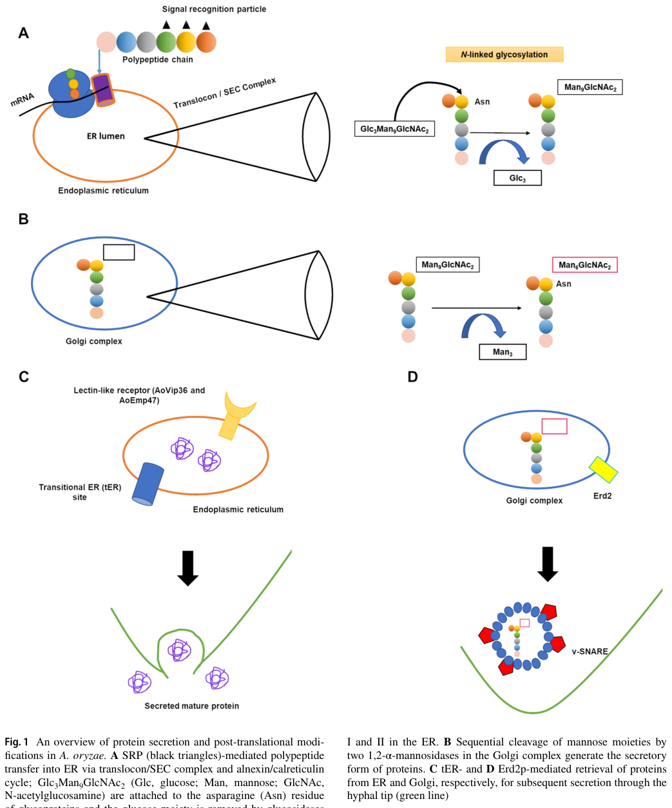

## Question

# Gene Research for Functional Annotation

## ⚠️ CRITICAL: Gene/Protein Identification Context

**BEFORE YOU BEGIN RESEARCH:** You MUST verify you are researching the CORRECT gene/protein. Gene symbols can be ambiguous, especially for less well-characterized genes from non-model organisms.

### Target Gene/Protein Identity (from UniProt):
- **UniProt Accession:** Q00216
- **Protein Description:** RecName: Full=Protein disulfide-isomerase tigA; EC=5.3.4.1; Flags: Precursor;
- **Gene Information:** Name=tigA;
- **Organism (full):** Aspergillus niger.
- **Protein Family:** Belongs to the protein disulfide isomerase family.
- **Key Domains:** ERp29_C. (IPR011679); ERp29_C_sf. (IPR036356); PDI. (IPR051063); PDI_thioredoxin-like_dom. (IPR005788); Thioredoxin-like_sf. (IPR036249)

### MANDATORY VERIFICATION STEPS:

1. **Check if the gene symbol "tigA" matches the protein description above**
2. **Verify the organism is correct:** Aspergillus niger.
3. **Check if protein family/domains align with what you find in literature**
4. **If you find literature for a DIFFERENT gene with the same or similar symbol, STOP**

### If Gene Symbol is Ambiguous or You Cannot Find Relevant Literature:

**DO NOT PROCEED WITH RESEARCH ON A DIFFERENT GENE.** Instead:
- State clearly: "The gene symbol 'tigA' is ambiguous or literature is limited for this specific protein"
- Explain what you found (e.g., "Found extensive literature on a different gene with the same symbol in a different organism")
- Describe the protein based ONLY on the UniProt information provided above
- Suggest that the protein function can be inferred from domain/family information

### Research Target:

Please provide a comprehensive research report on the gene **tigA** (gene ID: tigA, UniProt: Q00216) in ASPNG.

The research report should be a detailed narrative explaining the function, biological processes, and localization of the gene product. Citations should be given for all claims.

You should prioritize authoritative reviews and primary scientific literature when conducting research. You can supplement
this with annotations you find in gene/protein databases, but these can be outdated or inaccurate.

We are specifically interested in the primary function of the gene - for enzymes, what reaction is catalyzed, and what is the substrate specificity? For transporters, what is the substrate? For structural proteins or adapters, what is the broader structural role? For signaling molecules, what is the role in the pathway.

We are interested in where in or outside the cell the gene product carries out its function.

We are also interested in the signaling or biochemical pathways in which the gene functions. We are less interested in broad pleiotropic effects, except where these elucidate the precise role.

Include evidence where possible. We are interested in both experimental evidence as well as inference from structure, evolution, or bioinformatic analysis. Precise studies should be prioritized over high-throughput, where available.

## Output

Question: You are an expert researcher providing comprehensive, well-cited information.

Provide detailed information focusing on:
1. Key concepts and definitions with current understanding
2. Recent developments and latest research (prioritize 2023-2024 sources)
3. Current applications and real-world implementations
4. Expert opinions and analysis from authoritative sources
5. Relevant statistics and data from recent studies

Format as a comprehensive research report with proper citations. Include URLs and publication dates where available.
Always prioritize recent, authoritative sources and provide specific citations for all major claims.

# Gene Research for Functional Annotation

## ⚠️ CRITICAL: Gene/Protein Identification Context

**BEFORE YOU BEGIN RESEARCH:** You MUST verify you are researching the CORRECT gene/protein. Gene symbols can be ambiguous, especially for less well-characterized genes from non-model organisms.

### Target Gene/Protein Identity (from UniProt):
- **UniProt Accession:** Q00216
- **Protein Description:** RecName: Full=Protein disulfide-isomerase tigA; EC=5.3.4.1; Flags: Precursor;
- **Gene Information:** Name=tigA;
- **Organism (full):** Aspergillus niger.
- **Protein Family:** Belongs to the protein disulfide isomerase family.
- **Key Domains:** ERp29_C. (IPR011679); ERp29_C_sf. (IPR036356); PDI. (IPR051063); PDI_thioredoxin-like_dom. (IPR005788); Thioredoxin-like_sf. (IPR036249)

### MANDATORY VERIFICATION STEPS:

1. **Check if the gene symbol "tigA" matches the protein description above**
2. **Verify the organism is correct:** Aspergillus niger.
3. **Check if protein family/domains align with what you find in literature**
4. **If you find literature for a DIFFERENT gene with the same or similar symbol, STOP**

### If Gene Symbol is Ambiguous or You Cannot Find Relevant Literature:

**DO NOT PROCEED WITH RESEARCH ON A DIFFERENT GENE.** Instead:
- State clearly: "The gene symbol 'tigA' is ambiguous or literature is limited for this specific protein"
- Explain what you found (e.g., "Found extensive literature on a different gene with the same symbol in a different organism")
- Describe the protein based ONLY on the UniProt information provided above
- Suggest that the protein function can be inferred from domain/family information

### Research Target:

Please provide a comprehensive research report on the gene **tigA** (gene ID: tigA, UniProt: Q00216) in ASPNG.

The research report should be a detailed narrative explaining the function, biological processes, and localization of the gene product. Citations should be given for all claims.

You should prioritize authoritative reviews and primary scientific literature when conducting research. You can supplement
this with annotations you find in gene/protein databases, but these can be outdated or inaccurate.

We are specifically interested in the primary function of the gene - for enzymes, what reaction is catalyzed, and what is the substrate specificity? For transporters, what is the substrate? For structural proteins or adapters, what is the broader structural role? For signaling molecules, what is the role in the pathway.

We are interested in where in or outside the cell the gene product carries out its function.

We are also interested in the signaling or biochemical pathways in which the gene functions. We are less interested in broad pleiotropic effects, except where these elucidate the precise role.

Include evidence where possible. We are interested in both experimental evidence as well as inference from structure, evolution, or bioinformatic analysis. Precise studies should be prioritized over high-throughput, where available.

# Research Report: Functional Annotation of **tigA** (UniProt **Q00216**) in *Aspergillus niger*

**Target verification (mandatory):** The gene symbol **tigA** in *Aspergillus niger* refers to **tunicamycin‑inducible gene A**, encoding a **protein disulfide‑isomerase (PDI) family** member (often written **TIGA** or ERp38-like). Primary literature confirms an N‑terminal signal peptide, **two CGHC active sites**, and a C‑terminal **KDEL** ER-retention motif, aligning with the UniProt target description and PDI-family membership. (jeenes1997isolationandcharacterisation pages 2-4)

**UniProt entry URL (provided context):** https://www.uniprot.org/uniprotkb/Q00216

---

## 1) Key concepts and definitions (current understanding)

### 1.1 Protein disulfide isomerases (PDIs) and oxidative folding in the ER
Protein disulfide isomerases are thioredoxin-superfamily enzymes that catalyze **thiol–disulfide exchange reactions**, enabling **formation, reduction, and isomerization** of disulfide bonds during folding of secreted and membrane proteins in the **endoplasmic reticulum (ER)**. In eukaryotes, these PDI-catalyzed reactions occur in the ER in cooperation with sulfhydryl oxidases such as **Ero1** and small-molecule redox buffers such as **glutathione (GSH/GSSG)**. (palma2024komagataellaphaffiierp41 pages 1-2)

### 1.2 ER stress, unfolded protein response (UPR), and secretion stress in filamentous fungi
When protein folding demand exceeds ER capacity, **misfolded/unfolded proteins accumulate**, triggering **ER stress** and adaptive programs such as the UPR and related secretion stress responses. Filamentous fungi (including industrial *Aspergillus* spp.) couple ER folding capacity to high-level secretion, and ER folding factors (e.g., BiP and PDI-family enzymes) are routinely induced or engineered in protein-production strains. (jadhav2024proteinsecretionand pages 4-6, ngiam2000characterizationofa pages 3-4)

### 1.3 Where TigA fits
**TigA/TIGA** is a PDI-family enzyme most consistently interpreted as an **ER-lumenal foldase/oxidoreductase** that is **stress inducible** and can contribute to the folding/quality control of secretory proteins. (jeenes1997isolationandcharacterisation pages 2-4, ngiam2000characterizationofa pages 3-4)

---

## 2) Gene/protein features of *A. niger* TigA (molecular definition)

### 2.1 Gene and transcript features
Jeenes et al. characterized **tigA** as a **single-copy** gene with an mRNA of ~**1.35 kb**. (jeenes1997isolationandcharacterisation pages 2-4, jeenes1997isolationandcharacterisation pages 1-2)

### 2.2 Protein architecture, motifs, and localization signals
Experimental sequence analysis showed TigA is synthesized as a **359 aa** precursor (~**38.7 kDa**) with a predicted ER translocation signal peptide cleaved between **aa 19–20**, producing a **340 aa** mature protein. (jeenes1997isolationandcharacterisation pages 2-4)

Key functional motifs/localization signals:
- Two PDI-family active sites: **–CGHC–** at **aa 49–52** and **aa 169–172**. (jeenes1997isolationandcharacterisation pages 2-4)
- C-terminal ER retrieval/retention signal: **–KDEL**, supporting **ER-lumen localization**. (jeenes1997isolationandcharacterisation pages 2-4)

### 2.3 Domain organization and implications
TigA is not a canonical “four-domain” PDI; rather, it contains **two thioredoxin-like domains (a0 and a)** and a **helical ERp29c-like domain**, and lacks the redox-inactive peptide-binding b/b′ domains characteristic of typical PDIs. This structural difference is used to explain functional specialization and reduced activity relative to canonical PDI. (liang2005functionalanalysisof pages 1-2, liang2005functionalanalysisof pages 3-4)

A complementary 2024 mechanistic study of a fungal ERp38/TigA-type protein (Komagataella **Erp41**) describes the same overall architecture—**two thioredoxin-like domains followed by an alpha-helical ERp29_C domain**—supporting the interpretation that TigA-like enzymes are specialized ER oxidoreductases within the PDI family. (palma2024komagataellaphaffiierp41 pages 1-2)

---

## 3) Biochemical function: enzymatic activity, substrate specificity, and mechanism

### 3.1 Enzymatic activity (EC 5.3.4.1 context)
In vitro, *A. niger* TIGA catalyzed refolding of **reduced/denatured RNase A** in the presence of a glutathione redox buffer, demonstrating **disulfide isomerase/foldase** activity. (liang2005functionalanalysisof pages 2-3)

**Relative activity:** Under the reported conditions, TIGA was **~10% as active as human PDI** in the RNase refolding assay. (liang2005functionalanalysisof pages 2-3)

### 3.2 Active-site requirements and “which cysteines matter” (mutational evidence)
Thioredoxin-motif mutagenesis demonstrated:
- Complete replacement of all active-site cysteines (**NSSCSS**) eliminated activity (**0%**). (liang2005functionalanalysisof pages 2-3)
- Keeping only the N-terminal CGHC motif intact (**NCCCSS**) retained **62.6%** activity; keeping only the C-terminal motif intact (**NSSCCC**) retained **48.3%** activity, supporting that both active sites contribute but the **N-terminal motif is more active**. (liang2005functionalanalysisof pages 2-3)
- Mutating the **first cysteine** in each motif abolished activity (**NSCCSC = 0%**), indicating the **N-terminal cysteine of each CXXC** is essential for catalysis. (liang2005functionalanalysisof pages 2-3)

### 3.3 Chaperone activity and substrate specificity
TIGA also exhibited **chaperone-like assistance** during refolding, with **substrate selectivity**:
- For **prochymosin** (contains 3 disulfide bonds), TIGA increased refolding yield from **2% to ~13%** at a **1:10** TIGA:prochymosin molar ratio. Notably, the catalytically inactive mutant **NSSCSS** still improved yield (to **4%** at 1:10 and **~17%** at equimolar), supporting a **trx-independent chaperone component**. (liang2005functionalanalysisof pages 2-3)
- For **GAPDH** (no disulfide bonds), TIGA did **not** improve refolding or suppress aggregation (whereas canonical PDI did), reinforcing functional specificity and implying TigA lacks canonical PDI’s broader substrate-binding capacity. (liang2005functionalanalysisof pages 3-4)

### 3.4 Expert interpretation from the gene discovery work
Jeenes et al. suggested (from sequence/architecture) that TigA’s active sites and lack of an acidic peptide-binding region imply a **strongly oxidizing oxidoreductase** with **lower isomerase capacity** than typical PDI—consistent with later direct assays showing reduced RNase-refolding activity vs human PDI. (jeenes1997isolationandcharacterisation pages 4-5, liang2005functionalanalysisof pages 2-3)

---

## 4) Cellular localization and pathway context

### 4.1 ER localization
A signal peptide plus C-terminal **KDEL** strongly supports that TigA is **ER lumenal** and functions in the **early secretory pathway**. (jeenes1997isolationandcharacterisation pages 2-4)

Jeenes et al. further noted that *A. niger* uses **HDEL** for PDIA, and ligand affinity differences between HDEL and KDEL for the same receptor suggest TigA and PDIA could occupy **different functional subregions** along the ER-to-cis-Golgi axis. (jeenes1997isolationandcharacterisation pages 2-4)

### 4.2 Visual context: secretory pathway diagram (2024 review)
A 2024 review figure summarizes secretion from **ER → Golgi → hyphal tip**, including ER entry via SRP/translocon and glycosylation/processing steps before secretion. TigA’s ER-lumen foldase activity is positioned at the earliest folding/maturation stage in this pathway. (jadhav2024proteinsecretionand media f1bc44a5)

---

## 5) Regulation: ER stress/UPR responsiveness and secretion load

### 5.1 Tunicamycin induction (tigA’s defining phenotype)
Original characterization showed tigA is **tunicamycin-inducible**, with ~**2–3×** mRNA induction after a **~3 h lag**, consistent with induction downstream of unfolding stress caused by inhibited N-glycosylation. (jeenes1997isolationandcharacterisation pages 4-5, jeenes1997isolationandcharacterisation pages 1-2)

### 5.2 Induction by ER perturbants: DTT and Ca2+ ionophore
Ngiam et al. quantified induction in *A. niger* AB4.1:
- **20 mM DTT**: tigA mRNA increased **~4× at 40 min** and **~8× at 2 h**. (ngiam2000characterizationofa pages 3-4)
- **A23187 (Ca2+ ionophore)**: tigA mRNA increased **~3.5× after 1–2 h**. (ngiam2000characterizationofa pages 3-4)

Baseline relative abundance (same study): bipA transcripts were **3–4× higher** than pdiA, while tigA was **3–4× lower** than pdiA. (ngiam2000characterizationofa pages 3-4)

### 5.3 Induction during heterologous secretion stress
In strains overproducing hen egg white lysozyme (HEWL), transcripts of **pdiA, bipA, and tigA** were all elevated compared with parent strain, linking tigA expression to **secretory burden**. (ngiam2000characterizationofa pages 3-4)

### 5.4 Genome-scale context
A genome-wide secretion stress study grouped TigA with lumenal foldases (PdiA, TigA, PrpA) induced under secretion stress, while also noting stressor-specific differences (e.g., tigA not induced in one DTT condition in that dataset). (guillemette2007genomicanalysisof pages 10-12)

---

## 6) Recent developments (prioritizing 2023–2024)

### 6.1 2024 mechanistic advance: ERp38/TigA-type PDI-family enzymes and glutathione coupling
A 2024 *Journal of Biological Chemistry* study (Palma et al., received **2024-01-02**, published in press **2024-02-13**) characterized a fungal ERp38/TigA-type PDI-family enzyme (**Erp41**) with mixed PDI- and glutaredoxin-like properties and unusually fast glutathione-coupled oxidation activity, reiterating how **active-site composition** and **GSH/GSSG coupling** can tune catalytic behavior in PDI-family proteins. This provides a modern biochemical framework for interpreting why TigA-family members may differ from canonical PDIs in activity and substrate selectivity. (palma2024komagataellaphaffiierp41 pages 1-2)

### 6.2 2024: secretion stress as an engineering target in industrial filamentous fungi
A 2024 review (Jadhav et al.; online **2023**, issue **Jan 2024**) synthesizes current understanding of filamentous-fungal secretion, ER stress, UPR, and how these constrain industrial protein production; it explicitly maps the secretion route and highlights the centrality of ER folding capacity. (jadhav2024proteinsecretionand pages 4-6, jadhav2024proteinsecretionand media f1bc44a5)

### 6.3 2024: redox/ROS engineering improves *A. niger* secretion output
A 2024 *A. niger* study directly linked ER oxidative folding enzymes (**PDI and ERO**) to ROS formation during disulfide bond formation, and showed that engineering antioxidant/redox systems can improve protein production. Specifically, **Glr1 overexpression** reduced intracellular ROS by **50%**, increased glucoamylase activity by **243%**, and increased total protein secretion by **88%**. This reinforces that ER oxidative folding (the biochemical niche of TigA) is tightly coupled to redox stress and is an actionable engineering lever. (chen2024enhancementofprotein pages 1-2)

### 6.4 2023: practical secretion engineering in *A. niger* continues to use ER folding helpers
A 2023 study on expressing the plant sweet protein **monellin** in *A. niger* (published **Apr 2023**) provides a concrete modern implementation of secretion engineering. It reports that *A. niger* can produce **25–30 g/L** glucoamylase (homologous protein) while heterologous proteins can be ~**70 mg/L**, and that heterologous non-fungal proteins are typically ~**three orders of magnitude** lower than fungal proteins. After multiple interventions, the study achieved **0.284 mg/L** monellin in shake flasks. The authors explicitly tested ER interventions including overexpression of ER chaperones/foldases (e.g., **OEpdiA** and **OEbipA**) and attenuation of ERAD (**ΔhrdC**) as part of the engineering strategy set, illustrating ongoing real-world use of ER folding factors (the same functional space as TigA) to address secretion bottlenecks. (li2023explorationofthe pages 1-2, li2023explorationofthe pages 2-4)

---

## 7) Current applications and real-world implementations

### 7.1 Industrial enzyme and protein production context
*Aspergillus niger* is a major industrial “cell factory” for secreted enzymes and food-grade proteins. Modern strain engineering repeatedly targets ER folding, stress responses (UPR/ERAD), and redox management—because oxidative folding is required for many secreted proteins and can become rate-limiting or stress-inducing. (jadhav2024proteinsecretionand pages 4-6, chen2024enhancementofprotein pages 1-2)

### 7.2 Where TigA is actionable
Direct evidence for industrial manipulations is stronger for **pdiA** than **tigA** in the retrieved corpus; however, tigA is clearly an **ER-stress responsive foldase/chaperone** whose expression rises with ER perturbation and heterologous secretion load, suggesting it is a plausible engineering target or biomarker for secretion stress. (ngiam2000characterizationofa pages 3-4)

### 7.3 Practical engineering adjacent to TigA’s pathway
Two contemporary implementations highlight how TigA-relevant biology is deployed:
1) **Redox/ROS engineering** to reduce oxidative-folding-associated stress while increasing secretion output (Glr1 overexpression improving secretion). (chen2024enhancementofprotein pages 1-2)
2) **ER folding and quality-control engineering** (UPR/ERAD/chaperones such as PDI and BiP) to increase yields of hard-to-express heterologous proteins in *A. niger*. (li2023explorationofthe pages 2-4)

---

## 8) Evidence-based functional annotation summary for tigA (Q00216)

### Primary molecular function
**Protein disulfide-isomerase / thiol–disulfide oxidoreductase** that catalyzes disulfide exchange reactions during oxidative folding of ER client proteins; demonstrated by RNase A refolding assay and dependence on CGHC motifs. (liang2005functionalanalysisof pages 2-3)

### Substrate specificity (current evidence)
- Enzymatic/isomerase activity demonstrated for reduced/denatured **RNase A**. (liang2005functionalanalysisof pages 2-3)
- Chaperone assistance demonstrated for disulfide-containing **prochymosin**, but not for non-disulfide **GAPDH**, implying selective substrate interaction and a narrower chaperone profile than canonical PDI. (liang2005functionalanalysisof pages 2-3, liang2005functionalanalysisof pages 3-4)

### Subcellular localization
**ER lumen**, supported by N-terminal signal peptide and C-terminal **KDEL** retention signal. (jeenes1997isolationandcharacterisation pages 2-4)

### Pathways/processes
- Part of the ER folding network active during **secretory protein maturation** (ER entry → folding/oxidative folding → Golgi processing → secretion). (jadhav2024proteinsecretionand media f1bc44a5)
- Transcriptionally responsive to **ER stress/UPR-related conditions**, including tunicamycin, DTT, Ca2+ perturbation, and secretion load from heterologous protein production. (ngiam2000characterizationofa pages 3-4)

---

## Evidence table

| Claim/Finding | Evidence type (biochemical/genetic/transcriptional/review) | Quantitative details | Source (first author year, journal) | URL/DOI |
|---|---|---|---|---|
| **Identity and architecture of A. niger tigA/TIGA (UniProt Q00216) match an ER PDI-family protein** | Genetic/sequence | ORF encodes **359 aa** precursor (~**38.7 kDa**), predicted signal peptide cleavage between **aa 19–20**, mature protein **340 aa**; two **CGHC** active-site motifs at **aa 49–52** and **169–172**; C-terminal **KDEL** ER-retention signal; transcript ~**1.35 kb**; single-copy gene (jeenes1997isolationandcharacterisation pages 2-4, jeenes1997isolationandcharacterisation pages 1-2) | Jeenes 1997, *Gene*; Liang 2005, *Biochemistry and Cell Biology* | https://doi.org/10.1016/S0378-1119(97)00098-X ; https://doi.org/10.1139/O05-117 |
| **Domain organization is atypical relative to canonical PDI** | Sequence/biochemical | TIGA contains two thioredoxin-like domains (**a0** and **a**) plus a helical **ERp29c-like D domain**; lacks the redox-inactive **b/b'** domains of canonical PDI and shares only ~**20% sequence identity** with PDI (liang2005functionalanalysisof pages 1-2, liang2005functionalanalysisof pages 3-4) | Liang 2005, *Biochemistry and Cell Biology* | https://doi.org/10.1139/O05-117 |
| **Localization is most consistent with the ER lumen / early secretory pathway** | Genetic/inferential | Evidence includes N-terminal signal peptide plus C-terminal **KDEL**; authors conclude TigA is likely ER-lumenal and may operate at different sites within the **ER-to-cis-Golgi** network than HDEL-bearing PDIA (jeenes1997isolationandcharacterisation pages 2-4) | Jeenes 1997, *Gene* | https://doi.org/10.1016/S0378-1119(97)00098-X |
| **TIGA is a bona fide disulfide isomerase/foldase** | Biochemical | Promotes refolding of reduced, denatured **RNase A** in glutathione redox buffer; activity is **~10% of human PDI** under assay conditions (liang2005functionalanalysisof pages 2-3, liang2005functionalanalysisof pages 1-2) | Liang 2005, *Biochemistry and Cell Biology* | https://doi.org/10.1139/O05-117 |
| **Catalysis depends on the two thioredoxin motifs, with unequal contributions** | Biochemical/mutagenesis | Wild type = **100%** activity; **NCCCSS** (only N-terminal motif intact) = **62.6%**; **NSSCCC** (only C-terminal motif intact) = **48.3%**; **NCSCCS** (second cysteines mutated) = **7.4%**; **NSSCSS** and **NSCCSC** = **0%**. Conclusion: N-terminal motif more active; the **first cysteine** in each motif is essential (liang2005functionalanalysisof pages 2-3, liang2005functionalanalysisof pages 1-2) | Liang 2005, *Biochemistry and Cell Biology* | https://doi.org/10.1139/O05-117 |
| **TIGA has chaperone activity, but it is substrate selective** | Biochemical | In prochymosin refolding, TIGA increased yield from **2% to ~13%** at **1:10 TIGA:prochymosin** molar ratio; inactive mutant **NSSCSS** still improved yield to **4%** at 1:10 and **~17%** at equimolar ratio, indicating a trx-independent chaperone component (liang2005functionalanalysisof pages 2-3) | Liang 2005, *Biochemistry and Cell Biology* | https://doi.org/10.1139/O05-117 |
| **Chaperone function is not universal across substrates** | Biochemical | TIGA promoted refolding of disulfide-containing **prochymosin** but did **not** improve reactivation or suppress aggregation of **GAPDH** (a non-disulfide substrate), unlike canonical PDI; this supports **substrate specificity** (liang2005functionalanalysisof pages 1-2, liang2005functionalanalysisof pages 3-4) | Liang 2005, *Biochemistry and Cell Biology* | https://doi.org/10.1139/O05-117 |
| **Early interpretation suggested stronger oxidoreductase/oxidase-like than high-isomerase behavior** | Sequence/inference | Jeenes et al. noted the active-site composition suggested a **strongly oxidizing oxidoreductase** and the lack of an acidic peptide-binding region argued against high isomerase activity, consistent with later biochemical observation that TigA is weaker than canonical PDI in RNase refolding (jeenes1997isolationandcharacterisation pages 4-5, jeenes1997isolationandcharacterisation pages 2-4) | Jeenes 1997, *Gene* | https://doi.org/10.1016/S0378-1119(97)00098-X |
| **tigA is ER-stress responsive to tunicamycin** | Transcriptional | **~2–3-fold** mRNA induction after a **~3 h lag** following tunicamycin treatment; promoter contains an **ERPTRE-like** element (~**70%** identity to mammalian ERp72 ERPTRE) and a **grp-core-like** element (~**75%** identity), supporting secretion-stress regulation (jeenes1997isolationandcharacterisation pages 4-5, jeenes1997isolationandcharacterisation pages 2-4, jeenes1997isolationandcharacterisation pages 1-2) | Jeenes 1997, *Gene* | https://doi.org/10.1016/S0378-1119(97)00098-X |
| **tigA is strongly induced by reductive ER stress (DTT)** | Transcriptional | In A. niger AB4.1, **20 mM DTT** increased tigA mRNA **~4-fold at 40 min** and **~8-fold at 2 h**; bipA induction was larger, and tigA transcript abundance was ~**3–4-fold lower** than pdiA at baseline (ngiam2000characterizationofa pages 3-4) | Ngiam 2000, *Applied and Environmental Microbiology* | https://doi.org/10.1128/AEM.66.2.775-782.2000 |
| **tigA responds to Ca2+-homeostasis perturbation (A23187)** | Transcriptional | A23187 caused tigA mRNA to increase **~3.5-fold after 1–2 h** in A. niger; pdiA response was weaker and bipA rose **~6.3-fold** before declining (ngiam2000characterizationofa pages 3-4) | Ngiam 2000, *Applied and Environmental Microbiology* | https://doi.org/10.1128/AEM.66.2.775-782.2000 |
| **tigA is linked to secretion stress and heterologous protein production** | Transcriptional/genetic | In HEWL-overproducing A. niger strains, mRNA levels of **tigA**, **pdiA**, and **bipA** were all higher than in parent strain AB4.1, connecting tigA to secretory load adaptation (ngiam2000characterizationofa pages 3-4) | Ngiam 2000, *Applied and Environmental Microbiology* | https://doi.org/10.1128/AEM.66.2.775-782.2000 |
| **Genome-scale secretion-stress profiling places tigA among induced ER foldases** | Transcriptomics | In A. niger secretion stress/UPR studies, TigA is grouped with lumenal foldases (**PdiA, TigA, PrpA**); all were generally up-regulated by secretion stressors except tigA was not induced in one **DTT** condition in the GeneChip dataset, underscoring stressor-specific regulation (guillemette2007genomicanalysisof pages 10-12) | Guillemette 2007, *BMC Genomics* | https://doi.org/10.1186/1471-2164-8-158 |
| **Role in the broader ER oxidative folding pathway is well supported by recent reviews** | Review | Recent fungal secretion reviews place PDI-family proteins in the ER folding network that converts nascent secretory proteins to native form before Golgi trafficking; Fig. 1 in the 2024 review summarizes the ER→Golgi secretory route in filamentous fungi (jadhav2024proteinsecretionand pages 4-6, jadhav2024proteinsecretionand media f1bc44a5) | Jadhav 2024, *Applied Microbiology and Biotechnology* | https://doi.org/10.1007/s00253-023-12985-4 |
| **Recent mechanistic work on fungal ERp38/ERp29-like proteins supports TigA-family functional interpretation** | Biochemical/comparative | A 2024 study on **Komagataella phaffii Erp41** describes an ER-resident fungal **ERp38/TigA-type** PDI-family protein with two thioredoxin-like domains plus an **ERp29_C** domain, reinforcing current understanding of TigA-like proteins as specialized ER oxidoreductases rather than canonical PDI equivalents (palma2024komagataellaphaffiierp41 pages 11-12, palma2024komagataellaphaffiierp41 pages 1-2) | Palma 2024, *Journal of Biological Chemistry* | https://doi.org/10.1016/j.jbc.2024.105746 |
| **Industrial relevance: ER folding/redox remains a bottleneck in A. niger protein production** | Review/engineering | A. niger is a major secretion host, but heterologous non-fungal proteins often yield **~three orders of magnitude** less than fungal proteins; one 2023 monellin study achieved only **0.284 mg/L** in shake flasks after multi-pronged engineering, illustrating persistent ER/secretion bottlenecks (li2023explorationofthe pages 1-2, li2023explorationofthe pages 2-4) | Li 2023, *Journal of Fungi* | https://doi.org/10.3390/jof9050528 |
| **Industrial relevance: helper folding pathways are directly engineered in A. niger** | Engineering | The monellin study explicitly tested overexpression of **pdiA** and **bipA**, ERAD attenuation (**ΔhrdC**), copy-number increase, protease deletion, and membrane engineering; although TigA was not directly manipulated, the work shows PDI-family folding helpers remain central engineering targets (li2023explorationofthea pages 2-4, li2023explorationofthe pages 2-4, li2023explorationofthea pages 16-17) | Li 2023, *Journal of Fungi* | https://doi.org/10.3390/jof9050528 |
| **Industrial relevance: redox engineering can improve secretion without directly editing tigA** | Engineering | In 2024 A. niger, **Glr1** overexpression reduced intracellular ROS by **50%**, increased glucoamylase activity by **243%**, and increased total protein secretion by **88%**; authors explicitly link ROS generation to ER oxidative folding by **PDI/ERO**, highlighting the pathway context in which TigA likely acts (chen2024enhancementofprotein pages 1-2) | Chen 2024, *Biotechnology for Biofuels and Bioproducts* | https://doi.org/10.1186/s13068-024-02542-0 |

*Table: This table compiles the main evidence for Aspergillus niger tigA/TIGA, including protein architecture, ER localization, biochemical activity, stress regulation, and relevance to secretion engineering. It is useful as a quick-reference map from primary experiments and recent reviews to the specific claims made about this protein.*

---

## References (URLs and publication dates where available)

- Jeenes D, Pfaller R, Archer DB. **1997-07**. “Isolation and characterisation of a novel stress-inducible PDI-family gene from *Aspergillus niger*.” *Gene* 193(2):151–156. https://doi.org/10.1016/S0378-1119(97)00098-X (jeenes1997isolationandcharacterisation pages 2-4)
- Ngiam C, Jeenes DJ, Punt PJ, van den Hondel CAMJJ, Archer DB. **2000-02**. “Characterization of a foldase, protein disulfide isomerase A, in the protein secretory pathway of *Aspergillus niger*.” *Applied and Environmental Microbiology* 66:775–782. https://doi.org/10.1128/AEM.66.2.775-782.2000 (ngiam2000characterizationofa pages 3-4)
- Liang Y, Li W, Ma Q, Zhang Y. **2005-10-05 (online)**. “Functional analysis of tunicamycin-inducible gene A polypeptide from *Aspergillus niger*.” *Biochemistry and Cell Biology* 83(5):654–658. https://doi.org/10.1139/O05-117 (liang2005functionalanalysisof pages 1-2, liang2005functionalanalysisof pages 2-3, liang2005functionalanalysisof pages 3-4)
- Li K, Zheng J, Yu L, Wang B, Pan L. **2023-04**. “Exploration of the Strategy for Improving the Expression of Heterologous Sweet Protein Monellin in *Aspergillus niger*.” *Journal of Fungi* 9:528. https://doi.org/10.3390/jof9050528 (li2023explorationofthe pages 1-2, li2023explorationofthe pages 2-4)
- Jadhav R, Mach RL, Mach-Aigner AR. **2024-01**. “Protein secretion and associated stress in industrially employed filamentous fungi.” *Applied Microbiology and Biotechnology* 108. https://doi.org/10.1007/s00253-023-12985-4 (jadhav2024proteinsecretionand pages 4-6, jadhav2024proteinsecretionand media f1bc44a5)
- Palma A, Rettenbacher LA, Moilanen A, Saaranen M, Gasser B, Ruddock LW. Received **2024-01-02**; in press **2024-02-13**; issue **2024-03**. “*Komagataella phaffii* Erp41 is a protein disulfide isomerase with unprecedented disulfide bond catalyzing activity when coupled to glutathione.” *Journal of Biological Chemistry* 300:105746. https://doi.org/10.1016/j.jbc.2024.105746 (palma2024komagataellaphaffiierp41 pages 1-2)
- Chen X, Pan B, Yu L, Wang B, Pan L. **2024-06**. “Enhancement of protein production in *Aspergillus niger* by engineering the antioxidant defense metabolism.” *Biotechnology for Biofuels and Bioproducts* 17. https://doi.org/10.1186/s13068-024-02542-0 (chen2024enhancementofprotein pages 1-2)

References

1. (jeenes1997isolationandcharacterisation pages 2-4): D. Jeenes, R. Pfaller, and David B. Archer. Isolation and characterisation of a novel stress-inducible pdi-family gene from aspergillus niger. Gene, 193 2:151-6, Jul 1997. URL: https://doi.org/10.1016/s0378-1119(97)00098-x, doi:10.1016/s0378-1119(97)00098-x. This article has 58 citations and is from a peer-reviewed journal.

2. (palma2024komagataellaphaffiierp41 pages 1-2): Arianna Palma, Lukas A. Rettenbacher, Antti Moilanen, Mirva Saaranen, Brigitte Gasser, and Lloyd W. Ruddock. Komagataella phaffii erp41 is a protein disulfide isomerase with unprecedented disulfide bond catalyzing activity when coupled to glutathione. Journal of Biological Chemistry, 300:105746, Mar 2024. URL: https://doi.org/10.1016/j.jbc.2024.105746, doi:10.1016/j.jbc.2024.105746. This article has 3 citations and is from a domain leading peer-reviewed journal.

3. (jadhav2024proteinsecretionand pages 4-6): Reshma Jadhav, Robert L Mach, and Astrid R Mach-Aigner. Protein secretion and associated stress in industrially employed filamentous fungi. Applied Microbiology and Biotechnology, Jan 2024. URL: https://doi.org/10.1007/s00253-023-12985-4, doi:10.1007/s00253-023-12985-4. This article has 27 citations and is from a domain leading peer-reviewed journal.

4. (ngiam2000characterizationofa pages 3-4): Celina Ngiam, David J. Jeenes, Peter J. Punt, Cees A. M. J. J. Van Den Hondel, and David B. Archer. Characterization of a foldase, protein disulfide isomerase a, in the protein secretory pathway ofaspergillus niger. Applied and Environmental Microbiology, 66:775-782, Feb 2000. URL: https://doi.org/10.1128/aem.66.2.775-782.2000, doi:10.1128/aem.66.2.775-782.2000. This article has 132 citations and is from a peer-reviewed journal.

5. (jeenes1997isolationandcharacterisation pages 1-2): D. Jeenes, R. Pfaller, and David B. Archer. Isolation and characterisation of a novel stress-inducible pdi-family gene from aspergillus niger. Gene, 193 2:151-6, Jul 1997. URL: https://doi.org/10.1016/s0378-1119(97)00098-x, doi:10.1016/s0378-1119(97)00098-x. This article has 58 citations and is from a peer-reviewed journal.

6. (liang2005functionalanalysisof pages 1-2): Yurong Liang, Wei Li, Qing Ma, and Yuying Zhang. Functional analysis of tunicamycin-inducible gene a polypeptide from aspergillus niger. Biochemistry and cell biology = Biochimie et biologie cellulaire, 83 5:654-8, Oct 2005. URL: https://doi.org/10.1139/o05-117, doi:10.1139/o05-117. This article has 3 citations.

7. (liang2005functionalanalysisof pages 3-4): Yurong Liang, Wei Li, Qing Ma, and Yuying Zhang. Functional analysis of tunicamycin-inducible gene a polypeptide from aspergillus niger. Biochemistry and cell biology = Biochimie et biologie cellulaire, 83 5:654-8, Oct 2005. URL: https://doi.org/10.1139/o05-117, doi:10.1139/o05-117. This article has 3 citations.

8. (liang2005functionalanalysisof pages 2-3): Yurong Liang, Wei Li, Qing Ma, and Yuying Zhang. Functional analysis of tunicamycin-inducible gene a polypeptide from aspergillus niger. Biochemistry and cell biology = Biochimie et biologie cellulaire, 83 5:654-8, Oct 2005. URL: https://doi.org/10.1139/o05-117, doi:10.1139/o05-117. This article has 3 citations.

9. (jeenes1997isolationandcharacterisation pages 4-5): D. Jeenes, R. Pfaller, and David B. Archer. Isolation and characterisation of a novel stress-inducible pdi-family gene from aspergillus niger. Gene, 193 2:151-6, Jul 1997. URL: https://doi.org/10.1016/s0378-1119(97)00098-x, doi:10.1016/s0378-1119(97)00098-x. This article has 58 citations and is from a peer-reviewed journal.

10. (jadhav2024proteinsecretionand media f1bc44a5): Reshma Jadhav, Robert L Mach, and Astrid R Mach-Aigner. Protein secretion and associated stress in industrially employed filamentous fungi. Applied Microbiology and Biotechnology, Jan 2024. URL: https://doi.org/10.1007/s00253-023-12985-4, doi:10.1007/s00253-023-12985-4. This article has 27 citations and is from a domain leading peer-reviewed journal.

11. (guillemette2007genomicanalysisof pages 10-12): Thomas Guillemette, Noël NME van Peij, Theo Goosen, Karin Lanthaler, Geoffrey D Robson, Cees AMJJ van den Hondel, Hein Stam, and David B Archer. Genomic analysis of the secretion stress response in the enzyme-producing cell factory aspergillus niger. BMC Genomics, 8:158-158, Jun 2007. URL: https://doi.org/10.1186/1471-2164-8-158, doi:10.1186/1471-2164-8-158. This article has 192 citations and is from a peer-reviewed journal.

12. (chen2024enhancementofprotein pages 1-2): Xin Chen, Baoxiang Pan, Leyi Yu, Bin Wang, and Li Pan. Enhancement of protein production in aspergillus niger by engineering the antioxidant defense metabolism. Biotechnology for Biofuels and Bioproducts, Jun 2024. URL: https://doi.org/10.1186/s13068-024-02542-0, doi:10.1186/s13068-024-02542-0. This article has 16 citations and is from a domain leading peer-reviewed journal.

13. (li2023explorationofthe pages 1-2): Ke Li, Junwei Zheng, Leyi Yu, Bin Wang, and Li Pan. Exploration of the strategy for improving the expression of heterologous sweet protein monellin in aspergillus niger. Journal of Fungi, 9:528, Apr 2023. URL: https://doi.org/10.3390/jof9050528, doi:10.3390/jof9050528. This article has 26 citations.

14. (li2023explorationofthe pages 2-4): Ke Li, Junwei Zheng, Leyi Yu, Bin Wang, and Li Pan. Exploration of the strategy for improving the expression of heterologous sweet protein monellin in aspergillus niger. Journal of Fungi, 9:528, Apr 2023. URL: https://doi.org/10.3390/jof9050528, doi:10.3390/jof9050528. This article has 26 citations.

15. (palma2024komagataellaphaffiierp41 pages 11-12): Arianna Palma, Lukas A. Rettenbacher, Antti Moilanen, Mirva Saaranen, Brigitte Gasser, and Lloyd W. Ruddock. Komagataella phaffii erp41 is a protein disulfide isomerase with unprecedented disulfide bond catalyzing activity when coupled to glutathione. Journal of Biological Chemistry, 300:105746, Mar 2024. URL: https://doi.org/10.1016/j.jbc.2024.105746, doi:10.1016/j.jbc.2024.105746. This article has 3 citations and is from a domain leading peer-reviewed journal.

16. (li2023explorationofthea pages 2-4): K Li, J Zheng, L Yu, B Wang, and L Pan. Exploration of the strategy for improving the expression of heterologous sweet protein monellin in aspergillus niger. j fungi 2023; 9: 528. Unknown journal, 2023.

17. (li2023explorationofthea pages 16-17): K Li, J Zheng, L Yu, B Wang, and L Pan. Exploration of the strategy for improving the expression of heterologous sweet protein monellin in aspergillus niger. j fungi 2023; 9: 528. Unknown journal, 2023.

## Artifacts

- [Edison artifact artifact-00](tigA-deep-research-falcon_artifacts/artifact-00.md)

## Citations

1. jeenes1997isolationandcharacterisation pages 2-4
2. liang2005functionalanalysisof pages 2-3
3. liang2005functionalanalysisof pages 3-4
4. ngiam2000characterizationofa pages 3-4
5. guillemette2007genomicanalysisof pages 10-12
6. chen2024enhancementofprotein pages 1-2
7. li2023explorationofthe pages 2-4
8. jadhav2024proteinsecretionand pages 4-6
9. jeenes1997isolationandcharacterisation pages 1-2
10. liang2005functionalanalysisof pages 1-2
11. jeenes1997isolationandcharacterisation pages 4-5
12. li2023explorationofthe pages 1-2
13. li2023explorationofthea pages 2-4
14. li2023explorationofthea pages 16-17
15. https://www.uniprot.org/uniprotkb/Q00216
16. https://doi.org/10.1016/S0378-1119(97
17. https://doi.org/10.1139/O05-117
18. https://doi.org/10.1128/AEM.66.2.775-782.2000
19. https://doi.org/10.1186/1471-2164-8-158
20. https://doi.org/10.1007/s00253-023-12985-4
21. https://doi.org/10.1016/j.jbc.2024.105746
22. https://doi.org/10.3390/jof9050528
23. https://doi.org/10.1186/s13068-024-02542-0
24. https://doi.org/10.1016/s0378-1119(97
25. https://doi.org/10.1016/j.jbc.2024.105746,
26. https://doi.org/10.1007/s00253-023-12985-4,
27. https://doi.org/10.1128/aem.66.2.775-782.2000,
28. https://doi.org/10.1139/o05-117,
29. https://doi.org/10.1186/1471-2164-8-158,
30. https://doi.org/10.1186/s13068-024-02542-0,
31. https://doi.org/10.3390/jof9050528,