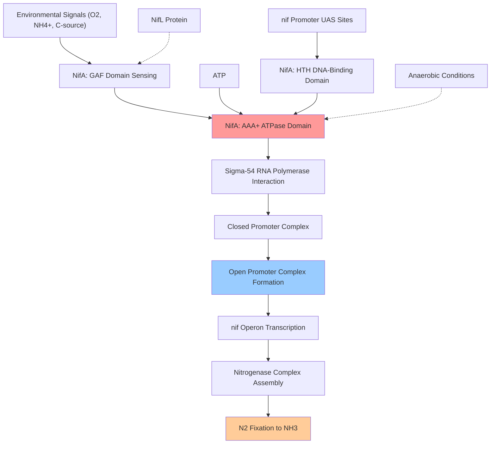

# Pathway Summary for nifA

## Overview
nifA participates in the nitrogen fixation regulatory pathway where it functions as a sigma-54-dependent transcriptional activator [PMID:2840552, UniProt:P09570]. This master regulator controls the expression of nitrogen fixation operons by catalyzing ATP-driven promoter remodeling, enabling bacterial nitrogen fixation under appropriate environmental conditions and serving as the central coordinator of the nitrogen fixation regulatory network.

## Nitrogen Fixation Transcriptional Regulation Pathway
The nitrogen fixation transcriptional regulation pathway represents the primary mechanism by which diazotrophic bacteria control nitrogenase expression in response to nitrogen availability and environmental conditions [PMID:2840552]. NifA serves as the master transcriptional activator that directly controls the expression of most nif operons involved in nitrogen fixation, including structural genes encoding nitrogenase subunits and accessory proteins required for nitrogen fixation.

NifA operates through a sophisticated sigma-54-dependent mechanism that requires ATP hydrolysis to drive transcriptional activation [PMID:2840552, UniProt:P09570]. The protein contains three functional domains: an N-terminal GAF domain for signal sensing, a central AAA+ ATPase domain that interacts with sigma-54, and a C-terminal helix-turn-helix DNA-binding domain that recognizes specific upstream activating sequences at nif promoters.

The transcriptional activation process involves NifA binding to conserved upstream activating sequences located at -24/-12 positions relative to nif gene transcription start sites [UniProt:P09570]. Upon binding, NifA hydrolyzes ATP to catalyze the isomerization of closed promoter complexes containing sigma-54-RNA polymerase to transcriptionally active open complexes, enabling high-level expression of nitrogen fixation genes.

## Nitrogen Cycle Metabolic Regulation
NifA directly regulates the positive control of nitrogen cycle metabolic processes by coordinating the expression of enzymes and cofactors required for atmospheric nitrogen reduction [PMID:2840552]. The protein integrates multiple environmental signals including oxygen status, nitrogen availability, and carbon source availability to precisely control when nitrogen fixation occurs.

Deletion mutants of nifA are incapable of diazotrophic growth and fail to accumulate nitrogenase structural gene products, demonstrating the absolute requirement for this transcriptional activator in nitrogen fixation [PMID:2840552]. The regulatory pathway ensures that the energy-intensive nitrogen fixation process only occurs when environmental conditions are favorable and alternative nitrogen sources are unavailable.

## Nitrogen Fixation Transcriptional Regulation Pathway Diagram

## Signal Integration and Environmental Response
NifA functions as a sophisticated signal integration hub that coordinates nitrogen fixation with cellular metabolism and environmental conditions [UniProt:P09570]. The GAF domain receives regulatory inputs from the NifL protein, which acts as a negative regulator that responds to oxygen, nitrogen status, and carbon availability.

Under conditions unfavorable for nitrogen fixation (presence of oxygen, adequate nitrogen sources, or poor carbon sources), NifL interacts with NifA to prevent its activation function. When conditions become favorable (anaerobic, nitrogen-limited, adequate carbon sources), NifL releases its inhibition, allowing NifA to activate transcription of nitrogen fixation genes.

## Biotechnological Applications
The NifA regulatory system represents a key target for biotechnological applications aimed at engineering nitrogen fixation in non-diazotrophic crops and industrial microorganisms [PMID:2840552]. Understanding NifA's regulatory mechanism has enabled the development of synthetic biology approaches for transferring nitrogen fixation capability to plants and for optimizing nitrogen fixation in industrial fermentation processes.

The precise environmental control mechanisms mediated by NifA provide a framework for engineering conditional nitrogen fixation systems that can be activated only under specific growth conditions, preventing metabolic burden during periods when nitrogen fixation is not needed.