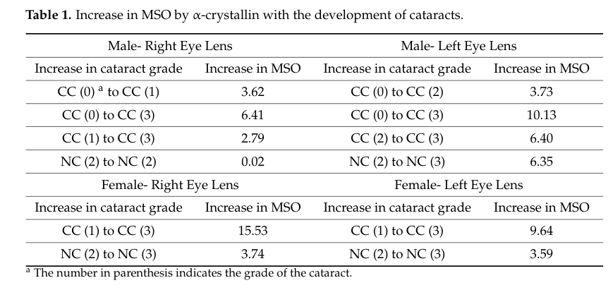

## Question

# Gene Research for Functional Annotation

## ⚠️ CRITICAL: Gene/Protein Identification Context

**BEFORE YOU BEGIN RESEARCH:** You MUST verify you are researching the CORRECT gene/protein. Gene symbols can be ambiguous, especially for less well-characterized genes from non-model organisms.

### Target Gene/Protein Identity (from UniProt):
- **UniProt Accession:** P02470
- **Protein Description:** RecName: Full=Alpha-crystallin A chain; Contains: RecName: Full=Alpha-crystallin A(1-172); Contains: RecName: Full=Alpha-crystallin A(1-168);
- **Gene Information:** Name=CRYAA; Synonyms=CRYA1;
- **Organism (full):** Bos taurus (Bovine).
- **Protein Family:** Belongs to the small heat shock protein (HSP20) family.
- **Key Domains:** A-crystallin/Hsp20_dom. (IPR002068); Alpha-crystallin/HSP_16. (IPR055269); Alpha-crystallin/sHSP_animal. (IPR001436); Alpha-crystallin_N. (IPR003090); HSP20-like_chaperone. (IPR008978)

### MANDATORY VERIFICATION STEPS:

1. **Check if the gene symbol "CRYAA" matches the protein description above**
2. **Verify the organism is correct:** Bos taurus (Bovine).
3. **Check if protein family/domains align with what you find in literature**
4. **If you find literature for a DIFFERENT gene with the same or similar symbol, STOP**

### If Gene Symbol is Ambiguous or You Cannot Find Relevant Literature:

**DO NOT PROCEED WITH RESEARCH ON A DIFFERENT GENE.** Instead:
- State clearly: "The gene symbol 'CRYAA' is ambiguous or literature is limited for this specific protein"
- Explain what you found (e.g., "Found extensive literature on a different gene with the same symbol in a different organism")
- Describe the protein based ONLY on the UniProt information provided above
- Suggest that the protein function can be inferred from domain/family information

### Research Target:

Please provide a comprehensive research report on the gene **CRYAA** (gene ID: CRYAA, UniProt: P02470) in BOVIN.

The research report should be a detailed narrative explaining the function, biological processes, and localization of the gene product. Citations should be given for all claims.

You should prioritize authoritative reviews and primary scientific literature when conducting research. You can supplement
this with annotations you find in gene/protein databases, but these can be outdated or inaccurate.

We are specifically interested in the primary function of the gene - for enzymes, what reaction is catalyzed, and what is the substrate specificity? For transporters, what is the substrate? For structural proteins or adapters, what is the broader structural role? For signaling molecules, what is the role in the pathway.

We are interested in where in or outside the cell the gene product carries out its function.

We are also interested in the signaling or biochemical pathways in which the gene functions. We are less interested in broad pleiotropic effects, except where these elucidate the precise role.

Include evidence where possible. We are interested in both experimental evidence as well as inference from structure, evolution, or bioinformatic analysis. Precise studies should be prioritized over high-throughput, where available.

## Output

Question: You are an expert researcher providing comprehensive, well-cited information.

Provide detailed information focusing on:
1. Key concepts and definitions with current understanding
2. Recent developments and latest research (prioritize 2023-2024 sources)
3. Current applications and real-world implementations
4. Expert opinions and analysis from authoritative sources
5. Relevant statistics and data from recent studies

Format as a comprehensive research report with proper citations. Include URLs and publication dates where available.
Always prioritize recent, authoritative sources and provide specific citations for all major claims.

# Gene Research for Functional Annotation

## ⚠️ CRITICAL: Gene/Protein Identification Context

**BEFORE YOU BEGIN RESEARCH:** You MUST verify you are researching the CORRECT gene/protein. Gene symbols can be ambiguous, especially for less well-characterized genes from non-model organisms.

### Target Gene/Protein Identity (from UniProt):
- **UniProt Accession:** P02470
- **Protein Description:** RecName: Full=Alpha-crystallin A chain; Contains: RecName: Full=Alpha-crystallin A(1-172); Contains: RecName: Full=Alpha-crystallin A(1-168);
- **Gene Information:** Name=CRYAA; Synonyms=CRYA1;
- **Organism (full):** Bos taurus (Bovine).
- **Protein Family:** Belongs to the small heat shock protein (HSP20) family.
- **Key Domains:** A-crystallin/Hsp20_dom. (IPR002068); Alpha-crystallin/HSP_16. (IPR055269); Alpha-crystallin/sHSP_animal. (IPR001436); Alpha-crystallin_N. (IPR003090); HSP20-like_chaperone. (IPR008978)

### MANDATORY VERIFICATION STEPS:

1. **Check if the gene symbol "CRYAA" matches the protein description above**
2. **Verify the organism is correct:** Bos taurus (Bovine).
3. **Check if protein family/domains align with what you find in literature**
4. **If you find literature for a DIFFERENT gene with the same or similar symbol, STOP**

### If Gene Symbol is Ambiguous or You Cannot Find Relevant Literature:

**DO NOT PROCEED WITH RESEARCH ON A DIFFERENT GENE.** Instead:
- State clearly: "The gene symbol 'CRYAA' is ambiguous or literature is limited for this specific protein"
- Explain what you found (e.g., "Found extensive literature on a different gene with the same symbol in a different organism")
- Describe the protein based ONLY on the UniProt information provided above
- Suggest that the protein function can be inferred from domain/family information

### Research Target:

Please provide a comprehensive research report on the gene **CRYAA** (gene ID: CRYAA, UniProt: P02470) in BOVIN.

The research report should be a detailed narrative explaining the function, biological processes, and localization of the gene product. Citations should be given for all claims.

You should prioritize authoritative reviews and primary scientific literature when conducting research. You can supplement
this with annotations you find in gene/protein databases, but these can be outdated or inaccurate.

We are specifically interested in the primary function of the gene - for enzymes, what reaction is catalyzed, and what is the substrate specificity? For transporters, what is the substrate? For structural proteins or adapters, what is the broader structural role? For signaling molecules, what is the role in the pathway.

We are interested in where in or outside the cell the gene product carries out its function.

We are also interested in the signaling or biochemical pathways in which the gene functions. We are less interested in broad pleiotropic effects, except where these elucidate the precise role.

Include evidence where possible. We are interested in both experimental evidence as well as inference from structure, evolution, or bioinformatic analysis. Precise studies should be prioritized over high-throughput, where available.

# Research report: Bovine **CRYAA** (UniProt **P02470**) — alpha‑crystallin A chain (αA‑crystallin)

## 0) Gene/protein verification (mandatory disambiguation)

The research target is **CRYAA**, encoding **αA‑crystallin**, a member of the **small heat shock protein (sHSP/HSP20) family** that functions as an ATP‑independent molecular chaperone (“holdase”) and a major lens protein required for transparency. This identity matches the CRYAA/αA‑crystallin discussed in the retrieved peer‑reviewed literature (patil2024proteostaticremodelingof pages 1-4, khidiyatova2023studyofthe pages 11-13). 

**Bovine linkage:** A 2024 lens‑membrane biophysics study explicitly used **native bovine lens α‑crystallin** (Sigma product C4163) as the experimental α‑crystallin reagent (hazen2024associationofalphacrystallin pages 20-22). Most mechanistic/disease studies available here are in human, rodent, ground squirrel, zebrafish, and cell models; where non‑bovine evidence is used, conclusions are presented as **conserved mammalian CRYAA biology** rather than bovine‑specific physiology.

## 1) Key concepts and definitions (current understanding)

### 1.1 α‑Crystallins and CRYAA within the sHSP family
α‑Crystallins are described as **dynamic, high‑order oligomeric sHSP “holdase” chaperones** that bind/sequester misfolded or aggregation‑prone client proteins to maintain protein solubility (patil2024proteostaticremodelingof pages 1-4, khidiyatova2023studyofthe pages 11-13). In the lens, this chaperone role is central because lens proteins have **extremely low/near‑negligible turnover**, so long‑term proteostasis is required for lifelong transparency (patil2024proteostaticremodelingof pages 29-32).

### 1.2 Primary molecular function
Across authoritative sources in this evidence set, the primary function of CRYAA/αA‑crystallin is:

* **ATP‑independent molecular chaperoning** to prevent inappropriate interactions and aggregation of partially unfolded proteins—particularly other crystallins (β/γ crystallins)—and thereby preserve lens transparency and long‑term solubility of the lens proteome (patil2024proteostaticremodelingof pages 29-32, patil2024proteostaticremodelingof pages 1-4, khidiyatova2023studyofthe pages 11-13).

### 1.3 Localization and functional compartment
**Lens localization (dominant):** αA‑crystallin is emphasized as **primarily expressed in the lens** and functionally required for transparency; genetic loss of αA‑crystallin in mice causes cataract, supporting an essential role in lens homeostasis (patil2024proteostaticremodelingof pages 1-4, khidiyatova2023studyofthe pages 10-11). 

**Extralenticular context (lower abundance):** Recent work also discusses that basal/low‑level αA‑crystallin can occur outside the lens and that regulatory mechanisms can “de‑repress” αA‑crystallin proteostasis in non‑lenticular tissues under specific genetic/stress contexts (patil2024proteostaticremodelingof pages 1-4).

### 1.4 Oligomerization and functional assemblies
αA‑crystallin forms **large multimeric assemblies** (including mixed αA/αB complexes) whose **oligomeric state and dynamics** are closely tied to substrate binding and chaperone function (ma2023expressionofαacrystallin pages 11-12, khidiyatova2023studyofthe pages 11-13).

## 2) Recent developments (prioritizing 2023–2024)

### 2.1 2024: Ubiquitin–proteasome system (UPS) directly regulates CRYAA aggregate clearance
A notable 2024 advance is the mechanistic link between CRYAA proteostasis and the **UPS** during stress recovery in a natural “cataract‑reversing” system. Yang et al. (Journal of Clinical Investigation; 2024‑09) report that ground squirrel lenses develop **cold‑induced opacity** that rapidly reverses on rewarming, and they implicate UPS activity in minimizing crystallin aggregation during recovery (yang2024reversiblecoldinducedlens pages 1-2, yang2024reversiblecoldinducedlens pages 2-3). Key mechanistic evidence includes:

* **CRYAA interacts with ubiquitin** and shows increased **polyubiquitination after rewarming** (yang2024reversiblecoldinducedlens pages 2-3).
* **Proteasome inhibition (MG132)** blocks the post‑rewarming reduction of aggregated mutant CRYAA (Y118D), whereas autophagy/lysosome inhibitors (3MA, NH4Cl) do not—supporting a UPS‑dominant clearance route for these aggregates in that context (yang2024reversiblecoldinducedlens pages 2-3).

This work connects CRYAA function not only to classic “holdase” chaperoning but also to **regulated turnover of aggregation‑prone CRYAA species** via ubiquitin‑dependent proteasomal pathways under stress‑recovery conditions (yang2024reversiblecoldinducedlens pages 2-3).

### 2.2 2024: Cataract‑progression links to α‑crystallin membrane association and lens lipid remodeling
Hazen et al. (International Journal of Molecular Sciences; 2024‑02) examined α‑crystallin association with human lens cortical and nuclear membranes. They report that **membrane surface occupancy (MSO)** by α‑crystallin increases with increasing **cortical and nuclear cataract grade**, accompanied by increased membrane surface hydrophobicity and altered mobility/order (hazen2024associationofalphacrystallin pages 1-2, hazen2024associationofalphacrystallin pages 3-5). Mechanistically, they relate increased binding to **cataract‑associated lipid remodeling**, particularly reduced cholesterol and smaller/fewer cholesterol bilayer domains, which can permit greater α‑crystallin association (hazen2024associationofalphacrystallin pages 3-5, hazen2024associationofalphacrystallin pages 2-3).

A key bovine‑relevance point is that Hazen et al. used **native bovine α‑crystallin** (no engineered mutations) as the α‑crystallin protein reagent (hazen2024associationofalphacrystallin pages 20-22). Thus, while membranes were from human lenses, the observed binding behavior pertains to a bovine α‑crystallin preparation interacting with physiologically derived lens membranes.

### 2.3 2023: CRYAA expression decreases in cataract models; silencing promotes apoptosis/autophagy
Ma et al. (Aging (Albany NY); 2023‑05) studied age‑related cataract models (oxidative stress in HLEB3 lens epithelial cells and naphthalene‑induced cataract in rabbit lens) and report that cataract modeling **reduces CRYAA expression**, and that **CRYAA silencing increases apoptosis and autophagy** in lens epithelial cells (ma2023expressionofαacrystallin pages 11-12, ma2023expressionofαacrystallin pages 9-11). These findings support a protective role for CRYAA in lens epithelial homeostasis under stress.

### 2.4 2023: Updated clinical genetics—variant spectrum and counts
A 2023 congenital cataract cohort study summarizes the established role of CRYAA in inherited cataract and provides a snapshot statistic: **26 distinct pathogenic CRYAA variants** were recorded as of **20 Feb 2023**, with a predominance of **missense variants**, often affecting arginine residues and commonly associated with autosomal dominant nuclear/zonular cataracts (khidiyatova2023studyofthe pages 11-13). The same study reports additional likely pathogenic variants (e.g., p.L85F, p.H97Q) (khidiyatova2023studyofthe pages 11-13).

## 3) Current applications and real‑world implementations

### 3.1 Translational cataract intervention: engineered RNF114 complex (2024)
Yang et al. identify RNF114 (an E3 ubiquitin ligase) as a UPS‑linked factor in this lens proteostasis context and report a practical intervention: they **engineered a deliverable RNF114 complex** that **reduced lens opacity** in **rats with cold‑induced cataracts** and in **zebrafish with oxidative stress–related cataracts** (yang2024reversiblecoldinducedlens pages 1-2). This constitutes a concrete real‑world oriented implementation of CRYAA‑centered proteostasis insight.

Quantitative/translational context from the same study includes: ground squirrel lens opacity cleared after ~**5 minutes** at 37°C, while rat lenses recovered only to ~**86% transmittance** after rewarming, highlighting a measurable phenotype and improvement target (yang2024reversiblecoldinducedlens pages 2-3).

### 3.2 Mechanism‑informed intervention concepts: cholesterol modulation to reduce α‑crystallin membrane binding (2024)
Hazen et al. argue that lipid composition—especially cholesterol—strongly modulates α‑crystallin membrane association and propose that **increasing membrane cholesterol or using cholesterol derivatives** could reduce α‑crystallin binding/hydrophobic barrier effects, offering a mechanistically grounded intervention direction (hazen2024associationofalphacrystallin pages 19-20).

### 3.3 Research tool implementation: lens‑specific cryaa promoter usage
Although not bovine, a 2024 zebrafish transgenic line uses the **cryaa promoter** to drive lens‑specific Cre expression without impairing lens transparency, representing a practical implementation of cryaa regulatory specificity for lens research (rossen2025zebrafishasa pages 4-5).

## 4) Expert synthesis and analysis (authoritative interpretations)

### 4.1 CRYAA as a “proteostasis hub” in a low‑turnover tissue
A consistent expert framing in these sources is that αA‑crystallin’s biological role is not merely structural abundance but **active proteostasis maintenance** in a tissue where proteins persist for long periods. This is evidenced by its characterization as an oligomeric sHSP chaperone that prevents aggregation and maintains solubility, and by the cataract phenotypes associated with disruption (patil2024proteostaticremodelingof pages 29-32, patil2024proteostaticremodelingof pages 1-4).

### 4.2 Convergence of three mechanistic axes in cataract biology
The 2023–2024 evidence suggests three converging mechanistic axes in which CRYAA is central:

1. **Holdase chaperoning and anti‑aggregation** in the bulk cytosolic lens protein environment (patil2024proteostaticremodelingof pages 1-4, khidiyatova2023studyofthe pages 11-13).
2. **Stress‑responsive cell survival programs** in lens epithelial cells (apoptosis/autophagy balance) where CRYAA reduction or knockdown worsens stress outcomes (ma2023expressionofαacrystallin pages 11-12, ma2023expressionofαacrystallin pages 9-11).
3. **Spatial compartmentalization at membranes**: increasing α‑crystallin association with lens membranes in cataract progression, potentially creating diffusion barriers and promoting oxidative microenvironments (hazen2024associationofalphacrystallin pages 3-5, hazen2024associationofalphacrystallin pages 13-15).

A major 2024 advance adds a fourth axis:

4. **UPS‑mediated turnover of aggregated crystallin species**, enabling clearance of aggregation‑prone mutant CRYAA under specific stress‑recovery regimes (yang2024reversiblecoldinducedlens pages 2-3).

## 5) Statistics and recent quantitative data

### 5.1 Membrane surface occupancy (MSO) increases with cataract grade (2024)
Hazen et al. report grade‑associated increases in α‑crystallin membrane binding, including examples of MSO increases (Table/Figures): male right‑eye cortex CC0→CC3 **+6.41%**, male left‑eye cortex CC0→CC3 **+10.13%**, female right‑eye cortex CC1→CC3 **+15.53%** (hazen2024associationofalphacrystallin pages 3-5). In absolute terms, they report NM MSO values ~**13%** at NC grade 2 and ~**17%** at NC grade 3, and cortical MSO reaching ~**28%** in females at CC grade 3 (vs ~**18%** in males) (hazen2024associationofalphacrystallin pages 5-7).

Visual evidence is available in the extracted Table 1 and Figures 1–2 (hazen2024associationofalphacrystallin media 2accb877, hazen2024associationofalphacrystallin media 2dba8fc4, hazen2024associationofalphacrystallin media 0ae1363c).

### 5.2 UPS/cold‑rewarm phenotype metrics (2024)
Yang et al. quantify key aspects of their model: ground squirrel lens opacity clears after ~**5 minutes** at 37°C; rat lenses recover only to ~**86% transmittance** after rewarming (yang2024reversiblecoldinducedlens pages 2-3). In their induced lens epithelial cell system, differentiation produced **>95% CRYAA‑positive cells** by day 13, supporting robustness of the CRYAA‑expressing cell model used for mechanistic tests (yang2024reversiblecoldinducedlens pages 1-2).

### 5.3 Human genetics snapshot (2023)
As of **20 Feb 2023**, **26 pathogenic CRYAA variants** were recorded (khidiyatova2023studyofthe pages 11-13). This statistic supports the view of CRYAA as a well‑validated cataract gene with an expanding variant catalog.

## 6) Evidence‑supported functional annotation for **Bos taurus CRYAA (UniProt P02470)**

### 6.1 Molecular function
**ATP‑independent sHSP holdase chaperone** that binds partially unfolded client proteins to suppress aggregation and maintain solubility; crucial for maintaining lens proteostasis and transparency (patil2024proteostaticremodelingof pages 1-4, khidiyatova2023studyofthe pages 11-13).

### 6.2 Biological processes
* **Lens transparency maintenance / lens proteostasis** via suppression of protein aggregation and insolubilization (patil2024proteostaticremodelingof pages 29-32, patil2024proteostaticremodelingof pages 1-4).
* **Cell stress protection** (oxidative stress contexts; apoptosis/autophagy modulation in lens epithelial cells), inferred from mammalian cell/tissue models (ma2023expressionofαacrystallin pages 11-12, ma2023expressionofαacrystallin pages 9-11).
* **Proteostasis regulation via UPS under stress recovery**, evidenced in a 2024 natural model and mechanistic inhibitor experiments (yang2024reversiblecoldinducedlens pages 2-3).

### 6.3 Subcellular and tissue localization
* Predominantly **lens** (lens fiber cells and lens epithelial contexts) (patil2024proteostaticremodelingof pages 1-4, ma2023expressionofαacrystallin pages 9-11).
* Evidence indicates **potential low‑level extralenticular expression** and regulation in non‑lens tissues in specific settings (patil2024proteostaticremodelingof pages 1-4).
* Functionally important interactions can occur at/near **lens lipid membranes**, with increased association observed with cataract progression in membrane preparations (hazen2024associationofalphacrystallin pages 3-5).

## 7) Consolidated evidence table

| Topic | Evidence-based details | Key recent sources (year) | Notes on species (bovine vs other) |
|---|---|---|---|
| Identity / definition | CRYAA encodes the αA subunit of α-crystallin, a member of the small heat shock protein family (often designated HSPB4). It is described as a dynamic ATP-independent “holdase” chaperone central to lens proteostasis and transparency (patil2024proteostaticremodelingof pages 1-4, khidiyatova2023studyofthe pages 11-13). | Patil et al. 2024; Khidiyatova et al. 2023 | Functional identity is conserved across mammals; direct evidence gathered is mainly human/mouse/general vertebrate, not bovine-sequence specific. |
| Core molecular function | αA-crystallin prevents aggregation/insolubilization of partially unfolded lens proteins, especially other crystallins, and helps maintain long-term protein solubility in the lens, where protein turnover is minimal (patil2024proteostaticremodelingof pages 29-32, patil2024proteostaticremodelingof pages 1-4, khidiyatova2023studyofthe pages 11-13). | Patil et al. 2024; Khidiyatova et al. 2023 | Mechanistic evidence is largely from mammalian systems broadly; applicable to bovine CRYAA by strong family conservation. |
| Anti-stress / cell-protective role | Beyond chaperoning, CRYAA is linked to protection from oxidative stress, anti-apoptotic activity, regulation of autophagy-associated responses, and cell survival in lens epithelial cells (patil2024proteostaticremodelingof pages 29-32, ma2023expressionofαacrystallin pages 12-12, ma2023expressionofαacrystallin pages 9-11). | Ma et al. 2023; Patil et al. 2024 | Evidence comes from human HLEB3 cells, rabbit lens, and mouse-linked literature rather than bovine tissue. |
| Lens localization | CRYAA is primarily expressed in the lens and is critical for lens transparency; mouse loss of αA-crystallin causes cataract, supporting lens-essential function (patil2024proteostaticremodelingof pages 1-4, khidiyatova2023studyofthe pages 10-11). | Patil et al. 2024; Khidiyatova et al. 2023 | Strong lens-specific evidence is cross-species; direct bovine localization data were not retrieved. |
| Extralenticular expression | Basal/low-level αA-crystallin expression can occur in non-lenticular tissues, and recent work links altered CRYAA proteostasis to chorioretinal settings and broader stress responses (patil2024proteostaticremodelingof pages 29-32, patil2024proteostaticremodelingof pages 1-4). | Patil et al. 2024 | Non-lens evidence is mostly from mouse or non-bovine systems. |
| Oligomerization / structural behavior | αA-crystallin functions in large multimeric assemblies, often with αB-crystallin; the α-crystallin complex is emphasized as dynamic, with oligomeric state influencing chaperone activity and substrate handling (ma2023expressionofαacrystallin pages 11-12, khidiyatova2023studyofthe pages 11-13). | Ma et al. 2023; Khidiyatova et al. 2023 | General mammalian α-crystallin biology; not a bovine-specific oligomerization study. |
| Membrane association | α-crystallin increasingly associates with cortical and nuclear lens membranes as cataract grade rises. Binding decreases membrane mobility, increases order and hydrophobicity, and is proposed to hinder diffusion of protective small molecules such as glutathione (hazen2024associationofalphacrystallin pages 1-2, hazen2024associationofalphacrystallin pages 3-5, hazen2024associationofalphacrystallin pages 15-16, hazen2024associationofalphacrystallin pages 19-20, hazen2024associationofalphacrystallin media 2accb877). | Hazen et al. 2024 | Important bovine-specific point: the experimental protein reagent was native bovine lens α-crystallin, while membranes were from human donor lenses (hazen2024associationofalphacrystallin pages 20-22). |
| Quantitative membrane data | In human lens membrane assays using bovine α-crystallin, membrane surface occupancy (MSO) increased with cataract severity: examples include male right-eye cortex CC0→CC3 +6.41%, male left-eye cortex CC0→CC3 +10.13%, female right-eye cortex CC1→CC3 +15.53%; NM values were ~13% at NC2 and ~17% at NC3, and female CC3 cortical membranes reached ~28% MSO versus ~18% in males (hazen2024associationofalphacrystallin pages 3-5, hazen2024associationofalphacrystallin pages 5-7, hazen2024associationofalphacrystallin media 2accb877). | Hazen et al. 2024 | Uses native bovine α-crystallin reagent with human membranes; informative for bovine protein behavior but not bovine in vivo lens physiology. |
| Lipid-dependent mechanism | Increased membrane binding is linked to cataract-associated lipid remodeling, especially reduced cholesterol and fewer/smaller cholesterol bilayer domains; added cholesterol is noted to inhibit α-crystallin binding in prior work (hazen2024associationofalphacrystallin pages 3-5, hazen2024associationofalphacrystallin pages 19-20, hazen2024associationofalphacrystallin pages 2-3). | Hazen et al. 2024 | Human lens membrane composition was measured; mechanistic implications likely relevant to bovine α-crystallin biophysics. |
| Proteostasis pathway / UPS | A major 2024 advance is the finding that CRYAA homeostasis during cold-stress recovery is regulated by the ubiquitin-proteasome system (UPS). CRYAA interacts with ubiquitin, becomes more polyubiquitinated after rewarming, and aggregate clearance is blocked by proteasome inhibition but not by autophagy/lysosome inhibitors (yang2024reversiblecoldinducedlens pages 1-2, yang2024reversiblecoldinducedlens pages 2-3). | Yang et al. 2024 | Derived from ground squirrel, rat, zebrafish, human LEC, and induced lens epithelial cell systems; not bovine-specific. |
| Translational application | Yang et al. identified RNF114 as an E3 ligase connected to CRYAA proteostasis and engineered a deliverable RNF114 complex that reduced lens opacity in rat cold-cataract and zebrafish oxidative cataract models, highlighting a potential anti-cataract therapeutic strategy (yang2024reversiblecoldinducedlens pages 1-2, yang2024reversiblecoldinducedlens pages 2-3). | Yang et al. 2024 | Translational work is not bovine, but it targets a conserved CRYAA proteostasis axis. |
| Cell-model quantitative data | In the ground-squirrel iLEC model used to study CRYAA proteostasis, differentiation yielded >95% CRYAA-positive cells by day 13. In intact lenses, ground-squirrel opacity cleared after ~5 minutes at 37°C, while rat lenses recovered only to ~86% transmittance after rewarming (yang2024reversiblecoldinducedlens pages 1-2, yang2024reversiblecoldinducedlens pages 2-3). | Yang et al. 2024 | Non-bovine experimental models. |
| Cataract-related expression changes | In age-related cataract models, CRYAA expression decreases in oxidatively stressed HLEB3 cells and naphthalene-induced rabbit lenses; CRYAA silencing increases apoptosis and autophagy-related changes, supporting a protective role in lens epithelial homeostasis (ma2023expressionofαacrystallin pages 11-12, ma2023expressionofαacrystallin pages 12-12, ma2023expressionofαacrystallin pages 9-11). | Ma et al. 2023 | Human cell line plus rabbit in vivo model; not bovine. |
| Disease genetics | CRYAA is a well-established cataract gene. As summarized in 2023 evidence, 26 distinct pathogenic CRYAA variants had been recorded by 20 Feb 2023, mostly missense and often affecting arginine residues; phenotypes commonly include dominant nuclear or zonular cataracts, sometimes with microcornea/microphthalmia (khidiyatova2023studyofthe pages 11-13). | Khidiyatova et al. 2023 | Human genetics evidence; useful for functional inference, not bovine disease annotation. |
| Recent human variant findings | Recent studies reported new or emphasized pathogenic/likely pathogenic variants including p.L85F and p.H97Q in congenital cataract cohorts, and mechanistic work on variants such as E156K and Y118D implicates altered chaperone function, ER stress, EMT/migration effects, or aggregation-prone behavior (khidiyatova2023studyofthe pages 10-11, ma2023expressionofαacrystallin pages 12-12, khidiyatova2023studyofthe pages 11-13). | Khidiyatova et al. 2023; Zhao et al. 2024; Yang et al. 2024 | Mostly human variant data and model systems. |
| Research utility / implementation | CRYAA promoter activity is now being used as a lens-specific genetic tool; a 2024 zebrafish cryaa:Cre-cryaa:EGFP line enabled lens-specific Cre expression without impairing transparency, providing a practical platform for lens gene manipulation (rossen2025zebrafishasa pages 4-5). | Peng et al. 2024 | Zebrafish tool development, not bovine. |
| Overall annotation for bovine CRYAA | For Bos taurus UniProt P02470, the most evidence-supported annotation is: major lens α-crystallin small heat shock protein/chaperone that stabilizes other lens proteins, limits aggregation, contributes to transparency, can associate with lens membranes under cataract-associated conditions, and participates in broader proteostasis/stress-response mechanisms. Direct bovine primary literature retrieved here is limited, so much of the functional annotation is inferred from conserved mammalian CRYAA biology plus one 2024 study explicitly using native bovine α-crystallin experimentally (patil2024proteostaticremodelingof pages 1-4, khidiyatova2023studyofthe pages 11-13, hazen2024associationofalphacrystallin pages 20-22). | Patil et al. 2024; Khidiyatova et al. 2023; Hazen et al. 2024 | Bovine-specific evidence is limited; annotation is strongest for conserved lens chaperone function. |

*Table: This table condenses the evidence-supported functions, localization, mechanisms, disease links, and recent 2023-2024 developments for CRYAA/alphaA-crystallin. It also distinguishes where evidence is directly relevant to bovine protein versus inferred from other species.*

## 8) Key limitations of the current evidence package (transparency)

* Direct UniProt/InterPro full‑record text for **P02470** could not be retrieved using the available tools in this run; bovine identity is therefore supported indirectly via conserved CRYAA biology and explicit use of native bovine α‑crystallin in a key 2024 study (hazen2024associationofalphacrystallin pages 20-22).
* Many mechanistic findings are derived from non‑bovine models (human lens epithelium, rabbit lens, ground squirrel lens, zebrafish, rodents). These are likely relevant to bovine CRYAA due to deep conservation of αA‑crystallin/sHSP function, but direct in‑vivo bovine lens functional studies were not retrieved here.

## 9) Source list (publication dates, URLs)

* **Yang H. et al.** “Reversible cold-induced lens opacity in a hibernator reveals a molecular target for treating cataracts.” *Journal of Clinical Investigation* (Sep 2024). https://doi.org/10.1172/jci169666 (yang2024reversiblecoldinducedlens pages 1-2, yang2024reversiblecoldinducedlens pages 2-3)
* **Hazen P. et al.** “Association of Alpha-Crystallin with Human Cortical and Nuclear Lens Lipid Membrane Increases with the Grade of Cortical and Nuclear Cataract.” *International Journal of Molecular Sciences* (Feb 2024). https://doi.org/10.3390/ijms25031936 (hazen2024associationofalphacrystallin pages 1-2, hazen2024associationofalphacrystallin pages 3-5, hazen2024associationofalphacrystallin pages 5-7, hazen2024associationofalphacrystallin pages 20-22)
* **Patil H. et al.** “Proteostatic Remodeling of Small Heat Shock Chaperones—Crystallins by Ran-Binding Protein 2 …” *ACS Chemical Neuroscience* (Apr 2024). https://doi.org/10.1021/acschemneuro.3c00792 (patil2024proteostaticremodelingof pages 1-4, patil2024proteostaticremodelingof pages 29-32)
* **Ma X. et al.** “Expression of αA-crystallin (CRYAA) in vivo and in vitro models of age-related cataract and the effect of its silencing on HLEB3 cells.” *Aging (Albany NY)* (May 2023). https://doi.org/10.18632/aging.204754 (ma2023expressionofαacrystallin pages 11-12, ma2023expressionofαacrystallin pages 9-11)
* **Khidiyatova I. et al.** “Study of The Molecular Nature of Congenital Cataracts in Patients from The Volga–Ural Region.” *Current Issues in Molecular Biology* (Jun 2023). https://doi.org/10.3390/cimb45060327 (khidiyatova2023studyofthe pages 11-13)

References

1. (patil2024proteostaticremodelingof pages 1-4): Hemangi Patil, Haiqing Yi, Kyoung-in Cho, and Paulo A. Ferreira. Proteostatic remodeling of small heat shock chaperones─crystallins by ran-binding protein 2─and the peptidyl-prolyl cis-trans isomerase and chaperone activities of its cyclophilin domain. ACS chemical neuroscience, 15:1967-1989, Apr 2024. URL: https://doi.org/10.1021/acschemneuro.3c00792, doi:10.1021/acschemneuro.3c00792. This article has 2 citations and is from a peer-reviewed journal.

2. (khidiyatova2023studyofthe pages 11-13): Irina Khidiyatova, Indira Khidiyatova, Rena Zinchenko, Andrey Marakhonov, Alexandra Karunas, Svetlana Avkhadeeva, Marat Aznzbaev, and Elza Khusnutdinova. Study of the molecular nature of congenital cataracts in patients from the volga–ural region. Jun 2023. URL: https://doi.org/10.3390/cimb45060327, doi:10.3390/cimb45060327. This article has 2 citations.

3. (hazen2024associationofalphacrystallin pages 20-22): Preston Hazen, Geraline Trossi-Torres, Raju Timsina, Nawal K. Khadka, and Laxman Mainali. Association of alpha-crystallin with human cortical and nuclear lens lipid membrane increases with the grade of cortical and nuclear cataract. International Journal of Molecular Sciences, 25:1936, Feb 2024. URL: https://doi.org/10.3390/ijms25031936, doi:10.3390/ijms25031936. This article has 9 citations.

4. (patil2024proteostaticremodelingof pages 29-32): Hemangi Patil, Haiqing Yi, Kyoung-in Cho, and Paulo A. Ferreira. Proteostatic remodeling of small heat shock chaperones─crystallins by ran-binding protein 2─and the peptidyl-prolyl cis-trans isomerase and chaperone activities of its cyclophilin domain. ACS chemical neuroscience, 15:1967-1989, Apr 2024. URL: https://doi.org/10.1021/acschemneuro.3c00792, doi:10.1021/acschemneuro.3c00792. This article has 2 citations and is from a peer-reviewed journal.

5. (khidiyatova2023studyofthe pages 10-11): Irina Khidiyatova, Indira Khidiyatova, Rena Zinchenko, Andrey Marakhonov, Alexandra Karunas, Svetlana Avkhadeeva, Marat Aznzbaev, and Elza Khusnutdinova. Study of the molecular nature of congenital cataracts in patients from the volga–ural region. Jun 2023. URL: https://doi.org/10.3390/cimb45060327, doi:10.3390/cimb45060327. This article has 2 citations.

6. (ma2023expressionofαacrystallin pages 11-12): Xiaoling Ma, Yi Nan, Can Huang, Xiangyang Li, Yifan Yang, Wenjie Jiang, Mengyi Ye, Qian Liu, Yang Niu, and Ling Yuan. Expression of αa-crystallin (cryaa) in vivo and in vitro models of age-related cataract and the effect of its silencing on hleb3 cells. Aging (Albany NY), 15:4498-4509, May 2023. URL: https://doi.org/10.18632/aging.204754, doi:10.18632/aging.204754. This article has 9 citations.

7. (yang2024reversiblecoldinducedlens pages 1-2): Hao Yang, Xiyuan Ping, Jiayue Zhou, Hailaiti Ailifeire, Jing Wu, Francisco M. Nadal-Nicolás, Kiyoharu J. Miyagishima, Jing Bao, Yuxin Huang, Yilei Cui, Xin Xing, Shiqiang Wang, Ke Yao, Wei Li, and Xingchao Shentu. Reversible cold-induced lens opacity in a hibernator reveals a molecular target for treating cataracts. The Journal of Clinical Investigation, Sep 2024. URL: https://doi.org/10.1172/jci169666, doi:10.1172/jci169666. This article has 15 citations.

8. (yang2024reversiblecoldinducedlens pages 2-3): Hao Yang, Xiyuan Ping, Jiayue Zhou, Hailaiti Ailifeire, Jing Wu, Francisco M. Nadal-Nicolás, Kiyoharu J. Miyagishima, Jing Bao, Yuxin Huang, Yilei Cui, Xin Xing, Shiqiang Wang, Ke Yao, Wei Li, and Xingchao Shentu. Reversible cold-induced lens opacity in a hibernator reveals a molecular target for treating cataracts. The Journal of Clinical Investigation, Sep 2024. URL: https://doi.org/10.1172/jci169666, doi:10.1172/jci169666. This article has 15 citations.

9. (hazen2024associationofalphacrystallin pages 1-2): Preston Hazen, Geraline Trossi-Torres, Raju Timsina, Nawal K. Khadka, and Laxman Mainali. Association of alpha-crystallin with human cortical and nuclear lens lipid membrane increases with the grade of cortical and nuclear cataract. International Journal of Molecular Sciences, 25:1936, Feb 2024. URL: https://doi.org/10.3390/ijms25031936, doi:10.3390/ijms25031936. This article has 9 citations.

10. (hazen2024associationofalphacrystallin pages 3-5): Preston Hazen, Geraline Trossi-Torres, Raju Timsina, Nawal K. Khadka, and Laxman Mainali. Association of alpha-crystallin with human cortical and nuclear lens lipid membrane increases with the grade of cortical and nuclear cataract. International Journal of Molecular Sciences, 25:1936, Feb 2024. URL: https://doi.org/10.3390/ijms25031936, doi:10.3390/ijms25031936. This article has 9 citations.

11. (hazen2024associationofalphacrystallin pages 2-3): Preston Hazen, Geraline Trossi-Torres, Raju Timsina, Nawal K. Khadka, and Laxman Mainali. Association of alpha-crystallin with human cortical and nuclear lens lipid membrane increases with the grade of cortical and nuclear cataract. International Journal of Molecular Sciences, 25:1936, Feb 2024. URL: https://doi.org/10.3390/ijms25031936, doi:10.3390/ijms25031936. This article has 9 citations.

12. (ma2023expressionofαacrystallin pages 9-11): Xiaoling Ma, Yi Nan, Can Huang, Xiangyang Li, Yifan Yang, Wenjie Jiang, Mengyi Ye, Qian Liu, Yang Niu, and Ling Yuan. Expression of αa-crystallin (cryaa) in vivo and in vitro models of age-related cataract and the effect of its silencing on hleb3 cells. Aging (Albany NY), 15:4498-4509, May 2023. URL: https://doi.org/10.18632/aging.204754, doi:10.18632/aging.204754. This article has 9 citations.

13. (hazen2024associationofalphacrystallin pages 19-20): Preston Hazen, Geraline Trossi-Torres, Raju Timsina, Nawal K. Khadka, and Laxman Mainali. Association of alpha-crystallin with human cortical and nuclear lens lipid membrane increases with the grade of cortical and nuclear cataract. International Journal of Molecular Sciences, 25:1936, Feb 2024. URL: https://doi.org/10.3390/ijms25031936, doi:10.3390/ijms25031936. This article has 9 citations.

14. (rossen2025zebrafishasa pages 4-5): Jennifer L. Rossen, Antionette L. Williams, and Brenda L. Bohnsack. Zebrafish as a model for crystallin-associated congenital cataracts in humans. Frontiers in Cell and Developmental Biology, Mar 2025. URL: https://doi.org/10.3389/fcell.2025.1552988, doi:10.3389/fcell.2025.1552988. This article has 5 citations.

15. (hazen2024associationofalphacrystallin pages 13-15): Preston Hazen, Geraline Trossi-Torres, Raju Timsina, Nawal K. Khadka, and Laxman Mainali. Association of alpha-crystallin with human cortical and nuclear lens lipid membrane increases with the grade of cortical and nuclear cataract. International Journal of Molecular Sciences, 25:1936, Feb 2024. URL: https://doi.org/10.3390/ijms25031936, doi:10.3390/ijms25031936. This article has 9 citations.

16. (hazen2024associationofalphacrystallin pages 5-7): Preston Hazen, Geraline Trossi-Torres, Raju Timsina, Nawal K. Khadka, and Laxman Mainali. Association of alpha-crystallin with human cortical and nuclear lens lipid membrane increases with the grade of cortical and nuclear cataract. International Journal of Molecular Sciences, 25:1936, Feb 2024. URL: https://doi.org/10.3390/ijms25031936, doi:10.3390/ijms25031936. This article has 9 citations.

17. (hazen2024associationofalphacrystallin media 2accb877): Preston Hazen, Geraline Trossi-Torres, Raju Timsina, Nawal K. Khadka, and Laxman Mainali. Association of alpha-crystallin with human cortical and nuclear lens lipid membrane increases with the grade of cortical and nuclear cataract. International Journal of Molecular Sciences, 25:1936, Feb 2024. URL: https://doi.org/10.3390/ijms25031936, doi:10.3390/ijms25031936. This article has 9 citations.

18. (hazen2024associationofalphacrystallin media 2dba8fc4): Preston Hazen, Geraline Trossi-Torres, Raju Timsina, Nawal K. Khadka, and Laxman Mainali. Association of alpha-crystallin with human cortical and nuclear lens lipid membrane increases with the grade of cortical and nuclear cataract. International Journal of Molecular Sciences, 25:1936, Feb 2024. URL: https://doi.org/10.3390/ijms25031936, doi:10.3390/ijms25031936. This article has 9 citations.

19. (hazen2024associationofalphacrystallin media 0ae1363c): Preston Hazen, Geraline Trossi-Torres, Raju Timsina, Nawal K. Khadka, and Laxman Mainali. Association of alpha-crystallin with human cortical and nuclear lens lipid membrane increases with the grade of cortical and nuclear cataract. International Journal of Molecular Sciences, 25:1936, Feb 2024. URL: https://doi.org/10.3390/ijms25031936, doi:10.3390/ijms25031936. This article has 9 citations.

20. (ma2023expressionofαacrystallin pages 12-12): Xiaoling Ma, Yi Nan, Can Huang, Xiangyang Li, Yifan Yang, Wenjie Jiang, Mengyi Ye, Qian Liu, Yang Niu, and Ling Yuan. Expression of αa-crystallin (cryaa) in vivo and in vitro models of age-related cataract and the effect of its silencing on hleb3 cells. Aging (Albany NY), 15:4498-4509, May 2023. URL: https://doi.org/10.18632/aging.204754, doi:10.18632/aging.204754. This article has 9 citations.

21. (hazen2024associationofalphacrystallin pages 15-16): Preston Hazen, Geraline Trossi-Torres, Raju Timsina, Nawal K. Khadka, and Laxman Mainali. Association of alpha-crystallin with human cortical and nuclear lens lipid membrane increases with the grade of cortical and nuclear cataract. International Journal of Molecular Sciences, 25:1936, Feb 2024. URL: https://doi.org/10.3390/ijms25031936, doi:10.3390/ijms25031936. This article has 9 citations.

## Artifacts

- [Edison artifact artifact-00](CRYAA-deep-research-falcon_artifacts/artifact-00.md)

## Citations

1. hazen2024associationofalphacrystallin pages 20-22
2. patil2024proteostaticremodelingof pages 29-32
3. patil2024proteostaticremodelingof pages 1-4
4. yang2024reversiblecoldinducedlens pages 2-3
5. khidiyatova2023studyofthe pages 11-13
6. yang2024reversiblecoldinducedlens pages 1-2
7. hazen2024associationofalphacrystallin pages 19-20
8. rossen2025zebrafishasa pages 4-5
9. hazen2024associationofalphacrystallin pages 3-5
10. hazen2024associationofalphacrystallin pages 5-7
11. khidiyatova2023studyofthe pages 10-11
12. hazen2024associationofalphacrystallin pages 1-2
13. hazen2024associationofalphacrystallin pages 2-3
14. hazen2024associationofalphacrystallin pages 13-15
15. hazen2024associationofalphacrystallin pages 15-16
16. https://doi.org/10.1172/jci169666
17. https://doi.org/10.3390/ijms25031936
18. https://doi.org/10.1021/acschemneuro.3c00792
19. https://doi.org/10.18632/aging.204754
20. https://doi.org/10.3390/cimb45060327
21. https://doi.org/10.1021/acschemneuro.3c00792,
22. https://doi.org/10.3390/cimb45060327,
23. https://doi.org/10.3390/ijms25031936,
24. https://doi.org/10.18632/aging.204754,
25. https://doi.org/10.1172/jci169666,
26. https://doi.org/10.3389/fcell.2025.1552988,