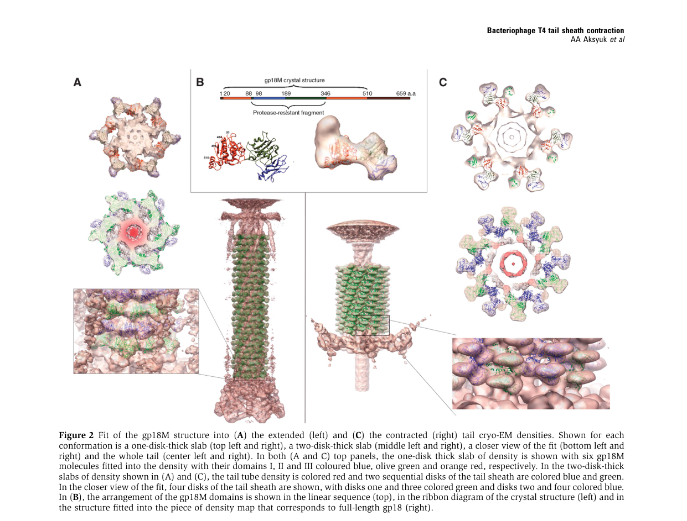

## Question

# Gene Research for Functional Annotation

## ⚠️ CRITICAL: Gene/Protein Identification Context

**BEFORE YOU BEGIN RESEARCH:** You MUST verify you are researching the CORRECT gene/protein. Gene symbols can be ambiguous, especially for less well-characterized genes from non-model organisms.

### Target Gene/Protein Identity (from UniProt):
- **UniProt Accession:** P13332
- **Protein Description:** RecName: Full=Tail sheath protein; Short=TSP; AltName: Full=Gene product 18; Short=gp18;
- **Gene Information:** Name=18;
- **Organism (full):** Enterobacteria phage T4 (Bacteriophage T4).
- **Protein Family:** Belongs to the myoviridae tail sheath protein family.
- **Key Domains:** Beta_sandwich_Seath. (IPR035326); Gp18-like_dom_I. (IPR054565); Gp18_domIII_N. (IPR054564); Phage_sheath_subtilisin. (IPR035089); Tail_sheath_C. (IPR020287)

### MANDATORY VERIFICATION STEPS:

1. **Check if the gene symbol "18" matches the protein description above**
2. **Verify the organism is correct:** Enterobacteria phage T4 (Bacteriophage T4).
3. **Check if protein family/domains align with what you find in literature**
4. **If you find literature for a DIFFERENT gene with the same or similar symbol, STOP**

### If Gene Symbol is Ambiguous or You Cannot Find Relevant Literature:

**DO NOT PROCEED WITH RESEARCH ON A DIFFERENT GENE.** Instead:
- State clearly: "The gene symbol '18' is ambiguous or literature is limited for this specific protein"
- Explain what you found (e.g., "Found extensive literature on a different gene with the same symbol in a different organism")
- Describe the protein based ONLY on the UniProt information provided above
- Suggest that the protein function can be inferred from domain/family information

### Research Target:

Please provide a comprehensive research report on the gene **18** (gene ID: 18, UniProt: P13332) in BPT4.

The research report should be a detailed narrative explaining the function, biological processes, and localization of the gene product. Citations should be given for all claims.

You should prioritize authoritative reviews and primary scientific literature when conducting research. You can supplement
this with annotations you find in gene/protein databases, but these can be outdated or inaccurate.

We are specifically interested in the primary function of the gene - for enzymes, what reaction is catalyzed, and what is the substrate specificity? For transporters, what is the substrate? For structural proteins or adapters, what is the broader structural role? For signaling molecules, what is the role in the pathway.

We are interested in where in or outside the cell the gene product carries out its function.

We are also interested in the signaling or biochemical pathways in which the gene functions. We are less interested in broad pleiotropic effects, except where these elucidate the precise role.

Include evidence where possible. We are interested in both experimental evidence as well as inference from structure, evolution, or bioinformatic analysis. Precise studies should be prioritized over high-throughput, where available.

## Output

Question: You are an expert researcher providing comprehensive, well-cited information.

Provide detailed information focusing on:
1. Key concepts and definitions with current understanding
2. Recent developments and latest research (prioritize 2023-2024 sources)
3. Current applications and real-world implementations
4. Expert opinions and analysis from authoritative sources
5. Relevant statistics and data from recent studies

Format as a comprehensive research report with proper citations. Include URLs and publication dates where available.
Always prioritize recent, authoritative sources and provide specific citations for all major claims.

# Gene Research for Functional Annotation

## ⚠️ CRITICAL: Gene/Protein Identification Context

**BEFORE YOU BEGIN RESEARCH:** You MUST verify you are researching the CORRECT gene/protein. Gene symbols can be ambiguous, especially for less well-characterized genes from non-model organisms.

### Target Gene/Protein Identity (from UniProt):
- **UniProt Accession:** P13332
- **Protein Description:** RecName: Full=Tail sheath protein; Short=TSP; AltName: Full=Gene product 18; Short=gp18;
- **Gene Information:** Name=18;
- **Organism (full):** Enterobacteria phage T4 (Bacteriophage T4).
- **Protein Family:** Belongs to the myoviridae tail sheath protein family.
- **Key Domains:** Beta_sandwich_Seath. (IPR035326); Gp18-like_dom_I. (IPR054565); Gp18_domIII_N. (IPR054564); Phage_sheath_subtilisin. (IPR035089); Tail_sheath_C. (IPR020287)

### MANDATORY VERIFICATION STEPS:

1. **Check if the gene symbol "18" matches the protein description above**
2. **Verify the organism is correct:** Enterobacteria phage T4 (Bacteriophage T4).
3. **Check if protein family/domains align with what you find in literature**
4. **If you find literature for a DIFFERENT gene with the same or similar symbol, STOP**

### If Gene Symbol is Ambiguous or You Cannot Find Relevant Literature:

**DO NOT PROCEED WITH RESEARCH ON A DIFFERENT GENE.** Instead:
- State clearly: "The gene symbol '18' is ambiguous or literature is limited for this specific protein"
- Explain what you found (e.g., "Found extensive literature on a different gene with the same symbol in a different organism")
- Describe the protein based ONLY on the UniProt information provided above
- Suggest that the protein function can be inferred from domain/family information

### Research Target:

Please provide a comprehensive research report on the gene **18** (gene ID: 18, UniProt: P13332) in BPT4.

The research report should be a detailed narrative explaining the function, biological processes, and localization of the gene product. Citations should be given for all claims.

You should prioritize authoritative reviews and primary scientific literature when conducting research. You can supplement
this with annotations you find in gene/protein databases, but these can be outdated or inaccurate.

We are specifically interested in the primary function of the gene - for enzymes, what reaction is catalyzed, and what is the substrate specificity? For transporters, what is the substrate? For structural proteins or adapters, what is the broader structural role? For signaling molecules, what is the role in the pathway.

We are interested in where in or outside the cell the gene product carries out its function.

We are also interested in the signaling or biochemical pathways in which the gene functions. We are less interested in broad pleiotropic effects, except where these elucidate the precise role.

Include evidence where possible. We are interested in both experimental evidence as well as inference from structure, evolution, or bioinformatic analysis. Precise studies should be prioritized over high-throughput, where available.

# Functional Annotation Research Report: Enterobacteria phage T4 gene 18 (gp18) tail sheath protein (UniProt: P13332)

## 0) Scope, identity verification, and ambiguity control

**Target as provided:** UniProt accession **P13332**, described as **tail sheath protein** (TSP), also called **gene product 18 (gp18)** from **Enterobacteria phage T4**.

**Ambiguity note:** The symbol “gene 18” is widely used across unrelated phages/viruses. The literature retrieved here consistently refers to **bacteriophage T4 “gene product 18 (gp18)”** as the **contractile tail sheath protein**, with a **659-aa** polypeptide assembling into a **138-subunit** sheath surrounding the tail tube. However, the retrieved primary papers do **not** explicitly mention UniProt accession **P13332**, so the mapping **P13332 → T4 gp18** is taken from the user-provided UniProt record; all functional statements below are supported by gp18-specific T4 literature. (kostyuchenko2005thetailstructure pages 1-2, fokine2013themoleculararchitecture pages 1-2, aksyuk2009thetailsheath pages 1-2)

## 1) Key concepts and current understanding (definitions and mechanisms)

### 1.1 What is the T4 tail sheath and what does gp18 do?

In myophages such as **bacteriophage T4**, the tail is a **contractile injection machine**. The **tail sheath** is the **outer contractile cylinder** that wraps around a central, relatively rigid **tail tube**; **gp18** is the **major structural subunit** that polymerizes to form this contractile sheath. (aksyuk2009thetailsheath pages 1-2, kostyuchenko2005thetailstructure pages 2-3)

Functionally, sheath contraction is the key mechanical event that **drives the tail tube into/through the bacterial cell envelope**, creating a conduit for genome delivery. In T4, host recognition and baseplate rearrangements trigger a force on the bottom layer of the sheath that initiates contraction, and a **contraction wave propagates along the sheath**. (kostyuchenko2005thetailstructure pages 2-3, kostyuchenko2005thetailstructure pages 1-2)

### 1.2 Virion localization and assembly context

**Localization:** gp18 forms the **external contractile sheath** of the mature virion tail, surrounding the **gp19** tail tube. (fokine2013themoleculararchitecture pages 1-2, zinke2022majortailproteins pages 2-4)

**Assembly architecture:** Multiple high-impact structural studies describe the sheath as:

- **23 rings** stacked along the tail, each ring containing **6 gp18 molecules**, totaling **138 gp18 subunits per sheath**, and equivalently describable as a **six-start (six-stranded) helical polymer**. (fokine2013themoleculararchitecture pages 1-2, kostyuchenko2005thetailstructure pages 2-3)

**Assembly pathway context:** A synthesis of tail morphogenesis work indicates that gp18 polymerizes cooperatively around the preformed/growing tail tube; tail length is controlled by the tape-measure protein **gp29**, and assembly terminates with additional terminator proteins (e.g., gp15 interacting with the terminal sheath ring). (arisaka2016molecularassemblyand pages 2-4, fokine2013themoleculararchitecture pages 1-2)

### 1.3 Structural mechanism of contraction (how gp18 generates motion)

A consistent mechanistic picture from cryo-EM and crystallography is that **gp18 subunits mainly move as rigid bodies that slide/repack**, rather than undergoing large internal refolding. In particular, crystal structures fitted into cryo-EM reconstructions support the view that subunits “slide over each other” during contraction with limited internal conformational change. (aksyuk2009thetailsheath pages 1-2, aksyuk2009thetailsheath pages 2-4)

Contraction is coupled to baseplate activation following receptor interactions; in T4, baseplate expansion exerts a force on the sheath’s bottom layer, “pulling gp18 molecules away from the tail tube” to initiate the contraction wave. (kostyuchenko2005thetailstructure pages 2-3)

### 1.4 Domain architecture and structure-based functional inference

High-resolution fragment structures support a **multi-domain** gp18 organization. Aksyuk et al. describe gp18 as an **S-shaped multidomain protein** with three resolved domains (I–III) and a proposed **C-terminal domain IV** not resolved in the gp18M fragment. (aksyuk2009thetailsheath pages 2-4)

- **Domain I (residues ~98–188)** protrudes outward from the tail surface and is proposed to mediate interactions with baseplate and/or tail fiber retraction machinery; mutations in domain I can block tail fiber retraction. (aksyuk2009thetailsheath pages 2-4)
- **Domains II–III** form β-sandwich/β-sheet plus surrounding helices that contribute to the sheath structural core; the N- and C-termini are near each other and oriented toward the interior. (aksyuk2009thetailsheath pages 2-4)
- The **C-terminal domain** is implicated in **interaction with the tail tube**, and structural work on deletion mutants supports that this region contributes to sheath–tube contacts and to interactions with terminator proteins at the tail top. (fokine2013themoleculararchitecture pages 1-2)

### 1.5 Self-assembly and polysheaths

A distinctive property of gp18 is its strong intrinsic propensity to self-assemble into **“polysheaths”** (tubular polymers) even without the full tail/baseplate context; these polysheaths can share helical parameters with the contracted state, supporting the idea that the contracted-like lattice is an energetically favored assembly for gp18. (aksyuk2009thetailsheath pages 1-2, arisaka2016molecularassemblyand pages 6-8)

## 2) Recent developments and latest research (prioritizing 2023–2024)

Direct, T4 gp18–specific primary structural papers are mostly earlier (e.g., 2005–2016), but 2023–2024 work advances the field in ways that directly support **functional annotation confidence** (conservation of contractile sheath/tail principles, improved structural atlases, and engineering readiness).

### 2.1 2024 high-resolution structural atlases of therapeutic myophages (engineering relevance)

A 2024 **Communications Biology** study built a high-resolution **structural atlas** of a **therapeutic, contractile-tailed Pseudomonas phage Pa193** using cryo-EM with localized reconstructions and integrative annotation (bioinformatics + proteomics), producing atomic models for **21 structural polypeptides** across capsid/neck/tail/baseplate. The authors explicitly frame these atlases as supporting phages as **biomedicines** and “inform engineering opportunities,” reflecting a current emphasis on structure-guided phage development. While not T4 gp18 specifically, this demonstrates modern practice for annotating contractile tail components analogous to T4’s sheath/tube modules. (publication: Oct 2024; https://doi.org/10.1038/s42003-024-06985-x) (iglesias2024cryoemanalysisof pages 1-2, iglesias2024cryoemanalysisof pages 2-4)

### 2.2 2024 intact tail-machine structures and genome reannotation in myophages

A 2024 **Nature Communications** study of cyanophage **A-1(L)** reports a high-resolution cryo-EM structure of an intact tail machine and explicitly states that the structure helped **reannotate its genome**, illustrating how modern cryo-EM resolves tail architecture and improves gene/protein functional calls—an approach directly relevant to accurate annotation of sheath proteins like gp18 across myophages. (publication: Mar 2024; https://doi.org/10.1038/s41467-024-47006-z) (iglesias2024cryoemanalysisof pages 1-2)

### 2.3 Comparative and ML-enabled structural evolution of sheath proteins (context)

A broad 2022 analysis modeled **112 contractile phage tail sheath proteins** with AlphaFold2 and concluded there is a conserved sheath core shared across phage sheaths and related systems, with additional domains likely added during evolution for virion stability or host interactions. Although not 2023–2024, this work is part of the recent ML-driven wave supporting domain-level inference for proteins like T4 gp18 and is relevant to interpreting UniProt domain calls (e.g., β-sandwich cores). (publication: May 2022; https://doi.org/10.3390/v14061148) (gonzalez2021structuralstudiesof pages 18-20)

## 3) Current applications and real-world implementations

### 3.1 T4 tail parts as bio-nanomachines and delivery devices

A 2018 review of **artificial bio-nanomachines derived from bacteriophage T4** describes repurposing of tail components for engineering. It emphasizes that the **gp5 protein needle** at the baseplate center can be engineered to retain puncturing ability and be adapted to **deliver cargos into living cells** (delivery-device concept). The same review notes that **gp18 sheath proteins** have been used to form **nano-assembled tubes consisting of sheath proteins**, i.e., sheath-derived tubular nanostructures (material/scaffold concept). (publication: Nov 2018; https://doi.org/10.1007/s12551-017-0336-9) (inaba2018artificialbionanomachinesbased pages 1-3)

### 3.2 Structural atlases enabling phage engineering for therapy (2024)

The 2024 Pa193 structural atlas explicitly connects high-resolution structural annotation to **phage therapy and engineering opportunities**, underscoring that contractile tail component mapping (including sheath-like proteins) is now being performed in therapeutically oriented projects. (publication: Oct 2024; https://doi.org/10.1038/s42003-024-06985-x) (iglesias2024cryoemanalysisof pages 1-2)

**Caveat:** These application sources do not establish gp18 itself as a deployed clinical product; rather, they document **proof-of-concept engineering** and translational pipelines for phage-derived machines. (inaba2018artificialbionanomachinesbased pages 1-3, iglesias2024cryoemanalysisof pages 1-2)

## 4) Expert opinions and authoritative analyses (what experts emphasize)

### 4.1 gp18 as a paradigmatic contractile sheath (canonical model)

The T4 tail sheath has long served as a **canonical model** for contractile injection systems, with expert syntheses framing the sheath/tube pair (gp18/gp19 in T4) as the core repeating module of contractile phage tails. This framing supports high-confidence molecular-function annotation of gp18 as a structural contractile sheath component rather than an enzyme or receptor-binding protein. (zinke2022majortailproteins pages 2-4)

### 4.2 Mechanistic consensus: baseplate-triggered, wave-like, rigid-body sliding lattice transition

Across primary structural studies, a coherent mechanistic consensus emerges: host recognition triggers baseplate rearrangement, which mechanically initiates sheath contraction; the contraction propagates along the sheath and involves repacking/sliding of gp18 subunits with limited internal refolding. (kostyuchenko2005thetailstructure pages 2-3, aksyuk2009thetailsheath pages 1-2)

## 5) Relevant statistics and data from studies (quantitative annotation)

### 5.1 Stoichiometry and geometry (direct T4 structural measurements)

Key quantitative parameters repeatedly reported for T4 gp18 sheath include:

- **Copy number / stoichiometry:** **138 gp18 subunits** per sheath arranged as **23 rings × 6 subunits** and/or a **six-start helix**. (fokine2013themoleculararchitecture pages 1-2, aksyuk2009thetailsheath pages 1-2)
- **Extended vs contracted dimensions:** Sheath length changes from **~925 Å (extended)** to **~420 Å (contracted)**; diameter increases from **~240 Å** to **~330 Å**. (aksyuk2009thetailsheath pages 1-2, kostyuchenko2005thetailstructure pages 2-3)
- **Helical parameters:** In the extended state, ring-to-ring geometry includes **~40.6 Å rise** and **~17.2° twist** per ring; in the contracted state, **~16.4 Å rise** and **~32.9° twist** are reported. (kostyuchenko2005thetailstructure pages 2-3, fokine2013themoleculararchitecture pages 2-4)

These parameters can be used directly in functional annotation as evidence for gp18’s role in a mechanically actuated lattice transition rather than catalytic activity. (kostyuchenko2005thetailstructure pages 2-3)

### 5.2 Energetics and forces (modeling constrained by T4 structural parameters)

A 2017 Biophysical Journal modeling study (built on structural measurements and prior energetics reports) compiles quantitative estimates used to interpret the mechanical role of gp18 contraction:

- **Estimated contraction energetics** (as cited in that modeling context): ~**3400 kcal/mol per gp18** for **urea-induced** contraction and ~**6000 kcal/mol per gp18** for **heat-induced** contraction. (publication: Jul 2017; https://doi.org/10.1016/j.bpj.2017.05.029) (maghsoodi2017dynamicmodelexposes pages 1-3)
- A **lower-bound estimate** of a cell-rupture-related force scale of ~**103 pN** is also discussed as a reference for the magnitude of forces relevant to envelope failure. (maghsoodi2017dynamicmodelexposes pages 1-3)

These values are not direct single-molecule measurements of gp18 but provide quantitative bounds and engineering-relevant parameters within a modeling framework explicitly aimed at understanding T4 injection mechanics. (maghsoodi2017dynamicmodelexposes pages 1-3)

## 6) Functional annotation summary (molecular function, process, localization)

### 6.1 Molecular function

**Gene 18 (gp18)** encodes the **major tail sheath protein** that polymerizes into the **outer contractile sheath** of bacteriophage T4 and acts as a **force-generating structural element**; its functional output is mechanical (contraction) rather than catalytic chemistry. (aksyuk2009thetailsheath pages 1-2, kostyuchenko2005thetailstructure pages 1-2)

### 6.2 Biological process / pathway context

gp18 functions in:

1. **Tail morphogenesis:** cooperative polymerization around the tail tube, forming a metastable extended sheath during assembly. (arisaka2016molecularassemblyand pages 2-4)
2. **Infection initiation / genome delivery:** baseplate-triggered transition from extended to contracted sheath drives tail tube penetration and enables creation of a delivery channel. (kostyuchenko2005thetailstructure pages 2-3, aksyuk2009thetailsheath pages 1-2)

### 6.3 Localization

gp18 is a **virion structural protein**, localized to the **tail sheath** (external to the tail tube) and interfacing with baseplate components at the distal end and terminator/neck components at the proximal end. (fokine2013themoleculararchitecture pages 1-2, kostyuchenko2005thetailstructure pages 2-3)

## Consolidated evidence table

| Evidence type | Molecular function | Biological process step | Subcellular/virion localization | Key structural/assembly details (stoichiometry, dimensions, helical parameters, domains) | Quantitative data | Key references (with year, DOI URL) |
|---|---|---|---|---|---|---|
| **Identity verification / database-to-literature mapping** (direct T4 gp18 in papers; **UniProt P13332 mapping assumed from user-provided accession because retrieved papers do not explicitly cite P13332**) | Structural tail sheath protein (gp18; gene product 18) of bacteriophage T4 | Tail morphogenesis and infection apparatus function | Outer contractile sheath surrounding the gp19 tail tube in the mature virion | gp18 is described as the T4 tail sheath protein; wild-type protein is 659 aa and forms the sheath around the tail tube; literature consistently refers to “gene product 18/gp18” as the sheath subunit, but no retrieved paper explicitly maps this to UniProt P13332 | 659 aa; ~71 kDa; sheath contains 138 subunits arranged as 23 hexameric rings / six-start helix | Aksyuk et al., 2009, https://doi.org/10.1038/emboj.2009.36; Kostyuchenko et al., 2005, https://doi.org/10.1038/nsmb975; Fokine et al., 2013, https://doi.org/10.1016/j.jmb.2013.02.012 (aksyuk2009thetailsheath pages 1-2, kostyuchenko2005thetailstructure pages 1-2, fokine2013themoleculararchitecture pages 1-2) |
| **Direct T4 gp18** | Contractile sheath subunit that converts stored metastable/elastic energy into mechanical work to drive tail tube penetration | Infection initiation after host recognition and baseplate activation | External sheath wrapped around the central non-contractile tail tube; bottom ring contacts the baseplate, top ring interfaces with tail terminator/neck region | Contraction is triggered by receptor engagement via baseplate rearrangement; gp18 subunits move largely as rigid bodies and slide relative to one another rather than refolding extensively | Sheath shortens from ~925 Å to ~420 Å; diameter expands from ~240 Å to ~330 Å; ring rise changes from ~40.6 Å to ~16.4 Å; twist changes from ~17.2° to ~32.9° | Kostyuchenko et al., 2005, https://doi.org/10.1038/nsmb975; Aksyuk et al., 2009, https://doi.org/10.1038/emboj.2009.36 (kostyuchenko2005thetailstructure pages 2-3, aksyuk2009thetailsheath pages 1-2) |
| **Direct T4 gp18** | Major structural component of the tail sheath; scaffold for a six-start helical contractile machine | Tail assembly/morphogenesis | Surrounds gp19 tail tube along the tail shaft | 138 gp18 molecules arranged into 23 stacked hexameric rings; equivalently described as a six-start helix; assembly occurs around the preformed tail tube, with tube length set by tape-measure protein gp29 and termination involving gp3/gp15 | 23 rings × 6 subunits = 138 subunits; successive rings rotated by 17.2° and translated by 40.6 Å in the extended state | Fokine et al., 2013, https://doi.org/10.1016/j.jmb.2013.02.012; Arisaka et al., 2016, https://doi.org/10.1007/s12551-016-0230-x; Zinke et al., 2022, https://doi.org/10.1016/j.jbc.2021.101472 (fokine2013themoleculararchitecture pages 1-2, arisaka2016molecularassemblyand pages 2-4, zinke2022majortailproteins pages 2-4) |
| **Direct T4 gp18** | Self-assembling sheath protein capable of polymerizing into contracted-like tubular polysheaths in the absence of the full virion | Sheath self-assembly/polymerization | Normally virion tail sheath; experimentally can form free polysheaths in vitro/in vivo | Wild-type gp18 and truncation constructs self-assemble into tubular polysheaths with helical parameters resembling the contracted sheath; indicates intrinsic polymerization program of the sheath protein | Polysheaths resemble contracted-state geometry; even substantial C-terminal truncations still allow tubular assembly, though with altered helical parameters | Aksyuk et al., 2009, https://doi.org/10.1038/emboj.2009.36; Arisaka et al., 2016, https://doi.org/10.1007/s12551-016-0230-x (aksyuk2009thetailsheath pages 1-2, arisaka2016molecularassemblyand pages 6-8) |
| **Direct T4 gp18** | Multi-domain structural protein mediating sheath assembly, sheath-tube interaction, and baseplate-linked triggering | Structural stabilization and contraction coupling during tail assembly/infection | Domains are arranged within the sheath subunit; termini oriented toward the sheath interior; protease-resistant core surface exposed | gp18M/gp18PR structural studies define domains I–III with an unresolved C-terminal domain IV; domain I likely participates in baseplate/retracting tail-fiber interactions; C-terminal domain interacts with the tail tube and terminal ring contacts gp15 | Domain I: residues 98–188; Domain II: residues 88–97 and 189–345; Domain III: residues 20–87 and 346–510; unresolved domain IV ~510–659 | Aksyuk et al., 2009, https://doi.org/10.1038/emboj.2009.36; Fokine et al., 2013, https://doi.org/10.1016/j.jmb.2013.02.012 (aksyuk2009thetailsheath pages 2-4, fokine2013themoleculararchitecture pages 1-2) |
| **Direct T4 gp18** | Cooperative polymerizing sheath component in tail biogenesis | Ordered tail assembly before sheath termination/head attachment | External tail sheath assembled on tube-baseplate intermediate | gp18 polymerizes cooperatively around the growing tail tube soon after tube polymerization starts; nucleation is difficult and intermediate-length sheaths are uncommon; gp18 assembles before sheath terminator gp15 | ~138 copies per virion; contraction is exothermic by microcalorimetry; heat or urea can induce contraction experimentally | Arisaka et al., 2016, https://doi.org/10.1007/s12551-016-0230-x (arisaka2016molecularassemblyand pages 2-4, arisaka2016molecularassemblyand pages 6-8) |
| **Direct T4 gp18 + modeling inference from direct T4 geometry** | Mechanical energy storage/release element of a nanoscale injector | Force generation for piercing the host envelope and supporting DNA delivery | Contractile sheath of the T4 injection machinery | Modeling treats the sheath as six interacting helical protein strands/elastic rods coupled to tail tube and capsid; informed by direct T4 structural parameters | Prior estimates cited in modeling work: ~3400 kcal/mol gp18 for urea-induced contraction, ~6000 kcal/mol gp18 for heat-induced contraction; lower-bound cell-rupture force estimate ~103 pN | Maghsoodi et al., 2017, https://doi.org/10.1016/j.bpj.2017.05.029; Maghsoodi et al., 2016, https://doi.org/10.1115/1.4033554 (maghsoodi2017dynamicmodelexposes pages 1-3, maghsoodi2016afirstmodel pages 1-2) |
| **Homolog/inference from broader sheath-family analyses** | Conserved contractile sheath fold that mediates interaction with tail tube and assembly across myophages/CISs | Evolution of contractile injection systems; comparative functional inference for gp18 family | Contractile sheaths of myophages and related systems | Comparative structural analyses indicate a conserved sheath core shared with other phage sheaths and contractile injection systems; added domains likely modulate stability/host interactions | Structural conservation observed across modeled sheath proteins; T4 gp18 used as a reference in evolutionary analyses | Evseev et al., 2022, https://doi.org/10.3390/v14061148; Aksyuk et al., 2011, https://doi.org/10.1016/j.str.2011.09.012 (gonzalez2021structuralstudiesof pages 18-20, arisaka2016molecularassemblyand pages 2-4) |
| **Homolog/application inference anchored to T4 components** | Inspiration/template for engineered bio-nanomachines and delivery systems; sheath-derived nanotube/scaffold concept | Nanotechnology, intracellular delivery, and phage engineering applications | Engineered derivatives of phage tail components rather than native virion localization | Reviews of T4-derived bio-nanomachines emphasize modular use of tail components; gp18 specifically noted in nano-assembled sheath tubes, while other T4 tail parts (e.g., gp5 needle) have been engineered for cargo delivery | No direct clinical implementation for gp18 itself reported here; application evidence is primarily preclinical/conceptual engineering | Inaba & Ueno, 2018, https://doi.org/10.1007/s12551-017-0336-9; Iglesias et al., 2024, https://doi.org/10.1038/s42003-024-06985-x (inaba2018artificialbionanomachinesbased pages 1-3, iglesias2024cryoemanalysisof pages 1-2) |
| **Recent 2023–2024 context (homolog/inference, not direct gp18-specific experiments)** | Contractile sheath proteins remain central to therapeutic phage structural atlases and engineering-ready phage characterization | Structural annotation of therapeutic/engineering-relevant myophages | Contractile tails of therapeutic or chassis phages | 2024 cryo-EM atlases of therapeutic myophages and 2024 intact-tail structures of myophages reinforce conservation of T4-like sheath architecture/mechanistic principles and support rational engineering | Examples include ~500 Å resolved tail fibers in therapeutic phage Pa193 and ~1045 Å contractile tail in cyanophage A-1(L) | Iglesias et al., 2024, https://doi.org/10.1038/s42003-024-06985-x; Yu et al., 2024, https://doi.org/10.1038/s41467-024-47006-z (iglesias2024cryoemanalysisof pages 1-2, iglesias2024cryoemanalysisof pages 2-4) |

*Table: This table summarizes experimentally supported functional annotation for Enterobacteria phage T4 gene product 18 (gp18), the tail sheath protein, and clearly distinguishes direct T4 evidence from homolog-based inference. It also flags that mapping to UniProt P13332 is assumed from the user-provided accession because the retrieved papers identify gp18 directly but do not explicitly cite the UniProt entry.*

## Visual evidence (figures)

Aksyuk et al. provide figures showing gp18 **domain organization** and **fits into extended vs contracted cryo-EM densities**, supporting domain-based functional inference and the rigid-body nature of the conformational transition. (aksyuk2009thetailsheath media 4e9e34c9, aksyuk2009thetailsheath media b49476bc, aksyuk2009thetailsheath media 12f391ef)

## References (URLs, publication dates)

- Kostyuchenko VA et al. *Nature Structural & Molecular Biology* (Sep 2005). “The tail structure of bacteriophage T4 and its mechanism of contraction.” https://doi.org/10.1038/nsmb975 (kostyuchenko2005thetailstructure pages 1-2, kostyuchenko2005thetailstructure pages 2-3)
- Aksyuk AA et al. *The EMBO Journal* (Feb 2009). “The tail sheath structure of bacteriophage T4: a molecular machine for infecting bacteria.” https://doi.org/10.1038/emboj.2009.36 (aksyuk2009thetailsheath pages 1-2, aksyuk2009thetailsheath pages 2-4)
- Fokine A et al. *Journal of Molecular Biology* (May 2013). “The molecular architecture of the bacteriophage T4 neck.” https://doi.org/10.1016/j.jmb.2013.02.012 (fokine2013themoleculararchitecture pages 1-2)
- Arisaka F et al. *Biophysical Reviews* (Nov 2016). “Molecular assembly and structure of the bacteriophage T4 tail.” https://doi.org/10.1007/s12551-016-0230-x (arisaka2016molecularassemblyand pages 2-4, arisaka2016molecularassemblyand pages 6-8)
- Maghsoodi A et al. *Biophysical Journal* (Jul 2017). “Dynamic model exposes the energetics and dynamics of the injection machinery for bacteriophage T4.” https://doi.org/10.1016/j.bpj.2017.05.029 (maghsoodi2017dynamicmodelexposes pages 1-3, maghsoodi2017dynamicmodelexposes pages 3-4)
- Inaba H & Ueno T. *Biophysical Reviews* (Nov 2018). “Artificial bio-nanomachines based on protein needles derived from bacteriophage T4.” https://doi.org/10.1007/s12551-017-0336-9 (inaba2018artificialbionanomachinesbased pages 1-3)
- Zinke M et al. *Journal of Biological Chemistry* (Jan 2022). “Major tail proteins of bacteriophages of the order Caudovirales.” https://doi.org/10.1016/j.jbc.2021.101472 (zinke2022majortailproteins pages 2-4)
- Evseev P et al. *Viruses* (May 2022). “Evolution of Phage Tail Sheath Protein.” https://doi.org/10.3390/v14061148 (gonzalez2021structuralstudiesof pages 18-20)
- Iglesias SM et al. *Communications Biology* (Oct 2024). “Cryo-EM analysis of Pseudomonas phage Pa193 structural components.” https://doi.org/10.1038/s42003-024-06985-x (iglesias2024cryoemanalysisof pages 1-2, iglesias2024cryoemanalysisof pages 2-4)

References

1. (kostyuchenko2005thetailstructure pages 1-2): Victor A Kostyuchenko, Paul R Chipman, Petr G Leiman, Fumio Arisaka, Vadim V Mesyanzhinov, and Michael G Rossmann. The tail structure of bacteriophage t4 and its mechanism of contraction. Nature Structural &Molecular Biology, 12:810-813, Sep 2005. URL: https://doi.org/10.1038/nsmb975, doi:10.1038/nsmb975. This article has 220 citations.

2. (fokine2013themoleculararchitecture pages 1-2): Andrei Fokine, Zhihong Zhang, Shuji Kanamaru, Valorie D. Bowman, Anastasia A. Aksyuk, Fumio Arisaka, Venigalla B. Rao, and Michael G. Rossmann. The molecular architecture of the bacteriophage t4 neck. Journal of molecular biology, 425 10:1731-44, May 2013. URL: https://doi.org/10.1016/j.jmb.2013.02.012, doi:10.1016/j.jmb.2013.02.012. This article has 101 citations and is from a domain leading peer-reviewed journal.

3. (aksyuk2009thetailsheath pages 1-2): Anastasia A Aksyuk, Petr G Leiman, Lidia P Kurochkina, Mikhail M Shneider, Victor A Kostyuchenko, Vadim V Mesyanzhinov, and Michael G Rossmann. The tail sheath structure of bacteriophage t4: a molecular machine for infecting bacteria. The EMBO Journal, 28:821-829, Feb 2009. URL: https://doi.org/10.1038/emboj.2009.36, doi:10.1038/emboj.2009.36. This article has 150 citations.

4. (kostyuchenko2005thetailstructure pages 2-3): Victor A Kostyuchenko, Paul R Chipman, Petr G Leiman, Fumio Arisaka, Vadim V Mesyanzhinov, and Michael G Rossmann. The tail structure of bacteriophage t4 and its mechanism of contraction. Nature Structural &Molecular Biology, 12:810-813, Sep 2005. URL: https://doi.org/10.1038/nsmb975, doi:10.1038/nsmb975. This article has 220 citations.

5. (zinke2022majortailproteins pages 2-4): Maximilian Zinke, Gunnar F. Schröder, and Adam Lange. Major tail proteins of bacteriophages of the order caudovirales. Journal of Biological Chemistry, 298:101472, Jan 2022. URL: https://doi.org/10.1016/j.jbc.2021.101472, doi:10.1016/j.jbc.2021.101472. This article has 101 citations and is from a domain leading peer-reviewed journal.

6. (arisaka2016molecularassemblyand pages 2-4): Fumio Arisaka, Moh Lan Yap, Shuji Kanamaru, and Michael G. Rossmann. Molecular assembly and structure of the bacteriophage t4 tail. Biophysical Reviews, 8:385-396, Nov 2016. URL: https://doi.org/10.1007/s12551-016-0230-x, doi:10.1007/s12551-016-0230-x. This article has 55 citations and is from a peer-reviewed journal.

7. (aksyuk2009thetailsheath pages 2-4): Anastasia A Aksyuk, Petr G Leiman, Lidia P Kurochkina, Mikhail M Shneider, Victor A Kostyuchenko, Vadim V Mesyanzhinov, and Michael G Rossmann. The tail sheath structure of bacteriophage t4: a molecular machine for infecting bacteria. The EMBO Journal, 28:821-829, Feb 2009. URL: https://doi.org/10.1038/emboj.2009.36, doi:10.1038/emboj.2009.36. This article has 150 citations.

8. (arisaka2016molecularassemblyand pages 6-8): Fumio Arisaka, Moh Lan Yap, Shuji Kanamaru, and Michael G. Rossmann. Molecular assembly and structure of the bacteriophage t4 tail. Biophysical Reviews, 8:385-396, Nov 2016. URL: https://doi.org/10.1007/s12551-016-0230-x, doi:10.1007/s12551-016-0230-x. This article has 55 citations and is from a peer-reviewed journal.

9. (iglesias2024cryoemanalysisof pages 1-2): Stephano M. Iglesias, Chun-Feng David Hou, Johnny Reid, Evan Schauer, Renae Geier, Angela Soriaga, Lucy Sim, Lucy Gao, Julian Whitelegge, Pierre Kyme, Deborah Birx, Sebastien Lemire, and Gino Cingolani. Cryo-em analysis of pseudomonas phage pa193 structural components. Communications Biology, Oct 2024. URL: https://doi.org/10.1038/s42003-024-06985-x, doi:10.1038/s42003-024-06985-x. This article has 11 citations and is from a peer-reviewed journal.

10. (iglesias2024cryoemanalysisof pages 2-4): Stephano M. Iglesias, Chun-Feng David Hou, Johnny Reid, Evan Schauer, Renae Geier, Angela Soriaga, Lucy Sim, Lucy Gao, Julian Whitelegge, Pierre Kyme, Deborah Birx, Sebastien Lemire, and Gino Cingolani. Cryo-em analysis of pseudomonas phage pa193 structural components. Communications Biology, Oct 2024. URL: https://doi.org/10.1038/s42003-024-06985-x, doi:10.1038/s42003-024-06985-x. This article has 11 citations and is from a peer-reviewed journal.

11. (gonzalez2021structuralstudiesof pages 18-20): Brenda Gonzalez. Structural studies of the phage g capsid and helical tail sheath using cryo-em. ArXiv, Aug 2021. URL: https://doi.org/10.25394/pgs.15156780.v1, doi:10.25394/pgs.15156780.v1. This article has 0 citations.

12. (inaba2018artificialbionanomachinesbased pages 1-3): Hiroshi Inaba and Takafumi Ueno. Artificial bio-nanomachines based on protein needles derived from bacteriophage t4. Biophysical Reviews, 10:641-658, Nov 2018. URL: https://doi.org/10.1007/s12551-017-0336-9, doi:10.1007/s12551-017-0336-9. This article has 13 citations and is from a peer-reviewed journal.

13. (fokine2013themoleculararchitecture pages 2-4): Andrei Fokine, Zhihong Zhang, Shuji Kanamaru, Valorie D. Bowman, Anastasia A. Aksyuk, Fumio Arisaka, Venigalla B. Rao, and Michael G. Rossmann. The molecular architecture of the bacteriophage t4 neck. Journal of molecular biology, 425 10:1731-44, May 2013. URL: https://doi.org/10.1016/j.jmb.2013.02.012, doi:10.1016/j.jmb.2013.02.012. This article has 101 citations and is from a domain leading peer-reviewed journal.

14. (maghsoodi2017dynamicmodelexposes pages 1-3): Ameneh Maghsoodi, Anupam Chatterjee, Ioan Andricioaei, and Noel C. Perkins. Dynamic model exposes the energetics and dynamics of the injection machinery for bacteriophage t4. Biophysical journal, 113 1:195-205, Jul 2017. URL: https://doi.org/10.1016/j.bpj.2017.05.029, doi:10.1016/j.bpj.2017.05.029. This article has 14 citations and is from a domain leading peer-reviewed journal.

15. (maghsoodi2016afirstmodel pages 1-2): Ameneh Maghsoodi, Anupam Chatterjee, Ioan Andricioaei, and N. C. Perkins. A first model of the dynamics of the bacteriophage t4 injection machinery. Journal of Computational and Nonlinear Dynamics, 11:041026, Jul 2016. URL: https://doi.org/10.1115/1.4033554, doi:10.1115/1.4033554. This article has 14 citations and is from a peer-reviewed journal.

16. (aksyuk2009thetailsheath media 4e9e34c9): Anastasia A Aksyuk, Petr G Leiman, Lidia P Kurochkina, Mikhail M Shneider, Victor A Kostyuchenko, Vadim V Mesyanzhinov, and Michael G Rossmann. The tail sheath structure of bacteriophage t4: a molecular machine for infecting bacteria. The EMBO Journal, 28:821-829, Feb 2009. URL: https://doi.org/10.1038/emboj.2009.36, doi:10.1038/emboj.2009.36. This article has 150 citations.

17. (aksyuk2009thetailsheath media b49476bc): Anastasia A Aksyuk, Petr G Leiman, Lidia P Kurochkina, Mikhail M Shneider, Victor A Kostyuchenko, Vadim V Mesyanzhinov, and Michael G Rossmann. The tail sheath structure of bacteriophage t4: a molecular machine for infecting bacteria. The EMBO Journal, 28:821-829, Feb 2009. URL: https://doi.org/10.1038/emboj.2009.36, doi:10.1038/emboj.2009.36. This article has 150 citations.

18. (aksyuk2009thetailsheath media 12f391ef): Anastasia A Aksyuk, Petr G Leiman, Lidia P Kurochkina, Mikhail M Shneider, Victor A Kostyuchenko, Vadim V Mesyanzhinov, and Michael G Rossmann. The tail sheath structure of bacteriophage t4: a molecular machine for infecting bacteria. The EMBO Journal, 28:821-829, Feb 2009. URL: https://doi.org/10.1038/emboj.2009.36, doi:10.1038/emboj.2009.36. This article has 150 citations.

19. (maghsoodi2017dynamicmodelexposes pages 3-4): Ameneh Maghsoodi, Anupam Chatterjee, Ioan Andricioaei, and Noel C. Perkins. Dynamic model exposes the energetics and dynamics of the injection machinery for bacteriophage t4. Biophysical journal, 113 1:195-205, Jul 2017. URL: https://doi.org/10.1016/j.bpj.2017.05.029, doi:10.1016/j.bpj.2017.05.029. This article has 14 citations and is from a domain leading peer-reviewed journal.

## Artifacts

- [Edison artifact artifact-00](18-deep-research-falcon_artifacts/artifact-00.md)

## Citations

1. kostyuchenko2005thetailstructure pages 2-3
2. aksyuk2009thetailsheath pages 2-4
3. fokine2013themoleculararchitecture pages 1-2
4. iglesias2024cryoemanalysisof pages 1-2
5. gonzalez2021structuralstudiesof pages 18-20
6. inaba2018artificialbionanomachinesbased pages 1-3
7. zinke2022majortailproteins pages 2-4
8. maghsoodi2017dynamicmodelexposes pages 1-3
9. arisaka2016molecularassemblyand pages 2-4
10. kostyuchenko2005thetailstructure pages 1-2
11. aksyuk2009thetailsheath pages 1-2
12. arisaka2016molecularassemblyand pages 6-8
13. iglesias2024cryoemanalysisof pages 2-4
14. fokine2013themoleculararchitecture pages 2-4
15. maghsoodi2016afirstmodel pages 1-2
16. maghsoodi2017dynamicmodelexposes pages 3-4
17. https://doi.org/10.1038/s42003-024-06985-x
18. https://doi.org/10.1038/s41467-024-47006-z
19. https://doi.org/10.3390/v14061148
20. https://doi.org/10.1007/s12551-017-0336-9
21. https://doi.org/10.1016/j.bpj.2017.05.029
22. https://doi.org/10.1038/emboj.2009.36;
23. https://doi.org/10.1038/nsmb975;
24. https://doi.org/10.1016/j.jmb.2013.02.012
25. https://doi.org/10.1038/emboj.2009.36
26. https://doi.org/10.1016/j.jmb.2013.02.012;
27. https://doi.org/10.1007/s12551-016-0230-x;
28. https://doi.org/10.1016/j.jbc.2021.101472
29. https://doi.org/10.1007/s12551-016-0230-x
30. https://doi.org/10.1016/j.bpj.2017.05.029;
31. https://doi.org/10.1115/1.4033554
32. https://doi.org/10.3390/v14061148;
33. https://doi.org/10.1016/j.str.2011.09.012
34. https://doi.org/10.1007/s12551-017-0336-9;
35. https://doi.org/10.1038/s42003-024-06985-x;
36. https://doi.org/10.1038/nsmb975
37. https://doi.org/10.1038/nsmb975,
38. https://doi.org/10.1016/j.jmb.2013.02.012,
39. https://doi.org/10.1038/emboj.2009.36,
40. https://doi.org/10.1016/j.jbc.2021.101472,
41. https://doi.org/10.1007/s12551-016-0230-x,
42. https://doi.org/10.1038/s42003-024-06985-x,
43. https://doi.org/10.25394/pgs.15156780.v1,
44. https://doi.org/10.1007/s12551-017-0336-9,
45. https://doi.org/10.1016/j.bpj.2017.05.029,
46. https://doi.org/10.1115/1.4033554,