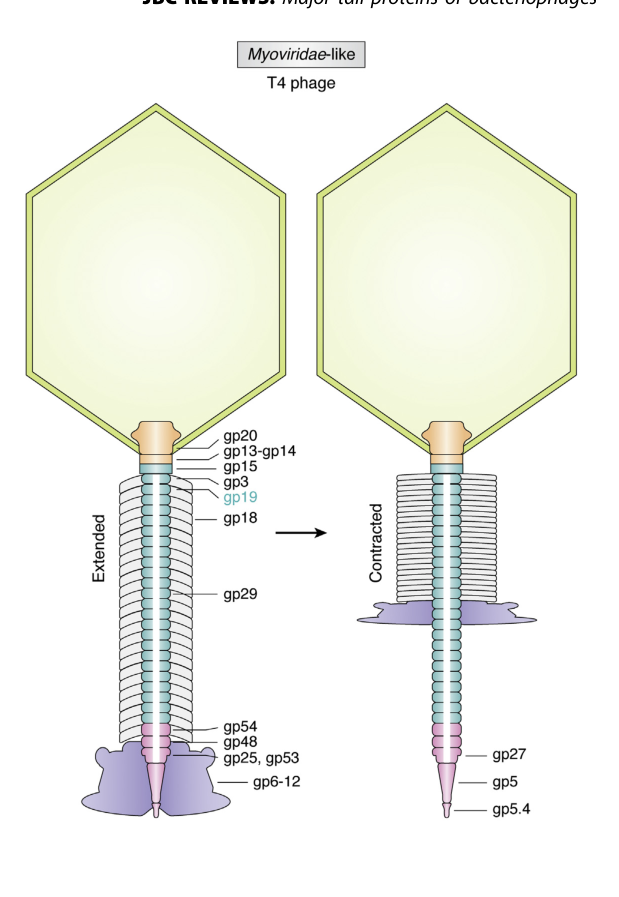

## Question

# Gene Research for Functional Annotation

## ⚠️ CRITICAL: Gene/Protein Identification Context

**BEFORE YOU BEGIN RESEARCH:** You MUST verify you are researching the CORRECT gene/protein. Gene symbols can be ambiguous, especially for less well-characterized genes from non-model organisms.

### Target Gene/Protein Identity (from UniProt):
- **UniProt Accession:** P13333
- **Protein Description:** RecName: Full=Tail tube protein gp19 {ECO:0000305}; AltName: Full=Gene product 19 {ECO:0000305}; Short=gp19;
- **Gene Information:** Name=19;
- **Organism (full):** Enterobacteria phage T4 (Bacteriophage T4).
- **Protein Family:** Belongs to the T4-like viruses Gp19 protein family.
- **Key Domains:** Phage_T4_Gp19. (IPR010667); Phage_T4_gp19 (PF06841)

### MANDATORY VERIFICATION STEPS:

1. **Check if the gene symbol "19" matches the protein description above**
2. **Verify the organism is correct:** Enterobacteria phage T4 (Bacteriophage T4).
3. **Check if protein family/domains align with what you find in literature**
4. **If you find literature for a DIFFERENT gene with the same or similar symbol, STOP**

### If Gene Symbol is Ambiguous or You Cannot Find Relevant Literature:

**DO NOT PROCEED WITH RESEARCH ON A DIFFERENT GENE.** Instead:
- State clearly: "The gene symbol '19' is ambiguous or literature is limited for this specific protein"
- Explain what you found (e.g., "Found extensive literature on a different gene with the same symbol in a different organism")
- Describe the protein based ONLY on the UniProt information provided above
- Suggest that the protein function can be inferred from domain/family information

### Research Target:

Please provide a comprehensive research report on the gene **19** (gene ID: 19, UniProt: P13333) in BPT4.

The research report should be a detailed narrative explaining the function, biological processes, and localization of the gene product. Citations should be given for all claims.

You should prioritize authoritative reviews and primary scientific literature when conducting research. You can supplement
this with annotations you find in gene/protein databases, but these can be outdated or inaccurate.

We are specifically interested in the primary function of the gene - for enzymes, what reaction is catalyzed, and what is the substrate specificity? For transporters, what is the substrate? For structural proteins or adapters, what is the broader structural role? For signaling molecules, what is the role in the pathway.

We are interested in where in or outside the cell the gene product carries out its function.

We are also interested in the signaling or biochemical pathways in which the gene functions. We are less interested in broad pleiotropic effects, except where these elucidate the precise role.

Include evidence where possible. We are interested in both experimental evidence as well as inference from structure, evolution, or bioinformatic analysis. Precise studies should be prioritized over high-throughput, where available.

## Output

Question: You are an expert researcher providing comprehensive, well-cited information.

Provide detailed information focusing on:
1. Key concepts and definitions with current understanding
2. Recent developments and latest research (prioritize 2023-2024 sources)
3. Current applications and real-world implementations
4. Expert opinions and analysis from authoritative sources
5. Relevant statistics and data from recent studies

Format as a comprehensive research report with proper citations. Include URLs and publication dates where available.
Always prioritize recent, authoritative sources and provide specific citations for all major claims.

# Gene Research for Functional Annotation

## ⚠️ CRITICAL: Gene/Protein Identification Context

**BEFORE YOU BEGIN RESEARCH:** You MUST verify you are researching the CORRECT gene/protein. Gene symbols can be ambiguous, especially for less well-characterized genes from non-model organisms.

### Target Gene/Protein Identity (from UniProt):
- **UniProt Accession:** P13333
- **Protein Description:** RecName: Full=Tail tube protein gp19 {ECO:0000305}; AltName: Full=Gene product 19 {ECO:0000305}; Short=gp19;
- **Gene Information:** Name=19;
- **Organism (full):** Enterobacteria phage T4 (Bacteriophage T4).
- **Protein Family:** Belongs to the T4-like viruses Gp19 protein family.
- **Key Domains:** Phage_T4_Gp19. (IPR010667); Phage_T4_gp19 (PF06841)

### MANDATORY VERIFICATION STEPS:

1. **Check if the gene symbol "19" matches the protein description above**
2. **Verify the organism is correct:** Enterobacteria phage T4 (Bacteriophage T4).
3. **Check if protein family/domains align with what you find in literature**
4. **If you find literature for a DIFFERENT gene with the same or similar symbol, STOP**

### If Gene Symbol is Ambiguous or You Cannot Find Relevant Literature:

**DO NOT PROCEED WITH RESEARCH ON A DIFFERENT GENE.** Instead:
- State clearly: "The gene symbol '19' is ambiguous or literature is limited for this specific protein"
- Explain what you found (e.g., "Found extensive literature on a different gene with the same symbol in a different organism")
- Describe the protein based ONLY on the UniProt information provided above
- Suggest that the protein function can be inferred from domain/family information

### Research Target:

Please provide a comprehensive research report on the gene **19** (gene ID: 19, UniProt: P13333) in BPT4.

The research report should be a detailed narrative explaining the function, biological processes, and localization of the gene product. Citations should be given for all claims.

You should prioritize authoritative reviews and primary scientific literature when conducting research. You can supplement
this with annotations you find in gene/protein databases, but these can be outdated or inaccurate.

We are specifically interested in the primary function of the gene - for enzymes, what reaction is catalyzed, and what is the substrate specificity? For transporters, what is the substrate? For structural proteins or adapters, what is the broader structural role? For signaling molecules, what is the role in the pathway.

We are interested in where in or outside the cell the gene product carries out its function.

We are also interested in the signaling or biochemical pathways in which the gene functions. We are less interested in broad pleiotropic effects, except where these elucidate the precise role.

Include evidence where possible. We are interested in both experimental evidence as well as inference from structure, evolution, or bioinformatic analysis. Precise studies should be prioritized over high-throughput, where available.

## Research report: Enterobacteria phage T4 gene 19 (gp19) — tail tube protein (UniProt P13333)

### 1) Target verification (critical disambiguation)
The requested target is **gene 19 (gp19)** from **Enterobacteria phage T4**, which encodes the **tail tube protein gp19** (a virion structural protein). The literature retrieved here consistently uses **“T4 gp19”** to refer to the **major tail tube protein (MTP/TTP)** that forms the inner tail tube of the T4 contractile tail and is not an enzyme or signaling protein (zinke2022majortailproteins pages 2-4, bhatt2021tailstructureand pages 4-5). This matches the UniProt description and the domain-family context for T4-like tail tube proteins (e.g., structural reviews explicitly reference the T4 gp19 structure, including **PDB 5W5F**) (hardy2022talltailscryoelectron pages 4-6, zinke2022majortailproteins media 62ad8d21).

### 2) Key concepts and definitions (current understanding)
**Tail tube protein (TTP)/major tail protein (MTP):** In contractile-tailed phages (Myoviridae-like), the tail tube is a **polymerized, hollow conduit** built from repeated tail tube protein subunits arranged as **hexameric rings** stacked into a tube. In T4, gp19 is the MTP/TTP that polymerizes to create this tube (zinke2022majortailproteins pages 2-4, bhatt2021tailstructureand pages 4-5).

**Contractile tail injection mechanism:** The T4 tail is a contractile nanomachine with an **inner rigid tube** (gp19) surrounded by an **outer contractile sheath** (gp18). Sheath contraction exposes and drives the tube toward/into the host envelope to enable genome delivery through the tube lumen (hardy2022talltailscryoelectron pages 2-4, zinke2022majortailproteins pages 2-4).

**Conserved TTP fold:** Comparative structural analyses describe a conserved tail tube protein architecture centered on a **β-sandwich core**, with an **α-helix** and an extended **β2–β3 hairpin/loop**; upon assembly, subunits form a continuous lumen-lining **β-barrel** (hardy2022talltailscryoelectron pages 4-6, zinke2022majortailproteins pages 10-11).

### 3) Molecular function and biological role of T4 gp19
#### Primary molecular function
T4 gp19 is a **structural polymer**: it **self-assembles into the inner tail tube** and provides the **physical conduit for dsDNA translocation** during infection; it does not catalyze a chemical reaction (zinke2022majortailproteins pages 2-4, gonzalez2021structuralstudiesofa pages 18-20).

#### Biological process: tail morphogenesis and infection
T4 gp19 participates in **tail morphogenesis** and in the **infection-stage genome-ejection conduit** as part of the mature virion tail (bhatt2021tailstructureand pages 4-5, zinke2022majortailproteins pages 2-4).

### 4) Assembly pathway (“pathway context”) and key interaction partners
Multiple sources converge on an ordered assembly model in which gp19 tube formation is scaffolded and terminated by dedicated partners:

1. **Nucleation at the baseplate:** After baseplate formation, **tube initiator proteins gp48 and gp54** (hexameric rings) bind the baseplate and act as a **hub/primer** to initiate tail tube polymerization (zinke2022majortailproteins pages 2-4, bhatt2021tailstructureand pages 4-5).
2. **Tube polymerization around an internal ruler:** gp19 polymerizes into stacked hexameric rings **around the tape measure protein (TMP) gp29**, which occupies the lumen during assembly and is anchored in the baseplate; TMP length correlates with tail length (bhatt2021tailstructureand pages 4-5, zinke2022majortailproteins pages 2-4).
3. **Termination/capping:** The **tail tube terminator gp3** caps/tapers the proximal end of the assembled tube, completing tube assembly (zinke2022majortailproteins pages 2-4, bhatt2021tailstructureand pages 4-5).
4. **Sheath assembly:** After the gp19 tube is built, the contractile **sheath protein gp18** polymerizes around it; the gp19 tube serves as the **template/scaffold** for sheath assembly (zinke2022majortailproteins pages 2-4, bhatt2021tailstructureand pages 4-5).

These interactions define gp19’s pathway context: it is a central component of the T4 tail morphogenesis module, interfacing with baseplate initiators (gp48/gp54), an internal tape-measure/ruler (gp29), a terminator (gp3), and the sheath (gp18) (zinke2022majortailproteins pages 2-4, bhatt2021tailstructureand pages 4-5).

### 5) Subcellular/structural localization
**Virion localization:** gp19 is a **virion structural protein** located in the **tail tube**, forming the inner tube encased by the sheath in the mature phage particle (zinke2022majortailproteins pages 2-4, bhatt2021tailstructureand pages 4-5). Functionally, it operates **extracellularly as part of the virion** until adsorption, and then as part of the injection machinery at the host surface.

**Lumen localization and conduit role:** The **tube lumen** is the path for DNA transfer; gp29 (TMP) occupies the lumen during assembly, while the assembled gp19 tube forms the conduit used during genome delivery (zinke2022majortailproteins pages 2-4, bhatt2021tailstructureand pages 4-5).

### 6) Quantitative structural data and statistics (recent + foundational)
#### T4 gp19-specific quantitative data
* **Stoichiometry / architecture:** T4 gp19 polymerizes into **24 stacked hexameric rings** (i.e., **144 subunits**) to form the tail tube (zinke2022majortailproteins pages 2-4, gonzalez2021structuralstudiesofa pages 18-20).
* **Channel size:** The gp19 tube lumen/channel is reported as approximately **~40 Å (~4 nm) diameter** (gonzalez2021structuralstudiesofa pages 18-20, hardy2022talltailscryoelectron pages 2-4).
* **Ring geometry:** A structural review reports **~40.2 Å ring thickness** and **~17.9° rotation** between adjacent rings in the T4 gp19 tube lattice (zinke2022majortailproteins pages 10-11).
* **Electrostatics:** The lumen-lining β-barrel is described as having a **negative electrostatic potential** consistent with DNA conduction (zinke2022majortailproteins pages 10-11).
* **Mass / copies (summary values):** gp19 has been reported as ~**18.5 kDa** with **144 copies** per virion tail tube (gonzalez2021structuralstudiesofa pages 18-20).

#### Infection mechanics context (tube exposure/penetration, review-level)
A cryo-EM-focused review of phage tail conduits notes that for contractile tails such as T4, contraction can expose roughly **~40 nm** of the inner tube, and a tail tube can span a **~30 nm periplasm**; these are not unique to gp19 but are used as T4-relevant mechanistic benchmarks (hardy2022talltailscryoelectron pages 2-4).

### 7) Structural biology: domains, fold, and conserved features
A comparative cryo-EM review explicitly lists **T4 gp19 (PDB 5W5F)** among representative tail tube protein structures and describes the conserved features that underpin functional annotation: the **β-sandwich core**, the **β2–β3 loop/hairpin**, and inter-subunit contacts that generate a continuous **lumen-lining β-barrel** (hardy2022talltailscryoelectron pages 4-6). A major-tail-protein review further highlights that T4 gp19 contains distinguishing loop elements relative to minimal prototypes and provides ring geometry parameters (zinke2022majortailproteins pages 10-11). Figure panels in that review visually localize gp19 within the T4 virion and show the gp19 subunit structure (PDB 5W5F) (zinke2022majortailproteins media 62ad8d21, zinke2022majortailproteins media 3a190779).

### 8) Recent developments (prioritizing 2023–2024 literature) and how they affect annotation
Direct 2023–2024 papers specifically re-determining **T4** gp19 were not recovered in this tool run; however, high-resolution structural atlases of **T4-like contractile tails** in 2023–2024 reinforce the conserved role and fold of gp19-family tail tube proteins and expand engineering-relevant datasets:

* **Therapeutic-phage structural atlases (2024):** A 2024 cryo-EM single-particle study of therapeutic Pseudomonas phage **Pa193** provides quantitative tail architecture (e.g., helical sheath parameters: **rise 27.4 Å; twist 36.2°; pitch ~476.6 Å**) and includes tail tube tertiary-structure description (β-sandwich with extensions) in a T4-like contractile tail, supporting modern comparative annotation and engineering opportunities for contractile tail modules (iglesias2024cryoemanalysisof pages 7-9).
* **High-resolution contractile-tail reconstructions (2023):** A 2023 Nature Communications study of phage **E217** reports near-atomic reconstructions (e.g., **3.1–3.4 Å** for sheath/baseplate components), baseplate mass (~**1.4 MDa**), and numerous interface-area measurements, providing contemporary quantitative benchmarks for contractile-tail engineering and for interpreting tail-tube/baseplate interfaces in T4-like systems (li2023highresolutioncryoemstructure pages 6-8).
* **Minimal contractile injection machines (2023):** A 2023 cryo-EM study of **Vibrio phage XM1** provides quantitative contraction metrics (sheath length shrinking **~630 Å to ~290 Å**, ring diameter changes, helical parameters), offering comparative constraints on how sheath-tube systems function mechanically around a rigid inner tube analogous to T4 gp19 (wang2023structureofvibrio pages 9-10).

Taken together, 2023–2024 work most strongly advances gp19 annotation by (i) expanding the catalog of near-atomic contractile-tail machines, and (ii) enabling structure-guided engineering across phage therapy candidates, for which gp19-family tube proteins are core structural modules (iglesias2024cryoemanalysisof pages 7-9, li2023highresolutioncryoemstructure pages 6-8).

### 9) Current applications and real-world implementations (2023–2024)
**Phage therapy / engineering support:** The Pa193 work is explicitly framed as providing a structural atlas of a therapeutic phage to support understanding and engineering of phages as biomedicines (phage therapy), including tail architecture components relevant to tube proteins (iglesias2024cryoemanalysisof pages 7-9).

**Synthetic-phage diagnostics (2024):** A 2024 Communications Biology study demonstrates **in vitro assembly-based synthesis** of an engineered phage (vB_Eco4M-7; **68 kb** genome) for **E. coli O157 detection**, including systematic testing of **20** insertion sites and broad isolate coverage (**53 O157 isolates detected; 35 non-O157 distinguished**). This application focuses on a tail-fiber protein rather than gp19, but it exemplifies real-world manipulation of phage structural proteins and the growing translational landscape in which structural knowledge of tail modules (including tube proteins) is leveraged (tamura2024syntheticphagebasedapproach pages 1-2).

### 10) Expert synthesis / interpretation (what authoritative sources imply)
Authoritative structural reviews converge on the interpretation that gp19’s **primary function is architectural and mechanical**: a self-assembling polymer that must (i) form a stable, rigid conduit; (ii) interface precisely with baseplate initiators and terminators; (iii) provide a geometrically matched template for sheath polymerization; and (iv) present a lumen electrostatic environment compatible with high-rate dsDNA translocation (zinke2022majortailproteins pages 2-4, zinke2022majortailproteins pages 10-11, hardy2022talltailscryoelectron pages 4-6). This consensus aligns with the conservation of the TTP β-sandwich fold across contractile injection systems, supporting robust inference of function from family/domain membership when direct experiments are limited (hardy2022talltailscryoelectron pages 4-6, zinke2022majortailproteins pages 10-11).

### 11) Visual evidence from retrieved literature
A major-tail-protein review contains figures that (i) locate gp19 in the T4 virion and (ii) show the atomic structure of T4 gp19 (PDB 5W5F) and the generic tube architecture (hexameric rings and lumen lining), supporting the structural basis for functional annotation (zinke2022majortailproteins media 62ad8d21, zinke2022majortailproteins media 3a190779).

### 12) Summary (functional annotation statement)
**Gene 19 (gp19; UniProt P13333) of Enterobacteria phage T4 encodes the tail tube protein gp19**, a virion structural protein that polymerizes into **24 stacked hexameric rings (144 subunits)** to form the rigid inner tail tube. Tube assembly is **initiated** by baseplate proteins **gp48/gp54**, proceeds **around the tape-measure protein gp29** in the lumen, is **terminated** by **gp3**, and then becomes encased by the **gp18 sheath**, for which gp19 provides the assembly template. The tube lumen is approximately **~40 Å (~4 nm)** and is lined by a β-barrel with **negative electrostatic potential**, consistent with its role as the conduit for dsDNA delivery during infection (zinke2022majortailproteins pages 2-4, bhatt2021tailstructureand pages 4-5, zinke2022majortailproteins pages 10-11, gonzalez2021structuralstudiesofa pages 18-20).

---

## Embedded summary table
| Aspect | Specific details | Key citations (pqac ids) | Primary sources (paper title, year, DOI URL) |
|---|---|---|---|
| Molecular function | T4 gp19 is the major tail tube protein (tail tube structural subunit) that polymerizes into stacked hexameric rings to form the hollow inner tube of the contractile tail; this tube serves as the conduit for dsDNA delivery during infection rather than catalyzing a chemical reaction. | (zinke2022majortailproteins pages 2-4, gonzalez2021structuralstudiesofa pages 18-20) | Major tail proteins of bacteriophages of the order Caudovirales, 2022, https://doi.org/10.1016/j.jbc.2021.101472; Structural studies of the phage G capsid and helical tail sheath using cryo-EM, 2021, https://doi.org/10.25394/pgs.15156780.v1 |
| Biological process | gp19 functions in T4 tail morphogenesis: tube assembly begins at the baseplate, grows around the tape measure protein, is capped by a terminator, and then acts as the template/scaffold for contractile sheath assembly. | (bhatt2021tailstructureand pages 4-5, zinke2022majortailproteins pages 2-4, bhatt2021tailstructureand pages 2-4) | Tail Structure and Dynamics, 2021, https://doi.org/10.1016/b978-0-12-809633-8.20965-5; Major tail proteins of bacteriophages of the order Caudovirales, 2022, https://doi.org/10.1016/j.jbc.2021.101472 |
| Cellular component / localization | gp19 is a virion structural protein located in the phage tail tube, external to the host prior to adsorption and then positioned as the injection conduit spanning from the baseplate toward the host envelope during infection. Its lumen encloses/aligns with the internal tape measure protein before genome release. | (bhatt2021tailstructureand pages 4-5, zinke2022majortailproteins pages 2-4) | Tail Structure and Dynamics, 2021, https://doi.org/10.1016/b978-0-12-809633-8.20965-5; Major tail proteins of bacteriophages of the order Caudovirales, 2022, https://doi.org/10.1016/j.jbc.2021.101472 |
| Key interactions | gp19 assembles around gp29 (tape measure protein) in the lumen; polymerization is nucleated by baseplate-associated initiators gp48 and gp54; the proximal end is capped by hexameric terminator gp3; the completed gp19 tube is encased by and templates assembly of sheath protein gp18. | (bhatt2021tailstructureand pages 4-5, zinke2022majortailproteins pages 2-4, gonzalez2021structuralstudiesofa pages 18-20) | Tail Structure and Dynamics, 2021, https://doi.org/10.1016/b978-0-12-809633-8.20965-5; Major tail proteins of bacteriophages of the order Caudovirales, 2022, https://doi.org/10.1016/j.jbc.2021.101472; Structural studies of the phage G capsid and helical tail sheath using cryo-EM, 2021, https://doi.org/10.25394/pgs.15156780.v1 |
| Quantitative structural data | T4 gp19 forms 24 stacked hexameric rings (144 subunits total) in the mature tail tube; monomer mass is ~18.5 kDa; the central channel is reported at ~40 Å diameter. | (zinke2022majortailproteins pages 2-4, gonzalez2021structuralstudiesofa pages 18-20) | Major tail proteins of bacteriophages of the order Caudovirales, 2022, https://doi.org/10.1016/j.jbc.2021.101472; Structural studies of the phage G capsid and helical tail sheath using cryo-EM, 2021, https://doi.org/10.25394/pgs.15156780.v1 |
| Quantitative structural data | Review-level structural comparison reports T4 gp19 hexameric rings as ~40.2 Å thick with ~17.9° rotation between rings; the tube lumen is lined by a 24-stranded β-barrel with negative electrostatic potential favorable for DNA conduction. | (zinke2022majortailproteins pages 10-11, hardy2022talltailscryoelectron pages 4-6) | Major tail proteins of bacteriophages of the order Caudovirales, 2022, https://doi.org/10.1016/j.jbc.2021.101472; Tall tails: cryo-electron microscopy of phage tail DNA ejection conduits, 2022, https://doi.org/10.1042/bst20210799 |
| Structural definition | The T4 gp19 fold is a conserved tail tube protein architecture centered on a β-sandwich core with an α-helix and extended hairpin/loop elements; assembled subunits form a continuous lumen-lining β-barrel. T4 gp19 is explicitly represented by PDB 5W5F in comparative structural reviews. | (hardy2022talltailscryoelectron pages 4-6, zinke2022majortailproteins media 62ad8d21, zinke2022majortailproteins media 3a190779) | Tall tails: cryo-electron microscopy of phage tail DNA ejection conduits, 2022, https://doi.org/10.1042/bst20210799; Major tail proteins of bacteriophages of the order Caudovirales, 2022, https://doi.org/10.1016/j.jbc.2021.101472 |
| Quantitative structural data | General contractile-tail context: polymerized tail tube proteins form straight tubes with ~4 nm internal diameter; during contraction, ~40 nm of inner tube can become exposed, enough to traverse a ~30 nm periplasm. These values are not exclusive to T4 gp19 but are used in T4-focused tail tube reviews. | (hardy2022talltailscryoelectron pages 2-4) | Tall tails: cryo-electron microscopy of phage tail DNA ejection conduits, 2022, https://doi.org/10.1042/bst20210799 |
| Evidence type | Evidence is primarily structural and morphogenetic: cryo-EM/X-ray-derived models of T4-like tail tube proteins, comparative structural reviews, and assembly-pathway analyses support assignment of gp19 as a non-enzymatic virion tube/scaffold protein. | (hardy2022talltailscryoelectron pages 4-6, zinke2022majortailproteins pages 2-4, bhatt2021tailstructureand pages 4-5) | Tall tails: cryo-electron microscopy of phage tail DNA ejection conduits, 2022, https://doi.org/10.1042/bst20210799; Major tail proteins of bacteriophages of the order Caudovirales, 2022, https://doi.org/10.1016/j.jbc.2021.101472; Tail Structure and Dynamics, 2021, https://doi.org/10.1016/b978-0-12-809633-8.20965-5 |
| Recent developments (comparative context, 2023) | A 2023 structure of Vibrio phage XM1 reports a tail tube protein with a β-sandwich fold similar to phage T4 gp19, reinforcing that T4 gp19 represents a conserved contractile-injection-system tube architecture across myophages. | (wang2023structureofvibrio pages 9-10) | Structure of Vibrio Phage XM1, a Simple Contractile DNA Injection Machine, 2023, https://doi.org/10.3390/v15081673 |
| Recent developments (comparative context, 2023) | The therapeutic Pseudomonas phage E217 structural atlas resolved the extended/contracted tail and baseplate, showing a rigid tube surrounded by sheath and a baseplate cap protein (gp36) structurally similar to the tail tube protein; this provides recent high-resolution context for T4-like contractile tail tube design in biomedically relevant phages. | (li2023highresolutioncryoemstructure pages 6-8, li2023highresolutioncryoemstructure pages 8-9) | High-resolution cryo-EM structure of the Pseudomonas bacteriophage E217, 2023, https://doi.org/10.1038/s41467-023-39756-z |
| Recent developments (comparative context, 2024) | The 2024 Pa193 cryo-EM study, on a therapeutic contractile-tailed phage, resolved the tail tube tertiary structure as a β-sandwich with N-terminal extensions and quantified helical tail parameters; although not T4 gp19 itself, it extends the modern structural framework for annotation of T4-like tube proteins in phage therapy candidates. | (iglesias2024cryoemanalysisof pages 7-9) | Cryo-EM analysis of Pseudomonas phage Pa193 structural components, 2024, https://doi.org/10.1038/s42003-024-06985-x |
| Recent developments (comparative context, 2024-2025 domain usage) | Recent environmental and omics studies continue to identify the PF06841/Phage_T4_gp19 domain as a marker of T4-like tail tube proteins in viral and bacterial predatory systems, supporting family-level annotation of gp19 homologs, though these studies do not experimentally redefine T4 gp19 function. | (zinke2022majortailproteins pages 2-4) | A hunting ground for predatory bacteria at the Zhenbei seamount in the South China Sea, 2025, https://doi.org/10.1093/ismeco/ycaf042 |
| Annotation confidence | High confidence for primary function: all retrieved T4-specific and comparative sources consistently support gp19 as a structural tail tube protein in the T4-like viruses Gp19 family, with no credible alternative enzymatic or receptor-binding primary role identified. | (zinke2022majortailproteins pages 2-4, bhatt2021tailstructureand pages 4-5, hardy2022talltailscryoelectron pages 4-6) | Major tail proteins of bacteriophages of the order Caudovirales, 2022, https://doi.org/10.1016/j.jbc.2021.101472; Tail Structure and Dynamics, 2021, https://doi.org/10.1016/b978-0-12-809633-8.20965-5; Tall tails: cryo-electron microscopy of phage tail DNA ejection conduits, 2022, https://doi.org/10.1042/bst20210799 |

*Table: This table summarizes the functional annotation of bacteriophage T4 gp19 (UniProt P13333), including its role in tail tube assembly, localization, interactions, and quantitative structural features. It also adds 2023-2024 comparative structural studies to show how recent work supports and extends the annotation of T4-like gp19 proteins.*

References

1. (zinke2022majortailproteins pages 2-4): Maximilian Zinke, Gunnar F. Schröder, and Adam Lange. Major tail proteins of bacteriophages of the order caudovirales. Journal of Biological Chemistry, 298:101472, Jan 2022. URL: https://doi.org/10.1016/j.jbc.2021.101472, doi:10.1016/j.jbc.2021.101472. This article has 101 citations and is from a domain leading peer-reviewed journal.

2. (bhatt2021tailstructureand pages 4-5): Shweta Bhatt, Petr G. Leiman, and Nicholas M.I. Taylor. Tail structure and dynamics. ArXiv, pages 186-193, Jan 2021. URL: https://doi.org/10.1016/b978-0-12-809633-8.20965-5, doi:10.1016/b978-0-12-809633-8.20965-5. This article has 5 citations.

3. (hardy2022talltailscryoelectron pages 4-6): Joshua M. Hardy, Rhys A. Dunstan, Trevor Lithgow, and Fasséli Coulibaly. Tall tails: cryo-electron microscopy of phage tail dna ejection conduits. Biochemical Society Transactions, 50:459-22W, Feb 2022. URL: https://doi.org/10.1042/bst20210799, doi:10.1042/bst20210799. This article has 44 citations and is from a peer-reviewed journal.

4. (zinke2022majortailproteins media 62ad8d21): Maximilian Zinke, Gunnar F. Schröder, and Adam Lange. Major tail proteins of bacteriophages of the order caudovirales. Journal of Biological Chemistry, 298:101472, Jan 2022. URL: https://doi.org/10.1016/j.jbc.2021.101472, doi:10.1016/j.jbc.2021.101472. This article has 101 citations and is from a domain leading peer-reviewed journal.

5. (hardy2022talltailscryoelectron pages 2-4): Joshua M. Hardy, Rhys A. Dunstan, Trevor Lithgow, and Fasséli Coulibaly. Tall tails: cryo-electron microscopy of phage tail dna ejection conduits. Biochemical Society Transactions, 50:459-22W, Feb 2022. URL: https://doi.org/10.1042/bst20210799, doi:10.1042/bst20210799. This article has 44 citations and is from a peer-reviewed journal.

6. (zinke2022majortailproteins pages 10-11): Maximilian Zinke, Gunnar F. Schröder, and Adam Lange. Major tail proteins of bacteriophages of the order caudovirales. Journal of Biological Chemistry, 298:101472, Jan 2022. URL: https://doi.org/10.1016/j.jbc.2021.101472, doi:10.1016/j.jbc.2021.101472. This article has 101 citations and is from a domain leading peer-reviewed journal.

7. (gonzalez2021structuralstudiesofa pages 18-20): Brenda Gonzalez. Structural studies of the phage g capsid and helical tail sheath using cryo-em. ArXiv, Aug 2021. URL: https://doi.org/10.25394/pgs.15156780.v1, doi:10.25394/pgs.15156780.v1. This article has 0 citations.

8. (zinke2022majortailproteins media 3a190779): Maximilian Zinke, Gunnar F. Schröder, and Adam Lange. Major tail proteins of bacteriophages of the order caudovirales. Journal of Biological Chemistry, 298:101472, Jan 2022. URL: https://doi.org/10.1016/j.jbc.2021.101472, doi:10.1016/j.jbc.2021.101472. This article has 101 citations and is from a domain leading peer-reviewed journal.

9. (iglesias2024cryoemanalysisof pages 7-9): Stephano M. Iglesias, Chun-Feng David Hou, Johnny Reid, Evan Schauer, Renae Geier, Angela Soriaga, Lucy Sim, Lucy Gao, Julian Whitelegge, Pierre Kyme, Deborah Birx, Sebastien Lemire, and Gino Cingolani. Cryo-em analysis of pseudomonas phage pa193 structural components. Communications Biology, Oct 2024. URL: https://doi.org/10.1038/s42003-024-06985-x, doi:10.1038/s42003-024-06985-x. This article has 11 citations and is from a peer-reviewed journal.

10. (li2023highresolutioncryoemstructure pages 6-8): Fenglin Li, Chun-Feng David Hou, Ravi K. Lokareddy, Ruoyu Yang, Francesca Forti, Federica Briani, and Gino Cingolani. High-resolution cryo-em structure of the pseudomonas bacteriophage e217. Nature Communications, Jul 2023. URL: https://doi.org/10.1038/s41467-023-39756-z, doi:10.1038/s41467-023-39756-z. This article has 56 citations and is from a highest quality peer-reviewed journal.

11. (wang2023structureofvibrio pages 9-10): Zhiqing Wang, Andrei Fokine, Xinwu Guo, Wen Jiang, Michael G. Rossmann, Richard J. Kuhn, Zhu-Hua Luo, and Thomas Klose. Structure of vibrio phage xm1, a simple contractile dna injection machine. Viruses, 15:1673, Jul 2023. URL: https://doi.org/10.3390/v15081673, doi:10.3390/v15081673. This article has 19 citations.

12. (tamura2024syntheticphagebasedapproach pages 1-2): Azumi Tamura, Aa Haeruman Azam, Tomohiro Nakamura, Kenichi Lee, Sunao Iyoda, Kohei Kondo, Shinjiro Ojima, Kotaro Chihara, Wakana Yamashita, Longzhu Cui, Yukihiro Akeda, Koichi Watashi, Yoshimasa Takahashi, Hiroshi Yotsuyanagi, and Kotaro Kiga. Synthetic phage-based approach for sensitive and specific detection of escherichia coli o157. Communications Biology, May 2024. URL: https://doi.org/10.1038/s42003-024-06247-w, doi:10.1038/s42003-024-06247-w. This article has 12 citations and is from a peer-reviewed journal.

13. (bhatt2021tailstructureand pages 2-4): Shweta Bhatt, Petr G. Leiman, and Nicholas M.I. Taylor. Tail structure and dynamics. ArXiv, pages 186-193, Jan 2021. URL: https://doi.org/10.1016/b978-0-12-809633-8.20965-5, doi:10.1016/b978-0-12-809633-8.20965-5. This article has 5 citations.

14. (li2023highresolutioncryoemstructure pages 8-9): Fenglin Li, Chun-Feng David Hou, Ravi K. Lokareddy, Ruoyu Yang, Francesca Forti, Federica Briani, and Gino Cingolani. High-resolution cryo-em structure of the pseudomonas bacteriophage e217. Nature Communications, Jul 2023. URL: https://doi.org/10.1038/s41467-023-39756-z, doi:10.1038/s41467-023-39756-z. This article has 56 citations and is from a highest quality peer-reviewed journal.

## Artifacts

- [Edison artifact artifact-00](19-deep-research-falcon_artifacts/artifact-00.md)

## Citations

1. zinke2022majortailproteins pages 10-11
2. gonzalez2021structuralstudiesofa pages 18-20
3. hardy2022talltailscryoelectron pages 2-4
4. hardy2022talltailscryoelectron pages 4-6
5. iglesias2024cryoemanalysisof pages 7-9
6. li2023highresolutioncryoemstructure pages 6-8
7. wang2023structureofvibrio pages 9-10
8. tamura2024syntheticphagebasedapproach pages 1-2
9. zinke2022majortailproteins pages 2-4
10. bhatt2021tailstructureand pages 4-5
11. bhatt2021tailstructureand pages 2-4
12. li2023highresolutioncryoemstructure pages 8-9
13. https://doi.org/10.1016/j.jbc.2021.101472;
14. https://doi.org/10.25394/pgs.15156780.v1
15. https://doi.org/10.1016/b978-0-12-809633-8.20965-5;
16. https://doi.org/10.1016/j.jbc.2021.101472
17. https://doi.org/10.1042/bst20210799
18. https://doi.org/10.1042/bst20210799;
19. https://doi.org/10.1016/b978-0-12-809633-8.20965-5
20. https://doi.org/10.3390/v15081673
21. https://doi.org/10.1038/s41467-023-39756-z
22. https://doi.org/10.1038/s42003-024-06985-x
23. https://doi.org/10.1093/ismeco/ycaf042
24. https://doi.org/10.1016/j.jbc.2021.101472,
25. https://doi.org/10.1016/b978-0-12-809633-8.20965-5,
26. https://doi.org/10.1042/bst20210799,
27. https://doi.org/10.25394/pgs.15156780.v1,
28. https://doi.org/10.1038/s42003-024-06985-x,
29. https://doi.org/10.1038/s41467-023-39756-z,
30. https://doi.org/10.3390/v15081673,
31. https://doi.org/10.1038/s42003-024-06247-w,