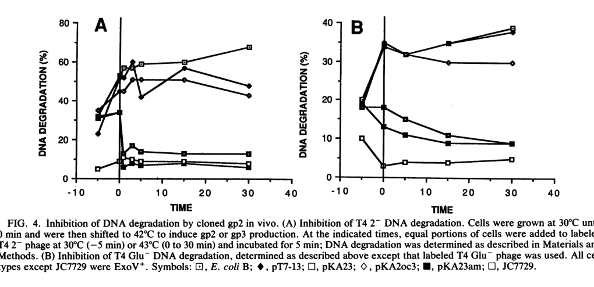

## Question

# Gene Research for Functional Annotation

## ⚠️ CRITICAL: Gene/Protein Identification Context

**BEFORE YOU BEGIN RESEARCH:** You MUST verify you are researching the CORRECT gene/protein. Gene symbols can be ambiguous, especially for less well-characterized genes from non-model organisms.

### Target Gene/Protein Identity (from UniProt):
- **UniProt Accession:** P15076
- **Protein Description:** RecName: Full=Terminal DNA protecting protein; AltName: Full=Gene product 64; Short=gp64; AltName: Full=Head protein Gp2;
- **Gene Information:** Name=2; Synonyms=64;
- **Organism (full):** Enterobacteria phage T4 (Bacteriophage T4).
- **Protein Family:** Not specified in UniProt
- **Key Domains:** Not specified in UniProt

### MANDATORY VERIFICATION STEPS:

1. **Check if the gene symbol "2" matches the protein description above**
2. **Verify the organism is correct:** Enterobacteria phage T4 (Bacteriophage T4).
3. **Check if protein family/domains align with what you find in literature**
4. **If you find literature for a DIFFERENT gene with the same or similar symbol, STOP**

### If Gene Symbol is Ambiguous or You Cannot Find Relevant Literature:

**DO NOT PROCEED WITH RESEARCH ON A DIFFERENT GENE.** Instead:
- State clearly: "The gene symbol '2' is ambiguous or literature is limited for this specific protein"
- Explain what you found (e.g., "Found extensive literature on a different gene with the same symbol in a different organism")
- Describe the protein based ONLY on the UniProt information provided above
- Suggest that the protein function can be inferred from domain/family information

### Research Target:

Please provide a comprehensive research report on the gene **2** (gene ID: 2, UniProt: P15076) in BPT4.

The research report should be a detailed narrative explaining the function, biological processes, and localization of the gene product. Citations should be given for all claims.

You should prioritize authoritative reviews and primary scientific literature when conducting research. You can supplement
this with annotations you find in gene/protein databases, but these can be outdated or inaccurate.

We are specifically interested in the primary function of the gene - for enzymes, what reaction is catalyzed, and what is the substrate specificity? For transporters, what is the substrate? For structural proteins or adapters, what is the broader structural role? For signaling molecules, what is the role in the pathway.

We are interested in where in or outside the cell the gene product carries out its function.

We are also interested in the signaling or biochemical pathways in which the gene functions. We are less interested in broad pleiotropic effects, except where these elucidate the precise role.

Include evidence where possible. We are interested in both experimental evidence as well as inference from structure, evolution, or bioinformatic analysis. Precise studies should be prioritized over high-throughput, where available.

## Output

Question: You are an expert researcher providing comprehensive, well-cited information.

Provide detailed information focusing on:
1. Key concepts and definitions with current understanding
2. Recent developments and latest research (prioritize 2023-2024 sources)
3. Current applications and real-world implementations
4. Expert opinions and analysis from authoritative sources
5. Relevant statistics and data from recent studies

Format as a comprehensive research report with proper citations. Include URLs and publication dates where available.
Always prioritize recent, authoritative sources and provide specific citations for all major claims.

# Gene Research for Functional Annotation

## ⚠️ CRITICAL: Gene/Protein Identification Context

**BEFORE YOU BEGIN RESEARCH:** You MUST verify you are researching the CORRECT gene/protein. Gene symbols can be ambiguous, especially for less well-characterized genes from non-model organisms.

### Target Gene/Protein Identity (from UniProt):
- **UniProt Accession:** P15076
- **Protein Description:** RecName: Full=Terminal DNA protecting protein; AltName: Full=Gene product 64; Short=gp64; AltName: Full=Head protein Gp2;
- **Gene Information:** Name=2; Synonyms=64;
- **Organism (full):** Enterobacteria phage T4 (Bacteriophage T4).
- **Protein Family:** Not specified in UniProt
- **Key Domains:** Not specified in UniProt

### MANDATORY VERIFICATION STEPS:

1. **Check if the gene symbol "2" matches the protein description above**
2. **Verify the organism is correct:** Enterobacteria phage T4 (Bacteriophage T4).
3. **Check if protein family/domains align with what you find in literature**
4. **If you find literature for a DIFFERENT gene with the same or similar symbol, STOP**

### If Gene Symbol is Ambiguous or You Cannot Find Relevant Literature:

**DO NOT PROCEED WITH RESEARCH ON A DIFFERENT GENE.** Instead:
- State clearly: "The gene symbol '2' is ambiguous or literature is limited for this specific protein"
- Explain what you found (e.g., "Found extensive literature on a different gene with the same symbol in a different organism")
- Describe the protein based ONLY on the UniProt information provided above
- Suggest that the protein function can be inferred from domain/family information

### Research Target:

Please provide a comprehensive research report on the gene **2** (gene ID: 2, UniProt: P15076) in BPT4.

The research report should be a detailed narrative explaining the function, biological processes, and localization of the gene product. Citations should be given for all claims.

You should prioritize authoritative reviews and primary scientific literature when conducting research. You can supplement
this with annotations you find in gene/protein databases, but these can be outdated or inaccurate.

We are specifically interested in the primary function of the gene - for enzymes, what reaction is catalyzed, and what is the substrate specificity? For transporters, what is the substrate? For structural proteins or adapters, what is the broader structural role? For signaling molecules, what is the role in the pathway.

We are interested in where in or outside the cell the gene product carries out its function.

We are also interested in the signaling or biochemical pathways in which the gene functions. We are less interested in broad pleiotropic effects, except where these elucidate the precise role.

Include evidence where possible. We are interested in both experimental evidence as well as inference from structure, evolution, or bioinformatic analysis. Precise studies should be prioritized over high-throughput, where available.

## Research Report: Functional Annotation of **Enterobacteria phage T4 gene 2 (gp2/gp64)** (UniProt **P15076**)

### Executive summary
Enterobacteria phage T4 **gene 2** encodes **gp2** (historically also called **gp64**), a small, highly basic virion-associated protein that **protects the linear T4 dsDNA termini from degradation by host exonuclease V (ExoV; RecBCD complex)** immediately upon injection into the host cytoplasm. Experimental evidence supports a mechanism in which gp2 acts **at/near the DNA ends and the head–tail junction** (end occlusion/binding), rather than functioning primarily as a catalytic inhibitor of RecBCD. Gp2 additionally contributes to efficient **head-to-tail joining** during morphogenesis and can be reconstituted into infectious particles using recombinant protein in vitro. (lipinska1989cloningandidentification pages 1-1, wang2000bacteriophaget4selfassembly pages 1-2, wang2000bacteriophaget4selfassembly pages 1-1)

### 1) Target identity verification and nomenclature (critical disambiguation)
* **Correct target:** bacteriophage T4 **gene 2 product gp2**, also referred to as **gp64** in older nomenclature. Lipińska et al. mapped **gene 2 and gene 64 to the same ORF**, encoding a single protein, and experimentally identified the product as gp2. (lipinska1989cloningandidentification pages 8-9)
* **Ambiguity warning:** “gene 2” refers to unrelated proteins in other systems (e.g., T7 gene 2.5 ssDNA-binding protein; “gp2” as a terminase in other phages). This report is restricted to **T4 gene 2 / gp2 / gp64 (UniProt P15076)** as experimentally characterized in T4. (lipinska1989cloningandidentification pages 8-9)

### 2) Key concepts and definitions (current understanding)
#### 2.1 Exonucleolytic restriction by RecBCD/ExoV
In E. coli, the **RecBCD (ExoV) enzyme** is a potent ATP-dependent nuclease/helicase that initiates degradation from free double-stranded DNA ends. For linear phage genomes, this creates strong selection for strategies that **block or evade RecBCD access**.

#### 2.2 “Terminal DNA protecting protein” (gp2): functional definition
In the T4 system, gp2 is best defined functionally as a **virion-associated DNA-end protection factor** that prevents RecBCD/ExoV from engaging the incoming linear phage genome ends. Lipińska et al. directly demonstrated that gp2 (from a cloned gene) can **protect T4 dsDNA ends from ExoV action** in vivo. (lipinska1989cloningandidentification pages 1-1, lipinska1989cloningandidentification pages 8-9)

### 3) Molecular function, mechanism, and biological role
#### 3.1 Primary molecular function: protection of T4 DNA termini from RecBCD/ExoV
* Lipińska et al. report that cloned gp2 **protects T4 DNA double-stranded ends from exonuclease V (RecBCD/ExoV)**, and that gp2 can function **in trans** when expressed from a plasmid in the host. (lipinska1989cloningandidentification pages 1-1, lipinska1989cloningandidentification pages 8-9)
* Wang et al. frame this as protection against “exonucleolytic restriction,” noting ExoV as the causal activity for incoming DNA hydrolysis and that gp2 is **attached to the DNA terminus in the mature head**, consistent with end protection at entry. (wang2000bacteriophaget4selfassembly pages 1-2)

#### 3.2 Mechanism: end occlusion/binding at the head–tail junction (not a global RecBCD inhibitor)
* Lipińska et al. describe gp2 as a **head-associated protein** that binds **at the junction of the head and tail** and protects DNA ends; they propose gp2 accompanies the DNA during morphogenesis/injection to keep termini inaccessible to ExoV. (lipinska1989cloningandidentification pages 1-1)
* Wang et al. argue that gp2’s “functional effect is directly on the DNA and not as an ExoV inhibitor,” noting timing effects (gp2 present shortly before infection yields rapid protection) consistent with terminal binding/occlusion, though they acknowledge the steric model is not proven with definitive structural/biophysical data in their work. (wang2000bacteriophaget4selfassembly pages 7-7)

#### 3.3 Secondary (morphogenetic) role: head-to-tail joining
Wang et al. show gp2 is also required for efficient **head-to-tail (H–T) joining** during in vitro reconstitution: heads from gene 2 amber mutants require added recombinant gp2 for H–T joining, and reconstituted particles exhibit reduced ability to plaque under conditions requiring ExoV protection. (wang2000bacteriophaget4selfassembly pages 1-1)

### 4) Localization and timing (where/when gp2 acts)
* **Virion association:** gp2 is incorporated into the phage head and associated with the packaged genome terminus (terminal/end-bound localization). (wang2000bacteriophaget4selfassembly pages 1-2)
* **Functional stage:** gp2’s end-protective role is exercised **immediately upon DNA injection into the cytoplasm**, where RecBCD would otherwise degrade the genome from its free ends. (lipinska1989cloningandidentification pages 1-1, wang2000bacteriophaget4selfassembly pages 1-2)
* **Expression timing:** gp2 is reported to be **late expressed** in infection; Wang et al. note gp2 detectability after ~**13 min at 37°C**, consistent with incorporation during morphogenesis rather than serving as an early, diffusible anti-RecBCD factor. (wang2000bacteriophaget4selfassembly pages 4-5)

### 5) Mutant phenotypes (functional genetics)
Gene 2 mutants show pleiotropic defects attributable to the absence of terminal protection and morphogenetic roles:
* **Incoming DNA degradation** by host ExoV/RecBCD, leading to **reduced burst size** and failure to grow in ExoV+ hosts; restriction is suppressed in **recBC (ExoV)-negative** hosts, consistent with the RecBCD-targeted phenotype. (wang2000bacteriophaget4selfassembly pages 1-1, lipinska1989cloningandidentification pages 1-1)
* **Morphogenesis defects,** including impaired head filling and tail attachment/H–T joining. (lipinska1989cloningandidentification pages 1-1, wang2000bacteriophaget4selfassembly pages 1-1)

### 6) Quantitative data and key experimental results
#### 6.1 Protein properties
* **Size:** gp2 predicted ~**27,068 Da** but migrates ~**30 kDa** on SDS-PAGE. (lipinska1989cloningandidentification pages 1-1, lipinska1989cloningandidentification pages 7-8)
* **Basicity:** gp2 is described as extremely basic (reported pI ~**10.94**) and Lys/Arg-rich (migration anomaly attributed to high basic residue content). (wang2000bacteriophaget4selfassembly pages 7-7, lipinska1989cloningandidentification pages 7-8)

#### 6.2 In vivo protection assay (direct evidence)
Lipińska et al. used radiolabeled infecting DNA and measured degradation into acid-soluble fragments; after induction of cloned gp2, infecting DNA degradation was inhibited, demonstrating gp2-dependent end protection in vivo. The experimental time-course curves are shown in **Figure 4**. (lipinska1989cloningandidentification media 07ef0b2d, lipinska1989cloningandidentification pages 8-9)

#### 6.3 In vitro reconstitution / implementation as an experimental tool
Wang et al. reconstituted infectious phage from components and showed recombinant gp2 provides measurable rescue:
* Addition of recombinant gp2 increased total infective phage titer by ~**150–200-fold** and a phenotypic ExoV-protected titer by up to ~**500-fold** in some assays. (wang2000bacteriophaget4selfassembly pages 4-5)
* Reported maximal yields included ~**2.5 × 10^9 phage/mL** total and ~**0.3 × 10^8 phage/mL** phenotypic ExoV-protected (“phenotypic-21”) particles. (wang2000bacteriophaget4selfassembly pages 4-5)
* Only ~**15%** of particles reconstituted with recombinant gp2 could grow on an ExoV+ indicator in one assay; in another context, ~**10%** plaque formation on ExoV+ is reported for reconstituted particles. (wang2000bacteriophaget4selfassembly pages 4-5, wang2000bacteriophaget4selfassembly pages 1-1)
* Historical quantitation in mutant infections reported ~**40 full heads/cell**, ~**20 empty heads/cell**, ~**0.07 infective phage/cell**, and ~**40 killer particles/cell**, illustrating severe fitness reduction despite particle production. (wang2000bacteriophaget4selfassembly pages 1-1)

### 7) Recent developments (2023–2024 prioritized) and expert perspective
#### 7.1 State of recent gp2-specific research
Within the retrieved 2023–2024 materials available here, there were **no new peer-reviewed structural or mechanistic studies specifically updating T4 gp2** beyond the established end-protection model and classic T4 experimental literature (1989; 2000). Consequently, current understanding of gp2 remains anchored in these foundational studies. (lipinska1989cloningandidentification pages 8-9, wang2000bacteriophaget4selfassembly pages 7-7)

#### 7.2 Continued use as an archetype for phage anti-defense strategies
A 2023 therapeutic-oriented dissertation-like source lists T4 gp2 as an example of a phage strategy to evade host defense, stating that **T4 gp2 binds free-ended phage DNA and blocks RecBCD access**; the context is descriptive (host-defense evasion) rather than providing new experimental data or an engineered implementation. (aaron2023isolationandcharacterization pages 27-30, aaron2023isolationandcharacterizationa pages 27-30)

### 8) Current applications and real-world implementations
#### 8.1 Demonstrated applications (directly supported by evidence)
* **In vitro reconstitution of infectious particles:** Recombinant gp2 can be used to restore infectivity and head-to-tail joining in reconstitution assays, enabling controlled study of morphogenesis and DNA-end protection and potentially informing manufacturing-like workflows for assembling phage components in vitro. (wang2000bacteriophaget4selfassembly pages 4-5, wang2000bacteriophaget4selfassembly pages 1-1)

#### 8.2 Applications not evidenced in the retrieved corpus
Although gp2 is conceptually relevant to engineering phage–host interactions (e.g., improving stability of linear DNA in RecBCD+ hosts), the retrieved recent applied source that mentions gp2 does **not** describe gp2-based therapeutic products, delivery strategies, dosing, or clinical/industrial implementation pathways. (aaron2023isolationandcharacterization pages 27-30, aaron2023isolationandcharacterizationa pages 27-30)

### 9) Domain/family/structure information
The retrieved primary studies characterize gp2 primarily by genetics, biochemical behavior (basicity), and functional assays; **no high-resolution structure, catalytic motifs, or domain architecture** are provided in these sources. The most specific mechanistic localization is **association with the DNA terminus at the head–tail junction/head vertex**, inferred from genetic/functional behavior and reconstitution experiments. (wang2000bacteriophaget4selfassembly pages 1-2, wang2000bacteriophaget4selfassembly pages 7-7)

### 10) Practical functional annotation summary (for databases)
* **Recommended name:** Terminal DNA protecting protein (T4 gp2; aka gp64). (lipinska1989cloningandidentification pages 8-9)
* **Primary function:** Protects incoming T4 linear dsDNA termini from host ExoV/RecBCD degradation. (lipinska1989cloningandidentification pages 1-1, wang2000bacteriophaget4selfassembly pages 1-2)
* **Mechanism:** Likely binds/occludes dsDNA ends at the head–tail junction; acts at DNA termini rather than as a generalized soluble RecBCD inhibitor. (lipinska1989cloningandidentification pages 1-1, wang2000bacteriophaget4selfassembly pages 7-7)
* **Cellular/virion localization:** Incorporated into phage head; associated with packaged genome termini (head vertex/head–tail junction). (wang2000bacteriophaget4selfassembly pages 1-2, lipinska1989cloningandidentification pages 1-1)
* **Additional role:** Facilitates efficient head-to-tail joining during morphogenesis/in vitro reconstitution. (wang2000bacteriophaget4selfassembly pages 1-1)

| Aspect | Key findings | Key evidence source (author year) with DOI URL |
|---|---|---|
| Identity | The target matches bacteriophage T4 gene 2 product gp2, historically also called gp64; gene 2 and gene 64 map to the same ORF encoding a head-associated terminal DNA-protecting protein. (lipinska1989cloningandidentification pages 1-1, lipinska1989cloningandidentification pages 8-9, wang2000bacteriophaget4selfassembly pages 1-1) | Lipińska et al. 1989 — https://doi.org/10.1128/jb.171.1.488-497.1989; Wang et al. 2000 — https://doi.org/10.1128/jb.182.3.672-679.2000 |
| Size/basicity | gp2 is predicted to be ~27 kDa, migrates at ~30 kDa on SDS-PAGE, and is highly basic/rich in Lys and Arg; Wang et al. report a high predicted pI (~10.94). (lipinska1989cloningandidentification pages 1-1, lipinska1989cloningandidentification pages 7-8, wang2000bacteriophaget4selfassembly pages 7-7) | Lipińska et al. 1989 — https://doi.org/10.1128/jb.171.1.488-497.1989; Wang et al. 2000 — https://doi.org/10.1128/jb.182.3.672-679.2000 |
| Expression timing | gp2 synthesis is late during infection; Wang et al. note detectability after ~13 min at 37°C, consistent with a morphogenetic/virion-incorporated role rather than an early cytoplasmic antinuclease role. (wang2000bacteriophaget4selfassembly pages 4-5, wang2000bacteriophaget4selfassembly pages 7-7, lipinska1989cloningandidentification pages 8-9) | Wang et al. 2000 — https://doi.org/10.1128/jb.182.3.672-679.2000; Lipińska et al. 1989 — https://doi.org/10.1128/jb.171.1.488-497.1989 |
| Localization | gp2 is incorporated into the phage head, attached to the DNA terminus in the mature head, and proposed to reside at the head vertex/head-tail junction so it can accompany the DNA during injection. (lipinska1989cloningandidentification pages 1-1, wang2000bacteriophaget4selfassembly pages 1-2, wang2000bacteriophaget4selfassembly pages 7-7, wang2000bacteriophaget4selfassembly pages 1-1) | Lipińska et al. 1989 — https://doi.org/10.1128/jb.171.1.488-497.1989; Wang et al. 2000 — https://doi.org/10.1128/jb.182.3.672-679.2000 |
| Molecular function | gp2 has two experimentally supported functions: (1) protection of incoming T4 dsDNA ends from host RecBCD/ExoV degradation and (2) participation in normal head-to-tail joining during morphogenesis/reconstitution. (wang2000bacteriophaget4selfassembly pages 1-1, lipinska1989cloningandidentification pages 1-1, wang2000bacteriophaget4selfassembly pages 4-5) | Lipińska et al. 1989 — https://doi.org/10.1128/jb.171.1.488-497.1989; Wang et al. 2000 — https://doi.org/10.1128/jb.182.3.672-679.2000 |
| Mechanism evidence | Evidence favors direct action at phage DNA ends rather than generalized inhibition of RecBCD: cloned gp2 protects entering T4 DNA in vivo; virion gp2 protects natural termini in cis; plasmid-expressed gp2 can act in trans; timing effects show pre-existing gp2 improves rapid end protection. Authors interpret this as end binding/occlusion, though Lipińska et al. discuss analogy to anti-RecBCD systems and Wang et al. note no absolute proof that steric end-blocking is the only mechanism. (lipinska1989cloningandidentification pages 8-9, wang2000bacteriophaget4selfassembly pages 7-7, wang2000bacteriophaget4selfassembly pages 1-2) | Lipińska et al. 1989 — https://doi.org/10.1128/jb.171.1.488-497.1989; Wang et al. 2000 — https://doi.org/10.1128/jb.182.3.672-679.2000 |
| Mutant phenotypes | Gene 2 mutants show degraded injected DNA in ExoV+/RecBCD+ hosts, reduced burst size, fewer DNA-filled heads, impaired tail attachment/head-tail joining, and failure to grow on Su-/Su' hosts; restriction is suppressed in recBC-deficient hosts. More N-terminal lesions can worsen head-tail joining defects. (wang2000bacteriophaget4selfassembly pages 1-1, lipinska1989cloningandidentification pages 1-1) | Lipińska et al. 1989 — https://doi.org/10.1128/jb.171.1.488-497.1989; Wang et al. 2000 — https://doi.org/10.1128/jb.182.3.672-679.2000 |
| Quantitative data | Reported values include: predicted mass ~27,068 Da with apparent ~30 kDa; gp2 detected after ~13 min at 37°C; rgp2 increased total phage titer ~150-200-fold and phenotypic-21 titer up to ~500-fold in some reconstitution assays; maximal yields reached 2.5 × 10^9 phage/mL and 0.3 × 10^8 phenotypic-21 phage/mL; only ~15% of rgp2-reconstituted particles grew on an ExoV1 indicator in one assay; historical mutant infections yielded ~40 full heads/cell, ~20 empty heads/cell, ~0.07 infective phage/cell, and ~40 killer particles/cell. (wang2000bacteriophaget4selfassembly pages 1-1, wang2000bacteriophaget4selfassembly pages 7-7, wang2000bacteriophaget4selfassembly pages 4-5) | Wang et al. 2000 — https://doi.org/10.1128/jb.182.3.672-679.2000; Lipińska et al. 1989 — https://doi.org/10.1128/jb.171.1.488-497.1989 |

*Table: This table summarizes the experimentally supported functional annotation of bacteriophage T4 gene 2/gp2 (gp64; UniProt P15076) using only the provided evidence snippets from Lipińska et al. 1989 and Wang et al. 2000. It highlights identity verification, mechanism, localization, mutant phenotypes, and quantitative data relevant to annotation.*

### Key references (publication date + URL)
* Lipińska B, Rao AS, Bolten BM, Balakrishnan R, Goldberg EB. **1989-01**. *Cloning and identification of bacteriophage T4 gene 2 product gp2 and action of gp2 on infecting DNA in vivo*. **Journal of Bacteriology**. https://doi.org/10.1128/jb.171.1.488-497.1989 (lipinska1989cloningandidentification pages 1-1)
* Wang GR, Vianelli A, Goldberg EB. **2000-02**. *Bacteriophage T4 Self-Assembly: In Vitro Reconstitution of Recombinant gp2 into Infectious Phage*. **Journal of Bacteriology**. https://doi.org/10.1128/jb.182.3.672-679.2000 (wang2000bacteriophaget4selfassembly pages 4-5)
* Aaron JA. **2023**. *Isolation and characterization of bacteriophages infecting UTI-associated bacteria and evaluation of phage-derived proteins as potential therapeutic agents and …* (document type/journal unclear in retrieved metadata). (aaron2023isolationandcharacterization pages 27-30)

References

1. (lipinska1989cloningandidentification pages 1-1): B Lipinska, A S Rao, B M Bolten, R Balakrishnan, and E B Goldberg. Cloning and identification of bacteriophage t4 gene 2 product gp2 and action of gp2 on infecting dna in vivo. Journal of Bacteriology, 171:488-497, Jan 1989. URL: https://doi.org/10.1128/jb.171.1.488-497.1989, doi:10.1128/jb.171.1.488-497.1989. This article has 44 citations and is from a peer-reviewed journal.

2. (wang2000bacteriophaget4selfassembly pages 1-2): G. R. Wang, A. Vianelli, and E. B. Goldberg. Bacteriophage t4 self-assembly: in vitro reconstitution of recombinant gp2 into infectious phage. Journal of Bacteriology, 182:672-679, Feb 2000. URL: https://doi.org/10.1128/jb.182.3.672-679.2000, doi:10.1128/jb.182.3.672-679.2000. This article has 18 citations and is from a peer-reviewed journal.

3. (wang2000bacteriophaget4selfassembly pages 1-1): G. R. Wang, A. Vianelli, and E. B. Goldberg. Bacteriophage t4 self-assembly: in vitro reconstitution of recombinant gp2 into infectious phage. Journal of Bacteriology, 182:672-679, Feb 2000. URL: https://doi.org/10.1128/jb.182.3.672-679.2000, doi:10.1128/jb.182.3.672-679.2000. This article has 18 citations and is from a peer-reviewed journal.

4. (lipinska1989cloningandidentification pages 8-9): B Lipinska, A S Rao, B M Bolten, R Balakrishnan, and E B Goldberg. Cloning and identification of bacteriophage t4 gene 2 product gp2 and action of gp2 on infecting dna in vivo. Journal of Bacteriology, 171:488-497, Jan 1989. URL: https://doi.org/10.1128/jb.171.1.488-497.1989, doi:10.1128/jb.171.1.488-497.1989. This article has 44 citations and is from a peer-reviewed journal.

5. (wang2000bacteriophaget4selfassembly pages 7-7): G. R. Wang, A. Vianelli, and E. B. Goldberg. Bacteriophage t4 self-assembly: in vitro reconstitution of recombinant gp2 into infectious phage. Journal of Bacteriology, 182:672-679, Feb 2000. URL: https://doi.org/10.1128/jb.182.3.672-679.2000, doi:10.1128/jb.182.3.672-679.2000. This article has 18 citations and is from a peer-reviewed journal.

6. (wang2000bacteriophaget4selfassembly pages 4-5): G. R. Wang, A. Vianelli, and E. B. Goldberg. Bacteriophage t4 self-assembly: in vitro reconstitution of recombinant gp2 into infectious phage. Journal of Bacteriology, 182:672-679, Feb 2000. URL: https://doi.org/10.1128/jb.182.3.672-679.2000, doi:10.1128/jb.182.3.672-679.2000. This article has 18 citations and is from a peer-reviewed journal.

7. (lipinska1989cloningandidentification pages 7-8): B Lipinska, A S Rao, B M Bolten, R Balakrishnan, and E B Goldberg. Cloning and identification of bacteriophage t4 gene 2 product gp2 and action of gp2 on infecting dna in vivo. Journal of Bacteriology, 171:488-497, Jan 1989. URL: https://doi.org/10.1128/jb.171.1.488-497.1989, doi:10.1128/jb.171.1.488-497.1989. This article has 44 citations and is from a peer-reviewed journal.

8. (lipinska1989cloningandidentification media 07ef0b2d): B Lipinska, A S Rao, B M Bolten, R Balakrishnan, and E B Goldberg. Cloning and identification of bacteriophage t4 gene 2 product gp2 and action of gp2 on infecting dna in vivo. Journal of Bacteriology, 171:488-497, Jan 1989. URL: https://doi.org/10.1128/jb.171.1.488-497.1989, doi:10.1128/jb.171.1.488-497.1989. This article has 44 citations and is from a peer-reviewed journal.

9. (aaron2023isolationandcharacterization pages 27-30): JA Aaron. Isolation and characterization of bacteriophages infecting uti-associated bacteria and evaluation of phage-derived proteins as potential therapeutic agents and …. Unknown journal, 2023.

10. (aaron2023isolationandcharacterizationa pages 27-30): JA Aaron. Isolation and characterization of bacteriophages infecting uti-associated bacteria and evaluation of phage-derived proteins as potential therapeutic agents and …. Unknown journal, 2023.

## Artifacts

- [Edison artifact artifact-00](2-deep-research-falcon_artifacts/artifact-00.md)

## Citations

1. lipinska1989cloningandidentification pages 8-9
2. lipinska1989cloningandidentification pages 1-1
3. aaron2023isolationandcharacterization pages 27-30
4. lipinska1989cloningandidentification pages 7-8
5. aaron2023isolationandcharacterizationa pages 27-30
6. https://doi.org/10.1128/jb.171.1.488-497.1989;
7. https://doi.org/10.1128/jb.182.3.672-679.2000
8. https://doi.org/10.1128/jb.182.3.672-679.2000;
9. https://doi.org/10.1128/jb.171.1.488-497.1989
10. https://doi.org/10.1128/jb.171.1.488-497.1989,
11. https://doi.org/10.1128/jb.182.3.672-679.2000,