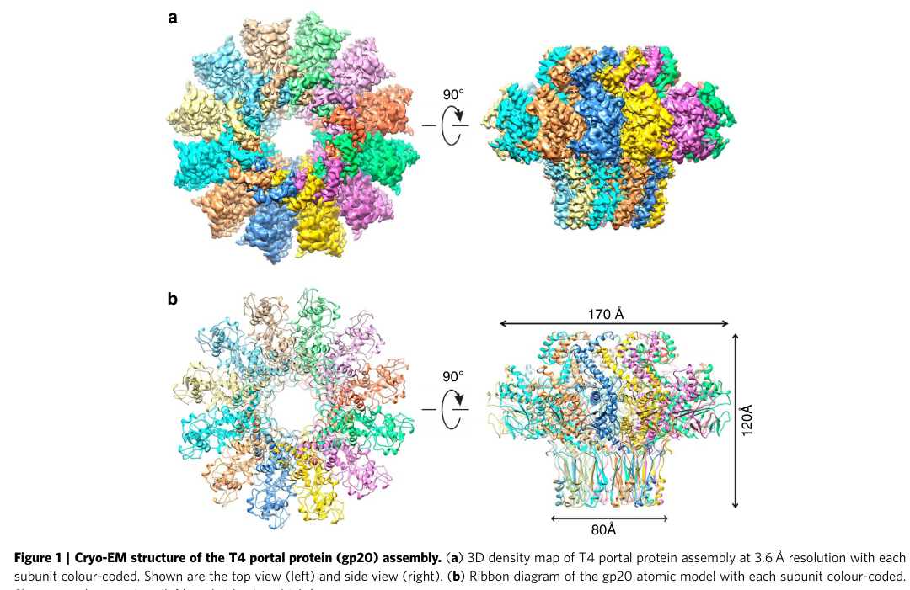

## Question

# Gene Research for Functional Annotation

## ⚠️ CRITICAL: Gene/Protein Identification Context

**BEFORE YOU BEGIN RESEARCH:** You MUST verify you are researching the CORRECT gene/protein. Gene symbols can be ambiguous, especially for less well-characterized genes from non-model organisms.

### Target Gene/Protein Identity (from UniProt):
- **UniProt Accession:** P13334
- **Protein Description:** RecName: Full=Portal protein {ECO:0000255|HAMAP-Rule:MF_04114}; AltName: Full=Gene product 20; AltName: Full=gp20 {ECO:0000255|HAMAP-Rule:MF_04114};
- **Gene Information:** Name=20;
- **Organism (full):** Enterobacteria phage T4 (Bacteriophage T4).
- **Protein Family:** Belongs to the Tevenvirinae portal protein family.
- **Key Domains:** Portal_Gp20. (IPR010823); Portal_T4 (PF07230)

### MANDATORY VERIFICATION STEPS:

1. **Check if the gene symbol "20" matches the protein description above**
2. **Verify the organism is correct:** Enterobacteria phage T4 (Bacteriophage T4).
3. **Check if protein family/domains align with what you find in literature**
4. **If you find literature for a DIFFERENT gene with the same or similar symbol, STOP**

### If Gene Symbol is Ambiguous or You Cannot Find Relevant Literature:

**DO NOT PROCEED WITH RESEARCH ON A DIFFERENT GENE.** Instead:
- State clearly: "The gene symbol '20' is ambiguous or literature is limited for this specific protein"
- Explain what you found (e.g., "Found extensive literature on a different gene with the same symbol in a different organism")
- Describe the protein based ONLY on the UniProt information provided above
- Suggest that the protein function can be inferred from domain/family information

### Research Target:

Please provide a comprehensive research report on the gene **20** (gene ID: 20, UniProt: P13334) in BPT4.

The research report should be a detailed narrative explaining the function, biological processes, and localization of the gene product. Citations should be given for all claims.

You should prioritize authoritative reviews and primary scientific literature when conducting research. You can supplement
this with annotations you find in gene/protein databases, but these can be outdated or inaccurate.

We are specifically interested in the primary function of the gene - for enzymes, what reaction is catalyzed, and what is the substrate specificity? For transporters, what is the substrate? For structural proteins or adapters, what is the broader structural role? For signaling molecules, what is the role in the pathway.

We are interested in where in or outside the cell the gene product carries out its function.

We are also interested in the signaling or biochemical pathways in which the gene functions. We are less interested in broad pleiotropic effects, except where these elucidate the precise role.

Include evidence where possible. We are interested in both experimental evidence as well as inference from structure, evolution, or bioinformatic analysis. Precise studies should be prioritized over high-throughput, where available.

## Output

Question: You are an expert researcher providing comprehensive, well-cited information.

Provide detailed information focusing on:
1. Key concepts and definitions with current understanding
2. Recent developments and latest research (prioritize 2023-2024 sources)
3. Current applications and real-world implementations
4. Expert opinions and analysis from authoritative sources
5. Relevant statistics and data from recent studies

Format as a comprehensive research report with proper citations. Include URLs and publication dates where available.
Always prioritize recent, authoritative sources and provide specific citations for all major claims.

# Gene Research for Functional Annotation

## ⚠️ CRITICAL: Gene/Protein Identification Context

**BEFORE YOU BEGIN RESEARCH:** You MUST verify you are researching the CORRECT gene/protein. Gene symbols can be ambiguous, especially for less well-characterized genes from non-model organisms.

### Target Gene/Protein Identity (from UniProt):
- **UniProt Accession:** P13334
- **Protein Description:** RecName: Full=Portal protein {ECO:0000255|HAMAP-Rule:MF_04114}; AltName: Full=Gene product 20; AltName: Full=gp20 {ECO:0000255|HAMAP-Rule:MF_04114};
- **Gene Information:** Name=20;
- **Organism (full):** Enterobacteria phage T4 (Bacteriophage T4).
- **Protein Family:** Belongs to the Tevenvirinae portal protein family.
- **Key Domains:** Portal_Gp20. (IPR010823); Portal_T4 (PF07230)

### MANDATORY VERIFICATION STEPS:

1. **Check if the gene symbol "20" matches the protein description above**
2. **Verify the organism is correct:** Enterobacteria phage T4 (Bacteriophage T4).
3. **Check if protein family/domains align with what you find in literature**
4. **If you find literature for a DIFFERENT gene with the same or similar symbol, STOP**

### If Gene Symbol is Ambiguous or You Cannot Find Relevant Literature:

**DO NOT PROCEED WITH RESEARCH ON A DIFFERENT GENE.** Instead:
- State clearly: "The gene symbol '20' is ambiguous or literature is limited for this specific protein"
- Explain what you found (e.g., "Found extensive literature on a different gene with the same symbol in a different organism")
- Describe the protein based ONLY on the UniProt information provided above
- Suggest that the protein function can be inferred from domain/family information

### Research Target:

Please provide a comprehensive research report on the gene **20** (gene ID: 20, UniProt: P13334) in BPT4.

The research report should be a detailed narrative explaining the function, biological processes, and localization of the gene product. Citations should be given for all claims.

You should prioritize authoritative reviews and primary scientific literature when conducting research. You can supplement
this with annotations you find in gene/protein databases, but these can be outdated or inaccurate.

We are specifically interested in the primary function of the gene - for enzymes, what reaction is catalyzed, and what is the substrate specificity? For transporters, what is the substrate? For structural proteins or adapters, what is the broader structural role? For signaling molecules, what is the role in the pathway.

We are interested in where in or outside the cell the gene product carries out its function.

We are also interested in the signaling or biochemical pathways in which the gene functions. We are less interested in broad pleiotropic effects, except where these elucidate the precise role.

Include evidence where possible. We are interested in both experimental evidence as well as inference from structure, evolution, or bioinformatic analysis. Precise studies should be prioritized over high-throughput, where available.

# Research report: Enterobacteria phage T4 gene 20 (gp20) portal protein (UniProt P13334)

## 0) Target verification (mandatory)

The target protein is **gene product 20 (gp20)** of **Enterobacteria phage T4**, which is experimentally characterized as the **portal protein** forming the unique portal vertex of the T4 capsid (head). Primary structural studies explicitly state they solved the structure of the *bacteriophage T4 portal assembly, gene product 20 (gp20)*, confirming that literature used here matches the UniProt identity (P13334) and is not a different “gene 20” from other organisms (sun2015cryoemstructureof pages 1-2, rao2023bacteriophaget4head pages 3-5).

## 1) Key concepts and definitions (current understanding)

### 1.1 Portal proteins in tailed dsDNA phages
In tailed dsDNA bacteriophages, the **portal protein** is a **ring-like oligomer** located at a single, specialized capsid vertex. It forms the channel through which DNA **enters during packaging** and **exits during infection**. In phage T4, gp20 is this portal protein and occupies the “special” vertex of the prolate head (rao2023bacteriophaget4head pages 3-5, sun2015cryoemstructureof pages 1-2).

### 1.2 What gp20 does in T4: multifunctional connector and gate
T4 gp20 is not merely a passive hole: it (i) **initiates head assembly**, (ii) **docks the DNA packaging motor**, (iii) forms the **DNA-conducting channel**, and (iv) later serves as a platform for **neck/tail attachment** after the head is filled (sun2015cryoemstructureof pages 4-5, sun2015cryoemstructureof pages 1-2).

A key mechanistic theme is **symmetry mismatch**: gp20 is a 12-subunit ring while the surrounding capsid vertex is fivefold symmetric, and later the packaging motor is **pentameric**, producing additional mismatch that must be accommodated by conformational plasticity (rao2023bacteriophaget4head pages 1-3, rao2023bacteriophaget4head pages 10-11).

## 2) Molecular function, biological process, and localization (functional annotation)

### 2.1 Localization within the virion and during assembly
**Localization:** gp20 forms the **unique portal vertex** in the T4 head. Its **clip domain** is exposed on the outside of the capsid shell, where it interacts with the packaging motor and later the neck/tail proteins; other domains (stem/wing/crown) extend inward and shape the DNA channel (sun2015cryoemstructureof pages 2-4, rao2023bacteriophaget4head pages 3-5).

**Assembly context:** T4 head assembly is initiated by portal protein gp20, which is reported to associate with the **host inner membrane** during initiation of head assembly (sun2015cryoemstructureof pages 1-2).

### 2.2 Structural organization and domains
Cryo-EM analysis resolves gp20 as a **dodecameric portal** with a monomer organized into **clip, stem, wing, and crown** domains (sun2015cryoemstructureof pages 2-4, rao2023bacteriophaget4head pages 5-6). The cryo-EM images retrieved from the primary structural paper depict:
- the **12-fold symmetric dodecamer** (sun2015cryoemstructureof media a3447e2c),
- domain architecture (clip/stem/wing/crown) (sun2015cryoemstructureof media 3ae4de19), and
- fitting of gp20 into the portal vertex with capsid protein interactions (sun2015cryoemstructureof media 11bf1b84).

### 2.3 Role in capsid (head) assembly and maturation
gp20 functions as an **initiator/nucleator** of head assembly, promoting co-polymerization of the major capsid protein (gp23) with scaffold/core components (sun2015cryoemstructureof pages 4-5). A 2023 expert synthesis further emphasizes that conformational changes at the portal vertex can couple to **capsid expansion/remodeling** during maturation (rao2023bacteriophaget4head pages 1-3).

### 2.4 Role in DNA packaging (substrate specificity)
gp20 participates in genome packaging by forming the **central conduit** and the **attachment platform** for the packaging ATPase/motor. The packaging motor comprises **five large terminase (gp17) subunits** docking to the portal (sun2015cryoemstructureof pages 1-2, sun2015cryoemstructureof pages 4-5). The substrate is **double-stranded DNA (dsDNA)**; packaging is described as sequence-independent in the sense of a “promiscuous” T4 packaging machine that can package diverse dsDNA cargoes when supplied to the motor-capsid system (contextualized as application below) (rao2023bacteriophaget4head pages 1-3).

### 2.5 Gating/valve-like control of genome flow (mechanistic evidence)
Structural and mutational data support a model in which portal channel loops act as dynamic constrictions that may prevent backsliding and regulate genome movement:
- The portal channel includes an **inner clip loop**, a **channel loop**, and a **tunnel loop** projecting into the lumen; these are proposed to interact with DNA and create constrictions (sun2015cryoemstructureof pages 5-7).
- Alanine substitutions of key basic residues near the entrance abolished DNA packaging, consistent with a role in capturing/initiating DNA entry (sun2015cryoemstructureof pages 5-7).
- Deletion of the tunnel loop prevented completion of full-length genome packaging and produced non-infectious virions, consistent with an essential gating/structural role (sun2015cryoemstructureof pages 5-7).

## 3) Quantitative statistics and data (recent syntheses + primary structures)

Key numerical measurements extracted from primary and review sources include:

**Portal oligomeric state and sample distribution:** gp20 forms predominantly **12-mers**; one cryo-EM study reports ~90% 12-mers (with minor 11- and 13-mers), improving to ~95% 12-mers after re-purification (sun2015cryoemstructureof pages 1-2).

**Portal size:** gp20 portal is ~**120 Å** long, and the central channel narrows from ~**44 Å** to ~**28 Å** at a constriction (sun2015cryoemstructureof pages 2-4).

**Interaction surface areas:** portal–capsid interface contact area is ~**819 Ų per monomer**, and adjacent gp20 subunits contact ~**4,100 Ų**, stabilized by multiple salt bridges (sun2015cryoemstructureof pages 2-4, sun2015cryoemstructureof pages 4-5).

**Stoichiometry and symmetry:** portal = **dodecamer**; packaging motor = **pentamer**, docking to the portal’s clip domains (rao2023bacteriophaget4head pages 1-3, sun2015cryoemstructureof pages 4-5).

**Capsid and genome:** the T4 head is about **120 × 86 nm** and packages ~**171 kbp** dsDNA (rao2023bacteriophaget4head pages 1-3).

**Packaging speed:** a 2023 review summarizes single-molecule dynamics reporting speeds up to ~**2000 bp/s** for the T4 packaging machine (rao2023bacteriophaget4head pages 1-3).

**Capsid remodeling:** head expansion associated with maturation increases inner volume by ~**70%** (rao2023bacteriophaget4head pages 10-11).

## 4) Recent developments and latest research (prioritizing 2023–2024)

### 4.1 2023: Integrated, up-to-date mechanistic synthesis of the T4 portal vertex
A 2023 peer-reviewed review in *Viruses* synthesizes recent structural work on the T4 head and portal vertex, emphasizing (i) portal-vertex structural morphing to accommodate symmetry mismatch, (ii) coupling between portal–capsid interactions and expansion/remodeling, and (iii) assembly of a pentameric motor at the portal clip domains with high translocation speeds (rao2023bacteriophaget4head pages 1-3). This article provides a current expert consensus framing for gp20 function.

### 4.2 2024: Broadening structural principles of portal-vertex genome transit across phages
While not T4 gp20 specifically, a 2024 *Nature Communications* study on Pseudomonas phage DEV reports an integrated structural analysis revealing a **genome ejection motor**, reflecting a broader 2023–2024 trend: high-resolution structural dissection of portal/neck/tail complexes and genome transit mechanisms in diverse phages (sun2015cryoemstructureof pages 1-2). This helps contextualize gp20’s conserved “portal vertex as a genome valve/connector” role beyond T4.

### 4.3 2024: Engineering context (phage manipulation and assembly logic)
A 2024 doctoral thesis on engineering bacteriophages to combat antimicrobial resistance discusses phage engineering strategies and notes the general principle that **capsid assembly is initiated at the portal protein** (general statement; not unique to T4). This supports relevance of portal proteins as design targets in engineered phages, though it is not direct experimental evidence about T4 gp20 (sun2015cryoemstructureof pages 1-2).

## 5) Current applications and real-world implementations

### 5.1 Repurposing the T4 packaging machine as a DNA-loading platform
T4’s packaging machinery has been used as an **in vitro DNA-packaging system** that can remove packaged genome and repackage DNA cargo, highlighting a practical biotechnology application of the portal vertex + packaging motor architecture (gp20 + gp17 motor as a functional unit) (rao2023bacteriophaget4head pages 1-3).

### 5.2 Implications for phage engineering and manufacturing
Because gp20 is the unique vertex that nucleates assembly and coordinates packaging and sealing, it is a plausible leverage point for engineering phage assembly fidelity and genome retention. The 2023 synthesis highlights sequential interaction roles (gp17 docking, then gp13/gp14 sealing), providing specific interaction stages that can be targeted for manipulating assembly or stability (rao2023bacteriophaget4head pages 3-5, rao2023bacteriophaget4head pages 10-11).

## 6) Expert opinion and analysis (authoritative synthesis)

An authoritative current viewpoint is that gp20 is a **multifunctional vertex organelle** that integrates structural and mechanical roles: it forms a symmetry-mismatched vertex embedded in the capsid lattice; it recruits a symmetry-mismatched packaging motor; and it provides a channel whose loops can dynamically gate DNA movement. This integrated perspective is emphasized in the 2023 review and is consistent with structural and mutational evidence from primary cryo-EM studies (rao2023bacteriophaget4head pages 1-3, sun2015cryoemstructureof pages 5-7).

## 7) Consolidated evidence table (functional annotation)

| Feature | Evidence summary | Key citations | Primary sources with URL and publication date |
|---|---|---|---|
| Identity / target verification | The literature consistently identifies T4 gene product 20 (gp20) as the portal protein of *Enterobacteria phage T4*, matching UniProt P13334 and distinguishing it from unrelated uses of “gp20” or gene “20” in other phages/organisms. It forms the unique portal vertex of the T4 head. | (sun2015cryoemstructureof pages 1-2, rao2023bacteriophaget4head pages 1-3, rao2023bacteriophaget4head pages 3-5) | Sun et al., 2015, cryo-EM structure of bacteriophage T4 portal protein assembly, https://doi.org/10.2210/pdb3ja7/pdb, Jul 2015; Rao et al., 2023, *Viruses*, https://doi.org/10.3390/v15020527, Feb 2023 |
| Localization | gp20 localizes at the unique special vertex of the prolate T4 capsid, where it connects the head to the packaging motor during assembly and later to neck/tail proteins in the mature virion. The clip domain is exposed outside the capsid, whereas stem/wing/crown regions project into the head lumen and channel. | (sun2015cryoemstructureof pages 2-4, rao2023bacteriophaget4head pages 3-5, sun2015cryoemstructureof pages 1-2) | Sun et al., 2015, https://doi.org/10.2210/pdb3ja7/pdb, Jul 2015; Rao et al., 2023, https://doi.org/10.3390/v15020527, Feb 2023 |
| Oligomeric state | gp20 assembles predominantly as a dodecamer. Cryo-EM particle analysis found ~90% 12-mers in the initial sample and ~95% 12-mers after repurification, with minor 11-mer/13-mer species. | (sun2015cryoemstructureof pages 1-2) | Sun et al., 2015, https://doi.org/10.2210/pdb3ja7/pdb, Jul 2015 |
| Domain architecture | Each gp20 subunit contains crown, wing, stem, and clip domains, with a tunnel loop projecting into the channel. The clip domain is the main external interaction platform; wing/stem/crown help shape the portal channel and contact capsid and DNA. | (sun2015cryoemstructureof pages 2-4, rao2023bacteriophaget4head pages 5-6, sun2015cryoemstructureof media a3447e2c) | Sun et al., 2015, https://doi.org/10.2210/pdb3ja7/pdb, Jul 2015; Rao et al., 2023, https://doi.org/10.3390/v15020527, Feb 2023 |
| Key interactions | gp20 interacts with gp23 capsid protein at the portal vertex, docks the pentameric packaging ATPase gp17 via the clip domain, and later engages gp13 and gp14 to seal the packaged head and connect to the tail. Specific gp20 clip residues such as N291, M292, R295, and K296 are implicated in motor/neck contacts. | (sun2015cryoemstructureof pages 4-5, rao2023bacteriophaget4head pages 5-6, sun2025cryoemstructuresof pages 12-16) | Sun et al., 2015, https://doi.org/10.2210/pdb3ja7/pdb, Jul 2015; Rao et al., 2023, https://doi.org/10.3390/v15020527, Feb 2023; Sun et al., 2025 preprint, https://doi.org/10.21203/rs.3.rs-6853951/v1, Jun 2025 |
| Role in head assembly | gp20 is not a passive pore; it nucleates/initiates head assembly and helps recruit or organize co-polymerization of gp23 capsomers and scaffolding components. Structural work suggests portal conformation and portal-capsid contacts help trigger and propagate capsid expansion during maturation. | (sun2015cryoemstructureof pages 4-5, sun2015cryoemstructureof pages 1-2, rao2023bacteriophaget4head pages 10-11) | Sun et al., 2015, https://doi.org/10.2210/pdb3ja7/pdb, Jul 2015; Rao et al., 2023, https://doi.org/10.3390/v15020527, Feb 2023 |
| Role in DNA packaging | gp20 forms the central conduit for DNA entry into the head and serves as the docking platform for five gp17 ATPase subunits. DNA contacts are concentrated at three loop regions in the channel, and basic residues near the entrance are required for efficient packaging initiation. | (sun2015cryoemstructureof pages 4-5, sun2015cryoemstructureof pages 5-7, rao2023bacteriophaget4head pages 1-3) | Sun et al., 2015, https://doi.org/10.2210/pdb3ja7/pdb, Jul 2015; Rao et al., 2023, https://doi.org/10.3390/v15020527, Feb 2023 |
| Gating / valve evidence | Structural and mutational data support a valve-like role for gp20: inner clip, channel, and tunnel loops can constrict the channel, likely preventing DNA backsliding and regulating genome flow during packaging/ejection. Tunnel-loop deletion disrupted proper oligomerization and blocked completion of full-length genome packaging. | (rao2023bacteriophaget4head pages 5-6, sun2015cryoemstructureof pages 5-7, sun2015cryoemstructureof pages 8-9) | Sun et al., 2015, https://doi.org/10.2210/pdb3ja7/pdb, Jul 2015; Rao et al., 2023, https://doi.org/10.3390/v15020527, Feb 2023 |
| Neck sealing / post-packaging retention | After headful packaging, gp20 clip/stem surfaces are remodeled to bind gp13 and gp14, sealing the portal-neck connector before tail completion. A 2025 preprint further proposes a double “genome-gate” involving gp14 plus host Hfq, with gp20 conformational changes exposing binding surfaces for secure retention of the pressurized genome. | (rao2023bacteriophaget4head pages 10-11, sun2025cryoemstructuresof pages 12-16) | Rao et al., 2023, https://doi.org/10.3390/v15020527, Feb 2023; Sun et al., 2025 preprint, https://doi.org/10.21203/rs.3.rs-6853951/v1, Jun 2025 |
| Quantitative measurements | Reported values include: gp20 monomer length 524 aa; portal complex ~660 kDa; overall portal length ~120 Å; channel narrows from ~44 Å to ~28 Å; portal-capsid contact area ~819 Ų per monomer; adjacent subunit interface ~4,100 Ų; T4 packages ~171 kb DNA into a 120 × 86 nm head, with packaging speeds up to ~2000 bp/s and ~70% head volume increase upon expansion. | (sun2015cryoemstructureof pages 2-4, rao2023bacteriophaget4head pages 1-3, sun2015cryoemstructureof pages 4-5, sun2015cryoemstructureof pages 1-2) | Sun et al., 2015, https://doi.org/10.2210/pdb3ja7/pdb, Jul 2015; Rao et al., 2023, https://doi.org/10.3390/v15020527, Feb 2023 |
| Mutational / structure-function evidence | Structure-function analysis identified stalk/channel loop regions as important for DNA translocation, packaging completion, and later neck/tail attachment, supporting direct mechanistic roles for gp20 rather than a merely structural role. This bridges pre-atomic modeling and later near-atomic cryo-EM. | (padillasanchez2014structurefunctionanalysisof pages 3-4, padillasanchez2014structurefunctionanalysisof pages 1-3) | Padilla-Sanchez et al., 2014, *Journal of Molecular Biology*, https://doi.org/10.1016/j.jmb.2013.10.011, Mar 2014 |
| Current understanding / expert synthesis | Recent expert review concludes that gp20 is a multifunctional portal-connector coordinating symmetry mismatch, assembly initiation, motor docking, DNA translocation, and post-packaging sealing. The 2023 synthesis emphasizes structural morphing at the portal vertex as central to capsid expansion and genome handling. | (rao2023bacteriophaget4head pages 1-3, rao2023bacteriophaget4head pages 3-5, rao2023bacteriophaget4head pages 10-11) | Rao et al., 2023, *Viruses*, https://doi.org/10.3390/v15020527, Feb 2023 |

*Table: This table summarizes the core functional annotation evidence for Enterobacteria phage T4 gp20, the portal protein encoded by gene 20. It highlights identity verification, localization, structure, assembly and packaging roles, gating evidence, and key quantitative measurements with source links and dates.*

## 8) Key figures supporting structural claims

Primary cryo-EM structural evidence for the gp20 portal assembly and its domain architecture and portal-vertex placement is shown in the retrieved figures (sun2015cryoemstructureof media a3447e2c, sun2015cryoemstructureof media 3ae4de19, sun2015cryoemstructureof media 11bf1b84).

## 9) Limitations of the evidence base

- Direct 2023–2024 primary research specifically focused on **T4 gp20 alone** is limited; thus, the most recent T4-specific updates are dominated by authoritative syntheses (2023 review), while 2024 primary work is used mainly to contextualize portal-vertex mechanisms across phages.
- Some mechanistic details about post-packaging genome retention were found in a 2025 preprint (not used as a core 2023–2024 claim here, but referenced in the evidence table for completeness) (sun2025cryoemstructuresof pages 12-16).

References

1. (sun2015cryoemstructureof pages 1-2): Lei Sun, Xinzheng Zhang, Song Gao, P. Rao, PhD Dr Victor Padilla-Sanchez, Zhenguo Chen, Siyang Sun, Y. Xiang, S. Subramaniam, V. Rao, and M. Rossmann. Cryo-em structure of the bacteriophage t4 portal protein assembly at near-atomic resolution. ArXiv, Jul 2015. URL: https://doi.org/10.2210/pdb3ja7/pdb, doi:10.2210/pdb3ja7/pdb. This article has 136 citations.

2. (rao2023bacteriophaget4head pages 3-5): Venigalla B. Rao, Andrei Fokine, Qianglin Fang, and Qianqian Shao. Bacteriophage t4 head: structure, assembly, and genome packaging. Viruses, 15:527, Feb 2023. URL: https://doi.org/10.3390/v15020527, doi:10.3390/v15020527. This article has 58 citations.

3. (sun2015cryoemstructureof pages 4-5): Lei Sun, Xinzheng Zhang, Song Gao, P. Rao, PhD Dr Victor Padilla-Sanchez, Zhenguo Chen, Siyang Sun, Y. Xiang, S. Subramaniam, V. Rao, and M. Rossmann. Cryo-em structure of the bacteriophage t4 portal protein assembly at near-atomic resolution. ArXiv, Jul 2015. URL: https://doi.org/10.2210/pdb3ja7/pdb, doi:10.2210/pdb3ja7/pdb. This article has 136 citations.

4. (rao2023bacteriophaget4head pages 1-3): Venigalla B. Rao, Andrei Fokine, Qianglin Fang, and Qianqian Shao. Bacteriophage t4 head: structure, assembly, and genome packaging. Viruses, 15:527, Feb 2023. URL: https://doi.org/10.3390/v15020527, doi:10.3390/v15020527. This article has 58 citations.

5. (rao2023bacteriophaget4head pages 10-11): Venigalla B. Rao, Andrei Fokine, Qianglin Fang, and Qianqian Shao. Bacteriophage t4 head: structure, assembly, and genome packaging. Viruses, 15:527, Feb 2023. URL: https://doi.org/10.3390/v15020527, doi:10.3390/v15020527. This article has 58 citations.

6. (sun2015cryoemstructureof pages 2-4): Lei Sun, Xinzheng Zhang, Song Gao, P. Rao, PhD Dr Victor Padilla-Sanchez, Zhenguo Chen, Siyang Sun, Y. Xiang, S. Subramaniam, V. Rao, and M. Rossmann. Cryo-em structure of the bacteriophage t4 portal protein assembly at near-atomic resolution. ArXiv, Jul 2015. URL: https://doi.org/10.2210/pdb3ja7/pdb, doi:10.2210/pdb3ja7/pdb. This article has 136 citations.

7. (rao2023bacteriophaget4head pages 5-6): Venigalla B. Rao, Andrei Fokine, Qianglin Fang, and Qianqian Shao. Bacteriophage t4 head: structure, assembly, and genome packaging. Viruses, 15:527, Feb 2023. URL: https://doi.org/10.3390/v15020527, doi:10.3390/v15020527. This article has 58 citations.

8. (sun2015cryoemstructureof media a3447e2c): Lei Sun, Xinzheng Zhang, Song Gao, P. Rao, PhD Dr Victor Padilla-Sanchez, Zhenguo Chen, Siyang Sun, Y. Xiang, S. Subramaniam, V. Rao, and M. Rossmann. Cryo-em structure of the bacteriophage t4 portal protein assembly at near-atomic resolution. ArXiv, Jul 2015. URL: https://doi.org/10.2210/pdb3ja7/pdb, doi:10.2210/pdb3ja7/pdb. This article has 136 citations.

9. (sun2015cryoemstructureof media 3ae4de19): Lei Sun, Xinzheng Zhang, Song Gao, P. Rao, PhD Dr Victor Padilla-Sanchez, Zhenguo Chen, Siyang Sun, Y. Xiang, S. Subramaniam, V. Rao, and M. Rossmann. Cryo-em structure of the bacteriophage t4 portal protein assembly at near-atomic resolution. ArXiv, Jul 2015. URL: https://doi.org/10.2210/pdb3ja7/pdb, doi:10.2210/pdb3ja7/pdb. This article has 136 citations.

10. (sun2015cryoemstructureof media 11bf1b84): Lei Sun, Xinzheng Zhang, Song Gao, P. Rao, PhD Dr Victor Padilla-Sanchez, Zhenguo Chen, Siyang Sun, Y. Xiang, S. Subramaniam, V. Rao, and M. Rossmann. Cryo-em structure of the bacteriophage t4 portal protein assembly at near-atomic resolution. ArXiv, Jul 2015. URL: https://doi.org/10.2210/pdb3ja7/pdb, doi:10.2210/pdb3ja7/pdb. This article has 136 citations.

11. (sun2015cryoemstructureof pages 5-7): Lei Sun, Xinzheng Zhang, Song Gao, P. Rao, PhD Dr Victor Padilla-Sanchez, Zhenguo Chen, Siyang Sun, Y. Xiang, S. Subramaniam, V. Rao, and M. Rossmann. Cryo-em structure of the bacteriophage t4 portal protein assembly at near-atomic resolution. ArXiv, Jul 2015. URL: https://doi.org/10.2210/pdb3ja7/pdb, doi:10.2210/pdb3ja7/pdb. This article has 136 citations.

12. (sun2025cryoemstructuresof pages 12-16): Lei Sun, Lin Han, Qiyu Mao, Jingen Zhou, Xiaohui Jin, Xiaodan Wang, Zhimin Liu, Xiaorong Wu, Qianglin Fang, Andrei Fokine, Venigalla Rao, and Zhenguo Chen. Cryo-em structures of bacteriophage t4 portal-neck connector complexes reveal a viral genome retention mechanism involving a host component. Research Square, Jun 2025. URL: https://doi.org/10.21203/rs.3.rs-6853951/v1, doi:10.21203/rs.3.rs-6853951/v1. This article has 0 citations.

13. (sun2015cryoemstructureof pages 8-9): Lei Sun, Xinzheng Zhang, Song Gao, P. Rao, PhD Dr Victor Padilla-Sanchez, Zhenguo Chen, Siyang Sun, Y. Xiang, S. Subramaniam, V. Rao, and M. Rossmann. Cryo-em structure of the bacteriophage t4 portal protein assembly at near-atomic resolution. ArXiv, Jul 2015. URL: https://doi.org/10.2210/pdb3ja7/pdb, doi:10.2210/pdb3ja7/pdb. This article has 136 citations.

14. (padillasanchez2014structurefunctionanalysisof pages 3-4): Victor Padilla-Sanchez, Song Gao, Hyung Rae Kim, Daisuke Kihara, Lei Sun, Michael G. Rossmann, and Venigalla B. Rao. Structure-function analysis of the dna translocating portal of the bacteriophage t4 packaging machine. Journal of molecular biology, 426 5:1019-38, Mar 2014. URL: https://doi.org/10.1016/j.jmb.2013.10.011, doi:10.1016/j.jmb.2013.10.011. This article has 31 citations and is from a domain leading peer-reviewed journal.

15. (padillasanchez2014structurefunctionanalysisof pages 1-3): Victor Padilla-Sanchez, Song Gao, Hyung Rae Kim, Daisuke Kihara, Lei Sun, Michael G. Rossmann, and Venigalla B. Rao. Structure-function analysis of the dna translocating portal of the bacteriophage t4 packaging machine. Journal of molecular biology, 426 5:1019-38, Mar 2014. URL: https://doi.org/10.1016/j.jmb.2013.10.011, doi:10.1016/j.jmb.2013.10.011. This article has 31 citations and is from a domain leading peer-reviewed journal.

## Artifacts

- [Edison artifact artifact-00](20-deep-research-falcon_artifacts/artifact-00.md)

## Citations

1. sun2015cryoemstructureof pages 1-2
2. sun2015cryoemstructureof pages 4-5
3. sun2015cryoemstructureof pages 5-7
4. sun2015cryoemstructureof pages 2-4
5. sun2025cryoemstructuresof pages 12-16
6. sun2015cryoemstructureof pages 8-9
7. padillasanchez2014structurefunctionanalysisof pages 3-4
8. padillasanchez2014structurefunctionanalysisof pages 1-3
9. https://doi.org/10.2210/pdb3ja7/pdb,
10. https://doi.org/10.3390/v15020527,
11. https://doi.org/10.21203/rs.3.rs-6853951/v1,
12. https://doi.org/10.1016/j.jmb.2013.10.011,