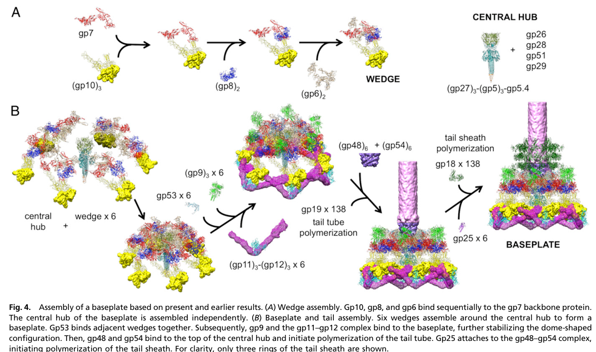

## Question

# Gene Research for Functional Annotation

## ⚠️ CRITICAL: Gene/Protein Identification Context

**BEFORE YOU BEGIN RESEARCH:** You MUST verify you are researching the CORRECT gene/protein. Gene symbols can be ambiguous, especially for less well-characterized genes from non-model organisms.

### Target Gene/Protein Identity (from UniProt):
- **UniProt Accession:** P09425
- **Protein Description:** RecName: Full=Baseplate wedge protein gp25 {ECO:0000305}; AltName: Full=Outer wedge of baseplate protein; AltName: Full=Protein Gp25;
- **Gene Information:** Name=25;
- **Organism (full):** Enterobacteria phage T4 (Bacteriophage T4).
- **Protein Family:** Belongs to the GpW/Gp25 family. .
- **Key Domains:** IraD/Gp25-like. (IPR007048); GPW_gp25 (PF04965)

### MANDATORY VERIFICATION STEPS:

1. **Check if the gene symbol "25" matches the protein description above**
2. **Verify the organism is correct:** Enterobacteria phage T4 (Bacteriophage T4).
3. **Check if protein family/domains align with what you find in literature**
4. **If you find literature for a DIFFERENT gene with the same or similar symbol, STOP**

### If Gene Symbol is Ambiguous or You Cannot Find Relevant Literature:

**DO NOT PROCEED WITH RESEARCH ON A DIFFERENT GENE.** Instead:
- State clearly: "The gene symbol '25' is ambiguous or literature is limited for this specific protein"
- Explain what you found (e.g., "Found extensive literature on a different gene with the same symbol in a different organism")
- Describe the protein based ONLY on the UniProt information provided above
- Suggest that the protein function can be inferred from domain/family information

### Research Target:

Please provide a comprehensive research report on the gene **25** (gene ID: 25, UniProt: P09425) in BPT4.

The research report should be a detailed narrative explaining the function, biological processes, and localization of the gene product. Citations should be given for all claims.

You should prioritize authoritative reviews and primary scientific literature when conducting research. You can supplement
this with annotations you find in gene/protein databases, but these can be outdated or inaccurate.

We are specifically interested in the primary function of the gene - for enzymes, what reaction is catalyzed, and what is the substrate specificity? For transporters, what is the substrate? For structural proteins or adapters, what is the broader structural role? For signaling molecules, what is the role in the pathway.

We are interested in where in or outside the cell the gene product carries out its function.

We are also interested in the signaling or biochemical pathways in which the gene functions. We are less interested in broad pleiotropic effects, except where these elucidate the precise role.

Include evidence where possible. We are interested in both experimental evidence as well as inference from structure, evolution, or bioinformatic analysis. Precise studies should be prioritized over high-throughput, where available.

## Output

Question: You are an expert researcher providing comprehensive, well-cited information.

Provide detailed information focusing on:
1. Key concepts and definitions with current understanding
2. Recent developments and latest research (prioritize 2023-2024 sources)
3. Current applications and real-world implementations
4. Expert opinions and analysis from authoritative sources
5. Relevant statistics and data from recent studies

Format as a comprehensive research report with proper citations. Include URLs and publication dates where available.
Always prioritize recent, authoritative sources and provide specific citations for all major claims.

# Gene Research for Functional Annotation

## ⚠️ CRITICAL: Gene/Protein Identification Context

**BEFORE YOU BEGIN RESEARCH:** You MUST verify you are researching the CORRECT gene/protein. Gene symbols can be ambiguous, especially for less well-characterized genes from non-model organisms.

### Target Gene/Protein Identity (from UniProt):
- **UniProt Accession:** P09425
- **Protein Description:** RecName: Full=Baseplate wedge protein gp25 {ECO:0000305}; AltName: Full=Outer wedge of baseplate protein; AltName: Full=Protein Gp25;
- **Gene Information:** Name=25;
- **Organism (full):** Enterobacteria phage T4 (Bacteriophage T4).
- **Protein Family:** Belongs to the GpW/Gp25 family. .
- **Key Domains:** IraD/Gp25-like. (IPR007048); GPW_gp25 (PF04965)

### MANDATORY VERIFICATION STEPS:

1. **Check if the gene symbol "25" matches the protein description above**
2. **Verify the organism is correct:** Enterobacteria phage T4 (Bacteriophage T4).
3. **Check if protein family/domains align with what you find in literature**
4. **If you find literature for a DIFFERENT gene with the same or similar symbol, STOP**

### If Gene Symbol is Ambiguous or You Cannot Find Relevant Literature:

**DO NOT PROCEED WITH RESEARCH ON A DIFFERENT GENE.** Instead:
- State clearly: "The gene symbol '25' is ambiguous or literature is limited for this specific protein"
- Explain what you found (e.g., "Found extensive literature on a different gene with the same symbol in a different organism")
- Describe the protein based ONLY on the UniProt information provided above
- Suggest that the protein function can be inferred from domain/family information

### Research Target:

Please provide a comprehensive research report on the gene **25** (gene ID: 25, UniProt: P09425) in BPT4.

The research report should be a detailed narrative explaining the function, biological processes, and localization of the gene product. Citations should be given for all claims.

You should prioritize authoritative reviews and primary scientific literature when conducting research. You can supplement
this with annotations you find in gene/protein databases, but these can be outdated or inaccurate.

We are specifically interested in the primary function of the gene - for enzymes, what reaction is catalyzed, and what is the substrate specificity? For transporters, what is the substrate? For structural proteins or adapters, what is the broader structural role? For signaling molecules, what is the role in the pathway.

We are interested in where in or outside the cell the gene product carries out its function.

We are also interested in the signaling or biochemical pathways in which the gene functions. We are less interested in broad pleiotropic effects, except where these elucidate the precise role.

Include evidence where possible. We are interested in both experimental evidence as well as inference from structure, evolution, or bioinformatic analysis. Precise studies should be prioritized over high-throughput, where available.

## Research report: Enterobacteria phage T4 gene 25 (gp25; UniProt P09425)

### 0) Identity verification and scope
The target gene **25** corresponds to **bacteriophage T4 gene product gp25**, annotated as a **baseplate wedge protein** (outer wedge) and member of the **GpW/Gp25 family** (IraD/Gp25-like; PF04965). The evidence summarized below is restricted to **T4 gp25** and to **explicit homologs described as “T4 gp25-like” sheath initiators**; it explicitly excludes unrelated proteins that happen to be named “gp25” in other phages (e.g., capsid cementing proteins). (rossmann2004thebacteriophaget4 pages 2-4, wang2023structureofvibrio pages 3-5, iglesias2024cryoemanalysisof pages 1-2)

### 1) Key concepts and current functional understanding

#### 1.1 What is the T4 baseplate wedge and where does gp25 fit?
The **T4 baseplate** is the distal tail organelle that orchestrates host recognition and triggers tail sheath contraction during infection. It is built from a **central hub** surrounded by **six wedges**, with wedge formation proceeding by ordered protein–protein assembly. gp25 is consistently listed as one of the **wedge subunits** (with gp10, gp7, gp8, gp6, gp53, gp11), and is part of a **gp6–gp25–gp53** assembly unit in the mature baseplate. (https://doi.org/10.1016/j.sbi.2004.02.001; Apr 2004) (rossmann2004thebacteriophaget4 pages 2-4)

#### 1.2 Primary function: structural baseplate protein and tail sheath assembly initiator
The strongest convergent conclusion from structural biology and assembly models is that **T4 gp25 is a structural baseplate wedge protein that also acts as the “sheath initiator” (nucleator)** for polymerization of the contractile tail sheath protein **gp18** in the extended (pre-infection) conformation.

*Evidence for “sheath initiator” role*
- A pseudo-atomic model of the T4 baseplate/tail argues that gp25 **continues the sheath lattice** at the baseplate-proximal end and is **responsible for starting sheath assembly in the extended conformation**, including symmetry/geometry constraints required to accept sheath subunit arms. (https://doi.org/10.1038/nature17971; May 2016) (taylor2016structureofthe pages 3-6)
- A synthesis/review of the T4 tail assembly literature explicitly labels gp25 as a baseplate protein with functional note **“sheath initiator”**, consolidating this interpretation. (https://doi.org/10.1007/s12551-016-0230-x; Nov 2016) (arisaka2016molecularassemblyand pages 2-4)

### 2) Localization: where gp25 is in the virion
Across cryo-EM fitting, pseudo-atomic models, and assembly descriptions, gp25 localizes to the **inner region of each baseplate wedge**, associated with the **gp6 ring** and forming part of a **platform on top of the baseplate** that interfaces with the first sheath layer.

- Cryo-EM fitting of the gp6 crystal structure into baseplate reconstructions assigns a density **inside the gp6 ring** to gp25 (one major “blob” per wedge), placing it centrally within each wedge. (https://doi.org/10.1016/j.str.2009.04.005; Jun 2009) (aksyuk2009thestructureof pages 2-3)
- Integrative cryo-EM-based assignment work describes gp25 among the wedge-center densities that, together with gp6 and gp53, contribute to a **platform on top of the baseplate** resembling a layer of sheath subunits, consistent with a baseplate–sheath interface role. (https://doi.org/10.1007/pl00021751; Nov 2004) (mesyanzhinov2004moleculararchitectureof pages 8-9)

### 3) Interaction partners and structural role in assembly and infection

#### 3.1 Wedge stabilization and hub–wedge reinforcement
A baseplate assembly/infection study that fits gp25 structural information into a baseplate model concludes gp25 contributes to **mechanical reinforcement** at two levels:
1) It attaches with **gp53 and gp6** to strengthen inter-wedge connections.
2) It also binds at/near the **gp48–gp54 hub complex** to reinforce hub–wedge connections, which is consistent with gp25 being positioned at the **“sheath initiation interface.”** (https://doi.org/10.1073/pnas.1601654113; Feb 2016) (yap2016roleofbacteriophage pages 3-5)

A figure from this study explicitly depicts gp25 as **“gp25 × 6”** positioned at the sheath initiation interface above the hub, reinforcing the interpretation of a **hexameric set** of gp25 subunits at the baseplate top. (yap2016roleofbacteriophage media d49dc21f)

#### 3.2 Direct coupling to sheath polymerization
Mechanistically, the pseudo-atomic tail/baseplate model argues gp25 must satisfy geometric and symmetry constraints to seed the sheath:
- “Six gp25 molecules must accommodate twelve long arms” from the first layer of sheath subunits, implying gp25 provides a scaffold that accepts donor-strand/exchange-like arms during early sheath assembly. (https://doi.org/10.1038/nature17971; May 2016) (taylor2016structureofthe pages 3-6)
- The gp25 crystal structure (PDB **4HRZ**, referenced in these studies) is used to reason about conformational rearrangements and strand accommodation during sheath nucleation. (yap2016roleofbacteriophage pages 3-5, taylor2016structureofthe pages 3-6)

#### 3.3 Additional inferred contacts (proximity-based)
The same pseudo-atomic model proposes potential interactions between a displaced gp25 strand and nearby hub/tube proteins such as **gp29** and parts of **gp48**, because gp29/part of gp48 are located at the hub–tube interface close to where structural rearrangements might occur during initiation. (taylor2016structureofthe pages 3-6)

### 4) Quantitative and statistical data relevant to annotation

#### 4.1 Copy number / stoichiometry
Multiple sources converge on **six copies** of gp25 per virion/baseplate (one per wedge):
- Compilation tables and reviews list gp25 as **6 copies** in the baseplate wedge. (https://doi.org/10.1016/j.sbi.2004.02.001; Apr 2004) (rossmann2004thebacteriophaget4 pages 2-4)
- Another compilation lists gp25 as 15.1 kDa and **6 copies** per virion and locates it in the baseplate wedge. (https://doi.org/10.1007/s00018-003-3072-1; Nov 2003) (leiman2003structureandmorphogenesis pages 7-8)
- A later tail-assembly review again lists gp25 stoichiometry as **6** and function as sheath initiator. (https://doi.org/10.1007/s12551-016-0230-x; Nov 2016) (arisaka2016molecularassemblyand pages 2-4)

#### 4.2 Protein size/length
Reported size/length values vary by source/definition but agree that gp25 is small:
- 15.1 kDa in compiled virion protein tables. (rossmann2004thebacteriophaget4 pages 2-4, leiman2003structureandmorphogenesis pages 7-8)
- Reported as ~132 aa in one review table. (arisaka2016molecularassemblyand pages 2-4)
- Reported as 142 residues in the cryo-EM fitting paper. (aksyuk2009thestructureof pages 2-3)

#### 4.3 Structural resolution and structural identifiers
Key structural milestones relevant to gp25 annotation include:
- Early T4 baseplate reconstructions at **~12 Å** that enabled coarse placement and density assignment of wedge-center proteins including gp25. (rossmann2004thebacteriophaget4 pages 2-4, mesyanzhinov2004moleculararchitectureof pages 8-9)
- Use of dome/star-shaped baseplate maps at approximately **~12 Å and ~17 Å** for density fitting and volumetric calibration to assign gp25 density inside the gp6 ring. (aksyuk2009thestructureof pages 2-3)
- Referenced atomic structures/models: gp25 crystal **PDB 4HRZ** and a later structural model for the tail/baseplate (PDB **5IW9** referenced in the 2016 synthesis). (yap2016roleofbacteriophage pages 3-5, arisaka2016molecularassemblyand pages 2-4)

### 5) Recent developments (2023–2024): gp25-like sheath initiators in other contractile systems
Direct new primary-structure work specifically on **T4 gp25** itself (2023–2024) was not identified in the retrieved corpus; however, multiple high-resolution studies in 2023–2024 reinforce and operationalize the “gp25-like sheath initiator” concept across contractile injection systems.

#### 5.1 Vibrio phage XM1: near-atomic model of a T4-gp25 homolog (2023)
A 2023 cryo-EM study of Vibrio phage **XM1** resolves a 6-fold-symmetric distal tail reconstruction at **3.2 Å** and identifies XM1 **gp15** as **homologous to T4 gp25** and explicitly states that T4 gp25 **serves as the initiator for assembly of the contractile tail sheath**. The XM1 assembly pathway places gp15 binding to the baseplate before the first hexameric ring of sheath protein assembles, making the gp25-like initiator concept experimentally concrete in a different phage chassis. (https://doi.org/10.3390/v15081673; Jul 2023) (wang2023structureofvibrio pages 3-5)

#### 5.2 Therapeutic phage structural atlases and annotation pipelines (2024)
A 2024 Communications Biology study provides a high-resolution structural atlas of a therapeutic Pseudomonas phage, combining **bioinformatics, proteomics, and cryo-EM** to build atomic models for **21 structural polypeptides**. Although its “gp25” is a capsid protein (not homologous to T4 gp25), the paper illustrates how near-atomic reconstructions (e.g., capsid at **3.5 Å** and localized vertex reconstruction at **2.9 Å**) support protein identification and functional annotation in clinically relevant phages, a trend that increasingly enables rigorous annotation of baseplate/sheath initiation modules in diverse myophages. (https://doi.org/10.1038/s42003-024-06985-x; Oct 2024) (iglesias2024cryoemanalysisof pages 1-2)

### 6) Current applications and real-world implementations

#### 6.1 T4 as an engineering chassis (structural proteins)
The best-supported “real-world” engineering implementations in the retrieved sources center on **T4 capsid decoration and display** using nonessential outer capsid proteins **Hoc** and **Soc**, rather than gp25 specifically.

A review of T4 head structure and engineering reports:
- **Hoc** is present at up to **155 copies/capsid** and **Soc** at up to **870 copies/capsid**, enabling high-density multivalent display. (https://doi.org/10.1186/1743-422x-7-356; Dec 2010) (rao2010structureandassembly pages 1-2)
- Antigens fused to Hoc/Soc can be assembled onto capsids in vitro; full-length antigens up to ~**90 kDa** have been displayed (examples: 83–90 kDa Bacillus anthracis antigens), and multivalent display can elicit strong immune responses without adjuvant (as summarized in the review). (rao2010structureandassembly pages 4-5)
- Soc addition stabilizes capsids with a reported ~**10^4-fold** increased survival at high pH in the cited work summarized by the review. (rao2010structureandassembly pages 4-5)

#### 6.2 Implications for gp25: engineering contractile injection systems
While direct gp25 engineering examples were not captured in the retrieved texts, gp25’s role as the **sheath initiator** makes it a key design element for any attempt to re-engineer or miniaturize **contractile injection systems** (phage tails, tailocins, eCIS) because it defines how the first sheath ring docks and polymerizes. Conservation of a gp25-like initiator in XM1 with near-atomic structural characterization supports this as a transferable module in engineered systems. (wang2023structureofvibrio pages 3-5, taylor2016structureofthe pages 3-6)

### 7) Expert interpretation and synthesis
Structural biologists studying T4 and related contractile machines increasingly treat gp25 not merely as a “wedge subunit,” but as a **specialized structural adaptor** that:
1) **Mechanically stabilizes** key baseplate interfaces (wedge–wedge and hub–wedge), and
2) Provides the **template/seed** for correct assembly of the gp18 sheath lattice (extended pre-infection form), thereby controlling assembly fidelity and enabling coordinated firing upon host contact. (yap2016roleofbacteriophage pages 3-5, taylor2016structureofthe pages 3-6)

### 8) Summary of major claims (evidence map)
A compact evidence map is provided in the table below.

| Claim/Function | Evidence type | Key quantitative details | Interaction partners | Primary citation |
|---|---|---|---|---|
| T4 gp25 is a small baseplate wedge component in the assembled tail; part of the gp6-gp25-gp53 assembly unit and incorporated late during wedge formation. | Review/compilation integrating biochemical and cryo-EM mapping | 15.1 kDa; 6 copies per virion/baseplate; baseplate/tail tube reconstructed at ~12 Å. | gp6, gp53; wedge proteins overall include gp11, gp10, gp7, gp8, gp6, gp53, gp25. | Rossmann et al., 2004, DOI: https://doi.org/10.1016/j.sbi.2004.02.001 (rossmann2004thebacteriophaget4 pages 2-4) |
| gp25 contributes to an unassigned platform on top of the T4 baseplate that resembles a sheath layer and likely helps connect baseplate to tail sheath/tube. | Cryo-EM fitting / density assignment | Cryo-EM baseplate resolution 12 Å; gp25 reported as 5.1 kDa and 6 copies per baseplate; unassigned wedge-center density ~166 kDa per wedge. | Associated in unresolved density with gp6 and gp53. | Mesyanzhinov et al., 2004, DOI: https://doi.org/10.1007/pl00021751 (mesyanzhinov2004moleculararchitectureof pages 8-9) |
| gp25 localizes inside the gp6 ring within each wedge and helps form the platform on which the first disk of sheath protein gp18 assembles. | Cryo-EM fitting with volumetric calibration | gp25 length 142 residues; dome/star maps at ~12 Å and ~17 Å; blob volumes calibrated to assign gp25/gp53 after fitting gp6 crystal structure. | gp6, gp53, gp18; platform also linked with gp48. | Aksyuk et al., 2009, DOI: https://doi.org/10.1016/j.str.2009.04.005 (aksyuk2009thestructureof pages 2-3) |
| gp25 strengthens both interwedge and hub-wedge connections and is positioned at the sheath initiation interface; structural fitting supports a role in baseplate attachment and sheath polymerization. | Pseudo-atomic model / structural assembly study | gp25 crystal structure referenced as PDB 4HRZ; figure evidence shows gp25 x6 at sheath initiation interface on top of hub. | gp53, gp6, gp48-gp54 complex. | Yap et al., 2016, DOI: https://doi.org/10.1073/pnas.1601654113 (yap2016roleofbacteriophage pages 3-5, yap2016roleofbacteriophage media d49dc21f) |
| gp25 acts as the initiator/nucleus for tail sheath polymerization in the extended T4 tail; it continues the sheath lattice and accommodates arms from the first sheath ring. | Pseudo-atomic model of intact tail/baseplate | 6 gp25 molecules accommodate 12 long sheath arms; gp25 crystal PDB 4HRZ; baseplate model published in Nature 2016. | Tail sheath gp18; nearby hub/tube proteins gp29 and gp48. | Taylor et al., 2016, DOI: https://doi.org/10.1038/nature17971 (taylor2016structureofthe pages 3-6) |
| gp25 is functionally annotated as the T4 baseplate “sheath initiator” in a synthesis of tail assembly and structure. | Review/compilation | 132 aa; stoichiometry 6 copies; structural entry PDB 5IW9; related high-resolution baseplate cryo-EM reported at 3.8 Å. | Contextual wedge/baseplate assembly with gp10, gp7, gp8, gp6, gp53, gp11; sheath polymerization by gp18. | Arisaka et al., 2016, DOI: https://doi.org/10.1007/s12551-016-0230-x (arisaka2016molecularassemblyand pages 2-4) |
| In Vibrio phage XM1, gp15 is a homolog of T4 gp25 and is explicitly assigned as the sheath initiator that binds the baseplate before the first sheath ring assembles, supporting conservation of gp25-like function. | Homolog study / near-atomic cryo-EM | Distal tail/baseplate reconstructed at 3.2 Å; contracted-particle map 9.1 Å; one gp15 per wedge in atomic model. | gp11, wedge proteins, sheath protein gp6. | Wang et al., 2023, DOI: https://doi.org/10.3390/v15081673 (wang2023structureofvibrio pages 3-5) |

*Table: This table summarizes the main experimental and comparative evidence used to functionally annotate bacteriophage T4 gp25 (UniProt P09425). It highlights how structural fitting, pseudo-atomic models, and homolog studies converge on a role for gp25 as a baseplate wedge protein and sheath assembly initiator.*

### 9) Key visual evidence
A relevant figure showing **gp25 × 6 at the sheath initiation interface** in a T4 baseplate assembly model is available from Yap et al. 2016. (yap2016roleofbacteriophage media d49dc21f)

### 10) Practical functional annotation (suggested controlled vocabulary)
- **Molecular function:** structural protein; **tail sheath assembly initiator/nucleator** (non-enzymatic). (taylor2016structureofthe pages 3-6, arisaka2016molecularassemblyand pages 2-4)
- **Biological process:** baseplate wedge assembly; baseplate–sheath coupling; initiation of sheath polymerization; infection-related conformational triggering (by enabling correct sheath architecture). (yap2016roleofbacteriophage pages 3-5, taylor2016structureofthe pages 3-6)
- **Cellular component / localization:** virion tail **baseplate**, **wedge center/platform** at the baseplate–sheath interface; **six copies** (one per wedge). (aksyuk2009thestructureof pages 2-3, rossmann2004thebacteriophaget4 pages 2-4, leiman2003structureandmorphogenesis pages 7-8, yap2016roleofbacteriophage media d49dc21f)

### 11) Limitations of available evidence
- The retrieved corpus supports gp25’s role primarily via **structural fitting, pseudo-atomic modeling, and comparative structural biology**; gp25’s precise biochemical interaction kinetics and any conformational switching during infection remain less directly characterized in the cited excerpts.
- 2023–2024 evidence is strongest for **gp25-like homologs** (e.g., XM1 gp15) and for general maturation of structural annotation workflows; new 2023–2024 experiments directly perturbing **T4 gp25** were not retrieved here.

References

1. (rossmann2004thebacteriophaget4 pages 2-4): Michael G Rossmann, Vadim V Mesyanzhinov, Fumio Arisaka, and Petr G Leiman. The bacteriophage t4 dna injection machine. Current opinion in structural biology, 14 2:171-80, Apr 2004. URL: https://doi.org/10.1016/j.sbi.2004.02.001, doi:10.1016/j.sbi.2004.02.001. This article has 250 citations and is from a peer-reviewed journal.

2. (wang2023structureofvibrio pages 3-5): Zhiqing Wang, Andrei Fokine, Xinwu Guo, Wen Jiang, Michael G. Rossmann, Richard J. Kuhn, Zhu-Hua Luo, and Thomas Klose. Structure of vibrio phage xm1, a simple contractile dna injection machine. Viruses, 15:1673, Jul 2023. URL: https://doi.org/10.3390/v15081673, doi:10.3390/v15081673. This article has 19 citations.

3. (iglesias2024cryoemanalysisof pages 1-2): Stephano M. Iglesias, Chun-Feng David Hou, Johnny Reid, Evan Schauer, Renae Geier, Angela Soriaga, Lucy Sim, Lucy Gao, Julian Whitelegge, Pierre Kyme, Deborah Birx, Sebastien Lemire, and Gino Cingolani. Cryo-em analysis of pseudomonas phage pa193 structural components. Communications Biology, Oct 2024. URL: https://doi.org/10.1038/s42003-024-06985-x, doi:10.1038/s42003-024-06985-x. This article has 11 citations and is from a peer-reviewed journal.

4. (taylor2016structureofthe pages 3-6): Nicholas M. I. Taylor, Nikolai S. Prokhorov, Ricardo C. Guerrero-Ferreira, Mikhail M. Shneider, Christopher Browning, Kenneth N. Goldie, Henning Stahlberg, and Petr G. Leiman. Structure of the t4 baseplate and its function in triggering sheath contraction. Nature, 533:346-352, May 2016. URL: https://doi.org/10.1038/nature17971, doi:10.1038/nature17971. This article has 355 citations and is from a highest quality peer-reviewed journal.

5. (arisaka2016molecularassemblyand pages 2-4): Fumio Arisaka, Moh Lan Yap, Shuji Kanamaru, and Michael G. Rossmann. Molecular assembly and structure of the bacteriophage t4 tail. Biophysical Reviews, 8:385-396, Nov 2016. URL: https://doi.org/10.1007/s12551-016-0230-x, doi:10.1007/s12551-016-0230-x. This article has 55 citations and is from a peer-reviewed journal.

6. (aksyuk2009thestructureof pages 2-3): Anastasia A. Aksyuk, Petr G. Leiman, Mikhail M. Shneider, Vadim V. Mesyanzhinov, and Michael G. Rossmann. The structure of gene product 6 of bacteriophage t4, the hinge-pin of the baseplate. Structure, 17 6:800-8, Jun 2009. URL: https://doi.org/10.1016/j.str.2009.04.005, doi:10.1016/j.str.2009.04.005. This article has 38 citations and is from a domain leading peer-reviewed journal.

7. (mesyanzhinov2004moleculararchitectureof pages 8-9): V. V. Mesyanzhinov, P. G. Leiman, V. A. Kostyuchenko, L. P. Kurochkina, K. A. Miroshnikov, N. N. Sykilinda, and M. M. Shneider. Molecular architecture of bacteriophage t4. Biochemistry (Moscow), 69:1190-1202, Nov 2004. URL: https://doi.org/10.1007/pl00021751, doi:10.1007/pl00021751. This article has 61 citations.

8. (yap2016roleofbacteriophage pages 3-5): Moh Lan Yap, Thomas Klose, Fumio Arisaka, Jeffrey A. Speir, David Veesler, Andrei Fokine, and Michael G. Rossmann. Role of bacteriophage t4 baseplate in regulating assembly and infection. Proceedings of the National Academy of Sciences, 113:2654-2659, Feb 2016. URL: https://doi.org/10.1073/pnas.1601654113, doi:10.1073/pnas.1601654113. This article has 113 citations and is from a highest quality peer-reviewed journal.

9. (yap2016roleofbacteriophage media d49dc21f): Moh Lan Yap, Thomas Klose, Fumio Arisaka, Jeffrey A. Speir, David Veesler, Andrei Fokine, and Michael G. Rossmann. Role of bacteriophage t4 baseplate in regulating assembly and infection. Proceedings of the National Academy of Sciences, 113:2654-2659, Feb 2016. URL: https://doi.org/10.1073/pnas.1601654113, doi:10.1073/pnas.1601654113. This article has 113 citations and is from a highest quality peer-reviewed journal.

10. (leiman2003structureandmorphogenesis pages 7-8): P. G. Leiman, S. Kanamaru, V. V. Mesyanzhinov, F. Arisaka, and M. G. Rossmann. Structure and morphogenesis of bacteriophage t4. Cellular and Molecular Life Sciences CMLS, 60:2356-2370, Nov 2003. URL: https://doi.org/10.1007/s00018-003-3072-1, doi:10.1007/s00018-003-3072-1. This article has 359 citations.

11. (rao2010structureandassembly pages 1-2): Venigalla B Rao and Lindsay W Black. Structure and assembly of bacteriophage t4 head. Virology Journal, 7:356-356, Dec 2010. URL: https://doi.org/10.1186/1743-422x-7-356, doi:10.1186/1743-422x-7-356. This article has 162 citations and is from a peer-reviewed journal.

12. (rao2010structureandassembly pages 4-5): Venigalla B Rao and Lindsay W Black. Structure and assembly of bacteriophage t4 head. Virology Journal, 7:356-356, Dec 2010. URL: https://doi.org/10.1186/1743-422x-7-356, doi:10.1186/1743-422x-7-356. This article has 162 citations and is from a peer-reviewed journal.

## Artifacts

- [Edison artifact artifact-00](25-deep-research-falcon_artifacts/artifact-00.md)

## Citations

1. taylor2016structureofthe pages 3-6
2. arisaka2016molecularassemblyand pages 2-4
3. aksyuk2009thestructureof pages 2-3
4. mesyanzhinov2004moleculararchitectureof pages 8-9
5. yap2016roleofbacteriophage pages 3-5
6. leiman2003structureandmorphogenesis pages 7-8
7. wang2023structureofvibrio pages 3-5
8. iglesias2024cryoemanalysisof pages 1-2
9. rao2010structureandassembly pages 1-2
10. rao2010structureandassembly pages 4-5
11. https://doi.org/10.1016/j.sbi.2004.02.001;
12. https://doi.org/10.1038/nature17971;
13. https://doi.org/10.1007/s12551-016-0230-x;
14. https://doi.org/10.1016/j.str.2009.04.005;
15. https://doi.org/10.1007/pl00021751;
16. https://doi.org/10.1073/pnas.1601654113;
17. https://doi.org/10.1007/s00018-003-3072-1;
18. https://doi.org/10.3390/v15081673;
19. https://doi.org/10.1038/s42003-024-06985-x;
20. https://doi.org/10.1186/1743-422x-7-356;
21. https://doi.org/10.1016/j.sbi.2004.02.001
22. https://doi.org/10.1007/pl00021751
23. https://doi.org/10.1016/j.str.2009.04.005
24. https://doi.org/10.1073/pnas.1601654113
25. https://doi.org/10.1038/nature17971
26. https://doi.org/10.1007/s12551-016-0230-x
27. https://doi.org/10.3390/v15081673
28. https://doi.org/10.1016/j.sbi.2004.02.001,
29. https://doi.org/10.3390/v15081673,
30. https://doi.org/10.1038/s42003-024-06985-x,
31. https://doi.org/10.1038/nature17971,
32. https://doi.org/10.1007/s12551-016-0230-x,
33. https://doi.org/10.1016/j.str.2009.04.005,
34. https://doi.org/10.1007/pl00021751,
35. https://doi.org/10.1073/pnas.1601654113,
36. https://doi.org/10.1007/s00018-003-3072-1,
37. https://doi.org/10.1186/1743-422x-7-356,