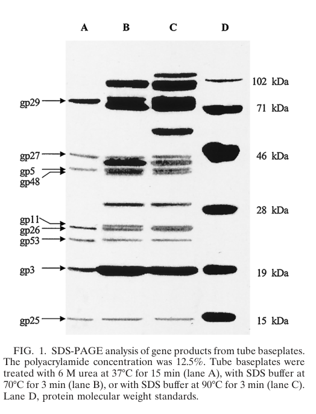

## Question

# Gene Research for Functional Annotation

## ⚠️ CRITICAL: Gene/Protein Identification Context

**BEFORE YOU BEGIN RESEARCH:** You MUST verify you are researching the CORRECT gene/protein. Gene symbols can be ambiguous, especially for less well-characterized genes from non-model organisms.

### Target Gene/Protein Identity (from UniProt):
- **UniProt Accession:** P13335
- **Protein Description:** RecName: Full=Baseplate hub assembly protein gp26 {ECO:0000303|PubMed:21129200}; AltName: Full=Gene product 26; Short=gp26; AltName: Full=Hub protein 26; Flags: Precursor;
- **Gene Information:** Name=26;
- **Organism (full):** Enterobacteria phage T4 (Bacteriophage T4).
- **Protein Family:** Not specified in UniProt
- **Key Domains:** Baseplate_phage_T4-like. (IPR024364); T4_baseplate (PF12322)

### MANDATORY VERIFICATION STEPS:

1. **Check if the gene symbol "26" matches the protein description above**
2. **Verify the organism is correct:** Enterobacteria phage T4 (Bacteriophage T4).
3. **Check if protein family/domains align with what you find in literature**
4. **If you find literature for a DIFFERENT gene with the same or similar symbol, STOP**

### If Gene Symbol is Ambiguous or You Cannot Find Relevant Literature:

**DO NOT PROCEED WITH RESEARCH ON A DIFFERENT GENE.** Instead:
- State clearly: "The gene symbol '26' is ambiguous or literature is limited for this specific protein"
- Explain what you found (e.g., "Found extensive literature on a different gene with the same symbol in a different organism")
- Describe the protein based ONLY on the UniProt information provided above
- Suggest that the protein function can be inferred from domain/family information

### Research Target:

Please provide a comprehensive research report on the gene **26** (gene ID: 26, UniProt: P13335) in BPT4.

The research report should be a detailed narrative explaining the function, biological processes, and localization of the gene product. Citations should be given for all claims.

You should prioritize authoritative reviews and primary scientific literature when conducting research. You can supplement
this with annotations you find in gene/protein databases, but these can be outdated or inaccurate.

We are specifically interested in the primary function of the gene - for enzymes, what reaction is catalyzed, and what is the substrate specificity? For transporters, what is the substrate? For structural proteins or adapters, what is the broader structural role? For signaling molecules, what is the role in the pathway.

We are interested in where in or outside the cell the gene product carries out its function.

We are also interested in the signaling or biochemical pathways in which the gene functions. We are less interested in broad pleiotropic effects, except where these elucidate the precise role.

Include evidence where possible. We are interested in both experimental evidence as well as inference from structure, evolution, or bioinformatic analysis. Precise studies should be prioritized over high-throughput, where available.

## Output

Question: You are an expert researcher providing comprehensive, well-cited information.

Provide detailed information focusing on:
1. Key concepts and definitions with current understanding
2. Recent developments and latest research (prioritize 2023-2024 sources)
3. Current applications and real-world implementations
4. Expert opinions and analysis from authoritative sources
5. Relevant statistics and data from recent studies

Format as a comprehensive research report with proper citations. Include URLs and publication dates where available.
Always prioritize recent, authoritative sources and provide specific citations for all major claims.

# Gene Research for Functional Annotation

## ⚠️ CRITICAL: Gene/Protein Identification Context

**BEFORE YOU BEGIN RESEARCH:** You MUST verify you are researching the CORRECT gene/protein. Gene symbols can be ambiguous, especially for less well-characterized genes from non-model organisms.

### Target Gene/Protein Identity (from UniProt):
- **UniProt Accession:** P13335
- **Protein Description:** RecName: Full=Baseplate hub assembly protein gp26 {ECO:0000303|PubMed:21129200}; AltName: Full=Gene product 26; Short=gp26; AltName: Full=Hub protein 26; Flags: Precursor;
- **Gene Information:** Name=26;
- **Organism (full):** Enterobacteria phage T4 (Bacteriophage T4).
- **Protein Family:** Not specified in UniProt
- **Key Domains:** Baseplate_phage_T4-like. (IPR024364); T4_baseplate (PF12322)

### MANDATORY VERIFICATION STEPS:

1. **Check if the gene symbol "26" matches the protein description above**
2. **Verify the organism is correct:** Enterobacteria phage T4 (Bacteriophage T4).
3. **Check if protein family/domains align with what you find in literature**
4. **If you find literature for a DIFFERENT gene with the same or similar symbol, STOP**

### If Gene Symbol is Ambiguous or You Cannot Find Relevant Literature:

**DO NOT PROCEED WITH RESEARCH ON A DIFFERENT GENE.** Instead:
- State clearly: "The gene symbol '26' is ambiguous or literature is limited for this specific protein"
- Explain what you found (e.g., "Found extensive literature on a different gene with the same symbol in a different organism")
- Describe the protein based ONLY on the UniProt information provided above
- Suggest that the protein function can be inferred from domain/family information

### Research Target:

Please provide a comprehensive research report on the gene **26** (gene ID: 26, UniProt: P13335) in BPT4.

The research report should be a detailed narrative explaining the function, biological processes, and localization of the gene product. Citations should be given for all claims.

You should prioritize authoritative reviews and primary scientific literature when conducting research. You can supplement
this with annotations you find in gene/protein databases, but these can be outdated or inaccurate.

We are specifically interested in the primary function of the gene - for enzymes, what reaction is catalyzed, and what is the substrate specificity? For transporters, what is the substrate? For structural proteins or adapters, what is the broader structural role? For signaling molecules, what is the role in the pathway.

We are interested in where in or outside the cell the gene product carries out its function.

We are also interested in the signaling or biochemical pathways in which the gene functions. We are less interested in broad pleiotropic effects, except where these elucidate the precise role.

Include evidence where possible. We are interested in both experimental evidence as well as inference from structure, evolution, or bioinformatic analysis. Precise studies should be prioritized over high-throughput, where available.

## Research report: Functional annotation of bacteriophage T4 gene 26 (gp26) (UniProt P13335)

### 0) Identity verification (critical disambiguation)
The literature evidence retrieved here refers specifically to **Enterobacteria phage T4** baseplate morphogenesis and explicitly names **gene 26 / gp26** as a baseplate-associated hub factor/protein in T4, matching the UniProt record (P13335) describing **“Baseplate hub assembly protein gp26”** rather than any unrelated “gp26” from other phages or bacteria. (gruidl1991twobacteriophaget4 pages 1-2, kikuchi1975geneticcontrolof pages 1-3)

### 1) Key concepts and definitions (current understanding)

#### 1.1 Contractile tail baseplate and “hub”
For myophages like T4, the **baseplate** is a multifunctional multiprotein machine at the distal end of the tail that mediates adsorption and triggers sheath contraction; it undergoes a large conformational switch from a dome-like to a “star” conformation without changing protein composition. Reported baseplate dimensions are ~**27 nm height** and **52 nm diameter** (dome), changing to **61 nm diameter** and **12 nm height** in the star state, with a total of ~**150 subunits** from about a dozen gene products. (orlova2012bacteriophagesandtheir pages 12-14)

The **central hub** is the baseplate’s core region that couples receptor-triggered baseplate conformational changes to the tail tube/sheath firing mechanism. In a synthesis/review of phage structural organization, the T4 central hub is described as formed by **gp5, gp27, and gp29** and **probably including gp26 and gp28**. (orlova2012bacteriophagesandtheir pages 12-14)

#### 1.2 “Virion structural component” vs “catalytic/nonstructural assembly factor”
A recurring issue in older T4 tail assembly literature is that some low-abundance baseplate factors were difficult to detect in SDS-PAGE of mature particles, leading to models in which certain gene products were considered **catalytic/nonstructural** (acting transiently during morphogenesis) rather than incorporated stoichiometrically. In a later synthesis of tail assembly work, Arisaka et al. still list gp26 as a hub-associated gene product but note that its precise **location and specific function** remained uncertain in the summarized literature. (arisaka2016molecularassemblyand pages 8-10)

### 2) Gene product overview (gp26) and primary functional role

#### 2.1 Primary role: hub/baseplate morphogenesis and stabilization
Genetic evidence places gene 26 among “group II” baseplate genes required to form the **central part (hub/plug) of the baseplate**. In gene 26 mutant contexts, cells still form **15S arm complexes** (wedge/arm precursors), but accumulate only small amounts of organized **70S** baseplate-like structures that are **unstable** and tend to break down into star-like assemblies; these structures typically lack the **central plug/hub density** seen in normal baseplates. This indicates gp26 functions after 15S arm formation, in **assembly and/or stabilization of a hub-containing 70S baseplate intermediate**. (kikuchi1975geneticcontrolof pages 1-3, kikuchi1975geneticcontrolof pages 11-15)

Mechanistically, Kikuchi & King conclude that group II gene products (including gene 26) could function either (i) in assembling 15S complexes into a stable 70S hexagon or (ii) after 70S formation, converting an unstable 70S structure to a stable one—both interpretations place gp26 as a key factor in hub maturation. (kikuchi1975geneticcontrolof pages 11-15)

#### 2.2 Localization: baseplate hub / tube baseplate
Multiple sources place gp26 at the **baseplate hub**:
* A molecular-architecture synthesis of T4 includes gp26 among baseplate hub components (though with uncertainty in structural placement in the figure). (mesyanzhinov2004moleculararchitectureof pages 14-17)
* A structural-organization review states gp26 “probably” belongs to the **central hub**. (orlova2012bacteriophagesandtheir pages 12-14)
* Direct biochemical analysis of **purified tube baseplates** identifies gp26 as a component that can be released from tube baseplates during 6 M urea treatment, indicating physical association with the hub/baseplate. (ye2004processingofthe pages 1-2)

Together, these support the UniProt “baseplate hub assembly protein” description: gp26 acts at/within the **virion tail baseplate hub**.

### 3) Biochemical properties, processing, and interaction context

#### 3.1 Size and post-translational processing
A transcription/translation study of the region containing baseplate genes 25 and 26 reports an **in vivo-expressed gene 26 product of 23.9 kDa**, and proposes that gp26 might be **processed during assembly** because the species isolated from baseplates had been reported as larger. (gruidl1991twobacteriophaget4 pages 1-2)

Direct biochemical work on purified tube baseplates later identifies gp26 as a band in the **~24 kDa** region by **N-terminal sequencing** and finds that the mature protein’s N-terminus begins **F-D-V-R-V-G-S-K-I-I-N-**, consistent with removal of the first **five residues** (**MYEYK**) from the DNA-deduced sequence (i.e., limited N-terminal processing). (ye2004processingofthe pages 1-2)

**Visual evidence:** the SDS-PAGE band corresponding to gp26 and the table of N-terminal sequences (including gp26’s “N-terminal 5 residues removed”) are shown in the extracted figure/table from Ye & Nemoto 2004. (ye2004processingofthe media fd6b9298, ye2004processingofthe media d886aa61)

#### 3.2 Physical/functional neighborhood (co-released proteins)
In the same tube-baseplate biochemical preparation, 6 M urea releases gp26 along with **gp5, gp29, gp27, gp53, gp3, and gp25**. This co-release supports that gp26 resides in/near the hub and interacts closely (directly or indirectly) with the main hub proteins (gp5/gp27/gp29) and adjacent baseplate proteins. (ye2004processingofthe pages 1-2)

#### 3.3 Enzymatic activity
Within the retrieved sources, **no enzymatic activity** is demonstrated for gp26. In contrast, gp5 is explicitly described as a tail lysozyme (murein-degrading) component, underscoring that gp26 is not the enzymatic hub element described in these excerpts. (arisaka2016molecularassemblyand pages 1-2, ye2004processingofthe pages 1-2)

### 4) Structural information and domain/family inference

#### 4.1 What is currently supported in the retrieved literature
Across retrieved T4-focused sources, gp26 is consistently treated as a **hub-associated** protein, but there is **no atomic structure**, oligomeric state, or definitive placement of gp26 within the hub provided in the excerpts available here. In a T4 tail assembly review table, gp26 is listed as a hub component with **208 aa length** and **stoichiometry “ND” (not determined)**, reflecting that quantitative incorporation is not well established in that synthesis. (arisaka2016molecularassemblyand pages 1-2)

#### 4.2 Domain-based inference (with limitations)
UniProt indicates gp26 contains **Baseplate_phage_T4-like** and **T4_baseplate** domains (InterPro IPR024364; PF12322). The retrieved literature supports the **functional placement** of gp26 in the baseplate hub, consistent with these domain assignments, but does not add new experimentally validated fold/domain boundaries or functional motifs beyond hub association and processing. (mesyanzhinov2004moleculararchitectureof pages 14-17, ye2004processingofthe pages 1-2)

### 5) Assembly pathway placement and expert analysis (authoritative interpretations)

#### 5.1 Genetic model (Kikuchi & King) and early debate
Kikuchi & King’s genetic analysis of mutants unable to form the central part of the baseplate supports that gene 26 is required for creating stable hub-containing baseplates; gp26 is among minor/low-abundance components that are hard to detect by gels, motivating uncertainty about whether such proteins are structural. (kikuchi1975geneticcontrolof pages 1-3)

A later synthesis (Lou 2002, summarizing older models) describes a historical debate: Kikuchi & King–derived models proposed gp26 (with gp51 and gp28) might be **catalytic/nonstructural** because they were active in in vitro complementation assays but not detected in mature phage by SDS-PAGE; alternative models (e.g., attributed to Kozloff) considered the full hub gene set structural but included conflicting molecular-weight and immunoblot-based claims. (lou2002theroleofa pages 21-27, lou2002theroleof pages 21-27)

#### 5.2 Resolution by later biochemical evidence
Ye & Nemoto (2004) provide direct biochemical evidence that gp26 **is present in tube baseplate preparations** and can be identified by N-terminal sequencing, contradicting an earlier claim that gp26 was not located in the baseplate. This supports a **structural association** of gp26 with the baseplate/hub (even if low copy number and/or labile association may have made earlier detection difficult). (ye2004processingofthe pages 1-2)

Modern synthesis therefore supports the interpretation: gp26 is **required for hub/baseplate morphogenesis** and is **baseplate-associated**, while its exact structural position and stoichiometry remain incompletely established. (arisaka2016molecularassemblyand pages 8-10, ye2004processingofthe pages 1-2)

### 6) Quantitative data and statistics from the retrieved studies

* **Baseplate dimensions and composition (context for gp26):** ~27 nm height and 52 nm diameter; switches to 61 nm diameter and 12 nm height; ~150 subunits. (orlova2012bacteriophagesandtheir pages 12-14)
* **gp26 apparent mass and processing:** ~24 kDa band; N-terminal **5 aa removed**; N-terminal sequence **F-D-V-R-V-G-S-K-I-I-N-** reported. (ye2004processingofthe pages 1-2)
* **Gene 26 product size (expression study):** **23.9 kDa** in vivo-expressed product reported in transcriptional study. (gruidl1991twobacteriophaget4 pages 1-2)
* **Stoichiometry/copy number:** reported as **ND** in a tail assembly synthesis table; older genetics notes hub proteins are low abundance/low stoichiometry, complicating detection. (arisaka2016molecularassemblyand pages 1-2, kikuchi1975geneticcontrolof pages 1-3)

### 7) Recent developments (2023–2024) and real-world implementation context

#### 7.1 Status of 2023–2024 gp26-specific T4 literature
Tool-based searches for 2023–2024 publications explicitly about **T4 gp26** did not yield additional T4 gp26 primary studies in the retrieved corpus. The most direct experimentally grounded T4 gp26 evidence available here remains the classic genetic/biochemical literature and mid-2010s structural/assembly reviews. (arisaka2016molecularassemblyand pages 8-10, ye2004processingofthe pages 1-2)

#### 7.2 How 2023–2024 work informs gp26-like proteins (comparative context; not T4 gene 26)
Some 2023–2024 papers discuss “gp26” in other phages, but these are **not** the T4 gene 26 protein and should not be conflated with UniProt P13335. They primarily illustrate that **annotation of structural proteins named gp26 varies by phage lineage**, and that modern efforts combine cryo-EM/proteomics/genomics to map tail/baseplate components—methods that could be applied to resolve remaining questions for T4 gp26 (e.g., stoichiometry/placement). (rafael2023distantlyrelatedalteromonas pages 5-5, harris2024genomicandproteomic pages 12-13)

#### 7.3 Real-world applications
The T4 baseplate is a canonical model for contractile injection machines; while T4 itself is not typically used directly as a therapeutic phage, the mechanistic/structural principles of myophage baseplates underpin **phage engineering** and **phage therapy** efforts in other systems. The retrieved, T4-relevant application context in the available sources is indirect (structural biology and assembly principles), not gp26-specific translational use. (orlova2012bacteriophagesandtheir pages 12-14)

Patent searches using “T4 gp26 baseplate” retrieved general phage biocontrol/detection patents rather than inventions targeting **T4 gene 26** specifically; thus, no gp26-specific IP landscape can be supported from the retrieved patents alone. (no directly cited patent context IDs were extracted as gp26-specific evidence)

### 8) Practical functional annotation (evidence-weighted)

**Gene/protein:** gene 26 / gp26 (UniProt P13335)

**Primary function:** a **baseplate hub assembly/morphogenesis factor** required to build a stable, hub-containing baseplate; likely contributes to assembly or stabilization of the central hub/plug and is baseplate-associated in purified tube baseplates. (kikuchi1975geneticcontrolof pages 1-3, ye2004processingofthe pages 1-2)

**Cellular/virion localization:** **virion structural region**—T4 tail **baseplate central hub / tube-baseplate interface**. (orlova2012bacteriophagesandtheir pages 12-14, ye2004processingofthe pages 1-2)

**Enzymatic activity:** none demonstrated in retrieved evidence. (ye2004processingofthe pages 1-2)

**Processing:** limited **N-terminal trimming** of 5 residues in baseplate-associated gp26. (ye2004processingofthe pages 1-2)

**Interaction context:** co-associated/co-released with hub proteins gp5/gp27/gp29 and nearby baseplate proteins gp53/gp25 and tail-tip gp3 in baseplate preparations. (ye2004processingofthe pages 1-2)

### 9) Key knowledge gaps and recommended next evidence to resolve them

1. **Stoichiometry/copy number of gp26 per baseplate/virion** remains unresolved in the reviewed synthesis (listed as ND). (arisaka2016molecularassemblyand pages 1-2)
2. **High-resolution structural placement** (atomic model, oligomeric state) of gp26 within the hub is not provided in the retrieved excerpts. (arisaka2016molecularassemblyand pages 1-2, mesyanzhinov2004moleculararchitectureof pages 14-17)
3. The historical “catalytic vs structural” debate appears partly resolved toward **baseplate association**, but whether gp26 has an additional **transient chaperone-like role** during hub assembly remains an open question in the cited synthesis. (lou2002theroleofa pages 21-27, ye2004processingofthe pages 1-2)

### Evidence summary table
| Aspect | Key findings | Best supporting sources (include DOI/URL and year) |
|---|---|---|
| identity | The target is specifically bacteriophage T4 gene 26 / gp26, annotated in T4 literature as a baseplate gene product and hub-associated assembly factor/protein; Arisaka et al. list gp26 as a 208 aa baseplate hub component with stoichiometry not determined. (arisaka2016molecularassemblyand pages 1-2, gruidl1991twobacteriophaget4 pages 1-2) | Arisaka et al., *Biophysical Reviews* (2016), DOI: 10.1007/s12551-016-0230-x, https://doi.org/10.1007/s12551-016-0230-x (arisaka2016molecularassemblyand pages 1-2); Gruidl et al., *Virology* (1991), DOI: 10.1016/0042-6822(91)90852-3, https://doi.org/10.1016/0042-6822(91)90852-3 (gruidl1991twobacteriophaget4 pages 1-2) |
| localization | gp26 localizes to the central hub/baseplate region of the T4 tail; reviews describe the central hub as formed by gp5, gp27, gp29 and probably including gp26 and gp28. It is also detected in purified tube baseplates. (mesyanzhinov2004moleculararchitectureof pages 14-17, orlova2012bacteriophagesandtheir pages 12-14, ye2004processingofthe pages 1-2) | Mesyanzhinov et al., *Biochemistry (Moscow)* (2004), DOI: 10.1007/pl00021751, https://doi.org/10.1007/pl00021751 (mesyanzhinov2004moleculararchitectureof pages 14-17); Orlova, *Bacteriophages* (2012), DOI: 10.5772/34642, https://doi.org/10.5772/34642 (orlova2012bacteriophagesandtheir pages 12-14); Ye & Nemoto, *J. Bacteriol.* (2004), DOI: 10.1128/JB.186.18.6335-6339.2004, https://doi.org/10.1128/JB.186.18.6335-6339.2004 (ye2004processingofthe pages 1-2) |
| role in assembly | Gene 26 is required for morphogenesis of the central part of the baseplate. gene 26 mutants can form 15S arm precursors but accumulate unstable 70S baseplate-like structures lacking the central hub/plug, implying a role in assembly or stabilization of the mature hub. (kikuchi1975geneticcontrolof pages 1-3, kikuchi1975geneticcontrolof pages 11-15) | Kikuchi & King, *J. Mol. Biol.* (1975), DOI: 10.1016/S0022-2836(75)80179-3, https://doi.org/10.1016/S0022-2836(75)80179-3 (kikuchi1975geneticcontrolof pages 1-3, kikuchi1975geneticcontrolof pages 11-15) |
| evidence for virion/baseplate association | Earlier work could not reliably detect gp26 in gels, contributing to uncertainty, but later biochemical analysis of purified tube baseplates identified a ~24 kDa gp26 band by N-terminal sequencing and showed gp26 is released from tube baseplates by 6 M urea, supporting direct baseplate association. (lou2002theroleof pages 15-21, lou2002theroleofa pages 15-21, ye2004processingofthe pages 1-2) | Ye & Nemoto, *J. Bacteriol.* (2004), DOI: 10.1128/JB.186.18.6335-6339.2004, https://doi.org/10.1128/JB.186.18.6335-6339.2004 (ye2004processingofthe pages 1-2); Lou (2002 thesis excerpt summarizing earlier work) (lou2002theroleof pages 15-21, lou2002theroleofa pages 15-21) |
| processing/mass | The predicted/in vivo-expressed gp26 is ~23.9 kDa, while the mature baseplate-associated species migrates at ~24 kDa and has an N-terminus beginning F-D-V-R-V-G-S-K-I-I-N, indicating removal of the first five residues (MYEYK). Earlier transcription work suggested assembly-linked processing. (ye2004processingofthe pages 1-2, gruidl1991twobacteriophaget4 pages 1-2) | Gruidl et al., *Virology* (1991), DOI: 10.1016/0042-6822(91)90852-3, https://doi.org/10.1016/0042-6822(91)90852-3 (gruidl1991twobacteriophaget4 pages 1-2); Ye & Nemoto, *J. Bacteriol.* (2004), DOI: 10.1128/JB.186.18.6335-6339.2004, https://doi.org/10.1128/JB.186.18.6335-6339.2004 (ye2004processingofthe pages 1-2) |
| interaction partners/co-released proteins | In urea-treated tube baseplates, gp26 is co-released with gp5, gp29, gp27, gp53, gp3, and gp25, consistent with physical proximity to hub and nearby baseplate proteins. Genetic studies place it in the same hub assembly pathway as gp5, gp27, gp28, gp29, and gp51. (ye2004processingofthe pages 1-2, kikuchi1975geneticcontrolof pages 1-3) | Ye & Nemoto, *J. Bacteriol.* (2004), DOI: 10.1128/JB.186.18.6335-6339.2004, https://doi.org/10.1128/JB.186.18.6335-6339.2004 (ye2004processingofthe pages 1-2); Kikuchi & King, *J. Mol. Biol.* (1975), DOI: 10.1016/S0022-2836(75)80179-3, https://doi.org/10.1016/S0022-2836(75)80179-3 (kikuchi1975geneticcontrolof pages 1-3) |
| catalytic vs structural debate | Historical interpretation was conflicting: Kikuchi & King–derived models treated gp26 as possibly catalytic/nonstructural because it was hard to detect in mature particles, whereas later biochemical work directly identified gp26 in tube baseplates, supporting at least some structural/baseplate association. Modern reviews therefore place gp26 in the hub but still note uncertainty in its exact location/function. (lou2002theroleof pages 21-27, lou2002theroleofa pages 21-27, ye2004processingofthe pages 1-2, arisaka2016molecularassemblyand pages 8-10) | Lou (2002 thesis excerpt summarizing older models) (lou2002theroleof pages 21-27, lou2002theroleofa pages 21-27); Ye & Nemoto, *J. Bacteriol.* (2004), DOI: 10.1128/JB.186.18.6335-6339.2004, https://doi.org/10.1128/JB.186.18.6335-6339.2004 (ye2004processingofthe pages 1-2); Arisaka et al., *Biophysical Reviews* (2016), DOI: 10.1007/s12551-016-0230-x, https://doi.org/10.1007/s12551-016-0230-x (arisaka2016molecularassemblyand pages 8-10) |
| quantitative data gaps | Important unknowns remain: stoichiometry/copy number of gp26 in the mature tail is listed as ND; no high-resolution atomic structure, oligomeric state, or definitive placement within the hub is provided in the reviewed sources; no enzymatic activity has been demonstrated. (arisaka2016molecularassemblyand pages 1-2, arisaka2016molecularassemblyand pages 8-10, ye2004processingofthe pages 1-2) | Arisaka et al., *Biophysical Reviews* (2016), DOI: 10.1007/s12551-016-0230-x, https://doi.org/10.1007/s12551-016-0230-x (arisaka2016molecularassemblyand pages 1-2, arisaka2016molecularassemblyand pages 8-10); Ye & Nemoto, *J. Bacteriol.* (2004), DOI: 10.1128/JB.186.18.6335-6339.2004, https://doi.org/10.1128/JB.186.18.6335-6339.2004 (ye2004processingofthe pages 1-2) |

*Table: This table compiles the main annotation points for bacteriophage T4 gp26 (gene 26; UniProt P13335), emphasizing identity, localization, assembly role, processing, and unresolved questions. It is useful as a compact evidence map for functional annotation using only the retrieved context-supported sources.*

### Key cited sources (URLs and publication dates)
* Kikuchi Y, King J. **Genetic control of bacteriophage T4 baseplate morphogenesis. II.** *Journal of Molecular Biology* (Dec **1975**). https://doi.org/10.1016/S0022-2836(75)80179-3 (kikuchi1975geneticcontrolof pages 1-3)
* Gruidl ME et al. **Overlapping transcription units including base plate genes 25 and 26**. *Virology* (Sep **1991**). https://doi.org/10.1016/0042-6822(91)90852-3 (gruidl1991twobacteriophaget4 pages 1-2)
* Ye N, Nemoto N. **Processing of the Tail Lysozyme (gp5) of Bacteriophage T4** (includes gp26 identification/processing in tube baseplates). *Journal of Bacteriology* (Sep **2004**). https://doi.org/10.1128/JB.186.18.6335-6339.2004 (ye2004processingofthe pages 1-2, ye2004processingofthe media fd6b9298, ye2004processingofthe media d886aa61)
* Orlova EV. **Bacteriophages and Their Structural Organisation** (T4 baseplate dimensions; hub composition incl. probable gp26). InTech (Mar **2012**). https://doi.org/10.5772/34642 (orlova2012bacteriophagesandtheir pages 12-14)
* Arisaka F et al. **Molecular assembly and structure of the bacteriophage T4 tail**. *Biophysical Reviews* (Nov **2016**). https://doi.org/10.1007/s12551-016-0230-x (arisaka2016molecularassemblyand pages 8-10)

References

1. (gruidl1991twobacteriophaget4 pages 1-2): Michael E. Gruidl, Tony C. Chen, Silvana Gargano, Aurora Storlazzi, Antonio Cascino, and Gisela Mosig. Two bacteriophage t4 base plate genes (25 and 26) and the dna repair gene uvsy belong to spatially and temporally overlapping transcription units. Virology, 184 1:359-69, Sep 1991. URL: https://doi.org/10.1016/0042-6822(91)90852-3, doi:10.1016/0042-6822(91)90852-3. This article has 18 citations and is from a peer-reviewed journal.

2. (kikuchi1975geneticcontrolof pages 1-3): Yoshiko Kikuchi and Jonathan King. Genetic control of bacteriophage t4 baseplate morphogenesis. ii. mutants unable to form the central part of the baseplate. Journal of molecular biology, 99 4:673-94, Dec 1975. URL: https://doi.org/10.1016/s0022-2836(75)80179-3, doi:10.1016/s0022-2836(75)80179-3. This article has 98 citations and is from a domain leading peer-reviewed journal.

3. (orlova2012bacteriophagesandtheir pages 12-14): E.V. Orlova. Bacteriophages and their structural organisation. Bacteriophages, Mar 2012. URL: https://doi.org/10.5772/34642, doi:10.5772/34642. This article has 40 citations.

4. (arisaka2016molecularassemblyand pages 8-10): Fumio Arisaka, Moh Lan Yap, Shuji Kanamaru, and Michael G. Rossmann. Molecular assembly and structure of the bacteriophage t4 tail. Biophysical Reviews, 8:385-396, Nov 2016. URL: https://doi.org/10.1007/s12551-016-0230-x, doi:10.1007/s12551-016-0230-x. This article has 55 citations and is from a peer-reviewed journal.

5. (kikuchi1975geneticcontrolof pages 11-15): Yoshiko Kikuchi and Jonathan King. Genetic control of bacteriophage t4 baseplate morphogenesis. ii. mutants unable to form the central part of the baseplate. Journal of molecular biology, 99 4:673-94, Dec 1975. URL: https://doi.org/10.1016/s0022-2836(75)80179-3, doi:10.1016/s0022-2836(75)80179-3. This article has 98 citations and is from a domain leading peer-reviewed journal.

6. (mesyanzhinov2004moleculararchitectureof pages 14-17): V. V. Mesyanzhinov, P. G. Leiman, V. A. Kostyuchenko, L. P. Kurochkina, K. A. Miroshnikov, N. N. Sykilinda, and M. M. Shneider. Molecular architecture of bacteriophage t4. Biochemistry (Moscow), 69:1190-1202, Nov 2004. URL: https://doi.org/10.1007/pl00021751, doi:10.1007/pl00021751. This article has 61 citations.

7. (ye2004processingofthe pages 1-2): Nanzhang Ye and Naoki Nemoto. Processing of the tail lysozyme (gp5) of bacteriophage t4. Journal of Bacteriology, 186:6335-6339, Sep 2004. URL: https://doi.org/10.1128/jb.186.18.6335-6339.2004, doi:10.1128/jb.186.18.6335-6339.2004. This article has 9 citations and is from a peer-reviewed journal.

8. (ye2004processingofthe media fd6b9298): Nanzhang Ye and Naoki Nemoto. Processing of the tail lysozyme (gp5) of bacteriophage t4. Journal of Bacteriology, 186:6335-6339, Sep 2004. URL: https://doi.org/10.1128/jb.186.18.6335-6339.2004, doi:10.1128/jb.186.18.6335-6339.2004. This article has 9 citations and is from a peer-reviewed journal.

9. (ye2004processingofthe media d886aa61): Nanzhang Ye and Naoki Nemoto. Processing of the tail lysozyme (gp5) of bacteriophage t4. Journal of Bacteriology, 186:6335-6339, Sep 2004. URL: https://doi.org/10.1128/jb.186.18.6335-6339.2004, doi:10.1128/jb.186.18.6335-6339.2004. This article has 9 citations and is from a peer-reviewed journal.

10. (arisaka2016molecularassemblyand pages 1-2): Fumio Arisaka, Moh Lan Yap, Shuji Kanamaru, and Michael G. Rossmann. Molecular assembly and structure of the bacteriophage t4 tail. Biophysical Reviews, 8:385-396, Nov 2016. URL: https://doi.org/10.1007/s12551-016-0230-x, doi:10.1007/s12551-016-0230-x. This article has 55 citations and is from a peer-reviewed journal.

11. (lou2002theroleofa pages 21-27): Y Lou. The role of baseplate protein gp29 in bacteriophage t4 tail assembly. Unknown journal, 2002.

12. (lou2002theroleof pages 21-27): Y Lou. The role of baseplate protein gp29 in bacteriophage t4 tail assembly. Unknown journal, 2002.

13. (rafael2023distantlyrelatedalteromonas pages 5-5): Rafael Gonzalez-Serrano, Riccardo Rosselli, Juan J. Roda-Garcia, Ana-Belen Martin-Cuadrado, Francisco Rodriguez-Valera, and Matthew Dunne. Distantly related alteromonas bacteriophages share tail fibers exhibiting properties of transient chaperone caps. Nature Communications, Oct 2023. URL: https://doi.org/10.1038/s41467-023-42114-8, doi:10.1038/s41467-023-42114-8. This article has 22 citations and is from a highest quality peer-reviewed journal.

14. (harris2024genomicandproteomic pages 12-13): Evan B. Harris, Kenneth K. K. Ewool, Lucy C. Bowden, Jonatan Fierro, Daniel Johnson, McKay Meinzer, Sadie Tayler, and Julianne H. Grose. Genomic and proteomic analysis of six vi01-like phages reveals wide host range and multiple tail spike proteins. Viruses, 16:289, Feb 2024. URL: https://doi.org/10.3390/v16020289, doi:10.3390/v16020289. This article has 2 citations.

15. (lou2002theroleof pages 15-21): Y Lou. The role of baseplate protein gp29 in bacteriophage t4 tail assembly. Unknown journal, 2002.

16. (lou2002theroleofa pages 15-21): Y Lou. The role of baseplate protein gp29 in bacteriophage t4 tail assembly. Unknown journal, 2002.

## Artifacts

- [Edison artifact artifact-00](26-deep-research-falcon_artifacts/artifact-00.md)

## Citations

1. orlova2012bacteriophagesandtheir pages 12-14
2. arisaka2016molecularassemblyand pages 8-10
3. kikuchi1975geneticcontrolof pages 11-15
4. mesyanzhinov2004moleculararchitectureof pages 14-17
5. ye2004processingofthe pages 1-2
6. arisaka2016molecularassemblyand pages 1-2
7. kikuchi1975geneticcontrolof pages 1-3
8. lou2002theroleofa pages 21-27
9. lou2002theroleof pages 21-27
10. rafael2023distantlyrelatedalteromonas pages 5-5
11. harris2024genomicandproteomic pages 12-13
12. lou2002theroleof pages 15-21
13. lou2002theroleofa pages 15-21
14. https://doi.org/10.1007/s12551-016-0230-x
15. https://doi.org/10.1016/0042-6822(91
16. https://doi.org/10.1007/pl00021751
17. https://doi.org/10.5772/34642
18. https://doi.org/10.1128/JB.186.18.6335-6339.2004
19. https://doi.org/10.1016/S0022-2836(75
20. https://doi.org/10.1016/s0022-2836(75
21. https://doi.org/10.5772/34642,
22. https://doi.org/10.1007/s12551-016-0230-x,
23. https://doi.org/10.1007/pl00021751,
24. https://doi.org/10.1128/jb.186.18.6335-6339.2004,
25. https://doi.org/10.1038/s41467-023-42114-8,
26. https://doi.org/10.3390/v16020289,