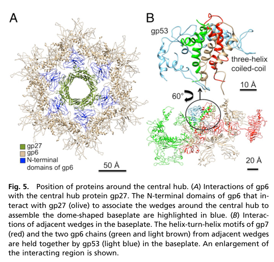

## Question

# Gene Research for Functional Annotation

## ⚠️ CRITICAL: Gene/Protein Identification Context

**BEFORE YOU BEGIN RESEARCH:** You MUST verify you are researching the CORRECT gene/protein. Gene symbols can be ambiguous, especially for less well-characterized genes from non-model organisms.

### Target Gene/Protein Identity (from UniProt):
- **UniProt Accession:** P17172
- **Protein Description:** RecName: Full=Baseplate central spike complex protein gp27 {ECO:0000303|PubMed:27193680}; AltName: Full=Gene product 27; Short=gp27; AltName: Full=Hub protein 27;
- **Gene Information:** Name=27;
- **Organism (full):** Enterobacteria phage T4 (Bacteriophage T4).
- **Protein Family:** Not specified in UniProt
- **Key Domains:** Gp27_dom2. (IPR043085); Gp27_dom3. (IPR043083); Gp27_dom4. (IPR043084); Peptidase_S1_PA_chymotrypsin. (IPR043504); Phage_T4_Gp27_C. (IPR015180)

### MANDATORY VERIFICATION STEPS:

1. **Check if the gene symbol "27" matches the protein description above**
2. **Verify the organism is correct:** Enterobacteria phage T4 (Bacteriophage T4).
3. **Check if protein family/domains align with what you find in literature**
4. **If you find literature for a DIFFERENT gene with the same or similar symbol, STOP**

### If Gene Symbol is Ambiguous or You Cannot Find Relevant Literature:

**DO NOT PROCEED WITH RESEARCH ON A DIFFERENT GENE.** Instead:
- State clearly: "The gene symbol '27' is ambiguous or literature is limited for this specific protein"
- Explain what you found (e.g., "Found extensive literature on a different gene with the same symbol in a different organism")
- Describe the protein based ONLY on the UniProt information provided above
- Suggest that the protein function can be inferred from domain/family information

### Research Target:

Please provide a comprehensive research report on the gene **27** (gene ID: 27, UniProt: P17172) in BPT4.

The research report should be a detailed narrative explaining the function, biological processes, and localization of the gene product. Citations should be given for all claims.

You should prioritize authoritative reviews and primary scientific literature when conducting research. You can supplement
this with annotations you find in gene/protein databases, but these can be outdated or inaccurate.

We are specifically interested in the primary function of the gene - for enzymes, what reaction is catalyzed, and what is the substrate specificity? For transporters, what is the substrate? For structural proteins or adapters, what is the broader structural role? For signaling molecules, what is the role in the pathway.

We are interested in where in or outside the cell the gene product carries out its function.

We are also interested in the signaling or biochemical pathways in which the gene functions. We are less interested in broad pleiotropic effects, except where these elucidate the precise role.

Include evidence where possible. We are interested in both experimental evidence as well as inference from structure, evolution, or bioinformatic analysis. Precise studies should be prioritized over high-throughput, where available.

## Output

Question: You are an expert researcher providing comprehensive, well-cited information.

Provide detailed information focusing on:
1. Key concepts and definitions with current understanding
2. Recent developments and latest research (prioritize 2023-2024 sources)
3. Current applications and real-world implementations
4. Expert opinions and analysis from authoritative sources
5. Relevant statistics and data from recent studies

Format as a comprehensive research report with proper citations. Include URLs and publication dates where available.
Always prioritize recent, authoritative sources and provide specific citations for all major claims.

# Gene Research for Functional Annotation

## ⚠️ CRITICAL: Gene/Protein Identification Context

**BEFORE YOU BEGIN RESEARCH:** You MUST verify you are researching the CORRECT gene/protein. Gene symbols can be ambiguous, especially for less well-characterized genes from non-model organisms.

### Target Gene/Protein Identity (from UniProt):
- **UniProt Accession:** P17172
- **Protein Description:** RecName: Full=Baseplate central spike complex protein gp27 {ECO:0000303|PubMed:27193680}; AltName: Full=Gene product 27; Short=gp27; AltName: Full=Hub protein 27;
- **Gene Information:** Name=27;
- **Organism (full):** Enterobacteria phage T4 (Bacteriophage T4).
- **Protein Family:** Not specified in UniProt
- **Key Domains:** Gp27_dom2. (IPR043085); Gp27_dom3. (IPR043083); Gp27_dom4. (IPR043084); Peptidase_S1_PA_chymotrypsin. (IPR043504); Phage_T4_Gp27_C. (IPR015180)

### MANDATORY VERIFICATION STEPS:

1. **Check if the gene symbol "27" matches the protein description above**
2. **Verify the organism is correct:** Enterobacteria phage T4 (Bacteriophage T4).
3. **Check if protein family/domains align with what you find in literature**
4. **If you find literature for a DIFFERENT gene with the same or similar symbol, STOP**

### If Gene Symbol is Ambiguous or You Cannot Find Relevant Literature:

**DO NOT PROCEED WITH RESEARCH ON A DIFFERENT GENE.** Instead:
- State clearly: "The gene symbol '27' is ambiguous or literature is limited for this specific protein"
- Explain what you found (e.g., "Found extensive literature on a different gene with the same symbol in a different organism")
- Describe the protein based ONLY on the UniProt information provided above
- Suggest that the protein function can be inferred from domain/family information

### Research Target:

Please provide a comprehensive research report on the gene **27** (gene ID: 27, UniProt: P17172) in BPT4.

The research report should be a detailed narrative explaining the function, biological processes, and localization of the gene product. Citations should be given for all claims.

You should prioritize authoritative reviews and primary scientific literature when conducting research. You can supplement
this with annotations you find in gene/protein databases, but these can be outdated or inaccurate.

We are specifically interested in the primary function of the gene - for enzymes, what reaction is catalyzed, and what is the substrate specificity? For transporters, what is the substrate? For structural proteins or adapters, what is the broader structural role? For signaling molecules, what is the role in the pathway.

We are interested in where in or outside the cell the gene product carries out its function.

We are also interested in the signaling or biochemical pathways in which the gene functions. We are less interested in broad pleiotropic effects, except where these elucidate the precise role.

Include evidence where possible. We are interested in both experimental evidence as well as inference from structure, evolution, or bioinformatic analysis. Precise studies should be prioritized over high-throughput, where available.

## Research Report: Functional annotation of Enterobacteria phage T4 gene 27 (gp27; UniProt P17172)

### 0) Target verification (critical disambiguation)
The target protein is **gene product 27 (gp27)** from **Enterobacteria phage T4**, UniProt **P17172**, described in structural biology literature as a **baseplate central hub/central spike complex component** at the distal tail tip, where it forms a trimer and associates with gp5 and gp5.4. The sources reviewed consistently use “gp27” in this T4 baseplate/tail-tip context, matching the UniProt description and ruling out confusion with unrelated “27” genes from other organisms. (arisaka2016molecularassemblyand pages 1-2, yap2016roleofbacteriophage pages 1-3)

### 1) Key concepts and current understanding (definitions and role)
#### 1.1 What gp27 is
**gp27 is a virion structural protein** located in the **central hub/central spike region of the T4 baseplate**. It forms a **trimer** (three gp27 subunits per complex) that is an essential architectural element of the tail tip “puncturing device” used during infection. (arisaka2016molecularassemblyand pages 8-10, arisaka2016molecularassemblyand pages 1-2, leprince2023phageadsorptionto pages 1-2)

#### 1.2 What “baseplate central hub/spike complex” means
In contractile-tailed myophages like T4, the **baseplate** is a large multiprotein organelle at the distal end of the tail that (i) orchestrates attachment to the host surface and (ii) triggers **tail sheath contraction**, driving the tail tube into the cell envelope. The **central hub/spike complex** sits at the center of the baseplate and includes the membrane-piercing spike. gp27 is a core component of this hub/spike. (hu2015structuralremodelingof pages 1-3, yap2016roleofbacteriophage pages 1-3, yap2016roleofbacteriophage pages 3-5)

### 2) Molecular function of gp27 (primary function, partners, and mechanism)
#### 2.1 Primary function (structural / assembly and infection)
Across primary structural studies and authoritative reviews, **gp27 is supported as a structural adaptor/hub protein**, not a catalytic enzyme, with two central functional roles:

1) **Baseplate assembly nucleation and stabilization**: gp27 provides the **central hub scaffold** around which the six baseplate wedges assemble, largely through key contacts with gp6. (yap2016roleofbacteriophage pages 1-3, yap2016roleofbacteriophage pages 3-5)

2) **Membrane-puncturing spike architecture**: gp27 forms part of the **tail-tip puncturing device** with gp5 and gp5.4, positioning the spike and contributing to the overall geometry/symmetry of the hub and spike that penetrates the bacterial envelope during infection. (hu2015structuralremodelingof pages 1-3, arisaka2016molecularassemblyand pages 8-10, arisaka2016molecularassemblyand pages 6-8)

#### 2.2 Interaction partners and complex composition
The central spike complex is described with the stoichiometry:
- **(gp27)3 (gp5)3 (gp5.4)1** (a gp27 trimer + gp5 trimer + single gp5.4 “needle” component) (arisaka2016molecularassemblyand pages 8-10, arisaka2016molecularassemblyand pages 6-8)

The hub–wedge nucleation interaction emphasized in baseplate assembly is:
- **gp6–gp27 interaction**: gp6 forms a tight ring around the hub and binds gp27 strongly in the dome-shaped baseplate; this interaction is described as critical for nucleating assembly of wedges around the hub. (yap2016roleofbacteriophage pages 3-5, yap2016roleofbacteriophage media 841dd687)

Additional interactions mentioned in the broader T4 tail assembly literature include interaction evidence between **gp27 and gp28** as constituents of the central baseplate region. (arisaka2016molecularassemblyand pages 12-12)

#### 2.3 Structural organization and symmetry concepts
A structural description of the hub/spike highlights that gp27 has **four domains** and that **Domains I and III contribute to pseudo-sixfold symmetry** in the assembled hub/spike region; gp5.4 exhibits a pseudo-threefold relation relative to the gp27 pseudo-sixfold arrangement, and gp5.4 forms parallel β-sheets with gp5C (a cleaved C-terminal fragment of gp5). (arisaka2016molecularassemblyand pages 6-8)

### 3) Localization: where gp27 functions
gp27 functions **as part of the assembled extracellular virion**, specifically at the **distal end of the tail tube in the baseplate’s central hub/spike**. During adsorption and infection initiation, this region is positioned against the bacterial cell envelope and participates in the conformational/mechanical events that culminate in sheath contraction and envelope penetration. (hu2015structuralremodelingof pages 1-3, leprince2023phageadsorptionto pages 1-2)

### 4) Pathway / process context
#### 4.1 Role in virion morphogenesis (assembly pathway)
A mechanistic baseplate assembly model supported by structural analysis describes:
- Wedges assemble first, then **six wedges assemble around the central hub**.
- **gp6 binds tightly around gp27**, and this gp6–gp27 association is described as **the nucleation step** for dome-shaped baseplate assembly.
- Subsequent binding of other components stabilizes the baseplate and initiates tail tube and tail sheath polymerization.
These events place gp27 as an early **organizational hub** for downstream tail morphogenesis. (yap2016roleofbacteriophage pages 3-5)

#### 4.2 Role in infection initiation (signal transduction to contraction and penetration)
Cryo-electron tomography (in situ) supports a pathway of early infection intermediates in which baseplate conformational changes precede sheath contraction and envelope penetration, consistent with the baseplate acting as a signal-transducing machine. In this framework, the tail tip spike complex—containing gp27—is the membrane-proximal device that physically participates in penetration and likely couples mechanical rearrangements to cell-envelope interaction. (hu2015structuralremodelingof pages 3-4, hu2015structuralremodelingof pages 1-3)

### 5) Enzymatic activity and substrate specificity (critical evaluation)
UniProt/domain databases may annotate gp27 with peptidase-like domains, but **direct experimental evidence in the retrieved T4-focused literature assigns catalytic activity at the tail tip to gp5 (specifically gp5*) rather than gp27**.

Key evidence:
- gp5 is proteolytically cleaved (maturation cleavage reported at **Ser351–Ala352**) producing **gp5*** (N-terminal fragment) with **lysozyme activity** and gp5C (β-helix structural needle). (arisaka2016molecularassemblyand pages 8-10)
- The stoichiometric spike complex is described as **(gp27–gp5*–gp5C)3–gp5.4**, and **gp5C (and likely gp5.4) dissociate upon penetration**, thereby exposing **gp5*** enzymatic activity to degrade peptidoglycan in the periplasm. (hu2015structuralremodelingof pages 1-3)

Within this evidence set, **gp27 is best annotated as a structural protein without a demonstrated catalytic substrate specificity** in T4; the “peptidase-like” annotation is more consistent with **structural/evolutionary homology** than with established proteolysis by gp27 in the T4 infection cycle. (hu2015structuralremodelingof pages 1-3, arisaka2016molecularassemblyand pages 8-10)

### 6) Quantitative data and statistics (recent and classic)
#### 6.1 Stoichiometry and size
- gp27 is reported as **~391 amino acids** and present as a **trimer** in the hub/spike complex. (arisaka2016molecularassemblyand pages 1-2)
- Spike/hub stoichiometry: **(gp27)3(gp5)3(gp5.4)1**. (arisaka2016molecularassemblyand pages 8-10, arisaka2016molecularassemblyand pages 6-8)

#### 6.2 Baseplate mass/scale
- In vitro-assembled baseplate (hubless) reported at ~**3.3 MDa**. (arisaka2016molecularassemblyand pages 1-2)
- T4 baseplate described as a ~**6 MDa** machine; also described as ~**6.5 MDa** in related discussion. (yap2016roleofbacteriophage pages 1-3)
- Diameter reported as ~**490 Å** and total protein count as ~**145 proteins** (subunits) in a structural comparison framing. (li2023highresolutioncryoemstructure pages 1-2)

#### 6.3 Structural resolutions
- T4 baseplate high-resolution cryo-EM cited at **3.8 Å**. (arisaka2016molecularassemblyand pages 2-4, arisaka2016molecularassemblyand pages 1-2)

### 7) Recent developments (2023–2024) and how they update/extend gp27 knowledge
Direct new experimental structures of T4 gp27 itself were not retrieved from 2023–2024 in this run; however, multiple 2023–2024 papers explicitly leverage T4 gp27 as an archetype for baseplate central spike architecture and for understanding infection mechanisms and applications.

#### 7.1 2023: Adsorption and puncturing device as a canonical model
A 2023 review on phage adsorption identifies the T4 puncturing device as being formed by **gp27 (baseplate hub protein), gp5 (spike), and gp5.4**, reflecting ongoing consensus use of the T4 gp27-centric model for understanding adsorption and cell wall penetration machinery. (Leprince & Mahillon, published 10 Jan 2023; https://doi.org/10.3390/v15010196) (leprince2023phageadsorptionto pages 1-2)

#### 7.2 2023: Therapeutic phage structural biology referencing T4 baseplate architecture
A high-resolution whole-virion cryo-EM study of **Pseudomonas phage E217** (a PB1-like myovirus used in an **experimental phage cocktail** targeting cystic-fibrosis-associated Pseudomonas infections) reported structures at **3.1 Å (pre-ejection) and 4.5 Å (post-ejection)** and explicitly frames the T4 baseplate as a key structural reference point, underscoring continuing translational relevance of T4-like baseplate/hub/spike design principles. (Li et al., accepted 27 Jun 2023; https://doi.org/10.1038/s41467-023-39756-z) (li2023highresolutioncryoemstructure pages 1-2)

#### 7.3 2024: gp27-like folds implicated in DNA release triggering
A 2024 study of lactococcal phage TP901-1 reports that mutations enabling infection map to an N-terminal **“gp27-like domain”** in Tal and proposes (via AlphaFold2) that these substitutions promote conformational changes facilitating DNA ejection even without the usual trigger. This supports the broader view that gp27-like domains are conserved mechanical elements in tailed-phage tail tips/baseplates that influence genome-delivery transitions. (Ruiz-Cruz et al., published 12 Aug 2024; https://doi.org/10.1128/aem.00694-24) (ruizcruz2024thetalgene pages 1-2)

#### 7.4 2024: Baseplate central spike terminology in other myophages
A 2024 cryo-EM study of the flexible-tailed Agrobacterium phage Milano notes that it contains a **Baseplate Central Spike (BCS, gp27)**-type component (terminology explicitly linked to T4), illustrating how gp27-like components are used as reference modules across diverse contractile injection systems. (Sonani et al., accepted 10 Jan 2024; https://doi.org/10.1038/s41467-024-44959-z) (sonani2024anextensivedisulfide pages 1-2)

### 8) Real-world applications and implementations
Although T4 gp27 itself is not typically an engineered therapeutic target, its **architectural principles** are central to:
- **Phage therapy structural optimization**: high-resolution structures of therapeutic phages continue to reference T4 baseplate/hub/spike machinery to interpret receptor engagement and genome ejection mechanisms. (li2023highresolutioncryoemstructure pages 1-2)
- **Engineering of contractile injection systems (CIS) and tailocin-like bacteriocins**: gp27-like central spike modules are repeatedly used as conceptual/structural comparators when designing or understanding puncturing devices in antibacterial nanomachines. (sonani2024anextensivedisulfide pages 1-2, ruizcruz2024thetalgene pages 1-2)

### 9) Expert synthesis (authoritative interpretation)
Taken together, the most authoritative mechanistic sources in this evidence set support the following functional annotation:

- **Gene 27 (gp27) is a structural hub and symmetry adaptor in the T4 baseplate central spike complex**, required for **proper baseplate wedge association** (via gp6–gp27 interactions) and for constructing the **membrane-proximal spike architecture** with gp5 and gp5.4. (yap2016roleofbacteriophage pages 3-5, hu2015structuralremodelingof pages 1-3, arisaka2016molecularassemblyand pages 8-10)
- **gp27 is not currently supported as an active enzyme in T4**, despite domain-homology annotations; the best-supported catalytic activity in the tail-tip spike is **gp5* lysozyme**, exposed during penetration to facilitate peptidoglycan degradation. (hu2015structuralremodelingof pages 1-3, arisaka2016molecularassemblyand pages 8-10)

### Summary artifact
The following table provides an evidence-mapped summary of gp27’s functional annotation, including key claims, quantitative values, and DOI links.

| Claim | Evidence summary | Key sources with publication year | DOI URL |
|---|---|---|---|
| Identity / aliases | UniProt P17172 corresponds to Enterobacteria phage T4 gene product 27, commonly called **gp27**, also described as the **baseplate central spike complex protein**, **hub protein 27**, or central hub component of the T4 tail/baseplate; literature consistently places gp27 in the T4 baseplate central hub/spike rather than unrelated genes named “27” in other organisms. (arisaka2016molecularassemblyand pages 1-2, yap2016roleofbacteriophage pages 1-3) | Arisaka et al. 2016; Yap et al. 2016 | https://doi.org/10.1007/s12551-016-0230-x ; https://doi.org/10.1073/pnas.1601654113 |
| Localization in virion | gp27 is localized at the **distal end of the tail tube / baseplate central hub**, where it forms part of the membrane-puncturing central spike device at the tail tip. It is not a soluble host-cell protein; its function is virion-associated and extracellular during adsorption/infection. (hu2015structuralremodelingof pages 1-3, arisaka2016molecularassemblyand pages 8-10, leprince2023phageadsorptionto pages 1-2) | Hu et al. 2015; Arisaka et al. 2016; Leprince & Mahillon 2023 | https://doi.org/10.1073/pnas.1501064112 ; https://doi.org/10.1007/s12551-016-0230-x ; https://doi.org/10.3390/v15010196 |
| Complex / stoichiometry | The central spike/hub is reported as **(gp27)3(gp5)3(gp5.4)1** or described equivalently as trimers of gp27 and gp5 terminated by a single gp5.4 needle. gp27 itself is a **trimer** of ~391 aa subunits. (arisaka2016molecularassemblyand pages 8-10, arisaka2016molecularassemblyand pages 1-2, arisaka2016molecularassemblyand pages 6-8) | Arisaka et al. 2016 | https://doi.org/10.1007/s12551-016-0230-x |
| Interaction partners | Directly associated partners include **gp5** and **gp5.4** in the central spike, **gp6** in wedge-to-hub/baseplate assembly, and evidence also supports interaction with **gp28** in the central baseplate region. (yap2016roleofbacteriophage pages 1-3, yap2016roleofbacteriophage pages 3-5, arisaka2016molecularassemblyand pages 12-12) | Yap et al. 2016; Arisaka et al. 2016 | https://doi.org/10.1073/pnas.1601654113 ; https://doi.org/10.1007/s12551-016-0230-x |
| Role in assembly | gp27 is a **hub nucleation/organizational protein** for baseplate assembly: six wedges assemble around the central hub, and tight **gp6–gp27** contacts are critical for forming the high-energy, dome-shaped baseplate. In the absence of gp27, gp6 assembles only into the low-energy star-shaped arrangement. (yap2016roleofbacteriophage pages 1-3, yap2016roleofbacteriophage pages 3-5, yap2016roleofbacteriophage media 841dd687) | Yap et al. 2016 | https://doi.org/10.1073/pnas.1601654113 |
| Role in infection initiation | gp27 is part of the **cell-puncturing device** that transmits conformational changes from receptor engagement/baseplate rearrangement to tail contraction and membrane penetration. During infection, the spike complex includes gp27 with gp5/gp5C and gp5.4; gp5C and likely gp5.4 dissociate upon outer-membrane penetration, exposing gp5* lysozyme activity in the periplasm. (hu2015structuralremodelingof pages 1-3, hu2015structuralremodelingof pages 3-4, leprince2023phageadsorptionto pages 1-2) | Hu et al. 2015; Leprince & Mahillon 2023 | https://doi.org/10.1073/pnas.1501064112 ; https://doi.org/10.3390/v15010196 |
| Enzymatic activity evidence (gp27 vs gp5*) | Available structural/functional evidence supports **no demonstrated peptidase or lysozyme activity for gp27 itself**. The **enzymatic activity in the spike complex belongs to gp5***, the N-terminal cleavage product of gp5, which has **lysozyme/peptidoglycan-degrading activity**; gp5 is cleaved at **Ser351–Ala352**. The peptidase-like domain annotations for gp27 therefore appear best interpreted as structural/evolutionary homology rather than proven catalysis in T4 gp27. (hu2015structuralremodelingof pages 1-3, arisaka2016molecularassemblyand pages 8-10, fokine2016commonevolutionaryorigin pages 1-3) | Hu et al. 2015; Arisaka et al. 2016; Fokine & Rossmann 2016 | https://doi.org/10.1073/pnas.1501064112 ; https://doi.org/10.1007/s12551-016-0230-x ; https://doi.org/10.1016/j.str.2016.08.013 |
| Key quantitative data | T4 baseplate size estimates include **~3.3 MDa** for the in vitro-assembled hubless baseplate and **~6–6.5 MDa** for the complete baseplate; diameter is about **490 Å** and total protein count about **134–145 subunits/proteins** depending on assembly definition. High-resolution structural data cited for T4 baseplate/tail include **~4.2 Å crystallography** and **3.8 Å cryo-EM**; recent comparison systems include E217 whole virion maps at **3.1 Å** (extended) and **4.5 Å** (contracted), illustrating continued relevance of T4 gp27-like architecture in 2023 structural biology. (arisaka2016molecularassemblyand pages 1-2, yap2016roleofbacteriophage pages 1-3, li2023highresolutioncryoemstructure pages 1-2) | Arisaka et al. 2016; Yap et al. 2016; Li et al. 2023 | https://doi.org/10.1007/s12551-016-0230-x ; https://doi.org/10.1073/pnas.1601654113 ; https://doi.org/10.1038/s41467-023-39756-z |

*Table: This table summarizes the main functional-annotation facts for Enterobacteria phage T4 gp27 (UniProt P17172), including identity, localization, interactions, assembly role, infection role, catalytic evidence, and quantitative structural data. It is useful as a compact evidence map for distinguishing experimentally supported functions from inferred domain annotations.*

### Visual evidence (figures)
Figure evidence showing gp6–gp27 hub interactions and wedge-around-hub baseplate assembly is available from Yap et al. 2016. (yap2016roleofbacteriophage media 841dd687, yap2016roleofbacteriophage media 90c26d0c)

---

## Key references (with URLs and dates where available)
- Hu B, Margolin W, Molineux IJ, Liu J. **Structural remodeling of bacteriophage T4 and host membranes during infection initiation.** *PNAS* (Published online 17 Aug 2015). https://doi.org/10.1073/pnas.1501064112 (hu2015structuralremodelingof pages 1-3, hu2015structuralremodelingof pages 3-4)
- Yap ML, Klose T, Arisaka F, Speir JA, Veesler D, Fokine A, Rossmann MG. **Role of bacteriophage T4 baseplate in regulating assembly and infection.** *PNAS* (Feb 2016). https://doi.org/10.1073/pnas.1601654113 (yap2016roleofbacteriophage pages 1-3, yap2016roleofbacteriophage pages 3-5, yap2016roleofbacteriophage media 841dd687)
- Arisaka F, Yap ML, Kanamaru S, Rossmann MG. **Molecular assembly and structure of the bacteriophage T4 tail.** *Biophysical Reviews* (Nov 2016). https://doi.org/10.1007/s12551-016-0230-x (arisaka2016molecularassemblyand pages 8-10, arisaka2016molecularassemblyand pages 1-2, arisaka2016molecularassemblyand pages 6-8)
- Leprince A, Mahillon J. **Phage Adsorption to Gram-Positive Bacteria.** *Viruses* (Published 10 Jan 2023). https://doi.org/10.3390/v15010196 (leprince2023phageadsorptionto pages 1-2)
- Li F, Hou CFD, Lokareddy RK, et al. **High-resolution cryo-EM structure of the Pseudomonas bacteriophage E217.** *Nature Communications* (Accepted 27 Jun 2023; published 2023). https://doi.org/10.1038/s41467-023-39756-z (li2023highresolutioncryoemstructure pages 1-2)
- Sonani RR, Palmer LK, Esteves NC, et al. **An extensive disulfide bond network prevents tail contraction in Agrobacterium tumefaciens phage Milano.** *Nature Communications* (Accepted 10 Jan 2024; published 2024). https://doi.org/10.1038/s41467-024-44959-z (sonani2024anextensivedisulfide pages 1-2)
- Ruiz-Cruz S, Erazo Garzon A, Cambillau C, et al. **The tal gene of lactococcal bacteriophage TP901-1 is involved in DNA release following host adsorption.** *Applied and Environmental Microbiology* (Published 12 Aug 2024). https://doi.org/10.1128/aem.00694-24 (ruizcruz2024thetalgene pages 1-2)

References

1. (arisaka2016molecularassemblyand pages 1-2): Fumio Arisaka, Moh Lan Yap, Shuji Kanamaru, and Michael G. Rossmann. Molecular assembly and structure of the bacteriophage t4 tail. Biophysical Reviews, 8:385-396, Nov 2016. URL: https://doi.org/10.1007/s12551-016-0230-x, doi:10.1007/s12551-016-0230-x. This article has 55 citations and is from a peer-reviewed journal.

2. (yap2016roleofbacteriophage pages 1-3): Moh Lan Yap, Thomas Klose, Fumio Arisaka, Jeffrey A. Speir, David Veesler, Andrei Fokine, and Michael G. Rossmann. Role of bacteriophage t4 baseplate in regulating assembly and infection. Proceedings of the National Academy of Sciences, 113:2654-2659, Feb 2016. URL: https://doi.org/10.1073/pnas.1601654113, doi:10.1073/pnas.1601654113. This article has 113 citations and is from a highest quality peer-reviewed journal.

3. (arisaka2016molecularassemblyand pages 8-10): Fumio Arisaka, Moh Lan Yap, Shuji Kanamaru, and Michael G. Rossmann. Molecular assembly and structure of the bacteriophage t4 tail. Biophysical Reviews, 8:385-396, Nov 2016. URL: https://doi.org/10.1007/s12551-016-0230-x, doi:10.1007/s12551-016-0230-x. This article has 55 citations and is from a peer-reviewed journal.

4. (leprince2023phageadsorptionto pages 1-2): Audrey Leprince and Jacques Mahillon. Phage adsorption to gram-positive bacteria. Viruses, 15:196, Jan 2023. URL: https://doi.org/10.3390/v15010196, doi:10.3390/v15010196. This article has 104 citations.

5. (hu2015structuralremodelingof pages 1-3): Bo Hu, William Margolin, Ian J. Molineux, and Jun Liu. Structural remodeling of bacteriophage t4 and host membranes during infection initiation. Proceedings of the National Academy of Sciences, 112:E4919-E4928, Aug 2015. URL: https://doi.org/10.1073/pnas.1501064112, doi:10.1073/pnas.1501064112. This article has 317 citations and is from a highest quality peer-reviewed journal.

6. (yap2016roleofbacteriophage pages 3-5): Moh Lan Yap, Thomas Klose, Fumio Arisaka, Jeffrey A. Speir, David Veesler, Andrei Fokine, and Michael G. Rossmann. Role of bacteriophage t4 baseplate in regulating assembly and infection. Proceedings of the National Academy of Sciences, 113:2654-2659, Feb 2016. URL: https://doi.org/10.1073/pnas.1601654113, doi:10.1073/pnas.1601654113. This article has 113 citations and is from a highest quality peer-reviewed journal.

7. (arisaka2016molecularassemblyand pages 6-8): Fumio Arisaka, Moh Lan Yap, Shuji Kanamaru, and Michael G. Rossmann. Molecular assembly and structure of the bacteriophage t4 tail. Biophysical Reviews, 8:385-396, Nov 2016. URL: https://doi.org/10.1007/s12551-016-0230-x, doi:10.1007/s12551-016-0230-x. This article has 55 citations and is from a peer-reviewed journal.

8. (yap2016roleofbacteriophage media 841dd687): Moh Lan Yap, Thomas Klose, Fumio Arisaka, Jeffrey A. Speir, David Veesler, Andrei Fokine, and Michael G. Rossmann. Role of bacteriophage t4 baseplate in regulating assembly and infection. Proceedings of the National Academy of Sciences, 113:2654-2659, Feb 2016. URL: https://doi.org/10.1073/pnas.1601654113, doi:10.1073/pnas.1601654113. This article has 113 citations and is from a highest quality peer-reviewed journal.

9. (arisaka2016molecularassemblyand pages 12-12): Fumio Arisaka, Moh Lan Yap, Shuji Kanamaru, and Michael G. Rossmann. Molecular assembly and structure of the bacteriophage t4 tail. Biophysical Reviews, 8:385-396, Nov 2016. URL: https://doi.org/10.1007/s12551-016-0230-x, doi:10.1007/s12551-016-0230-x. This article has 55 citations and is from a peer-reviewed journal.

10. (hu2015structuralremodelingof pages 3-4): Bo Hu, William Margolin, Ian J. Molineux, and Jun Liu. Structural remodeling of bacteriophage t4 and host membranes during infection initiation. Proceedings of the National Academy of Sciences, 112:E4919-E4928, Aug 2015. URL: https://doi.org/10.1073/pnas.1501064112, doi:10.1073/pnas.1501064112. This article has 317 citations and is from a highest quality peer-reviewed journal.

11. (li2023highresolutioncryoemstructure pages 1-2): Fenglin Li, Chun-Feng David Hou, Ravi K. Lokareddy, Ruoyu Yang, Francesca Forti, Federica Briani, and Gino Cingolani. High-resolution cryo-em structure of the pseudomonas bacteriophage e217. Nature Communications, Jul 2023. URL: https://doi.org/10.1038/s41467-023-39756-z, doi:10.1038/s41467-023-39756-z. This article has 56 citations and is from a highest quality peer-reviewed journal.

12. (arisaka2016molecularassemblyand pages 2-4): Fumio Arisaka, Moh Lan Yap, Shuji Kanamaru, and Michael G. Rossmann. Molecular assembly and structure of the bacteriophage t4 tail. Biophysical Reviews, 8:385-396, Nov 2016. URL: https://doi.org/10.1007/s12551-016-0230-x, doi:10.1007/s12551-016-0230-x. This article has 55 citations and is from a peer-reviewed journal.

13. (ruizcruz2024thetalgene pages 1-2): Sofía Ruiz-Cruz, Andrea Erazo Garzon, Christian Cambillau, Guillermo Ortiz Charneco, Gabriele Andrea Lugli, Marco Ventura, Jennifer Mahony, and Douwe van Sinderen. The <i>tal</i> gene of lactococcal bacteriophage tp901-1 is involved in dna release following host adsorption. Applied and Environmental Microbiology, Sep 2024. URL: https://doi.org/10.1128/aem.00694-24, doi:10.1128/aem.00694-24. This article has 1 citations and is from a peer-reviewed journal.

14. (sonani2024anextensivedisulfide pages 1-2): Ravi R. Sonani, Lee K. Palmer, Nathaniel C. Esteves, Abigail A. Horton, Amanda L. Sebastian, Rebecca J. Kelly, Fengbin Wang, Mark A. B. Kreutzberger, William K. Russell, Petr G. Leiman, Birgit E. Scharf, and Edward H. Egelman. An extensive disulfide bond network prevents tail contraction in agrobacterium tumefaciens phage milano. Nature Communications, Jan 2024. URL: https://doi.org/10.1038/s41467-024-44959-z, doi:10.1038/s41467-024-44959-z. This article has 18 citations and is from a highest quality peer-reviewed journal.

15. (fokine2016commonevolutionaryorigin pages 1-3): Andrei Fokine and Michael G. Rossmann. Common evolutionary origin of procapsid proteases, phage tail tubes, and tubes of bacterial type vi secretion systems. Structure, 24 11:1928-1935, Nov 2016. URL: https://doi.org/10.1016/j.str.2016.08.013, doi:10.1016/j.str.2016.08.013. This article has 43 citations and is from a domain leading peer-reviewed journal.

16. (yap2016roleofbacteriophage media 90c26d0c): Moh Lan Yap, Thomas Klose, Fumio Arisaka, Jeffrey A. Speir, David Veesler, Andrei Fokine, and Michael G. Rossmann. Role of bacteriophage t4 baseplate in regulating assembly and infection. Proceedings of the National Academy of Sciences, 113:2654-2659, Feb 2016. URL: https://doi.org/10.1073/pnas.1601654113, doi:10.1073/pnas.1601654113. This article has 113 citations and is from a highest quality peer-reviewed journal.

## Artifacts

- [Edison artifact artifact-00](27-deep-research-falcon_artifacts/artifact-00.md)

## Citations

1. arisaka2016molecularassemblyand pages 12-12
2. arisaka2016molecularassemblyand pages 6-8
3. yap2016roleofbacteriophage pages 3-5
4. arisaka2016molecularassemblyand pages 8-10
5. hu2015structuralremodelingof pages 1-3
6. arisaka2016molecularassemblyand pages 1-2
7. yap2016roleofbacteriophage pages 1-3
8. li2023highresolutioncryoemstructure pages 1-2
9. leprince2023phageadsorptionto pages 1-2
10. ruizcruz2024thetalgene pages 1-2
11. sonani2024anextensivedisulfide pages 1-2
12. hu2015structuralremodelingof pages 3-4
13. arisaka2016molecularassemblyand pages 2-4
14. fokine2016commonevolutionaryorigin pages 1-3
15. https://doi.org/10.3390/v15010196
16. https://doi.org/10.1038/s41467-023-39756-z
17. https://doi.org/10.1128/aem.00694-24
18. https://doi.org/10.1038/s41467-024-44959-z
19. https://doi.org/10.1007/s12551-016-0230-x
20. https://doi.org/10.1073/pnas.1601654113
21. https://doi.org/10.1073/pnas.1501064112
22. https://doi.org/10.1016/j.str.2016.08.013
23. https://doi.org/10.1007/s12551-016-0230-x,
24. https://doi.org/10.1073/pnas.1601654113,
25. https://doi.org/10.3390/v15010196,
26. https://doi.org/10.1073/pnas.1501064112,
27. https://doi.org/10.1038/s41467-023-39756-z,
28. https://doi.org/10.1128/aem.00694-24,
29. https://doi.org/10.1038/s41467-024-44959-z,
30. https://doi.org/10.1016/j.str.2016.08.013,