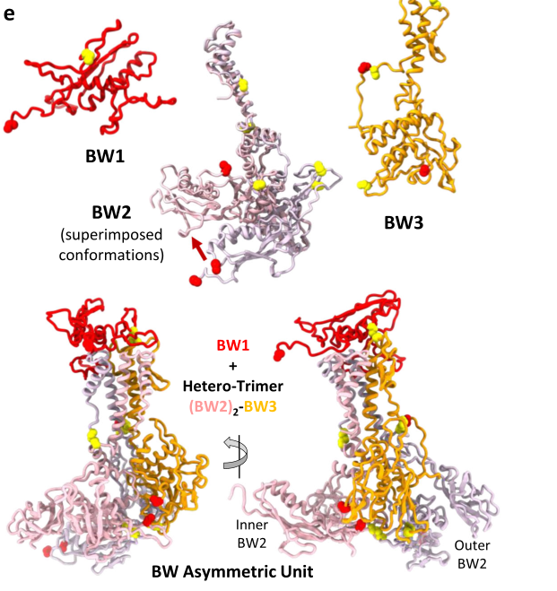

## Question

# Gene Research for Functional Annotation

## ⚠️ CRITICAL: Gene/Protein Identification Context

**BEFORE YOU BEGIN RESEARCH:** You MUST verify you are researching the CORRECT gene/protein. Gene symbols can be ambiguous, especially for less well-characterized genes from non-model organisms.

### Target Gene/Protein Identity (from UniProt):
- **UniProt Accession:** P13336
- **Protein Description:** RecName: Full=Baseplate hub assembly protein gp28; AltName: Full=Gene product 28; Short=gp28;
- **Gene Information:** Name=28;
- **Organism (full):** Enterobacteria phage T4 (Bacteriophage T4).
- **Protein Family:** Not specified in UniProt
- **Key Domains:** Phage_T4_Gp28. (IPR024342); Phage_hub_GP28 (PF11110)

### MANDATORY VERIFICATION STEPS:

1. **Check if the gene symbol "28" matches the protein description above**
2. **Verify the organism is correct:** Enterobacteria phage T4 (Bacteriophage T4).
3. **Check if protein family/domains align with what you find in literature**
4. **If you find literature for a DIFFERENT gene with the same or similar symbol, STOP**

### If Gene Symbol is Ambiguous or You Cannot Find Relevant Literature:

**DO NOT PROCEED WITH RESEARCH ON A DIFFERENT GENE.** Instead:
- State clearly: "The gene symbol '28' is ambiguous or literature is limited for this specific protein"
- Explain what you found (e.g., "Found extensive literature on a different gene with the same symbol in a different organism")
- Describe the protein based ONLY on the UniProt information provided above
- Suggest that the protein function can be inferred from domain/family information

### Research Target:

Please provide a comprehensive research report on the gene **28** (gene ID: 28, UniProt: P13336) in BPT4.

The research report should be a detailed narrative explaining the function, biological processes, and localization of the gene product. Citations should be given for all claims.

You should prioritize authoritative reviews and primary scientific literature when conducting research. You can supplement
this with annotations you find in gene/protein databases, but these can be outdated or inaccurate.

We are specifically interested in the primary function of the gene - for enzymes, what reaction is catalyzed, and what is the substrate specificity? For transporters, what is the substrate? For structural proteins or adapters, what is the broader structural role? For signaling molecules, what is the role in the pathway.

We are interested in where in or outside the cell the gene product carries out its function.

We are also interested in the signaling or biochemical pathways in which the gene functions. We are less interested in broad pleiotropic effects, except where these elucidate the precise role.

Include evidence where possible. We are interested in both experimental evidence as well as inference from structure, evolution, or bioinformatic analysis. Precise studies should be prioritized over high-throughput, where available.

## Output

Question: You are an expert researcher providing comprehensive, well-cited information.

Provide detailed information focusing on:
1. Key concepts and definitions with current understanding
2. Recent developments and latest research (prioritize 2023-2024 sources)
3. Current applications and real-world implementations
4. Expert opinions and analysis from authoritative sources
5. Relevant statistics and data from recent studies

Format as a comprehensive research report with proper citations. Include URLs and publication dates where available.
Always prioritize recent, authoritative sources and provide specific citations for all major claims.

# Gene Research for Functional Annotation

## ⚠️ CRITICAL: Gene/Protein Identification Context

**BEFORE YOU BEGIN RESEARCH:** You MUST verify you are researching the CORRECT gene/protein. Gene symbols can be ambiguous, especially for less well-characterized genes from non-model organisms.

### Target Gene/Protein Identity (from UniProt):
- **UniProt Accession:** P13336
- **Protein Description:** RecName: Full=Baseplate hub assembly protein gp28; AltName: Full=Gene product 28; Short=gp28;
- **Gene Information:** Name=28;
- **Organism (full):** Enterobacteria phage T4 (Bacteriophage T4).
- **Protein Family:** Not specified in UniProt
- **Key Domains:** Phage_T4_Gp28. (IPR024342); Phage_hub_GP28 (PF11110)

### MANDATORY VERIFICATION STEPS:

1. **Check if the gene symbol "28" matches the protein description above**
2. **Verify the organism is correct:** Enterobacteria phage T4 (Bacteriophage T4).
3. **Check if protein family/domains align with what you find in literature**
4. **If you find literature for a DIFFERENT gene with the same or similar symbol, STOP**

### If Gene Symbol is Ambiguous or You Cannot Find Relevant Literature:

**DO NOT PROCEED WITH RESEARCH ON A DIFFERENT GENE.** Instead:
- State clearly: "The gene symbol '28' is ambiguous or literature is limited for this specific protein"
- Explain what you found (e.g., "Found extensive literature on a different gene with the same symbol in a different organism")
- Describe the protein based ONLY on the UniProt information provided above
- Suggest that the protein function can be inferred from domain/family information

### Research Target:

Please provide a comprehensive research report on the gene **28** (gene ID: 28, UniProt: P13336) in BPT4.

The research report should be a detailed narrative explaining the function, biological processes, and localization of the gene product. Citations should be given for all claims.

You should prioritize authoritative reviews and primary scientific literature when conducting research. You can supplement
this with annotations you find in gene/protein databases, but these can be outdated or inaccurate.

We are specifically interested in the primary function of the gene - for enzymes, what reaction is catalyzed, and what is the substrate specificity? For transporters, what is the substrate? For structural proteins or adapters, what is the broader structural role? For signaling molecules, what is the role in the pathway.

We are interested in where in or outside the cell the gene product carries out its function.

We are also interested in the signaling or biochemical pathways in which the gene functions. We are less interested in broad pleiotropic effects, except where these elucidate the precise role.

Include evidence where possible. We are interested in both experimental evidence as well as inference from structure, evolution, or bioinformatic analysis. Precise studies should be prioritized over high-throughput, where available.

## Research report: Enterobacteria phage T4 gene 28 (gp28; UniProt P13336)

### Scope and identity verification
This report specifically addresses **Enterobacteria phage T4 (bacteriophage T4)** gene **28**, encoding **baseplate hub assembly protein gp28** (UniProt **P13336**). In the classical T4 baseplate morphogenesis literature, “gene 28 product” is explicitly discussed as a **group II baseplate gene product required for formation of the central baseplate region**, aligning with the UniProt description (kikuchi1975geneticcontrolof pages 1-3, arisaka2016molecularassemblyand pages 12-12).

### 1) Key concepts, definitions, and current understanding

#### T4 baseplate architecture and “hub/plug” concept
The T4 baseplate is a multiprotein structure at the distal end of the contractile tail that coordinates host recognition and triggers tail sheath contraction; it is commonly conceptualized as (i) **six wedge/arm units** forming the hexagonal periphery and (ii) a **central hub/plug** region that connects to the tail tube and puncturing complex. Genetic dissection divided baseplate morphogenesis genes into those forming the major repeating precursor (“arms”) and those required for the central region (“group II” genes). In this framework, **gene 28** is one of the **group II baseplate genes** associated with **central hub/plug formation** (kikuchi1975geneticcontrolof pages 1-3).

#### gp28 (T4) as a hub-assembly factor
A synthesis of tail/baseplate assembly knowledge identifies **six gene products—gp5, gp27, gp26, gp28, gp51, gp29—as required for formation of the baseplate hub** (arisaka2016molecularassemblyand pages 8-10). Within this set, gp5 and gp27 form a well-characterized structural core in the mature hub, while **gp26 and gp28 have historically been more weakly localized and mechanistically unresolved** in T4 (arisaka2016molecularassemblyand pages 8-10). Thus, the current consensus is that **T4 gp28 is essential for correct hub/plug morphogenesis**, but its **precise structural placement and stoichiometry** in the mature virion are not definitively established in the available experimental literature summarized here (arisaka2012stoichiometryofprotein pages 7-9, arisaka2016molecularassemblyand pages 8-10).

### 2) Experimental evidence for function, pathway placement, and interactions

#### Essential role in central baseplate morphogenesis (classic genetics + EM)
The strongest direct experimental evidence for gp28 function comes from amber mutant analyses of group II baseplate genes. Cells infected with **gene 28 amber mutants** accumulated **normal 15S arm complexes** but produced only **small amounts of organized 70S baseplate-like structures** that were **unstable** and, critically, **lacked the density at the very center** of the baseplate when examined by electron microscopy. This supported the conclusion that group II gene products, including gp28, are required to form the **central plug/hub** rather than the peripheral framework assembled from 15S precursors (kikuchi1975geneticcontrolof pages 1-3, kikuchi1975geneticcontrolof pages 7-11).

Additionally, the group II mutant-derived baseplate-like structures lacked a common set of minor baseplate proteins (gpS, gp29, gp54, pX, pY), consistent with gp28 acting within a **shared assembly pathway/network** for central-part morphogenesis (kikuchi1975geneticcontrolof pages 1-3).

#### Reported association with gp27
A later tail-assembly synthesis cites evidence for **interactions between gp27 and gp28**, placing gp28 in proximity to the major hub component gp27 during assembly (arisaka2016molecularassemblyand pages 12-12). A stoichiometry-focused review further notes a study where **co-expression of gene 27 with gp28 caused gp27 to appear in the membrane fraction**, which is consistent with a biochemical association affecting cellular fractionation behavior (arisaka2012stoichiometryofprotein pages 7-9). Together, these support the view that gp28 is functionally linked to hub assembly steps involving gp27, even if the mature virion placement is not fully resolved.

#### Unresolved stoichiometry and mature-virion localization in T4
Despite its genetic requirement, the number of gp28 molecules per baseplate and definitive localization have been described as **undetermined** in the literature summarized here (arisaka2012stoichiometryofprotein pages 7-9). Likewise, a tail assembly review notes that **gp26 and gp28 appear to be components of the baseplate, but their location and specific functions are unknown** (arisaka2016molecularassemblyand pages 8-10).

### 3) Localization: where gp28 acts and where it is found

#### Localization during assembly (supported)
The mutant phenotypes and missing “central density” in defective baseplates indicate gp28’s role is localized to **central baseplate hub/plug morphogenesis**, i.e., near the baseplate center where the tail tube/puncturing complex interfaces (kikuchi1975geneticcontrolof pages 1-3, kikuchi1975geneticcontrolof pages 7-11).

#### Localization in the mature virion (uncertain)
Multiple synthesis sources explicitly state that **gp28 localization and stoichiometry are not determined** (arisaka2012stoichiometryofprotein pages 7-9, arisaka2016molecularassemblyand pages 8-10). One modern interpretation proposes that **gp26 and gp28 may act as assembly chaperones and are not found in the fully assembled baseplate–tube complex**, which would explain persistent uncertainty in mature-particle localization while preserving essential assembly function (bhatt2021tailstructureand pages 4-5). This “transient assembly factor” model is an expert synthesis rather than direct structural proof for T4 gp28.

### 4) Domain/family inference and comparative structural interpretation (recent developments)

#### Comparative structural evidence for gp28-like proteins (2024 cryo-EM)
Direct high-resolution structural assignment for **T4** gp28 is limited in the sources retrieved here. However, **gp28-like proteins** in other contractile-tailed phages have recently been visualized at atomic detail, enabling plausible mechanistic inferences.

In **Agrobacterium tumefaciens phage Milano**, a protein annotated as **gp28** (named **BW1**, “baseplate wedge 1”) was resolved by cryo-EM as part of the baseplate wedge unit. BW1/gp28 is positioned to **create a complex surface for binding the first layer of sheath subunits**, and its fold is described as similar to the sheath **handshaker domain (SHD)**, allowing it to **accept the N- and C-terminal arms of the first sheath layer** (sonani2024anextensivedisulfide pages 7-8). The structural placement of BW1/gp28 at the wedge top is shown in the paper’s figures (sonani2024anextensivedisulfide media 54d906d5), and its interface with sheath and tailspike—including a disulfide bond involving **Cys41 of BW1**—is also shown (sonani2024anextensivedisulfide media 2751a13e).

While Milano BW1/gp28 is not the same protein as T4 gp28, it provides a **current (2024) experimentally observed example** of how a gp28-annotated protein can function as an **adaptor/scaffold at the baseplate–sheath interface** in a contractile-tail system (sonani2024anextensivedisulfide pages 7-8, sonani2024anextensivedisulfide media 54d906d5, sonani2024anextensivedisulfide media 2751a13e). This comparative evidence is consistent with the idea that proteins historically difficult to assign in T4 may perform **assembly/initiator** roles that can be challenging to detect in some mature preparations.

### 5) Pathway context: infection mechanism and assembly pathway

#### Assembly pathway placement
T4 baseplate morphogenesis proceeds through assembly of **15S arm complexes** that polymerize into larger structures; in group II mutants (including gene 28 mutants) these peripheral precursors still form, but central hub/plug completion fails, producing unstable baseplate-like assemblies lacking central density (kikuchi1975geneticcontrolof pages 1-3). This places gp28’s primary role in a **branch of baseplate assembly dedicated to the central region**, rather than arm/wedge formation.

#### Infection and contraction context
In tail/baseplate assembly syntheses, the hub is discussed in relation to the canonical hub core (gp27/gp5) and contraction triggering, with gp28 grouped among required hub-formation gene products (arisaka2016molecularassemblyand pages 8-10). The evidence in the retrieved sources supports gp28 as an **assembly factor for the hub**, rather than an enzyme with a defined substrate specificity in the mature virion.

### 6) Recent applications and real-world implementations (2024 priority)
Although T4 gp28 itself is mainly a model-system assembly protein, **baseplate/hub knowledge** is now directly leveraged in biomedical engineering of contractile nanomachines.

#### (i) Structural atlas of a therapeutic myophage for phage therapy (2024)
A 2024 cryo-EM/proteomics study built a high-resolution **structural atlas** for a therapeutic contractile-tailed **Pseudomonas phage Pa193**, explicitly framing the work as supporting “phages as biomedicines for phage therapy” and informing “engineering opportunities” (iglesias2024cryoemanalysisof pages 1-2). The associated 2024 preprint version reports atomic models for **21 structural polypeptide chains** and provides quantitative cryo-EM statistics including **40,335 manually picked baseplate particles** and reconstructions (capsid 3.5 Å; baseplate/portal region reported at ~3.2 Å in the preprint) (cingolani2024cryoemanalysisof pages 1-5). These data exemplify how modern structural pipelines map baseplate interfaces to guide host-range engineering.

#### (ii) Precision antibiotics based on engineered contractile systems (2024)
A 2024 study solved atomic structures of an engineered **R-type diffocin** (a contractile tail-like bacteriocin) targeting **Clostridioides difficile**, presenting it as a route toward “potent protein-based precision antibiotics” (cai2024atomicstructuresof pages 1-2). The study ties this to substantial disease burden—**~250,000 hospitalizations and 13,000 deaths per year in the US alone** due to C. difficile infection (cai2024atomicstructuresof pages 1-2). It provides extensive quantitative structural data across functional states, including particle counts used for analysis (**1088 pre-contraction, 742 transitional, 872 final-state** collar-baseplate pairs) and reported statistical testing (P = 1.4 × 10−15) (cai2024atomicstructuresof pages 2-3). These efforts depend on mechanistic understanding of baseplate, hub, and contraction-coupling analogous to those first established in model myophages like T4.

### 7) Expert synthesis and current knowledge gaps
Authoritative syntheses characterize gp28 as (i) a required factor for hub formation (arisaka2016molecularassemblyand pages 8-10), (ii) a central baseplate constituent with reported gp27 interaction evidence (arisaka2016molecularassemblyand pages 12-12, arisaka2012stoichiometryofprotein pages 7-9), and (iii) a protein whose **precise localization, stoichiometry, and specific mechanistic role remain unresolved** in T4, motivating hypotheses such as a transient chaperone/adaptor function (arisaka2012stoichiometryofprotein pages 7-9, bhatt2021tailstructureand pages 4-5).

### Consolidated evidence table
| Topic/claim | Evidence summary | Evidence type (genetics/EM/biochemistry/cryo-EM/review) | Key source (author, year, journal) | Publication date | URL | What it implies for gp28 function/localization | Notes/uncertainties |
|---|---|---|---|---|---|---|---|
| T4 gene 28 is required for central baseplate hub/plug morphogenesis | In T4 group II mutant lysates, gene 28-defective phage accumulated normal 15S arm precursors but only small amounts of unstable 70S sixfold-symmetric baseplate-like structures that lacked density at the center; authors concluded group II products contribute to formation of the central plug/hub of the baseplate. | genetics/EM/biochemistry | Kikuchi & King, 1975, *Journal of Molecular Biology* | Dec 1975 | https://doi.org/10.1016/S0022-2836(75)80179-3 | Strongest direct experimental evidence that gp28 functions in assembly of the central baseplate region rather than in wedge/arm formation; localization inferred to central hub/plug region. (kikuchi1975geneticcontrolof pages 1-3, kikuchi1975geneticcontrolof pages 7-11) | Does not resolve exact subunit number, atomic structure, or whether gp28 remains in the mature virion. |
| gp28 is one of six proteins required for T4 hub assembly; gp27-gp28 interaction has been reported | Review of T4 tail/baseplate assembly states that gp5, gp27, gp26, gp28, gp51 and gp29 are required for hub formation; it also cites earlier work describing gp28 as a constituent of the central baseplate part and reporting evidence for interaction between gp27 and gp28. | review/biochemistry | Arisaka et al., 2016, *Biophysical Reviews* | Nov 2016 | https://doi.org/10.1007/s12551-016-0230-x | Supports assignment of gp28 to the hub/central baseplate assembly pathway and suggests a direct or near-direct relationship with gp27 during hub morphogenesis. (arisaka2016molecularassemblyand pages 12-12, arisaka2016molecularassemblyand pages 8-10) | Review explicitly notes gp26/gp28 location and specific functions remained unknown in T4 at that time. |
| gp28 stoichiometry and precise localization in T4 remain unresolved | Stoichiometry review states that neither the localization nor the number of gp26 and gp28 molecules per baseplate had been determined; it also cites evidence that co-expression of gene 27 with gp28 caused gp27 to appear in the membrane fraction, consistent with gp27-gp28 association in a heterologous/fractionation assay. | review/biochemistry | Arisaka, 2012, InTech chapter / arXiv record | Mar 2012 | https://doi.org/10.5772/35125 | Indicates gp28 is functionally linked to hub proteins but remains poorly localized experimentally in mature T4 particles; interaction with gp27 is plausible but indirect for virion placement. (arisaka2012stoichiometryofprotein pages 7-9) | Secondary-source synthesis; membrane-fractionation evidence is suggestive, not a high-resolution virion structure. |
| gp28 may function transiently as an assembly chaperone rather than a permanent mature-particle component | Modern tail-structure review proposes that T4 gp26 and gp28 likely perform a chaperone function because they are not found in the fully assembled baseplate-tube complex. | review | Bhatt et al., 2021, *Tail Structure and Dynamics* (Elsevier chapter DOI record) | Jan 2021 | https://doi.org/10.1016/B978-0-12-809633-8.20965-5 | Offers a mechanistic interpretation that reconciles older genetics showing essential assembly function with persistent uncertainty about mature-particle localization. (bhatt2021tailstructureand pages 4-5) | This is a hypothesis/synthesis, not direct structural proof for T4 gp28 itself. |
| A gp28-like protein in another contractile phage can occupy the baseplate-sheath interface and initiate sheath attachment | In *Agrobacterium* phage Milano, BW1 annotated as gp28 was placed by cryo-EM at the top of the baseplate wedge; its fold resembles the sheath handshaker domain, it accepts the N- and C-terminal arms of the first sheath layer, and it forms a disulfide-linked interface with the tailspike (including Cys41 of BW1). | cryo-EM | Sonani et al., 2024, *Nature Communications* | Jan 2024 | https://doi.org/10.1038/s41467-024-44959-z | Comparative evidence suggests one plausible evolutionary role for gp28-family proteins is as an adaptor/scaffold linking baseplate, sheath initiation, and receptor-binding structures. (sonani2024anextensivedisulfide pages 7-8, sonani2024anextensivedisulfide media 54d906d5, sonani2024anextensivedisulfide media 2751a13e) | This is a homolog/comparative system, not direct evidence for T4 gp28; nomenclature similarity does not guarantee identical placement in T4. |
| Contractile-tail baseplate/hub knowledge is being used for precision antibacterial engineering | Engineered diffocin targeting *Clostridioides difficile* was resolved in pre- and post-contraction states with high-resolution cryo-EM; authors emphasize design principles for “potent protein-based precision antibiotics.” The study also cites major disease burden, with nearly 250,000 hospitalizations and 13,000 deaths per year in the US. | cryo-EM/application | Cai et al., 2024, *Nature Communications* | Aug 2024 | https://doi.org/10.1038/s41467-024-51038-w | While not about T4 gp28 directly, it demonstrates how structural understanding of contractile-tail baseplates and hubs can be translated into programmable antibacterial systems. (cai2024atomicstructuresof pages 1-2, cai2024atomicstructuresof pages 2-3, cai2024atomicstructuresof pages 11-12) | Application is to an engineered bacteriocin/CIS rather than T4; relevance is conceptual and translational. |
| Structural atlases of therapeutic phages enable baseplate-guided phage engineering | 2024 cryo-EM/proteomics study of therapeutic *Pseudomonas* phage Pa193 built atomic models for 21 structural polypeptides, visualized ~500 Å tail fibers, and resolved the interface between baseplate and tail fibers; authors frame the work as supporting phage therapy and engineering opportunities. | cryo-EM/application | Iglesias et al., 2024, *Communications Biology* | Oct 2024 | https://doi.org/10.1038/s42003-024-06985-x | Shows current real-world implementation of structural baseplate research: mapping interfaces that control adsorption and host targeting for therapeutic phage development. (iglesias2024cryoemanalysisof pages 1-2, cingolani2024cryoemanalysisof pages 1-5) | Not specific to T4 gp28; useful as current-state context for how analogous baseplate proteins are studied and exploited. |

*Table: This table compiles the main evidence supporting functional annotation of Enterobacteria phage T4 gp28 and places it in the context of recent comparative structural and application-focused studies. It highlights what is known directly from T4 experiments, what remains unresolved, and how newer phage/CIS structures inform interpretation.*

### Summary functional annotation (evidence-weighted)
- **Primary function:** gp28 is required for **morphogenesis/assembly of the central baseplate hub/plug** of bacteriophage T4; loss of gp28 yields baseplate-like structures lacking central hub density despite normal arm precursor formation (kikuchi1975geneticcontrolof pages 1-3, kikuchi1975geneticcontrolof pages 7-11).
- **Biological process:** **T4 virion morphogenesis**, specifically **baseplate central-part assembly** (kikuchi1975geneticcontrolof pages 1-3).
- **Localization (functional):** acts in/near the **central baseplate hub/plug assembly pathway**; **mature virion localization is not definitively established** in the sources retrieved here (kikuchi1975geneticcontrolof pages 1-3, arisaka2012stoichiometryofprotein pages 7-9).
- **Interactions:** literature syntheses report evidence consistent with **gp27–gp28 association** during assembly (arisaka2016molecularassemblyand pages 12-12, arisaka2012stoichiometryofprotein pages 7-9).
- **Key uncertainty:** **stoichiometry and persistent incorporation into mature T4 particles** remain unclear; some expert syntheses propose gp28 may be a **transient assembly chaperone** (arisaka2012stoichiometryofprotein pages 7-9, bhatt2021tailstructureand pages 4-5).
- **Comparative inference (2024):** a gp28-annotated protein in Milano phage is structurally resolved as a **baseplate–sheath adaptor/sheath initiator** (sonani2024anextensivedisulfide pages 7-8, sonani2024anextensivedisulfide media 54d906d5, sonani2024anextensivedisulfide media 2751a13e), suggesting an evolutionarily plausible mechanistic theme for gp28-family proteins, though not proving identical placement in T4.

References

1. (kikuchi1975geneticcontrolof pages 1-3): Yoshiko Kikuchi and Jonathan King. Genetic control of bacteriophage t4 baseplate morphogenesis. ii. mutants unable to form the central part of the baseplate. Journal of molecular biology, 99 4:673-94, Dec 1975. URL: https://doi.org/10.1016/s0022-2836(75)80179-3, doi:10.1016/s0022-2836(75)80179-3. This article has 98 citations and is from a domain leading peer-reviewed journal.

2. (arisaka2016molecularassemblyand pages 12-12): Fumio Arisaka, Moh Lan Yap, Shuji Kanamaru, and Michael G. Rossmann. Molecular assembly and structure of the bacteriophage t4 tail. Biophysical Reviews, 8:385-396, Nov 2016. URL: https://doi.org/10.1007/s12551-016-0230-x, doi:10.1007/s12551-016-0230-x. This article has 55 citations and is from a peer-reviewed journal.

3. (arisaka2016molecularassemblyand pages 8-10): Fumio Arisaka, Moh Lan Yap, Shuji Kanamaru, and Michael G. Rossmann. Molecular assembly and structure of the bacteriophage t4 tail. Biophysical Reviews, 8:385-396, Nov 2016. URL: https://doi.org/10.1007/s12551-016-0230-x, doi:10.1007/s12551-016-0230-x. This article has 55 citations and is from a peer-reviewed journal.

4. (arisaka2012stoichiometryofprotein pages 7-9): Fumio Arisaka. Stoichiometry of protein interactions in bacteriophage tail assembly. ArXiv, Mar 2012. URL: https://doi.org/10.5772/35125, doi:10.5772/35125. This article has 1 citations.

5. (kikuchi1975geneticcontrolof pages 7-11): Yoshiko Kikuchi and Jonathan King. Genetic control of bacteriophage t4 baseplate morphogenesis. ii. mutants unable to form the central part of the baseplate. Journal of molecular biology, 99 4:673-94, Dec 1975. URL: https://doi.org/10.1016/s0022-2836(75)80179-3, doi:10.1016/s0022-2836(75)80179-3. This article has 98 citations and is from a domain leading peer-reviewed journal.

6. (bhatt2021tailstructureand pages 4-5): Shweta Bhatt, Petr G. Leiman, and Nicholas M.I. Taylor. Tail structure and dynamics. ArXiv, pages 186-193, Jan 2021. URL: https://doi.org/10.1016/b978-0-12-809633-8.20965-5, doi:10.1016/b978-0-12-809633-8.20965-5. This article has 5 citations.

7. (sonani2024anextensivedisulfide pages 7-8): Ravi R. Sonani, Lee K. Palmer, Nathaniel C. Esteves, Abigail A. Horton, Amanda L. Sebastian, Rebecca J. Kelly, Fengbin Wang, Mark A. B. Kreutzberger, William K. Russell, Petr G. Leiman, Birgit E. Scharf, and Edward H. Egelman. An extensive disulfide bond network prevents tail contraction in agrobacterium tumefaciens phage milano. Nature Communications, Jan 2024. URL: https://doi.org/10.1038/s41467-024-44959-z, doi:10.1038/s41467-024-44959-z. This article has 18 citations and is from a highest quality peer-reviewed journal.

8. (sonani2024anextensivedisulfide media 54d906d5): Ravi R. Sonani, Lee K. Palmer, Nathaniel C. Esteves, Abigail A. Horton, Amanda L. Sebastian, Rebecca J. Kelly, Fengbin Wang, Mark A. B. Kreutzberger, William K. Russell, Petr G. Leiman, Birgit E. Scharf, and Edward H. Egelman. An extensive disulfide bond network prevents tail contraction in agrobacterium tumefaciens phage milano. Nature Communications, Jan 2024. URL: https://doi.org/10.1038/s41467-024-44959-z, doi:10.1038/s41467-024-44959-z. This article has 18 citations and is from a highest quality peer-reviewed journal.

9. (sonani2024anextensivedisulfide media 2751a13e): Ravi R. Sonani, Lee K. Palmer, Nathaniel C. Esteves, Abigail A. Horton, Amanda L. Sebastian, Rebecca J. Kelly, Fengbin Wang, Mark A. B. Kreutzberger, William K. Russell, Petr G. Leiman, Birgit E. Scharf, and Edward H. Egelman. An extensive disulfide bond network prevents tail contraction in agrobacterium tumefaciens phage milano. Nature Communications, Jan 2024. URL: https://doi.org/10.1038/s41467-024-44959-z, doi:10.1038/s41467-024-44959-z. This article has 18 citations and is from a highest quality peer-reviewed journal.

10. (iglesias2024cryoemanalysisof pages 1-2): Stephano M. Iglesias, Chun-Feng David Hou, Johnny Reid, Evan Schauer, Renae Geier, Angela Soriaga, Lucy Sim, Lucy Gao, Julian Whitelegge, Pierre Kyme, Deborah Birx, Sebastien Lemire, and Gino Cingolani. Cryo-em analysis of pseudomonas phage pa193 structural components. Communications Biology, Oct 2024. URL: https://doi.org/10.1038/s42003-024-06985-x, doi:10.1038/s42003-024-06985-x. This article has 11 citations and is from a peer-reviewed journal.

11. (cingolani2024cryoemanalysisof pages 1-5): Gino Cingolani, Stephano Iglesias, Chun-Feng Hou, Sebastien Lemire, Angela Soriaga, and Pierre Kyme. Cryo-em analysis of pseudomonas phage pa193 structural components. Research Square, Apr 2024. URL: https://doi.org/10.21203/rs.3.rs-4189479/v1, doi:10.21203/rs.3.rs-4189479/v1. This article has 5 citations.

12. (cai2024atomicstructuresof pages 1-2): Xiaoying Cai, Yao He, Iris Yu, Anthony Imani, Dean Scholl, Jeff F. Miller, and Z. Hong Zhou. Atomic structures of a bacteriocin targeting gram-positive bacteria. Nature Communications, Aug 2024. URL: https://doi.org/10.1038/s41467-024-51038-w, doi:10.1038/s41467-024-51038-w. This article has 22 citations and is from a highest quality peer-reviewed journal.

13. (cai2024atomicstructuresof pages 2-3): Xiaoying Cai, Yao He, Iris Yu, Anthony Imani, Dean Scholl, Jeff F. Miller, and Z. Hong Zhou. Atomic structures of a bacteriocin targeting gram-positive bacteria. Nature Communications, Aug 2024. URL: https://doi.org/10.1038/s41467-024-51038-w, doi:10.1038/s41467-024-51038-w. This article has 22 citations and is from a highest quality peer-reviewed journal.

14. (cai2024atomicstructuresof pages 11-12): Xiaoying Cai, Yao He, Iris Yu, Anthony Imani, Dean Scholl, Jeff F. Miller, and Z. Hong Zhou. Atomic structures of a bacteriocin targeting gram-positive bacteria. Nature Communications, Aug 2024. URL: https://doi.org/10.1038/s41467-024-51038-w, doi:10.1038/s41467-024-51038-w. This article has 22 citations and is from a highest quality peer-reviewed journal.

## Artifacts

- [Edison artifact artifact-00](28-deep-research-falcon_artifacts/artifact-00.md)

## Citations

1. kikuchi1975geneticcontrolof pages 1-3
2. arisaka2016molecularassemblyand pages 8-10
3. arisaka2016molecularassemblyand pages 12-12
4. arisaka2012stoichiometryofprotein pages 7-9
5. bhatt2021tailstructureand pages 4-5
6. sonani2024anextensivedisulfide pages 7-8
7. iglesias2024cryoemanalysisof pages 1-2
8. cingolani2024cryoemanalysisof pages 1-5
9. cai2024atomicstructuresof pages 1-2
10. cai2024atomicstructuresof pages 2-3
11. kikuchi1975geneticcontrolof pages 7-11
12. cai2024atomicstructuresof pages 11-12
13. https://doi.org/10.1016/S0022-2836(75
14. https://doi.org/10.1007/s12551-016-0230-x
15. https://doi.org/10.5772/35125
16. https://doi.org/10.1016/B978-0-12-809633-8.20965-5
17. https://doi.org/10.1038/s41467-024-44959-z
18. https://doi.org/10.1038/s41467-024-51038-w
19. https://doi.org/10.1038/s42003-024-06985-x
20. https://doi.org/10.1016/s0022-2836(75
21. https://doi.org/10.1007/s12551-016-0230-x,
22. https://doi.org/10.5772/35125,
23. https://doi.org/10.1016/b978-0-12-809633-8.20965-5,
24. https://doi.org/10.1038/s41467-024-44959-z,
25. https://doi.org/10.1038/s42003-024-06985-x,
26. https://doi.org/10.21203/rs.3.rs-4189479/v1,
27. https://doi.org/10.1038/s41467-024-51038-w,