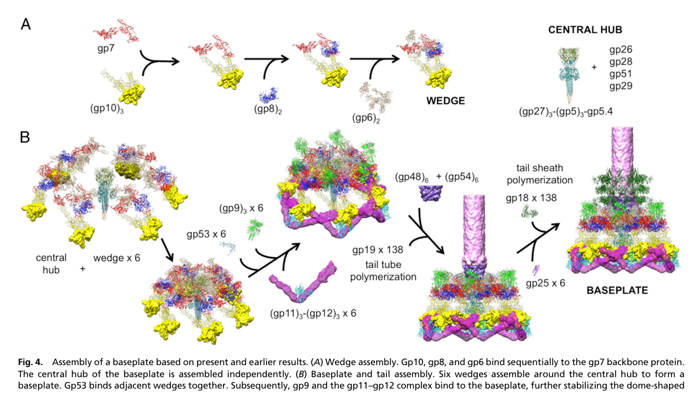

## Question

# Gene Research for Functional Annotation

## ⚠️ CRITICAL: Gene/Protein Identification Context

**BEFORE YOU BEGIN RESEARCH:** You MUST verify you are researching the CORRECT gene/protein. Gene symbols can be ambiguous, especially for less well-characterized genes from non-model organisms.

### Target Gene/Protein Identity (from UniProt):
- **UniProt Accession:** P13337
- **Protein Description:** RecName: Full=Tape measure protein; Short=TMP; AltName: Full=Gene product 29; Short=gp29; AltName: Full=Tail length regulator;
- **Gene Information:** Name=29;
- **Organism (full):** Enterobacteria phage T4 (Bacteriophage T4).
- **Protein Family:** Not specified in UniProt
- **Key Domains:** T4_TMP. (IPR057967); T4_Tape_measure (PF25671)

### MANDATORY VERIFICATION STEPS:

1. **Check if the gene symbol "29" matches the protein description above**
2. **Verify the organism is correct:** Enterobacteria phage T4 (Bacteriophage T4).
3. **Check if protein family/domains align with what you find in literature**
4. **If you find literature for a DIFFERENT gene with the same or similar symbol, STOP**

### If Gene Symbol is Ambiguous or You Cannot Find Relevant Literature:

**DO NOT PROCEED WITH RESEARCH ON A DIFFERENT GENE.** Instead:
- State clearly: "The gene symbol '29' is ambiguous or literature is limited for this specific protein"
- Explain what you found (e.g., "Found extensive literature on a different gene with the same symbol in a different organism")
- Describe the protein based ONLY on the UniProt information provided above
- Suggest that the protein function can be inferred from domain/family information

### Research Target:

Please provide a comprehensive research report on the gene **29** (gene ID: 29, UniProt: P13337) in BPT4.

The research report should be a detailed narrative explaining the function, biological processes, and localization of the gene product. Citations should be given for all claims.

You should prioritize authoritative reviews and primary scientific literature when conducting research. You can supplement
this with annotations you find in gene/protein databases, but these can be outdated or inaccurate.

We are specifically interested in the primary function of the gene - for enzymes, what reaction is catalyzed, and what is the substrate specificity? For transporters, what is the substrate? For structural proteins or adapters, what is the broader structural role? For signaling molecules, what is the role in the pathway.

We are interested in where in or outside the cell the gene product carries out its function.

We are also interested in the signaling or biochemical pathways in which the gene functions. We are less interested in broad pleiotropic effects, except where these elucidate the precise role.

Include evidence where possible. We are interested in both experimental evidence as well as inference from structure, evolution, or bioinformatic analysis. Precise studies should be prioritized over high-throughput, where available.

## Output

Question: You are an expert researcher providing comprehensive, well-cited information.

Provide detailed information focusing on:
1. Key concepts and definitions with current understanding
2. Recent developments and latest research (prioritize 2023-2024 sources)
3. Current applications and real-world implementations
4. Expert opinions and analysis from authoritative sources
5. Relevant statistics and data from recent studies

Format as a comprehensive research report with proper citations. Include URLs and publication dates where available.
Always prioritize recent, authoritative sources and provide specific citations for all major claims.

# Gene Research for Functional Annotation

## ⚠️ CRITICAL: Gene/Protein Identification Context

**BEFORE YOU BEGIN RESEARCH:** You MUST verify you are researching the CORRECT gene/protein. Gene symbols can be ambiguous, especially for less well-characterized genes from non-model organisms.

### Target Gene/Protein Identity (from UniProt):
- **UniProt Accession:** P13337
- **Protein Description:** RecName: Full=Tape measure protein; Short=TMP; AltName: Full=Gene product 29; Short=gp29; AltName: Full=Tail length regulator;
- **Gene Information:** Name=29;
- **Organism (full):** Enterobacteria phage T4 (Bacteriophage T4).
- **Protein Family:** Not specified in UniProt
- **Key Domains:** T4_TMP. (IPR057967); T4_Tape_measure (PF25671)

### MANDATORY VERIFICATION STEPS:

1. **Check if the gene symbol "29" matches the protein description above**
2. **Verify the organism is correct:** Enterobacteria phage T4 (Bacteriophage T4).
3. **Check if protein family/domains align with what you find in literature**
4. **If you find literature for a DIFFERENT gene with the same or similar symbol, STOP**

### If Gene Symbol is Ambiguous or You Cannot Find Relevant Literature:

**DO NOT PROCEED WITH RESEARCH ON A DIFFERENT GENE.** Instead:
- State clearly: "The gene symbol '29' is ambiguous or literature is limited for this specific protein"
- Explain what you found (e.g., "Found extensive literature on a different gene with the same symbol in a different organism")
- Describe the protein based ONLY on the UniProt information provided above
- Suggest that the protein function can be inferred from domain/family information

### Research Target:

Please provide a comprehensive research report on the gene **29** (gene ID: 29, UniProt: P13337) in BPT4.

The research report should be a detailed narrative explaining the function, biological processes, and localization of the gene product. Citations should be given for all claims.

You should prioritize authoritative reviews and primary scientific literature when conducting research. You can supplement
this with annotations you find in gene/protein databases, but these can be outdated or inaccurate.

We are specifically interested in the primary function of the gene - for enzymes, what reaction is catalyzed, and what is the substrate specificity? For transporters, what is the substrate? For structural proteins or adapters, what is the broader structural role? For signaling molecules, what is the role in the pathway.

We are interested in where in or outside the cell the gene product carries out its function.

We are also interested in the signaling or biochemical pathways in which the gene functions. We are less interested in broad pleiotropic effects, except where these elucidate the precise role.

Include evidence where possible. We are interested in both experimental evidence as well as inference from structure, evolution, or bioinformatic analysis. Precise studies should be prioritized over high-throughput, where available.

## Research report: Functional annotation of Enterobacteria phage T4 gene 29 (gp29; tape measure protein; UniProt P13337)

### 1) Target verification (critical identity check)
The literature retrieved and analyzed consistently refers to **bacteriophage T4 gene product 29 (gp29)** as the **tape measure / elongated ruler protein** that controls **tail tube length** during assembly, and localizes it to the **baseplate hub and/or tail tube interior during assembly**—matching the provided UniProt identity for **P13337** (TMP; gp29; tail length regulator). In authoritative reviews of T4 tail morphogenesis, gp29 is explicitly named the “tape measure protein” and placed in the hub region that nucleates tail assembly. (arisaka2016molecularassemblyand pages 2-4, arisaka2016molecularassemblyand pages 1-2)

### 2) Key concepts and definitions (current understanding)

#### 2.1 Tape measure protein (TMP)
A **tape measure protein** (TMP) is a long, typically α-helical internal component of a tailed phage (or phage-tail-like injection system) that serves as a **molecular ruler**: it determines the final length of the tail tube by providing an internal template/scaffold around which tail tube subunits polymerize. This concept is explicitly applied to **T4 gp29**, described as an “elongated ruler protein” controlling tail length. (yap2014structureandfunction pages 4-6)

#### 2.2 Tail tube polymerization and termination
In T4, the **tail tube** is built primarily from **gp19** subunits (tail tube protein) that polymerize into stacked rings. A contemporary T4 tail assembly review states that tube polymerization stops when **gp29 is fully extended**, and ties termination to later steps such as binding of distal/terminator components. (arisaka2016molecularassemblyand pages 2-4)

### 3) Primary function of T4 gp29 (gene 29)

#### 3.1 Functional role: tail length determination (“ruler” function)
Multiple sources converge on the annotation that **T4 gp29 is the tape measure / ruler** for the contractile tail.

* A highly cited structural review of T4 states gp29 is an “elongated ruler protein” that **controls tail length**, and that the tail tube “probably polymerizes along” gp29, while acknowledging that the precise mechanism of gp29 incorporation into the tube was not fully resolved at that time. (Yap & Rossmann, 2014-12; https://doi.org/10.2217/fmb.14.91) (yap2014structureandfunction pages 4-6)
* A dedicated T4 tail morphogenesis review states that tail tube polymerization **stops when gp29 is fully extended** and explicitly identifies gp29 as the tape measure protein. (Arisaka et al., 2016-11; https://doi.org/10.1007/s12551-016-0230-x) (arisaka2016molecularassemblyand pages 2-4)

#### 3.2 Role in assembly initiation (interaction with hub/tail initiation proteins)
Cryo-EM–guided assembly models of the T4 baseplate/tail indicate that after baseplate completion, **gp48 and gp54 bind onto the central hub**, and that **gp54 in association with the tape measure protein gp29** can initiate polymerization of **gp19** to form the tail tube. (Yap et al., 2016-02; https://doi.org/10.1073/pnas.1601654113) (yap2016roleofbacteriophage pages 3-5, yap2016roleofbacteriophage media 1c32b140)

This places gp29 not merely as a passive length ruler but as part of the **tail-tube nucleation/early assembly complex**.

#### 3.3 Experimental support for a “buried-at-hub, extended-in-tube” model
A detailed experimental study focused on gp29’s role in tail assembly (Lou, 2002) presents biochemical evidence that supports a model where:

* **One terminus** of gp29 is **buried/anchored in the baseplate hub**, while the other portion is **exposed early** and becomes **protected from proteolysis** as assembly proceeds. (lou2002theroleof pages 110-116, lou2002theroleof pages 106-110)
* gp29 becomes **occluded** as gp19 polymerizes, consistent with gp19 polymerizing **around** gp29. (lou2002theroleof pages 102-106)
* gp29-containing complexes are recovered in **baseplate fractions** by biochemical fractionation/immunoprecipitation approaches, supporting baseplate association/localization during assembly. (lou2002theroleof pages 106-110)

Although this source is not a modern peer-reviewed journal article in the retrieved set, it provides mechanistically specific experimental interpretation consistent with (and frequently summarized by) later reviews.

### 4) Subcellular/structural localization of gp29

#### 4.1 Localization in the virion/assembly intermediates
Curated summaries and reviews localize gp29 to the **hub (baseplate center)** and internal tail channel during assembly.

* A T4 tail assembly review table places gp29 in the **“Hub (tape measure)”**. (Arisaka et al., 2016-11; https://doi.org/10.1007/s12551-016-0230-x) (arisaka2016molecularassemblyand pages 1-2)
* A mechanistic/structural model of baseplate and tail assembly explicitly depicts gp29 as part of the central hub module that participates with gp54 in initiating gp19 polymerization. (yap2016roleofbacteriophage pages 3-5, yap2016roleofbacteriophage media 1c32b140)

#### 4.2 Stoichiometry/copy number
Evidence in the retrieved corpus supports a **low copy number** of gp29 in the hub.

* An older primary study reports central hub assembly involving **six copies of gp29**, consistent with hub/baseplate symmetry. (Ishimoto et al., 1988-05; https://doi.org/10.1016/0042-6822(88)90622-8) (ishimoto1988thestructureof pages 1-2)
* A later compiled table also lists gp29 mass (~64.4 kDa) and **copy number 6**, though this particular table is in a dissertation-type document in the retrieved set. (gonzalez2021structuralstudiesof pages 18-20)

### 5) Pathways and processes involving gp29

#### 5.1 Biological process: virion morphogenesis (tail assembly)
Gp29 functions in the **late structural morphogenesis** program of T4, specifically in **baseplate-centered initiation** of tail tube formation and determination of the final tube length.

A concise assembly sequence supported by the PNAS structural model is:
1) wedges assemble, 2) wedges form the dome-shaped baseplate, 3) gp48/gp54 bind the hub, 4) gp54 + gp29 initiate gp19 tail tube polymerization, 5) subsequent steps recruit sheath proteins (gp18) initiated by gp25. (yap2016roleofbacteriophage pages 3-5, yap2016roleofbacteriophage media 1c32b140)

### 6) Quantitative measurements and data (T4-specific and modern TMP context)

#### 6.1 T4 gp29 and T4 tail dimensions
Key quantitative claims in the retrieved evidence:

* **gp29 size:** ~590–591 aa; mass ~64.4 kDa. (arisaka2016molecularassemblyand pages 2-4, lou2002theroleof pages 102-106, gonzalez2021structuralstudiesof pages 18-20)
* **T4 tail/tail tube length:** ~98–98.4 nm (reported in older primary study and mechanistic analysis). (ishimoto1988thestructureof pages 1-2, lou2002theroleof pages 102-106)
* **Tail tube subunits/rings:** one review states **138 copies of gp19 in 23 hexameric rings** (noting that earlier experimental reports may differ), while an older study cites **144 gp19 monomers** polymerizing after initiation. (arisaka2016molecularassemblyand pages 2-4, ishimoto1988thestructureof pages 1-2)
* **gp29 “ruler” length estimate:** a mechanistic estimate suggests that if gp29 is predominantly α-helical it could extend ~**91.7 nm**, comparable to the ~98.4 nm tail tube length—supporting the ruler model. (lou2002theroleof pages 102-106)

These measurements are central to functional annotation because they connect protein length/architecture to a physical virion phenotype (tail length).

#### 6.2 Modern 2023–2024 structural insights about TMP architecture (context informing gp29)
Even though many recent high-resolution TMP studies are not on T4 gp29 directly, they refine “current understanding” of TMPs in general in ways consistent with classic T4 models:

* **TMP as a trimeric coiled-coil inside the tail tube and contacting DNA:** A 2023 Nature Communications structure of a T5-like phage (DT57C) reports TMP organization as a **three-stranded parallel α-helical coiled coil** that **directly contacts genomic DNA**, and discusses persistence of a **C-terminal TMP fragment** (three copies) in the open/receptor-bound tail tip state. (Ayala et al., 2023-12; https://doi.org/10.1038/s41467-023-43824-9) (ayala2023nearlycompletestructure pages 1-2, ayala2023nearlycompletestructure pages 9-10)
* **Full-length TMP dimensions resolved in a tail-like bacteriocin (diffocin):** A 2024 Nature Communications cryo-EM study resolved a full-length TMP spanning the tube lumen with measured **length ~1388 Å** and **diameter ~25 Å**; most of the density was consistent with a **trimeric coiled-coil** organization. (Cai et al., 2024-08; https://doi.org/10.1038/s41467-024-51038-w) (cai2024atomicstructuresof pages 7-8)
* **Termination after a fixed number of tail rings at full TMP extension:** A 2024 cryo-EM study of phage 80α/SaPI1 neck/tail interior reports that tail assembly proceeds by adding hexameric major tail protein rings until the TMP is fully extended (noted as **39–40 rings**), after which a terminator caps the tail; the study also describes a TMP **trimer** and interactions between TMP and a tail completion protein. (Kizziah et al., 2024-12 preprint; https://doi.org/10.1101/2024.12.10.627806) (kizziah2024structureofthe pages 9-11)

Collectively, these 2023–2024 results support a general mechanistic picture: TMPs frequently adopt **coiled-coil oligomers (often trimers)** in the tail lumen, can **contact DNA**, and provide a physical length constraint for termination—features that align well with T4 gp29’s classic “ruler” annotation and explain why this annotation remains stable despite incomplete atomic resolution for T4 gp29 itself.

### 7) Current applications and real-world implementations

Although T4 gp29 itself is primarily studied as a model structural protein, TMP knowledge has practical value:

1) **Phage engineering and synthetic biology:** Tail length influences host range, adsorption geometry, and genome delivery mechanics. Understanding how proteins like gp29 constrain length (and how initiation factors like gp54 interact with the TMP) informs rational engineering of tail machines and modular swapping in phage chassis work. The baseplate/tail assembly schematic in PNAS 2016 explicitly formalizes where gp29 acts in the assembly pathway, which is actionable for engineering strategies (e.g., expressing/supplying specific assembly factors). (yap2016roleofbacteriophage pages 3-5, yap2016roleofbacteriophage media 1c32b140)

2) **Tail-like antibacterial devices (tailocins/diffocins, CIS):** High-resolution work on diffocin TMP architecture demonstrates how TMPs can be structurally resolved and leveraged in engineered contractile systems for precision killing of bacteria—an application space conceptually adjacent to T4 tail mechanics. (cai2024atomicstructuresof pages 7-8, cai2024atomicstructuresof pages 6-7)

### 8) Expert interpretation and remaining uncertainties

**Consensus view (authoritative):** gp29 is the **T4 TMP** and a central determinant of **tail length**, functioning as an internal ruler/scaffold and interacting with tail initiation proteins at the baseplate hub. (yap2014structureandfunction pages 4-6, arisaka2016molecularassemblyand pages 2-4, yap2016roleofbacteriophage pages 3-5)

**Key uncertainty (explicitly stated in reviews):** the detailed **mechanism** by which gp29 is incorporated and how, at the molecular level, polymerization “knows” when gp29 is fully extended remains incompletely resolved in the T4 system (despite strong genetic/biochemical support for ruler behavior). (yap2014structureandfunction pages 4-6)

**How 2023–2024 work informs this uncertainty:** Recent high-resolution structures in other systems demonstrate that TMPs can form **defined coiled-coil oligomers** in the lumen (often trimeric), sometimes making **direct DNA contacts**, and that termini can remain embedded in specialized tip/neck structures after ejection. This strengthens mechanistic plausibility for models in which gp29 provides both a physical length constraint and specific anchoring interactions at ends of the tail tube. (ayala2023nearlycompletestructure pages 1-2, cai2024atomicstructuresof pages 7-8, kizziah2024structureofthe pages 9-11)

### 9) Evidence summary table
The following table links major functional annotation claims to supporting evidence (with URLs and dates where available).

| Claim/annotation aspect | Key evidence (brief) | Source (author year journal) | Publication date | URL/DOI | Citation ID |
|---|---|---|---|---|---|
| Function | T4 gp29 is explicitly identified as the tail “tape measure”/elongated ruler protein that controls tail tube length; tail tube polymerization stops when gp29 is fully extended. | Arisaka et al. 2016 *Biophysical Reviews* | Nov 2016 | https://doi.org/10.1007/s12551-016-0230-x | (arisaka2016molecularassemblyand pages 2-4) |
| Function | Review of T4 structure/function states gp29 is an “elongated ruler protein” and that the tail tube probably polymerizes along it, while noting the detailed incorporation mechanism remains unclear. | Yap & Rossmann 2014 *Future Microbiology* | Dec 2014 | https://doi.org/10.2217/fmb.14.91 | (yap2014structureandfunction pages 4-6) |
| Localization | Table of T4 tail proteins places gp29 in the “Hub (tape measure),” i.e., the central baseplate hub region from which the tail grows. | Arisaka et al. 2016 *Biophysical Reviews* | Nov 2016 | https://doi.org/10.1007/s12551-016-0230-x | (arisaka2016molecularassemblyand pages 1-2) |
| Localization | Biochemical and immunoprecipitation evidence indicates gp29 is present in baseplate fractions and becomes shielded as gp19 polymerizes around it, supporting localization in the central hub/tail channel during assembly. | Lou 2002 dissertation/thesis | 2002 | Not available from retrieved record | (lou2002theroleof pages 106-110, lou2002theroleof pages 110-116) |
| Role in assembly | Structural model of T4 baseplate/tail assembly concludes that gp54 together with gp29 initiates polymerization of gp19 to form the tail tube. | Yap et al. 2016 *PNAS* | Feb 2016 | https://doi.org/10.1073/pnas.1601654113 | (yap2016roleofbacteriophage pages 3-5, yap2016roleofbacteriophage media 1c32b140) |
| Role in assembly | Earlier gene/protein analysis identified gp29 among the tube-associated proteins required for tail-tube assembly and central hub formation. | Ishimoto et al. 1988 *Virology* | May 1988 | https://doi.org/10.1016/0042-6822(88)90622-8 | (ishimoto1988thestructureof pages 1-2) |
| Length determination mechanism | Proteolysis and assembly-intermediate analysis support a model in which one end of gp29 is buried in the baseplate hub while the other extends through the growing tail tube as an internal ruler; gp19 polymerizes around gp29 and occludes it. | Lou 2002 dissertation/thesis | 2002 | Not available from retrieved record | (lou2002theroleof pages 102-106, lou2002theroleof pages 110-116) |
| Length determination mechanism | Review summarizing T4 morphogenesis states tail tube polymerization stops when gp29 is fully extended, with gp3 binding contributing to termination of further polymerization. | Arisaka et al. 2016 *Biophysical Reviews* | Nov 2016 | https://doi.org/10.1007/s12551-016-0230-x | (arisaka2016molecularassemblyand pages 2-4) |
| Stoichiometry/copy number | Central hub assembly was reported to involve six copies of gp29; later compiled structural summaries also list gp29 copy number as 6 and mass about 64.4 kDa. | Ishimoto et al. 1988 *Virology*; Gonzalez 2021 dissertation | May 1988; Aug 2021 | https://doi.org/10.1016/0042-6822(88)90622-8; https://doi.org/10.25394/pgs.15156780.v1 | (ishimoto1988thestructureof pages 1-2, gonzalez2021structuralstudiesof pages 18-20) |
| Quantitative measurements | gp29 is 591 aa (~64,382 Da); if α-helical it would extend to ~91.7 nm, close to the measured T4 tail tube length of ~98.4 nm, supporting its ruler role. | Lou 2002 dissertation/thesis | 2002 | Not available from retrieved record | (lou2002theroleof pages 102-106) |
| Quantitative measurements | T4 tail tube is described as built from 138 copies of gp19 in 23 hexameric rings in one review, whereas an older study cites 144 monomers of gp19 after initiation by gp54; assembled contractile tail length is ~98 nm. | Arisaka et al. 2016 *Biophysical Reviews*; Ishimoto et al. 1988 *Virology* | Nov 2016; May 1988 | https://doi.org/10.1007/s12551-016-0230-x; https://doi.org/10.1016/0042-6822(88)90622-8 | (arisaka2016molecularassemblyand pages 2-4, ishimoto1988thestructureof pages 1-2) |
| Current understanding from recent TMP research | Recent cryo-EM studies in other phages/injection systems show TMPs commonly form internal coiled-coil bundles, often trimers, can contact DNA, and are released or repositioned during infection—features consistent with the long internal-ruler model proposed for T4 gp29. | Ayala et al. 2023 *Nature Communications*; Cai et al. 2024 *Nature Communications*; Kizziah et al. 2024 *bioRxiv* | Dec 2023; Aug 2024; Dec 2024 | https://doi.org/10.1038/s41467-023-43824-9; https://doi.org/10.1038/s41467-024-51038-w; https://doi.org/10.1101/2024.12.10.627806 | (ayala2023nearlycompletestructure pages 1-2, cai2024atomicstructuresof pages 7-8, kizziah2024structureofthe pages 9-11) |

*Table: This table summarizes the main functional annotation claims for Enterobacteria phage T4 gp29 (UniProt P13337) and links each claim to the strongest available experimental or review evidence. It is useful for tracing how gp29 is annotated as a tape measure protein involved in tail assembly, localization, and tail length determination.*

### 10) Visual evidence (assembly context)
A schematic from Yap et al. (PNAS, 2016-02) depicts the **baseplate and tail assembly pathway** and places **gp29 (tape measure protein)** in the central hub module acting with **gp54** to initiate **gp19** tail tube polymerization. (yap2016roleofbacteriophage media 1c32b140)

---

## References (URLs and publication dates as available in retrieved sources)

* Yap ML, Rossmann MG. *Structure and function of bacteriophage T4.* **Future Microbiology**. 2014-12. https://doi.org/10.2217/fmb.14.91 (yap2014structureandfunction pages 4-6)
* Yap ML et al. *Role of bacteriophage T4 baseplate in regulating assembly and infection.* **PNAS**. 2016-02. https://doi.org/10.1073/pnas.1601654113 (yap2016roleofbacteriophage pages 3-5, yap2016roleofbacteriophage media 1c32b140)
* Arisaka F et al. *Molecular assembly and structure of the bacteriophage T4 tail.* **Biophysical Reviews**. 2016-11. https://doi.org/10.1007/s12551-016-0230-x (arisaka2016molecularassemblyand pages 2-4, arisaka2016molecularassemblyand pages 1-2)
* Ishimoto LK et al. *The structure of three bacteriophage T4 genes required for tail-tube assembly.* **Virology**. 1988-05. https://doi.org/10.1016/0042-6822(88)90622-8 (ishimoto1988thestructureof pages 1-2)
* Ayala R et al. *Nearly complete structure of bacteriophage DT57C reveals architecture of head-to-tail interface and lateral tail fibers.* **Nature Communications**. 2023-12. https://doi.org/10.1038/s41467-023-43824-9 (ayala2023nearlycompletestructure pages 1-2, ayala2023nearlycompletestructure pages 9-10)
* Cai X et al. *Atomic structures of a bacteriocin targeting Gram-positive bacteria.* **Nature Communications**. 2024-08. https://doi.org/10.1038/s41467-024-51038-w (cai2024atomicstructuresof pages 7-8, cai2024atomicstructuresof pages 6-7)
* Chaban A et al. *Tail-tape-fused virion and non-virion RNA polymerases of a thermophilic virus with an extremely long tail.* **Nature Communications**. 2024-01. https://doi.org/10.1038/s41467-023-44630-z (chaban2024tailtapefusedvirionand pages 1-2)
* Kizziah JL et al. *Structure of the Staphylococcus aureus bacteriophage 80α neck shows the interactions between DNA, tail completion protein and tape measure protein.* **bioRxiv (preprint)**. 2024-12. https://doi.org/10.1101/2024.12.10.627806 (kizziah2024structureofthe pages 9-11)

### Notes on evidence limitations
Some gp29-specific mechanistic details and numeric values in the retrieved set come from a dissertation-style source focused on gp29; these are treated as supporting evidence and cross-checked against independent peer-reviewed reviews where possible. (lou2002theroleof pages 102-106, yap2014structureandfunction pages 4-6, arisaka2016molecularassemblyand pages 2-4)

References

1. (arisaka2016molecularassemblyand pages 2-4): Fumio Arisaka, Moh Lan Yap, Shuji Kanamaru, and Michael G. Rossmann. Molecular assembly and structure of the bacteriophage t4 tail. Biophysical Reviews, 8:385-396, Nov 2016. URL: https://doi.org/10.1007/s12551-016-0230-x, doi:10.1007/s12551-016-0230-x. This article has 55 citations and is from a peer-reviewed journal.

2. (arisaka2016molecularassemblyand pages 1-2): Fumio Arisaka, Moh Lan Yap, Shuji Kanamaru, and Michael G. Rossmann. Molecular assembly and structure of the bacteriophage t4 tail. Biophysical Reviews, 8:385-396, Nov 2016. URL: https://doi.org/10.1007/s12551-016-0230-x, doi:10.1007/s12551-016-0230-x. This article has 55 citations and is from a peer-reviewed journal.

3. (yap2014structureandfunction pages 4-6): Moh Lan Yap and Michael G Rossmann. Structure and function of bacteriophage t4. Future microbiology, 9 12:1319-27, Dec 2014. URL: https://doi.org/10.2217/fmb.14.91, doi:10.2217/fmb.14.91. This article has 282 citations and is from a peer-reviewed journal.

4. (yap2016roleofbacteriophage pages 3-5): Moh Lan Yap, Thomas Klose, Fumio Arisaka, Jeffrey A. Speir, David Veesler, Andrei Fokine, and Michael G. Rossmann. Role of bacteriophage t4 baseplate in regulating assembly and infection. Proceedings of the National Academy of Sciences, 113:2654-2659, Feb 2016. URL: https://doi.org/10.1073/pnas.1601654113, doi:10.1073/pnas.1601654113. This article has 113 citations and is from a highest quality peer-reviewed journal.

5. (yap2016roleofbacteriophage media 1c32b140): Moh Lan Yap, Thomas Klose, Fumio Arisaka, Jeffrey A. Speir, David Veesler, Andrei Fokine, and Michael G. Rossmann. Role of bacteriophage t4 baseplate in regulating assembly and infection. Proceedings of the National Academy of Sciences, 113:2654-2659, Feb 2016. URL: https://doi.org/10.1073/pnas.1601654113, doi:10.1073/pnas.1601654113. This article has 113 citations and is from a highest quality peer-reviewed journal.

6. (lou2002theroleof pages 110-116): Y Lou. The role of baseplate protein gp29 in bacteriophage t4 tail assembly. Unknown journal, 2002.

7. (lou2002theroleof pages 106-110): Y Lou. The role of baseplate protein gp29 in bacteriophage t4 tail assembly. Unknown journal, 2002.

8. (lou2002theroleof pages 102-106): Y Lou. The role of baseplate protein gp29 in bacteriophage t4 tail assembly. Unknown journal, 2002.

9. (ishimoto1988thestructureof pages 1-2): Lance K. Ishimoto, Karyn S. Ishimoto, Antonio Cascino, Marilena Cipollaro, and Frederick A. Eiserling. The structure of three bacteriophage t4 genes required for tail-tube assembly. Virology, 164 1:81-90, May 1988. URL: https://doi.org/10.1016/0042-6822(88)90622-8, doi:10.1016/0042-6822(88)90622-8. This article has 17 citations and is from a peer-reviewed journal.

10. (gonzalez2021structuralstudiesof pages 18-20): Brenda Gonzalez. Structural studies of the phage g capsid and helical tail sheath using cryo-em. ArXiv, Aug 2021. URL: https://doi.org/10.25394/pgs.15156780.v1, doi:10.25394/pgs.15156780.v1. This article has 0 citations.

11. (ayala2023nearlycompletestructure pages 1-2): Rafael Ayala, Andrey V. Moiseenko, Ting-Hua Chen, Eugene E. Kulikov, Alla K. Golomidova, Philipp S. Orekhov, Maya A. Street, Olga S. Sokolova, Andrey V. Letarov, and Matthias Wolf. Nearly complete structure of bacteriophage dt57c reveals architecture of head-to-tail interface and lateral tail fibers. Nature Communications, Dec 2023. URL: https://doi.org/10.1038/s41467-023-43824-9, doi:10.1038/s41467-023-43824-9. This article has 44 citations and is from a highest quality peer-reviewed journal.

12. (ayala2023nearlycompletestructure pages 9-10): Rafael Ayala, Andrey V. Moiseenko, Ting-Hua Chen, Eugene E. Kulikov, Alla K. Golomidova, Philipp S. Orekhov, Maya A. Street, Olga S. Sokolova, Andrey V. Letarov, and Matthias Wolf. Nearly complete structure of bacteriophage dt57c reveals architecture of head-to-tail interface and lateral tail fibers. Nature Communications, Dec 2023. URL: https://doi.org/10.1038/s41467-023-43824-9, doi:10.1038/s41467-023-43824-9. This article has 44 citations and is from a highest quality peer-reviewed journal.

13. (cai2024atomicstructuresof pages 7-8): Xiaoying Cai, Yao He, Iris Yu, Anthony Imani, Dean Scholl, Jeff F. Miller, and Z. Hong Zhou. Atomic structures of a bacteriocin targeting gram-positive bacteria. Nature Communications, Aug 2024. URL: https://doi.org/10.1038/s41467-024-51038-w, doi:10.1038/s41467-024-51038-w. This article has 22 citations and is from a highest quality peer-reviewed journal.

14. (kizziah2024structureofthe pages 9-11): James L. Kizziah, Amarshi Mukherjee, Laura K. Parker, and Terje Dokland. Structure of the staphylococcus aureus bacteriophage 80α neck shows the interactions between dna, tail completion protein and tape measure protein. bioRxiv, Dec 2024. URL: https://doi.org/10.1101/2024.12.10.627806, doi:10.1101/2024.12.10.627806. This article has 2 citations.

15. (cai2024atomicstructuresof pages 6-7): Xiaoying Cai, Yao He, Iris Yu, Anthony Imani, Dean Scholl, Jeff F. Miller, and Z. Hong Zhou. Atomic structures of a bacteriocin targeting gram-positive bacteria. Nature Communications, Aug 2024. URL: https://doi.org/10.1038/s41467-024-51038-w, doi:10.1038/s41467-024-51038-w. This article has 22 citations and is from a highest quality peer-reviewed journal.

16. (chaban2024tailtapefusedvirionand pages 1-2): Anastasiia Chaban, Leonid Minakhin, Ekaterina Goldobina, Brain Bae, Yue Hao, Sergei Borukhov, Leena Putzeys, Maarten Boon, Florian Kabinger, Rob Lavigne, Kira S. Makarova, Eugene V. Koonin, Satish K. Nair, Shunsuke Tagami, Konstantin Severinov, and Maria L. Sokolova. Tail-tape-fused virion and non-virion rna polymerases of a thermophilic virus with an extremely long tail. Nature Communications, Jan 2024. URL: https://doi.org/10.1038/s41467-023-44630-z, doi:10.1038/s41467-023-44630-z. This article has 12 citations and is from a highest quality peer-reviewed journal.

## Artifacts

- [Edison artifact artifact-00](29-deep-research-falcon_artifacts/artifact-00.md)

## Citations

1. yap2014structureandfunction pages 4-6
2. arisaka2016molecularassemblyand pages 2-4
3. lou2002theroleof pages 102-106
4. lou2002theroleof pages 106-110
5. arisaka2016molecularassemblyand pages 1-2
6. ishimoto1988thestructureof pages 1-2
7. gonzalez2021structuralstudiesof pages 18-20
8. cai2024atomicstructuresof pages 7-8
9. kizziah2024structureofthe pages 9-11
10. chaban2024tailtapefusedvirionand pages 1-2
11. yap2016roleofbacteriophage pages 3-5
12. lou2002theroleof pages 110-116
13. ayala2023nearlycompletestructure pages 1-2
14. ayala2023nearlycompletestructure pages 9-10
15. cai2024atomicstructuresof pages 6-7
16. https://doi.org/10.2217/fmb.14.91
17. https://doi.org/10.1007/s12551-016-0230-x
18. https://doi.org/10.1073/pnas.1601654113
19. https://doi.org/10.1016/0042-6822(88
20. https://doi.org/10.1038/s41467-023-43824-9
21. https://doi.org/10.1038/s41467-024-51038-w
22. https://doi.org/10.1101/2024.12.10.627806
23. https://doi.org/10.25394/pgs.15156780.v1
24. https://doi.org/10.1007/s12551-016-0230-x;
25. https://doi.org/10.1038/s41467-023-43824-9;
26. https://doi.org/10.1038/s41467-024-51038-w;
27. https://doi.org/10.1038/s41467-023-44630-z
28. https://doi.org/10.1007/s12551-016-0230-x,
29. https://doi.org/10.2217/fmb.14.91,
30. https://doi.org/10.1073/pnas.1601654113,
31. https://doi.org/10.25394/pgs.15156780.v1,
32. https://doi.org/10.1038/s41467-023-43824-9,
33. https://doi.org/10.1038/s41467-024-51038-w,
34. https://doi.org/10.1101/2024.12.10.627806,
35. https://doi.org/10.1038/s41467-023-44630-z,