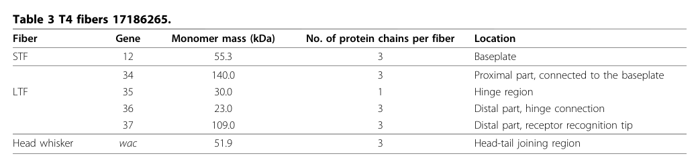

## Question

# Gene Research for Functional Annotation

## ⚠️ CRITICAL: Gene/Protein Identification Context

**BEFORE YOU BEGIN RESEARCH:** You MUST verify you are researching the CORRECT gene/protein. Gene symbols can be ambiguous, especially for less well-characterized genes from non-model organisms.

### Target Gene/Protein Identity (from UniProt):
- **UniProt Accession:** P03742
- **Protein Description:** RecName: Full=Long-tail fiber protein gp35; AltName: Full=Gene product 35 {ECO:0000305}; Short=gp35;
- **Gene Information:** Name=35;
- **Organism (full):** Enterobacteria phage T4 (Bacteriophage T4).
- **Protein Family:** Not specified in UniProt
- **Key Domains:** ILEI/PANDER_dom. (IPR039477); ILEI (PF15711)

### MANDATORY VERIFICATION STEPS:

1. **Check if the gene symbol "35" matches the protein description above**
2. **Verify the organism is correct:** Enterobacteria phage T4 (Bacteriophage T4).
3. **Check if protein family/domains align with what you find in literature**
4. **If you find literature for a DIFFERENT gene with the same or similar symbol, STOP**

### If Gene Symbol is Ambiguous or You Cannot Find Relevant Literature:

**DO NOT PROCEED WITH RESEARCH ON A DIFFERENT GENE.** Instead:
- State clearly: "The gene symbol '35' is ambiguous or literature is limited for this specific protein"
- Explain what you found (e.g., "Found extensive literature on a different gene with the same symbol in a different organism")
- Describe the protein based ONLY on the UniProt information provided above
- Suggest that the protein function can be inferred from domain/family information

### Research Target:

Please provide a comprehensive research report on the gene **35** (gene ID: 35, UniProt: P03742) in BPT4.

The research report should be a detailed narrative explaining the function, biological processes, and localization of the gene product. Citations should be given for all claims.

You should prioritize authoritative reviews and primary scientific literature when conducting research. You can supplement
this with annotations you find in gene/protein databases, but these can be outdated or inaccurate.

We are specifically interested in the primary function of the gene - for enzymes, what reaction is catalyzed, and what is the substrate specificity? For transporters, what is the substrate? For structural proteins or adapters, what is the broader structural role? For signaling molecules, what is the role in the pathway.

We are interested in where in or outside the cell the gene product carries out its function.

We are also interested in the signaling or biochemical pathways in which the gene functions. We are less interested in broad pleiotropic effects, except where these elucidate the precise role.

Include evidence where possible. We are interested in both experimental evidence as well as inference from structure, evolution, or bioinformatic analysis. Precise studies should be prioritized over high-throughput, where available.

## Output

Question: You are an expert researcher providing comprehensive, well-cited information.

Provide detailed information focusing on:
1. Key concepts and definitions with current understanding
2. Recent developments and latest research (prioritize 2023-2024 sources)
3. Current applications and real-world implementations
4. Expert opinions and analysis from authoritative sources
5. Relevant statistics and data from recent studies

Format as a comprehensive research report with proper citations. Include URLs and publication dates where available.
Always prioritize recent, authoritative sources and provide specific citations for all major claims.

# Gene Research for Functional Annotation

## ⚠️ CRITICAL: Gene/Protein Identification Context

**BEFORE YOU BEGIN RESEARCH:** You MUST verify you are researching the CORRECT gene/protein. Gene symbols can be ambiguous, especially for less well-characterized genes from non-model organisms.

### Target Gene/Protein Identity (from UniProt):
- **UniProt Accession:** P03742
- **Protein Description:** RecName: Full=Long-tail fiber protein gp35; AltName: Full=Gene product 35 {ECO:0000305}; Short=gp35;
- **Gene Information:** Name=35;
- **Organism (full):** Enterobacteria phage T4 (Bacteriophage T4).
- **Protein Family:** Not specified in UniProt
- **Key Domains:** ILEI/PANDER_dom. (IPR039477); ILEI (PF15711)

### MANDATORY VERIFICATION STEPS:

1. **Check if the gene symbol "35" matches the protein description above**
2. **Verify the organism is correct:** Enterobacteria phage T4 (Bacteriophage T4).
3. **Check if protein family/domains align with what you find in literature**
4. **If you find literature for a DIFFERENT gene with the same or similar symbol, STOP**

### If Gene Symbol is Ambiguous or You Cannot Find Relevant Literature:

**DO NOT PROCEED WITH RESEARCH ON A DIFFERENT GENE.** Instead:
- State clearly: "The gene symbol '35' is ambiguous or literature is limited for this specific protein"
- Explain what you found (e.g., "Found extensive literature on a different gene with the same symbol in a different organism")
- Describe the protein based ONLY on the UniProt information provided above
- Suggest that the protein function can be inferred from domain/family information

### Research Target:

Please provide a comprehensive research report on the gene **35** (gene ID: 35, UniProt: P03742) in BPT4.

The research report should be a detailed narrative explaining the function, biological processes, and localization of the gene product. Citations should be given for all claims.

You should prioritize authoritative reviews and primary scientific literature when conducting research. You can supplement
this with annotations you find in gene/protein databases, but these can be outdated or inaccurate.

We are specifically interested in the primary function of the gene - for enzymes, what reaction is catalyzed, and what is the substrate specificity? For transporters, what is the substrate? For structural proteins or adapters, what is the broader structural role? For signaling molecules, what is the role in the pathway.

We are interested in where in or outside the cell the gene product carries out its function.

We are also interested in the signaling or biochemical pathways in which the gene functions. We are less interested in broad pleiotropic effects, except where these elucidate the precise role.

Include evidence where possible. We are interested in both experimental evidence as well as inference from structure, evolution, or bioinformatic analysis. Precise studies should be prioritized over high-throughput, where available.

## Research report: Enterobacteria phage T4 gene 35 (gp35) (UniProt P03742)

### Executive summary (functional annotation)
Gene 35 of *Enterobacteria phage T4* encodes gp35, a **monomeric hinge (“kneecap”) structural protein** of the phage **long tail fiber (LTF)**. Its primary role is to **connect the proximal LTF rod (gp34 trimer) to the distal rod (gp36 trimer)**, forming the LTF’s characteristic bend and enabling correct LTF architecture and attachment of the distal half-fiber to the proximal half-fiber during assembly. gp35 is therefore best annotated as a **virion structural connector/adaptor**, not an enzyme or transporter, and it functions **extracellularly as part of the mature virion tail fiber** during host adsorption. (hyman2018bacteriophaget4long pages 1-2, hyman2018bacteriophaget4long pages 2-4, leiman2010morphogenesisofthe pages 2-5)

### 1) Key concepts and definitions (current understanding)

#### 1.1 Long tail fibers (LTFs)
Contractile-tailed (myophage-like) bacteriophages such as T4 use LTFs as **host-attachment devices** that mediate initial, typically reversible adsorption and help the virion locate a productive infection site on the bacterial surface. In T4, the LTF is a multi-protein assembly composed of gp34, gp35, gp36, and gp37. (bartual2010structureofthe pages 1-2, granell2017crystalstructureof pages 1-3)

#### 1.2 “Hinge/kneecap” protein
In the T4 LTF, the term **“kneecap” (or hinge)** refers to the structural junction between two elongated rod-like segments (proximal and distal rods). gp35 is consistently described as the **monomeric kneecap/hinge** positioned between the **proximal** (gp34) and **distal** (gp36→gp37) segments. (bartual2010structureofthe pages 1-2, hyman2018bacteriophaget4long pages 6-7)

### 2) Verified identity (mandatory disambiguation)

- **UniProt accession**: P03742
- **Organism**: *Enterobacteria phage T4*
- **Protein name in the T4 literature**: gene product 35 (gp35)
- **Role**: long tail fiber “kneecap/hinge” structural protein between gp34 and gp36

Multiple independent sources explicitly use “gp35”/“gene product 35” as a T4 LTF component and place it at the junction between gp34 and gp36, matching the provided UniProt identity and avoiding symbol ambiguity. (hyman2018bacteriophaget4long pages 1-2, bartual2010structureofthe pages 1-2)

### 3) Function, biological process, and localization

#### 3.1 Primary function
**Primary function**: gp35 is a **structural connector/adaptor** that **binds the C-termini of gp34** (proximal trimeric rod) and the **N-termini of gp36** (distal trimeric rod), thereby linking the proximal and distal half-fibers of the LTF. (hyman2018bacteriophaget4long pages 1-2)

A domain-focused review further proposes that gp35 may **induce/maintain a fixed-angle bend** between the proximal gp34 rod and the distal gp36 rod, consistent with its “kneecap” designation. (hyman2018bacteriophaget4long pages 6-7)

#### 3.2 Biological process context
gp35 contributes to the **assembly and function of the host-adsorption apparatus** (the LTF). While receptor recognition is primarily mediated at the distal tip (gp37), gp35 is essential to the correct architecture that positions receptor-binding modules appropriately for host interaction. (bartual2010structureofthe pages 1-2, mourosi2022understandingbacteriophagetail pages 2-4)

#### 3.3 Cellular/virion localization
gp35 localizes to the **hinge region** of the **virion long tail fiber** (an extracellular virion structure). A compiled structural-protein table explicitly assigns gp35 to the LTF “hinge region.” (leiman2010morphogenesisofthe pages 2-5, leiman2010morphogenesisofthe media 7efe9566)

### 4) Composition, stoichiometry, and assembly pathway

#### 4.1 Stoichiometry and fiber organization (quantitative)
Across sources, gp35 is the only **non-trimeric** major LTF component:
- gp34: **3 chains** per LTF (proximal)
- gp35: **1 chain** per LTF (hinge)
- gp36: **3 chains** per LTF (distal; hinge connection)
- gp37: **3 chains** per LTF (distal; receptor recognition)

This stoichiometry is explicitly tabulated in a tail morphogenesis review (Table 3). (leiman2010morphogenesisofthe pages 2-5, leiman2010morphogenesisofthe media 7efe9566)

#### 4.2 Assembly pathway placement
An LTF assembly model synthesized from experimental mapping/biochemical work describes the following sequence:
1. **gp36 assembles on gp37**, forming a gp36–gp37 complex.
2. **gp35 then joins** the free end to form the **gp35–gp36–gp37 distal half-fiber**.
3. This distal half subsequently connects to the proximal half-fiber (gp34), placing gp35 at the proximal–distal junction. (hyman2018bacteriophaget4long pages 2-4)

### 5) Structural biology and domains (what is known vs unknown)

#### 5.1 Experimental structural knowledge gaps
High-resolution structures are available for other LTF modules (notably gp37 tip regions), but gp35 is repeatedly noted as lacking an experimentally determined atomic structure in the cited domain review and in the structural work focused on the receptor-binding tip. (hyman2018bacteriophaget4long pages 6-7, bartual2010structureofthe pages 1-2)

#### 5.2 Bioinformatic/structural inference for gp35 domains
A detailed domain review reports gp35 is ~372 residues and uses HHpred-based inference to propose **two carbohydrate-binding module (CBM)-like domains** within gp35 (with similarity to PDB entries 5GGN and 4XUP). The authors argue these CBM-like folds may, in gp35’s context, be repurposed primarily for **protein–protein binding** to gp34 and gp36 at the junction rather than carbohydrate binding. (hyman2018bacteriophaget4long pages 6-7)

*Interpretation*: This is currently best treated as **inference** rather than established biochemical activity, and it supports an annotation of gp35 as a **protein-binding structural adaptor**.

### 6) Interactions and pathway-level role in infection initiation

#### 6.1 Physical interactions within the LTF
The core interactions supported by multiple sources are:
- gp35 connects **gp34 (proximal rod)** to **gp36 (distal rod)**. (hyman2018bacteriophaget4long pages 1-2, bartual2010structureofthe pages 1-2)
- gp36 and gp37 form the distal fiber, with gp37 providing the distal receptor-binding tip; gp35 is proximal to gp36. (bartual2010structureofthe pages 1-2, mourosi2022understandingbacteriophagetail pages 2-4)

#### 6.2 Host receptor binding is distal (contextualizing gp35)
A modern review of T4 tail-fiber interactions emphasizes that specific binding to *E. coli* receptors (LPS and OmpC) is mediated by the distal LTF tip (gp37), while gp35 is the monomeric hinge linking proximal and distal segments. (mourosi2022understandingbacteriophagetail pages 2-4)

### 7) Recent developments (prioritizing 2023–2024)

#### 7.1 2024: Tail-fiber “structure atlas” approaches using deep-learning prediction
A 2024 preprint introduces **RBPseg**, which combines ESMfold-based monomer prediction with a segmentation strategy and AlphaFold2-multimer to assemble predicted models of long, flexible tail fibers. In this work, T4 is used as an illustrative reference for multi-protein tail-fiber systems, explicitly noting that the **T4 long tail fiber is formed by gp34, gp35, gp36 and gp37**. While it does not add new gp35-specific experiments, it reflects the current frontier: building near-complete structural atlases for tail fibers that are difficult to solve experimentally. (kleinsousa2024towardsacomplete pages 1-4)

*Expert/field analysis*: This trend suggests that gp35’s mechanistic role (geometry control at the hinge; interface complementarity with gp34/gp36) may become more testable through predicted complex models and integrative cryo-EM/modeling pipelines, even when isolated gp35 crystallography remains challenging. (kleinsousa2024towardsacomplete pages 1-4, hyman2018bacteriophaget4long pages 6-7)

#### 7.2 Evidence limitations for 2023–2024 gp35-specific experiments
Within the retrieved 2023–2024 corpus, direct new experimental dissection of **T4 gp35** (P03742) was limited; most 2023–2024 papers mentioning “gp35” refer to gp35 in other phages (gene naming reuse). Therefore, gp35’s functional annotation remains grounded mainly in the established T4 tail fiber structural/morphogenetic literature complemented by modern computational prediction work. (kleinsousa2024towardsacomplete pages 1-4)

### 8) Current applications and real-world implementations (tail fibers as engineering modules)

Although gp35 itself is a hinge/adaptor rather than the receptor-binding tip, it is part of an intensively studied adsorption apparatus that is widely treated as an engineering target.

#### 8.1 Host-range engineering and phage therapy relevance
A 2022 authoritative review frames tail fiber structure–function knowledge in T4 as a “blueprint” for **reprogramming phage host range**, emphasizing that phage host specificity is largely governed by tail fiber modules and that detailed understanding supports phage therapy development. In this context, gp35’s importance is architectural: successful swapping or redesign of distal receptor-binding modules typically must preserve correct proximal–distal connectivity and oligomeric compatibility, implicating hinge/connector elements as constraints in engineering. (mourosi2022understandingbacteriophagetail pages 2-4)

#### 8.2 Structural prediction pipelines for engineering (2024)
The 2024 RBPseg work directly targets improved predicted structural models for tail fibers and classifies tail-fiber domain architectures, supporting practical workflows for designing chimeric RBPs and evaluating domain boundaries/compatibility. T4’s multi-protein fiber is included as a canonical reference system in this design space. (kleinsousa2024towardsacomplete pages 1-4)

### 9) Relevant statistics and data points (recent/established)

- **Stoichiometry** of T4 LTF: **(gp34)3(gp35)1(gp36)3(gp37)3**, with gp35 as the single-copy hinge protein per fiber. (leiman2010morphogenesisofthe pages 2-5, leiman2010morphogenesisofthe media 7efe9566)
- **Virion localization**: gp35 assigned to the **LTF hinge region**. (leiman2010morphogenesisofthe pages 2-5, leiman2010morphogenesisofthe media 7efe9566)
- **Dimensions** (context for structural role): T4 LTFs reported as ~**145 nm** long and ~**4 nm** wide, supporting a mechanical/architectural role for hinge elements. (granell2017crystalstructureof pages 1-3)
- **Domain-level mapping** (context): scanning transmission microscopy described ~**17 mass domains** across the LTF, including a **single hinge domain** attributed to gp35 in modern reviews summarizing these experiments. (hyman2018bacteriophaget4long pages 2-4, mourosi2022understandingbacteriophagetail pages 2-4)

### 10) Practical functional annotation (recommended Gene Ontology-style statements)
Based on the evidence above, a defensible functional annotation for gp35 (P03742) is:

- **Molecular function**: structural constituent of virion long tail fiber; protein–protein adaptor linking proximal (gp34) and distal (gp36) LTF segments. (hyman2018bacteriophaget4long pages 1-2, leiman2010morphogenesisofthe pages 2-5)
- **Biological process**: virion assembly (tail fiber morphogenesis); host adsorption (as part of the adsorption apparatus). (hyman2018bacteriophaget4long pages 2-4, bartual2010structureofthe pages 1-2)
- **Cellular component**: virion long tail fiber, hinge/kneecap region. (leiman2010morphogenesisofthe pages 2-5, leiman2010morphogenesisofthe media 7efe9566)

### Evidence table (quick reference)
| Feature | Current best-supported description | Evidence type (experimental vs inference) | Key sources (with year) |
|---|---|---|---|
| Protein identity/length | Gene 35 of *Enterobacteria phage T4* encodes long-tail fiber protein gp35, a monomeric “kneecap”/hinge component of the long tail fiber; gp35 is reported as a 372-residue polypeptide and ~30 kDa protein. | Experimental for identity/component assignment and mass; inference/review synthesis for exact descriptive role wording. | Hyman & van Raaij 2018; Leiman et al. 2010 (hyman2018bacteriophaget4long pages 6-7, leiman2010morphogenesisofthe pages 2-5) |
| Virion localization | gp35 localizes to the hinge (knee-cap) region at the junction between the phage-proximal half-fiber and phage-distal half-fiber of the long tail fiber (LTF). | Experimental (mass mapping/EM, stoichiometric tables) plus review synthesis. | Bartual et al. 2010; Leiman et al. 2010; Hyman & van Raaij 2018 (bartual2010structureofthe pages 1-2, leiman2010morphogenesisofthe pages 2-5, hyman2018bacteriophaget4long pages 1-2) |
| Role in long tail fiber architecture | gp35 links the C-termini of trimeric gp34 to the N-termini of trimeric gp36, forming the bend between proximal and distal rods and helping create the fixed-angle architecture of the LTF. | Experimental for junction placement; inference/bioinformatic-structural interpretation for “fixed-angle bend” mechanism. | Hyman & van Raaij 2018; Bartual et al. 2010 (hyman2018bacteriophaget4long pages 1-2, hyman2018bacteriophaget4long pages 6-7, bartual2010structureofthe pages 1-2) |
| Stoichiometry | The LTF has stoichiometry (gp34)3(gp35)1(gp36)3(gp37)3; gp35 is the only non-trimeric major structural component and occurs once per fiber. | Experimental/review compilation from structural and compositional studies. | Leiman et al. 2010; Bhatt et al. 2021; Mourosi et al. 2022 (leiman2010morphogenesisofthe pages 2-5, mourosi2022understandingbacteriophagetail pages 2-4) |
| Assembly pathway placement | Assembly proceeds by formation of a gp36-gp37 complex, then gp35 joins the free end to form the distal half-fiber gp35-gp36-gp37; this distal half subsequently connects to proximal gp34. | Experimental/review synthesis from genetic, protein isolation, EM, and mass-mapping studies. | Hyman & van Raaij 2018 (hyman2018bacteriophaget4long pages 2-4, hyman2018bacteriophaget4long pages 1-2) |
| Predicted domain architecture (HHpred/CBM-like) | No experimental gp35 structure is available, but HHpred-based analysis predicts two carbohydrate-binding module-like domains: residues 19-178 similar to PDB 5GGN and residues 228-344 similar to CBM22 tandem-like fold (PDB 4XUP). These domains are proposed to mediate protein-protein contacts with gp34/gp36 rather than carbohydrate binding. | Inference/bioinformatic prediction. | Hyman & van Raaij 2018 (hyman2018bacteriophaget4long pages 6-7) |
| Known structural data availability | Unlike gp34 and gp37, gp35 has no experimentally determined high-resolution structure reported in the provided evidence. | Experimental absence / review summary. | Hyman & van Raaij 2018; Bartual et al. 2010 (hyman2018bacteriophaget4long pages 6-7, bartual2010structureofthe pages 1-2) |
| Related proteins and receptor-binding context | gp34 forms the proximal trimeric rod; gp36 forms the upper/distal rod segment; gp37 forms the distal receptor-binding tip. The complete T4 LTF mediates initial reversible attachment to *E. coli* receptors including LPS and OmpC, but receptor recognition is attributed primarily to gp37 rather than gp35. | Experimental for gp37 receptor-binding context and LTF composition; review synthesis for division of roles. | Bartual et al. 2010; Mourosi et al. 2022; Granell et al. 2017 (bartual2010structureofthe pages 1-2, mourosi2022understandingbacteriophagetail pages 2-4, granell2017crystalstructureof pages 1-3) |
| Key measurements | T4 LTFs are ~145 nm long and ~4 nm wide, often described as two ~80 nm rods joined end-to-end; scanning transmission microscopy resolved ~17 mass domains across the fiber, including a single gp35 hinge domain. T4 infection efficiency has been reported to approach the theoretical value of 1 in the context of efficient LTF-mediated host surface exploration. | Experimental for dimensions/domain mapping; review synthesis for infection-efficiency framing. | Granell et al. 2017; Hyman & van Raaij 2018; Mourosi et al. 2022 (granell2017crystalstructureof pages 1-3, hyman2018bacteriophaget4long pages 2-4, mourosi2022understandingbacteriophagetail pages 2-4) |

*Table: This table summarizes the best-supported functional annotation for bacteriophage T4 gene 35 product gp35 (UniProt P03742), focusing on its identity, localization, architectural role, stoichiometry, assembly position, and structural knowledge. It is useful as a concise evidence-based reference for distinguishing experimentally supported facts from current bioinformatic inference.*

### Visual evidence: stoichiometry and localization
The following table image provides direct evidence for gp35’s **single-copy stoichiometry** and **hinge localization** within the T4 LTF. (leiman2010morphogenesisofthe media 7efe9566)

### Key sources (with URLs and publication dates)
- Leiman PG et al. **Morphogenesis of the T4 tail and tail fibers**. *Virology Journal*. **2010-12**. https://doi.org/10.1186/1743-422x-7-355 (leiman2010morphogenesisofthe pages 2-5)
- Bartual SG et al. **Structure of the bacteriophage T4 long tail fiber receptor-binding tip**. *PNAS*. **2010-11**. https://doi.org/10.1073/pnas.1011218107 (bartual2010structureofthe pages 1-2)
- Hyman P, van Raaij MJ. **Bacteriophage T4 long tail fiber domains**. *Biophysical Reviews*. **2018-12**. https://doi.org/10.1007/s12551-017-0348-5 (hyman2018bacteriophaget4long pages 6-7)
- Mourosi JT et al. **Understanding Bacteriophage Tail Fiber Interaction with Host Surface Receptor…** *IJMS*. **2022-10**. https://doi.org/10.3390/ijms232012146 (mourosi2022understandingbacteriophagetail pages 2-4)
- Klein-Sousa V et al. **Towards a complete phage tail fiber structure atlas**. *bioRxiv* (preprint). **2024-10**. https://doi.org/10.1101/2024.10.28.620165 (kleinsousa2024towardsacomplete pages 1-4)

References

1. (hyman2018bacteriophaget4long pages 1-2): Paul Hyman and Mark van Raaij. Bacteriophage t4 long tail fiber domains. Biophysical Reviews, 10:463-471, Dec 2018. URL: https://doi.org/10.1007/s12551-017-0348-5, doi:10.1007/s12551-017-0348-5. This article has 64 citations and is from a peer-reviewed journal.

2. (hyman2018bacteriophaget4long pages 2-4): Paul Hyman and Mark van Raaij. Bacteriophage t4 long tail fiber domains. Biophysical Reviews, 10:463-471, Dec 2018. URL: https://doi.org/10.1007/s12551-017-0348-5, doi:10.1007/s12551-017-0348-5. This article has 64 citations and is from a peer-reviewed journal.

3. (leiman2010morphogenesisofthe pages 2-5): Petr G Leiman, Fumio Arisaka, Mark J van Raaij, Victor A Kostyuchenko, Anastasia A Aksyuk, Shuji Kanamaru, and Michael G Rossmann. Morphogenesis of the t4 tail and tail fibers. Virology Journal, 7:355-355, Dec 2010. URL: https://doi.org/10.1186/1743-422x-7-355, doi:10.1186/1743-422x-7-355. This article has 319 citations and is from a peer-reviewed journal.

4. (bartual2010structureofthe pages 1-2): Sergio G. Bartual, José M. Otero, Carmela Garcia-Doval, Antonio L. Llamas-Saiz, Richard Kahn, Gavin C. Fox, and Mark J. van Raaij. Structure of the bacteriophage t4 long tail fiber receptor-binding tip. Proceedings of the National Academy of Sciences, 107:20287-20292, Nov 2010. URL: https://doi.org/10.1073/pnas.1011218107, doi:10.1073/pnas.1011218107. This article has 273 citations and is from a highest quality peer-reviewed journal.

5. (granell2017crystalstructureof pages 1-3): Meritxell Granell, Mikiyoshi Namura, Sara Alvira, Shuji Kanamaru, and Mark Van Raaij. Crystal structure of the carboxy-terminal region of the bacteriophage t4 proximal long tail fiber protein gp34. Viruses, 9:168, Jun 2017. URL: https://doi.org/10.3390/v9070168, doi:10.3390/v9070168. This article has 40 citations.

6. (hyman2018bacteriophaget4long pages 6-7): Paul Hyman and Mark van Raaij. Bacteriophage t4 long tail fiber domains. Biophysical Reviews, 10:463-471, Dec 2018. URL: https://doi.org/10.1007/s12551-017-0348-5, doi:10.1007/s12551-017-0348-5. This article has 64 citations and is from a peer-reviewed journal.

7. (mourosi2022understandingbacteriophagetail pages 2-4): Jarin Taslem Mourosi, Ayobami I. Awe, Wenzheng Guo, Himanshu Batra, Harrish Ganesh, Xiaorong Wu, and Jingen Zhu. Understanding bacteriophage tail fiber interaction with host surface receptor: the key “blueprint” for reprogramming phage host range. International Journal of Molecular Sciences, 23:12146, Oct 2022. URL: https://doi.org/10.3390/ijms232012146, doi:10.3390/ijms232012146. This article has 193 citations.

8. (leiman2010morphogenesisofthe media 7efe9566): Petr G Leiman, Fumio Arisaka, Mark J van Raaij, Victor A Kostyuchenko, Anastasia A Aksyuk, Shuji Kanamaru, and Michael G Rossmann. Morphogenesis of the t4 tail and tail fibers. Virology Journal, 7:355-355, Dec 2010. URL: https://doi.org/10.1186/1743-422x-7-355, doi:10.1186/1743-422x-7-355. This article has 319 citations and is from a peer-reviewed journal.

9. (kleinsousa2024towardsacomplete pages 1-4): Victor Klein-Sousa, Aritz Roa-Eguiara, Claudia S. Kielkopf, Nicholas Sofos, and Nicholas M. I. Taylor. Towards a complete phage tail fiber structure atlas. bioRxiv, Oct 2024. URL: https://doi.org/10.1101/2024.10.28.620165, doi:10.1101/2024.10.28.620165. This article has 2 citations.

## Artifacts

- [Edison artifact artifact-00](35-deep-research-falcon_artifacts/artifact-00.md)

## Citations

1. mourosi2022understandingbacteriophagetail pages 2-4
2. kleinsousa2024towardsacomplete pages 1-4
3. granell2017crystalstructureof pages 1-3
4. leiman2010morphogenesisofthe pages 2-5
5. bartual2010structureofthe pages 1-2
6. https://doi.org/10.1186/1743-422x-7-355
7. https://doi.org/10.1073/pnas.1011218107
8. https://doi.org/10.1007/s12551-017-0348-5
9. https://doi.org/10.3390/ijms232012146
10. https://doi.org/10.1101/2024.10.28.620165
11. https://doi.org/10.1007/s12551-017-0348-5,
12. https://doi.org/10.1186/1743-422x-7-355,
13. https://doi.org/10.1073/pnas.1011218107,
14. https://doi.org/10.3390/v9070168,
15. https://doi.org/10.3390/ijms232012146,
16. https://doi.org/10.1101/2024.10.28.620165,