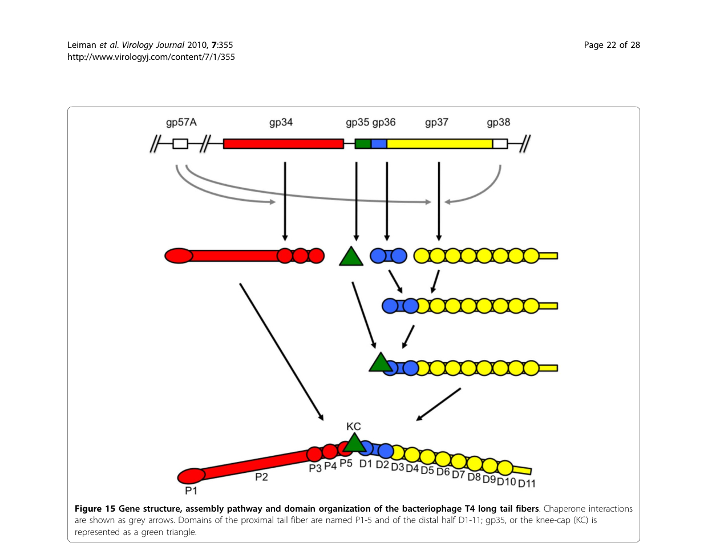

## Question

# Gene Research for Functional Annotation

## ⚠️ CRITICAL: Gene/Protein Identification Context

**BEFORE YOU BEGIN RESEARCH:** You MUST verify you are researching the CORRECT gene/protein. Gene symbols can be ambiguous, especially for less well-characterized genes from non-model organisms.

### Target Gene/Protein Identity (from UniProt):
- **UniProt Accession:** P03743
- **Protein Description:** RecName: Full=Long-tail fiber protein gp36; AltName: Full=Gene product 36 {ECO:0000305}; Short=gp36;
- **Gene Information:** Name=36;
- **Organism (full):** Enterobacteria phage T4 (Bacteriophage T4).
- **Protein Family:** Belongs to the tevenvirinae tail fiber protein p36 family.
- **Key Domains:** Tail_fibre_p36. (IPR005601); Phage_T4_gp36 (PF03903)

### MANDATORY VERIFICATION STEPS:

1. **Check if the gene symbol "36" matches the protein description above**
2. **Verify the organism is correct:** Enterobacteria phage T4 (Bacteriophage T4).
3. **Check if protein family/domains align with what you find in literature**
4. **If you find literature for a DIFFERENT gene with the same or similar symbol, STOP**

### If Gene Symbol is Ambiguous or You Cannot Find Relevant Literature:

**DO NOT PROCEED WITH RESEARCH ON A DIFFERENT GENE.** Instead:
- State clearly: "The gene symbol '36' is ambiguous or literature is limited for this specific protein"
- Explain what you found (e.g., "Found extensive literature on a different gene with the same symbol in a different organism")
- Describe the protein based ONLY on the UniProt information provided above
- Suggest that the protein function can be inferred from domain/family information

### Research Target:

Please provide a comprehensive research report on the gene **36** (gene ID: 36, UniProt: P03743) in BPT4.

The research report should be a detailed narrative explaining the function, biological processes, and localization of the gene product. Citations should be given for all claims.

You should prioritize authoritative reviews and primary scientific literature when conducting research. You can supplement
this with annotations you find in gene/protein databases, but these can be outdated or inaccurate.

We are specifically interested in the primary function of the gene - for enzymes, what reaction is catalyzed, and what is the substrate specificity? For transporters, what is the substrate? For structural proteins or adapters, what is the broader structural role? For signaling molecules, what is the role in the pathway.

We are interested in where in or outside the cell the gene product carries out its function.

We are also interested in the signaling or biochemical pathways in which the gene functions. We are less interested in broad pleiotropic effects, except where these elucidate the precise role.

Include evidence where possible. We are interested in both experimental evidence as well as inference from structure, evolution, or bioinformatic analysis. Precise studies should be prioritized over high-throughput, where available.

## Output

Question: You are an expert researcher providing comprehensive, well-cited information.

Provide detailed information focusing on:
1. Key concepts and definitions with current understanding
2. Recent developments and latest research (prioritize 2023-2024 sources)
3. Current applications and real-world implementations
4. Expert opinions and analysis from authoritative sources
5. Relevant statistics and data from recent studies

Format as a comprehensive research report with proper citations. Include URLs and publication dates where available.
Always prioritize recent, authoritative sources and provide specific citations for all major claims.

# Gene Research for Functional Annotation

## ⚠️ CRITICAL: Gene/Protein Identification Context

**BEFORE YOU BEGIN RESEARCH:** You MUST verify you are researching the CORRECT gene/protein. Gene symbols can be ambiguous, especially for less well-characterized genes from non-model organisms.

### Target Gene/Protein Identity (from UniProt):
- **UniProt Accession:** P03743
- **Protein Description:** RecName: Full=Long-tail fiber protein gp36; AltName: Full=Gene product 36 {ECO:0000305}; Short=gp36;
- **Gene Information:** Name=36;
- **Organism (full):** Enterobacteria phage T4 (Bacteriophage T4).
- **Protein Family:** Belongs to the tevenvirinae tail fiber protein p36 family.
- **Key Domains:** Tail_fibre_p36. (IPR005601); Phage_T4_gp36 (PF03903)

### MANDATORY VERIFICATION STEPS:

1. **Check if the gene symbol "36" matches the protein description above**
2. **Verify the organism is correct:** Enterobacteria phage T4 (Bacteriophage T4).
3. **Check if protein family/domains align with what you find in literature**
4. **If you find literature for a DIFFERENT gene with the same or similar symbol, STOP**

### If Gene Symbol is Ambiguous or You Cannot Find Relevant Literature:

**DO NOT PROCEED WITH RESEARCH ON A DIFFERENT GENE.** Instead:
- State clearly: "The gene symbol '36' is ambiguous or literature is limited for this specific protein"
- Explain what you found (e.g., "Found extensive literature on a different gene with the same symbol in a different organism")
- Describe the protein based ONLY on the UniProt information provided above
- Suggest that the protein function can be inferred from domain/family information

### Research Target:

Please provide a comprehensive research report on the gene **36** (gene ID: 36, UniProt: P03743) in BPT4.

The research report should be a detailed narrative explaining the function, biological processes, and localization of the gene product. Citations should be given for all claims.

You should prioritize authoritative reviews and primary scientific literature when conducting research. You can supplement
this with annotations you find in gene/protein databases, but these can be outdated or inaccurate.

We are specifically interested in the primary function of the gene - for enzymes, what reaction is catalyzed, and what is the substrate specificity? For transporters, what is the substrate? For structural proteins or adapters, what is the broader structural role? For signaling molecules, what is the role in the pathway.

We are interested in where in or outside the cell the gene product carries out its function.

We are also interested in the signaling or biochemical pathways in which the gene functions. We are less interested in broad pleiotropic effects, except where these elucidate the precise role.

Include evidence where possible. We are interested in both experimental evidence as well as inference from structure, evolution, or bioinformatic analysis. Precise studies should be prioritized over high-throughput, where available.

## Research report: Functional annotation of Enterobacteria phage T4 gene 36 (gp36; UniProt P03743)

### 0) Target verification (mandatory)
The target protein is **Enterobacteria phage T4 long-tail fiber protein gp36**, encoded by **gene 36**, UniProt **P03743**. Multiple authoritative T4 morphogenesis and structural reviews explicitly identify **gp36** as a **trimeric structural component of the T4 long tail fiber (LTF)**, positioned in the **distal/hinge region** and present at **3 copies per fiber** (6 fibers per virion). This matches the UniProt identity and rules out unrelated “gene 36” symbols from other organisms. (leiman2003structureandmorphogenesis pages 11-13, leiman2010morphogenesisofthe pages 2-5)

### 1) Key concepts, definitions, and current understanding

#### 1.1 Long tail fibers (LTFs) as adsorption/sensing devices
In myophages like T4, **long tail fibers** are elongated viral adhesins that mediate **initial, reversible host recognition**, act as **environmental sensors**, and transmit information to the baseplate to trigger downstream infection steps (e.g., baseplate rearrangements and tail sheath contraction). Structurally, the T4 LTF is a **~1440–1450 Å** long, hinged fiber with proximal and distal segments. (leiman2003structureandmorphogenesis pages 8-11, leiman2010morphogenesisofthe pages 21-22)

#### 1.2 Where gp36 fits into the LTF architecture
The T4 LTF is assembled from four principal structural proteins: **gp34 (proximal rod; trimer)**, **gp35 (kneecap/hinge; monomer)**, **gp36 (distal rod “upper shin”; trimer)**, and **gp37 (distal receptor-binding tip module; trimer)**. In this framework, **gp36 is primarily a structural/assembly adaptor** in the distal rod/hinge-proximal region and is not described as the major receptor-binding component (that role is concentrated in gp37). (hyman2018bacteriophaget4long pages 1-2, leiman2010morphogenesisofthe pages 21-22)

### 2) Molecular function of gp36 (what it does)

#### 2.1 Primary function: structural connector enabling distal half-fiber formation
The strongest evidence-supported functional assignment for **gp36 (gene product 36)** is as a **trimeric structural element of the distal half-fiber** that:
1) **binds the N-terminal region of gp37** to create a gp36–gp37 assembly, and then 
2) accepts binding of **gp35** to complete the **distal half-fiber** before joining the gp34-containing proximal half-fiber. (leiman2010morphogenesisofthe pages 21-22, hyman2018bacteriophaget4long pages 2-4)

This positions gp36 as a key **morphogenetic intermediate** necessary to create a correctly assembled distal LTF module and to connect the receptor-binding tip region (gp37) to the rest of the LTF. (leiman2010morphogenesisofthe pages 21-22, leiman2003structureandmorphogenesis pages 8-11)

#### 2.2 Role in the hinge/junction between proximal and distal segments
Architectural descriptions of T4 LTFs place gp36 in the **distal part/hinge connection**, and the hinge is described as involving **gp35 and termini of gp34 and gp36**. Thus, gp36 likely contributes mechanically to the **hinged geometry** that allows LTFs to fold against the virion and to adopt different angles during receptor searching on the bacterial surface. (leiman2003structureandmorphogenesis pages 8-11, hyman2018bacteriophaget4long pages 1-2)

### 3) Biological process context: adsorption-to-infection pathway

#### 3.1 Cooperative use of multiple fibers
T4 virions can deploy up to **six** LTFs, and infection requires cooperative interactions. A quantitative constraint summarized in the T4 morphogenesis literature is that **at least three LTFs are required for infectivity**, consistent with a model where multiple fibers increase the probability of productive receptor engagement and correct baseplate activation. (leiman2010morphogenesisofthe pages 21-22)

#### 3.2 Receptor recognition is primarily gp37; gp36 supports the infection-initiating machine
While gp36 is integral to the distal fiber architecture, receptor recognition is emphasized as a function of the **gp37 distal tip**, which recognizes outer surface features (e.g., LPS and OmpC are commonly cited receptors for T4 LTFs in the broader literature). gp36 is therefore best annotated as a **structural component that positions and stabilizes the receptor-binding machinery**, enabling signal transmission to the baseplate rather than providing specificity itself. (hyman2018bacteriophaget4long pages 1-2, leiman2003structureandmorphogenesis pages 11-13)

### 4) Subcellular/virion localization

#### 4.1 Location within the mature virion
Stoichiometry and localization compiled for T4 tail fibers indicate:
- **3 gp36 subunits per long tail fiber**, with **6 LTFs per virion** (implying **18 gp36 copies per virion**). (leiman2003structureandmorphogenesis pages 11-13)
- gp36 is located in the **distal part at the hinge connection**. (leiman2010morphogenesisofthe pages 2-5)

A detailed morphogenesis description localizes gp36 at the **proximal end of the distal half-fiber**, forming the upper part of the “shin,” consistent with an internal distal-rod role. (leiman2010morphogenesisofthe pages 21-22)

### 5) Structural features and domains (what is known vs inferred)

#### 5.1 Experimental structural knowledge: gp36 remains structurally under-resolved
Compared with gp34 and gp37, for which partial crystal structures exist in the literature base, **gp36 lacks a widely cited high-resolution experimental structure** in the sources retrieved here. Consequently, most gp36 structural insight is inferential (sequence/secondary structure prediction and comparative analyses). (hyman2018bacteriophaget4long pages 1-2, hyman2018bacteriophaget4long pages 6-7)

#### 5.2 Bioinformatic inference from authoritative review
A domain-focused review reports that gp36 is:
- a **small (221-residue) homo-trimer**, 
- **predominantly β-structured**, and
- predicted to **lack coiled-coil regions**.
Additionally, HHpred detects a short similarity between **gp36 residues 35–61** and **gp34 residues 1234–1250**, interpreted as potential evidence of a shared/analogous interface involved in assembly junctions, including possible gp35-binding architecture at gp34/gp36 ends. (hyman2018bacteriophaget4long pages 6-7)

### 6) Quantitative “stats & data” relevant to gp36 functional annotation

#### 6.1 Fiber geometry and dimensions
T4 LTF architecture is described quantitatively as:
- total length **~1440–1450 Å**;
- proximal half **~700 Å** and distal half **~740 Å**;
- fiber diameter **~40–50 Å**;
- commonly conceptualized as two **~80 nm** rods joined at **~160°**. (leiman2003structureandmorphogenesis pages 8-11, leiman2010morphogenesisofthe pages 21-22, hyman2018bacteriophaget4long pages 1-2)

#### 6.2 Infectivity constraint
As noted above, **≥3 LTFs** are required for infectivity, giving a quantitative systems-level constraint on the LTF module in which gp36 is embedded. (leiman2010morphogenesisofthe pages 21-22)

### 7) Recent developments (prioritizing 2023–2024)

#### 7.1 2024: Tail fiber structural “atlas” and segmentation-based modeling (RBPseg)
A 2024 preprint introduces **RBPseg**, a method combining monomeric **ESMfold** predictions with **sigmoid distance pair (sDp)** segmentation to divide tail fibers into domains and then model segments using **AlphaFold2-multimer (AF2M v2.3.2)**, improving confidence and feasibility for elongated trimeric RBPs. The authors explicitly use **T4 LTF composition (gp34/gp35/gp36/gp37)** as a canonical example of multi-protein tail fiber systems. (kleinsousa2024towardsacomplete pages 1-4)

This work also provides quantitative ecosystem-level statistics valuable for annotation and engineering: after filtering UniProtKB, they analyzed **16,345** annotated tail-fiber sequences (from >64,000 initial hits) and report structural-class HMM recovery of **4,417 unique proteins** and coverage of **~24%** of the known tail-fiber universe (E-value < 10^-10). (kleinsousa2024towardsacomplete pages 21-25)

#### 7.2 2023: Modern cryo-EM + AlphaFold workflows for myophage tail fibers
A 2023 Nature Communications cryo-EM study of a therapeutic-cocktail-relevant myophage (E217) shows the current state of practice: tail fibers were modeled **in fragments using AlphaFold2**, and tail fiber N-termini were fit into a **3.6 Å** focused reconstruction (reported CC = **0.84**). The study provides concrete experimental parameters (e.g., **22,015 micrographs**, **10,826** final particles) and demonstrates functional host-interaction assays, such as LPS incubation with defined masses (500/50/5 µg) followed by EOP measurement. These methods are directly relevant to resolving proteins like gp36 that remain structurally under-characterized. (li2023highresolutioncryoemstructure pages 12-13)

### 8) Current applications and real-world implementations (2024 emphasis)

#### 8.1 Phage therapy development and host-range engineering targets implicating tail-fiber genes
A 2024 experimental study characterized **16 bacteriophages** infecting multidrug-resistant uropathogenic E. coli (UPEC). Quantitative outcomes include:
- Individual phages infected **2–44 strains** out of **77** (reported as **3–57%** breadth depending on phage); 
- A **six-phage cocktail** productively infected **52 strains (67%)**;
- Adsorption rates **72–98% in 5 min**, latent periods **7.5–15 min**, burst sizes **38–211**;
- In liquid culture, the cocktail produced complete suppression in the first **5–22 h**, and at **24 h** reduced growth to **43–92%** of control (also **53–79%** in artificial urine). (markuskova2024characterizationofbacteriophages pages 1-2, markuskova2024characterizationofbacteriophages pages 3-5, markuskova2024characterizationofbacteriophages pages 5-7, markuskova2024characterizationofbacteriophages pages 7-11)

Crucially for gp36-related functional annotation and engineering rationale, the study’s genome analysis highlights variability in receptor-recognition genes and notes differences involving **long tail fiber proteins gp36/gp37/gp38** as determinants of host specificity—supporting the expert view that **tail fiber gene modules are primary levers for altering host range** in T4-like phages. (markuskova2024characterizationofbacteriophages pages 3-5, markuskova2024characterizationofbacteriophages pages 5-7)

### 9) Expert synthesis and analysis (authoritative interpretations)

#### 9.1 Consensus view: gp36 is an internal structural adaptor in the distal half-fiber
Across independent expert reviews spanning 2003–2018, gp36 is consistently described as:
- a **small, trimeric structural protein**;
- **positioned at the proximal end of the distal half-fiber** (the “upper shin”);
- functioning in **assembly and mechanical linkage** between the gp35 hinge and the gp37 receptor-binding module, and between distal and proximal LTF segments. (leiman2010morphogenesisofthe pages 21-22, hyman2018bacteriophaget4long pages 1-2)

#### 9.2 Knowledge gaps
Despite detailed architectural placement, a key remaining gap is the lack (in the retrieved evidence set) of a **high-resolution experimental structure of gp36** and of **direct biochemical binding constants** for gp36 interactions (e.g., gp36–gp37 affinity). The field is moving toward resolving such gaps using integrated cryo-EM and deep-learning modeling workflows. (hyman2018bacteriophaget4long pages 6-7, li2023highresolutioncryoemstructure pages 12-13)

### 10) Summary of evidence map
| Claim/Topic | What is known (concise) | Evidence type | Key quantitative data | Key citation(s) with publication year and URL |
|---|---|---|---|---|
| Identity / size / stoichiometry | T4 gene 36 encodes long-tail fiber protein gp36, a trimeric component of the long tail fiber (LTF); it is not the receptor-binding tip itself but part of the distal rod / hinge-proximal region. | Review synthesis of genetics, EM, structural biology | 221 aa per monomer; ~23.0 kDa; 3 copies per fiber; 6 fibers per virion, implying 18 gp36 copies per virion. | Leiman et al. 2003, *Cell. Mol. Life Sci.* (Nov 2003), https://doi.org/10.1007/s00018-003-3072-1 (leiman2003structureandmorphogenesis pages 8-11, leiman2003structureandmorphogenesis pages 11-13); Leiman et al. 2010, *Virology Journal* (Dec 2010), https://doi.org/10.1186/1743-422x-7-355 (leiman2010morphogenesisofthe pages 21-22, leiman2010morphogenesisofthe pages 2-5) |
| Virion localization | gp36 sits at the proximal end of the distal half-fiber, forming the upper part of the “shin”; it lies between the gp35 kneecap/hinge and the gp37 distal receptor-recognition region. | Cryo-EM-informed review; assembly diagrams; morphogenesis review | Located in distal half-fiber; upper part of “shin”; distal/hinge connection. | Leiman et al. 2010, *Virology Journal* (Dec 2010), https://doi.org/10.1186/1743-422x-7-355 (leiman2010morphogenesisofthe pages 21-22, leiman2010morphogenesisofthe media 0ee2a966); Leiman et al. 2003, *Cell. Mol. Life Sci.* (Nov 2003), https://doi.org/10.1007/s00018-003-3072-1 (leiman2003structureandmorphogenesis pages 8-11, leiman2003structureandmorphogenesis pages 11-13) |
| Assembly interactions | Distal half-fiber assembly proceeds by gp36 trimer binding the N-terminus of gp37; then a gp35 monomer binds gp36 to complete the distal half-fiber; this distal unit then joins the proximal gp34-containing half-fiber. | Genetics, biochemical assembly studies, EM-informed review | Distal half-fiber composition: (gp35)1(gp36)3(gp37)3. | Leiman et al. 2010, *Virology Journal* (Dec 2010), https://doi.org/10.1186/1743-422x-7-355 (leiman2010morphogenesisofthe pages 21-22); Hyman & van Raaij 2018, *Biophysical Reviews* (Dec 2018), https://doi.org/10.1007/s12551-017-0348-5 (hyman2018bacteriophaget4long pages 2-4) |
| Junction with gp34 | gp36 helps form the connection between the distal and proximal LTF segments; together with gp35 and gp34 C-termini it contributes to the hinge/junction linking the gp34 proximal rod to the gp37-containing distal tip region. | Review of cryo-EM, structural interpretation, bioinformatics | gp36 contributes ~13 nm of the distal portion in one architectural description. | Leiman et al. 2003, *Cell. Mol. Life Sci.* (Nov 2003), https://doi.org/10.1007/s00018-003-3072-1 (leiman2003structureandmorphogenesis pages 8-11); Hyman & van Raaij 2018, *Biophysical Reviews* (Dec 2018), https://doi.org/10.1007/s12551-017-0348-5 (hyman2018bacteriophaget4long pages 6-7) |
| Chaperones gp57A / gp38 | gp57A is a general tail-fiber chaperone required for proper trimerization/folding of gp34 and gp37; gp38 is specifically required for correct folding/assembly of gp37 and is not part of the mature T4 fiber. No gp36-specific dedicated chaperone is identified in these sources. | Genetics, biochemical assembly studies, review | gp57A and gp38 assist assembly but are absent from mature LTF. | Leiman et al. 2010, *Virology Journal* (Dec 2010), https://doi.org/10.1186/1743-422x-7-355 (leiman2010morphogenesisofthe pages 21-22, leiman2010morphogenesisofthe pages 2-5); Hyman & van Raaij 2018, *Biophysical Reviews* (Dec 2018), https://doi.org/10.1007/s12551-017-0348-5 (hyman2018bacteriophaget4long pages 2-4) |
| Structural features of gp36 | gp36 is predicted to be predominantly β-structured, to lack coiled-coil regions, and may contain a novel fold not broadly similar to other known trimeric β-fiber proteins. | Bioinformatics / comparative structural analysis | 221 residues; no coiled-coil regions detected. | Hyman & van Raaij 2018, *Biophysical Reviews* (Dec 2018), https://doi.org/10.1007/s12551-017-0348-5 (hyman2018bacteriophaget4long pages 6-7) |
| HHpred similarity segment / interaction inference | HHpred identified a short similarity between gp36 residues 35–61 and gp34 residues 1234–1250, suggesting an interaction-related structural analogy near the gp34 P5/P3–P4 junction and possible gp35-binding architecture at gp34/gp36 ends. | Bioinformatic homology inference linked to known gp34 structure | Similarity segment: gp36 aa 35–61 ↔ gp34 aa 1234–1250. | Hyman & van Raaij 2018, *Biophysical Reviews* (Dec 2018), https://doi.org/10.1007/s12551-017-0348-5 (hyman2018bacteriophaget4long pages 6-7) |
| Fiber length / geometry | The full T4 LTF is a long, hinged adhesin assembled from gp34-gp35-gp36-gp37; it consists of two rods joined at an angle and folds against the virion until host encounter. | EM, cryo-EM, review synthesis | Full length ~1440–1450 Å; proximal half ~700 Å; distal half ~740 Å; rod diameter ~40–50 Å; two ~80 nm rods joined at ~160°. | Leiman et al. 2003, *Cell. Mol. Life Sci.* (Nov 2003), https://doi.org/10.1007/s00018-003-3072-1 (leiman2003structureandmorphogenesis pages 8-11); Leiman et al. 2010, *Virology Journal* (Dec 2010), https://doi.org/10.1186/1743-422x-7-355 (leiman2010morphogenesisofthe pages 21-22, leiman2010morphogenesisofthe media 0ee2a966); Hyman & van Raaij 2018, *Biophysical Reviews* (Dec 2018), https://doi.org/10.1007/s12551-017-0348-5 (hyman2018bacteriophaget4long pages 1-2) |
| Functional role in adsorption | gp36 is best understood as an internal structural/assembly adaptor within the LTF rather than the principal receptor-binding domain; receptor engagement is concentrated in gp37, while gp36 positions and stabilizes the distal rod for host-search and signaling to the baseplate. | Review synthesis from structural and functional studies | Up to 6 LTFs can engage a cell; receptor-recognition emphasis is on gp37, not gp36. | Hyman & van Raaij 2018, *Biophysical Reviews* (Dec 2018), https://doi.org/10.1007/s12551-017-0348-5 (hyman2018bacteriophaget4long pages 1-2); Leiman et al. 2003, *Cell. Mol. Life Sci.* (Nov 2003), https://doi.org/10.1007/s00018-003-3072-1 (leiman2003structureandmorphogenesis pages 11-13) |
| Infectivity requirement | T4 particles need multiple LTFs for efficient infectivity; long fibers function cooperatively as adsorption/sensing devices before irreversible attachment. | Titration experiments summarized in review | At least 3 long tail fibers are required for infectivity. | Leiman et al. 2010, *Virology Journal* (Dec 2010), https://doi.org/10.1186/1743-422x-7-355 (leiman2010morphogenesisofthe pages 21-22) |
| Recent 2023 structural methods | Modern myophage studies combine cryo-EM with AlphaFold-based modeling to reconstruct long tail fibers, providing a methodological template for unresolved proteins like gp36. | 2023 primary cryo-EM study | E217 tail fiber modeled in fragments with AlphaFold; focused tail-fiber map at 3.6 Å; full study used 22,015 micrographs and 10,826 final particles; LPS assay used 10^3 pfu with 500/50/5 µg LPS. | Li et al. 2023, *Nature Communications* (Jul 2023), https://doi.org/10.1038/s41467-023-39756-z (li2023highresolutioncryoemstructure pages 12-13) |
| Recent 2024 tail-fiber atlas / applications context | RBPseg and the 2024 tail fiber atlas address the difficulty of modeling elongated trimeric RBPs such as T4 LTF proteins, enabling segmentation-based AF2M modeling and classification useful for phage engineering and comparative annotation of gp36-like proteins. | 2024 computational structural biology + cryo-EM validation | 67 fibers analyzed; 16 structural classes; 89 domains; classes cover at least 24% of known tail-fiber universe; 16,345 annotated tail-fiber sequences filtered; 4,417 unique proteins recovered by HMMs (24.0%). | Klein-Sousa et al. 2024, *bioRxiv* (Oct 2024), https://doi.org/10.1101/2024.10.28.620165 (kleinsousa2024towardsacomplete pages 21-25, kleinsousa2024towardsacomplete pages 1-4, kleinsousa2024towardsacomplete pages 29-32) |

*Table: This table summarizes verified evidence about Enterobacteria phage T4 gp36, including its identity, structural role in the long tail fiber, assembly partners, and recent methodological advances relevant to studying gp36-like proteins.*

### Key references (with dates and URLs)
- Leiman PG et al. **2003-11**. *Structure and morphogenesis of bacteriophage T4*. **Cellular and Molecular Life Sciences**. https://doi.org/10.1007/s00018-003-3072-1 (leiman2003structureandmorphogenesis pages 8-11, leiman2003structureandmorphogenesis pages 11-13)
- Leiman PG et al. **2010-12**. *Morphogenesis of the T4 tail and tail fibers*. **Virology Journal**. https://doi.org/10.1186/1743-422x-7-355 (leiman2010morphogenesisofthe pages 21-22, leiman2010morphogenesisofthe pages 2-5, leiman2010morphogenesisofthe media 0ee2a966, leiman2010morphogenesisofthe media 683f1989)
- Hyman P, van Raaij MJ. **2018-12**. *Bacteriophage T4 long tail fiber domains*. **Biophysical Reviews**. https://doi.org/10.1007/s12551-017-0348-5 (hyman2018bacteriophaget4long pages 6-7, hyman2018bacteriophaget4long pages 2-4, hyman2018bacteriophaget4long pages 1-2)
- Li F et al. **2023-07**. *High-resolution cryo-EM structure of the Pseudomonas bacteriophage E217*. **Nature Communications**. https://doi.org/10.1038/s41467-023-39756-z (li2023highresolutioncryoemstructure pages 12-13)
- Klein-Sousa V et al. **2024-10**. *Towards a complete phage tail fiber structure atlas*. **bioRxiv**. https://doi.org/10.1101/2024.10.28.620165 (kleinsousa2024towardsacomplete pages 7-11, kleinsousa2024towardsacomplete pages 21-25, kleinsousa2024towardsacomplete pages 1-4, kleinsousa2024towardsacomplete pages 29-32)
- Markusková B et al. **2024-06**. *Characterization of bacteriophages infecting multidrug-resistant uropathogenic Escherichia coli strains*. **Archives of Virology**. https://doi.org/10.1007/s00705-024-06063-x (markuskova2024characterizationofbacteriophages pages 1-2, markuskova2024characterizationofbacteriophages pages 3-5, markuskova2024characterizationofbacteriophages pages 5-7, markuskova2024characterizationofbacteriophages pages 7-11, markuskova2024characterizationofbacteriophages pages 2-3)

References

1. (leiman2003structureandmorphogenesis pages 11-13): P. G. Leiman, S. Kanamaru, V. V. Mesyanzhinov, F. Arisaka, and M. G. Rossmann. Structure and morphogenesis of bacteriophage t4. Cellular and Molecular Life Sciences CMLS, 60:2356-2370, Nov 2003. URL: https://doi.org/10.1007/s00018-003-3072-1, doi:10.1007/s00018-003-3072-1. This article has 359 citations.

2. (leiman2010morphogenesisofthe pages 2-5): Petr G Leiman, Fumio Arisaka, Mark J van Raaij, Victor A Kostyuchenko, Anastasia A Aksyuk, Shuji Kanamaru, and Michael G Rossmann. Morphogenesis of the t4 tail and tail fibers. Virology Journal, 7:355-355, Dec 2010. URL: https://doi.org/10.1186/1743-422x-7-355, doi:10.1186/1743-422x-7-355. This article has 319 citations and is from a peer-reviewed journal.

3. (leiman2003structureandmorphogenesis pages 8-11): P. G. Leiman, S. Kanamaru, V. V. Mesyanzhinov, F. Arisaka, and M. G. Rossmann. Structure and morphogenesis of bacteriophage t4. Cellular and Molecular Life Sciences CMLS, 60:2356-2370, Nov 2003. URL: https://doi.org/10.1007/s00018-003-3072-1, doi:10.1007/s00018-003-3072-1. This article has 359 citations.

4. (leiman2010morphogenesisofthe pages 21-22): Petr G Leiman, Fumio Arisaka, Mark J van Raaij, Victor A Kostyuchenko, Anastasia A Aksyuk, Shuji Kanamaru, and Michael G Rossmann. Morphogenesis of the t4 tail and tail fibers. Virology Journal, 7:355-355, Dec 2010. URL: https://doi.org/10.1186/1743-422x-7-355, doi:10.1186/1743-422x-7-355. This article has 319 citations and is from a peer-reviewed journal.

5. (hyman2018bacteriophaget4long pages 1-2): Paul Hyman and Mark van Raaij. Bacteriophage t4 long tail fiber domains. Biophysical Reviews, 10:463-471, Dec 2018. URL: https://doi.org/10.1007/s12551-017-0348-5, doi:10.1007/s12551-017-0348-5. This article has 64 citations and is from a peer-reviewed journal.

6. (hyman2018bacteriophaget4long pages 2-4): Paul Hyman and Mark van Raaij. Bacteriophage t4 long tail fiber domains. Biophysical Reviews, 10:463-471, Dec 2018. URL: https://doi.org/10.1007/s12551-017-0348-5, doi:10.1007/s12551-017-0348-5. This article has 64 citations and is from a peer-reviewed journal.

7. (hyman2018bacteriophaget4long pages 6-7): Paul Hyman and Mark van Raaij. Bacteriophage t4 long tail fiber domains. Biophysical Reviews, 10:463-471, Dec 2018. URL: https://doi.org/10.1007/s12551-017-0348-5, doi:10.1007/s12551-017-0348-5. This article has 64 citations and is from a peer-reviewed journal.

8. (kleinsousa2024towardsacomplete pages 1-4): Victor Klein-Sousa, Aritz Roa-Eguiara, Claudia S. Kielkopf, Nicholas Sofos, and Nicholas M. I. Taylor. Towards a complete phage tail fiber structure atlas. bioRxiv, Oct 2024. URL: https://doi.org/10.1101/2024.10.28.620165, doi:10.1101/2024.10.28.620165. This article has 2 citations.

9. (kleinsousa2024towardsacomplete pages 21-25): Victor Klein-Sousa, Aritz Roa-Eguiara, Claudia S. Kielkopf, Nicholas Sofos, and Nicholas M. I. Taylor. Towards a complete phage tail fiber structure atlas. bioRxiv, Oct 2024. URL: https://doi.org/10.1101/2024.10.28.620165, doi:10.1101/2024.10.28.620165. This article has 2 citations.

10. (li2023highresolutioncryoemstructure pages 12-13): Fenglin Li, Chun-Feng David Hou, Ravi K. Lokareddy, Ruoyu Yang, Francesca Forti, Federica Briani, and Gino Cingolani. High-resolution cryo-em structure of the pseudomonas bacteriophage e217. Nature Communications, Jul 2023. URL: https://doi.org/10.1038/s41467-023-39756-z, doi:10.1038/s41467-023-39756-z. This article has 56 citations and is from a highest quality peer-reviewed journal.

11. (markuskova2024characterizationofbacteriophages pages 1-2): Barbora Markusková, Sulafa Elnwrani, Michal Andrezál, Tatiana Sedláčková, Tomáš Szemes, Lívia Slobodníková, Michal Kajsik, and Hana Drahovská. Characterization of bacteriophages infecting multidrug-resistant uropathogenic escherichia coli strains. Archives of Virology, Jun 2024. URL: https://doi.org/10.1007/s00705-024-06063-x, doi:10.1007/s00705-024-06063-x. This article has 20 citations and is from a peer-reviewed journal.

12. (markuskova2024characterizationofbacteriophages pages 3-5): Barbora Markusková, Sulafa Elnwrani, Michal Andrezál, Tatiana Sedláčková, Tomáš Szemes, Lívia Slobodníková, Michal Kajsik, and Hana Drahovská. Characterization of bacteriophages infecting multidrug-resistant uropathogenic escherichia coli strains. Archives of Virology, Jun 2024. URL: https://doi.org/10.1007/s00705-024-06063-x, doi:10.1007/s00705-024-06063-x. This article has 20 citations and is from a peer-reviewed journal.

13. (markuskova2024characterizationofbacteriophages pages 5-7): Barbora Markusková, Sulafa Elnwrani, Michal Andrezál, Tatiana Sedláčková, Tomáš Szemes, Lívia Slobodníková, Michal Kajsik, and Hana Drahovská. Characterization of bacteriophages infecting multidrug-resistant uropathogenic escherichia coli strains. Archives of Virology, Jun 2024. URL: https://doi.org/10.1007/s00705-024-06063-x, doi:10.1007/s00705-024-06063-x. This article has 20 citations and is from a peer-reviewed journal.

14. (markuskova2024characterizationofbacteriophages pages 7-11): Barbora Markusková, Sulafa Elnwrani, Michal Andrezál, Tatiana Sedláčková, Tomáš Szemes, Lívia Slobodníková, Michal Kajsik, and Hana Drahovská. Characterization of bacteriophages infecting multidrug-resistant uropathogenic escherichia coli strains. Archives of Virology, Jun 2024. URL: https://doi.org/10.1007/s00705-024-06063-x, doi:10.1007/s00705-024-06063-x. This article has 20 citations and is from a peer-reviewed journal.

15. (leiman2010morphogenesisofthe media 0ee2a966): Petr G Leiman, Fumio Arisaka, Mark J van Raaij, Victor A Kostyuchenko, Anastasia A Aksyuk, Shuji Kanamaru, and Michael G Rossmann. Morphogenesis of the t4 tail and tail fibers. Virology Journal, 7:355-355, Dec 2010. URL: https://doi.org/10.1186/1743-422x-7-355, doi:10.1186/1743-422x-7-355. This article has 319 citations and is from a peer-reviewed journal.

16. (kleinsousa2024towardsacomplete pages 29-32): Victor Klein-Sousa, Aritz Roa-Eguiara, Claudia S. Kielkopf, Nicholas Sofos, and Nicholas M. I. Taylor. Towards a complete phage tail fiber structure atlas. bioRxiv, Oct 2024. URL: https://doi.org/10.1101/2024.10.28.620165, doi:10.1101/2024.10.28.620165. This article has 2 citations.

17. (leiman2010morphogenesisofthe media 683f1989): Petr G Leiman, Fumio Arisaka, Mark J van Raaij, Victor A Kostyuchenko, Anastasia A Aksyuk, Shuji Kanamaru, and Michael G Rossmann. Morphogenesis of the t4 tail and tail fibers. Virology Journal, 7:355-355, Dec 2010. URL: https://doi.org/10.1186/1743-422x-7-355, doi:10.1186/1743-422x-7-355. This article has 319 citations and is from a peer-reviewed journal.

18. (kleinsousa2024towardsacomplete pages 7-11): Victor Klein-Sousa, Aritz Roa-Eguiara, Claudia S. Kielkopf, Nicholas Sofos, and Nicholas M. I. Taylor. Towards a complete phage tail fiber structure atlas. bioRxiv, Oct 2024. URL: https://doi.org/10.1101/2024.10.28.620165, doi:10.1101/2024.10.28.620165. This article has 2 citations.

19. (markuskova2024characterizationofbacteriophages pages 2-3): Barbora Markusková, Sulafa Elnwrani, Michal Andrezál, Tatiana Sedláčková, Tomáš Szemes, Lívia Slobodníková, Michal Kajsik, and Hana Drahovská. Characterization of bacteriophages infecting multidrug-resistant uropathogenic escherichia coli strains. Archives of Virology, Jun 2024. URL: https://doi.org/10.1007/s00705-024-06063-x, doi:10.1007/s00705-024-06063-x. This article has 20 citations and is from a peer-reviewed journal.

## Artifacts

- [Edison artifact artifact-00](36-deep-research-falcon_artifacts/artifact-00.md)

## Citations

1. leiman2010morphogenesisofthe pages 21-22
2. leiman2003structureandmorphogenesis pages 11-13
3. leiman2010morphogenesisofthe pages 2-5
4. kleinsousa2024towardsacomplete pages 1-4
5. kleinsousa2024towardsacomplete pages 21-25
6. li2023highresolutioncryoemstructure pages 12-13
7. leiman2003structureandmorphogenesis pages 8-11
8. markuskova2024characterizationofbacteriophages pages 1-2
9. markuskova2024characterizationofbacteriophages pages 3-5
10. markuskova2024characterizationofbacteriophages pages 5-7
11. markuskova2024characterizationofbacteriophages pages 7-11
12. kleinsousa2024towardsacomplete pages 29-32
13. kleinsousa2024towardsacomplete pages 7-11
14. markuskova2024characterizationofbacteriophages pages 2-3
15. https://doi.org/10.1007/s00018-003-3072-1
16. https://doi.org/10.1186/1743-422x-7-355
17. https://doi.org/10.1007/s12551-017-0348-5
18. https://doi.org/10.1038/s41467-023-39756-z
19. https://doi.org/10.1101/2024.10.28.620165
20. https://doi.org/10.1007/s00705-024-06063-x
21. https://doi.org/10.1007/s00018-003-3072-1,
22. https://doi.org/10.1186/1743-422x-7-355,
23. https://doi.org/10.1007/s12551-017-0348-5,
24. https://doi.org/10.1101/2024.10.28.620165,
25. https://doi.org/10.1038/s41467-023-39756-z,
26. https://doi.org/10.1007/s00705-024-06063-x,