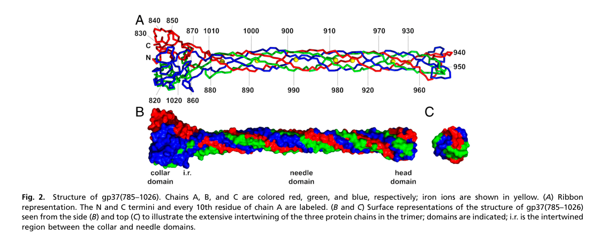

## Question

# Gene Research for Functional Annotation

## ⚠️ CRITICAL: Gene/Protein Identification Context

**BEFORE YOU BEGIN RESEARCH:** You MUST verify you are researching the CORRECT gene/protein. Gene symbols can be ambiguous, especially for less well-characterized genes from non-model organisms.

### Target Gene/Protein Identity (from UniProt):
- **UniProt Accession:** P03744
- **Protein Description:** RecName: Full=Long-tail fiber protein gp37; AltName: Full=Gene product 37 {ECO:0000305}; Short=gp37; AltName: Full=Receptor-recognizing protein;
- **Gene Information:** Name=37;
- **Organism (full):** Enterobacteria phage T4 (Bacteriophage T4).
- **Protein Family:** Belongs to the tail fiber family. .
- **Key Domains:** Gp34_trimer. (IPR048390); Phage_lambda_Stf-r1. (IPR005003); Phage_tail_collar_dom. (IPR011083); Phage_tail_collar_dom_sf. (IPR037053); Phage_Tail_Fiber_Structural. (IPR051934)

### MANDATORY VERIFICATION STEPS:

1. **Check if the gene symbol "37" matches the protein description above**
2. **Verify the organism is correct:** Enterobacteria phage T4 (Bacteriophage T4).
3. **Check if protein family/domains align with what you find in literature**
4. **If you find literature for a DIFFERENT gene with the same or similar symbol, STOP**

### If Gene Symbol is Ambiguous or You Cannot Find Relevant Literature:

**DO NOT PROCEED WITH RESEARCH ON A DIFFERENT GENE.** Instead:
- State clearly: "The gene symbol '37' is ambiguous or literature is limited for this specific protein"
- Explain what you found (e.g., "Found extensive literature on a different gene with the same symbol in a different organism")
- Describe the protein based ONLY on the UniProt information provided above
- Suggest that the protein function can be inferred from domain/family information

### Research Target:

Please provide a comprehensive research report on the gene **37** (gene ID: 37, UniProt: P03744) in BPT4.

The research report should be a detailed narrative explaining the function, biological processes, and localization of the gene product. Citations should be given for all claims.

You should prioritize authoritative reviews and primary scientific literature when conducting research. You can supplement
this with annotations you find in gene/protein databases, but these can be outdated or inaccurate.

We are specifically interested in the primary function of the gene - for enzymes, what reaction is catalyzed, and what is the substrate specificity? For transporters, what is the substrate? For structural proteins or adapters, what is the broader structural role? For signaling molecules, what is the role in the pathway.

We are interested in where in or outside the cell the gene product carries out its function.

We are also interested in the signaling or biochemical pathways in which the gene functions. We are less interested in broad pleiotropic effects, except where these elucidate the precise role.

Include evidence where possible. We are interested in both experimental evidence as well as inference from structure, evolution, or bioinformatic analysis. Precise studies should be prioritized over high-throughput, where available.

## Output

Question: You are an expert researcher providing comprehensive, well-cited information.

Provide detailed information focusing on:
1. Key concepts and definitions with current understanding
2. Recent developments and latest research (prioritize 2023-2024 sources)
3. Current applications and real-world implementations
4. Expert opinions and analysis from authoritative sources
5. Relevant statistics and data from recent studies

Format as a comprehensive research report with proper citations. Include URLs and publication dates where available.
Always prioritize recent, authoritative sources and provide specific citations for all major claims.

# Gene Research for Functional Annotation

## ⚠️ CRITICAL: Gene/Protein Identification Context

**BEFORE YOU BEGIN RESEARCH:** You MUST verify you are researching the CORRECT gene/protein. Gene symbols can be ambiguous, especially for less well-characterized genes from non-model organisms.

### Target Gene/Protein Identity (from UniProt):
- **UniProt Accession:** P03744
- **Protein Description:** RecName: Full=Long-tail fiber protein gp37; AltName: Full=Gene product 37 {ECO:0000305}; Short=gp37; AltName: Full=Receptor-recognizing protein;
- **Gene Information:** Name=37;
- **Organism (full):** Enterobacteria phage T4 (Bacteriophage T4).
- **Protein Family:** Belongs to the tail fiber family. .
- **Key Domains:** Gp34_trimer. (IPR048390); Phage_lambda_Stf-r1. (IPR005003); Phage_tail_collar_dom. (IPR011083); Phage_tail_collar_dom_sf. (IPR037053); Phage_Tail_Fiber_Structural. (IPR051934)

### MANDATORY VERIFICATION STEPS:

1. **Check if the gene symbol "37" matches the protein description above**
2. **Verify the organism is correct:** Enterobacteria phage T4 (Bacteriophage T4).
3. **Check if protein family/domains align with what you find in literature**
4. **If you find literature for a DIFFERENT gene with the same or similar symbol, STOP**

### If Gene Symbol is Ambiguous or You Cannot Find Relevant Literature:

**DO NOT PROCEED WITH RESEARCH ON A DIFFERENT GENE.** Instead:
- State clearly: "The gene symbol '37' is ambiguous or literature is limited for this specific protein"
- Explain what you found (e.g., "Found extensive literature on a different gene with the same symbol in a different organism")
- Describe the protein based ONLY on the UniProt information provided above
- Suggest that the protein function can be inferred from domain/family information

### Research Target:

Please provide a comprehensive research report on the gene **37** (gene ID: 37, UniProt: P03744) in BPT4.

The research report should be a detailed narrative explaining the function, biological processes, and localization of the gene product. Citations should be given for all claims.

You should prioritize authoritative reviews and primary scientific literature when conducting research. You can supplement
this with annotations you find in gene/protein databases, but these can be outdated or inaccurate.

We are specifically interested in the primary function of the gene - for enzymes, what reaction is catalyzed, and what is the substrate specificity? For transporters, what is the substrate? For structural proteins or adapters, what is the broader structural role? For signaling molecules, what is the role in the pathway.

We are interested in where in or outside the cell the gene product carries out its function.

We are also interested in the signaling or biochemical pathways in which the gene functions. We are less interested in broad pleiotropic effects, except where these elucidate the precise role.

Include evidence where possible. We are interested in both experimental evidence as well as inference from structure, evolution, or bioinformatic analysis. Precise studies should be prioritized over high-throughput, where available.

## Research Report: Functional Annotation of Enterobacteria phage T4 gene 37 (gp37; UniProt P03744)

### 1) Mandatory verification: correct gene/protein identity
The literature retrieved matches the UniProt identity provided: **UniProt P03744** is explicitly linked to **bacteriophage T4 long tail fiber protein gp37** (gene product 37), described as the **receptor-binding distal tip** of the long tail fiber. This direct mapping appears in the primary structural biology paper that solved the receptor-binding tip structure and refers to “UniProt code P03744” for T4 gp37. (bartual2010structureofthe pages 3-5, bartual2010structureofthe media 795df93b)

### 2) Key concepts and definitions (current understanding)

#### 2.1 What gp37 is
T4 gp37 is a **virion structural protein** that forms the **distal half** of the bacteriophage T4 long tail fiber (LTF) and provides the **receptor-recognizing “foot/tip”** used for initial host contact. gp37 is not an enzyme; its primary function is **mechanical/structural receptor recognition** and transmission of adsorption cues into the infection nanomachine. (leiman2010morphogenesisofthe pages 21-22, mourosi2022understandingbacteriophagetail pages 2-4)

Key definitions used in the T4 adsorption literature:
- **Long tail fibers (LTFs):** primary, **reversible** host-recognition fibers (six per virion) that “search” the bacterial surface before irreversible steps of infection. (mourosi2022understandingbacteriophagetail pages 9-11, mesyanzhinov2004moleculararchitectureof pages 4-5)
- **Receptor-binding domain (RBD)/tip:** the **extreme C-terminal region** of gp37 that directly engages host receptors such as LPS and OmpC. (mourosi2022understandingbacteriophagetail pages 2-4, leiman2010morphogenesisofthe pages 21-22)

#### 2.2 Where gp37 is located (localization)
gp37 is located on the **outer surface of the mature virion**, within each of the **six LTFs** anchored around the baseplate. Cryo-electron tomography indicates many infective particles carry LTFs in a folded (retracted) conformation, with distal domains (including the gp37 tip region) contacting capsid features, consistent with a regulated deployment mechanism. (hu2015structuralremodelingof pages 1-3)

### 3) Structure, domains, and molecular mechanism

#### 3.1 Size, oligomerization, and stoichiometry
Across T4-focused reviews, gp37 is consistently described as **1026 amino acids** (~**109 kDa**) and assembling as a **homotrimer** as part of the distal half-fiber. The canonical LTF composition and stoichiometry are **gp34:gp35:gp36:gp37 = 3:1:3:3**. (mourosi2022understandingbacteriophagetail pages 2-4, leiman2010morphogenesisofthe pages 21-22, leiman2010morphogenesisofthe pages 2-5)

#### 3.2 Domain architecture of the receptor-binding tip
The best-characterized region of gp37 is the **C-terminal receptor-binding tip**, solved by X-ray crystallography (PDB **2XGF**). The structure describes an interwoven trimeric architecture with functionally distinct subregions:
- **Collar domain:** residues ~**811–860** and **1016–1026** (trimeric collar). (bartual2010structureofthe pages 2-2)
- **Needle/stem domain:** residues ~**881–933** and **960–1008/1009**, forming an elongated β-structured “needle” about **150 Å** long. (bartual2010structureofthe pages 2-2, bartual2010structureofthe pages 2-3)
- **Distal head/tip:** compact region near residues ~**934–959** (also described as tip **932–959**), implicated as the main receptor-interaction module. (bartual2010structureofthe pages 2-2, mourosi2022understandingbacteriophagetail pages 2-4)

A striking feature of the needle is the presence of **multiple His–X–His motifs** coordinating **seven iron ions** along the fiber axis, likely stabilizing the fold and conferring mechanical rigidity needed for adsorption signaling. (bartual2010structureofthe pages 2-2, bartual2010structureofthe pages 1-2)

#### 3.3 Host receptors and specificity
gp37-containing LTFs are described as key **host-range determinants**, interacting **reversibly** with two canonical E. coli receptor types:
- **Lipopolysaccharide (LPS)** on E. coli B strains (rough LPS features are critical; O-antigen can inhibit adsorption). (leiman2010morphogenesisofthe pages 21-22, mourosi2022understandingbacteriophagetail pages 4-6)
- **Outer membrane porin OmpC** on E. coli K-12 strains, where structural docking places the gp37 head inside the OmpC extracellular cavity. (bartual2010structureofthe pages 3-5, mourosi2022understandingbacteriophagetail pages 7-9)

#### 3.4 Binding mechanics and biophysical data
A modern mechanistic model emphasizes that gp37 tip–receptor interactions are **weak, multivalent, and dynamic**, enabling surface “walking” (repeated association/dissociation) to locate productive infection sites rather than “locking” immediately.

Quantitative data from single-molecule force measurements (AFM) report interaction forces of approximately **70 ± 29 pN** for host LPS versus **46 ± 13 pN** for non-host LPS, supporting the concept of relatively weak but efficient reversible adhesion. (mourosi2022understandingbacteriophagetail pages 7-9)

A further nuance is that **stronger binding does not necessarily improve infection**: specific tip mutations (e.g., **I933A, N937A, G938A**) were reported to increase static OmpC binding (2–3×) yet abolish infectivity in the summarized literature, implying that lateral mobility and correct multi-fiber engagement are mechanistically important. (mourosi2022understandingbacteriophagetail pages 9-11)

### 4) Assembly pathway and required accessory proteins
T4 LTFs are built from multiple gene products, and gp37 assembly is chaperone-dependent:
- The distal half-fiber involves **gp36 + gp37** (both trimeric), with gp36 binding the N-terminus of gp37 during assembly. (leiman2010morphogenesisofthe pages 21-22)
- Proper folding/trimerization of gp37 requires phage-encoded chaperones: **gp57A** (supports trimerization of gp34 and gp37) and **gp38** (specifically required for correct gp37 folding/assembly in classic T4). (leiman2010morphogenesisofthe pages 21-22, mourosi2022understandingbacteriophagetail pages 2-4)
- Soluble gp37 has been obtained by **co-expression of gp37 with gp57A and gp38**, and some C-terminal coiled-coil extensions can partially bypass gp38 dependence (indicating a tight relationship between gp37’s C-terminus and its maturation pathway). (leiman2010morphogenesisofthe pages 22-25)

### 5) Role in infection initiation and pathways/processes

#### 5.1 Infection sequence context
Reviews describe T4 LTFs as the **primary reversible sensors**. Upon appropriate receptor engagement, a mechanical signal is transmitted to the baseplate, enabling subsequent irreversible steps: deployment/engagement of short tail fibers, baseplate rearrangements, sheath contraction, and genome injection. (mourosi2022understandingbacteriophagetail pages 9-11, leiman2010morphogenesisofthe pages 22-25)

#### 5.2 Cooperative engagement and conformational states
A consistent expert model is that productive adsorption is **cooperative**: at least **three LTFs** are typically required for infectivity/orientation of the virion on the cell, and LTFs exist in a spontaneous **retracted↔extended equilibrium** in which many particles carry several retracted fibers. (leiman2010morphogenesisofthe pages 21-22, mourosi2022understandingbacteriophagetail pages 9-11)

### 6) Recent developments and latest research (prioritize 2023–2024)

#### 6.1 2024 engineering-focused synthesis (authoritative review)
A 2024 **Chemical Reviews** article on engineering phages highlights tail fibers/RBPs as the dominant knobs for host-range control and summarizes gp37-specific findings:
- Key adsorption-contact mapping includes **OmpC residues P177 and F182** and **T4 gp37 positions 937 and 942**. (peng2024engineeringphagesto pages 12-14)
- A **T4 gp37 distal-tip mutant library** was constructed and selected for mutants able to **adsorb to alternative receptors**, including **E. coli O157 OmpC** and **E. coli K12 LPS**—a direct example of gp37-centric host-range engineering. (peng2024engineeringphagesto pages 12-14)
- The review emphasizes a key engineering caution: **binding ≠ infectivity**, which is critical when translating receptor-binding changes into therapeutic phages; conversely, “binding only” can still be useful for biosensing. (peng2024engineeringphagesto pages 14-15)

Publication details: Peng et al., *Chemical Reviews* (December 2024), https://doi.org/10.1021/acs.chemrev.4c00681 (peng2024engineeringphagesto pages 12-14)

#### 6.2 2023 primary research on a T4-like LTF as an application-relevant homolog
A 2023 experimental study characterized a **T-even/S16-like myovirus** (CkP1) where the long tail fiber (gp267; gp37-like functional role in a T4-like tail-fiber system) binds its host receptor:
- CkP1 long tail fiber binds **Citrobacter koseri LPS** with reported **nanomolar affinity**.
- CkP1 infected **all tested C. koseri strains**, and both phage and isolated tail fiber were proposed for **treatment or detection** of the pathogen. (oliveira2023ckp1bacteriophagea pages 1-2)

Publication details: Oliveira et al., *Applied Microbiology and Biotechnology* (May 2023), https://doi.org/10.1007/s00253-023-12547-8 (oliveira2023ckp1bacteriophagea pages 1-2)

#### 6.3 2024 biosensing synthesis (authoritative review)
A 2024 **Annual Review of Analytical Chemistry** article highlights tail fibers/RBPs as central biorecognition modules for biosensors and notes feasibility of recombinant production of T4 components (including gp37) for assay integration. (parker2024bacteriophagebasedbioanalysis pages 16-18)

Publication details: Parker & Nugen, *Annual Review of Analytical Chemistry* (July 2024), https://doi.org/10.1146/annurev-anchem-071323-084224 (parker2024bacteriophagebasedbioanalysis pages 16-18)

### 7) Current applications and real-world implementations

#### 7.1 Host-range engineering for antimicrobial use
Current engineering consensus emphasizes modifying distal RBPs/tail fibers (including gp37 distal tip) to broaden or redirect host range—either by focused mutagenesis libraries and selection or by domain swapping—while preserving assembly constraints and downstream infection competence. gp37 is repeatedly cited as an archetypal system for this strategy. (peng2024engineeringphagesto pages 12-14)

#### 7.2 Biosensors and detection (binding-only use cases)
For biosensing, isolated tail fibers or RBPs can be immobilized to capture bacteria without necessarily lysing the target (a practical advantage). Reviews explicitly note that engineered RBPs that bind but do not propagate may still be valuable for sensing. (parker2024bacteriophagebasedbioanalysis pages 3-4, peng2024engineeringphagesto pages 14-15)

The 2024 Chemical Reviews synthesis also provides quantitative context for tail-fiber/RBP biosensing in general (not gp37-specific): a tail-fiber-based magnetic bead capture assay is described with LOD **10^2 CFU/mL** (T7 example), and other engineered reporter formats report LOD as low as **33 CFU/mL** (not gp37-specific). These values show the achievable performance envelope of RBP-based capture/reporting systems even when gp37-specific LODs are not reported in the retrieved excerpts. (peng2024engineeringphagesto pages 20-21)

### 8) Expert opinions and analysis (authoritative synthesis)
Across mechanistic reviews and 2024 engineering/bioanalysis syntheses, a consistent expert view is:
1. **gp37 distal tip is the key host-range determinant** for T4 LTF-mediated reversible adsorption. (mourosi2022understandingbacteriophagetail pages 2-4, matthew2021reprogrammingbacteriophagehost pages 2-4)
2. **Dynamic, weak interactions are functional**: the ‘touch-and-search’ model predicts that overly strong binding can reduce infection success by limiting lateral exploration and/or correct mechanical signaling. (mourosi2022understandingbacteriophagetail pages 9-11)
3. **Engineering must preserve more than binding**: chimeras can bind but fail to infect; successful redesign requires compatibility with assembly, conformational triggering, and genome delivery. (peng2024engineeringphagesto pages 14-15, leiman2010morphogenesisofthe pages 22-25)
4. **Chaperone/assembly constraints are real** for gp37 and must be incorporated into recombinant expression and library design (gp57A/gp38 dependence). (leiman2010morphogenesisofthe pages 22-25, mourosi2022understandingbacteriophagetail pages 2-4)

### 9) Summary table of functional annotation
The following evidence-linked table summarizes current knowledge, quantitative data, and recent developments.

| Aspect | What is known / current understanding | Key evidence & quantitative details | Key sources (with year) |
|---|---|---|---|
| Identity mapping to UniProt | Target is correctly identified as Enterobacteria phage T4 long-tail fiber protein gp37, the distal receptor-recognizing component of the long tail fiber; Bartual et al. explicitly link T4 gp37 to UniProt P03744. | PNAS structure paper states T4 gp37 corresponds to UniProt code **P03744** and solves the receptor-binding tip structure of gp37(785–1026); reviews independently describe gp37 as the distal “foot”/tip of the LTF. | Bartual et al., 2010; Leiman et al., 2010 (bartual2010structureofthe pages 3-5, bartual2010structureofthe media 795df93b, leiman2010morphogenesisofthe pages 21-22) |
| Protein size / oligomerization | gp37 is a large structural tail-fiber protein that forms a **homotrimer** and constitutes most of the distal half-fiber. | Size is consistently reported as **1026 aa**, about **109 kDa** per subunit; three gp37 chains per long tail fiber; LTF stoichiometry overall is **gp34:gp35:gp36:gp37 = 3:1:3:3**. | Mourosi et al., 2022; Leiman et al., 2010 (mourosi2022understandingbacteriophagetail pages 2-4, leiman2010morphogenesisofthe pages 21-22, leiman2010morphogenesisofthe pages 2-5) |
| Virion localization / stoichiometry | gp37 is located in the **distal half** of each of the six T4 long tail fibers, distal to gp36 and farthest from the baseplate, where it forms the receptor-binding tip. | T4 has **6 LTFs** anchored around the baseplate; mature infective particles often carry LTFs folded back against the sheath/capsid; in cryo-ET, D10–D11/gp37 tip density contacts the capsid in the retracted state. | Hu et al., 2015; Leiman et al., 2010; Arisaka et al., 2016 (hu2015structuralremodelingof pages 1-3, leiman2010morphogenesisofthe pages 21-22, arisaka2016molecularassemblyand pages 2-4) |
| Domain architecture / residue ranges | The best-resolved region is the C-terminal receptor-binding segment, organized into **collar, needle/stem, and head/tip** domains. The overall tip framework is conserved, while the distal head is more variable and likely determines specificity. | Crystal structure of gp37 tip (**PDB 2XGF**) covers roughly **residues 811–1026**. Collar: **811–860 and 1016–1026**; needle/stem: **881–933 and 960–1008/1009**; compact head/tip: **934–959 / 932–959**. Receptor-binding region proposed around **907–996**. | Bartual et al., 2010; Mourosi et al., 2022 (bartual2010structureofthe pages 2-2, bartual2010structureofthe pages 1-2, bartual2010structureofthe pages 2-3, mourosi2022understandingbacteriophagetail pages 2-4) |
| Receptor specificity | gp37 mediates **primary, reversible adsorption** to host receptors and is a major determinant of T4 host range. Canonical receptors are **rough LPS** on E. coli B and **OmpC** on E. coli K-12. | Reviews and structural work identify the distal C-terminus/tip as the receptor-binding domain. OmpC residues **P177** and **F182** are key for interaction; LPS recognition depends on terminal glucose features in rough LPS. | Bartual et al., 2010; Leiman et al., 2010; Mourosi et al., 2022 (bartual2010structureofthe pages 3-5, leiman2010morphogenesisofthe pages 21-22, mourosi2022understandingbacteriophagetail pages 2-4, mourosi2022understandingbacteriophagetail pages 9-11, mourosi2022understandingbacteriophagetail pages 4-6) |
| Binding mechanics / biophysics | Binding is **weak, multivalent, and dynamic**, enabling a “touch-and-search” or surface “walking” mechanism rather than immediate irreversible locking. Excessively tight binding can reduce infectivity. | AFM-measured interaction forces for T4 tip with host vs non-host LPS were about **70 ± 29 pN** vs **46 ± 13 pN**; some gp37 tip mutants (**I933A, N937A, G938A**) increased OmpC binding **2–3-fold** yet abolished infectivity, implying that lateral mobility and correct binding dynamics matter. | Mourosi et al., 2022 (mourosi2022understandingbacteriophagetail pages 7-9, mourosi2022understandingbacteriophagetail pages 9-11) |
| Structural stabilization features | The distal tip is unusually rigid and stable, likely because of **multiple Fe-bound His-X-His motifs** running along the needle axis. | Seven iron sites are coordinated by histidine doublets including **His-883/885, 915/917, 929/931, 966/968, 980/982, 989/991, 998/1000**; the needle is ~**150 Å** long. Aromatic/basic residues such as **W936, Y949, Y953, K945, R954** are candidate receptor-contact residues. | Bartual et al., 2010 (bartual2010structureofthe pages 2-2, bartual2010structureofthe pages 3-5, bartual2010structureofthe pages 1-2) |
| Assembly / chaperones | Correct gp37 folding and trimerization require phage-encoded chaperones, especially **gp57A** and **gp38**; gp37 assembles with gp36 to form the distal half-fiber. | Reviews state gp57A is required for correct trimerization of gp34 and gp37, while gp38 is specifically required for gp37 folding/assembly. Co-expression of **gp37 + gp57A + gp38** yields soluble folded gp37; some C-terminal extensions can bypass gp38 dependence. | Leiman et al., 2010; Mourosi et al., 2022; Arisaka et al., 2016 (mourosi2022understandingbacteriophagetail pages 2-4, leiman2010morphogenesisofthe pages 21-22, leiman2010morphogenesisofthe pages 22-25, arisaka2016molecularassemblyand pages 2-4) |
| Role in infection triggering | gp37 does not just bind receptors; its engagement helps transmit a **mechanical signal** from the LTF to the baseplate, promoting short-tail-fiber deployment, irreversible attachment, sheath contraction, and DNA injection. | Productive infection usually requires **≥3 LTFs** engaged/oriented toward the cell. LTFs cycle between retracted and extended states; receptor recognition by gp37-containing fibers contributes to baseplate transition from metastable to activated states. | Leiman et al., 2010; Hu et al., 2015; Mourosi et al., 2022 (leiman2010morphogenesisofthe pages 21-22, mourosi2022understandingbacteriophagetail pages 9-11, leiman2010morphogenesisofthe pages 22-25, hu2015structuralremodelingof pages 1-3) |
| Recent developments (2023–2024) | Recent work emphasizes gp37 and gp37-like distal tips as **engineering targets** and as archetypes for understanding T4-like myovirus host recognition. | 2024 Chemical Reviews summarizes T4 gp37 distal-tip mutant libraries and identifies adsorption-critical positions including gp37 **937** and **942**; selected mutants adsorbed to alternative receptors such as **E. coli O157 OmpC** and **E. coli K12 LPS**. 2023 CkP1 study shows a T4-like/S16-like LTF binds LPS with **nanomolar affinity** and recognizes all tested C. koseri strains. | Peng et al., 2024; Oliveira et al., 2023 (peng2024engineeringphagesto pages 12-14, oliveira2023ckp1bacteriophagea pages 1-2) |
| Applications: engineering & biosensors | gp37/gp37-like LTF tips are used or proposed as modules for **host-range reprogramming**, **phage therapy optimization**, and **bacterial detection**. For diagnostics, binding alone can be useful even when productive infection is not. | 2024 reviews note T4 gp37 as an engineered RBP targeting **E. coli/OmpC** and emphasize that **binding ≠ infectivity** for therapeutic redesign. Recombinant gp37 has been produced with a two-chaperone system; isolated tail fibers can serve as capture reagents. General phage-RBP biosensor literature cited in 2024 reports tail-fiber-based detection down to **10^2 CFU/mL** and reporter-phage formats as low as **33 CFU/mL**, though these LODs are not T4-gp37-specific. | Peng et al., 2024; Parker & Nugen, 2024; Oliveira et al., 2023 (peng2024engineeringphagesto pages 14-15, parker2024bacteriophagebasedbioanalysis pages 16-18, parker2024bacteriophagebasedbioanalysis pages 3-4, peng2024engineeringphagesto pages 20-21, oliveira2023ckp1bacteriophagea pages 1-2) |

*Table: This table condenses the main functional, structural, mechanistic, and application-focused findings for Enterobacteria phage T4 gp37 (UniProt P03744). It is designed as a quick reference linking current understanding to specific evidence and recent sources.*

### 10) Notes on evidence limitations
Some 2023–2024 sources retrieved are high-level reviews that summarize gp37 engineering and biosensor use but do not reproduce primary quantitative outcomes (e.g., exact KD values for engineered gp37 variants, EOP values, or diagnostic LODs for gp37 itself). Where such details were absent in the retrieved excerpts, this report reports the general conclusions and clearly labels which quantitative results are from T4 gp37 single-molecule measurements versus general tail-fiber biosensor examples. (peng2024engineeringphagesto pages 20-21, parker2024bacteriophagebasedbioanalysis pages 16-18)

### Key source URLs (publication dates)
- Bartual et al. 2010-11 (PNAS): https://doi.org/10.1073/pnas.1011218107 (bartual2010structureofthe pages 3-5)
- Hu et al. 2015-08 (PNAS): https://doi.org/10.1073/pnas.1501064112 (hu2015structuralremodelingof pages 1-3)
- Leiman et al. 2010-12 (Virology Journal): https://doi.org/10.1186/1743-422x-7-355 (leiman2010morphogenesisofthe pages 21-22)
- Mourosi et al. 2022-10 (IJMS): https://doi.org/10.3390/ijms232012146 (mourosi2022understandingbacteriophagetail pages 2-4)
- Oliveira et al. 2023-05 (Appl Microbiol Biotechnol): https://doi.org/10.1007/s00253-023-12547-8 (oliveira2023ckp1bacteriophagea pages 1-2)
- Parker & Nugen 2024-07 (Annu Rev Anal Chem): https://doi.org/10.1146/annurev-anchem-071323-084224 (parker2024bacteriophagebasedbioanalysis pages 16-18)
- Peng et al. 2024-12 (Chemical Reviews): https://doi.org/10.1021/acs.chemrev.4c00681 (peng2024engineeringphagesto pages 12-14)

References

1. (bartual2010structureofthe pages 3-5): Sergio G. Bartual, José M. Otero, Carmela Garcia-Doval, Antonio L. Llamas-Saiz, Richard Kahn, Gavin C. Fox, and Mark J. van Raaij. Structure of the bacteriophage t4 long tail fiber receptor-binding tip. Proceedings of the National Academy of Sciences, 107:20287-20292, Nov 2010. URL: https://doi.org/10.1073/pnas.1011218107, doi:10.1073/pnas.1011218107. This article has 273 citations and is from a highest quality peer-reviewed journal.

2. (bartual2010structureofthe media 795df93b): Sergio G. Bartual, José M. Otero, Carmela Garcia-Doval, Antonio L. Llamas-Saiz, Richard Kahn, Gavin C. Fox, and Mark J. van Raaij. Structure of the bacteriophage t4 long tail fiber receptor-binding tip. Proceedings of the National Academy of Sciences, 107:20287-20292, Nov 2010. URL: https://doi.org/10.1073/pnas.1011218107, doi:10.1073/pnas.1011218107. This article has 273 citations and is from a highest quality peer-reviewed journal.

3. (leiman2010morphogenesisofthe pages 21-22): Petr G Leiman, Fumio Arisaka, Mark J van Raaij, Victor A Kostyuchenko, Anastasia A Aksyuk, Shuji Kanamaru, and Michael G Rossmann. Morphogenesis of the t4 tail and tail fibers. Virology Journal, 7:355-355, Dec 2010. URL: https://doi.org/10.1186/1743-422x-7-355, doi:10.1186/1743-422x-7-355. This article has 319 citations and is from a peer-reviewed journal.

4. (mourosi2022understandingbacteriophagetail pages 2-4): Jarin Taslem Mourosi, Ayobami I. Awe, Wenzheng Guo, Himanshu Batra, Harrish Ganesh, Xiaorong Wu, and Jingen Zhu. Understanding bacteriophage tail fiber interaction with host surface receptor: the key “blueprint” for reprogramming phage host range. International Journal of Molecular Sciences, 23:12146, Oct 2022. URL: https://doi.org/10.3390/ijms232012146, doi:10.3390/ijms232012146. This article has 193 citations.

5. (mourosi2022understandingbacteriophagetail pages 9-11): Jarin Taslem Mourosi, Ayobami I. Awe, Wenzheng Guo, Himanshu Batra, Harrish Ganesh, Xiaorong Wu, and Jingen Zhu. Understanding bacteriophage tail fiber interaction with host surface receptor: the key “blueprint” for reprogramming phage host range. International Journal of Molecular Sciences, 23:12146, Oct 2022. URL: https://doi.org/10.3390/ijms232012146, doi:10.3390/ijms232012146. This article has 193 citations.

6. (mesyanzhinov2004moleculararchitectureof pages 4-5): V. V. Mesyanzhinov, P. G. Leiman, V. A. Kostyuchenko, L. P. Kurochkina, K. A. Miroshnikov, N. N. Sykilinda, and M. M. Shneider. Molecular architecture of bacteriophage t4. Biochemistry (Moscow), 69:1190-1202, Nov 2004. URL: https://doi.org/10.1007/pl00021751, doi:10.1007/pl00021751. This article has 61 citations.

7. (hu2015structuralremodelingof pages 1-3): Bo Hu, William Margolin, Ian J. Molineux, and Jun Liu. Structural remodeling of bacteriophage t4 and host membranes during infection initiation. Proceedings of the National Academy of Sciences, 112:E4919-E4928, Aug 2015. URL: https://doi.org/10.1073/pnas.1501064112, doi:10.1073/pnas.1501064112. This article has 317 citations and is from a highest quality peer-reviewed journal.

8. (leiman2010morphogenesisofthe pages 2-5): Petr G Leiman, Fumio Arisaka, Mark J van Raaij, Victor A Kostyuchenko, Anastasia A Aksyuk, Shuji Kanamaru, and Michael G Rossmann. Morphogenesis of the t4 tail and tail fibers. Virology Journal, 7:355-355, Dec 2010. URL: https://doi.org/10.1186/1743-422x-7-355, doi:10.1186/1743-422x-7-355. This article has 319 citations and is from a peer-reviewed journal.

9. (bartual2010structureofthe pages 2-2): Sergio G. Bartual, José M. Otero, Carmela Garcia-Doval, Antonio L. Llamas-Saiz, Richard Kahn, Gavin C. Fox, and Mark J. van Raaij. Structure of the bacteriophage t4 long tail fiber receptor-binding tip. Proceedings of the National Academy of Sciences, 107:20287-20292, Nov 2010. URL: https://doi.org/10.1073/pnas.1011218107, doi:10.1073/pnas.1011218107. This article has 273 citations and is from a highest quality peer-reviewed journal.

10. (bartual2010structureofthe pages 2-3): Sergio G. Bartual, José M. Otero, Carmela Garcia-Doval, Antonio L. Llamas-Saiz, Richard Kahn, Gavin C. Fox, and Mark J. van Raaij. Structure of the bacteriophage t4 long tail fiber receptor-binding tip. Proceedings of the National Academy of Sciences, 107:20287-20292, Nov 2010. URL: https://doi.org/10.1073/pnas.1011218107, doi:10.1073/pnas.1011218107. This article has 273 citations and is from a highest quality peer-reviewed journal.

11. (bartual2010structureofthe pages 1-2): Sergio G. Bartual, José M. Otero, Carmela Garcia-Doval, Antonio L. Llamas-Saiz, Richard Kahn, Gavin C. Fox, and Mark J. van Raaij. Structure of the bacteriophage t4 long tail fiber receptor-binding tip. Proceedings of the National Academy of Sciences, 107:20287-20292, Nov 2010. URL: https://doi.org/10.1073/pnas.1011218107, doi:10.1073/pnas.1011218107. This article has 273 citations and is from a highest quality peer-reviewed journal.

12. (mourosi2022understandingbacteriophagetail pages 4-6): Jarin Taslem Mourosi, Ayobami I. Awe, Wenzheng Guo, Himanshu Batra, Harrish Ganesh, Xiaorong Wu, and Jingen Zhu. Understanding bacteriophage tail fiber interaction with host surface receptor: the key “blueprint” for reprogramming phage host range. International Journal of Molecular Sciences, 23:12146, Oct 2022. URL: https://doi.org/10.3390/ijms232012146, doi:10.3390/ijms232012146. This article has 193 citations.

13. (mourosi2022understandingbacteriophagetail pages 7-9): Jarin Taslem Mourosi, Ayobami I. Awe, Wenzheng Guo, Himanshu Batra, Harrish Ganesh, Xiaorong Wu, and Jingen Zhu. Understanding bacteriophage tail fiber interaction with host surface receptor: the key “blueprint” for reprogramming phage host range. International Journal of Molecular Sciences, 23:12146, Oct 2022. URL: https://doi.org/10.3390/ijms232012146, doi:10.3390/ijms232012146. This article has 193 citations.

14. (leiman2010morphogenesisofthe pages 22-25): Petr G Leiman, Fumio Arisaka, Mark J van Raaij, Victor A Kostyuchenko, Anastasia A Aksyuk, Shuji Kanamaru, and Michael G Rossmann. Morphogenesis of the t4 tail and tail fibers. Virology Journal, 7:355-355, Dec 2010. URL: https://doi.org/10.1186/1743-422x-7-355, doi:10.1186/1743-422x-7-355. This article has 319 citations and is from a peer-reviewed journal.

15. (peng2024engineeringphagesto pages 12-14): Huan Peng, Irene A. Chen, and Udi Qimron. Engineering phages to fight multidrug-resistant bacteria. Chemical Reviews, 125:933-971, Dec 2024. URL: https://doi.org/10.1021/acs.chemrev.4c00681, doi:10.1021/acs.chemrev.4c00681. This article has 91 citations and is from a highest quality peer-reviewed journal.

16. (peng2024engineeringphagesto pages 14-15): Huan Peng, Irene A. Chen, and Udi Qimron. Engineering phages to fight multidrug-resistant bacteria. Chemical Reviews, 125:933-971, Dec 2024. URL: https://doi.org/10.1021/acs.chemrev.4c00681, doi:10.1021/acs.chemrev.4c00681. This article has 91 citations and is from a highest quality peer-reviewed journal.

17. (oliveira2023ckp1bacteriophagea pages 1-2): Hugo Oliveira, Sílvio Santos, Diana P. Pires, Dimitri Boeckaerts, Graça Pinto, Rita Domingues, Jennifer Otero, Yves Briers, Rob Lavigne, Mathias Schmelcher, Andreas Dötsch, and Joana Azeredo. Ckp1 bacteriophage, a s16-like myovirus that recognizes citrobacter koseri lipopolysaccharide through its long tail fibers. Applied Microbiology and Biotechnology, 107:3621-3636, May 2023. URL: https://doi.org/10.1007/s00253-023-12547-8, doi:10.1007/s00253-023-12547-8. This article has 4 citations and is from a domain leading peer-reviewed journal.

18. (parker2024bacteriophagebasedbioanalysis pages 16-18): David R. Parker and Sam R. Nugen. Bacteriophage-based bioanalysis. Jul 2024. URL: https://doi.org/10.1146/annurev-anchem-071323-084224, doi:10.1146/annurev-anchem-071323-084224. This article has 10 citations and is from a peer-reviewed journal.

19. (parker2024bacteriophagebasedbioanalysis pages 3-4): David R. Parker and Sam R. Nugen. Bacteriophage-based bioanalysis. Jul 2024. URL: https://doi.org/10.1146/annurev-anchem-071323-084224, doi:10.1146/annurev-anchem-071323-084224. This article has 10 citations and is from a peer-reviewed journal.

20. (peng2024engineeringphagesto pages 20-21): Huan Peng, Irene A. Chen, and Udi Qimron. Engineering phages to fight multidrug-resistant bacteria. Chemical Reviews, 125:933-971, Dec 2024. URL: https://doi.org/10.1021/acs.chemrev.4c00681, doi:10.1021/acs.chemrev.4c00681. This article has 91 citations and is from a highest quality peer-reviewed journal.

21. (matthew2021reprogrammingbacteriophagehost pages 2-4): Matthew Dunne, Nikolai S. Prokhorov, Martin J. Loessner, and Petr G. Leiman. Reprogramming bacteriophage host range: design principles and strategies for engineering receptor binding proteins. Current opinion in biotechnology, 68:272-281, Mar 2021. URL: https://doi.org/10.1016/j.copbio.2021.02.006, doi:10.1016/j.copbio.2021.02.006. This article has 169 citations and is from a peer-reviewed journal.

22. (arisaka2016molecularassemblyand pages 2-4): Fumio Arisaka, Moh Lan Yap, Shuji Kanamaru, and Michael G. Rossmann. Molecular assembly and structure of the bacteriophage t4 tail. Biophysical Reviews, 8:385-396, Nov 2016. URL: https://doi.org/10.1007/s12551-016-0230-x, doi:10.1007/s12551-016-0230-x. This article has 55 citations and is from a peer-reviewed journal.

## Artifacts

- [Edison artifact artifact-00](37-deep-research-falcon_artifacts/artifact-00.md)

## Citations

1. hu2015structuralremodelingof pages 1-3
2. bartual2010structureofthe pages 2-2
3. mourosi2022understandingbacteriophagetail pages 7-9
4. mourosi2022understandingbacteriophagetail pages 9-11
5. leiman2010morphogenesisofthe pages 21-22
6. leiman2010morphogenesisofthe pages 22-25
7. peng2024engineeringphagesto pages 12-14
8. peng2024engineeringphagesto pages 14-15
9. parker2024bacteriophagebasedbioanalysis pages 16-18
10. peng2024engineeringphagesto pages 20-21
11. bartual2010structureofthe pages 3-5
12. mourosi2022understandingbacteriophagetail pages 2-4
13. mesyanzhinov2004moleculararchitectureof pages 4-5
14. leiman2010morphogenesisofthe pages 2-5
15. bartual2010structureofthe pages 2-3
16. bartual2010structureofthe pages 1-2
17. mourosi2022understandingbacteriophagetail pages 4-6
18. parker2024bacteriophagebasedbioanalysis pages 3-4
19. matthew2021reprogrammingbacteriophagehost pages 2-4
20. arisaka2016molecularassemblyand pages 2-4
21. https://doi.org/10.1021/acs.chemrev.4c00681
22. https://doi.org/10.1007/s00253-023-12547-8
23. https://doi.org/10.1146/annurev-anchem-071323-084224
24. https://doi.org/10.1073/pnas.1011218107
25. https://doi.org/10.1073/pnas.1501064112
26. https://doi.org/10.1186/1743-422x-7-355
27. https://doi.org/10.3390/ijms232012146
28. https://doi.org/10.1073/pnas.1011218107,
29. https://doi.org/10.1186/1743-422x-7-355,
30. https://doi.org/10.3390/ijms232012146,
31. https://doi.org/10.1007/pl00021751,
32. https://doi.org/10.1073/pnas.1501064112,
33. https://doi.org/10.1021/acs.chemrev.4c00681,
34. https://doi.org/10.1007/s00253-023-12547-8,
35. https://doi.org/10.1146/annurev-anchem-071323-084224,
36. https://doi.org/10.1016/j.copbio.2021.02.006,
37. https://doi.org/10.1007/s12551-016-0230-x,