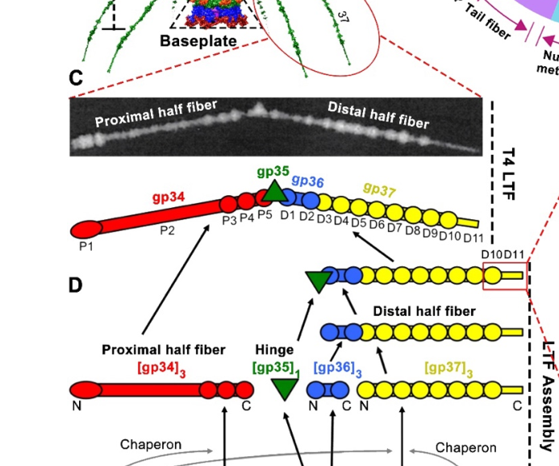

## Question

# Gene Research for Functional Annotation

## ⚠️ CRITICAL: Gene/Protein Identification Context

**BEFORE YOU BEGIN RESEARCH:** You MUST verify you are researching the CORRECT gene/protein. Gene symbols can be ambiguous, especially for less well-characterized genes from non-model organisms.

### Target Gene/Protein Identity (from UniProt):
- **UniProt Accession:** P03739
- **Protein Description:** RecName: Full=Tail fiber assembly protein {ECO:0000305}; AltName: Full=Gene product 38; Short=gp38; AltName: Full=Receptor recognizing protein {ECO:0000305};
- **Gene Information:** Name=38;
- **Organism (full):** Enterobacteria phage T4 (Bacteriophage T4).
- **Protein Family:** Belongs to the tfa family. .
- **Key Domains:** Not specified in UniProt

### MANDATORY VERIFICATION STEPS:

1. **Check if the gene symbol "38" matches the protein description above**
2. **Verify the organism is correct:** Enterobacteria phage T4 (Bacteriophage T4).
3. **Check if protein family/domains align with what you find in literature**
4. **If you find literature for a DIFFERENT gene with the same or similar symbol, STOP**

### If Gene Symbol is Ambiguous or You Cannot Find Relevant Literature:

**DO NOT PROCEED WITH RESEARCH ON A DIFFERENT GENE.** Instead:
- State clearly: "The gene symbol '38' is ambiguous or literature is limited for this specific protein"
- Explain what you found (e.g., "Found extensive literature on a different gene with the same symbol in a different organism")
- Describe the protein based ONLY on the UniProt information provided above
- Suggest that the protein function can be inferred from domain/family information

### Research Target:

Please provide a comprehensive research report on the gene **38** (gene ID: 38, UniProt: P03739) in BPT4.

The research report should be a detailed narrative explaining the function, biological processes, and localization of the gene product. Citations should be given for all claims.

You should prioritize authoritative reviews and primary scientific literature when conducting research. You can supplement
this with annotations you find in gene/protein databases, but these can be outdated or inaccurate.

We are specifically interested in the primary function of the gene - for enzymes, what reaction is catalyzed, and what is the substrate specificity? For transporters, what is the substrate? For structural proteins or adapters, what is the broader structural role? For signaling molecules, what is the role in the pathway.

We are interested in where in or outside the cell the gene product carries out its function.

We are also interested in the signaling or biochemical pathways in which the gene functions. We are less interested in broad pleiotropic effects, except where these elucidate the precise role.

Include evidence where possible. We are interested in both experimental evidence as well as inference from structure, evolution, or bioinformatic analysis. Precise studies should be prioritized over high-throughput, where available.

## Output

Question: You are an expert researcher providing comprehensive, well-cited information.

Provide detailed information focusing on:
1. Key concepts and definitions with current understanding
2. Recent developments and latest research (prioritize 2023-2024 sources)
3. Current applications and real-world implementations
4. Expert opinions and analysis from authoritative sources
5. Relevant statistics and data from recent studies

Format as a comprehensive research report with proper citations. Include URLs and publication dates where available.
Always prioritize recent, authoritative sources and provide specific citations for all major claims.

# Gene Research for Functional Annotation

## ⚠️ CRITICAL: Gene/Protein Identification Context

**BEFORE YOU BEGIN RESEARCH:** You MUST verify you are researching the CORRECT gene/protein. Gene symbols can be ambiguous, especially for less well-characterized genes from non-model organisms.

### Target Gene/Protein Identity (from UniProt):
- **UniProt Accession:** P03739
- **Protein Description:** RecName: Full=Tail fiber assembly protein {ECO:0000305}; AltName: Full=Gene product 38; Short=gp38; AltName: Full=Receptor recognizing protein {ECO:0000305};
- **Gene Information:** Name=38;
- **Organism (full):** Enterobacteria phage T4 (Bacteriophage T4).
- **Protein Family:** Belongs to the tfa family. .
- **Key Domains:** Not specified in UniProt

### MANDATORY VERIFICATION STEPS:

1. **Check if the gene symbol "38" matches the protein description above**
2. **Verify the organism is correct:** Enterobacteria phage T4 (Bacteriophage T4).
3. **Check if protein family/domains align with what you find in literature**
4. **If you find literature for a DIFFERENT gene with the same or similar symbol, STOP**

### If Gene Symbol is Ambiguous or You Cannot Find Relevant Literature:

**DO NOT PROCEED WITH RESEARCH ON A DIFFERENT GENE.** Instead:
- State clearly: "The gene symbol '38' is ambiguous or literature is limited for this specific protein"
- Explain what you found (e.g., "Found extensive literature on a different gene with the same symbol in a different organism")
- Describe the protein based ONLY on the UniProt information provided above
- Suggest that the protein function can be inferred from domain/family information

### Research Target:

Please provide a comprehensive research report on the gene **38** (gene ID: 38, UniProt: P03739) in BPT4.

The research report should be a detailed narrative explaining the function, biological processes, and localization of the gene product. Citations should be given for all claims.

You should prioritize authoritative reviews and primary scientific literature when conducting research. You can supplement
this with annotations you find in gene/protein databases, but these can be outdated or inaccurate.

We are specifically interested in the primary function of the gene - for enzymes, what reaction is catalyzed, and what is the substrate specificity? For transporters, what is the substrate? For structural proteins or adapters, what is the broader structural role? For signaling molecules, what is the role in the pathway.

We are interested in where in or outside the cell the gene product carries out its function.

We are also interested in the signaling or biochemical pathways in which the gene functions. We are less interested in broad pleiotropic effects, except where these elucidate the precise role.

Include evidence where possible. We are interested in both experimental evidence as well as inference from structure, evolution, or bioinformatic analysis. Precise studies should be prioritized over high-throughput, where available.

## Research Report: Functional Annotation of Enterobacteria phage T4 gene 38 (gp38) — UniProt P03739

### 0) Mandatory target verification (identity and scope)
The target protein is **Enterobacteria phage T4 gene product 38 (gp38)**, UniProt **P03739**, described as **tail fiber assembly protein / receptor recognizing protein**, gene name **38**, in **Enterobacteria phage T4**. The T4-focused literature consistently discusses “gp38” specifically as a factor required for proper assembly of the **long tail fiber distal protein gp37**, and distinguishes T4 gp38 from homologous “gp38/Tfa” proteins in other phages that can be structural adhesins. This aligns with the UniProt description and confirms we are researching the correct protein identity and organism (T4). (hyman2018bacteriophaget4long pages 2-4, north2019phagetailfibre pages 1-2, haggardljungquist1992dnasequencesof pages 9-10)

### 1) Key concepts and definitions (current understanding)

#### 1.1 Tail fiber assembly proteins (Tfa family) and “intermolecular chaperones”
In tailed bacteriophages, **tail fibers** are elongated, often trimeric receptor-binding structures whose correct folding and oligomerization frequently require dedicated **phage-encoded assembly proteins**. T4 gp38 is one of the canonical examples: it is required (with gp57A) for correct assembly of **gp37**, the distal long tail fiber subunit that ultimately performs reversible host recognition. (bartual2010twochaperoneassistedsoluble pages 1-2, islam2019molecularanatomyof pages 2-4)

A major modern framing is that gp38 belongs to a large phage protein family known as **Tfa (tail fibre assembly) proteins**, in Pfam terms **Caudo_Tap17/Caudo_Tap**, with ~4,000 members reported. These Tfa proteins are described as modular: a more variable N-terminus implicated in recognizing/binding the cognate fibre and a more conserved C-terminus implicated in oligomerization/assembly functions. (north2019phagetailfibre pages 1-2, ivantsiv2019investigationofthe pages 41-46)

#### 1.2 Long tail fibers (LTFs) and receptor recognition in T4
T4 has **six long tail fibers (LTFs)** that mediate the earliest, **reversible** attachment step to the bacterial surface; successful receptor engagement contributes to baseplate rearrangements that trigger subsequent irreversible interactions (e.g., via short tail fibers) and infection progression. (bartual2010twochaperoneassistedsoluble pages 1-2)

In T4, **receptor recognition is primarily mediated by gp37**, not by gp38: the gp37 C-terminal tip binds **lipopolysaccharide (LPS)** and **outer membrane protein C (OmpC)**. gp38 is functionally upstream of this by enabling correct gp37 folding/assembly. (bartual2010twochaperoneassistedsoluble pages 1-2, islam2019molecularanatomyof pages 2-4)

### 2) Functional annotation of T4 gp38 (gene 38; UniProt P03739)

#### 2.1 Primary biological function: assembly chaperone for gp37 (distal LTF)
Multiple independent sources converge that **T4 gp38 is required for correct folding and trimeric assembly of gp37**, the distal LTF protein. Co-expression experiments show that soluble, correctly folded trimeric gp37 in E. coli requires **both gp38 and gp57**; either chaperone alone is insufficient for high-quality gp37 production. (bartual2010twochaperoneassistedsoluble pages 1-2)

This function is consistent with review-level synthesis: gp38 is described as “necessary for folding” of gp37 monomers and required (with gp57A) for normal gp37 trimer assembly. (hyman2018bacteriophaget4long pages 2-4)

#### 2.2 Mechanistic models: gp38 as a coiled-coil initiation/alignment factor
A prominent mechanistic model is that gp38 facilitates gp37 trimerization by acting at or near **coiled-coil segments** in gp37 that initiate correct three-stranded alignment. Classical genetics and engineered bypass variants support this: a suppressor allele (ts3813) with a duplication encoding a coiled-coil motif can bypass gene 38 function, and engineered gp37 variants with extended heptad repeats can similarly bypass gene 38 requirement, supporting a **coiled-coil initiation** role for gp38. (hyman2018bacteriophaget4long pages 2-4, hyman2018bacteriophaget4long pages 4-6)

#### 2.3 Localization: intracellular morphogenesis factor; absent from mature T4 virion
The dominant model for T4 is that gp38 acts during **intracellular assembly/morphogenesis** of LTF components and is **not incorporated into the mature T4 long tail fiber** (nor detected in mature virions), consistent with its role as a chaperone rather than a structural receptor-binding adhesin in T4. (hyman2018bacteriophaget4long pages 2-4)

A schematic depiction of LTF architecture and assembly pathway explicitly places **gp38 (with gp57A)** as a chaperone required for proper gp37 folding/functionality and indicates these chaperones are absent from mature particles. (mourosi2022understandingbacteriophagetail media e3f2771c)

#### 2.4 Key protein–protein interaction context
Functionally, gp38’s key interaction is with the **gp37 C-terminal region**, promoting gp37 oligomerization/trimerization and solubility; in gp38-deficient contexts, gp37 tends to remain monomeric/insoluble. This is consistent with broader Tfa-family models in which the assembly protein binds the fibre C-terminus and promotes productive folding. (ivantsiv2019investigationofthe pages 19-22, north2019phagetailfibre pages 1-2)

### 3) Pathway/biological process placement: T4 long tail fiber morphogenesis
T4 LTFs are composed of **gp34, gp35, gp36, and gp37**, with gp37 at the distal receptor-binding end. Assembly proceeds through an ordered morphogenesis pathway in which proximal and distal elements assemble and then join; gp38 is required specifically for proper folding/functionality of gp37 in this process. (mourosi2022understandingbacteriophagetail pages 2-4, mourosi2022understandingbacteriophagetail media e3f2771c)

### 4) Quantitative/statistical data relevant to gp38 functional annotation

#### 4.1 Quantitative structural context for the gp38-dependent system (T4 LTF)
Reported structural metrics for T4 include: capsid ~120 nm × 86 nm and contractile tail ~140 nm; **six ~145 nm long tail fibers**; LTF proximal and distal halves of ~70 nm and ~75 nm connected at ~160°; and gp37 (1026 aa; ~109 kDa) as the distal receptor-binding component. (mourosi2022understandingbacteriophagetail pages 2-4, islam2019molecularanatomyof pages 2-4)

The gp37 receptor-binding “needle” (domains D10/D11) is described as ~20 nm long, with fine structural dimensions for knob/stem/tip regions (Å-scale) and residue ranges for the gp37 C-terminal binding module; gp38’s function is to ensure correct folding/assembly of this gp37 module rather than to serve as the binding tip in mature T4. (mourosi2022understandingbacteriophagetail pages 2-4)

#### 4.2 Quantitative experimental evidence for gp38 requirement in gp37 production
Soluble, correctly folded recombinant gp37 was obtained by co-expressing gp37 with **gp38 + gp57**, yielding ~**4 mg/L** purified gp37 and ~**63 nm** fibres by EM; gp36 contributes ~11 nm to form an intact distal half-fibre (~74 nm). These values provide a concrete experimental basis that gp38 is essential for producing correctly assembled gp37 trimers (in heterologous expression), consistent with its role during phage morphogenesis. (bartual2010twochaperoneassistedsoluble pages 1-2)

#### 4.3 Infection efficiency and receptor-trigger thresholds
T4’s infection efficiency has been described as approaching the theoretical value of **1**, and at least **three of the six** long tail fibres must recognize receptor to trigger baseplate changes, indicating the biological importance of correctly assembled LTFs whose formation depends on gp38-assisted gp37 folding. (islam2019molecularanatomyof pages 2-4, bartual2010twochaperoneassistedsoluble pages 1-2)

### 5) Recent developments (2023–2024 prioritized) relevant to gp38/Tfa biology

#### 5.1 2023: T4-like long tail fibres for therapeutic and diagnostic concepts
A 2023 characterization of an S16-like myovirus **CkP1** emphasizes that in T-even phages, gp34–gp38 encode long tail fibre components, and highlights the duality of gp38-like proteins: **in T4, gp38 functions as a chaperone**, whereas **in T2 and S16, gp38 can act as an adhesin attached to the mature LTF and modulate receptor specificity**. The study reports that the CkP1 distal tail fiber binds **C. koseri LPS** with **high nanomolar affinity** and suggests both the phage and its tail fiber as agents for **detection or control** in relevant matrices (e.g., urine). This illustrates modern translational interest in T4-like tail fiber modules as deployable binding reagents. (oliveira2023ckp1bacteriophagea pages 1-2)

#### 5.2 2024: Phage bioanalysis review highlights gp38 domains and engineering logic
A 2024 Annual Review of Analytical Chemistry article frames gp38-type adhesins and associated chaperones as central to host recognition and therefore to **biosensor development** and **host-range design**. It reports that **the C-terminal ~120–140 amino acids of a Gp38 adhesin can be sufficient for recognizing outer-membrane proteins and LPS** in Gram-negative bacteria. It also notes that closely related tail-fiber assembly proteins can be highly similar (e.g., **Mu vs P2 chaperones 93% identical**) while small sequence changes can alter host recognition, supporting the idea that small, engineerable differences in fibre/assembly modules can tune specificity. (parker2024bacteriophagebasedbioanalysis pages 6-8)

#### 5.3 2023: Host-range engineering requires co-engineering fibre + chaperone modules
A 2023 host-range engineering study in **C. difficile** myoviruses provides a contemporary demonstration of a principle directly relevant to gp38/Tfa-like modules: exchanging tail fibre genes alone was insufficient to change host specificity; host-range alteration required swapping the tail fibre along with a neighboring **putative chaperone gene (hyp)**. CRISPR/Cas9-mediated swapping achieved host-range changes, and one engineered mutant exceeded both parental phages in host range and infection efficiency. This supports the general expert consensus that tail fibre functionality depends on coupled accessory/chaperone proteins—analogous in concept to gp38/Tfa systems—even when the exact genes differ by phage group. (steczynska2023ataleof pages 1-4)

### 6) Current applications and real-world implementations

#### 6.1 Host-range engineering (phage therapy enablement)
The mechanistic understanding of T4 tail fibre systems—receptor-binding tip modules and assembly chaperones—underpins modern host-range engineering strategies. Examples include swapping tail fibre-tip gene products (including gp37/gp38 modules in T-even phages) to redirect host specificity, and more generally the need to co-swap adjacent assembly/chaperone genes to maintain functional fibre assembly, as shown experimentally in 2023 CRISPR engineering of myoviruses. (mourosi2022understandingbacteriophagetail pages 11-12, steczynska2023ataleof pages 1-4)

#### 6.2 Diagnostics/bioanalysis using tail-fiber binding modules
Modern bioanalysis reviews argue that phage receptor-binding modules offer highly specific bacterial recognition and can be leveraged in biosensors; gp38-type adhesin segments (notably C-terminal 120–140 aa in some systems) are highlighted as compact receptor-recognition determinants. Separately, T4-like phage tail fibres (e.g., CkP1) have been experimentally evaluated as direct LPS-binding reagents with high nanomolar affinity, supporting use as detection agents. (parker2024bacteriophagebasedbioanalysis pages 6-8, oliveira2023ckp1bacteriophagea pages 1-2)

### 7) Expert synthesis and authoritative interpretation
A consistent expert-level interpretation across authoritative sources is that **T4 gp38 (UniProt P03739) is best annotated as an intracellular, non-structural assembly chaperone required for formation of functional gp37 trimers**, with receptor-binding performed by gp37 in mature T4. (hyman2018bacteriophaget4long pages 2-4, bartual2010twochaperoneassistedsoluble pages 1-2, islam2019molecularanatomyof pages 2-4)

At the same time, experts emphasize that gp38 homologs in the broader T4 superfamily can diversify into **structural adhesins** that remain attached to fibres and contribute directly to host specificity. This duality is a key caution for functional annotation: the same family name “gp38/Tfa” can correspond to either transient assembly factors (T4-like) or virion-associated adhesins (T2/S16-like), depending on the phage lineage. (oliveira2023ckp1bacteriophagea pages 1-2, marti2013longtailfibres pages 1-2)

### 8) Visual evidence: LTF architecture and where gp38 acts
A schematic figure of the T4 long tail fibre architecture and assembly pathway places gp38 (with gp57A) as a chaperone required for proper gp37 folding/functionality and absent from the mature virion, providing a clear visual support for the localization/role claims. (mourosi2022understandingbacteriophagetail media e3f2771c, mourosi2022understandingbacteriophagetail media 8898ae4e, mourosi2022understandingbacteriophagetail media 334b5ab8)

### 9) Summary functional annotation (recommended)
**Gene:** 38 (Enterobacteria phage T4)

**Protein:** gp38 (UniProt P03739)

**Primary function:** Tail fibre assembly protein (Tfa family) acting as a **specific chaperone/assembly factor** for **gp37** long tail fibre trimer folding/assembly; required for production of functional receptor-binding long tail fibres. (bartual2010twochaperoneassistedsoluble pages 1-2, hyman2018bacteriophaget4long pages 2-4)

**Biological process/pathway:** Long tail fibre morphogenesis and assembly within virion morphogenesis; supports host adsorption indirectly via enabling gp37 receptor-binding module formation. (mourosi2022understandingbacteriophagetail pages 2-4, mourosi2022understandingbacteriophagetail media e3f2771c)

**Localization:** Intracellular assembly context; **not detected in mature T4 virions** (in contrast to some homologs in other phages). (hyman2018bacteriophaget4long pages 2-4)

**Key interaction(s):** gp37 C-terminal region; mechanistic role consistent with initiation/alignment of trimerization (coiled-coil initiation model). (hyman2018bacteriophaget4long pages 4-6)

**Family/domain:** Tfa/Caudo_Tap family; modular architecture inferred from family studies (variable N-terminus + conserved C-terminus). (north2019phagetailfibre pages 1-2)

---

### Evidence summary table

| Aspect | Key findings | Key citations | Source details |
|---|---|---|---|
| Identity | UniProt P03739 matches Enterobacteria phage T4 gene product 38 (gp38), annotated as a tail fiber assembly/receptor-recognizing protein. In the T4 literature, gp38 is specifically discussed in the context of long tail fiber (LTF) gp37 assembly, distinguishing it from unrelated “gene 38” proteins in other organisms. | (hyman2018bacteriophaget4long pages 2-4, haggardljungquist1992dnasequencesof pages 9-10) | Hyman 2018, *Biophysical Reviews*, https://doi.org/10.1007/s12551-017-0348-5; Haggård-Ljungquist 1992, *Journal of Bacteriology*, https://doi.org/10.1128/jb.174.5.1462-1477.1992 |
| Primary role in T4 | In bacteriophage T4, gp38 functions primarily as a specific assembly chaperone for gp37, the distal long tail fiber protein that contains the receptor-binding tip. gp38 is required, together with gp57A, for correct folding/trimerization of gp37. | (hyman2018bacteriophaget4long pages 2-4, bartual2010twochaperoneassistedsoluble pages 1-2, islam2019molecularanatomyof pages 2-4, mourosi2022understandingbacteriophagetail pages 2-4) | Hyman 2018, *Biophysical Reviews*, https://doi.org/10.1007/s12551-017-0348-5; Bartual 2010, *Protein Expression and Purification*, https://doi.org/10.1016/j.pep.2009.11.005; Islam 2019, *PLOS Pathogens*, https://doi.org/10.1371/journal.ppat.1008193; Mourosi 2022, *IJMS*, https://doi.org/10.3390/ijms232012146 |
| Mechanism | Genetic and biochemical evidence supports a coiled-coil initiation model: gp38 acts at/near a short coiled-coil region in the gp37 C-terminus to align gp37 protomers and initiate trimer formation. A 21-bp duplication suppressor in gp37 and engineered heptad-repeat extensions (4–5 heptads) can bypass the need for functional gene 38, supporting this mechanism. | (hyman2018bacteriophaget4long pages 4-6, hyman2018bacteriophaget4long pages 2-4) | Hyman 2018, *Biophysical Reviews*, https://doi.org/10.1007/s12551-017-0348-5 |
| Localization | gp38 acts during intracellular morphogenesis/assembly of the distal long tail fiber rather than as the mature receptor-binding tip in T4. Reviews and experimental work state that gp38 is not detected in the assembled T4 long tail fiber or mature virion. | (hyman2018bacteriophaget4long pages 2-4, ivantsiv2019investigationofthe pages 19-22) | Hyman 2018, *Biophysical Reviews*, https://doi.org/10.1007/s12551-017-0348-5; Ivantsiv 2019, thesis/unknown journal |
| Virion incorporation distinction | T4 gp38 is generally absent from mature particles, but homologous gp38/Tfa proteins in some related phages can remain attached to the distal fiber and function as adhesins. This distinction is important: T4 gp38 is a non-structural chaperone, whereas T2 and S16 gp38 homologs can modulate receptor specificity as structural receptor-binding components. | (ivantsiv2019investigationofthe pages 19-22, oliveira2023ckp1bacteriophagea pages 1-2, marti2013longtailfibres pages 1-2) | Trojet/Ivantsiv-derived evidence 2019, thesis/unknown journal; Oliveira 2023, *Applied Microbiology and Biotechnology*, https://doi.org/10.1007/s00253-023-12547-8; Marti 2013, *Molecular Microbiology*, https://doi.org/10.1111/mmi.12134 |
| Direct interaction partner(s) | gp38 interacts functionally with gp37, especially its C-terminal region. In gp38-deficient mutants, gp37 accumulates as insoluble/monomeric species rather than properly assembled oligomers, indicating gp38 promotes gp37 oligomerization/trimerization. | (ivantsiv2019investigationofthe pages 19-22) | Ivantsiv 2019, thesis/unknown journal |
| Assembly pathway context | T4 LTF assembly proceeds through gp34/gp37 trimerization, addition of gp36 to gp37, recruitment of gp35 hinge, and final joining of proximal and distal half-fibers. gp38 is specifically required for proper folding/functionality of gp37 within this pathway, whereas gp37 itself forms the distal receptor-binding module. | (mourosi2022understandingbacteriophagetail pages 2-4, mourosi2022understandingbacteriophagetail media e3f2771c) | Mourosi 2022, *IJMS*, https://doi.org/10.3390/ijms232012146 |
| Receptor recognition context | In T4, receptor recognition is carried out by gp37 rather than gp38. The gp37 tip binds LPS and OmpC, and the T4 LTF tip contains three sets of alternating binding sites for LPS and/or OmpC. Thus gp38 supports formation of the receptor-binding apparatus but is not the principal mature receptor-binding protein in T4. | (bartual2010twochaperoneassistedsoluble pages 1-2, islam2019molecularanatomyof pages 2-4, islam2019molecularanatomyof pages 1-2) | Bartual 2010, *Protein Expression and Purification*, https://doi.org/10.1016/j.pep.2009.11.005; Islam 2019, *PLOS Pathogens*, https://doi.org/10.1371/journal.ppat.1008193 |
| Family/domains | gp38 belongs to the widespread Tfa (tail fibre assembly) family, placed in Pfam Caudo_Tap17/Caudo_Tap. Tfa proteins are described as modular, with a variable N-terminal domain implicated in binding the fiber C-terminus and a more conserved C-terminal domain implicated in oligomerization/assembly. About ~4,000 related proteins were noted in phage/prophage genomes. | (north2019phagetailfibre pages 1-2, ivantsiv2019investigationofthe pages 41-46) | North 2019, *Nature Microbiology*, https://doi.org/10.1038/s41564-019-0477-7; Ivantsiv 2019, thesis/unknown journal |
| Functional interchangeability/evolution | T4 gp38 is evolutionarily related to λ Tfa and other tail fiber assembly proteins; λ tfa can complement T4 gene 38 mutants. Sequence comparisons show ~27% identity over the full Tfa length to gp38 and 29–30% identity over an 87-aa shared region. | (haggardljungquist1992dnasequencesof pages 9-10) | Haggård-Ljungquist 1992, *Journal of Bacteriology*, https://doi.org/10.1128/jb.174.5.1462-1477.1992 |
| Quantitative data: co-expression requirement | Soluble, correctly folded T4 gp37 was obtained only when gp37 was co-expressed with both gp38 and gp57 in a two-vector system; expression with either chaperone alone did not yield good amounts of correctly folded trimeric gp37. Reported purified yield was ~4 mg/L. | (bartual2010twochaperoneassistedsoluble pages 1-2) | Bartual 2010, *Protein Expression and Purification*, https://doi.org/10.1016/j.pep.2009.11.005 |
| Quantitative data: structural context | T4 long tail fibers are ~145 nm long overall; proximal and distal halves are ~70 nm and ~74–75 nm, respectively, connected at ~160°. Recombinant gp37 fibers measured ~63 nm by EM. gp37 is 1026 aa and 109 kDa; gp36 is 221 aa and 23 kDa. These numbers define the assembly context in which gp38 acts. | (mourosi2022understandingbacteriophagetail pages 2-4, islam2019molecularanatomyof pages 2-4, bartual2010twochaperoneassistedsoluble pages 1-2) | Mourosi 2022, *IJMS*, https://doi.org/10.3390/ijms232012146; Islam 2019, *PLOS Pathogens*, https://doi.org/10.1371/journal.ppat.1008193; Bartual 2010, *Protein Expression and Purification*, https://doi.org/10.1016/j.pep.2009.11.005 |
| Quantitative data: infection/recognition context | T4 infection efficiency has been described as approaching the theoretical value of 1, reflecting the effectiveness of the mature LTF receptor-binding apparatus whose formation depends on gp38-assisted gp37 folding. At least three of the six LTFs must recognize receptor to trigger the baseplate conformational change. | (islam2019molecularanatomyof pages 2-4, bartual2010twochaperoneassistedsoluble pages 1-2, islam2019molecularanatomyof pages 1-2) | Islam 2019, *PLOS Pathogens*, https://doi.org/10.1371/journal.ppat.1008193; Bartual 2010, *Protein Expression and Purification*, https://doi.org/10.1016/j.pep.2009.11.005 |
| Evidence type | Evidence includes classical genetics (suppressor duplications bypassing gene 38), complementation/sequence homology, heterologous co-expression and EM/biochemistry, structural review synthesis, and family-level comparative/structural analysis. A schematic figure also places gp38 in the distal gp37 assembly pathway. | (bartual2010twochaperoneassistedsoluble pages 1-2, haggardljungquist1992dnasequencesof pages 9-10, hyman2018bacteriophaget4long pages 4-6, mourosi2022understandingbacteriophagetail media e3f2771c) | Bartual 2010, *Protein Expression and Purification*, https://doi.org/10.1016/j.pep.2009.11.005; Haggård-Ljungquist 1992, *Journal of Bacteriology*, https://doi.org/10.1128/jb.174.5.1462-1477.1992; Hyman 2018, *Biophysical Reviews*, https://doi.org/10.1007/s12551-017-0348-5; Mourosi 2022, *IJMS*, https://doi.org/10.3390/ijms232012146 |
| Recent relevance (2023–2024) | Recent work emphasizes that T4-like tail fiber assembly/adhesin modules are actionable targets for host-range engineering, diagnostics, and therapy. A 2023 S16-like myovirus study showed a T4-like distal tail fiber binds host LPS with nanomolar affinity and can be used for pathogen detection/control; 2024 bioanalysis/engineering reviews highlight gp38/Tfa-like modules as key determinants for engineering receptor specificity. | (oliveira2023ckp1bacteriophagea pages 1-2) | Oliveira 2023, *Applied Microbiology and Biotechnology*, https://doi.org/10.1007/s00253-023-12547-8; Parker 2024, *Annual Review of Analytical Chemistry*, https://doi.org/10.1146/annurev-anchem-071323-084224 |

*Table: This table summarizes the verified functional annotation of Enterobacteria phage T4 gp38 (gene 38; UniProt P03739), including its role as a gp37 assembly chaperone, mechanistic models, localization, family assignment, and quantitative structural context. It also highlights the important distinction between T4 gp38 and gp38 homologs in related phages that act as mature adhesins.*

References

1. (hyman2018bacteriophaget4long pages 2-4): Paul Hyman and Mark van Raaij. Bacteriophage t4 long tail fiber domains. Biophysical Reviews, 10:463-471, Dec 2018. URL: https://doi.org/10.1007/s12551-017-0348-5, doi:10.1007/s12551-017-0348-5. This article has 64 citations and is from a peer-reviewed journal.

2. (north2019phagetailfibre pages 1-2): Olesia I. North, Kouhei Sakai, Eiki Yamashita, Atsushi Nakagawa, Takuma Iwazaki, Carina R. Büttner, Shigeki Takeda, and Alan R. Davidson. Phage tail fibre assembly proteins employ a modular structure to drive the correct folding of diverse fibres. Nature Microbiology, 4:1645-1653, Jun 2019. URL: https://doi.org/10.1038/s41564-019-0477-7, doi:10.1038/s41564-019-0477-7. This article has 83 citations and is from a highest quality peer-reviewed journal.

3. (haggardljungquist1992dnasequencesof pages 9-10): E. Haggård-Ljungquist, C. Halling, and R. Calendar. Dna sequences of the tail fiber genes of bacteriophage p2: evidence for horizontal transfer of tail fiber genes among unrelated bacteriophages. Journal of Bacteriology, 174:1462-1477, Mar 1992. URL: https://doi.org/10.1128/jb.174.5.1462-1477.1992, doi:10.1128/jb.174.5.1462-1477.1992. This article has 260 citations and is from a peer-reviewed journal.

4. (bartual2010twochaperoneassistedsoluble pages 1-2): Sergio Galan Bartual, Carmela Garcia-Doval, Jana Alonso, Guy Schoehn, and Mark J. van Raaij. Two-chaperone assisted soluble expression and purification of the bacteriophage t4 long tail fibre protein gp37. Protein expression and purification, 70 1:116-21, Mar 2010. URL: https://doi.org/10.1016/j.pep.2009.11.005, doi:10.1016/j.pep.2009.11.005. This article has 60 citations and is from a peer-reviewed journal.

5. (islam2019molecularanatomyof pages 2-4): Mohammad Z. Islam, Andrei Fokine, Marthandan Mahalingam, Zhihong Zhang, Carmela Garcia-Doval, Mark J. van Raaij, Michael G. Rossmann, and Venigalla B. Rao. Molecular anatomy of the receptor binding module of a bacteriophage long tail fiber. PLOS Pathogens, 15:e1008193, Dec 2019. URL: https://doi.org/10.1371/journal.ppat.1008193, doi:10.1371/journal.ppat.1008193. This article has 101 citations and is from a highest quality peer-reviewed journal.

6. (ivantsiv2019investigationofthe pages 41-46): O Ivantsiv. Investigation of the tail fibres and tail fibre assembly proteins of contractile-tailed phages. Unknown journal, 2019.

7. (hyman2018bacteriophaget4long pages 4-6): Paul Hyman and Mark van Raaij. Bacteriophage t4 long tail fiber domains. Biophysical Reviews, 10:463-471, Dec 2018. URL: https://doi.org/10.1007/s12551-017-0348-5, doi:10.1007/s12551-017-0348-5. This article has 64 citations and is from a peer-reviewed journal.

8. (mourosi2022understandingbacteriophagetail media e3f2771c): Jarin Taslem Mourosi, Ayobami I. Awe, Wenzheng Guo, Himanshu Batra, Harrish Ganesh, Xiaorong Wu, and Jingen Zhu. Understanding bacteriophage tail fiber interaction with host surface receptor: the key “blueprint” for reprogramming phage host range. International Journal of Molecular Sciences, 23:12146, Oct 2022. URL: https://doi.org/10.3390/ijms232012146, doi:10.3390/ijms232012146. This article has 193 citations.

9. (ivantsiv2019investigationofthe pages 19-22): O Ivantsiv. Investigation of the tail fibres and tail fibre assembly proteins of contractile-tailed phages. Unknown journal, 2019.

10. (mourosi2022understandingbacteriophagetail pages 2-4): Jarin Taslem Mourosi, Ayobami I. Awe, Wenzheng Guo, Himanshu Batra, Harrish Ganesh, Xiaorong Wu, and Jingen Zhu. Understanding bacteriophage tail fiber interaction with host surface receptor: the key “blueprint” for reprogramming phage host range. International Journal of Molecular Sciences, 23:12146, Oct 2022. URL: https://doi.org/10.3390/ijms232012146, doi:10.3390/ijms232012146. This article has 193 citations.

11. (oliveira2023ckp1bacteriophagea pages 1-2): Hugo Oliveira, Sílvio Santos, Diana P. Pires, Dimitri Boeckaerts, Graça Pinto, Rita Domingues, Jennifer Otero, Yves Briers, Rob Lavigne, Mathias Schmelcher, Andreas Dötsch, and Joana Azeredo. Ckp1 bacteriophage, a s16-like myovirus that recognizes citrobacter koseri lipopolysaccharide through its long tail fibers. Applied Microbiology and Biotechnology, 107:3621-3636, May 2023. URL: https://doi.org/10.1007/s00253-023-12547-8, doi:10.1007/s00253-023-12547-8. This article has 4 citations and is from a domain leading peer-reviewed journal.

12. (parker2024bacteriophagebasedbioanalysis pages 6-8): David R. Parker and Sam R. Nugen. Bacteriophage-based bioanalysis. Jul 2024. URL: https://doi.org/10.1146/annurev-anchem-071323-084224, doi:10.1146/annurev-anchem-071323-084224. This article has 10 citations and is from a peer-reviewed journal.

13. (steczynska2023ataleof pages 1-4): Joanna P. Steczynska, Sarah J. Kerr, Michelle L. Kelly, Michaella J. Whittle, Terry W. Bilverstone, and Nigel P. Minton. A tale of two phage tails: engineering the host range of bacteriophages infecting clostridioides difficile. bioRxiv, Oct 2023. URL: https://doi.org/10.1101/2023.10.16.562632, doi:10.1101/2023.10.16.562632. This article has 4 citations.

14. (mourosi2022understandingbacteriophagetail pages 11-12): Jarin Taslem Mourosi, Ayobami I. Awe, Wenzheng Guo, Himanshu Batra, Harrish Ganesh, Xiaorong Wu, and Jingen Zhu. Understanding bacteriophage tail fiber interaction with host surface receptor: the key “blueprint” for reprogramming phage host range. International Journal of Molecular Sciences, 23:12146, Oct 2022. URL: https://doi.org/10.3390/ijms232012146, doi:10.3390/ijms232012146. This article has 193 citations.

15. (marti2013longtailfibres pages 1-2): Roger Marti, Katrin Zurfluh, Steven Hagens, Jasmin Pianezzi, Jochen Klumpp, and Martin J. Loessner. Long tail fibres of the novel broad‐host‐range t‐even bacteriophage s16 specifically recognize salmonella ompc. Molecular Microbiology, 87:818-834, Feb 2013. URL: https://doi.org/10.1111/mmi.12134, doi:10.1111/mmi.12134. This article has 178 citations and is from a domain leading peer-reviewed journal.

16. (mourosi2022understandingbacteriophagetail media 8898ae4e): Jarin Taslem Mourosi, Ayobami I. Awe, Wenzheng Guo, Himanshu Batra, Harrish Ganesh, Xiaorong Wu, and Jingen Zhu. Understanding bacteriophage tail fiber interaction with host surface receptor: the key “blueprint” for reprogramming phage host range. International Journal of Molecular Sciences, 23:12146, Oct 2022. URL: https://doi.org/10.3390/ijms232012146, doi:10.3390/ijms232012146. This article has 193 citations.

17. (mourosi2022understandingbacteriophagetail media 334b5ab8): Jarin Taslem Mourosi, Ayobami I. Awe, Wenzheng Guo, Himanshu Batra, Harrish Ganesh, Xiaorong Wu, and Jingen Zhu. Understanding bacteriophage tail fiber interaction with host surface receptor: the key “blueprint” for reprogramming phage host range. International Journal of Molecular Sciences, 23:12146, Oct 2022. URL: https://doi.org/10.3390/ijms232012146, doi:10.3390/ijms232012146. This article has 193 citations.

18. (islam2019molecularanatomyof pages 1-2): Mohammad Z. Islam, Andrei Fokine, Marthandan Mahalingam, Zhihong Zhang, Carmela Garcia-Doval, Mark J. van Raaij, Michael G. Rossmann, and Venigalla B. Rao. Molecular anatomy of the receptor binding module of a bacteriophage long tail fiber. PLOS Pathogens, 15:e1008193, Dec 2019. URL: https://doi.org/10.1371/journal.ppat.1008193, doi:10.1371/journal.ppat.1008193. This article has 101 citations and is from a highest quality peer-reviewed journal.

## Artifacts

- [Edison artifact artifact-00](38-deep-research-falcon_artifacts/artifact-00.md)

## Citations

1. bartual2010twochaperoneassistedsoluble pages 1-2
2. mourosi2022understandingbacteriophagetail pages 2-4
3. parker2024bacteriophagebasedbioanalysis pages 6-8
4. steczynska2023ataleof pages 1-4
5. north2019phagetailfibre pages 1-2
6. ivantsiv2019investigationofthe pages 19-22
7. haggardljungquist1992dnasequencesof pages 9-10
8. islam2019molecularanatomyof pages 2-4
9. ivantsiv2019investigationofthe pages 41-46
10. mourosi2022understandingbacteriophagetail pages 11-12
11. marti2013longtailfibres pages 1-2
12. islam2019molecularanatomyof pages 1-2
13. https://doi.org/10.1007/s12551-017-0348-5;
14. https://doi.org/10.1128/jb.174.5.1462-1477.1992
15. https://doi.org/10.1016/j.pep.2009.11.005;
16. https://doi.org/10.1371/journal.ppat.1008193;
17. https://doi.org/10.3390/ijms232012146
18. https://doi.org/10.1007/s12551-017-0348-5
19. https://doi.org/10.1007/s00253-023-12547-8;
20. https://doi.org/10.1111/mmi.12134
21. https://doi.org/10.1371/journal.ppat.1008193
22. https://doi.org/10.1038/s41564-019-0477-7;
23. https://doi.org/10.1016/j.pep.2009.11.005
24. https://doi.org/10.3390/ijms232012146;
25. https://doi.org/10.1128/jb.174.5.1462-1477.1992;
26. https://doi.org/10.1146/annurev-anchem-071323-084224
27. https://doi.org/10.1007/s12551-017-0348-5,
28. https://doi.org/10.1038/s41564-019-0477-7,
29. https://doi.org/10.1128/jb.174.5.1462-1477.1992,
30. https://doi.org/10.1016/j.pep.2009.11.005,
31. https://doi.org/10.1371/journal.ppat.1008193,
32. https://doi.org/10.3390/ijms232012146,
33. https://doi.org/10.1007/s00253-023-12547-8,
34. https://doi.org/10.1146/annurev-anchem-071323-084224,
35. https://doi.org/10.1101/2023.10.16.562632,
36. https://doi.org/10.1111/mmi.12134,