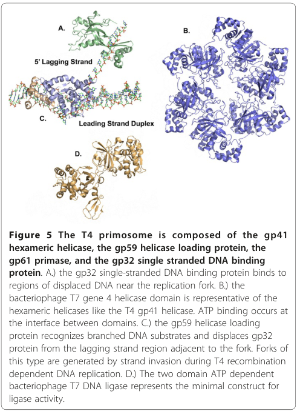

## Question

# Gene Research for Functional Annotation

## ⚠️ CRITICAL: Gene/Protein Identification Context

**BEFORE YOU BEGIN RESEARCH:** You MUST verify you are researching the CORRECT gene/protein. Gene symbols can be ambiguous, especially for less well-characterized genes from non-model organisms.

### Target Gene/Protein Identity (from UniProt):
- **UniProt Accession:** P04530
- **Protein Description:** RecName: Full=DnaB-like replicative helicase {ECO:0000255|HAMAP-Rule:MF_04155}; EC=3.6.4.- {ECO:0000255|HAMAP-Rule:MF_04155, ECO:0000269|PubMed:10871615, ECO:0000269|PubMed:7806533, ECO:0000269|PubMed:8107085}; AltName: Full=Gene product 41 {ECO:0000255|HAMAP-Rule:MF_04155}; Short=Gp41 {ECO:0000255|HAMAP-Rule:MF_04155};
- **Gene Information:** Name=41 {ECO:0000255|HAMAP-Rule:MF_04155};
- **Organism (full):** Enterobacteria phage T4 (Bacteriophage T4).
- **Protein Family:** Belongs to the helicase family. DnaB subfamily.
- **Key Domains:** DNA_helicase_DnaB-like_C. (IPR007694); Helic_T4. (IPR046393); P-loop_NTPase. (IPR027417); DnaB_C (PF03796)

### MANDATORY VERIFICATION STEPS:

1. **Check if the gene symbol "41" matches the protein description above**
2. **Verify the organism is correct:** Enterobacteria phage T4 (Bacteriophage T4).
3. **Check if protein family/domains align with what you find in literature**
4. **If you find literature for a DIFFERENT gene with the same or similar symbol, STOP**

### If Gene Symbol is Ambiguous or You Cannot Find Relevant Literature:

**DO NOT PROCEED WITH RESEARCH ON A DIFFERENT GENE.** Instead:
- State clearly: "The gene symbol '41' is ambiguous or literature is limited for this specific protein"
- Explain what you found (e.g., "Found extensive literature on a different gene with the same symbol in a different organism")
- Describe the protein based ONLY on the UniProt information provided above
- Suggest that the protein function can be inferred from domain/family information

### Research Target:

Please provide a comprehensive research report on the gene **41** (gene ID: 41, UniProt: P04530) in BPT4.

The research report should be a detailed narrative explaining the function, biological processes, and localization of the gene product. Citations should be given for all claims.

You should prioritize authoritative reviews and primary scientific literature when conducting research. You can supplement
this with annotations you find in gene/protein databases, but these can be outdated or inaccurate.

We are specifically interested in the primary function of the gene - for enzymes, what reaction is catalyzed, and what is the substrate specificity? For transporters, what is the substrate? For structural proteins or adapters, what is the broader structural role? For signaling molecules, what is the role in the pathway.

We are interested in where in or outside the cell the gene product carries out its function.

We are also interested in the signaling or biochemical pathways in which the gene functions. We are less interested in broad pleiotropic effects, except where these elucidate the precise role.

Include evidence where possible. We are interested in both experimental evidence as well as inference from structure, evolution, or bioinformatic analysis. Precise studies should be prioritized over high-throughput, where available.

## Output

Question: You are an expert researcher providing comprehensive, well-cited information.

Provide detailed information focusing on:
1. Key concepts and definitions with current understanding
2. Recent developments and latest research (prioritize 2023-2024 sources)
3. Current applications and real-world implementations
4. Expert opinions and analysis from authoritative sources
5. Relevant statistics and data from recent studies

Format as a comprehensive research report with proper citations. Include URLs and publication dates where available.
Always prioritize recent, authoritative sources and provide specific citations for all major claims.

# Gene Research for Functional Annotation

## ⚠️ CRITICAL: Gene/Protein Identification Context

**BEFORE YOU BEGIN RESEARCH:** You MUST verify you are researching the CORRECT gene/protein. Gene symbols can be ambiguous, especially for less well-characterized genes from non-model organisms.

### Target Gene/Protein Identity (from UniProt):
- **UniProt Accession:** P04530
- **Protein Description:** RecName: Full=DnaB-like replicative helicase {ECO:0000255|HAMAP-Rule:MF_04155}; EC=3.6.4.- {ECO:0000255|HAMAP-Rule:MF_04155, ECO:0000269|PubMed:10871615, ECO:0000269|PubMed:7806533, ECO:0000269|PubMed:8107085}; AltName: Full=Gene product 41 {ECO:0000255|HAMAP-Rule:MF_04155}; Short=Gp41 {ECO:0000255|HAMAP-Rule:MF_04155};
- **Gene Information:** Name=41 {ECO:0000255|HAMAP-Rule:MF_04155};
- **Organism (full):** Enterobacteria phage T4 (Bacteriophage T4).
- **Protein Family:** Belongs to the helicase family. DnaB subfamily.
- **Key Domains:** DNA_helicase_DnaB-like_C. (IPR007694); Helic_T4. (IPR046393); P-loop_NTPase. (IPR027417); DnaB_C (PF03796)

### MANDATORY VERIFICATION STEPS:

1. **Check if the gene symbol "41" matches the protein description above**
2. **Verify the organism is correct:** Enterobacteria phage T4 (Bacteriophage T4).
3. **Check if protein family/domains align with what you find in literature**
4. **If you find literature for a DIFFERENT gene with the same or similar symbol, STOP**

### If Gene Symbol is Ambiguous or You Cannot Find Relevant Literature:

**DO NOT PROCEED WITH RESEARCH ON A DIFFERENT GENE.** Instead:
- State clearly: "The gene symbol '41' is ambiguous or literature is limited for this specific protein"
- Explain what you found (e.g., "Found extensive literature on a different gene with the same symbol in a different organism")
- Describe the protein based ONLY on the UniProt information provided above
- Suggest that the protein function can be inferred from domain/family information

### Research Target:

Please provide a comprehensive research report on the gene **41** (gene ID: 41, UniProt: P04530) in BPT4.

The research report should be a detailed narrative explaining the function, biological processes, and localization of the gene product. Citations should be given for all claims.

You should prioritize authoritative reviews and primary scientific literature when conducting research. You can supplement
this with annotations you find in gene/protein databases, but these can be outdated or inaccurate.

We are specifically interested in the primary function of the gene - for enzymes, what reaction is catalyzed, and what is the substrate specificity? For transporters, what is the substrate? For structural proteins or adapters, what is the broader structural role? For signaling molecules, what is the role in the pathway.

We are interested in where in or outside the cell the gene product carries out its function.

We are also interested in the signaling or biochemical pathways in which the gene functions. We are less interested in broad pleiotropic effects, except where these elucidate the precise role.

Include evidence where possible. We are interested in both experimental evidence as well as inference from structure, evolution, or bioinformatic analysis. Precise studies should be prioritized over high-throughput, where available.

## Research report: Enterobacteria phage T4 gene 41 (gp41; UniProt P04530) — functional annotation

### 0) Target verification (mandatory disambiguation)
The target is **Enterobacteria phage T4 gene product 41 (gp41)**, a ~475-aa **DnaB-like replicative helicase** and P-loop NTPase that acts as a **hexameric ring motor** at the phage DNA replication fork (primosome/replisome). Independent sources explicitly identify **T4 “gene 41” = gp41 helicase**, functioning in the T4 primosome together with gp61 primase and the loader gp59, matching the UniProt description for **P04530**. (nelson2009t4phagereplisome pages 13-16, mueser2010structuralanalysisof pages 9-10, jing1999interactionsofbacteriophage pages 1-2)

### 1) Key concepts and definitions (current understanding)

#### 1.1 Replicative helicase (DnaB-like, ring helicase)
A **replicative helicase** is a nucleic acid motor enzyme that couples **NTP hydrolysis** to **directional translocation on single-stranded DNA (ssDNA)** and to **unwinding of duplex DNA** at the replication fork. For T4, gp41 is described as a **DNA-dependent ATPase/GTPase** whose activity is stimulated by ssDNA, and it unwinds by translocating with **5′→3′ polarity** on the strand it encircles (lagging-strand template). (nelson2009t4phagereplisome pages 13-16, delagoutte2001molecularmechanismsof pages 1-2)

Mechanistically and topologically, gp41 is a **toroidal (ring) helicase**: the functional form is a **hexamer** that encircles ssDNA, creating high processivity through a topological link between enzyme and nucleic acid. (nelson2009t4phagereplisome pages 13-16, mueser2010structuralanalysisof pages 9-10)

#### 1.2 The T4 primosome and replisome context
The **T4 primosome** is the helicase–primase subassembly at the fork; in T4 it contains **gp41 helicase** plus **gp61 primase**, with assembly/loading regulated by **gp59**, and with exposed ssDNA coated by **gp32 SSB**. (mueser2010structuralanalysisof pages 9-10, noble2015coordinateddnareplication pages 4-6, mueser2010structuralanalysisof media b9907eae)

A key organizing principle in T4 is that coordinated replication depends on **dynamic but specific protein–protein and protein–DNA interactions** among gp41 (helicase), gp61 (primase), gp59 (loader), gp32 (SSB), and gp43 (polymerase). (jing1999interactionsofbacteriophage pages 1-1, nelson2009t4phagereplisome pages 16-18)

### 2) Molecular function: biochemical activity, reaction, and substrate specificity

#### 2.1 Primary biochemical function
**gp41 is the T4 replicative helicase** and functions as an **ssDNA-stimulated ATPase/GTPase** whose NTP hydrolysis drives **5′→3′ translocation** on ssDNA and **fork unwinding**. (nelson2009t4phagereplisome pages 13-16, delagoutte2001molecularmechanismsof pages 1-2)

While the exact catalytic reaction is ATP (or GTP) hydrolysis (NTP + H2O → NDP + Pi), the functional outcome is mechanical work: translocation and duplex opening. gp41’s ATP hydrolysis has been described as producing ~**one base pair unwound per ATP hydrolyzed** (a mechanochemical coupling estimate in review context). (mueser2010structuralanalysisof pages 9-10)

#### 2.2 Substrate specificity and fork requirements
Biochemical studies summarized for gp41 indicate strong substrate preferences typical of fork helicases:

* **Preferred substrates**: preformed **forked DNA** structures. (nelson2009t4phagereplisome pages 13-16)
* **Absolute requirement**: a **5′ ssDNA tail ≥32 nt** for unwinding on forked hybrids. (nelson2009t4phagereplisome pages 13-16)
* **Optimal unwinding**: requires a **3′ ssDNA extension >29 nt**, suggesting gp41 interacts with both arms near the fork junction (leading- and lagging-strand templates). (nelson2009t4phagereplisome pages 13-16)
* **Loader modulation**: gp59 **reduces** the strictness of these tail-length requirements (i.e., facilitates loading/productive engagement). (nelson2009t4phagereplisome pages 13-16)

At the binding level, the reported **ssDNA footprint** is **~12–20 nt per gp41 monomer**, implying a sizeable ssDNA interaction surface across the hexameric ring. (nelson2009t4phagereplisome pages 13-16)

#### 2.3 Directionality and strand choice
gp41 functions as a 5′→3′ helicase that **encircles the lagging-strand template** and **excludes the leading strand**. This is explicitly stated in reviews of the T4 replisome and is consistent with ring helicase strand-exclusion models. (mueser2010structuralanalysisof pages 9-10, noble2015coordinateddnareplication pages 4-6)

### 3) Structural/biophysical properties and mechanism

#### 3.1 Oligomeric state and assembly
gp41 exists as a **monomer/dimer equilibrium in solution** and assembles into a **hexamer upon binding ATP/ATPγS (or ATP/GTP)**; assembly has been described as proceeding through **dimer → tetramer → hexamer** intermediates, producing a **toroidal ring**. (nelson2009t4phagereplisome pages 13-16)

Electron microscopy and mechanistic synthesis describe distinct **“open” and “closed”** gp41 hexamer states, where an “open/gapped” ring is proposed to facilitate **loading onto ssDNA**. (noble2015coordinateddnareplication pages 1-4, nelson2009t4phagereplisome pages 13-16)

#### 3.2 2023 cryo-EM breakthrough: T4 primosome architecture
A major recent advance is the **cryo-EM structural series** of T4 primosome assembly and primer synthesis.

Feng et al. (Nature Communications, **July 2023**, https://doi.org/10.1038/s41467-023-40106-2) report that:

* **gp41 alone** adopts a **right-handed open-spiral** conformation.
* On **ssDNA binding**, gp41 undergoes a **large scissor-like conformational change** that **closes the ring** and activates the helicase.
* Activation exposes a hydrophobic surface that recruits **gp61 primase**.
* **gp61 binds in a bipartite mode**, with its Zn-binding domain and RNA polymerase domain engaging separate gp41 N-terminal hairpin dimers.
* The primosome architecture is **one primase per helicase hexamer**, consistent with earlier biochemical stoichiometry.
* Multiple cryo-EM maps spanning states were solved at **~5.7 Å to ~2.9–3.4 Å** resolution. (feng2023structuralbasisof pages 1-2)

These structures provide a mechanistic bridge between decades of biochemical models and direct atomic-to-near-atomic snapshots of the active complex.

### 4) Biological processes and pathway placement in T4 infection

#### 4.1 Role in DNA replication
gp41 is the **replicative helicase of T4**, positioned at the front of the replisome to open duplex DNA and coordinate leading/lagging synthesis via its coupling to the primase subassembly. (jing1999interactionsofbacteriophage pages 1-1, mueser2010structuralanalysisof pages 1-3)

Genetic/functional summaries indicate that **mutations in gene 41** strongly reduce DNA replication in infected cells and **eliminate lagging-strand synthesis**, highlighting gp41 as an essential replisome motor. (nelson2009t4phagereplisome pages 13-16)

#### 4.2 Primosome function: coupling unwinding to priming
The T4 primosome is built from **six gp41 subunits** and **one gp61 primase**, forming a stable complex in the presence of purine NTPs. (jing1999interactionsofbacteriophage pages 1-2)

The functional coupling is reciprocal:

* gp41 **stimulates** gp61 primer synthesis, shifting priming toward the in vivo-relevant pentaribonucleotide products from 5′-GTT-3′ sites (review context). (noble2015coordinateddnareplication pages 4-6)
* gp61 can increase gp41 unwinding rate and processivity in some contexts (summarized in replisome literature). (nelson2009t4phagereplisome pages 18-21)

### 5) Interaction partners and complex assembly (expert synthesis from authoritative sources)

#### 5.1 gp61 primase
Direct biochemical evidence establishes the primosome stoichiometry as **6 gp41 : 1 gp61** and emphasizes gp41 as the ATP-dependent helicase that “opens” DNA ahead of the fork. (jing1999interactionsofbacteriophage pages 1-2, jing1999interactionsofbacteriophage pages 1-1)

#### 5.2 gp59 helicase loader
In vivo and in vitro, gp59 is a **helicase-loading factor** required for efficient gp41 loading, particularly in the presence of gp32-coated ssDNA. gp59 interacts stoichiometrically with gp41 and can promote gp41 oligomerization/loading; maximal effects in one study occur at ~**1:1 gp59:gp41** stoichiometry (subunit basis). (noble2015coordinateddnareplication pages 4-6, xi2005interactionbetweenthea pages 1-2)

Mechanistically, gp59 can form inhibitory complexes with gp43 polymerase during assembly and can be displaced/unlocked by gp41 translocation in an ATP-dependent manner, thereby coordinating loading with replication initiation. (nelson2009t4phagereplisome pages 18-21, nelson2009t4phagereplisome pages 16-18)

#### 5.3 gp32 single-stranded DNA binding protein (SSB)
gp32 coats displaced ssDNA, prevents secondary structure formation, and supports replication by stabilizing ssDNA and through interactions with other replisome proteins; gp59 mediates loading onto gp32-coated ssDNA. (noble2015coordinateddnareplication pages 4-6, mueser2010structuralanalysisof pages 9-10)

#### 5.4 gp43 DNA polymerase (and holoenzyme)
gp41 and gp43 show strong **functional coupling** during leading-strand synthesis (together enabling efficient strand displacement), but experimental analysis indicates **no detectable gp41–gp43 interaction in the absence of DNA**, implying coupling is largely **DNA-mediated**. (delagoutte2001molecularmechanismsof pages 1-2, noble2015coordinateddnareplication pages 4-6)

### 6) Localization: where gp41 acts
Direct imaging-based subcellular localization evidence (e.g., microscopy of infected cells) was not retrieved in the available texts; however, multiple authoritative sources place gp41 functionally **at the DNA replication fork**, acting “in front of the replisome” and as the helicase component of the primosome. (mueser2010structuralanalysisof pages 1-3, jing1999interactionsofbacteriophage pages 1-1)

Thus, for functional annotation, the most defensible localization statement is **replication-fork-associated, cytosolic during phage infection**, inferred from its role in replisome assembly and its substrate requirements for forked DNA structures.

### 7) Quantitative statistics and data from studies
Key quantitative parameters (compiled and individually cited) include:

* ssDNA translocation: **~400 nt/s** (association half-life ~**1 min**) (nelson2009t4phagereplisome pages 13-16)
* unwinding rate in presence of gp59: **~30 bp/s** (nelson2009t4phagereplisome pages 13-16)
* coupled leading-strand synthesis/unwinding with processive polymerase: **~250 nt/s (or bp/s)**; minimal gp41–gp43 complex under PEG crowding: **~90 nt/s** (delagoutte2001molecularmechanismsof pages 1-2)
* unwinding processivity with gp61: **~650 nt** (nelson2009t4phagereplisome pages 13-16)
* gp41 residence/dissociation half-life in complete replisome: **~11 min**, consistent with replicating the ~**168 kb** T4 genome at ~**400 nt/s** (nelson2009t4phagereplisome pages 13-16)
* ssDNA footprint: **~12–20 nt per monomer** (nelson2009t4phagereplisome pages 13-16)
* fork-tail requirements: ≥**32 nt** (5′ tail) and optimal >**29 nt** (3′ tail) (nelson2009t4phagereplisome pages 13-16)

### 8) Recent developments and “latest research” (prioritizing 2023–2024)

#### 8.1 Direct T4 gp41 advance: primosome cryo-EM (2023)
The most consequential T4-specific update in 2023–2024 is the **2023 Nature Communications** cryo-EM structural analysis of gp41 activation and gp61 recruitment, providing near-atomic snapshots and a structural mechanism for “open spiral → closed ring” activation on ssDNA. (feng2023structuralbasisof pages 1-2)

#### 8.2 Broader 2024 methodological developments relevant to functional annotation
Outside the T4 system, 2024 literature highlights the increasing role of **AI structure prediction** and integrative modeling for helicase mechanisms, including the use of AlphaFold2-derived models for viral hexameric helicases and discussion of emerging tools like AlphaFold 3 and protein–nucleic acid complex prediction methods. This provides context for how researchers now infer/validate domain functions and nucleic-acid routing in helicase systems where complete structures are difficult to obtain. (shin2024amodelfor pages 1-3, shin2024amodelfor pages 18-18)

### 9) Current applications and real-world implementations

#### 9.1 T4 replisome as a reconstitutable model system
A recurring “real-world implementation” of gp41 knowledge is the **in vitro reconstitution** of phage replication components to build a functional primosome/replisome for mechanistic study, including quantitative strand-displacement synthesis assays (gp41 + polymerase systems) and stepwise assembly studies culminating in the 2023 cryo-EM reconstructions. (delagoutte2001molecularmechanismsof pages 1-2, feng2023structuralbasisof pages 1-2)

#### 9.2 Single-molecule and structural frameworks
The T4 system is widely treated as a model for dynamic replisome interactions and helicase–polymerase coupling, with reviews emphasizing biochemical and single-molecule perspectives on replisomes and helicase dynamics (though many foundational single-molecule T4 gp41 measurements are pre-2023). (noble2015coordinateddnareplication pages 4-6, noble2015coordinateddnareplication pages 8-11)

### 10) Visual evidence: primosome composition
A schematic of the T4 primosome components (gp41 helicase, gp61 primase, gp59 loader, gp32 SSB) and their relationship at the replication fork is shown in extracted figure crops from Mueser et al. 2010. (mueser2010structuralanalysisof media b9907eae, mueser2010structuralanalysisof media 8a24e4e7, mueser2010structuralanalysisof media 73781290)

### 11) Evidence summary table
The following table consolidates core findings, numerical parameters, assays, and recent structural advances.

| Category | Finding (with numeric values) | Experimental context/assay | Key reference (author year) | DOI/URL | Publication date |
|---|---|---|---|---|---|
| Enzymatic activity | gp41 is a DNA-dependent ATPase/GTPase and replicative helicase; ssDNA strongly stimulates NTPase activity; ATP hydrolysis drives unwinding at ~1 bp per ATP hydrolyzed | Biochemical helicase/NTPase assays; structural review synthesis (nelson2009t4phagereplisome pages 13-16, mueser2010structuralanalysisof pages 9-10) | Nelson et al. 2009; Mueser et al. 2010 | https://doi.org/10.1007/b135974_16 ; https://doi.org/10.1186/1743-422x-7-359 | Jan 2009; Dec 2010 |
| Directionality | Translocates 5′→3′ on ssDNA, encircling the lagging strand and excluding the leading strand at the fork (mueser2010structuralanalysisof pages 9-10, noble2015coordinateddnareplication pages 4-6) | Fork-substrate biochemical assays; replisome reviews | Mueser et al. 2010; Noble et al. 2015 | https://doi.org/10.1186/1743-422x-7-359 ; https://doi.org/10.3390/v7062766 | Dec 2010; Jun 2015 |
| Substrate requirements | Preferred substrate is forked DNA; absolute requirement for a 5′ ssDNA tail ≥32 nt; optimal unwinding also requires a 3′ ssDNA extension >29 nt; gp59 reduces these tail-length requirements (nelson2009t4phagereplisome pages 13-16) | Forked-DNA unwinding and loading assays summarized from primary studies | Nelson et al. 2009 | https://doi.org/10.1007/b135974_16 | Jan 2009 |
| DNA-binding footprint | Binding-site size estimated at 12–20 nt per gp41 monomer on ssDNA (nelson2009t4phagereplisome pages 13-16) | EMSA/oligonucleotide binding assays | Nelson et al. 2009 | https://doi.org/10.1007/b135974_16 | Jan 2009 |
| Oligomeric state | In solution gp41 exists in a monomer/dimer equilibrium (primarily dimer at physiological concentrations); ATP or ATPγS binding promotes assembly through dimers→tetramers→hexamers to form the active helicase (nelson2009t4phagereplisome pages 13-16) | Sedimentation/EM/cross-linking/biophysical studies summarized in review | Nelson et al. 2009 | https://doi.org/10.1007/b135974_16 | Jan 2009 |
| Conformations | Hexamers are toroidal rings; EM identified distinct “open/gapped” and “closed” conformations, with the open form proposed to facilitate loading onto DNA (noble2015coordinateddnareplication pages 1-4, nelson2009t4phagereplisome pages 13-16) | Electron microscopy and mechanistic review | Noble et al. 2015; Nelson et al. 2009 | https://doi.org/10.3390/v7062766 ; https://doi.org/10.1007/b135974_16 | Jun 2015; Jan 2009 |
| gp61 primase interaction | Functional primosome contains 6 gp41 subunits + 1 gp61 primase (6:1); gp41 stimulates gp61 RNA primer synthesis and shifts products toward pentaribonucleotides from 5′-GTT-3′ sites (jing1999interactionsofbacteriophage pages 1-1, jing1999interactionsofbacteriophage pages 1-2) | Reconstituted primosome, ATPase stimulation, footprinting, protein–DNA interaction mapping | Jing et al. 1999 | https://doi.org/10.1074/jbc.274.38.27287 | Sep 17 1999 |
| gp59 loader interaction | gp59 is the helicase loader; maximal enhancement of gp41 loading/unwinding at ~1:1 gp59:gp41 stoichiometry; gp59 can induce gp41 oligomerization and relax fork-tail requirements (xi2005interactionbetweenthea pages 1-2, nelson2009t4phagereplisome pages 10-13) | Loading/unwinding assays, cross-linking, fork-DNA assembly studies | Xi et al. 2005; Nelson et al. 2009 | https://doi.org/10.1021/bi047296w ; https://doi.org/10.1007/b135974_16 | May 2005; Jan 2009 |
| gp32 SSB interaction context | gp32 coats exposed ssDNA, prevents secondary structure, and supports helicase loading indirectly through gp59; gp59-gp32 interactions help place gp41 onto gp32-covered ssDNA/recombination intermediates (noble2015coordinateddnareplication pages 4-6, nelson2009t4phagereplisome pages 18-21, mueser2010structuralanalysisof pages 9-10) | Replisome assembly and recombination-dependent replication models | Noble et al. 2015; Nelson et al. 2009; Mueser et al. 2010 | https://doi.org/10.3390/v7062766 ; https://doi.org/10.1007/b135974_16 ; https://doi.org/10.1186/1743-422x-7-359 | Jun 2015; Jan 2009; Dec 2010 |
| gp43 polymerase coupling | gp41 and gp43 are functionally coupled at the fork, but no strong evidence for direct physical interaction in the absence of DNA; DNA-mediated coupling enables efficient strand-displacement synthesis (delagoutte2001molecularmechanismsof pages 1-2, noble2015coordinateddnareplication pages 4-6) | Analytical ultracentrifugation and strand-displacement synthesis assays | Delagoutte & von Hippel 2001; Noble et al. 2015 | https://doi.org/10.1021/bi001306l ; https://doi.org/10.3390/v7062766 | Mar 2001; Jun 2015 |
| ssDNA translocation rate | ~400 nt/s; association half-life on ssDNA ~1 min (nelson2009t4phagereplisome pages 13-16) | gp41 translocation assays on ssDNA | Nelson et al. 2009 | https://doi.org/10.1007/b135974_16 | Jan 2009 |
| DNA unwinding rate | ~30 bp/s in the presence of gp59 (nelson2009t4phagereplisome pages 13-16) | Fork/unwinding assays with loader | Nelson et al. 2009 | https://doi.org/10.1007/b135974_16 | Jan 2009 |
| Coupled leading-strand unwinding/synthesis | ~250 bp/s (or nts/s in strand-displacement assays) when gp41 is coupled to a processive polymerase/holoenzyme; minimal gp41-gp43 complex can support ~90 nts/s under PEG-assisted loading conditions (delagoutte2001molecularmechanismsof pages 1-2, nelson2009t4phagereplisome pages 13-16) | Strand-displacement DNA synthesis and helicase–polymerase coupling assays | Delagoutte & von Hippel 2001; Nelson et al. 2009 | https://doi.org/10.1021/bi001306l ; https://doi.org/10.1007/b135974_16 | Mar 2001; Jan 2009 |
| Processivity | Unwinding processivity on long duplex DNA is ~650 nt in the presence of gp61 primase (nelson2009t4phagereplisome pages 13-16) | Long-duplex unwinding with primase | Nelson et al. 2009 | https://doi.org/10.1007/b135974_16 | Jan 2009 |
| Replisome residence | Dissociation half-life of gp41 in the complete replisome is ~11 min, consistent with enough processivity to finish the 168 kb T4 genome at observed fork rates (nelson2009t4phagereplisome pages 13-16) | Dilution experiments in moving replisomes | Nelson et al. 2009 | https://doi.org/10.1007/b135974_16 | Jan 2009 |
| In vivo role/essentiality | Mutations in gene 41 strongly reduce T4 DNA replication and abolish lagging-strand synthesis; gp41 is therefore a core, essential replisome helicase during infection (nelson2009t4phagereplisome pages 13-16, lee2013asinglemoleculeview pages 14-14) | Genetic phenotypes summarized in replisome reviews | Nelson et al. 2009; Lee et al. 2013 | https://doi.org/10.1007/b135974_16 ; https://doi.org/10.1021/bi400231s | Jan 2009; May 2013 |
| Localization/function site | Functional localization is at the T4 DNA replication fork/primosome in the infected host cytoplasm; direct cell-imaging localization was not retrieved, so assignment is based on fork-specific biochemistry and replisome assembly data (noble2015coordinateddnareplication pages 1-4, mueser2010structuralanalysisof pages 1-3, jing1999interactionsofbacteriophage pages 1-1) | Replisome/primosome biochemical and structural models | Noble et al. 2015; Mueser et al. 2010; Jing et al. 1999 | https://doi.org/10.3390/v7062766 ; https://doi.org/10.1186/1743-422x-7-359 ; https://doi.org/10.1074/jbc.274.38.27287 | Jun 2015; Dec 2010; Sep 17 1999 |
| Recent structural advance (2023) | Cryo-EM captured gp41 alone as a right-handed open spiral and, after ssDNA binding, as a planar closed ring; conformational switch is “scissor-like” and activates helicase while exposing a hydrophobic surface for gp61 recruitment (feng2023structuralbasisof pages 1-2) | Stepwise in vitro reconstitution of T4 primosome; cryo-EM of helicase ± ssDNA ± primase | Feng et al. 2023 | https://doi.org/10.1038/s41467-023-40106-2 | Jul 2023 |
| Recent structural resolutions (2023) | Multiple T4 primosome cryo-EM maps were reported at ~5.7 Å to ~2.9–3.4 Å, defining gp41 activation and the bipartite binding mode of one gp61 primase per gp41 hexamer (feng2023structuralbasisof pages 1-2) | Cryo-EM structural series of assembly/function states | Feng et al. 2023 | https://doi.org/10.1038/s41467-023-40106-2 | Jul 2023 |
| 2024 broader relevance | 2024 reviews emphasize that modern cryo-EM, single-molecule methods, and AI structure prediction are reshaping understanding of bacterial/viral replicative helicases, providing context for functional annotation of DnaB-like systems such as T4 gp41 (shin2024amodelfor pages 1-3, shin2024amodelfor pages 18-18) | Review and AI-based structural modeling context | Shin et al. 2024 | https://doi.org/10.1128/jvi.01119-24 | Oct 2024 |

*Table: This table summarizes the main experimentally supported functional annotation facts for bacteriophage T4 gene product 41 (gp41), including activity, substrates, interactions, kinetics, and recent structural advances. It is useful as a compact evidence map for assigning molecular function, biological process, and localization.*

### 12) Limitations and confidence
* **High confidence**: gp41 is a hexameric DnaB-like replicative helicase (ATPase/GTPase) with 5′→3′ polarity; substrate requirements for fork tails; primosome stoichiometry (6:1 with gp61); gp59 loader dependence in gp32-coated contexts; quantitative translocation/unwinding/processivity values summarized from primary work; and 2023 cryo-EM mechanism/architecture. (nelson2009t4phagereplisome pages 13-16, jing1999interactionsofbacteriophage pages 1-2, xi2005interactionbetweenthea pages 1-2, feng2023structuralbasisof pages 1-2)
* **Moderate confidence**: cellular “localization” stated as fork-associated during infection is inferred from mechanistic role and not from direct microscopy in the retrieved documents. (mueser2010structuralanalysisof pages 1-3, jing1999interactionsofbacteriophage pages 1-1)

### Key sources (with URLs and publication dates)
* Jing et al. **1999-09-17**, J Biol Chem. https://doi.org/10.1074/jbc.274.38.27287 (jing1999interactionsofbacteriophage pages 1-2)
* Delagoutte & von Hippel **2001-03**, Biochemistry. https://doi.org/10.1021/bi001306l (delagoutte2001molecularmechanismsof pages 1-2)
* Xi et al. **2005-05**, Biochemistry. https://doi.org/10.1021/bi047296w (xi2005interactionbetweenthea pages 1-2)
* Mueser et al. **2010-12**, Virology Journal. https://doi.org/10.1186/1743-422x-7-359 (mueser2010structuralanalysisof pages 9-10)
* Noble et al. **2015-06**, Viruses. https://doi.org/10.3390/v7062766 (noble2015coordinateddnareplication pages 4-6)
* Nelson et al. **2009-01**, T4 replisome chapter. https://doi.org/10.1007/b135974_16 (nelson2009t4phagereplisome pages 13-16)
* Feng et al. **2023-07**, Nature Communications. https://doi.org/10.1038/s41467-023-40106-2 (feng2023structuralbasisof pages 1-2)
* Shin et al. **2024-10**, J Virology. https://doi.org/10.1128/jvi.01119-24 (shin2024amodelfor pages 1-3)

References

1. (nelson2009t4phagereplisome pages 13-16): Scott W. Nelson, Zhihao Zhuang, Michelle M. Spiering, and Stephen J. Benkovic. T4 phage replisome. ArXiv, pages 337-364, Jan 2009. URL: https://doi.org/10.1007/b135974\_16, doi:10.1007/b135974\_16. This article has 5 citations.

2. (mueser2010structuralanalysisof pages 9-10): Timothy C Mueser, Jennifer M Hinerman, Juliette M Devos, Ryan A Boyer, and Kandace J Williams. Structural analysis of bacteriophage t4 dna replication: a review in the virology journal series on bacteriophage t4 and its relatives. Virology Journal, 7:359-359, Dec 2010. URL: https://doi.org/10.1186/1743-422x-7-359, doi:10.1186/1743-422x-7-359. This article has 79 citations and is from a peer-reviewed journal.

3. (jing1999interactionsofbacteriophage pages 1-2): Debra H. Jing, Feng Dong, Gary J. Latham, and Peter H. von Hippel. Interactions of bacteriophage t4-coded primase (gp61) with the t4 replication helicase (gp41) and dna in primosome formation*. The Journal of Biological Chemistry, 274:27287-27298, Sep 1999. URL: https://doi.org/10.1074/jbc.274.38.27287, doi:10.1074/jbc.274.38.27287. This article has 41 citations.

4. (delagoutte2001molecularmechanismsof pages 1-2): Emmanuelle Delagoutte and Peter H. von Hippel. Molecular mechanisms of the functional coupling of the helicase (gp41) and polymerase (gp43) of bacteriophage t4 within the dna replication fork. Biochemistry, 40 14:4459-77, Mar 2001. URL: https://doi.org/10.1021/bi001306l, doi:10.1021/bi001306l. This article has 83 citations and is from a peer-reviewed journal.

5. (noble2015coordinateddnareplication pages 4-6): Erin Noble, Michelle Spiering, and Stephen Benkovic. Coordinated dna replication by the bacteriophage t4 replisome. Viruses, 7:3186-3200, Jun 2015. URL: https://doi.org/10.3390/v7062766, doi:10.3390/v7062766. This article has 28 citations.

6. (mueser2010structuralanalysisof media b9907eae): Timothy C Mueser, Jennifer M Hinerman, Juliette M Devos, Ryan A Boyer, and Kandace J Williams. Structural analysis of bacteriophage t4 dna replication: a review in the virology journal series on bacteriophage t4 and its relatives. Virology Journal, 7:359-359, Dec 2010. URL: https://doi.org/10.1186/1743-422x-7-359, doi:10.1186/1743-422x-7-359. This article has 79 citations and is from a peer-reviewed journal.

7. (jing1999interactionsofbacteriophage pages 1-1): Debra H. Jing, Feng Dong, Gary J. Latham, and Peter H. von Hippel. Interactions of bacteriophage t4-coded primase (gp61) with the t4 replication helicase (gp41) and dna in primosome formation*. The Journal of Biological Chemistry, 274:27287-27298, Sep 1999. URL: https://doi.org/10.1074/jbc.274.38.27287, doi:10.1074/jbc.274.38.27287. This article has 41 citations.

8. (nelson2009t4phagereplisome pages 16-18): Scott W. Nelson, Zhihao Zhuang, Michelle M. Spiering, and Stephen J. Benkovic. T4 phage replisome. ArXiv, pages 337-364, Jan 2009. URL: https://doi.org/10.1007/b135974\_16, doi:10.1007/b135974\_16. This article has 5 citations.

9. (noble2015coordinateddnareplication pages 1-4): Erin Noble, Michelle Spiering, and Stephen Benkovic. Coordinated dna replication by the bacteriophage t4 replisome. Viruses, 7:3186-3200, Jun 2015. URL: https://doi.org/10.3390/v7062766, doi:10.3390/v7062766. This article has 28 citations.

10. (feng2023structuralbasisof pages 1-2): Xiang Feng, Michelle M. Spiering, Ruda de Luna Almeida Santos, Stephen J. Benkovic, and Huilin Li. Structural basis of the t4 bacteriophage primosome assembly and primer synthesis. Nature Communications, Jul 2023. URL: https://doi.org/10.1038/s41467-023-40106-2, doi:10.1038/s41467-023-40106-2. This article has 13 citations and is from a highest quality peer-reviewed journal.

11. (mueser2010structuralanalysisof pages 1-3): Timothy C Mueser, Jennifer M Hinerman, Juliette M Devos, Ryan A Boyer, and Kandace J Williams. Structural analysis of bacteriophage t4 dna replication: a review in the virology journal series on bacteriophage t4 and its relatives. Virology Journal, 7:359-359, Dec 2010. URL: https://doi.org/10.1186/1743-422x-7-359, doi:10.1186/1743-422x-7-359. This article has 79 citations and is from a peer-reviewed journal.

12. (nelson2009t4phagereplisome pages 18-21): Scott W. Nelson, Zhihao Zhuang, Michelle M. Spiering, and Stephen J. Benkovic. T4 phage replisome. ArXiv, pages 337-364, Jan 2009. URL: https://doi.org/10.1007/b135974\_16, doi:10.1007/b135974\_16. This article has 5 citations.

13. (xi2005interactionbetweenthea pages 1-2): Jun Xi, Zhiquan Zhang, Zhihao Zhuang, Jingsong Yang, Michelle M. Spiering, Gordon G. Hammes, and Stephen J. Benkovic. Interaction between the t4 helicase loading protein (gp59) and the dna polymerase (gp43): unlocking of the gp59-gp43-dna complex to initiate assembly of a fully functional replisome. Biochemistry, 44 21:7747-56, May 2005. URL: https://doi.org/10.1021/bi047296w, doi:10.1021/bi047296w. This article has 45 citations and is from a peer-reviewed journal.

14. (shin2024amodelfor pages 1-3): Jong Shin, Gretchen Meinke, Alex A. Bohm, and Peter A. Bullock. A model for polyomavirus helicase activity derived in part from the alphafold2 structure of sv40 t-antigen. Journal of Virology, Oct 2024. URL: https://doi.org/10.1128/jvi.01119-24, doi:10.1128/jvi.01119-24. This article has 1 citations and is from a domain leading peer-reviewed journal.

15. (shin2024amodelfor pages 18-18): Jong Shin, Gretchen Meinke, Alex A. Bohm, and Peter A. Bullock. A model for polyomavirus helicase activity derived in part from the alphafold2 structure of sv40 t-antigen. Journal of Virology, Oct 2024. URL: https://doi.org/10.1128/jvi.01119-24, doi:10.1128/jvi.01119-24. This article has 1 citations and is from a domain leading peer-reviewed journal.

16. (noble2015coordinateddnareplication pages 8-11): Erin Noble, Michelle Spiering, and Stephen Benkovic. Coordinated dna replication by the bacteriophage t4 replisome. Viruses, 7:3186-3200, Jun 2015. URL: https://doi.org/10.3390/v7062766, doi:10.3390/v7062766. This article has 28 citations.

17. (mueser2010structuralanalysisof media 8a24e4e7): Timothy C Mueser, Jennifer M Hinerman, Juliette M Devos, Ryan A Boyer, and Kandace J Williams. Structural analysis of bacteriophage t4 dna replication: a review in the virology journal series on bacteriophage t4 and its relatives. Virology Journal, 7:359-359, Dec 2010. URL: https://doi.org/10.1186/1743-422x-7-359, doi:10.1186/1743-422x-7-359. This article has 79 citations and is from a peer-reviewed journal.

18. (mueser2010structuralanalysisof media 73781290): Timothy C Mueser, Jennifer M Hinerman, Juliette M Devos, Ryan A Boyer, and Kandace J Williams. Structural analysis of bacteriophage t4 dna replication: a review in the virology journal series on bacteriophage t4 and its relatives. Virology Journal, 7:359-359, Dec 2010. URL: https://doi.org/10.1186/1743-422x-7-359, doi:10.1186/1743-422x-7-359. This article has 79 citations and is from a peer-reviewed journal.

19. (nelson2009t4phagereplisome pages 10-13): Scott W. Nelson, Zhihao Zhuang, Michelle M. Spiering, and Stephen J. Benkovic. T4 phage replisome. ArXiv, pages 337-364, Jan 2009. URL: https://doi.org/10.1007/b135974\_16, doi:10.1007/b135974\_16. This article has 5 citations.

20. (lee2013asinglemoleculeview pages 14-14): Wonbae Lee, Davis Jose, Carey Phelps, Andrew H. Marcus, and Peter H. von Hippel. A single-molecule view of the assembly pathway, subunit stoichiometry, and unwinding activity of the bacteriophage t4 primosome (helicase-primase) complex. Biochemistry, 52 18:3157-70, May 2013. URL: https://doi.org/10.1021/bi400231s, doi:10.1021/bi400231s. This article has 37 citations and is from a peer-reviewed journal.

## Artifacts

- [Edison artifact artifact-00](41-deep-research-falcon_artifacts/artifact-00.md)

## Citations

1. mueser2010structuralanalysisof pages 9-10
2. feng2023structuralbasisof pages 1-2
3. jing1999interactionsofbacteriophage pages 1-2
4. noble2015coordinateddnareplication pages 4-6
5. delagoutte2001molecularmechanismsof pages 1-2
6. xi2005interactionbetweenthea pages 1-2
7. shin2024amodelfor pages 1-3
8. jing1999interactionsofbacteriophage pages 1-1
9. noble2015coordinateddnareplication pages 1-4
10. mueser2010structuralanalysisof pages 1-3
11. shin2024amodelfor pages 18-18
12. noble2015coordinateddnareplication pages 8-11
13. lee2013asinglemoleculeview pages 14-14
14. https://doi.org/10.1038/s41467-023-40106-2
15. https://doi.org/10.1007/b135974_16
16. https://doi.org/10.1186/1743-422x-7-359
17. https://doi.org/10.3390/v7062766
18. https://doi.org/10.1074/jbc.274.38.27287
19. https://doi.org/10.1021/bi047296w
20. https://doi.org/10.1021/bi001306l
21. https://doi.org/10.1021/bi400231s
22. https://doi.org/10.1128/jvi.01119-24
23. https://doi.org/10.1007/b135974\_16,
24. https://doi.org/10.1186/1743-422x-7-359,
25. https://doi.org/10.1074/jbc.274.38.27287,
26. https://doi.org/10.1021/bi001306l,
27. https://doi.org/10.3390/v7062766,
28. https://doi.org/10.1038/s41467-023-40106-2,
29. https://doi.org/10.1021/bi047296w,
30. https://doi.org/10.1128/jvi.01119-24,
31. https://doi.org/10.1021/bi400231s,