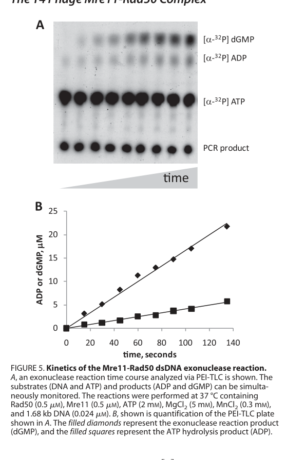

## Question

# Gene Research for Functional Annotation

## ⚠️ CRITICAL: Gene/Protein Identification Context

**BEFORE YOU BEGIN RESEARCH:** You MUST verify you are researching the CORRECT gene/protein. Gene symbols can be ambiguous, especially for less well-characterized genes from non-model organisms.

### Target Gene/Protein Identity (from UniProt):
- **UniProt Accession:** P04521
- **Protein Description:** RecName: Full=Exonuclease subunit 1; EC=3.1.11.-; AltName: Full=Gene product 47; Short=gp47;
- **Gene Information:** Name=47;
- **Organism (full):** Enterobacteria phage T4 (Bacteriophage T4).
- **Protein Family:** To phage T5 protein D12 and to yeast RAD52. .
- **Key Domains:** Calcineurin-like_PHP. (IPR004843); DNA_Repair-Maintenance_Comp. (IPR050535); Metallo-depent_PP-like. (IPR029052); Metallophos (PF00149)

### MANDATORY VERIFICATION STEPS:

1. **Check if the gene symbol "47" matches the protein description above**
2. **Verify the organism is correct:** Enterobacteria phage T4 (Bacteriophage T4).
3. **Check if protein family/domains align with what you find in literature**
4. **If you find literature for a DIFFERENT gene with the same or similar symbol, STOP**

### If Gene Symbol is Ambiguous or You Cannot Find Relevant Literature:

**DO NOT PROCEED WITH RESEARCH ON A DIFFERENT GENE.** Instead:
- State clearly: "The gene symbol '47' is ambiguous or literature is limited for this specific protein"
- Explain what you found (e.g., "Found extensive literature on a different gene with the same symbol in a different organism")
- Describe the protein based ONLY on the UniProt information provided above
- Suggest that the protein function can be inferred from domain/family information

### Research Target:

Please provide a comprehensive research report on the gene **47** (gene ID: 47, UniProt: P04521) in BPT4.

The research report should be a detailed narrative explaining the function, biological processes, and localization of the gene product. Citations should be given for all claims.

You should prioritize authoritative reviews and primary scientific literature when conducting research. You can supplement
this with annotations you find in gene/protein databases, but these can be outdated or inaccurate.

We are specifically interested in the primary function of the gene - for enzymes, what reaction is catalyzed, and what is the substrate specificity? For transporters, what is the substrate? For structural proteins or adapters, what is the broader structural role? For signaling molecules, what is the role in the pathway.

We are interested in where in or outside the cell the gene product carries out its function.

We are also interested in the signaling or biochemical pathways in which the gene functions. We are less interested in broad pleiotropic effects, except where these elucidate the precise role.

Include evidence where possible. We are interested in both experimental evidence as well as inference from structure, evolution, or bioinformatic analysis. Precise studies should be prioritized over high-throughput, where available.

## Output

Question: You are an expert researcher providing comprehensive, well-cited information.

Provide detailed information focusing on:
1. Key concepts and definitions with current understanding
2. Recent developments and latest research (prioritize 2023-2024 sources)
3. Current applications and real-world implementations
4. Expert opinions and analysis from authoritative sources
5. Relevant statistics and data from recent studies

Format as a comprehensive research report with proper citations. Include URLs and publication dates where available.
Always prioritize recent, authoritative sources and provide specific citations for all major claims.

# Gene Research for Functional Annotation

## ⚠️ CRITICAL: Gene/Protein Identification Context

**BEFORE YOU BEGIN RESEARCH:** You MUST verify you are researching the CORRECT gene/protein. Gene symbols can be ambiguous, especially for less well-characterized genes from non-model organisms.

### Target Gene/Protein Identity (from UniProt):
- **UniProt Accession:** P04521
- **Protein Description:** RecName: Full=Exonuclease subunit 1; EC=3.1.11.-; AltName: Full=Gene product 47; Short=gp47;
- **Gene Information:** Name=47;
- **Organism (full):** Enterobacteria phage T4 (Bacteriophage T4).
- **Protein Family:** To phage T5 protein D12 and to yeast RAD52. .
- **Key Domains:** Calcineurin-like_PHP. (IPR004843); DNA_Repair-Maintenance_Comp. (IPR050535); Metallo-depent_PP-like. (IPR029052); Metallophos (PF00149)

### MANDATORY VERIFICATION STEPS:

1. **Check if the gene symbol "47" matches the protein description above**
2. **Verify the organism is correct:** Enterobacteria phage T4 (Bacteriophage T4).
3. **Check if protein family/domains align with what you find in literature**
4. **If you find literature for a DIFFERENT gene with the same or similar symbol, STOP**

### If Gene Symbol is Ambiguous or You Cannot Find Relevant Literature:

**DO NOT PROCEED WITH RESEARCH ON A DIFFERENT GENE.** Instead:
- State clearly: "The gene symbol '47' is ambiguous or literature is limited for this specific protein"
- Explain what you found (e.g., "Found extensive literature on a different gene with the same symbol in a different organism")
- Describe the protein based ONLY on the UniProt information provided above
- Suggest that the protein function can be inferred from domain/family information

### Research Target:

Please provide a comprehensive research report on the gene **47** (gene ID: 47, UniProt: P04521) in BPT4.

The research report should be a detailed narrative explaining the function, biological processes, and localization of the gene product. Citations should be given for all claims.

You should prioritize authoritative reviews and primary scientific literature when conducting research. You can supplement
this with annotations you find in gene/protein databases, but these can be outdated or inaccurate.

We are specifically interested in the primary function of the gene - for enzymes, what reaction is catalyzed, and what is the substrate specificity? For transporters, what is the substrate? For structural proteins or adapters, what is the broader structural role? For signaling molecules, what is the role in the pathway.

We are interested in where in or outside the cell the gene product carries out its function.

We are also interested in the signaling or biochemical pathways in which the gene functions. We are less interested in broad pleiotropic effects, except where these elucidate the precise role.

Include evidence where possible. We are interested in both experimental evidence as well as inference from structure, evolution, or bioinformatic analysis. Precise studies should be prioritized over high-throughput, where available.

## Research report: Functional annotation of bacteriophage T4 gene 47 (gp47; UniProt P04521)

### 0) Target verification (mandatory)
The target protein specified by UniProt accession **P04521** corresponds to **gene product 47 (gp47)** from **Enterobacteria phage T4** and is consistently identified in the literature as the **T4 Mre11 homolog** (nuclease subunit) that partners with **gp46 (Rad50 homolog)** to form the **Mre11–Rad50 (MR) complex**. This matches the user-provided UniProt description of an exonuclease subunit and aligns with the conserved MR complex architecture and DNA end-processing role described for T4 gp46/gp47. (herdendorf2011biochemicalcharacterizationof pages 1-1, liu2010assemblyanddynamics pages 1-3, albrecht2012disruptionofthe pages 1-2)

### 1) Key concepts and current understanding

#### 1.1 Definitions and pathway context
**Homologous recombination (HR)** in bacteriophage T4 is a DNA strand exchange process that is central not only to genetic exchange but also to **homology-directed repair (HDR)** and **recombination-dependent DNA replication (RDR)**. A common early step in HR/HDR is **ssDNA generation by nucleolytic resection of double-strand breaks (DSBs)**, producing **3′ ssDNA tails** that become substrates for recombinase-filament formation and strand invasion. (liu2010assemblyanddynamics pages 1-3)

In T4, the **gp46/gp47 complex** is described as a major exonuclease activity for DSB resection in HR models of the T4 system (orthologous to eukaryotic Mre11/Rad50). (liu2010assemblyanddynamics pages 1-3)

#### 1.2 Molecular identity and complex membership
T4 **gp47** is the **Mre11-like nuclease** and **gp46** is the **Rad50-like ATPase**; together they form a heterotetrameric MR complex (two Mre11 and two Rad50 subunits are described in broader MR literature, and the T4 MR complex is treated analogously). (teklemariam2018kineticanalysisof pages 1-4, albrecht2012disruptionofthe pages 1-2)

#### 1.3 What reaction is catalyzed? Substrate specificity and enzymology
Primary biochemical characterization demonstrates that the **T4 MR complex** (gp46/gp47) exhibits multiple enzymatic activities:
- **DNA-activated ATPase activity** (attributed to Rad50/gp46 and stimulated by Mre11/gp47 and DNA). (herdendorf2011biochemicalcharacterizationof pages 8-9)
- **Mn2+-dependent ssDNA endonuclease activity**. (herdendorf2011biochemicalcharacterizationof pages 1-1, herdendorf2011biochemicalcharacterizationof pages 1-2)
- **Mn2+- and ATP-dependent dsDNA exonuclease activity**, with prevailing **3′→5′ polarity** in the assays reported. (herdendorf2011biochemicalcharacterizationof pages 1-1, herdendorf2011biochemicalcharacterizationof pages 8-9)

A central conceptual point in the field is an apparent mechanistic paradox: in vivo DSB resection to produce 3′ ssDNA tails is often framed as removal of the **5′ strand** at a DSB, but purified MR complexes frequently show **3′→5′ exonuclease activity** in vitro. The T4 MR complex explicitly exhibits this polarity in directionality assays, and the authors discuss the mismatch between the in vitro polarity and the inferred in vivo role, proposing that other factors can alter the nuclease mode. (herdendorf2011biochemicalcharacterizationof pages 8-9, albrecht2012disruptionofthe pages 1-2)

#### 1.4 Cofactors and regulation by other T4 recombination proteins
A key finding for functional annotation is that **UvsY (recombination mediator)** and **Gp32 (ssDNA-binding protein)**—proteins essential for downstream presynaptic filament formation—can **change the divalent cation dependence and nuclease product profile** of the T4 MR complex. Specifically, while Mg2+ alone supports little to no detectable nuclease activity, the presence of **UvsY + gp32** enables a **Mg2+-dependent reaction** with a distinct product distribution (consistent with a switch toward endonucleolytic processing products under those conditions). (herdendorf2011biochemicalcharacterizationof pages 1-1, herdendorf2011biochemicalcharacterizationof pages 8-9, herdendorf2011biochemicalcharacterizationof media 369df493)

This establishes a mechanistic link between DNA-end processing and recombinase loading: presynaptic filament assembly by UvsX/UvsY on gp32-coated ssDNA is explicitly suggested to be coupled to the resection step through interactions between gp32/UvsY and the MR nuclease complex. (morrical2025thebacteriophaget4 pages 3-5)

### 2) Recent developments and latest research (prioritizing 2023–2024)

#### 2.1 Availability of 2023–2024 T4 gp47-specific primary literature
Within the retrieved corpus, **direct 2023–2024 primary studies focused specifically on T4 gp47 are limited**. This is a common situation for classic phage proteins where foundational biochemical characterization predates the last two years. The most relevant “recent” developments available here come from **(i) newer high-resolution structural work in conserved MR systems that explicitly cross-references T4 gp46/gp47 functional data**, and **(ii) modern synthesis reviews that connect MR to the broader T4 HR/RDR network and to environmental conservation.

#### 2.2 2024 structural framework and cross-system inference
A 2024 preprint reports a **3.2 Å cryo-EM structure** of the **S. cerevisiae Mre11–Rad50** complex bound to dsDNA and highlights conserved Rad50 ATP-pocket interactions and long-distance coupling between coiled coils and ATP hydrolysis. Importantly for T4 annotation, it states that mutation of **corresponding residues in bacteriophage T4 Rad50 (gp46)** severely reduces ATP binding/hydrolysis and **gp47-dependent nuclease activity**, supporting conservation of the ATP-driven regulatory architecture across clades. (Posted date: **Dec 9, 2024**; URL: https://doi.org/10.21203/rs.3.rs-5390974/v1) (petrini2024structureguidedfunctional pages 4-7)

#### 2.3 Updated synthesis of coupling to recombination machinery and conservation (2025 review, used as “current understanding”)
A 2025 EcoSal Plus review provides an up-to-date synthesis of T4 HR system mechanism and explicitly lists structural models for **gp47 (Mre11)** based on archaeal Mre11–Mn2+ and Mre11–DNA–Mn2+ structures. It also explicitly notes that presynaptic filament assembly may be coupled to the resection step via gp32/UvsY interactions with the T4 MR complex. (Publication month: **Dec 2025**; URL: https://doi.org/10.1128/ecosalplus.esp-0003-2025) (morrical2025thebacteriophaget4 pages 3-5)

### 3) Biological function, processes, and inferred localization

#### 3.1 Biological processes
The best-supported biological roles for gp47 in T4 infection biology are:
1. **Processing of DNA ends during DSB repair / HDR**, as part of the gp46/gp47 MR complex. (herdendorf2011biochemicalcharacterizationof pages 1-1, albrecht2012disruptionofthe pages 1-2)
2. **Recombination-dependent DNA replication (RDR)**, which is a major initiation pathway for T4 DNA replication and is genetically linked to the recombination machinery. (liu2010assemblyanddynamics pages 1-3, george1996repairofdoublestrand pages 1-2)
3. A proposed role in **host genomic DNA processing/degradation** to supply deoxynucleotides for phage DNA synthesis (noted as a physiological rationale for relatively rapid MR activities in T4 compared with other MR systems). (teklemariam2018kineticanalysisof pages 1-4)

#### 3.2 Genetic pathway dependencies (in vivo evidence)
An in vivo DSB repair/replication assay during T4 infection reported that the reaction is **absolutely dependent** on recombination functions including **genes 32, 46, 59, uvsX, and uvsY**, and that **both RDR and recombinational repair require the products of genes 32, 46, 47, 59, uvsX, and uvsY**. This positions gp47 (and gp46) as core, required factors in the coupled repair/replication pathway. (Publication: **Aug 1996**; URL: https://doi.org/10.1093/genetics/143.4.1507) (george1996repairofdoublestrand pages 1-2)

#### 3.3 Localization
No direct subcellular localization microscopy or compartmental localization for gp47 is present in the retrieved evidence. Functionally, gp47 is inferred to act at **DNA ends/DSBs and recombination intermediates** during infection in the bacterial cytoplasm (where T4 DNA metabolism occurs), and it physically/functional interacts with core DNA metabolism proteins (gp46, gp32, UvsY). (morrical2025thebacteriophaget4 pages 3-5, herdendorf2011biochemicalcharacterizationof pages 8-9)

### 4) Quantitative statistics and key experimental data (biochemical and mechanistic)

#### 4.1 MR nuclease and ATPase kinetics (primary biochemical characterization)
Key quantitative results for the T4 MR complex that directly inform gp47 functional annotation include:
- **Maximum dsDNA exonuclease rate**: **7.7 nucleotides/s** (for repetitive exonucleolytic removal under tested conditions). (herdendorf2011biochemicalcharacterizationof pages 8-9)
- **Coupling stoichiometry**: **~4 nucleotides removed per ATP hydrolyzed** during repetitive dsDNA exonuclease activity. (herdendorf2011biochemicalcharacterizationof pages 8-9)
- **Rad50 ATPase (gp46) baseline**: **kcat ≈ 0.15 s⁻1** for Rad50 alone in Mg2+. (herdendorf2011biochemicalcharacterizationof pages 8-9)
- **Stimulation by Mre11 (gp47) + dsDNA**: addition of both **Mre11 and DNA increases ATP hydrolysis ~20-fold**, with positive cooperativity (Hill coefficient increases from ~1.4 to ~2.4 in the MR-DNA condition). (herdendorf2011biochemicalcharacterizationof pages 8-9)

These data support a model in which gp47’s nuclease function is coordinated with gp46 ATP hydrolysis to support processive processing/translocation along DNA ends. (herdendorf2011biochemicalcharacterizationof pages 8-9)

#### 4.2 Metal dependence and modulation by gp32/UvsY (mechanistic “mode switching”)
In a Mg2+-dependent reaction **enabled by gp32 and UvsY**, the nuclease product distribution shifts; notably **~32% of products** were reported to be **15–25 nt fragments** under those conditions (with the remainder as mononucleotide), contrasting with Mn2+-dependent conditions that predominantly yield mononucleotide products. This supports the claim that accessory recombination proteins can qualitatively change nuclease behavior and potentially reconcile in vitro polarity with in vivo processing requirements. (herdendorf2011biochemicalcharacterizationof media 369df493)

#### 4.3 Additional kinetic parameters relevant to MR nuclease efficiency and ATP activation
A 2020 study evaluating Rad50 C-terminal contributions reports steady-state nuclease parameters for the MR complex (relevant to gp47-dependent activity because nuclease function requires Rad50-dependent processivity/activation):
- **Km-DNA (1-position assay)**: **3.8 ± 0.7** (units as reported in the table). (Publication: **May 2020**; URL: https://doi.org/10.1016/j.bbrc.2020.02.172) (streff2020functionalevaluationof pages 4-5)
- **kcat-nuclease (1-position assay)**: **41 ± 3 min⁻1**. (streff2020functionalevaluationof pages 4-5)
- **Apparent specific activity at 17-position**: **0.019 ± 0.007 min⁻1** without ATP vs **0.18 ± 0.01 min⁻1** with ATP (~10-fold activation). (streff2020functionalevaluationof pages 4-5)

These results reinforce that ATP’s major role can be increasing apparent processivity (or effective cleavage at positions farther from the end), consistent with the earlier mechanistic interpretation from the 2011 work. (herdendorf2011biochemicalcharacterizationof pages 8-9, streff2020functionalevaluationof pages 4-5)

### 5) Expert opinions and analysis (authoritative synthesis)

#### 5.1 Interpretation of polarity paradox and coupling to recombination
The 2011 biochemical study emphasizes that the observed **3′→5′ dsDNA exonuclease** activity is “at odds” with a simple physiological model of generating 3′ overhangs by 5′ strand removal, and it proposes that **gp32 and UvsY** can alter MR nuclease behavior in ways that may promote the formation of recombinogenic 3′ ssDNA ends. This is a key expert interpretation linking biochemical mechanism to pathway function. (herdendorf2011biochemicalcharacterizationof pages 8-9)

The 2010 review similarly places gp46/gp47 in the canonical HR schematic as the enzymes thought responsible for the resection step generating 3′ ssDNA tails. (liu2010assemblyanddynamics pages 1-3)

#### 5.2 Structural/mechanistic view of MR state transitions
Work on the Mre11 dimer interface in the T4 MR complex supports a multi-state catalytic cycle in which productive assembly/initiation and translocation/processivity are separable functional states; disruption of the Mre11 dimer interface can reduce processive dsDNA exonuclease activity ~10-fold under processive conditions. (Publication: **Sep 2012**; URL: https://doi.org/10.1074/jbc.m112.392316) (albrecht2012disruptionofthe pages 1-2)

### 6) Current applications and real-world implementations

#### 6.1 Applications of the broader T4 recombination system
While gp47 itself is not highlighted as a commonly deployed reagent in diagnostics, the **T4 HR/RDR machinery** has yielded direct biotechnology applications. A 2025 review describes industrial development of **isothermal amplification technologies** derived from simplified T4 recombination systems:
- **SIBA (strand invasion-based amplification)** using **UvsX + gp32** (and a strand-displacing polymerase) with reported clinical/pathogen detection applications, including SARS-CoV-2, RSV, rhinoviruses, Chlamydia trachomatis, and Neisseria gonorrhoeae. (morrical2025thebacteriophaget4 pages 9-12)
- **RPA (recombinase polymerase amplification)** requiring **UvsX, UvsY, gp32** with a strand-displacing polymerase; commercial kits exist and applications include detection of S. aureus, P. aeruginosa, measles, and influenza. (morrical2025thebacteriophaget4 pages 9-12)

#### 6.2 Is gp47 (MR complex) used directly in applications?
In the retrieved application-focused sources, **gp46/gp47 (MR complex)** is discussed primarily as a conserved and mechanistically informative DNA-end processing machine rather than as a directly commercialized biotechnology enzyme. The most explicit applications described derive from **UvsX/UvsY/gp32**, not MR. (morrical2025thebacteriophaget4 pages 9-12, morrical2025thebacteriophaget4 pages 1-3)

### 7) Environmental and evolutionary significance (real-world relevance beyond biotech)
Metagenomics-based perspectives emphasize that **T4-like phages are abundant and widespread** across environments, and that core recombination and repair modules (including MR components in many lineages) are broadly conserved, suggesting strong selective pressure for recombination-coupled replication/repair strategies in phage ecology. (morrical2025thebacteriophaget4 pages 12-14)

### 8) Summary of functional annotation (structured)
The following table consolidates functional conclusions, biochemical evidence, cofactors, interactions, and quantitative data.

| Function/role | Biochemical activity & directionality | Cofactors/modulators | Complex partners/interactions | Key quantitative data | Key sources with year and URL |
|---|---|---|---|---|---|
| Core nuclease subunit of T4 MR complex (gp47 = Mre11 homolog) | gp47 is the nuclease subunit in the heterotetrameric Mre11-Rad50 complex; activities observed for T4 MR are a Mn2+-dependent ssDNA endonuclease and a Mn2+- and ATP-dependent dsDNA exonuclease with prevailing 3′→5′ polarity on dsDNA (herdendorf2011biochemicalcharacterizationof pages 1-1, herdendorf2011biochemicalcharacterizationof pages 1-2, herdendorf2011biochemicalcharacterizationof pages 8-9, teklemariam2018kineticanalysisof pages 1-4) | Strong dependence on Mn2+ for canonical in vitro nuclease assays; ATP needed mainly for repetitive/processive dsDNA cleavage rather than first-nucleotide removal (herdendorf2011biochemicalcharacterizationof pages 1-1, herdendorf2011biochemicalcharacterizationof pages 8-9) | Forms MR complex with gp46 (Rad50); T4 MR is described as Mre112-Rad502 heterotetramer, with possible higher-order assemblies via Rad50 zinc-hook/coiled coils (teklemariam2018kineticanalysisof pages 1-4, herdendorf2011biochemicalcharacterizationof pages 8-9, albrecht2012disruptionofthe pages 1-2) | Max dsDNA exonuclease rate ~7.7 nt/s; ~4 nt removed per ATP hydrolyzed (herdendorf2011biochemicalcharacterizationof pages 8-9) | Herdendorf et al. 2011, JBC, https://doi.org/10.1074/jbc.m110.178871 ; Teklemariam et al. 2018, Methods Enzymol., https://doi.org/10.1016/bs.mie.2017.12.007 |
| ATPase-coupled DNA end processing | Rad50 ATPase is allosterically stimulated by gp47/Mre11 and DNA; ATP hydrolysis supports translocation/processive nucleotide removal during exonuclease action (herdendorf2011biochemicalcharacterizationof pages 8-9, albrecht2012disruptionofthe pages 1-2) | DNA and Mre11 stimulate Rad50 ATPase; ATP/AMP-PNP alter exonuclease behavior; Mre11 dimer interface is functionally coupled to Rad50 ATPase (herdendorf2011biochemicalcharacterizationof pages 8-9, albrecht2012disruptionofthe pages 1-2) | gp47-Mre11 activates gp46-Rad50 ATPase through allosteric communication; disruption of Mre11 dimer interface uncouples nuclease from ATPase activation (albrecht2012disruptionofthe pages 1-2) | Rad50 alone kcat ~0.15 s^-1; Mre11 + dsDNA increase ATP hydrolysis ~20-fold; Hill coefficient rises from ~1.4 to ~2.4 in MR-DNA complex (herdendorf2011biochemicalcharacterizationof pages 8-9) | Herdendorf et al. 2011, JBC, https://doi.org/10.1074/jbc.m110.178871 ; Albrecht et al. 2012, JBC, https://doi.org/10.1074/jbc.m112.392316 |
| Mg2+ vs Mn2+ nuclease mode switching | Under Mg2+ alone, little/no nuclease is detected; with gp32 + UvsY, Mg2+-supported cleavage appears and yields altered products consistent with endonucleolytic processing rather than the standard Mn2+-supported exonuclease profile (herdendorf2011biochemicalcharacterizationof pages 1-1, herdendorf2011biochemicalcharacterizationof pages 8-9, herdendorf2011biochemicalcharacterizationof media 369df493) | UvsY recombination mediator and gp32 ssDNA-binding protein alter divalent-cation preference and nuclease output; Mn2+ supports canonical MR nuclease directly, Mg2+ requires accessory proteins for robust activity (herdendorf2011biochemicalcharacterizationof pages 1-1, herdendorf2011biochemicalcharacterizationof pages 8-9, morrical2025thebacteriophaget4 pages 3-5) | Functional coupling to gp32 and UvsY links DNA resection to downstream presynaptic filament assembly in T4 HR/RDR (morrical2025thebacteriophaget4 pages 3-5) | In Mg2+ with UvsY/gp32, ~32% of products were 15-25 nt long, versus mostly mononucleotide products in Mn2+-dependent reaction (herdendorf2011biochemicalcharacterizationof media 369df493) | Herdendorf et al. 2011, JBC, https://doi.org/10.1074/jbc.m110.178871 ; Morrical 2025, EcoSal Plus, https://doi.org/10.1128/ecosalplus.esp-0003-2025 |
| DSB resection and homologous recombination / recombination-dependent replication (RDR) | Current model places gp47/gp46 in the initial DNA-end resection step that generates recombinogenic 3′ ssDNA tails used for UvsX-mediated strand invasion and RDR, although the isolated enzyme shows predominant 3′→5′ dsDNA exonuclease activity in vitro (liu2010assemblyanddynamics pages 1-3, herdendorf2011biochemicalcharacterizationof pages 1-2, herdendorf2011biochemicalcharacterizationof pages 8-9) | Likely coordinated with gp32, UvsY, UvsX, and other T4 HR proteins during infection (liu2010assemblyanddynamics pages 1-3, morrical2025thebacteriophaget4 pages 3-5, george1996repairofdoublestrand pages 1-2) | Genetic pathway links gp47/gp46 with genes 32, 59, uvsX, and uvsY in T4 recombination and repair (george1996repairofdoublestrand pages 1-2) | In vivo DSB repair/replication reaction is reported as absolutely dependent on products of genes including 46; repaired products formed long plasmid concatemers and often exchanged flanking DNA (george1996repairofdoublestrand pages 1-2) | Liu & Morrical 2010, Virol. J., https://doi.org/10.1186/1743-422x-7-357 ; George & Kreuzer 1996, Genetics, https://doi.org/10.1093/genetics/143.4.1507 ; Herdendorf et al. 2011, JBC, https://doi.org/10.1074/jbc.m110.178871 |
| Host genome degradation during T4 infection | T4 MR complex is also assigned a noncanonical role in degradation/processing of host genomic DNA to supply deoxynucleotides for phage DNA synthesis (teklemariam2018kineticanalysisof pages 1-4) | Same MR machinery; comparatively rapid ATPase/exonuclease behavior has been proposed to relate to this physiological role (teklemariam2018kineticanalysisof pages 1-4) | gp47 acts with gp46/Rad50 as the phage MR complex during infection (teklemariam2018kineticanalysisof pages 1-4) | No direct numeric in vivo host-degradation rate extracted here; review/chapter sources emphasize host DNA degradation as a major physiological function (teklemariam2018kineticanalysisof pages 1-4) | Teklemariam et al. 2018, Methods Enzymol., https://doi.org/10.1016/bs.mie.2017.12.007 |
| Structure-function annotation of gp47 itself | gp47 is consistently annotated as the T4 Mre11 ortholog and structural models are based on archaeal Mre11 bound to Mn2+ and DNA; Mre11 dimer interface regulates at least two exonuclease states (morrical2025thebacteriophaget4 pages 3-5, albrecht2012disruptionofthe pages 1-2) | Metal-dependent phosphodiesterase core inferred from Mre11-family conservation; activity state influenced by ATP/DNA through Rad50 and by Mre11 dimer conformation (albrecht2012disruptionofthe pages 1-2) | Interacts with gp46/Rad50, dsDNA, gp32, and UvsY; Mre11 dimer interface is critical for productive assembly/translocation balance (albrecht2012disruptionofthe pages 1-2) | L101D Mre11 mutant retains Rad50/dsDNA binding but reduces processive dsDNA exonuclease ~10-fold under processive conditions (albrecht2012disruptionofthe pages 1-2) | Albrecht et al. 2012, JBC, https://doi.org/10.1074/jbc.m112.392316 ; Morrical 2025, EcoSal Plus, https://doi.org/10.1128/ecosalplus.esp-0003-2025 |

*Table: This table compacts the main functional annotation for bacteriophage T4 gp47/Mre11, emphasizing its nuclease role in the gp46-gp47 MR complex, metal/cofactor dependence, pathway context, and quantitative biochemical data. It is useful as a quick evidence map linking function, mechanism, and sources.*

### 9) Notes on limitations and evidence gaps
- **Direct gp47 localization** (e.g., imaging-based intracellular localization) was not available in the retrieved texts; localization is inferred from function at DNA ends in the infection cycle. (morrical2025thebacteriophaget4 pages 3-5)
- **2023–2024 gp47-specific primary literature** was limited in the retrieved corpus; therefore, the “latest research” section relies on a 2024 MR structural preprint that explicitly references T4 gp46/gp47 functional data and on a 2025 synthesis review for up-to-date mechanistic framing. (petrini2024structureguidedfunctional pages 4-7, morrical2025thebacteriophaget4 pages 3-5)

### Key primary sources (with dates and URLs)
- Herdendorf TJ et al. **Jan 28, 2011**. *Biochemical Characterization of Bacteriophage T4 Mre11-Rad50 Complex*. **J Biol Chem**. https://doi.org/10.1074/jbc.m110.178871 (herdendorf2011biochemicalcharacterizationof pages 1-2, herdendorf2011biochemicalcharacterizationof pages 8-9)
- Albrecht DW et al. **Sep 7, 2012**. *Disruption of the Bacteriophage T4 Mre11 Dimer Interface Reveals a Two-state Mechanism for Exonuclease Activity*. **J Biol Chem**. https://doi.org/10.1074/jbc.m112.392316 (albrecht2012disruptionofthe pages 1-2)
- George JW, Kreuzer KN. **Aug 1996**. *Repair of Double-Strand Breaks in Bacteriophage T4…*. **Genetics**. https://doi.org/10.1093/genetics/143.4.1507 (george1996repairofdoublestrand pages 1-2)
- Streff HE et al. **May 2020**. *Functional evaluation of the C-terminal region of bacteriophage T4 Rad50*. **BBRC**. https://doi.org/10.1016/j.bbrc.2020.02.172 (streff2020functionalevaluationof pages 4-5)
- Teklemariam TA et al. **2018**. *Kinetic Analysis of the Exonuclease Activity of the Bacteriophage T4 Mre11–Rad50 Complex*. **Methods in Enzymology**. https://doi.org/10.1016/bs.mie.2017.12.007 (teklemariam2018kineticanalysisof pages 1-4)
- Petrini J et al. Posted **Dec 9, 2024**. *Structure guided functional analysis of the S. cerevisiae Mre11 complex*. **Research Square (preprint)**. https://doi.org/10.21203/rs.3.rs-5390974/v1 (petrini2024structureguidedfunctional pages 4-7)
- Morrical SW. **Dec 2025**. *The bacteriophage T4 homologous recombination system: mechanism, applications, conservation, and environmental significance*. **EcoSal Plus**. https://doi.org/10.1128/ecosalplus.esp-0003-2025 (morrical2025thebacteriophaget4 pages 1-3)

References

1. (herdendorf2011biochemicalcharacterizationof pages 1-1): Timothy J. Herdendorf, Dustin W. Albrecht, Stephen J. Benkovic, and Scott W. Nelson. Biochemical characterization of bacteriophage t4 mre11-rad50 complex. Journal of Biological Chemistry, 286:2382-2392, Jan 2011. URL: https://doi.org/10.1074/jbc.m110.178871, doi:10.1074/jbc.m110.178871. This article has 66 citations and is from a domain leading peer-reviewed journal.

2. (liu2010assemblyanddynamics pages 1-3): Jie Liu and Scott W Morrical. Assembly and dynamics of the bacteriophage t4 homologous recombination machinery. Virology Journal, 7:357-357, Dec 2010. URL: https://doi.org/10.1186/1743-422x-7-357, doi:10.1186/1743-422x-7-357. This article has 68 citations and is from a peer-reviewed journal.

3. (albrecht2012disruptionofthe pages 1-2): Dustin W. Albrecht, Timothy J. Herdendorf, and Scott W. Nelson. Disruption of the bacteriophage t4 mre11 dimer interface reveals a two-state mechanism for exonuclease activity. Journal of Biological Chemistry, 287:31371-31381, Sep 2012. URL: https://doi.org/10.1074/jbc.m112.392316, doi:10.1074/jbc.m112.392316. This article has 18 citations and is from a domain leading peer-reviewed journal.

4. (teklemariam2018kineticanalysisof pages 1-4): Tibebe A. Teklemariam, Osvaldo D. Rivera, and Scott W. Nelson. Kinetic analysis of the exonuclease activity of the bacteriophage t4 mre11-rad50 complex. Methods in enzymology, 600:135-156, Jan 2018. URL: https://doi.org/10.1016/bs.mie.2017.12.007, doi:10.1016/bs.mie.2017.12.007. This article has 9 citations and is from a peer-reviewed journal.

5. (herdendorf2011biochemicalcharacterizationof pages 8-9): Timothy J. Herdendorf, Dustin W. Albrecht, Stephen J. Benkovic, and Scott W. Nelson. Biochemical characterization of bacteriophage t4 mre11-rad50 complex. Journal of Biological Chemistry, 286:2382-2392, Jan 2011. URL: https://doi.org/10.1074/jbc.m110.178871, doi:10.1074/jbc.m110.178871. This article has 66 citations and is from a domain leading peer-reviewed journal.

6. (herdendorf2011biochemicalcharacterizationof pages 1-2): Timothy J. Herdendorf, Dustin W. Albrecht, Stephen J. Benkovic, and Scott W. Nelson. Biochemical characterization of bacteriophage t4 mre11-rad50 complex. Journal of Biological Chemistry, 286:2382-2392, Jan 2011. URL: https://doi.org/10.1074/jbc.m110.178871, doi:10.1074/jbc.m110.178871. This article has 66 citations and is from a domain leading peer-reviewed journal.

7. (herdendorf2011biochemicalcharacterizationof media 369df493): Timothy J. Herdendorf, Dustin W. Albrecht, Stephen J. Benkovic, and Scott W. Nelson. Biochemical characterization of bacteriophage t4 mre11-rad50 complex. Journal of Biological Chemistry, 286:2382-2392, Jan 2011. URL: https://doi.org/10.1074/jbc.m110.178871, doi:10.1074/jbc.m110.178871. This article has 66 citations and is from a domain leading peer-reviewed journal.

8. (morrical2025thebacteriophaget4 pages 3-5): Scott W. Morrical. The bacteriophage t4 homologous recombination system: mechanism, applications, conservation, and environmental significance. EcoSal Plus, Dec 2025. URL: https://doi.org/10.1128/ecosalplus.esp-0003-2025, doi:10.1128/ecosalplus.esp-0003-2025. This article has 0 citations.

9. (petrini2024structureguidedfunctional pages 4-7): John Petrini, Marcel Hohl, You Yu, Vitaly Kuryavyi, and Dinshaw Patel. Structure guided functional analysis of the s. cerevisiae mre11 complex. Research Square, Dec 2024. URL: https://doi.org/10.21203/rs.3.rs-5390974/v1, doi:10.21203/rs.3.rs-5390974/v1. This article has 3 citations.

10. (george1996repairofdoublestrand pages 1-2): James W George and Kenneth N Kreuzer. Repair of double-strand breaks in bacteriophage t4 by a mechanism that involves extensive dna replication. Genetics, 143:1507-1520, Aug 1996. URL: https://doi.org/10.1093/genetics/143.4.1507, doi:10.1093/genetics/143.4.1507. This article has 61 citations and is from a domain leading peer-reviewed journal.

11. (streff2020functionalevaluationof pages 4-5): Haley E. Streff, Yang Gao, and Scott W. Nelson. Functional evaluation of the c-terminal region of bacteriophage t4 rad50. Biochemical and Biophysical Research Communications, 526:485-490, May 2020. URL: https://doi.org/10.1016/j.bbrc.2020.02.172, doi:10.1016/j.bbrc.2020.02.172. This article has 2 citations and is from a peer-reviewed journal.

12. (morrical2025thebacteriophaget4 pages 9-12): Scott W. Morrical. The bacteriophage t4 homologous recombination system: mechanism, applications, conservation, and environmental significance. EcoSal Plus, Dec 2025. URL: https://doi.org/10.1128/ecosalplus.esp-0003-2025, doi:10.1128/ecosalplus.esp-0003-2025. This article has 0 citations.

13. (morrical2025thebacteriophaget4 pages 1-3): Scott W. Morrical. The bacteriophage t4 homologous recombination system: mechanism, applications, conservation, and environmental significance. EcoSal Plus, Dec 2025. URL: https://doi.org/10.1128/ecosalplus.esp-0003-2025, doi:10.1128/ecosalplus.esp-0003-2025. This article has 0 citations.

14. (morrical2025thebacteriophaget4 pages 12-14): Scott W. Morrical. The bacteriophage t4 homologous recombination system: mechanism, applications, conservation, and environmental significance. EcoSal Plus, Dec 2025. URL: https://doi.org/10.1128/ecosalplus.esp-0003-2025, doi:10.1128/ecosalplus.esp-0003-2025. This article has 0 citations.

## Artifacts

- [Edison artifact artifact-00](47-deep-research-falcon_artifacts/artifact-00.md)

## Citations

1. liu2010assemblyanddynamics pages 1-3
2. herdendorf2011biochemicalcharacterizationof pages 8-9
3. petrini2024structureguidedfunctional pages 4-7
4. teklemariam2018kineticanalysisof pages 1-4
5. george1996repairofdoublestrand pages 1-2
6. streff2020functionalevaluationof pages 4-5
7. albrecht2012disruptionofthe pages 1-2
8. herdendorf2011biochemicalcharacterizationof pages 1-1
9. herdendorf2011biochemicalcharacterizationof pages 1-2
10. https://doi.org/10.21203/rs.3.rs-5390974/v1
11. https://doi.org/10.1128/ecosalplus.esp-0003-2025
12. https://doi.org/10.1093/genetics/143.4.1507
13. https://doi.org/10.1016/j.bbrc.2020.02.172
14. https://doi.org/10.1074/jbc.m112.392316
15. https://doi.org/10.1074/jbc.m110.178871
16. https://doi.org/10.1016/bs.mie.2017.12.007
17. https://doi.org/10.1186/1743-422x-7-357
18. https://doi.org/10.1074/jbc.m110.178871,
19. https://doi.org/10.1186/1743-422x-7-357,
20. https://doi.org/10.1074/jbc.m112.392316,
21. https://doi.org/10.1016/bs.mie.2017.12.007,
22. https://doi.org/10.1128/ecosalplus.esp-0003-2025,
23. https://doi.org/10.21203/rs.3.rs-5390974/v1,
24. https://doi.org/10.1093/genetics/143.4.1507,
25. https://doi.org/10.1016/j.bbrc.2020.02.172,