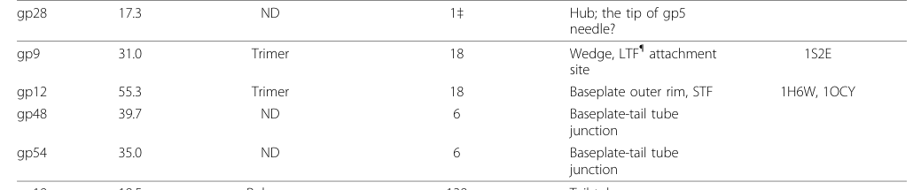

## Question

# Gene Research for Functional Annotation

## ⚠️ CRITICAL: Gene/Protein Identification Context

**BEFORE YOU BEGIN RESEARCH:** You MUST verify you are researching the CORRECT gene/protein. Gene symbols can be ambiguous, especially for less well-characterized genes from non-model organisms.

### Target Gene/Protein Identity (from UniProt):
- **UniProt Accession:** P13339
- **Protein Description:** RecName: Full=Baseplate tail-tube junction protein gp48 {ECO:0000305}; AltName: Full=Baseplate-tube cap {ECO:0000305}; AltName: Full=Gene product 48; Short=gp48;
- **Gene Information:** Name=48;
- **Organism (full):** Enterobacteria phage T4 (Bacteriophage T4).
- **Protein Family:** Not specified in UniProt
- **Key Domains:** Gp48_T4-like. (IPR024389); T4_tail_cap (PF11091)

### MANDATORY VERIFICATION STEPS:

1. **Check if the gene symbol "48" matches the protein description above**
2. **Verify the organism is correct:** Enterobacteria phage T4 (Bacteriophage T4).
3. **Check if protein family/domains align with what you find in literature**
4. **If you find literature for a DIFFERENT gene with the same or similar symbol, STOP**

### If Gene Symbol is Ambiguous or You Cannot Find Relevant Literature:

**DO NOT PROCEED WITH RESEARCH ON A DIFFERENT GENE.** Instead:
- State clearly: "The gene symbol '48' is ambiguous or literature is limited for this specific protein"
- Explain what you found (e.g., "Found extensive literature on a different gene with the same symbol in a different organism")
- Describe the protein based ONLY on the UniProt information provided above
- Suggest that the protein function can be inferred from domain/family information

### Research Target:

Please provide a comprehensive research report on the gene **48** (gene ID: 48, UniProt: P13339) in BPT4.

The research report should be a detailed narrative explaining the function, biological processes, and localization of the gene product. Citations should be given for all claims.

You should prioritize authoritative reviews and primary scientific literature when conducting research. You can supplement
this with annotations you find in gene/protein databases, but these can be outdated or inaccurate.

We are specifically interested in the primary function of the gene - for enzymes, what reaction is catalyzed, and what is the substrate specificity? For transporters, what is the substrate? For structural proteins or adapters, what is the broader structural role? For signaling molecules, what is the role in the pathway.

We are interested in where in or outside the cell the gene product carries out its function.

We are also interested in the signaling or biochemical pathways in which the gene functions. We are less interested in broad pleiotropic effects, except where these elucidate the precise role.

Include evidence where possible. We are interested in both experimental evidence as well as inference from structure, evolution, or bioinformatic analysis. Precise studies should be prioritized over high-throughput, where available.

## Output

Question: You are an expert researcher providing comprehensive, well-cited information.

Provide detailed information focusing on:
1. Key concepts and definitions with current understanding
2. Recent developments and latest research (prioritize 2023-2024 sources)
3. Current applications and real-world implementations
4. Expert opinions and analysis from authoritative sources
5. Relevant statistics and data from recent studies

Format as a comprehensive research report with proper citations. Include URLs and publication dates where available.
Always prioritize recent, authoritative sources and provide specific citations for all major claims.

# Gene Research for Functional Annotation

## ⚠️ CRITICAL: Gene/Protein Identification Context

**BEFORE YOU BEGIN RESEARCH:** You MUST verify you are researching the CORRECT gene/protein. Gene symbols can be ambiguous, especially for less well-characterized genes from non-model organisms.

### Target Gene/Protein Identity (from UniProt):
- **UniProt Accession:** P13339
- **Protein Description:** RecName: Full=Baseplate tail-tube junction protein gp48 {ECO:0000305}; AltName: Full=Baseplate-tube cap {ECO:0000305}; AltName: Full=Gene product 48; Short=gp48;
- **Gene Information:** Name=48;
- **Organism (full):** Enterobacteria phage T4 (Bacteriophage T4).
- **Protein Family:** Not specified in UniProt
- **Key Domains:** Gp48_T4-like. (IPR024389); T4_tail_cap (PF11091)

### MANDATORY VERIFICATION STEPS:

1. **Check if the gene symbol "48" matches the protein description above**
2. **Verify the organism is correct:** Enterobacteria phage T4 (Bacteriophage T4).
3. **Check if protein family/domains align with what you find in literature**
4. **If you find literature for a DIFFERENT gene with the same or similar symbol, STOP**

### If Gene Symbol is Ambiguous or You Cannot Find Relevant Literature:

**DO NOT PROCEED WITH RESEARCH ON A DIFFERENT GENE.** Instead:
- State clearly: "The gene symbol '48' is ambiguous or literature is limited for this specific protein"
- Explain what you found (e.g., "Found extensive literature on a different gene with the same symbol in a different organism")
- Describe the protein based ONLY on the UniProt information provided above
- Suggest that the protein function can be inferred from domain/family information

### Research Target:

Please provide a comprehensive research report on the gene **48** (gene ID: 48, UniProt: P13339) in BPT4.

The research report should be a detailed narrative explaining the function, biological processes, and localization of the gene product. Citations should be given for all claims.

You should prioritize authoritative reviews and primary scientific literature when conducting research. You can supplement
this with annotations you find in gene/protein databases, but these can be outdated or inaccurate.

We are specifically interested in the primary function of the gene - for enzymes, what reaction is catalyzed, and what is the substrate specificity? For transporters, what is the substrate? For structural proteins or adapters, what is the broader structural role? For signaling molecules, what is the role in the pathway.

We are interested in where in or outside the cell the gene product carries out its function.

We are also interested in the signaling or biochemical pathways in which the gene functions. We are less interested in broad pleiotropic effects, except where these elucidate the precise role.

Include evidence where possible. We are interested in both experimental evidence as well as inference from structure, evolution, or bioinformatic analysis. Precise studies should be prioritized over high-throughput, where available.

## Research Report: Functional Annotation of *Enterobacteria phage T4* gene 48 (gp48) (UniProt P13339)

### 1. Target verification (mandatory disambiguation)
The research target is *Enterobacteria phage T4* gene **48**, encoding **baseplate tail-tube junction protein gp48** (UniProt **P13339**; synonyms include “baseplate-tube cap” and “gene product 48”). The evidence assembled here consistently refers to **phage T4 structural protein gp48** positioned at the **baseplate–tail tube junction** and functioning in **tail morphogenesis**; no claims are drawn from unrelated “gp48” proteins in other organisms. (leiman2003structureandmorphogenesis pages 7-8, leiman2010morphogenesisofthe pages 2-5, ishimoto1988thestructureof pages 1-2)

### 2. Key concepts and definitions (current understanding)

#### 2.1 Contractile tail as an infection nanomachine
Phage T4 is a canonical *myovirus* with a contractile tail. During infection, the baseplate undergoes a major conformational change (hexagonal → star), triggering tail sheath contraction that drives the tail tube through the bacterial outer membrane to form a channel for genome delivery. Quantitatively, the sheath contraction changes tail sheath length from ~**925 Å** to ~**420 Å** (with a diameter increase from ~240 Å to ~330 Å). (aksyuk2009thetailsheath pages 1-2)

#### 2.2 “Tube initiator” / baseplate–tail tube junction proteins
In T4, **gp48** and **gp54** are classically described as **tube initiator proteins**: structural components added late in baseplate assembly that create the platform from which the major tail tube protein **gp19** polymerizes to form the tail tube. (leiman2003structureandmorphogenesis pages 7-8, yap2014structureandfunction pages 6-8)

### 3. Molecular function of gp48 (what it does)

#### 3.1 Primary function: structural initiator/adaptor for tail tube assembly
Across biochemical, genetic, and structural-assembly literature, **gp48 is not described as an enzyme**; rather, it is a **structural assembly factor** and stable virion component at the **baseplate–tail tube junction**.

Foundational work identified gp48 as one of three **tail-associated proteins (TAPs)** (genes **29**, **48**, **54**) that remain associated with tail tubes released from the baseplate by guanidine hydrochloride, supporting that gp48 is physically and functionally coupled to the tail tube/basal region. (ishimoto1988thestructureof pages 1-2)

#### 3.2 Requirement for tail-tube polymerization (gp19)
A key functional role is that a partially assembled baseplate cannot initiate tube formation until **six copies each** of **gp48** and **gp54** are added; after gp54 addition, **144 monomers of gp19** polymerize to form the tail tube in the classical assembly model. (ishimoto1988thestructureof pages 1-2)

Consistent with this, a later structural/morphogenesis review describes baseplate completion by attachment of **6×gp48 + 6×gp54** to the external interface between wedges and hub, where they serve as the **starting point for polymerization of gp19** to form the tail tube (also reported as **144** gp19 copies in this framework). (leiman2003structureandmorphogenesis pages 7-8)

### 4. Localization: where gp48 operates

#### 4.1 Virion localization
Evidence consistently places gp48 at the **baseplate–tail tube junction**:
- A widely cited tail morphogenesis review (Table of tail proteins) assigns gp48 to the **“Baseplate-tail tube junction”**. (leiman2010morphogenesisofthe pages 2-5, leiman2010morphogenesisofthe media 1eddbba7)
- Stoichiometry and placement are consistent with gp48 being part of the **top-of-hub / external interface between wedges and hub** region, where it attaches with gp54. (leiman2003structureandmorphogenesis pages 7-8, yap2014structureandfunction pages 6-8)

#### 4.2 Copy number and mass
Stoichiometry is repeatedly reported as **6 copies per tail/baseplate** with monomer mass about **39.7 kDa**. (leiman2010morphogenesisofthe pages 2-5, leiman2010morphogenesisofthe media 1eddbba7, leiman2003structureandmorphogenesis pages 7-8)

### 5. Protein–protein interactions and assembly pathway context

#### 5.1 Core interaction partner: gp54
Multiple sources converge that gp48 functions as a **gp48–gp54 module** at the baseplate–tube junction:
- gp48 and gp54 must be sequentially added to enable tube polymerization; both are required to initiate tail-tube assembly. (ishimoto1988thestructureof pages 1-2)
- gp48 associates with gp54 to provide the base for the tail-tube junction/assembly platform. (gonzalez2021structuralstudiesof pages 18-20)

#### 5.2 Functional coupling with gp29 (tape-measure/ruler protein)
Baseplate/tail assembly work on gp29 indicates that **gp54 and gp48 are added to the top of the baseplate before gp19 polymerizes**, and that they bind to **gp29** as parts of tail-tube associated proteins. (lou2002theroleof pages 102-106)

#### 5.3 Genetic coupling with gene 54 (polarity / translational coupling)
Classical genetic analysis reported that nonsense mutations in gene 48 can reduce gene 54 expression by ~**30-fold**, consistent with strong polarity/translational coupling between the adjacent genes 48 and 54 (overlapping stop/start and lack of an independent ribosome binding site for gene 54 were suggested). This supports a functional requirement for coordinated gp48/gp54 production for correct tail assembly. (ishimoto1988thestructureof pages 7-8)

### 6. Recent developments (prioritizing 2023–2024)

#### 6.1 2024 structural perspective: gp48 in genome-flow/infection mechanics
A 2024 T4-focused structural study on post-packaging genome flow reports that **six coiled-coil strands of the tape-measure protein (TMP; gp29)** form the innermost tail tube and are connected at the **bottom end with gp48 tube and baseplate**, explicitly positioning gp48 as the structural connector between the TMP-derived inner tube architecture and the baseplate. This frames gp48 not only as an assembly initiator but also as part of the structural pathway enabling genome positioning and delivery during infection-related transitions. (rao2024structuralmechanismsof pages 1-1)

#### 6.2 2023 conceptual framing in modern reviews
A 2023 review on phage adsorption (focused on Gram-positive hosts but discussing phage tail architecture) uses the T4 **gp48/gp54** pair as the canonical example of a **baseplate hub (BH) / tail tube initiator** module in contractile-tailed phage-like systems, illustrating the continuing role of the T4 model in interpreting contractile injection mechanisms. (leprince2023phageadsorptionto pages 1-2)

*Evidence limitation:* within the retrieved corpus, recent (2023–2024) sources provide updated mechanistic placement of gp48 in the tail machine (notably via TMP connectivity), but do **not** provide new residue-level atomic structures of gp48 itself; the gp48–gp54 complex structure is still noted as unresolved in earlier expert reviews of T4 tail assembly (not captured in evidence snippets here). Therefore, conclusions about domains (Gp48_T4-like; PF11091) cannot be independently validated from the retrieved full-text evidence and should be treated as database-derived context rather than literature-demonstrated findings in this report.

### 7. Biological processes and pathways

#### 7.1 Role in virion morphogenesis
gp48 participates in a well-defined morphogenetic sequence:
1. Baseplate wedge/hub assembly progresses.
2. Baseplate completion occurs by attaching **6×gp48 + 6×gp54** at the wedges–hub interface.
3. This creates the platform for **gp19 polymerization** to form the tail tube (reported as **144 gp19** subunits in classic assembly frameworks).
4. Tail sheath (gp18) polymerizes around the tail tube and later contracts during infection.

This positions gp48 centrally in the pathway linking **baseplate completion → tube initiation → sheath/tube assembly**, which is ultimately required for infection. (leiman2003structureandmorphogenesis pages 7-8, ishimoto1988thestructureof pages 1-2, yap2014structureandfunction pages 6-8)

#### 7.2 Infection efficiency context (quantitative)
While the retrieved evidence does not quantify gp48-specific infection phenotypes, the broader T4 tail literature emphasizes that the contractile tail confers extremely high infection efficiency; for example, one expert review states the efficiency of T4 infection is “almost **1.0**” (nearly every adsorbed particle successfully infects). This provides system-level context for why precise assembly of the tail/baseplate junction components (including gp48) is under strong functional constraint. (arisaka2016molecularassemblyand pages 1-2)

### 8. Current applications and real-world implementations (gp48-relevant)
Although gp48 itself is not a therapeutic target or enzyme, its biological role is practically important because T4 tail architecture is used as a reference blueprint for:
- **Contractile injection system engineering** and interpretation (phage tails, tailocins/pyocins, extracellular CIS, and T6SS analogies), where “tube initiator” modules are often discussed using T4 gp48/gp54 as the canonical example. (leprince2023phageadsorptionto pages 1-2)
- Structural/mechanistic models of infection for contractile-tailed phages, where the baseplate-to-tube junction is an essential mechanical interface controlling tube deployment and genome delivery. (aksyuk2009thetailsheath pages 1-2, rao2024structuralmechanismsof pages 1-1)

### 9. Expert opinion and synthesis (authoritative interpretation)
The most consistent expert interpretation across decades of T4 structural biology is that **gp48 is a stoichiometric, baseplate-proximal structural component** whose essential functional contribution is to form (with gp54) the **tube initiation/junction complex** that couples a completed baseplate to subsequent tail tube (gp19) and sheath (gp18) polymerization. This is articulated in highly cited reviews and supported by classical biochemical genetics showing that tube formation does not proceed without gp48/gp54 addition. (leiman2003structureandmorphogenesis pages 7-8, ishimoto1988thestructureof pages 1-2, yap2014structureandfunction pages 6-8)

More recent structural work (2024) extends this view by embedding gp48 within a broader mechanical pathway for genome positioning and release, by placing gp48 at the connection between the TMP-derived inner tube architecture and the baseplate. (rao2024structuralmechanismsof pages 1-1)

### 10. Key quantitative summary (recent and classical)
- gp48 monomer mass: **~39.7 kDa** (leiman2010morphogenesisofthe pages 2-5, leiman2003structureandmorphogenesis pages 7-8)
- gp48 stoichiometry in tail/baseplate: **6 copies** (leiman2010morphogenesisofthe pages 2-5, leiman2010morphogenesisofthe media 1eddbba7, leiman2003structureandmorphogenesis pages 7-8)
- Assembly requirement: baseplate must receive **6×gp48 and 6×gp54** before initiating tube polymerization (ishimoto1988thestructureof pages 1-2)
- Tail tube polymerization: after gp54 addition, **144 gp19 monomers** polymerize to form the tube (ishimoto1988thestructureof pages 1-2)
- Tail sheath contraction magnitude: **925 Å → 420 Å** (system context for tail mechanics) (aksyuk2009thetailsheath pages 1-2)

### 11. Evidence table
The following table compiles the key annotation facts and evidence pointers.

| Gene/protein | Synonyms | Organism / identifier | Location in virion | Role in assembly / morphogenesis | Known interaction partners / assembly context | Quantitative data | Key supporting sources (year; URL) |
|---|---|---|---|---|---|---|---|
| gene 48 product gp48 | Baseplate tail-tube junction protein gp48; baseplate-tube cap; gene product 48 | *Enterobacteria phage T4*; UniProt P13339 | Baseplate–tail tube junction; attached at the top of the hub / external interface between wedges and hub; part of the platform at the proximal end of the tail tube (leiman2010morphogenesisofthe pages 2-5, leiman2003structureandmorphogenesis pages 7-8, yap2014structureandfunction pages 6-8, taylor2018contractileinjectionsystems pages 1-6, leiman2010morphogenesisofthe media 1eddbba7) | Structural tube-initiator / adapter, not an enzyme; gp48 is added late in baseplate assembly together with gp54 to complete the baseplate and create the platform that nucleates tail-tube polymerization by gp19 and supports subsequent sheath assembly by gp18 (leiman2003structureandmorphogenesis pages 7-8, ishimoto1988thestructureof pages 1-2, yap2014structureandfunction pages 6-8, taylor2018contractileinjectionsystems pages 1-6) | Directly/functionally associated with gp54; required before gp19 tube polymerization; located near gp25 (sheath assembly initiator) and linked to hub/wedge structures; recent T4 structural work places gp48 at the bottom end of the tape-measure protein (gp29/TMP) tube where it connects the inner tube to the baseplate (ishimoto1988thestructureof pages 1-2, yap2014structureandfunction pages 6-8, taylor2018contractileinjectionsystems pages 1-6, rao2024structuralmechanismsof pages 1-1) | Monomer mass ~39.7 kDa; stoichiometry 6 copies per tail/baseplate; after sequential addition of six gp48 and six gp54, 144 gp19 monomers polymerize to form the tail tube; T4 tail length ~98 nm in the classical assembly study (leiman2010morphogenesisofthe pages 2-5, leiman2003structureandmorphogenesis pages 7-8, ishimoto1988thestructureof pages 1-2, leiman2010morphogenesisofthe media 1eddbba7) | Leiman et al., 2010, *Virology Journal* — https://doi.org/10.1186/1743-422X-7-355 ; Leiman et al., 2003, *Cell Mol Life Sci* — https://doi.org/10.1007/s00018-003-3072-1 ; Ishimoto et al., 1988, *Virology* — https://doi.org/10.1016/0042-6822(88)90622-8 ; Yap & Rossmann, 2014, *Future Microbiology* — https://doi.org/10.2217/fmb.14.91 ; Taylor et al., 2018, *Mol Microbiol* — https://doi.org/10.1111/mmi.13921 ; Rao, 2024, recent T4 structural study cited in retrieved context (leiman2010morphogenesisofthe pages 2-5, leiman2003structureandmorphogenesis pages 7-8, ishimoto1988thestructureof pages 1-2, yap2014structureandfunction pages 6-8, taylor2018contractileinjectionsystems pages 1-6, rao2024structuralmechanismsof pages 1-1) |

*Table: This table compiles the main functional annotation facts for Enterobacteria phage T4 gp48 (gene 48; UniProt P13339), including localization, assembly role, interaction partners, and quantitative stoichiometric data. It is useful as a compact evidence-backed reference for the protein’s structural role in T4 tail morphogenesis.*

### 12. Primary source URLs and publication dates (most relevant)
- Ishimoto et al. “The structure of three bacteriophage T4 genes required for tail-tube assembly.” *Virology* (May 1988). https://doi.org/10.1016/0042-6822(88)90622-8 (ishimoto1988thestructureof pages 1-2)
- Leiman et al. “Structure and morphogenesis of bacteriophage T4.” *Cellular and Molecular Life Sciences* (Nov 2003). https://doi.org/10.1007/s00018-003-3072-1 (leiman2003structureandmorphogenesis pages 7-8)
- Aksyuk et al. “The tail sheath structure of bacteriophage T4: a molecular machine for infecting bacteria.” *The EMBO Journal* (Published online 19 Feb 2009). https://doi.org/10.1038/emboj.2009.36 (aksyuk2009thetailsheath pages 1-2)
- Leiman et al. “Morphogenesis of the T4 tail and tail fibers.” *Virology Journal* (Dec 2010). https://doi.org/10.1186/1743-422X-7-355 (leiman2010morphogenesisofthe pages 2-5)
- Yap & Rossmann. “Structure and function of bacteriophage T4.” *Future Microbiology* (Dec 2014). https://doi.org/10.2217/fmb.14.91 (yap2014structureandfunction pages 6-8)
- Leprince & Mahillon. “Phage Adsorption to Gram-Positive Bacteria.” *Viruses* (Published 10 Jan 2023). https://doi.org/10.3390/v15010196 (leprince2023phageadsorptionto pages 1-2)
- Rao et al. “Structural mechanisms of post-packaging genome flow in bacteriophage T4.” (2024; venue not specified in retrieved text). (rao2024structuralmechanismsof pages 1-1)

### 13. Gaps and recommended next steps (for deeper functional annotation)
Within the retrieved literature excerpts, gp48’s **domain architecture (Gp48_T4-like; PF11091/T4_tail_cap)** is not explicitly discussed, and an atomic structure for gp48 (or the gp48–gp54 complex) is not directly provided. For a deeper annotation, recommended next steps include (i) targeted retrieval of recent high-resolution structural papers specifically resolving the gp48–gp54 tube initiator complex, and (ii) direct curation from InterPro/Pfam entries cross-linked to P13339, followed by structural homology modeling and mapping to known baseplate/tube interfaces.

References

1. (leiman2003structureandmorphogenesis pages 7-8): P. G. Leiman, S. Kanamaru, V. V. Mesyanzhinov, F. Arisaka, and M. G. Rossmann. Structure and morphogenesis of bacteriophage t4. Cellular and Molecular Life Sciences CMLS, 60:2356-2370, Nov 2003. URL: https://doi.org/10.1007/s00018-003-3072-1, doi:10.1007/s00018-003-3072-1. This article has 359 citations.

2. (leiman2010morphogenesisofthe pages 2-5): Petr G Leiman, Fumio Arisaka, Mark J van Raaij, Victor A Kostyuchenko, Anastasia A Aksyuk, Shuji Kanamaru, and Michael G Rossmann. Morphogenesis of the t4 tail and tail fibers. Virology Journal, 7:355-355, Dec 2010. URL: https://doi.org/10.1186/1743-422x-7-355, doi:10.1186/1743-422x-7-355. This article has 319 citations and is from a peer-reviewed journal.

3. (ishimoto1988thestructureof pages 1-2): Lance K. Ishimoto, Karyn S. Ishimoto, Antonio Cascino, Marilena Cipollaro, and Frederick A. Eiserling. The structure of three bacteriophage t4 genes required for tail-tube assembly. Virology, 164 1:81-90, May 1988. URL: https://doi.org/10.1016/0042-6822(88)90622-8, doi:10.1016/0042-6822(88)90622-8. This article has 17 citations and is from a peer-reviewed journal.

4. (aksyuk2009thetailsheath pages 1-2): Anastasia A Aksyuk, Petr G Leiman, Lidia P Kurochkina, Mikhail M Shneider, Victor A Kostyuchenko, Vadim V Mesyanzhinov, and Michael G Rossmann. The tail sheath structure of bacteriophage t4: a molecular machine for infecting bacteria. The EMBO Journal, 28:821-829, Feb 2009. URL: https://doi.org/10.1038/emboj.2009.36, doi:10.1038/emboj.2009.36. This article has 150 citations.

5. (yap2014structureandfunction pages 6-8): Moh Lan Yap and Michael G Rossmann. Structure and function of bacteriophage t4. Future microbiology, 9 12:1319-27, Dec 2014. URL: https://doi.org/10.2217/fmb.14.91, doi:10.2217/fmb.14.91. This article has 282 citations and is from a peer-reviewed journal.

6. (leiman2010morphogenesisofthe media 1eddbba7): Petr G Leiman, Fumio Arisaka, Mark J van Raaij, Victor A Kostyuchenko, Anastasia A Aksyuk, Shuji Kanamaru, and Michael G Rossmann. Morphogenesis of the t4 tail and tail fibers. Virology Journal, 7:355-355, Dec 2010. URL: https://doi.org/10.1186/1743-422x-7-355, doi:10.1186/1743-422x-7-355. This article has 319 citations and is from a peer-reviewed journal.

7. (gonzalez2021structuralstudiesof pages 18-20): Brenda Gonzalez. Structural studies of the phage g capsid and helical tail sheath using cryo-em. ArXiv, Aug 2021. URL: https://doi.org/10.25394/pgs.15156780.v1, doi:10.25394/pgs.15156780.v1. This article has 0 citations.

8. (lou2002theroleof pages 102-106): Y Lou. The role of baseplate protein gp29 in bacteriophage t4 tail assembly. Unknown journal, 2002.

9. (ishimoto1988thestructureof pages 7-8): Lance K. Ishimoto, Karyn S. Ishimoto, Antonio Cascino, Marilena Cipollaro, and Frederick A. Eiserling. The structure of three bacteriophage t4 genes required for tail-tube assembly. Virology, 164 1:81-90, May 1988. URL: https://doi.org/10.1016/0042-6822(88)90622-8, doi:10.1016/0042-6822(88)90622-8. This article has 17 citations and is from a peer-reviewed journal.

10. (rao2024structuralmechanismsof pages 1-1): V Rao. Structural mechanisms of post-packaging genome flow in bacteriophage t4. Unknown journal, 2024.

11. (leprince2023phageadsorptionto pages 1-2): Audrey Leprince and Jacques Mahillon. Phage adsorption to gram-positive bacteria. Viruses, 15:196, Jan 2023. URL: https://doi.org/10.3390/v15010196, doi:10.3390/v15010196. This article has 104 citations.

12. (arisaka2016molecularassemblyand pages 1-2): Fumio Arisaka, Moh Lan Yap, Shuji Kanamaru, and Michael G. Rossmann. Molecular assembly and structure of the bacteriophage t4 tail. Biophysical Reviews, 8:385-396, Nov 2016. URL: https://doi.org/10.1007/s12551-016-0230-x, doi:10.1007/s12551-016-0230-x. This article has 55 citations and is from a peer-reviewed journal.

13. (taylor2018contractileinjectionsystems pages 1-6): Nicholas M. I. Taylor, Mark J. van Raaij, and Petr G. Leiman. Contractile injection systems of bacteriophages and related systems. Molecular Microbiology, 108:6-15, Apr 2018. URL: https://doi.org/10.1111/mmi.13921, doi:10.1111/mmi.13921. This article has 167 citations and is from a domain leading peer-reviewed journal.

## Artifacts

- [Edison artifact artifact-00](48-deep-research-falcon_artifacts/artifact-00.md)

## Citations

1. aksyuk2009thetailsheath pages 1-2
2. ishimoto1988thestructureof pages 1-2
3. leiman2003structureandmorphogenesis pages 7-8
4. gonzalez2021structuralstudiesof pages 18-20
5. lou2002theroleof pages 102-106
6. ishimoto1988thestructureof pages 7-8
7. rao2024structuralmechanismsof pages 1-1
8. leprince2023phageadsorptionto pages 1-2
9. arisaka2016molecularassemblyand pages 1-2
10. leiman2010morphogenesisofthe pages 2-5
11. yap2014structureandfunction pages 6-8
12. taylor2018contractileinjectionsystems pages 1-6
13. https://doi.org/10.1186/1743-422X-7-355
14. https://doi.org/10.1007/s00018-003-3072-1
15. https://doi.org/10.1016/0042-6822(88
16. https://doi.org/10.2217/fmb.14.91
17. https://doi.org/10.1111/mmi.13921
18. https://doi.org/10.1038/emboj.2009.36
19. https://doi.org/10.3390/v15010196
20. https://doi.org/10.1007/s00018-003-3072-1,
21. https://doi.org/10.1186/1743-422x-7-355,
22. https://doi.org/10.1038/emboj.2009.36,
23. https://doi.org/10.2217/fmb.14.91,
24. https://doi.org/10.25394/pgs.15156780.v1,
25. https://doi.org/10.3390/v15010196,
26. https://doi.org/10.1007/s12551-016-0230-x,
27. https://doi.org/10.1111/mmi.13921,