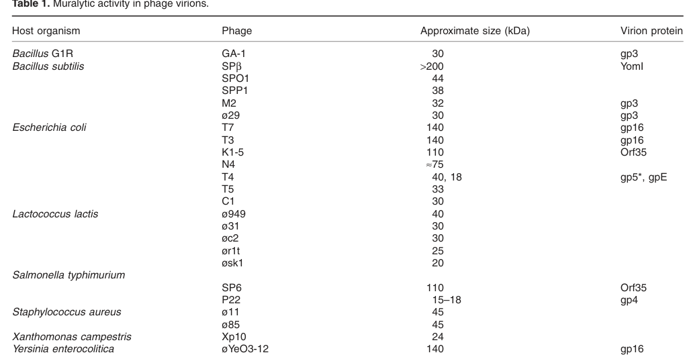

## Question

# Gene Research for Functional Annotation

## ⚠️ CRITICAL: Gene/Protein Identification Context

**BEFORE YOU BEGIN RESEARCH:** You MUST verify you are researching the CORRECT gene/protein. Gene symbols can be ambiguous, especially for less well-characterized genes from non-model organisms.

### Target Gene/Protein Identity (from UniProt):
- **UniProt Accession:** P16009
- **Protein Description:** RecName: Full=Pre-baseplate central spike protein Gp5 {ECO:0000255|HAMAP-Rule:MF_04151, ECO:0000303|PubMed:10217762, ECO:0000303|PubMed:27193680}; Short=Pre-Gp5 {ECO:0000255|HAMAP-Rule:MF_04151, ECO:0000303|PubMed:16956798}; AltName: Full=Peptidoglycan hydrolase gp5 {ECO:0000255|HAMAP-Rule:MF_04151}; EC=3.2.1.17 {ECO:0000255|HAMAP-Rule:MF_04151, ECO:0000269|PubMed:10217762, ECO:0000269|PubMed:3157805}; Contains: RecName: Full=Baseplate central spike protein Gp5* {ECO:0000255|HAMAP-Rule:MF_04151}; AltName: Full=Mature Gp5 {ECO:0000255|HAMAP-Rule:MF_04151, ECO:0000303|PubMed:16956798}; Contains: RecName: Full=Gp5C {ECO:0000255|HAMAP-Rule:MF_04151, ECO:0000303|PubMed:16956798};
- **Gene Information:** Name=5 {ECO:0000255|HAMAP-Rule:MF_04151};
- **Organism (full):** Enterobacteria phage T4 (Bacteriophage T4).
- **Protein Family:** Belongs to the glycosyl hydrolase 24 family.
- **Key Domains:** Glyco_hydro_24. (IPR002196); Gp5_C. (IPR010609); Gp5_OB_N. (IPR009590); Lysozyme-like_dom_sf. (IPR023346); Lysozyme_dom_sf. (IPR023347)

### MANDATORY VERIFICATION STEPS:

1. **Check if the gene symbol "5" matches the protein description above**
2. **Verify the organism is correct:** Enterobacteria phage T4 (Bacteriophage T4).
3. **Check if protein family/domains align with what you find in literature**
4. **If you find literature for a DIFFERENT gene with the same or similar symbol, STOP**

### If Gene Symbol is Ambiguous or You Cannot Find Relevant Literature:

**DO NOT PROCEED WITH RESEARCH ON A DIFFERENT GENE.** Instead:
- State clearly: "The gene symbol '5' is ambiguous or literature is limited for this specific protein"
- Explain what you found (e.g., "Found extensive literature on a different gene with the same symbol in a different organism")
- Describe the protein based ONLY on the UniProt information provided above
- Suggest that the protein function can be inferred from domain/family information

### Research Target:

Please provide a comprehensive research report on the gene **5** (gene ID: 5, UniProt: P16009) in BPT4.

The research report should be a detailed narrative explaining the function, biological processes, and localization of the gene product. Citations should be given for all claims.

You should prioritize authoritative reviews and primary scientific literature when conducting research. You can supplement
this with annotations you find in gene/protein databases, but these can be outdated or inaccurate.

We are specifically interested in the primary function of the gene - for enzymes, what reaction is catalyzed, and what is the substrate specificity? For transporters, what is the substrate? For structural proteins or adapters, what is the broader structural role? For signaling molecules, what is the role in the pathway.

We are interested in where in or outside the cell the gene product carries out its function.

We are also interested in the signaling or biochemical pathways in which the gene functions. We are less interested in broad pleiotropic effects, except where these elucidate the precise role.

Include evidence where possible. We are interested in both experimental evidence as well as inference from structure, evolution, or bioinformatic analysis. Precise studies should be prioritized over high-throughput, where available.

## Output

Question: You are an expert researcher providing comprehensive, well-cited information.

Provide detailed information focusing on:
1. Key concepts and definitions with current understanding
2. Recent developments and latest research (prioritize 2023-2024 sources)
3. Current applications and real-world implementations
4. Expert opinions and analysis from authoritative sources
5. Relevant statistics and data from recent studies

Format as a comprehensive research report with proper citations. Include URLs and publication dates where available.
Always prioritize recent, authoritative sources and provide specific citations for all major claims.

# Gene Research for Functional Annotation

## ⚠️ CRITICAL: Gene/Protein Identification Context

**BEFORE YOU BEGIN RESEARCH:** You MUST verify you are researching the CORRECT gene/protein. Gene symbols can be ambiguous, especially for less well-characterized genes from non-model organisms.

### Target Gene/Protein Identity (from UniProt):
- **UniProt Accession:** P16009
- **Protein Description:** RecName: Full=Pre-baseplate central spike protein Gp5 {ECO:0000255|HAMAP-Rule:MF_04151, ECO:0000303|PubMed:10217762, ECO:0000303|PubMed:27193680}; Short=Pre-Gp5 {ECO:0000255|HAMAP-Rule:MF_04151, ECO:0000303|PubMed:16956798}; AltName: Full=Peptidoglycan hydrolase gp5 {ECO:0000255|HAMAP-Rule:MF_04151}; EC=3.2.1.17 {ECO:0000255|HAMAP-Rule:MF_04151, ECO:0000269|PubMed:10217762, ECO:0000269|PubMed:3157805}; Contains: RecName: Full=Baseplate central spike protein Gp5* {ECO:0000255|HAMAP-Rule:MF_04151}; AltName: Full=Mature Gp5 {ECO:0000255|HAMAP-Rule:MF_04151, ECO:0000303|PubMed:16956798}; Contains: RecName: Full=Gp5C {ECO:0000255|HAMAP-Rule:MF_04151, ECO:0000303|PubMed:16956798};
- **Gene Information:** Name=5 {ECO:0000255|HAMAP-Rule:MF_04151};
- **Organism (full):** Enterobacteria phage T4 (Bacteriophage T4).
- **Protein Family:** Belongs to the glycosyl hydrolase 24 family.
- **Key Domains:** Glyco_hydro_24. (IPR002196); Gp5_C. (IPR010609); Gp5_OB_N. (IPR009590); Lysozyme-like_dom_sf. (IPR023346); Lysozyme_dom_sf. (IPR023347)

### MANDATORY VERIFICATION STEPS:

1. **Check if the gene symbol "5" matches the protein description above**
2. **Verify the organism is correct:** Enterobacteria phage T4 (Bacteriophage T4).
3. **Check if protein family/domains align with what you find in literature**
4. **If you find literature for a DIFFERENT gene with the same or similar symbol, STOP**

### If Gene Symbol is Ambiguous or You Cannot Find Relevant Literature:

**DO NOT PROCEED WITH RESEARCH ON A DIFFERENT GENE.** Instead:
- State clearly: "The gene symbol '5' is ambiguous or literature is limited for this specific protein"
- Explain what you found (e.g., "Found extensive literature on a different gene with the same symbol in a different organism")
- Describe the protein based ONLY on the UniProt information provided above
- Suggest that the protein function can be inferred from domain/family information

### Research Target:

Please provide a comprehensive research report on the gene **5** (gene ID: 5, UniProt: P16009) in BPT4.

The research report should be a detailed narrative explaining the function, biological processes, and localization of the gene product. Citations should be given for all claims.

You should prioritize authoritative reviews and primary scientific literature when conducting research. You can supplement
this with annotations you find in gene/protein databases, but these can be outdated or inaccurate.

We are specifically interested in the primary function of the gene - for enzymes, what reaction is catalyzed, and what is the substrate specificity? For transporters, what is the substrate? For structural proteins or adapters, what is the broader structural role? For signaling molecules, what is the role in the pathway.

We are interested in where in or outside the cell the gene product carries out its function.

We are also interested in the signaling or biochemical pathways in which the gene functions. We are less interested in broad pleiotropic effects, except where these elucidate the precise role.

Include evidence where possible. We are interested in both experimental evidence as well as inference from structure, evolution, or bioinformatic analysis. Precise studies should be prioritized over high-throughput, where available.

## Research report: Enterobacteria phage T4 gene 5 (gp5; UniProt P16009)

### 1) Target verification (identity, organism, and synonym control)
The queried gene symbol **“5”** is ambiguous across biology, but in the context provided (UniProt **P16009**), it corresponds specifically to **Enterobacteria phage T4 gene 5** encoding the **pre-baseplate central spike protein gp5**, a virion/baseplate-associated protein with a lysozyme-like (muramidase) domain and a structural needle domain used during host penetration. This identity is consistent with primary experimental literature describing **T4 gp5** as a **baseplate hub/central spike protein** that is **proteolytically processed during baseplate assembly** and exhibits **peptidoglycan-hydrolytic activity**. (moak2004peptidoglycanhydrolyticactivities pages 2-4, kanamaru2002structureofthe pages 1-1)

### 2) Key concepts and definitions (current understanding)

#### 2.1 Virion-associated peptidoglycan hydrolases (VAPGHs) / ectolysins
A core concept for gp5 annotation is that many tailed phages carry **virion-associated enzymes** that locally weaken the bacterial cell wall to permit **tail tube penetration and genome injection**. In T4, gp5 is a canonical example of a **tail/baseplate-associated muralytic enzyme** proposed to perform *localized* digestion rather than global lysis during entry. (moak2004peptidoglycanhydrolyticactivities pages 1-2, leprince2023phageadsorptionto pages 9-10)

#### 2.2 The T4 “cell-puncturing device”
T4 uses a contractile tail: adsorption triggers **baseplate rearrangement** and **tail-sheath contraction**, which drives a **central puncturing apparatus** at the baseplate center into the host envelope. In T4, the central puncturing device is formed by a **(gp27–gp5*–gp5C)3** complex, which aligns with and extends the tail tube to form a penetration and DNA-translocation path. (kanamaru2002structureofthe pages 1-1, kanamaru2002structureofthe pages 1-3)

### 3) Molecular function (reaction, substrate specificity, regulation)

#### 3.1 Enzymatic activity and reaction
T4 gp5 contains a **lysozyme-like muramidase domain** (EC **3.2.1.17**, N-acetylmuramidase). Experimental literature summarized by Moak & Molineux reports that gp5 “has been shown to have the same substrate specificity as the gpE lysozyme,” and the lysozyme reaction is cleavage of the **β-1,4 glycosidic bond between NAM and NAG** in peptidoglycan. (moak2004peptidoglycanhydrolyticactivities pages 1-2, moak2004peptidoglycanhydrolyticactivities pages 2-4)

Kanamaru et al. provide structural evidence that gp5’s lysozyme domain shares conserved catalytic residues with T4 lysozyme and is positioned to digest peptidoglycan during puncturing. (kanamaru2002structureofthe pages 1-1, kanamaru2002structureofthe pages 3-5)

#### 3.2 Substrate specificity and functional context
The substrate is **bacterial peptidoglycan (murein)**, specifically the glycan backbone (NAM–NAG polymer). The conceptual role is **localized cleavage** at the site of tail penetration rather than extensive degradation that would rupture the cell during entry. (moak2004peptidoglycanhydrolyticactivities pages 1-2, kanamaru2002structureofthe pages 5-5)

#### 3.3 Regulation by proteolysis and oligomerization
A key functional nuance is that gp5’s activity is regulated by maturation/assembly state:
* **gp5 is synthesized as a ~63 kDa precursor** and processed during baseplate assembly to **gp5*** (reported as ~43 kDa). (moak2004peptidoglycanhydrolyticactivities pages 2-4)
* **Maturational cleavage occurs between Ser351 and Ala352** when gp5 is incorporated into the baseplate (or at high concentration). (kanamaru2002structureofthe pages 1-1)
* Removal of a C-terminal fragment increases enzymatic activity by **~10-fold**, indicating that the C-terminal region modulates/occludes catalytic function until the appropriate stage. (moak2004peptidoglycanhydrolyticactivities pages 2-4)
* In the assembled trimeric complex, structural contacts occlude binding features and help explain why trimeric gp5* is less active than monomeric gp5*. (kanamaru2002structureofthe pages 3-5)

### 4) Domain architecture and structural role in the virion

Kanamaru et al. solved the crystal structure of the **heterononameric (gp27–gp5*–gp5C)3** complex and provide the most authoritative domain-level functional annotation.

#### 4.1 gp5 domain organization (structure-defined)
**gp5 is a modular, multi-domain protein**:
1. **N-terminal OB-fold (β-barrel)**: inserted into a cylinder formed by gp27 and proposed to contribute to the DNA-ejection/puncturing channel; also discussed as an oligosaccharide-binding fold whose binding surfaces may be partly occluded in the assembled trimer. (kanamaru2002structureofthe pages 1-1, kanamaru2002structureofthe pages 3-5)
2. **Central lysozyme domain**: positioned peripherally to digest peptidoglycan; ~43% sequence identity to cytoplasmic T4 lysozyme is reported. (kanamaru2002structureofthe pages 1-1)
3. **C-terminal β-helix “needle/prism” (gp5C)**: a three-start β-helix that oligomerizes into a pointed triangular prism (needle-like puncturing element). (kanamaru2002structureofthe pages 1-1, kanamaru2002structureofthe pages 3-5)

#### 4.2 Processed products: gp5*, gp5C, and assembly into the puncturing complex
Kanamaru et al. report that gp5 is **cleaved** during maturation into **gp5*** (N-terminal portion containing the lysozyme domain) and **gp5C** (C-terminal β-helix trimer), and that both are present in the assembled puncturing complex. (kanamaru2002structureofthe pages 1-3)

The β-helix prism is described as ~**110 Å long** and ~**28 Å diameter**, and the overall complex is described as a ~**190 Å torch** with a gp27 cylindrical head. (kanamaru2002structureofthe pages 1-3, kanamaru2002structureofthe pages 3-5)

#### 4.3 Role of gp27–gp5 in baseplate assembly and infectivity
Kanamaru et al. state that **mutants lacking gp5 or gp27** produce **hubless, non-infectious particles**, supporting an essential structural role in assembly and infection. (kanamaru2002structureofthe pages 1-1)

### 5) Biological process: adsorption-triggered penetration and DNA injection

#### 5.1 Proposed mechanism during infection
A mechanistic model supported by structural data is:
1. **Host attachment** triggers baseplate conformational change and **tail-sheath contraction**.
2. Contraction transmits force through the gp27 cylinder and gp5 N-terminal region.
3. The gp5 **β-helix needle** is driven through the **outer membrane (~40 Å thickness)**.
4. The **lysozyme domains** then digest peptidoglycan to permit the tail tube to traverse the cell wall and reach the inner membrane for DNA injection. (kanamaru2002structureofthe pages 5-5, kanamaru2002structureofthe pages 1-1)

#### 5.2 Caution on “necessity” vs “associated activity”
Moak & Molineux emphasize an important interpretive caution: simply detecting muralytic activity in virions does not alone prove that peptidoglycan digestion is strictly required for infection in all conditions, and virion preparations can contain fragments/enzymes that complicate inference. Nonetheless, multiple genetic and biochemical lines of evidence support gp5 as a virion/baseplate-associated muramidase with a role in localized wall weakening. (moak2004peptidoglycanhydrolyticactivities pages 9-10, moak2004peptidoglycanhydrolyticactivities pages 1-2)

### 6) Localization (where gp5 acts)
The gp5 gene product is a **structural virion protein localized to the baseplate center (central spike/puncturing apparatus)** at the distal end of the tail, where it acts externally on the host envelope during adsorption and contraction-driven penetration. (leprince2023phageadsorptionto pages 9-10, kanamaru2002structureofthe pages 1-1)

**Direct biochemical support for virion association** comes from virion analyses showing a peptidoglycan-hydrolytic activity band near **~40 kDa** corresponding to **gp5*** (and a second band corresponding to gpE). (moak2004peptidoglycanhydrolyticactivities media b0febb0f, moak2004peptidoglycanhydrolyticactivities media cc275793)

### 7) Recent developments (prioritizing 2023–2024 sources) and connection to gp5

#### 7.1 2023 synthesis: adsorption, penetration, and enzyme-assisted entry
A 2023 Viruses review uses **T4** as a key model for adsorption/penetration architecture and explicitly frames the **gp27–gp5–gp5.4** apparatus as responsible for **membrane penetration and peptidoglycan degradation** during adsorption. It also highlights that such spike proteins can combine a **muramidase domain** with a **β-rich puncturing region**, consistent with the gp5 domain logic established by structural biology. (leprince2023phageadsorptionto pages 9-10)

The same 2023 review emphasizes broader modern themes that extend from the T4 gp5 paradigm: virion-associated peptidoglycan hydrolases and other virion enzymes (including those in tape-measure proteins or baseplate spikes) are increasingly recognized as key determinants of efficient penetration and are being leveraged for host-range engineering and antivirulence strategies. (leprince2023phageadsorptionto pages 7-9, leprince2023phageadsorptionto pages 23-24)

#### 7.2 2024 context (adjacent systems and generalization)
Direct 2024 T4 gp5-focused primary results were not retrieved in the current library; however, 2024 structural work on **contractile tail-like systems** continues to reference **T4 gp27–gp5** as a structural archetype for puncturing spikes in related nanomachines, reinforcing the continuing relevance of the gp5 mechanism as a comparative model. (leprince2023phageadsorptionto pages 9-10)

### 8) Current applications and real-world implementations (tail spikes / VAPGHs; gp5 as a model)
Although T4 gp5 itself is primarily a mechanistic model protein, the broader class of **tail spikes** and **virion-associated hydrolases** has multiple applied uses.

#### 8.1 Diagnostics and detection (quantitative examples)
Phage tail fibers/spikes can act as highly specific capture reagents. Examples compiled in a 2021 review include:
* An enzyme-linked long tail fiber assay (EELTA) reported sensitivity as low as **10^2 CFU/mL** for *Salmonella typhimurium*. (aslam2021bacteriophageproteomeinsights pages 5-7)
* Tail-fiber immobilization on paramagnetic beads reported a **98% detection rate** for *S. typhimurium*. (aslam2021bacteriophageproteomeinsights pages 5-7)

These implementations are enabled by the same molecular principles that make gp5 and related tail proteins effective: high-specificity surface recognition and robust structural scaffolds. (aslam2021bacteriophageproteomeinsights pages 5-7, leprince2023phageadsorptionto pages 9-10)

#### 8.2 Antibacterial/antivirulence and anti-biofilm strategies
Tailspike depolymerases can degrade bacterial capsules/LPS and disrupt biofilms; examples include LKA1gp49 degrading O5 serotype LPS and disrupting biofilm matrices, and Dpo7 as an anti-biofilm agent in staphylococci. (aslam2021bacteriophageproteomeinsights pages 5-7, aslam2021bacteriophageproteomeinsights pages 17-19)

#### 8.3 Biocontrol and in vivo-associated use
A reported applied example is that **orally administered P22 phage tailspike protein** reduced *Salmonella* colonization in chickens (reviewed as an application case). (aslam2021bacteriophageproteomeinsights pages 17-19)

#### 8.4 Enzybiotics and engineered lytic enzymes
Virion-associated enzymes and endolysins are discussed as “enzybiotics,” and engineered formats (e.g., Artilysins) aim to overcome delivery barriers such as the Gram-negative outer membrane. (aslam2021bacteriophageproteomeinsights pages 5-7, leprince2023phageadsorptionto pages 23-24)

### 9) Expert interpretation and authoritative analysis (what the evidence supports)

* **Most strongly supported primary function**: gp5 is a **structural component of the baseplate hub/central spike** that is essential for infectivity and forms, with gp27, a **cell-puncturing device**; its muramidase domain likely contributes to **localized peptidoglycan weakening** during penetration. The strongest direct evidence for this integrated structural–enzymatic role is the **crystal structure and mechanistic model** in Kanamaru et al. (Nature, 2002). (kanamaru2002structureofthe pages 1-1, kanamaru2002structureofthe pages 5-5)

* **Enzymatic specificity**: gp5 is a **muramidase** cleaving the NAM–NAG β(1→4) linkage, with specificity like T4 gpE lysozyme; it is biochemically detected in virions and genetically linked to lysis phenotypes (“lysis from without” and complementation observations). (moak2004peptidoglycanhydrolyticactivities pages 1-2, moak2004peptidoglycanhydrolyticactivities pages 2-4)

* **Regulatory/processing logic**: proteolytic processing and oligomeric assembly appear to tune enzymatic activity (e.g., activity increases upon removal of a C-terminal fragment; trimeric assembly occludes binding clefts), consistent with the requirement that entry-associated muralysis be spatially and temporally constrained. (moak2004peptidoglycanhydrolyticactivities pages 2-4, kanamaru2002structureofthe pages 3-5)

* **Uncertainties**: Moak & Molineux caution that virion-associated muralytic activity does not automatically imply strict requirement for infection across conditions, and biochemical detection methods can be confounded; thus, gp5’s enzymatic contribution should be described as strongly supported but potentially condition-dependent or partially redundant with other factors. (moak2004peptidoglycanhydrolyticactivities pages 9-10)

### 10) Key statistics and data points (from retrieved sources)

**For T4 gp5 specifically**:
* Precursor molecular mass: **~63 kDa**; processed product gp5*: **~43 kDa**. (moak2004peptidoglycanhydrolyticactivities pages 2-4)
* Cleavage site: **Ser351–Ala352**. (kanamaru2002structureofthe pages 1-1)
* Activity change upon C-terminal fragment removal: **~10-fold increase**. (moak2004peptidoglycanhydrolyticactivities pages 2-4)
* Structural dimensions: overall device described as **~190 Å** long; gp5C needle **~110 Å** long and **~28 Å** diameter; outer membrane thickness referenced as **~40 Å**. (kanamaru2002structureofthe pages 1-3, kanamaru2002structureofthe pages 5-5)
* Virion zymogram: muralytic activity band near **~40 kDa** (gp5*) and **~18 kDa** (gpE). (moak2004peptidoglycanhydrolyticactivities media b0febb0f, moak2004peptidoglycanhydrolyticactivities media cc275793)

**For applications (tail proteins more broadly)**:
* Diagnostic sensitivity example: **10^2 CFU/mL** (EELTA) for *S. typhimurium*. (aslam2021bacteriophageproteomeinsights pages 5-7)
* Diagnostic detection rate example: **98%** for *S. typhimurium* using tail-fiber-functionalized paramagnetic beads. (aslam2021bacteriophageproteomeinsights pages 5-7)

### 11) Summary functional annotation (recommended)
**Gene/product:** T4 gene 5 → gp5 (UniProt P16009)

**Primary function:** Structural and enzymatic component of the T4 baseplate central spike (“cell-puncturing device”). During adsorption-triggered tail contraction, the gp5 C-terminal β-helix needle is driven into the host envelope, while gp5’s lysozyme-like domain (muramidase; EC 3.2.1.17) locally cleaves peptidoglycan (NAM–NAG β(1→4) linkage) to facilitate tail tube penetration and DNA injection. (kanamaru2002structureofthe pages 1-1, kanamaru2002structureofthe pages 5-5)

**Maturation:** Synthesized as ~63 kDa precursor; cleaved between Ser351–Ala352 into gp5* and gp5C during baseplate assembly; processing/assembly modulates enzyme activity (~10-fold effect upon fragment removal and occlusion effects in trimer). (moak2004peptidoglycanhydrolyticactivities pages 2-4, kanamaru2002structureofthe pages 1-1)

**Localization:** Virion-associated; located at baseplate center/distal tail tip as part of (gp27–gp5*–gp5C)3 hub/spike; gp5*-associated muralytic activity detectable in virions. (kanamaru2002structureofthe pages 1-3, moak2004peptidoglycanhydrolyticactivities media b0febb0f)

---

### Embedded evidence summary table
| Protein/form | Approx. MW / cleavage | Domain architecture | Enzymatic activity | Structural role / localization | Key evidence | Year | DOI / URL |
|---|---|---|---|---|---|---|---|
| Precursor gp5 (gene 5 product; UniProt P16009) | Synthesized as ~63 kDa precursor; maturational cleavage occurs between Ser351 and Ala352 during baseplate assembly or at high concentration (moak2004peptidoglycanhydrolyticactivities pages 2-4, kanamaru2002structureofthe pages 1-1) | N-terminal OB-fold/antiparallel β-barrel, central lysozyme-like muramidase domain, and C-terminal β-helix-forming region that yields the needle/prism after cleavage (kanamaru2002structureofthe pages 1-1, kanamaru2002structureofthe pages 3-5) | EC 3.2.1.17 N-acetylmuramidase; cleaves the β-1,4 glycosidic bond between NAM and NAG in peptidoglycan; substrate specificity similar to T4 gpE lysozyme (moak2004peptidoglycanhydrolyticactivities pages 1-2, moak2004peptidoglycanhydrolyticactivities pages 2-4) | Virion/baseplate-associated precursor of the central cell-puncturing device; required for proper hub/baseplate assembly and infectivity (kanamaru2002structureofthe pages 1-1, leprince2023phageadsorptionto pages 9-10) | Produced as precursor then processed during assembly; gene 5 mutants lack proper hub and are noninfectious; Leprince 2023 places gp5 in the T4 central puncturing apparatus with gp27 and gp5.4 (moak2004peptidoglycanhydrolyticactivities pages 2-4, kanamaru2002structureofthe pages 1-1, leprince2023phageadsorptionto pages 9-10) | 2002; 2004; 2023 | Nature 10.1038/415553a https://doi.org/10.1038/415553a; Mol Microbiol 10.1046/j.1365-2958.2003.03894.x https://doi.org/10.1046/j.1365-2958.2003.03894.x; Viruses 10.3390/v15010196 https://doi.org/10.3390/v15010196 |
| Processed gp5* (mature N-terminal portion retained in complex) | Mature form ~43 kDa; also observed near ~40 kDa on zymogram/SDS-PAGE; generated from precursor during assembly; cleavage at Ser351-Ala352 (moak2004peptidoglycanhydrolyticactivities pages 2-4, moak2004peptidoglycanhydrolyticactivities media b0febb0f, kanamaru2002structureofthe pages 1-1) | Contains N-terminal OB-fold plus peripheral lysozyme domain; associates with gp27 and gp5C in assembled heterononamer (gp27-gp5*-gp5C)3 (kanamaru2002structureofthe pages 1-3, kanamaru2002structureofthe pages 3-5) | N-acetylmuramidase with reduced activity in trimeric assembled state; removal of the C-terminal fragment increases activity about 10-fold (moak2004peptidoglycanhydrolyticactivities pages 2-4, kanamaru2002structureofthe pages 3-5) | Part of the gp27-gp5 central spike or hub beneath the baseplate; lysozyme domains surround the β-helix and act during localized peptidoglycan digestion for tail-tube penetration (kanamaru2002structureofthe pages 5-5, kanamaru2002structureofthe pages 1-3) | Virion-associated muralytic band at ~40 kDa; mature baseplate protein proposed to digest cell wall during infection and implicated in lysis from without or within phenotypes (moak2004peptidoglycanhydrolyticactivities pages 1-2, moak2004peptidoglycanhydrolyticactivities media b0febb0f, kanamaru2002structureofthe pages 5-5) | 2002; 2004 | Nature 10.1038/415553a https://doi.org/10.1038/415553a; Mol Microbiol 10.1046/j.1365-2958.2003.03894.x https://doi.org/10.1046/j.1365-2958.2003.03894.x |
| gp5C (C-terminal cleavage product) | C-terminal product from cleavage of gp5 precursor; forms SDS-resistant trimer; exact mass not separately emphasized in the cited summaries (kanamaru2002structureofthe pages 1-3) | Triple-stranded or three-start β-helix forming a pointed triangular prism or needle, about 110 Å long and 28 Å in diameter; includes repeated VXGXXXXX motifs (kanamaru2002structureofthe pages 1-3, kanamaru2002structureofthe pages 3-5) | No catalytic muramidase activity assigned; primarily structural, but modulates gp5* activity by stabilizing the trimeric state (kanamaru2002structureofthe pages 1-3, kanamaru2002structureofthe pages 3-5) | Membrane-puncturing needle of the central cell-puncturing device; with gp27 forms a torch-like hub at the baseplate center that is driven toward the host envelope during sheath contraction (kanamaru2002structureofthe pages 5-5, kanamaru2002structureofthe pages 1-3) | Crystal structure shows gp5C is required for trimerization of the gp27-gp5 complex and for formation of the rigid puncturing prism or needle (kanamaru2002structureofthe pages 1-3, kanamaru2002structureofthe pages 3-5) | 2002 | Nature 10.1038/415553a https://doi.org/10.1038/415553a |
| gp27-gp5 central device (assembled functional complex) | Heterononameric (gp27-gp5*-gp5C)3 complex; overall torch-like assembly about 190 Å long; gp27 cylinder about 60 Å long; β-helix spans the needle region (kanamaru2002structureofthe pages 1-3, kanamaru2002structureofthe pages 5-5) | gp27 trimer forms hollow cylinder or head; gp5 contributes OB-fold, lysozyme domains, and C-terminal β-helix needle; Leprince 2023 summarizes a lysozyme domain plus β-rich puncturing region (kanamaru2002structureofthe pages 1-3, leprince2023phageadsorptionto pages 9-10) | Couples mechanical puncture with localized peptidoglycan hydrolysis to enable DNA injection through the cell envelope (kanamaru2002structureofthe pages 5-5, leprince2023phageadsorptionto pages 9-10) | Central hub of the T4 baseplate and cell-puncturing apparatus; located at the distal tail tip and aligned with the tail tube for host membrane and peptidoglycan penetration during adsorption and sheath contraction (kanamaru2002structureofthe pages 1-1, leprince2023phageadsorptionto pages 9-10) | Structural model from Kanamaru 2002 plus biochemical support from Moak and Molineux 2004; Leprince 2023 places this device in the current adsorption and penetration framework (kanamaru2002structureofthe pages 1-1, moak2004peptidoglycanhydrolyticactivities pages 2-4, leprince2023phageadsorptionto pages 9-10) | 2002; 2004; 2023 | Nature 10.1038/415553a https://doi.org/10.1038/415553a; Mol Microbiol 10.1046/j.1365-2958.2003.03894.x https://doi.org/10.1046/j.1365-2958.2003.03894.x; Viruses 10.3390/v15010196 https://doi.org/10.3390/v15010196 |

*Table: This table summarizes the validated identity, processing, domain structure, enzymatic activity, and structural role of Enterobacteria phage T4 gene 5 product gp5 (UniProt P16009). It highlights the core evidence from Kanamaru 2002, Moak and Molineux 2004, and Leprince 2023 most useful for functional annotation.*

References

1. (moak2004peptidoglycanhydrolyticactivities pages 2-4): Michael Moak and Ian J. Molineux. Peptidoglycan hydrolytic activities associated with bacteriophage virions. Molecular Microbiology, 51:1169-1183, Feb 2004. URL: https://doi.org/10.1046/j.1365-2958.2003.03894.x, doi:10.1046/j.1365-2958.2003.03894.x. This article has 282 citations and is from a domain leading peer-reviewed journal.

2. (kanamaru2002structureofthe pages 1-1): Shuji Kanamaru, Petr G. Leiman, Victor A. Kostyuchenko, Paul R. Chipman, Vadim V. Mesyanzhinov, Fumio Arisaka, and Michael G. Rossmann. Structure of the cell-puncturing device of bacteriophage t4. Nature, 415:553-557, Jan 2002. URL: https://doi.org/10.1038/415553a, doi:10.1038/415553a. This article has 474 citations and is from a highest quality peer-reviewed journal.

3. (moak2004peptidoglycanhydrolyticactivities pages 1-2): Michael Moak and Ian J. Molineux. Peptidoglycan hydrolytic activities associated with bacteriophage virions. Molecular Microbiology, 51:1169-1183, Feb 2004. URL: https://doi.org/10.1046/j.1365-2958.2003.03894.x, doi:10.1046/j.1365-2958.2003.03894.x. This article has 282 citations and is from a domain leading peer-reviewed journal.

4. (leprince2023phageadsorptionto pages 9-10): Audrey Leprince and Jacques Mahillon. Phage adsorption to gram-positive bacteria. Viruses, 15:196, Jan 2023. URL: https://doi.org/10.3390/v15010196, doi:10.3390/v15010196. This article has 104 citations.

5. (kanamaru2002structureofthe pages 1-3): Shuji Kanamaru, Petr G. Leiman, Victor A. Kostyuchenko, Paul R. Chipman, Vadim V. Mesyanzhinov, Fumio Arisaka, and Michael G. Rossmann. Structure of the cell-puncturing device of bacteriophage t4. Nature, 415:553-557, Jan 2002. URL: https://doi.org/10.1038/415553a, doi:10.1038/415553a. This article has 474 citations and is from a highest quality peer-reviewed journal.

6. (kanamaru2002structureofthe pages 3-5): Shuji Kanamaru, Petr G. Leiman, Victor A. Kostyuchenko, Paul R. Chipman, Vadim V. Mesyanzhinov, Fumio Arisaka, and Michael G. Rossmann. Structure of the cell-puncturing device of bacteriophage t4. Nature, 415:553-557, Jan 2002. URL: https://doi.org/10.1038/415553a, doi:10.1038/415553a. This article has 474 citations and is from a highest quality peer-reviewed journal.

7. (kanamaru2002structureofthe pages 5-5): Shuji Kanamaru, Petr G. Leiman, Victor A. Kostyuchenko, Paul R. Chipman, Vadim V. Mesyanzhinov, Fumio Arisaka, and Michael G. Rossmann. Structure of the cell-puncturing device of bacteriophage t4. Nature, 415:553-557, Jan 2002. URL: https://doi.org/10.1038/415553a, doi:10.1038/415553a. This article has 474 citations and is from a highest quality peer-reviewed journal.

8. (moak2004peptidoglycanhydrolyticactivities pages 9-10): Michael Moak and Ian J. Molineux. Peptidoglycan hydrolytic activities associated with bacteriophage virions. Molecular Microbiology, 51:1169-1183, Feb 2004. URL: https://doi.org/10.1046/j.1365-2958.2003.03894.x, doi:10.1046/j.1365-2958.2003.03894.x. This article has 282 citations and is from a domain leading peer-reviewed journal.

9. (moak2004peptidoglycanhydrolyticactivities media b0febb0f): Michael Moak and Ian J. Molineux. Peptidoglycan hydrolytic activities associated with bacteriophage virions. Molecular Microbiology, 51:1169-1183, Feb 2004. URL: https://doi.org/10.1046/j.1365-2958.2003.03894.x, doi:10.1046/j.1365-2958.2003.03894.x. This article has 282 citations and is from a domain leading peer-reviewed journal.

10. (moak2004peptidoglycanhydrolyticactivities media cc275793): Michael Moak and Ian J. Molineux. Peptidoglycan hydrolytic activities associated with bacteriophage virions. Molecular Microbiology, 51:1169-1183, Feb 2004. URL: https://doi.org/10.1046/j.1365-2958.2003.03894.x, doi:10.1046/j.1365-2958.2003.03894.x. This article has 282 citations and is from a domain leading peer-reviewed journal.

11. (leprince2023phageadsorptionto pages 7-9): Audrey Leprince and Jacques Mahillon. Phage adsorption to gram-positive bacteria. Viruses, 15:196, Jan 2023. URL: https://doi.org/10.3390/v15010196, doi:10.3390/v15010196. This article has 104 citations.

12. (leprince2023phageadsorptionto pages 23-24): Audrey Leprince and Jacques Mahillon. Phage adsorption to gram-positive bacteria. Viruses, 15:196, Jan 2023. URL: https://doi.org/10.3390/v15010196, doi:10.3390/v15010196. This article has 104 citations.

13. (aslam2021bacteriophageproteomeinsights pages 5-7): Bilal Aslam, Muhammad Imran Arshad, Muhammad Aamir Aslam, Saima Muzammil, Abu Baker Siddique, Nafeesa Yasmeen, Mohsin Khurshid, Maria Rasool, Moeed Ahmad, Muhammad Hidayat Rasool, Mohammad Fahim, Riaz Hussain, Xueshan Xia, and Zulqarnain Baloch. Bacteriophage proteome: insights and potentials of an alternate to antibiotics. Infectious Diseases and Therapy, 10:1171-1193, Jun 2021. URL: https://doi.org/10.1007/s40121-021-00446-2, doi:10.1007/s40121-021-00446-2. This article has 41 citations and is from a peer-reviewed journal.

14. (aslam2021bacteriophageproteomeinsights pages 17-19): Bilal Aslam, Muhammad Imran Arshad, Muhammad Aamir Aslam, Saima Muzammil, Abu Baker Siddique, Nafeesa Yasmeen, Mohsin Khurshid, Maria Rasool, Moeed Ahmad, Muhammad Hidayat Rasool, Mohammad Fahim, Riaz Hussain, Xueshan Xia, and Zulqarnain Baloch. Bacteriophage proteome: insights and potentials of an alternate to antibiotics. Infectious Diseases and Therapy, 10:1171-1193, Jun 2021. URL: https://doi.org/10.1007/s40121-021-00446-2, doi:10.1007/s40121-021-00446-2. This article has 41 citations and is from a peer-reviewed journal.

## Artifacts

- [Edison artifact artifact-00](5-deep-research-falcon_artifacts/artifact-00.md)

## Citations

1. moak2004peptidoglycanhydrolyticactivities pages 2-4
2. kanamaru2002structureofthe pages 1-1
3. kanamaru2002structureofthe pages 3-5
4. kanamaru2002structureofthe pages 1-3
5. leprince2023phageadsorptionto pages 9-10
6. aslam2021bacteriophageproteomeinsights pages 5-7
7. aslam2021bacteriophageproteomeinsights pages 17-19
8. moak2004peptidoglycanhydrolyticactivities pages 9-10
9. moak2004peptidoglycanhydrolyticactivities pages 1-2
10. kanamaru2002structureofthe pages 5-5
11. leprince2023phageadsorptionto pages 7-9
12. leprince2023phageadsorptionto pages 23-24
13. https://doi.org/10.1038/415553a;
14. https://doi.org/10.1046/j.1365-2958.2003.03894.x;
15. https://doi.org/10.3390/v15010196
16. https://doi.org/10.1046/j.1365-2958.2003.03894.x
17. https://doi.org/10.1038/415553a
18. https://doi.org/10.1046/j.1365-2958.2003.03894.x,
19. https://doi.org/10.1038/415553a,
20. https://doi.org/10.3390/v15010196,
21. https://doi.org/10.1007/s40121-021-00446-2,