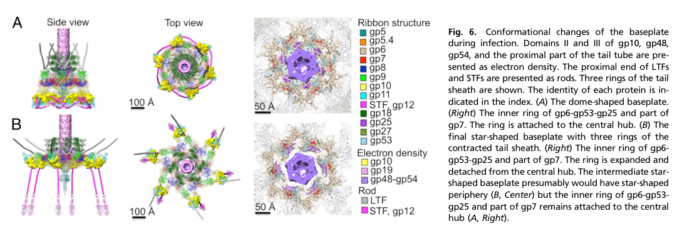

## Question

# Gene Research for Functional Annotation

## ⚠️ CRITICAL: Gene/Protein Identification Context

**BEFORE YOU BEGIN RESEARCH:** You MUST verify you are researching the CORRECT gene/protein. Gene symbols can be ambiguous, especially for less well-characterized genes from non-model organisms.

### Target Gene/Protein Identity (from UniProt):
- **UniProt Accession:** P17173
- **Protein Description:** RecName: Full=Baseplate hub assembly protein gp51 {ECO:0000305}; AltName: Full=Gene product 51; Short=gp51; AltName: Full=Hub assembly chaperone gp51 {ECO:0000305}; AltName: Full=Tail assembly protein gp51 {ECO:0000305};
- **Gene Information:** Name=51;
- **Organism (full):** Enterobacteria phage T4 (Bacteriophage T4).
- **Protein Family:** Not specified in UniProt
- **Key Domains:** Baseplate_phage_T4-like. (IPR024364); T4_baseplate (PF12322)

### MANDATORY VERIFICATION STEPS:

1. **Check if the gene symbol "51" matches the protein description above**
2. **Verify the organism is correct:** Enterobacteria phage T4 (Bacteriophage T4).
3. **Check if protein family/domains align with what you find in literature**
4. **If you find literature for a DIFFERENT gene with the same or similar symbol, STOP**

### If Gene Symbol is Ambiguous or You Cannot Find Relevant Literature:

**DO NOT PROCEED WITH RESEARCH ON A DIFFERENT GENE.** Instead:
- State clearly: "The gene symbol '51' is ambiguous or literature is limited for this specific protein"
- Explain what you found (e.g., "Found extensive literature on a different gene with the same symbol in a different organism")
- Describe the protein based ONLY on the UniProt information provided above
- Suggest that the protein function can be inferred from domain/family information

### Research Target:

Please provide a comprehensive research report on the gene **51** (gene ID: 51, UniProt: P17173) in BPT4.

The research report should be a detailed narrative explaining the function, biological processes, and localization of the gene product. Citations should be given for all claims.

You should prioritize authoritative reviews and primary scientific literature when conducting research. You can supplement
this with annotations you find in gene/protein databases, but these can be outdated or inaccurate.

We are specifically interested in the primary function of the gene - for enzymes, what reaction is catalyzed, and what is the substrate specificity? For transporters, what is the substrate? For structural proteins or adapters, what is the broader structural role? For signaling molecules, what is the role in the pathway.

We are interested in where in or outside the cell the gene product carries out its function.

We are also interested in the signaling or biochemical pathways in which the gene functions. We are less interested in broad pleiotropic effects, except where these elucidate the precise role.

Include evidence where possible. We are interested in both experimental evidence as well as inference from structure, evolution, or bioinformatic analysis. Precise studies should be prioritized over high-throughput, where available.

## Output

Question: You are an expert researcher providing comprehensive, well-cited information.

Provide detailed information focusing on:
1. Key concepts and definitions with current understanding
2. Recent developments and latest research (prioritize 2023-2024 sources)
3. Current applications and real-world implementations
4. Expert opinions and analysis from authoritative sources
5. Relevant statistics and data from recent studies

Format as a comprehensive research report with proper citations. Include URLs and publication dates where available.
Always prioritize recent, authoritative sources and provide specific citations for all major claims.

# Gene Research for Functional Annotation

## ⚠️ CRITICAL: Gene/Protein Identification Context

**BEFORE YOU BEGIN RESEARCH:** You MUST verify you are researching the CORRECT gene/protein. Gene symbols can be ambiguous, especially for less well-characterized genes from non-model organisms.

### Target Gene/Protein Identity (from UniProt):
- **UniProt Accession:** P17173
- **Protein Description:** RecName: Full=Baseplate hub assembly protein gp51 {ECO:0000305}; AltName: Full=Gene product 51; Short=gp51; AltName: Full=Hub assembly chaperone gp51 {ECO:0000305}; AltName: Full=Tail assembly protein gp51 {ECO:0000305};
- **Gene Information:** Name=51;
- **Organism (full):** Enterobacteria phage T4 (Bacteriophage T4).
- **Protein Family:** Not specified in UniProt
- **Key Domains:** Baseplate_phage_T4-like. (IPR024364); T4_baseplate (PF12322)

### MANDATORY VERIFICATION STEPS:

1. **Check if the gene symbol "51" matches the protein description above**
2. **Verify the organism is correct:** Enterobacteria phage T4 (Bacteriophage T4).
3. **Check if protein family/domains align with what you find in literature**
4. **If you find literature for a DIFFERENT gene with the same or similar symbol, STOP**

### If Gene Symbol is Ambiguous or You Cannot Find Relevant Literature:

**DO NOT PROCEED WITH RESEARCH ON A DIFFERENT GENE.** Instead:
- State clearly: "The gene symbol '51' is ambiguous or literature is limited for this specific protein"
- Explain what you found (e.g., "Found extensive literature on a different gene with the same symbol in a different organism")
- Describe the protein based ONLY on the UniProt information provided above
- Suggest that the protein function can be inferred from domain/family information

### Research Target:

Please provide a comprehensive research report on the gene **51** (gene ID: 51, UniProt: P17173) in BPT4.

The research report should be a detailed narrative explaining the function, biological processes, and localization of the gene product. Citations should be given for all claims.

You should prioritize authoritative reviews and primary scientific literature when conducting research. You can supplement
this with annotations you find in gene/protein databases, but these can be outdated or inaccurate.

We are specifically interested in the primary function of the gene - for enzymes, what reaction is catalyzed, and what is the substrate specificity? For transporters, what is the substrate? For structural proteins or adapters, what is the broader structural role? For signaling molecules, what is the role in the pathway.

We are interested in where in or outside the cell the gene product carries out its function.

We are also interested in the signaling or biochemical pathways in which the gene functions. We are less interested in broad pleiotropic effects, except where these elucidate the precise role.

Include evidence where possible. We are interested in both experimental evidence as well as inference from structure, evolution, or bioinformatic analysis. Precise studies should be prioritized over high-throughput, where available.

## Research report: bacteriophage T4 gene 51 (gp51) — functional annotation (UniProt P17173)

### 0) Target verification (critical disambiguation)

The requested target is **Enterobacteria phage T4 gene product 51 (gp51)**, matching UniProt accession **P17173** and the description “**Baseplate hub assembly protein gp51 / hub assembly chaperone**.” The literature gathered here consistently discusses **T4 gp51** specifically in the context of **T4 tail/baseplate hub morphogenesis**, including repeated statements that gp51 is required for assembly but **not present in the mature virion** (leiman2010morphogenesisofthe pages 1-2, matsui1997isolationandcharacterization pages 1-2). This matches the UniProt-provided identity context and avoids conflation with unrelated “gene 51” symbols from other organisms.

### 1) Key concepts and definitions (current understanding)

#### 1.1 T4 baseplate architecture: hub + wedges
The **T4 baseplate** is a multi-protein nanomachine at the distal tail end, organized as a **central hub** surrounded by **six wedges** (sixfold symmetry) (leiman2010morphogenesisofthe pages 1-2). The intact baseplate has been described as **~6.5 MDa** and comprising **~134 subunits from 15 proteins** (yap2016roleofbacteriophage pages 1-1). A key structural/functional feature is a large-scale conformational transition between two states:

- **“Dome-shaped/hexagonal” baseplate**: associated with the **extended tail sheath** (pre-infection) (leiman2010morphogenesisofthe pages 2-5).
- **“Star-shaped” baseplate**: associated with the **contracted sheath** (post-triggering) (leiman2010morphogenesisofthe pages 2-5).

This structural switch is central to how receptor binding triggers mechanical contraction and host penetration (yap2016roleofbacteriophage pages 1-1, leiman2010morphogenesisofthe pages 2-5).

#### 1.2 “Catalytic” or “nonstructural” assembly factors
In phage morphogenesis, some gene products are **essential for assembly** but are **not incorporated into the mature virion**. These are often described as **assembly chaperones** or **catalytic assembly factors**, meaning they can act **sub-stoichiometrically** or transiently and then dissociate from the final particle (leiman2010morphogenesisofthe pages 1-2, matsui1997isolationandcharacterization pages 1-2). In the T4 tail/baseplate system, **gp51** is one of the principal proteins placed in this category (leiman2010morphogenesisofthe pages 1-2, matsui1997isolationandcharacterization pages 1-2).

### 2) Primary function of gp51 (gene 51, UniProt P17173)

#### 2.1 High-confidence functional role: hub assembly chaperone required for baseplate hub formation
Across authoritative sources, gp51 is consistently described as being **required for formation of the baseplate hub** (matsui1997isolationandcharacterization pages 1-2) and annotated explicitly as a **“hub assembly chaperone”** (leiman2010morphogenesisofthe pages 2-5). Leiman et al. additionally state that **gp51 is required for assembly but not present in the final particle**, strongly supporting a transient assembly role rather than a structural one (leiman2010morphogenesisofthe pages 1-2).

#### 2.2 “Catalytic vs stoichiometric” behavior
A central thread in the T4 assembly literature is that gp51 has been reported to act **catalytically rather than stoichiometrically** during hub assembly (arisaka2016molecularassemblyand pages 8-10). A detailed historical model (summarized by Lou) places gp51 in a pathway where it **catalyzes a transition** between hub assembly intermediates rather than being retained as a stable component (lou2002theroleof pages 21-27, lou2002theroleofb pages 21-27).

### 3) Mechanistic placement in the hub assembly pathway

#### 3.1 Proposed intermediate pathway (7S → 14S → 22S) and inferred partners
A mechanistic model summarized in Lou (drawing from earlier genetic/complementation work) proposes the following hub assembly sequence:

1. **gp29** interacts with **gp26 and gp28** to form a **7S precursor**.
2. The 7S precursor becomes a **14S complex** following the **“catalytic action of gp51.”**
3. The 14S complex combines with a **12S gp5/gp27 complex** to generate a **22S hub** (lou2002theroleof pages 21-27, lou2002theroleofb pages 21-27).

This model implies gp51’s principal functional partners (direct or indirect) are **gp26, gp28, and gp29**, acting upstream of incorporation of the gp5/gp27 cell-puncturing device into the hub (lou2002theroleof pages 21-27, lou2002theroleofb pages 21-27).

#### 3.2 Caveats and uncertainty
The same synthesis emphasizes limitations: biochemical fractionation results did not always align perfectly with the in vitro complementation-derived intermediates, and alternative models historically proposed more hub proteins (including gp51) as structural components (lou2002theroleof pages 21-27). Additionally, a high-citation review notes hub assembly remains comparatively less resolved and is “complicated … by the presence of gp51,” also calling gp51 “an essential protein of unknown function” in the narrative even while labeling it as a hub assembly chaperone in a table (leiman2010morphogenesisofthe pages 2-5). Taken together, the **functional classification (assembly chaperone, nonstructural)** is well supported, while the **precise biochemical mechanism** remains incompletely determined.

### 4) Localization: where gp51 acts

#### 4.1 Not a virion component; acts in infected-cell morphogenesis
Two independent authoritative sources state gp51 is **required for assembly but absent from mature virions**, placing its activity during **intracellular morphogenesis** in the infected bacterial cytoplasm (leiman2010morphogenesisofthe pages 1-2, matsui1997isolationandcharacterization pages 1-2). This is consistent with the broader class of phage-encoded assembly chaperones that catalyze folding/association steps and then dissociate.

#### 4.2 Association with the assembling hub/baseplate
Because gp51 is necessary for hub formation, its effective location is at the **hub assembly site** during tail/baseplate morphogenesis, rather than at the mature baseplate during host recognition and contraction.

### 5) Related pathway context: how hub assembly connects to infection mechanics

#### 5.1 Hub and baseplate conformational switching
The baseplate’s transition from **dome-shaped (high-energy) to star-shaped (low-energy)** is a key regulatory event that triggers sheath contraction (yap2016roleofbacteriophage pages 1-1, arisaka2016molecularassemblyand pages 2-4). Dimensions quantified for these states include ~**520 Å × 270 Å** (dome) and ~**610 Å × 120 Å** (star) (yap2016roleofbacteriophage pages 1-1).

#### 5.2 Structural hub components (context for gp51’s nonstructural role)
Quantitative hub stoichiometries support a distinction between structural hub proteins and assembly-only factors:

- Hub structural proteins **gp5, gp27, gp29** are described as present as **three copies each** in the hub (with approximate monomer masses ~63.7 kDa, ~44.4 kDa, ~64.4 kDa, respectively) (leiman2010morphogenesisofthe pages 2-5).
- By contrast, **gp51** is listed as ~**29.3 kDa** and annotated as a **hub assembly chaperone** rather than a stoichiometric hub component (leiman2010morphogenesisofthe pages 2-5).

These observations are consistent with gp51 being transient rather than integrated into the final hub architecture.

### 6) Quantitative and structural context (key statistics/data)

- **T4 tail**: described as a large assembly of **~430 polypeptide chains**, total MW **≈2 × 10^7 Da** (leiman2010morphogenesisofthe pages 1-2).
- **Baseplate**: distal baseplate has **~140 polypeptides** and **≥16 proteins** (leiman2010morphogenesisofthe pages 1-2); intact baseplate ~**6.5 MDa** and **134 subunits** (yap2016roleofbacteriophage pages 1-1).
- **Tail tube and sheath polymerization**: tail tube protein **gp19** and sheath protein **gp18** each form **138 copies** arranged as **23 hexameric rings** (arisaka2016molecularassemblyand pages 2-4).
- **gp51 size**: ~**29.3 kDa** in a key review table (leiman2010morphogenesisofthe pages 2-5).

### 7) Recent developments and latest research (prioritizing 2023–2024) relevant to gp51 annotation

Direct 2023–2024 studies specifically dissecting **T4 gp51** were not identified in the retrieved corpus. However, several 2023–2024 papers provide **relevant advances** for interpreting and experimentally approaching gp51-like functions (assembly chaperones in complex phage tails/baseplates).

#### 7.1 2024: High-resolution contractile-tail/baseplate structures reveal new regulatory mechanisms
A 2024 Nature Communications study on **Agrobacterium tumefaciens phage Milano** used cryo-EM to determine atomic structures of the tail (sheath–tube complex) and baseplate and found that an **extensive disulfide-bond network crosslinks tail components**, and that some disulfides must be reduced for contraction (sonani2024anextensivedisulfide pages 1-2). While not about T4 gp51, this provides a modern example of how **covalent stabilization** can regulate contraction and assembly and highlights the role of detailed structural chemistry in contractile tail function (sonani2024anextensivedisulfide pages 1-2).

#### 7.2 2024: Structural analysis of a baseplate–receptor complex and tape-measure release
A 2024 EMBO Journal study on siphophage **JBD30** used cryo-EM/cryo-ET and shows that **baseplate opening releases three copies of a tape-measure protein** followed by DNA ejection, and reports capsid expansion (~7%) upon DNA packaging (valentova2024structureandreplication pages 1-2). Although mechanistically different from T4 (siphophage vs myophage), this demonstrates a modern, experimentally tractable route for linking **baseplate conformational changes** to **tape-measure dynamics**, a theme relevant to T4 where gp29 is a tape-measure protein and gp51 is placed upstream in hub assembly models involving gp29 (lou2002theroleof pages 21-27, valentova2024structureandreplication pages 1-2).

#### 7.3 2023: AlphaFold + recombinant expression reframe “chaperones” as transient structural caps
A 2023 Nature Communications study (and corresponding 2023 bioRxiv preprint) examined Alteromonas phage tail fibers and their chaperones using recombinant expression and AlphaFold modeling, proposing that certain chaperones may act as **transient “caps”** and can remain weakly associated with mature fibers depending on the system (rafael2023distantlyrelatedalteromonas pages 1-2, gonzalezserrano2023ahostrecognition pages 1-5). This broadens the conceptual space for phage chaperones beyond purely intracellular folding helpers and suggests testable hypotheses for gp51-family proteins in other systems (while noting that T4 gp51 itself is reported absent from mature virions) (leiman2010morphogenesisofthe pages 1-2, rafael2023distantlyrelatedalteromonas pages 1-2).

#### 7.4 2022: Comparative genomics suggests T4-like tail assembly chaperones may be encoded as separate genes
A 2022 Virology paper performed comparative genomic analyses across contractile-tailed phages and argued that (in at least a subset of T4-like phages) **tail assembly chaperone functions may be encoded as separate genes** rather than via translational frameshifting, explicitly citing **T4 genes 26 and 51** as an example (vladimirov2022identificationofthe pages 1-2). This supports a modern bioinformatic framing of gp51 as part of a broader chaperone logic across myophages.

### 8) Current applications and real-world implementations

#### 8.1 gp51 as a model for assembly-only factors in contractile injection systems
T4’s tail/baseplate remains a reference system for understanding **contractile injection machines** (including phage tails and related systems). The classification of gp51 as an essential, non-virion assembly factor provides a design principle for both natural and engineered nanomachines: key assembly steps can require **transient catalysts** that are not part of the final structure (leiman2010morphogenesisofthe pages 1-2, arisaka2016molecularassemblyand pages 8-10).

#### 8.2 Practical implementation in experimental pipelines
Although no direct engineering application for gp51 itself is evidenced in the retrieved set, several sources demonstrate **real-world implementations** of the broader research pipeline relevant to gp51 functional elucidation:

- Reconstitution of baseplate subassemblies and high-resolution cryo-EM of hubless baseplates (methods enabling targeted study of assembly factors) (yap2016roleofbacteriophage pages 1-1).
- Integrative structural biology in modern phage systems (Milano; disulfide-regulated contraction) (sonani2024anextensivedisulfide pages 1-2).
- AlphaFold-driven identification and interpretation of chaperone-like proteins as transient structural factors (rafael2023distantlyrelatedalteromonas pages 1-2).

### 9) Expert opinions / authoritative synthesis

- **Leiman et al. (2010)** present gp51 as an **assembly-required but non-virion** factor and explicitly label it a **hub assembly chaperone**, while also acknowledging hub assembly remains less fully understood than wedge assembly (leiman2010morphogenesisofthe pages 1-2, leiman2010morphogenesisofthe pages 2-5).
- **Arisaka et al. (2016)** summarize gp51 as one of six required hub gene products and highlight historic reports that it acts **catalytically rather than stoichiometrically**, reinforcing a transient morphogenetic role (arisaka2016molecularassemblyand pages 8-10).
- **Matsui et al. (1997)** group gp51 with other essential **nonstructural assembly proteins** not incorporated into mature virions, supporting the consensus assembly-helper interpretation (matsui1997isolationandcharacterization pages 1-2).

### 10) Visual evidence (baseplate conformational change)
The following figure excerpts (from Yap et al., PNAS 2016) provide visual context for baseplate assembly and conformational switching (dome → star) that triggers sheath contraction—an event downstream of hub assembly in which gp51 participates:

- Baseplate assembly schematic and conformational states: (yap2016roleofbacteriophage media 6fac6ac1, yap2016roleofbacteriophage media e2527667).

### 11) Summary functional annotation (best-supported statement)

**Gene 51 / gp51 (UniProt P17173) in Enterobacteria phage T4 is best annotated as a nonstructural, likely catalytic assembly chaperone required for baseplate hub morphogenesis.** It acts during intracellular assembly, is required for correct hub formation, and is generally considered **absent from the mature virion** (leiman2010morphogenesisofthe pages 1-2, matsui1997isolationandcharacterization pages 1-2, leiman2010morphogenesisofthe pages 2-5). A historical hub assembly pathway places gp51 as catalyzing the conversion of early hub precursors involving gp29/gp26/gp28 into later hub intermediates (7S → 14S → 22S), although mechanistic details and in vivo verification remain incomplete (lou2002theroleof pages 21-27).

---

### Evidence table: gp51 annotation claims

| Claim | Evidence summary | Source (first author, year, journal) | Publication date | URL/DOI | Notes/limitations |
|---|---|---|---|---|---|
| gp51 is required for T4 assembly and specifically for baseplate hub formation | Reviews and experimental summaries state that gp51 is essential for phage growth/assembly and is necessary for formation of the baseplate hub; Leiman et al. list gp51 as a hub assembly chaperone, and Matsui et al. identify it among nonstructural T4 assembly proteins required for morphogenesis (matsui1997isolationandcharacterization pages 1-2, leiman2010morphogenesisofthe pages 2-5, leiman2010morphogenesisofthe pages 1-2) | Matsui, 1997, *Journal of Bacteriology*; Leiman, 2010, *Virology Journal* | Mar 1997; Dec 2010 | https://doi.org/10.1128/jb.179.6.1846-1851.1997 ; https://doi.org/10.1186/1743-422x-7-355 | Strong consensus from authoritative reviews, but no direct modern biochemical reconstitution of gp51 activity was found in the gathered evidence |
| gp51 behaves as a catalytic/nonstructural assembly factor rather than a stoichiometric virion protein | Arisaka’s review explicitly states gp51 has been reported to have catalytic rather than stoichiometric activity; Lou’s synthesis of earlier hub-assembly studies says gp51 shows activity in complementation assays but is not detected in phage, leading to the proposal that it acts catalytically/nonstructurally during hub assembly (arisaka2016molecularassemblyand pages 8-10, lou2002theroleofb pages 21-27, lou2002theroleof pages 21-27, lou2002theroleofb pages 15-21) | Arisaka, 2016, *Biophysical Reviews*; Lou, 2002, unknown journal/thesis synthesis | Nov 2016; 2002 | https://doi.org/10.1007/s12551-016-0230-x | Catalytic designation rests heavily on older genetic/complementation literature summarized secondarily here; direct structural evidence for catalytic mechanism is still lacking |
| gp51 is not incorporated into the mature virion | Leiman et al. state gp51 and gp57A are required for assembly but absent from the final particle; Matsui et al. likewise classify gp51 among T4 proteins essential for assembly but not incorporated into mature virions; Lou’s summary states gp51 was not detected in phage preparations (matsui1997isolationandcharacterization pages 1-2, leiman2010morphogenesisofthe pages 1-2, lou2002theroleofb pages 15-21) | Leiman, 2010, *Virology Journal*; Matsui, 1997, *Journal of Bacteriology*; Lou, 2002, unknown journal/thesis synthesis | Dec 2010; Mar 1997; 2002 | https://doi.org/10.1186/1743-422x-7-355 ; https://doi.org/10.1128/jb.179.6.1846-1851.1997 | Good agreement across reviews; absence from mature virions is inferentially consistent with copy number being undetermined in component tables |
| gp51 participates in a proposed hub-assembly pathway involving 7S, 14S, and 22S intermediates | Lou’s summary of Kikuchi & King’s model places gp51 after formation of a 7S precursor containing gp29 with gp26/gp28; gp51 then catalyzes conversion to a 14S complex, which combines with a 12S gp5/gp27 complex to form the 22S hub intermediate (lou2002theroleofa pages 21-27, lou2002theroleof pages 21-27, lou2002theroleofb pages 21-27) | Lou, 2002, unknown journal/thesis synthesis of earlier JMB work | 2002 | No DOI available in gathered context | This is a historical model reconstructed from older genetics/complementation work; the gathered evidence also notes caveats that in vitro complementation may not fully reflect in vivo assembly |
| gp51’s inferred functional partners are gp26, gp28, and gp29 in hub morphogenesis | In the proposed pathway, gp29 first associates with gp26 and gp28, and gp51 acts on this precursor to generate a later hub intermediate; reviews also group gp5, gp27, gp26, gp28, gp51, and gp29 as the six gene products required for hub formation (lou2002theroleof pages 21-27, arisaka2016molecularassemblyand pages 8-10, lou2002theroleofb pages 21-27) | Arisaka, 2016, *Biophysical Reviews*; Lou, 2002, unknown journal/thesis synthesis | Nov 2016; 2002 | https://doi.org/10.1007/s12551-016-0230-x | Evidence supports pathway association rather than direct physical binding proof; specific binding interfaces for gp51 were not identified in the gathered sources |
| gp51 is best annotated as a hub assembly chaperone | Table-based annotations in Leiman et al. label gp51 as “Hub assembly chaperone”; Arisaka’s protein inventory labels gp51 “Catalytic,” reinforcing a transient assembly-helper role rather than a structural one (leiman2010morphogenesisofthe pages 2-5, arisaka2016molecularassemblyand pages 2-4) | Leiman, 2010, *Virology Journal*; Arisaka, 2016, *Biophysical Reviews* | Dec 2010; Nov 2016 | https://doi.org/10.1186/1743-422x-7-355 ; https://doi.org/10.1007/s12551-016-0230-x | Annotation is well supported at the review level, but the precise biochemical mechanism of the chaperone action remains unresolved |
| gp51 acts during intracellular morphogenesis at the assembling baseplate hub, not during extracellular infection | Because gp51 is required for hub assembly but absent from mature particles, its site of action is inferred to be the infected bacterial cytoplasm during tail/baseplate morphogenesis; it is not part of the final extracellular virion used for host penetration (matsui1997isolationandcharacterization pages 1-2, leiman2010morphogenesisofthe pages 1-2) | Matsui, 1997, *Journal of Bacteriology*; Leiman, 2010, *Virology Journal* | Mar 1997; Dec 2010 | https://doi.org/10.1128/jb.179.6.1846-1851.1997 ; https://doi.org/10.1186/1743-422x-7-355 | Localization is inferred from assembly role and non-virion status; no subcellular imaging of gp51 itself was identified in the gathered evidence |
| Quantitative context: gp51 is a small nonstructural tail morphogenesis factor relative to stoichiometric hub proteins | Leiman et al. list gp51 as ~29.3 kDa; hub structural proteins gp5, gp27, and gp29 are each present as three copies, whereas gp51 copy number is not assigned, consistent with a nonstoichiometric assembly role (leiman2010morphogenesisofthe pages 2-5) | Leiman, 2010, *Virology Journal* | Dec 2010 | https://doi.org/10.1186/1743-422x-7-355 | Copy number “not determined” is not by itself proof of absence from virions, but fits the broader evidence that gp51 is transient/nonstructural |
| There is historical disagreement over whether gp51 is structural | Lou notes an alternative Kozloff model treated all six hub gene products, including gp51, as structural hub components, but this conflicted with data showing gp51 activity in complementation assays and failure to detect gp51 in mature phage (lou2002theroleofb pages 21-27, lou2002theroleof pages 21-27, lou2002theroleofa pages 21-27) | Lou, 2002, unknown journal/thesis synthesis | 2002 | No DOI available in gathered context | Important caveat: the strongest direct primary paper for the alternative model was unobtainable in the gathered evidence, so this row relies on secondary summary rather than direct inspection |

*Table: This table summarizes the main functional annotation evidence for bacteriophage T4 gp51 (UniProt P17173), including its proposed role as a hub assembly chaperone/catalytic factor, its absence from mature virions, and the historical assembly-intermediate models that place it in hub morphogenesis.*

### Key source URLs (with publication dates)

- Leiman PG et al. **Morphogenesis of the T4 tail and tail fibers**. *Virology Journal*. **2010-12**. https://doi.org/10.1186/1743-422x-7-355 (leiman2010morphogenesisofthe pages 1-2)
- Arisaka F et al. **Molecular assembly and structure of the bacteriophage T4 tail**. *Biophysical Reviews*. **2016-11**. https://doi.org/10.1007/s12551-016-0230-x (arisaka2016molecularassemblyand pages 8-10)
- Matsui T et al. **Isolation and characterization of a molecular chaperone, gp57A, of bacteriophage T4** (contains gp51 context). *Journal of Bacteriology*. **1997-03**. https://doi.org/10.1128/jb.179.6.1846-1851.1997 (matsui1997isolationandcharacterization pages 1-2)
- Yap ML et al. **Role of bacteriophage T4 baseplate in regulating assembly and infection**. *PNAS*. **2016-02**. https://doi.org/10.1073/pnas.1601654113 (yap2016roleofbacteriophage pages 1-1)
- Sonani RR et al. **An extensive disulfide bond network prevents tail contraction in Agrobacterium tumefaciens phage Milano**. *Nature Communications*. **2024-01**. https://doi.org/10.1038/s41467-024-44959-z (sonani2024anextensivedisulfide pages 1-2)
- Valentová L et al. **Structure and replication of Pseudomonas aeruginosa phage JBD30**. *The EMBO Journal*. **2024-08**. https://doi.org/10.1038/s44318-024-00195-1 (valentova2024structureandreplication pages 1-2)
- Gonzalez-Serrano R et al. **Distantly related Alteromonas bacteriophages share tail fibers exhibiting properties of transient chaperone caps**. *Nature Communications*. **2023-10**. https://doi.org/10.1038/s41467-023-42114-8 (rafael2023distantlyrelatedalteromonas pages 1-2)
- Vladimirov M et al. **Identification of the tail assembly chaperone genes of T4-Like phages…** *Virology*. **2022-01**. https://doi.org/10.1016/j.virol.2021.11.003 (vladimirov2022identificationofthe pages 1-2)

References

1. (leiman2010morphogenesisofthe pages 1-2): Petr G Leiman, Fumio Arisaka, Mark J van Raaij, Victor A Kostyuchenko, Anastasia A Aksyuk, Shuji Kanamaru, and Michael G Rossmann. Morphogenesis of the t4 tail and tail fibers. Virology Journal, 7:355-355, Dec 2010. URL: https://doi.org/10.1186/1743-422x-7-355, doi:10.1186/1743-422x-7-355. This article has 319 citations and is from a peer-reviewed journal.

2. (matsui1997isolationandcharacterization pages 1-2): T. Matsui, B. Griniuviene, E. Goldberg, A. Tsugita, N. Tanaka, and F. Arisaka. Isolation and characterization of a molecular chaperone, gp57a, of bacteriophage t4. Journal of Bacteriology, 179:1846-1851, Mar 1997. URL: https://doi.org/10.1128/jb.179.6.1846-1851.1997, doi:10.1128/jb.179.6.1846-1851.1997. This article has 34 citations and is from a peer-reviewed journal.

3. (yap2016roleofbacteriophage pages 1-1): Moh Lan Yap, Thomas Klose, Fumio Arisaka, Jeffrey A. Speir, David Veesler, Andrei Fokine, and Michael G. Rossmann. Role of bacteriophage t4 baseplate in regulating assembly and infection. Proceedings of the National Academy of Sciences, 113:2654-2659, Feb 2016. URL: https://doi.org/10.1073/pnas.1601654113, doi:10.1073/pnas.1601654113. This article has 113 citations and is from a highest quality peer-reviewed journal.

4. (leiman2010morphogenesisofthe pages 2-5): Petr G Leiman, Fumio Arisaka, Mark J van Raaij, Victor A Kostyuchenko, Anastasia A Aksyuk, Shuji Kanamaru, and Michael G Rossmann. Morphogenesis of the t4 tail and tail fibers. Virology Journal, 7:355-355, Dec 2010. URL: https://doi.org/10.1186/1743-422x-7-355, doi:10.1186/1743-422x-7-355. This article has 319 citations and is from a peer-reviewed journal.

5. (arisaka2016molecularassemblyand pages 8-10): Fumio Arisaka, Moh Lan Yap, Shuji Kanamaru, and Michael G. Rossmann. Molecular assembly and structure of the bacteriophage t4 tail. Biophysical Reviews, 8:385-396, Nov 2016. URL: https://doi.org/10.1007/s12551-016-0230-x, doi:10.1007/s12551-016-0230-x. This article has 55 citations and is from a peer-reviewed journal.

6. (lou2002theroleof pages 21-27): Y Lou. The role of baseplate protein gp29 in bacteriophage t4 tail assembly. Unknown journal, 2002.

7. (lou2002theroleofb pages 21-27): Y Lou. The role of baseplate protein gp29 in bacteriophage t4 tail assembly. Unknown journal, 2002.

8. (arisaka2016molecularassemblyand pages 2-4): Fumio Arisaka, Moh Lan Yap, Shuji Kanamaru, and Michael G. Rossmann. Molecular assembly and structure of the bacteriophage t4 tail. Biophysical Reviews, 8:385-396, Nov 2016. URL: https://doi.org/10.1007/s12551-016-0230-x, doi:10.1007/s12551-016-0230-x. This article has 55 citations and is from a peer-reviewed journal.

9. (sonani2024anextensivedisulfide pages 1-2): Ravi R. Sonani, Lee K. Palmer, Nathaniel C. Esteves, Abigail A. Horton, Amanda L. Sebastian, Rebecca J. Kelly, Fengbin Wang, Mark A. B. Kreutzberger, William K. Russell, Petr G. Leiman, Birgit E. Scharf, and Edward H. Egelman. An extensive disulfide bond network prevents tail contraction in agrobacterium tumefaciens phage milano. Nature Communications, Jan 2024. URL: https://doi.org/10.1038/s41467-024-44959-z, doi:10.1038/s41467-024-44959-z. This article has 18 citations and is from a highest quality peer-reviewed journal.

10. (valentova2024structureandreplication pages 1-2): Lucie Valentová, Tibor Füzik, Jiří Nováček, Zuzana Hlavenková, Jakub Pospíšil, and Pavel Plevka. Structure and replication of pseudomonas aeruginosa phage jbd30. The EMBO Journal, 43:4384-4405, Aug 2024. URL: https://doi.org/10.1038/s44318-024-00195-1, doi:10.1038/s44318-024-00195-1. This article has 25 citations.

11. (rafael2023distantlyrelatedalteromonas pages 1-2): Rafael Gonzalez-Serrano, Riccardo Rosselli, Juan J. Roda-Garcia, Ana-Belen Martin-Cuadrado, Francisco Rodriguez-Valera, and Matthew Dunne. Distantly related alteromonas bacteriophages share tail fibers exhibiting properties of transient chaperone caps. Nature Communications, Oct 2023. URL: https://doi.org/10.1038/s41467-023-42114-8, doi:10.1038/s41467-023-42114-8. This article has 22 citations and is from a highest quality peer-reviewed journal.

12. (gonzalezserrano2023ahostrecognition pages 1-5): Rafael Gonzalez-Serrano, Riccardo Rosselli, Juan J. Roda-Garcia, Ana-Belen Martin-Cuadrado, Francisco Rodriguez-Valera, and Matthew Dunne. A host recognition module shared among distant alteromonas bacteriophage families features tail fibers with transient chaperone “caps”. bioRxiv, Mar 2023. URL: https://doi.org/10.1101/2023.03.07.531524, doi:10.1101/2023.03.07.531524. This article has 0 citations.

13. (vladimirov2022identificationofthe pages 1-2): Maria Vladimirov, Vasu Gautam, and Alan R. Davidson. Identification of the tail assembly chaperone genes of t4-like phages suggests a mechanism other than translational frameshifting for biogenesis of their encoded proteins. Virology, 566:9-15, Jan 2022. URL: https://doi.org/10.1016/j.virol.2021.11.003, doi:10.1016/j.virol.2021.11.003. This article has 12 citations and is from a peer-reviewed journal.

14. (yap2016roleofbacteriophage media 6fac6ac1): Moh Lan Yap, Thomas Klose, Fumio Arisaka, Jeffrey A. Speir, David Veesler, Andrei Fokine, and Michael G. Rossmann. Role of bacteriophage t4 baseplate in regulating assembly and infection. Proceedings of the National Academy of Sciences, 113:2654-2659, Feb 2016. URL: https://doi.org/10.1073/pnas.1601654113, doi:10.1073/pnas.1601654113. This article has 113 citations and is from a highest quality peer-reviewed journal.

15. (yap2016roleofbacteriophage media e2527667): Moh Lan Yap, Thomas Klose, Fumio Arisaka, Jeffrey A. Speir, David Veesler, Andrei Fokine, and Michael G. Rossmann. Role of bacteriophage t4 baseplate in regulating assembly and infection. Proceedings of the National Academy of Sciences, 113:2654-2659, Feb 2016. URL: https://doi.org/10.1073/pnas.1601654113, doi:10.1073/pnas.1601654113. This article has 113 citations and is from a highest quality peer-reviewed journal.

16. (lou2002theroleofb pages 15-21): Y Lou. The role of baseplate protein gp29 in bacteriophage t4 tail assembly. Unknown journal, 2002.

17. (lou2002theroleofa pages 21-27): Y Lou. The role of baseplate protein gp29 in bacteriophage t4 tail assembly. Unknown journal, 2002.

## Artifacts

- [Edison artifact artifact-00](51-deep-research-falcon_artifacts/artifact-00.md)

## Citations

1. leiman2010morphogenesisofthe pages 1-2
2. yap2016roleofbacteriophage pages 1-1
3. leiman2010morphogenesisofthe pages 2-5
4. matsui1997isolationandcharacterization pages 1-2
5. arisaka2016molecularassemblyand pages 8-10
6. lou2002theroleof pages 21-27
7. arisaka2016molecularassemblyand pages 2-4
8. sonani2024anextensivedisulfide pages 1-2
9. valentova2024structureandreplication pages 1-2
10. vladimirov2022identificationofthe pages 1-2
11. rafael2023distantlyrelatedalteromonas pages 1-2
12. lou2002theroleofb pages 21-27
13. gonzalezserrano2023ahostrecognition pages 1-5
14. lou2002theroleofb pages 15-21
15. lou2002theroleofa pages 21-27
16. https://doi.org/10.1128/jb.179.6.1846-1851.1997
17. https://doi.org/10.1186/1743-422x-7-355
18. https://doi.org/10.1007/s12551-016-0230-x
19. https://doi.org/10.1073/pnas.1601654113
20. https://doi.org/10.1038/s41467-024-44959-z
21. https://doi.org/10.1038/s44318-024-00195-1
22. https://doi.org/10.1038/s41467-023-42114-8
23. https://doi.org/10.1016/j.virol.2021.11.003
24. https://doi.org/10.1186/1743-422x-7-355,
25. https://doi.org/10.1128/jb.179.6.1846-1851.1997,
26. https://doi.org/10.1073/pnas.1601654113,
27. https://doi.org/10.1007/s12551-016-0230-x,
28. https://doi.org/10.1038/s41467-024-44959-z,
29. https://doi.org/10.1038/s44318-024-00195-1,
30. https://doi.org/10.1038/s41467-023-42114-8,
31. https://doi.org/10.1101/2023.03.07.531524,
32. https://doi.org/10.1016/j.virol.2021.11.003,