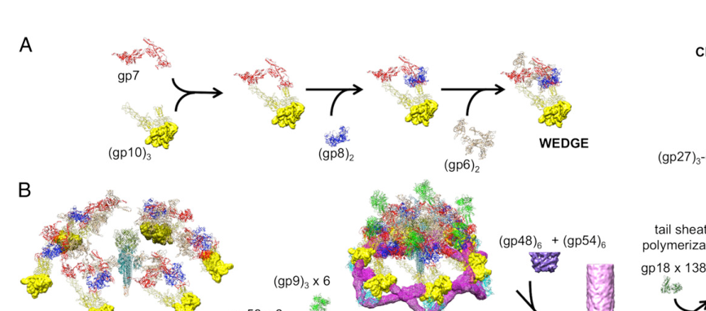

## Question

# Gene Research for Functional Annotation

## ⚠️ CRITICAL: Gene/Protein Identification Context

**BEFORE YOU BEGIN RESEARCH:** You MUST verify you are researching the CORRECT gene/protein. Gene symbols can be ambiguous, especially for less well-characterized genes from non-model organisms.

### Target Gene/Protein Identity (from UniProt):
- **UniProt Accession:** P16011
- **Protein Description:** RecName: Full=Baseplate wedge protein gp53 {ECO:0000305}; AltName: Full=Gene product 53 {ECO:0000305}; Short=gp53;
- **Gene Information:** Name=53;
- **Organism (full):** Enterobacteria phage T4 (Bacteriophage T4).
- **Protein Family:** Not specified in UniProt
- **Key Domains:** Phage_T4_Gp53_baseplate_wedge. (IPR022607); Phage_gp53 (PF11246)

### MANDATORY VERIFICATION STEPS:

1. **Check if the gene symbol "53" matches the protein description above**
2. **Verify the organism is correct:** Enterobacteria phage T4 (Bacteriophage T4).
3. **Check if protein family/domains align with what you find in literature**
4. **If you find literature for a DIFFERENT gene with the same or similar symbol, STOP**

### If Gene Symbol is Ambiguous or You Cannot Find Relevant Literature:

**DO NOT PROCEED WITH RESEARCH ON A DIFFERENT GENE.** Instead:
- State clearly: "The gene symbol '53' is ambiguous or literature is limited for this specific protein"
- Explain what you found (e.g., "Found extensive literature on a different gene with the same symbol in a different organism")
- Describe the protein based ONLY on the UniProt information provided above
- Suggest that the protein function can be inferred from domain/family information

### Research Target:

Please provide a comprehensive research report on the gene **53** (gene ID: 53, UniProt: P16011) in BPT4.

The research report should be a detailed narrative explaining the function, biological processes, and localization of the gene product. Citations should be given for all claims.

You should prioritize authoritative reviews and primary scientific literature when conducting research. You can supplement
this with annotations you find in gene/protein databases, but these can be outdated or inaccurate.

We are specifically interested in the primary function of the gene - for enzymes, what reaction is catalyzed, and what is the substrate specificity? For transporters, what is the substrate? For structural proteins or adapters, what is the broader structural role? For signaling molecules, what is the role in the pathway.

We are interested in where in or outside the cell the gene product carries out its function.

We are also interested in the signaling or biochemical pathways in which the gene functions. We are less interested in broad pleiotropic effects, except where these elucidate the precise role.

Include evidence where possible. We are interested in both experimental evidence as well as inference from structure, evolution, or bioinformatic analysis. Precise studies should be prioritized over high-throughput, where available.

## Output

Question: You are an expert researcher providing comprehensive, well-cited information.

Provide detailed information focusing on:
1. Key concepts and definitions with current understanding
2. Recent developments and latest research (prioritize 2023-2024 sources)
3. Current applications and real-world implementations
4. Expert opinions and analysis from authoritative sources
5. Relevant statistics and data from recent studies

Format as a comprehensive research report with proper citations. Include URLs and publication dates where available.
Always prioritize recent, authoritative sources and provide specific citations for all major claims.

# Gene Research for Functional Annotation

## ⚠️ CRITICAL: Gene/Protein Identification Context

**BEFORE YOU BEGIN RESEARCH:** You MUST verify you are researching the CORRECT gene/protein. Gene symbols can be ambiguous, especially for less well-characterized genes from non-model organisms.

### Target Gene/Protein Identity (from UniProt):
- **UniProt Accession:** P16011
- **Protein Description:** RecName: Full=Baseplate wedge protein gp53 {ECO:0000305}; AltName: Full=Gene product 53 {ECO:0000305}; Short=gp53;
- **Gene Information:** Name=53;
- **Organism (full):** Enterobacteria phage T4 (Bacteriophage T4).
- **Protein Family:** Not specified in UniProt
- **Key Domains:** Phage_T4_Gp53_baseplate_wedge. (IPR022607); Phage_gp53 (PF11246)

### MANDATORY VERIFICATION STEPS:

1. **Check if the gene symbol "53" matches the protein description above**
2. **Verify the organism is correct:** Enterobacteria phage T4 (Bacteriophage T4).
3. **Check if protein family/domains align with what you find in literature**
4. **If you find literature for a DIFFERENT gene with the same or similar symbol, STOP**

### If Gene Symbol is Ambiguous or You Cannot Find Relevant Literature:

**DO NOT PROCEED WITH RESEARCH ON A DIFFERENT GENE.** Instead:
- State clearly: "The gene symbol '53' is ambiguous or literature is limited for this specific protein"
- Explain what you found (e.g., "Found extensive literature on a different gene with the same symbol in a different organism")
- Describe the protein based ONLY on the UniProt information provided above
- Suggest that the protein function can be inferred from domain/family information

### Research Target:

Please provide a comprehensive research report on the gene **53** (gene ID: 53, UniProt: P16011) in BPT4.

The research report should be a detailed narrative explaining the function, biological processes, and localization of the gene product. Citations should be given for all claims.

You should prioritize authoritative reviews and primary scientific literature when conducting research. You can supplement
this with annotations you find in gene/protein databases, but these can be outdated or inaccurate.

We are specifically interested in the primary function of the gene - for enzymes, what reaction is catalyzed, and what is the substrate specificity? For transporters, what is the substrate? For structural proteins or adapters, what is the broader structural role? For signaling molecules, what is the role in the pathway.

We are interested in where in or outside the cell the gene product carries out its function.

We are also interested in the signaling or biochemical pathways in which the gene functions. We are less interested in broad pleiotropic effects, except where these elucidate the precise role.

Include evidence where possible. We are interested in both experimental evidence as well as inference from structure, evolution, or bioinformatic analysis. Precise studies should be prioritized over high-throughput, where available.

# Comprehensive Research Report: Bacteriophage T4 gene 53 (gp53) — Functional Annotation (UniProt P16011)

## 0) Target verification (mandatory)

**Verified target**: UniProt **P16011** is **baseplate wedge protein gp53** (gene product 53; **gene name: 53**) from **Enterobacteria phage T4**. Multiple independent T4 tail/baseplate structural and assembly studies explicitly describe **gp53** as a **baseplate wedge component** present in **six copies** per virion baseplate, consistent with the UniProt record and the Pfam/InterPro domain family assignment (PF11246; Phage_gp53). (arisaka2016molecularassemblyand pages 2-4, taylor2016structureofthe pages 8-11)

## 1) Key concepts and current understanding (definitions and role in the T4 infection machine)

### 1.1 What “baseplate wedge” means in T4
The bacteriophage T4 tail is a **contractile injection system**: a rigid internal tube surrounded by a contractile sheath, terminated distally by a **baseplate** that mediates **host attachment** and triggers **sheath contraction** to drive the tube through bacterial envelopes and deliver DNA. The T4 baseplate is assembled from **six identical wedges** arranged around a central hub. (kostyuchenko2003threedimensionalstructureof pages 1-2, taylor2016structureofthe pages 1-3)

A **wedge** is a modular, repeating assembly intermediate that contains a defined set of proteins (including gp53) and later joins five other wedges to form the mature baseplate. (kostyuchenko2003threedimensionalstructureof pages 1-2, yap2016roleofbacteriophage pages 1-1)

### 1.2 Definition of gp53 (primary function)
**gp53 is a structural baseplate wedge protein** whose primary function is to **bind at the interface between neighboring wedges**, promoting **wedge–wedge association (“circularization”)** into the **hexagonal baseplate**. This role is supported by (i) in vitro reconstitution/biophysical data showing gp53 addition triggers higher-order wedge association and (ii) cryo-EM structures showing gp53 positioned at inter-wedge contacts. (yap2010thebaseplatewedges pages 1-3, arisaka2016molecularassemblyand pages 1-2, arisaka2016molecularassemblyand pages 2-4, yap2016roleofbacteriophage media 5081787c)

In the Taylor et al. baseplate framework, gp53 is annotated as part of the wedge “core” and described functionally as a **“bundle clamp”** and **“sheath platform”**, emphasizing that it both stabilizes wedge architecture and contributes to the structural platform that interfaces with the sheath machinery. (taylor2016structureofthe pages 8-11)

### 1.3 Localization of gp53 within the virion
**Localization**: gp53 is localized **in the baseplate**, associated with each wedge, and specifically lies at **inter-wedge junctions**. Cryo-EM reconstructions and ribbon models of the wedge/baseplate show gp53 at the **wedge boundary**, consistent with a clamp/bridging role. (yap2016roleofbacteriophage pages 1-1, yap2016roleofbacteriophage media 5081787c)

### 1.4 Assembly pathway concepts relevant to gp53
Baseplate assembly is sequential and ordered. In classical and reconstitution-derived models, wedge assembly proceeds through a defined order in which gp53 is added **late**, after gp6, and before gp25. (kostyuchenko2003threedimensionalstructureof pages 1-2, yap2010thebaseplatewedges pages 1-3)

gp53’s addition is a key “commitment” step that promotes multimerization of wedge units into a baseplate-like architecture even in the absence of the central hub, highlighting its strong role in promoting wedge–wedge association. (yap2010thebaseplatewedges pages 1-3, arisaka2016molecularassemblyand pages 1-2)

## 2) Experimental evidence for gp53 function (mechanism-level annotation)

### 2.1 Copy number, size, and stoichiometry
A synthesis review of T4 tail morphogenesis reports gp53 as **~196 residues** and present as **six copies per baseplate**, consistent with its role as a per-wedge (or per-wedge-interface) component in the sixfold symmetric baseplate. (arisaka2016molecularassemblyand pages 2-4)

### 2.2 gp53 drives wedge–wedge association: in vitro assembly and biophysics
Reconstitution experiments assembling wedges from recombinant proteins showed:
- Canonical order includes **gp53 after gp6 and before gp25**. (yap2010thebaseplatewedges pages 1-3)
- Addition/association of gp53 to the wedge precursor triggers formation of a **sixfold, star-shaped baseplate-like structure** even without the hub; gp25 addition can further facilitate formation. (yap2010thebaseplatewedges pages 1-3)
- Analytical ultracentrifugation provides quantitative biophysical signatures: **complete wedge ~15 S**, an **unstable intermediate ~40 S**, and assembled baseplate at **~70 S**. (yap2010thebaseplatewedges pages 1-3)

These data provide direct experimental support that gp53 binding changes the oligomerization state of wedge assemblies and promotes baseplate-like higher-order assembly. (yap2010thebaseplatewedges pages 1-3)

### 2.3 Structural evidence: cryo-EM wedge/baseplate model shows gp53 as an inter-wedge clamp
High-resolution cryo-EM analysis of an in vitro-assembled hubless baseplate-like complex containing gp53 produced near-atomic wedge models (3.8 Å map) and explicitly depicts gp53:
- as part of the **wedge composition** (gp7, gp10, gp8, gp6, gp53), and
- positioned at the **interface between wedges**.
These results provide structural evidence for the inter-wedge bridging function. (yap2016roleofbacteriophage pages 1-1, yap2016roleofbacteriophage media 5081787c)

The same structural framework shows gp53 acting in inter-wedge stabilization, including a depiction of **“gp53 × 6”** in assembly schematics, consistent with a repeated clamp at each wedge junction around the hexagon. (yap2016roleofbacteriophage media 5081787c)

### 2.4 Interaction partners and role as a “sheath platform”
Cryo-EM density subtraction and contact mapping in the baseplate indicate gp53 occupies density closely associated with other wedge proteins and participates in a network of contacts relevant to tail morphogenesis and contraction:
- gp53 is assigned to residual density in the wedge region (after fitting gp6), with evidence consistent with **two domains connected by a linker**. (aksyuk2009thestructureof pages 2-3)
- gp53 is functionally implicated in the **initiation of sheath assembly**: the **gp6 N-terminal domain + gp53 + gp48** form a platform on which the **first disk of the sheath protein gp18 assembles**. (aksyuk2009thestructureof pages 2-3)
- gp6 is described as interacting with gp53 (and also gp25 and gp18) and altering contacts during baseplate rearrangement; in the star-shaped baseplate state the **C-terminal part of gp6 interacts with gp7 and gp53**, supporting the idea that gp53 participates in conformational coupling relevant to infection-triggered transitions. (aksyuk2009thestructureof pages 2-3)

Consistent with this, Taylor et al. describe gp53 (and gp25) as wedge subunits that further stabilize the core wedge complex and annotate gp53 as “bundle clamp” and “sheath platform.” (taylor2016structureofthe pages 1-3, taylor2016structureofthe pages 8-11)

### 2.5 Relationship to triggering sheath contraction
The 2016 baseplate structural framework emphasizes that a set of wedge/core interactions and baseplate conformational transitions is responsible for triggering sheath contraction. gp53 is not described as the primary signal transducer by itself; rather, it stabilizes wedge architecture and participates in the structural network that couples wedge organization to the contraction machinery (including the gp18 sheath interface). (taylor2016structureofthe pages 1-3, aksyuk2009thestructureof pages 2-3)

## 3) Biological processes and “pathways” (structural/morphogenetic pathway rather than metabolic)

For structural phage proteins like gp53, the relevant “pathway” is the **morphogenetic assembly pathway** of the baseplate and tail:

1. **Sequential wedge assembly**: multiple wedge proteins assemble in order, with gp53 incorporated late (after gp6). (kostyuchenko2003threedimensionalstructureof pages 1-2, yap2010thebaseplatewedges pages 1-3)
2. **Wedge–wedge association into a baseplate-like ring**: gp53 binding promotes association of six wedges into a baseplate-like structure. (arisaka2016molecularassemblyand pages 1-2, arisaka2016molecularassemblyand pages 2-4, yap2010thebaseplatewedges pages 1-3)
3. **Completion of baseplate/tail initiation**: gp53 contributes (with gp6 N-terminus and gp48) to the platform for assembling the first gp18 sheath ring, linking baseplate completion to the contractile sheath assembly. (aksyuk2009thestructureof pages 2-3)

Thus, gp53 is best functionally annotated as a **baseplate wedge interface clamp/core stabilizer** and **sheath-assembly platform component** in the T4 tail morphogenesis pathway. (taylor2016structureofthe pages 8-11, aksyuk2009thestructureof pages 2-3)

## 4) Recent developments (prioritizing 2023–2024): what’s new and how it informs gp53 annotation

Direct 2023–2024 publications specifically focused on **T4 gp53** were not retrieved here; however, multiple **2023–2024 high-resolution structures of other contractile-tailed phages and engineered contractile systems** substantially advance the field’s general understanding of **baseplate architecture, wedge modules, contraction energetics, and engineering possibilities**. These developments provide modern context for interpreting T4 gp53 as a conserved “wedge/core clamp” type part within contractile injection systems.

### 4.1 2023: Therapeutic contractile phage E217 baseplate architecture and mechanics
A 2023 Nature Communications study solved pre- and post-ejection structures of **Pseudomonas phage E217** at **3.1 Å and 4.5 Å**, building de novo models for **19 gene products** and describing a baseplate of **66 polypeptide chains (~1.4 MDa)**, far smaller than T4’s baseplate. E217 is used in an experimental therapeutic cocktail to eradicate P. aeruginosa in model systems. Mechanical metrics were highlighted for contractile systems (activation energy **~160 kcal/mol**, contraction force **>500 pN**), supporting quantitative physical framing for how baseplate architectures trigger contraction. (li2023highresolutioncryoemstructure pages 1-2)

### 4.2 2024: Therapeutic phage structural atlases as engineering resources (Pa193)
A 2024 Communications Biology study presented a structural atlas of a therapeutic contractile-tailed phage (**Pa193**), building atomic models for **21 distinct structural chains**, visualizing ~**500 Å** tail fibers, and giving genome statistics (**~66.7 kbp, 96 ORFs**). The authors explicitly position these atlases as enabling phages as **biomedicines** and “engineering opportunities,” and report detailed baseplate cementing interface statistics (e.g., **45 hydrogen bonds and 75 salt bridges** at a key interface), which is directly relevant to engineering stable baseplate assemblies (the type of stabilizing role gp53 provides in T4). (iglesias2024cryoemanalysisof pages 1-2)

### 4.3 2024: “Chassis phage” concept—intact tail machine structure of cyanophage A‑1(L)
A 2024 Nature Communications study provided high-resolution structure of the intact tail machine of **Anabaena myophage A‑1(L)** and explicitly frames it as enabling its application as a **synthetic biology chassis cyanophage** for controlling cyanobacterial blooms by lysis. The study provides genome and structural statistics (**68,304 bp**, **97 ORFs**; **1045 Å** tail; five-component baseplate; and multiple tail fibers) and reports enzymatic/hydrolytic activities in the hub and receptor-binding domains. This illustrates how modern structural virology increasingly couples baseplate architecture to functional modules for engineering, underscoring the importance of accurate wedge/core annotations analogous to gp53. (yu2024structureofthe pages 1-2)

### 4.4 2024: Engineering contractile injection machines as precision antibiotics (diffocin)
A 2024 Nature Communications paper reported atomic structures of an **engineered diffocin** targeting epidemic **C. difficile BI/NAP1/027** strains, resolved at **2.2 Å (pre-contraction)** and **3.6 Å (post-contraction)**, and expressed in **Bacillus subtilis**. It emphasizes the baseplate as a key design element for penetrating thick Gram-positive cell walls (30–100 nm) and introduces a hub hydrolase positioned to degrade peptidoglycan. This is a concrete real-world engineering direction for contractile baseplate machinery; the “wedge clamp/platform” roles played by proteins like T4 gp53 are conceptually analogous to stabilizing and coupling baseplate modules in these engineered systems. (cai2024atomicstructuresof pages 1-2)

### 4.5 2024: Controllability of contraction—disulfide locking mechanisms
A 2024 Nature Communications study of **Agrobacterium phage Milano** reports that tail components are crosslinked by disulfides and that some disulfides must be reduced for contraction, suggesting a **redox-controlled contraction lock**. It also reports extensive cryo-EM data (7,900 micrographs) and notes tail flexibility while retaining infectivity to high dilution (10−8). These findings highlight current interest in engineering controllable contractile machines, again emphasizing why precise baseplate wedge protein roles (clamp/platform) are foundational. (sonani2024anextensivedisulfide pages 1-2)

## 5) Current applications and real-world implementations (2023–2024 emphasis)

### 5.1 Phage therapy and phages as “biomedicines”
Recent structural studies explicitly frame contractile-tailed phages as therapeutic candidates and engineering platforms:
- Pa193 is presented as a therapeutic contractile-tailed Pseudomonas phage, with authors explicitly stating that structural information supports understanding phages as **biomedicines** and informs **engineering opportunities** for phage therapy. (iglesias2024cryoemanalysisof pages 1-2)
- E217 is used in an experimental therapeutic cocktail targeting P. aeruginosa, linking tail/baseplate structural understanding to therapeutic deployment. (li2023highresolutioncryoemstructure pages 1-2)

While these are not direct implementations of T4 gp53 itself, they show that accurate functional annotation of wedge/baseplate proteins (including gp53-like “clamp/platform” parts) is practically relevant for modern therapeutic phage characterization and engineering. (iglesias2024cryoemanalysisof pages 1-2, li2023highresolutioncryoemstructure pages 1-2)

### 5.2 Engineered bacteriocins/diffocins as programmable “tail machines”
Engineered R-type bacteriocins (e.g., diffocins/pyocins) are real-world adjacent implementations of phage tail/baseplate machinery. The 2024 diffocin work provides atomic-level design principles for baseplate and contraction mechanisms, with explicit anti-pathogen intent and manufacturing in a production host. (cai2024atomicstructuresof pages 1-2)

### 5.3 Synthetic biology chassis phages
The A‑1(L) intact tail machine structure is explicitly positioned to facilitate application of this phage as a **chassis cyanophage** in synthetic biology. (yu2024structureofthe pages 1-2)

## 6) Expert interpretation/analysis from authoritative sources

### 6.1 Consensus functional model for T4 gp53
Across authoritative structural and assembly works, gp53 is best annotated as:
- a **late-added wedge protein** that stabilizes wedge architecture; (taylor2016structureofthe pages 1-3)
- an **inter-wedge interface clamp** that promotes assembly of six wedges into a baseplate; (arisaka2016molecularassemblyand pages 2-4, yap2010thebaseplatewedges pages 1-3, yap2016roleofbacteriophage media 5081787c)
- a structural component contributing to the **platform that initiates sheath assembly** and mechanically couples baseplate conformational states to sheath function. (aksyuk2009thestructureof pages 2-3, taylor2016structureofthe pages 8-11)

This interpretation is supported by both **biochemical reconstitution** (causal: adding gp53 triggers higher-order assembly) and **high-resolution structural localization** (mechanistic plausibility: gp53 sits where it could clamp wedges and couple to the sheath platform). (yap2010thebaseplatewedges pages 1-3, yap2016roleofbacteriophage media 5081787c)

### 6.2 What gp53 is *not*
The retrieved evidence does not support annotating gp53 as an enzyme with a catalytic reaction, transporter, or receptor-binding protein. Rather, it is a **structural adaptor/clamp** protein. The conformational triggering of contraction involves a broader network of proteins; gp53 participates in that network but is not identified as the sole trigger. (taylor2016structureofthe pages 1-3, aksyuk2009thestructureof pages 2-3)

## 7) Key statistics and data points (recent and foundational)

### 7.1 T4 gp53-specific quantitative data
- **Protein length**: ~**196 residues**. (arisaka2016molecularassemblyand pages 2-4)
- **Stoichiometry**: **6 copies** per baseplate. (arisaka2016molecularassemblyand pages 2-4, taylor2016structureofthe pages 8-11)
- **Assembly biophysics**: wedge ~**15 S**; intermediate ~**40 S**; assembled baseplate ~**70 S**; gp53 addition promotes wedge oligomerization. (yap2010thebaseplatewedges pages 1-3)
- **Structural dataset**: cryo-EM wedge/baseplate-like complex resolved to **3.8 Å**, with wedge coordinates deposited (PDB 5HX2) and EM map deposited (EMD-8064). (yap2016roleofbacteriophage pages 1-1)

### 7.2 2023–2024 comparative/engineering-relevant statistics for contractile systems
- **E217**: 3.1 Å/4.5 Å structures; baseplate **~1.4 MDa**, **66 chains**; contraction mechanics metrics (activation energy **~160 kcal/mol**, force **>500 pN**). (li2023highresolutioncryoemstructure pages 1-2)
- **Pa193**: capsid at **3.5 Å**; **21 structural chains** modeled; tail fibers ~**500 Å**; genome ~**66.7 kbp** and **96 ORFs**; interface with **45 H-bonds** and **75 salt bridges** at a cementing interface. (iglesias2024cryoemanalysisof pages 1-2)
- **A‑1(L)**: genome **68,304 bp**, **97 ORFs**; tail length **1045 Å**; five-component baseplate; positioned for chassis applications. (yu2024structureofthe pages 1-2)
- **Engineered diffocin**: atomic structures at **2.2 Å** and **3.6 Å**; engineered for epidemic C. difficile strains; expressed in **B. subtilis**; Gram-positive cell wall thickness referenced as **30–100 nm**. (cai2024atomicstructuresof pages 1-2)

## 8) Visual evidence: gp53 location in the baseplate

The cryo-EM figures from Yap et al. (PNAS 2016) depict gp53 (light blue) in the wedge and at the inter-wedge interfaces, including schematic labeling of “gp53 × 6” bridging wedges; these images directly support gp53’s localization and clamp role. (yap2016roleofbacteriophage media 5081787c, yap2016roleofbacteriophage media a59dfb97, yap2016roleofbacteriophage media 0c09040c)

## 9) Summary functional annotation (recommended)

**Gene**: 53 (Enterobacteria phage T4)

**Protein**: gp53 (UniProt P16011)

**Primary function**: **Baseplate wedge interface clamp/core stabilizer** that binds between adjacent wedges to promote assembly of the hexagonal baseplate; contributes to the **sheath-assembly platform** that initiates gp18 sheath assembly and couples baseplate conformation to contraction machinery. (arisaka2016molecularassemblyand pages 2-4, yap2010thebaseplatewedges pages 1-3, yap2016roleofbacteriophage media 5081787c, aksyuk2009thestructureof pages 2-3, taylor2016structureofthe pages 8-11)

**Biological process**: **T4 virion tail/baseplate morphogenesis** (sequential wedge assembly and baseplate formation) and **infection-associated baseplate rearrangements** linked to sheath contraction. (yap2010thebaseplatewedges pages 1-3, taylor2016structureofthe pages 1-3, aksyuk2009thestructureof pages 2-3)

**Localization**: **Virion baseplate (wedge region), concentrated at inter-wedge junctions**; part of the distal tail injection apparatus. (yap2016roleofbacteriophage media 5081787c, yap2016roleofbacteriophage pages 1-1)

---

## Evidence map (table)

| Claim/annotation | Evidence type | Key quantitative details | Primary sources with year and DOI/URL | Citation IDs |
|---|---|---|---|---|
| Correct target identity: bacteriophage T4 gene product 53 (gp53), a baseplate wedge protein encoded by gene 53 | Structural review; genome review | ~196 aa; 6 copies per baseplate | Arisaka et al., 2016, *Biophysical Reviews*, https://doi.org/10.1007/s12551-016-0230-x; Miller et al., 2003, *Microbiol Mol Biol Rev*, https://doi.org/10.1128/MMBR.67.1.86-156.2003 | (arisaka2016molecularassemblyand pages 2-4) |
| Virion localization: gp53 is part of each of the six baseplate wedges and sits at the interface between adjacent wedges | Cryo-EM structure; structural review; figure-based localization | 6 wedge-associated copies; located in hubless baseplate wedge model and interwedge region | Yap et al., 2016, *PNAS*, https://doi.org/10.1073/pnas.1601654113; Arisaka et al., 2016, *Biophysical Reviews*, https://doi.org/10.1007/s12551-016-0230-x | (yap2016roleofbacteriophage pages 1-1, yap2016roleofbacteriophage media 5081787c, arisaka2016molecularassemblyand pages 2-4) |
| Primary function: gp53 promotes wedge–wedge association/circularization to form the hexagonal baseplate | In vitro assembly; cryo-EM-supported interpretation | Addition of gp53 to gp6-gp7-gp8-gp10 wedge intermediate triggers spontaneous association of six wedges into a baseplate-like hexagon | Yap et al., 2010, *J Mol Biol*, https://doi.org/10.1016/j.jmb.2009.10.071; Arisaka et al., 2016, *Biophysical Reviews*, https://doi.org/10.1007/s12551-016-0230-x | (yap2010thebaseplatewedges pages 1-3, arisaka2016molecularassemblyand pages 1-2, arisaka2016molecularassemblyand pages 2-4) |
| Ordered assembly role: gp53 is added after gp6 and before gp25 in canonical wedge assembly | In vitro assembly; cryo-EM placement | Assembly order: gp11 → gp10 → gp7 → gp8 → gp6 → gp53 → gp25 | Yap et al., 2010, *J Mol Biol*, https://doi.org/10.1016/j.jmb.2009.10.071; Kostyuchenko et al., 2003, *Nat Struct Biol*, https://doi.org/10.1038/nsb970 | (yap2010thebaseplatewedges pages 1-3, kostyuchenko2003threedimensionalstructureof pages 1-2, aksyuk2009thestructureof pages 1-2) |
| gp53 stabilizes the core wedge complex together with gp25 | High-resolution baseplate analysis; review | Stabilizes the (gp6)2-gp7-(gp8)2-(gp10)3 wedge complex | Taylor et al., 2016, *Nature*, https://doi.org/10.1038/nature17971 | (taylor2016structureofthe pages 1-3) |
| Interwedge clamp role: gp53 holds adjacent wedges together in the assembled baseplate | Cryo-EM figure interpretation; supplementary functional annotation | Figure-based assignment shows gp53 x6 bridging neighboring wedges; Supplementary Table 3 labels gp53 as “Wedge, core”, “bundle clamp”, “sheath platform” | Yap et al., 2016, *PNAS*, https://doi.org/10.1073/pnas.1601654113; Taylor et al., 2016, *Nature* supplementary data, https://doi.org/10.1038/nature17971 | (yap2016roleofbacteriophage media 5081787c, taylor2016structureofthe pages 8-11) |
| Direct interaction network includes gp6 and gp7 across wedge interfaces | Cryo-EM density interpretation; structural analysis | In star-shaped baseplate, gp53 helps hold gp7 helix-turn-helix motifs and two gp6 chains from adjacent wedges together | Aksyuk et al., 2009, *Structure*, https://doi.org/10.1016/j.str.2009.04.005; Yap et al., 2016, *PNAS*, https://doi.org/10.1073/pnas.1601654113 | (aksyuk2009thestructureof pages 2-3, yap2016roleofbacteriophage media 5081787c) |
| Interactions with gp25/gp48/gp18 place gp53 in the tail assembly platform | Cryo-EM density subtraction and contact mapping | gp53 localizes near gp25; gp6 N-terminal domain interacts with gp53, gp25, and gp18; gp6 N-terminus + gp53 + gp48 form platform for first gp18 sheath disk | Aksyuk et al., 2009, *Structure*, https://doi.org/10.1016/j.str.2009.04.005 | (aksyuk2009thestructureof pages 2-3) |
| Role in sheath assembly/triggering: gp53 contributes to the platform that initiates sheath assembly and participates in the interaction network that changes during baseplate rearrangement | Structural analysis; supplementary annotation | Linked to first gp18 disk assembly; Supplementary functional label includes “sheath platform” | Aksyuk et al., 2009, *Structure*, https://doi.org/10.1016/j.str.2009.04.005; Taylor et al., 2016, *Nature* supplementary data, https://doi.org/10.1038/nature17971 | (aksyuk2009thestructureof pages 2-3, taylor2016structureofthe pages 8-11) |
| gp53-containing hubless complexes correspond to a low-energy, post-attachment-like/star-shaped baseplate conformation | In vitro assembly; cryo-EM; review | Hubless star-like complex ~3.3 MDa; map at 3.8 Å; wedge coordinates deposited as PDB 5HX2 and EMDB EMD-8064 | Yap et al., 2016, *PNAS*, https://doi.org/10.1073/pnas.1601654113; Arisaka et al., 2016, *Biophysical Reviews*, https://doi.org/10.1007/s12551-016-0230-x | (yap2016roleofbacteriophage pages 1-1, arisaka2016molecularassemblyand pages 1-2) |
| Biophysical support for gp53-driven higher-order assembly | Analytical ultracentrifugation and EM | Complete wedge ~15 S; unstable intermediate ~40 S; assembled hexagonal baseplate ~70 S; gp53 addition promotes star-shaped assembly | Yap et al., 2010, *J Mol Biol*, https://doi.org/10.1016/j.jmb.2009.10.071 | (yap2010thebaseplatewedges pages 1-3) |
| Structural morphology of gp53 itself | Cryo-EM-derived model / figure interpretation | gp53 shown as a V-shaped monomeric protein in Yap et al. 2016 figures | Yap et al., 2016, *PNAS*, https://doi.org/10.1073/pnas.1601654113 | (yap2016roleofbacteriophage media 5081787c) |
| Domain/family support consistent with UniProt assignment | Supplementary functional annotation / domain assignment | PFAM pf11246; homolog fragments in related contractile systems; supports gp53-family identification | Taylor et al., 2016, *Nature* supplementary data, https://doi.org/10.1038/nature17971 | (taylor2016structureofthe pages 8-11) |

*Table: This table compiles the main functional-annotation claims for bacteriophage T4 gp53 (UniProt P16011) and links each claim to the strongest available structural, biochemical, and review evidence. It is useful for tracing which aspects of gp53 function are directly demonstrated versus inferred from high-resolution baseplate models and assembly experiments.*

References

1. (arisaka2016molecularassemblyand pages 2-4): Fumio Arisaka, Moh Lan Yap, Shuji Kanamaru, and Michael G. Rossmann. Molecular assembly and structure of the bacteriophage t4 tail. Biophysical Reviews, 8:385-396, Nov 2016. URL: https://doi.org/10.1007/s12551-016-0230-x, doi:10.1007/s12551-016-0230-x. This article has 55 citations and is from a peer-reviewed journal.

2. (taylor2016structureofthe pages 8-11): Nicholas M. I. Taylor, Nikolai S. Prokhorov, Ricardo C. Guerrero-Ferreira, Mikhail M. Shneider, Christopher Browning, Kenneth N. Goldie, Henning Stahlberg, and Petr G. Leiman. Structure of the t4 baseplate and its function in triggering sheath contraction. Nature, 533:346-352, May 2016. URL: https://doi.org/10.1038/nature17971, doi:10.1038/nature17971. This article has 355 citations and is from a highest quality peer-reviewed journal.

3. (kostyuchenko2003threedimensionalstructureof pages 1-2): Victor A Kostyuchenko, Petr G Leiman, Paul R Chipman, Shuji Kanamaru, Mark J van Raaij, Fumio Arisaka, Vadim V Mesyanzhinov, and Michael G Rossmann. Three-dimensional structure of bacteriophage t4 baseplate. Nature Structural Biology, 10:688-693, Sep 2003. URL: https://doi.org/10.1038/nsb970, doi:10.1038/nsb970. This article has 201 citations.

4. (taylor2016structureofthe pages 1-3): Nicholas M. I. Taylor, Nikolai S. Prokhorov, Ricardo C. Guerrero-Ferreira, Mikhail M. Shneider, Christopher Browning, Kenneth N. Goldie, Henning Stahlberg, and Petr G. Leiman. Structure of the t4 baseplate and its function in triggering sheath contraction. Nature, 533:346-352, May 2016. URL: https://doi.org/10.1038/nature17971, doi:10.1038/nature17971. This article has 355 citations and is from a highest quality peer-reviewed journal.

5. (yap2016roleofbacteriophage pages 1-1): Moh Lan Yap, Thomas Klose, Fumio Arisaka, Jeffrey A. Speir, David Veesler, Andrei Fokine, and Michael G. Rossmann. Role of bacteriophage t4 baseplate in regulating assembly and infection. Proceedings of the National Academy of Sciences, 113:2654-2659, Feb 2016. URL: https://doi.org/10.1073/pnas.1601654113, doi:10.1073/pnas.1601654113. This article has 113 citations and is from a highest quality peer-reviewed journal.

6. (yap2010thebaseplatewedges pages 1-3): Moh Lan Yap, Kazuhiro Mio, Petr G. Leiman, Shuji Kanamaru, and Fumio Arisaka. The baseplate wedges of bacteriophage t4 spontaneously assemble into hubless baseplate-like structure in vitro. Journal of molecular biology, 395 2:349-60, Jan 2010. URL: https://doi.org/10.1016/j.jmb.2009.10.071, doi:10.1016/j.jmb.2009.10.071. This article has 35 citations and is from a domain leading peer-reviewed journal.

7. (arisaka2016molecularassemblyand pages 1-2): Fumio Arisaka, Moh Lan Yap, Shuji Kanamaru, and Michael G. Rossmann. Molecular assembly and structure of the bacteriophage t4 tail. Biophysical Reviews, 8:385-396, Nov 2016. URL: https://doi.org/10.1007/s12551-016-0230-x, doi:10.1007/s12551-016-0230-x. This article has 55 citations and is from a peer-reviewed journal.

8. (yap2016roleofbacteriophage media 5081787c): Moh Lan Yap, Thomas Klose, Fumio Arisaka, Jeffrey A. Speir, David Veesler, Andrei Fokine, and Michael G. Rossmann. Role of bacteriophage t4 baseplate in regulating assembly and infection. Proceedings of the National Academy of Sciences, 113:2654-2659, Feb 2016. URL: https://doi.org/10.1073/pnas.1601654113, doi:10.1073/pnas.1601654113. This article has 113 citations and is from a highest quality peer-reviewed journal.

9. (aksyuk2009thestructureof pages 2-3): Anastasia A. Aksyuk, Petr G. Leiman, Mikhail M. Shneider, Vadim V. Mesyanzhinov, and Michael G. Rossmann. The structure of gene product 6 of bacteriophage t4, the hinge-pin of the baseplate. Structure, 17 6:800-8, Jun 2009. URL: https://doi.org/10.1016/j.str.2009.04.005, doi:10.1016/j.str.2009.04.005. This article has 38 citations and is from a domain leading peer-reviewed journal.

10. (li2023highresolutioncryoemstructure pages 1-2): Fenglin Li, Chun-Feng David Hou, Ravi K. Lokareddy, Ruoyu Yang, Francesca Forti, Federica Briani, and Gino Cingolani. High-resolution cryo-em structure of the pseudomonas bacteriophage e217. Nature Communications, Jul 2023. URL: https://doi.org/10.1038/s41467-023-39756-z, doi:10.1038/s41467-023-39756-z. This article has 56 citations and is from a highest quality peer-reviewed journal.

11. (iglesias2024cryoemanalysisof pages 1-2): Stephano M. Iglesias, Chun-Feng David Hou, Johnny Reid, Evan Schauer, Renae Geier, Angela Soriaga, Lucy Sim, Lucy Gao, Julian Whitelegge, Pierre Kyme, Deborah Birx, Sebastien Lemire, and Gino Cingolani. Cryo-em analysis of pseudomonas phage pa193 structural components. Communications Biology, Oct 2024. URL: https://doi.org/10.1038/s42003-024-06985-x, doi:10.1038/s42003-024-06985-x. This article has 11 citations and is from a peer-reviewed journal.

12. (yu2024structureofthe pages 1-2): Rong-Cheng Yu, Feng Yang, Hong-Yan Zhang, Pu Hou, Kang Du, Jie Zhu, Ning Cui, Xudong Xu, Yuxing Chen, Qiong Li, and Cong-Zhao Zhou. Structure of the intact tail machine of anabaena myophage a-1(l). Nature Communications, Mar 2024. URL: https://doi.org/10.1038/s41467-024-47006-z, doi:10.1038/s41467-024-47006-z. This article has 19 citations and is from a highest quality peer-reviewed journal.

13. (cai2024atomicstructuresof pages 1-2): Xiaoying Cai, Yao He, Iris Yu, Anthony Imani, Dean Scholl, Jeff F. Miller, and Z. Hong Zhou. Atomic structures of a bacteriocin targeting gram-positive bacteria. Nature Communications, Aug 2024. URL: https://doi.org/10.1038/s41467-024-51038-w, doi:10.1038/s41467-024-51038-w. This article has 22 citations and is from a highest quality peer-reviewed journal.

14. (sonani2024anextensivedisulfide pages 1-2): Ravi R. Sonani, Lee K. Palmer, Nathaniel C. Esteves, Abigail A. Horton, Amanda L. Sebastian, Rebecca J. Kelly, Fengbin Wang, Mark A. B. Kreutzberger, William K. Russell, Petr G. Leiman, Birgit E. Scharf, and Edward H. Egelman. An extensive disulfide bond network prevents tail contraction in agrobacterium tumefaciens phage milano. Nature Communications, Jan 2024. URL: https://doi.org/10.1038/s41467-024-44959-z, doi:10.1038/s41467-024-44959-z. This article has 18 citations and is from a highest quality peer-reviewed journal.

15. (yap2016roleofbacteriophage media a59dfb97): Moh Lan Yap, Thomas Klose, Fumio Arisaka, Jeffrey A. Speir, David Veesler, Andrei Fokine, and Michael G. Rossmann. Role of bacteriophage t4 baseplate in regulating assembly and infection. Proceedings of the National Academy of Sciences, 113:2654-2659, Feb 2016. URL: https://doi.org/10.1073/pnas.1601654113, doi:10.1073/pnas.1601654113. This article has 113 citations and is from a highest quality peer-reviewed journal.

16. (yap2016roleofbacteriophage media 0c09040c): Moh Lan Yap, Thomas Klose, Fumio Arisaka, Jeffrey A. Speir, David Veesler, Andrei Fokine, and Michael G. Rossmann. Role of bacteriophage t4 baseplate in regulating assembly and infection. Proceedings of the National Academy of Sciences, 113:2654-2659, Feb 2016. URL: https://doi.org/10.1073/pnas.1601654113, doi:10.1073/pnas.1601654113. This article has 113 citations and is from a highest quality peer-reviewed journal.

17. (aksyuk2009thestructureof pages 1-2): Anastasia A. Aksyuk, Petr G. Leiman, Mikhail M. Shneider, Vadim V. Mesyanzhinov, and Michael G. Rossmann. The structure of gene product 6 of bacteriophage t4, the hinge-pin of the baseplate. Structure, 17 6:800-8, Jun 2009. URL: https://doi.org/10.1016/j.str.2009.04.005, doi:10.1016/j.str.2009.04.005. This article has 38 citations and is from a domain leading peer-reviewed journal.

## Artifacts

- [Edison artifact artifact-00](53-deep-research-falcon_artifacts/artifact-00.md)

## Citations

1. taylor2016structureofthe pages 8-11
2. arisaka2016molecularassemblyand pages 2-4
3. yap2010thebaseplatewedges pages 1-3
4. aksyuk2009thestructureof pages 2-3
5. li2023highresolutioncryoemstructure pages 1-2
6. iglesias2024cryoemanalysisof pages 1-2
7. yu2024structureofthe pages 1-2
8. cai2024atomicstructuresof pages 1-2
9. sonani2024anextensivedisulfide pages 1-2
10. taylor2016structureofthe pages 1-3
11. yap2016roleofbacteriophage pages 1-1
12. kostyuchenko2003threedimensionalstructureof pages 1-2
13. arisaka2016molecularassemblyand pages 1-2
14. aksyuk2009thestructureof pages 1-2
15. https://doi.org/10.1007/s12551-016-0230-x;
16. https://doi.org/10.1128/MMBR.67.1.86-156.2003
17. https://doi.org/10.1073/pnas.1601654113;
18. https://doi.org/10.1007/s12551-016-0230-x
19. https://doi.org/10.1016/j.jmb.2009.10.071;
20. https://doi.org/10.1038/nsb970
21. https://doi.org/10.1038/nature17971
22. https://doi.org/10.1016/j.str.2009.04.005;
23. https://doi.org/10.1073/pnas.1601654113
24. https://doi.org/10.1016/j.str.2009.04.005
25. https://doi.org/10.1016/j.jmb.2009.10.071
26. https://doi.org/10.1007/s12551-016-0230-x,
27. https://doi.org/10.1038/nature17971,
28. https://doi.org/10.1038/nsb970,
29. https://doi.org/10.1073/pnas.1601654113,
30. https://doi.org/10.1016/j.jmb.2009.10.071,
31. https://doi.org/10.1016/j.str.2009.04.005,
32. https://doi.org/10.1038/s41467-023-39756-z,
33. https://doi.org/10.1038/s42003-024-06985-x,
34. https://doi.org/10.1038/s41467-024-47006-z,
35. https://doi.org/10.1038/s41467-024-51038-w,
36. https://doi.org/10.1038/s41467-024-44959-z,