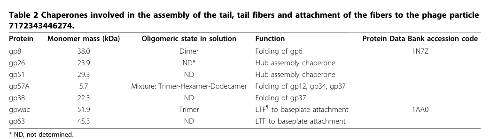

## Question

# Gene Research for Functional Annotation

## ⚠️ CRITICAL: Gene/Protein Identification Context

**BEFORE YOU BEGIN RESEARCH:** You MUST verify you are researching the CORRECT gene/protein. Gene symbols can be ambiguous, especially for less well-characterized genes from non-model organisms.

### Target Gene/Protein Identity (from UniProt):
- **UniProt Accession:** P04532
- **Protein Description:** RecName: Full=Tail fiber assembly helper protein; AltName: Full=Gene product 57; Short=gp57;
- **Gene Information:** Name=57; Synonyms=57A;
- **Organism (full):** Enterobacteria phage T4 (Bacteriophage T4).
- **Protein Family:** Not specified in UniProt
- **Key Domains:** Phage_Gp57. (IPR020159); GP57 (PF17594)

### MANDATORY VERIFICATION STEPS:

1. **Check if the gene symbol "57" matches the protein description above**
2. **Verify the organism is correct:** Enterobacteria phage T4 (Bacteriophage T4).
3. **Check if protein family/domains align with what you find in literature**
4. **If you find literature for a DIFFERENT gene with the same or similar symbol, STOP**

### If Gene Symbol is Ambiguous or You Cannot Find Relevant Literature:

**DO NOT PROCEED WITH RESEARCH ON A DIFFERENT GENE.** Instead:
- State clearly: "The gene symbol '57' is ambiguous or literature is limited for this specific protein"
- Explain what you found (e.g., "Found extensive literature on a different gene with the same symbol in a different organism")
- Describe the protein based ONLY on the UniProt information provided above
- Suggest that the protein function can be inferred from domain/family information

### Research Target:

Please provide a comprehensive research report on the gene **57** (gene ID: 57, UniProt: P04532) in BPT4.

The research report should be a detailed narrative explaining the function, biological processes, and localization of the gene product. Citations should be given for all claims.

You should prioritize authoritative reviews and primary scientific literature when conducting research. You can supplement
this with annotations you find in gene/protein databases, but these can be outdated or inaccurate.

We are specifically interested in the primary function of the gene - for enzymes, what reaction is catalyzed, and what is the substrate specificity? For transporters, what is the substrate? For structural proteins or adapters, what is the broader structural role? For signaling molecules, what is the role in the pathway.

We are interested in where in or outside the cell the gene product carries out its function.

We are also interested in the signaling or biochemical pathways in which the gene functions. We are less interested in broad pleiotropic effects, except where these elucidate the precise role.

Include evidence where possible. We are interested in both experimental evidence as well as inference from structure, evolution, or bioinformatic analysis. Precise studies should be prioritized over high-throughput, where available.

## Output

Question: You are an expert researcher providing comprehensive, well-cited information.

Provide detailed information focusing on:
1. Key concepts and definitions with current understanding
2. Recent developments and latest research (prioritize 2023-2024 sources)
3. Current applications and real-world implementations
4. Expert opinions and analysis from authoritative sources
5. Relevant statistics and data from recent studies

Format as a comprehensive research report with proper citations. Include URLs and publication dates where available.
Always prioritize recent, authoritative sources and provide specific citations for all major claims.

# Gene Research for Functional Annotation

## ⚠️ CRITICAL: Gene/Protein Identification Context

**BEFORE YOU BEGIN RESEARCH:** You MUST verify you are researching the CORRECT gene/protein. Gene symbols can be ambiguous, especially for less well-characterized genes from non-model organisms.

### Target Gene/Protein Identity (from UniProt):
- **UniProt Accession:** P04532
- **Protein Description:** RecName: Full=Tail fiber assembly helper protein; AltName: Full=Gene product 57; Short=gp57;
- **Gene Information:** Name=57; Synonyms=57A;
- **Organism (full):** Enterobacteria phage T4 (Bacteriophage T4).
- **Protein Family:** Not specified in UniProt
- **Key Domains:** Phage_Gp57. (IPR020159); GP57 (PF17594)

### MANDATORY VERIFICATION STEPS:

1. **Check if the gene symbol "57" matches the protein description above**
2. **Verify the organism is correct:** Enterobacteria phage T4 (Bacteriophage T4).
3. **Check if protein family/domains align with what you find in literature**
4. **If you find literature for a DIFFERENT gene with the same or similar symbol, STOP**

### If Gene Symbol is Ambiguous or You Cannot Find Relevant Literature:

**DO NOT PROCEED WITH RESEARCH ON A DIFFERENT GENE.** Instead:
- State clearly: "The gene symbol '57' is ambiguous or literature is limited for this specific protein"
- Explain what you found (e.g., "Found extensive literature on a different gene with the same symbol in a different organism")
- Describe the protein based ONLY on the UniProt information provided above
- Suggest that the protein function can be inferred from domain/family information

### Research Target:

Please provide a comprehensive research report on the gene **57** (gene ID: 57, UniProt: P04532) in BPT4.

The research report should be a detailed narrative explaining the function, biological processes, and localization of the gene product. Citations should be given for all claims.

You should prioritize authoritative reviews and primary scientific literature when conducting research. You can supplement
this with annotations you find in gene/protein databases, but these can be outdated or inaccurate.

We are specifically interested in the primary function of the gene - for enzymes, what reaction is catalyzed, and what is the substrate specificity? For transporters, what is the substrate? For structural proteins or adapters, what is the broader structural role? For signaling molecules, what is the role in the pathway.

We are interested in where in or outside the cell the gene product carries out its function.

We are also interested in the signaling or biochemical pathways in which the gene functions. We are less interested in broad pleiotropic effects, except where these elucidate the precise role.

Include evidence where possible. We are interested in both experimental evidence as well as inference from structure, evolution, or bioinformatic analysis. Precise studies should be prioritized over high-throughput, where available.

## Research report: functional annotation of bacteriophage T4 gene 57 (UniProt P04532; gp57/gp57A)

### Executive summary (current consensus)
Gene **57** of *Enterobacteria phage T4* encodes **gp57A** (historically also called gp57 or p57), a **small, nonstructural assembly helper/molecular chaperone** that is **required for correct assembly/folding of tail fiber components**—most consistently **gp12 (short tail fiber)** and **gp34 and gp37 (long tail fiber components)**—but is **not incorporated into the mature virion**. (matsui1997isolationandcharacterization pages 1-2, hashemolhosseini1996characterizationofthe pages 1-1, leiman2010morphogenesisofthe pages 2-5)

A central functional interpretation supported by multiple lines of genetic and biochemical evidence is that gp57A acts as an **intracellular folding/assembly catalyst** during phage morphogenesis in the infected bacterial cytoplasm, enabling productive formation of fiber oligomers (trimers/dimers depending on substrate) and incorporation steps needed for infective particles. (herrmann2004assemblyofbacteriophage pages 1-2, matsui1997isolationandcharacterization pages 4-5, leiman2010morphogenesisofthe pages 2-5)

### Mandatory identity verification and disambiguation
**Target identity**: The retrieved literature explicitly discusses **T4 gene 57** and its product **gp57/gp57A** as a tail-fiber assembly helper protein of *bacteriophage T4*. (hashemolhosseini1996characterizationofthe pages 1-1, matsui1997isolationandcharacterization pages 1-2, herrmann2004assemblyofbacteriophage pages 1-2)

**Mapping to UniProt P04532**: None of the retrieved full texts explicitly lists the UniProt accession **P04532**. Therefore, the association is supported indirectly by the unique combination of: organism (*Enterobacteria phage T4*), gene number (57/57A), protein name (gp57/gp57A), and the unusually small size (~79 aa) reported repeatedly for the gene-57 helper protein. (hashemolhosseini1996characterizationofthe pages 1-1, matsui1997isolationandcharacterization pages 1-2, matsui1997isolationandcharacterization pages 4-5)

### 1) Key concepts and definitions (current understanding)

#### 1.1 Nonstructural assembly helper / molecular chaperone (definition)
In T4 morphogenesis, “nonstructural” helper proteins are factors that **catalyze assembly reactions** yet **do not become part of the mature virion**; gp57A is explicitly placed in this category of phage-encoded molecular chaperones that facilitate tail fiber formation. (matsui1997isolationandcharacterization pages 1-2)

#### 1.2 Tail fibers and their assembly context
T4 host recognition depends on tail fibers; long tail fibers are composed of multiple gene products (including gp34 and gp37), and proper fiber assembly requires dedicated helper proteins including gp57 (and for gp37, also gp38). (gamkrelidze2014t4bacteriophageas pages 1-2, bartual2010structureofthe pages 1-2)

A synthesis table in a major morphogenesis review explicitly lists gp57A among “chaperones involved in the assembly of the tail, tail fibers and attachment of the fibers to the phage particle,” assigning gp57A the function **“Folding of gp12, gp34, gp37”**. (leiman2010morphogenesisofthe pages 2-5, leiman2010morphogenesisofthe media 88bf6b0f, leiman2010morphogenesisofthe media 7bf3e4e7, leiman2010morphogenesisofthe media 6892b351)

### 2) Molecular function and mechanism of gp57A (evidence-based)

#### 2.1 Substrates/partners and pathway position
Multiple sources converge on gp57A’s substrates:
- **gp12 (short tail fiber)**: gp57A promotes native oligomer formation and helps prevent/reverse aggregation. (matsui1997isolationandcharacterization pages 4-5, matsui1997isolationandcharacterization pages 5-6)
- **gp34 (proximal long tail fiber protein)**: genetic/assembly studies attribute gp57 to a step that mediates **gp34 dimerization** in assembling the proximal half-fiber precursor. (herrmann2004assemblyofbacteriophage pages 1-2)
- **gp37 (distal long tail fiber protein)**: gp57 acts **prior to gp38** in promoting **gp37 dimerization** for the distal half-fiber precursor; gp37 is also widely described as requiring both gp57 and gp38 for correct assembly/folding. (herrmann2004assemblyofbacteriophage pages 1-2, bartual2010structureofthe pages 1-2)

A mechanistic proposal from biochemical work is that gp57A can **interact with nascent gp12** and thereby facilitate formation of the native gp12 trimer. (matsui1997isolationandcharacterization pages 4-5)

#### 2.2 Phenotypes when gp57A is absent
When p57 is missing, key tail fiber components fail to assemble:
- Absence of p57 leaves **p34, p37, and p12 “unassembled”**, consistent with a central assembly-helper role. (hashemolhosseini1996characterizationofthe pages 1-1)
- In the absence of gp57A, gp12 becomes **insoluble/associated with cell debris or membrane fractions**, and coexpression of gene 57A alters gp12 behavior consistent with chaperone-mediated folding/assembly assistance. (matsui1997isolationandcharacterization pages 4-5)

#### 2.3 Host dependence and bypass phenomena
Classic genetics indicate the requirement for gp57 can be **host-dependent**, with some bacterial host mutants allowing bypass of gp57 function (i.e., partial suppression of the assembly defect), implying that host proteostasis or other factors can substitute under particular conditions. (herrmann2004assemblyofbacteriophage pages 1-2)

### 3) Biochemical properties and quantitative data (recently used statistics)

#### 3.1 Size, composition, and oligomerization
Primary characterization and helper-protein work reports:
- **Length**: ~**79 amino acids**. (matsui1997isolationandcharacterization pages 1-2, hashemolhosseini1996characterizationofthe pages 1-1)
- **Acidic composition**: an excess of **~9 negative charges** and an unusual lack of several residues (Phe, Trp, Tyr, His, Pro, Cys). (hashemolhosseini1996characterizationofthe pages 1-1)
- **Oligomeric state**: sedimentation-equilibrium data support a **tetrameric** gp57A in solution, with native mass **33,470 ± 4,780 Da** given a monomer mass of **8,481 Da** from sequence; cross-linking yielded up to tetramers and not pentamers. (matsui1997isolationandcharacterization pages 4-5)
- **Secondary structure**: CD-based estimate of **~94% α-helix** (with sequence prediction suggesting high helical content as well). (matsui1997isolationandcharacterization pages 4-5)

A later review table lists gp57A as **5.7 kDa** and describes a **mixture** of oligomeric states (“Trimer–Hexamer–Dodecamer”), highlighting either condition-dependent oligomerization or differences across measurement methods/conditions. (leiman2010morphogenesisofthe pages 2-5, leiman2010morphogenesisofthe media 88bf6b0f)

#### 3.2 Quantitative functional readouts
A plasmid-based complementation/overexpression experiment reported a strong effect on productivity: induced expression of 57A increased burst size to **167 PFU/cell**, compared with **3.3 PFU/cell** (uninduced) and **0.05 PFU/cell** (plasmidless control) under the experimental conditions described. (matsui1997isolationandcharacterization pages 1-2)

Temperature-dependent aggregation behavior for gp12 is reported, with gp12 being trimeric at **37°C** but forming higher-order aggregates at lower temperatures (example shown at **20°C**) that gp57A can help dissociate back into trimers. (matsui1997isolationandcharacterization pages 5-6)

### 4) Localization: where gp57A acts
Direct imaging-based localization was not retrieved in the available corpus. However, multiple primary sources explicitly describe gp57A as **nonstructural** and as a **molecular chaperone** that catalyzes assembly/folding reactions rather than forming part of the virion; this strongly supports an **intracellular role during virion morphogenesis inside infected *E. coli*** (cytoplasmic assembly environment), rather than extracellular or virion-surface localization. (hashemolhosseini1996characterizationofthe pages 1-1, matsui1997isolationandcharacterization pages 1-2)

### 5) Recent developments (prioritizing 2023–2024 sources)

#### 5.1 What is new in 2023–2024 directly about T4 gp57A?
Within the retrieved and accessible set, **direct 2023–2024 primary research specifically focused on T4 gp57A** was limited. The most informative mechanistic sources remain foundational (1996–2010) and continue to be cited as the canonical basis for gp57A function. (hashemolhosseini1996characterizationofthe pages 1-1, matsui1997isolationandcharacterization pages 4-5, leiman2010morphogenesisofthe pages 2-5)

#### 5.2 2023 trend: tail fiber + chaperone modules as determinants of phage host range and engineering success
A 2023 preprint on *Clostridioides difficile* myophages demonstrates that swapping a tail fiber gene alone was insufficient to change host specificity; host-range changes required co-exchange of the tail fiber gene together with a **neighboring putative chaperone (hyp)**, and CRISPR-mediated swapping produced a derivative with host range and infection efficiency exceeding both parents. While not a T4 study, this supports a modern generalization consistent with the T4 paradigm: **tail fiber function and engineering often require associated chaperones/assembly helpers**. (steczynska2023ataleof pages 1-4)

Similarly, work on a T4-related myovirus (CkP1) explicitly discusses the gp57A/gp38 paradigm as a reference point for the presence/absence of accessory chaperones in long tail fiber systems, reflecting continued use of gp57A as a canonical model in current phage biology. (ivantsiv2019investigationofthe pages 81-84)

### 6) Current applications and real-world implementations

#### 6.1 Recombinant production of tail fibers for receptor-binding studies and detection
A practical biotechnology application of gp57 biology is **heterologous expression of tail fiber proteins**. A 2010 study reported that soluble, correctly folded gp37 requires **co-expression with two chaperones (gp57 and gp38)**; the resulting gp37 could be purified at about **4 mg/L** culture and formed fibers of ~**63 nm** observable by EM. The authors explicitly state purified gp37 would be useful for receptor-binding studies, high-resolution structural work, and **specific binding/detection of bacteria**—all of which depend on chaperone-enabled correct folding. (bartual2010twochaperoneassistedsoluble pages 1-2)

#### 6.2 Host-range engineering for therapeutics/diagnostics
A 2009 study demonstrates targeted host-range expansion by recombination of long tail fiber determinants in a T4-like phage context (T2), producing chimeric phages that acquired broader host range while retaining lytic activity; importantly, the paper notes that in T4-like systems gp38 acts with gp57 during gp37 dimerization, tying chaperone biology to engineering outcomes. Quantitatively, IP008 infected **33%** of environmental *E. coli* isolates versus **7%** for T2, and a broad-host-range phage example (KEP10) showed **67%** bacteriolytic spectrum among UPEC, illustrating the operational value of tail fiber determinants in applied phage design. (mahichi2009sitespecificrecombinationof pages 1-2)

The 2023 *C. difficile* engineering work further suggests that successful host-range modification may require manipulating **both** fiber and its associated chaperone, a principle aligned with the established T4 gp57A/gp38 requirement for correct fiber assembly. (steczynska2023ataleof pages 1-4)

#### 6.3 T4 as an engineering/display platform (contextual relevance)
T4 is widely used as a platform for phage display/vaccine design via capsid proteins Hoc and Soc, with reported copy numbers of **~160 Hoc** and **~960 Soc** per capsid and examples of displaying peptides (e.g., 36 aa PorA peptide fusions). Tail fiber assembly (and thus gp57A) is not the display scaffold, but gp57-dependent tail fibers determine adsorption/host interaction of the T4 particle—an enabling consideration when selecting hosts for production or when modifying tropism in engineered systems. (gamkrelidze2014t4bacteriophageas pages 1-2, gamkrelidze2014t4bacteriophageas pages 2-4)

### 7) Expert synthesis and analysis (authoritative interpretations)
A high-citation morphogenesis review synthesizes gp57A’s role explicitly as a chaperone for multiple tail fiber proteins and presents gp57A within the broader induced-fit/sequential interaction framework of T4 assembly, reinforcing the mainstream view that T4 morphogenesis is driven by ordered, protein–protein interaction networks that include nonstructural catalysts. (leiman2010morphogenesisofthe pages 2-5)

Primary biochemical work emphasizes that gp57A is exceptionally small yet forms higher-order oligomers and is predominantly alpha-helical—features consistent with a specialized scaffolding/chaperone function rather than enzymatic catalysis in the classical sense. (matsui1997isolationandcharacterization pages 4-5)

### Consolidated evidence map (table)
| Claim/annotation (function/process/localization) | Key experimental evidence (brief) | Quantitative/statistical data (if any) | Primary source(s) with year and URL |
|---|---|---|---|
| **Identity and core function:** gp57/gp57A is a **nonstructural tail-fiber assembly helper / molecular chaperone** in *Enterobacteria phage T4* rather than a virion structural component. | Primary biochemical/genetic studies identify gene 57 product as a helper absent from mature virions and required for tail fiber formation; reviews classify gp57A among T4 tail/fiber chaperones. (hashemolhosseini1996characterizationofthe pages 1-1, matsui1997isolationandcharacterization pages 1-2, leiman2010morphogenesisofthe pages 2-5) | Encoded product reported as **79 aa**; apparent SDS-PAGE size about **5.7–6 kDa**, despite higher calculated mass. (hashemolhosseini1996characterizationofthe pages 1-1, matsui1997isolationandcharacterization pages 1-2, leiman2010morphogenesisofthe pages 2-5) | Hashemolhosseini et al., 1996, J Bacteriol, https://doi.org/10.1128/jb.178.21.6258-6265.1996; Matsui et al., 1997, J Bacteriol, https://doi.org/10.1128/jb.179.6.1846-1851.1997; Leiman et al., 2010, Virol J, https://doi.org/10.1186/1743-422x-7-355 |
| **Substrates/targets:** gp57A assists folding/assembly of **gp12, gp34, and gp37**. | Table-based review annotation assigns gp57A to folding of gp12, gp34, gp37; structural/review papers state gp34 and gp37 require gp57 for proper trimeric assembly, and gp12 also depends on gp57. (leiman2010morphogenesisofthe pages 2-5, bartual2010structureofthe pages 1-2) | Long tail fiber is ~**70 nm** long; gp37 is ~**109 kDa** in review annotation; gp37 distal subunit is **1,026 aa** in helper-protein study. (leiman2010morphogenesisofthe pages 2-5, hashemolhosseini1996characterizationofthe pages 1-1, gamkrelidze2014t4bacteriophageas pages 1-2) | Bartual et al., 2010, PNAS, https://doi.org/10.1073/pnas.1011218107; Leiman et al., 2010, Virol J, https://doi.org/10.1186/1743-422x-7-355; Hashemolhosseini et al., 1996, J Bacteriol, https://doi.org/10.1128/jb.178.21.6258-6265.1996 |
| **Assembly pathway role:** gp57 acts at multiple discrete steps in long- and short-tail fiber morphogenesis. | Genetic analysis showed gp57 is required for **gp34 dimerization** (proximal half-fiber precursor), acts **before gp38** to promote **gp37 dimerization** (distal half-fiber precursor), and is needed for **gp12 incorporation** into the baseplate. (herrmann2004assemblyofbacteriophage pages 1-2) | Three distinct assembly reactions assigned to gp57 in classic genetic study. (herrmann2004assemblyofbacteriophage pages 1-2) | Herrmann & Wood, 1981/2004 record, Mol Gen Genet, https://doi.org/10.1007/bf00271208 |
| **Biochemical state:** gp57A is a small, highly **alpha-helical oligomer**, most directly supported as a **tetramer** in solution. | Sedimentation equilibrium and glutaraldehyde cross-linking supported a tetrameric native assembly; CD spectroscopy indicated strong alpha-helical character. Some later review/tabulation reports alternative oligomeric mixtures, but direct biochemical evidence most strongly supports tetramer. (matsui1997isolationandcharacterization pages 4-5, matsui1997isolationandcharacterization pages 1-2, leiman2010morphogenesisofthe pages 2-5) | Monomer from sequence **8,481 Da**; native molecular weight **33,470 ± 4,780 Da**; CD estimate **~94% α-helix**. Review table also lists **trimer/hexamer/dodecamer** mixture. (matsui1997isolationandcharacterization pages 4-5, leiman2010morphogenesisofthe pages 2-5) | Matsui et al., 1997, J Bacteriol, https://doi.org/10.1128/jb.179.6.1846-1851.1997; Leiman et al., 2010, Virol J, https://doi.org/10.1186/1743-422x-7-355 |
| **Protein properties:** gp57A is unusually acidic and compositionally atypical. | Helper-protein characterization reported a highly acidic 79-residue protein lacking several common residues and forming intracellular quasi-crystalline fibers when overproduced. (hashemolhosseini1996characterizationofthe pages 1-1) | Excess of **9 negative charges**; lacks **Phe, Trp, Tyr, His, Pro, Cys**. Partial complementation seen with only the **N-terminal 25 aa** fragment. (hashemolhosseini1996characterizationofthe pages 1-1) | Hashemolhosseini et al., 1996, J Bacteriol, https://doi.org/10.1128/jb.178.21.6258-6265.1996 |
| **Effect of gp57A absence:** loss of gp57 prevents normal assembly of target tail-fiber proteins. | In the absence of p57, **p34, p37, and p12 remain unassembled**; for gp12 specifically, material partitions into cell debris/membrane rather than soluble/native trimeric form. (hashemolhosseini1996characterizationofthe pages 1-1, matsui1997isolationandcharacterization pages 4-5) | Uninduced/plasmidless complementation controls gave low burst sizes versus induced gp57A expression: **167 PFU/cell** induced vs **3.3** and **0.05 PFU/cell** controls. (matsui1997isolationandcharacterization pages 1-2) | Hashemolhosseini et al., 1996, J Bacteriol, https://doi.org/10.1128/jb.178.21.6258-6265.1996; Matsui et al., 1997, J Bacteriol, https://doi.org/10.1128/jb.179.6.1846-1851.1997 |
| **Specific mechanistic effect on gp12:** gp57A promotes native short-tail-fiber trimer formation and can reverse aggregation. | Authors proposed gp57A interacts with nascent gp12 to facilitate native trimer formation; at lower temperature gp12 forms higher-order aggregates, and gp57A promotes dissociation back to trimers. (matsui1997isolationandcharacterization pages 4-5, matsui1997isolationandcharacterization pages 5-6) | gp12 is trimeric at **37°C** but forms larger aggregates at **20°C** in the reported assay context. (matsui1997isolationandcharacterization pages 5-6) | Matsui et al., 1997, J Bacteriol, https://doi.org/10.1128/jb.179.6.1846-1851.1997 |
| **Cellular localization of function:** gp57A functions **inside the infected bacterial cytoplasm** during phage morphogenesis, not on the mature virion surface. | Its classification as a nonstructural helper/chaperone, absence from mature virions, and role in folding soluble tail-fiber precursors indicate intracellular action during assembly. (hashemolhosseini1996characterizationofthe pages 1-1, matsui1997isolationandcharacterization pages 1-2, leiman2010morphogenesisofthe pages 2-5) | No direct subcellular imaging/localization number reported in retrieved evidence. | Hashemolhosseini et al., 1996, J Bacteriol, https://doi.org/10.1128/jb.178.21.6258-6265.1996; Matsui et al., 1997, J Bacteriol, https://doi.org/10.1128/jb.179.6.1846-1851.1997; Leiman et al., 2010, Virol J, https://doi.org/10.1186/1743-422x-7-355 |
| **Recombinant implementation:** gp57 is practically required for soluble recombinant production of T4 gp37 together with gp38. | A two-vector co-expression system showed single-chaperone expression was insufficient; co-expression of **gp57 + gp38** enabled purification of correctly folded trimeric gp37 for downstream receptor-binding and structural studies. (bartual2010twochaperoneassistedsoluble pages 1-2, bartual2010structureofthe pages 1-2) | Yield about **4 mg/L** culture; purified gp37 fibers ~**63 nm** by EM; gp57 reported there as **79 aa, 8,613 Da**. (bartual2010twochaperoneassistedsoluble pages 1-2) | Bartual et al., 2010, Protein Expr Purif, https://doi.org/10.1016/j.pep.2009.11.005; Bartual et al., 2010, PNAS, https://doi.org/10.1073/pnas.1011218107 |
| **Application to host-range engineering:** tail-fiber/chaperone biology informs engineering of adsorption specificity and host range. | T2/T4-like systems use distal tail-fiber genes plus associated helpers/chaperones; swapping tail-fiber determinants can broaden host range, and modern work in other phages shows tail-fiber swaps may require co-swapping an adjacent chaperone gene to alter specificity successfully. (mahichi2009sitespecificrecombinationof pages 1-2, steczynska2023ataleof pages 1-4, ivantsiv2019investigationofthe pages 16-19) | Engineered/recombined phage examples: IP008 infected **33%** of environmental *E. coli* isolates vs **7%** for T2; one engineered derivative showed **67%** bacteriolytic spectrum among UPEC. (mahichi2009sitespecificrecombinationof pages 1-2) | Mahichi et al., 2009, FEMS Microbiol Lett, https://doi.org/10.1111/j.1574-6968.2009.01588.x; Steczynska et al., 2023, bioRxiv, https://doi.org/10.1101/2023.10.16.562632 |
| **Application context in T4 platform engineering:** while gp57 itself is not the display scaffold, understanding T4 tail-fiber assembly supports manipulation of host recognition alongside broader T4 engineering uses such as phage display. | T4 platform reviews note tail fibers mediate host recognition and require gp57 for correct assembly, while separate capsid proteins Hoc/Soc are used for antigen display; thus gp57 is enabling infrastructure for tail-fiber biology rather than the display moiety itself. (gamkrelidze2014t4bacteriophageas pages 1-2, gamkrelidze2014t4bacteriophageas pages 2-4) | T4 capsid carries about **160 Hoc** and **960 Soc** copies; example displayed inserts included **36 aa** and **53 aa** chimeric polypeptides. (gamkrelidze2014t4bacteriophageas pages 1-2, gamkrelidze2014t4bacteriophageas pages 2-4) | Gamkrelidze & Dąbrowska, 2014, Arch Microbiol, https://doi.org/10.1007/s00203-014-0989-8 |
| **Evidence figure/table support:** review synthesis places gp57A among tail/fiber chaperones and explicitly maps its substrates. | Retrieved Table 2 / Figure 15 summarize gp57A as a chaperone for gp12, gp34, gp37 and show long-tail-fiber assembly context. (leiman2010morphogenesisofthe media 88bf6b0f, leiman2010morphogenesisofthe media 7bf3e4e7, leiman2010morphogenesisofthe media 6892b351) | Table entry lists gp57A at **5.7 kDa** with oligomeric mixture annotation. (leiman2010morphogenesisofthe media 88bf6b0f, leiman2010morphogenesisofthe media 7bf3e4e7, leiman2010morphogenesisofthe media 6892b351) | Leiman et al., 2010, Virol J, https://doi.org/10.1186/1743-422x-7-355 |

*Table: This table summarizes experimentally grounded functional annotation for Enterobacteria phage T4 gene product 57 (gp57/gp57A), including its chaperone role, assembly targets, biochemical properties, and applied relevance. It is useful as a compact evidence map linking claims to quantitative details and primary sources.*

### Key visual evidence (from retrieved figures/tables)
A cropped table entry and assembly schematic from Leiman et al. (2010) visually document that gp57A is annotated as a chaperone for folding **gp12, gp34, and gp37**, and places it within the long tail fiber assembly pathway. (leiman2010morphogenesisofthe media 88bf6b0f, leiman2010morphogenesisofthe media 7bf3e4e7, leiman2010morphogenesisofthe media 6892b351)

### Limitations and evidence gaps
- **Direct UniProt cross-reference**: the retrieved papers do not explicitly mention UniProt accession **P04532**; mapping is inferred from organism/gene/protein identity and size. (hashemolhosseini1996characterizationofthe pages 1-1, matsui1997isolationandcharacterization pages 1-2)
- **2023–2024 T4-gp57A-specific primary research**: within the retrieved accessible corpus, recent work primarily cites gp57A as a canonical model rather than providing new direct mechanistic detail; recent advances are instead exemplified through broader phage engineering studies highlighting tail fiber + chaperone co-dependence. (steczynska2023ataleof pages 1-4)
- **Localization**: no microscopy-based intracellular localization was retrieved; localization is inferred from the well-supported nonstructural chaperone role. (matsui1997isolationandcharacterization pages 1-2)

References

1. (matsui1997isolationandcharacterization pages 1-2): T. Matsui, B. Griniuviene, E. Goldberg, A. Tsugita, N. Tanaka, and F. Arisaka. Isolation and characterization of a molecular chaperone, gp57a, of bacteriophage t4. Journal of Bacteriology, 179:1846-1851, Mar 1997. URL: https://doi.org/10.1128/jb.179.6.1846-1851.1997, doi:10.1128/jb.179.6.1846-1851.1997. This article has 34 citations and is from a peer-reviewed journal.

2. (hashemolhosseini1996characterizationofthe pages 1-1): Said Hashemolhosseini, Y. Stierhof, I. Hindennach, and Ulf Henning. Characterization of the helper proteins for the assembly of tail fibers of coliphages t4 and lambda. Journal of Bacteriology, 178:6258-6265, Nov 1996. URL: https://doi.org/10.1128/jb.178.21.6258-6265.1996, doi:10.1128/jb.178.21.6258-6265.1996. This article has 71 citations and is from a peer-reviewed journal.

3. (leiman2010morphogenesisofthe pages 2-5): Petr G Leiman, Fumio Arisaka, Mark J van Raaij, Victor A Kostyuchenko, Anastasia A Aksyuk, Shuji Kanamaru, and Michael G Rossmann. Morphogenesis of the t4 tail and tail fibers. Virology Journal, 7:355-355, Dec 2010. URL: https://doi.org/10.1186/1743-422x-7-355, doi:10.1186/1743-422x-7-355. This article has 319 citations and is from a peer-reviewed journal.

4. (herrmann2004assemblyofbacteriophage pages 1-2): Richard Herrmann and William B. Wood. Assembly of bacteriophage t4 tail fibers: identification and characterization of the nonstructural protein gp57. Molecular and General Genetics MGG, 184:125-132, Nov 2004. URL: https://doi.org/10.1007/bf00271208, doi:10.1007/bf00271208. This article has 17 citations.

5. (matsui1997isolationandcharacterization pages 4-5): T. Matsui, B. Griniuviene, E. Goldberg, A. Tsugita, N. Tanaka, and F. Arisaka. Isolation and characterization of a molecular chaperone, gp57a, of bacteriophage t4. Journal of Bacteriology, 179:1846-1851, Mar 1997. URL: https://doi.org/10.1128/jb.179.6.1846-1851.1997, doi:10.1128/jb.179.6.1846-1851.1997. This article has 34 citations and is from a peer-reviewed journal.

6. (gamkrelidze2014t4bacteriophageas pages 1-2): Mariam Gamkrelidze and Krystyna Dąbrowska. T4 bacteriophage as a phage display platform. Archives of Microbiology, 196:473-479, May 2014. URL: https://doi.org/10.1007/s00203-014-0989-8, doi:10.1007/s00203-014-0989-8. This article has 77 citations and is from a peer-reviewed journal.

7. (bartual2010structureofthe pages 1-2): Sergio G. Bartual, José M. Otero, Carmela Garcia-Doval, Antonio L. Llamas-Saiz, Richard Kahn, Gavin C. Fox, and Mark J. van Raaij. Structure of the bacteriophage t4 long tail fiber receptor-binding tip. Proceedings of the National Academy of Sciences, 107:20287-20292, Nov 2010. URL: https://doi.org/10.1073/pnas.1011218107, doi:10.1073/pnas.1011218107. This article has 273 citations and is from a highest quality peer-reviewed journal.

8. (leiman2010morphogenesisofthe media 88bf6b0f): Petr G Leiman, Fumio Arisaka, Mark J van Raaij, Victor A Kostyuchenko, Anastasia A Aksyuk, Shuji Kanamaru, and Michael G Rossmann. Morphogenesis of the t4 tail and tail fibers. Virology Journal, 7:355-355, Dec 2010. URL: https://doi.org/10.1186/1743-422x-7-355, doi:10.1186/1743-422x-7-355. This article has 319 citations and is from a peer-reviewed journal.

9. (leiman2010morphogenesisofthe media 7bf3e4e7): Petr G Leiman, Fumio Arisaka, Mark J van Raaij, Victor A Kostyuchenko, Anastasia A Aksyuk, Shuji Kanamaru, and Michael G Rossmann. Morphogenesis of the t4 tail and tail fibers. Virology Journal, 7:355-355, Dec 2010. URL: https://doi.org/10.1186/1743-422x-7-355, doi:10.1186/1743-422x-7-355. This article has 319 citations and is from a peer-reviewed journal.

10. (leiman2010morphogenesisofthe media 6892b351): Petr G Leiman, Fumio Arisaka, Mark J van Raaij, Victor A Kostyuchenko, Anastasia A Aksyuk, Shuji Kanamaru, and Michael G Rossmann. Morphogenesis of the t4 tail and tail fibers. Virology Journal, 7:355-355, Dec 2010. URL: https://doi.org/10.1186/1743-422x-7-355, doi:10.1186/1743-422x-7-355. This article has 319 citations and is from a peer-reviewed journal.

11. (matsui1997isolationandcharacterization pages 5-6): T. Matsui, B. Griniuviene, E. Goldberg, A. Tsugita, N. Tanaka, and F. Arisaka. Isolation and characterization of a molecular chaperone, gp57a, of bacteriophage t4. Journal of Bacteriology, 179:1846-1851, Mar 1997. URL: https://doi.org/10.1128/jb.179.6.1846-1851.1997, doi:10.1128/jb.179.6.1846-1851.1997. This article has 34 citations and is from a peer-reviewed journal.

12. (steczynska2023ataleof pages 1-4): Joanna P. Steczynska, Sarah J. Kerr, Michelle L. Kelly, Michaella J. Whittle, Terry W. Bilverstone, and Nigel P. Minton. A tale of two phage tails: engineering the host range of bacteriophages infecting clostridioides difficile. bioRxiv, Oct 2023. URL: https://doi.org/10.1101/2023.10.16.562632, doi:10.1101/2023.10.16.562632. This article has 4 citations.

13. (ivantsiv2019investigationofthe pages 81-84): O Ivantsiv. Investigation of the tail fibres and tail fibre assembly proteins of contractile-tailed phages. Unknown journal, 2019.

14. (bartual2010twochaperoneassistedsoluble pages 1-2): Sergio Galan Bartual, Carmela Garcia-Doval, Jana Alonso, Guy Schoehn, and Mark J. van Raaij. Two-chaperone assisted soluble expression and purification of the bacteriophage t4 long tail fibre protein gp37. Protein expression and purification, 70 1:116-21, Mar 2010. URL: https://doi.org/10.1016/j.pep.2009.11.005, doi:10.1016/j.pep.2009.11.005. This article has 60 citations and is from a peer-reviewed journal.

15. (mahichi2009sitespecificrecombinationof pages 1-2): Faezeh Mahichi, Aidan John Synnott, Keiko Yamamichi, Toshiya Osada, and Yasunori Tanji. Site-specific recombination of t2 phage using ip008 long tail fiber genes provides a targeted method for expanding host range while retaining lytic activity. FEMS microbiology letters, 295 2:211-7, Jun 2009. URL: https://doi.org/10.1111/j.1574-6968.2009.01588.x, doi:10.1111/j.1574-6968.2009.01588.x. This article has 186 citations and is from a peer-reviewed journal.

16. (gamkrelidze2014t4bacteriophageas pages 2-4): Mariam Gamkrelidze and Krystyna Dąbrowska. T4 bacteriophage as a phage display platform. Archives of Microbiology, 196:473-479, May 2014. URL: https://doi.org/10.1007/s00203-014-0989-8, doi:10.1007/s00203-014-0989-8. This article has 77 citations and is from a peer-reviewed journal.

17. (ivantsiv2019investigationofthe pages 16-19): O Ivantsiv. Investigation of the tail fibres and tail fibre assembly proteins of contractile-tailed phages. Unknown journal, 2019.

## Artifacts

- [Edison artifact artifact-00](57-deep-research-falcon_artifacts/artifact-00.md)

## Citations

1. matsui1997isolationandcharacterization pages 1-2
2. herrmann2004assemblyofbacteriophage pages 1-2
3. matsui1997isolationandcharacterization pages 4-5
4. hashemolhosseini1996characterizationofthe pages 1-1
5. matsui1997isolationandcharacterization pages 5-6
6. steczynska2023ataleof pages 1-4
7. ivantsiv2019investigationofthe pages 81-84
8. bartual2010twochaperoneassistedsoluble pages 1-2
9. mahichi2009sitespecificrecombinationof pages 1-2
10. leiman2010morphogenesisofthe pages 2-5
11. bartual2010structureofthe pages 1-2
12. ivantsiv2019investigationofthe pages 16-19
13. https://doi.org/10.1128/jb.178.21.6258-6265.1996;
14. https://doi.org/10.1128/jb.179.6.1846-1851.1997;
15. https://doi.org/10.1186/1743-422x-7-355
16. https://doi.org/10.1073/pnas.1011218107;
17. https://doi.org/10.1186/1743-422x-7-355;
18. https://doi.org/10.1128/jb.178.21.6258-6265.1996
19. https://doi.org/10.1007/bf00271208
20. https://doi.org/10.1128/jb.179.6.1846-1851.1997
21. https://doi.org/10.1016/j.pep.2009.11.005;
22. https://doi.org/10.1073/pnas.1011218107
23. https://doi.org/10.1111/j.1574-6968.2009.01588.x;
24. https://doi.org/10.1101/2023.10.16.562632
25. https://doi.org/10.1007/s00203-014-0989-8
26. https://doi.org/10.1128/jb.179.6.1846-1851.1997,
27. https://doi.org/10.1128/jb.178.21.6258-6265.1996,
28. https://doi.org/10.1186/1743-422x-7-355,
29. https://doi.org/10.1007/bf00271208,
30. https://doi.org/10.1007/s00203-014-0989-8,
31. https://doi.org/10.1073/pnas.1011218107,
32. https://doi.org/10.1101/2023.10.16.562632,
33. https://doi.org/10.1016/j.pep.2009.11.005,
34. https://doi.org/10.1111/j.1574-6968.2009.01588.x,