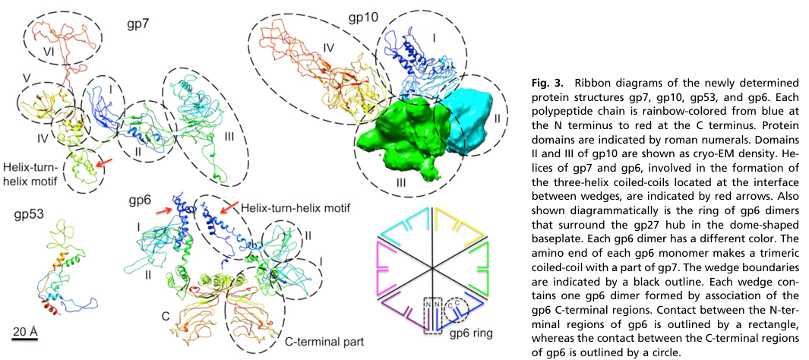

## Question

# Gene Research for Functional Annotation

## ⚠️ CRITICAL: Gene/Protein Identification Context

**BEFORE YOU BEGIN RESEARCH:** You MUST verify you are researching the CORRECT gene/protein. Gene symbols can be ambiguous, especially for less well-characterized genes from non-model organisms.

### Target Gene/Protein Identity (from UniProt):
- **UniProt Accession:** P19060
- **Protein Description:** RecName: Full=Baseplate wedge protein gp6 {ECO:0000255|HAMAP-Rule:MF_04102, ECO:0000305}; AltName: Full=Gene product 6; Short=gp6;
- **Gene Information:** Name=6;
- **Organism (full):** Enterobacteria phage T4 (Bacteriophage T4).
- **Protein Family:** Belongs to the T4likevirus baseplate wedge protein gp6
- **Key Domains:** Gp6-like_N. (IPR049026); Gp6_C-I. (IPR049027); gp6_C-II. (IPR049028); Gp6_C-III. (IPR054065); Gp6_II_1st. (IPR049029)

### MANDATORY VERIFICATION STEPS:

1. **Check if the gene symbol "6" matches the protein description above**
2. **Verify the organism is correct:** Enterobacteria phage T4 (Bacteriophage T4).
3. **Check if protein family/domains align with what you find in literature**
4. **If you find literature for a DIFFERENT gene with the same or similar symbol, STOP**

### If Gene Symbol is Ambiguous or You Cannot Find Relevant Literature:

**DO NOT PROCEED WITH RESEARCH ON A DIFFERENT GENE.** Instead:
- State clearly: "The gene symbol '6' is ambiguous or literature is limited for this specific protein"
- Explain what you found (e.g., "Found extensive literature on a different gene with the same symbol in a different organism")
- Describe the protein based ONLY on the UniProt information provided above
- Suggest that the protein function can be inferred from domain/family information

### Research Target:

Please provide a comprehensive research report on the gene **6** (gene ID: 6, UniProt: P19060) in BPT4.

The research report should be a detailed narrative explaining the function, biological processes, and localization of the gene product. Citations should be given for all claims.

You should prioritize authoritative reviews and primary scientific literature when conducting research. You can supplement
this with annotations you find in gene/protein databases, but these can be outdated or inaccurate.

We are specifically interested in the primary function of the gene - for enzymes, what reaction is catalyzed, and what is the substrate specificity? For transporters, what is the substrate? For structural proteins or adapters, what is the broader structural role? For signaling molecules, what is the role in the pathway.

We are interested in where in or outside the cell the gene product carries out its function.

We are also interested in the signaling or biochemical pathways in which the gene functions. We are less interested in broad pleiotropic effects, except where these elucidate the precise role.

Include evidence where possible. We are interested in both experimental evidence as well as inference from structure, evolution, or bioinformatic analysis. Precise studies should be prioritized over high-throughput, where available.

## Output

Question: You are an expert researcher providing comprehensive, well-cited information.

Provide detailed information focusing on:
1. Key concepts and definitions with current understanding
2. Recent developments and latest research (prioritize 2023-2024 sources)
3. Current applications and real-world implementations
4. Expert opinions and analysis from authoritative sources
5. Relevant statistics and data from recent studies

Format as a comprehensive research report with proper citations. Include URLs and publication dates where available.
Always prioritize recent, authoritative sources and provide specific citations for all major claims.

# Gene Research for Functional Annotation

## ⚠️ CRITICAL: Gene/Protein Identification Context

**BEFORE YOU BEGIN RESEARCH:** You MUST verify you are researching the CORRECT gene/protein. Gene symbols can be ambiguous, especially for less well-characterized genes from non-model organisms.

### Target Gene/Protein Identity (from UniProt):
- **UniProt Accession:** P19060
- **Protein Description:** RecName: Full=Baseplate wedge protein gp6 {ECO:0000255|HAMAP-Rule:MF_04102, ECO:0000305}; AltName: Full=Gene product 6; Short=gp6;
- **Gene Information:** Name=6;
- **Organism (full):** Enterobacteria phage T4 (Bacteriophage T4).
- **Protein Family:** Belongs to the T4likevirus baseplate wedge protein gp6
- **Key Domains:** Gp6-like_N. (IPR049026); Gp6_C-I. (IPR049027); gp6_C-II. (IPR049028); Gp6_C-III. (IPR054065); Gp6_II_1st. (IPR049029)

### MANDATORY VERIFICATION STEPS:

1. **Check if the gene symbol "6" matches the protein description above**
2. **Verify the organism is correct:** Enterobacteria phage T4 (Bacteriophage T4).
3. **Check if protein family/domains align with what you find in literature**
4. **If you find literature for a DIFFERENT gene with the same or similar symbol, STOP**

### If Gene Symbol is Ambiguous or You Cannot Find Relevant Literature:

**DO NOT PROCEED WITH RESEARCH ON A DIFFERENT GENE.** Instead:
- State clearly: "The gene symbol '6' is ambiguous or literature is limited for this specific protein"
- Explain what you found (e.g., "Found extensive literature on a different gene with the same symbol in a different organism")
- Describe the protein based ONLY on the UniProt information provided above
- Suggest that the protein function can be inferred from domain/family information

### Research Target:

Please provide a comprehensive research report on the gene **6** (gene ID: 6, UniProt: P19060) in BPT4.

The research report should be a detailed narrative explaining the function, biological processes, and localization of the gene product. Citations should be given for all claims.

You should prioritize authoritative reviews and primary scientific literature when conducting research. You can supplement
this with annotations you find in gene/protein databases, but these can be outdated or inaccurate.

We are specifically interested in the primary function of the gene - for enzymes, what reaction is catalyzed, and what is the substrate specificity? For transporters, what is the substrate? For structural proteins or adapters, what is the broader structural role? For signaling molecules, what is the role in the pathway.

We are interested in where in or outside the cell the gene product carries out its function.

We are also interested in the signaling or biochemical pathways in which the gene functions. We are less interested in broad pleiotropic effects, except where these elucidate the precise role.

Include evidence where possible. We are interested in both experimental evidence as well as inference from structure, evolution, or bioinformatic analysis. Precise studies should be prioritized over high-throughput, where available.

## Research report: Functional annotation of bacteriophage T4 gene **6** (gp6) (UniProt: **P19060**)

### 0) Target identity verification (critical disambiguation)
The UniProt target provided (P19060) corresponds to **Enterobacteria phage T4 gene product 6 (gp6)**, a **baseplate wedge protein** in the T4 contractile tail baseplate, repeatedly described as the baseplate **“hinge-pin”** and an inner-ring component that links baseplate wedges and couples baseplate rearrangement to tail sheath contraction (aksyuk2009thestructureof pages 2-3, aksyuk2009thestructureof pages 3-4). In T4, gp6 is consistently described as a **660-aa** structural protein present as **12 copies** in the mature baseplate (2 per wedge), forming a gp6 ring around the hub (arisaka2016molecularassemblyand pages 1-2, taylor2016structureofthe pages 1-3, yap2016roleofbacteriophage pages 1-3). No evidence in the retrieved literature indicates that “gene 6” in T4 refers to a different protein; rather, “gp6” is consistently used for the baseplate wedge subunit (aksyuk2009thestructureof pages 2-3, yap2016roleofbacteriophage pages 1-3).

### 1) Key concepts and definitions (current understanding)

#### 1.1 Contractile tail baseplate and “wedge” modules
Myophage (contractile-tailed) infection is driven by a **contractile sheath** surrounding a rigid tube. The distal **baseplate** functions as an adsorption and triggering platform that (i) organizes receptor-binding modules and (ii) undergoes a large conformational transition that triggers sheath contraction and tube penetration.

In T4, the baseplate is built from a **central hub** surrounded by **six wedges**, which are assembly intermediates that can self-associate (under some conditions) even without the hub (leiman2010morphogenesisofthe pages 2-5). A wedge is a multi-protein subassembly; gp6 is a core wedge subunit that later forms a ring at the interface between wedges and the hub (arisaka2016molecularassemblyand pages 2-4, yap2016roleofbacteriophage pages 1-3).

#### 1.2 gp6 definition (structural protein; not an enzyme)
T4 gp6 is a **structural adapter/hinge protein**, not reported to catalyze a chemical reaction. Its primary “function” is mechanical/architectural: it forms stable oligomeric interfaces that **circularize/zip wedges**, stabilizes the baseplate, and participates in the **dome↔star** baseplate rearrangement that initiates contraction (aksyuk2009thestructureof pages 2-3, aksyuk2009thestructureof pages 3-4).

### 2) Core functional annotation of gp6 (gene 6) in bacteriophage T4

#### 2.1 Localization: virion baseplate (inner ring around hub)
In the mature, dome-shaped T4 baseplate, gp6 is present as a **ring of six gp6 dimers** (i.e., 12 gp6 monomers) surrounding the central hub (yap2016roleofbacteriophage pages 1-3). Cryo-EM reconstructions and fitted models explicitly depict an **inner ring of gp6–gp53–gp25** in the baseplate architecture and show how this inner ring changes between the dome and star states (yap2016roleofbacteriophage media 97452fde, yap2016roleofbacteriophage media 4d7bbabd).

#### 2.2 Stoichiometry and oligomeric state (quantitative)
Across multiple sources, gp6 is consistently reported as:
- **Length:** ~**660 amino acids** (arisaka2016molecularassemblyand pages 1-2, yap2016roleofbacteriophage pages 1-3)
- **Copy number:** **12 gp6 monomers per tail/baseplate** (2 per wedge) (taylor2016structureofthe pages 1-3, leiman2010morphogenesisofthe pages 2-5)
- **Solution state:** **dimeric** (leiman2010morphogenesisofthe pages 2-5, yap2016roleofbacteriophage pages 1-3)
- **Mass:** monomer mass reported as **74.4 kDa** (leiman2010morphogenesisofthe pages 2-5)

#### 2.3 Assembly role: ordered wedge assembly and baseplate formation
A central experimental finding is that T4 wedge assembly follows a **strict order** that includes gp6 at a defined stage. In vitro/biophysical assembly work and reviews describe the ordered pathway:
**gp11 → gp10 → gp7 → gp8 → gp6 → gp53 → gp25** (yap2010sequentialassemblyof pages 1-2).

gp6 binds after gp8 in this assembly pathway, and gp8 is also described as being involved in **folding of gp6** (leiman2010morphogenesisofthe pages 2-5, aksyuk2009thestructureof pages 2-3). Biophysical measurements report wedge intermediate stoichiometry including **(gp10)3:(gp7)1:(gp8)2:(gp6)2**, consistent with **two gp6 per wedge** (arisaka2012stoichiometryofprotein pages 7-9). gp53 binding becomes strong only after gp6 is in the precursor wedge complex, and gp53 is required for subsequent gp25 binding, indicating that gp6 incorporation enables conformational/interaction states required for later assembly steps (leiman2010morphogenesisofthe pages 2-5, yap2010sequentialassemblyof pages 1-2).

#### 2.4 Structural “hinge-pin” function and coupling to contraction triggering
Aksyuk et al. (2009) solved X-ray structures of C-terminal fragments of gp6 and fit them into cryo-EM baseplate maps, describing gp6 as the baseplate **“hinge-pin”** (aksyuk2009thestructureof pages 2-3, aksyuk2009thestructureof pages 3-4). Mechanistically:
- gp6 forms dimers and a connected ring; each gp6 contacts adjacent gp6 subunits within and between wedges (aksyuk2009thestructureof pages 2-3).
- During dome→star rearrangement, gp6 preserves key dimer interfaces but the **hinge angle between N- and C-terminal parts changes (~15°)**, allowing **ring expansion** (aksyuk2009thestructureof pages 2-3, aksyuk2009thestructureof pages 3-4).
- This hinge motion repositions the gp6 N-terminal region that contacts the first sheath ring (gp18), and this repositioning is proposed to **initiate tail sheath contraction** (aksyuk2009thestructureof pages 3-4).

Signal transmission from receptor engagement is described as passing through baseplate proteins **gp9 → gp10 → gp7 → gp6 → gp18**, consistent with gp6 serving as a mechanical coupling element between receptor-binding events and sheath contraction initiation (aksyuk2009thestructureof pages 3-4).

#### 2.5 Interaction partners (network role)
Mechanistic models and structural fits implicate gp6 in a dense interaction network, with interaction topology differing by conformation:
- **Assembly requirement/partner:** gp8 must bind before gp6 binds in wedge assembly; gp6 interacts asymmetrically with gp7 and gp8 (aksyuk2009thestructureof pages 2-3).
- **Hub interface:** gp6 contacts the hub; a gp6–gp27 interaction is described as a **critical nucleation step** for forming the high-energy dome baseplate (yap2016roleofbacteriophage pages 1-3).
- **In dome baseplate:** gp6 C-terminal part contacts gp5, gp7, and gp8; gp6 N-terminal part contacts gp25, gp53, and sheath protein gp18 (aksyuk2009thestructureof pages 2-3).
- **During rearrangement:** some gp6 contacts switch (e.g., losing gp8 contact and shifting to other partners), consistent with a dynamic hinge role (aksyuk2009thestructureof pages 2-3, aksyuk2009thestructureof pages 3-4).

### 3) Domain architecture and structural biology (linking to UniProt/InterPro-style annotation)

#### 3.1 Experimentally determined domains in gp6
The C-terminal half of gp6 has been structurally characterized in detail. The gp6_334C fragment (residues **334–660**) resolved **three structural domains**:
- Domain I: **340–411**
- Domain II (β-barrel): **489–620**
- Domain III: **412–489 and 620–660**
(aksyuk2009thestructureof pages 2-3).

The crystal structure captures a tail-to-tail dimer interface via domain III, and mapping suggests gp6 participates in both intra- and inter-wedge dimeric interfaces in the baseplate ring (aksyuk2009thestructureof pages 2-3, aksyuk2009thestructureof pages 3-4). A domain-II loop (residues **519–534**) contacts gp5 and is described as not conserved among T4-like phages (aksyuk2009thestructureof pages 2-3).

#### 3.2 Notable residue features: single cysteine and disulfide-mediated dimerization (in vitro)
gp6 contains a notable cysteine feature: **Cys338** is described as the only cysteine and can form a disulfide-linked dimer; chemical modification prevents dimer formation and a **C338S substitution** was used to improve crystallization (aksyuk2009thestructureof pages 1-2, aksyuk2009thestructureof pages 5-6). This supports that gp6 can form stable dimers through its C-terminal region (though the physiological relevance of disulfide formation in the reducing bacterial cytosol is uncertain and should be interpreted as an in vitro property unless otherwise demonstrated).

### 4) Recent developments (prioritizing 2023–2024)
Direct new experimental work specifically on *T4* gp6 itself (2023–2024) was not retrieved in this search set; however, 2023–2024 studies increasingly treat T4 gp6 as a **canonical structural reference** for wedge modules in other contractile injection systems.

#### 4.1 Minimal contractile baseplates and conserved wedge modules (2023)
A 2023 cryo-EM study of **Vibrio phage XM1** (Viruses; published Jul 2023) described XM1 as a compact contractile injection machine and determined the baseplate at **3.2 Å** resolution (wang2023structureofvibrio pages 3-5). Critically, the authors state that the XM1 wedge complex **(gp16)2–gp17 is homologous to the T4 wedge module (gp6)2–gp7**, reinforcing the idea that the T4 gp6-based heterotrimeric module represents a broadly conserved architecture (wang2023structureofvibrio pages 3-5). This supports using gp6 family/domain membership (as in UniProt) to infer conserved mechanical/assembly roles across myophages.

#### 4.2 Engineering and high-resolution structures of antibacterial contractile nanomachines (2024)
A 2024 Nature Communications paper reported atomic structures of an **engineered diffocin** (a contractile bacteriocin/tailocin-like nanomachine) in pre- and post-contraction states, framing the work as providing principles for designing **protein-based “precision antibiotics.”** Quantitative details include a baseplate composed of **six proteins**, trunk of **two proteins**, and resolutions of **2.2 Å (pre-)** and **3.6 Å (post-)** (cai2024atomicstructuresof pages 1-2). While gp6 itself is not the diffocin protein, these studies build on the same contractile tail/baseplate design logic that T4 gp6 exemplifies (cai2024atomicstructuresof pages 1-2).

### 5) Current applications and real-world implementations (what is used today)

#### 5.1 gp6 itself vs gp6-like design principles
No evidence in the retrieved corpus indicates that **T4 gp6 protein** is directly deployed as a standalone therapeutic or industrial tool. Instead, the **gp6 architecture/function** is widely used as a reference model for:
- Engineering or interpreting **contractile antibacterial nanomachines** (e.g., diffocins/tailocins) (cai2024atomicstructuresof pages 1-2).
- Comparative structural annotation of phage baseplates, where gp6-like wedge modules are used to define “minimal requirements” for penetration machines (wang2023structureofvibrio pages 3-5).

#### 5.2 Tailocins/pyocins as antibacterial agents (engineering context)
A 2023 document in the retrieved set describes R-type pyocins/tailocins as bactericidal contractile nanomachines and reports that **up to ~200 R-type pyocins can be released from a single cell** in response to DNA damage (evans2023thephotorhabdusvirulence pages 43-48). It also describes retargeting via swapping tail fibers with phage tail fibers to alter specificity, exemplifying how tail/baseplate modules (functionally analogous to phage baseplate components) are used in practice for antibacterial targeting (evans2023thephotorhabdusvirulence pages 43-48).

### 6) Expert synthesis and interpretation (authoritative analysis)
A high-level consensus across T4 baseplate studies is that gp6 is a **mechanical integrator**: it is both an **architectural ring-forming element** (linking and stabilizing wedges) and a **conformational hinge** that couples adsorption-triggered baseplate rearrangements to contraction initiation (aksyuk2009thestructureof pages 2-3, aksyuk2009thestructureof pages 3-4). Taylor et al. (2016) further interpret the (gp6)2–gp7 unit as a likely **universally conserved assembly intermediate**, supporting inference-based annotation of gp6 family proteins in other contractile injection systems (taylor2016structureofthe pages 1-3).

### 7) Relevant statistics and data points (recent and foundational)
Key quantitative/mechanistic values supporting annotation include:
- gp6 length **660 aa** (arisaka2016molecularassemblyand pages 1-2, yap2016roleofbacteriophage pages 1-3).
- gp6 stoichiometry **12 monomers per baseplate** (= **2 per wedge**; **6 dimers**) (taylor2016structureofthe pages 1-3, yap2016roleofbacteriophage pages 1-3).
- gp6 monomer mass **74.4 kDa**; **dimer in solution** (leiman2010morphogenesisofthe pages 2-5).
- Hinge-angle change during dome→star transition **~15°**, with ring expansion on the order of **~10 Å** (aksyuk2009thestructureof pages 1-2, aksyuk2009thestructureof pages 3-4).
- Wedge assembly order including gp6: **gp11 → gp10 → gp7 → gp8 → gp6 → gp53 → gp25** (yap2010sequentialassemblyof pages 1-2).
- Wedge intermediate stoichiometry including gp6: **(gp10)3:(gp7)1:(gp8)2:(gp6)2** (arisaka2012stoichiometryofprotein pages 7-9).
- XM1 baseplate resolution **3.2 Å** and explicit homology of its wedge module to **T4 (gp6)2–gp7** (wang2023structureofvibrio pages 3-5).
- Engineered diffocin structural resolutions **2.2 Å** and **3.6 Å**; baseplate composed of **6 proteins** (cai2024atomicstructuresof pages 1-2).

### 8) Visual evidence: gp6 placement in the baseplate
Cryo-EM/ribbon reconstructions from Yap et al. (PNAS 2016) include panels explicitly labeling the **gp6 ring** and showing the **inner ring of gp6–gp53–gp25** in dome vs star conformations (yap2016roleofbacteriophage media 97452fde, yap2016roleofbacteriophage media 4d7bbabd). These figures support the localization and conformational role claims above.

### 9) Evidence-mapped summary table
The following table maps the major functional annotation claims to evidence types, quantitative details, interaction partners, and key URLs.

| Functional/structural role | Evidence type | Key quantitative details | Interaction partners | Key citations with year and DOI URL |
|---|---|---|---|---|
| gp6 ring / wedge architecture in the T4 baseplate | Cryo-EM + X-ray + structural fitting | Full-length gp6 is **660 aa**; **12 copies per tail / baseplate** arranged as **6 dimers** (**2 gp6 per wedge**); monomer mass **74.4 kDa**; gp6 is dimeric in solution and forms an inner ring around the hub that helps connect wedges and maintain baseplate integrity (aksyuk2009thestructureof pages 2-3, taylor2016structureofthe pages 1-3, leiman2010morphogenesisofthe pages 2-5, yap2016roleofbacteriophage pages 1-3) | gp6–gp6, gp7, gp8, gp27/hub; in dome conformation also contacts gp5 (aksyuk2009thestructureof pages 2-3, yap2016roleofbacteriophage pages 1-3) | Aksyuk et al. 2009, https://doi.org/10.1016/j.str.2009.04.005; Taylor et al. 2016, https://doi.org/10.1038/nature17971; Leiman et al. 2010, https://doi.org/10.1186/1743-422x-7-355 |
| Sequential wedge assembly and baseplate formation | Biochemistry / assembly reconstitution + analytical ultracentrifugation + review synthesis | Ordered pathway: **gp11 → gp10 → gp7 → gp8 → gp6 → gp53 → gp25**; wedge intermediate stoichiometry reported as **(gp10)3:(gp7)1:(gp8)2:(gp6)2 = 3:1:2:2**; complexes containing gp6 sediment at about **14.5S**, increasing to **15.0–15.3S** with gp53/gp25; gp53 binding can drive spontaneous star-like hubless baseplate assembly; star-like particle reported near **43S** (arisaka2012stoichiometryofprotein pages 7-9, leiman2010morphogenesisofthe pages 2-5, yap2010sequentialassemblyof pages 1-2) | gp10, gp7, gp8, gp53, gp25, gp11; gp8 acts as folding/assembly aid for gp6 (leiman2010morphogenesisofthe pages 2-5, yap2010sequentialassemblyof pages 1-2) | Yap et al. 2010, https://doi.org/10.1002/mabi.201000042; Leiman et al. 2010, https://doi.org/10.1186/1743-422x-7-355; Arisaka 2012, https://doi.org/10.5772/35125 |
| “Hinge-pin” conformational switch and proposed trigger for sheath contraction | X-ray fragment structure fitted into cryo-EM maps; infection-state/baseplate transition models | gp6 N- and C-terminal regions preserve dimer interfaces but the hinge angle changes by about **15°**, producing about **10 Å** radial expansion of the gp6 ring during dome→star rearrangement; this repositions the N-terminal region that contacts the first gp18 sheath ring and is proposed to initiate contraction (aksyuk2009thestructureof pages 3-4, aksyuk2009thestructureof pages 1-2, aksyuk2009thestructureof pages 2-3) | Signal transmission pathway described as **gp9 → gp10 → gp7 → gp6 → gp18**; N-terminus contacts gp18/gp25/gp53, C-terminus contacts gp7 and in dome also gp5/gp8; gp6–gp27 interaction is a critical nucleation step for the dome-shaped high-energy baseplate (aksyuk2009thestructureof pages 2-3, aksyuk2009thestructureof pages 3-4, yap2016roleofbacteriophage pages 1-3) | Aksyuk et al. 2009, https://doi.org/10.1016/j.str.2009.04.005; Yap et al. 2016, https://doi.org/10.1073/pnas.1601654113 |
| Domain architecture and key residues | X-ray crystallography of C-terminal fragments + cryo-EM segmentation | Crystallized fragments include **gp6_334C (residues 334–660)** and **gp6_306C (306–660)**; C-terminal half resolves **domain I (340–411)**, **β-barrel domain II (489–620)**, and **domain III (412–489 and 620–660)**; loop 1 in domain II spans **519–534** and contacts gp5; **Cys338** is the only cysteine and can form a disulfide-linked dimer in vitro; **C338S** was used to improve crystallization; gp6_334C crystals diffracted to **3.2 Å** (aksyuk2009thestructureof pages 4-5, aksyuk2009thestructureof pages 1-2, aksyuk2009thestructureof pages 5-6, aksyuk2009thestructureof pages 2-3) | gp5 (loop 1 contact), gp7, gp8, gp25, gp53, gp18 depending on domain/conformation (aksyuk2009thestructureof pages 2-3, aksyuk2009thestructureof pages 3-4) | Aksyuk et al. 2009, https://doi.org/10.1016/j.str.2009.04.005 |
| Conserved wedge module across contractile injection systems / T6SS-related systems | Comparative structural biology + cryo-EM + review | Taylor et al. interpret the **(gp6)2–gp7** unit as a likely conserved assembly intermediate across contractile injection systems; in Vibrio phage XM1, the **(gp16)2–gp17** wedge is explicitly described as homologous to T4 **(gp6)2–gp7**; recent CIS/baseplate studies use T4 gp6 as a reference/model for wedge architecture (taylor2016structureofthe pages 1-3, wang2023structureofvibrio pages 3-5) | Conserved module centers on **(gp6)2–gp7**; related systems pair gp6-like wedge proteins with sheath initiators/hub proteins analogous to T4 gp25/gp27 modules (taylor2016structureofthe pages 1-3, wang2023structureofvibrio pages 3-5) | Taylor et al. 2016, https://doi.org/10.1038/nature17971; Wang et al. 2023, https://doi.org/10.3390/v15081673 |
| Applications / engineering context informed by gp6-like wedge biology | Recent structural studies of antibacterial nanomachines | Direct application of T4 gp6 itself was not shown, but gp6-like wedge architecture informs engineering of contractile antibacterial devices. A 2024 diffocin study resolved structures at **2.2 Å** (pre-contraction) and **3.6 Å** (post-contraction), with **6 baseplate proteins** and **2 trunk proteins**, and frames these machines as “precision antibiotics”; curated particle counts included **1088 pre-contraction**, **742 transitional**, and **872 final post-contraction** collar-baseplate pairs. Tailocins/pyocins are also being retargeted by swapping tail fibers; one source notes up to **200 R-type pyocins per cell** can be released (cai2024atomicstructuresof pages 8-9, cai2024atomicstructuresof pages 1-2, cai2024atomicstructuresof pages 11-12, evans2023thephotorhabdusvirulence pages 43-48) | Engineered systems rely on baseplate/sheath/tail-fiber modules rather than isolated gp6; T4 gp6 serves as a structural paradigm for wedge organization and contraction logic (wang2023structureofvibrio pages 3-5, cai2024atomicstructuresof pages 8-9, evans2023thephotorhabdusvirulence pages 43-48) | Cai et al. 2024, https://doi.org/10.1038/s41467-024-51038-w; Wang et al. 2023, https://doi.org/10.3390/v15081673 |

*Table: This table summarizes the experimentally supported structural and functional annotation of Enterobacteria phage T4 gp6 (UniProt P19060), including assembly order, domain architecture, conformational triggering, conservation, and engineering relevance. It is designed to provide a compact evidence map linking specific mechanistic claims to quantitative details and citations.*

### 10) Conclusions (functional annotation)
T4 gp6 (gene 6; UniProt P19060) is best annotated as a **virion structural baseplate wedge protein** that forms part of the **inner ring** of the T4 baseplate, required for ordered wedge assembly and for coupling host recognition to tail sheath contraction. Its defining features are (i) **ring formation** (six dimers; 12 copies) linking six wedges, (ii) **sequential assembly dependence** (binding after gp8; enabling gp53/gp25 incorporation), and (iii) a **hinge-like conformational change** that repositions its N-terminal region contacting the first sheath ring (gp18) to trigger contraction. No catalytic enzymatic activity is supported; gp6 is a mechanical/architectural protein central to infection nanomachine function (aksyuk2009thestructureof pages 2-3, aksyuk2009thestructureof pages 3-4, yap2016roleofbacteriophage pages 1-3).

References

1. (aksyuk2009thestructureof pages 2-3): Anastasia A. Aksyuk, Petr G. Leiman, Mikhail M. Shneider, Vadim V. Mesyanzhinov, and Michael G. Rossmann. The structure of gene product 6 of bacteriophage t4, the hinge-pin of the baseplate. Structure, 17 6:800-8, Jun 2009. URL: https://doi.org/10.1016/j.str.2009.04.005, doi:10.1016/j.str.2009.04.005. This article has 38 citations and is from a domain leading peer-reviewed journal.

2. (aksyuk2009thestructureof pages 3-4): Anastasia A. Aksyuk, Petr G. Leiman, Mikhail M. Shneider, Vadim V. Mesyanzhinov, and Michael G. Rossmann. The structure of gene product 6 of bacteriophage t4, the hinge-pin of the baseplate. Structure, 17 6:800-8, Jun 2009. URL: https://doi.org/10.1016/j.str.2009.04.005, doi:10.1016/j.str.2009.04.005. This article has 38 citations and is from a domain leading peer-reviewed journal.

3. (arisaka2016molecularassemblyand pages 1-2): Fumio Arisaka, Moh Lan Yap, Shuji Kanamaru, and Michael G. Rossmann. Molecular assembly and structure of the bacteriophage t4 tail. Biophysical Reviews, 8:385-396, Nov 2016. URL: https://doi.org/10.1007/s12551-016-0230-x, doi:10.1007/s12551-016-0230-x. This article has 55 citations and is from a peer-reviewed journal.

4. (taylor2016structureofthe pages 1-3): Nicholas M. I. Taylor, Nikolai S. Prokhorov, Ricardo C. Guerrero-Ferreira, Mikhail M. Shneider, Christopher Browning, Kenneth N. Goldie, Henning Stahlberg, and Petr G. Leiman. Structure of the t4 baseplate and its function in triggering sheath contraction. Nature, 533:346-352, May 2016. URL: https://doi.org/10.1038/nature17971, doi:10.1038/nature17971. This article has 355 citations and is from a highest quality peer-reviewed journal.

5. (yap2016roleofbacteriophage pages 1-3): Moh Lan Yap, Thomas Klose, Fumio Arisaka, Jeffrey A. Speir, David Veesler, Andrei Fokine, and Michael G. Rossmann. Role of bacteriophage t4 baseplate in regulating assembly and infection. Proceedings of the National Academy of Sciences, 113:2654-2659, Feb 2016. URL: https://doi.org/10.1073/pnas.1601654113, doi:10.1073/pnas.1601654113. This article has 113 citations and is from a highest quality peer-reviewed journal.

6. (leiman2010morphogenesisofthe pages 2-5): Petr G Leiman, Fumio Arisaka, Mark J van Raaij, Victor A Kostyuchenko, Anastasia A Aksyuk, Shuji Kanamaru, and Michael G Rossmann. Morphogenesis of the t4 tail and tail fibers. Virology Journal, 7:355-355, Dec 2010. URL: https://doi.org/10.1186/1743-422x-7-355, doi:10.1186/1743-422x-7-355. This article has 319 citations and is from a peer-reviewed journal.

7. (arisaka2016molecularassemblyand pages 2-4): Fumio Arisaka, Moh Lan Yap, Shuji Kanamaru, and Michael G. Rossmann. Molecular assembly and structure of the bacteriophage t4 tail. Biophysical Reviews, 8:385-396, Nov 2016. URL: https://doi.org/10.1007/s12551-016-0230-x, doi:10.1007/s12551-016-0230-x. This article has 55 citations and is from a peer-reviewed journal.

8. (yap2016roleofbacteriophage media 97452fde): Moh Lan Yap, Thomas Klose, Fumio Arisaka, Jeffrey A. Speir, David Veesler, Andrei Fokine, and Michael G. Rossmann. Role of bacteriophage t4 baseplate in regulating assembly and infection. Proceedings of the National Academy of Sciences, 113:2654-2659, Feb 2016. URL: https://doi.org/10.1073/pnas.1601654113, doi:10.1073/pnas.1601654113. This article has 113 citations and is from a highest quality peer-reviewed journal.

9. (yap2016roleofbacteriophage media 4d7bbabd): Moh Lan Yap, Thomas Klose, Fumio Arisaka, Jeffrey A. Speir, David Veesler, Andrei Fokine, and Michael G. Rossmann. Role of bacteriophage t4 baseplate in regulating assembly and infection. Proceedings of the National Academy of Sciences, 113:2654-2659, Feb 2016. URL: https://doi.org/10.1073/pnas.1601654113, doi:10.1073/pnas.1601654113. This article has 113 citations and is from a highest quality peer-reviewed journal.

10. (yap2010sequentialassemblyof pages 1-2): Moh Lan Yap, Kazuhiro Mio, Said Ali, Allen Minton, Shuji Kanamaru, and Fumio Arisaka. Sequential assembly of the wedge of the baseplate of phage t4 in the presence and absence of gp11 as monitored by analytical ultracentrifugation. Macromolecular bioscience, 10 7:808-13, Jul 2010. URL: https://doi.org/10.1002/mabi.201000042, doi:10.1002/mabi.201000042. This article has 13 citations and is from a peer-reviewed journal.

11. (arisaka2012stoichiometryofprotein pages 7-9): Fumio Arisaka. Stoichiometry of protein interactions in bacteriophage tail assembly. ArXiv, Mar 2012. URL: https://doi.org/10.5772/35125, doi:10.5772/35125. This article has 1 citations.

12. (aksyuk2009thestructureof pages 1-2): Anastasia A. Aksyuk, Petr G. Leiman, Mikhail M. Shneider, Vadim V. Mesyanzhinov, and Michael G. Rossmann. The structure of gene product 6 of bacteriophage t4, the hinge-pin of the baseplate. Structure, 17 6:800-8, Jun 2009. URL: https://doi.org/10.1016/j.str.2009.04.005, doi:10.1016/j.str.2009.04.005. This article has 38 citations and is from a domain leading peer-reviewed journal.

13. (aksyuk2009thestructureof pages 5-6): Anastasia A. Aksyuk, Petr G. Leiman, Mikhail M. Shneider, Vadim V. Mesyanzhinov, and Michael G. Rossmann. The structure of gene product 6 of bacteriophage t4, the hinge-pin of the baseplate. Structure, 17 6:800-8, Jun 2009. URL: https://doi.org/10.1016/j.str.2009.04.005, doi:10.1016/j.str.2009.04.005. This article has 38 citations and is from a domain leading peer-reviewed journal.

14. (wang2023structureofvibrio pages 3-5): Zhiqing Wang, Andrei Fokine, Xinwu Guo, Wen Jiang, Michael G. Rossmann, Richard J. Kuhn, Zhu-Hua Luo, and Thomas Klose. Structure of vibrio phage xm1, a simple contractile dna injection machine. Viruses, 15:1673, Jul 2023. URL: https://doi.org/10.3390/v15081673, doi:10.3390/v15081673. This article has 19 citations.

15. (cai2024atomicstructuresof pages 1-2): Xiaoying Cai, Yao He, Iris Yu, Anthony Imani, Dean Scholl, Jeff F. Miller, and Z. Hong Zhou. Atomic structures of a bacteriocin targeting gram-positive bacteria. Nature Communications, Aug 2024. URL: https://doi.org/10.1038/s41467-024-51038-w, doi:10.1038/s41467-024-51038-w. This article has 22 citations and is from a highest quality peer-reviewed journal.

16. (evans2023thephotorhabdusvirulence pages 43-48): RD Evans. The photorhabdus virulence cassette: the role of payload tags in loading bacterial syringes. Unknown journal, 2023.

17. (aksyuk2009thestructureof pages 4-5): Anastasia A. Aksyuk, Petr G. Leiman, Mikhail M. Shneider, Vadim V. Mesyanzhinov, and Michael G. Rossmann. The structure of gene product 6 of bacteriophage t4, the hinge-pin of the baseplate. Structure, 17 6:800-8, Jun 2009. URL: https://doi.org/10.1016/j.str.2009.04.005, doi:10.1016/j.str.2009.04.005. This article has 38 citations and is from a domain leading peer-reviewed journal.

18. (cai2024atomicstructuresof pages 8-9): Xiaoying Cai, Yao He, Iris Yu, Anthony Imani, Dean Scholl, Jeff F. Miller, and Z. Hong Zhou. Atomic structures of a bacteriocin targeting gram-positive bacteria. Nature Communications, Aug 2024. URL: https://doi.org/10.1038/s41467-024-51038-w, doi:10.1038/s41467-024-51038-w. This article has 22 citations and is from a highest quality peer-reviewed journal.

19. (cai2024atomicstructuresof pages 11-12): Xiaoying Cai, Yao He, Iris Yu, Anthony Imani, Dean Scholl, Jeff F. Miller, and Z. Hong Zhou. Atomic structures of a bacteriocin targeting gram-positive bacteria. Nature Communications, Aug 2024. URL: https://doi.org/10.1038/s41467-024-51038-w, doi:10.1038/s41467-024-51038-w. This article has 22 citations and is from a highest quality peer-reviewed journal.

## Artifacts

- [Edison artifact artifact-00](6-deep-research-falcon_artifacts/artifact-00.md)

## Citations

1. leiman2010morphogenesisofthe pages 2-5
2. yap2016roleofbacteriophage pages 1-3
3. yap2010sequentialassemblyof pages 1-2
4. arisaka2012stoichiometryofprotein pages 7-9
5. aksyuk2009thestructureof pages 2-3
6. aksyuk2009thestructureof pages 3-4
7. wang2023structureofvibrio pages 3-5
8. cai2024atomicstructuresof pages 1-2
9. evans2023thephotorhabdusvirulence pages 43-48
10. taylor2016structureofthe pages 1-3
11. arisaka2016molecularassemblyand pages 1-2
12. arisaka2016molecularassemblyand pages 2-4
13. aksyuk2009thestructureof pages 1-2
14. aksyuk2009thestructureof pages 5-6
15. aksyuk2009thestructureof pages 4-5
16. cai2024atomicstructuresof pages 8-9
17. cai2024atomicstructuresof pages 11-12
18. https://doi.org/10.1016/j.str.2009.04.005;
19. https://doi.org/10.1038/nature17971;
20. https://doi.org/10.1186/1743-422x-7-355
21. https://doi.org/10.1002/mabi.201000042;
22. https://doi.org/10.1186/1743-422x-7-355;
23. https://doi.org/10.5772/35125
24. https://doi.org/10.1073/pnas.1601654113
25. https://doi.org/10.1016/j.str.2009.04.005
26. https://doi.org/10.3390/v15081673
27. https://doi.org/10.1038/s41467-024-51038-w;
28. https://doi.org/10.1016/j.str.2009.04.005,
29. https://doi.org/10.1007/s12551-016-0230-x,
30. https://doi.org/10.1038/nature17971,
31. https://doi.org/10.1073/pnas.1601654113,
32. https://doi.org/10.1186/1743-422x-7-355,
33. https://doi.org/10.1002/mabi.201000042,
34. https://doi.org/10.5772/35125,
35. https://doi.org/10.3390/v15081673,
36. https://doi.org/10.1038/s41467-024-51038-w,