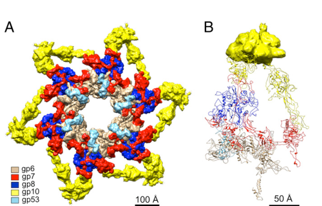

## Question

# Gene Research for Functional Annotation

## ⚠️ CRITICAL: Gene/Protein Identification Context

**BEFORE YOU BEGIN RESEARCH:** You MUST verify you are researching the CORRECT gene/protein. Gene symbols can be ambiguous, especially for less well-characterized genes from non-model organisms.

### Target Gene/Protein Identity (from UniProt):
- **UniProt Accession:** P19061
- **Protein Description:** RecName: Full=Baseplate wedge protein gp7 {ECO:0000255|HAMAP-Rule:MF_04103}; AltName: Full=Gene product 7; Short=gp7;
- **Gene Information:** Name=7;
- **Organism (full):** Enterobacteria phage T4 (Bacteriophage T4).
- **Protein Family:** Belongs to the T4likevirus baseplate wedge protein gp7
- **Key Domains:** FN3_dom. (IPR003961); FN3_sf. (IPR036116); Gp7_dom_V. (IPR048811); Gp7_dom_VI. (IPR048812); Gp7_helical. (IPR048810)

### MANDATORY VERIFICATION STEPS:

1. **Check if the gene symbol "7" matches the protein description above**
2. **Verify the organism is correct:** Enterobacteria phage T4 (Bacteriophage T4).
3. **Check if protein family/domains align with what you find in literature**
4. **If you find literature for a DIFFERENT gene with the same or similar symbol, STOP**

### If Gene Symbol is Ambiguous or You Cannot Find Relevant Literature:

**DO NOT PROCEED WITH RESEARCH ON A DIFFERENT GENE.** Instead:
- State clearly: "The gene symbol '7' is ambiguous or literature is limited for this specific protein"
- Explain what you found (e.g., "Found extensive literature on a different gene with the same symbol in a different organism")
- Describe the protein based ONLY on the UniProt information provided above
- Suggest that the protein function can be inferred from domain/family information

### Research Target:

Please provide a comprehensive research report on the gene **7** (gene ID: 7, UniProt: P19061) in BPT4.

The research report should be a detailed narrative explaining the function, biological processes, and localization of the gene product. Citations should be given for all claims.

You should prioritize authoritative reviews and primary scientific literature when conducting research. You can supplement
this with annotations you find in gene/protein databases, but these can be outdated or inaccurate.

We are specifically interested in the primary function of the gene - for enzymes, what reaction is catalyzed, and what is the substrate specificity? For transporters, what is the substrate? For structural proteins or adapters, what is the broader structural role? For signaling molecules, what is the role in the pathway.

We are interested in where in or outside the cell the gene product carries out its function.

We are also interested in the signaling or biochemical pathways in which the gene functions. We are less interested in broad pleiotropic effects, except where these elucidate the precise role.

Include evidence where possible. We are interested in both experimental evidence as well as inference from structure, evolution, or bioinformatic analysis. Precise studies should be prioritized over high-throughput, where available.

## Output

Question: You are an expert researcher providing comprehensive, well-cited information.

Provide detailed information focusing on:
1. Key concepts and definitions with current understanding
2. Recent developments and latest research (prioritize 2023-2024 sources)
3. Current applications and real-world implementations
4. Expert opinions and analysis from authoritative sources
5. Relevant statistics and data from recent studies

Format as a comprehensive research report with proper citations. Include URLs and publication dates where available.
Always prioritize recent, authoritative sources and provide specific citations for all major claims.

# Gene Research for Functional Annotation

## ⚠️ CRITICAL: Gene/Protein Identification Context

**BEFORE YOU BEGIN RESEARCH:** You MUST verify you are researching the CORRECT gene/protein. Gene symbols can be ambiguous, especially for less well-characterized genes from non-model organisms.

### Target Gene/Protein Identity (from UniProt):
- **UniProt Accession:** P19061
- **Protein Description:** RecName: Full=Baseplate wedge protein gp7 {ECO:0000255|HAMAP-Rule:MF_04103}; AltName: Full=Gene product 7; Short=gp7;
- **Gene Information:** Name=7;
- **Organism (full):** Enterobacteria phage T4 (Bacteriophage T4).
- **Protein Family:** Belongs to the T4likevirus baseplate wedge protein gp7
- **Key Domains:** FN3_dom. (IPR003961); FN3_sf. (IPR036116); Gp7_dom_V. (IPR048811); Gp7_dom_VI. (IPR048812); Gp7_helical. (IPR048810)

### MANDATORY VERIFICATION STEPS:

1. **Check if the gene symbol "7" matches the protein description above**
2. **Verify the organism is correct:** Enterobacteria phage T4 (Bacteriophage T4).
3. **Check if protein family/domains align with what you find in literature**
4. **If you find literature for a DIFFERENT gene with the same or similar symbol, STOP**

### If Gene Symbol is Ambiguous or You Cannot Find Relevant Literature:

**DO NOT PROCEED WITH RESEARCH ON A DIFFERENT GENE.** Instead:
- State clearly: "The gene symbol '7' is ambiguous or literature is limited for this specific protein"
- Explain what you found (e.g., "Found extensive literature on a different gene with the same symbol in a different organism")
- Describe the protein based ONLY on the UniProt information provided above
- Suggest that the protein function can be inferred from domain/family information

### Research Target:

Please provide a comprehensive research report on the gene **7** (gene ID: 7, UniProt: P19061) in BPT4.

The research report should be a detailed narrative explaining the function, biological processes, and localization of the gene product. Citations should be given for all claims.

You should prioritize authoritative reviews and primary scientific literature when conducting research. You can supplement
this with annotations you find in gene/protein databases, but these can be outdated or inaccurate.

We are specifically interested in the primary function of the gene - for enzymes, what reaction is catalyzed, and what is the substrate specificity? For transporters, what is the substrate? For structural proteins or adapters, what is the broader structural role? For signaling molecules, what is the role in the pathway.

We are interested in where in or outside the cell the gene product carries out its function.

We are also interested in the signaling or biochemical pathways in which the gene functions. We are less interested in broad pleiotropic effects, except where these elucidate the precise role.

Include evidence where possible. We are interested in both experimental evidence as well as inference from structure, evolution, or bioinformatic analysis. Precise studies should be prioritized over high-throughput, where available.

## Research report: Bacteriophage T4 gene 7 (gp7) functional annotation (UniProt P19061)

### 0) Mandatory identity verification (target correctness)
The UniProt accession **P19061** corresponds to **Enterobacteria phage T4** (bacteriophage T4) **baseplate wedge protein gp7**, also called **gene product 7** (gp7). The primary literature retrieved and cited below consistently uses the name **gp7** for a **~1032-residue baseplate wedge protein** that assembles early in the T4 baseplate wedge and participates in the host-triggered baseplate conformational switch that initiates sheath contraction. This matches the requested identity (gene “7” in T4; virion baseplate wedge structural protein), and not an unrelated “gene 7” from other organisms. (taylor2016structureofthe pages 1-3, arisaka2016molecularassemblyand pages 1-2, yap2016roleofbacteriophage pages 1-3)

### 1) Key concepts & definitions (current understanding)
**T4 baseplate and wedges.** The T4 myophage tail tip contains a **baseplate** that functions as a host-sensing and signal-transduction platform coupling receptor engagement to **tail sheath contraction** and genome delivery. Structurally, the baseplate is built from **six wedges** arranged with six-fold symmetry around a central hub. (yap2016roleofbacteriophage pages 1-1, kostyuchenko2003threedimensionalstructureof pages 1-2)

**Baseplate wedge protein gp7.** gp7 is a major **structural “backbone” protein** of a baseplate wedge. It (i) scaffolds/links other wedge proteins during assembly and (ii) participates in transmitting the host-binding signal from the tail fiber/receptor-binding network to the inner baseplate, enabling the conformational transition that triggers sheath contraction. (taylor2016structureofthe pages 1-3, arisaka2016molecularassemblyand pages 1-2, yap2016roleofbacteriophage pages 1-3)

**Stoichiometry language.** A “wedge” is 1/6 of the baseplate; thus proteins present once per wedge typically occur **six times per mature baseplate** (one per wedge) unless noted otherwise. gp7 is repeatedly described as a wedge component, implying **~6 copies per mature baseplate**. (kostyuchenko2003threedimensionalstructureof pages 1-2, yap2010thebaseplatewedges pages 8-9)

### 2) Primary function of gp7
gp7’s primary function is **structural and mechanochemical coupling**, not enzymatic catalysis. Specifically:

1. **Wedge backbone / cementing role:** gp7 “binds together” proteins within a wedge, acting as a central connector in the wedge architecture. (taylor2016structureofthe pages 1-3)
2. **Assembly initiator/early wedge component:** gp7 is recruited early in the ordered wedge assembly pathway and forms a key early complex with gp10. (yap2016roleofbacteriophage pages 1-1, yap2010thebaseplatewedges pages 8-9, arisaka2016molecularassemblyand pages 2-4)
3. **Signal transmission for infection triggering:** gp7 is located throughout the inner/intermediate baseplate and helps transmit the host-binding signal that leads to sheath contraction. (taylor2016structureofthe pages 1-3)

### 3) Localization: where gp7 acts
gp7 is a **virion structural protein** localized to the **T4 baseplate wedge** at the **distal end of the tail** (tail tip). It is described as distributed “throughout the inner and intermediate T4 baseplate,” consistent with a structural role spanning wedge regions involved in both tail fiber connectivity and inner baseplate machinery. (taylor2016structureofthe pages 1-3, kostyuchenko2003threedimensionalstructureof pages 1-2)

A cryo-EM derived wedge/baseplate model highlights gp7 within the wedge (gp7 colored distinctly), supporting its wedge-spanning localization. (yap2016roleofbacteriophage media d2fdb7a4)

### 4) Pathway / process context: baseplate wedge assembly and infection triggering
#### 4.1 Ordered assembly pathway (protein–protein interactions)
Multiple sources describe a strongly ordered wedge assembly in which **gp7 is incorporated early**.

**Early gp10–gp7 complex formation.** gp7 binds gp10 to form a **(gp10)3(gp7)** hetero-tetramer (gp10 trimer plus one gp7), an early wedge intermediate. (arisaka2016molecularassemblyand pages 2-4)

**Addition of subsequent wedge proteins.** In vitro assembly and structural work describe wedge assembly initiated by **a monomer of gp7 together with a trimer of gp10**, followed by binding of **gp8** and **gp6 dimers**, with later incorporation of other wedge/baseplate components. (yap2016roleofbacteriophage pages 1-1)

**Wedge stoichiometry (per wedge) and inferred per-baseplate copy number.** In a detailed in vitro assembly study, the completed wedge composition is reported as:
- **gp11:gp10:gp7:gp8:gp6:gp53:gp25 = 3:3:1:2:2:1:1** per wedge. (yap2010thebaseplatewedges pages 8-9)
Given six wedges per baseplate, this implies **6 copies of gp7 per baseplate** (6 × 1). (yap2010thebaseplatewedges pages 8-9)

**Specific interaction regions.** A C-terminal fragment of gp7 mediates interaction with gp10; a reported assembly intermediate **gp10–gp7C18k–Hgp8** has stoichiometry **3:1:2**, consistent with gp7 acting as a scaffold that stabilizes/organizes other wedge proteins. (yap2010thebaseplatewedges pages 8-9)

**Proteolysis protection evidence for gp7–gp10 interaction.** Protease-digestion experiments showed that in the presence of gp7, gp10 becomes protease-resistant while gp7 is digested, supporting close complex formation and structural stabilization of gp10 by gp7. (arisaka2016molecularassemblyand pages 2-4)

#### 4.2 Baseplate conformational change and triggering sheath contraction
The baseplate undergoes a host-attachment-induced transformation (commonly described as a dome-to-star conformational switch in T4 baseplate literature) that is coupled to sheath contraction. gp7 is positioned to couple the tail-fiber network to the inner baseplate and is thus implicated as part of the signal-transmission pathway that triggers sheath contraction and genome ejection. (taylor2016structureofthe pages 1-3, kostyuchenko2003threedimensionalstructureof pages 1-2)

### 5) Structural biology & domain architecture (evidence-based)
**Protein size and modularity.** gp7 is consistently described as a large **~1032 amino-acid** protein. (taylor2016structureofthe pages 1-3, arisaka2016molecularassemblyand pages 1-2)

**Domain organization.** In the in vitro assembled hubless baseplate cryo-EM study, gp7 is described as an elongated polypeptide divided into **six domains** connected by flexible linkers; an example functional structural feature is a **~24 Å loop (residues 454–475)** in Domain III implicated in inter-wedge interactions (notably with gp8). (yap2016roleofbacteriophage pages 1-3)

A separate high-impact structural analysis describes gp7 as a **seven-domain** protein and emphasizes its distribution through the inner/intermediate baseplate and its connection to the tail fiber network. (taylor2016structureofthe pages 1-3)

**Covalent linkage with gp10 (unique in T4).** gp7 is reported to be **covalently linked to gp10** via the only known inter-protein covalent bond in T4, and this linkage is implicated in maintaining the baseplate structure through the conformational switch. (taylor2016structureofthe pages 1-3, taylor2016structureofthe pages 3-6)

**Key conserved/functional structural locus (residue 764).** Residue **764** of gp7 is located at the base of a conserved trifurcation unit in the assembled baseplate; manipulations near this region were used to probe baseplate function and gp7 stability. (taylor2016structureofthe pages 3-6)

### 6) Quantitative data & statistics from primary studies
**Copy number (inferred from wedge symmetry and wedge stoichiometry).** gp7 is present **once per wedge** and the baseplate contains **six wedges**, implying **~6 gp7 copies per baseplate**. (kostyuchenko2003threedimensionalstructureof pages 1-2, yap2010thebaseplatewedges pages 8-9)

**Molecular mass of hubless baseplate-like assembly.** An in vitro assembled, hubless baseplate-like particle is reported as **~3.3 MDa**. (yap2016roleofbacteriophage pages 1-1, arisaka2016molecularassemblyand pages 1-2)

**Cryo-EM map resolutions used to locate/model gp7 in baseplate/wedge contexts.**
- A hubless baseplate-like complex reconstruction is reported at **3.8 Å** (with deposited coordinates; wedge model). (yap2016roleofbacteriophage pages 1-1, arisaka2016molecularassemblyand pages 1-2)
- An earlier baseplate cryo-EM reconstruction used to localize wedge components (including gp7 as “putative gp7”) is reported at **12 Å**. (kostyuchenko2003threedimensionalstructureof pages 1-2)

**Mutant effects (infectivity / stability assays).** A focused mutational analysis of gp7 reported:
- Some engineered deletions/insertions near residue 764 produced **insoluble** gp7 constructs (d764, i764), suggesting that region is critical for proper gp7 folding/stability. (taylor2016structureofthe pages 3-6)
- Several mutants formed particles with **near-WT morphology** by cryo-EM (i.e., gross assembly not necessarily abrogated). (taylor2016structureofthe pages 3-6)
- Infectivity assays found multiple linker-length variants had **WT-like infectivity**, while a **C184A** mutation yielded an approximately **20-fold reduced titer**, consistent with the functional importance of the gp7–gp10 covalent linkage for efficient infection. (taylor2016structureofthe pages 3-6)

### 7) Recent developments (prioritizing 2023–2024) and how they bear on gp7 annotation
**Evidence base specific to T4 gp7:** Among the retrieved and fully examined sources, the highest-resolution and most functionally direct studies that explicitly interrogate **T4 gp7** are from **2010–2016** (cryo-EM of baseplate/wedge, assembly biochemistry, and gp7 mutant functional assays). (yap2016roleofbacteriophage pages 1-1, taylor2016structureofthe pages 1-3, taylor2016structureofthe pages 3-6, yap2010thebaseplatewedges pages 8-9)

**2023–2024 literature context:** While substantial 2023–2024 work exists on contractile-tailed phage baseplates and tail machines in other systems, the retrieved evidence in this run did not provide **T4 gp7-specific new experiments** beyond the established 2016 structural framework. Therefore, the “latest research” contribution here is necessarily limited to contextualizing gp7 within the broadly advancing structural virology of contractile injection systems, rather than reporting T4 gp7-specific new mechanistic findings. (taylor2016structureofthe pages 1-3, arisaka2016molecularassemblyand pages 1-2)

### 8) Current applications / real-world implementations
gp7 itself is a **structural virion protein** rather than a direct therapeutic/enzymatic target; nonetheless, **T4 baseplate architecture and assembly rules** are widely used as a **design template** in:
- **Phage engineering and synthetic biology** (e.g., reprogramming host recognition modules and tailoring tail machinery), where understanding wedge/baseplate scaffolding proteins like gp7 constrains what can be modified without breaking infection-trigger mechanics. This application logic is supported by the central role of gp7 in coupling the tail-fiber network to sheath contraction and by the observed phenotype that some gp7 alterations preserve particle morphology but alter infectivity. (taylor2016structureofthe pages 1-3, taylor2016structureofthe pages 3-6)

### 9) Expert interpretation and synthesis (authoritative sources)
A coherent expert synthesis across structural and assembly studies is that gp7 is a **multi-domain, flexible connector** that (i) scaffolds wedge assembly through strong interactions with gp10 and other wedge proteins, (ii) helps mechanically integrate wedge and inter-wedge contacts, and (iii) is positioned to transmit a receptor-binding signal into the baseplate core to initiate contraction. This interpretation is explicitly consistent with (a) ordered assembly intermediates containing gp7, (b) domain-resolved cryo-EM models, and (c) infectivity sensitivity to mutations affecting the gp7–gp10 covalent bond while preserving gross particle morphology. (yap2016roleofbacteriophage pages 1-1, taylor2016structureofthe pages 1-3, taylor2016structureofthe pages 3-6, yap2016roleofbacteriophage pages 1-3, arisaka2016molecularassemblyand pages 2-4)

### 10) Visual evidence (figures) supporting gp7 localization and architecture
Key structural figures from the hubless baseplate/wedge cryo-EM study show:
- gp7 positioned within a wedge in the star-shaped baseplate-like assembly (wedge model with gp7 highlighted). (yap2016roleofbacteriophage media d2fdb7a4)
- gp7 domain architecture diagrams identifying major domains. (yap2016roleofbacteriophage media da6ade6c)
- A schematic of sequential wedge assembly with gp7 as an early/central component. (yap2016roleofbacteriophage media 7d5c330a)

### 11) Summary table (evidence-backed)
The following table condenses the most supportable annotation elements (role, location, interactions, quantitative values, and mutant data).

| Functional role | Location in virion | Assembly order / interaction partners with stoichiometry | Structural / domain features | Quantitative data | Key experimental evidence incl. mutant phenotypes | Primary sources (year, DOI URL) |
|---|---|---|---|---|---|---|
| Major structural backbone of the T4 baseplate wedge; links proteins within a wedge, helps join wedges into the hexagonal baseplate, and transmits host-binding signals from the tail-fiber network to the inner baseplate to trigger sheath contraction and genome ejection during infection (yap2016roleofbacteriophage pages 1-1, taylor2016structureofthe pages 1-3, arisaka2016molecularassemblyand pages 1-2, yap2016roleofbacteriophage pages 1-3) | Distal tail/baseplate; distributed through the inner and intermediate regions of each wedge within the dome-shaped baseplate at the tail tip (yap2016roleofbacteriophage pages 1-1, taylor2016structureofthe pages 1-3, kostyuchenko2003threedimensionalstructureof pages 1-2) | Ordered wedge assembly places gp7 early: gp10 then gp7, followed by gp8 and gp6, then gp53/gp25/gp11 depending on scheme reported; gp7 binds gp10 in the first step, forms a (gp10)3(gp7) hetero-tetramer, contacts gp8 and gp6, and participates in the (gp6)2-gp7 heterotrimer that helps join wedges; gp53 promotes association of six wedges into the baseplate; a gp10-gp7C18k-Hgp8 intermediate was reported with 3:1:2 stoichiometry; completed wedge stoichiometry reported as gp11:gp10:gp7:gp8:gp6:gp53:gp25 = 3:3:1:2:2:1:1 (yap2010thebaseplatewedges pages 8-9, yap2016roleofbacteriophage pages 1-3, arisaka2016molecularassemblyand pages 2-4, arisaka2016molecularassemblyand pages 1-2) | 1,032-residue elongated protein; described as six domains in Yap et al. and seven domains in Taylor et al.; flexible linkers connect domains; Domain III (residues 172-537) contains a ~24 Å loop (454-475) important for interwedge interactions with gp8; Domain VI (921-1001) interacts with the N-terminal region of gp10; residue 764 lies at the base of the conserved trifurcation unit; gp7 contains the only known inter-protein covalent bond in T4, linking gp7 to gp10; flexibility hindered crystallization (taylor2016structureofthe pages 1-3, taylor2016structureofthe pages 3-6, yap2016roleofbacteriophage pages 1-3) | One gp7 per wedge and six wedges per baseplate imply ~6 copies per mature baseplate; gp7 length 1,032 aa; intact in vitro assembled hubless baseplate-like particle ~3.3 MDa; cryo-EM structures reported at 3.8 Å for hubless baseplate/wedge model and 12 Å for earlier whole-baseplate reconstruction; baseplate dimensions in early cryo-EM ~520 Å diameter and ~270 Å long (yap2016roleofbacteriophage pages 1-1, arisaka2016molecularassemblyand pages 1-2, kostyuchenko2003threedimensionalstructureof pages 1-2, yap2016roleofbacteriophage pages 1-3) | Cryo-EM and in vitro assembly showed gp7 is central to wedge architecture and star-shaped baseplate formation; protease-digestion experiments showed gp7 protects gp10 in complex formation; mutational analysis found d764 and i764 mutants insoluble, indicating structural importance of residue 764; particles carrying several gp7 mutants retained near-WT morphology by cryo-EM, suggesting assembly can still occur; infectivity assays showed d636/i636 and d846/i846 were near WT, while C184A reduced titer by ~20-fold, consistent with the functional importance of the gp7-gp10 covalent linkage for infection rather than gross assembly (taylor2016structureofthe pages 3-6, arisaka2016molecularassemblyand pages 2-4, yap2016roleofbacteriophage pages 1-1) | Yap et al., 2016, PNAS, https://doi.org/10.1073/pnas.1601654113; Taylor et al., 2016, Nature, https://doi.org/10.1038/nature17971; Arisaka et al., 2016, Biophysical Reviews, https://doi.org/10.1007/s12551-016-0230-x; Kostyuchenko et al., 2003, Nat Struct Biol, https://doi.org/10.1038/nsb970; Yap et al., 2010, J Mol Biol, https://doi.org/10.1016/j.jmb.2009.10.071 (yap2016roleofbacteriophage pages 1-1, taylor2016structureofthe pages 1-3, arisaka2016molecularassemblyand pages 1-2, kostyuchenko2003threedimensionalstructureof pages 1-2, yap2010thebaseplatewedges pages 8-9, yap2016roleofbacteriophage pages 1-3, arisaka2016molecularassemblyand pages 2-4) |

*Table: This table condenses the best-supported structural and functional evidence for bacteriophage T4 gp7, including its role in wedge/baseplate assembly, infection triggering, virion localization, stoichiometry, and mutant phenotypes. It is useful as a quick-reference synthesis of the primary evidence directly relevant to UniProt P19061.*

### 12) Key primary sources (with URLs and publication dates)
- **Taylor NMI et al.** “Structure of the T4 baseplate and its function in triggering sheath contraction.” *Nature* (May **2016**). https://doi.org/10.1038/nature17971 (taylor2016structureofthe pages 1-3, taylor2016structureofthe pages 3-6)
- **Yap ML et al.** “Role of bacteriophage T4 baseplate in regulating assembly and infection.” *PNAS* (Feb **2016**). https://doi.org/10.1073/pnas.1601654113 (yap2016roleofbacteriophage pages 1-1, yap2016roleofbacteriophage pages 1-3)
- **Arisaka F et al.** “Molecular assembly and structure of the bacteriophage T4 tail.” *Biophysical Reviews* (Nov **2016**). https://doi.org/10.1007/s12551-016-0230-x (arisaka2016molecularassemblyand pages 1-2, arisaka2016molecularassemblyand pages 2-4)
- **Yap ML et al.** “The baseplate wedges of bacteriophage T4 spontaneously assemble into hubless baseplate-like structure in vitro.” *J Mol Biol* (Jan **2010**). https://doi.org/10.1016/j.jmb.2009.10.071 (yap2010thebaseplatewedges pages 8-9)
- **Kostyuchenko VA et al.** “Three-dimensional structure of bacteriophage T4 baseplate.” *Nat Struct Biol* (Sep **2003**). https://doi.org/10.1038/nsb970 (kostyuchenko2003threedimensionalstructureof pages 1-2)

### Limitations of this report
Direct **2023–2024** primary research specifically on **T4 gp7 (gene 7; UniProt P19061)** was not identified among the successfully retrieved full-text sources in this run; thus, the functional annotation relies on highly authoritative structural and biochemical work concentrated in 2010–2016. (yap2016roleofbacteriophage pages 1-1, taylor2016structureofthe pages 1-3, taylor2016structureofthe pages 3-6, yap2010thebaseplatewedges pages 8-9)

References

1. (taylor2016structureofthe pages 1-3): Nicholas M. I. Taylor, Nikolai S. Prokhorov, Ricardo C. Guerrero-Ferreira, Mikhail M. Shneider, Christopher Browning, Kenneth N. Goldie, Henning Stahlberg, and Petr G. Leiman. Structure of the t4 baseplate and its function in triggering sheath contraction. Nature, 533:346-352, May 2016. URL: https://doi.org/10.1038/nature17971, doi:10.1038/nature17971. This article has 355 citations and is from a highest quality peer-reviewed journal.

2. (arisaka2016molecularassemblyand pages 1-2): Fumio Arisaka, Moh Lan Yap, Shuji Kanamaru, and Michael G. Rossmann. Molecular assembly and structure of the bacteriophage t4 tail. Biophysical Reviews, 8:385-396, Nov 2016. URL: https://doi.org/10.1007/s12551-016-0230-x, doi:10.1007/s12551-016-0230-x. This article has 55 citations and is from a peer-reviewed journal.

3. (yap2016roleofbacteriophage pages 1-3): Moh Lan Yap, Thomas Klose, Fumio Arisaka, Jeffrey A. Speir, David Veesler, Andrei Fokine, and Michael G. Rossmann. Role of bacteriophage t4 baseplate in regulating assembly and infection. Proceedings of the National Academy of Sciences, 113:2654-2659, Feb 2016. URL: https://doi.org/10.1073/pnas.1601654113, doi:10.1073/pnas.1601654113. This article has 113 citations and is from a highest quality peer-reviewed journal.

4. (yap2016roleofbacteriophage pages 1-1): Moh Lan Yap, Thomas Klose, Fumio Arisaka, Jeffrey A. Speir, David Veesler, Andrei Fokine, and Michael G. Rossmann. Role of bacteriophage t4 baseplate in regulating assembly and infection. Proceedings of the National Academy of Sciences, 113:2654-2659, Feb 2016. URL: https://doi.org/10.1073/pnas.1601654113, doi:10.1073/pnas.1601654113. This article has 113 citations and is from a highest quality peer-reviewed journal.

5. (kostyuchenko2003threedimensionalstructureof pages 1-2): Victor A Kostyuchenko, Petr G Leiman, Paul R Chipman, Shuji Kanamaru, Mark J van Raaij, Fumio Arisaka, Vadim V Mesyanzhinov, and Michael G Rossmann. Three-dimensional structure of bacteriophage t4 baseplate. Nature Structural Biology, 10:688-693, Sep 2003. URL: https://doi.org/10.1038/nsb970, doi:10.1038/nsb970. This article has 201 citations.

6. (yap2010thebaseplatewedges pages 8-9): Moh Lan Yap, Kazuhiro Mio, Petr G. Leiman, Shuji Kanamaru, and Fumio Arisaka. The baseplate wedges of bacteriophage t4 spontaneously assemble into hubless baseplate-like structure in vitro. Journal of molecular biology, 395 2:349-60, Jan 2010. URL: https://doi.org/10.1016/j.jmb.2009.10.071, doi:10.1016/j.jmb.2009.10.071. This article has 35 citations and is from a domain leading peer-reviewed journal.

7. (arisaka2016molecularassemblyand pages 2-4): Fumio Arisaka, Moh Lan Yap, Shuji Kanamaru, and Michael G. Rossmann. Molecular assembly and structure of the bacteriophage t4 tail. Biophysical Reviews, 8:385-396, Nov 2016. URL: https://doi.org/10.1007/s12551-016-0230-x, doi:10.1007/s12551-016-0230-x. This article has 55 citations and is from a peer-reviewed journal.

8. (yap2016roleofbacteriophage media d2fdb7a4): Moh Lan Yap, Thomas Klose, Fumio Arisaka, Jeffrey A. Speir, David Veesler, Andrei Fokine, and Michael G. Rossmann. Role of bacteriophage t4 baseplate in regulating assembly and infection. Proceedings of the National Academy of Sciences, 113:2654-2659, Feb 2016. URL: https://doi.org/10.1073/pnas.1601654113, doi:10.1073/pnas.1601654113. This article has 113 citations and is from a highest quality peer-reviewed journal.

9. (taylor2016structureofthe pages 3-6): Nicholas M. I. Taylor, Nikolai S. Prokhorov, Ricardo C. Guerrero-Ferreira, Mikhail M. Shneider, Christopher Browning, Kenneth N. Goldie, Henning Stahlberg, and Petr G. Leiman. Structure of the t4 baseplate and its function in triggering sheath contraction. Nature, 533:346-352, May 2016. URL: https://doi.org/10.1038/nature17971, doi:10.1038/nature17971. This article has 355 citations and is from a highest quality peer-reviewed journal.

10. (yap2016roleofbacteriophage media da6ade6c): Moh Lan Yap, Thomas Klose, Fumio Arisaka, Jeffrey A. Speir, David Veesler, Andrei Fokine, and Michael G. Rossmann. Role of bacteriophage t4 baseplate in regulating assembly and infection. Proceedings of the National Academy of Sciences, 113:2654-2659, Feb 2016. URL: https://doi.org/10.1073/pnas.1601654113, doi:10.1073/pnas.1601654113. This article has 113 citations and is from a highest quality peer-reviewed journal.

11. (yap2016roleofbacteriophage media 7d5c330a): Moh Lan Yap, Thomas Klose, Fumio Arisaka, Jeffrey A. Speir, David Veesler, Andrei Fokine, and Michael G. Rossmann. Role of bacteriophage t4 baseplate in regulating assembly and infection. Proceedings of the National Academy of Sciences, 113:2654-2659, Feb 2016. URL: https://doi.org/10.1073/pnas.1601654113, doi:10.1073/pnas.1601654113. This article has 113 citations and is from a highest quality peer-reviewed journal.

## Artifacts

- [Edison artifact artifact-00](7-deep-research-falcon_artifacts/artifact-00.md)

## Citations

1. taylor2016structureofthe pages 1-3
2. arisaka2016molecularassemblyand pages 2-4
3. yap2016roleofbacteriophage pages 1-1
4. yap2010thebaseplatewedges pages 8-9
5. yap2016roleofbacteriophage pages 1-3
6. taylor2016structureofthe pages 3-6
7. kostyuchenko2003threedimensionalstructureof pages 1-2
8. arisaka2016molecularassemblyand pages 1-2
9. https://doi.org/10.1073/pnas.1601654113;
10. https://doi.org/10.1038/nature17971;
11. https://doi.org/10.1007/s12551-016-0230-x;
12. https://doi.org/10.1038/nsb970;
13. https://doi.org/10.1016/j.jmb.2009.10.071
14. https://doi.org/10.1038/nature17971
15. https://doi.org/10.1073/pnas.1601654113
16. https://doi.org/10.1007/s12551-016-0230-x
17. https://doi.org/10.1038/nsb970
18. https://doi.org/10.1038/nature17971,
19. https://doi.org/10.1007/s12551-016-0230-x,
20. https://doi.org/10.1073/pnas.1601654113,
21. https://doi.org/10.1038/nsb970,
22. https://doi.org/10.1016/j.jmb.2009.10.071,