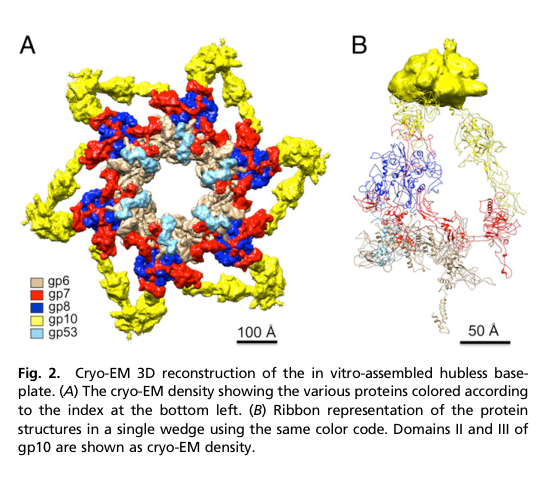

## Question

# Gene Research for Functional Annotation

## ⚠️ CRITICAL: Gene/Protein Identification Context

**BEFORE YOU BEGIN RESEARCH:** You MUST verify you are researching the CORRECT gene/protein. Gene symbols can be ambiguous, especially for less well-characterized genes from non-model organisms.

### Target Gene/Protein Identity (from UniProt):
- **UniProt Accession:** P19062
- **Protein Description:** RecName: Full=Baseplate wedge protein gp8 {ECO:0000305}; AltName: Full=Gene product 8; Short=gp8;
- **Gene Information:** Name=8;
- **Organism (full):** Enterobacteria phage T4 (Bacteriophage T4).
- **Protein Family:** Belongs to the tevenvirinae baseplate structural protein
- **Key Domains:** Gp8_sf. (IPR036327); Phage_T4_Gp8. (IPR015298); Phage-Gp8 (PF09215)

### MANDATORY VERIFICATION STEPS:

1. **Check if the gene symbol "8" matches the protein description above**
2. **Verify the organism is correct:** Enterobacteria phage T4 (Bacteriophage T4).
3. **Check if protein family/domains align with what you find in literature**
4. **If you find literature for a DIFFERENT gene with the same or similar symbol, STOP**

### If Gene Symbol is Ambiguous or You Cannot Find Relevant Literature:

**DO NOT PROCEED WITH RESEARCH ON A DIFFERENT GENE.** Instead:
- State clearly: "The gene symbol '8' is ambiguous or literature is limited for this specific protein"
- Explain what you found (e.g., "Found extensive literature on a different gene with the same symbol in a different organism")
- Describe the protein based ONLY on the UniProt information provided above
- Suggest that the protein function can be inferred from domain/family information

### Research Target:

Please provide a comprehensive research report on the gene **8** (gene ID: 8, UniProt: P19062) in BPT4.

The research report should be a detailed narrative explaining the function, biological processes, and localization of the gene product. Citations should be given for all claims.

You should prioritize authoritative reviews and primary scientific literature when conducting research. You can supplement
this with annotations you find in gene/protein databases, but these can be outdated or inaccurate.

We are specifically interested in the primary function of the gene - for enzymes, what reaction is catalyzed, and what is the substrate specificity? For transporters, what is the substrate? For structural proteins or adapters, what is the broader structural role? For signaling molecules, what is the role in the pathway.

We are interested in where in or outside the cell the gene product carries out its function.

We are also interested in the signaling or biochemical pathways in which the gene functions. We are less interested in broad pleiotropic effects, except where these elucidate the precise role.

Include evidence where possible. We are interested in both experimental evidence as well as inference from structure, evolution, or bioinformatic analysis. Precise studies should be prioritized over high-throughput, where available.

## Output

Question: You are an expert researcher providing comprehensive, well-cited information.

Provide detailed information focusing on:
1. Key concepts and definitions with current understanding
2. Recent developments and latest research (prioritize 2023-2024 sources)
3. Current applications and real-world implementations
4. Expert opinions and analysis from authoritative sources
5. Relevant statistics and data from recent studies

Format as a comprehensive research report with proper citations. Include URLs and publication dates where available.
Always prioritize recent, authoritative sources and provide specific citations for all major claims.

# Gene Research for Functional Annotation

## ⚠️ CRITICAL: Gene/Protein Identification Context

**BEFORE YOU BEGIN RESEARCH:** You MUST verify you are researching the CORRECT gene/protein. Gene symbols can be ambiguous, especially for less well-characterized genes from non-model organisms.

### Target Gene/Protein Identity (from UniProt):
- **UniProt Accession:** P19062
- **Protein Description:** RecName: Full=Baseplate wedge protein gp8 {ECO:0000305}; AltName: Full=Gene product 8; Short=gp8;
- **Gene Information:** Name=8;
- **Organism (full):** Enterobacteria phage T4 (Bacteriophage T4).
- **Protein Family:** Belongs to the tevenvirinae baseplate structural protein
- **Key Domains:** Gp8_sf. (IPR036327); Phage_T4_Gp8. (IPR015298); Phage-Gp8 (PF09215)

### MANDATORY VERIFICATION STEPS:

1. **Check if the gene symbol "8" matches the protein description above**
2. **Verify the organism is correct:** Enterobacteria phage T4 (Bacteriophage T4).
3. **Check if protein family/domains align with what you find in literature**
4. **If you find literature for a DIFFERENT gene with the same or similar symbol, STOP**

### If Gene Symbol is Ambiguous or You Cannot Find Relevant Literature:

**DO NOT PROCEED WITH RESEARCH ON A DIFFERENT GENE.** Instead:
- State clearly: "The gene symbol '8' is ambiguous or literature is limited for this specific protein"
- Explain what you found (e.g., "Found extensive literature on a different gene with the same symbol in a different organism")
- Describe the protein based ONLY on the UniProt information provided above
- Suggest that the protein function can be inferred from domain/family information

### Research Target:

Please provide a comprehensive research report on the gene **8** (gene ID: 8, UniProt: P19062) in BPT4.

The research report should be a detailed narrative explaining the function, biological processes, and localization of the gene product. Citations should be given for all claims.

You should prioritize authoritative reviews and primary scientific literature when conducting research. You can supplement
this with annotations you find in gene/protein databases, but these can be outdated or inaccurate.

We are specifically interested in the primary function of the gene - for enzymes, what reaction is catalyzed, and what is the substrate specificity? For transporters, what is the substrate? For structural proteins or adapters, what is the broader structural role? For signaling molecules, what is the role in the pathway.

We are interested in where in or outside the cell the gene product carries out its function.

We are also interested in the signaling or biochemical pathways in which the gene functions. We are less interested in broad pleiotropic effects, except where these elucidate the precise role.

Include evidence where possible. We are interested in both experimental evidence as well as inference from structure, evolution, or bioinformatic analysis. Precise studies should be prioritized over high-throughput, where available.

## Research report: Functional annotation of Enterobacteria phage T4 gene 8 (gp8; UniProt P19062)

### 0. Target verification (mandatory)
The gene symbol **“8”** is ambiguous across biology, but the sources used here explicitly refer to **bacteriophage T4 gene product 8 (gp8)** as a **baseplate wedge structural protein**, matching UniProt **P19062** and the described domain/family context (T4/Tevenvirinae contractile-tail baseplate wedge component). Experimental/structural work consistently places gp8 within the **T4 baseplate wedge** and reports dimeric incorporation during wedge assembly. (shneider2001propertiesofbacteriophage pages 1-2, yap2016roleofbacteriophage pages 1-3, arisaka2016molecularassemblyand pages 1-2)

### 1. Key concepts and definitions (current understanding)
**Baseplate and wedge.** The **T4 baseplate** is the distal tail “control center” that transduces receptor-binding events into mechanical actuation of the tail sheath, enabling genome delivery. The baseplate comprises a **central hub** and **six surrounding wedges**. (arisaka2016molecularassemblyand pages 1-2, yap2016roleofbacteriophage pages 1-3)

**gp8 definition.** **gp8** (gene product 8) is a **baseplate wedge structural protein**. It is not an enzyme or transporter; its primary molecular function is **structural scaffolding/adaptor activity** within the wedge, mediating protein–protein interfaces that stabilize the wedge and tune conformational transitions of the baseplate. (shneider2001propertiesofbacteriophage pages 1-2, yap2014structureandfunction pages 6-8, yap2016roleofbacteriophage pages 3-3)

**Dome-to-star transition.** During infection, the baseplate undergoes a global rearrangement often described as **dome-shaped (pre-attachment)** to **star-shaped (post-attachment)**, which is linked to short-tail fiber deployment and sheath contraction. The wedge proteins (including gp8) largely behave as rigid bodies whose relative positions shift during this transition. (arisaka2016molecularassemblyand pages 1-2, yap2014structureandfunction pages 6-8)

### 2. Molecular function, localization, and biological process
#### 2.1 Localization
gp8 localizes to the **baseplate wedge** of the mature virion baseplate (distal end of the contractile tail). Structural reconstructions color/locate gp8 within the wedge and near the **central region** of the baseplate organization. (yap2014structureandfunction pages 6-8, yap2016roleofbacteriophage media 771db643)

#### 2.2 Biological process role
gp8 participates in:
- **Baseplate wedge assembly** (ordered formation of the wedge intermediate). (yap2016roleofbacteriophage pages 1-1, yap2010sequentialassemblyof pages 3-5)
- **Virion morphogenesis** of the tail/baseplate, by enabling gp6 incorporation and stabilizing wedge architecture. (yap2016roleofbacteriophage pages 3-3, aksyuk2009thestructureof pages 2-3)
- **Infection-associated conformational remodeling** of the baseplate: gp8-linked interfaces are remodeled when the baseplate rearranges (notably via changes in gp6 contacts). (aksyuk2009thestructureof pages 2-3)

#### 2.3 Primary molecular function (structural role)
**(i) Stabilization of gp7 and enabling gp6 binding.** A central mechanistic insight is that gp8 acts as a stabilizing wedge component by binding a gp7 linker that is stretched upon earlier assembly steps, thereby reducing gp7 flexibility and allowing gp6 to bind in a productive orientation to complete wedge assembly. (yap2016roleofbacteriophage pages 3-3)

**(ii) Participation in inter-wedge connectivity.** gp8 is implicated in **interwedge interactions** through contacts involving a gp7 loop important for interwedge interactions with gp8, consistent with a role in organizing the six-wedge hexameric baseplate architecture. (yap2016roleofbacteriophage pages 1-3)

### 3. Interaction partners and assembly pathway (evidence-based)
#### 3.1 Ordered wedge assembly (in vitro and structural model)
Multiple sources support a **strictly ordered** wedge assembly pathway in which gp8 is incorporated as a dimer after formation of a gp7–gp10 complex:
- Initial: **gp7 monomer + gp10 trimer**
- Then: binding of **gp8 dimer**
- Then: binding of **gp6 dimer**
This ordered pathway is described in near-atomic structural work and supported by sedimentation-based assembly intermediate measurements. (yap2016roleofbacteriophage pages 1-1, yap2010sequentialassemblyof pages 3-5)

A schematic depiction of this ordered incorporation explicitly shows the **(gp8)2** step. (yap2016roleofbacteriophage media 61f65881)

#### 3.2 Protein–protein interfaces: residue-level evidence
gp8 makes a specific β-sheet augmentation interface with gp7 during assembly:
- gp10 binding stretches a gp7 linker; gp8 then binds this linker.
- **gp7 residues 894–902** form a parallel β-strand interaction with **gp8 residues 323–334** (one gp8 chain)
- **gp7 residues 906–917** form an antiparallel β-strand interaction with **gp8 residues 323–334** (the other gp8 chain)
This provides unusually direct residue-level evidence for gp8’s adaptor/scaffold role. (yap2016roleofbacteriophage pages 3-3)

#### 3.3 Dependency relationships
gp8 is required before gp6 can attach to the wedge, and gp8 has been described as essential for gp6 folding in this assembly context. (aksyuk2009thestructureof pages 2-3)

### 4. Structure and quantitative properties (statistics/data)
#### 4.1 Size, fold class, and oligomerization in solution
A primary biophysical characterization of recombinant gp8 reports:
- gp8 is an **α/β structural protein** with approximately **~40% β-structure** and **~15% α-helix** (circular dichroism). (shneider2001propertiesofbacteriophage pages 1-2)
- Analytical ultracentrifugation yields **S20,w = 4.6S** and indicates **dimer and tetramer** species in solution. (shneider2001propertiesofbacteriophage pages 1-2)
These data support gp8’s propensity to oligomerize and are consistent with its dimeric incorporation in wedge assembly models. (yap2016roleofbacteriophage pages 1-1)

#### 4.2 Domain architecture and rigidity in baseplate rearrangement
A structural review summarizing T4 baseplate protein structures describes gp8 as a **dimer** with a “four-legged” architecture and two-domain organization with reported residue boundaries (domain I: 1–87 and 246–334; domain II: 88–245). gp8 is positioned near the baseplate center and is interpreted as comparatively rigid during baseplate conformational transitions (proteins shift largely as rigid bodies). (yap2014structureandfunction pages 6-8)

#### 4.3 Stoichiometry and copy numbers (with noted uncertainty)
**Modern structural consensus (12 copies per baseplate).** A quantitative stoichiometry table in a T4 tail assembly review lists **gp8 = 12 copies** in the tail/baseplate, consistent with **2 gp8 per wedge × 6 wedges**. (arisaka2016molecularassemblyand pages 1-2)

**Wedge-intermediate composition.** Energetic/interface analysis of wedge segmentation explicitly models the wedge as **gp6–gp7–(gp8)2–(gp10)3** (plus later stabilizing components), reinforcing a two-copies-per-wedge model for gp8. (taylor2016structureofthe pages 1-3)

**Older biochemical variability.** Earlier biochemical work noted that literature estimates for gp8 copies per wedge varied (1–3), and that gp8 may exist as a tetramer in solution; the authors proposed that a tetramer might be incorporated into the wedge (implying potentially up to 4 copies per wedge in some models). This discrepancy likely reflects historical uncertainty and/or differences between solution oligomerization and final virion stoichiometry; current near-atomic baseplate models favor (gp8)2 per wedge. (shneider2001propertiesofbacteriophage pages 1-2, shneider2001propertiesofbacteriophage pages 5-5)

#### 4.4 Assembly-intermediate sedimentation data
Analytical ultracentrifugation monitoring wedge assembly shows stepwise sedimentation changes upon gp8 incorporation:
- **gp10–gp7**: 10.2 S
- **gp10–gp7–gp8**: 12.1 S
- then larger intermediates culminating in a “star” baseplate-like assembly (~43.7 S from a 15.0 S intermediate)
These provide quantitative support for ordered assembly and for gp8’s incorporation as a discrete step. (yap2010sequentialassemblyof pages 3-5)

#### 4.5 Remodeling during activation
Structural comparison indicates that in the **dome-shaped baseplate**, gp6 contacts gp8, but after rearrangement to the **star-shaped baseplate**, gp6 no longer contacts gp8—demonstrating that gp8-associated interfaces are **reconfigured during activation** (even if gp8 itself is not the primary trigger). (aksyuk2009thestructureof pages 2-3)

### 5. Mechanistic role in signaling to sheath contraction (expert interpretation grounded in sources)
The “triggering” pathway from receptor binding to contraction is usually attributed to the baseplate network, with gp7 highlighted as a major signal-transmission element. gp8’s role is best supported as **structural coupling/stabilization** within the wedge (especially via gp7 linker binding and enabling gp6 incorporation), and as a participant in the interface network that is remodeled during the dome-to-star transition. Thus, gp8 contributes indirectly to the mechanical logic of the baseplate by shaping wedge stability and allowable conformational states rather than acting as the primary signal-transducer. (yap2016roleofbacteriophage pages 3-3, aksyuk2009thestructureof pages 2-3, taylor2016structureofthe pages 1-3)

### 6. Recent developments (prioritizing 2023–2024)
Direct new primary studies on **T4 gp8 specifically** were not retrieved for 2023–2024, but 2024 work strengthens gp8 functional inference through **comparative structural biology of contractile-tailed phages**:

1) **Therapeutic phage structural atlases (phage therapy/engineering framing).** A 2024 high-resolution cryo-EM atlas of a therapeutic Pseudomonas aeruginosa myophage (Pa193) provides multi-symmetry reconstructions including a **C6 baseplate at ~3.2 Å**, atomic models for 21 structural polypeptides, and resolution of the baseplate–tail fiber interface. The authors explicitly frame the structural atlas as a framework for using phages as biomedicines and for engineering opportunities. While it does not name a T4 gp8 homolog directly in the snippet, it exemplifies how wedge/baseplate modules are currently being resolved to atomic detail for translational goals. (iglesias2024cryoemanalysisof pages 1-2, iglesias2024cryoemanalysisof pages 2-4)

2) **Synthetic biology chassis context.** A 2024 cryo-EM structure of cyanophage A-1(L) tail machine reports quantitative architecture (e.g., **1045 Å tail length**, multi-component baseplate, defined wedge composition) and explicitly states the structure will facilitate application of A-1(L) as a **synthetic-biology chassis**, illustrating how contractile tail/baseplate modules are now being positioned as engineerable systems. (yu2024structureofthe pages 1-2, yu2024structureofthe pages 2-4)

3) **Regulatory chemistry of contraction.** A 2024 study of Agrobacterium phage Milano shows that extensive **disulfide crosslinking** can prevent tail contraction and that disulfide reduction is required for contraction, providing a modern example of how baseplate/tail mechanical states can be chemically constrained—an engineering-relevant principle for contractile systems. (sonani2024anextensivedisulfide pages 1-2)

Collectively, these 2024 studies reinforce the value of the T4 baseplate (and its wedge proteins like gp8) as a reference framework for annotating homologous wedge modules and for designing/understanding contractile nanomachines in applied contexts. (yu2024structureofthe pages 2-4, iglesias2024cryoemanalysisof pages 1-2, sonani2024anextensivedisulfide pages 1-2)

### 7. Current applications and real-world implementations
Although gp8 itself is not commonly an engineering target in the cited corpus, **baseplate/tail structural characterization** is directly connected to real-world implementations:
- **Phage therapy / antimicrobial development:** Structural work on therapeutic phages aims to support rational engineering and understanding of host attachment and infection mechanisms for clinical use. (iglesias2024cryoemanalysisof pages 1-2)
- **Engineering opportunities:** Atomic models of tail/baseplate proteins (including wedge components) are increasingly used to identify interfaces and design modifications for altered host range or stability. (iglesias2024cryoemanalysisof pages 1-2, iglesias2024cryoemanalysisof pages 2-4)
- **Synthetic biology chassis:** Detailed structures of contractile tail machines are explicitly being developed to enable chassis selection and genome reannotation for engineered deployment in specific environments (e.g., cyanobacteria ecosystems). (yu2024structureofthe pages 1-2)

### 8. Visual evidence (figures)
A cryo-EM rendering and wedge ribbon representation show **gp8 localized in the wedge** (colored and keyed in the legend). (yap2016roleofbacteriophage media 771db643)

A schematic of ordered wedge assembly explicitly depicts binding of the **gp8 dimer (gp8)2** following formation of gp7–gp10 and prior to gp6 binding. (yap2016roleofbacteriophage media 61f65881)

### 9. Evidence map artifact
The following table consolidates key annotation claims with publication dates and URLs/DOIs.

| Aspect | Key findings | Evidence type | Primary citation (author, year, journal) | Publication date | URL/DOI |
|---|---|---|---|---|---|
| Identity | Target verified as bacteriophage T4 gene product 8 (gp8), a baseplate wedge structural protein in the T4 tail/baseplate system (shneider2001propertiesofbacteriophage pages 1-2, arisaka2016molecularassemblyand pages 1-2) | Primary study, review | Shneider et al., 2001, *Biochemistry (Moscow)* | Jun 2001 | https://doi.org/10.1023/A:1010271701204 |
| Role | gp8 is a core structural component of the baseplate wedge and contributes to baseplate organization near the center of the complex (yap2014structureandfunction pages 6-8, yap2016roleofbacteriophage pages 1-1) | Cryo-EM, X-ray fit, review | Yap & Rossmann, 2014, *Future Microbiology* | Dec 2014 | https://doi.org/10.2217/fmb.14.91 |
| Interactions | gp8 binds a stretched 20-residue linker in gp7; gp7 residues 894-902 and 906-917 form beta-strand interactions with gp8 residues 323-334 from the two gp8 chains in the dimer (yap2016roleofbacteriophage pages 3-3) | Cryo-EM model with residue-level interface analysis | Yap et al., 2016, *PNAS* | Feb 2016 | https://doi.org/10.1073/pnas.1601654113 |
| Interactions | gp8 also participates in interwedge contacts; a 24-A loop in gp7 domain III (residues 454-475) is important for interwedge interactions with gp8 (yap2016roleofbacteriophage pages 1-3) | Cryo-EM reconstruction and fitted atomic models | Yap et al., 2016, *PNAS* | Feb 2016 | https://doi.org/10.1073/pnas.1601654113 |
| Assembly | Wedge assembly is ordered: gp7 monomer + gp10 trimer assemble first, followed by binding of a gp8 dimer, then a gp6 dimer (yap2016roleofbacteriophage pages 1-1) | Cryo-EM-informed assembly model, review | Yap et al., 2016, *PNAS* | Feb 2016 | https://doi.org/10.1073/pnas.1601654113 |
| Assembly | gp8 binding reduces gp7 flexibility and helps position gp7 so that gp6 can bind, completing wedge assembly (yap2016roleofbacteriophage pages 3-3) | Cryo-EM structural interpretation | Yap et al., 2016, *PNAS* | Feb 2016 | https://doi.org/10.1073/pnas.1601654113 |
| Assembly dependency | gp8 is required before gp6 can attach to the wedge and is reported as essential for gp6 folding (aksyuk2009thestructureof pages 2-3) | Structural analysis, prior experimental interpretation | Aksyuk et al., 2009, *Structure* | Jun 2009 | https://doi.org/10.1016/j.str.2009.04.005 |
| Localization | gp8 localizes to the baseplate wedge of the virion; six wedges surround the central hub in the mature baseplate (arisaka2016molecularassemblyand pages 1-2) | Review, cryo-EM context | Arisaka et al., 2016, *Biophysical Reviews* | Nov 2016 | https://doi.org/10.1007/s12551-016-0230-x |
| Stoichiometry | Tabled stoichiometry is 12 copies of gp8 per tail/baseplate, corresponding to 2 gp8 molecules per wedge across 6 wedges (arisaka2016molecularassemblyand pages 1-2, taylor2016structureofthe pages 1-3) | Review, cryo-EM, energetic modeling | Arisaka et al., 2016, *Biophysical Reviews* | Nov 2016 | https://doi.org/10.1007/s12551-016-0230-x |
| Structure | gp8 is a dimeric protein; in the wedge it is present as (gp8)2 and behaves as a relatively rigid structural element (yap2016roleofbacteriophage pages 3-3, yap2014structureandfunction pages 6-8) | Cryo-EM, X-ray fit, review | Yap & Rossmann, 2014, *Future Microbiology* | Dec 2014 | https://doi.org/10.2217/fmb.14.91 |
| Structure | gp8 monomer architecture comprises two domains: domain I (residues 1-87 and 246-334) and domain II (residues 88-245); the dimer has a distinctive four-legged architecture (yap2014structureandfunction pages 6-8) | X-ray structure summarized in review | Yap & Rossmann, 2014, *Future Microbiology* | Dec 2014 | https://doi.org/10.2217/fmb.14.91 |
| Quantitative biophysics | Recombinant gp8 is an alpha/beta protein with ~40% beta-structure and ~15% alpha-helix by CD spectroscopy (shneider2001propertiesofbacteriophage pages 1-2) | CD spectroscopy | Shneider et al., 2001, *Biochemistry (Moscow)* | Jun 2001 | https://doi.org/10.1023/A:1010271701204 |
| Quantitative biophysics | Analytical ultracentrifugation gave gp8 sedimentation coefficient S20,w = 4.6S and showed dimeric and tetrameric species in solution (shneider2001propertiesofbacteriophage pages 1-2) | Analytical ultracentrifugation | Shneider et al., 2001, *Biochemistry (Moscow)* | Jun 2001 | https://doi.org/10.1023/A:1010271701204 |
| Assembly intermediate data | Sedimentation of wedge intermediates increased from gp10-gp7 (10.2S) to gp10-gp7-gp8 (12.1S), consistent with gp8 incorporation into the growing wedge complex (yap2010sequentialassemblyof pages 3-5) | Analytical ultracentrifugation | Yap et al., 2010, *Macromolecular Bioscience* | Jul 2010 | https://doi.org/10.1002/mabi.201000042 |
| Conformational change | In the dome-shaped baseplate gp6 contacts gp8, but in the star-shaped activated baseplate gp6 no longer contacts gp8, indicating gp8-associated interfaces are remodeled during baseplate rearrangement (aksyuk2009thestructureof pages 2-3) | Cryo-EM fitting and comparative structural analysis | Aksyuk et al., 2009, *Structure* | Jun 2009 | https://doi.org/10.1016/j.str.2009.04.005 |

*Table: This table summarizes experimentally supported functional annotation for bacteriophage T4 gp8 (UniProt P19062), including its role, interactions, assembly order, localization, stoichiometry, and quantitative biophysical properties. It is useful as a concise evidence map linking each annotation to specific primary literature and methods.*

### 10. Conclusion (functional annotation summary)
**Bacteriophage T4 gp8 (UniProt P19062)** is best annotated as a **dimeric baseplate wedge structural protein** that (1) **binds gp7 via defined β-strand augmentation interfaces**, (2) **stabilizes gp7 conformation** to enable subsequent **gp6 incorporation** and productive wedge completion, and (3) contributes to **interwedge/baseplate assembly and conformational remodeling** during infection-associated baseplate rearrangement. Its function is structural and mechanochemical (protein-interface scaffolding), localized to the **virion baseplate wedge**, with quantitative evidence supporting **~12 copies per baseplate** in the prevailing structural model while older biochemical work reported potential stoichiometry uncertainty in earlier eras. (yap2016roleofbacteriophage pages 3-3, yap2016roleofbacteriophage pages 1-1, aksyuk2009thestructureof pages 2-3, arisaka2016molecularassemblyand pages 1-2)

References

1. (shneider2001propertiesofbacteriophage pages 1-2): Mikhail M. Shneider, S. Boudko, Ariel Lustig, and V. Mesyanzhinov. Properties of bacteriophage t4 baseplate protein encoded by gene 8. Biochemistry (Moscow), 66:693-697, Jun 2001. URL: https://doi.org/10.1023/a:1010271701204, doi:10.1023/a:1010271701204. This article has 7 citations.

2. (yap2016roleofbacteriophage pages 1-3): Moh Lan Yap, Thomas Klose, Fumio Arisaka, Jeffrey A. Speir, David Veesler, Andrei Fokine, and Michael G. Rossmann. Role of bacteriophage t4 baseplate in regulating assembly and infection. Proceedings of the National Academy of Sciences, 113:2654-2659, Feb 2016. URL: https://doi.org/10.1073/pnas.1601654113, doi:10.1073/pnas.1601654113. This article has 113 citations and is from a highest quality peer-reviewed journal.

3. (arisaka2016molecularassemblyand pages 1-2): Fumio Arisaka, Moh Lan Yap, Shuji Kanamaru, and Michael G. Rossmann. Molecular assembly and structure of the bacteriophage t4 tail. Biophysical Reviews, 8:385-396, Nov 2016. URL: https://doi.org/10.1007/s12551-016-0230-x, doi:10.1007/s12551-016-0230-x. This article has 55 citations and is from a peer-reviewed journal.

4. (yap2014structureandfunction pages 6-8): Moh Lan Yap and Michael G Rossmann. Structure and function of bacteriophage t4. Future microbiology, 9 12:1319-27, Dec 2014. URL: https://doi.org/10.2217/fmb.14.91, doi:10.2217/fmb.14.91. This article has 282 citations and is from a peer-reviewed journal.

5. (yap2016roleofbacteriophage pages 3-3): Moh Lan Yap, Thomas Klose, Fumio Arisaka, Jeffrey A. Speir, David Veesler, Andrei Fokine, and Michael G. Rossmann. Role of bacteriophage t4 baseplate in regulating assembly and infection. Proceedings of the National Academy of Sciences, 113:2654-2659, Feb 2016. URL: https://doi.org/10.1073/pnas.1601654113, doi:10.1073/pnas.1601654113. This article has 113 citations and is from a highest quality peer-reviewed journal.

6. (yap2016roleofbacteriophage media 771db643): Moh Lan Yap, Thomas Klose, Fumio Arisaka, Jeffrey A. Speir, David Veesler, Andrei Fokine, and Michael G. Rossmann. Role of bacteriophage t4 baseplate in regulating assembly and infection. Proceedings of the National Academy of Sciences, 113:2654-2659, Feb 2016. URL: https://doi.org/10.1073/pnas.1601654113, doi:10.1073/pnas.1601654113. This article has 113 citations and is from a highest quality peer-reviewed journal.

7. (yap2016roleofbacteriophage pages 1-1): Moh Lan Yap, Thomas Klose, Fumio Arisaka, Jeffrey A. Speir, David Veesler, Andrei Fokine, and Michael G. Rossmann. Role of bacteriophage t4 baseplate in regulating assembly and infection. Proceedings of the National Academy of Sciences, 113:2654-2659, Feb 2016. URL: https://doi.org/10.1073/pnas.1601654113, doi:10.1073/pnas.1601654113. This article has 113 citations and is from a highest quality peer-reviewed journal.

8. (yap2010sequentialassemblyof pages 3-5): Moh Lan Yap, Kazuhiro Mio, Said Ali, Allen Minton, Shuji Kanamaru, and Fumio Arisaka. Sequential assembly of the wedge of the baseplate of phage t4 in the presence and absence of gp11 as monitored by analytical ultracentrifugation. Macromolecular bioscience, 10 7:808-13, Jul 2010. URL: https://doi.org/10.1002/mabi.201000042, doi:10.1002/mabi.201000042. This article has 13 citations and is from a peer-reviewed journal.

9. (aksyuk2009thestructureof pages 2-3): Anastasia A. Aksyuk, Petr G. Leiman, Mikhail M. Shneider, Vadim V. Mesyanzhinov, and Michael G. Rossmann. The structure of gene product 6 of bacteriophage t4, the hinge-pin of the baseplate. Structure, 17 6:800-8, Jun 2009. URL: https://doi.org/10.1016/j.str.2009.04.005, doi:10.1016/j.str.2009.04.005. This article has 38 citations and is from a domain leading peer-reviewed journal.

10. (yap2016roleofbacteriophage media 61f65881): Moh Lan Yap, Thomas Klose, Fumio Arisaka, Jeffrey A. Speir, David Veesler, Andrei Fokine, and Michael G. Rossmann. Role of bacteriophage t4 baseplate in regulating assembly and infection. Proceedings of the National Academy of Sciences, 113:2654-2659, Feb 2016. URL: https://doi.org/10.1073/pnas.1601654113, doi:10.1073/pnas.1601654113. This article has 113 citations and is from a highest quality peer-reviewed journal.

11. (taylor2016structureofthe pages 1-3): Nicholas M. I. Taylor, Nikolai S. Prokhorov, Ricardo C. Guerrero-Ferreira, Mikhail M. Shneider, Christopher Browning, Kenneth N. Goldie, Henning Stahlberg, and Petr G. Leiman. Structure of the t4 baseplate and its function in triggering sheath contraction. Nature, 533:346-352, May 2016. URL: https://doi.org/10.1038/nature17971, doi:10.1038/nature17971. This article has 355 citations and is from a highest quality peer-reviewed journal.

12. (shneider2001propertiesofbacteriophage pages 5-5): Mikhail M. Shneider, S. Boudko, Ariel Lustig, and V. Mesyanzhinov. Properties of bacteriophage t4 baseplate protein encoded by gene 8. Biochemistry (Moscow), 66:693-697, Jun 2001. URL: https://doi.org/10.1023/a:1010271701204, doi:10.1023/a:1010271701204. This article has 7 citations.

13. (iglesias2024cryoemanalysisof pages 1-2): Stephano M. Iglesias, Chun-Feng David Hou, Johnny Reid, Evan Schauer, Renae Geier, Angela Soriaga, Lucy Sim, Lucy Gao, Julian Whitelegge, Pierre Kyme, Deborah Birx, Sebastien Lemire, and Gino Cingolani. Cryo-em analysis of pseudomonas phage pa193 structural components. Communications Biology, Oct 2024. URL: https://doi.org/10.1038/s42003-024-06985-x, doi:10.1038/s42003-024-06985-x. This article has 11 citations and is from a peer-reviewed journal.

14. (iglesias2024cryoemanalysisof pages 2-4): Stephano M. Iglesias, Chun-Feng David Hou, Johnny Reid, Evan Schauer, Renae Geier, Angela Soriaga, Lucy Sim, Lucy Gao, Julian Whitelegge, Pierre Kyme, Deborah Birx, Sebastien Lemire, and Gino Cingolani. Cryo-em analysis of pseudomonas phage pa193 structural components. Communications Biology, Oct 2024. URL: https://doi.org/10.1038/s42003-024-06985-x, doi:10.1038/s42003-024-06985-x. This article has 11 citations and is from a peer-reviewed journal.

15. (yu2024structureofthe pages 1-2): Rong-Cheng Yu, Feng Yang, Hong-Yan Zhang, Pu Hou, Kang Du, Jie Zhu, Ning Cui, Xudong Xu, Yuxing Chen, Qiong Li, and Cong-Zhao Zhou. Structure of the intact tail machine of anabaena myophage a-1(l). Nature Communications, Mar 2024. URL: https://doi.org/10.1038/s41467-024-47006-z, doi:10.1038/s41467-024-47006-z. This article has 19 citations and is from a highest quality peer-reviewed journal.

16. (yu2024structureofthe pages 2-4): Rong-Cheng Yu, Feng Yang, Hong-Yan Zhang, Pu Hou, Kang Du, Jie Zhu, Ning Cui, Xudong Xu, Yuxing Chen, Qiong Li, and Cong-Zhao Zhou. Structure of the intact tail machine of anabaena myophage a-1(l). Nature Communications, Mar 2024. URL: https://doi.org/10.1038/s41467-024-47006-z, doi:10.1038/s41467-024-47006-z. This article has 19 citations and is from a highest quality peer-reviewed journal.

17. (sonani2024anextensivedisulfide pages 1-2): Ravi R. Sonani, Lee K. Palmer, Nathaniel C. Esteves, Abigail A. Horton, Amanda L. Sebastian, Rebecca J. Kelly, Fengbin Wang, Mark A. B. Kreutzberger, William K. Russell, Petr G. Leiman, Birgit E. Scharf, and Edward H. Egelman. An extensive disulfide bond network prevents tail contraction in agrobacterium tumefaciens phage milano. Nature Communications, Jan 2024. URL: https://doi.org/10.1038/s41467-024-44959-z, doi:10.1038/s41467-024-44959-z. This article has 18 citations and is from a highest quality peer-reviewed journal.

## Artifacts

- [Edison artifact artifact-00](8-deep-research-falcon_artifacts/artifact-00.md)

## Citations

1. aksyuk2009thestructureof pages 2-3
2. yap2016roleofbacteriophage pages 3-3
3. yap2016roleofbacteriophage pages 1-3
4. shneider2001propertiesofbacteriophage pages 1-2
5. yap2016roleofbacteriophage pages 1-1
6. yap2014structureandfunction pages 6-8
7. arisaka2016molecularassemblyand pages 1-2
8. taylor2016structureofthe pages 1-3
9. yap2010sequentialassemblyof pages 3-5
10. sonani2024anextensivedisulfide pages 1-2
11. iglesias2024cryoemanalysisof pages 1-2
12. yu2024structureofthe pages 1-2
13. shneider2001propertiesofbacteriophage pages 5-5
14. iglesias2024cryoemanalysisof pages 2-4
15. yu2024structureofthe pages 2-4
16. https://doi.org/10.1023/A:1010271701204
17. https://doi.org/10.2217/fmb.14.91
18. https://doi.org/10.1073/pnas.1601654113
19. https://doi.org/10.1016/j.str.2009.04.005
20. https://doi.org/10.1007/s12551-016-0230-x
21. https://doi.org/10.1002/mabi.201000042
22. https://doi.org/10.1023/a:1010271701204,
23. https://doi.org/10.1073/pnas.1601654113,
24. https://doi.org/10.1007/s12551-016-0230-x,
25. https://doi.org/10.2217/fmb.14.91,
26. https://doi.org/10.1002/mabi.201000042,
27. https://doi.org/10.1016/j.str.2009.04.005,
28. https://doi.org/10.1038/nature17971,
29. https://doi.org/10.1038/s42003-024-06985-x,
30. https://doi.org/10.1038/s41467-024-47006-z,
31. https://doi.org/10.1038/s41467-024-44959-z,