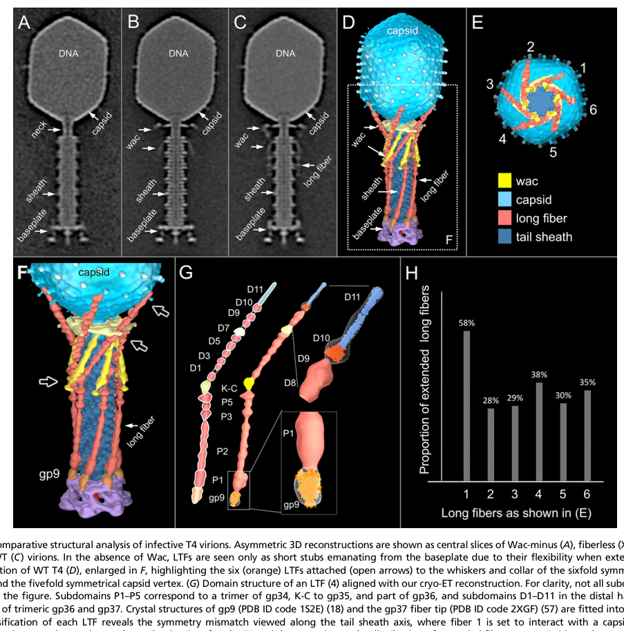

## Question

# Gene Research for Functional Annotation

## ⚠️ CRITICAL: Gene/Protein Identification Context

**BEFORE YOU BEGIN RESEARCH:** You MUST verify you are researching the CORRECT gene/protein. Gene symbols can be ambiguous, especially for less well-characterized genes from non-model organisms.

### Target Gene/Protein Identity (from UniProt):
- **UniProt Accession:** P10927
- **Protein Description:** RecName: Full=Baseplate protein gp9 {ECO:0000305}; AltName: Full=Gene product 9 {ECO:0000305}; Short=gp9;
- **Gene Information:** Name=9;
- **Organism (full):** Enterobacteria phage T4 (Bacteriophage T4).
- **Protein Family:** Not specified in UniProt
- **Key Domains:** Baseplate_gp9_C. (IPR056391); Baseplate_struct_prot_Gp9/10_N. (IPR008987); Gp9-like_sf. (IPR036240); Gp9/Gp10_mid_dom_sf. (IPR027411); Gp9_C_dom_sf. (IPR027412)

### MANDATORY VERIFICATION STEPS:

1. **Check if the gene symbol "9" matches the protein description above**
2. **Verify the organism is correct:** Enterobacteria phage T4 (Bacteriophage T4).
3. **Check if protein family/domains align with what you find in literature**
4. **If you find literature for a DIFFERENT gene with the same or similar symbol, STOP**

### If Gene Symbol is Ambiguous or You Cannot Find Relevant Literature:

**DO NOT PROCEED WITH RESEARCH ON A DIFFERENT GENE.** Instead:
- State clearly: "The gene symbol '9' is ambiguous or literature is limited for this specific protein"
- Explain what you found (e.g., "Found extensive literature on a different gene with the same symbol in a different organism")
- Describe the protein based ONLY on the UniProt information provided above
- Suggest that the protein function can be inferred from domain/family information

### Research Target:

Please provide a comprehensive research report on the gene **9** (gene ID: 9, UniProt: P10927) in BPT4.

The research report should be a detailed narrative explaining the function, biological processes, and localization of the gene product. Citations should be given for all claims.

You should prioritize authoritative reviews and primary scientific literature when conducting research. You can supplement
this with annotations you find in gene/protein databases, but these can be outdated or inaccurate.

We are specifically interested in the primary function of the gene - for enzymes, what reaction is catalyzed, and what is the substrate specificity? For transporters, what is the substrate? For structural proteins or adapters, what is the broader structural role? For signaling molecules, what is the role in the pathway.

We are interested in where in or outside the cell the gene product carries out its function.

We are also interested in the signaling or biochemical pathways in which the gene functions. We are less interested in broad pleiotropic effects, except where these elucidate the precise role.

Include evidence where possible. We are interested in both experimental evidence as well as inference from structure, evolution, or bioinformatic analysis. Precise studies should be prioritized over high-throughput, where available.

## Output

Question: You are an expert researcher providing comprehensive, well-cited information.

Provide detailed information focusing on:
1. Key concepts and definitions with current understanding
2. Recent developments and latest research (prioritize 2023-2024 sources)
3. Current applications and real-world implementations
4. Expert opinions and analysis from authoritative sources
5. Relevant statistics and data from recent studies

Format as a comprehensive research report with proper citations. Include URLs and publication dates where available.
Always prioritize recent, authoritative sources and provide specific citations for all major claims.

# Gene Research for Functional Annotation

## ⚠️ CRITICAL: Gene/Protein Identification Context

**BEFORE YOU BEGIN RESEARCH:** You MUST verify you are researching the CORRECT gene/protein. Gene symbols can be ambiguous, especially for less well-characterized genes from non-model organisms.

### Target Gene/Protein Identity (from UniProt):
- **UniProt Accession:** P10927
- **Protein Description:** RecName: Full=Baseplate protein gp9 {ECO:0000305}; AltName: Full=Gene product 9 {ECO:0000305}; Short=gp9;
- **Gene Information:** Name=9;
- **Organism (full):** Enterobacteria phage T4 (Bacteriophage T4).
- **Protein Family:** Not specified in UniProt
- **Key Domains:** Baseplate_gp9_C. (IPR056391); Baseplate_struct_prot_Gp9/10_N. (IPR008987); Gp9-like_sf. (IPR036240); Gp9/Gp10_mid_dom_sf. (IPR027411); Gp9_C_dom_sf. (IPR027412)

### MANDATORY VERIFICATION STEPS:

1. **Check if the gene symbol "9" matches the protein description above**
2. **Verify the organism is correct:** Enterobacteria phage T4 (Bacteriophage T4).
3. **Check if protein family/domains align with what you find in literature**
4. **If you find literature for a DIFFERENT gene with the same or similar symbol, STOP**

### If Gene Symbol is Ambiguous or You Cannot Find Relevant Literature:

**DO NOT PROCEED WITH RESEARCH ON A DIFFERENT GENE.** Instead:
- State clearly: "The gene symbol '9' is ambiguous or literature is limited for this specific protein"
- Explain what you found (e.g., "Found extensive literature on a different gene with the same symbol in a different organism")
- Describe the protein based ONLY on the UniProt information provided above
- Suggest that the protein function can be inferred from domain/family information

### Research Target:

Please provide a comprehensive research report on the gene **9** (gene ID: 9, UniProt: P10927) in BPT4.

The research report should be a detailed narrative explaining the function, biological processes, and localization of the gene product. Citations should be given for all claims.

You should prioritize authoritative reviews and primary scientific literature when conducting research. You can supplement
this with annotations you find in gene/protein databases, but these can be outdated or inaccurate.

We are specifically interested in the primary function of the gene - for enzymes, what reaction is catalyzed, and what is the substrate specificity? For transporters, what is the substrate? For structural proteins or adapters, what is the broader structural role? For signaling molecules, what is the role in the pathway.

We are interested in where in or outside the cell the gene product carries out its function.

We are also interested in the signaling or biochemical pathways in which the gene functions. We are less interested in broad pleiotropic effects, except where these elucidate the precise role.

Include evidence where possible. We are interested in both experimental evidence as well as inference from structure, evolution, or bioinformatic analysis. Precise studies should be prioritized over high-throughput, where available.

## Research Report: Functional Annotation of Enterobacteria phage T4 gene 9 (gp9) (UniProt P10927)

### 1) Target verification and identity (mandatory disambiguation)

The target **UniProt P10927** corresponds to **Enterobacteria phage T4 (bacteriophage T4) baseplate protein gp9**, also called **gene product 9** (gene name “9”). This is a **structural virion protein** found in the **tail baseplate** of T4, not an enzyme. Across authoritative structural reviews and primary structural work, T4 **gp9 is consistently described as a trimeric baseplate protein that connects/anchors the long tail fibers to the baseplate and participates in transmitting the adsorption signal to trigger baseplate rearrangement and sheath contraction** (mesyanzhinov2004moleculararchitectureof pages 5-6, rossmann2004thebacteriophaget4 pages 2-4, leiman2000structureofbacteriophage pages 1-3).

Key molecular properties of T4 gp9 reported in the literature match the UniProt entry for P10927: gp9 is **288 aa** per monomer and forms an **SDS-resistant parallel trimer** (mesyanzhinov2004moleculararchitectureof pages 5-6). This protein is part of the T4 **baseplate wedge/vertex region** and is present at **18 copies per virion** (six trimers) (rossmann2004thebacteriophaget4 pages 2-4, leiman2003structureandmorphogenesis pages 7-8).

### 2) Key concepts and current understanding

#### 2.1. What is the T4 baseplate and what does gp9 do?

The bacteriophage T4 baseplate is the **infection control center** at the distal end of the contractile tail. It functions as a mechanically sensitive “switch” that integrates receptor recognition by tail fibers with downstream conformational changes that culminate in **tail sheath contraction** and genome delivery.

Within this machinery, **gp9’s primary function is structural and mechanosensory**:

* **Structural role (socket/connector):** gp9 forms the **attachment/socket point for the long tail fibers (LTFs)** on the baseplate (arisaka2016molecularassemblyand pages 1-2, mesyanzhinov2004moleculararchitectureof pages 5-6). It is repeatedly described as the **connector between the baseplate and the long tail fibers** (rossmann2004thebacteriophaget4 pages 2-4, leiman2000structureofbacteriophage pages 1-3).
* **Signal transmission role (triggering):** gp9 is positioned and structured so that receptor engagement by long tail fibers can be **transmitted into the baseplate**, helping induce the conformational transition of the baseplate from **“dome-shaped” (pre-adsorption) to “star-shaped” (post-adsorption)**, which is a prerequisite for sheath contraction and DNA injection (arisaka2016molecularassemblyand pages 1-2, mesyanzhinov2004moleculararchitectureof pages 5-6, leiman2000structureofbacteriophage pages 1-3).

This conceptual model (fiber engagement → gp9-mediated mechanical signal → baseplate transition → sheath contraction) is a central theme in T4 tail/baseplate structural biology (arisaka2016molecularassemblyand pages 1-2, mesyanzhinov2004moleculararchitectureof pages 5-6, leiman2000structureofbacteriophage pages 1-3).

#### 2.2. gp9 structure and domain organization

Multiple sources describe gp9 as a **homotrimer** with **three domains**, including an N-terminal coiled-coil and C-terminal beta-structured domain(s) (mesyanzhinov2004moleculararchitectureof pages 5-6, leiman2000structureofbacteriophage pages 5-7). Reported structural facts include:

* **Trimeric assembly:** gp9 forms a trimer; total gp9 copy number is **18 monomers** per virion (i.e., **six gp9 trimers**) (rossmann2004thebacteriophaget4 pages 2-4, leiman2003structureandmorphogenesis pages 7-8).
* **Atomic structure and dimensions:** a gp9 structure was solved by X-ray crystallography to **2.3 Å**; the trimer is ~**60 × 60 × 130 Å** (mesyanzhinov2004moleculararchitectureof pages 5-6).
* **Domain description (one reported mapping):** N-terminal coiled-coil (residues ~1–59), middle domain (~60–164), and C-terminal domain (~175–288) (mesyanzhinov2004moleculararchitectureof pages 5-6).

These domain-level descriptions provide the basis for mapping interaction surfaces and mechanical function.

### 3) Functional roles in biological processes and pathways

#### 3.1. Virion assembly (morphogenesis)

Evidence from structural/assembly synthesis and experimental assembly studies places gp9 as a component that joins late in baseplate maturation:

* **Assembly order and stabilization:** Pulse-chase analysis indicates **gp9 attaches after wedge assembly**, and this is followed by the simultaneous attachment of **gp11** and the **short tail fibers (gp12)**; together, gp9 and the gp11–gp12 complex stabilize the **dome-shaped baseplate** configuration (yap2016roleofbacteriophage pages 3-5).
* **Binding site on gp7:** In the assembled baseplate, **gp9 binds domain III of gp7**, a principal wedge backbone protein, again consistent with a stabilizing/late-assembly role (yap2016roleofbacteriophage pages 3-5).

This late-stage incorporation and stabilization function matches the requirement that the pre-adsorption baseplate remain in a metastable state until productive adsorption occurs.

#### 3.2. Adsorption and infection initiation

**Localization and in situ evidence.** Cryo-electron tomography/3D reconstructions of infection initiation directly visualize gp9 in the tail/baseplate region and show the baseplate’s large-scale conformational changes:

* Hu et al. (2015, PNAS; publication date Aug 2015) provide figure-level evidence that **gp9 is located at the baseplate–long tail fiber interface**, and show infection initiation time courses in which the baseplate transitions from a **hexagonal/dome state to a star-shaped state** upon engagement (hu2015structuralremodelingof media 424ca8ab, hu2015structuralremodelingof media f0be2a9f). These images strongly support gp9’s assignment as the long-tail-fiber connector during adsorption.

**Receptor recognition logic.** A mechanistic model summarized in a detailed T4 tail assembly review describes a two-step receptor interaction:

* The **long tail fibers** mediate initial host recognition; a stated receptor is a **glucose residue** in the LPS core saccharides, and the receptor-binding signal is transmitted (via gp9) to trigger the **dome → star** baseplate transition and short tail fiber deployment; the **short tail fibers** then bind (in that description) a **heptose residue** of the core saccharide (arisaka2016molecularassemblyand pages 1-2).

While this receptor specificity is part of a synthesis narrative, it provides an interpretable “pathway” for gp9: gp9 couples LTF receptor engagement to the baseplate conformational program that commits the virion to infection.

#### 3.3. Conformational switching and mechanical signaling to sheath contraction

Multiple sources support gp9’s role in the mechanical switch that controls sheath contraction:

* gp9 is described as initiating or transmitting the signal that triggers the baseplate transition to the star-shaped form, which precedes sheath contraction and DNA injection (mesyanzhinov2004moleculararchitectureof pages 5-6, leiman2000structureofbacteriophage pages 1-3).
* A quantitative structural model places gp9 density ~**180 Å from the baseplate axis** and suggests gp9 can **pivot by ~55°**, providing a plausible mechanical degree of freedom for transmitting forces/signals from tail fibers to the baseplate core (mesyanzhinov2004moleculararchitectureof pages 9-10).

### 4) Interaction partners and sub-virion localization

#### 4.1. Where is gp9 in the virion?

gp9 localizes to the **baseplate wedge/vertex region**:

* Table-based summaries of T4 architecture place gp9 at the **wedge-vertex**, with **18 copies per virion** (leiman2003structureandmorphogenesis pages 7-8).
* The gp9 trimer can be uniquely fit into baseplate reconstructions; it is described as the **LTF attachment site** in the wedge region (rossmann2004thebacteriophaget4 pages 2-4).

#### 4.2. Which proteins does gp9 bind?

**gp7 (baseplate wedge backbone):** In assembled baseplate, gp9 binds **domain III of gp7** (yap2016roleofbacteriophage pages 3-5). Another synthesis describes the gp9 N-terminal coiled-coil domain as associating with gp7 at the upper rim (mesyanzhinov2004moleculararchitectureof pages 9-10).

**Long tail fibers (functional attachment):** gp9 is the long-tail-fiber connector/attachment protein (mesyanzhinov2004moleculararchitectureof pages 5-6, leiman2000structureofbacteriophage pages 1-3). Domain-level mapping of how gp9 engages fibers varies somewhat between sources:

* One structural comparison reports that **LTFs bind the N-terminal domain of gp9** and that the **C-terminal domain is buried in the baseplate** and mediates trimerization (leiman2000structureofbacteriophage pages 5-7).
* Another architectural synthesis states the **C-terminal domain provides the collinear long tail fiber attachment site**, while the N-terminal coiled-coil associates with gp7 (mesyanzhinov2004moleculararchitectureof pages 9-10).

These statements are not fully identical in which gp9 end is emphasized as “fiber-binding,” but they agree on the functional division that gp9 has a domain exposed for fiber attachment and a domain buried/associated within the baseplate for stable anchoring and/or trimerization.

**gp11 (short tail fiber interface / lateral contacts):** Long tail fibers are described as attaching to gp9 while also making **lateral contact with gp11** (mesyanzhinov2004moleculararchitectureof pages 9-10). gp9 is placed in a functional relay LTF → gp9 → gp10 → gp11 → STFs in classic structural models (leiman2000structureofbacteriophage pages 1-3, leiman2000structureofbacteriophage pages 5-7).

**gp10 (signal relay in baseplate):** gp10 is described as a trimeric baseplate protein in the putative signaling pathway between gp9 and gp11 (leiman2000structureofbacteriophage pages 1-3).

**Link to gp34 (proximal LTF module):** A morphogenesis review describes LTF architecture with proximal module formed by the **gp34 trimer** and notes the LTFs are connected to the baseplate via **gp9 and gp7**, implying gp9 is at the proximal fiber/baseplate junction (leiman2003structureandmorphogenesis pages 8-11). The specific gp9–gp34 interface is not structurally resolved in the excerpts retrieved here.

### 5) Quantitative data and key statistics

#### 5.1. Stoichiometry and copy number

* **Copy number:** gp9 is **18 copies per virion** (consistent with **six trimers**) (rossmann2004thebacteriophaget4 pages 2-4, leiman2003structureandmorphogenesis pages 7-8).

#### 5.2. Size, oligomerization, and structure

* **Length:** 288 amino acids (mesyanzhinov2004moleculararchitectureof pages 5-6).
* **Molecular mass:** ~31.0 kDa (rossmann2004thebacteriophaget4 pages 2-4, leiman2003structureandmorphogenesis pages 7-8).
* **Oligomerization:** SDS-resistant parallel **trimer** (mesyanzhinov2004moleculararchitectureof pages 5-6).
* **X-ray structure resolution:** **2.3 Å** (mesyanzhinov2004moleculararchitectureof pages 5-6).
* **Approximate dimensions:** ~**60 × 60 × 130 Å** (mesyanzhinov2004moleculararchitectureof pages 5-6).

#### 5.3. Spatial placement and mechanical degrees of freedom

* **Radial location:** gp9 density ~**180 Å from baseplate axis** (mesyanzhinov2004moleculararchitectureof pages 9-10).
* **Pivoting:** gp9 can pivot up to **~55°** in models consistent with variable fiber orientations (mesyanzhinov2004moleculararchitectureof pages 9-10).

### 6) Recent developments (prioritizing 2023–2024) relevant to functional annotation of gp9

Direct 2023–2024 primary studies specifically focused on *T4 gp9* were not identified in the retrieved set; however, several 2024 authoritative sources describe new enabling approaches and adjacent findings that strengthen functional annotation and engineering of phage adsorption/baseplate systems.

#### 6.1. Structural and computational advances enabling annotation

* A 2024 Annual Review in analytical chemistry emphasizes that even T4 contains many genes with incompletely known functions, and highlights **AI-driven protein structure prediction** plus experimental strategies such as **deep mutational scanning** as practical routes to improve functional assignment and engineering of phage host-recognition components (parker2024bacteriophagebasedbioanalysis pages 1-3).
* A 2024 npj Viruses review of Ackermannviridae emphasizes that recent progress in structural/computational biology (including **AlphaFold2-based** modeling in this area) is reshaping how tail-associated host-recognition complexes are annotated and compared across phage families; importantly, it notes that some contractile-tailed phages may **lack the T4-like peripheral gp9–gp11 fiber-network attachment module**, which is a cautionary comparative-genomics point when inferring gp9-like functions by homology alone (sørensen2024renewedinsightsinto pages 1-2, sørensen2024renewedinsightsinto pages 2-3).

These 2024 observations reinforce a modern “best practice” for gp9 annotation: combine high-confidence structural data (T4 already has this) with computational comparative structural searches and targeted functional assays when moving beyond T4 to less-characterized gp9-like proteins.

#### 6.2. High-resolution intact tail-machine structures as methodological exemplars

A 2024 Nature Communications paper reports a high-resolution cryo-EM structure of the intact tail machine of a cyanomyophage and uses integrated approaches (cryo-EM + mass spectrometry + biochemical assays) to assign activities to baseplate/tail components and to reannotate structural genes (yu2024structureofthe pages 1-2). While not about T4 gp9, it is a strong example of the 2023–2024 direction: intact tail-machine structures plus proteomics to improve functional annotation of baseplate components.

### 7) Current applications and real-world implementations

gp9 itself is not the most common direct engineering target in applied T4 work (capsid accessory proteins are more frequently engineered), but **T4 as a platform** is actively used, and this applied context depends on deep structural understanding of virion components.

* A 2024 Annual Review of Virology describes **bacteriophage T4 as a protein-based, needle-free mucosal vaccine design platform**, enabled by high-density antigen display on the T4 capsid (mesyanzhinov2004moleculararchitectureof pages 9-10). This demonstrates real-world engineering deployment of T4 particles in vaccinology; although gp9 is not the primary engineered component in that review, it highlights ongoing translational use of T4 and the broader feasibility of rational engineering based on T4 structural biology.
* A 2024 Annual Review of Analytical Chemistry describes the broader landscape of **phage-based biosensors** and emphasizes modern genetic and computational toolchains (CRISPR, recombineering, AI structure prediction, DMS) to engineer phage properties, including adsorption/host-range components (parker2024bacteriophagebasedbioanalysis pages 1-3). These methods are relevant to gp9-mediated adsorption machinery in principle, even if most demonstrated platforms focus on receptor-binding proteins directly.

### 8) Expert synthesis and analysis (authoritative perspectives)

Across classic, high-citation structural reviews and primary studies, gp9 is consistently positioned as a key component of the **adsorption-to-injection coupling mechanism** in contractile-tailed phages:

* **Rossmann, Leiman, Mesyanzhinov, Arisaka and colleagues** emphasize gp9 as the **LTF attachment/connector site** embedded in the baseplate wedge architecture and a participant in the infection-triggering conformational change (mesyanzhinov2004moleculararchitectureof pages 5-6, rossmann2004thebacteriophaget4 pages 2-4, leiman2000structureofbacteriophage pages 1-3).
* **Yap et al. (PNAS 2016)** add assembly-order and stabilization logic: gp9 binds gp7 (domain III) and, together with gp11–gp12, stabilizes the dome-shaped baseplate, supporting the idea that gp9 participates in maintaining a high-energy pre-adsorption state that is released upon proper triggering (yap2016roleofbacteriophage pages 3-5).
* **Hu et al. (PNAS 2015)** provide in situ structural observation of gp9 position and the infection-associated conformational change, bridging static structural fits with dynamic infection snapshots (hu2015structuralremodelingof media 424ca8ab, hu2015structuralremodelingof media f0be2a9f).

A key interpretive point is that gp9 should be functionally annotated not as a receptor-binding enzyme but as a **mechanical adapter/signal-transmission element**: it must both (i) physically attach LTFs and (ii) allow controlled movement/pivoting and coupling into baseplate remodeling (mesyanzhinov2004moleculararchitectureof pages 9-10, mesyanzhinov2004moleculararchitectureof pages 5-6).

### 9) Summary: Functional annotation statement (recommended)

**Protein:** Baseplate protein gp9 (gene product 9) (UniProt P10927)

**Primary function:** Trimeric **baseplate wedge/vertex structural protein** that forms the **socket/connector for long tail fibers** and participates in **signal transmission/mechanical triggering** that couples host receptor engagement by long tail fibers to the **dome → star baseplate conformational transition** and subsequent **tail sheath contraction** (arisaka2016molecularassemblyand pages 1-2, mesyanzhinov2004moleculararchitectureof pages 5-6, leiman2000structureofbacteriophage pages 1-3).

**Cell/virion localization:** Virion tail **baseplate wedge/vertex**, **18 copies** (six trimers) positioned near the long tail fiber attachment sites (rossmann2004thebacteriophaget4 pages 2-4, leiman2003structureandmorphogenesis pages 7-8). In situ imaging explicitly labels gp9 at the baseplate–long tail fiber junction (hu2015structuralremodelingof media 424ca8ab, hu2015structuralremodelingof media f0be2a9f).

**Key interaction partners:** gp7 (binding to domain III), long tail fibers (proximal attachment), and spatial/functional coupling with gp10 and gp11 as part of the triggering network; long tail fibers can also make lateral contact with gp11 (mesyanzhinov2004moleculararchitectureof pages 9-10, leiman2000structureofbacteriophage pages 5-7, yap2016roleofbacteriophage pages 3-5).

### Key sources (URLs and publication dates)

* Hu B. et al. “Structural remodeling of bacteriophage T4 and host membranes during infection initiation.” **PNAS**. **Aug 2015**. https://doi.org/10.1073/pnas.1501064112 (hu2015structuralremodelingof media 424ca8ab, hu2015structuralremodelingof media f0be2a9f)
* Yap M.L. et al. “Role of bacteriophage T4 baseplate in regulating assembly and infection.” **PNAS**. **Feb 2016**. https://doi.org/10.1073/pnas.1601654113 (yap2016roleofbacteriophage pages 3-5)
* Arisaka F. et al. “Molecular assembly and structure of the bacteriophage T4 tail.” **Biophysical Reviews**. **Nov 2016**. https://doi.org/10.1007/s12551-016-0230-x (arisaka2016molecularassemblyand pages 1-2)
* Mesyanzhinov V.V. et al. “Molecular architecture of bacteriophage T4.” **Biochemistry (Moscow)**. **Nov 2004**. https://doi.org/10.1007/pl00021751 (mesyanzhinov2004moleculararchitectureof pages 9-10, mesyanzhinov2004moleculararchitectureof pages 5-6)
* Rossmann M.G. et al. “The bacteriophage T4 DNA injection machine.” **Current Opinion in Structural Biology**. **Apr 2004**. https://doi.org/10.1016/j.sbi.2004.02.001 (rossmann2004thebacteriophaget4 pages 2-4)
* Leiman P.G. et al. “Structure of bacteriophage T4 gene product 11…” **J Mol Biol**. **Aug 2000**. https://doi.org/10.1006/jmbi.2000.3989 (leiman2000structureofbacteriophage pages 1-3, leiman2000structureofbacteriophage pages 5-7)
* Leiman P.G. et al. “Structure and morphogenesis of bacteriophage T4.” **Cell Mol Life Sci**. **Nov 2003**. https://doi.org/10.1007/s00018-003-3072-1 (leiman2003structureandmorphogenesis pages 7-8, leiman2003structureandmorphogenesis pages 8-11)
* Parker D.R. & Nugen S.R. “Bacteriophage-based bioanalysis.” **Annual Review of Analytical Chemistry**. **Jul 2024**. https://doi.org/10.1146/annurev-anchem-071323-084224 (parker2024bacteriophagebasedbioanalysis pages 1-3)
* Sørensen A.N. & Brøndsted L. “Renewed insights into Ackermannviridae phage biology and applications.” **npj Viruses**. **Aug 2024**. https://doi.org/10.1038/s44298-024-00046-0 (sørensen2024renewedinsightsinto pages 2-3, sørensen2024renewedinsightsinto pages 1-2)

---

### Evidence map (study summary table)

| Citation | Type | Method | Main gp9 findings | Key quantitative details | URL / DOI |
|---|---|---|---|---|---|
| Leiman et al., 2000 | Primary | X-ray crystallography; structural analysis | Defines gp9 as a trimeric trigger protein linking long tail fibers (LTFs) to the baseplate; places gp9 in the signaling path LTF → gp9 → gp10 → gp11 → short tail fibers, transmitting receptor-recognition to baseplate rearrangement and DNA ejection (leiman2000structureofbacteriophage pages 1-3) | Trimeric gp9; part of sixfold baseplate architecture (leiman2000structureofbacteriophage pages 1-3) | https://doi.org/10.1006/jmbi.2000.3989 |
| Leiman et al., 2003 | Review | Structural synthesis of T4 morphogenesis literature | Places gp9 at the wedge vertex of the baseplate, functionally tied to LTF attachment and the baseplate conformational transition that precedes sheath contraction (leiman2003structureandmorphogenesis pages 7-8) | 31.0 kDa; copy number 18 per virion; wedge-vertex localization (leiman2003structureandmorphogenesis pages 7-8) | https://doi.org/10.1007/s00018-003-3072-1 |
| Mesyanzhinov et al., 2004 | Review | Structural/biochemical synthesis | Describes gp9 as the structural protein connecting LTFs to the baseplate; permits up/down fiber movement; stabilizes the baseplate against abortive triggering; initiates the transition to the six-pointed star during infection; recombinant gp9 can rescue gp9-defective particles in vitro (mesyanzhinov2004moleculararchitectureof pages 5-6) | 288 aa/monomer; SDS-resistant parallel trimer; atomic structure at 2.3 Å; ~60 × 60 × 130 Å; domains: N-term coiled-coil (1–59), middle (60–164), C-term (175–288) (mesyanzhinov2004moleculararchitectureof pages 5-6) | https://doi.org/10.1007/pl00021751 |
| Rossmann et al., 2004 | Review | Cryo-EM fitting plus crystallographic synthesis | Summarizes gp9 as the LTF attachment site in the wedge region; notes gp9 trimer fits uniquely into the baseplate reconstruction and helps define baseplate organization (rossmann2004thebacteriophaget4 pages 2-4) | ~31.0 kDa; trimer; 18 monomers total, implying six gp9 trimers in the baseplate (rossmann2004thebacteriophaget4 pages 2-4) | https://doi.org/10.1016/j.sbi.2004.02.001 |
| Hu et al., 2015 | Primary | Cryo-electron tomography / 3D reconstruction of infection initiation | Visualizes gp9 in situ at the baseplate-LTF interface; shows sixfold LTF arrangement and supports gp9’s role in connecting fibers to the baseplate during infection initiation; documents the hexagon-to-star baseplate transition after host attachment (hu2015structuralremodelingof media 424ca8ab, hu2015structuralremodelingof media f0be2a9f) | Sixfold tail fiber symmetry; figure-level evidence labeling gp9 and attached LTF architecture (hu2015structuralremodelingof media 424ca8ab, hu2015structuralremodelingof media f0be2a9f) | https://doi.org/10.1073/pnas.1501064112 |
| Yap et al., 2016 | Primary | Cryo-EM reconstruction; assembly analysis | Shows gp9 binds domain III of gp7 late in assembly; gp9 and gp11–gp12 stabilize the dome-shaped baseplate; identifies gp9 as a late-added structural stabilizer before infection-triggered rearrangement (yap2016roleofbacteriophage pages 3-5) | gp9 incorporated after wedge assembly; binds gp7 domain III in the assembled baseplate (yap2016roleofbacteriophage pages 3-5) | https://doi.org/10.1073/pnas.1601654113 |
| Arisaka et al., 2016 | Review | Structural/assembly review integrating cryo-EM and crystallography | Summarizes gp9 as the socket for LTFs and direct transmitter of receptor-binding signal into the baseplate; receptor engagement via LTFs triggers dome-to-star conversion, short tail fiber deployment, and sheath contraction (arisaka2016molecularassemblyand pages 1-2, arisaka2016molecularassemblyand pages 2-4) | 288 aa; stoichiometry listed as 18 copies per particle / trimeric assembly note; associated structures include PDB 1S2E, 5IV5, 5IV7 (arisaka2016molecularassemblyand pages 1-2, arisaka2016molecularassemblyand pages 2-4) | https://doi.org/10.1007/s12551-016-0230-x |
| Mesyanzhinov et al., 2004 | Review | Structural synthesis | Provides detailed mechanistic model: gp9 C-terminal domain is the collinear LTF attachment site; N-terminal coiled-coil associates with gp7; gp9 can pivot and likely transmits receptor-induced mechanical changes into gp7/gp8, baseplate flattening, and sheath contraction (mesyanzhinov2004moleculararchitectureof pages 9-10) | gp9 density ~180 Å from baseplate axis; pivot up to ~55° about a radial axis (mesyanzhinov2004moleculararchitectureof pages 9-10) | https://doi.org/10.1007/pl00021751 |
| Leprince & Mahillon, 2023 | Review (contextual) | Review of phage adsorption biology | Uses T4 as the best-characterized adsorption/baseplate model; provides modern context for gp9-like baseplate attachment modules in adsorption systems, though not a gp9-focused primary study (hu2015structuralremodelingof media 424ca8ab, hu2015structuralremodelingof media f0be2a9f) | Contextual only; no new gp9-specific quantitative measurements extracted here (hu2015structuralremodelingof media 424ca8ab, hu2015structuralremodelingof media f0be2a9f) | https://doi.org/10.3390/v15010196 |
| Zhu et al., 2024 | Review (contextual) | Translational review of T4 biotechnology/vaccine platform | Highlights current real-world use of bacteriophage T4 as an engineering platform; relevant as evidence that deep structural understanding of T4 virion proteins underpins applied T4 design, although gp9 itself is not the main engineering target (hu2015structuralremodelingof media 424ca8ab, hu2015structuralremodelingof media f0be2a9f) | T4 capsid platform supports dense antigen display; contextual application rather than gp9 quantitation (hu2015structuralremodelingof media 424ca8ab, hu2015structuralremodelingof media f0be2a9f) | https://doi.org/10.1146/annurev-virology-111821-111145 |

*Table: This table summarizes the key literature supporting functional annotation of bacteriophage T4 baseplate protein gp9 (UniProt P10927). It highlights the strongest evidence for gp9’s role as the long-tail-fiber socket and infection-triggering baseplate component, with quantitative structural details where available.*

References

1. (mesyanzhinov2004moleculararchitectureof pages 5-6): V. V. Mesyanzhinov, P. G. Leiman, V. A. Kostyuchenko, L. P. Kurochkina, K. A. Miroshnikov, N. N. Sykilinda, and M. M. Shneider. Molecular architecture of bacteriophage t4. Biochemistry (Moscow), 69:1190-1202, Nov 2004. URL: https://doi.org/10.1007/pl00021751, doi:10.1007/pl00021751. This article has 61 citations.

2. (rossmann2004thebacteriophaget4 pages 2-4): Michael G Rossmann, Vadim V Mesyanzhinov, Fumio Arisaka, and Petr G Leiman. The bacteriophage t4 dna injection machine. Current opinion in structural biology, 14 2:171-80, Apr 2004. URL: https://doi.org/10.1016/j.sbi.2004.02.001, doi:10.1016/j.sbi.2004.02.001. This article has 250 citations and is from a peer-reviewed journal.

3. (leiman2000structureofbacteriophage pages 1-3): P.G. Leiman, V.A. Kostyuchenko, M.M. Schneider, L.P. Kurochkina, V.V. Mesyanzhinov, and M.G. Rossmann. Structure of bacteriophage t4 gene product 11, the interface between the baseplate and short tail fibers. Journal of molecular biology, 301 4:975-85, Aug 2000. URL: https://doi.org/10.1006/jmbi.2000.3989, doi:10.1006/jmbi.2000.3989. This article has 67 citations and is from a domain leading peer-reviewed journal.

4. (leiman2003structureandmorphogenesis pages 7-8): P. G. Leiman, S. Kanamaru, V. V. Mesyanzhinov, F. Arisaka, and M. G. Rossmann. Structure and morphogenesis of bacteriophage t4. Cellular and Molecular Life Sciences CMLS, 60:2356-2370, Nov 2003. URL: https://doi.org/10.1007/s00018-003-3072-1, doi:10.1007/s00018-003-3072-1. This article has 359 citations.

5. (arisaka2016molecularassemblyand pages 1-2): Fumio Arisaka, Moh Lan Yap, Shuji Kanamaru, and Michael G. Rossmann. Molecular assembly and structure of the bacteriophage t4 tail. Biophysical Reviews, 8:385-396, Nov 2016. URL: https://doi.org/10.1007/s12551-016-0230-x, doi:10.1007/s12551-016-0230-x. This article has 55 citations and is from a peer-reviewed journal.

6. (leiman2000structureofbacteriophage pages 5-7): P.G. Leiman, V.A. Kostyuchenko, M.M. Schneider, L.P. Kurochkina, V.V. Mesyanzhinov, and M.G. Rossmann. Structure of bacteriophage t4 gene product 11, the interface between the baseplate and short tail fibers. Journal of molecular biology, 301 4:975-85, Aug 2000. URL: https://doi.org/10.1006/jmbi.2000.3989, doi:10.1006/jmbi.2000.3989. This article has 67 citations and is from a domain leading peer-reviewed journal.

7. (yap2016roleofbacteriophage pages 3-5): Moh Lan Yap, Thomas Klose, Fumio Arisaka, Jeffrey A. Speir, David Veesler, Andrei Fokine, and Michael G. Rossmann. Role of bacteriophage t4 baseplate in regulating assembly and infection. Proceedings of the National Academy of Sciences, 113:2654-2659, Feb 2016. URL: https://doi.org/10.1073/pnas.1601654113, doi:10.1073/pnas.1601654113. This article has 113 citations and is from a highest quality peer-reviewed journal.

8. (hu2015structuralremodelingof media 424ca8ab): Bo Hu, William Margolin, Ian J. Molineux, and Jun Liu. Structural remodeling of bacteriophage t4 and host membranes during infection initiation. Proceedings of the National Academy of Sciences, 112:E4919-E4928, Aug 2015. URL: https://doi.org/10.1073/pnas.1501064112, doi:10.1073/pnas.1501064112. This article has 317 citations and is from a highest quality peer-reviewed journal.

9. (hu2015structuralremodelingof media f0be2a9f): Bo Hu, William Margolin, Ian J. Molineux, and Jun Liu. Structural remodeling of bacteriophage t4 and host membranes during infection initiation. Proceedings of the National Academy of Sciences, 112:E4919-E4928, Aug 2015. URL: https://doi.org/10.1073/pnas.1501064112, doi:10.1073/pnas.1501064112. This article has 317 citations and is from a highest quality peer-reviewed journal.

10. (mesyanzhinov2004moleculararchitectureof pages 9-10): V. V. Mesyanzhinov, P. G. Leiman, V. A. Kostyuchenko, L. P. Kurochkina, K. A. Miroshnikov, N. N. Sykilinda, and M. M. Shneider. Molecular architecture of bacteriophage t4. Biochemistry (Moscow), 69:1190-1202, Nov 2004. URL: https://doi.org/10.1007/pl00021751, doi:10.1007/pl00021751. This article has 61 citations.

11. (leiman2003structureandmorphogenesis pages 8-11): P. G. Leiman, S. Kanamaru, V. V. Mesyanzhinov, F. Arisaka, and M. G. Rossmann. Structure and morphogenesis of bacteriophage t4. Cellular and Molecular Life Sciences CMLS, 60:2356-2370, Nov 2003. URL: https://doi.org/10.1007/s00018-003-3072-1, doi:10.1007/s00018-003-3072-1. This article has 359 citations.

12. (parker2024bacteriophagebasedbioanalysis pages 1-3): David R. Parker and Sam R. Nugen. Bacteriophage-based bioanalysis. Annual Review of Analytical Chemistry, 17:393-410, Jul 2024. URL: https://doi.org/10.1146/annurev-anchem-071323-084224, doi:10.1146/annurev-anchem-071323-084224. This article has 10 citations and is from a peer-reviewed journal.

13. (sørensen2024renewedinsightsinto pages 1-2): Anders Nørgaard Sørensen and Lone Brøndsted. Renewed insights into ackermannviridae phage biology and applications. npj Viruses, Aug 2024. URL: https://doi.org/10.1038/s44298-024-00046-0, doi:10.1038/s44298-024-00046-0. This article has 10 citations.

14. (sørensen2024renewedinsightsinto pages 2-3): Anders Nørgaard Sørensen and Lone Brøndsted. Renewed insights into ackermannviridae phage biology and applications. npj Viruses, Aug 2024. URL: https://doi.org/10.1038/s44298-024-00046-0, doi:10.1038/s44298-024-00046-0. This article has 10 citations.

15. (yu2024structureofthe pages 1-2): Rong-Cheng Yu, Feng Yang, Hong-Yan Zhang, Pu Hou, Kang Du, Jie Zhu, Ning Cui, Xudong Xu, Yuxing Chen, Qiong Li, and Cong-Zhao Zhou. Structure of the intact tail machine of anabaena myophage a-1(l). Nature Communications, Mar 2024. URL: https://doi.org/10.1038/s41467-024-47006-z, doi:10.1038/s41467-024-47006-z. This article has 19 citations and is from a highest quality peer-reviewed journal.

16. (arisaka2016molecularassemblyand pages 2-4): Fumio Arisaka, Moh Lan Yap, Shuji Kanamaru, and Michael G. Rossmann. Molecular assembly and structure of the bacteriophage t4 tail. Biophysical Reviews, 8:385-396, Nov 2016. URL: https://doi.org/10.1007/s12551-016-0230-x, doi:10.1007/s12551-016-0230-x. This article has 55 citations and is from a peer-reviewed journal.

## Artifacts

- [Edison artifact artifact-00](9-deep-research-falcon_artifacts/artifact-00.md)

## Citations

1. mesyanzhinov2004moleculararchitectureof pages 5-6
2. yap2016roleofbacteriophage pages 3-5
3. arisaka2016molecularassemblyand pages 1-2
4. mesyanzhinov2004moleculararchitectureof pages 9-10
5. leiman2003structureandmorphogenesis pages 7-8
6. leiman2000structureofbacteriophage pages 5-7
7. leiman2000structureofbacteriophage pages 1-3
8. leiman2003structureandmorphogenesis pages 8-11
9. parker2024bacteriophagebasedbioanalysis pages 1-3
10. yu2024structureofthe pages 1-2
11. arisaka2016molecularassemblyand pages 2-4
12. https://doi.org/10.1073/pnas.1501064112
13. https://doi.org/10.1073/pnas.1601654113
14. https://doi.org/10.1007/s12551-016-0230-x
15. https://doi.org/10.1007/pl00021751
16. https://doi.org/10.1016/j.sbi.2004.02.001
17. https://doi.org/10.1006/jmbi.2000.3989
18. https://doi.org/10.1007/s00018-003-3072-1
19. https://doi.org/10.1146/annurev-anchem-071323-084224
20. https://doi.org/10.1038/s44298-024-00046-0
21. https://doi.org/10.3390/v15010196
22. https://doi.org/10.1146/annurev-virology-111821-111145
23. https://doi.org/10.1007/pl00021751,
24. https://doi.org/10.1016/j.sbi.2004.02.001,
25. https://doi.org/10.1006/jmbi.2000.3989,
26. https://doi.org/10.1007/s00018-003-3072-1,
27. https://doi.org/10.1007/s12551-016-0230-x,
28. https://doi.org/10.1073/pnas.1601654113,
29. https://doi.org/10.1073/pnas.1501064112,
30. https://doi.org/10.1146/annurev-anchem-071323-084224,
31. https://doi.org/10.1038/s44298-024-00046-0,
32. https://doi.org/10.1038/s41467-024-47006-z,