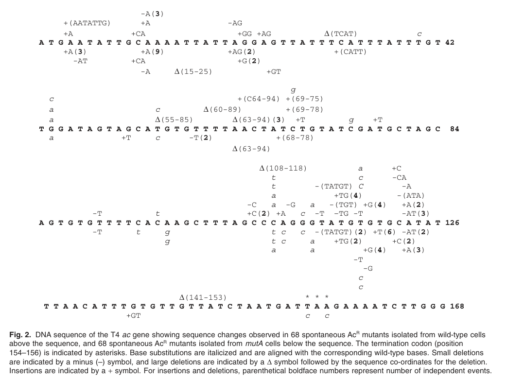

## Question

# Gene Research for Functional Annotation

## ⚠️ CRITICAL: Gene/Protein Identification Context

**BEFORE YOU BEGIN RESEARCH:** You MUST verify you are researching the CORRECT gene/protein. Gene symbols can be ambiguous, especially for less well-characterized genes from non-model organisms.

### Target Gene/Protein Identity (from UniProt):
- **UniProt Accession:** P18924
- **Protein Description:** RecName: Full=Uncharacterized protein 52.2;
- **Gene Information:** Name=ac; Synonyms=52.2;
- **Organism (full):** Enterobacteria phage T4 (Bacteriophage T4).
- **Protein Family:** Not specified in UniProt
- **Key Domains:** Not specified in UniProt

### MANDATORY VERIFICATION STEPS:

1. **Check if the gene symbol "ac" matches the protein description above**
2. **Verify the organism is correct:** Enterobacteria phage T4 (Bacteriophage T4).
3. **Check if protein family/domains align with what you find in literature**
4. **If you find literature for a DIFFERENT gene with the same or similar symbol, STOP**

### If Gene Symbol is Ambiguous or You Cannot Find Relevant Literature:

**DO NOT PROCEED WITH RESEARCH ON A DIFFERENT GENE.** Instead:
- State clearly: "The gene symbol 'ac' is ambiguous or literature is limited for this specific protein"
- Explain what you found (e.g., "Found extensive literature on a different gene with the same symbol in a different organism")
- Describe the protein based ONLY on the UniProt information provided above
- Suggest that the protein function can be inferred from domain/family information

### Research Target:

Please provide a comprehensive research report on the gene **ac** (gene ID: ac, UniProt: P18924) in BPT4.

The research report should be a detailed narrative explaining the function, biological processes, and localization of the gene product. Citations should be given for all claims.

You should prioritize authoritative reviews and primary scientific literature when conducting research. You can supplement
this with annotations you find in gene/protein databases, but these can be outdated or inaccurate.

We are specifically interested in the primary function of the gene - for enzymes, what reaction is catalyzed, and what is the substrate specificity? For transporters, what is the substrate? For structural proteins or adapters, what is the broader structural role? For signaling molecules, what is the role in the pathway.

We are interested in where in or outside the cell the gene product carries out its function.

We are also interested in the signaling or biochemical pathways in which the gene functions. We are less interested in broad pleiotropic effects, except where these elucidate the precise role.

Include evidence where possible. We are interested in both experimental evidence as well as inference from structure, evolution, or bioinformatic analysis. Precise studies should be prioritized over high-throughput, where available.

## Output

Question: You are an expert researcher providing comprehensive, well-cited information.

Provide detailed information focusing on:
1. Key concepts and definitions with current understanding
2. Recent developments and latest research (prioritize 2023-2024 sources)
3. Current applications and real-world implementations
4. Expert opinions and analysis from authoritative sources
5. Relevant statistics and data from recent studies

Format as a comprehensive research report with proper citations. Include URLs and publication dates where available.
Always prioritize recent, authoritative sources and provide specific citations for all major claims.

# Gene Research for Functional Annotation

## ⚠️ CRITICAL: Gene/Protein Identification Context

**BEFORE YOU BEGIN RESEARCH:** You MUST verify you are researching the CORRECT gene/protein. Gene symbols can be ambiguous, especially for less well-characterized genes from non-model organisms.

### Target Gene/Protein Identity (from UniProt):
- **UniProt Accession:** P18924
- **Protein Description:** RecName: Full=Uncharacterized protein 52.2;
- **Gene Information:** Name=ac; Synonyms=52.2;
- **Organism (full):** Enterobacteria phage T4 (Bacteriophage T4).
- **Protein Family:** Not specified in UniProt
- **Key Domains:** Not specified in UniProt

### MANDATORY VERIFICATION STEPS:

1. **Check if the gene symbol "ac" matches the protein description above**
2. **Verify the organism is correct:** Enterobacteria phage T4 (Bacteriophage T4).
3. **Check if protein family/domains align with what you find in literature**
4. **If you find literature for a DIFFERENT gene with the same or similar symbol, STOP**

### If Gene Symbol is Ambiguous or You Cannot Find Relevant Literature:

**DO NOT PROCEED WITH RESEARCH ON A DIFFERENT GENE.** Instead:
- State clearly: "The gene symbol 'ac' is ambiguous or literature is limited for this specific protein"
- Explain what you found (e.g., "Found extensive literature on a different gene with the same symbol in a different organism")
- Describe the protein based ONLY on the UniProt information provided above
- Suggest that the protein function can be inferred from domain/family information

### Research Target:

Please provide a comprehensive research report on the gene **ac** (gene ID: ac, UniProt: P18924) in BPT4.

The research report should be a detailed narrative explaining the function, biological processes, and localization of the gene product. Citations should be given for all claims.

You should prioritize authoritative reviews and primary scientific literature when conducting research. You can supplement
this with annotations you find in gene/protein databases, but these can be outdated or inaccurate.

We are specifically interested in the primary function of the gene - for enzymes, what reaction is catalyzed, and what is the substrate specificity? For transporters, what is the substrate? For structural proteins or adapters, what is the broader structural role? For signaling molecules, what is the role in the pathway.

We are interested in where in or outside the cell the gene product carries out its function.

We are also interested in the signaling or biochemical pathways in which the gene functions. We are less interested in broad pleiotropic effects, except where these elucidate the precise role.

Include evidence where possible. We are interested in both experimental evidence as well as inference from structure, evolution, or bioinformatic analysis. Precise studies should be prioritized over high-throughput, where available.

## Research Report: Bacteriophage T4 gene **ac** / protein **52.2** (UniProt **P18924**)

### 0) Identity verification (critical)
The target is **Enterobacteria phage T4** gene **ac**, explicitly referred to in primary literature as **“the T4 ac gene (gene 52.2)”** and used as a selectable locus for **acriflavin resistance (AcS→AcR)** (mamun2006hypermutagenesisinmuta pages 2-4). A second line of evidence places **ac** in the T4 genome near the **rII region** and **gene 52** based on cloned-fragment mapping (selzer2004invivoexpression pages 2-3). The retrieved evidence therefore matches the UniProt description “Uncharacterized protein 52.2” and the gene symbol **ac** in **bacteriophage T4**, and off-target “ac” usages in other organisms were excluded.

### 1) Key concepts and definitions (current understanding)

#### 1.1 What “ac” / “gene 52.2” denotes in T4 genetics
In the T4 genetics literature, **ac** (also called **gene 52.2**) is a small genetic locus whose mutants can be selected using **acriflavin**, a dye that inhibits T4 development. Under acriflavin selection, **mutations in ac permit T4 to develop**, yielding the phenotype **AcR (acriflavin-resistant)** (mamun2006hypermutagenesisinmuta pages 2-4). This provides a convenient **forward-mutation assay** (AcS→AcR) in phage genetics and DNA replication fidelity studies (mamun2006hypermutagenesisinmuta pages 2-4, mamun2006hypermutagenesisinmuta pages 4-5).

#### 1.2 “Small phage proteins” as a conceptual class relevant to ac/52.2
Although direct biochemical function of ac/52.2 is not established in the retrieved sources, **its gene length (156 bp)** implies a protein of ~52 aa, placing it within the common definition of **phage-encoded small proteins (<100 aa)** discussed in modern reviews (mamun2006hypermutagenesisinmuta pages 2-4, beggs2024phagesmallproteins pages 1-2). Such proteins are now recognized to often have **outsized regulatory roles** despite being historically under-annotated (beggs2024phagesmallproteins pages 1-2).

### 2) Experimentally supported functional information for T4 ac (what is known)

#### 2.1 Phenotype: ac mutations confer acriflavin resistance
The most direct experimental characterization available in the retrieved corpus is phenotypic:
* **Acriflavin inhibits T4 development**, and **mutations in the T4 ac gene (gene 52.2) overcome acriflavin inhibition and allow phage development** (mamun2006hypermutagenesisinmuta pages 2-4).

This establishes ac as genetically linked to **drug sensitivity/resistance** during infection, but does **not** establish the molecular mechanism.

#### 2.2 Molecular function remains unknown (explicitly stated)
Mamun et al. state plainly that **“The T4 ac gene, whose mode of action and function remain unknown”** (mamun2006hypermutagenesisinmuta pages 2-4). Thus, there is currently **no evidence in the retrieved texts** supporting assignment as an enzyme, structural virion component, transporter, or signaling protein with a defined pathway.

#### 2.3 Gene size and mutational target properties
Mamun et al. report that **ac is 156 bp long**, with the **termination codon at positions 154–156** (mamun2006hypermutagenesisinmuta pages 4-5). The paper uses this locus specifically because its small size makes it well-suited to measure forward mutation and mutation spectra (mamun2006hypermutagenesisinmuta pages 2-4).

### 3) Genomic context (T4 genome neighborhood)
A mapping study of cloned T4 DNA fragments used for rII-region expression analysis places **ac** in the same genomic neighborhood as rII and gene 52. In the plasmid map, the gene order includes **“… stp r ac gene52 …”**, with pTB401 containing parts of **rIIB and gene 52** and labeling **ac** adjacent to gene 52 (selzer2004invivoexpression pages 2-3). This provides **positional context** but not functional annotation.

### 4) Localization and expression timing

#### 4.1 Localization (virion vs non-virion)
No retrieved source explicitly states whether T4 protein 52.2 is **virion-associated** or strictly **intracellular** during infection. Therefore, localization cannot be concluded from the current evidence.

#### 4.2 Expression timing (early/middle/late)
No retrieved T4-ac-specific source provides expression timing for ac/52.2. However, a 2024 synthesis of T4 infection ‘dual-omics’ observations argues that **a large fraction of early T4 proteins (~65%) are uncharacterized**, and that early appearance may imply roles in **host takeover** or **countering host immunity** (pozhydaieva2024molecularstrategiesapplied pages 281-284). This is **contextual** and does not identify ac/52.2 specifically as early.

### 5) Recent developments and latest research context (prioritizing 2023–2024)
Direct 2023–2024 experimental work on **T4 gene ac / protein 52.2** itself was not retrieved. However, 2024 literature provides important advances in *how* such small, uncharacterized phage proteins are approached:

#### 5.1 Explosion in recognition of small phage proteins
Beggs & Bassler (2024) report metagenomic discovery of **“over 2 million small genes in phage genomes”**, define small phage proteins as **<100 aa**, and emphasize that they frequently encode proteins with **unknown function** yet can control major host/phage outcomes (beggs2024phagesmallproteins pages 1-2). This frames T4 52.2 (predicted small size from ac length) as consistent with an increasingly important class of phage genes.

#### 5.2 Methodological shift: structural inference for uncharacterized phage proteins
Pozhydaieva (2024) emphasizes that sequence-homology methods often fail for small, rapidly evolving phage proteins and proposes structural approaches as a remedy. The text states that protein annotation can be improved **“by up to 70% by incorporating structural features”**, facilitated by structure prediction (e.g., **AlphaFold**) and structural homology search (pozhydaieva2024molecularstrategiesapplied pages 281-284). While not specific to ac, this is directly relevant to future functional annotation of protein 52.2.

### 6) Current applications and real-world implementations

#### 6.1 Application as a selectable reporter in mutagenesis and replication-fidelity studies
The primary “real-world” use supported by retrieved evidence is **methodological**: T4 ac/52.2 provides a **selectable forward-mutation assay**.
* **Selection method:** plating phage lysates on agar containing **acriflavin (2 mg/mL)** to select **AcR** (mamun2006hypermutagenesisinmuta pages 9-10).
* **Genotyping method:** PCR amplification and sequencing of the ac locus using specific primers (ac_forward/ac_reverse) to map causative changes (mamun2006hypermutagenesisinmuta pages 9-10).

This establishes ac as a practical tool for **quantifying mutation rates and spectra** (mamun2006hypermutagenesisinmuta pages 2-4, mamun2006hypermutagenesisinmuta pages 4-5).

#### 6.2 Broader phage engineering relevance (contextual)
Pozhydaieva (2024) discusses that understanding translation regulation and uncharacterized protein function could be exploited for **synthetic regulation and phage engineering**, but does not link these applications to ac/52.2 specifically (pozhydaieva2024molecularstrategiesapplied pages 281-284).

### 7) Quantitative statistics and data from studies (recent and/or key)

#### 7.1 Mutation rate changes in mutA host cells (ac-based assay)
Using the AcS→AcR assay, Mamun et al. report that replication of T4 in **E. coli mutA** host cells increases the forward mutation rate to AcR by approximately **4–10-fold** relative to parental hosts (mamun2006hypermutagenesisinmuta pages 2-4). Example values (×10^-8) include:
* Sm12OP: **3 (2.6–3.8)** in WT vs **28 (21–31)** in mutA (~10-fold) (mamun2006hypermutagenesisinmuta pages 2-4)
* Sm12OC: **5.5 (4.4–7.7)** in WT vs **22 (18–28)** in mutA (~3.9-fold) (mamun2006hypermutagenesisinmuta pages 2-4)

#### 7.2 Mutation spectrum: insertions strongly enriched in mutA
Sequencing of AcR mutants showed that in mutA cells, insertions are strongly enriched:
* Insertions:deletions ratio ~**3:1** in mutA vs ~**1:1** in WT (mamun2006hypermutagenesisinmuta pages 4-5).
* **1-bp A:T insertions** elevated ~**33-fold** in mutA (mamun2006hypermutagenesisinmuta pages 4-5).
* Insertions within repeats elevated ~**32-fold** (mamun2006hypermutagenesisinmuta pages 4-5).

Table 3 also reports class-specific counts and mutation-rate contributions (×10^-8), including 1-bp A:T insertions **0.22 (WT)** vs **7.2 (mutA)** (mamun2006hypermutagenesisinmuta pages 4-5).

#### 7.3 Not all AcR mutants map to ac
Of sequenced AcR isolates, about half had mutations within the 156-bp ac gene itself (e.g., 68/126 in WT; 68/120 in mutA), implying that some AcR isolates may involve mutations elsewhere or complex events (mamun2006hypermutagenesisinmuta pages 4-5).

### 8) Visual evidence (figure/table)
Mamun et al. provide a mutation map of the ac locus (Figure 2) and quantitative mutation spectrum (Table 3), both retrieved as images (mamun2006hypermutagenesisinmuta media aa2c1f3a, mamun2006hypermutagenesisinmuta media 50b4f205).

### 9) Conclusions and evidence-based functional annotation statement
* **Supported annotation (high confidence):** T4 **ac/gene 52.2** is a **small genetic locus** whose mutation confers **acriflavin resistance (AcR)** and enables T4 development under acriflavin; it is widely used as a **selectable forward-mutation reporter** in phage mutagenesis studies (mamun2006hypermutagenesisinmuta pages 2-4, mamun2006hypermutagenesisinmuta pages 9-10).
* **Unknowns (explicit):** The **mode of action and molecular function remain unknown** in the retrieved primary experimental paper; no direct evidence here supports an enzymatic reaction, substrate specificity, virion structural role, or specific pathway membership (mamun2006hypermutagenesisinmuta pages 2-4).
* **Contextual best-practice for future annotation:** Recent 2024 expert syntheses argue that small uncharacterized phage proteins can exert strong host-modulatory functions and that structure-guided inference may substantially improve annotation, providing a roadmap for elucidating T4 protein 52.2 (beggs2024phagesmallproteins pages 1-2, pozhydaieva2024molecularstrategiesapplied pages 281-284).

---

### Evidence summary table
| Evidence type | Key finding | Quantitative/statistical details | Source (include DOI URL and year) | Notes/limitations |
|---|---|---|---|---|
| Phenotype/genetics | Mutations in T4 **ac** (gene 52.2) confer resistance to acriflavin, enabling phage development under acriflavin selection (AcS→AcR assay). | Forward mutation rate to AcR increased in **mutA** host cells by about **4–10-fold** versus parental cells. Example rates shown for two T4 backgrounds: **3 to 28 ×10^-8** and **4.7 to 50 ×10^-8**; **5.5 to 22 ×10^-8** and **4.4 to 17 ×10^-8** (mamun2006hypermutagenesisinmuta pages 2-4) | Mamun et al., *Molecular Microbiology* (2006). DOI: https://doi.org/10.1111/j.1365-2958.2006.05490.x (2006) (mamun2006hypermutagenesisinmuta pages 2-4) | The paper explicitly states that the **mode of action and function remain unknown**; the assay reports selectable phenotype, not biochemical mechanism. |
| Sequence/features | The **ac** gene is a very small target used for mutagenesis studies. | Gene length is **156 bp**; the **termination codon is at positions 154–156** (mamun2006hypermutagenesisinmuta pages 4-5) | Mamun et al., *Molecular Microbiology* (2006). DOI: https://doi.org/10.1111/j.1365-2958.2006.05490.x (2006) (mamun2006hypermutagenesisinmuta pages 2-4, mamun2006hypermutagenesisinmuta pages 4-5) | Small gene size makes it useful for forward-mutation analysis, but also means functional/domain inference from sequence alone is limited in this paper. |
| Sequence/features / mutation spectrum | In **mutA** cells, the **ac** mutation spectrum shifts strongly toward insertions, especially 1-bp A:T insertions and repeat-associated events. | Insertions:deletions ratio changes from about **1:1 in wild type** to **3:1 in mutA**; **1-bp A:T insertions** rise about **33-fold**; **insertions within repeats** rise about **32-fold**; A:T-targeted substitutions appear elevated about **24-fold** (mamun2006hypermutagenesisinmuta pages 4-5) | Mamun et al., *Molecular Microbiology* (2006). DOI: https://doi.org/10.1111/j.1365-2958.2006.05490.x (2006) (mamun2006hypermutagenesisinmuta pages 4-5, mamun2006hypermutagenesisinmuta media aa2c1f3a, mamun2006hypermutagenesisinmuta media 50b4f205) | About half of sequenced AcR mutants carried changes within **ac** itself (**68/126** in WT; **68/120** in mutA), implying some AcR mutants map outside **ac** or were otherwise unresolved. |
| Genomic context | Plasmid mapping places **ac** in the T4 genomic region near the **rII** locus and **gene 52**. | In plasmid **pTB401** (~**1,100 bp** insert), the mapped order includes **... stp r ac gene52**; the insert carries the **saA9** deletion. The mapped region spans parts of **rIIB** and **52** and places **ac** adjacent to gene 52 (selzer2004invivoexpression pages 2-3) | Selzer et al., *Molecular and General Genetics MGG* (published in tool record as 2004; original classic study). DOI: https://doi.org/10.1007/bf00268772 (tool record year 2004) (selzer2004invivoexpression pages 2-3) | This is **mapping/context evidence**, not direct functional characterization of ac protein 52.2. |
| Phenotype/genetics / interpretation | **ac** is valuable as a reporter for T4 replication fidelity in host mutator backgrounds. | In the AcS→AcR assay, average mutation rates for sequenced **ac** mutants were summarized as **2.1 ×10^-8** (WT) versus **22 ×10^-8** (**mutA**) (mamun2006hypermutagenesisinmuta pages 4-5) | Mamun et al., *Molecular Microbiology* (2006). DOI: https://doi.org/10.1111/j.1365-2958.2006.05490.x (2006) (mamun2006hypermutagenesisinmuta pages 4-5) | These data support use of **ac** as a mutational readout, but they do **not** establish whether ac is enzymatic, structural, or regulatory in normal T4 biology. |

*Table: This table condenses the directly supported evidence recovered for bacteriophage T4 gene ac/protein 52.2 (UniProt P18924). It highlights the strongest experimentally grounded findings on phenotype, sequence features, mutation statistics, and genomic context while making clear where functional knowledge remains limited.*

References

1. (mamun2006hypermutagenesisinmuta pages 2-4): Abu Amar M. Al Mamun, Satyendra Gautam, and M. Zafri Humayun. Hypermutagenesis in muta cells is mediated by mistranslational corruption of polymerase, and is accompanied by replication fork collapse. Molecular Microbiology, 62:1752-1763, Dec 2006. URL: https://doi.org/10.1111/j.1365-2958.2006.05490.x, doi:10.1111/j.1365-2958.2006.05490.x. This article has 29 citations and is from a domain leading peer-reviewed journal.

2. (selzer2004invivoexpression pages 2-3): Gerald Selzer, Dominique Belin, Antoinette Bolle, Griet Van Houwe, Tom Mattson, and Richard Epstein. In vivo expression of the rii region of bacteriophage t4 present in chimeric plasmids. Molecular and General Genetics MGG, 183:505-513, Nov 2004. URL: https://doi.org/10.1007/bf00268772, doi:10.1007/bf00268772. This article has 6 citations.

3. (mamun2006hypermutagenesisinmuta pages 4-5): Abu Amar M. Al Mamun, Satyendra Gautam, and M. Zafri Humayun. Hypermutagenesis in muta cells is mediated by mistranslational corruption of polymerase, and is accompanied by replication fork collapse. Molecular Microbiology, 62:1752-1763, Dec 2006. URL: https://doi.org/10.1111/j.1365-2958.2006.05490.x, doi:10.1111/j.1365-2958.2006.05490.x. This article has 29 citations and is from a domain leading peer-reviewed journal.

4. (beggs2024phagesmallproteins pages 1-2): Grace A Beggs and Bonnie L Bassler. Phage small proteins play large roles in phage–bacterial interactions. Aug 2024. URL: https://doi.org/10.1016/j.mib.2024.102519, doi:10.1016/j.mib.2024.102519. This article has 11 citations and is from a peer-reviewed journal.

5. (pozhydaieva2024molecularstrategiesapplied pages 281-284): Nadiia Pozhydaieva. Molecular strategies applied by bacteriophage t4 for efficient hijacking of escherichia coli. Text, Jun 2024. URL: https://doi.org/10.17192/z2024.0117, doi:10.17192/z2024.0117. This article has 0 citations and is from a peer-reviewed journal.

6. (mamun2006hypermutagenesisinmuta pages 9-10): Abu Amar M. Al Mamun, Satyendra Gautam, and M. Zafri Humayun. Hypermutagenesis in muta cells is mediated by mistranslational corruption of polymerase, and is accompanied by replication fork collapse. Molecular Microbiology, 62:1752-1763, Dec 2006. URL: https://doi.org/10.1111/j.1365-2958.2006.05490.x, doi:10.1111/j.1365-2958.2006.05490.x. This article has 29 citations and is from a domain leading peer-reviewed journal.

7. (mamun2006hypermutagenesisinmuta media aa2c1f3a): Abu Amar M. Al Mamun, Satyendra Gautam, and M. Zafri Humayun. Hypermutagenesis in muta cells is mediated by mistranslational corruption of polymerase, and is accompanied by replication fork collapse. Molecular Microbiology, 62:1752-1763, Dec 2006. URL: https://doi.org/10.1111/j.1365-2958.2006.05490.x, doi:10.1111/j.1365-2958.2006.05490.x. This article has 29 citations and is from a domain leading peer-reviewed journal.

8. (mamun2006hypermutagenesisinmuta media 50b4f205): Abu Amar M. Al Mamun, Satyendra Gautam, and M. Zafri Humayun. Hypermutagenesis in muta cells is mediated by mistranslational corruption of polymerase, and is accompanied by replication fork collapse. Molecular Microbiology, 62:1752-1763, Dec 2006. URL: https://doi.org/10.1111/j.1365-2958.2006.05490.x, doi:10.1111/j.1365-2958.2006.05490.x. This article has 29 citations and is from a domain leading peer-reviewed journal.

## Artifacts

- [Edison artifact artifact-00](ac-deep-research-falcon_artifacts/artifact-00.md)

## Citations

1. mamun2006hypermutagenesisinmuta pages 2-4
2. selzer2004invivoexpression pages 2-3
3. beggs2024phagesmallproteins pages 1-2
4. mamun2006hypermutagenesisinmuta pages 4-5
5. pozhydaieva2024molecularstrategiesapplied pages 281-284
6. mamun2006hypermutagenesisinmuta pages 9-10
7. https://doi.org/10.1111/j.1365-2958.2006.05490.x
8. https://doi.org/10.1007/bf00268772
9. https://doi.org/10.1111/j.1365-2958.2006.05490.x,
10. https://doi.org/10.1007/bf00268772,
11. https://doi.org/10.1016/j.mib.2024.102519,
12. https://doi.org/10.17192/z2024.0117,