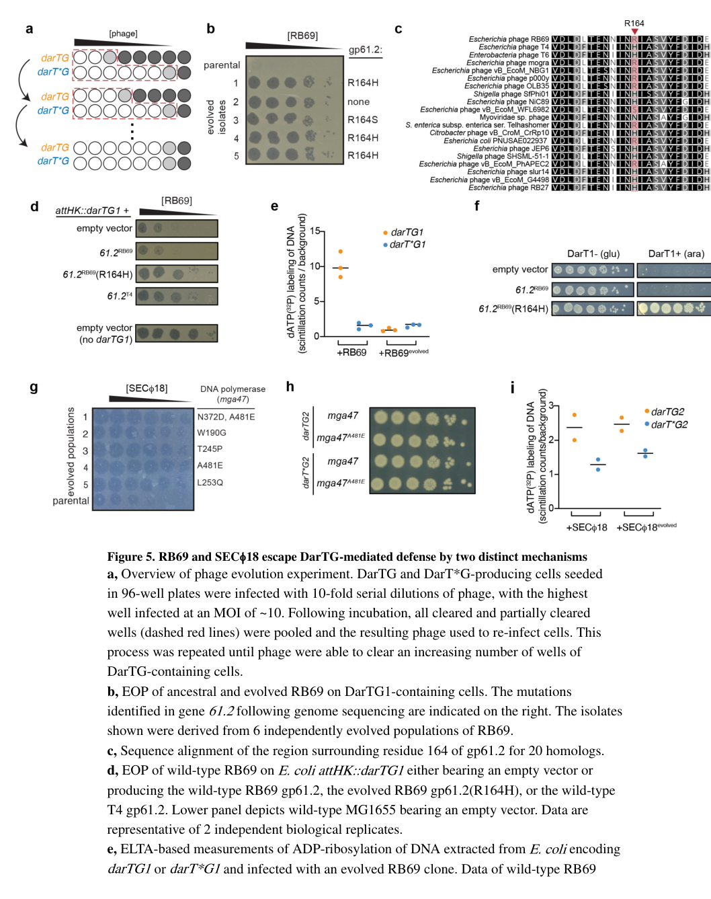

## Question

# Gene Research for Functional Annotation

## ⚠️ CRITICAL: Gene/Protein Identification Context

**BEFORE YOU BEGIN RESEARCH:** You MUST verify you are researching the CORRECT gene/protein. Gene symbols can be ambiguous, especially for less well-characterized genes from non-model organisms.

### Target Gene/Protein Identity (from UniProt):
- **UniProt Accession:** P39229
- **Protein Description:** RecName: Full=Anti-DarT factor A;
- **Gene Information:** Name=adfA; Synonyms=61.2, y01L;
- **Organism (full):** Enterobacteria phage T4 (Bacteriophage T4).
- **Protein Family:** Belongs to the Anti-DarT factor A family. .
- **Key Domains:** AdfA-like. (IPR055608); AdfA (PF23813)

### MANDATORY VERIFICATION STEPS:

1. **Check if the gene symbol "adfA" matches the protein description above**
2. **Verify the organism is correct:** Enterobacteria phage T4 (Bacteriophage T4).
3. **Check if protein family/domains align with what you find in literature**
4. **If you find literature for a DIFFERENT gene with the same or similar symbol, STOP**

### If Gene Symbol is Ambiguous or You Cannot Find Relevant Literature:

**DO NOT PROCEED WITH RESEARCH ON A DIFFERENT GENE.** Instead:
- State clearly: "The gene symbol 'adfA' is ambiguous or literature is limited for this specific protein"
- Explain what you found (e.g., "Found extensive literature on a different gene with the same symbol in a different organism")
- Describe the protein based ONLY on the UniProt information provided above
- Suggest that the protein function can be inferred from domain/family information

### Research Target:

Please provide a comprehensive research report on the gene **adfA** (gene ID: adfA, UniProt: P39229) in BPT4.

The research report should be a detailed narrative explaining the function, biological processes, and localization of the gene product. Citations should be given for all claims.

You should prioritize authoritative reviews and primary scientific literature when conducting research. You can supplement
this with annotations you find in gene/protein databases, but these can be outdated or inaccurate.

We are specifically interested in the primary function of the gene - for enzymes, what reaction is catalyzed, and what is the substrate specificity? For transporters, what is the substrate? For structural proteins or adapters, what is the broader structural role? For signaling molecules, what is the role in the pathway.

We are interested in where in or outside the cell the gene product carries out its function.

We are also interested in the signaling or biochemical pathways in which the gene functions. We are less interested in broad pleiotropic effects, except where these elucidate the precise role.

Include evidence where possible. We are interested in both experimental evidence as well as inference from structure, evolution, or bioinformatic analysis. Precise studies should be prioritized over high-throughput, where available.

## Output

Question: You are an expert researcher providing comprehensive, well-cited information.

Provide detailed information focusing on:
1. Key concepts and definitions with current understanding
2. Recent developments and latest research (prioritize 2023-2024 sources)
3. Current applications and real-world implementations
4. Expert opinions and analysis from authoritative sources
5. Relevant statistics and data from recent studies

Format as a comprehensive research report with proper citations. Include URLs and publication dates where available.
Always prioritize recent, authoritative sources and provide specific citations for all major claims.

# Gene Research for Functional Annotation

## ⚠️ CRITICAL: Gene/Protein Identification Context

**BEFORE YOU BEGIN RESEARCH:** You MUST verify you are researching the CORRECT gene/protein. Gene symbols can be ambiguous, especially for less well-characterized genes from non-model organisms.

### Target Gene/Protein Identity (from UniProt):
- **UniProt Accession:** P39229
- **Protein Description:** RecName: Full=Anti-DarT factor A;
- **Gene Information:** Name=adfA; Synonyms=61.2, y01L;
- **Organism (full):** Enterobacteria phage T4 (Bacteriophage T4).
- **Protein Family:** Belongs to the Anti-DarT factor A family. .
- **Key Domains:** AdfA-like. (IPR055608); AdfA (PF23813)

### MANDATORY VERIFICATION STEPS:

1. **Check if the gene symbol "adfA" matches the protein description above**
2. **Verify the organism is correct:** Enterobacteria phage T4 (Bacteriophage T4).
3. **Check if protein family/domains align with what you find in literature**
4. **If you find literature for a DIFFERENT gene with the same or similar symbol, STOP**

### If Gene Symbol is Ambiguous or You Cannot Find Relevant Literature:

**DO NOT PROCEED WITH RESEARCH ON A DIFFERENT GENE.** Instead:
- State clearly: "The gene symbol 'adfA' is ambiguous or literature is limited for this specific protein"
- Explain what you found (e.g., "Found extensive literature on a different gene with the same symbol in a different organism")
- Describe the protein based ONLY on the UniProt information provided above
- Suggest that the protein function can be inferred from domain/family information

### Research Target:

Please provide a comprehensive research report on the gene **adfA** (gene ID: adfA, UniProt: P39229) in BPT4.

The research report should be a detailed narrative explaining the function, biological processes, and localization of the gene product. Citations should be given for all claims.

You should prioritize authoritative reviews and primary scientific literature when conducting research. You can supplement
this with annotations you find in gene/protein databases, but these can be outdated or inaccurate.

We are specifically interested in the primary function of the gene - for enzymes, what reaction is catalyzed, and what is the substrate specificity? For transporters, what is the substrate? For structural proteins or adapters, what is the broader structural role? For signaling molecules, what is the role in the pathway.

We are interested in where in or outside the cell the gene product carries out its function.

We are also interested in the signaling or biochemical pathways in which the gene functions. We are less interested in broad pleiotropic effects, except where these elucidate the precise role.

Include evidence where possible. We are interested in both experimental evidence as well as inference from structure, evolution, or bioinformatic analysis. Precise studies should be prioritized over high-throughput, where available.

## Research Report: Functional Annotation of **adfA** (Anti-DarT factor A) in Enterobacteria phage T4 (UniProt: P39229)

### Executive summary
Phage T4 gene **adfA** encodes **Anti-DarT factor A (AdfA)**, a phage counter-defense protein discovered through phage escape from the bacterial **DarTG** toxin–antitoxin (TA) anti-phage defense system. In the foundational study, an uncharacterized T-even phage gene (historically **gene 61.2**, encoding a ~212-aa protein) was shown to enable escape from DarTG1 defense when specific mutations were acquired; the gene was renamed **adfA** (“anti-DarT factor A”). AdfA acts as an **anti-toxin** countermeasure that prevents DarT-mediated **ADP-ribosylation of phage DNA**, thereby permitting phage genome replication and productive infection. Evidence suggests AdfA is **non-enzymatic** and likely functions via **protein–protein interaction with the DarT toxin**, with strong allele specificity. In T4, adfA appears **dispensable** for resistance to DarTG1 because T4 also encodes other anti-DarT counter-defense(s) (e.g., the enzymatic NADAR-family factor AdfN described later), illustrating that T4 counter-defense is **multi-layered** rather than reliant on AdfA alone. (leroux2022thedartgtoxinantitoxin pages 7-9, johannesman2025phagescarryorphan pages 2-3, johannesman2025phagescarryorphan pages 1-2, johannesman2025phagescarryorphan pages 3-4)

**Key recent (2023–2024) development:** DarTG has now been documented in clinically relevant *Vibrio cholerae* isolates and shown to shape co-circulating phage populations, including selection for phage-encoded “Adf” antitoxin mimics (e.g., AdfB in phage ICP1), reinforcing Adf-type factors as real-world phage counter-defenses rather than laboratory curiosities. (patel2024sporadicphagedefense pages 1-2, patel2024sporadicphagedefense pages 12-14)

### 0) Mandatory identity verification (to avoid gene-symbol ambiguity)
**What is “adfA” in the relevant primary literature?** LeRoux et al. (Nature Microbiology, 2022) explicitly identify an uncharacterized T-even phage gene **61.2** and rename it **adfA** (“anti-DarT factor A”) after showing that mutations in this gene allow phage escape from DarTG1 defense. (leroux2022thedartgtoxinantitoxin pages 7-9, leroux2022thedartgtoxinantitoxin pages 11-12)

**Organism context:** The evidence base connects **adfA homologs** to **T-even (Tevenvirinae) phages**, including **T4 and T6**, and demonstrates function primarily using RB69, with T4 homologs used for complementation/allele comparisons. (leroux2022thedartgtoxinantitoxin pages 7-9, leroux2022thedartgtoxinantitoxin pages 11-12)

**Caveat (database mapping):** In the retrieved literature, neither the UniProt accession **P39229** nor the synonym **y01L** is explicitly mentioned. Therefore, mapping “adfA” to UniProt P39229 and synonyms relies on the user-provided UniProt context rather than tool-retrieved UniProt/InterPro pages. The *functional* mapping of “adfA” to **T-even phage gene 61.2 (gp61.2)** is directly supported by primary literature. (leroux2022thedartgtoxinantitoxin pages 7-9, leroux2022thedartgtoxinantitoxin pages 11-12)

### 1) Key concepts and definitions (current understanding)

#### 1.1 DarTG toxin–antitoxin systems as anti-phage defenses
DarTG is a two-gene TA system that can function as an anti-phage defense: the **DarT toxin** is a DNA-targeting **ADP-ribosyltransferase** that modifies viral DNA during infection, blocking phage genome replication and disrupting productive development. (leroux2022thedartgtoxinantitoxin pages 9-11)

In the DarTG1 system studied in *E. coli*, DarT1 activity during infection causes rapid inhibition of DNA synthesis and reduced RNA synthesis; protein synthesis rates may not drop substantially, but the phage gene-expression program becomes misregulated, contributing to failure to produce mature virions. (leroux2022thedartgtoxinantitoxin pages 7-9)

#### 1.2 Anti-DarT factors (Adf proteins)
“Anti-DarT factors” are phage-encoded counter-defenses that antagonize DarT-based defense. In the Adf framework:
- **AdfA** (anti-DarT factor A) is a small phage protein inferred to act as a **direct inhibitor/antitoxin-like factor**, likely by interacting with DarT. (johannesman2025phagescarryorphan pages 2-3, johannesman2025phagescarryorphan pages 1-2)
- Other phage counter-defenses can exist, including enzymatic “erasers” of ADP-ribosylation (e.g., NADAR-family proteins described later) and replication proteins that tolerate modified DNA. (leroux2022thedartgtoxinantitoxin pages 9-11, johannesman2025phagescarryorphan pages 1-2)

### 2) adfA / AdfA: function and mechanism

#### 2.1 Primary function
**Primary functional role:** AdfA is a phage-encoded **anti-defense** factor that counteracts DarTG-mediated defense by **inhibiting DarT toxin activity**, preventing detectable ADP-ribosylation of phage DNA in the escape context, and thereby restoring productive infection. (leroux2022thedartgtoxinantitoxin pages 7-9, leroux2022thedartgtoxinantitoxin media 64d807f6)

#### 2.2 Mechanistic evidence (genetics + biochemical readout)
The strongest direct experimental chain linking AdfA to DarT inhibition comes from LeRoux et al.:
- RB69 experimentally evolved on DarTG1 hosts yielded multiple resistant clones; resistance repeatedly mapped to mutations in gene 61.2 (renamed adfA), especially at residue 164. (leroux2022thedartgtoxinantitoxin pages 7-9)
- Infections with evolved RB69 containing the gp61.2(R164H) change showed **“no detectable DNA ADP-ribosylation”** in the assay used (ELTA-based detection), consistent with direct inhibition of DarT’s DNA-modifying activity. (leroux2022thedartgtoxinantitoxin pages 7-9, leroux2022thedartgtoxinantitoxin media 64d807f6)
- The evolved gp61.2(R164H) variant (but not wild-type RB69 gp61.2) could restore growth to cells producing DarT1, indicating antitoxin-like inhibition even outside the phage infection setting. (leroux2022thedartgtoxinantitoxin pages 7-9)

#### 2.3 Allele specificity and interaction model
AdfA appears to be **allele-specific** in activity and likely works through interaction with DarT:
- Escape mutations converged on **R164H** or **R164S**, and related phages T4/T6 naturally encode homologs with histidine at that position, suggesting this residue is a key specificity determinant. (leroux2022thedartgtoxinantitoxin pages 7-9, leroux2022thedartgtoxinantitoxin pages 11-12)
- Later work (preprint) supports a **protein–protein interaction** model: bacterial two-hybrid assays show strong association between DarT1* and AdfA(R164H), whereas T4 AdfA shows weaker interaction. (johannesman2025phagescarryorphan pages 2-3)

### 3) Biological process, pathway context, and localization

#### 3.1 Pathway placement during infection
AdfA participates in the **phage–host conflict pathway**:
1) Host-encoded DarT becomes active during phage infection and ADP-ribosylates incoming/replicating phage DNA, halting DNA synthesis and blocking productive infection. (leroux2022thedartgtoxinantitoxin pages 9-11, leroux2022thedartgtoxinantitoxin pages 7-9)
2) Phage-encoded AdfA can counter this by inhibiting DarT, preventing the DNA ADP-ribosylation step and restoring replication and plaque formation under DarTG defense. (leroux2022thedartgtoxinantitoxin pages 7-9)

#### 3.2 Cellular localization (inference from function)
No direct subcellular localization imaging (e.g., fluorescence microscopy) was found in the retrieved evidence. However, the experiments imply AdfA functions **inside the infected bacterial cell** (cytoplasm/nucleoid region) during infection where DarT modifies DNA and where phage DNA replication occurs, because:
- The phenotypes measured are intracellular (DNA ADP-ribosylation, DNA synthesis arrest) and infection outcomes (EOP/plaquing). (leroux2022thedartgtoxinantitoxin pages 7-9, leroux2022thedartgtoxinantitoxin media 64d807f6)
- AdfA can inhibit DarT1 even when expressed ectopically in cells, further supporting an intracellular interaction with the toxin. (leroux2022thedartgtoxinantitoxin pages 7-9)

### 4) Recent developments (prioritizing 2023–2024)

#### 4.1 DarTG and Adf-type counter-defenses in real-world *Vibrio cholerae*–phage interactions (2024)
Patel & Seed (mBio, **October 2024**) show that DarTG is present in clinical *V. cholerae* isolates and can inhibit the lytic phage ICP1 by blocking genome replication and preventing plaquing. They identify an ICP1-encoded counter-defense, **AdfB**, described as a functional antitoxin that likely abrogates DarT through direct interactions. (patel2024sporadicphagedefense pages 1-2, patel2024sporadicphagedefense pages 12-14)

They further report that AdfB is expressed **early** in infection (before 8 minutes post-infection, with peak by ~8 minutes), consistent with needing to neutralize DarT early enough to permit genome replication. (patel2024sporadicphagedefense pages 12-14)

Although this paper is centered on AdfB, it explicitly situates **AdfA (RB69/T4/T6-associated)** as an analogous phage-encoded anti-DarT factor with active/inactive alleles, supporting the broader concept that Adf-type counter-defenses are naturally selected and maintained in phage populations. (patel2024sporadicphagedefense pages 14-15, patel2024sporadicphagedefense pages 12-14)

**URL / DOI:** https://doi.org/10.1128/mbio.00111-24 (Oct 2024). (patel2024sporadicphagedefense pages 1-2)

#### 4.2 Functional redundancy/multi-layer counter-defense in T-even phages (context from later synthesis)
A later synthesis (preprint) argues that T4 resistance to DarTG1 is not explained solely by adfA. It reports that deletion of **adfA in T4 does not alter susceptibility** to DarTG1, suggesting AdfA is **dispensable** in T4 due to other counter-defenses (notably an enzymatic NADAR-family anti-DarT factor). (johannesman2025phagescarryorphan pages 2-3, johannesman2025phagescarryorphan pages 1-2, johannesman2025phagescarryorphan pages 3-4)

This point matters for functional annotation: **AdfA is an anti-DarT factor, but not necessarily the dominant DarTG1 counter-defense determinant in T4**.

### 5) Experimental evidence and data highlights (statistics and measurable outcomes)

#### 5.1 Mutation/selection statistics for adfA (LeRoux et al. 2022)
- **Five** independently evolved RB69 populations were used, yielding a DarTG1-resistant clone from each population. (leroux2022thedartgtoxinantitoxin pages 7-9)
- **Four out of five** resistant clones carried a mutation in the **same codon** of gene 61.2/adfA. (leroux2022thedartgtoxinantitoxin pages 7-9)
- Of these four, **three** were **R164H** and **one** was **R164S**. (leroux2022thedartgtoxinantitoxin pages 7-9)
- The gene encodes a predicted **212-aa** protein. (leroux2022thedartgtoxinantitoxin pages 7-9)
- A multiple sequence alignment contained **124 homologs** of gp61.2, showing natural variation at residue 164 (including H, S, and N). (leroux2022thedartgtoxinantitoxin pages 7-9)

These convergent outcomes are consistent with strong selection on a specific AdfA residue as a specificity/compatibility determinant for neutralizing a given DarT toxin. (leroux2022thedartgtoxinantitoxin pages 7-9)

#### 5.2 Phenotype-level functional readouts
- Ectopic expression of evolved gp61.2(R164H) or a T4 homolog improved RB69 **efficiency of plating (EOP)** on DarTG1 hosts (directional result; exact numeric EOP not provided in text excerpt). (leroux2022thedartgtoxinantitoxin pages 7-9)
- ELTA-based assay readout: infections with evolved RB69 producing gp61.2(R164H) showed **no detectable DNA ADP-ribosylation**. (leroux2022thedartgtoxinantitoxin pages 7-9)

The corresponding figure panels (EOP and DNA ADP-ribosylation assay) were retrieved and can be cited as visual evidence. (leroux2022thedartgtoxinantitoxin media 64d807f6, leroux2022thedartgtoxinantitoxin media 8a57b92c)

#### 5.3 Additional quantitative/statistical reporting from follow-up work
A later preprint provides explicit statistical reporting for EOP assays (example: **n = 3** independent replicates; **p = 0.03**, unpaired two-tailed t-test; SD error bars). (johannesman2025phagescarryorphan pages 2-3)

It also reports prevalence of adfA homologs in a sampled Tevenvirinae set: **13 phages** encode adfA homologs; **10** of those have H at position 164. (johannesman2025phagescarryorphan pages 3-4)

### 6) Expert interpretation and analysis (authoritative-source grounded)

#### 6.1 Why AdfA matters as a functional annotation target
The adfA story is a clear example of how “phage dark matter” genes can encode anti-defense proteins discovered through evolutionary experiments. The repeated emergence of mutations at a single residue (R164) across independent populations indicates that AdfA is a key specificity node in phage adaptation to DarTG defenses. (leroux2022thedartgtoxinantitoxin pages 7-9)

The genomic context observation—adfA homologs near other anti-toxin/anti-defense genes such as **dmd** (an inhibitor of RnlA toxin)—supports the idea of anti-defense “islands” in T-even phage genomes. (leroux2022thedartgtoxinantitoxin pages 7-9, leroux2022thedartgtoxinantitoxin pages 11-12)

#### 6.2 Mechanistic uncertainty that remains
While the escape genetics and inhibition of DNA ADP-ribosylation are strong evidence of function, the **molecular mechanism** of AdfA remains incompletely defined in peer-reviewed literature in this evidence set:
- No enzymatic activity is attributed to AdfA in the retrieved primary evidence; instead, it is consistent with a direct inhibition model (binding/sequestration of DarT). (johannesman2025phagescarryorphan pages 2-3, johannesman2025phagescarryorphan pages 1-2)
- Direct biochemical binding kinetics or structural complexes were not found in the retrieved excerpts.

### 7) Current applications and real-world implementations

#### 7.1 Phage engineering and host-range expansion
Anti-defense factors like AdfA represent plausible engineering targets for designing phages that can infect bacterial strains carrying specific immunity modules (DarTG and related). This is supported by the direct demonstration that expression of evolved adfA alleles (or T4 homologs) can improve infectivity/plaquing in defense-positive hosts. (leroux2022thedartgtoxinantitoxin pages 7-9)

#### 7.2 Surveillance-informed phage–bacteria co-evolution (public health relevance)
The 2024 *V. cholerae* study demonstrates a real-world pattern: emergence/increase of phage isolates carrying a functional antitoxin counter-defense after detection of the corresponding defense system in clinical bacterial isolates, suggesting that tracking defenses and counter-defenses can inform understanding of epidemic strain dynamics and phage predation in nature. (patel2024sporadicphagedefense pages 1-2)

### 8) Evidence summary table
| Study | Organism / phage context | Experimental approach | Main findings relevant to AdfA | Functional annotation / localization implication | DOI / URL | Publication date |
|---|---|---|---|---|---|---|
| LeRoux et al. 2022 | *E. coli* DarTG1 defense; phage RB69 with comparison to T4/T6 homologs | Experimental evolution of RB69 on DarTG1 cells; sequencing of escape mutants; ectopic expression of RB69 gp61.2(R164H) and T4 homolog; EOP assays; ELTA-based DNA ADP-ribosylation assay; growth rescue upon DarT1 expression; T4 61.2 knockout/stop-codon tests | Four independent DarTG1-resistant RB69 clones carried mutations in the same codon of phage gene 61.2 (R164H or R164S). Ectopic expression of RB69 gp61.2(R164H) or the T4 homolog improved RB69 EOP on DarTG1 hosts. No detectable DNA ADP-ribosylation was seen in cells infected with evolved RB69 carrying gp61.2(R164H), and gp61.2(R164H) restored growth to cells producing DarT1. Gene 61.2 was therefore renamed **adfA** (anti-DarT factor A). T4 61.2 was nonessential for plaquing without DarTG1. (leroux2022thedartgtoxinantitoxin pages 7-9, leroux2022thedartgtoxinantitoxin pages 11-12, leroux2022thedartgtoxinantitoxin media 64d807f6) | Strong evidence that AdfA is a phage-encoded anti-DarT factor acting in the infected bacterial cytoplasm during infection to prevent DarT-mediated ADP-ribosylation of phage DNA; likely a counter-defense protein rather than a core virion or replication enzyme. Conserved position near **dmd** suggests an anti-TA/anti-defense locus in T-even phages. (leroux2022thedartgtoxinantitoxin pages 7-9, leroux2022thedartgtoxinantitoxin pages 11-12) | DOI: 10.1038/s41564-022-01153-5; https://doi.org/10.1038/s41564-022-01153-5 | Jun 2022 |
| Patel & Seed 2024 | Clinical *Vibrio cholerae* isolates with DarTG defense; phage ICP1; compares with RB69/T4/T6 AdfA-like alleles | Characterization of phage antitoxin mimic AdfB; infection timing / expression analysis; comparative discussion of AdfA alleles in RB69, T4, T6 | AdfB is expressed early in infection (before and peaking by ~8 min) and likely antagonizes DarT through direct interaction. The paper cites AdfA in RB69/T4/T6 as an analogous phage-encoded anti-DarT factor with active and inactive alleles, supporting the idea that Adf proteins are phage antitoxin mimics shaped by prior exposure to DarTG systems. (patel2024sporadicphagedefense pages 12-14, patel2024sporadicphagedefense pages 14-15) | Although this study focuses on AdfB, it supports AdfA annotation as a small anti-DarT counter-defense protein that functions early during infection in the bacterial cytoplasm, likely by directly targeting the toxin rather than modifying DNA itself. It also supports allele-specific adaptation of Adf factors in natural phage-host arms races. (patel2024sporadicphagedefense pages 12-14, patel2024sporadicphagedefense pages 14-15) | DOI: 10.1128/mbio.00111-24; https://doi.org/10.1128/mbio.00111-24 | Oct 2024 |
| Johannesman et al. 2025 preprint | T4-like / Tevenvirinae phages including T4, T2, RB69; DarTG1 and DarTG2 defense contexts | Comparative genetics across T-even phages; adfA deletion analysis in T4; bacterial two-hybrid assays; ectopic expression; identification of additional anti-DarT factor AdfN | AdfA is described as a small non-enzymatic anti-DarT factor lacking recognizable enzymatic domains. Bacterial two-hybrid assays support toxin association: RB69 AdfA(R164H) shows strong association with DarT1, while T4 AdfA shows weaker interaction. However, **T4 ΔadfA** remains resistant to DarTG1, showing AdfA is dispensable for T4 resistance because T4 also carries **AdfN**, a NADAR-family DNA ADP-ribosylglycohydrolase that is necessary/sufficient for major anti-DarTG1 activity in T-even phages. Presence of AdfA homologs alone does not predict resistance. (johannesman2025phagescarryorphan pages 2-3, johannesman2025phagescarryorphan pages 1-2, johannesman2025phagescarryorphan pages 3-4, johannesman2025phagescarryorphan pages 4-5) | Refines annotation: T4 AdfA should be annotated as a probable anti-DarT factor acting through protein-protein interaction with DarT during infection, but not necessarily the dominant anti-DarTG1 determinant in T4. Localization is again most consistent with action in the infected host-cell cytoplasm on the DarT defense machinery and/or at phage DNA replication sites. (johannesman2025phagescarryorphan pages 2-3, johannesman2025phagescarryorphan pages 1-2, johannesman2025phagescarryorphan pages 3-4) | DOI: 10.1101/2024.07.11.602962; https://doi.org/10.1101/2024.07.11.602962 | Jul 2025 preprint |

*Table: This table compiles the main experimental evidence supporting annotation of phage gene 61.2/AdfA as an anti-DarT factor, while distinguishing direct evidence from comparative inference. It also highlights that in T4, AdfA appears dispensable because additional anti-DarTG factors such as AdfN contribute to resistance.*

### 9) Key source list (with URLs and publication dates)
- LeRoux M. et al. **The DarTG toxin-antitoxin system provides phage defence by ADP-ribosylating viral DNA.** *Nature Microbiology*. **Jun 2022**. https://doi.org/10.1038/s41564-022-01153-5 (leroux2022thedartgtoxinantitoxin pages 7-9, leroux2022thedartgtoxinantitoxin pages 11-12)
- Patel K.M., Seed K.D. **Sporadic phage defense in epidemic *Vibrio cholerae* mediated by the toxin-antitoxin system DarTG is countered by a phage-encoded antitoxin mimic.** *mBio*. **Oct 2024**. https://doi.org/10.1128/mbio.00111-24 (patel2024sporadicphagedefense pages 1-2, patel2024sporadicphagedefense pages 12-14)
- (Supplementary contextual source; not peer-reviewed) Johannesman A. et al. **Phages carry orphan antitoxin-like enzymes to neutralize the DarTG1 toxin-antitoxin defense system.** *bioRxiv preprint*. Posted **Jul 2024** (in metadata as DOI); accessed as **Jul 2025** record. https://doi.org/10.1101/2024.07.11.602962 (johannesman2025phagescarryorphan pages 2-3, johannesman2025phagescarryorphan pages 3-4)

### Limitations of this report (tooling and evidence constraints)
- The report cannot directly cite UniProt/InterPro/Pfam pages for UniProt accession **P39229**, synonyms (e.g., **y01L**), or domain IDs (**IPR055608**, **PF23813**) because those database pages were not retrievable via the available tools in this run. Consequently, domain/family statements beyond the peer-reviewed functional evidence should be treated as **database-derived** and should be independently verified via UniProt/InterPro.
- Exact numerical EOP values are displayed in figures but were not machine-readable from the retrieved text; conclusions are supported qualitatively and by reported statistical metadata where available. (leroux2022thedartgtoxinantitoxin media 64d807f6, johannesman2025phagescarryorphan pages 2-3)

References

1. (leroux2022thedartgtoxinantitoxin pages 7-9): Michele LeRoux, Sriram Srikant, Gabriella I. C. Teodoro, Tong Zhang, Megan L. Littlehale, Shany Doron, Mohsen Badiee, Anthony K. L. Leung, Rotem Sorek, and Michael T. Laub. The dartg toxin-antitoxin system provides phage defence by adp-ribosylating viral dna. Nature Microbiology, 7:1028-1040, Jun 2022. URL: https://doi.org/10.1038/s41564-022-01153-5, doi:10.1038/s41564-022-01153-5. This article has 196 citations and is from a highest quality peer-reviewed journal.

2. (johannesman2025phagescarryorphan pages 2-3): Anna Johannesman, Nico A. Carlson, and Michele LeRoux. Phages carry orphan antitoxin-like enzymes to neutralize the dartg1 toxin-antitoxin defense system. bioRxiv, Jul 2025. URL: https://doi.org/10.1101/2024.07.11.602962, doi:10.1101/2024.07.11.602962. This article has 15 citations.

3. (johannesman2025phagescarryorphan pages 1-2): Anna Johannesman, Nico A. Carlson, and Michele LeRoux. Phages carry orphan antitoxin-like enzymes to neutralize the dartg1 toxin-antitoxin defense system. bioRxiv, Jul 2025. URL: https://doi.org/10.1101/2024.07.11.602962, doi:10.1101/2024.07.11.602962. This article has 15 citations.

4. (johannesman2025phagescarryorphan pages 3-4): Anna Johannesman, Nico A. Carlson, and Michele LeRoux. Phages carry orphan antitoxin-like enzymes to neutralize the dartg1 toxin-antitoxin defense system. bioRxiv, Jul 2025. URL: https://doi.org/10.1101/2024.07.11.602962, doi:10.1101/2024.07.11.602962. This article has 15 citations.

5. (patel2024sporadicphagedefense pages 1-2): Kishen M. Patel and Kimberley D. Seed. Sporadic phage defense in epidemic <i>vibrio cholerae</i> mediated by the toxin-antitoxin system dartg is countered by a phage-encoded antitoxin mimic. mBio, Oct 2024. URL: https://doi.org/10.1128/mbio.00111-24, doi:10.1128/mbio.00111-24. This article has 16 citations and is from a domain leading peer-reviewed journal.

6. (patel2024sporadicphagedefense pages 12-14): Kishen M. Patel and Kimberley D. Seed. Sporadic phage defense in epidemic <i>vibrio cholerae</i> mediated by the toxin-antitoxin system dartg is countered by a phage-encoded antitoxin mimic. mBio, Oct 2024. URL: https://doi.org/10.1128/mbio.00111-24, doi:10.1128/mbio.00111-24. This article has 16 citations and is from a domain leading peer-reviewed journal.

7. (leroux2022thedartgtoxinantitoxin pages 11-12): Michele LeRoux, Sriram Srikant, Gabriella I. C. Teodoro, Tong Zhang, Megan L. Littlehale, Shany Doron, Mohsen Badiee, Anthony K. L. Leung, Rotem Sorek, and Michael T. Laub. The dartg toxin-antitoxin system provides phage defence by adp-ribosylating viral dna. Nature Microbiology, 7:1028-1040, Jun 2022. URL: https://doi.org/10.1038/s41564-022-01153-5, doi:10.1038/s41564-022-01153-5. This article has 196 citations and is from a highest quality peer-reviewed journal.

8. (leroux2022thedartgtoxinantitoxin pages 9-11): Michele LeRoux, Sriram Srikant, Gabriella I. C. Teodoro, Tong Zhang, Megan L. Littlehale, Shany Doron, Mohsen Badiee, Anthony K. L. Leung, Rotem Sorek, and Michael T. Laub. The dartg toxin-antitoxin system provides phage defence by adp-ribosylating viral dna. Nature Microbiology, 7:1028-1040, Jun 2022. URL: https://doi.org/10.1038/s41564-022-01153-5, doi:10.1038/s41564-022-01153-5. This article has 196 citations and is from a highest quality peer-reviewed journal.

9. (leroux2022thedartgtoxinantitoxin media 64d807f6): Michele LeRoux, Sriram Srikant, Gabriella I. C. Teodoro, Tong Zhang, Megan L. Littlehale, Shany Doron, Mohsen Badiee, Anthony K. L. Leung, Rotem Sorek, and Michael T. Laub. The dartg toxin-antitoxin system provides phage defence by adp-ribosylating viral dna. Nature Microbiology, 7:1028-1040, Jun 2022. URL: https://doi.org/10.1038/s41564-022-01153-5, doi:10.1038/s41564-022-01153-5. This article has 196 citations and is from a highest quality peer-reviewed journal.

10. (patel2024sporadicphagedefense pages 14-15): Kishen M. Patel and Kimberley D. Seed. Sporadic phage defense in epidemic <i>vibrio cholerae</i> mediated by the toxin-antitoxin system dartg is countered by a phage-encoded antitoxin mimic. mBio, Oct 2024. URL: https://doi.org/10.1128/mbio.00111-24, doi:10.1128/mbio.00111-24. This article has 16 citations and is from a domain leading peer-reviewed journal.

11. (leroux2022thedartgtoxinantitoxin media 8a57b92c): Michele LeRoux, Sriram Srikant, Gabriella I. C. Teodoro, Tong Zhang, Megan L. Littlehale, Shany Doron, Mohsen Badiee, Anthony K. L. Leung, Rotem Sorek, and Michael T. Laub. The dartg toxin-antitoxin system provides phage defence by adp-ribosylating viral dna. Nature Microbiology, 7:1028-1040, Jun 2022. URL: https://doi.org/10.1038/s41564-022-01153-5, doi:10.1038/s41564-022-01153-5. This article has 196 citations and is from a highest quality peer-reviewed journal.

12. (johannesman2025phagescarryorphan pages 4-5): Anna Johannesman, Nico A. Carlson, and Michele LeRoux. Phages carry orphan antitoxin-like enzymes to neutralize the dartg1 toxin-antitoxin defense system. bioRxiv, Jul 2025. URL: https://doi.org/10.1101/2024.07.11.602962, doi:10.1101/2024.07.11.602962. This article has 15 citations.

## Artifacts

- [Edison artifact artifact-00](adfA-deep-research-falcon_artifacts/artifact-00.md)

## Citations

1. leroux2022thedartgtoxinantitoxin pages 9-11
2. leroux2022thedartgtoxinantitoxin pages 7-9
3. johannesman2025phagescarryorphan pages 2-3
4. patel2024sporadicphagedefense pages 12-14
5. patel2024sporadicphagedefense pages 1-2
6. johannesman2025phagescarryorphan pages 3-4
7. johannesman2025phagescarryorphan pages 1-2
8. leroux2022thedartgtoxinantitoxin pages 11-12
9. patel2024sporadicphagedefense pages 14-15
10. johannesman2025phagescarryorphan pages 4-5
11. https://doi.org/10.1128/mbio.00111-24
12. https://doi.org/10.1038/s41564-022-01153-5
13. https://doi.org/10.1101/2024.07.11.602962
14. https://doi.org/10.1038/s41564-022-01153-5,
15. https://doi.org/10.1101/2024.07.11.602962,
16. https://doi.org/10.1128/mbio.00111-24,