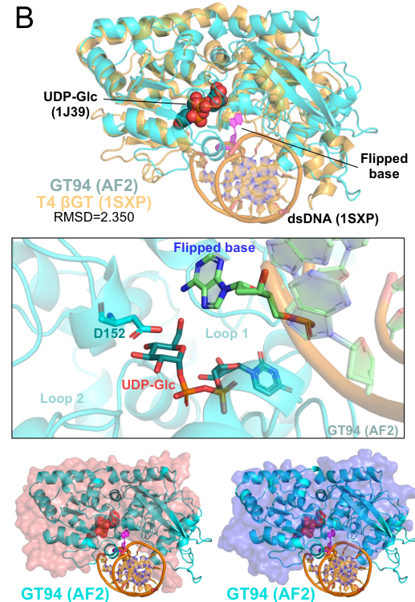

## Question

# Gene Research for Functional Annotation

## ⚠️ CRITICAL: Gene/Protein Identification Context

**BEFORE YOU BEGIN RESEARCH:** You MUST verify you are researching the CORRECT gene/protein. Gene symbols can be ambiguous, especially for less well-characterized genes from non-model organisms.

### Target Gene/Protein Identity (from UniProt):
- **UniProt Accession:** P04519
- **Protein Description:** RecName: Full=DNA alpha-glucosyltransferase; Short=AGT; Short=Alpha-GT; EC=2.4.1.26 {ECO:0000269|PubMed:6078540};
- **Gene Information:** Name=agt;
- **Organism (full):** Enterobacteria phage T4 (Bacteriophage T4).
- **Protein Family:** Not specified in UniProt
- **Key Domains:** DNA_alpha-glucosyltransferase. (IPR016223); AGT (PF11440)

### MANDATORY VERIFICATION STEPS:

1. **Check if the gene symbol "agt" matches the protein description above**
2. **Verify the organism is correct:** Enterobacteria phage T4 (Bacteriophage T4).
3. **Check if protein family/domains align with what you find in literature**
4. **If you find literature for a DIFFERENT gene with the same or similar symbol, STOP**

### If Gene Symbol is Ambiguous or You Cannot Find Relevant Literature:

**DO NOT PROCEED WITH RESEARCH ON A DIFFERENT GENE.** Instead:
- State clearly: "The gene symbol 'agt' is ambiguous or literature is limited for this specific protein"
- Explain what you found (e.g., "Found extensive literature on a different gene with the same symbol in a different organism")
- Describe the protein based ONLY on the UniProt information provided above
- Suggest that the protein function can be inferred from domain/family information

### Research Target:

Please provide a comprehensive research report on the gene **agt** (gene ID: agt, UniProt: P04519) in BPT4.

The research report should be a detailed narrative explaining the function, biological processes, and localization of the gene product. Citations should be given for all claims.

You should prioritize authoritative reviews and primary scientific literature when conducting research. You can supplement
this with annotations you find in gene/protein databases, but these can be outdated or inaccurate.

We are specifically interested in the primary function of the gene - for enzymes, what reaction is catalyzed, and what is the substrate specificity? For transporters, what is the substrate? For structural proteins or adapters, what is the broader structural role? For signaling molecules, what is the role in the pathway.

We are interested in where in or outside the cell the gene product carries out its function.

We are also interested in the signaling or biochemical pathways in which the gene functions. We are less interested in broad pleiotropic effects, except where these elucidate the precise role.

Include evidence where possible. We are interested in both experimental evidence as well as inference from structure, evolution, or bioinformatic analysis. Precise studies should be prioritized over high-throughput, where available.

## Output

Question: You are an expert researcher providing comprehensive, well-cited information.

Provide detailed information focusing on:
1. Key concepts and definitions with current understanding
2. Recent developments and latest research (prioritize 2023-2024 sources)
3. Current applications and real-world implementations
4. Expert opinions and analysis from authoritative sources
5. Relevant statistics and data from recent studies

Format as a comprehensive research report with proper citations. Include URLs and publication dates where available.
Always prioritize recent, authoritative sources and provide specific citations for all major claims.

# Gene Research for Functional Annotation

## ⚠️ CRITICAL: Gene/Protein Identification Context

**BEFORE YOU BEGIN RESEARCH:** You MUST verify you are researching the CORRECT gene/protein. Gene symbols can be ambiguous, especially for less well-characterized genes from non-model organisms.

### Target Gene/Protein Identity (from UniProt):
- **UniProt Accession:** P04519
- **Protein Description:** RecName: Full=DNA alpha-glucosyltransferase; Short=AGT; Short=Alpha-GT; EC=2.4.1.26 {ECO:0000269|PubMed:6078540};
- **Gene Information:** Name=agt;
- **Organism (full):** Enterobacteria phage T4 (Bacteriophage T4).
- **Protein Family:** Not specified in UniProt
- **Key Domains:** DNA_alpha-glucosyltransferase. (IPR016223); AGT (PF11440)

### MANDATORY VERIFICATION STEPS:

1. **Check if the gene symbol "agt" matches the protein description above**
2. **Verify the organism is correct:** Enterobacteria phage T4 (Bacteriophage T4).
3. **Check if protein family/domains align with what you find in literature**
4. **If you find literature for a DIFFERENT gene with the same or similar symbol, STOP**

### If Gene Symbol is Ambiguous or You Cannot Find Relevant Literature:

**DO NOT PROCEED WITH RESEARCH ON A DIFFERENT GENE.** Instead:
- State clearly: "The gene symbol 'agt' is ambiguous or literature is limited for this specific protein"
- Explain what you found (e.g., "Found extensive literature on a different gene with the same symbol in a different organism")
- Describe the protein based ONLY on the UniProt information provided above
- Suggest that the protein function can be inferred from domain/family information

### Research Target:

Please provide a comprehensive research report on the gene **agt** (gene ID: agt, UniProt: P04519) in BPT4.

The research report should be a detailed narrative explaining the function, biological processes, and localization of the gene product. Citations should be given for all claims.

You should prioritize authoritative reviews and primary scientific literature when conducting research. You can supplement
this with annotations you find in gene/protein databases, but these can be outdated or inaccurate.

We are specifically interested in the primary function of the gene - for enzymes, what reaction is catalyzed, and what is the substrate specificity? For transporters, what is the substrate? For structural proteins or adapters, what is the broader structural role? For signaling molecules, what is the role in the pathway.

We are interested in where in or outside the cell the gene product carries out its function.

We are also interested in the signaling or biochemical pathways in which the gene functions. We are less interested in broad pleiotropic effects, except where these elucidate the precise role.

Include evidence where possible. We are interested in both experimental evidence as well as inference from structure, evolution, or bioinformatic analysis. Precise studies should be prioritized over high-throughput, where available.

## Research report: **agt** (UniProt **P04519**) — DNA **α-glucosyltransferase** of *Enterobacteria phage T4*

### 1) Target verification (critical disambiguation)
The gene symbol **agt** is ambiguous across biology (e.g., bacterial metabolic genes, mammalian AGT enzymes). Here, the correct target is **Enterobacteria phage T4** gene **agt**, encoding the phage DNA **α-glucosyltransferase** that modifies phage genomic DNA. Recent work on T-even phages explicitly identifies **agt** and **bgt** as the genes encoding the **α-** and **β-glucosyltransferases**, respectively, that glucosylate 5-hydroxymethylcytosine in phage DNA (gomez2024avibriocholerae pages 2-5). Classical structural/biochemical literature on T4 DNA glucosylation likewise distinguishes **AGT** (α-glucosyltransferase) from **BGT** (β-glucosyltransferase) as the two enzymes responsible for T4 DNA glucosylation (morera1999t4phagebetaglucosyltransferase pages 1-2).

**Conclusion:** The literature retrieved matches the UniProt identity: phage T4 DNA α-glucosyltransferase (“AGT/αGT”) encoded by **agt**, acting in the T4 DNA cytosine hypermodification pathway (gomez2024avibriocholerae pages 2-5, morera1999t4phagebetaglucosyltransferase pages 1-2).

### 2) Key concepts and definitions (current understanding)
#### 2.1 T4 cytosine hypermodification and “epigenetic-like” DNA protection
T-even phages such as T4 replace cytosine with **5-hydroxymethylcytosine (5hmC/5hmdC)** during DNA replication and then further **glucosylate** this modified base to form **glucosylated 5hmdC (5ghmdC)**, producing a heavily modified genome that alters interactions with host defense nucleases and other DNA-binding proteins (pozhydaieva2024molecularstrategiesapplied pages 24-27, pozhydaieva2024temporalepigenomemodulation pages 9-10).

#### 2.2 Enzyme definitions: AGT vs BGT
T4 encodes **two** DNA glucosyltransferases:
- **AGT (α-glucosyltransferase; product has an α-glycosidic linkage)**
- **BGT (β-glucosyltransferase; product has a β-glycosidic linkage)**

This stereochemical division is explicitly described in the T4 βGT literature, which contrasts βGT to its “counterpart α-glucosyltransferase (AGT)” and notes α vs β linkage outcomes (morera1999t4phagebetaglucosyltransferase pages 1-2).

### 3) Primary function and pathway position of T4 **Agt (DNA α-glucosyltransferase)**
#### 3.1 Reaction chemistry and substrates
UniProt annotates P04519 as **DNA α-glucosyltransferase (EC 2.4.1.26)** (user-provided context). While the best direct mechanistic detail in the retrieved corpus is for the T4 **βGT** enzyme, the paired-system chemistry is well-established: βGT catalyzes glucose transfer **from UDP-glucose (UDP-Glc)** to 5-hydroxymethylcytosine in **double-stranded DNA**, releasing UDP (morera1999t4phagebetaglucosyltransferase pages 1-2). The same donor substrate pool (UDP-Glc) is implicated broadly for T4 DNA glucosylation and is shown bound in structural representations of T4 βGT (pyle2024virusencodedglycosyltransferaseshypermodify media 44dd7acd).

**Core biochemical principles for T4 agt functional annotation:**
- **Acceptor substrate:** 5hmdC/5hmC **within duplex phage DNA** (post-replication modification) (pozhydaieva2024molecularstrategiesapplied pages 24-27, morera1999t4phagebetaglucosyltransferase pages 1-2).
- **Donor substrate:** **UDP-glucose** (UDP-Glc) (morera1999t4phagebetaglucosyltransferase pages 1-2).
- **Enzymatic role:** installation of a **glucose** on the hydroxymethyl group of 5hmdC to generate **glucosylated 5hmdC**, specifically the **α-anomeric linkage** for AGT (and β linkage for BGT) (morera1999t4phagebetaglucosyltransferase pages 1-2, gomez2024avibriocholerae pages 2-5).

#### 3.2 Pathway ordering (where Agt acts)
A 2024 thesis describing T4 infection biochemistry lays out pathway ordering: dCMP is hydroxymethylated by **Gp42** to 5hmdCMP, phosphorylated by **Gp1** to 5hmdCTP, incorporated into DNA during replication, and then **“exclusively glycosylated” after incorporation** to yield 5-α/β-glycosylhydroxymethyl-2′-deoxycytidines (pozhydaieva2024molecularstrategiesapplied pages 24-27). This supports that **Agt acts on DNA (not on free nucleotides)**.

#### 3.3 Biological process/role
Glucosylation of 5hmdC is described as a defensive strategy: these bulky glycosyl modifications **protect phage DNA from host nucleases** and help distinguish phage DNA from host DNA (pozhydaieva2024molecularstrategiesapplied pages 24-27). In 2024 experimental work aimed at engineering T4, authors reiterate that 5ghmdC modifications impede recognition/targeting by host nucleases and CRISPR-Cas systems, motivating strategies to transiently reduce modification for genome editing (pozhydaieva2024temporalepigenomemodulation pages 9-10, pozhydaieva2024temporalepigenomemodulation pages 1-2).

### 4) Localization and timing in infection
Direct subcellular localization experiments for Agt were not found in the retrieved texts; however, the pathway evidence indicates Agt functions **in the infected bacterial cytoplasm on replicating/progeny phage DNA**, because glucosylation occurs **after 5hmdC is incorporated into DNA** (pozhydaieva2024molecularstrategiesapplied pages 24-27) and because modulation experiments (NgTET expression during infection) alter the chemical composition of progeny phage DNA (pozhydaieva2024temporalepigenomemodulation pages 9-10). Thus, Agt’s functional localization is best annotated as **intracellular, acting on phage genomic DNA during/after replication (post-replicative DNA modification step)** (pozhydaieva2024molecularstrategiesapplied pages 24-27, pozhydaieva2024temporalepigenomemodulation pages 9-10).

### 5) Mechanistic and structural evidence (and what is AGT-specific vs system-level)
Because modern structural work in the retrieved set heavily emphasizes **T4 βGT**, several mechanistic points are best viewed as **system-level analogies** rather than AGT-specific proof.

#### 5.1 DNA engagement: base flipping as a mechanistic paradigm
A 2024 preprint figure compilation includes a structure depiction of **T4 βGT (PDB: 1SXP)** bound to dsDNA, explicitly labeling **UDP-Glc** and the **flipped base** at the active site (pyle2024virusencodedglycosyltransferaseshypermodify media 44dd7acd). Classic βGT structural work proposes and supports a **base-flipping mechanism** to access the target base within duplex DNA (morera1999t4phagebetaglucosyltransferase pages 1-2, lariviere2002abaseflippingmechanism pages 1-2).

#### 5.2 Donor binding and catalytic residues (βGT benchmark)
βGT binds UDP-Glc in a pocket between its two lobes, and mechanistic proposals identify candidate catalytic residues near the anomeric carbon (e.g., Asp100 and Glu22 positions reported in one structural analysis) (morera1999t4phagebetaglucosyltransferase pages 6-7). Later structural/mechanistic work supports a direct displacement/inverting mechanism for βGT and identifies **Asp100** as the catalytic base, with the D100A mutant preventing glucose hydrolysis (lariviere2003crystalstructuresof pages 1-3). 

**Interpretation for agt annotation:** these findings robustly define how the *T4 DNA glucosyltransferase system* can catalyze sugar transfer onto 5hmdC in duplex DNA, but they do not by themselves prove AGT uses identical residues or mechanism. The most AGT-specific functional distinction available here is the **α-linkage** product stereochemistry and its encoding by **agt** (gomez2024avibriocholerae pages 2-5, morera1999t4phagebetaglucosyltransferase pages 1-2).

### 6) Quantitative data and statistics (recent + foundational)
#### 6.1 How modified is wild-type T4 DNA?
A 2024 study quantifying nucleosides by LC–MS reports that wild-type T4 DNA contains **>99%** of 2′-deoxycytidines as **5ghmdC** (glucosylated hydroxymethyldeoxycytidine) (pozhydaieva2024temporalepigenomemodulation pages 9-10). This indicates that Agt/Bgt-mediated glycosylation is near-complete in mature genomes.

#### 6.2 Experimental perturbation: transient “demodification” to enable phage genome engineering (2024)
Pozhydaieva et al. (2024) expressed a eukaryotic **NgTET** enzyme during infection to compete with α/β glucosyltransferases for the 5hmdC substrate and transiently reduce glucosylation. They report a shift from ~99% 5ghmdC to **55% 5ghmdC**, alongside **34.4% unmodified dC**, **10.5% 5hmdC**, **2.3% 5fdC**, and **0.9% 5cadC** in progeny DNA (pozhydaieva2024temporalepigenomemodulation pages 9-10). This treatment also delayed lysis onset by **~15 minutes** while still causing complete lysis (pozhydaieva2024temporalepigenomemodulation pages 9-10). In the same work, the authors report phage mutagenesis efficiencies **up to 6%** enabled by this temporal epigenome modulation strategy (pozhydaieva2024temporalepigenomemodulation pages 17-19).

#### 6.3 Enzymology benchmark (βGT as the best-quantified paired enzyme)
Although not AGT-specific, the best kinetic benchmark for the T4 glucosyltransferase pair comes from recombinant βGT characterization: **Km(5hmC DNA) ~0.41 μM**, **Km(UDP-glucose) ~16 μM**, **kcat ~77 min⁻¹** on fully hmC-substituted T4-gt DNA, with product inhibition **Ki(UDP) ~9 μM** and **Ki(5ghmC DNA) ~4 μM**. βGT is described as **nonprocessive/distributive**, and 5hmC DNA binds ~**10×** stronger than the glucosylated product (terragni2012biochemicalcharacterizationof pages 4-6, terragni2012biochemicalcharacterizationof pages 1-2). These parameters are frequently used as quantitative context in applications employing T4 βGT.

### 7) Recent developments (2023–2024 emphasis)
#### 7.1 Bacterial counter-defenses targeting glucosylated phage DNA (2024)
A 2024 *Journal of Bacteriology* study identifies a **Vibrio cholerae** Type IV restriction module (**TgvAB**, GmrSD-like) that targets **glucosylated 5hmC** in T-even phage DNA. A cosmid clone containing a 16.8 kb region conferred complete protection against multiple coliphages including **T2, T4, T5, T6** (gomez2024avibriocholerae pages 2-5). Critically for Agt annotation, the authors state that phages can escape this defense by acquiring null mutations in **agt and/or bgt**, encoding the **α- and β-glucosyltransferases** that glucosylate 5hmC (gomez2024avibriocholerae pages 2-5). This provides modern, genetics-based confirmation that agt-driven DNA glucosylation remains central in current arms-race ecology.

#### 7.2 Phage engineering: overcoming cytosine glycosylation barriers to CRISPR editing (2024)
A 2024 PLOS Genetics preprint describes a strategy to **temporarily reduce** T4 DNA modifications to facilitate Cas nuclease cleavage and enhance mutagenesis, avoiding permanent fitness costs of glucosyltransferase deletions (pozhydaieva2024temporalepigenomemodulation pages 1-2, pozhydaieva2024temporalepigenomemodulation pages 17-19). Quantitative base-composition changes and mutagenesis efficiencies are reported (pozhydaieva2024temporalepigenomemodulation pages 9-10, pozhydaieva2024temporalepigenomemodulation pages 17-19).

#### 7.3 Expansion of the “DNA glycan” concept across viruses (2024)
A 2024 bioRxiv study synthesizes evidence that virus-encoded glycosyltransferases commonly append diverse glycans onto 5hmC in viral genomes and provides structural context for T4 βGT, including depiction of UDP-Glc binding and base flipping in the T4 βGT–DNA complex (pyle2024virusencodedglycosyltransferaseshypermodify media 44dd7acd, pyle2024virusencodedglycosyltransferaseshypermodify pages 1-6). This situates T4 Agt (αGT) within a broader and rapidly expanding class of viral “DNA-hypermodifying” glycosyltransferases.

### 8) Current applications and real-world implementations
#### 8.1 5hmC profiling and mapping tools leveraging T4 glycosyltransferase chemistry
A 2024 *Chemical Society Reviews* article summarizes widely used analytical strategies in which enzymatic glycosylation of 5hmC (commonly using T4 βGT activity) enables selective enrichment and mapping, including:
- Use of **azide-derivatized glucose** transferred to 5hmC followed by **click chemistry** for oligo/biotin attachment (kriukiene20245hydroxymethylcytosinethemany pages 10-11).
- Restriction-enzyme assays where **BGT-directed glycosylation** makes certain sites resistant to cleavage (e.g., **ChmCGG** sites resistant to **MspI**) enabling enrichment and downstream readout (qPCR, microarrays, NGS) (kriukiene20245hydroxymethylcytosinethemany pages 10-11).
This is a mature, real-world biotechnology application of the T4 glucosyltransferase system, even when implemented with recombinant enzymes and modified sugar donors.

#### 8.2 Genome engineering workflows for modified-DNA phages
The 2024 T4 engineering work operationalizes “epigenome modulation” (temporary modification reduction) to enable editing and functional analysis of modified phage genomes (pozhydaieva2024temporalepigenomemodulation pages 1-2, pozhydaieva2024temporalepigenomemodulation pages 17-19). This is a practical implementation relevant to phage therapy/synthetic biology workflows where modified genomes impede standard editing and sequencing.

### 9) Expert interpretation and authoritative analysis
The combined 2024 literature supports a coherent view of **Agt** as a central component of the phage’s DNA chemical camouflage system:
- **Defensive benefit:** near-complete glucosylation (>99% 5ghmdC) correlates with resistance to host nucleases and reduced CRISPR accessibility (pozhydaieva2024temporalepigenomemodulation pages 9-10).
- **Tradeoffs:** host bacteria can evolve or acquire systems that specifically recognize and restrict glucosylated DNA, selecting for loss-of-function in **agt/bgt** at a cost (susceptibility to defenses recognizing unglucosylated 5hmC) (gomez2024avibriocholerae pages 2-5).
- **Engineering leverage:** transiently perturbing this pathway (rather than deleting it) enables genome editing while preserving phage viability and avoiding permanent fitness penalties (pozhydaieva2024temporalepigenomemodulation pages 17-19).

### 10) Evidence summary table
The following table consolidates key annotation facts, with URLs and publication dates.

| Aspect | Evidence-based statement | Key source (author-year) | URL | Publication date |
|---|---|---|---|---|
| Target identity | In the correct T4 context, **agt** is the gene for the **α-glucosyltransferase (AGT)**, distinct from **bgt**, which encodes the **β-glucosyltransferase (BGT)** acting on glucosylated 5hmC/hmC-containing T-even phage DNA; recent work explicitly states agt and bgt encode the α- and β-glucosyltransferases, respectively. (gomez2024avibriocholerae pages 2-5, morera1999t4phagebetaglucosyltransferase pages 1-2) | Gomez & Waters 2024; Moréra et al. 1999 | https://doi.org/10.1128/jb.00143-24 ; https://doi.org/10.1006/jmbi.1999.3094 | 2024-09; 1999-09 |
| Enzymatic reaction | By UniProt annotation, AGT is **DNA alpha-glucosyltransferase, EC 2.4.1.26**. In the T4 DNA-glucosylation pathway, the analogous BGT reaction is explicitly documented as **UDP-glucose + 5-HMC-DNA → glucosyl-HMC-DNA + UDP**, supporting AGT as the enzyme that transfers glucose from UDP-glucose to 5-hydroxymethylcytosine in DNA but forming the **α** linkage rather than the β linkage. (morera1999t4phagebetaglucosyltransferase pages 1-2) | Moréra et al. 1999 | https://doi.org/10.1006/jmbi.1999.3094 | 1999-09 |
| Acceptor substrate | The T4 glucosyltransferases act on **5-hydroxymethylcytosine (5-HMC/5hmdC) already incorporated into duplex DNA**, not on free nucleotide before DNA synthesis; post-incorporation glycosylation yields **5-α/β-glycosylhydroxymethyl-2′-deoxycytidines**. (pozhydaieva2024molecularstrategiesapplied pages 24-27, morera1999t4phagebetaglucosyltransferase pages 1-2) | Pozhydaieva 2024; Moréra et al. 1999 | https://doi.org/10.17192/z2024.0117 ; https://doi.org/10.1006/jmbi.1999.3094 | 2024-06; 1999-09 |
| Donor substrate | The experimentally established sugar donor for T4 DNA glucosyltransferases is **UDP-glucose (UDP-Glc)**; structural and biochemical work on BGT shows glucose transfer with **UDP** release, and Pyle 2024 shows T4 βGT bound to **UDP-Glc** in structural analysis. (morera1999t4phagebetaglucosyltransferase pages 6-7, morera1999t4phagebetaglucosyltransferase pages 1-2, pyle2024virusencodedglycosyltransferaseshypermodify pages 57-60) | Moréra et al. 1999; Pyle et al. 2024 | https://doi.org/10.1006/jmbi.1999.3094 ; https://doi.org/10.1101/2023.12.21.572611 | 1999-09; 2024-12 |
| Stereochemical specificity | T4 encodes **two** DNA glucosyltransferases with different stereochemical outcomes: **AGT forms α-glycosidic linkages** and **BGT forms β-glycosidic linkages** on 5-HMC in DNA. This is the key functional distinction between agt and bgt. (morera1999t4phagebetaglucosyltransferase pages 1-2, gomez2024avibriocholerae pages 2-5) | Moréra et al. 1999; Gomez & Waters 2024 | https://doi.org/10.1006/jmbi.1999.3094 ; https://doi.org/10.1128/jb.00143-24 | 1999-09; 2024-09 |
| Pathway position | T4 first hydroxymethylates dCMP via **gp42**, then phosphorylates 5hmdCMP via **gp1** to 5hmdCTP, incorporates 5hmdC during replication, and only **after DNA incorporation** do the α/β glucosyltransferases convert it to glucosylated 5hmdC. (pozhydaieva2024molecularstrategiesapplied pages 24-27, pozhydaieva2024temporalepigenomemodulation pages 9-10) | Pozhydaieva 2024 | https://doi.org/10.17192/z2024.0117 ; https://doi.org/10.1101/2024.01.28.577628 | 2024-06; 2024-01 |
| Biological role | DNA glucosylation is a phage counter-defense that helps T4 DNA evade host nucleases/restriction systems; recent studies show a tradeoff because phages that lose agt and/or bgt escape some defenses targeting glucosylated DNA but become susceptible to systems recognizing unglucosylated 5hmC. (pozhydaieva2024temporalepigenomemodulation pages 9-10, gomez2024avibriocholerae pages 2-5) | Pozhydaieva et al. 2024; Gomez & Waters 2024 | https://doi.org/10.1101/2024.01.28.577628 ; https://doi.org/10.1128/jb.00143-24 | 2024-01; 2024-09 |
| Recent mechanistic perspective | Recent comparative work places T4 βGT among phage DNA-hypermodifying glycosyltransferases and shows **UDP-Glc binding** plus a **flipped-base** configuration in structural representations (PDB 1SXP), reinforcing a base-access mechanism likely relevant to T4 DNA glucosyltransferases generally. (pyle2024virusencodedglycosyltransferaseshypermodify pages 57-60, pyle2024virusencodedglycosyltransferaseshypermodify media 44dd7acd) | Pyle et al. 2024 | https://doi.org/10.1101/2023.12.21.572611 | 2024-12 |
| Structural fold/mechanism (inferred mainly from BGT) | T4 BGT is a **GT-B fold** enzyme with donor nucleotide-sugar binding mainly in the **C-terminal domain** and acceptor DNA/base binding mainly in the **N-terminal domain**; mechanistic work supports a **direct displacement/inverting** mechanism for BGT with **Asp100** as catalytic base. These data are directly for BGT but are useful mechanistic context for annotating the related T4 AGT enzyme family. (lariviere2003crystalstructuresof pages 1-3, lariviere2002abaseflippingmechanism pages 1-2, lariviere2002abaseflippingmechanism pages 5-7) | Larivière et al. 2002; Larivière et al. 2003 | https://doi.org/10.1016/S0022-2836(02)01091-4 ; https://doi.org/10.1016/S0022-2836(03)00635-1 | 2002-11; 2003-07 |
| Base-flipping/DNA recognition | Crystal studies of T4 BGT support a **base-flipping mechanism** in which the target site is accessed by flipping the modified base (or abasic surrogate) out of the DNA helix; the enzyme also bends/distorts DNA during recognition. This is the strongest structural precedent for how T4 DNA glucosyltransferases engage duplex DNA. (morera1999t4phagebetaglucosyltransferase pages 1-2, lariviere2002abaseflippingmechanism pages 1-2, lariviere2002abaseflippingmechanism pages 5-7) | Moréra et al. 1999; Larivière & Moréra 2002 | https://doi.org/10.1006/jmbi.1999.3094 ; https://doi.org/10.1016/S0022-2836(02)01091-4 | 1999-09; 2002-11 |
| Quantitative pathway state in wild-type T4 | In wild-type T4 DNA, **>99% of 2′-deoxycytidines** were reported as **5ghmdC** (glucosylated hydroxymethyldeoxycytidine), highlighting how pervasive the glucosylation pathway is in mature T4 genomes. (pozhydaieva2024temporalepigenomemodulation pages 9-10) | Pozhydaieva et al. 2024 | https://doi.org/10.1101/2024.01.28.577628 | 2024-01 |
| Quantitative perturbation data | When NgTET was expressed during infection to compete for the 5hmdC substrate, T4 DNA modification shifted from **99% to 55% 5ghmdC**, with increases in **5hmdC to 10.5%**, **5fdC to 2.3%**, **5cadC to 0.9%**, and **unmodified dC to 34.4%**. This experimentally supports that α/β-GT enzymes act on the 5hmdC precursor during infection. (pozhydaieva2024temporalepigenomemodulation pages 9-10) | Pozhydaieva et al. 2024 | https://doi.org/10.1101/2024.01.28.577628 | 2024-01 |
| Quantitative enzymology (βGT benchmark) | Recombinant T4 **βGT** shows **apparent Km ≈ 0.41 μM for 5-hmC DNA**, **apparent Km ≈ 16 μM for UDP-glucose**, and **kcat ≈ 77 min−1** on a fully hmC-substituted T4-gt DNA substrate; βGT is **nonprocessive/distributive** and 5-hmC DNA binds about **10-fold stronger** than glucosylated product DNA. These values are for βGT, not AGT, but provide the best available quantitative benchmark for the paired T4 glucosyltransferase system. (terragni2012biochemicalcharacterizationof pages 4-6, terragni2012biochemicalcharacterizationof pages 1-2) | Terragni et al. 2012 | https://doi.org/10.1021/bi2014739 | 2012-01 |
| Annotation confidence and limitation | Functional assignment of **T4 agt/P04519** as DNA **α-glucosyltransferase** is strong from the T4 genetics/pathway literature, but direct modern structural/kinetic characterization is much richer for **BGT** than for **AGT**; therefore several mechanistic notes above are informed by the homologous T4 βGT and should be treated as informed context rather than AGT-specific proof. (gomez2024avibriocholerae pages 2-5, morera1999t4phagebetaglucosyltransferase pages 1-2, lariviere2003crystalstructuresof pages 1-3) | Gomez & Waters 2024; Moréra et al. 1999; Larivière et al. 2003 | https://doi.org/10.1128/jb.00143-24 ; https://doi.org/10.1006/jmbi.1999.3094 ; https://doi.org/10.1016/S0022-2836(03)00635-1 | 2024-09; 1999-09; 2003-07 |

*Table: This table summarizes evidence-based functional annotation for bacteriophage T4 agt (UniProt P04519), including its reaction, substrates, pathway role, relationship to bgt, and the strongest available quantitative and mechanistic evidence. It is useful for separating direct AGT evidence from broader T4 glucosyltransferase system evidence, especially where βGT is the better-characterized homolog.*

### 11) Key limitations / gaps in the available corpus
1. **AGT-specific structural/kinetic data**: The retrieved mechanistic/structural and kinetic data are far richer for **T4 βGT** than for **T4 AGT**; thus, base-flipping and catalytic-residue specifics are best treated as strong precedent for the *paired system* rather than proven AGT details (lariviere2002abaseflippingmechanism pages 1-2, lariviere2003crystalstructuresof pages 1-3, terragni2012biochemicalcharacterizationof pages 4-6).
2. **Localization and expression timing**: Direct experimental localization (e.g., virion-associated vs soluble cytosolic) and temporal transcription/translation class of **agt** were not explicitly retrieved; inference is limited to pathway ordering and infection-context experiments (pozhydaieva2024molecularstrategiesapplied pages 24-27, pozhydaieva2024temporalepigenomemodulation pages 9-10).

### 12) References (URLs and publication dates)
- Gomez JB, Waters CM. *Journal of Bacteriology* (2024-09). “A Vibrio cholerae Type IV restriction system targets glucosylated 5-hydroxymethylcytosine…” https://doi.org/10.1128/jb.00143-24 (gomez2024avibriocholerae pages 2-5)
- Pozhydaieva N, et al. *PLOS Genetics* preprint (2024-01). “Temporal epigenome modulation enables efficient bacteriophage engineering…” https://doi.org/10.1101/2024.01.28.577628 (pozhydaieva2024temporalepigenomemodulation pages 9-10, pozhydaieva2024temporalepigenomemodulation pages 17-19, pozhydaieva2024temporalepigenomemodulation pages 1-2)
- Kriukienė E, Tomkuvienė M, Klimašauskas S. *Chemical Society Reviews* (2024-01). “5-hydroxymethylcytosine: the many faces…” https://doi.org/10.1039/d3cs00858d (kriukiene20245hydroxymethylcytosinethemany pages 10-11)
- Pyle JD, et al. *bioRxiv* (posted 2023-12; versioned Dec 2024 in metadata). “Virus-encoded glycosyltransferases hypermodify DNA with diverse glycans.” https://doi.org/10.1101/2023.12.21.572611 (pyle2024virusencodedglycosyltransferaseshypermodify media 44dd7acd, pyle2024virusencodedglycosyltransferaseshypermodify pages 1-6)
- Moréra S, et al. *Journal of Molecular Biology* (1999-09). “T4 phage beta-glucosyltransferase: substrate binding and proposed catalytic mechanism.” https://doi.org/10.1006/jmbi.1999.3094 (morera1999t4phagebetaglucosyltransferase pages 1-2, morera1999t4phagebetaglucosyltransferase pages 6-7)
- Terragni J, et al. *Biochemistry* (2012-01). “Biochemical Characterization of Recombinant β-Glucosyltransferase…” https://doi.org/10.1021/bi2014739 (terragni2012biochemicalcharacterizationof pages 4-6, terragni2012biochemicalcharacterizationof pages 1-2)
- Larivière L, Moréra S. *Journal of Molecular Biology* (2002-11). “A base-flipping mechanism for the T4 phage beta-glucosyltransferase…” https://doi.org/10.1016/S0022-2836(02)01091-4 (lariviere2002abaseflippingmechanism pages 1-2, lariviere2002abaseflippingmechanism pages 5-7)
- Larivière L, et al. *Journal of Molecular Biology* (2003-07). “Crystal Structures of the T4 Phage β-Glucosyltransferase…” https://doi.org/10.1016/S0022-2836(03)00635-1 (lariviere2003crystalstructuresof pages 1-3)

References

1. (gomez2024avibriocholerae pages 2-5): Jasper B. Gomez and Christopher M. Waters. A <i>vibrio cholerae</i> type iv restriction system targets glucosylated 5-hydroxymethylcytosine to protect against phage infection. Journal of Bacteriology, Sep 2024. URL: https://doi.org/10.1128/jb.00143-24, doi:10.1128/jb.00143-24. This article has 12 citations and is from a peer-reviewed journal.

2. (morera1999t4phagebetaglucosyltransferase pages 1-2): Solange Moréra, Anne Imberty, Ursula Aschke-Sonnenborn, Wolfgang Rüger, and Paul S. Freemont. T4 phage beta-glucosyltransferase: substrate binding and proposed catalytic mechanism. Journal of molecular biology, 292 3:717-30, Sep 1999. URL: https://doi.org/10.1006/jmbi.1999.3094, doi:10.1006/jmbi.1999.3094. This article has 139 citations and is from a domain leading peer-reviewed journal.

3. (pozhydaieva2024molecularstrategiesapplied pages 24-27): Nadiia Pozhydaieva. Molecular strategies applied by bacteriophage t4 for efficient hijacking of escherichia coli. Text, Jun 2024. URL: https://doi.org/10.17192/z2024.0117, doi:10.17192/z2024.0117. This article has 0 citations and is from a peer-reviewed journal.

4. (pozhydaieva2024temporalepigenomemodulation pages 9-10): Nadiia Pozhydaieva, Franziska Anna Billau, Maik Wolfram-Schauerte, Adán Andrés Ramírez Rojas, Nicole Paczia, Daniel Schindler, and Katharina Höfer. Temporal epigenome modulation enables efficient bacteriophage engineering and functional analysis of phage dna modifications. PLOS Genetics, Jan 2024. URL: https://doi.org/10.1101/2024.01.28.577628, doi:10.1101/2024.01.28.577628. This article has 10 citations and is from a domain leading peer-reviewed journal.

5. (pyle2024virusencodedglycosyltransferaseshypermodify media 44dd7acd): Jesse D. Pyle, Sean R. Lund, Katherine H. O’Toole, and Lana Saleh. Virus-encoded glycosyltransferases hypermodify dna with diverse glycans. bioRxiv, Dec 2024. URL: https://doi.org/10.1101/2023.12.21.572611, doi:10.1101/2023.12.21.572611. This article has 12 citations.

6. (pozhydaieva2024temporalepigenomemodulation pages 1-2): Nadiia Pozhydaieva, Franziska Anna Billau, Maik Wolfram-Schauerte, Adán Andrés Ramírez Rojas, Nicole Paczia, Daniel Schindler, and Katharina Höfer. Temporal epigenome modulation enables efficient bacteriophage engineering and functional analysis of phage dna modifications. PLOS Genetics, Jan 2024. URL: https://doi.org/10.1101/2024.01.28.577628, doi:10.1101/2024.01.28.577628. This article has 10 citations and is from a domain leading peer-reviewed journal.

7. (lariviere2002abaseflippingmechanism pages 1-2): Laurent Larivière and Solange Moréra. A base-flipping mechanism for the t4 phage beta-glucosyltransferase and identification of a transition-state analog. Journal of molecular biology, 324 3:483-90, Nov 2002. URL: https://doi.org/10.1016/s0022-2836(02)01091-4, doi:10.1016/s0022-2836(02)01091-4. This article has 43 citations and is from a domain leading peer-reviewed journal.

8. (morera1999t4phagebetaglucosyltransferase pages 6-7): Solange Moréra, Anne Imberty, Ursula Aschke-Sonnenborn, Wolfgang Rüger, and Paul S. Freemont. T4 phage beta-glucosyltransferase: substrate binding and proposed catalytic mechanism. Journal of molecular biology, 292 3:717-30, Sep 1999. URL: https://doi.org/10.1006/jmbi.1999.3094, doi:10.1006/jmbi.1999.3094. This article has 139 citations and is from a domain leading peer-reviewed journal.

9. (lariviere2003crystalstructuresof pages 1-3): Laurent Larivière, Virginie Gueguen-Chaignon, and Solange Moréra. Crystal structures of the t4 phage β-glucosyltransferase and the d100a mutant in complex with udp-glucose: glucose binding and identification of the catalytic base for a direct displacement mechanism. Journal of Molecular Biology, 330:1077-1086, Jul 2003. URL: https://doi.org/10.1016/s0022-2836(03)00635-1, doi:10.1016/s0022-2836(03)00635-1. This article has 85 citations and is from a domain leading peer-reviewed journal.

10. (pozhydaieva2024temporalepigenomemodulation pages 17-19): Nadiia Pozhydaieva, Franziska Anna Billau, Maik Wolfram-Schauerte, Adán Andrés Ramírez Rojas, Nicole Paczia, Daniel Schindler, and Katharina Höfer. Temporal epigenome modulation enables efficient bacteriophage engineering and functional analysis of phage dna modifications. PLOS Genetics, Jan 2024. URL: https://doi.org/10.1101/2024.01.28.577628, doi:10.1101/2024.01.28.577628. This article has 10 citations and is from a domain leading peer-reviewed journal.

11. (terragni2012biochemicalcharacterizationof pages 4-6): Jolyon Terragni, Jurate Bitinaite, Yu Zheng, and Sriharsa Pradhan. Biochemical characterization of recombinant β-glucosyltransferase and analysis of global 5-hydroxymethylcytosine in unique genomes. Biochemistry, 51:1009-1019, Jan 2012. URL: https://doi.org/10.1021/bi2014739, doi:10.1021/bi2014739. This article has 71 citations and is from a peer-reviewed journal.

12. (terragni2012biochemicalcharacterizationof pages 1-2): Jolyon Terragni, Jurate Bitinaite, Yu Zheng, and Sriharsa Pradhan. Biochemical characterization of recombinant β-glucosyltransferase and analysis of global 5-hydroxymethylcytosine in unique genomes. Biochemistry, 51:1009-1019, Jan 2012. URL: https://doi.org/10.1021/bi2014739, doi:10.1021/bi2014739. This article has 71 citations and is from a peer-reviewed journal.

13. (pyle2024virusencodedglycosyltransferaseshypermodify pages 1-6): Jesse D. Pyle, Sean R. Lund, Katherine H. O’Toole, and Lana Saleh. Virus-encoded glycosyltransferases hypermodify dna with diverse glycans. bioRxiv, Dec 2024. URL: https://doi.org/10.1101/2023.12.21.572611, doi:10.1101/2023.12.21.572611. This article has 12 citations.

14. (kriukiene20245hydroxymethylcytosinethemany pages 10-11): Edita Kriukienė, Miglė Tomkuvienė, and Saulius Klimašauskas. 5-hydroxymethylcytosine: the many faces of the sixth base of mammalian dna. Chemical Society reviews, 53:2264-2283, Jan 2024. URL: https://doi.org/10.1039/d3cs00858d, doi:10.1039/d3cs00858d. This article has 44 citations and is from a highest quality peer-reviewed journal.

15. (pyle2024virusencodedglycosyltransferaseshypermodify pages 57-60): Jesse D. Pyle, Sean R. Lund, Katherine H. O’Toole, and Lana Saleh. Virus-encoded glycosyltransferases hypermodify dna with diverse glycans. bioRxiv, Dec 2024. URL: https://doi.org/10.1101/2023.12.21.572611, doi:10.1101/2023.12.21.572611. This article has 12 citations.

16. (lariviere2002abaseflippingmechanism pages 5-7): Laurent Larivière and Solange Moréra. A base-flipping mechanism for the t4 phage beta-glucosyltransferase and identification of a transition-state analog. Journal of molecular biology, 324 3:483-90, Nov 2002. URL: https://doi.org/10.1016/s0022-2836(02)01091-4, doi:10.1016/s0022-2836(02)01091-4. This article has 43 citations and is from a domain leading peer-reviewed journal.

## Artifacts

- [Edison artifact artifact-00](agt-deep-research-falcon_artifacts/artifact-00.md)

## Citations

1. gomez2024avibriocholerae pages 2-5
2. pozhydaieva2024molecularstrategiesapplied pages 24-27
3. pozhydaieva2024temporalepigenomemodulation pages 9-10
4. lariviere2003crystalstructuresof pages 1-3
5. pozhydaieva2024temporalepigenomemodulation pages 17-19
6. pozhydaieva2024temporalepigenomemodulation pages 1-2
7. lariviere2002abaseflippingmechanism pages 1-2
8. terragni2012biochemicalcharacterizationof pages 4-6
9. terragni2012biochemicalcharacterizationof pages 1-2
10. pyle2024virusencodedglycosyltransferaseshypermodify pages 1-6
11. pyle2024virusencodedglycosyltransferaseshypermodify pages 57-60
12. lariviere2002abaseflippingmechanism pages 5-7
13. https://doi.org/10.1128/jb.00143-24
14. https://doi.org/10.1006/jmbi.1999.3094
15. https://doi.org/10.17192/z2024.0117
16. https://doi.org/10.1101/2023.12.21.572611
17. https://doi.org/10.1101/2024.01.28.577628
18. https://doi.org/10.1016/S0022-2836(02
19. https://doi.org/10.1016/S0022-2836(03
20. https://doi.org/10.1021/bi2014739
21. https://doi.org/10.1039/d3cs00858d
22. https://doi.org/10.1128/jb.00143-24,
23. https://doi.org/10.1006/jmbi.1999.3094,
24. https://doi.org/10.17192/z2024.0117,
25. https://doi.org/10.1101/2024.01.28.577628,
26. https://doi.org/10.1101/2023.12.21.572611,
27. https://doi.org/10.1016/s0022-2836(02
28. https://doi.org/10.1016/s0022-2836(03
29. https://doi.org/10.1021/bi2014739,
30. https://doi.org/10.1039/d3cs00858d,