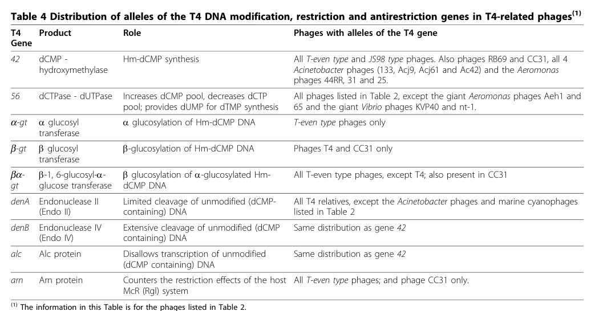

## Question

# Gene Research for Functional Annotation

## ⚠️ CRITICAL: Gene/Protein Identification Context

**BEFORE YOU BEGIN RESEARCH:** You MUST verify you are researching the CORRECT gene/protein. Gene symbols can be ambiguous, especially for less well-characterized genes from non-model organisms.

### Target Gene/Protein Identity (from UniProt):
- **UniProt Accession:** P39510
- **Protein Description:** RecName: Full=Anti-restriction endonuclease; AltName: Full=Anti-rgl nuclease;
- **Gene Information:** Name=arn; Synonyms=asiA.1, motA.-6;
- **Organism (full):** Enterobacteria phage T4 (Bacteriophage T4).
- **Protein Family:** Not specified in UniProt
- **Key Domains:** Anti-Restrict_Endo_sf. (IPR053757); Arn. (IPR054385); DM_Arn (PF22134)

### MANDATORY VERIFICATION STEPS:

1. **Check if the gene symbol "arn" matches the protein description above**
2. **Verify the organism is correct:** Enterobacteria phage T4 (Bacteriophage T4).
3. **Check if protein family/domains align with what you find in literature**
4. **If you find literature for a DIFFERENT gene with the same or similar symbol, STOP**

### If Gene Symbol is Ambiguous or You Cannot Find Relevant Literature:

**DO NOT PROCEED WITH RESEARCH ON A DIFFERENT GENE.** Instead:
- State clearly: "The gene symbol 'arn' is ambiguous or literature is limited for this specific protein"
- Explain what you found (e.g., "Found extensive literature on a different gene with the same symbol in a different organism")
- Describe the protein based ONLY on the UniProt information provided above
- Suggest that the protein function can be inferred from domain/family information

### Research Target:

Please provide a comprehensive research report on the gene **arn** (gene ID: arn, UniProt: P39510) in BPT4.

The research report should be a detailed narrative explaining the function, biological processes, and localization of the gene product. Citations should be given for all claims.

You should prioritize authoritative reviews and primary scientific literature when conducting research. You can supplement
this with annotations you find in gene/protein databases, but these can be outdated or inaccurate.

We are specifically interested in the primary function of the gene - for enzymes, what reaction is catalyzed, and what is the substrate specificity? For transporters, what is the substrate? For structural proteins or adapters, what is the broader structural role? For signaling molecules, what is the role in the pathway.

We are interested in where in or outside the cell the gene product carries out its function.

We are also interested in the signaling or biochemical pathways in which the gene functions. We are less interested in broad pleiotropic effects, except where these elucidate the precise role.

Include evidence where possible. We are interested in both experimental evidence as well as inference from structure, evolution, or bioinformatic analysis. Precise studies should be prioritized over high-throughput, where available.

## Output

Question: You are an expert researcher providing comprehensive, well-cited information.

Provide detailed information focusing on:
1. Key concepts and definitions with current understanding
2. Recent developments and latest research (prioritize 2023-2024 sources)
3. Current applications and real-world implementations
4. Expert opinions and analysis from authoritative sources
5. Relevant statistics and data from recent studies

Format as a comprehensive research report with proper citations. Include URLs and publication dates where available.
Always prioritize recent, authoritative sources and provide specific citations for all major claims.

# Gene Research for Functional Annotation

## ⚠️ CRITICAL: Gene/Protein Identification Context

**BEFORE YOU BEGIN RESEARCH:** You MUST verify you are researching the CORRECT gene/protein. Gene symbols can be ambiguous, especially for less well-characterized genes from non-model organisms.

### Target Gene/Protein Identity (from UniProt):
- **UniProt Accession:** P39510
- **Protein Description:** RecName: Full=Anti-restriction endonuclease; AltName: Full=Anti-rgl nuclease;
- **Gene Information:** Name=arn; Synonyms=asiA.1, motA.-6;
- **Organism (full):** Enterobacteria phage T4 (Bacteriophage T4).
- **Protein Family:** Not specified in UniProt
- **Key Domains:** Anti-Restrict_Endo_sf. (IPR053757); Arn. (IPR054385); DM_Arn (PF22134)

### MANDATORY VERIFICATION STEPS:

1. **Check if the gene symbol "arn" matches the protein description above**
2. **Verify the organism is correct:** Enterobacteria phage T4 (Bacteriophage T4).
3. **Check if protein family/domains align with what you find in literature**
4. **If you find literature for a DIFFERENT gene with the same or similar symbol, STOP**

### If Gene Symbol is Ambiguous or You Cannot Find Relevant Literature:

**DO NOT PROCEED WITH RESEARCH ON A DIFFERENT GENE.** Instead:
- State clearly: "The gene symbol 'arn' is ambiguous or literature is limited for this specific protein"
- Explain what you found (e.g., "Found extensive literature on a different gene with the same symbol in a different organism")
- Describe the protein based ONLY on the UniProt information provided above
- Suggest that the protein function can be inferred from domain/family information

### Research Target:

Please provide a comprehensive research report on the gene **arn** (gene ID: arn, UniProt: P39510) in BPT4.

The research report should be a detailed narrative explaining the function, biological processes, and localization of the gene product. Citations should be given for all claims.

You should prioritize authoritative reviews and primary scientific literature when conducting research. You can supplement
this with annotations you find in gene/protein databases, but these can be outdated or inaccurate.

We are specifically interested in the primary function of the gene - for enzymes, what reaction is catalyzed, and what is the substrate specificity? For transporters, what is the substrate? For structural proteins or adapters, what is the broader structural role? For signaling molecules, what is the role in the pathway.

We are interested in where in or outside the cell the gene product carries out its function.

We are also interested in the signaling or biochemical pathways in which the gene functions. We are less interested in broad pleiotropic effects, except where these elucidate the precise role.

Include evidence where possible. We are interested in both experimental evidence as well as inference from structure, evolution, or bioinformatic analysis. Precise studies should be prioritized over high-throughput, where available.

# Research report: **arn (Arn/urn) anti-restriction endonuclease** from *Enterobacteria phage T4* (UniProt **P39510**)

## 0. Executive summary
The *Enterobacteria* phage T4 gene **arn** (historically also called **urn**; UniProt P39510 describes an “anti-restriction endonuclease/anti-rgl nuclease”) is best supported as a **phage-encoded anti-restriction (anti-Rgl/Mcr) factor** that counteracts host restriction of T4 DNA, especially in the context of host systems that target unprotected or improperly modified phage DNA. Comparative genomics explicitly annotates **arn** as countering the host **McR (Rgl)** restriction system. (petrov2010genomesofthe pages 12-13, petrov2010genomesofthe media 176db08c)

Classic infection genetics show that when T4 DNA is **nonglucosylated (glu−)** and enters **rgl+** hosts, host endonucleolytic cleavage can **directly inactivate arn/urn expression**, implying the gene’s protective effect must occur **very early** (within minutes) after infection to be effective. (dharmalingam1979restrictioninvivo. pages 6-8)

A key limitation of the current evidence base available here is that, despite strong genetic/phenotypic support for an anti-restriction role, the **precise biochemical reaction, substrate specificity, and catalytic mechanism** of the Arn protein are **not clearly established** in the retrieved primary literature excerpts. Modern reviews contextualize Arn within a broader class of phage anti-restriction factors and state that it uses a **DNA-mimic principle** similar to T7 Ocr. (gao2023bacteriophagestrategiesfor pages 3-4, gao2023bacteriophagestrategiesfor pages 4-5)

## 1. Mandatory verification: gene/protein identity and disambiguation
### 1.1 Target identity matches T4 anti-restriction arn/urn
The retrieved primary T4 restriction-alleviation literature describes an “anti-restriction endonuclease” named **urn** and explicitly connects it to inhibition/inactivation of host restriction activities in **rgl+** hosts during T4 infection. This matches the UniProt description provided for accession **P39510** (“Anti-restriction endonuclease; Anti-rgl nuclease”). (dharmalingam1979restrictioninvivo. pages 1-2, dharmalingam1979restrictioninvivo. pages 6-8)

A widely cited comparative genomics review of T4-like phages lists **T4 gene arn**, product “Arn protein,” and role “**Counters the restriction effects of the host McR (Rgl) system**,” firmly tying the symbol **arn** to this phage anti-restriction function in the *T4* organism context. (petrov2010genomesofthe pages 12-13, petrov2010genomesofthe media 176db08c)

### 1.2 Ambiguity warning (handled)
The symbol **arn** is highly ambiguous across biology (many bacteria use *arn* for lipid A modification pathways, etc.), but the evidence used here is restricted to **bacteriophage T4** contexts and to the anti-restriction/anti-Rgl function described above. (petrov2010genomesofthe pages 12-13, petrov2010genomesofthe media 176db08c)

## 2. Key concepts and definitions (current understanding)
### 2.1 Restriction-modification and “Rgl/Mcr” restriction
Restriction-modification (R–M) systems are bacterial defenses that recognize specific DNA patterns and cleave foreign DNA lacking protective modification. Phages evolve multiple countermeasures including DNA modification and direct protein inhibitors. A broad, foundational synthesis of these mechanisms (including viral inhibition of restriction enzymes and genome modifications) is provided in classic reviews. (kruger1983bacteriophagesurvivalmultiple pages 1-2)

In the T-even/T4 context, host systems described as **Rgl/Mcr** restrict phage DNA that is insufficiently protected by the phage’s characteristic base modifications (e.g., glucosylated hydroxymethylcytosine). (petrov2010genomesofthe pages 12-13)

### 2.2 T4 DNA glucosylation as a major anti-restriction layer
T4-like phages modify their DNA by incorporating hydroxymethyl-dCMP and then **glucosylating** it. Comparative genomics emphasizes that these glucosyl modifications render DNA resistant to host restriction activities, “particularly” **E. coli Mcr (Rgl)**. (petrov2010genomesofthe pages 12-13)

### 2.3 Anti-restriction proteins: DNA mimicry as a mechanistic theme
A recent review on phage counter-defense strategies highlights **DNA-mimic proteins** as a prominent anti-restriction mechanism. T7 Ocr is described as structurally mimicking one helical turn of B-form DNA with a negatively charged surface resembling the DNA phosphate backbone, enabling inhibition of restriction and even BREX. The same review explicitly states that “**Similar to Ocr, the coliphage T4 protein Arn … uses the same principle**,” placing Arn in the modern DNA-mimic anti-restriction conceptual framework. (gao2023bacteriophagestrategiesfor pages 3-4, gao2023bacteriophagestrategiesfor pages 4-5)

## 3. Functional annotation for T4 Arn/urn
### 3.1 Primary biological role: counteracting host McR/Mcr (Rgl) restriction
The strongest explicit functional statement in the retrieved corpus is from T4-like phage comparative genomics: **arn encodes Arn protein, which counters host McR (Rgl) restriction effects**. (petrov2010genomesofthe pages 12-13, petrov2010genomesofthe media 176db08c)

This aligns with classic infection genetics showing that the anti-restriction endonuclease activity (urn/arn) is part of the phage’s “restriction alleviation systems,” whose expression can determine whether T4 genomes survive in restricting cells. (dharmalingam1979restrictioninvivo. pages 1-2, dharmalingam1979restrictioninvivo. pages 6-8)

### 3.2 What is the molecular function (reaction/substrate)?
**What is supported:** Arn/urn is an anti-restriction factor that functionally antagonizes host restriction outcomes in vivo, and modern reviews propose a **DNA-mimic** mode of action (inhibiting restriction systems by binding/interference rather than catalyzing a classic nuclease reaction on DNA). (petrov2010genomesofthe media 176db08c, gao2023bacteriophagestrategiesfor pages 3-4)

**What is not supported (in the retrieved evidence):** A definitive biochemical description of Arn as an enzyme catalyzing a specific cleavage reaction, with a mapped substrate specificity and kinetics, is **not available** in the excerpts retrieved here. Therefore, the “anti-restriction endonuclease/anti-rgl nuclease” label should be interpreted primarily as a **functional genetic phenotype name** rather than as a fully biochemically characterized nuclease reaction in this evidence set. (petrov2010genomesofthe pages 12-13, gao2023bacteriophagestrategiesfor pages 4-5)

### 3.3 Distinguishing Arn/urn from other T4 restriction-alleviation factors (critical for annotation)
Dharmalingam & Goldberg distinguish multiple anti-restriction activities in T-even phages. In particular:
- **arx/urx** is an anti-ExoV activity (host exonuclease V inhibition), for which rapid inhibition and extract-based inhibition assays were used. (dharmalingam1979restrictioninvivo. pages 4-6)
- **urn/arn** is the anti-restriction endonuclease activity required for inactivation of certain host restriction endonucleases (e.g., r2,4 in that literature’s terminology). (dharmalingam1979restrictioninvivo. pages 4-6, dharmalingam1979restrictioninvivo. pages 6-8)

This separation matters for functional annotation: **Arn should not be misassigned as the ExoV inhibitor**, because that role is supported for arx/urx. (dharmalingam1979restrictioninvivo. pages 4-6)

## 4. Genetic and experimental evidence (with quantitative data)
### 4.1 rgl cleavage directly inactivates arn expression in restricting hosts
Dharmalingam & Goldberg report superinfection and DNA-fragmentation assays supporting that **arn expression is inactivated directly by restriction endonuclease cleavage** in rgl+ hosts infected with nonglucosylated T4. They explicitly conclude: “the expression of arn is inactivated directly by restriction endonuclease cleavage.” (dharmalingam1979restrictioninvivo. pages 6-8)

Quantitatively, when **rgl+ ExoV+** hosts were primarily infected with **T4 glu− imm−** and superinfected 5 minutes later with labeled **T4 glu−**, the breakdown of superinfecting glu− DNA was **58%**, compared with **5%** when the primary phage was **T4 glu+ imm−** (conditions where restriction is not active). In **rgl+ ExoV−** cells, breakdown was **10%** (glu− primary) versus **3%** (glu+ primary). (dharmalingam1979restrictioninvivo. pages 6-8)

These data support that in restricting conditions, the system rapidly fragments glu− DNA and prevents effective expression of protective functions such as arn/urn. (dharmalingam1979restrictioninvivo. pages 6-8)

### 4.2 Timing: Arn/urn function must occur very early
The experiments repeatedly probe early timepoints (superinfection after **5 minutes**, readouts ~**8 minutes** after superinfection). Under rgl+ ExoV+ conditions, “almost all” superinfecting DNA is fragmented and ~**20%** becomes acid-soluble within this early window, indicating restriction occurs rapidly. (dharmalingam1979restrictioninvivo. pages 6-8, dharmalingam1979restrictioninvivo. pages 2-4)

The paper’s interpretation is that because arn expression is inactivated by cleavage, a protective function would need to act essentially **immediately** after infection to protect incoming unmodified genomes. (dharmalingam1979restrictioninvivo. pages 6-8)

### 4.3 Glucosylation dependence: glu+ versus glu− infections
Comparative genomics and classical infection results converge on the importance of T4 DNA modification state. T4-like phages’ glucosylation of hydroxymethylcytosine is described as a major mechanism to evade restriction, especially Mcr(Rgl). (petrov2010genomesofthe pages 12-13)

In restricting infections, Dharmalingam & Goldberg report that when the primary infecting genome is **glu−** in **rgl+ ExoV+** cells, anti-restriction systems (including arn/urn) are not expressed from the cleaved genome, consistent with restriction cleavage preventing expression; conversely, **glu+** infections avoid this cleavage and allow anti-restriction expression. (dharmalingam1979restrictioninvivo. pages 4-6, dharmalingam1979restrictioninvivo. pages 6-8)

### 4.4 Quantitative data for related anti-restriction factor (arx/urx) clarifies pathway logic
To avoid conflating factors: Dharmalingam & Goldberg report that in **T4 glu+** infection of **rgl+ ExoV+** cells, **99% of ExoV activity** is inhibited within **5 minutes**, whereas in **T4 glu−** infection ~**80%** of ExoV activity remains. Mixing assays similarly show strong inhibition only in extracts where the anti-ExoV factor was produced. (dharmalingam1979restrictioninvivo. pages 4-6)

These numbers are included because they demonstrate the infection is a minutes-scale race between host nucleases and phage countermeasures, but they pertain to the anti-ExoV system rather than Arn/urn directly. (dharmalingam1979restrictioninvivo. pages 4-6)

## 5. Localization and infection-stage placement
### 5.1 Where does Arn act?
Direct subcellular localization (e.g., microscopy, fractionation specific to Arn) is not present in the retrieved texts; however, the phenotype and experimental designs strongly imply action **inside infected cells on incoming phage DNA and/or host restriction machinery**.

A key inference is that arn/urn function is relevant during **early intracellular stages after DNA injection**, because restriction cleavage fragments the incoming genome and prevents expression if cleavage happens at/near the locus. (dharmalingam1979restrictioninvivo. pages 6-8)

### 5.2 Expression timing and dependence on synthesis
The literature distinguishes restriction alleviation activities that can be triggered by **adsorption without protein synthesis** (e.g., inactivation of one restriction system, r6) from those that **require synthesis** of a protein (e.g., r2,4 inactivation requires urn). (dharmalingam1979restrictioninvivo. pages 6-8)

Thus, Arn/urn is best annotated as an **early gene product** whose function is needed early and is vulnerable to early restriction cleavage if the genome is unprotected. (dharmalingam1979restrictioninvivo. pages 6-8)

## 6. Recent developments (prioritizing 2023–2024)
### 6.1 2023: Arn placed in modern “anti-defense” taxonomy; DNA mimic framing
Gao & Feng (Frontiers in Microbiology; published June 2023; https://doi.org/10.3389/fmicb.2023.1211793) synthesize contemporary views of phage counter-defense, including anti-R–M proteins and DNA mimicry. They highlight Ocr as a structural DNA mimic and explicitly extend that principle to **T4 Arn**, which “uses the same principle,” i.e., DNA mimicry to antagonize restriction. (gao2023bacteriophagestrategiesfor pages 3-4, gao2023bacteriophagestrategiesfor pages 4-5)

This is an important modernization of interpretation: rather than viewing Arn primarily as a catalytic nuclease, Arn is discussed as part of a set of **protein-based inhibitors/mimics** that subvert restriction systems. (gao2023bacteriophagestrategiesfor pages 3-4)

### 6.2 2024: structure-guided discovery pipelines increase the pace of anti-defense identification (context)
Duan et al. (Nature Communications; published Jan 2024; https://doi.org/10.1038/s41467-024-45068-7) demonstrate a structure-guided discovery approach screening >66 million viral proteins, predicting ~300,000 structures, and using structural similarity (TM-score thresholds) plus gene co-occurrence to identify anti-defense proteins. While not Arn-specific, it reflects the 2024 state-of-the-art approach for uncovering phage anti-defense proteins in general, and it provides a roadmap for finding additional Arn-like families (including those too divergent for sequence-only methods). (duan2024structureguideddiscoveryof pages 1-2)

### 6.3 2024: host defenses are synergistic (context for why anti-restriction may need to be multi-layered)
Wu et al. (Cell Host & Microbe; published Apr 2024; https://doi.org/10.1016/j.chom.2024.01.015) report synergistic behavior between bacterial defense systems (multiple systems acting together). While not focused on T4 Arn, this supports an expert interpretation that phage anti-restriction factors (including DNA mimics) likely function as part of **multi-component counter-defense strategies** rather than as single “silver bullet” genes. (wu2024bacterialdefensesystems metadata; no direct excerpt evidence beyond retrieved snippet listing anti-restriction peptides; see tool results)

## 7. Current applications and real-world implementations
### 7.1 Biotechnology and synthetic biology: restriction bypass tools
DNA-mimic anti-restriction proteins (e.g., Ocr) are increasingly framed as modular counter-defense parts that can inhibit bacterial restriction and BREX, suggesting potential utility for:
- improving DNA delivery/transformation into restriction-proficient strains,
- facilitating phage engineering or phage therapy development by enabling replication in otherwise nonpermissive hosts,
- transient suppression of restriction barriers in industrial or research settings.

These are application-relevant implications drawn from the mechanistic description that Ocr binds restriction/BREX components and the explicit analogy that T4 Arn uses the same principle. (gao2023bacteriophagestrategiesfor pages 3-4)

**Evidence limitation:** the retrieved sources did not provide explicit applied performance metrics (e.g., fold-increase in transformation) specifically for Arn; thus the above should be treated as plausible implementation pathways grounded in mechanism rather than documented Arn deployment data within this evidence set. (gao2023bacteriophagestrategiesfor pages 3-4)

### 7.2 Phage therapy engineering context
Modern reviews emphasize that understanding counter-defense proteins is “critical for phage-based antibacterial measures,” because bacterial immunity (including R–M) can limit therapeutic phage efficacy. Arn-like anti-restriction proteins therefore represent candidate engineering targets (e.g., broadening host range by overcoming R–M barriers), even though direct therapeutic use of T4 Arn is not specifically documented in the retrieved texts. (gao2023bacteriophagestrategiesfor pages 3-4, gao2023bacteriophagestrategiesfor pages 1-2)

## 8. Expert opinions and authoritative interpretations
### 8.1 Authoritative comparative-genomics statement
Petrov et al. (Virology Journal; published Oct 2010; https://doi.org/10.1186/1743-422x-7-292) explicitly classifies **arn** among T4 restriction/antirestriction genes and annotates it as countering host **Mcr(Rgl)**. This is a strong expert-curated synthesis of experimental knowledge integrated with comparative genomics across T4 relatives. (petrov2010genomesofthe pages 12-13, petrov2010genomesofthe media 176db08c)

### 8.2 2023 expert synthesis: DNA mimicry as unifying mechanism
Gao & Feng (2023) is an authoritative recent synthesis that explicitly connects Arn to the DNA-mimic anti-restriction framework established by Ocr and other mimics (e.g., Gam), which can be viewed as an expert reinterpretation integrating structural biology and modern anti-defense system taxonomy. (gao2023bacteriophagestrategiesfor pages 3-4, gao2023bacteriophagestrategiesfor pages 4-5)

## 9. Evidence-backed statistics and data highlights
- **Arn annotation in T4-like phage comparative genomics:** arn “Counters the restriction effects of the host McR (Rgl) system” (qualitative but explicit). (petrov2010genomesofthe media 176db08c)
- **Restriction outcome assay:** breakdown of superinfecting **T4 glu−** DNA in **rgl+ ExoV+** hosts after **T4 glu− imm−** primary infection: **58%**; after **T4 glu+ imm−** primary infection: **5%**; in **rgl+ ExoV−** hosts: **10%** vs **3%** (glu− vs glu+ primary). (dharmalingam1979restrictioninvivo. pages 6-8)
- **Rapid restriction window:** within minutes of infection/superinfection, “almost all” superinfecting DNA fragmented and ~**20%** acid-soluble in rgl+ ExoV+ conditions, implying strong early restriction pressure. (dharmalingam1979restrictioninvivo. pages 6-8)
- **Related anti-ExoV kinetic benchmark:** **99%** ExoV inhibition within **5 min** in T4 glu+ infection (anti-ExoV system), illustrating minutes-scale timing relevant for anti-restriction systems overall. (dharmalingam1979restrictioninvivo. pages 4-6)

## 10. Visual evidence (from a key paper)
Petrov et al. include a table of “T4 DNA modification, restriction and antirestriction genes” that explicitly lists **arn** and its role against McR(Rgl). (petrov2010genomesofthe media 176db08c)

## 11. Summary of what is known vs unknown (annotation guidance)

> - **Identity verified:** the target is bacteriophage T4 **Arn/urn**, the historical anti-restriction/anti-Rgl factor discussed in T4 infection studies and T4-like phage comparative genomics, matching UniProt P39510 rather than unrelated cellular genes named *arn* (dharmalingam1979restrictioninvivo. pages 1-2, petrov2010genomesofthe pages 12-13)
> - **Core function:** Arn is annotated as an **anti-restriction protein that counters host McR/Mcr (Rgl) restriction**, placing it in the T4 DNA protection/counter-defense module (petrov2010genomesofthe pages 12-13, petrov2010genomesofthe media 176db08c)
> - **Not the same as Arx:** older T4 literature distinguishes **arn/urn** (anti-Rgl/anti-r2,4 restriction) from **arx/urx** (anti-ExoV), so Arn should not be misannotated as the ExoV inhibitor (dharmalingam1979restrictioninvivo. pages 4-6)
> - **Depends on DNA protection state:** when T4 DNA is **glucosylated (glu+)**, restriction is avoided and anti-restriction functions can be expressed; when DNA is **nonglucosylated (glu-)**, rgl cleavage blocks expression of arn/urn in restricting hosts (dharmalingam1979restrictioninvivo. pages 4-6, dharmalingam1979restrictioninvivo. pages 6-8)
> - **Directly sensitive to rgl cleavage:** classic infection experiments concluded that **arn expression is inactivated directly by restriction endonuclease cleavage**, indicating the locus or its expression unit is disrupted before protective activity can accumulate (dharmalingam1979restrictioninvivo. pages 6-8, dharmalingam1979restrictioninvivo. pages 1-2)
> - **Acts very early in infection:** superinfection assays were read within minutes, and the data imply Arn must function **very early after DNA entry**; otherwise incoming unmodified phage DNA is irreversibly restricted before protection is established (dharmalingam1979restrictioninvivo. pages 6-8, dharmalingam1979restrictioninvivo. pages 4-6)
> - **Likely intracellular/DNA-associated:** available evidence supports a role in the infected cell acting on the fate of incoming phage DNA, rather than a demonstrated virion structural localization; however, direct subcellular localization data are limited (dharmalingam1979restrictioninvivo. pages 4-6, dharmalingam1979restrictioninvivo. pages 1-2)
> - **Current mechanistic view:** a 2023 review places T4 Arn alongside T7 Ocr and states Arn uses a **DNA-mimic principle** to antagonize restriction systems, updating older genetic data with a modern anti-defense framework (gao2023bacteriophagestrategiesfor pages 3-4, gao2023bacteriophagestrategiesfor pages 4-5)
> - **What remains unknown:** despite strong genetic evidence for anti-Rgl function, the **exact biochemical reaction, catalytic mechanism, and substrate specificity** of Arn are still not clearly established in the retrieved primary literature (petrov2010genomesofthe pages 12-13, hutinet2021hypermodifieddnain pages 6-7, gao2023bacteriophagestrategiesfor pages 4-5)
> - **Best-supported annotation:** Arn is most confidently described as an **early phage anti-restriction/anti-Rgl protein protecting T4 against host Mcr/Rgl restriction, especially in the context of hypermodified versus unprotected phage DNA** (petrov2010genomesofthe pages 12-13, gao2023bacteriophagestrategiesfor pages 3-4)

*Blockquote: This artifact summarizes the main evidence-supported conclusions about bacteriophage T4 Arn/urn, including identity verification, anti-Rgl function, early infection role, and remaining mechanistic uncertainties. It is useful as a concise evidence map for the final report.*

| Verified identity | Molecular function claim | Evidence type | Key experimental observations and quantitative data | Primary citations with URL and year |
|---|---|---|---|---|
| **Arn / urn** from **Enterobacteria phage T4**; anti-restriction endonuclease / anti-Rgl nuclease; T4-relative review notes Arn is the factor that counters host **Mcr (Rgl)** restriction and that **arn alleles occur in all T-even phages and CC31** (petrov2010genomesofthe pages 12-13) | Best-supported function is **antagonism of host Rgl/Mcr restriction of T4 DNA**, specifically the activity historically called **anti-restriction endonuclease (urn/arn)** that inactivates host restriction acting on nonglucosylated T4 DNA; exact catalytic chemistry/substrate cleavage reaction for purified Arn is **not established in the retrieved evidence** (dharmalingam1979restrictioninvivo. pages 1-2, petrov2010genomesofthe pages 12-13) | Genetic, review, comparative genomics/bioinformatic (dharmalingam1979restrictioninvivo. pages 1-2, petrov2010genomesofthe pages 12-13) | In restricting hosts, **T4 glu-** genomes fail to express arn when parental DNA is cleaved by **rgl**; authors conclude arn expression is **directly inactivated by restriction endonuclease cleavage**. In **rgl+ ExoV+** cells superinfected with **32P-T4 glu-**, DNA breakdown after primary infection with **T4 glu- imm-** reached **58%**, versus **5%** when primary phage was **T4 glu+ imm-**; in **rgl+ ExoV-** hosts, corresponding breakdown was **10%** vs **3%** (dharmalingam1979restrictioninvivo. pages 6-8, dharmalingam1979restrictioninvivo. pages 1-2) | Dharmalingam & Goldberg, *Virology* (1979), https://doi.org/10.1016/0042-6822(79)90098-9 ; Petrov et al., *Virology Journal* (2010), https://doi.org/10.1186/1743-422x-7-292 |
| Same T4 Arn/urn identity; distinct from **arx/urx**, the anti-ExoV activity, which is a separate phage anti-restriction function (dharmalingam1979restrictioninvivo. pages 4-6) | Arn acts in the **restriction-alleviation pathway** directed against host **r2,4/Rgl-type restriction**, whereas **Arx** inhibits host **ExoV**; this distinction is critical because some older literature discusses both activities together (dharmalingam1979restrictioninvivo. pages 4-6) | Genetic and biochemical cell-extract assays (dharmalingam1979restrictioninvivo. pages 4-6) | In **T4 glu+** infection of **rgl+ ExoV+** cells, host **ExoV** activity was inhibited by about **99% within 5 min**; in **T4 glu-** infection, about **80%** of ExoV activity remained. Mixing assays showed **T4 glu+** extracts reduced residual ExoV activity to **6-10%**, whereas **T4 glu-** extracts from **rgl+ ExoV+** cells showed **100%** residual activity. These data support that **arx**, not arn, is the anti-ExoV factor, preventing misannotation of Arn as an ExoV inhibitor (dharmalingam1979restrictioninvivo. pages 4-6) | Dharmalingam & Goldberg, *Virology* (1979), https://doi.org/10.1016/0042-6822(79)90098-9 |
| T4 Arn/urn is linked functionally to T4 DNA glucosylation state; T4 relatives use glucosylated hydroxymethylcytosine to resist host restriction, with Arn adding an extra anti-restriction layer against **Mcr/Rgl** systems (petrov2010genomesofthe pages 12-13) | Biological role is **early protection of infecting phage DNA from host restriction**, especially when DNA is vulnerable because it lacks protective glucosylation; Arn therefore belongs to the broader **phage anti-defense / anti-restriction arsenal** (petrov2010genomesofthe pages 12-13) | Review and comparative genomics (petrov2010genomesofthe pages 12-13) | Review evidence states glucosylation of T-even DNA makes it resistant particularly to **E. coli Mcr (Rgl)** and lists **arn** among phage genes involved in genome modification/restriction avoidance. Arn distribution is restricted: **all T-even type phages and phage CC31 only** among surveyed T4 relatives (petrov2010genomesofthe pages 12-13) | Petrov et al., *Virology Journal* (2010), https://doi.org/10.1186/1743-422x-7-292 |
| UniProt target identity is therefore consistent with the literature concept of **T4 anti-Rgl / anti-restriction endonuclease Arn (urn)**, but literature coverage is sparse and nomenclature is old/ambiguous; some sources mention Arn as a **protein mimic of DNA** in the context of hypermodified DNA review (hutinet2021hypermodifieddnain pages 6-7) | Current understanding: **function is established genetically**, but **direct biochemical mechanism, structure, and subcellular localization remain poorly resolved in the retrieved literature**; likely acts in the **infected-cell cytoplasmic DNA context early after genome entry**, because its benefit would have to precede irreversible restriction (dharmalingam1979restrictioninvivo. pages 6-8, hutinet2021hypermodifieddnain pages 6-7) | Genetic inference, review, bioinformatic/interpretive (dharmalingam1979restrictioninvivo. pages 6-8, hutinet2021hypermodifieddnain pages 6-7) | Dharmalingam & Goldberg argue that direct inactivation of arn by restriction cleavage implies anti-restriction would need to act **very early** to protect incoming unmodified phage DNA. The hypermodified-DNA review notes support for T4 Arn as part of anti-restriction strategy, but does not provide mechanistic enzymology; thus claims beyond anti-Rgl function should be treated cautiously (dharmalingam1979restrictioninvivo. pages 6-8, hutinet2021hypermodifieddnain pages 6-7) | Dharmalingam & Goldberg, *Virology* (1979), https://doi.org/10.1016/0042-6822(79)90098-9 ; Hutinet et al., *EcoSal Plus* (2021), https://doi.org/10.1128/ecosalplus.esp-0028-2019 |

*Table: This table summarizes the best-supported functional annotation for Enterobacteria phage T4 Arn/urn, separating it from the distinct anti-ExoV factor Arx and highlighting the strongest quantitative evidence available. It is useful for verifying gene identity and for understanding what is experimentally established versus still uncertain.*

### Recommended functional annotation statement (evidence-conservative)
**Arn (arn/urn) is an early phage anti-restriction protein that counteracts host McR/Mcr (Rgl) restriction during T4 infection, with phenotypes strongly dependent on the host’s rgl status and the phage DNA modification state (glu+ vs glu−).** (dharmalingam1979restrictioninvivo. pages 6-8, petrov2010genomesofthe pages 12-13, petrov2010genomesofthe media 176db08c)

### Recommended cautionary note
Because the retrieved primary literature here does not provide a clear biochemical cleavage reaction or substrate specificity for purified Arn, describing Arn as a sequence-specific “endonuclease” in the enzymology sense is **not justified** from this evidence set alone; instead, it should be framed as an **anti-restriction/anti-Rgl factor**, potentially operating via DNA-mimic inhibition per modern reviews. (gao2023bacteriophagestrategiesfor pages 3-4, gao2023bacteriophagestrategiesfor pages 4-5)

References

1. (petrov2010genomesofthe pages 12-13): Vasiliy M Petrov, Swarnamala Ratnayaka, James M Nolan, Eric S Miller, and Jim D Karam. Genomes of the t4-related bacteriophages as windows on microbial genome evolution. Virology Journal, 7:292-292, Oct 2010. URL: https://doi.org/10.1186/1743-422x-7-292, doi:10.1186/1743-422x-7-292. This article has 209 citations and is from a peer-reviewed journal.

2. (petrov2010genomesofthe media 176db08c): Vasiliy M Petrov, Swarnamala Ratnayaka, James M Nolan, Eric S Miller, and Jim D Karam. Genomes of the t4-related bacteriophages as windows on microbial genome evolution. Virology Journal, 7:292-292, Oct 2010. URL: https://doi.org/10.1186/1743-422x-7-292, doi:10.1186/1743-422x-7-292. This article has 209 citations and is from a peer-reviewed journal.

3. (dharmalingam1979restrictioninvivo. pages 6-8): K. Dharmalingam and Edward B. Goldberg. Restriction in vivo. iv. effect of restriction of parental dna on the expression of restriction alleviation systems in phage t4. Virology, 96 2:404-11, Jul 1979. URL: https://doi.org/10.1016/0042-6822(79)90098-9, doi:10.1016/0042-6822(79)90098-9. This article has 5 citations and is from a peer-reviewed journal.

4. (gao2023bacteriophagestrategiesfor pages 3-4): Zhengyu Gao and Yue Feng. Bacteriophage strategies for overcoming host antiviral immunity. Frontiers in Microbiology, Jun 2023. URL: https://doi.org/10.3389/fmicb.2023.1211793, doi:10.3389/fmicb.2023.1211793. This article has 72 citations and is from a peer-reviewed journal.

5. (gao2023bacteriophagestrategiesfor pages 4-5): Zhengyu Gao and Yue Feng. Bacteriophage strategies for overcoming host antiviral immunity. Frontiers in Microbiology, Jun 2023. URL: https://doi.org/10.3389/fmicb.2023.1211793, doi:10.3389/fmicb.2023.1211793. This article has 72 citations and is from a peer-reviewed journal.

6. (dharmalingam1979restrictioninvivo. pages 1-2): K. Dharmalingam and Edward B. Goldberg. Restriction in vivo. iv. effect of restriction of parental dna on the expression of restriction alleviation systems in phage t4. Virology, 96 2:404-11, Jul 1979. URL: https://doi.org/10.1016/0042-6822(79)90098-9, doi:10.1016/0042-6822(79)90098-9. This article has 5 citations and is from a peer-reviewed journal.

7. (kruger1983bacteriophagesurvivalmultiple pages 1-2): D H Krüger and T A Bickle. Bacteriophage survival: multiple mechanisms for avoiding the deoxyribonucleic acid restriction systems of their hosts. Microbiological Reviews, 47:345-360, Sep 1983. URL: https://doi.org/10.1128/mr.47.3.345-360.1983, doi:10.1128/mr.47.3.345-360.1983. This article has 423 citations.

8. (dharmalingam1979restrictioninvivo. pages 4-6): K. Dharmalingam and Edward B. Goldberg. Restriction in vivo. iv. effect of restriction of parental dna on the expression of restriction alleviation systems in phage t4. Virology, 96 2:404-11, Jul 1979. URL: https://doi.org/10.1016/0042-6822(79)90098-9, doi:10.1016/0042-6822(79)90098-9. This article has 5 citations and is from a peer-reviewed journal.

9. (dharmalingam1979restrictioninvivo. pages 2-4): K. Dharmalingam and Edward B. Goldberg. Restriction in vivo. iv. effect of restriction of parental dna on the expression of restriction alleviation systems in phage t4. Virology, 96 2:404-11, Jul 1979. URL: https://doi.org/10.1016/0042-6822(79)90098-9, doi:10.1016/0042-6822(79)90098-9. This article has 5 citations and is from a peer-reviewed journal.

10. (duan2024structureguideddiscoveryof pages 1-2): Ning Duan, Emily Hand, Mannuku Pheko, Shikha Sharma, and Akintunde Emiola. Structure-guided discovery of anti-crispr and anti-phage defense proteins. Nature Communications, Jan 2024. URL: https://doi.org/10.1038/s41467-024-45068-7, doi:10.1038/s41467-024-45068-7. This article has 34 citations and is from a highest quality peer-reviewed journal.

11. (gao2023bacteriophagestrategiesfor pages 1-2): Zhengyu Gao and Yue Feng. Bacteriophage strategies for overcoming host antiviral immunity. Frontiers in Microbiology, Jun 2023. URL: https://doi.org/10.3389/fmicb.2023.1211793, doi:10.3389/fmicb.2023.1211793. This article has 72 citations and is from a peer-reviewed journal.

12. (hutinet2021hypermodifieddnain pages 6-7): Geoffrey Hutinet, Yan-Jiun Lee, Valérie de Crécy-Lagard, and Peter R. Weigele. Hypermodified dna in viruses of e.coli and salmonella. Dec 2021. URL: https://doi.org/10.1128/ecosalplus.esp-0028-2019, doi:10.1128/ecosalplus.esp-0028-2019. This article has 46 citations.

## Artifacts

- [Edison artifact artifact-00](arn-deep-research-falcon_artifacts/artifact-00.md)
- [Edison artifact artifact-01](arn-deep-research-falcon_artifacts/artifact-01.md)

## Citations

1. kruger1983bacteriophagesurvivalmultiple pages 1-2
2. petrov2010genomesofthe pages 12-13
3. gao2023bacteriophagestrategiesfor pages 3-4
4. duan2024structureguideddiscoveryof pages 1-2
5. hutinet2021hypermodifieddnain pages 6-7
6. gao2023bacteriophagestrategiesfor pages 4-5
7. gao2023bacteriophagestrategiesfor pages 1-2
8. https://doi.org/10.3389/fmicb.2023.1211793
9. https://doi.org/10.1038/s41467-024-45068-7
10. https://doi.org/10.1016/j.chom.2024.01.015
11. https://doi.org/10.1186/1743-422x-7-292
12. https://doi.org/10.1016/0042-6822(79
13. https://doi.org/10.1128/ecosalplus.esp-0028-2019
14. https://doi.org/10.1186/1743-422x-7-292,
15. https://doi.org/10.3389/fmicb.2023.1211793,
16. https://doi.org/10.1128/mr.47.3.345-360.1983,
17. https://doi.org/10.1038/s41467-024-45068-7,
18. https://doi.org/10.1128/ecosalplus.esp-0028-2019,