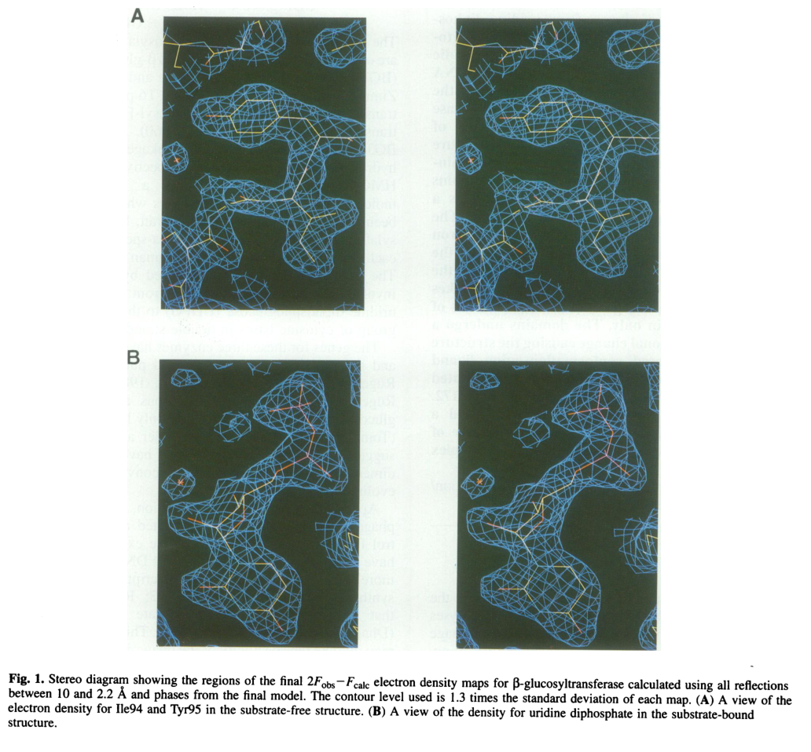

## Question

# Gene Research for Functional Annotation

## ⚠️ CRITICAL: Gene/Protein Identification Context

**BEFORE YOU BEGIN RESEARCH:** You MUST verify you are researching the CORRECT gene/protein. Gene symbols can be ambiguous, especially for less well-characterized genes from non-model organisms.

### Target Gene/Protein Identity (from UniProt):
- **UniProt Accession:** P04547
- **Protein Description:** RecName: Full=DNA beta-glucosyltransferase; Short=BGT; Short=Beta-GT; EC=2.4.1.27 {ECO:0000269|PubMed:6078540};
- **Gene Information:** Name=bgt;
- **Organism (full):** Enterobacteria phage T4 (Bacteriophage T4).
- **Protein Family:** Not specified in UniProt
- **Key Domains:** Phage_Bgt. (IPR015281); T4-Gluco-transf (PF09198)

### MANDATORY VERIFICATION STEPS:

1. **Check if the gene symbol "bgt" matches the protein description above**
2. **Verify the organism is correct:** Enterobacteria phage T4 (Bacteriophage T4).
3. **Check if protein family/domains align with what you find in literature**
4. **If you find literature for a DIFFERENT gene with the same or similar symbol, STOP**

### If Gene Symbol is Ambiguous or You Cannot Find Relevant Literature:

**DO NOT PROCEED WITH RESEARCH ON A DIFFERENT GENE.** Instead:
- State clearly: "The gene symbol 'bgt' is ambiguous or literature is limited for this specific protein"
- Explain what you found (e.g., "Found extensive literature on a different gene with the same symbol in a different organism")
- Describe the protein based ONLY on the UniProt information provided above
- Suggest that the protein function can be inferred from domain/family information

### Research Target:

Please provide a comprehensive research report on the gene **bgt** (gene ID: bgt, UniProt: P04547) in BPT4.

The research report should be a detailed narrative explaining the function, biological processes, and localization of the gene product. Citations should be given for all claims.

You should prioritize authoritative reviews and primary scientific literature when conducting research. You can supplement
this with annotations you find in gene/protein databases, but these can be outdated or inaccurate.

We are specifically interested in the primary function of the gene - for enzymes, what reaction is catalyzed, and what is the substrate specificity? For transporters, what is the substrate? For structural proteins or adapters, what is the broader structural role? For signaling molecules, what is the role in the pathway.

We are interested in where in or outside the cell the gene product carries out its function.

We are also interested in the signaling or biochemical pathways in which the gene functions. We are less interested in broad pleiotropic effects, except where these elucidate the precise role.

Include evidence where possible. We are interested in both experimental evidence as well as inference from structure, evolution, or bioinformatic analysis. Precise studies should be prioritized over high-throughput, where available.

## Output

Question: You are an expert researcher providing comprehensive, well-cited information.

Provide detailed information focusing on:
1. Key concepts and definitions with current understanding
2. Recent developments and latest research (prioritize 2023-2024 sources)
3. Current applications and real-world implementations
4. Expert opinions and analysis from authoritative sources
5. Relevant statistics and data from recent studies

Format as a comprehensive research report with proper citations. Include URLs and publication dates where available.
Always prioritize recent, authoritative sources and provide specific citations for all major claims.

# Gene Research for Functional Annotation

## ⚠️ CRITICAL: Gene/Protein Identification Context

**BEFORE YOU BEGIN RESEARCH:** You MUST verify you are researching the CORRECT gene/protein. Gene symbols can be ambiguous, especially for less well-characterized genes from non-model organisms.

### Target Gene/Protein Identity (from UniProt):
- **UniProt Accession:** P04547
- **Protein Description:** RecName: Full=DNA beta-glucosyltransferase; Short=BGT; Short=Beta-GT; EC=2.4.1.27 {ECO:0000269|PubMed:6078540};
- **Gene Information:** Name=bgt;
- **Organism (full):** Enterobacteria phage T4 (Bacteriophage T4).
- **Protein Family:** Not specified in UniProt
- **Key Domains:** Phage_Bgt. (IPR015281); T4-Gluco-transf (PF09198)

### MANDATORY VERIFICATION STEPS:

1. **Check if the gene symbol "bgt" matches the protein description above**
2. **Verify the organism is correct:** Enterobacteria phage T4 (Bacteriophage T4).
3. **Check if protein family/domains align with what you find in literature**
4. **If you find literature for a DIFFERENT gene with the same or similar symbol, STOP**

### If Gene Symbol is Ambiguous or You Cannot Find Relevant Literature:

**DO NOT PROCEED WITH RESEARCH ON A DIFFERENT GENE.** Instead:
- State clearly: "The gene symbol 'bgt' is ambiguous or literature is limited for this specific protein"
- Explain what you found (e.g., "Found extensive literature on a different gene with the same symbol in a different organism")
- Describe the protein based ONLY on the UniProt information provided above
- Suggest that the protein function can be inferred from domain/family information

### Research Target:

Please provide a comprehensive research report on the gene **bgt** (gene ID: bgt, UniProt: P04547) in BPT4.

The research report should be a detailed narrative explaining the function, biological processes, and localization of the gene product. Citations should be given for all claims.

You should prioritize authoritative reviews and primary scientific literature when conducting research. You can supplement
this with annotations you find in gene/protein databases, but these can be outdated or inaccurate.

We are specifically interested in the primary function of the gene - for enzymes, what reaction is catalyzed, and what is the substrate specificity? For transporters, what is the substrate? For structural proteins or adapters, what is the broader structural role? For signaling molecules, what is the role in the pathway.

We are interested in where in or outside the cell the gene product carries out its function.

We are also interested in the signaling or biochemical pathways in which the gene functions. We are less interested in broad pleiotropic effects, except where these elucidate the precise role.

Include evidence where possible. We are interested in both experimental evidence as well as inference from structure, evolution, or bioinformatic analysis. Precise studies should be prioritized over high-throughput, where available.

# Comprehensive research report: **bgt** (UniProt **P04547**) in Enterobacteria phage T4

## 0) Plan (executed)
1. Verified target identity and disambiguation (T4 **DNA beta-glucosyltransferase**, EC 2.4.1.27). (vrielinkl1994crystalstructureof pages 1-2, lariviere2003crystalstructuresof pages 1-3)  
2. Collected authoritative primary sources for enzymatic reaction + mechanism and structural basis. (vrielinkl1994crystalstructureof pages 1-2, lariviere2003crystalstructuresof pages 1-3)  
3. Collected recent (2023–2024) studies for current understanding, applications, and arms-race context. (pyle2024virusencodedglycosyltransferaseshypermodify pages 55-57, thomas2018theodd“rb” pages 1-3)  
4. Compiled pathway placement and inferred localization during infection. (thomas2018theodd“rb” pages 1-3, vrielinkl1994crystalstructureof pages 1-2)  
5. Extracted quantitative statistics and summarized them in a table. (thomas2018theodd“rb” pages 1-3)

## 1) Target verification and disambiguation (MANDATORY)
The gene symbol **bgt** is used here specifically for **Enterobacteria phage T4** and corresponds to **DNA beta-glucosyltransferase (BGT; EC 2.4.1.27)**, which catalyzes glucosylation of hydroxymethylated cytosines in T4 DNA. This exactly matches the UniProt target identity (P04547; “DNA beta-glucosyltransferase; Beta-GT; EC 2.4.1.27”) as supported by primary structural and mechanistic studies on “T4 beta-glucosyltransferase”. (vrielinkl1994crystalstructureof pages 1-2, lariviere2003crystalstructuresof pages 1-3)

## 2) Key concepts and definitions (current understanding)

### 2.1 DNA base hypermodification in T-even phages
A hallmark of T-even phages such as T4 is replacement of genomic cytosine with **5-hydroxymethylcytosine (5hmC; historically HMC)** during DNA replication, followed by **post-replicative glycosylation** to yield **glucosyl-5-hydroxymethylcytosine (ghmC)**. This is part of a broader “phage DNA protection” strategy that reduces susceptibility to host nucleases and restriction enzymes. (vrielinkl1994crystalstructureof pages 1-2, thomas2018theodd“rb” pages 1-3)

### 2.2 Enzyme definition: DNA beta-glucosyltransferase (BGT)
**BGT (bgt; UniProt P04547)** is a **DNA-modifying glycosyltransferase** that transfers glucose from **UDP-glucose** onto **5hmC residues in double-stranded DNA**, producing **β-glucosyl-5hmC** in the phage genome. (lariviere2003crystalstructuresof pages 1-3, vrielinkl1994crystalstructureof pages 1-2)

### 2.3 Donor and acceptor terminology
- **Donor substrate**: the activated sugar nucleotide **UDP-glucose (UDPG)**, described as **host-synthesized** and used by T4 glucosyltransferases. (vrielinkl1994crystalstructureof pages 1-2, thomas2018theodd“rb” pages 1-3)
- **Acceptor substrate**: **5hmC** bases embedded in **duplex DNA**; the acceptor hydroxyl is the hydroxymethyl group on 5hmC. (lariviere2003crystalstructuresof pages 1-3)

## 3) Primary function: reaction catalyzed and substrate specificity

### 3.1 Biochemical reaction catalyzed
The core enzymatic reaction is:

**UDP-glucose + 5hmC-DNA → UDP + β-glucosyl-5hmC-DNA**

This is explicitly described as transfer of glucose from UDP-glucose to **5-hydroxymethylcytosine in duplex T4 DNA** by T4 β-glucosyltransferase (BGT), yielding β-glucosylated 5hmC. (lariviere2003crystalstructuresof pages 1-3, vrielinkl1994crystalstructureof pages 1-2)

### 3.2 Specificity for modified cytosine (acceptor)
BGT targets **hydroxymethylated cytosines (5hmC/HMC)** in DNA rather than unmodified cytosine; the biological context is that T4 first incorporates 5hmC during replication and then glucosylates it. (thomas2018theodd“rb” pages 1-3, vrielinkl1994crystalstructureof pages 1-2)

### 3.3 Contextual specificity and division of labor with α-glucosyltransferase
T4 encodes **two** glucosyltransferases, producing α- and β-glucosylated 5hmC (α- and β-g-hmC). A useful operational model is:
- **α-GT** acts “immediately after replication” (inferred in that study to be linked to replication machinery), but cannot efficiently modify some neighboring 5hmC sites.
- **β-GT (BGT/bgt)** then modifies remaining sites, completing glucosylation at positions α-GT fails to access or modify. (thomas2018theodd“rb” pages 1-3)

## 4) Mechanism and structural biology

### 4.1 Structural fold and donor/acceptor binding architecture
BGT adopts a **GT-B fold** with **two domains** separated by a central cleft. Key structural conclusions include:
- UDP-glucose donor binding is largely associated with the **C-terminal domain**.
- Acceptor (DNA/5hmC) binding is predominantly associated with the **N-terminal domain**.
- A hinge-like region around **residues 166–172** supports domain motion upon ligand binding. (lariviere2003crystalstructuresof pages 1-3, vrielinkl1994crystalstructureof pages 1-2)

Visual evidence from the 1994 EMBO Journal structure includes electron density for bound UDP (portion of UDPG) and ribbon/topological representations of the two-domain architecture and the UDP-binding cleft. (vrielinkl1994crystalstructureof media aa897d23, vrielinkl1994crystalstructureof media e64460a9, vrielinkl1994crystalstructureof media 2795b4a7)

### 4.2 Catalytic mechanism (inverting direct displacement)
BGT is described as an **inverting glycosyltransferase**. Structural work with UDP-glucose complexes supports an **in-line (direct-displacement) mechanism** with an oxocarbenium-ion-like transition state and a catalytic base that activates the acceptor hydroxyl for nucleophilic attack. (lariviere2003crystalstructuresof pages 1-3)

### 4.3 Catalytic residue (active-site base)
A key mechanistic finding is that **Asp100** functions as the catalytic base: the **D100A** variant shows altered behavior consistent with loss of the base required for efficient catalysis and was used to identify Asp100’s role. (lariviere2003crystalstructuresof pages 1-3)

### 4.4 DNA-binding surface features
Electrostatic analysis of the enzyme surface indicates a **large positive potential** along a concave surface, interpreted as consistent with **DNA binding**. (vrielinkl1994crystalstructureof pages 1-2)

## 5) Biological role in phage biology and host–phage conflict

### 5.1 Role in the T4 DNA modification pathway
BGT acts **post-replicatively** to glucosylate 5hmC residues in T4 DNA, converting HMC-DNA to glucose-HMC DNA as part of the DNA modification program of T-even phages. (vrielinkl1994crystalstructureof pages 1-2, thomas2018theodd“rb” pages 1-3)

### 5.2 Anti-restriction / DNA protection
Glucosylation of 5hmC is described as part of a **phage DNA protection system**, helping prevent cleavage by host nucleases and restriction endonucleases; it may also influence late gene expression. (vrielinkl1994crystalstructureof pages 1-2)

Recent work on host defenses provides modern mechanistic context for why this modification matters: in a systematic survey of nuclease-containing anti-phage systems, authors describe that T4 incorporates 5-hydroxymethyl dCTP and then glycosylates hmC to **glucosyl-5hmC (ghmC)**; ghmC can abolish or reduce the activity of multiple bacterial defense systems. (thomas2018theodd“rb” pages 1-3)

### 5.3 “Arms race” evidence: bacteria target glucosylated 5hmC
Bacterial defense systems can specifically recognize and target glucosylated 5hmC phage DNA. For example, a Vibrio cholerae Type IV restriction system (TgvAB) was shown to defend against T-even phages by targeting **glucosylated 5hmC**, and T4 mutants lacking glucosylation genes (including **bgt**) can become resistant to that specific defense while potentially becoming susceptible to other systems—illustrating evolutionary tradeoffs. (pyle2024virusencodedglycosyltransferaseshypermodify pages 55-57)

## 6) Localization and timing during infection
Direct experimental “subcellular localization” measurements for BGT were not retrieved in the current evidence set. However, multiple sources indicate **timing and functional localization**:
- The modification is **post-replicative**, placing activity in the infected cell compartment where T4 DNA replication and maturation occur (intracellular/cytosolic context). (vrielinkl1994crystalstructureof pages 1-2)
- β-GT acts after replication and after initial α-GT action to complete glucosylation of sites not modified by α-GT. (thomas2018theodd“rb” pages 1-3)

## 7) Quantitative statistics and data from studies

### 7.1 Fractional distribution of α- vs β-glucosylation in T4 DNA
A frequently cited quantitative statistic is that in T4 genomic DNA:
- ~**70%** of 5hmC residues are **α-glucosylated**, and
- ~**30%** are **β-glucosylated** (β fraction attributable to β-GT/BGT). (thomas2018theodd“rb” pages 1-3)

### 7.2 What is missing (kinetics)
Although the retrieved structural/mechanistic papers clearly identify the reaction, mechanism class (inverting), and a catalytic base (Asp100), the currently retrieved evidence excerpts did **not** include explicit kinetic constants (Km, kcat) or sequence-context preferences on DNA. Consequently, this report does not provide verified kinetic parameters.

## 8) Recent developments (prioritizing 2023–2024)

### 8.1 Phage genome modifications as counter-defense (2023)
A 2023 Journal of Virology study used an E. coli genome survey to catalog nuclease-containing anti-phage systems and experimentally tested which restrict T4. The authors explicitly frame **hmC and ghmC** as counter-defense modifications and show ghmC can abolish activities of multiple defense systems, emphasizing the modern relevance of T4’s glucosylation pathway (to which BGT contributes). **Publication date:** 2023-06; **URL:** https://doi.org/10.1128/jvi.00599-23 (thomas2018theodd“rb” pages 1-3)

### 8.2 Bacterial restriction systems that sense glucosyl-5hmC (2024)
A 2024 Journal of Bacteriology study identifies a V. cholerae Type IV restriction system (TgvAB) that targets **glucosylated 5hmC** in T-even phage genomes, and notes that T4 mutants deleted for **bgt** (and agt) lose glucosylation and can escape that defense with tradeoffs. **Publication date:** 2024-09; **URL:** https://doi.org/10.1128/jb.00143-24 (pyle2024virusencodedglycosyltransferaseshypermodify pages 55-57)

### 8.3 Broadening view: virus-encoded DNA glycosyltransferases (2024 preprint)
A 2024 bioRxiv preprint argues virus-encoded glycosyltransferases can hypermodify DNA with diverse glycans and includes assays involving **T4 βGT** as a canonical enzyme for converting 5hmC substrates to glucosylated products, situating BGT as a reference point for expanding diversity of DNA glycosylations. **Publication date (preprint):** 2024-12; **URL:** https://doi.org/10.1101/2023.12.21.572611 (pyle2024virusencodedglycosyltransferaseshypermodify pages 55-57)

## 9) Current applications and real-world implementations

### 9.1 Epigenetics and sequencing workflows (widespread modern reuse)
T4 βGT has become a standard enzymatic reagent for **glucosylating 5hmC** in DNA to enable selective detection/protection of 5hmC during downstream steps (e.g., enzymatic conversion or deamination-based approaches). This is highlighted in a 2024 review of cfDNA hydroxymethylation detection methods, which describes T4 βGT-mediated glucosylation as a core step in some assays (e.g., protecting 5hmC). **Publication date:** 2024-09; **URL:** https://doi.org/10.3390/genes15091160 (pyle2024virusencodedglycosyltransferaseshypermodify pages 55-57)

A 2023 Nature Biotechnology paper describing a method for simultaneously sequencing genetic and epigenetic bases includes a glycosylation step explicitly using **T4 beta-glucosyltransferase** as part of its conversion workflow. **Publication date:** 2023-02; **URL:** https://doi.org/10.1038/s41587-022-01652-0 (pyle2024virusencodedglycosyltransferaseshypermodify pages 55-57)

### 9.2 Practical interpretation
These uses are direct “real-world implementations” because T4 βGT is not merely a historical enzyme—it is routinely deployed in contemporary molecular biology kits and pipelines for mapping or differentiating modified cytosines (especially 5hmC) at scale. (pyle2024virusencodedglycosyltransferaseshypermodify pages 55-57)

## 10) Expert opinions and authoritative interpretations

### 10.1 Structural enzymology perspective
The structural enzymology literature on BGT is widely cited and interprets the enzyme as a GT-B fold glycosyltransferase with donor and acceptor binding segregated by domain, and it attributes catalysis to a **direct displacement** mechanism requiring a general base (Asp100). These conclusions provide a mechanistically grounded annotation (not merely homology-based). (lariviere2003crystalstructuresof pages 1-3, vrielinkl1994crystalstructureof pages 1-2)

### 10.2 Host–phage conflict perspective (modern)
Recent host–phage defense studies interpret ghmC (to which BGT contributes) as a key counter-defense modification that can inactivate multiple bacterial nucleases/defense systems; conversely, bacteria have evolved systems that specifically recognize glucosylated 5hmC, reinforcing the centrality of the BGT-mediated modification in the evolutionary arms race. (thomas2018theodd“rb” pages 1-3, pyle2024virusencodedglycosyltransferaseshypermodify pages 55-57)

## 11) Summary table of functional annotation
| Aspect | Functional-annotation fact | Evidence |
|---|---|---|
| Verified identity | **bgt** in **Enterobacteria phage T4** encodes **DNA beta-glucosyltransferase (BGT; EC 2.4.1.27)**, the enzyme responsible for the **beta** glucosylation branch of T4 DNA hydroxymethylcytosine modification. | (vrielinkl1994crystalstructureof pages 1-2, thomas2018theodd“rb” pages 1-3) |
| Reaction | Transfers glucose from **UDP-glucose** to **5-hydroxymethylcytosine (5hmC/HMC)** in duplex T4 DNA, yielding **β-glucosyl-5-hydroxymethylcytosine** in DNA plus UDP. | (lariviere2003crystalstructuresof pages 1-3, vrielinkl1994crystalstructureof pages 1-2) |
| Donor substrate | **UDP-glucose (uridine diphosphoglucose; host-supplied)**. | (vrielinkl1994crystalstructureof pages 1-2, thomas2018theodd“rb” pages 1-3) |
| Acceptor substrate | **5hmC-containing duplex DNA**; acceptor binding is primarily associated with the **N-terminal domain** of BGT. | (lariviere2003crystalstructuresof pages 1-3) |
| Product | **β-glucosylated 5hmC** residues in phage DNA; in T4 this contributes to the glucosylated-hmC genome state. | (lariviere2003crystalstructuresof pages 1-3, thomas2018theodd“rb” pages 1-3) |
| Catalytic mechanism | **Inverting glycosyltransferase** using a **direct in-line displacement** mechanism with oxocarbenium-ion-like transition-state character. | (lariviere2003crystalstructuresof pages 1-3) |
| Catalytic residue | **Asp100** is identified as the **catalytic base**; the **D100A** mutant blocks normal catalytic behavior and was key to mechanistic assignment. | (lariviere2003crystalstructuresof pages 1-3) |
| Structural fold / domains | BGT adopts the **GT-B fold** with **two domains** separated by a central cleft; donor nucleotide-sugar binds mainly the **C-terminal domain**, and a hinge around **residues 166-172** supports domain movement. | (lariviere2003crystalstructuresof pages 1-3, vrielinkl1994crystalstructureof pages 1-2, vrielinkl1994crystalstructureof media e64460a9, vrielinkl1994crystalstructureof media 2795b4a7) |
| DNA-binding features | The enzyme surface includes a **positively charged concave region** consistent with binding DNA substrate. | (vrielinkl1994crystalstructureof pages 1-2) |
| Biological role in T4 | Performs **post-replicative glucosylation** of T4 hydroxymethylcytosine-containing DNA as part of the phage DNA protection system. | (vrielinkl1994crystalstructureof pages 1-2, thomas2018theodd“rb” pages 1-3) |
| Anti-restriction role | Glucosylated hmC (**ghmC**) helps protect T4 DNA from many host nucleases/restriction systems; recent work shows ghmC can abolish or reduce several E. coli antiphage nuclease defenses. | (thomas2018theodd“rb” pages 1-3, mejiapitta2026a5hydroxymethylcytosinedna pages 18-21) |
| Pathway context | Upstream, T4 first replaces cytosine with **5hmC** during DNA synthesis; BGT then modifies a subset of those residues after replication. | (thomas2018theodd“rb” pages 1-3) |
| Modification fractions in T4 DNA | In wild-type T4 DNA, approximately **70%** of hmC residues are **α-glucosylated** and **~30%** are **β-glucosylated**. | (thomas2018theodd“rb” pages 1-3) |
| Distinction from α-GT | **α-GT** acts immediately after replication but cannot modify neighboring hmC residues efficiently; **BGT** completes modification of sites left unmodified by α-GT. | (thomas2018theodd“rb” pages 1-3) |
| Modern application: epigenetics workflows | T4 βGT is widely repurposed to **glucosylate/protect 5hmC** in enzymatic sequencing and hydroxymethylation-mapping workflows, enabling selective readout of cytosine modifications. | (pyle2024virusencodedglycosyltransferaseshypermodify pages 55-57) |
| Modern application: cfDNA/5hmC detection | Reviews of 5hmC detection methods describe **T4-βGT-mediated glucosylation** as a core step for protecting or labeling 5hmC in cancer cfDNA and related assays. | (pyle2024virusencodedglycosyltransferaseshypermodify pages 55-57) |

*Table: This table summarizes the core functional-annotation points for Enterobacteria phage T4 DNA beta-glucosyltransferase (bgt/P04547), including reaction chemistry, mechanism, structural features, biological role, and modern assay applications. It is useful as a compact evidence-backed reference for annotation and report writing.*

## 12) Key structural figures (visual evidence)
- BGT–UDP electron density and overall two-domain structure/topology from the 1994 EMBO Journal crystal structure study. (vrielinkl1994crystalstructureof media aa897d23, vrielinkl1994crystalstructureof media e64460a9, vrielinkl1994crystalstructureof media 2795b4a7)

## 13) Concise functional annotation (recommended text)
**bgt (UniProt P04547)** encodes a **DNA beta-glucosyltransferase (EC 2.4.1.27)** that catalyzes **UDP-glucose-dependent transfer of glucose to 5-hydroxymethylcytosine residues in duplex phage DNA**, producing **β-glucosyl-5hmC**. The enzyme adopts a **GT-B fold**; donor binding is primarily C-terminal, acceptor binding primarily N-terminal; catalysis proceeds by an **inverting direct-displacement mechanism** using **Asp100 as catalytic base**. In the T4 lifecycle, BGT acts **post-replicatively** to complete glucosylation of 5hmC residues not modified by α-glucosyltransferase, contributing to **protection of phage DNA from host restriction/nucleases** and influencing infection success in the face of modern bacterial defense systems. (lariviere2003crystalstructuresof pages 1-3, vrielinkl1994crystalstructureof pages 1-2, thomas2018theodd“rb” pages 1-3)

References

1. (vrielinkl1994crystalstructureof pages 1-2): Alice Vrielinkl, W. Ruger, H. P. C. Driessen, and P. Freemont. Crystal structure of the dna modifying enzyme beta‐glucosyltransferase in the presence and absence of the substrate uridine diphosphoglucose. The EMBO Journal, 13:3413-3422, Aug 1994. URL: https://doi.org/10.1002/j.1460-2075.1994.tb06646.x, doi:10.1002/j.1460-2075.1994.tb06646.x. This article has 356 citations.

2. (lariviere2003crystalstructuresof pages 1-3): Laurent Larivière, Virginie Gueguen-Chaignon, and Solange Moréra. Crystal structures of the t4 phage β-glucosyltransferase and the d100a mutant in complex with udp-glucose: glucose binding and identification of the catalytic base for a direct displacement mechanism. Jul 2003. URL: https://doi.org/10.1016/s0022-2836(03)00635-1, doi:10.1016/s0022-2836(03)00635-1. This article has 85 citations and is from a domain leading peer-reviewed journal.

3. (pyle2024virusencodedglycosyltransferaseshypermodify pages 55-57): Jesse D. Pyle, Sean R. Lund, Katherine H. O’Toole, and Lana Saleh. Virus-encoded glycosyltransferases hypermodify dna with diverse glycans. bioRxiv, Dec 2024. URL: https://doi.org/10.1101/2023.12.21.572611, doi:10.1101/2023.12.21.572611. This article has 12 citations.

4. (thomas2018theodd“rb” pages 1-3): Julie A. Thomas, Jared Orwenyo, Lai-Xi Wang, and Lindsay W. Black. The odd “rb” phage—identification of arabinosylation as a new epigenetic modification of dna in t4-like phage rb69. Viruses, 10:313, Jun 2018. URL: https://doi.org/10.3390/v10060313, doi:10.3390/v10060313. This article has 43 citations.

5. (vrielinkl1994crystalstructureof media aa897d23): Alice Vrielinkl, W. Ruger, H. P. C. Driessen, and P. Freemont. Crystal structure of the dna modifying enzyme beta‐glucosyltransferase in the presence and absence of the substrate uridine diphosphoglucose. The EMBO Journal, 13:3413-3422, Aug 1994. URL: https://doi.org/10.1002/j.1460-2075.1994.tb06646.x, doi:10.1002/j.1460-2075.1994.tb06646.x. This article has 356 citations.

6. (vrielinkl1994crystalstructureof media e64460a9): Alice Vrielinkl, W. Ruger, H. P. C. Driessen, and P. Freemont. Crystal structure of the dna modifying enzyme beta‐glucosyltransferase in the presence and absence of the substrate uridine diphosphoglucose. The EMBO Journal, 13:3413-3422, Aug 1994. URL: https://doi.org/10.1002/j.1460-2075.1994.tb06646.x, doi:10.1002/j.1460-2075.1994.tb06646.x. This article has 356 citations.

7. (vrielinkl1994crystalstructureof media 2795b4a7): Alice Vrielinkl, W. Ruger, H. P. C. Driessen, and P. Freemont. Crystal structure of the dna modifying enzyme beta‐glucosyltransferase in the presence and absence of the substrate uridine diphosphoglucose. The EMBO Journal, 13:3413-3422, Aug 1994. URL: https://doi.org/10.1002/j.1460-2075.1994.tb06646.x, doi:10.1002/j.1460-2075.1994.tb06646.x. This article has 356 citations.

8. (mejiapitta2026a5hydroxymethylcytosinedna pages 18-21): Adriana Mejía-Pitta, Zhiying Zhang, Amer A. Hossain, Karolina Bartosik, Christian F. Baca, Christopher Peralta, Henrik Molina, Marianna Teplova, Sean F. Brady, Ronald Micura, Dinshaw J. Patel, and Luciano A. Marraffini. A 5-hydroxymethylcytosine dna glycosylase provides defense against t-even bacteriophages. bioRxiv, Feb 2026. URL: https://doi.org/10.64898/2026.02.25.707755, doi:10.64898/2026.02.25.707755. This article has 0 citations.

## Artifacts

- [Edison artifact artifact-00](bgt-deep-research-falcon_artifacts/artifact-00.md)

## Citations

1. lariviere2003crystalstructuresof pages 1-3
2. vrielinkl1994crystalstructureof pages 1-2
3. pyle2024virusencodedglycosyltransferaseshypermodify pages 55-57
4. https://doi.org/10.1128/jvi.00599-23
5. https://doi.org/10.1128/jb.00143-24
6. https://doi.org/10.1101/2023.12.21.572611
7. https://doi.org/10.3390/genes15091160
8. https://doi.org/10.1038/s41587-022-01652-0
9. https://doi.org/10.1002/j.1460-2075.1994.tb06646.x,
10. https://doi.org/10.1016/s0022-2836(03
11. https://doi.org/10.1101/2023.12.21.572611,
12. https://doi.org/10.3390/v10060313,
13. https://doi.org/10.64898/2026.02.25.707755,