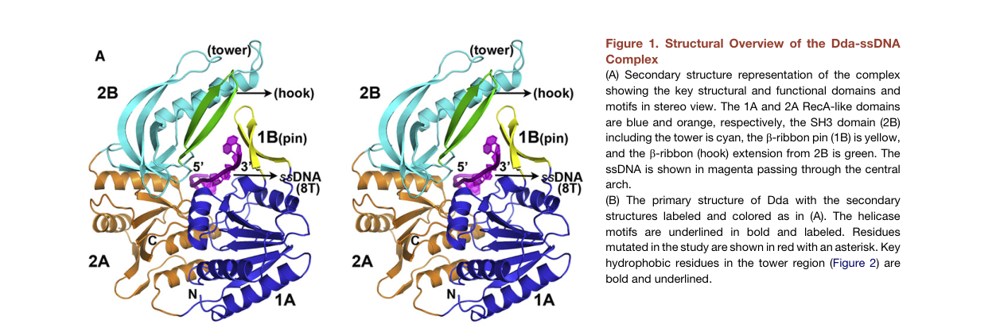

## Question

# Gene Research for Functional Annotation

## ⚠️ CRITICAL: Gene/Protein Identification Context

**BEFORE YOU BEGIN RESEARCH:** You MUST verify you are researching the CORRECT gene/protein. Gene symbols can be ambiguous, especially for less well-characterized genes from non-model organisms.

### Target Gene/Protein Identity (from UniProt):
- **UniProt Accession:** P32270
- **Protein Description:** RecName: Full=ATP-dependent DNA helicase dda; EC=5.6.2.3 {ECO:0000269|PubMed:17823128}; AltName: Full=DNA 5'-3' helicase Dda {ECO:0000305};
- **Gene Information:** Name=dda; Synonyms=sud;
- **Organism (full):** Enterobacteria phage T4 (Bacteriophage T4).
- **Protein Family:** Not specified in UniProt
- **Key Domains:** AAA+_ATPase. (IPR003593); P-loop_NTPase. (IPR027417); PIF1_helicase. (IPR051055); SH3_14. (IPR041214); UvrD-like_helicase_C. (IPR027785)

### MANDATORY VERIFICATION STEPS:

1. **Check if the gene symbol "dda" matches the protein description above**
2. **Verify the organism is correct:** Enterobacteria phage T4 (Bacteriophage T4).
3. **Check if protein family/domains align with what you find in literature**
4. **If you find literature for a DIFFERENT gene with the same or similar symbol, STOP**

### If Gene Symbol is Ambiguous or You Cannot Find Relevant Literature:

**DO NOT PROCEED WITH RESEARCH ON A DIFFERENT GENE.** Instead:
- State clearly: "The gene symbol 'dda' is ambiguous or literature is limited for this specific protein"
- Explain what you found (e.g., "Found extensive literature on a different gene with the same symbol in a different organism")
- Describe the protein based ONLY on the UniProt information provided above
- Suggest that the protein function can be inferred from domain/family information

### Research Target:

Please provide a comprehensive research report on the gene **dda** (gene ID: dda, UniProt: P32270) in BPT4.

The research report should be a detailed narrative explaining the function, biological processes, and localization of the gene product. Citations should be given for all claims.

You should prioritize authoritative reviews and primary scientific literature when conducting research. You can supplement
this with annotations you find in gene/protein databases, but these can be outdated or inaccurate.

We are specifically interested in the primary function of the gene - for enzymes, what reaction is catalyzed, and what is the substrate specificity? For transporters, what is the substrate? For structural proteins or adapters, what is the broader structural role? For signaling molecules, what is the role in the pathway.

We are interested in where in or outside the cell the gene product carries out its function.

We are also interested in the signaling or biochemical pathways in which the gene functions. We are less interested in broad pleiotropic effects, except where these elucidate the precise role.

Include evidence where possible. We are interested in both experimental evidence as well as inference from structure, evolution, or bioinformatic analysis. Precise studies should be prioritized over high-throughput, where available.

## Output

Question: You are an expert researcher providing comprehensive, well-cited information.

Provide detailed information focusing on:
1. Key concepts and definitions with current understanding
2. Recent developments and latest research (prioritize 2023-2024 sources)
3. Current applications and real-world implementations
4. Expert opinions and analysis from authoritative sources
5. Relevant statistics and data from recent studies

Format as a comprehensive research report with proper citations. Include URLs and publication dates where available.
Always prioritize recent, authoritative sources and provide specific citations for all major claims.

# Gene Research for Functional Annotation

## ⚠️ CRITICAL: Gene/Protein Identification Context

**BEFORE YOU BEGIN RESEARCH:** You MUST verify you are researching the CORRECT gene/protein. Gene symbols can be ambiguous, especially for less well-characterized genes from non-model organisms.

### Target Gene/Protein Identity (from UniProt):
- **UniProt Accession:** P32270
- **Protein Description:** RecName: Full=ATP-dependent DNA helicase dda; EC=5.6.2.3 {ECO:0000269|PubMed:17823128}; AltName: Full=DNA 5'-3' helicase Dda {ECO:0000305};
- **Gene Information:** Name=dda; Synonyms=sud;
- **Organism (full):** Enterobacteria phage T4 (Bacteriophage T4).
- **Protein Family:** Not specified in UniProt
- **Key Domains:** AAA+_ATPase. (IPR003593); P-loop_NTPase. (IPR027417); PIF1_helicase. (IPR051055); SH3_14. (IPR041214); UvrD-like_helicase_C. (IPR027785)

### MANDATORY VERIFICATION STEPS:

1. **Check if the gene symbol "dda" matches the protein description above**
2. **Verify the organism is correct:** Enterobacteria phage T4 (Bacteriophage T4).
3. **Check if protein family/domains align with what you find in literature**
4. **If you find literature for a DIFFERENT gene with the same or similar symbol, STOP**

### If Gene Symbol is Ambiguous or You Cannot Find Relevant Literature:

**DO NOT PROCEED WITH RESEARCH ON A DIFFERENT GENE.** Instead:
- State clearly: "The gene symbol 'dda' is ambiguous or literature is limited for this specific protein"
- Explain what you found (e.g., "Found extensive literature on a different gene with the same symbol in a different organism")
- Describe the protein based ONLY on the UniProt information provided above
- Suggest that the protein function can be inferred from domain/family information

### Research Target:

Please provide a comprehensive research report on the gene **dda** (gene ID: dda, UniProt: P32270) in BPT4.

The research report should be a detailed narrative explaining the function, biological processes, and localization of the gene product. Citations should be given for all claims.

You should prioritize authoritative reviews and primary scientific literature when conducting research. You can supplement
this with annotations you find in gene/protein databases, but these can be outdated or inaccurate.

We are specifically interested in the primary function of the gene - for enzymes, what reaction is catalyzed, and what is the substrate specificity? For transporters, what is the substrate? For structural proteins or adapters, what is the broader structural role? For signaling molecules, what is the role in the pathway.

We are interested in where in or outside the cell the gene product carries out its function.

We are also interested in the signaling or biochemical pathways in which the gene functions. We are less interested in broad pleiotropic effects, except where these elucidate the precise role.

Include evidence where possible. We are interested in both experimental evidence as well as inference from structure, evolution, or bioinformatic analysis. Precise studies should be prioritized over high-throughput, where available.

## Research report: bacteriophage T4 gene **dda** (UniProt **P32270**) — ATP-dependent DNA helicase Dda

### 1) Identity verification (critical disambiguation)
The literature summarized here refers specifically to the **Dda helicase of Enterobacteria phage T4** (gene **dda**, also called **sud**), matching the UniProt description (ATP-dependent DNA helicase; SF1B/Pif1-like). Multiple independent sources explicitly describe **T4 Dda** as a **monomeric SF1B helicase** that translocates **5′→3′** on ssDNA and couples ATP hydrolysis to DNA strand separation, and the canonical crystal structure of **T4 Dda bound to ssDNA** is reported (PDB **3UPU**) (he2012thet4phage pages 1-2, he2012thet4phage pages 2-3).

### 2) Key concepts and definitions (current understanding)

#### 2.1 Dda is an ATP-dependent SF1B DNA helicase/translocase
Dda is a helicase that uses **ATP hydrolysis** to move along **single-stranded DNA (ssDNA)** and unwind **double-stranded DNA (dsDNA)** junctions encountered during translocation. In T4, Dda is categorized as an **accessory** (non-replicative) helicase distinct from the essential replicative helicase **gp41**, but it contributes to multiple DNA transactions during infection (he2012thet4phage pages 1-2, gauss1994dnahelicaserequirements pages 1-2, brister2008originactivationrequires pages 1-2).

#### 2.2 Directionality (polarity)
Dda translocates on ssDNA with **5′→3′ polarity**, which is central to its biological deployment at replication forks and recombination intermediates (byrd2012ddahelicasetightly pages 1-2, he2012thet4phage pages 2-3, gauss1994dnahelicaserequirements pages 1-2).

#### 2.3 “Active” versus “passive” DNA unwinding
A major mechanistic concept in helicase biology is whether unwinding is:
- **Passive** (helicase waits for thermal base-pair opening), or
- **Active** (helicase directly destabilizes base pairs).

Dda is a paradigmatic **highly active** helicase. Experimentally, this is captured by comparing its **dsDNA unwinding velocity (Vun)** to its **ssDNA translocation velocity (Vtrans)**. If Vun ≈ Vtrans and unwinding is relatively insensitive to duplex stability/force, unwinding is considered strongly active. Dda satisfies these criteria (byrd2012ddahelicasetightly pages 7-8).

### 3) Molecular function: reaction, substrates, and specificity

#### 3.1 Enzymatic activity and coupling efficiency
Single-molecule and ensemble analyses show that Dda’s ssDNA translocation and dsDNA unwinding velocities are nearly identical:
- **Unwinding velocity:** **257 ± 42 bp/s**
- **ssDNA translocation velocity:** **267 ± 15 nt/s**
- **Coupling ratio:** **Vun/Vtrans ≈ 0.96**

This indicates that Dda is an **“optimally active”** helicase whose unwinding is largely limited by translocation rather than thermal fraying (byrd2012ddahelicasetightly pages 1-2, byrd2012ddahelicasetightly pages 7-8).

Consistent with an active mechanism, Dda’s unwinding rate is reported to be **largely insensitive** to duplex stability (GC content) and to applied force (byrd2012ddahelicasetightly pages 7-8).

#### 3.2 Structural mechanism of strand separation (pin/tower/SH3 organization)
The 2012 crystal structure of the **Dda–ssDNA** complex (PDB 3UPU) supports a mechanistic model in which a **rigid “pin” element** (in domain 1B) and a supporting **tower/SH3 architecture** are optimized for strand separation (he2012thet4phage pages 1-2).

A central structural insight is that an aromatic residue in the pin (**Phe98**) is crucial for duplex separation. A **F98A** mutant preserves ssDNA translocation yet loses unwinding, strongly separating the translocation motor from the strand-separation “splitting” element. Quantitatively, He et al. report for **F98A**:
- **ktrans ≈ 249 ± 23 nt/s** (near wild-type)
- **kd ≈ 20.4 ± 2.3 s−1** (increased dissociation)

Whereas wild-type parameters reported include:
- **ktrans ≈ 233 ± 27 nt/s**
- **kd ≈ 5.75 ± 1.60 s−1**

These data support a model where the pin provides an essential base-stacking/strand-separation function while the RecA-like core continues to drive ssDNA translocation (he2012thet4phage pages 8-9).

#### 3.3 Substrate preference and fork engagement
Dda’s activity depends on DNA structure and engagement of multiple strands at a fork. Experiments comparing a forked substrate to a simple ss/ds junction found that Dda is **more processive** on fork DNA and that fork binding can disrupt approximately **two base pairs** prior to unwinding, supporting a mechanism involving simultaneous interactions with the tracking strand, displaced strand, and duplex arm (ma2004dualfunctionsof pages 1-2).

#### 3.4 Protein displacement (roadblock removal)
Dda can generate force sufficient to **displace tightly bound proteins** from DNA (e.g., streptavidin-biotin roadblocks), consistent with a role in clearing replication/recombination barriers (byrd2012ddahelicasetightly pages 7-8).

A more recent mechanistic refinement mapped a Dda **SH3-domain “hook”** element (a β-hairpin) that strongly contributes to displacement of certain protein blocks. Deleting residues **279–284** substantially reduces **streptavidin** displacement while leaving unwinding near wild-type, showing that Dda’s protein-remodeling capability can be at least partly separable from core unwinding (byrd2022astructuralfeature pages 1-3).

### 4) Biological roles during T4 infection: processes and pathways

#### 4.1 Origin-dependent DNA replication (early infection)
Genetic and infection profiling support a role for Dda in early origin-dependent initiation. A dda deletion causes a **delay** in early T4 DNA synthesis, although later replication can approach near wild-type levels, consistent with Dda being helpful but not strictly essential (gauss1994dnahelicaserequirements pages 1-2).

Genome-wide replication mapping showed that dda mutants **lose preferential initiation near origins**, and peaks of replication normally visible near T4 origins are no longer present. A mechanistic model emerging from this work is that Dda **unwinds origin DNA**, clears bound proteins, and creates a **ssDNA “landing zone”** facilitating loading of the replicative helicase (gp41) (brister2008originactivationrequires pages 1-2).

#### 4.2 Cooperation and synthetic interactions with helicase loading pathways
Dda function overlaps with gp59-dependent loading processes. In vivo, a dda defect combined with a **gp59** defect can produce a profound replication defect (“essentially no DNA was synthesized” in the cited study), indicating that Dda can buffer deficiencies in helicase loading/replication restart pathways (gauss1994dnahelicaserequirements pages 1-2).

#### 4.3 Recombination and branch migration support
Dda binds the T4 recombinase **UvsX** and stimulates UvsX-catalyzed branch migration by approximately **4-fold** in vitro, linking Dda’s motor/unwinding activity to recombination-mediated DNA transactions (gauss1994dnahelicaserequirements pages 1-2, hacker1992overexpressionpurificationsequence pages 1-2).

#### 4.4 Replication-fork rescue and error-free lesion bypass (template switching)
A well-defined reconstitution shows that **UvsX recombinase + Dda helicase** are sufficient to rescue a stalled replication fork in vitro via sequential template-switching reactions that enable non-mutagenic bypass of a non-coding lesion (kadyrov2004uvsxrecombinaseand pages 1-2).

The implementation is experimentally concrete: under a defined reaction containing (example concentrations) **2 nM DNA fork**, **62.5 nM Dda**, and **375 nM UvsX**, polymerase alone produced a **79-nt** product, whereas inclusion of UvsX or Dda produced **90–91 nt** template-switch products, and inclusion of both UvsX and Dda yielded a **120-nt** product consistent with the complete double-switch repair outcome (kadyrov2004uvsxrecombinaseand pages 1-2).

### 5) Interaction partners, regulation, and functional coupling

#### 5.1 Interaction and cofactor relationship with gp32 (T4 SSB)
The T4 ssDNA-binding protein **gp32** is a major regulatory partner of Dda.

Evidence indicates:
- Dda can bind tightly to gp32, and Dda stimulation of strand-displacement synthesis requires **direct gp32–Dda protein–protein interactions** (ma2004dualfunctionsof pages 1-1, ma2004dualfunctionsof pages 1-2).
- The **acidic C-terminal A-domain** of gp32 mediates protein–protein contacts; gp32 fragments lacking the A-domain lose interaction with Dda despite near-normal ssDNA binding (ma2004dualfunctionsof pages 1-2).

A dedicated analysis of regulation by gp32 describes a dual role:
- **Stimulatory:** gp32–Dda interaction can enhance Dda unwinding and increase ATP turnover, particularly under higher salt and in the presence of DNA polymerase.
- **Inhibitory:** when gp32 forms clusters on ssDNA, those clusters can sterically inhibit Dda loading/unwinding depending on substrate geometry.

This supports a model in which gp32 can both maintain Dda in an active state at forks and prevent inappropriate unwinding/loading events (jordan2015regulationofthe pages 1-2, jordan2015regulationofthe pages 11-12).

#### 5.2 Partnering with recombination proteins
Dda interacts with **UvsX** recombinase and functionally cooperates in branch migration and template switching (fork rescue) (gauss1994dnahelicaserequirements pages 1-2, kadyrov2004uvsxrecombinaseand pages 1-2).

### 6) Cellular localization (where Dda acts)
Direct microscopy-based localization for Dda in infected cells was not retrieved in the accessible corpus. However, the combination of (i) origin-activation phenotypes during infection, (ii) requirement for gp32-dependent strand displacement, and (iii) direct activity on forked and recombination DNA intermediates indicates that Dda acts on **phage DNA replication/recombination structures** in the **infected bacterial cytoplasm/nucleoid context** rather than being a virion structural component (brister2008originactivationrequires pages 1-2, ma2004dualfunctionsof pages 1-2, kadyrov2004uvsxrecombinaseand pages 1-2).

### 7) Recent developments (prioritizing 2023–2024 where possible)

#### 7.1 Direct Dda developments retrievable here
The most recent directly retrievable primary study on Dda in this run is a 2022 Protein Science paper identifying the SH3 “hook” element that contributes to protein displacement without strongly perturbing unwinding, refining the concept that Dda’s protein-remodeling and helicase activities can be partially modular (byrd2022astructuralfeature pages 1-3).

A 2025 authoritative review reports that new Dda–ssDNA structures exist (PDB **8GME**, **8S9I**) described as providing the **structural basis of Dda–gp32 interactions**, suggesting substantial recent structural advances likely published in 2023–2024; however, the underlying primary article(s) were not obtainable in the present tool run, so their detailed conclusions cannot be stated here beyond what the review reports (morrical2025thebacteriophaget4 pages 1-3).

#### 7.2 Indirect (family-level) 2023–2024 insights relevant to Dda (clearly labeled as inference)
Dda is related to the **Pif1-family / SF1B** helicases. Recent 2023–2024 Pif1 studies provide updated structural/mechanistic motifs that may inform hypotheses about Dda, but they are not direct evidence about T4 Dda.

- A 2024 Nature Communications structure of yeast Pif1 bound to a G-quadruplex plus 5′ ssDNA describes a conserved **“wedge”** region in domain 1A that contacts the junction and may generalize to how Pif1-family helicases engage structured DNA junctions (inference to Dda should be cautious) (hong2024eukaryoticpif1helicase pages 1-2).
- A 2023 Biochemistry study shows ATP-dependent Pif1-driven displacement of DNA-bound proteins and that dissociation rate increases with loading-site length; this is conceptually consistent with Dda’s demonstrated protein-displacement and multi-monomer enhancement phenomena, but remains indirect (chib2023pif1helicasemediates pages 1-3).

### 8) Current applications and real-world implementations

#### 8.1 Model enzyme for single-molecule helicase biophysics
Dda is used as a model SF1B helicase in single-molecule and ensemble assays because it is unusually efficient (Vun≈Vtrans) and robust against duplex stability changes. The measured velocities (~260 bp/s and ~270 nt/s) provide benchmark parameters for helicase motor efficiency and for comparing “active” versus “passive” unwinding models (byrd2012ddahelicasetightly pages 1-2).

#### 8.2 Reconstituted replication-fork rescue / lesion bypass assays
The UvsX+Dda template-switching system provides a well-defined biochemical platform to study fork regression/restoration and non-mutagenic lesion bypass, with discrete product lengths and defined protein concentrations, enabling mechanistic interrogation and inhibitor/variant testing (kadyrov2004uvsxrecombinaseand pages 1-2).

#### 8.3 Reconstitution of recombination-dependent replication (RDR)
T4 replication and recombination proteins can be assembled in vitro into systems that mimic infection-time DNA replication and repair. In such reconstitutions, Dda is described as a 5′→3′ helicase that can pry open helices and assist synthesis, while other mediator proteins (e.g., gp59) can dramatically accelerate helicase loading (reported “23-fold” rate increase for gp59 restoring gp41 loading in a competitive context) (barry2019invitroreconstitution pages 1-2).

#### 8.4 Biotechnology note (what is and is not supported for Dda)
A recent authoritative review states that T4 recombination proteins (UvsX/UvsY/gp32) underpin **isothermal DNA amplification technologies**. The pages retrieved do not show Dda being a core reagent in those amplification methods; therefore, Dda’s role in biotechnology is best described here as (i) a mechanistic model enzyme and (ii) a potential tool in specialized helicase-based assays, rather than as an established amplification enzyme in the retrieved evidence (morrical2025thebacteriophaget4 pages 1-3).

### 9) Expert synthesis and interpretive analysis (from authoritative sources)
Across biochemical, structural, genetic, and single-molecule studies, Dda emerges as a specialized **accessory 5′→3′ motor** optimized for:
1) **Efficient strand separation** at junctions and forks (pin-dependent active mechanism),
2) **Protein-roadblock removal** on DNA,
3) Facilitating **origin activation** and early replication dynamics, and
4) Supporting recombination-driven transactions (branch migration stimulation, fork restart via template switching).

The mechanistic integration with **gp32** is particularly important: gp32 is not merely an ssDNA coat, but a **regulatory scaffold** whose C-terminal domain mediates protein recruitment and can both stimulate and inhibit Dda depending on how gp32 is assembled on ssDNA, consistent with a regulated fork-restart/processing role rather than constitutive unwinding (jordan2015regulationofthe pages 1-2, ma2004dualfunctionsof pages 1-2).

### 10) Visual evidence (figures/tables)
A structural overview of Dda bound to ssDNA (including pin/tower/SH3 domains) and a kinetic table of wild-type and mutant parameters (including ktrans and kd) are shown in the cropped figure and table extracted from the 2012 Structure paper (he2012thet4phage media c4603177, he2012thet4phage media 5525f826).

### Summary table of key findings
| Functional aspect | Key result with quantitative numbers where available | Evidence type | System/assay | Citation (author year) | URL/DOI |
|---|---|---|---|---|---|
| Target identity / family | Dda from bacteriophage T4 is a monomeric SF1B helicase related to the Pif1 family; crystal structure solved with ssDNA (PDB 3UPU), matching the UniProt assignment for P32270 | Structural, biochemistry | X-ray crystallography of Dda–ssDNA complex; comparative helicase analysis (he2012thet4phage pages 1-2, he2012thet4phage pages 2-3) | He et al. 2012 | https://doi.org/10.1016/j.str.2012.04.013 |
| Directionality | Dda translocates/unwinds in the 5′→3′ direction on ssDNA | Bulk biochemistry | Helicase/translocation assays on tailed DNA substrates; streptavidin-block directionality tests (byrd2012ddahelicasetightly pages 1-2, he2012thet4phage pages 7-8, he2012thet4phage pages 2-3, gauss1994dnahelicaserequirements pages 1-2) | Raney & Benkovic 1995; He et al. 2012 | https://doi.org/10.1074/jbc.270.38.22236; https://doi.org/10.1016/j.str.2012.04.013 |
| Unwinding rate | Average duplex unwinding rate ≈ 257 ± 42 bp/s under single-molecule/bulk analysis | Single-molecule, bulk biochemistry | DNA unwinding assays with optical/single-molecule and ensemble kinetics (byrd2012ddahelicasetightly pages 1-2, byrd2012ddahelicasetightly pages 7-8) | Byrd et al. 2012 | https://doi.org/10.1016/j.jmb.2012.04.007 |
| ssDNA translocation rate | Average ssDNA translocation rate ≈ 267 ± 15 nt/s; wild-type fitted ktrans ≈ 233 ± 27 nt/s in structural/kinetic study | Single-molecule, stopped-flow, bulk biochemistry | ssDNA translocation assays and kinetic modeling (byrd2012ddahelicasetightly pages 1-2, he2012thet4phage pages 8-9, byrd2012ddahelicasetightly pages 7-8) | Byrd et al. 2012; He et al. 2012 | https://doi.org/10.1016/j.jmb.2012.04.007; https://doi.org/10.1016/j.str.2012.04.013 |
| Coupling efficiency / helicase mechanism | Vun/Vtrans ≈ 0.96, indicating Dda is an “optimally active” helicase with tight coupling of translocation to strand separation; unwinding is largely insensitive to GC content and applied force | Single-molecule, bulk biochemistry | Comparison of ssDNA translocation and dsDNA unwinding; force and duplex stability dependence (byrd2012ddahelicasetightly pages 1-2, byrd2012ddahelicasetightly pages 7-8) | Byrd et al. 2012 | https://doi.org/10.1016/j.jmb.2012.04.007 |
| Processivity / dissociation | Wild-type dissociation rate from ssDNA reported as kd ≈ 5.75 ± 1.60 s^-1; modeled ssDNA binding site ~8 nt; Dda is intrinsically low/moderate processivity, increased when multiple Dda molecules load | Bulk biochemistry, kinetics | Stopped-flow translocation kinetics; unwinding processivity analysis (he2012thet4phage pages 8-9, jordan2015regulationofthe pages 1-2, jordan2015regulationofthe pages 11-12) | He et al. 2012; Jordan & Morrical 2015 | https://doi.org/10.1016/j.str.2012.04.013; https://doi.org/10.1016/j.dnarep.2014.10.002 |
| Structural strand-separation mechanism | The 1B “pin” with Phe98 is essential for duplex separation; F98A abolishes unwinding while preserving ssDNA translocation. The pin is braced by tower/SH3 architecture to couple ATP-driven motion to strand separation | Structural, mutational biochemistry | Dda–ssDNA crystal structure; mutant translocation/unwinding assays (he2012thet4phage pages 8-9, he2012thet4phage media c4603177, he2012thet4phage media 5525f826) | He et al. 2012 | https://doi.org/10.1016/j.str.2012.04.013 |
| Mutant quantitative example | F98A retains ssDNA translocation (ktrans ≈ 249 ± 23 nt/s) but shows increased dissociation (kd ≈ 20.4 ± 2.3 s^-1) and loss of unwinding, separating translocation from duplex-splitting function | Structural, kinetics | Site-directed mutagenesis plus stopped-flow/unwinding assays (he2012thet4phage pages 8-9) | He et al. 2012 | https://doi.org/10.1016/j.str.2012.04.013 |
| Fork engagement / displaced-strand contacts | Dda unwinds fork DNA more processively than ss/ds junction substrates; fork binding disrupts ~2 bp before unwinding, supporting simultaneous contacts with tracking strand, displaced strand, and duplex | Bulk biochemistry | DNA footprinting and kinetic unwinding on fork versus junction substrates (ma2004dualfunctionsof pages 1-2) | Aarattuthodiyil et al. 2014 | https://doi.org/10.1093/nar/gku845 |
| gp32 regulation | gp32 is an essential cofactor for Dda-stimulated strand-displacement synthesis; direct gp32–Dda protein–protein interactions are required, and Dda binds tightly to gp32 even without ssDNA | Bulk biochemistry | Reconstituted T4 fork DNA synthesis with gp32 variants and Dda (jordan2015regulationofthe pages 1-2, ma2004dualfunctionsof pages 1-1, ma2004dualfunctionsof pages 1-2) | Ma et al. 2004; Jordan & Morrical 2015 | https://doi.org/10.1074/jbc.m311738200; https://doi.org/10.1016/j.dnarep.2014.10.002 |
| Dual effect of gp32 | gp32–Dda interactions can stimulate Dda unwinding and ATP turnover, especially at higher salt and in the presence of DNA polymerase, but gp32 clusters on ssDNA can also sterically inhibit Dda loading/unwinding depending on geometry | Bulk biochemistry, mechanistic model | Unwinding and ATPase analyses with gp32, gp32 fragments, and fork substrates (jordan2015regulationofthe pages 1-2, jordan2015regulationofthe pages 11-12) | Jordan & Morrical 2015 | https://doi.org/10.1016/j.dnarep.2014.10.002 |
| gp32 interaction surface | The acidic C-terminal A-domain of gp32 mediates protein–protein interactions with Dda; gp32 fragments lacking this domain lose interaction despite near-normal ssDNA binding | Bulk biochemistry | gp32 truncation/mutant analysis in helicase-loading and strand-displacement reactions (ma2004dualfunctionsof pages 1-2) | Ma et al. 2004 | https://doi.org/10.1074/jbc.m311738200 |
| UvsX / branch migration | Dda binds UvsX and stimulates UvsX-catalyzed branch migration about 4-fold in vitro, linking Dda to recombination-dependent DNA metabolism | Bulk biochemistry | Protein interaction and branch-migration assays (gauss1994dnahelicaserequirements pages 1-2, hacker1992overexpressionpurificationsequence pages 1-2) | Hacker & Alberts 1992; Gauss et al. 1994 | https://doi.org/10.1016/S0021-9258(19)36738-9; https://doi.org/10.1128/jb.176.6.1667-1672.1994 |
| Replication-fork rescue / lesion bypass | UvsX plus Dda are sufficient to rescue stalled T4 replication forks in vitro through sequential template-switching reactions that bypass a non-coding lesion without mutagenesis | Bulk biochemistry | Reconstituted stalled T4 fork rescue assay (jordan2015regulationofthe pages 1-2) | Kadyrov & Drake 2004 | https://doi.org/10.1074/jbc.m403942200 |
| Origin-dependent replication role | dda mutants show delayed early DNA synthesis, indicating a role in origin-dependent initiation; Dda is nonessential alone but strongly synergizes genetically with gp59 defects | Genetics/in vivo | T4 infection time-course and mutant analysis (he2012thet4phage pages 1-2, gauss1994dnahelicaserequirements pages 1-2, brister2008originactivationrequires pages 1-2) | Gauss et al. 1994; Brister 2008 | https://doi.org/10.1128/jb.176.6.1667-1672.1994; https://doi.org/10.1016/j.jmb.2008.02.002 |
| Origin activation genome-wide | In dda mutants, synthesis no longer preferentially initiates near origins; model proposes Dda unwinds origin DNA, clears bound proteins, and creates a ssDNA landing zone for gp41 loading | Genetics/in vivo | Genome-wide replication/origin activation analysis during infection (brister2008originactivationrequires pages 1-2) | Brister 2008 | https://doi.org/10.1016/j.jmb.2008.02.002 |
| Genetic interaction with gp59 | Combined dda and gp59 defects cause essentially no DNA synthesis, indicating overlapping/synergistic roles in establishing productive replication forks | Genetics/in vivo | Double-mutant infection analysis (he2012thet4phage pages 1-2, gauss1994dnahelicaserequirements pages 1-2) | Gauss et al. 1994; He et al. 2012 | https://doi.org/10.1128/jb.176.6.1667-1672.1994; https://doi.org/10.1016/j.str.2012.04.013 |
| Protein displacement activity | Dda can displace proteins from DNA, including streptavidin and trp repressor; multiple Dda molecules enhance displacement efficiency when obstacles are present | Bulk biochemistry, single-molecule context | Protein–DNA displacement assays on biotinylated or protein-bound DNA substrates (byrd2012ddahelicasetightly pages 1-2, byrd2012ddahelicasetightly pages 7-8, byrd2022astructuralfeature pages 1-3) | Byrd et al. 2012; Byrd et al. 2022 | https://doi.org/10.1016/j.jmb.2012.04.007; https://doi.org/10.1002/pro.4232 |
| Structural determinant of protein displacement | A SH3-domain “hook” subdomain (Δ279–284 deletion) leaves DNA binding and maximal ATPase largely intact but markedly reduces streptavidin displacement and lowers unwinding processivity, showing separable determinants for unwinding versus protein eviction | Structural, mutational biochemistry | Domain deletion and protein-displacement assays (byrd2022astructuralfeature pages 1-3) | Byrd et al. 2022 | https://doi.org/10.1002/pro.4232 |
| Functional localization | Dda acts on phage DNA replication and recombination intermediates in the infected bacterial cytoplasm/nucleoid context, especially at replication forks, origins, and recombination-generated branched DNA rather than as a virion structural protein | Inference from genetics/biochemistry | Infected-cell replication phenotypes plus in vitro fork/origin/recombination substrates (he2012thet4phage pages 1-2, jordan2015regulationofthe pages 1-2, brister2008originactivationrequires pages 1-2) | He et al. 2012; Jordan & Morrical 2015; Brister 2008 | https://doi.org/10.1016/j.str.2012.04.013; https://doi.org/10.1016/j.dnarep.2014.10.002; https://doi.org/10.1016/j.jmb.2008.02.002 |

*Table: This table summarizes experimentally supported findings for bacteriophage T4 Dda helicase (UniProt P32270), covering mechanism, kinetics, partner interactions, and biological roles in replication and recombination. It is useful as a compact evidence map linking each claim to assay type and source.*

### Key references (with dates and URLs)
- He X. et al. **2012-07**. *Structure*: “The T4 phage SF1B helicase Dda is structurally optimized to perform DNA strand separation.” https://doi.org/10.1016/j.str.2012.04.013 (he2012thet4phage pages 10-11, he2012thet4phage pages 8-9)
- Byrd AK. et al. **2012-07**. *J Mol Biol*: “Dda helicase tightly couples translocation on ssDNA to unwinding of dsDNA.” https://doi.org/10.1016/j.jmb.2012.04.007 (byrd2012ddahelicasetightly pages 1-2, byrd2012ddahelicasetightly pages 7-8)
- Jordan CS & Morrical SW. **2015-01**. *DNA Repair*: “Regulation of the bacteriophage T4 dda helicase by gp32.” https://doi.org/10.1016/j.dnarep.2014.10.002 (jordan2015regulationofthe pages 1-2, jordan2015regulationofthe pages 11-12)
- Brister JR. **2008-04**. *J Mol Biol*: “Origin activation requires both replicative and accessory helicases during T4 infection.” https://doi.org/10.1016/j.jmb.2008.02.002 (brister2008originactivationrequires pages 1-2)
- Ma Y. et al. **2004-04**. *J Biol Chem*: “Dual functions of SSB (gp32) in helicase loading…; dda stimulation requires gp32–dda interactions.” https://doi.org/10.1074/jbc.m311738200 (ma2004dualfunctionsof pages 1-1, ma2004dualfunctionsof pages 1-2)
- Kadyrov FA & Drake JW. **2004-08**. *J Biol Chem*: “UvsX and Dda rescue stalled T4 replication forks in vitro.” https://doi.org/10.1074/jbc.m403942200 (kadyrov2004uvsxrecombinaseand pages 1-2)
- Byrd AK. et al. **2022-11**. *Protein Science*: “A structural feature of Dda helicase which enhances displacement…” https://doi.org/10.1002/pro.4232 (byrd2022astructuralfeature pages 1-3)
- Hong Z. et al. **2024-07**. *Nat Commun*: “Eukaryotic Pif1 helicase unwinds G4 and dsDNA using a conserved wedge.” https://doi.org/10.1038/s41467-024-50575-8 (indirect family context) (hong2024eukaryoticpif1helicase pages 1-2)

References

1. (he2012thet4phage pages 1-2): Xiaoping He, Alicia K. Byrd, Mi-Kyung Yun, Charles W. Pemble, David Harrison, Laxmi Yeruva, Christopher Dahl, Kenneth N. Kreuzer, Kevin D. Raney, and Stephen W. White. The t4 phage sf1b helicase dda is structurally optimized to perform dna strand separation. Structure, 20 7:1189-200, Jul 2012. URL: https://doi.org/10.1016/j.str.2012.04.013, doi:10.1016/j.str.2012.04.013. This article has 51 citations and is from a domain leading peer-reviewed journal.

2. (he2012thet4phage pages 2-3): Xiaoping He, Alicia K. Byrd, Mi-Kyung Yun, Charles W. Pemble, David Harrison, Laxmi Yeruva, Christopher Dahl, Kenneth N. Kreuzer, Kevin D. Raney, and Stephen W. White. The t4 phage sf1b helicase dda is structurally optimized to perform dna strand separation. Structure, 20 7:1189-200, Jul 2012. URL: https://doi.org/10.1016/j.str.2012.04.013, doi:10.1016/j.str.2012.04.013. This article has 51 citations and is from a domain leading peer-reviewed journal.

3. (gauss1994dnahelicaserequirements pages 1-2): P Gauss, K Park, T E Spencer, and K J Hacker. Dna helicase requirements for dna replication during bacteriophage t4 infection. Journal of Bacteriology, 176:1667-1672, Mar 1994. URL: https://doi.org/10.1128/jb.176.6.1667-1672.1994, doi:10.1128/jb.176.6.1667-1672.1994. This article has 56 citations and is from a peer-reviewed journal.

4. (brister2008originactivationrequires pages 1-2): J. Rodney Brister. Origin activation requires both replicative and accessory helicases during t4 infection. Journal of molecular biology, 377 5:1304-13, Apr 2008. URL: https://doi.org/10.1016/j.jmb.2008.02.002, doi:10.1016/j.jmb.2008.02.002. This article has 13 citations and is from a domain leading peer-reviewed journal.

5. (byrd2012ddahelicasetightly pages 1-2): Alicia K. Byrd, Dennis L. Matlock, Debjani Bagchi, Suja Aarattuthodiyil, David Harrison, Vincent Croquette, and Kevin D. Raney. Dda helicase tightly couples translocation on single-stranded dna to unwinding of duplex dna: dda is an optimally active helicase. Journal of molecular biology, 420 3:141-54, Jul 2012. URL: https://doi.org/10.1016/j.jmb.2012.04.007, doi:10.1016/j.jmb.2012.04.007. This article has 55 citations and is from a domain leading peer-reviewed journal.

6. (byrd2012ddahelicasetightly pages 7-8): Alicia K. Byrd, Dennis L. Matlock, Debjani Bagchi, Suja Aarattuthodiyil, David Harrison, Vincent Croquette, and Kevin D. Raney. Dda helicase tightly couples translocation on single-stranded dna to unwinding of duplex dna: dda is an optimally active helicase. Journal of molecular biology, 420 3:141-54, Jul 2012. URL: https://doi.org/10.1016/j.jmb.2012.04.007, doi:10.1016/j.jmb.2012.04.007. This article has 55 citations and is from a domain leading peer-reviewed journal.

7. (he2012thet4phage pages 8-9): Xiaoping He, Alicia K. Byrd, Mi-Kyung Yun, Charles W. Pemble, David Harrison, Laxmi Yeruva, Christopher Dahl, Kenneth N. Kreuzer, Kevin D. Raney, and Stephen W. White. The t4 phage sf1b helicase dda is structurally optimized to perform dna strand separation. Structure, 20 7:1189-200, Jul 2012. URL: https://doi.org/10.1016/j.str.2012.04.013, doi:10.1016/j.str.2012.04.013. This article has 51 citations and is from a domain leading peer-reviewed journal.

8. (ma2004dualfunctionsof pages 1-2): Yujie Ma, Tongsheng Wang, Jana L. Villemain, David P. Giedroc, and Scott W. Morrical. Dual functions of single-stranded dna-binding protein in helicase loading at the bacteriophage t4 dna replication fork*. Journal of Biological Chemistry, 279:19035-19045, Apr 2004. URL: https://doi.org/10.1074/jbc.m311738200, doi:10.1074/jbc.m311738200. This article has 51 citations and is from a domain leading peer-reviewed journal.

9. (byrd2022astructuralfeature pages 1-3): Alicia K. Byrd, Emory G. Malone, Lindsey Hazeslip, Maroof Khan Zafar, David K. Harrison, Matthew D. Thompson, Jun Gao, Senthil K. Perumal, John C. Marecki, and Kevin D. Raney. A structural feature of dda helicase which enhances displacement of streptavidin and <i>trp</i> repressor from <scp>dna</scp>. Protein Science, 31:407-421, Nov 2022. URL: https://doi.org/10.1002/pro.4232, doi:10.1002/pro.4232. This article has 8 citations and is from a peer-reviewed journal.

10. (hacker1992overexpressionpurificationsequence pages 1-2): K.J. Hacker and B.M. Alberts. Overexpression, purification, sequence analysis, and characterization of the t4 bacteriophage dda dna helicase. The Journal of biological chemistry, 267 29:20674-81, Oct 1992. URL: https://doi.org/10.1016/s0021-9258(19)36738-9, doi:10.1016/s0021-9258(19)36738-9. This article has 47 citations.

11. (kadyrov2004uvsxrecombinaseand pages 1-2): Farid A. Kadyrov and John W. Drake. Uvsx recombinase and dda helicase rescue stalled bacteriophage t4 dna replication forks in vitro*. Journal of Biological Chemistry, 279:35735-35740, Aug 2004. URL: https://doi.org/10.1074/jbc.m403942200, doi:10.1074/jbc.m403942200. This article has 34 citations and is from a domain leading peer-reviewed journal.

12. (ma2004dualfunctionsof pages 1-1): Yujie Ma, Tongsheng Wang, Jana L. Villemain, David P. Giedroc, and Scott W. Morrical. Dual functions of single-stranded dna-binding protein in helicase loading at the bacteriophage t4 dna replication fork*. Journal of Biological Chemistry, 279:19035-19045, Apr 2004. URL: https://doi.org/10.1074/jbc.m311738200, doi:10.1074/jbc.m311738200. This article has 51 citations and is from a domain leading peer-reviewed journal.

13. (jordan2015regulationofthe pages 1-2): Christian S. Jordan and Scott W. Morrical. Regulation of the bacteriophage t4 dda helicase by gp32 single-stranded dna-binding protein. DNA repair, 25:41-53, Jan 2015. URL: https://doi.org/10.1016/j.dnarep.2014.10.002, doi:10.1016/j.dnarep.2014.10.002. This article has 13 citations and is from a peer-reviewed journal.

14. (jordan2015regulationofthe pages 11-12): Christian S. Jordan and Scott W. Morrical. Regulation of the bacteriophage t4 dda helicase by gp32 single-stranded dna-binding protein. DNA repair, 25:41-53, Jan 2015. URL: https://doi.org/10.1016/j.dnarep.2014.10.002, doi:10.1016/j.dnarep.2014.10.002. This article has 13 citations and is from a peer-reviewed journal.

15. (morrical2025thebacteriophaget4 pages 1-3): Scott W. Morrical. The bacteriophage t4 homologous recombination system: mechanism, applications, conservation, and environmental significance. EcoSal Plus, Dec 2025. URL: https://doi.org/10.1128/ecosalplus.esp-0003-2025, doi:10.1128/ecosalplus.esp-0003-2025. This article has 0 citations.

16. (hong2024eukaryoticpif1helicase pages 1-2): Zebin Hong, Alicia K. Byrd, Jun Gao, Poulomi Das, Vanessa Qianmin Tan, Emory G. Malone, Bertha Osei, John C. Marecki, Reine U. Protacio, Wayne P. Wahls, Kevin D. Raney, and Haiwei Song. Eukaryotic pif1 helicase unwinds g-quadruplex and dsdna using a conserved wedge. Nature Communications, Jul 2024. URL: https://doi.org/10.1038/s41467-024-50575-8, doi:10.1038/s41467-024-50575-8. This article has 14 citations and is from a highest quality peer-reviewed journal.

17. (chib2023pif1helicasemediates pages 1-3): Shubeena Chib, Wezley C. Griffin, Jun Gao, David R. Proffitt, Alicia K. Byrd, and Kevin D. Raney. Pif1 helicase mediates remodeling of protein-nucleic acid complexes by promoting dissociation of sub1 from g-quadruplex dna and cdc13 from g-rich single-stranded dna. Biochemistry, 62:3360-3372, Nov 2023. URL: https://doi.org/10.1021/acs.biochem.3c00441, doi:10.1021/acs.biochem.3c00441. This article has 6 citations and is from a peer-reviewed journal.

18. (barry2019invitroreconstitution pages 1-2): Jack Barry, Mei Lie Wong, and Bruce Alberts. In vitro reconstitution of dna replication initiated by genetic recombination: a t4 bacteriophage model for a type of dna synthesis important for all cells. Molecular Biology of the Cell, 30:146-159, Jan 2019. URL: https://doi.org/10.1091/mbc.e18-06-0386, doi:10.1091/mbc.e18-06-0386. This article has 4 citations and is from a domain leading peer-reviewed journal.

19. (he2012thet4phage media c4603177): Xiaoping He, Alicia K. Byrd, Mi-Kyung Yun, Charles W. Pemble, David Harrison, Laxmi Yeruva, Christopher Dahl, Kenneth N. Kreuzer, Kevin D. Raney, and Stephen W. White. The t4 phage sf1b helicase dda is structurally optimized to perform dna strand separation. Structure, 20 7:1189-200, Jul 2012. URL: https://doi.org/10.1016/j.str.2012.04.013, doi:10.1016/j.str.2012.04.013. This article has 51 citations and is from a domain leading peer-reviewed journal.

20. (he2012thet4phage media 5525f826): Xiaoping He, Alicia K. Byrd, Mi-Kyung Yun, Charles W. Pemble, David Harrison, Laxmi Yeruva, Christopher Dahl, Kenneth N. Kreuzer, Kevin D. Raney, and Stephen W. White. The t4 phage sf1b helicase dda is structurally optimized to perform dna strand separation. Structure, 20 7:1189-200, Jul 2012. URL: https://doi.org/10.1016/j.str.2012.04.013, doi:10.1016/j.str.2012.04.013. This article has 51 citations and is from a domain leading peer-reviewed journal.

21. (he2012thet4phage pages 7-8): Xiaoping He, Alicia K. Byrd, Mi-Kyung Yun, Charles W. Pemble, David Harrison, Laxmi Yeruva, Christopher Dahl, Kenneth N. Kreuzer, Kevin D. Raney, and Stephen W. White. The t4 phage sf1b helicase dda is structurally optimized to perform dna strand separation. Structure, 20 7:1189-200, Jul 2012. URL: https://doi.org/10.1016/j.str.2012.04.013, doi:10.1016/j.str.2012.04.013. This article has 51 citations and is from a domain leading peer-reviewed journal.

22. (he2012thet4phage pages 10-11): Xiaoping He, Alicia K. Byrd, Mi-Kyung Yun, Charles W. Pemble, David Harrison, Laxmi Yeruva, Christopher Dahl, Kenneth N. Kreuzer, Kevin D. Raney, and Stephen W. White. The t4 phage sf1b helicase dda is structurally optimized to perform dna strand separation. Structure, 20 7:1189-200, Jul 2012. URL: https://doi.org/10.1016/j.str.2012.04.013, doi:10.1016/j.str.2012.04.013. This article has 51 citations and is from a domain leading peer-reviewed journal.

## Artifacts

- [Edison artifact artifact-00](dda-deep-research-falcon_artifacts/artifact-00.md)

## Citations

1. byrd2012ddahelicasetightly pages 7-8
2. ma2004dualfunctionsof pages 1-2
3. byrd2022astructuralfeature pages 1-3
4. gauss1994dnahelicaserequirements pages 1-2
5. brister2008originactivationrequires pages 1-2
6. kadyrov2004uvsxrecombinaseand pages 1-2
7. byrd2012ddahelicasetightly pages 1-2
8. barry2019invitroreconstitution pages 1-2
9. jordan2015regulationofthe pages 1-2
10. hacker1992overexpressionpurificationsequence pages 1-2
11. ma2004dualfunctionsof pages 1-1
12. jordan2015regulationofthe pages 11-12
13. https://doi.org/10.1016/j.str.2012.04.013
14. https://doi.org/10.1074/jbc.270.38.22236;
15. https://doi.org/10.1016/j.jmb.2012.04.007
16. https://doi.org/10.1016/j.jmb.2012.04.007;
17. https://doi.org/10.1016/j.str.2012.04.013;
18. https://doi.org/10.1016/j.dnarep.2014.10.002
19. https://doi.org/10.1093/nar/gku845
20. https://doi.org/10.1074/jbc.m311738200;
21. https://doi.org/10.1074/jbc.m311738200
22. https://doi.org/10.1016/S0021-9258(19
23. https://doi.org/10.1128/jb.176.6.1667-1672.1994
24. https://doi.org/10.1074/jbc.m403942200
25. https://doi.org/10.1128/jb.176.6.1667-1672.1994;
26. https://doi.org/10.1016/j.jmb.2008.02.002
27. https://doi.org/10.1002/pro.4232
28. https://doi.org/10.1016/j.dnarep.2014.10.002;
29. https://doi.org/10.1038/s41467-024-50575-8
30. https://doi.org/10.1016/j.str.2012.04.013,
31. https://doi.org/10.1128/jb.176.6.1667-1672.1994,
32. https://doi.org/10.1016/j.jmb.2008.02.002,
33. https://doi.org/10.1016/j.jmb.2012.04.007,
34. https://doi.org/10.1074/jbc.m311738200,
35. https://doi.org/10.1002/pro.4232,
36. https://doi.org/10.1016/s0021-9258(19
37. https://doi.org/10.1074/jbc.m403942200,
38. https://doi.org/10.1016/j.dnarep.2014.10.002,
39. https://doi.org/10.1128/ecosalplus.esp-0003-2025,
40. https://doi.org/10.1038/s41467-024-50575-8,
41. https://doi.org/10.1021/acs.biochem.3c00441,
42. https://doi.org/10.1091/mbc.e18-06-0386,