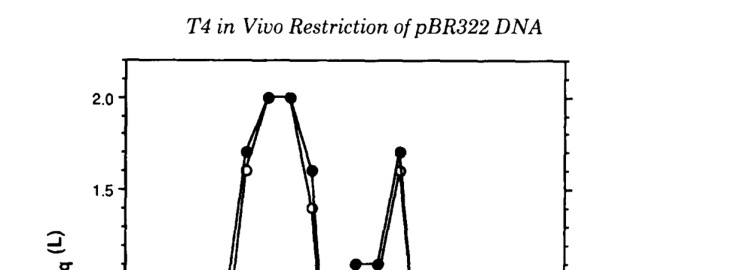

## Question

# Gene Research for Functional Annotation

## ⚠️ CRITICAL: Gene/Protein Identification Context

**BEFORE YOU BEGIN RESEARCH:** You MUST verify you are researching the CORRECT gene/protein. Gene symbols can be ambiguous, especially for less well-characterized genes from non-model organisms.

### Target Gene/Protein Identity (from UniProt):
- **UniProt Accession:** P07059
- **Protein Description:** RecName: Full=Endonuclease II; EC=3.1.21.8 {ECO:0000269|PubMed:18539732, ECO:0000269|PubMed:19666720, ECO:0000269|PubMed:6887350, ECO:0000269|PubMed:8386173};
- **Gene Information:** Name=denA;
- **Organism (full):** Enterobacteria phage T4 (Bacteriophage T4).
- **Protein Family:** Not specified in UniProt
- **Key Domains:** EndoII-like_GIY-YIG. (IPR044556); GIY-YIG_endonuc. (IPR000305); GIY-YIG_endonuc_sf. (IPR035901); Host_DNA_Degrad_Endo. (IPR053748); Phage_T4_DenA_endoDNaseII. (IPR016413)

### MANDATORY VERIFICATION STEPS:

1. **Check if the gene symbol "denA" matches the protein description above**
2. **Verify the organism is correct:** Enterobacteria phage T4 (Bacteriophage T4).
3. **Check if protein family/domains align with what you find in literature**
4. **If you find literature for a DIFFERENT gene with the same or similar symbol, STOP**

### If Gene Symbol is Ambiguous or You Cannot Find Relevant Literature:

**DO NOT PROCEED WITH RESEARCH ON A DIFFERENT GENE.** Instead:
- State clearly: "The gene symbol 'denA' is ambiguous or literature is limited for this specific protein"
- Explain what you found (e.g., "Found extensive literature on a different gene with the same symbol in a different organism")
- Describe the protein based ONLY on the UniProt information provided above
- Suggest that the protein function can be inferred from domain/family information

### Research Target:

Please provide a comprehensive research report on the gene **denA** (gene ID: denA, UniProt: P07059) in BPT4.

The research report should be a detailed narrative explaining the function, biological processes, and localization of the gene product. Citations should be given for all claims.

You should prioritize authoritative reviews and primary scientific literature when conducting research. You can supplement
this with annotations you find in gene/protein databases, but these can be outdated or inaccurate.

We are specifically interested in the primary function of the gene - for enzymes, what reaction is catalyzed, and what is the substrate specificity? For transporters, what is the substrate? For structural proteins or adapters, what is the broader structural role? For signaling molecules, what is the role in the pathway.

We are interested in where in or outside the cell the gene product carries out its function.

We are also interested in the signaling or biochemical pathways in which the gene functions. We are less interested in broad pleiotropic effects, except where these elucidate the precise role.

Include evidence where possible. We are interested in both experimental evidence as well as inference from structure, evolution, or bioinformatic analysis. Precise studies should be prioritized over high-throughput, where available.

## Output

Question: You are an expert researcher providing comprehensive, well-cited information.

Provide detailed information focusing on:
1. Key concepts and definitions with current understanding
2. Recent developments and latest research (prioritize 2023-2024 sources)
3. Current applications and real-world implementations
4. Expert opinions and analysis from authoritative sources
5. Relevant statistics and data from recent studies

Format as a comprehensive research report with proper citations. Include URLs and publication dates where available.
Always prioritize recent, authoritative sources and provide specific citations for all major claims.

# Gene Research for Functional Annotation

## ⚠️ CRITICAL: Gene/Protein Identification Context

**BEFORE YOU BEGIN RESEARCH:** You MUST verify you are researching the CORRECT gene/protein. Gene symbols can be ambiguous, especially for less well-characterized genes from non-model organisms.

### Target Gene/Protein Identity (from UniProt):
- **UniProt Accession:** P07059
- **Protein Description:** RecName: Full=Endonuclease II; EC=3.1.21.8 {ECO:0000269|PubMed:18539732, ECO:0000269|PubMed:19666720, ECO:0000269|PubMed:6887350, ECO:0000269|PubMed:8386173};
- **Gene Information:** Name=denA;
- **Organism (full):** Enterobacteria phage T4 (Bacteriophage T4).
- **Protein Family:** Not specified in UniProt
- **Key Domains:** EndoII-like_GIY-YIG. (IPR044556); GIY-YIG_endonuc. (IPR000305); GIY-YIG_endonuc_sf. (IPR035901); Host_DNA_Degrad_Endo. (IPR053748); Phage_T4_DenA_endoDNaseII. (IPR016413)

### MANDATORY VERIFICATION STEPS:

1. **Check if the gene symbol "denA" matches the protein description above**
2. **Verify the organism is correct:** Enterobacteria phage T4 (Bacteriophage T4).
3. **Check if protein family/domains align with what you find in literature**
4. **If you find literature for a DIFFERENT gene with the same or similar symbol, STOP**

### If Gene Symbol is Ambiguous or You Cannot Find Relevant Literature:

**DO NOT PROCEED WITH RESEARCH ON A DIFFERENT GENE.** Instead:
- State clearly: "The gene symbol 'denA' is ambiguous or literature is limited for this specific protein"
- Explain what you found (e.g., "Found extensive literature on a different gene with the same symbol in a different organism")
- Describe the protein based ONLY on the UniProt information provided above
- Suggest that the protein function can be inferred from domain/family information

### Research Target:

Please provide a comprehensive research report on the gene **denA** (gene ID: denA, UniProt: P07059) in BPT4.

The research report should be a detailed narrative explaining the function, biological processes, and localization of the gene product. Citations should be given for all claims.

You should prioritize authoritative reviews and primary scientific literature when conducting research. You can supplement
this with annotations you find in gene/protein databases, but these can be outdated or inaccurate.

We are specifically interested in the primary function of the gene - for enzymes, what reaction is catalyzed, and what is the substrate specificity? For transporters, what is the substrate? For structural proteins or adapters, what is the broader structural role? For signaling molecules, what is the role in the pathway.

We are interested in where in or outside the cell the gene product carries out its function.

We are also interested in the signaling or biochemical pathways in which the gene functions. We are less interested in broad pleiotropic effects, except where these elucidate the precise role.

Include evidence where possible. We are interested in both experimental evidence as well as inference from structure, evolution, or bioinformatic analysis. Precise studies should be prioritized over high-throughput, where available.

# Functional Annotation Research Report: **denA** (UniProt **P07059**) from **Enterobacteria phage T4**

## 0. Target verification (mandatory disambiguation)
Multiple independent primary sources explicitly link **T4 gene denA** to **Endonuclease II (EndoII)**, a **GIY–YIG** nuclease involved in host-DNA degradation during T4 infection, matching the UniProt-provided identity (Endonuclease II; EC 3.1.21.8; phage T4). Carlson et al. mapped **EndoII-dependent cleavage** in vivo and state the enzyme is encoded by **denA** (Carlson 1993) (carlson1993dnadeterminantsof pages 1-2). Lagerbäck et al. explicitly state EndoII is encoded by **gene denA** and analyze it as a **GIY–YIG** nuclease (Lagerbäck 2009) (lagerback2009bacteriophaget4endonuclease pages 1-2). Kutter et al. likewise describe **denA → endonuclease II** as the initiating nuclease in T4-mediated host DNA degradation (Kutter 2018) (kutter2018fromhostto pages 6-9).

## 1. Key concepts and current understanding
### 1.1 What DenA/Endonuclease II is
**DenA (Endonuclease II; EndoII)** is a phage-encoded, sequence-context-sensitive DNA endonuclease of the **GIY–YIG nuclease superfamily** that initiates degradation (“restriction”) of **cytosine-containing, unmodified host DNA** during T4 infection. T4 protects its own genome from this activity by replacing cytosine with **hydroxymethylcytosine** (and glucosylating it), enabling discrimination between host and phage DNA during takeover (kutter2018fromhostto pages 6-9, lagerback2009bacteriophaget4endonuclease pages 1-2, carlson1993dnadeterminantsof pages 1-2).

### 1.2 Reaction type and products
In vivo mapping demonstrates that EndoII produces **double-strand breaks** at preferred sites but with short staggering: cleavage products include **blunt ends or 1–2 nt 5′ overhangs**, with cleavage occurring most frequently around a variable central base pair in the motif (carlson1993dnadeterminantsof pages 1-2, carlson1993dnadeterminantsof pages 4-5). In vivo, the breakpoints often involve adjacent interruptions in both strands displaced by **0–2 bp** (carlson1993dnadeterminantsof pages 4-5).

### 1.3 Site preference (substrate specificity / sequence determinants)
EndoII exhibits **sequence-dependent site preference** rather than strict specificity. Carlson et al. derived a consensus from 12 in vivo cleavage sites in pBR322:
- **Unweighted consensus:** 5′-**GRCCGCNTYGC**-3′
- **Weighted consensus (more frequently cleaved sites):** 5′-**CGRCCGCNTTGSYNGC**-3′  
(carlson1993dnadeterminantsof pages 1-2, carlson1993dnadeterminantsof pages 7-8, carlson1993dnadeterminantsof media 89cd4389).

A follow-up synthetic-site study concluded that a **16-bp variable sequence** is sufficient to direct cleavage, with a highly cleaved motif described as **CGRCCGCNTTGGCNGC**, and that both local sequence/shape and longer-range context influence cleavage efficiency (carlson1996shortrangeandlongrange pages 1-2).

### 1.4 GIY–YIG catalytic fold and oligomerization
Lagerbäck et al. show that EndoII behaves unusually among many GIY–YIG enzymes by forming an active **tetrameric** DNA complex that can bind **two DNA molecules** at once (lagerback2009bacteriophaget4endonuclease pages 1-2, lagerback2009bacteriophaget4endonuclease pages 7-8). In solution it is mainly **dimeric** at low ionic strength but shifts toward tetramers at higher salt, consistent with a dimer–tetramer equilibrium (lagerback2009bacteriophaget4endonuclease pages 2-4, lagerback2009bacteriophaget4endonuclease pages 7-8). A catalytic-surface residue **E118** is implicated in catalysis and also affects DNA binding: the **E118A** variant can bind stably as monomer/dimer to a single DNA substrate (lagerback2009bacteriophaget4endonuclease pages 1-2).

## 2. Mechanistic evidence from primary studies (function, specificity, pathway)
### 2.1 In vivo restriction/cleavage of cytosine DNA
Carlson et al. (1993-04-??; *J Biol Chem*; https://doi.org/10.1016/S0021-9258(18)52959-8) demonstrated EndoII-dependent restriction cleavage of plasmid DNA in T4-infected cells, identifying **12 double-stranded restriction sites** in pBR322 and reporting that cleavage **commenced before 10 min postinfection** at 37°C (carlson1993dnadeterminantsof pages 1-2). Site-to-site cleavage efficiency varied substantially, with reported frequencies spanning **10–90% at 50 min** postinfection (carlson1993dnadeterminantsof pages 1-2). In a sequenced subset, cleavage frequencies varied **25–65%** and cleavage generated a **2-base 5′ overhang** at those sites (carlson1993dnadeterminantsof pages 2-2). 

### 2.2 Short- and long-range context effects
Carlson et al. (1996-11; *J Bacteriol*; https://doi.org/10.1128/jb.178.22.6419-6426.1996) show that recognition is not “position-wise additive”: a synthetic site composed of the most preferred base at each position was nevertheless cleaved poorly, implying that multiple base combinations can satisfy recognition requirements and that sequence-dependent DNA structure contributes (carlson1996shortrangeandlongrange pages 1-2). They also found that inserting a strong synthetic site reduced cleavage at natural sites within **~800–1,500 bp**, supporting a model where EndoII engages a larger DNA region and cleaves the best available site within that region (carlson1996shortrangeandlongrange pages 1-2).

### 2.3 In vitro binding state and two-mode cleavage model
Lagerbäck et al. (2009-08; *Nucleic Acids Res*; https://doi.org/10.1093/nar/gkp652) provide biochemical evidence that the **DNA-bound species is a tetramer** that binds **two DNA substrates** (lagerback2009bacteriophaget4endonuclease pages 7-8). Gel filtration showed peaks consistent with **dimer (~35 kDa)** and **tetramer (~74.7 kDa)** and an enzyme–DNA complex at **~170 kDa**, consistent with a **tetramer + two DNAs** (expected ~179 kDa) (lagerback2009bacteriophaget4endonuclease pages 6-7, lagerback2009bacteriophaget4endonuclease pages 7-8). Stable binding required **>30 bp** of DNA; a 24-bp duplex containing the site gave erratic nicking and no stable shifts, whereas a 44-bp substrate was reproducibly nicked (lagerback2009bacteriophaget4endonuclease pages 2-4).

Mechanistically, Lagerbäck et al. describe two catalytic modes: a predominant **single-strand nicking** mode (mode I; prominent in vitro), and a mode capable of nicking both strands in one functional complex (mode II), which is considered more observable in vivo because nicks are rapidly repaired; even limited double-strand cleavage is sufficient to trigger extensive host DNA degradation by downstream exonucleases (lagerback2009bacteriophaget4endonuclease pages 9-9).

## 3. Role during infection: pathway placement, timing, and localization
### 3.1 Biological role: initiating host DNA degradation and nucleotide scavenging
DenA/EndoII is positioned at the **initiation step** of T4 host DNA degradation, producing rare nicks in host DNA that enable further processing. Kutter et al. (2018-07; *Viruses*; https://doi.org/10.3390/v10070387) synthesize decades of work into a pathway model: **DenA (EndoII)** makes rare nicks; the resulting single-stranded regions are substrates for **DenB (Endonuclease IV)**, which cuts cytosine-containing stretches of ssDNA; subsequent breakdown is driven by a strong exonuclease activity associated with phage genes **46/47** (kutter2018fromhostto pages 6-9). This supports a functional annotation of DenA as a targeted initiator of host genome fragmentation that feeds **nucleotide salvage** for phage DNA synthesis (kutter2018fromhostto pages 6-9).

### 3.2 Timing
Direct in vivo cleavage mapping indicates EndoII-dependent restriction cleavage begins **before 10 min** postinfection (carlson1993dnadeterminantsof pages 1-2). Kutter et al. emphasize that host DNA degradation is mainly observed **~6–20 min** postinfection in classical experiments (kutter2018fromhostto pages 6-9). In stationary-phase infections using radiolabeling and a DNA polymerase amber mutant, host DNA breakdown reached **40% acid-soluble at 60 min** and **60% at 120 min**, demonstrating that when phage DNA synthesis is blocked, extensive degradation is measurable; in wild-type infections only ~**10%** reduction was detected because host nucleotides are rapidly reincorporated into phage DNA (kutter2018fromhostto pages 9-12).

### 3.3 Localization
The DenA product functions **intracellularly** during infection, acting on host plasmid/chromosomal DNA in the infected bacterium (demonstrated by in vivo cleavage of plasmid pBR322 inside infected cells) (carlson1993dnadeterminantsof pages 1-2, carlson1993dnadeterminantsof pages 2-4). At the resolution supported by these data, DenA acts in the infected-cell cytosol/nucleoid region where host DNA resides.

## 4. Quantitative summary of key evidence
The following table compiles the most direct functional-annotation measurements (cleavage consensus, timing, cleavage frequency, oligomeric state and binding stoichiometry, and relevant assay parameters) from primary sources.

| Evidence type | Key finding | Quantitative details/statistics | Source (author year journal) and URL |
|---|---|---|---|
| In vivo cleavage mapping | T4 **denA** encodes Endonuclease II (EndoII), which cleaves cytosine-containing plasmid DNA at sequence-dependent sites in infected cells; cleavage occurs around a central variable base pair and yields blunt ends or short 5' overhangs. Consensus motifs derived from mapped sites were **5'-GRCCGCNTYGC-3'** and weighted **5'-CGRCCGCNTTGSYNGC-3'**. (carlson1993dnadeterminantsof pages 1-2, carlson1993dnadeterminantsof media 89cd4389) | Cleavage at **12 sites** in pBR322; starts **before 10 min postinfection** at 37°C; site-specific cleavage frequencies ranged **10–90% by 50 min**; sequenced sites showed **25–65%** cleavage; products had **0–2 bp** strand displacement / **1–2 nt 5' overhangs**. (carlson1993dnadeterminantsof pages 1-2, carlson1993dnadeterminantsof pages 2-2, carlson1993dnadeterminantsof pages 4-5) | Carlson et al. 1993, *J. Biol. Chem.* (1993-04). https://doi.org/10.1016/S0021-9258(18)52959-8 |
| In vitro binding/oligomerization | EndoII is a **GIY-YIG nuclease** that binds DNA predominantly as a **tetramer engaging two DNA substrates**; free enzyme is mainly dimeric at low ionic strength and shifts toward tetramers at higher salt. The catalytic-surface mutant **E118A** uniquely forms monomer/dimer complexes on a single DNA. (lagerback2009bacteriophaget4endonuclease pages 1-2, lagerback2009bacteriophaget4endonuclease pages 2-4, lagerback2009bacteriophaget4endonuclease pages 7-8) | Expected masses: monomer **16.8 kDa**, dimer **33.6 kDa**, tetramer **67.2 kDa**; gel filtration showed ~**35 kDa** (dimer), ~**74.7 kDa** (tetramer), and ~**170 kDa** for tetramer + two DNAs (expected ~**179 kDa**); stable binding required **>30 bp** DNA; ~**80%** of K12A C4-complexed 44-bp substrate was nicked after **15 min** in-gel with MgCl2; example enzyme:DNA ratios included **42:1** and **27:1–450:1**. (lagerback2009bacteriophaget4endonuclease pages 6-7, lagerback2009bacteriophaget4endonuclease pages 7-8, lagerback2009bacteriophaget4endonuclease pages 2-4) | Lagerbäck et al. 2009, *Nucleic Acids Res.* (2009-08). https://doi.org/10.1093/nar/gkp652 |
| Infection timing/role | DenA/EndoII performs the **initial nicking step in host DNA degradation** during T4 takeover, targeting host cytosine DNA while T4 DNA is protected by hydroxymethylcytosine/glucosylation. Nicked regions then become substrates for **DenB (Endonuclease IV)** and downstream **46/47 exonuclease** processing, supporting irreversible host shutoff and nucleotide scavenging for phage DNA synthesis. (kutter2018fromhostto pages 6-9) | Host DNA degradation is mainly observed between about **6–20 min** postinfection; nucleotide-production/DNA-replication enzymes are produced around **3–8 min**; in stationary-phase infections with a DNA polymerase amber mutant, **40%** of host 3HdT became acid-soluble by **60 min** and **60%** by **120 min**; with wild-type T4, only about **10%** reduction was seen by **60 min** because released nucleotides were rapidly reincorporated into phage DNA. (kutter2018fromhostto pages 6-9, kutter2018fromhostto pages 9-12) | Kutter et al. 2018, *Viruses* (2018-07). https://doi.org/10.3390/v10070387 |
| Context effects | EndoII recognizes a **16-bp variable site**, but cleavage efficiency depends strongly on both local sequence/shape and longer-range DNA context; recognition appears to involve both base readout and sequence-dependent DNA structure. Introducing a strong synthetic site suppresses cleavage at nearby weaker natural sites, implying competition over an extended DNA region. (carlson1996shortrangeandlongrange pages 1-2, lagerback2009bacteriophaget4endonuclease pages 9-10) | Efficient synthetic motif: **CGRCCGCNTTGGCNGC**; a 16-bp variable sequence was sufficient for cleavage, but a “best-base-at-each-position” consensus was paradoxically cleaved poorly; insertion of a synthetic site reduced cleavage at natural sites within about **800–1,500 bp**; Lagerbäck et al. proposed interference over roughly **~1000 bp** on each side for neighboring sites in mode II cleavage models. (carlson1996shortrangeandlongrange pages 1-2, lagerback2009bacteriophaget4endonuclease pages 9-10) | Carlson et al. 1996, *J. Bacteriol.* (1996-11). https://doi.org/10.1128/jb.178.22.6419-6426.1996; Lagerbäck et al. 2009, *Nucleic Acids Res.* (2009-08). https://doi.org/10.1093/nar/gkp652 |

*Table: This table summarizes the main experimental evidence supporting functional annotation of Enterobacteria phage T4 denA/Endonuclease II, including cleavage specificity, oligomeric state, infection role, and context dependence. It is useful as a compact evidence map linking key findings to quantitative observations and primary sources.*

In addition, Carlson et al. 1993 provide a visual summary of cleavage frequency across sites and consensus motifs (Figure 3 and Figure 7 region) (carlson1993dnadeterminantsof media 89cd4389, carlson1993dnadeterminantsof media 695568e2).

## 5. Recent developments (2023–2024) relevant to DenA functional annotation
Direct 2023–2024 experimental work on **T4 DenA itself** appears limited in the retrieved corpus; however, 2023–2024 studies significantly update understanding of the **GIY–YIG nuclease superfamily** and its modular deployment, which is directly relevant to interpreting DenA’s domain-driven mechanism and potential repurposing.

### 5.1 GIY–YIG nucleases as modular components in restriction/defense
Helbrecht et al. (2024-04; *Frontiers in Microbiology*; https://doi.org/10.3389/fmicb.2024.1286822) characterize multiple modification-dependent restriction systems where a reader domain (e.g., winged-helix) is fused to nuclease domains including **GIY–YIG**, supporting a general “sensor + nuclease” modular architecture in which recognition of modified DNA can be coupled to GIY–YIG-mediated cleavage (helbrecht2024characterizationofwinged pages 1-2, helbrecht2024characterizationofwinged pages 16-17). While not about DenA specifically, these data strengthen the modern view that GIY–YIG nuclease cores are repurposed in diverse DNA-targeting systems.

### 5.2 Newly described GIY–YIG single-domain ssDNA nucleases with applications
Veyrier et al. (2024-07; preprint; https://doi.org/10.21203/rs.3.rs-4622751/v1) describe a widespread family of **GIY–YIG single-domain nucleases (Ssn)** that cleave **single-stranded DNA** in a site-specific manner and demonstrate applications such as **ssDNA detection** and digestion of ssDNA from rolling-circle amplification (veyrier2024discoveryofthe pages 1-6). This provides an up-to-date example of GIY–YIG enzymes being operationalized as tools, relevant to discussions of possible DenA-inspired engineering even if DenA itself targets dsDNA and functions as a nicking/fragmentation initiator.

### 5.3 Broader 2024 cataloging of GIY–YIG domains in antiviral defense and genome degradation contexts
Li et al. (2024-10; bioRxiv; https://doi.org/10.1101/2024.10.26.620412) summarize the GIY–YIG domain as a conserved ~100-aa catalytic core and describe its recurrence in nuclease-mediated defense and genome degradation contexts (li2024genomiclandscapeof pages 4-6). This supports the general principle that DenA’s fold is part of an expanding repertoire of nuclease-based conflict systems.

## 6. Current applications and real-world implementations
### 6.1 Phage therapy and safety assessment of T4-like phages
A practical, applied context for DenA-like functions is phage therapy development. Weber-Dąbrowska et al. (2023-01; *Pharmaceutics*; https://doi.org/10.3390/pharmaceutics15020434) discuss T4-like (T4-related) therapeutic candidates and note that rapid host DNA degradation modules (including homologs of **DenA/EndoII**) are used as an argument that such phages are **generally considered non-transducing**, despite headful packaging posing a theoretical risk (weberdabrowska2023characteristicsofenvironmental pages 20-22). They also identify DenA homologs in some sequenced Klebsiella T4-related phages and define DenA as initiating degradation of unmodified cytosine DNA (weberdabrowska2023characteristicsofenvironmental pages 22-23). This is a real-world implementation: genomic screening for DenA-like modules contributes to therapeutic-phage safety evaluation.

### 6.2 Phage engineering constraints and strategies (2024)
Pozhydaieva et al. (2024-01; *PLOS Genetics*; preprint DOI: https://doi.org/10.1101/2024.01.28.577628) highlight that **early degradation of donor DNA/plasmids by phage nucleases** can severely limit homologous recombination in phage engineering, a phenomenon consistent with T4’s aggressive nuclease program (pozhydaieva2024temporalepigenomemodulation pages 16-17). They show that temporally modulating phage DNA modifications can improve CRISPR targeting and yields of engineered mutants: Cas targeting improved by up to **~70%**, and mutagenesis efficiencies reached **~6%** in some conditions (e.g., 2/36 plaques; 5.6%) (pozhydaieva2024temporalepigenomemodulation pages 16-17). Although denA is not named in the excerpted pages, this study provides a 2024 practical “engineering” angle on the broader class of phage nuclease-driven DNA degradation programs that DenA exemplifies.

## 7. Expert synthesis and interpretation (authoritative perspectives)
Kutter et al. emphasize that DenA’s biological role is not simply “restriction” but a carefully staged **host takeover and metabolic rewiring**, where host DNA is converted into precursors for phage DNA synthesis and host shutoff (kutter2018fromhostto pages 6-9). Carlson et al. interpret EndoII recognition as depending not only on base identity but also on **sequence-dependent DNA structure**, supported by the observation that combining “best bases” across positions does not yield maximal cleavage (carlson1996shortrangeandlongrange pages 1-2). Lagerbäck et al. provide a mechanistic synthesis in which unusual **tetrameric binding to two DNA substrates** and a two-mode nicking/cleavage mechanism allow a GIY–YIG nuclease to generate sufficient initiating lesions to drive extensive downstream degradation (lagerback2009bacteriophaget4endonuclease pages 9-9, lagerback2009bacteriophaget4endonuclease pages 7-8).

## 8. Conclusions for functional annotation
**Primary function:** DenA (EndoII; EC 3.1.21.8) is a **GIY–YIG DNA endonuclease** that preferentially attacks **unmodified cytosine-containing DNA** early during T4 infection. It generates primarily **nicks** and limited **DSBs** at sequence/structure-preferred sites (consensus centered on GRCCGC… motifs), producing blunt or short **5′ overhang** ends. These initiating lesions enable subsequent cleavage by DenB and extensive exonucleolytic degradation by gp46/gp47, supplying nucleotides for phage DNA synthesis and contributing to irreversible host shutoff (carlson1993dnadeterminantsof pages 1-2, kutter2018fromhostto pages 6-9, lagerback2009bacteriophaget4endonuclease pages 9-9).

**Substrate specificity (operational):** Cytosine DNA with preferred motifs (e.g., GRCCGCNTYGC; CGRCCGCNTTGSYNGC), strong context dependence across ~kilobase scales; stable engagement requires >30 bp DNA, with binding as a **tetramer bound to two DNAs** (carlson1993dnadeterminantsof pages 1-2, carlson1996shortrangeandlongrange pages 1-2, lagerback2009bacteriophaget4endonuclease pages 2-4, lagerback2009bacteriophaget4endonuclease pages 7-8).

**Cellular location:** intracellular, acting on host DNA in infected cells (plasmid/chromosome context) (carlson1993dnadeterminantsof pages 1-2, carlson1993dnadeterminantsof pages 2-4).

## References (retrieved corpus; URLs include publication venue landing pages)
- Carlson K. et al. 1993-04. *J Biol Chem*. “DNA determinants of restriction. Bacteriophage T4 endonuclease II-dependent cleavage of plasmid DNA in vivo.” https://doi.org/10.1016/S0021-9258(18)52959-8 (carlson1993dnadeterminantsof pages 1-2, carlson1993dnadeterminantsof pages 2-2, carlson1993dnadeterminantsof media 89cd4389)
- Carlson K. et al. 1996-11. *J Bacteriol*. “Short-range and long-range context effects on coliphage T4 endonuclease II-dependent restriction.” https://doi.org/10.1128/jb.178.22.6419-6426.1996 (carlson1996shortrangeandlongrange pages 1-2)
- Lagerbäck P. et al. 2009-08. *Nucleic Acids Res*. “Bacteriophage T4 endonuclease II, a promiscuous GIY-YIG nuclease, binds as a tetramer to two DNA substrates.” https://doi.org/10.1093/nar/gkp652 (lagerback2009bacteriophaget4endonuclease pages 1-2, lagerback2009bacteriophaget4endonuclease pages 7-8, lagerback2009bacteriophaget4endonuclease pages 9-9)
- Kutter E. et al. 2018-07. *Viruses*. “From Host to Phage Metabolism: Hot Tales of Phage T4’s Takeover of E. coli.” https://doi.org/10.3390/v10070387 (kutter2018fromhostto pages 6-9, kutter2018fromhostto pages 9-12)
- Weber-Dąbrowska B. et al. 2023-01. *Pharmaceutics*. “Characteristics of Environmental Klebsiella pneumoniae and Klebsiella oxytoca Bacteriophages and Their Therapeutic Applications.” https://doi.org/10.3390/pharmaceutics15020434 (weberdabrowska2023characteristicsofenvironmental pages 20-22, weberdabrowska2023characteristicsofenvironmental pages 22-23)
- Pozhydaieva N. et al. 2024-01. *PLOS Genetics* (preprint DOI). “Temporal epigenome modulation enables efficient bacteriophage engineering and functional analysis of phage DNA modifications.” https://doi.org/10.1101/2024.01.28.577628 (pozhydaieva2024temporalepigenomemodulation pages 16-17, pozhydaieva2024temporalepigenomemodulation pages 9-10)
- Helbrecht I. et al. 2024-04. *Frontiers in Microbiology*. “Characterization of winged helix domain fusion endonucleases as N6-methyladenine-dependent type IV restriction systems.” https://doi.org/10.3389/fmicb.2024.1286822 (helbrecht2024characterizationofwinged pages 1-2, helbrecht2024characterizationofwinged pages 16-17)
- Veyrier F. et al. 2024-07. Preprint. “Discovery of the Widespread Site-Specific Single-Stranded Nuclease Family Ssn.” https://doi.org/10.21203/rs.3.rs-4622751/v1 (veyrier2024discoveryofthe pages 1-6)
- Li J. et al. 2024-10. bioRxiv. “Genomic landscape of antiviral defense systems in prokaryotes and phages.” https://doi.org/10.1101/2024.10.26.620412 (li2024genomiclandscapeof pages 4-6)

References

1. (carlson1993dnadeterminantsof pages 1-2): K. Carlson, M. Krabbe, A.C. Nyström, and L.D. Kosturko. Dna determinants of restriction. bacteriophage t4 endonuclease ii-dependent cleavage of plasmid dna in vivo. The Journal of biological chemistry, 268 12:8908-18, Apr 1993. URL: https://doi.org/10.1016/s0021-9258(18)52959-8, doi:10.1016/s0021-9258(18)52959-8. This article has 14 citations.

2. (lagerback2009bacteriophaget4endonuclease pages 1-2): Pernilla Lagerbäck, Evalena Andersson, Christer Malmberg, and Karin Carlson. Bacteriophage t4 endonuclease ii, a promiscuous giy-yig nuclease, binds as a tetramer to two dna substrates. Nucleic Acids Research, 37:6174-6183, Aug 2009. URL: https://doi.org/10.1093/nar/gkp652, doi:10.1093/nar/gkp652. This article has 9 citations and is from a highest quality peer-reviewed journal.

3. (kutter2018fromhostto pages 6-9): Elizabeth Kutter, Daniel Bryan, Georgia Ray, Erin Brewster, Bob Blasdel, and Burton Guttman. From host to phage metabolism: hot tales of phage t4’s takeover of e. coli. Viruses, 10:387, Jul 2018. URL: https://doi.org/10.3390/v10070387, doi:10.3390/v10070387. This article has 99 citations.

4. (carlson1993dnadeterminantsof pages 4-5): K. Carlson, M. Krabbe, A.C. Nyström, and L.D. Kosturko. Dna determinants of restriction. bacteriophage t4 endonuclease ii-dependent cleavage of plasmid dna in vivo. The Journal of biological chemistry, 268 12:8908-18, Apr 1993. URL: https://doi.org/10.1016/s0021-9258(18)52959-8, doi:10.1016/s0021-9258(18)52959-8. This article has 14 citations.

5. (carlson1993dnadeterminantsof pages 7-8): K. Carlson, M. Krabbe, A.C. Nyström, and L.D. Kosturko. Dna determinants of restriction. bacteriophage t4 endonuclease ii-dependent cleavage of plasmid dna in vivo. The Journal of biological chemistry, 268 12:8908-18, Apr 1993. URL: https://doi.org/10.1016/s0021-9258(18)52959-8, doi:10.1016/s0021-9258(18)52959-8. This article has 14 citations.

6. (carlson1993dnadeterminantsof media 89cd4389): K. Carlson, M. Krabbe, A.C. Nyström, and L.D. Kosturko. Dna determinants of restriction. bacteriophage t4 endonuclease ii-dependent cleavage of plasmid dna in vivo. The Journal of biological chemistry, 268 12:8908-18, Apr 1993. URL: https://doi.org/10.1016/s0021-9258(18)52959-8, doi:10.1016/s0021-9258(18)52959-8. This article has 14 citations.

7. (carlson1996shortrangeandlongrange pages 1-2): K. Carlson, L. D. Kosturko, and A. Nyström. Short-range and long-range context effects on coliphage t4 endonuclease ii-dependent restriction. Journal of Bacteriology, 178:6419-6426, Nov 1996. URL: https://doi.org/10.1128/jb.178.22.6419-6426.1996, doi:10.1128/jb.178.22.6419-6426.1996. This article has 11 citations and is from a peer-reviewed journal.

8. (lagerback2009bacteriophaget4endonuclease pages 7-8): Pernilla Lagerbäck, Evalena Andersson, Christer Malmberg, and Karin Carlson. Bacteriophage t4 endonuclease ii, a promiscuous giy-yig nuclease, binds as a tetramer to two dna substrates. Nucleic Acids Research, 37:6174-6183, Aug 2009. URL: https://doi.org/10.1093/nar/gkp652, doi:10.1093/nar/gkp652. This article has 9 citations and is from a highest quality peer-reviewed journal.

9. (lagerback2009bacteriophaget4endonuclease pages 2-4): Pernilla Lagerbäck, Evalena Andersson, Christer Malmberg, and Karin Carlson. Bacteriophage t4 endonuclease ii, a promiscuous giy-yig nuclease, binds as a tetramer to two dna substrates. Nucleic Acids Research, 37:6174-6183, Aug 2009. URL: https://doi.org/10.1093/nar/gkp652, doi:10.1093/nar/gkp652. This article has 9 citations and is from a highest quality peer-reviewed journal.

10. (carlson1993dnadeterminantsof pages 2-2): K. Carlson, M. Krabbe, A.C. Nyström, and L.D. Kosturko. Dna determinants of restriction. bacteriophage t4 endonuclease ii-dependent cleavage of plasmid dna in vivo. The Journal of biological chemistry, 268 12:8908-18, Apr 1993. URL: https://doi.org/10.1016/s0021-9258(18)52959-8, doi:10.1016/s0021-9258(18)52959-8. This article has 14 citations.

11. (lagerback2009bacteriophaget4endonuclease pages 6-7): Pernilla Lagerbäck, Evalena Andersson, Christer Malmberg, and Karin Carlson. Bacteriophage t4 endonuclease ii, a promiscuous giy-yig nuclease, binds as a tetramer to two dna substrates. Nucleic Acids Research, 37:6174-6183, Aug 2009. URL: https://doi.org/10.1093/nar/gkp652, doi:10.1093/nar/gkp652. This article has 9 citations and is from a highest quality peer-reviewed journal.

12. (lagerback2009bacteriophaget4endonuclease pages 9-9): Pernilla Lagerbäck, Evalena Andersson, Christer Malmberg, and Karin Carlson. Bacteriophage t4 endonuclease ii, a promiscuous giy-yig nuclease, binds as a tetramer to two dna substrates. Nucleic Acids Research, 37:6174-6183, Aug 2009. URL: https://doi.org/10.1093/nar/gkp652, doi:10.1093/nar/gkp652. This article has 9 citations and is from a highest quality peer-reviewed journal.

13. (kutter2018fromhostto pages 9-12): Elizabeth Kutter, Daniel Bryan, Georgia Ray, Erin Brewster, Bob Blasdel, and Burton Guttman. From host to phage metabolism: hot tales of phage t4’s takeover of e. coli. Viruses, 10:387, Jul 2018. URL: https://doi.org/10.3390/v10070387, doi:10.3390/v10070387. This article has 99 citations.

14. (carlson1993dnadeterminantsof pages 2-4): K. Carlson, M. Krabbe, A.C. Nyström, and L.D. Kosturko. Dna determinants of restriction. bacteriophage t4 endonuclease ii-dependent cleavage of plasmid dna in vivo. The Journal of biological chemistry, 268 12:8908-18, Apr 1993. URL: https://doi.org/10.1016/s0021-9258(18)52959-8, doi:10.1016/s0021-9258(18)52959-8. This article has 14 citations.

15. (lagerback2009bacteriophaget4endonuclease pages 9-10): Pernilla Lagerbäck, Evalena Andersson, Christer Malmberg, and Karin Carlson. Bacteriophage t4 endonuclease ii, a promiscuous giy-yig nuclease, binds as a tetramer to two dna substrates. Nucleic Acids Research, 37:6174-6183, Aug 2009. URL: https://doi.org/10.1093/nar/gkp652, doi:10.1093/nar/gkp652. This article has 9 citations and is from a highest quality peer-reviewed journal.

16. (carlson1993dnadeterminantsof media 695568e2): K. Carlson, M. Krabbe, A.C. Nyström, and L.D. Kosturko. Dna determinants of restriction. bacteriophage t4 endonuclease ii-dependent cleavage of plasmid dna in vivo. The Journal of biological chemistry, 268 12:8908-18, Apr 1993. URL: https://doi.org/10.1016/s0021-9258(18)52959-8, doi:10.1016/s0021-9258(18)52959-8. This article has 14 citations.

17. (helbrecht2024characterizationofwinged pages 1-2): Igor Helbrecht, Daniel Heiter, Weiwei Yang, Tamas Vincze, Andrew Hanneman, Thomas Lutz, Laurence Ettwiller, Matthias Bochtler, and Shuang-yong Xu. Characterization of winged helix domain fusion endonucleases as n6-methyladenine-dependent type iv restriction systems. Frontiers in Microbiology, Apr 2024. URL: https://doi.org/10.3389/fmicb.2024.1286822, doi:10.3389/fmicb.2024.1286822. This article has 4 citations and is from a peer-reviewed journal.

18. (helbrecht2024characterizationofwinged pages 16-17): Igor Helbrecht, Daniel Heiter, Weiwei Yang, Tamas Vincze, Andrew Hanneman, Thomas Lutz, Laurence Ettwiller, Matthias Bochtler, and Shuang-yong Xu. Characterization of winged helix domain fusion endonucleases as n6-methyladenine-dependent type iv restriction systems. Frontiers in Microbiology, Apr 2024. URL: https://doi.org/10.3389/fmicb.2024.1286822, doi:10.3389/fmicb.2024.1286822. This article has 4 citations and is from a peer-reviewed journal.

19. (veyrier2024discoveryofthe pages 1-6): Frédéric Veyrier, Martin Chenal, Alex Rivera-Millot, Luke Harrisson, Ahmed Khairalla, Cecilia Nieves, Eve Bernet, Mansoor Esmaili, Manel Belkhir, and Jonathan Perreault. Discovery of the widespread site-specific single-stranded nuclease family ssn. Unknown journal, Jul 2024. URL: https://doi.org/10.21203/rs.3.rs-4622751/v1, doi:10.21203/rs.3.rs-4622751/v1.

20. (li2024genomiclandscapeof pages 4-6): Jinquan Li, Jiazheng Gu, Runyue Xia, and Meng Li. Genomic landscape of antiviral defense systems in prokaryotes and phages. bioRxiv, Oct 2024. URL: https://doi.org/10.1101/2024.10.26.620412, doi:10.1101/2024.10.26.620412. This article has 0 citations.

21. (weberdabrowska2023characteristicsofenvironmental pages 20-22): Beata Weber-Dąbrowska, Maciej Żaczek, Małgorzata Łobocka, Marzanna Łusiak-Szelachowska, Barbara Owczarek, Filip Orwat, Norbert Łodej, Aneta Skaradzińska, Łukasz Łaczmański, Dariusz Martynowski, Marta Kaszowska, and Andrzej Górski. Characteristics of environmental klebsiella pneumoniae and klebsiella oxytoca bacteriophages and their therapeutic applications. Pharmaceutics, 15:434, Jan 2023. URL: https://doi.org/10.3390/pharmaceutics15020434, doi:10.3390/pharmaceutics15020434. This article has 17 citations.

22. (weberdabrowska2023characteristicsofenvironmental pages 22-23): Beata Weber-Dąbrowska, Maciej Żaczek, Małgorzata Łobocka, Marzanna Łusiak-Szelachowska, Barbara Owczarek, Filip Orwat, Norbert Łodej, Aneta Skaradzińska, Łukasz Łaczmański, Dariusz Martynowski, Marta Kaszowska, and Andrzej Górski. Characteristics of environmental klebsiella pneumoniae and klebsiella oxytoca bacteriophages and their therapeutic applications. Pharmaceutics, 15:434, Jan 2023. URL: https://doi.org/10.3390/pharmaceutics15020434, doi:10.3390/pharmaceutics15020434. This article has 17 citations.

23. (pozhydaieva2024temporalepigenomemodulation pages 16-17): Nadiia Pozhydaieva, Franziska Anna Billau, Maik Wolfram-Schauerte, Adán Andrés Ramírez Rojas, Nicole Paczia, Daniel Schindler, and Katharina Höfer. Temporal epigenome modulation enables efficient bacteriophage engineering and functional analysis of phage dna modifications. PLOS Genetics, Jan 2024. URL: https://doi.org/10.1101/2024.01.28.577628, doi:10.1101/2024.01.28.577628. This article has 10 citations and is from a domain leading peer-reviewed journal.

24. (pozhydaieva2024temporalepigenomemodulation pages 9-10): Nadiia Pozhydaieva, Franziska Anna Billau, Maik Wolfram-Schauerte, Adán Andrés Ramírez Rojas, Nicole Paczia, Daniel Schindler, and Katharina Höfer. Temporal epigenome modulation enables efficient bacteriophage engineering and functional analysis of phage dna modifications. PLOS Genetics, Jan 2024. URL: https://doi.org/10.1101/2024.01.28.577628, doi:10.1101/2024.01.28.577628. This article has 10 citations and is from a domain leading peer-reviewed journal.

## Artifacts

- [Edison artifact artifact-00](denA-deep-research-falcon_artifacts/artifact-00.md)

## Citations

1. carlson1993dnadeterminantsof pages 1-2
2. kutter2018fromhostto pages 6-9
3. carlson1993dnadeterminantsof pages 4-5
4. carlson1996shortrangeandlongrange pages 1-2
5. carlson1993dnadeterminantsof pages 2-2
6. kutter2018fromhostto pages 9-12
7. veyrier2024discoveryofthe pages 1-6
8. li2024genomiclandscapeof pages 4-6
9. weberdabrowska2023characteristicsofenvironmental pages 20-22
10. weberdabrowska2023characteristicsofenvironmental pages 22-23
11. pozhydaieva2024temporalepigenomemodulation pages 16-17
12. carlson1993dnadeterminantsof pages 7-8
13. carlson1993dnadeterminantsof pages 2-4
14. helbrecht2024characterizationofwinged pages 1-2
15. helbrecht2024characterizationofwinged pages 16-17
16. pozhydaieva2024temporalepigenomemodulation pages 9-10
17. https://doi.org/10.1016/S0021-9258(18
18. https://doi.org/10.1128/jb.178.22.6419-6426.1996
19. https://doi.org/10.1093/nar/gkp652
20. https://doi.org/10.3390/v10070387
21. https://doi.org/10.1128/jb.178.22.6419-6426.1996;
22. https://doi.org/10.3389/fmicb.2024.1286822
23. https://doi.org/10.21203/rs.3.rs-4622751/v1
24. https://doi.org/10.1101/2024.10.26.620412
25. https://doi.org/10.3390/pharmaceutics15020434
26. https://doi.org/10.1101/2024.01.28.577628
27. https://doi.org/10.1016/s0021-9258(18
28. https://doi.org/10.1093/nar/gkp652,
29. https://doi.org/10.3390/v10070387,
30. https://doi.org/10.1128/jb.178.22.6419-6426.1996,
31. https://doi.org/10.3389/fmicb.2024.1286822,
32. https://doi.org/10.21203/rs.3.rs-4622751/v1,
33. https://doi.org/10.1101/2024.10.26.620412,
34. https://doi.org/10.3390/pharmaceutics15020434,
35. https://doi.org/10.1101/2024.01.28.577628,