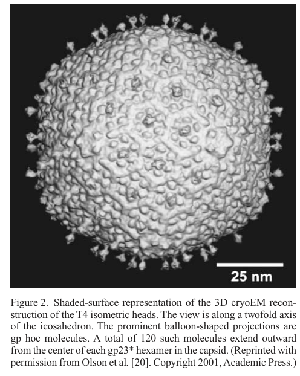

## Question

# Gene Research for Functional Annotation

## ⚠️ CRITICAL: Gene/Protein Identification Context

**BEFORE YOU BEGIN RESEARCH:** You MUST verify you are researching the CORRECT gene/protein. Gene symbols can be ambiguous, especially for less well-characterized genes from non-model organisms.

### Target Gene/Protein Identity (from UniProt):
- **UniProt Accession:** P04535
- **Protein Description:** RecName: Full=Major capsid protein {ECO:0000255|HAMAP-Rule:MF_04117, ECO:0000303|PubMed:6335532}; AltName: Full=Gene product 23 {ECO:0000303|PubMed:6335532}; AltName: Full=Major head protein {ECO:0000255|HAMAP-Rule:MF_04117, ECO:0000305}; AltName: Full=gp23 {ECO:0000255|HAMAP-Rule:MF_04117, ECO:0000303|PubMed:6335532}; Contains: RecName: Full=Mature major capsid protein {ECO:0000255|HAMAP-Rule:MF_04117, ECO:0000305}; AltName: Full=gp23* {ECO:0000255|HAMAP-Rule:MF_04117, ECO:0000303|PubMed:1069310};
- **Gene Information:** Name=gp23;
- **Organism (full):** Enterobacteria phage T4 (Bacteriophage T4).
- **Protein Family:** Belongs to the Tevenvirinae major capsid protein family.
- **Key Domains:** CAPSID_Myoviridae. (IPR038997); Gp23/Gp24_T4-like. (IPR010762); Gp23 (PF07068)

### MANDATORY VERIFICATION STEPS:

1. **Check if the gene symbol "gp23" matches the protein description above**
2. **Verify the organism is correct:** Enterobacteria phage T4 (Bacteriophage T4).
3. **Check if protein family/domains align with what you find in literature**
4. **If you find literature for a DIFFERENT gene with the same or similar symbol, STOP**

### If Gene Symbol is Ambiguous or You Cannot Find Relevant Literature:

**DO NOT PROCEED WITH RESEARCH ON A DIFFERENT GENE.** Instead:
- State clearly: "The gene symbol 'gp23' is ambiguous or literature is limited for this specific protein"
- Explain what you found (e.g., "Found extensive literature on a different gene with the same symbol in a different organism")
- Describe the protein based ONLY on the UniProt information provided above
- Suggest that the protein function can be inferred from domain/family information

### Research Target:

Please provide a comprehensive research report on the gene **gp23** (gene ID: gp23, UniProt: P04535) in BPT4.

The research report should be a detailed narrative explaining the function, biological processes, and localization of the gene product. Citations should be given for all claims.

You should prioritize authoritative reviews and primary scientific literature when conducting research. You can supplement
this with annotations you find in gene/protein databases, but these can be outdated or inaccurate.

We are specifically interested in the primary function of the gene - for enzymes, what reaction is catalyzed, and what is the substrate specificity? For transporters, what is the substrate? For structural proteins or adapters, what is the broader structural role? For signaling molecules, what is the role in the pathway.

We are interested in where in or outside the cell the gene product carries out its function.

We are also interested in the signaling or biochemical pathways in which the gene functions. We are less interested in broad pleiotropic effects, except where these elucidate the precise role.

Include evidence where possible. We are interested in both experimental evidence as well as inference from structure, evolution, or bioinformatic analysis. Precise studies should be prioritized over high-throughput, where available.

## Output

Question: You are an expert researcher providing comprehensive, well-cited information.

Provide detailed information focusing on:
1. Key concepts and definitions with current understanding
2. Recent developments and latest research (prioritize 2023-2024 sources)
3. Current applications and real-world implementations
4. Expert opinions and analysis from authoritative sources
5. Relevant statistics and data from recent studies

Format as a comprehensive research report with proper citations. Include URLs and publication dates where available.
Always prioritize recent, authoritative sources and provide specific citations for all major claims.

# Gene Research for Functional Annotation

## ⚠️ CRITICAL: Gene/Protein Identification Context

**BEFORE YOU BEGIN RESEARCH:** You MUST verify you are researching the CORRECT gene/protein. Gene symbols can be ambiguous, especially for less well-characterized genes from non-model organisms.

### Target Gene/Protein Identity (from UniProt):
- **UniProt Accession:** P04535
- **Protein Description:** RecName: Full=Major capsid protein {ECO:0000255|HAMAP-Rule:MF_04117, ECO:0000303|PubMed:6335532}; AltName: Full=Gene product 23 {ECO:0000303|PubMed:6335532}; AltName: Full=Major head protein {ECO:0000255|HAMAP-Rule:MF_04117, ECO:0000305}; AltName: Full=gp23 {ECO:0000255|HAMAP-Rule:MF_04117, ECO:0000303|PubMed:6335532}; Contains: RecName: Full=Mature major capsid protein {ECO:0000255|HAMAP-Rule:MF_04117, ECO:0000305}; AltName: Full=gp23* {ECO:0000255|HAMAP-Rule:MF_04117, ECO:0000303|PubMed:1069310};
- **Gene Information:** Name=gp23;
- **Organism (full):** Enterobacteria phage T4 (Bacteriophage T4).
- **Protein Family:** Belongs to the Tevenvirinae major capsid protein family.
- **Key Domains:** CAPSID_Myoviridae. (IPR038997); Gp23/Gp24_T4-like. (IPR010762); Gp23 (PF07068)

### MANDATORY VERIFICATION STEPS:

1. **Check if the gene symbol "gp23" matches the protein description above**
2. **Verify the organism is correct:** Enterobacteria phage T4 (Bacteriophage T4).
3. **Check if protein family/domains align with what you find in literature**
4. **If you find literature for a DIFFERENT gene with the same or similar symbol, STOP**

### If Gene Symbol is Ambiguous or You Cannot Find Relevant Literature:

**DO NOT PROCEED WITH RESEARCH ON A DIFFERENT GENE.** Instead:
- State clearly: "The gene symbol 'gp23' is ambiguous or literature is limited for this specific protein"
- Explain what you found (e.g., "Found extensive literature on a different gene with the same symbol in a different organism")
- Describe the protein based ONLY on the UniProt information provided above
- Suggest that the protein function can be inferred from domain/family information

### Research Target:

Please provide a comprehensive research report on the gene **gp23** (gene ID: gp23, UniProt: P04535) in BPT4.

The research report should be a detailed narrative explaining the function, biological processes, and localization of the gene product. Citations should be given for all claims.

You should prioritize authoritative reviews and primary scientific literature when conducting research. You can supplement
this with annotations you find in gene/protein databases, but these can be outdated or inaccurate.

We are specifically interested in the primary function of the gene - for enzymes, what reaction is catalyzed, and what is the substrate specificity? For transporters, what is the substrate? For structural proteins or adapters, what is the broader structural role? For signaling molecules, what is the role in the pathway.

We are interested in where in or outside the cell the gene product carries out its function.

We are also interested in the signaling or biochemical pathways in which the gene functions. We are less interested in broad pleiotropic effects, except where these elucidate the precise role.

Include evidence where possible. We are interested in both experimental evidence as well as inference from structure, evolution, or bioinformatic analysis. Precise studies should be prioritized over high-throughput, where available.

## Research report: functional annotation of **gp23** (UniProt **P04535**) from **Enterobacteria phage T4** (Bacteriophage T4)

### Executive summary
The **T4 gp23** gene encodes the **major capsid (head) protein** of bacteriophage T4. In the mature virion it is present as the **proteolytically processed** form **gp23***, which assembles into **hexameric capsomers** to build the **hexagonal lattice** of the **prolate icosahedral** head. gp23 is therefore primarily a **structural protein** (not an enzyme or transporter), responsible for forming the protective shell that encloses the genome and provides binding sites for outer decoration proteins (Soc and Hoc). gp23 maturation depends on a **prohead protease (gp21)** and on **chaperone-assisted folding** (host GroEL plus phage cochaperonin gp31). Quantitatively, the capsid shell contains ~**930 gp23*** subunits arranged as **155 hexamers**, and the T4 head is ~**120 nm × 86 nm** with triangulation parameters **Tend = 13 laevo** and **Tmid = 20**. These structural features have been leveraged in **2023–2024 engineering applications**, including **T4-based artificial viral vectors** for delivery of large DNA and diverse biomolecular cargos into human cells.

### 1) Key concepts and definitions (current understanding)

#### 1.1 Major capsid protein (MCP) and capsomer
In tailed dsDNA phages, the **major capsid protein** is the primary building block of the icosahedral/prolate head lattice. In T4, **gp23*** forms the **hexagonal capsid lattice** as **hexameric capsomers** that tile the shell. (black2012structureassemblyand pages 1-4, rao2023bacteriophaget4head pages 3-5)

#### 1.2 Prohead (procapsid) maturation and proteolytic processing
T4 head assembly proceeds through a **DNA-free prohead** that undergoes **proteolytic maturation**. For gp23 specifically, the prohead form is cleaved to mature **gp23*** by removing an N‑terminal peptide; the current high-level consensus is that **65 N-terminal residues** are removed during maturation. (rao2023bacteriophaget4head pages 1-3, mesyanzhinov2004moleculararchitectureof pages 1-2)

#### 1.3 HK97-like fold
A widely used structural concept in dsDNA phage biology is the **HK97-like fold**, a conserved architecture of capsid proteins. T4 gp23*/gp23 is described as adopting an **HK97-like fold**, inferred historically by modeling and supported by more recent cryo-EM structural descriptions; a T4-specific feature set includes a **~60-residue insertion (I) domain** and a **~25-residue N-fist**, which help form stabilizing contact networks within and between capsomers. (rao2010structureandassembly pages 1-2, rao2023bacteriophaget4head pages 3-5)

#### 1.4 Decoration proteins (Soc and Hoc)
T4 has nonessential **outer capsid decoration proteins** that bind the gp23* lattice:
- **Hoc** binds at the **center of each gp23* hexamer** and protrudes outward as a fiber-like structure. (zhu2023designofbacteriophage pages 1-2, leiman2003structureandmorphogenesis pages 3-6)
- **Soc** binds on the exterior and bridges/strengthens the lattice by binding between gp23* subunits/hexamers, forming a cage/mesh-like reinforcing network. (zhu2023designofbacteriophage pages 1-2, yap2014structureandfunction pages 3-4)

### 2) Molecular function, biological process context, and localization

#### 2.1 Primary function
**gp23 is the major structural protein forming the capsid shell.** Its biological function is to assemble into the head lattice that **encloses and protects the dsDNA genome** and withstands the mechanical stress of packaging and storage; recent structural synthesis reports that the mature head tolerates high internal pressure on the order of **~25 atm**. (rao2023bacteriophaget4head pages 3-5)

#### 2.2 Virion localization and architectural role
gp23* localizes to the **outer capsid shell** as **155 hexameric capsomers**; vertex positions are mainly occupied by gp24* pentamers (11 vertices), while the unique portal vertex is gp20 (dodecamer). In cryo-EM reconstructions and schematics, Hoc appears as protrusions at hexamer centers and Soc as a mesh binding between gp23* subunits/hexamers (supporting a surface-decoration and reinforcement function). (zhu2023designofbacteriophage pages 1-2, leiman2003structureandmorphogenesis pages 3-6, leiman2003structureandmorphogenesis media 6e8addd6)

#### 2.3 Assembly and maturation pathway placement
A current synthesis of head morphogenesis places gp23 in a pathway with:
1) **Chaperone-assisted folding** of gp23
2) assembly into a **prohead** lattice (uncleaved gp23)
3) activation of the **prohead protease** and **cleavage** of gp23 → gp23*
4) capsid **expansion/remodeling** and subsequent genome packaging via the portal vertex.
Evidence supporting key steps includes: gp23 folding requiring GroEL + gp31 (see below), gp23 N-terminal cleavage to gp23* by gp21 protease, and large-scale maturation conformational changes/expansion. (black2012structureassemblyand pages 1-4, yap2014structureandfunction pages 3-4, rao2023bacteriophaget4head pages 3-5)

### 3) Mechanistic details supported by authoritative sources

#### 3.1 Proteolytic maturation: gp23 → gp23*
Multiple sources converge that gp23 is maturationally cleaved to gp23*:
- A 2023 structural review specifies **removal of 65 N‑terminal residues** to form gp23*. (rao2023bacteriophaget4head pages 1-3)
- A 2004 architecture review quantifies that gp23 is **521 aa** in the prohead and **422 aa** in the mature head (consistent with N‑terminal cleavage) and explicitly links cleavage to **protease gp21**. (mesyanzhinov2004moleculararchitectureof pages 1-2)
- Broad head-assembly reviews state that **gp21 morphogenetic protease** processes gp23 and many other prohead proteins during maturation. (black2012structureassemblyand pages 1-4)

#### 3.2 Chaperone dependence: GroEL + gp31
A distinctive aspect of gp23 biology is its **folding dependency**: gp23 requires the bacterial **GroEL** chaperonin plus the **phage-encoded cochaperonin gp31**, and classic reviews emphasize that GroES cannot substitute for gp31 in gp23 folding. (black2012structureassemblyand pages 1-4, rao2010structureandassembly pages 1-2, mesyanzhinov2004moleculararchitectureof pages 1-2)

#### 3.3 Interaction network stabilizing the mature shell
A 2023 synthesis provides a mechanistic view of gp23* stabilization in the mature shell: P-domain electrostatic interactions near quasi-threefold axes plus contacts mediated by the I-domain and N-fist produce a large intra-/intercapsomer interaction network that supports stability against internal pressure. (rao2023bacteriophaget4head pages 3-5)

#### 3.4 Interfaces with other head proteins
Functionally relevant interaction partners include:
- **gp24***: vertex pentamer protein; gp23 can evolve/bypass into vertex function by specific mutations (gp24 bypass). (rao2023bacteriophaget4head pages 3-5)
- **gp20**: portal vertex protein at the unique vertex for DNA entry/exit; while not all sources describe a direct binding interface at residue level, portal–capsid coupling is a key part of head morphogenesis and expansion. (rao2023bacteriophaget4head pages 1-3)
- **Soc/Hoc**: external proteins binding to the gp23* lattice; Hoc binds at hexamer centers and Soc bridges/strengthens between gp23* subunits/hexamers. (zhu2023designofbacteriophage pages 1-2, yap2014structureandfunction pages 3-4)

### 4) Quantitative statistics and data (recent and classic)

#### 4.1 Capsid geometry and dimensions
The mature T4 head is consistently described as a **prolate icosahedron** about **120 nm long × 86 nm wide**, with triangulation parameters **Tend = 13 laevo** (end caps) and **Tmid = 20** (midsection). (black2012structureassemblyand pages 1-4, rao2023bacteriophaget4head pages 1-3)

#### 4.2 Stoichiometry / copy numbers (mature head)
Multiple independent summaries provide convergent copy numbers for major head components:
- **gp23***: ~**930 subunits** (organized as **155 hexamers**) (zhu2023designofbacteriophage pages 1-2, rao2023bacteriophaget4head pages 3-5)
- **gp24***: ~**55 subunits** (11 pentamers) (zhu2023designofbacteriophage pages 1-2, black2012structureassemblyand pages 1-4)
- **gp20 portal**: **12 subunits** (dodecamer) (zhu2023designofbacteriophage pages 1-2, black2012structureassemblyand pages 1-4)
- **Hoc**: ~**155 copies** (one per hexamer) (zhu2023designofbacteriophage pages 1-2, leiman2003structureandmorphogenesis pages 3-6)
- **Soc**: ~**870 copies** (forms a reinforcing cage/mesh) (zhu2023designofbacteriophage pages 1-2, black2012structureassemblyand pages 1-4)

#### 4.3 Capsid expansion / volume change during maturation
Recent structural synthesis emphasizes that unexpanded → expanded maturation involves large domain motions and yields about a **~70% increase in inner volume**, simultaneously creating high-affinity binding sites for Soc and Hoc. (rao2023bacteriophaget4head pages 1-3)

### 5) Recent developments (prioritizing 2023–2024)

#### 5.1 2023: Updated cryo-EM-informed model of gp23* conformational remodeling and portal–capsid coupling
A 2023 Viruses review integrates recent cryo-EM structures showing distinct unexpanded vs expanded conformations and highlights the quantitative **~70% inner-volume increase** and a model in which portal-vertex structural changes can trigger capsid remodeling that propagates as an expansion wave. (Publication: Feb 2023; URL: https://doi.org/10.3390/v15020527) (rao2023bacteriophaget4head pages 1-3)

#### 5.2 2023: T4 gp23*-based artificial viral vectors for human genome remodeling
A 2023 Nature Communications paper describes an “assembly-line” engineering approach using T4 head components built on the gp23* capsid lattice. The platform starts from a **120 × 86 nm** capsid shell that can accommodate **~171 kbp DNA**, assembled from **930 gp23*** subunits, and uses Hoc/Soc for high-density external display and reinforcement. The authors demonstrate delivery of biomolecules (DNAs, proteins, RNAs, RNPs) and lipid-coating for entry into human cells; they also report engineering-relevant quantitative electrostatics (e.g., WT capsid net negative charge and a more “super-acidic” capsid variant). (Publication: May 2023; URL: https://doi.org/10.1038/s41467-023-38364-1) (zhu2023designofbacteriophage pages 1-2)

#### 5.3 2024: Contemporary views on DNA packaging kinetics that contextualize capsid requirements
A 2024 review of phage T4 packaging using single-molecule fluorescence emphasizes the in vitro packaging system and links packaging dynamics to head assembly components; in parallel, the 2023 head review reports packaging speeds up to **~2000 bp/s**, among the fastest known. These kinetics provide functional constraints on capsid integrity (gp23* shell) during rapid genome translocation. (Publication: Jan 2024; URL: https://doi.org/10.3390/v16020192) (rao2023bacteriophaget4head pages 1-3)

### 6) Current applications and real-world implementations

#### 6.1 Nanomaterial / delivery scaffold applications
The best-supported recent real-world engineering application directly leveraging gp23* is **T4-based artificial viral vectors** for delivery of large genetic payloads and other cargo into human cells, enabled by the stable, high-capacity gp23* capsid and its high-density attachment sites through Hoc and Soc. (zhu2023designofbacteriophage pages 1-2)

#### 6.2 Vaccine/antigen display (platform capability)
Even outside the 2023 AVV work, authoritative head-assembly reviews emphasize that Hoc and Soc (binding the gp23* lattice) have been “extensively used” for peptide/antigen display, and the 2023 head review summarizes that antigen-decorated T4 nanoparticles can elicit robust immune responses and protection in multiple animal models (details of individual studies are summarized at review level). (black2012structureassemblyand pages 4-7, rao2023bacteriophaget4head pages 8-10)

### 7) Expert opinions / authoritative synthesis

#### 7.1 gp23 as a paradigm for conserved capsid architecture
Major reviews by leaders in T4 structural biology emphasize that gp23 is the core building block of the head lattice and that its **HK97-like fold** connects T4 biology to a broad evolutionary and mechanistic framework for dsDNA viruses. (black2012structureassemblyand pages 1-4, rao2010structureandassembly pages 1-2)

#### 7.2 gp23-specific folding requirements as a key mechanistic constraint
Authoritative head-assembly reviews highlight gp23’s unusual dependence on phage gp31 with host GroEL as a central constraint and control point for productive capsid formation—an “expert consensus” that informs functional annotation and experimental design (e.g., recombinant expression and assembly studies). (black2012structureassemblyand pages 1-4, rao2010structureandassembly pages 1-2)

### 8) Visual evidence (capsid architecture)
Cropped cryo-EM figures and schematics show gp23* hexamers forming the capsid lattice and the binding locations of Hoc and Soc on the lattice; Hoc appears as protrusions at hexamer centers and Soc forms a connecting mesh between gp23* subunits/hexamers. (leiman2003structureandmorphogenesis media 6e8addd6, leiman2003structureandmorphogenesis media f9872c66)

### 9) Concise evidence-backed annotation table
| Feature | Evidence summary | Key quantitative values | Key sources with year+URL |
|---|---|---|---|
| Identity | gp23 in Enterobacteria phage T4 corresponds to the major capsid (head) protein; the mature virion contains the processed form gp23*. It is the principal protein forming the hexagonal capsid lattice of the T4 head. (black2012structureassemblyand pages 1-4, rao2023bacteriophaget4head pages 1-3) | Mature shell contains ~930 gp23* subunits arranged as 155 hexameric capsomers | Rao & Black 2010 — https://doi.org/10.1186/1743-422x-7-356; Rao et al. 2023 — https://doi.org/10.3390/v15020527 |
| Primary function | gp23/gp23* is a structural protein, not an enzyme: its primary role is to build the protective capsid shell that encloses the T4 dsDNA genome and withstands high internal pressure after DNA packaging. (rao2023bacteriophaget4head pages 3-5) | Capsid contains ~171 kbp dsDNA; internal pressure ~25 atm | Rao et al. 2023 — https://doi.org/10.3390/v15020527 |
| Structural fold/domains | Structural modeling and cryo-EM indicate gp23* has an HK97-like major capsid protein fold, with T4-specific additions including an insertion (I) domain and N-fist that contribute to intra- and intercapsomer stabilization. (rao2010structureandassembly pages 1-2, rao2023bacteriophaget4head pages 3-5) | Unique features include ~60-residue I domain and ~25-residue N-fist | Rao & Black 2010 — https://doi.org/10.1186/1743-422x-7-356; Rao et al. 2023 — https://doi.org/10.3390/v15020527 |
| Assembly state | gp23* assembles as hexamers/capsomers that form the prolate head lattice; gp24* forms pentamers at 11 vertices, while a gp20 dodecamer forms the unique portal vertex. In gp24 bypass mutants, gp23 can also occupy vertex positions. (black2012structureassemblyand pages 1-4, rao2010structureandassembly pages 1-2, rao2023bacteriophaget4head pages 3-5) | 155 gp23* hexamers; 11 gp24* pentamers; 1 gp20 portal dodecamer | Black & Rao 2012 — https://doi.org/10.1016/B978-0-12-394621-8.00018-2; Rao & Black 2010 — https://doi.org/10.1186/1743-422x-7-356; Rao et al. 2023 — https://doi.org/10.3390/v15020527 |
| Maturation processing | gp23 is synthesized as a prohead protein and proteolytically processed during maturation to gp23* by removal of an N-terminal peptide; this cleavage accompanies large conformational changes and capsid expansion. (rao2023bacteriophaget4head pages 1-3, mesyanzhinov2004moleculararchitectureof pages 1-2, rao2023bacteriophaget4head pages 3-5) | 65 N-terminal residues removed; prohead-to-head inner volume increase ~70% | Mesyanzhinov et al. 2004 — https://doi.org/10.1007/pl00021751; Rao et al. 2023 — https://doi.org/10.3390/v15020527 |
| Protease/chaperones | The phage-encoded protease gp21 mediates maturation cleavage, and productive gp23 folding requires host GroEL together with the phage cochaperonin gp31; GroES cannot substitute for gp31 in gp23 folding. (black2012structureassemblyand pages 4-7, black2012structureassemblyand pages 1-4, mesyanzhinov2004moleculararchitectureof pages 1-2) | gp21 also processes many prohead proteins; gp23 folding specifically depends on GroEL+gp31 | Black & Rao 2012 — https://doi.org/10.1016/B978-0-12-394621-8.00018-2; Rao & Black 2010 — https://doi.org/10.1186/1743-422x-7-356; Mesyanzhinov et al. 2004 — https://doi.org/10.1007/pl00021751 |
| Virion localization | gp23* localizes to the outer shell of the T4 head/capsid, forming the hexagonal lattice over most of the prolate virion head. Hoc binds at the centers of gp23* hexamers and Soc binds between adjacent gp23* subunits/hexamers on the exterior. (zhu2023designofbacteriophage pages 1-2, leiman2003structureandmorphogenesis pages 3-6, leiman2003structureandmorphogenesis media 6e8addd6) | 1 Hoc per gp23* hexamer; Soc forms trimers at junctions of three gp23* hexamers | Zhu et al. 2023 — https://doi.org/10.1038/s41467-023-38364-1; Leiman et al. 2003 — https://doi.org/10.1007/s00018-003-3072-1 |
| Key interaction partners | Major structural partners are gp24* (vertex protein), gp20 (portal vertex), Soc (capsid clamp/reinforcement protein), and Hoc (outer fiber-like decoration protein). Soc bridges adjacent gp23* subunits and reinforces the pressurized shell; Hoc projects outward from gp23* hexamer centers. (zhu2023designofbacteriophage pages 1-2, yap2014structureandfunction pages 3-4, rao2023bacteriophaget4head pages 3-5) | Soc ~870 copies/capsid; Hoc ~155 copies/capsid | Zhu et al. 2023 — https://doi.org/10.1038/s41467-023-38364-1; Yap & Rossmann 2014 — https://doi.org/10.2217/fmb.14.91; Rao et al. 2023 — https://doi.org/10.3390/v15020527 |
| Quantitative stoichiometry | Recent and classic structural summaries converge on a shell made predominantly of gp23* with fixed numbers of gp24*, gp20, Hoc, and Soc. Minor variation exists in review summaries, but the consensus mature capsid is ~930 gp23*, 55 gp24*, 12 gp20, 155 Hoc, and 870 Soc. (zhu2023designofbacteriophage pages 1-2, black2012structureassemblyand pages 1-4, mesyanzhinov2004moleculararchitectureof pages 1-2) | gp23* ~930; gp24* ~55; gp20 12; Hoc ~155; Soc ~870 | Zhu et al. 2023 — https://doi.org/10.1038/s41467-023-38364-1; Black & Rao 2012 — https://doi.org/10.1016/B978-0-12-394621-8.00018-2; Mesyanzhinov et al. 2004 — https://doi.org/10.1007/pl00021751 |
| Capsid geometry/dimensions | The T4 head is a prolate icosahedron with triangulation parameters Tend = 13 laevo and Tmid = 20. Across studies it is consistently reported as about 120 nm long and 86 nm wide, with the shell built from gp23* hexamers and gp24* pentamers. (black2012structureassemblyand pages 1-4, rao2023bacteriophaget4head pages 1-3, rao2023bacteriophaget4head pages 3-5) | ~120 × 86 nm; Tend = 13 laevo; Tmid = 20 | Black & Rao 2012 — https://doi.org/10.1016/B978-0-12-394621-8.00018-2; Rao et al. 2023 — https://doi.org/10.3390/v15020527 |
| Relevant 2023-2024 developments/applications | Recent work has leveraged the gp23*-based T4 capsid as a programmable nanomaterial: engineered artificial viral vectors used the 120 × 86 nm shell, Soc/Hoc display sites, and ATP-driven refilling to deliver DNAs, proteins, RNAs, and RNPs into human cells. 2023 structural reviews also emphasized cryo-EM-resolved unexpanded/expanded gp23* states and ~70% volume gain as key design parameters. (zhu2023designofbacteriophage pages 1-2, rao2023bacteriophaget4head pages 8-10, rao2023bacteriophaget4head pages 1-3) | Capsid payload capacity ~171 kbp DNA; WT capsid net charge 6,829 negative charges; 9DE mutant 15,199 negative charges | Zhu et al. 2023 — https://doi.org/10.1038/s41467-023-38364-1; Rao et al. 2023 — https://doi.org/10.3390/v15020527 |

*Table: This table summarizes the functional annotation of bacteriophage T4 major capsid protein gp23/gp23*, including identity, structural role, maturation, localization, stoichiometry, and recent applications. It is useful as a concise evidence-backed reference for interpreting UniProt P04535 in the context of T4 head assembly and engineering.*

### 10) Practical functional annotation (for databases)
- **Gene/protein:** gp23 (major capsid protein), mature form gp23* (UniProt P04535)
- **Molecular function:** structural capsid protein; forms hexameric capsomers in capsid shell (black2012structureassemblyand pages 1-4, rao2023bacteriophaget4head pages 3-5)
- **Biological process:** prohead assembly → proteolytic maturation (gp21) → capsid expansion/remodeling → genome packaging and virion assembly (black2012structureassemblyand pages 1-4, rao2023bacteriophaget4head pages 3-5)
- **Cell/virion localization:** capsid shell (head) of extracellular virion; binding platform for outer decoration proteins Soc/Hoc (zhu2023designofbacteriophage pages 1-2, leiman2003structureandmorphogenesis media 6e8addd6)
- **Key dependencies:** chaperone-assisted folding via GroEL + gp31 (black2012structureassemblyand pages 1-4, mesyanzhinov2004moleculararchitectureof pages 1-2)
- **Key quantitative parameters:** ~930 subunits (155 hexamers); T4 head ~120×86 nm; Tend=13 laevo, Tmid=20; N-terminal cleavage of 65 residues (rao2023bacteriophaget4head pages 3-5, black2012structureassemblyand pages 1-4, rao2023bacteriophaget4head pages 1-3)

### Limitations of this synthesis
The assembled evidence strongly supports gp23’s structural role, maturation processing, and stoichiometry, but does not provide residue-level interaction maps or the exact cleavage site sequence within the gp23 N-terminus; those would require targeted extraction from primary proteolysis/maturation papers or UniProt feature tables not retrieved in the current tool context.

References

1. (black2012structureassemblyand pages 1-4): Lindsay W. Black and Venigalla B. Rao. Structure, assembly, and dna packaging of the bacteriophage t4 head. Advances in virus research, 82:119-53, Jan 2012. URL: https://doi.org/10.1016/b978-0-12-394621-8.00018-2, doi:10.1016/b978-0-12-394621-8.00018-2. This article has 103 citations and is from a peer-reviewed journal.

2. (rao2023bacteriophaget4head pages 3-5): Venigalla B. Rao, Andrei Fokine, Qianglin Fang, and Qianqian Shao. Bacteriophage t4 head: structure, assembly, and genome packaging. Viruses, 15:527, Feb 2023. URL: https://doi.org/10.3390/v15020527, doi:10.3390/v15020527. This article has 58 citations.

3. (rao2023bacteriophaget4head pages 1-3): Venigalla B. Rao, Andrei Fokine, Qianglin Fang, and Qianqian Shao. Bacteriophage t4 head: structure, assembly, and genome packaging. Viruses, 15:527, Feb 2023. URL: https://doi.org/10.3390/v15020527, doi:10.3390/v15020527. This article has 58 citations.

4. (mesyanzhinov2004moleculararchitectureof pages 1-2): V. V. Mesyanzhinov, P. G. Leiman, V. A. Kostyuchenko, L. P. Kurochkina, K. A. Miroshnikov, N. N. Sykilinda, and M. M. Shneider. Molecular architecture of bacteriophage t4. Biochemistry (Moscow), 69:1190-1202, Nov 2004. URL: https://doi.org/10.1007/pl00021751, doi:10.1007/pl00021751. This article has 61 citations.

5. (rao2010structureandassembly pages 1-2): Venigalla B Rao and Lindsay W Black. Structure and assembly of bacteriophage t4 head. Virology Journal, 7:356-356, Dec 2010. URL: https://doi.org/10.1186/1743-422x-7-356, doi:10.1186/1743-422x-7-356. This article has 162 citations and is from a peer-reviewed journal.

6. (zhu2023designofbacteriophage pages 1-2): Jingen Zhu, Himanshu Batra, Neeti Ananthaswamy, Marthandan Mahalingam, Pan Tao, Xiaorong Wu, Wenzheng Guo, Andrei Fokine, and Venigalla B. Rao. Design of bacteriophage t4-based artificial viral vectors for human genome remodeling. Nature Communications, May 2023. URL: https://doi.org/10.1038/s41467-023-38364-1, doi:10.1038/s41467-023-38364-1. This article has 44 citations and is from a highest quality peer-reviewed journal.

7. (leiman2003structureandmorphogenesis pages 3-6): P. G. Leiman, S. Kanamaru, V. V. Mesyanzhinov, F. Arisaka, and M. G. Rossmann. Structure and morphogenesis of bacteriophage t4. Cellular and Molecular Life Sciences CMLS, 60:2356-2370, Nov 2003. URL: https://doi.org/10.1007/s00018-003-3072-1, doi:10.1007/s00018-003-3072-1. This article has 359 citations.

8. (yap2014structureandfunction pages 3-4): Moh Lan Yap and Michael G Rossmann. Structure and function of bacteriophage t4. Future microbiology, 9 12:1319-27, Dec 2014. URL: https://doi.org/10.2217/fmb.14.91, doi:10.2217/fmb.14.91. This article has 282 citations and is from a peer-reviewed journal.

9. (leiman2003structureandmorphogenesis media 6e8addd6): P. G. Leiman, S. Kanamaru, V. V. Mesyanzhinov, F. Arisaka, and M. G. Rossmann. Structure and morphogenesis of bacteriophage t4. Cellular and Molecular Life Sciences CMLS, 60:2356-2370, Nov 2003. URL: https://doi.org/10.1007/s00018-003-3072-1, doi:10.1007/s00018-003-3072-1. This article has 359 citations.

10. (black2012structureassemblyand pages 4-7): Lindsay W. Black and Venigalla B. Rao. Structure, assembly, and dna packaging of the bacteriophage t4 head. Advances in virus research, 82:119-53, Jan 2012. URL: https://doi.org/10.1016/b978-0-12-394621-8.00018-2, doi:10.1016/b978-0-12-394621-8.00018-2. This article has 103 citations and is from a peer-reviewed journal.

11. (rao2023bacteriophaget4head pages 8-10): Venigalla B. Rao, Andrei Fokine, Qianglin Fang, and Qianqian Shao. Bacteriophage t4 head: structure, assembly, and genome packaging. Viruses, 15:527, Feb 2023. URL: https://doi.org/10.3390/v15020527, doi:10.3390/v15020527. This article has 58 citations.

12. (leiman2003structureandmorphogenesis media f9872c66): P. G. Leiman, S. Kanamaru, V. V. Mesyanzhinov, F. Arisaka, and M. G. Rossmann. Structure and morphogenesis of bacteriophage t4. Cellular and Molecular Life Sciences CMLS, 60:2356-2370, Nov 2003. URL: https://doi.org/10.1007/s00018-003-3072-1, doi:10.1007/s00018-003-3072-1. This article has 359 citations.

## Artifacts

- [Edison artifact artifact-00](gp23-deep-research-falcon_artifacts/artifact-00.md)

## Citations

1. mesyanzhinov2004moleculararchitectureof pages 1-2
2. black2012structureassemblyand pages 1-4
3. zhu2023designofbacteriophage pages 1-2
4. rao2010structureandassembly pages 1-2
5. leiman2003structureandmorphogenesis pages 3-6
6. yap2014structureandfunction pages 3-4
7. black2012structureassemblyand pages 4-7
8. https://doi.org/10.3390/v15020527
9. https://doi.org/10.1038/s41467-023-38364-1
10. https://doi.org/10.3390/v16020192
11. https://doi.org/10.1186/1743-422x-7-356;
12. https://doi.org/10.1016/B978-0-12-394621-8.00018-2;
13. https://doi.org/10.1007/pl00021751;
14. https://doi.org/10.1007/pl00021751
15. https://doi.org/10.1038/s41467-023-38364-1;
16. https://doi.org/10.1007/s00018-003-3072-1
17. https://doi.org/10.2217/fmb.14.91;
18. https://doi.org/10.1016/b978-0-12-394621-8.00018-2,
19. https://doi.org/10.3390/v15020527,
20. https://doi.org/10.1007/pl00021751,
21. https://doi.org/10.1186/1743-422x-7-356,
22. https://doi.org/10.1038/s41467-023-38364-1,
23. https://doi.org/10.1007/s00018-003-3072-1,
24. https://doi.org/10.2217/fmb.14.91,