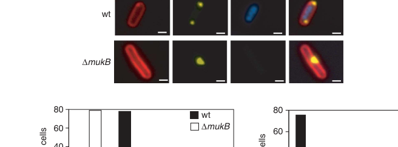

## Question

# Gene Research for Functional Annotation

## ⚠️ CRITICAL: Gene/Protein Identification Context

**BEFORE YOU BEGIN RESEARCH:** You MUST verify you are researching the CORRECT gene/protein. Gene symbols can be ambiguous, especially for less well-characterized genes from non-model organisms.

### Target Gene/Protein Identity (from UniProt):
- **UniProt Accession:** P15556
- **Protein Description:** RecName: Full=Nucleoid disruption protein;
- **Gene Information:** Name=ndd;
- **Organism (full):** Enterobacteria phage T4 (Bacteriophage T4).
- **Protein Family:** Not specified in UniProt
- **Key Domains:** Phage_Ndd. (IPR009514); Phage_T4_Ndd (PF06591)

### MANDATORY VERIFICATION STEPS:

1. **Check if the gene symbol "ndd" matches the protein description above**
2. **Verify the organism is correct:** Enterobacteria phage T4 (Bacteriophage T4).
3. **Check if protein family/domains align with what you find in literature**
4. **If you find literature for a DIFFERENT gene with the same or similar symbol, STOP**

### If Gene Symbol is Ambiguous or You Cannot Find Relevant Literature:

**DO NOT PROCEED WITH RESEARCH ON A DIFFERENT GENE.** Instead:
- State clearly: "The gene symbol 'ndd' is ambiguous or literature is limited for this specific protein"
- Explain what you found (e.g., "Found extensive literature on a different gene with the same symbol in a different organism")
- Describe the protein based ONLY on the UniProt information provided above
- Suggest that the protein function can be inferred from domain/family information

### Research Target:

Please provide a comprehensive research report on the gene **ndd** (gene ID: ndd, UniProt: P15556) in BPT4.

The research report should be a detailed narrative explaining the function, biological processes, and localization of the gene product. Citations should be given for all claims.

You should prioritize authoritative reviews and primary scientific literature when conducting research. You can supplement
this with annotations you find in gene/protein databases, but these can be outdated or inaccurate.

We are specifically interested in the primary function of the gene - for enzymes, what reaction is catalyzed, and what is the substrate specificity? For transporters, what is the substrate? For structural proteins or adapters, what is the broader structural role? For signaling molecules, what is the role in the pathway.

We are interested in where in or outside the cell the gene product carries out its function.

We are also interested in the signaling or biochemical pathways in which the gene functions. We are less interested in broad pleiotropic effects, except where these elucidate the precise role.

Include evidence where possible. We are interested in both experimental evidence as well as inference from structure, evolution, or bioinformatic analysis. Precise studies should be prioritized over high-throughput, where available.

## Output

Question: You are an expert researcher providing comprehensive, well-cited information.

Provide detailed information focusing on:
1. Key concepts and definitions with current understanding
2. Recent developments and latest research (prioritize 2023-2024 sources)
3. Current applications and real-world implementations
4. Expert opinions and analysis from authoritative sources
5. Relevant statistics and data from recent studies

Format as a comprehensive research report with proper citations. Include URLs and publication dates where available.
Always prioritize recent, authoritative sources and provide specific citations for all major claims.

# Gene Research for Functional Annotation

## ⚠️ CRITICAL: Gene/Protein Identification Context

**BEFORE YOU BEGIN RESEARCH:** You MUST verify you are researching the CORRECT gene/protein. Gene symbols can be ambiguous, especially for less well-characterized genes from non-model organisms.

### Target Gene/Protein Identity (from UniProt):
- **UniProt Accession:** P15556
- **Protein Description:** RecName: Full=Nucleoid disruption protein;
- **Gene Information:** Name=ndd;
- **Organism (full):** Enterobacteria phage T4 (Bacteriophage T4).
- **Protein Family:** Not specified in UniProt
- **Key Domains:** Phage_Ndd. (IPR009514); Phage_T4_Ndd (PF06591)

### MANDATORY VERIFICATION STEPS:

1. **Check if the gene symbol "ndd" matches the protein description above**
2. **Verify the organism is correct:** Enterobacteria phage T4 (Bacteriophage T4).
3. **Check if protein family/domains align with what you find in literature**
4. **If you find literature for a DIFFERENT gene with the same or similar symbol, STOP**

### If Gene Symbol is Ambiguous or You Cannot Find Relevant Literature:

**DO NOT PROCEED WITH RESEARCH ON A DIFFERENT GENE.** Instead:
- State clearly: "The gene symbol 'ndd' is ambiguous or literature is limited for this specific protein"
- Explain what you found (e.g., "Found extensive literature on a different gene with the same symbol in a different organism")
- Describe the protein based ONLY on the UniProt information provided above
- Suggest that the protein function can be inferred from domain/family information

### Research Target:

Please provide a comprehensive research report on the gene **ndd** (gene ID: ndd, UniProt: P15556) in BPT4.

The research report should be a detailed narrative explaining the function, biological processes, and localization of the gene product. Citations should be given for all claims.

You should prioritize authoritative reviews and primary scientific literature when conducting research. You can supplement
this with annotations you find in gene/protein databases, but these can be outdated or inaccurate.

We are specifically interested in the primary function of the gene - for enzymes, what reaction is catalyzed, and what is the substrate specificity? For transporters, what is the substrate? For structural proteins or adapters, what is the broader structural role? For signaling molecules, what is the role in the pathway.

We are interested in where in or outside the cell the gene product carries out its function.

We are also interested in the signaling or biochemical pathways in which the gene functions. We are less interested in broad pleiotropic effects, except where these elucidate the precise role.

Include evidence where possible. We are interested in both experimental evidence as well as inference from structure, evolution, or bioinformatic analysis. Precise studies should be prioritized over high-throughput, where available.

## Research report: bacteriophage T4 **ndd** (UniProt **P15556**) nucleoid disruption protein (Ndd)

### 0) Target verification (mandatory)
The gene symbol **ndd** in this report refers specifically to **Enterobacteria phage T4** gene **ndd**, which encodes the **nucleoid (“nuclear”) disruption protein** described in classic T4 infection studies and matches the UniProt entry described by the user (P15556). Bouet et al. sequenced the T4 **ndd** locus and linked it to nucleoid disruption phenotypes, with a predicted protein size of ~16.9 kDa and an infection-associated band of ~15 kDa absent in ndd mutants, consistent with the UniProt description “Nucleoid disruption protein” (publication date Apr 1994; https://doi.org/10.1016/0378-1119(94)90121-X). (bouet1994directpcrsequencing pages 1-2, bouet1994directpcrsequencing pages 3-4)

### 1) Key concepts and current understanding

#### 1.1 Definition: “nuclear/nucleoid disruption” in T4 infection
In T4 literature, “**nuclear disruption**” refers to a rapid and dramatic reorganization of the *E. coli* chromosome (nucleoid) after infection. Koerner & Snustad summarize that within **~2–3 min** of infection, the host nucleoid undergoes disruption/redistribution toward the cell periphery/inner membrane, with ribosomes shifting inward. This phenotype is genetically associated with the phage **ndd** gene product. (publication date Jun 1979; https://doi.org/10.1128/mr.43.2.199-223.1979). (koerner1979shutoffofhost pages 6-8, koerner1979shutoffofhost pages 4-6)

#### 1.2 What Ndd is (and is not)
* **Ndd is a small early phage protein** (coding capacity consistent with a ~15–17 kDa product) required for the canonical “nuclear disruption” phenotype in infected cells. (koerner1979shutoffofhost pages 11-13, bouet1994directpcrsequencing pages 1-2)
* **Ndd is not currently supported to be a nuclease** that drives nucleoid disruption by extensive DNA breakage. Quantitative break data summarized in Koerner & Snustad show only **≤~5 single-strand breaks per strand by 5 min** and **~15–20 by 30 min**, with little dependence on nuclear disruption status, and no detectable host DNA size change at 5 min (host DNA largely >10^8 daltons). (koerner1979shutoffofhost pages 6-8)

#### 1.3 Early-gene context: promoter architecture supports early expression
Bouet et al. identified two sequences **~730 bp and ~1010 bp upstream** of the ndd start codon that “strongly resemble” **T4 immediate-early promoters**, consistent with the observed very early timing of nucleoid disruption during infection. (publication date Apr 1994; https://doi.org/10.1016/0378-1119(94)90121-X). (bouet1994directpcrsequencing pages 7-8)

### 2) Mechanistic function, localization, and pathways

#### 2.1 Primary functional role: remodel host nucleoid architecture very early after infection
The best-supported functional annotation for T4 Ndd is that it is an **early infection effector** that causes rapid **host nucleoid disruption/redistribution**, a hallmark phenotype beginning **~2–3 minutes** after infection (review synthesis of multiple experiments). (koerner1979shutoffofhost pages 6-8, koerner1979shutoffofhost pages 4-6)

#### 2.2 Cellular localization: intracellular; drives nucleoid relocalization to the inner membrane/periphery
Direct experimental visualization of Ndd’s effect outside the infection context comes from *E. coli* expression experiments: in a fluorescence microscopy study on protein aggregation and nucleoid organization, short-term expression of bacteriophage T4 **Ndd** disrupted the nucleoid and relocalized it toward the **inner membrane/periphery** (Figure 4C panel showing +Ndd vs −Ndd). (publication date Mar 2010; https://doi.org/10.1038/emboj.2009.412). (winkler2010quantitativeandspatio‐temporal media 199a94dd, winkler2010quantitativeandspatio‐temporal media c49cd054)

These images support that Ndd acts within the bacterial cytoplasm to reorganize chromosome positioning, aligning with the infection-time microscopy summarized by Koerner & Snustad. (koerner1979shutoffofhost pages 6-8, winkler2010quantitativeandspatio‐temporal media 199a94dd)

#### 2.3 Relationship to host DNA synthesis shutoff
Koerner & Snustad report that nuclear disruption (ndd+) is **required for early shutoff of host DNA synthesis**: host DNA synthesis shutoff occurs at approximately **~4 min** postinfection in wild-type infection but is delayed until **~10 min** in **ndd mutants**. They also note nuclear disruption “does not appear” to be involved in shutoff of host RNA or protein synthesis (in the summarized literature). (koerner1979shutoffofhost pages 10-11)

This links Ndd’s primary role to early reprogramming of host chromosome physiology, rather than a general shutdown of transcription/translation. (koerner1979shutoffofhost pages 10-11)

#### 2.4 A proposed (still unproven) mechanistic model: DNA–membrane attachments and membrane release kinetics
Koerner & Snustad further summarize biochemical fractionation evidence (M-band assays) that host DNA becomes progressively released from membrane-associated fractions after wild-type infection: release begins at **~10 min**, and by **~30 min ~75%** is non–membrane bound. In contrast, in infections defective for endonuclease II and ndd, **>80%** of host DNA remains membrane associated. (koerner1979shutoffofhost pages 8-10)

Based on these findings and gene-dosage behavior, the authors propose that the ndd product might either:
* **catalyze** host DNA binding to membrane components, or
* function as a **structural bridge** between DNA and membrane;
with gene-dosage observations interpreted as suggesting **stoichiometric** requirement in a restrictive host background (CT447). (koerner1979shutoffofhost pages 8-10)

This should be treated as an expert interpretation from an authoritative review rather than a demonstrated molecular interaction model (no direct visualization of multiple attachments was reported in the extracted evidence). (koerner1979shutoffofhost pages 8-10)

#### 2.5 Interactions with host nucleoid proteins (HU, H-NS)
In the retrieved and analyzed evidence set, **no direct biochemical interaction** between Ndd and specific host nucleoid-associated proteins (e.g., **HU** or **H-NS**) was reported. The classic review focuses on phenotypes, membrane association assays, and DNA break measurements rather than specific Ndd–host protein binding. (koerner1979shutoffofhost pages 6-8, koerner1979shutoffofhost pages 8-10)

### 3) Phenotypes, quantitative data, and strain dependence

#### 3.1 ndd mutants: viability vs fitness effects depend on host context
Koerner & Snustad note that **ndd mutants can grow with near-normal burst size and growth rate in standard laboratory *E. coli***, implying nuclear disruption is not universally essential for T4 growth. (koerner1979shutoffofhost pages 4-6)

However, in the restrictive *E. coli* strain **CT447**, ndd mutants show strong fitness defects:
* Wild-type T4 yield: **~150–200 PFU/cell**
* ndd-deficient yield: **~15 PFU/cell**
* In one CT447 background, phage DNA synthesis rate was **~75% of wild type**, but burst size was **<5%** of the wild-type control, with EM indicating **few filled or empty heads**. (koerner1979shutoffofhost pages 10-11, koerner1979shutoffofhost pages 8-10)

These data support the interpretation that Ndd can be dispensable for replication in some hosts while being important for efficient infection progression in others—an important nuance for functional annotation. (koerner1979shutoffofhost pages 10-11)

#### 3.2 Mutation mapping and protein size
Bouet et al. linked two classical ndd alleles to coding changes:
* **ndd44**: Gly56→Asp
* **ndd98**: Gln58→Stop (premature termination)
These genetic lesions support that the Ndd protein is small and that loss-of-function can be achieved by early truncation. (bouet1994directpcrsequencing pages 3-4)

### 4) Recent developments (prioritizing 2023–2024 where possible)

#### 4.1 Status of 2023–2024 mechanistic research on Ndd
Within the tool-retrieved corpus, **no 2023–2024 papers were found that newly resolve Ndd’s molecular structure or precise molecular mechanism** (e.g., binding partners, structural fold, enzymatic activity). The dominant mechanistic evidence remains classical genetics/biochemistry and more modern “tool-use” demonstrations of nucleoid perturbation by heterologous expression. (koerner1979shutoffofhost pages 6-8, bouet1994directpcrsequencing pages 7-8, winkler2010quantitativeandspatio‐temporal media 199a94dd)

#### 4.2 2022–2024: Ndd in modern phage engineering workflows (application-relevant)
A key modern development is the rise of efficient **phage genome editing** methods that can be applied to T4 and target loci including **ndd**:
* Adler et al. (publication date Oct 2022; https://doi.org/10.1038/s41564-022-01258-x) describe Cas13a-based counterselection to enrich recombinant phage. Their figure/text explicitly notes protospacer locations near **T4 ndd** (and denB). Quantitatively, they report edits present at approximately **~0.1–1%** after homologous recombination in mixed lysates, and after Cas13a enrichment the edited population approached **nearly 100%** among survivors; for specific edits, screening **9 plaques** yielded **100%** mutant success in their tabled examples. (adler2022broadspectrumcrisprcas13aenables pages 5-7)

Although this does not directly refine Ndd’s mechanism, it demonstrates real-world feasibility of manipulating ndd genetically for functional studies or engineered phage design. (adler2022broadspectrumcrisprcas13aenables pages 5-7)

### 5) Current applications and real-world implementations

#### 5.1 Ndd as a cell-biology tool to perturb nucleoid organization
Ndd has been used experimentally as a **tool to disrupt nucleoid architecture** to study downstream consequences (e.g., spatial protein quality control/aggregation). The microscopy panel (Figure 4C) shows that Ndd expression reorganizes the DAPI-stained nucleoid toward the inner membrane, changing cellular spatial organization. (winkler2010quantitativeandspatio‐temporal media 199a94dd, winkler2010quantitativeandspatio‐temporal media c49cd054)

#### 5.2 Ndd in phage genetics and genome editing
Modern phage genome editing can target regions including **ndd**, enabling deletion/mutational analysis, epitope tagging, or regulatory rewiring in a scalable way, with reported strong enrichment performance (pre-enrichment ~0.1–1% to near-total enrichment among survivors). (adler2022broadspectrumcrisprcas13aenables pages 5-7)

### 6) Expert synthesis and interpretation (authoritative sources)
Koerner & Snustad’s Microbiological Reviews article remains a foundational synthesis that:
* frames nuclear disruption as an **early infection program** requiring phage gene expression (chloramphenicol sensitivity),
* decouples nucleoid disruption from extensive DNA nicking,
* connects ndd to early host DNA synthesis shutoff,
* proposes (with caveats) a DNA–membrane attachment/bridging model based on fractionation and gene dosage observations,
* and documents substantial **host-strain dependence** for the fitness consequences of losing ndd. (koerner1979shutoffofhost pages 6-8, koerner1979shutoffofhost pages 8-10, koerner1979shutoffofhost pages 10-11)

Bouet et al. provide gene-level grounding (sequence, alleles, promoter architecture) supporting classification of Ndd as a dedicated T4 early effector protein and lay out cloning/controlled expression as necessary for pinpointing targets (not yet resolved in the extracted evidence). (bouet1994directpcrsequencing pages 7-8, bouet1994directpcrsequencing pages 3-4)

### 7) Evidence summary table
| Claim/Observation | Evidence type (microscopy, genetics, biochemistry, review) | Quantitative details | Experimental system | Interpretation for function/localization | Primary source (authors, year, journal) | URL |
|---|---|---|---|---|---|---|
| T4 **ndd** encodes the protein responsible for early host nucleoid (“nuclear”) disruption and matches the UniProt description of a nucleoid disruption protein | Genetics, sequence analysis | Predicted protein size **~16.9 kDa**; earlier infection studies detected an absent band of **~15 kDa** in **ndd** mutants | Enterobacteria phage T4 infecting *E. coli*; mutant mapping and sequencing | Supports annotation of P15556 as the T4 Ndd nucleoid disruption protein; small early phage protein acting on host chromosome organization (bouet1994directpcrsequencing pages 1-2, bouet1994directpcrsequencing pages 3-4) | Bouet et al., 1994, *Gene* | https://doi.org/10.1016/0378-1119(94)90121-X |
| Nucleoid disruption begins very early after T4 infection and requires phage gene expression | Review of primary experiments, microscopy/physiology | Onset within **2–3 min** postinfection; blocked by chloramphenicol when added at infection | *E. coli* infected with T4 or T-even phages | Places Ndd function in the **early infection stage** inside the bacterial cytoplasm/nucleoid region rather than at late morphogenesis (koerner1979shutoffofhost pages 6-8, koerner1979shutoffofhost pages 4-6) | Koerner & Snustad, 1979, *Microbiological Reviews* | https://doi.org/10.1128/mr.43.2.199-223.1979 |
| **ndd** is not required for basic phage viability in common laboratory strains, but can be important in specific hosts | Genetics, review | Wild-type growth largely normal in standard hosts; in strain CT447, wild-type burst size **~150–200 PFU/cell** versus **~15 PFU/cell** for **ndd** mutants | T4 infection of different *E. coli* hosts, especially CT447 | Ndd is **host-context dependent**: dispensable in some strains but important for full fitness in restrictive backgrounds (koerner1979shutoffofhost pages 8-10, koerner1979shutoffofhost pages 4-6, koerner1979shutoffofhost pages 10-11) | Koerner & Snustad, 1979, *Microbiological Reviews* | https://doi.org/10.1128/mr.43.2.199-223.1979 |
| Loss of **ndd** delays shutoff of host DNA synthesis but does not strongly affect host RNA/protein shutoff | Review of primary physiological studies | Host DNA synthesis shutoff at **~4 min** with **ndd+** phage versus **~10 min** with **ndd** mutants | T4-infected *E. coli* | Functional annotation: Ndd primarily contributes to **rapid host nucleoid remodeling linked to host DNA synthesis shutoff**, not general macromolecular shutoff (koerner1979shutoffofhost pages 10-11) | Koerner & Snustad, 1979, *Microbiological Reviews* | https://doi.org/10.1128/mr.43.2.199-223.1979 |
| Ndd-dependent nuclear disruption is not simply caused by extensive host DNA nicking or breakage | Biochemistry, review | At **5 min**, about **≤5 single-strand breaks per strand**; by **30 min**, **~15–20 breaks**; little difference attributable to nuclear disruption status; most host DNA remained **>10^8 daltons** at 5 min | Sucrose-gradient and DNA break analyses in infected *E. coli* | Supports a **structural reorganization mechanism** rather than direct nuclease activity for Ndd; no catalytic substrate specificity has been demonstrated (koerner1979shutoffofhost pages 6-8) | Koerner & Snustad, 1979, *Microbiological Reviews* | https://doi.org/10.1128/mr.43.2.199-223.1979 |
| Wild-type infection causes progressive release of host DNA from membrane-associated fractions; this is strongly reduced in **ndd**-defective backgrounds | Biochemistry, review | Host DNA begins release at **~10 min**; by **30 min**, about **~75%** released from membrane in wild type, whereas **>80%** remains membrane-associated in endonuclease- and **ndd**-deficient infections | M-band assays in T4-infected *E. coli* | Suggests Ndd promotes **host chromosome redistribution toward/along the inner membrane** or alters DNA-membrane attachments during infection (koerner1979shutoffofhost pages 8-10) | Koerner & Snustad, 1979, *Microbiological Reviews* | https://doi.org/10.1128/mr.43.2.199-223.1979 |
| Earlier authors proposed Ndd may act stoichiometrically as a structural bridge between host DNA and membrane components, though this remains unproven | Review, genetics/physiology interpretation | Gene-dosage observations were interpreted as indicating a **stoichiometric requirement** in CT447 | T4 infection of restrictive *E. coli* CT447 and related genetic analysis | Best current mechanistic inference from classic literature: Ndd is likely a **small structural effector of nucleoid architecture/localization**, not an enzyme with defined reaction chemistry (koerner1979shutoffofhost pages 8-10) | Koerner & Snustad, 1979, *Microbiological Reviews* | https://doi.org/10.1128/mr.43.2.199-223.1979 |
| **ndd** mutants retain substantial phage DNA synthesis in restrictive hosts but show severe defects in productive infection | Genetics, biochemistry, EM summary | Phage DNA synthesis rate **~75% of wild type** in CT447, but burst size **<5% of wild type**; EM showed **few filled or empty heads** | T4 **ndd** mutants infecting *E. coli* CT447 T4 plq+ | Indicates Ndd affects infection efficiency beyond early nucleoid remodeling, possibly by improving intracellular organization needed for maturation in some hosts (koerner1979shutoffofhost pages 10-11) | Koerner & Snustad, 1979, *Microbiological Reviews* | https://doi.org/10.1128/mr.43.2.199-223.1979 |
| The upstream regulatory region of **ndd** contains immediate-early T4-like promoters, consistent with very early expression | Sequence analysis | Two promoter-like elements located about **~730 bp** and **~1010 bp** upstream of the start codon | T4 genomic DNA sequence analysis | Reinforces annotation of Ndd as an **early phage protein** acting shortly after infection begins (bouet1994directpcrsequencing pages 7-8) | Bouet et al., 1994, *Gene* | https://doi.org/10.1016/0378-1119(94)90121-X |
| Ectopic Ndd expression in *E. coli* disrupts and relocalizes the nucleoid to the inner membrane | Microscopy | Figure-based cellular phenotype; no additional numeric value reported in the retrieved evidence | *E. coli* expressing bacteriophage T4 Ndd, visualized by DAPI/fluorescence microscopy | Direct localization-level evidence that Ndd acts **inside infected cells on host nucleoid architecture**, causing peripheral nucleoid redistribution (winkler2010quantitativeandspatio‐temporal media 199a94dd, winkler2010quantitativeandspatio‐temporal media c49cd054) | Winkler et al., 2010, *The EMBO Journal* | https://doi.org/10.1038/emboj.2009.412 |
| Modern phage-engineering workflows explicitly target T4 genomic regions containing **ndd**, demonstrating current practical relevance | Application, genetics | Homologous-recombination edits initially at **~0.1–1%** in mixed lysates; after Cas13a enrichment, edited phage approached **nearly 100%** of survivors in reported workflows | Cas13a-assisted editing of T4/T4-like phages | Real-world implementation: **ndd-containing loci are tractable in modern phage genome engineering**, although this does not add a new mechanistic annotation for Ndd itself (adler2022broadspectrumcrisprcas13aenables pages 5-7) | Adler et al., 2022, *Nature Microbiology* | https://doi.org/10.1038/s41564-022-01258-x |

*Table: This table summarizes experimentally supported functional-annotation facts for bacteriophage T4 Ndd (UniProt P15556), including timing, phenotypes, localization inferences, and modern applications. It is useful for tracing each annotation claim to specific evidence and quantitative observations.*

### 8) Gaps and recommendations for functional annotation

1. **Molecular mechanism and direct binding partners remain unresolved** in the retrieved evidence: no direct Ndd interaction with HU/H-NS (or other nucleoid proteins) is established here. (koerner1979shutoffofhost pages 6-8)
2. The strongest functional annotation supported is **“early phage effector that disrupts and relocalizes the host nucleoid toward the inner membrane/periphery, accelerating shutoff of host DNA synthesis.”** (koerner1979shutoffofhost pages 10-11, koerner1979shutoffofhost pages 6-8, winkler2010quantitativeandspatio‐temporal media 199a94dd)
3. For future work, the availability of high-efficiency phage editing methods suggests a practical path to mechanistic studies: construct precise ndd alleles (tagged variants, separation-of-function mutants, expression timing mutants) to assay nucleoid localization dynamics and host-factor dependencies. (adler2022broadspectrumcrisprcas13aenables pages 5-7)

### References (publication date; URL)
* Koerner JF, Snustad DP. 1979-06. *Microbiological Reviews*. “Shutoff of host macromolecular synthesis after T-even bacteriophage infection.” https://doi.org/10.1128/mr.43.2.199-223.1979 (koerner1979shutoffofhost pages 10-11, koerner1979shutoffofhost pages 6-8, koerner1979shutoffofhost pages 8-10, koerner1979shutoffofhost pages 11-13, koerner1979shutoffofhost pages 4-6)
* Bouet J-Y et al. 1994-04. *Gene*. “Direct PCR sequencing of the ndd gene of bacteriophage T4: identification of a product involved in bacterial nucleoid disruption.” https://doi.org/10.1016/0378-1119(94)90121-X (bouet1994directpcrsequencing pages 7-8, bouet1994directpcrsequencing pages 1-2, bouet1994directpcrsequencing pages 3-4)
* Snustad DP et al. 1976-02. *Journal of Virology*. “Identification and preliminary characterization of a mutant defective in the bacteriophage T4-induced unfolding of the Escherichia coli nucleoid.” https://doi.org/10.1128/jvi.17.2.622-641.1976 (nucleoid1976identificationandpreliminary pages 2-3)
* Winkler J et al. 2010-03. *The EMBO Journal*. “Quantitative and spatio-temporal features of protein aggregation in Escherichia coli…” (includes Ndd nucleoid disruption panel). https://doi.org/10.1038/emboj.2009.412 (winkler2010quantitativeandspatio‐temporal media 199a94dd, winkler2010quantitativeandspatio‐temporal media c49cd054)
* Adler BA et al. 2022-10. *Nature Microbiology*. “Broad-spectrum CRISPR-Cas13a enables efficient phage genome editing.” https://doi.org/10.1038/s41564-022-01258-x (adler2022broadspectrumcrisprcas13aenables pages 5-7)

References

1. (bouet1994directpcrsequencing pages 1-2): J.-Y. Bouet, J. Woszczyk, F. Repoila, V. François, J.-M. Louarn, and H.M. Krisch. Direct pcr sequencing of the ndd gene of bacteriophage t4: identification of a product involved in bacterial nucleoid disruption. Gene, 141 1:9-16, Apr 1994. URL: https://doi.org/10.1016/0378-1119(94)90121-x, doi:10.1016/0378-1119(94)90121-x. This article has 21 citations and is from a peer-reviewed journal.

2. (bouet1994directpcrsequencing pages 3-4): J.-Y. Bouet, J. Woszczyk, F. Repoila, V. François, J.-M. Louarn, and H.M. Krisch. Direct pcr sequencing of the ndd gene of bacteriophage t4: identification of a product involved in bacterial nucleoid disruption. Gene, 141 1:9-16, Apr 1994. URL: https://doi.org/10.1016/0378-1119(94)90121-x, doi:10.1016/0378-1119(94)90121-x. This article has 21 citations and is from a peer-reviewed journal.

3. (koerner1979shutoffofhost pages 6-8): J F Koerner and D P Snustad. Shutoff of host macromolecular synthesis after t-even bacteriophage infection. Microbiological Reviews, 43:199-223, Jun 1979. URL: https://doi.org/10.1128/mr.43.2.199-223.1979, doi:10.1128/mr.43.2.199-223.1979. This article has 57 citations.

4. (koerner1979shutoffofhost pages 4-6): J F Koerner and D P Snustad. Shutoff of host macromolecular synthesis after t-even bacteriophage infection. Microbiological Reviews, 43:199-223, Jun 1979. URL: https://doi.org/10.1128/mr.43.2.199-223.1979, doi:10.1128/mr.43.2.199-223.1979. This article has 57 citations.

5. (koerner1979shutoffofhost pages 11-13): J F Koerner and D P Snustad. Shutoff of host macromolecular synthesis after t-even bacteriophage infection. Microbiological Reviews, 43:199-223, Jun 1979. URL: https://doi.org/10.1128/mr.43.2.199-223.1979, doi:10.1128/mr.43.2.199-223.1979. This article has 57 citations.

6. (bouet1994directpcrsequencing pages 7-8): J.-Y. Bouet, J. Woszczyk, F. Repoila, V. François, J.-M. Louarn, and H.M. Krisch. Direct pcr sequencing of the ndd gene of bacteriophage t4: identification of a product involved in bacterial nucleoid disruption. Gene, 141 1:9-16, Apr 1994. URL: https://doi.org/10.1016/0378-1119(94)90121-x, doi:10.1016/0378-1119(94)90121-x. This article has 21 citations and is from a peer-reviewed journal.

7. (winkler2010quantitativeandspatio‐temporal media 199a94dd): Juliane Winkler, Anja Seybert, Lars König, Sabine Pruggnaller, Uta Haselmann, Victor Sourjik, Matthias Weiss, Achilleas S Frangakis, Axel Mogk, and Bernd Bukau. Quantitative and spatio‐temporal features of protein aggregation in escherichia coli and consequences on protein quality control and cellular ageing. The EMBO Journal, 29:910-923, Mar 2010. URL: https://doi.org/10.1038/emboj.2009.412, doi:10.1038/emboj.2009.412. This article has 334 citations.

8. (winkler2010quantitativeandspatio‐temporal media c49cd054): Juliane Winkler, Anja Seybert, Lars König, Sabine Pruggnaller, Uta Haselmann, Victor Sourjik, Matthias Weiss, Achilleas S Frangakis, Axel Mogk, and Bernd Bukau. Quantitative and spatio‐temporal features of protein aggregation in escherichia coli and consequences on protein quality control and cellular ageing. The EMBO Journal, 29:910-923, Mar 2010. URL: https://doi.org/10.1038/emboj.2009.412, doi:10.1038/emboj.2009.412. This article has 334 citations.

9. (koerner1979shutoffofhost pages 10-11): J F Koerner and D P Snustad. Shutoff of host macromolecular synthesis after t-even bacteriophage infection. Microbiological Reviews, 43:199-223, Jun 1979. URL: https://doi.org/10.1128/mr.43.2.199-223.1979, doi:10.1128/mr.43.2.199-223.1979. This article has 57 citations.

10. (koerner1979shutoffofhost pages 8-10): J F Koerner and D P Snustad. Shutoff of host macromolecular synthesis after t-even bacteriophage infection. Microbiological Reviews, 43:199-223, Jun 1979. URL: https://doi.org/10.1128/mr.43.2.199-223.1979, doi:10.1128/mr.43.2.199-223.1979. This article has 57 citations.

11. (adler2022broadspectrumcrisprcas13aenables pages 5-7): Benjamin A. Adler, Tomas Hessler, Brady F. Cress, Arushi Lahiri, Vivek K. Mutalik, Rodolphe Barrangou, Jillian Banfield, and Jennifer A. Doudna. Broad-spectrum crispr-cas13a enables efficient phage genome editing. Nature Microbiology, 7:1967-1979, Oct 2022. URL: https://doi.org/10.1038/s41564-022-01258-x, doi:10.1038/s41564-022-01258-x. This article has 122 citations and is from a highest quality peer-reviewed journal.

12. (nucleoid1976identificationandpreliminary pages 2-3): Nucleoid, D. Snustad, Michael A. Tigges, Kathleen A. Parson, C. J. Bursch, Frances M. Caron, James F. Koerner, and D. J. Tutas. Identification and preliminary characterization of a mutant defective in the bacteriophage t4-induced unfolding of the escherichia coli nucleoid. Journal of Virology, 17:622-641, Feb 1976. URL: https://doi.org/10.1128/jvi.17.2.622-641.1976, doi:10.1128/jvi.17.2.622-641.1976. This article has 30 citations and is from a domain leading peer-reviewed journal.

## Artifacts

- [Edison artifact artifact-00](ndd-deep-research-falcon_artifacts/artifact-00.md)

## Citations

1. koerner1979shutoffofhost pages 6-8
2. bouet1994directpcrsequencing pages 7-8
3. koerner1979shutoffofhost pages 10-11
4. koerner1979shutoffofhost pages 8-10
5. koerner1979shutoffofhost pages 4-6
6. bouet1994directpcrsequencing pages 3-4
7. nucleoid1976identificationandpreliminary pages 2-3
8. bouet1994directpcrsequencing pages 1-2
9. koerner1979shutoffofhost pages 11-13
10. https://doi.org/10.1016/0378-1119(94
11. https://doi.org/10.1128/mr.43.2.199-223.1979
12. https://doi.org/10.1038/emboj.2009.412
13. https://doi.org/10.1038/s41564-022-01258-x
14. https://doi.org/10.1128/jvi.17.2.622-641.1976
15. https://doi.org/10.1128/mr.43.2.199-223.1979,
16. https://doi.org/10.1038/emboj.2009.412,
17. https://doi.org/10.1038/s41564-022-01258-x,
18. https://doi.org/10.1128/jvi.17.2.622-641.1976,