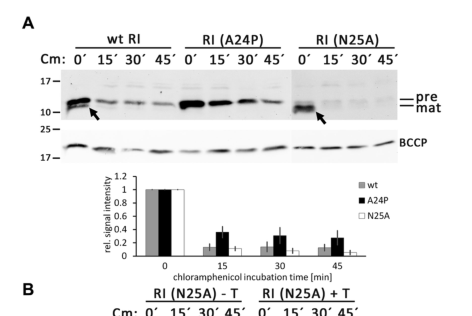

## Question

# Gene Research for Functional Annotation

## ⚠️ CRITICAL: Gene/Protein Identification Context

**BEFORE YOU BEGIN RESEARCH:** You MUST verify you are researching the CORRECT gene/protein. Gene symbols can be ambiguous, especially for less well-characterized genes from non-model organisms.

### Target Gene/Protein Identity (from UniProt):
- **UniProt Accession:** P13304
- **Protein Description:** RecName: Full=Antiholin {ECO:0000255|HAMAP-Rule:MF_04105}; AltName: Full=Protein rI; Flags: Precursor;
- **Gene Information:** Name=rI; Synonyms=58.6, rIA, tk.-2;
- **Organism (full):** Enterobacteria phage T4 (Bacteriophage T4).
- **Protein Family:** Belongs to the T4likevirus antiholin family.
- **Key Domains:** RI_T4. (IPR034696); Antiholin (PF24205)

### MANDATORY VERIFICATION STEPS:

1. **Check if the gene symbol "rI" matches the protein description above**
2. **Verify the organism is correct:** Enterobacteria phage T4 (Bacteriophage T4).
3. **Check if protein family/domains align with what you find in literature**
4. **If you find literature for a DIFFERENT gene with the same or similar symbol, STOP**

### If Gene Symbol is Ambiguous or You Cannot Find Relevant Literature:

**DO NOT PROCEED WITH RESEARCH ON A DIFFERENT GENE.** Instead:
- State clearly: "The gene symbol 'rI' is ambiguous or literature is limited for this specific protein"
- Explain what you found (e.g., "Found extensive literature on a different gene with the same symbol in a different organism")
- Describe the protein based ONLY on the UniProt information provided above
- Suggest that the protein function can be inferred from domain/family information

### Research Target:

Please provide a comprehensive research report on the gene **rI** (gene ID: rI, UniProt: P13304) in BPT4.

The research report should be a detailed narrative explaining the function, biological processes, and localization of the gene product. Citations should be given for all claims.

You should prioritize authoritative reviews and primary scientific literature when conducting research. You can supplement
this with annotations you find in gene/protein databases, but these can be outdated or inaccurate.

We are specifically interested in the primary function of the gene - for enzymes, what reaction is catalyzed, and what is the substrate specificity? For transporters, what is the substrate? For structural proteins or adapters, what is the broader structural role? For signaling molecules, what is the role in the pathway.

We are interested in where in or outside the cell the gene product carries out its function.

We are also interested in the signaling or biochemical pathways in which the gene functions. We are less interested in broad pleiotropic effects, except where these elucidate the precise role.

Include evidence where possible. We are interested in both experimental evidence as well as inference from structure, evolution, or bioinformatic analysis. Precise studies should be prioritized over high-throughput, where available.

## Output

Question: You are an expert researcher providing comprehensive, well-cited information.

Provide detailed information focusing on:
1. Key concepts and definitions with current understanding
2. Recent developments and latest research (prioritize 2023-2024 sources)
3. Current applications and real-world implementations
4. Expert opinions and analysis from authoritative sources
5. Relevant statistics and data from recent studies

Format as a comprehensive research report with proper citations. Include URLs and publication dates where available.
Always prioritize recent, authoritative sources and provide specific citations for all major claims.

# Gene Research for Functional Annotation

## ⚠️ CRITICAL: Gene/Protein Identification Context

**BEFORE YOU BEGIN RESEARCH:** You MUST verify you are researching the CORRECT gene/protein. Gene symbols can be ambiguous, especially for less well-characterized genes from non-model organisms.

### Target Gene/Protein Identity (from UniProt):
- **UniProt Accession:** P13304
- **Protein Description:** RecName: Full=Antiholin {ECO:0000255|HAMAP-Rule:MF_04105}; AltName: Full=Protein rI; Flags: Precursor;
- **Gene Information:** Name=rI; Synonyms=58.6, rIA, tk.-2;
- **Organism (full):** Enterobacteria phage T4 (Bacteriophage T4).
- **Protein Family:** Belongs to the T4likevirus antiholin family.
- **Key Domains:** RI_T4. (IPR034696); Antiholin (PF24205)

### MANDATORY VERIFICATION STEPS:

1. **Check if the gene symbol "rI" matches the protein description above**
2. **Verify the organism is correct:** Enterobacteria phage T4 (Bacteriophage T4).
3. **Check if protein family/domains align with what you find in literature**
4. **If you find literature for a DIFFERENT gene with the same or similar symbol, STOP**

### If Gene Symbol is Ambiguous or You Cannot Find Relevant Literature:

**DO NOT PROCEED WITH RESEARCH ON A DIFFERENT GENE.** Instead:
- State clearly: "The gene symbol 'rI' is ambiguous or literature is limited for this specific protein"
- Explain what you found (e.g., "Found extensive literature on a different gene with the same symbol in a different organism")
- Describe the protein based ONLY on the UniProt information provided above
- Suggest that the protein function can be inferred from domain/family information

### Research Target:

Please provide a comprehensive research report on the gene **rI** (gene ID: rI, UniProt: P13304) in BPT4.

The research report should be a detailed narrative explaining the function, biological processes, and localization of the gene product. Citations should be given for all claims.

You should prioritize authoritative reviews and primary scientific literature when conducting research. You can supplement
this with annotations you find in gene/protein databases, but these can be outdated or inaccurate.

We are specifically interested in the primary function of the gene - for enzymes, what reaction is catalyzed, and what is the substrate specificity? For transporters, what is the substrate? For structural proteins or adapters, what is the broader structural role? For signaling molecules, what is the role in the pathway.

We are interested in where in or outside the cell the gene product carries out its function.

We are also interested in the signaling or biochemical pathways in which the gene functions. We are less interested in broad pleiotropic effects, except where these elucidate the precise role.

Include evidence where possible. We are interested in both experimental evidence as well as inference from structure, evolution, or bioinformatic analysis. Precise studies should be prioritized over high-throughput, where available.

## Research report: Functional annotation of **rI / RI antiholin** (UniProt **P13304**) from **Enterobacteria phage T4**

### 0) Target verification (critical identity check)
The literature retrieved here consistently uses **T4 gene rI** to refer to the gene encoding **RI**, a small **antiholin** protein that antagonizes the **T holin (gene t/rV)** and is required for **lysis inhibition (LIN)** in *Enterobacteria phage T4* infections (ramanculov2001anancientplayer pages 1-3, ramanculov2001anancientplayer pages 3-4, paddison1998therolesof pages 5-6). This matches the UniProt target context provided (P13304; “Antiholin / protein rI”). 

---

### 1) Key concepts and definitions (current understanding)

#### 1.1 Holin–endolysin lysis and antiholins
In canonical double-stranded DNA phage lysis, a **holin** accumulates in the host inner membrane and, at a genetically programmed time, **triggers** to form lesions/pores that allow an **endolysin** to access and degrade peptidoglycan. In phage T4, holin triggering is controlled by **antiholins** including **RI** (periplasmic) which directly antagonize holin activity (moussa2014geneticdissectionof pages 1-2, chen2016thelastr pages 2-2).

**Antiholin (definition in this T4 context):** a phage-encoded regulator that binds holin (or its functional domains) and prevents pore formation/triggering until appropriate cues shift the system toward lysis (chen2016thelastr pages 2-2, moussa2014geneticdissectionof pages 1-2).

#### 1.2 Lysis inhibition (LIN)
**LIN** is a T-even-phage strategy in which host-cell lysis is **delayed** in response to **secondary adsorption/superinfection**, enabling prolonged intracellular phage production and altered plaque morphology/biology (paddison1998therolesof pages 5-6, moussa2014geneticdissectionof pages 1-2). In T4, LIN is mediated primarily by **RI inhibiting T** (ramanculov2001anancientplayer pages 3-4, tran2005periplasmicdomainsdefine pages 6-7).

---

### 2) Gene/protein product overview (sequence-scale functional annotation)

#### 2.1 Size and basic features
Genetic and biochemical analyses describe RI as a **small protein**; a frequently cited product is **~97 aa, ~11.1 kDa (pI ~4.8)** (paddison1998therolesof pages 5-6). The soluble periplasmic region studied biochemically is ~75 aa and is ~9 kDa (moussa2012proteindeterminantsof pages 4-5). 

#### 2.2 Subcellular localization
A central feature of RI is that its **functional domain is periplasmic**, consistent with its inhibition of the **periplasmic domain of holin T** (tran2005periplasmicdomainsdefine pages 6-7, moussa2014geneticdissectionof pages 1-2). In domain-swap and chimera experiments, the **periplasmic C-terminal domain** of RI was **necessary and sufficient** for LIN (tran2005periplasmicdomainsdefine pages 6-7).

---

### 3) Molecular function and mechanism: how RI controls T4 lysis timing

#### 3.1 Primary molecular function
**Primary function:** RI is a **T-holin inhibitor (antiholin)** that binds the holin and prevents holin **oligomerization/triggering**, delaying membrane permeabilization and therefore delaying endolysin access to peptidoglycan (tran2005periplasmicdomainsdefine pages 6-7, moussa2014geneticdissectionof pages 1-2, schwarzkopf2024adimericholinantiholin pages 9-11).

Functional evidence:
* **rI alone can impose LIN** on T-mediated lysis in heterologous/plasmid settings (ramanculov2001anancientplayer pages 1-3). 
* During LIN, **T continues to accumulate in the membrane**, indicating RI blocks **function**, not holin synthesis/localization (ramanculov2001anancientplayer pages 3-4). 
* **Formaldehyde crosslinking** supports **direct T–RI complex formation** (appearance of ~38 kDa complex consistent with T+RI) (ramanculov2001anancientplayer pages 3-4).

#### 3.2 Reversibility and triggering
LIN is physiologically reversible by conditions that **collapse membrane energy**:
* Inhibition can be relieved by **cyanide (KCN)** or forced lysis by **chloroform**, consistent with RI blocking holin function rather than permanently disabling the lytic machinery (ramanculov2001anancientplayer pages 3-4). 
* Artificial depolarization by energy poisons can induce immediate premature lysis in T4 systems, overriding the inhibited state (moussa2014geneticdissectionof pages 1-2).

#### 3.3 Complex stoichiometry and “active inhibitory species”: heterodimer vs tetramer vs dimeric membrane complex
Multiple lines of work address RI–T oligomeric organization.

**Biochemical solution studies (2012):** mixing purified soluble domains shows an **equimolar RI:T interaction**; analytical ultracentrifugation supports a predominant **1:1 heterodimer** (predicted ~29.7–30 kDa), even though gel filtration can show a larger apparent mass (~45.6 kDa), likely reflecting shape/oligomer mixtures (moussa2012proteindeterminantsof pages 4-5).

**Structural model (2020):** crystallography and cryo-EM of soluble domains support an **sRI2–sT2 heterotetramer**, and free sRI can form a homotetramer at high concentration; oligomeric state is concentration dependent (monomer/dimer at ≤1.6 mg/mL; tetramer at crystallization concentrations) (krieger2020thestructuralbasis pages 6-8, krieger2020thestructuralbasis pages 3-5). This work proposed a **domain-swapping / conformational-change** model for irreversibility of triggering and suggested a role for DNA/nucleotide binding as a LIN signal (krieger2020thestructuralbasis pages 8-9, krieger2020thestructuralbasis pages 14-16).

**Recent reinterpretation (2024):** Schwarzkopf et al. reconstituted LIN with only **RI, holin T, and endolysin**, and used mutagenesis plus AlphaFold-guided interface analysis to argue that the physiologically relevant inhibited form is a **membrane-compatible T/RI dimer** using a single conserved interface (“interface 1”), rather than requiring the full crystallographic tetramer arrangement (schwarzkopf2024adimericholinantiholin pages 1-2, schwarzkopf2024adimericholinantiholin pages 9-11).

Overall, current evidence supports that **direct RI–T binding** is the key molecular event; the **dominant functional inhibitory unit** is now argued to be **dimeric in vivo** (schwarzkopf2024adimericholinantiholin pages 9-11, schwarzkopf2024adimericholinantiholin pages 1-2), while larger oligomers/tetramers can occur for soluble domains under certain conditions (krieger2020thestructuralbasis pages 3-5).

#### 3.4 Key residues / determinants
In the 2024 reconstituted system, mutations at the inferred T/RI interaction interface (e.g., **RI Y42A/Y42L/F56A**) abolished LIN, supporting the functional importance of that specific binding surface (schwarzkopf2024adimericholinantiholin pages 3-5).

#### 3.5 Disulfide-stabilized periplasmic fold
RI and the periplasmic domain of holin T contain disulfides important for function (e.g., **RI Cys69–Cys75**; **T Cys175–Cys207**) (moussa2012proteindeterminantsof pages 5-7, krieger2020thestructuralbasis pages 3-5). This is consistent with a periplasmic environment and indicates folding/oxidative pathways (e.g., Dsb system) can be relevant for functional interaction studies (moussa2012proteindeterminantsof pages 5-7).

---

### 4) Localization and trafficking: cleavable signal peptide vs SAR-domain controversy and current view
A significant and recent revision concerns the N-terminus of RI.

#### 4.1 2021 evidence for a cleavable Sec signal peptide
Mehner-Breitfeld et al. (Aug 2021) combined signal-peptide prediction (SignalP), cleavage-site mutagenesis, fractionation, and reporter fusions to show RI has a **cleavable Sec-type signal peptide** with predicted cleavage after **Ala24**:
* Wild-type RI-HA was **processed** and found as mature protein in the **periplasmic fraction** (with fractionation controls showing minimal contamination). 
* Mutation **A24P** at the cleavage region blocked processing (no mature RI detected). 
* The RI signal peptide fused to **PhoA** was efficiently cleaved and exported, demonstrating a functional Sec signal peptide (mehnerbreitfeld2021thephaget4 pages 3-4, mehnerbreitfeld2021thephaget4 pages 1-2, mehnerbreitfeld2021thephaget4 pages 4-5).

#### 4.2 2024 evidence that cleavage is not required for LIN
Schwarzkopf et al. (Sep 2024) show that **abolishing signal peptide cleavage** (e.g., A24P) **does not abolish LIN**, and that **membrane-anchored precursor RI** can still function as an antiholin (schwarzkopf2024adimericholinantiholin pages 3-5, schwarzkopf2024adimericholinantiholin pages 1-2). Their data support a model where **slow/inefficient cleavage** is a regulatory feature and where holin binding can stabilize RI (schwarzkopf2024adimericholinantiholin pages 8-9).

Visual evidence supporting these conclusions is available from the 2024 paper’s figures (schwarzkopf2024adimericholinantiholin media 19864828, schwarzkopf2024adimericholinantiholin media c8129fc5).

---

### 5) Pathways and biological role in the phage life cycle

#### 5.1 The LIN pathway as a lysis-timing control module
Mechanistically, T4 lysis timing can be viewed as an **accumulation-and-trigger threshold** process for holin T. RI modulates this by binding T and preventing triggering, effectively increasing the time required for functional holin assemblies to form (moussa2014geneticdissectionof pages 1-2, schwarzkopf2024adimericholinantiholin pages 9-11).

Quantitative support from infection measurements:
* In one dataset, under LIN conditions **~8000 T molecules** accumulate by 60 min; by contrast, in a LIN-defective **T4 rI** infection, lysis occurred at ~30 min when **~4000 T molecules** were present—interpreted as a critical triggering concentration (moussa2012proteindeterminantsof pages 5-7).

#### 5.2 Proposed superinfection signal: DNA/nucleotide binding model (2020)
Krieger et al. (2020) propose that the inhibited RI–T complex could be stabilized by **non-sequence-specific binding to nucleic acids or nucleotide-like ligands**, linking superinfection-derived DNA (or degradation products) to LIN. They report binding/shift assays where the **sRI–sT complex** (but not sRI alone) shifts DNAs (e.g., ss 70 bp; ds 30/58 bp) and binds nucleosides/nucleotides with micromolar affinities (e.g., **guanosine Kd 43 µM; AMP 72.4 µM; ADP 213.6 µM; PRPP 225.9 µM**) (krieger2020thestructuralbasis pages 6-8). 

The 2024 reinterpretation does not eliminate a stabilizing role for periplasmic DNA, but it emphasizes that inhibition must be compatible with a **membrane-anchored dimeric complex** (schwarzkopf2024adimericholinantiholin pages 9-11).

---

### 6) Recent developments (prioritizing 2023–2024)

#### 6.1 2024: Reconstitution and updated structural logic
Schwarzkopf et al. (Sep 2024) provided a key advance by **reconstituting LIN in a phage-free system** with only three components (RI, T, endolysin). This allowed targeted mutagenesis to test whether signal peptide cleavage and specific interaction surfaces are required, supporting a **dimeric** inhibitory model and clarifying that **membrane anchoring** can be compatible with inhibition (schwarzkopf2024adimericholinantiholin pages 1-2, schwarzkopf2024adimericholinantiholin pages 9-11).

#### 6.2 2024: Quantitative ecological theory for LIN’s advantage
Hvid & Mitarai (May 2024) used batch-culture ODE models and spatial plaque simulations to analyze why LIN is adaptive. Key quantitative predictions include:
* In spatial simulations, LIN phages yield a **smaller visible plaque radius** (~**85–86%** of rapid-lysis mutants) but a nearly comparable **zone of infection radius** (~**96%**), explaining why LIN can appear disadvantageous by plaque size yet spread similarly (hvid2024competitiveadvantagesof pages 12-15).
* In competition models, LIN can win even when burst size does not increase (fβ = 1) if LIN latency is sufficiently longer, because LIN-state cells can adsorb/inactivate competitor phages (hvid2024competitiveadvantagesof pages 9-12).

This provides an expert, quantitatively grounded framework for interpreting the biological role of RI-mediated LIN beyond molecular mechanism (hvid2024competitiveadvantagesof pages 9-12, hvid2024competitiveadvantagesof pages 12-15).

---

### 7) Current applications and real-world implementations (holin/antiholin concepts informed by RI)

Although RI itself is a T4 protein, its mechanism informs broader engineered and applied contexts.

#### 7.1 Phage-like lysis cassettes as secretion / release systems (Type 10 secretion system concept)
A 2023 experimental study in *Yersinia entomophaga* shows that a **phage-like lysis cassette** (holin/endolysin/spanin-like module) can be used by bacteria to mediate **exoprotein release** (including large complexes), supporting the concept of phage-derived lysis modules as secretion systems. Mutation of the cassette abolished exoprotein release and complementation restored it; engineered expression of an optimized cassette caused lysis; and holin translation occurred in a **subpopulation**, consistent with regulated timing/triggering concepts analogous to holin–antiholin control (schoof2023lysiscassettemediatedexoprotein pages 1-2).

#### 7.2 Fine-tuning lysis timing in phage development (anti-holin-like modulators)
A 2024 study (BSPM4 phage) identified **orf52** as a phage gene whose expression was lethal to *Salmonella* and that **modulates holin function to fine-tune lysis timing**, providing replication advantages under high phage density—conceptually similar to RI-mediated modulation of holin triggering (kim2024elucidationofmolecular pages 1-2).

#### 7.3 Synthetic-cell and cell-free phage production (phage therapy enabling technology)
A 2025 perspective on synthetic cells for phage therapy reports that premature holin-mediated lysis in encapsulated TXTL systems likely caused a “dramatic loss of vesicles after **12 hours**,” preventing phage production in compartments even when bulk TXTL produced phages. The authors argue that **programmable lysis mechanisms**—potentially using holins—will be needed to synchronize assembly and release, highlighting holin regulation (and thus antiholin principles) as enabling technology (kulkarni2025syntheticcellsfor pages 2-3).

---

### 8) Expert interpretation and remaining uncertainties

* **Direct RI–T binding** as the core inhibitory mechanism is strongly supported across genetics, biochemistry, and reconstitution studies (ramanculov2001anancientplayer pages 3-4, moussa2012proteindeterminantsof pages 4-5, schwarzkopf2024adimericholinantiholin pages 1-2).
* The field has debated whether RI uses a **SAR domain**-like mechanism; the most recent experimental evidence supports a **cleavable Sec signal peptide** (processing after A24) while also showing that **uncleaved membrane-anchored RI** can still inhibit holin in reconstituted assays, suggesting trafficking/processing is regulatory rather than strictly required (mehnerbreitfeld2021thephaget4 pages 3-4, schwarzkopf2024adimericholinantiholin pages 3-5).
* Structural work supports higher-order complexes and a DNA-binding model (krieger2020thestructuralbasis pages 6-8), whereas 2024 functional work emphasizes a **single-interface, dimeric inhibitory unit** compatible with membrane anchoring (schwarzkopf2024adimericholinantiholin pages 9-11). These views can be partially reconciled if larger oligomers represent concentration/construct-dependent assemblies while the minimal inhibitory species in vivo is dimeric.

---

### 9) Evidence map (condensed)
The following table summarizes key supported claims, quantitative findings, and primary sources.

| Claim / feature | Evidence type | Key quantitative data | Primary source with year and URL |
|---|---|---|---|
| **Gene identity and primary function:** T4 **rI** encodes **RI**, a **t-specific antiholin** that inhibits holin **T** and imposes lysis inhibition (LIN) | Genetics, functional complementation, cross-linking | Plasmid-borne **rI** alone can impose LIN on **T**-mediated lysis; LIN-defective **rI57** fails to block lysis; cross-linked **T–RI** species at ~**38 kDa** | Ramanculov & Young 2001, *Molecular Microbiology*, https://doi.org/10.1046/j.1365-2958.2001.02491.x (ramanculov2001anancientplayer pages 1-3, ramanculov2001anancientplayer pages 3-4) |
| **Protein size / gene product:** RI is a small acidic protein with a short N-terminal export segment and periplasmic C-terminal domain | Genetics, sequence analysis, biochemistry | Reported as **97 aa**, ~**11.1 kDa**, pI **4.8**; soluble periplasmic domain **sRI ~75 aa**, ~**8.8–9.7 kDa** | Paddison et al. 1998, *Genetics*, https://doi.org/10.1093/genetics/148.4.1539; Moussa et al. 2012, *Protein Science*, https://doi.org/10.1002/pro.2042 (paddison1998therolesof pages 5-6, moussa2012proteindeterminantsof pages 1-3, moussa2012proteindeterminantsof pages 4-5) |
| **Localization:** RI acts through its **periplasmic domain**; the C-terminal periplasmic region is necessary and sufficient for LIN | Genetics, domain swaps, fractionation | ssPhoA-RICTD chimera is processed, periplasmic, and functionally supports LIN; periplasmic TCTD can block/subvert LIN | Tran et al. 2005, *Journal of Bacteriology*, https://doi.org/10.1128/jb.187.19.6631-6640.2005 (tran2005periplasmicdomainsdefine pages 6-7) |
| **Signal peptide processing:** RI has a **cleavable Sec signal peptide**, not a classical SAR domain, in the 2021 revision | Bioinformatics, mutagenesis, fractionation, reporter fusion | SignalP predicted cleavage after **Ala24** (~**95%** probability); **A24P** blocks processing; RI signal peptide exports **PhoA** efficiently | Mehner-Breitfeld et al. 2021, *Frontiers in Microbiology*, https://doi.org/10.3389/fmicb.2021.712460 (mehnerbreitfeld2021thephaget4 pages 2-3, mehnerbreitfeld2021thephaget4 pages 1-2, mehnerbreitfeld2021thephaget4 pages 3-4) |
| **Membrane-anchored RI can still inhibit holin:** cleavage is not required for LIN in a reconstituted system | Reconstitution, mutagenesis, fractionation | **A24P** abolished detectable processing yet preserved LIN; RI(A24P) remained membrane-localized | Schwarzkopf et al. 2024, *Frontiers in Microbiology*, https://doi.org/10.3389/fmicb.2024.1419106 (schwarzkopf2024adimericholinantiholin pages 3-5, schwarzkopf2024adimericholinantiholin pages 1-2, schwarzkopf2024adimericholinantiholin pages 8-9) |
| **Interaction partner:** RI binds the **periplasmic C-terminal domain of holin T** rather than affecting T synthesis | Genetics, biochemistry, cross-linking | T continues to accumulate in inner membrane during LIN; excess periplasmic **TCTD** antagonizes LIN | Ramanculov & Young 2001, *Molecular Microbiology*, https://doi.org/10.1046/j.1365-2958.2001.02491.x; Tran et al. 2005, *Journal of Bacteriology*, https://doi.org/10.1128/jb.187.19.6631-6640.2005 (ramanculov2001anancientplayer pages 3-4, tran2005periplasmicdomainsdefine pages 6-7) |
| **Stoichiometry / oligomeric state (biochemical view):** predominant soluble complex is a **1:1 RI:T heterodimer** | Biochemistry, SEC, analytical ultracentrifugation | SEC apparent mass ~**45.6 kDa**, but sedimentation supports a **heterodimer** near predicted **29.7–30 kDa**; sRI monomer ~**9.2 kDa**, **1.4S**; complex **4.1S** | Moussa et al. 2012, *Protein Science*, https://doi.org/10.1002/pro.2042 (moussa2012proteindeterminantsof pages 1-3, moussa2012proteindeterminantsof pages 4-5) |
| **Stoichiometry / oligomeric state (structural 2020 model):** soluble domains can form **sRI2–sT2 heterotetramers** and RI homotetramers at high concentration | X-ray crystallography, cryo-EM, solution biophysics | RI tetramer at **10 mg/mL**; PDBePISA buried area ~**8618.8 Ų**, ΔGint ~**−87 kcal/mol**, ΔGdiss ~**13.8 kcal/mol**; cryo-EM map ~**9.4 Å** | Krieger et al. 2020, *Journal of Molecular Biology*, https://doi.org/10.1016/j.jmb.2020.06.013 (krieger2020thestructuralbasis pages 6-8, krieger2020thestructuralbasis pages 3-5, krieger2020thestructuralbasis pages 14-16) |
| **Current mechanistic interpretation (2024):** physiologically relevant inhibitory species is likely a **dimeric T/RI complex**, not the full tetramer seen in crystals | Reconstitution, mutagenesis, AlphaFold-guided analysis | Only one conserved interface is required; mutations **Y42A**, **Y42L**, **F56A** abolish LIN | Schwarzkopf et al. 2024, *Frontiers in Microbiology*, https://doi.org/10.3389/fmicb.2024.1419106 (schwarzkopf2024adimericholinantiholin pages 3-5, schwarzkopf2024adimericholinantiholin pages 9-11, schwarzkopf2024adimericholinantiholin pages 1-2) |
| **Mechanism of inhibition:** RI prevents **holin oligomerization / triggering**, thereby delaying endolysin release and host lysis | Genetics, biochemistry, structural inference | Holin triggering in T4rI occurs around **~4000 T molecules**; under LIN ~**8000 T molecules** accumulate by **60 min** | Moussa et al. 2012, *Protein Science*, https://doi.org/10.1002/pro.2042; Moussa et al. 2014, *Journal of Bacteriology*, https://doi.org/10.1128/jb.01548-14 (moussa2012proteindeterminantsof pages 5-7, moussa2014geneticdissectionof pages 1-2) |
| **Reversibility / triggering:** LIN can be reversed by membrane depolarization or energy poisons, indicating RI blocks T function rather than endolysin availability | Genetics, physiological assays | **KCN** relieves RI block; **CHCl3** causes immediate lysis; energy poisons override LIN | Ramanculov & Young 2001, *Molecular Microbiology*, https://doi.org/10.1046/j.1365-2958.2001.02491.x; Tran et al. 2005, *Journal of Bacteriology*, https://doi.org/10.1128/jb.187.19.6631-6640.2005; Moussa et al. 2014, *Journal of Bacteriology*, https://doi.org/10.1128/jb.01548-14 (ramanculov2001anancientplayer pages 3-4, tran2005periplasmicdomainsdefine pages 6-7, moussa2014geneticdissectionof pages 1-2) |
| **Disulfide-stabilized periplasmic fold:** RI and T require Cys pairs for proper folded interaction | Biochemistry | RI disulfide **Cys69–Cys75**; T disulfide **Cys175–Cys207**; no free thiols detected in purified proteins/complex | Moussa et al. 2012, *Protein Science*, https://doi.org/10.1002/pro.2042; Krieger et al. 2020, *Journal of Molecular Biology*, https://doi.org/10.1016/j.jmb.2020.06.013 (moussa2012proteindeterminantsof pages 5-7, krieger2020thestructuralbasis pages 3-5) |
| **Lysis timing / ecological effect:** superinfection-triggered LIN can greatly increase progeny yield and be sustained by repeated superinfection | Infection kinetics, modeling | Repeated superinfection at **<10 min** intervals can sustain inhibition; intracellular virions can increase by about **10-fold**; modeled visible plaque radius ~**85–86%** of rapid-lysis mutant, infection-zone radius ~**96%** | Moussa et al. 2012, *Protein Science*, https://doi.org/10.1002/pro.2042; Hvid & Mitarai 2024, *PLOS Computational Biology*, https://doi.org/10.1101/2024.02.07.579269 (moussa2012proteindeterminantsof pages 1-3, hvid2024competitiveadvantagesof pages 9-12, hvid2024competitiveadvantagesof pages 12-15) |
| **DNA-binding signal model (2020 structural proposal):** sRI–sT complex may bind superinfection-derived nucleic acids non-specifically to stabilize LIN | Structure, binding assays, modeling | Reported ligand affinities: **guanosine Kd 43 µM**, **AMP 72.4 µM**, **ADP 213.6 µM**, **PRPP 225.9 µM**; DNA shifts with ss **70 bp**, ds **30/58 bp** tested | Krieger et al. 2020, *Journal of Molecular Biology*, https://doi.org/10.1016/j.jmb.2020.06.013 (krieger2020thestructuralbasis pages 6-8, krieger2020thestructuralbasis pages 14-16) |
| **Status of DNA-binding model after 2024 work:** DNA may still stabilize complexes, but the key inhibitory unit is now argued to be membrane-compatible **T/RI dimer** | Structure-informed functional reinterpretation | No new Kd reported in 2024; emphasis shifted from tetramer to membrane-anchored dimer/interface-1 model | Schwarzkopf et al. 2024, *Frontiers in Microbiology*, https://doi.org/10.3389/fmicb.2024.1419106 (schwarzkopf2024adimericholinantiholin pages 9-11, schwarzkopf2024adimericholinantiholin pages 1-2) |

*Table: This table compiles the main experimentally supported features of bacteriophage T4 rI/RI, including identity, localization, mechanism, stoichiometry, and lysis-control phenotypes. It is designed as a compact evidence map for the final research report, with quantitative findings and primary-source URLs.*

---

### 10) Key 2023–2024 references (URLs and publication dates)
* Schwarzkopf JMF et al. **“A dimeric holin/antiholin complex controls lysis by phage T4”** (*Frontiers in Microbiology*, **Sep 2024**). https://doi.org/10.3389/fmicb.2024.1419106 (schwarzkopf2024adimericholinantiholin pages 1-2)
* Hvid U, Mitarai N. **“Competitive advantages of T-even phage lysis inhibition in response to secondary infection”** (*PLOS Computational Biology*, **May 2024**). https://doi.org/10.1101/2024.02.07.579269 (hvid2024competitiveadvantagesof pages 1-4)
* Kim J et al. **“Elucidation of molecular function of phage protein responsible for optimization of host cell lysis”** (*BMC Microbiology*, **Dec 2024**). https://doi.org/10.1186/s12866-024-03684-9 (kim2024elucidationofmolecular pages 1-2)
* Schoof M et al. **“Lysis cassette-mediated exoprotein release…”** (*Microbiology Spectrum*, **Apr 2023**). https://doi.org/10.1128/spectrum.00364-23 (schoof2023lysiscassettemediatedexoprotein pages 1-2)

---

### Image evidence (from 2024 study)
* Western blot evidence for blocked cleavage (A24P) and models of the T/RI interface are available from the 2024 paper’s figures (schwarzkopf2024adimericholinantiholin media 19864828, schwarzkopf2024adimericholinantiholin media c8129fc5).

References

1. (ramanculov2001anancientplayer pages 1-3): Erlan Ramanculov and Ry Young. An ancient player unmasked: t4 ri encodes a t‐specific antiholin. Molecular Microbiology, 41:575-583, Aug 2001. URL: https://doi.org/10.1046/j.1365-2958.2001.02491.x, doi:10.1046/j.1365-2958.2001.02491.x. This article has 76 citations and is from a domain leading peer-reviewed journal.

2. (ramanculov2001anancientplayer pages 3-4): Erlan Ramanculov and Ry Young. An ancient player unmasked: t4 ri encodes a t‐specific antiholin. Molecular Microbiology, 41:575-583, Aug 2001. URL: https://doi.org/10.1046/j.1365-2958.2001.02491.x, doi:10.1046/j.1365-2958.2001.02491.x. This article has 76 citations and is from a domain leading peer-reviewed journal.

3. (paddison1998therolesof pages 5-6): Patrick Paddison, Stephen T Abedon, Holly Kloos Dressman, Katherine Gailbreath, Julia Tracy, Eric Mosser, James Neitzel, Burton Guttman, and Elizabeth Kutter. The roles of the bacteriophage t4 r genes in lysis inhibition and fine-structure genetics: a new perspective. Genetics, 148:1539-1550, Apr 1998. URL: https://doi.org/10.1093/genetics/148.4.1539, doi:10.1093/genetics/148.4.1539. This article has 125 citations and is from a domain leading peer-reviewed journal.

4. (moussa2014geneticdissectionof pages 1-2): Samir H. Moussa, Jessica L. Lawler, and Ry Young. Genetic dissection of t4 lysis. Journal of Bacteriology, 196:2201-2209, Jun 2014. URL: https://doi.org/10.1128/jb.01548-14, doi:10.1128/jb.01548-14. This article has 22 citations and is from a peer-reviewed journal.

5. (chen2016thelastr pages 2-2): Yi Chen and Ry Young. The last <i>r</i> locus unveiled: t4 riii is a cytoplasmic antiholin. Journal of Bacteriology, 198:2448-2457, Sep 2016. URL: https://doi.org/10.1128/jb.00294-16, doi:10.1128/jb.00294-16. This article has 28 citations and is from a peer-reviewed journal.

6. (tran2005periplasmicdomainsdefine pages 6-7): Tram Anh T. Tran, Douglas K. Struck, and Ry Young. Periplasmic domains define holin-antiholin interactions in t4 lysis inhibition. Journal of Bacteriology, 187:6631-6640, Oct 2005. URL: https://doi.org/10.1128/jb.187.19.6631-6640.2005, doi:10.1128/jb.187.19.6631-6640.2005. This article has 98 citations and is from a peer-reviewed journal.

7. (moussa2012proteindeterminantsof pages 4-5): Samir H. Moussa, Vladimir Kuznetsov, Tram Anh T. Tran, James C. Sacchettini, and Ry Young. Protein determinants of phage t4 lysis inhibition. Protein Science, 21:571-582, Apr 2012. URL: https://doi.org/10.1002/pro.2042, doi:10.1002/pro.2042. This article has 55 citations and is from a peer-reviewed journal.

8. (schwarzkopf2024adimericholinantiholin pages 9-11): Jan Michel Frederik Schwarzkopf, Denise Mehner-Breitfeld, and Thomas Brüser. A dimeric holin/antiholin complex controls lysis by phage t4. Frontiers in Microbiology, Sep 2024. URL: https://doi.org/10.3389/fmicb.2024.1419106, doi:10.3389/fmicb.2024.1419106. This article has 12 citations and is from a peer-reviewed journal.

9. (krieger2020thestructuralbasis pages 6-8): Inna V. Krieger, Vladimir Kuznetsov, Jeng-Yih Chang, Junjie Zhang, Samir H. Moussa, Ryland F. Young, and James C. Sacchettini. The structural basis of t4 phage lysis control: dna as the signal for lysis inhibition. Jul 2020. URL: https://doi.org/10.1016/j.jmb.2020.06.013, doi:10.1016/j.jmb.2020.06.013. This article has 35 citations and is from a domain leading peer-reviewed journal.

10. (krieger2020thestructuralbasis pages 3-5): Inna V. Krieger, Vladimir Kuznetsov, Jeng-Yih Chang, Junjie Zhang, Samir H. Moussa, Ryland F. Young, and James C. Sacchettini. The structural basis of t4 phage lysis control: dna as the signal for lysis inhibition. Jul 2020. URL: https://doi.org/10.1016/j.jmb.2020.06.013, doi:10.1016/j.jmb.2020.06.013. This article has 35 citations and is from a domain leading peer-reviewed journal.

11. (krieger2020thestructuralbasis pages 8-9): Inna V. Krieger, Vladimir Kuznetsov, Jeng-Yih Chang, Junjie Zhang, Samir H. Moussa, Ryland F. Young, and James C. Sacchettini. The structural basis of t4 phage lysis control: dna as the signal for lysis inhibition. Jul 2020. URL: https://doi.org/10.1016/j.jmb.2020.06.013, doi:10.1016/j.jmb.2020.06.013. This article has 35 citations and is from a domain leading peer-reviewed journal.

12. (krieger2020thestructuralbasis pages 14-16): Inna V. Krieger, Vladimir Kuznetsov, Jeng-Yih Chang, Junjie Zhang, Samir H. Moussa, Ryland F. Young, and James C. Sacchettini. The structural basis of t4 phage lysis control: dna as the signal for lysis inhibition. Jul 2020. URL: https://doi.org/10.1016/j.jmb.2020.06.013, doi:10.1016/j.jmb.2020.06.013. This article has 35 citations and is from a domain leading peer-reviewed journal.

13. (schwarzkopf2024adimericholinantiholin pages 1-2): Jan Michel Frederik Schwarzkopf, Denise Mehner-Breitfeld, and Thomas Brüser. A dimeric holin/antiholin complex controls lysis by phage t4. Frontiers in Microbiology, Sep 2024. URL: https://doi.org/10.3389/fmicb.2024.1419106, doi:10.3389/fmicb.2024.1419106. This article has 12 citations and is from a peer-reviewed journal.

14. (schwarzkopf2024adimericholinantiholin pages 3-5): Jan Michel Frederik Schwarzkopf, Denise Mehner-Breitfeld, and Thomas Brüser. A dimeric holin/antiholin complex controls lysis by phage t4. Frontiers in Microbiology, Sep 2024. URL: https://doi.org/10.3389/fmicb.2024.1419106, doi:10.3389/fmicb.2024.1419106. This article has 12 citations and is from a peer-reviewed journal.

15. (moussa2012proteindeterminantsof pages 5-7): Samir H. Moussa, Vladimir Kuznetsov, Tram Anh T. Tran, James C. Sacchettini, and Ry Young. Protein determinants of phage t4 lysis inhibition. Protein Science, 21:571-582, Apr 2012. URL: https://doi.org/10.1002/pro.2042, doi:10.1002/pro.2042. This article has 55 citations and is from a peer-reviewed journal.

16. (mehnerbreitfeld2021thephaget4 pages 3-4): Denise Mehner-Breitfeld, Jan Michel Frederik Schwarzkopf, Ry Young, Kiran Kondabagil, and Thomas Brüser. The phage t4 antiholin ri has a cleavable signal peptide, not a sar domain. Frontiers in Microbiology, Aug 2021. URL: https://doi.org/10.3389/fmicb.2021.712460, doi:10.3389/fmicb.2021.712460. This article has 13 citations and is from a peer-reviewed journal.

17. (mehnerbreitfeld2021thephaget4 pages 1-2): Denise Mehner-Breitfeld, Jan Michel Frederik Schwarzkopf, Ry Young, Kiran Kondabagil, and Thomas Brüser. The phage t4 antiholin ri has a cleavable signal peptide, not a sar domain. Frontiers in Microbiology, Aug 2021. URL: https://doi.org/10.3389/fmicb.2021.712460, doi:10.3389/fmicb.2021.712460. This article has 13 citations and is from a peer-reviewed journal.

18. (mehnerbreitfeld2021thephaget4 pages 4-5): Denise Mehner-Breitfeld, Jan Michel Frederik Schwarzkopf, Ry Young, Kiran Kondabagil, and Thomas Brüser. The phage t4 antiholin ri has a cleavable signal peptide, not a sar domain. Frontiers in Microbiology, Aug 2021. URL: https://doi.org/10.3389/fmicb.2021.712460, doi:10.3389/fmicb.2021.712460. This article has 13 citations and is from a peer-reviewed journal.

19. (schwarzkopf2024adimericholinantiholin pages 8-9): Jan Michel Frederik Schwarzkopf, Denise Mehner-Breitfeld, and Thomas Brüser. A dimeric holin/antiholin complex controls lysis by phage t4. Frontiers in Microbiology, Sep 2024. URL: https://doi.org/10.3389/fmicb.2024.1419106, doi:10.3389/fmicb.2024.1419106. This article has 12 citations and is from a peer-reviewed journal.

20. (schwarzkopf2024adimericholinantiholin media 19864828): Jan Michel Frederik Schwarzkopf, Denise Mehner-Breitfeld, and Thomas Brüser. A dimeric holin/antiholin complex controls lysis by phage t4. Frontiers in Microbiology, Sep 2024. URL: https://doi.org/10.3389/fmicb.2024.1419106, doi:10.3389/fmicb.2024.1419106. This article has 12 citations and is from a peer-reviewed journal.

21. (schwarzkopf2024adimericholinantiholin media c8129fc5): Jan Michel Frederik Schwarzkopf, Denise Mehner-Breitfeld, and Thomas Brüser. A dimeric holin/antiholin complex controls lysis by phage t4. Frontiers in Microbiology, Sep 2024. URL: https://doi.org/10.3389/fmicb.2024.1419106, doi:10.3389/fmicb.2024.1419106. This article has 12 citations and is from a peer-reviewed journal.

22. (hvid2024competitiveadvantagesof pages 12-15): Ulrik Hvid and Namiko Mitarai. Competitive advantages of t-even phage lysis inhibition in response to secondary infection. PLOS Computational Biology, May 2024. URL: https://doi.org/10.1101/2024.02.07.579269, doi:10.1101/2024.02.07.579269. This article has 8 citations and is from a highest quality peer-reviewed journal.

23. (hvid2024competitiveadvantagesof pages 9-12): Ulrik Hvid and Namiko Mitarai. Competitive advantages of t-even phage lysis inhibition in response to secondary infection. PLOS Computational Biology, May 2024. URL: https://doi.org/10.1101/2024.02.07.579269, doi:10.1101/2024.02.07.579269. This article has 8 citations and is from a highest quality peer-reviewed journal.

24. (schoof2023lysiscassettemediatedexoprotein pages 1-2): Marion Schoof, Maureen O’Callaghan, Charles Hefer, Travis R. Glare, Amber R. Paulson, and Mark R. H. Hurst. Lysis cassette-mediated exoprotein release in yersinia entomophaga is controlled by a phob-like regulator. Microbiology Spectrum, Apr 2023. URL: https://doi.org/10.1128/spectrum.00364-23, doi:10.1128/spectrum.00364-23. This article has 7 citations and is from a domain leading peer-reviewed journal.

25. (kim2024elucidationofmolecular pages 1-2): Jinwoo Kim, Joonbeom Kim, and Sangryeol Ryu. Elucidation of molecular function of phage protein responsible for optimization of host cell lysis. BMC Microbiology, Dec 2024. URL: https://doi.org/10.1186/s12866-024-03684-9, doi:10.1186/s12866-024-03684-9. This article has 6 citations and is from a peer-reviewed journal.

26. (kulkarni2025syntheticcellsfor pages 2-3): Vishwesh Kulkarni, Nadanai Laohakunakorn, and Sahan B. W. Liyanagedera. Synthetic cells for phage therapy: a perspective. Frontiers in Cellular and Infection Microbiology, Oct 2025. URL: https://doi.org/10.3389/fcimb.2025.1690404, doi:10.3389/fcimb.2025.1690404. This article has 0 citations.

27. (moussa2012proteindeterminantsof pages 1-3): Samir H. Moussa, Vladimir Kuznetsov, Tram Anh T. Tran, James C. Sacchettini, and Ry Young. Protein determinants of phage t4 lysis inhibition. Protein Science, 21:571-582, Apr 2012. URL: https://doi.org/10.1002/pro.2042, doi:10.1002/pro.2042. This article has 55 citations and is from a peer-reviewed journal.

28. (mehnerbreitfeld2021thephaget4 pages 2-3): Denise Mehner-Breitfeld, Jan Michel Frederik Schwarzkopf, Ry Young, Kiran Kondabagil, and Thomas Brüser. The phage t4 antiholin ri has a cleavable signal peptide, not a sar domain. Frontiers in Microbiology, Aug 2021. URL: https://doi.org/10.3389/fmicb.2021.712460, doi:10.3389/fmicb.2021.712460. This article has 13 citations and is from a peer-reviewed journal.

29. (hvid2024competitiveadvantagesof pages 1-4): Ulrik Hvid and Namiko Mitarai. Competitive advantages of t-even phage lysis inhibition in response to secondary infection. PLOS Computational Biology, May 2024. URL: https://doi.org/10.1101/2024.02.07.579269, doi:10.1101/2024.02.07.579269. This article has 8 citations and is from a highest quality peer-reviewed journal.

## Artifacts

- [Edison artifact artifact-00](rI-deep-research-falcon_artifacts/artifact-00.md)

## Citations

1. paddison1998therolesof pages 5-6
2. moussa2012proteindeterminantsof pages 4-5
3. tran2005periplasmicdomainsdefine pages 6-7
4. ramanculov2001anancientplayer pages 1-3
5. ramanculov2001anancientplayer pages 3-4
6. moussa2014geneticdissectionof pages 1-2
7. krieger2020thestructuralbasis pages 3-5
8. schwarzkopf2024adimericholinantiholin pages 3-5
9. moussa2012proteindeterminantsof pages 5-7
10. schwarzkopf2024adimericholinantiholin pages 8-9
11. krieger2020thestructuralbasis pages 6-8
12. schwarzkopf2024adimericholinantiholin pages 9-11
13. hvid2024competitiveadvantagesof pages 12-15
14. hvid2024competitiveadvantagesof pages 9-12
15. schoof2023lysiscassettemediatedexoprotein pages 1-2
16. kim2024elucidationofmolecular pages 1-2
17. kulkarni2025syntheticcellsfor pages 2-3
18. schwarzkopf2024adimericholinantiholin pages 1-2
19. hvid2024competitiveadvantagesof pages 1-4
20. chen2016thelastr pages 2-2
21. krieger2020thestructuralbasis pages 8-9
22. krieger2020thestructuralbasis pages 14-16
23. moussa2012proteindeterminantsof pages 1-3
24. https://doi.org/10.1046/j.1365-2958.2001.02491.x
25. https://doi.org/10.1093/genetics/148.4.1539;
26. https://doi.org/10.1002/pro.2042
27. https://doi.org/10.1128/jb.187.19.6631-6640.2005
28. https://doi.org/10.3389/fmicb.2021.712460
29. https://doi.org/10.3389/fmicb.2024.1419106
30. https://doi.org/10.1046/j.1365-2958.2001.02491.x;
31. https://doi.org/10.1016/j.jmb.2020.06.013
32. https://doi.org/10.1002/pro.2042;
33. https://doi.org/10.1128/jb.01548-14
34. https://doi.org/10.1128/jb.187.19.6631-6640.2005;
35. https://doi.org/10.1101/2024.02.07.579269
36. https://doi.org/10.1186/s12866-024-03684-9
37. https://doi.org/10.1128/spectrum.00364-23
38. https://doi.org/10.1046/j.1365-2958.2001.02491.x,
39. https://doi.org/10.1093/genetics/148.4.1539,
40. https://doi.org/10.1128/jb.01548-14,
41. https://doi.org/10.1128/jb.00294-16,
42. https://doi.org/10.1128/jb.187.19.6631-6640.2005,
43. https://doi.org/10.1002/pro.2042,
44. https://doi.org/10.3389/fmicb.2024.1419106,
45. https://doi.org/10.1016/j.jmb.2020.06.013,
46. https://doi.org/10.3389/fmicb.2021.712460,
47. https://doi.org/10.1101/2024.02.07.579269,
48. https://doi.org/10.1128/spectrum.00364-23,
49. https://doi.org/10.1186/s12866-024-03684-9,
50. https://doi.org/10.3389/fcimb.2025.1690404,