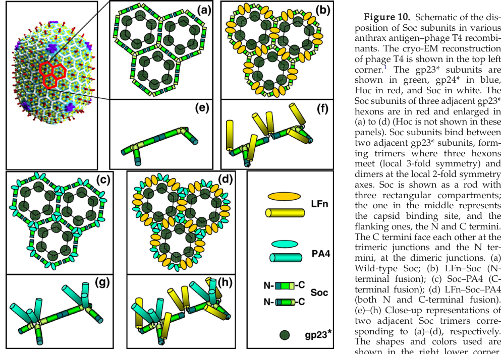

## Question

# Gene Research for Functional Annotation

## ⚠️ CRITICAL: Gene/Protein Identification Context

**BEFORE YOU BEGIN RESEARCH:** You MUST verify you are researching the CORRECT gene/protein. Gene symbols can be ambiguous, especially for less well-characterized genes from non-model organisms.

### Target Gene/Protein Identity (from UniProt):
- **UniProt Accession:** P03715
- **Protein Description:** RecName: Full=Small outer capsid protein {ECO:0000255|HAMAP-Rule:MF_04115}; Short=Soc;
- **Gene Information:** Name=soc;
- **Organism (full):** Enterobacteria phage T4 (Bacteriophage T4).
- **Protein Family:** Belongs to the Tevenvirinae Soc family. {ECO:0000255|HAMAP-
- **Key Domains:** Soc. (IPR031743); Soc_sf. (IPR038151); Soc (PF16855)

### MANDATORY VERIFICATION STEPS:

1. **Check if the gene symbol "soc" matches the protein description above**
2. **Verify the organism is correct:** Enterobacteria phage T4 (Bacteriophage T4).
3. **Check if protein family/domains align with what you find in literature**
4. **If you find literature for a DIFFERENT gene with the same or similar symbol, STOP**

### If Gene Symbol is Ambiguous or You Cannot Find Relevant Literature:

**DO NOT PROCEED WITH RESEARCH ON A DIFFERENT GENE.** Instead:
- State clearly: "The gene symbol 'soc' is ambiguous or literature is limited for this specific protein"
- Explain what you found (e.g., "Found extensive literature on a different gene with the same symbol in a different organism")
- Describe the protein based ONLY on the UniProt information provided above
- Suggest that the protein function can be inferred from domain/family information

### Research Target:

Please provide a comprehensive research report on the gene **soc** (gene ID: soc, UniProt: P03715) in BPT4.

The research report should be a detailed narrative explaining the function, biological processes, and localization of the gene product. Citations should be given for all claims.

You should prioritize authoritative reviews and primary scientific literature when conducting research. You can supplement
this with annotations you find in gene/protein databases, but these can be outdated or inaccurate.

We are specifically interested in the primary function of the gene - for enzymes, what reaction is catalyzed, and what is the substrate specificity? For transporters, what is the substrate? For structural proteins or adapters, what is the broader structural role? For signaling molecules, what is the role in the pathway.

We are interested in where in or outside the cell the gene product carries out its function.

We are also interested in the signaling or biochemical pathways in which the gene functions. We are less interested in broad pleiotropic effects, except where these elucidate the precise role.

Include evidence where possible. We are interested in both experimental evidence as well as inference from structure, evolution, or bioinformatic analysis. Precise studies should be prioritized over high-throughput, where available.

## Output

Question: You are an expert researcher providing comprehensive, well-cited information.

Provide detailed information focusing on:
1. Key concepts and definitions with current understanding
2. Recent developments and latest research (prioritize 2023-2024 sources)
3. Current applications and real-world implementations
4. Expert opinions and analysis from authoritative sources
5. Relevant statistics and data from recent studies

Format as a comprehensive research report with proper citations. Include URLs and publication dates where available.
Always prioritize recent, authoritative sources and provide specific citations for all major claims.

# Gene Research for Functional Annotation

## ⚠️ CRITICAL: Gene/Protein Identification Context

**BEFORE YOU BEGIN RESEARCH:** You MUST verify you are researching the CORRECT gene/protein. Gene symbols can be ambiguous, especially for less well-characterized genes from non-model organisms.

### Target Gene/Protein Identity (from UniProt):
- **UniProt Accession:** P03715
- **Protein Description:** RecName: Full=Small outer capsid protein {ECO:0000255|HAMAP-Rule:MF_04115}; Short=Soc;
- **Gene Information:** Name=soc;
- **Organism (full):** Enterobacteria phage T4 (Bacteriophage T4).
- **Protein Family:** Belongs to the Tevenvirinae Soc family. {ECO:0000255|HAMAP-
- **Key Domains:** Soc. (IPR031743); Soc_sf. (IPR038151); Soc (PF16855)

### MANDATORY VERIFICATION STEPS:

1. **Check if the gene symbol "soc" matches the protein description above**
2. **Verify the organism is correct:** Enterobacteria phage T4 (Bacteriophage T4).
3. **Check if protein family/domains align with what you find in literature**
4. **If you find literature for a DIFFERENT gene with the same or similar symbol, STOP**

### If Gene Symbol is Ambiguous or You Cannot Find Relevant Literature:

**DO NOT PROCEED WITH RESEARCH ON A DIFFERENT GENE.** Instead:
- State clearly: "The gene symbol 'soc' is ambiguous or literature is limited for this specific protein"
- Explain what you found (e.g., "Found extensive literature on a different gene with the same symbol in a different organism")
- Describe the protein based ONLY on the UniProt information provided above
- Suggest that the protein function can be inferred from domain/family information

### Research Target:

Please provide a comprehensive research report on the gene **soc** (gene ID: soc, UniProt: P03715) in BPT4.

The research report should be a detailed narrative explaining the function, biological processes, and localization of the gene product. Citations should be given for all claims.

You should prioritize authoritative reviews and primary scientific literature when conducting research. You can supplement
this with annotations you find in gene/protein databases, but these can be outdated or inaccurate.

We are specifically interested in the primary function of the gene - for enzymes, what reaction is catalyzed, and what is the substrate specificity? For transporters, what is the substrate? For structural proteins or adapters, what is the broader structural role? For signaling molecules, what is the role in the pathway.

We are interested in where in or outside the cell the gene product carries out its function.

We are also interested in the signaling or biochemical pathways in which the gene functions. We are less interested in broad pleiotropic effects, except where these elucidate the precise role.

Include evidence where possible. We are interested in both experimental evidence as well as inference from structure, evolution, or bioinformatic analysis. Precise studies should be prioritized over high-throughput, where available.

## Research report: bacteriophage T4 **soc** (UniProt P03715) — small outer capsid protein (Soc)

### 1) Target verification (mandatory disambiguation)
The target gene **soc** in this report refers specifically to **Enterobacteria phage T4** (bacteriophage T4) **small outer capsid protein Soc**, UniProt **P03715**. The cited literature consistently describes Soc as a ~9–10 kDa, nonessential **capsid decoration/stabilization** protein that binds the *mature* T4 head shell and reinforces capsid integrity by clamping adjacent hexons of the major capsid protein gp23*. This matches the UniProt description and the Tevenvirinae Soc family context, and it is distinct from unrelated “soc” genes in bacteria/eukaryotes. (iwasaki2000moleculararchitectureof pages 1-2, rao2010structureandassembly pages 4-5, fokine2023structureandfunction pages 1-3)

### 2) Key concepts and current understanding

#### 2.1 Definition and core biological role
**Soc (small outer capsid protein)** is a T4 head-shell accessory protein that **decorates the exterior surface** of the mature capsid and functions primarily as a **structural clamp (“glue”)** that reinforces the gp23* capsid lattice. It is described as a rod/tadpole-shaped protein that binds at **interfaces between neighboring gp23* hexameric capsomers**, thereby stabilizing the head shell against environmental stresses. (rao2010structureandassembly pages 4-5, fokine2023structureandfunction pages 1-3, li2007assemblyofthe pages 9-10)

Soc is **nonessential for phage assembly** under standard laboratory conditions and binds **after capsid maturation/expansion** (i.e., decoration occurs post-expansion once binding sites are created on the mature lattice). (fokine2023structureandfunction pages 1-3, rao2010structureandassembly pages 4-5, iwasaki2000moleculararchitectureof pages 1-2)

#### 2.2 Localization and binding geometry on the virion
Soc localizes to the **outside of the T4 capsid**. Structurally, Soc binds primarily at symmetry axes formed by the gp23* lattice:
- **Trimers at local/quasi-3-fold sites** where three gp23* hexons meet, and
- **Dimers (and/or monomers in some reconstructions) at local/quasi-2-fold sites** between adjacent hexons.
This arrangement yields an external, cage-like reinforcement across the capsid surface. (li2007assemblyofthe pages 10-11, li2007assemblyofthe media 04b8a62d, iwasaki2000moleculararchitectureof pages 1-2)

Importantly, Soc binding sites are **absent** at **hexamer–pentamer** vertex interfaces and at the **portal-related interfaces**, consistent with mapping of Soc occupancy to gp23* hexon–hexon junctions rather than gp24* (vertex) regions. (fokine2023structureandfunction pages 1-3, li2007assemblyofthe pages 9-10)

#### 2.3 Stoichiometry and copy number (key statistics)
Reported occupancy is high, with two commonly cited values:
- ~**810 Soc copies per capsid** in classic display/engineering measurements, and
- up to **~870 Soc binding sites** per fully occupied prolate T4 capsid in later structural syntheses. (li2007assemblyofthe pages 1-2, fokine2023structureandfunction pages 1-3, rao2010structureandassembly pages 4-5)

A structural interpretation of Soc as a trimeric clamp implies **~270 trimeric clamps** can form a stabilizing cage over the capsid surface (i.e., 270 × 3 ≈ 810). (rao2010structureandassembly pages 4-5)

### 3) Mechanistic evidence: stabilization and stress resistance

#### 3.1 Capsid stabilization phenotype
Soc strongly increases capsid robustness. A reviewed/compiled quantitative phenotype is that **Soc-minus phage lose viability at pH 10.6**, whereas Soc decoration can enhance survival by approximately **10^4-fold** under extreme alkaline conditions. (rao2010structureandassembly pages 4-5)

Primary experimental results also show that when inter-Soc contacts are disrupted by some bulky fusion designs, phage can lose most infectious titer under alkaline stress, whereas wild-type or Soc-supplemented phage retain much higher titers; e.g., wild-type or rSoc-supplemented phage retained **~75–85%** titer after alkaline treatment conditions described, while hoc−soc− phage could lose **>98%**. (li2007assemblyofthe pages 6-9)

#### 3.2 Thermal stabilization
Cryo-EM/biophysical interpretation indicates Soc increases capsid thermal stability, including a reported **~6 °C increase** in thermal denaturation temperature in one analysis, and broader review statements that Soc contributes to survival under elevated temperature (e.g., ~60 °C conditions in review summaries). (iwasaki2000moleculararchitectureof pages 6-8, rao2010structureandassembly pages 4-5)

### 4) Biochemistry and binding parameters (quantitative)

Soc binding to mature capsids can be measured in vitro and is typically high affinity and saturable:
- Apparent **Kd ~73 nM at 8 °C** and **~54 nM at room temperature** for recombinant Soc (rSoc) binding in a defined in vitro system.
- Binding saturation observed at ~**4.6 μM** protein concentration in the reported assay. (li2007assemblyofthe pages 9-10, li2007assemblyofthe pages 4-6)

Stoichiometric capacity depends on the construct and steric effects:
- A representative Bmax reported for rSoc binding was **~746 copies/capsid**, while a tested dual-fusion construct had **~769 copies/capsid**, and using both Soc termini can effectively double displayed moieties (interpreted as ~1,538 displayed units in one design context). (li2007assemblyofthe pages 4-6)
- Large fused proteins (anthrax PA/LF fusions) can weaken affinity by ~10-fold (Kd in the **~745–784 nM** range) and reduce Bmax to ~**352–365** per capsid, consistent with steric constraints. (li2007assemblyofthe pages 4-6, li2007assemblyofthe pages 9-10)

A key mechanistic point is that Soc is **monomeric in solution**, with oligomeric clamp interactions imposed by the capsid lattice rather than being constitutively oligomeric in free solution. (iwasaki2000moleculararchitectureof pages 1-2, li2007assemblyofthe pages 11-12)

### 5) Pathways and lifecycle context (where Soc acts)
Soc participates in the **late stage of virion morphogenesis** as a **post-assembly/post-expansion decoration protein**. Its binding sites arise upon maturational expansion, and it reinforces the **fully assembled head shell** rather than catalyzing a biochemical reaction. Its “pathway” role is therefore structural: stabilizing the particle to endure environmental transmission and stresses (including those encountered in niches such as the gut). (fokine2023structureandfunction pages 1-3)

### 6) Current applications and real-world implementations

#### 6.1 Soc as a high-density display scaffold (core concept)
Because Soc is present at **hundreds of copies per capsid** and exposes both termini to solvent, it is widely used as a modular anchor to display:
- vaccine antigens,
- targeting ligands,
- and other functional proteins.
This is done either by **genetic fusion** to Soc (in vivo assembly) or by **purifying Soc-fusion proteins** and then **decorating hoc−soc− capsids in vitro**. (zhu2024bacteriophaget4as pages 4-6, rao2010structureandassembly pages 4-5, li2007assemblyofthe pages 9-10)

A primary demonstration of high-density display achieved **~1,662 anthrax-related molecules** on a single capsid and suggested a combined Hoc+Soc theoretical capacity of **~1,775** displayed antigens/capsid under those design constraints. (li2007assemblyofthe pages 9-10)

#### 6.2 Macromolecular complex assembly on T4 capsids
T4 capsids decorated via Soc/Hoc can serve as platforms for assembling very large complexes; one study demonstrated **229 complete anthrax toxin complexes per particle**, corresponding to ~**2,400 protein molecules** and ~**133 MDa** of anchored mass. (li2006bacteriophaget4capsid pages 1-2)

#### 6.3 2023–2024 developments (prioritized)
**2023 (Viruses)**: A contemporary synthesis frames Soc as a post-expansion decoration protein forming an external cage through Soc–Soc and Soc–gp23* interactions, emphasizing that Soc (and Hoc) can bind expanded heads with **nanomolar affinity** and “exquisite specificity,” supporting engineering of T4 nanoparticles for antigen display and delivery of genome-editing molecules (platform framing). (fokine2023structureandfunction pages 1-3)

**2024 (Annual Review of Virology)**: An authoritative review positions the Soc/Hoc-decorated T4 capsid as a **protein-based, adjuvant- and needle-free mucosal vaccine platform**. It reiterates **~870 copies of Soc** and highlights modern engineering approaches including **CRISPR-based genome engineering** and **SpyTag/SpyCatcher** covalent coupling strategies (e.g., spike trimers tethered via Soc-SpyCatcher; cryo-EM supporting native-like spike configuration on the capsid). (zhu2024bacteriophaget4as pages 4-6, zhu2024bacteriophaget4as pages 10-11, zhu2024bacteriophaget4as pages 8-10)

Quantitative application examples summarized in the 2024 review include reported display levels such as:
- **~663 copies per capsid** for a plague antigen construct (T4-(F1mut-V-Soc)),
- Dual display values of **~650 and ~360** copies for F1mut-V-Soc and Soc-PA in one construct context, and
- A **~355 PA molecules/phage** example (T4-Soc-PA). (zhu2024bacteriophaget4as pages 13-15, zhu2024bacteriophaget4as pages 11-13)

The same review summarizes multiple **preclinical** animal-model outcomes for Soc-based T4 vaccines, including reports of **100% protection** in plague challenge models and complete protection in influenza models after intranasal delivery, alongside mucosal immune readouts (e.g., antigen-specific sIgA/IgG in bronchoalveolar lavage fluid and lung T cell responses). (zhu2024bacteriophaget4as pages 13-15, zhu2024bacteriophaget4as pages 11-13, zhu2024bacteriophaget4as pages 10-11)

### 7) Expert opinion and analysis (authoritative synthesis)
Across authoritative reviews, Soc is consistently interpreted as a **structural reinforcement module** that evolved to increase particle stability and environmental persistence, and whose post-expansion binding and high copy number make it unusually suitable for **programmable nanoparticle display**. In particular, Rao & Black (2010) articulate the clamp/cage model (two gp23 binding sites per Soc; ~270 clamps) and quantify extreme stress stabilization; Zhu et al. (2024) extends this to a translational framing in mucosal vaccinology and platform engineering; Fokine et al. (2023) reinforces the “external cage” concept and situates Soc in broader T4-like phage biology and engineering potential. (rao2010structureandassembly pages 4-5, zhu2024bacteriophaget4as pages 4-6, fokine2023structureandfunction pages 1-3)

### 8) Figures/tables supporting key claims (visual evidence)
Li et al. (2007) includes a schematic of Soc organization on the capsid (trimers at local 3-fold and dimers at local 2-fold axes) and binding curves used to derive Kd/Bmax for rSoc and fusion proteins. These figures provide direct visual/quantitative support for binding geometry and affinity measurements. (li2007assemblyofthe media 04b8a62d, li2007assemblyofthe media 6707ee96)

### 9) Consolidated quantitative evidence table
The following table consolidates key parameters and evidence used for functional annotation and applied context.

| Claim/Parameter | Value | Experimental context/method | Source (with year) |
|---|---|---|---|
| Verified identity | Soc = small outer capsid protein of Enterobacteria phage T4; nonessential outer capsid decoration/stabilization protein, ~9–10 kDa | Structural/biochemical literature on T4 capsid proteins; distinct from unrelated non-phage “soc” genes | Iwasaki et al., 2000; Rao & Black, 2010; Fokine et al., 2023 (iwasaki2000moleculararchitectureof pages 1-2, rao2010structureandassembly pages 4-5, fokine2023structureandfunction pages 1-3) |
| Primary function | Capsid clamp/glue that reinforces the mature T4 head by bridging adjacent gp23* hexons/capsomers | Cryo-EM, structural interpretation, biochemical review | Iwasaki et al., 2000; Rao & Black, 2010; Fokine et al., 2023 (iwasaki2000moleculararchitectureof pages 1-2, rao2010structureandassembly pages 4-5, fokine2023structureandfunction pages 1-3) |
| Cellular/virion localization | Exterior of mature capsid head shell; binds after capsid maturation/expansion rather than during initial shell assembly | Cryo-EM and assembly studies on mature/expanded heads | Iwasaki et al., 2000; Rao & Black, 2010; Fokine et al., 2023 (iwasaki2000moleculararchitectureof pages 1-2, rao2010structureandassembly pages 4-5, fokine2023structureandfunction pages 1-3) |
| Binding location on capsid | Interfaces between adjacent gp23* hexameric capsomers; absent at gp24* pentamer/vertex interfaces and hexamer–portal interfaces | Cryo-EM mapping and structural analysis | Iwasaki et al., 2000; Li et al., 2007; Fokine et al., 2023 (iwasaki2000moleculararchitectureof pages 1-2, li2007assemblyofthe pages 9-10, fokine2023structureandfunction pages 1-3) |
| Binding geometry | Soc forms trimers at local/quasi-3-fold axes and dimers/monomers at local/quasi-2-fold or vertex-proximal sites; each Soc contacts two neighboring capsomers | Cryo-EM, capsid lattice interpretation, assembly schematics | Iwasaki et al., 2000; Li et al., 2007 (iwasaki2000moleculararchitectureof pages 1-2, li2007assemblyofthe pages 10-11, li2007assemblyofthe media 04b8a62d) |
| Capsid-binding region vs exposed regions | Central region mediates capsid binding; both N- and C-termini are surface/solvent exposed | Fusion-protein assembly studies; structural interpretation | Li et al., 2007; Zhu et al., 2024 (li2007assemblyofthe pages 9-10, zhu2024bacteriophaget4as pages 4-6) |
| Soc copy number per capsid (classic estimate) | ~810 copies/capsid | Quantitative capsid decoration estimates from T4 display studies | Li et al., 2006; Li et al., 2007 (li2006bacteriophaget4capsid pages 1-2, li2007assemblyofthe pages 1-2) |
| Soc binding sites per capsid (later estimate) | Up to 870 sites/capsid when fully occupied | Structural review/synthesis of T4 head architecture | Rao & Black, 2010; Fokine et al., 2023; Zhu et al., 2024 (rao2010structureandassembly pages 4-5, fokine2023structureandfunction pages 1-3, zhu2024bacteriophaget4as pages 4-6) |
| Clamp/cage stoichiometry | ~270 trimeric Soc clamps can form a reinforcing outer cage on the capsid | Review of structural data | Rao & Black, 2010 (rao2010structureandassembly pages 4-5) |
| Affinity of recombinant Soc for capsid | Apparent Kd ~73 nM at 8 °C; ~54 nM at room temperature | In vitro saturation binding/Scatchard analyses on hoc−soc− capsids | Li et al., 2007 (li2007assemblyofthe pages 9-10, li2007assemblyofthe pages 4-6, li2007assemblyofthe media 6707ee96) |
| Saturation concentration | Binding saturated at ~4.6 μM Soc in the reported assay | In vitro binding curves | Li et al., 2007 (li2007assemblyofthe pages 9-10) |
| Bmax for recombinant Soc | ~746 copies/capsid | Densitometry-based saturation binding on purified capsids | Li et al., 2007 (li2007assemblyofthe pages 4-6) |
| Bmax for double-fusion LFn–Soc–PA4 | ~769 copies/capsid; effective dual-terminal display interpreted as 1,538 displayed moieties | In vitro binding with dual-terminal antigen fusion | Li et al., 2007 (li2007assemblyofthe pages 4-6) |
| Effect of large fusions on affinity/capacity | Bulky PA/LF fusions weakened binding ~10-fold (Kd ~745–784 nM) and lowered Bmax to ~352–365 copies/capsid | In vitro binding of full-length anthrax toxin fusions to capsids | Li et al., 2007 (li2007assemblyofthe pages 9-10, li2007assemblyofthe pages 4-6) |
| Oligomeric state in solution | Soc behaves as a monomer in solution; oligomerization/clamping is imposed by capsid template | Analytical ultracentrifugation / gel filtration and structural interpretation | Iwasaki et al., 2000; Li et al., 2007 (iwasaki2000moleculararchitectureof pages 1-2, li2007assemblyofthe pages 11-12) |
| Alkaline pH stability phenotype | Soc-minus phage lose viability at pH 10.6; wild-type or Soc-supplemented particles remain much more stable | Infectivity assays after alkaline treatment | Rao & Black, 2010; Li et al., 2007 (rao2010structureandassembly pages 4-5, li2007assemblyofthe pages 1-2, li2007assemblyofthe pages 6-9) |
| Quantified alkaline protection | Addition of Soc enhances survival by ~10^4-fold under extreme alkaline conditions; wild-type/rSoc-supplemented phage retained ~75–85% titer after pH 10.4 treatment whereas hoc−soc− phage lost >98% | Review synthesis plus primary infectivity experiments | Rao & Black, 2010; Li et al., 2007 (rao2010structureandassembly pages 4-5, li2007assemblyofthe pages 6-9) |
| Stability of bound Soc-fusion proteins | No dissociation of Soc–anthrax fusions after exposure to pH 10.4 | Capsid-bound fusion stability test | Li et al., 2007 (li2007assemblyofthe pages 10-11, li2007assemblyofthe pages 6-9) |
| Relative contribution of Soc–Soc interfaces | When inter-Soc interactions were perturbed, only ~8% survival remained with trimeric-interface reinforcement and ~4.2% with dimeric-interface reinforcement at pH 10.6 | Engineered fusion constructs probing inter-Soc contacts | Li et al., 2007 (li2007assemblyofthe pages 10-11) |
| Thermal stability effect | Soc raises T4 capsid thermal denaturation temperature by ~6 °C; Soc-decorated capsids tolerate up to ~60 °C in review summaries | Structural/biophysical analysis and review synthesis | Iwasaki et al., 2000; Rao & Black, 2010 (iwasaki2000moleculararchitectureof pages 6-8, rao2010structureandassembly pages 4-5) |
| Other protective effects | Soc helps stabilize capsids against osmotic shock and denaturants | Review synthesis from T4 head studies | Rao & Black, 2010 (rao2010structureandassembly pages 4-5) |
| Maximum anchored fusion size | Soc can stably anchor proteins up to ~93 kDa in reported experiments | Soc fusion display with anthrax proteins | Li et al., 2007 (li2007assemblyofthe pages 9-10, li2007assemblyofthe pages 1-2) |
| Combined display capacity on T4 surface | Soc + Hoc together can support up to ~1,775 displayed antigens/capsid; experimentally ~1,662 anthrax-related molecules were achieved | In vitro assembly of Hoc and Soc fusion proteins | Li et al., 2007 (li2007assemblyofthe pages 9-10, li2007assemblyofthe pages 1-2) |
| Soc-only high-density display capacity | Up to ~1,620 displayed antigens/capsid in dual-terminal Soc fusion configurations | In vitro display with both Soc termini used | Li et al., 2007 (li2007assemblyofthe pages 9-10) |
| Macromolecular assembly benchmark | Up to 229 anthrax toxin complexes assembled on one capsid, corresponding to ~2,400 protein molecules and ~133 MDa anchored mass | Sequential in vitro assembly via Soc/Hoc fusions | Li et al., 2006 (li2006bacteriophaget4capsid pages 1-2) |
| 2023 understanding of biological role | Soc and Soc–gp23*/Soc–Soc interactions form an external cage that protects virions from harsh environmental conditions such as pH and temperature extremes, relevant to survival in environments like the gut | 2023 review integrating structural and functional evidence | Fokine et al., 2023 (fokine2023structureandfunction pages 1-3) |
| 2024 platform view | Soc is one of ~870 nonessential exposed capsid proteins used as a modular “plug-and-play” engineering site; both termini are engineerable and antigen spacing/copy number can be tuned | Annual Review synthesis of T4 vaccine platform | Zhu et al., 2024 (zhu2024bacteriophaget4as pages 6-8, zhu2024bacteriophaget4as pages 4-6) |
| 2024 engineering methods | Soc-fused antigens can be displayed by purified-protein in vitro assembly, in vivo expression during phage production, CRISPR engineering, or Soc-SpyCatcher/SpyTag coupling | Review of platform methods and vaccine design strategies | Zhu et al., 2024 (zhu2024bacteriophaget4as pages 6-8, zhu2024bacteriophaget4as pages 10-11, zhu2024bacteriophaget4as pages 8-10) |
| 2024 antigen display examples | Large antigens displayed via Soc include anthrax PA (~83 kDa) and SARS-CoV-2 spike ectodomain (~435 kDa) in review examples | Review summarizing prior primary studies and newer T4-COVID designs | Zhu et al., 2024 (zhu2024bacteriophaget4as pages 6-8) |
| 2024 quantitative vaccine examples | T4-(F1mut-V-Soc) displayed ~663 copies/capsid; dual-display plague/anthrax constructs showed ~650 copies of F1mut-V-Soc and ~360 copies of Soc-PA; T4-Soc-PA showed ~355 PA molecules/phage | Vaccine-focused review citing animal studies | Zhu et al., 2024 (zhu2024bacteriophaget4as pages 13-15, zhu2024bacteriophaget4as pages 11-13) |
| 2024 mucosal/intranasal vaccine outcomes | Soc-based T4 vaccines delivered intranasally induced mucosal sIgA and systemic responses; review cites examples of complete protection in influenza models and 100% protection in plague challenge models in mice and Brown Norway rats | Annual Review synthesis of preclinical animal studies | Zhu et al., 2024 (zhu2024bacteriophaget4as pages 13-15, zhu2024bacteriophaget4as pages 11-13, zhu2024bacteriophaget4as pages 10-11) |

*Table: This table summarizes experimentally supported functional, structural, quantitative, and application-focused facts about bacteriophage T4 Soc (UniProt P03715). It consolidates classic primary literature and 2023-2024 review evidence on binding geometry, stoichiometry, stability, and use as a high-density antigen display scaffold.*

### 10) Limitations and open points
- Copy-number estimates vary (e.g., ~810 vs ~870) across methods and sources; these differences likely reflect capsid geometry assumptions, site definitions, and measurement approaches across decades of structural refinement and display quantification. (li2007assemblyofthe pages 1-2, fokine2023structureandfunction pages 1-3, rao2010structureandassembly pages 4-5)
- This report focused on sources retrievable in the current tool session; some primary structural papers mentioned in reviews (e.g., atomic Soc structure papers) were not directly retrievable here, so the mechanistic interpretation relies on the accessible primary (Li 2006/2007; Iwasaki 2000) plus authoritative syntheses (Rao & Black 2010; Zhu 2024; Fokine 2023). (rao2010structureandassembly pages 4-5, zhu2024bacteriophaget4as pages 4-6, fokine2023structureandfunction pages 1-3)

### References (URLs and publication dates)
- Iwasaki K. et al. **2000-06**. *Virology*. “Molecular architecture of bacteriophage T4 capsid: vertex structure and bimodal binding of the stabilizing accessory protein, Soc.” https://doi.org/10.1006/viro.2000.0321 (iwasaki2000moleculararchitectureof pages 1-2, iwasaki2000moleculararchitectureof pages 6-8)
- Li Q. et al. **2006-10**. *Journal of Molecular Biology*. “Bacteriophage T4 capsid: a unique platform for efficient surface assembly of macromolecular complexes.” https://doi.org/10.1016/j.jmb.2006.08.049 (li2006bacteriophaget4capsid pages 1-2)
- Li Q. et al. **2007-07**. *Journal of Molecular Biology*. “Assembly of the small outer capsid protein, Soc, on bacteriophage T4…” https://doi.org/10.1016/j.jmb.2007.05.008 (li2007assemblyofthe pages 9-10, li2007assemblyofthe pages 4-6, li2007assemblyofthe media 04b8a62d)
- Rao V.B., Black L.W. **2010-12**. *Virology Journal*. “Structure and assembly of bacteriophage T4 head.” https://doi.org/10.1186/1743-422x-7-356 (rao2010structureandassembly pages 4-5)
- Fokine A. et al. **2023-07**. *Viruses*. “Structure and Function of Hoc—A Novel Environment Sensing Device Encoded by T4 and Other Bacteriophages.” https://doi.org/10.3390/v15071517 (fokine2023structureandfunction pages 1-3)
- Zhu J. et al. **2024-09**. *Annual Review of Virology*. “Bacteriophage T4 as a Protein-Based, Adjuvant- and Needle-Free, Mucosal Pandemic Vaccine Design Platform.” https://doi.org/10.1146/annurev-virology-111821-111145 (zhu2024bacteriophaget4as pages 4-6, zhu2024bacteriophaget4as pages 13-15, zhu2024bacteriophaget4as pages 8-10)

References

1. (iwasaki2000moleculararchitectureof pages 1-2): Kenji Iwasaki, Benes L. Trus, Paul T. Wingfield, Naiqian Cheng, Gregorina Campusano, Venigalla B. Rao, and Alasdair C. Steven. Molecular architecture of bacteriophage t4 capsid: vertex structure and bimodal binding of the stabilizing accessory protein, soc. Virology, 271 2:321-33, Jun 2000. URL: https://doi.org/10.1006/viro.2000.0321, doi:10.1006/viro.2000.0321. This article has 96 citations and is from a peer-reviewed journal.

2. (rao2010structureandassembly pages 4-5): Venigalla B Rao and Lindsay W Black. Structure and assembly of bacteriophage t4 head. Virology Journal, 7:356-356, Dec 2010. URL: https://doi.org/10.1186/1743-422x-7-356, doi:10.1186/1743-422x-7-356. This article has 162 citations and is from a peer-reviewed journal.

3. (fokine2023structureandfunction pages 1-3): Andrei Fokine, Mohammad Zahidul Islam, Qianglin Fang, Zhenguo Chen, Lei Sun, and Venigalla B. Rao. Structure and function of hoc—a novel environment sensing device encoded by t4 and other bacteriophages. Viruses, 15:1517, Jul 2023. URL: https://doi.org/10.3390/v15071517, doi:10.3390/v15071517. This article has 23 citations.

4. (li2007assemblyofthe pages 9-10): Qin Li, Sathish B. Shivachandra, Zhihong Zhang, and Venigalla B. Rao. Assembly of the small outer capsid protein, soc, on bacteriophage t4: a novel system for high density display of multiple large anthrax toxins and foreign proteins on phage capsid. Journal of molecular biology, 370 5:1006-19, Jul 2007. URL: https://doi.org/10.1016/j.jmb.2007.05.008, doi:10.1016/j.jmb.2007.05.008. This article has 82 citations and is from a domain leading peer-reviewed journal.

5. (li2007assemblyofthe pages 10-11): Qin Li, Sathish B. Shivachandra, Zhihong Zhang, and Venigalla B. Rao. Assembly of the small outer capsid protein, soc, on bacteriophage t4: a novel system for high density display of multiple large anthrax toxins and foreign proteins on phage capsid. Journal of molecular biology, 370 5:1006-19, Jul 2007. URL: https://doi.org/10.1016/j.jmb.2007.05.008, doi:10.1016/j.jmb.2007.05.008. This article has 82 citations and is from a domain leading peer-reviewed journal.

6. (li2007assemblyofthe media 04b8a62d): Qin Li, Sathish B. Shivachandra, Zhihong Zhang, and Venigalla B. Rao. Assembly of the small outer capsid protein, soc, on bacteriophage t4: a novel system for high density display of multiple large anthrax toxins and foreign proteins on phage capsid. Journal of molecular biology, 370 5:1006-19, Jul 2007. URL: https://doi.org/10.1016/j.jmb.2007.05.008, doi:10.1016/j.jmb.2007.05.008. This article has 82 citations and is from a domain leading peer-reviewed journal.

7. (li2007assemblyofthe pages 1-2): Qin Li, Sathish B. Shivachandra, Zhihong Zhang, and Venigalla B. Rao. Assembly of the small outer capsid protein, soc, on bacteriophage t4: a novel system for high density display of multiple large anthrax toxins and foreign proteins on phage capsid. Journal of molecular biology, 370 5:1006-19, Jul 2007. URL: https://doi.org/10.1016/j.jmb.2007.05.008, doi:10.1016/j.jmb.2007.05.008. This article has 82 citations and is from a domain leading peer-reviewed journal.

8. (li2007assemblyofthe pages 6-9): Qin Li, Sathish B. Shivachandra, Zhihong Zhang, and Venigalla B. Rao. Assembly of the small outer capsid protein, soc, on bacteriophage t4: a novel system for high density display of multiple large anthrax toxins and foreign proteins on phage capsid. Journal of molecular biology, 370 5:1006-19, Jul 2007. URL: https://doi.org/10.1016/j.jmb.2007.05.008, doi:10.1016/j.jmb.2007.05.008. This article has 82 citations and is from a domain leading peer-reviewed journal.

9. (iwasaki2000moleculararchitectureof pages 6-8): Kenji Iwasaki, Benes L. Trus, Paul T. Wingfield, Naiqian Cheng, Gregorina Campusano, Venigalla B. Rao, and Alasdair C. Steven. Molecular architecture of bacteriophage t4 capsid: vertex structure and bimodal binding of the stabilizing accessory protein, soc. Virology, 271 2:321-33, Jun 2000. URL: https://doi.org/10.1006/viro.2000.0321, doi:10.1006/viro.2000.0321. This article has 96 citations and is from a peer-reviewed journal.

10. (li2007assemblyofthe pages 4-6): Qin Li, Sathish B. Shivachandra, Zhihong Zhang, and Venigalla B. Rao. Assembly of the small outer capsid protein, soc, on bacteriophage t4: a novel system for high density display of multiple large anthrax toxins and foreign proteins on phage capsid. Journal of molecular biology, 370 5:1006-19, Jul 2007. URL: https://doi.org/10.1016/j.jmb.2007.05.008, doi:10.1016/j.jmb.2007.05.008. This article has 82 citations and is from a domain leading peer-reviewed journal.

11. (li2007assemblyofthe pages 11-12): Qin Li, Sathish B. Shivachandra, Zhihong Zhang, and Venigalla B. Rao. Assembly of the small outer capsid protein, soc, on bacteriophage t4: a novel system for high density display of multiple large anthrax toxins and foreign proteins on phage capsid. Journal of molecular biology, 370 5:1006-19, Jul 2007. URL: https://doi.org/10.1016/j.jmb.2007.05.008, doi:10.1016/j.jmb.2007.05.008. This article has 82 citations and is from a domain leading peer-reviewed journal.

12. (zhu2024bacteriophaget4as pages 4-6): Jingen Zhu, Pan Tao, Ashok K. Chopra, and Venigalla B. Rao. Bacteriophage t4 as a protein-based, adjuvant- and needle-free, mucosal pandemic vaccine design platform. Sep 2024. URL: https://doi.org/10.1146/annurev-virology-111821-111145, doi:10.1146/annurev-virology-111821-111145. This article has 15 citations and is from a peer-reviewed journal.

13. (li2006bacteriophaget4capsid pages 1-2): Qin Li, Sathish B. Shivachandra, Stephen H. Leppla, and Venigalla B. Rao. Bacteriophage t4 capsid: a unique platform for efficient surface assembly of macromolecular complexes. Journal of molecular biology, 363 2:577-88, Oct 2006. URL: https://doi.org/10.1016/j.jmb.2006.08.049, doi:10.1016/j.jmb.2006.08.049. This article has 65 citations and is from a domain leading peer-reviewed journal.

14. (zhu2024bacteriophaget4as pages 10-11): Jingen Zhu, Pan Tao, Ashok K. Chopra, and Venigalla B. Rao. Bacteriophage t4 as a protein-based, adjuvant- and needle-free, mucosal pandemic vaccine design platform. Sep 2024. URL: https://doi.org/10.1146/annurev-virology-111821-111145, doi:10.1146/annurev-virology-111821-111145. This article has 15 citations and is from a peer-reviewed journal.

15. (zhu2024bacteriophaget4as pages 8-10): Jingen Zhu, Pan Tao, Ashok K. Chopra, and Venigalla B. Rao. Bacteriophage t4 as a protein-based, adjuvant- and needle-free, mucosal pandemic vaccine design platform. Sep 2024. URL: https://doi.org/10.1146/annurev-virology-111821-111145, doi:10.1146/annurev-virology-111821-111145. This article has 15 citations and is from a peer-reviewed journal.

16. (zhu2024bacteriophaget4as pages 13-15): Jingen Zhu, Pan Tao, Ashok K. Chopra, and Venigalla B. Rao. Bacteriophage t4 as a protein-based, adjuvant- and needle-free, mucosal pandemic vaccine design platform. Sep 2024. URL: https://doi.org/10.1146/annurev-virology-111821-111145, doi:10.1146/annurev-virology-111821-111145. This article has 15 citations and is from a peer-reviewed journal.

17. (zhu2024bacteriophaget4as pages 11-13): Jingen Zhu, Pan Tao, Ashok K. Chopra, and Venigalla B. Rao. Bacteriophage t4 as a protein-based, adjuvant- and needle-free, mucosal pandemic vaccine design platform. Sep 2024. URL: https://doi.org/10.1146/annurev-virology-111821-111145, doi:10.1146/annurev-virology-111821-111145. This article has 15 citations and is from a peer-reviewed journal.

18. (li2007assemblyofthe media 6707ee96): Qin Li, Sathish B. Shivachandra, Zhihong Zhang, and Venigalla B. Rao. Assembly of the small outer capsid protein, soc, on bacteriophage t4: a novel system for high density display of multiple large anthrax toxins and foreign proteins on phage capsid. Journal of molecular biology, 370 5:1006-19, Jul 2007. URL: https://doi.org/10.1016/j.jmb.2007.05.008, doi:10.1016/j.jmb.2007.05.008. This article has 82 citations and is from a domain leading peer-reviewed journal.

19. (zhu2024bacteriophaget4as pages 6-8): Jingen Zhu, Pan Tao, Ashok K. Chopra, and Venigalla B. Rao. Bacteriophage t4 as a protein-based, adjuvant- and needle-free, mucosal pandemic vaccine design platform. Sep 2024. URL: https://doi.org/10.1146/annurev-virology-111821-111145, doi:10.1146/annurev-virology-111821-111145. This article has 15 citations and is from a peer-reviewed journal.

## Artifacts

- [Edison artifact artifact-00](soc-deep-research-falcon_artifacts/artifact-00.md)

## Citations

1. rao2010structureandassembly pages 4-5
2. li2007assemblyofthe pages 6-9
3. li2007assemblyofthe pages 4-6
4. fokine2023structureandfunction pages 1-3
5. li2007assemblyofthe pages 9-10
6. li2007assemblyofthe pages 10-11
7. iwasaki2000moleculararchitectureof pages 1-2
8. li2007assemblyofthe pages 1-2
9. iwasaki2000moleculararchitectureof pages 6-8
10. li2007assemblyofthe pages 11-12
11. https://doi.org/10.1006/viro.2000.0321
12. https://doi.org/10.1016/j.jmb.2006.08.049
13. https://doi.org/10.1016/j.jmb.2007.05.008
14. https://doi.org/10.1186/1743-422x-7-356
15. https://doi.org/10.3390/v15071517
16. https://doi.org/10.1146/annurev-virology-111821-111145
17. https://doi.org/10.1006/viro.2000.0321,
18. https://doi.org/10.1186/1743-422x-7-356,
19. https://doi.org/10.3390/v15071517,
20. https://doi.org/10.1016/j.jmb.2007.05.008,
21. https://doi.org/10.1146/annurev-virology-111821-111145,
22. https://doi.org/10.1016/j.jmb.2006.08.049,