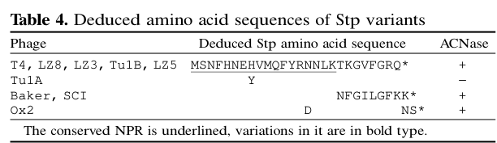

## Question

# Gene Research for Functional Annotation

## ⚠️ CRITICAL: Gene/Protein Identification Context

**BEFORE YOU BEGIN RESEARCH:** You MUST verify you are researching the CORRECT gene/protein. Gene symbols can be ambiguous, especially for less well-characterized genes from non-model organisms.

### Target Gene/Protein Identity (from UniProt):
- **UniProt Accession:** P62765
- **Protein Description:** RecName: Full=T4 Suppressor of prr; Short=Stp;
- **Gene Information:** Name=stp;
- **Organism (full):** Enterobacteria phage T4 (Bacteriophage T4).
- **Protein Family:** Not specified in UniProt
- **Key Domains:** Stp. (IPR012585); Nuclease_act (PF08133)

### MANDATORY VERIFICATION STEPS:

1. **Check if the gene symbol "stp" matches the protein description above**
2. **Verify the organism is correct:** Enterobacteria phage T4 (Bacteriophage T4).
3. **Check if protein family/domains align with what you find in literature**
4. **If you find literature for a DIFFERENT gene with the same or similar symbol, STOP**

### If Gene Symbol is Ambiguous or You Cannot Find Relevant Literature:

**DO NOT PROCEED WITH RESEARCH ON A DIFFERENT GENE.** Instead:
- State clearly: "The gene symbol 'stp' is ambiguous or literature is limited for this specific protein"
- Explain what you found (e.g., "Found extensive literature on a different gene with the same symbol in a different organism")
- Describe the protein based ONLY on the UniProt information provided above
- Suggest that the protein function can be inferred from domain/family information

### Research Target:

Please provide a comprehensive research report on the gene **stp** (gene ID: stp, UniProt: P62765) in BPT4.

The research report should be a detailed narrative explaining the function, biological processes, and localization of the gene product. Citations should be given for all claims.

You should prioritize authoritative reviews and primary scientific literature when conducting research. You can supplement
this with annotations you find in gene/protein databases, but these can be outdated or inaccurate.

We are specifically interested in the primary function of the gene - for enzymes, what reaction is catalyzed, and what is the substrate specificity? For transporters, what is the substrate? For structural proteins or adapters, what is the broader structural role? For signaling molecules, what is the role in the pathway.

We are interested in where in or outside the cell the gene product carries out its function.

We are also interested in the signaling or biochemical pathways in which the gene functions. We are less interested in broad pleiotropic effects, except where these elucidate the precise role.

Include evidence where possible. We are interested in both experimental evidence as well as inference from structure, evolution, or bioinformatic analysis. Precise studies should be prioritized over high-throughput, where available.

## Output

Question: You are an expert researcher providing comprehensive, well-cited information.

Provide detailed information focusing on:
1. Key concepts and definitions with current understanding
2. Recent developments and latest research (prioritize 2023-2024 sources)
3. Current applications and real-world implementations
4. Expert opinions and analysis from authoritative sources
5. Relevant statistics and data from recent studies

Format as a comprehensive research report with proper citations. Include URLs and publication dates where available.
Always prioritize recent, authoritative sources and provide specific citations for all major claims.

# Gene Research for Functional Annotation

## ⚠️ CRITICAL: Gene/Protein Identification Context

**BEFORE YOU BEGIN RESEARCH:** You MUST verify you are researching the CORRECT gene/protein. Gene symbols can be ambiguous, especially for less well-characterized genes from non-model organisms.

### Target Gene/Protein Identity (from UniProt):
- **UniProt Accession:** P62765
- **Protein Description:** RecName: Full=T4 Suppressor of prr; Short=Stp;
- **Gene Information:** Name=stp;
- **Organism (full):** Enterobacteria phage T4 (Bacteriophage T4).
- **Protein Family:** Not specified in UniProt
- **Key Domains:** Stp. (IPR012585); Nuclease_act (PF08133)

### MANDATORY VERIFICATION STEPS:

1. **Check if the gene symbol "stp" matches the protein description above**
2. **Verify the organism is correct:** Enterobacteria phage T4 (Bacteriophage T4).
3. **Check if protein family/domains align with what you find in literature**
4. **If you find literature for a DIFFERENT gene with the same or similar symbol, STOP**

### If Gene Symbol is Ambiguous or You Cannot Find Relevant Literature:

**DO NOT PROCEED WITH RESEARCH ON A DIFFERENT GENE.** Instead:
- State clearly: "The gene symbol 'stp' is ambiguous or literature is limited for this specific protein"
- Explain what you found (e.g., "Found extensive literature on a different gene with the same symbol in a different organism")
- Describe the protein based ONLY on the UniProt information provided above
- Suggest that the protein function can be inferred from domain/family information

### Research Target:

Please provide a comprehensive research report on the gene **stp** (gene ID: stp, UniProt: P62765) in BPT4.

The research report should be a detailed narrative explaining the function, biological processes, and localization of the gene product. Citations should be given for all claims.

You should prioritize authoritative reviews and primary scientific literature when conducting research. You can supplement
this with annotations you find in gene/protein databases, but these can be outdated or inaccurate.

We are specifically interested in the primary function of the gene - for enzymes, what reaction is catalyzed, and what is the substrate specificity? For transporters, what is the substrate? For structural proteins or adapters, what is the broader structural role? For signaling molecules, what is the role in the pathway.

We are interested in where in or outside the cell the gene product carries out its function.

We are also interested in the signaling or biochemical pathways in which the gene functions. We are less interested in broad pleiotropic effects, except where these elucidate the precise role.

Include evidence where possible. We are interested in both experimental evidence as well as inference from structure, evolution, or bioinformatic analysis. Precise studies should be prioritized over high-throughput, where available.

## Research report: Bacteriophage T4 **stp** (UniProt **P62765**) — “T4 suppressor of prr” (Stp)

### 0) Mandatory identity verification (to avoid gene-symbol ambiguity)
The gene symbol **stp** in this report refers specifically to **Enterobacteria phage T4** (bacteriophage T4) and encodes the **T4 suppressor of prr (Stp)**, a *minuscule phage peptide* that (i) **inhibits the host type I restriction system EcoPrrI** and (ii) **activates the host PrrC anticodon nuclease** (ACNase) that cleaves **tRNA\u207bLys**. These defining properties and the “Suppressor of prr” naming are consistent across primary literature and authoritative reviews, confirming the target identity described in UniProt P62765. (penner1995phaget4codedstp pages 1-2, kaufmann2000anticodonnucleases. pages 1-2, snyder1995phage‐exclusionenzymesa pages 3-4)

### 1) Key concepts and definitions (current understanding)

#### 1.1 The **prr** defense module and why **Stp** matters
In *prr+* Escherichia coli strains, the **prr locus** encodes (or is linked to) a coupled defense arrangement that includes:
- A **type I restriction–modification (R–M) system** (EcoPrrI; Hsd components) that restricts invading DNA, and
- A **latent RNase toxin**, **PrrC**, an **anticodon nuclease (ACNase)** that cleaves **tRNA\u207bLys** when activated. (kaufmann2000anticodonnucleases. pages 1-2)

A central concept is that **PrrC is masked/kept latent by association with the EcoPrrI restriction complex**; perturbation of the restriction machinery can “unmask” or activate PrrC. (amitsur2003bacteriophaget4‐encodedstp pages 1-2, kaufmann2000anticodonnucleases. pages 1-2)

**Stp** is the phage-encoded factor that ties these elements together: it is an **anti-restriction effector** that inhibits EcoPrrI restriction, but this same action (directly or indirectly) **activates PrrC**, leading to tRNA cleavage and potential translational arrest—hence Stp is a “double-edged effector.” (penner1995phaget4codedstp pages 1-2, kaufmann2000anticodonnucleases. pages 1-2)

#### 1.2 What Stp is (size and sequence-level definition)
Stp is exceptionally small. Snyder’s expert perspective describes **an ORF of ~26 amino acids** encoding Stp. (snyder1995phage‐exclusionenzymesa pages 3-4)

Penner et al. determined the deduced Stp peptide sequence (Table 4) as **MSNFHNEHVMQFYRNNLKTKGVFGRQ** (with a stop codon following; length ~27 aa depending on counting conventions). (penner1995phaget4codedstp pages 5-7, penner1995phaget4codedstp media c9ccb3d5)

#### 1.3 What “anticodon nuclease activation” means here
When **PrrC** is activated, it cleaves **tRNA\u207bLys** in the anticodon loop/near the wobble position, generating **5′-OH and 2′,3′-cyclic phosphate termini**. This lesion can inhibit translation, including T4 late protein synthesis unless repaired. (penner1995phaget4codedstp pages 1-2, kaufmann2000anticodonnucleases. pages 1-2)

### 2) Molecular function: mechanism, substrate specificity, and reaction context

#### 2.1 Primary function of Stp: anti-restriction of **EcoPrrI**
Penner et al. show that Stp **abolishes EcoPrrI restriction activity but not the cognate modification activity**, consistent with selective interference with the restriction apparatus (e.g., HsdR-dependent function). (penner1995phaget4codedstp pages 8-9, penner1995phaget4codedstp pages 2-4)

A key mechanistic point is that **anti-restriction does not require PrrC**: Stp can alleviate EcoPrrI restriction even in backgrounds lacking prrC, indicating a direct anti-restriction action on EcoPrrI/Hsd rather than an indirect effect via PrrC. (penner1995phaget4codedstp pages 2-4, penner1995phaget4codedstp pages 8-9)

#### 2.2 How Stp activates PrrC (ACNase) and why DNA matters
Penner et al. propose a conformational relay model in which **Stp binds an Hsd (EcoPrrI) subunit**, producing a conformational change that is transmitted to the **Hsd–PrrC interface**, thereby permitting PrrC to cleave tRNA\u207bLys. (penner1995phaget4codedstp pages 7-8)

Amitsur et al. add biochemical constraints: Stp activates PrrC most effectively when **EcoPrrI is bound to its cognate DNA substrate**; in vitro Stp-dependent activation is **DNase-sensitive** and depends on nucleotide conditions. (amitsur2003bacteriophaget4‐encodedstp pages 1-2)

#### 2.3 Energetic/catalytic requirements of activation (GTP hydrolysis)
A recurring biochemical feature is that **GTP hydrolysis** is implicated as a driving requirement for activation of the EcoPrrI:PrrC ACNase system. Amitsur et al. report that the activation process is driven by **GTP hydrolysis**, likely via the **NTPase domain of PrrC**, and that Stp’s effect is relayed through the EcoPrrI component rather than acting on free PrrC. (amitsur2003bacteriophaget4‐encodedstp pages 1-2, amitsur2003bacteriophaget4‐encodedstp pages 2-3)

#### 2.4 Substrate specificity and catalytic reaction (what is cleaved)
Stp itself is best understood as an **effector/regulator peptide**, not as the catalytic nuclease.
The downstream nuclease reaction is catalyzed by **PrrC**, which cleaves **tRNA\u207bLys** (lysine tRNA) at/near the anticodon wobble position, yielding **5′-OH** and **2′,3′-cyclic phosphate** ends. (kaufmann2000anticodonnucleases. pages 1-2, penner1995phaget4codedstp pages 1-2)

### 3) Infection-cycle context: timing, localization, and pathway placement

#### 3.1 Timing of Stp expression and localization inference
Penner et al. describe Stp as expressed on a **delayed-early schedule** and state it is **unlikely to be packaged in the virion**, implying that Stp acts **after infection** within the host cell rather than being delivered as a preformed virion protein. (penner1995phaget4codedstp pages 8-9)

Stp is also described as **diffusible** (i.e., not a structural/virion component), consistent with a role in modulating host macromolecular complexes in the cytosol during infection. (penner1995phaget4codedstp pages 1-2)

#### 3.2 Pathway/system role: coupling anti-restriction to tRNA restriction (“fail-safe”)
Expert synthesis emphasizes that PrrC is masked by Hsd proteins and that **Stp’s anti-restriction action may dissociate or disable the Hsd complex**, thereby inactivating DNA restriction while **inadvertently freeing/activating PrrC**—a “fail-safe” outcome in which tRNA cleavage can kill the cell if restriction is inactivated. (snyder1995phage‐exclusionenzymesa pages 3-4)

### 4) Genetics and phenotypes: what happens when stp is mutated
Penner et al. provide allele-level genotype–phenotype mapping and show that **Stp is necessary and sufficient** for ACNase activation, because induction of cloned stp in uninfected *prr+* E. coli elicits ACNase activity. (penner1995phaget4codedstp pages 7-8)

Key structure–function insights from mutant panels:
- The conserved **N-proximal ~18 aa region** is sufficient/critical for both anti-restriction and ACNase activation, while the C-terminus is more dispensable. (penner1995phaget4codedstp pages 8-9, penner1995phaget4codedstp pages 5-7)
- Specific residues (e.g., **F4, E7, H8, R14**) are often essential for ACNase activation; some substitutions can differentially affect the two functions (e.g., **F4S** abolishing ACNase activation while “hardly” affecting anti-restriction). (penner1995phaget4codedstp pages 8-9, penner1995phaget4codedstp pages 7-8)

Quantitative/semiquantitative phenotypes (Table 5) include, for example:
- **prr:stp**: efficiency of plating (EOP) ~**0.4** with ACNase **+**
- **prr:stpF4S**: EOP ~**0.2** with ACNase **−**
- **prr:stpE7V**: EOP ~**10\u207b\u00b3** with ACNase **−**
- **prr:stp(Baker)**: EOP ~**0.8** with ACNase **+** (penner1995phaget4codedstp pages 7-8, penner1995phaget4codedstp media 2c0776ea)

These data support the conclusion that Stp’s N-terminal residues are a major determinant of its functional interaction with the EcoPrrI–PrrC complex. (penner1995phaget4codedstp pages 5-7, penner1995phaget4codedstp pages 7-8)

### 5) Recent developments (prioritizing 2023–2024) and current framing

#### 5.1 2023: high-throughput “accessory gene” functional screens include Stp as a control
A 2023 large-scale platform for discovering phage accessory genes identified **10,888 putative accessory genes** from **1,706 Enterobacteriophage genomes** (10,888 genes across 1,217 phages in nonredundant accessory regions) and synthesized 200 genes for assays; the authors explicitly included **Stp** among **11 previously characterized phage genes** used as controls. (silas2023activationofprogrammed pages 1-3)

This indicates that—even though mechanistic work on Stp is largely earlier—Stp remains a canonical reference point in modern experimental frameworks for phage counter-defense biology. (silas2023activationofprogrammed pages 1-3)

#### 5.2 2024: continued use as a canonical example in educational/review synthesis
A 2024 synthesis on why phages encode tRNAs reprises the classic model: PrrC is inhibited by a restriction enzyme in uninfected cells, and **phage anti-restriction protein Stp binds the inhibiting restriction enzyme**, releasing/activating PrrC, which cleaves **tRNA\u207bLys** and arrests translation; T4 can counteract with tRNA repair enzymes (**pnk**, **rli**). (quinn2024whydobacteriophages pages 32-35)

*Note on evidence quality:* this 2024 item is not clearly tied to a major peer-reviewed venue in the retrieved metadata (“Unknown journal”), so it should be treated as secondary/tertiary synthesis. The mechanistic and quantitative claims in this report are anchored primarily in peer-reviewed primary papers and authoritative reviews from 1995–2003. (penner1995phaget4codedstp pages 1-2, amitsur2003bacteriophaget4‐encodedstp pages 1-2, kaufmann2000anticodonnucleases. pages 1-2)

### 6) Current applications and real-world implementations

#### 6.1 Stp/PrrC as a model for phage counter-defense and abortive infection coupling
The Stp–EcoPrrI–PrrC module is widely used conceptually to illustrate how a **phage counter-defense (anti-restriction)** can trigger **host “abortive infection” style defenses** (tRNA cleavage/toxin activation). (kaufmann2000anticodonnucleases. pages 1-2, snyder1995phage‐exclusionenzymesa pages 3-4)

#### 6.2 Reagent/tool concept (expert viewpoint)
Snyder’s 1995 commentary frames phage-exclusion enzymes (including the prr/PrrC system activated by Stp) as potentially a “bonanza” of biochemical/cell-biology reagents, reflecting an expert view that such systems can be harnessed experimentally to probe macromolecular interactions and regulation. (snyder1995phage‐exclusionenzymesa pages 3-4)

#### 6.3 Inclusion in modern functional-genomics pipelines
Stp’s inclusion as a known control gene in 2023 accessory gene discovery pipelines suggests practical implementation as a benchmark factor when assessing phage genes that modulate restriction systems or trigger toxic outcomes. (silas2023activationofprogrammed pages 1-3)

### 7) Key statistics and data points (from cited studies)
- **Stp length**: ORF encodes ~**26 aa** (expert synthesis). (snyder1995phage‐exclusionenzymesa pages 3-4)
- **Stp sequence**: **MSNFHNEHVMQFYRNNLKTKGVFGRQ** (Table 4). (penner1995phaget4codedstp pages 5-7, penner1995phaget4codedstp media c9ccb3d5)
- **Mutant phenotypes**: Example Table 5 values include **EOP 0.4 (+)** for prr:stp, **0.2 (−)** for F4S, and **10\u207b\u00b3 (−)** for E7V. (penner1995phaget4codedstp pages 7-8, penner1995phaget4codedstp media 2c0776ea)
- **Alternative activator potency**: **dTTP ~5 × 10\u207b\u2077 M** as an in vitro surrogate activator of ACNase under assay conditions. (amitsur2003bacteriophaget4‐encodedstp pages 2-3)
- **2023 screening scale**: **1,706 genomes**, **10,888 putative AGs**, **200 synthesized AGs**, with **Stp among 11 controls**. (silas2023activationofprogrammed pages 1-3)

### 8) Evidence table (compact functional annotation map)
| Aspect | Experimentally supported finding | Example quantitative/phenotypic detail | Key citations |
|---|---|---|---|
| Peptide size / sequence | T4 **Stp** is a minuscule phage-encoded peptide of ~26–27 aa; Penner et al. reported the deduced sequence **MSNFHNEHVMQFYRNNLKTKGVFGRQ** (stop codon omitted). | Table 4 in Penner et al. lists the wt peptide and mutant/variant sequences; Snyder describes an ORF of about **26 aa**. | (penner1995phaget4codedstp pages 5-7, snyder1995phage‐exclusionenzymesa pages 3-4, penner1995phaget4codedstp media c9ccb3d5) |
| Primary function 1: anti-restriction | Stp inhibits **EcoprrI** type IC restriction activity while sparing cognate DNA modification, consistent with action on the restriction-specific Hsd machinery. | Lower Stp levels suffice for anti-restriction than for ACNase activation; anti-restriction does **not** require PrrC. | (penner1995phaget4codedstp pages 8-9, penner1995phaget4codedstp pages 2-4) |
| Primary function 2: PrrC activation | Stp is **necessary and sufficient** to activate the latent host **PrrC anticodon nuclease (ACNase)**, leading to cleavage of **tRNA^Lys**. | Induction of cloned **stp** in uninfected **prr+** E. coli elicits ACNase activity; stp mutations abolish activation. | (penner1995phaget4codedstp pages 1-2, penner1995phaget4codedstp pages 5-7, penner1995phaget4codedstp pages 7-8) |
| Mechanistic model | Stp likely binds an **Hsd/EcoPrrI** component and relays a conformational change to the **Hsd–PrrC** interface, unmasking latent PrrC. | Proposed “single-hit” inactivation of EcoPrrI versus a higher/continued Stp requirement for ACNase activation. | (penner1995phaget4codedstp pages 1-2, penner1995phaget4codedstp pages 9-10, penner1995phaget4codedstp pages 7-8) |
| Biochemical requirements | In vitro Stp-dependent activation is favored when **EcoPrrI is DNA-bound**, is **DNase-sensitive**, and requires nucleotide turnover with **GTP hydrolysis** likely through the PrrC NTPase domain. | Activation reactions lose activity with DNase; GTP hydrolysis is required for activation of the holoenzyme. | (amitsur2003bacteriophaget4‐encodedstp pages 1-2, amitsur2003bacteriophaget4‐encodedstp pages 2-3) |
| Alternative activator | A normal host metabolite can substitute for Stp: **dTTP** is the most potent reported surrogate activator in vitro, apparently acting through a mechanistically distinct holoenzyme/DNA state. | Effective level reported at approximately **5 × 10^-7 M dTTP** under assay conditions. | (amitsur2003bacteriophaget4‐encodedstp pages 2-3, amitsur2003bacteriophaget4‐encodedstp pages 1-2) |
| Target reaction / substrate context | The biologically relevant downstream nuclease reaction is cleavage of **tRNA^Lys** at/near the wobble position, generating **5′-OH** and **2′,3′-cyclic phosphate** termini; this reaction is catalyzed by host **PrrC**, not by Stp itself. | Cleaved tRNA lesions can block late T4 protein synthesis unless repaired by phage **Pnk/Rnl1** functions. | (penner1995phaget4codedstp pages 1-2, kaufmann2000anticodonnucleases. pages 1-2) |
| Infection timing / localization notes | Stp is reported as a **delayed-early** T4 gene product and is **unlikely to be virion packaged**; it therefore most likely acts **inside the infected host cytoplasm** after infection rather than being injected as a preformed virion protein. | Timing inference comes from delayed-early expression; localization is inferred from diffusible intracellular action on EcoPrrI/PrrC. | (penner1995phaget4codedstp pages 8-9, penner1995phaget4codedstp pages 1-2) |
| Phenotypic consequences during infection | Because Stp activates PrrC, **stp** mutations suppress the requirement for T4 tRNA-repair enzymes on **prr+** hosts; without Stp-mediated activation, pnk/rli become nonessential in that context. | Stp is thus a “double-edged” effector: anti-restriction for phage benefit, but it can also trigger host tRNA restriction. | (penner1995phaget4codedstp pages 1-2, kaufmann2000anticodonnucleases. pages 1-2) |
| Mutational readouts | The conserved **N-proximal ~18 aa** are most important; residues such as **F4, E7, H8, R14** are critical for activity, while much of the C-terminus is more dispensable. | Example Table 5 values: **prr:stp = EOP 0.4, ACNase +**; **stpF4S = 0.2, −**; **stpE7V = 10^-3, −**; **stp(Baker) = 0.8, +**. | (penner1995phaget4codedstp pages 8-9, penner1995phaget4codedstp pages 5-7, penner1995phaget4codedstp pages 7-8, penner1995phaget4codedstp media c9ccb3d5, penner1995phaget4codedstp media 2c0776ea) |
| Recent framing (2023–2024) | Recent reviews still cite the **Stp–EcoprrI–PrrC** axis as a classic example of phage anti-restriction provoking abortive infection/tRNA cleavage; in 2023 Stp was also included as a known accessory-gene control in a large phage AG screen. | Silas et al. screened **10,888 putative AGs** from **1,217 phages** and included **Stp** among 11 known controls. | (quinn2024whydobacteriophages pages 32-35, silas2023activationofprogrammed pages 1-3) |

*Table: This table summarizes experimentally supported facts about bacteriophage T4 Stp, including its size, anti-restriction and PrrC-activating roles, mechanistic requirements, infection context, and quantitative mutant phenotypes. It is useful as a compact evidence map for functional annotation of UniProt P62765.*

### 9) Visual evidence: Stp sequence and mutant phenotypes
The following extracted tables provide primary-data support for Stp’s minuscule size/sequence and for genotype–phenotype relationships (ACNase activation and plating efficiencies): Table 4/5 from Penner et al. 1995. (penner1995phaget4codedstp media c9ccb3d5, penner1995phaget4codedstp media 2c0776ea)

### 10) Summary functional annotation (for database-style fields)
- **Gene/product**: T4 **stp** encodes **Stp**, a minuscule (~26–27 aa) diffusible peptide expressed delayed-early during infection. (penner1995phaget4codedstp pages 8-9, snyder1995phage‐exclusionenzymesa pages 3-4, penner1995phaget4codedstp pages 5-7)
- **Primary molecular function**: **Anti-restriction effector** inhibiting EcoPrrI type I restriction (not modification). (penner1995phaget4codedstp pages 8-9, penner1995phaget4codedstp pages 2-4)
- **Mechanistic role**: Modulates the **EcoPrrI–PrrC** complex (especially DNA-bound state) to **activate latent PrrC anticodon nuclease**, in a DNase-sensitive, nucleotide- and **GTP hydrolysis**-dependent manner. (amitsur2003bacteriophaget4‐encodedstp pages 1-2, amitsur2003bacteriophaget4‐encodedstp pages 2-3)
- **Downstream enzymatic reaction (catalyzed by host PrrC)**: Cleavage of **tRNA\u207bLys** producing **5′-OH** and **2′,3′-cyclic phosphate** ends; lesion can block translation unless repaired by phage RNA repair enzymes. (penner1995phaget4codedstp pages 1-2, kaufmann2000anticodonnucleases. pages 1-2)
- **Cellular location of action (inferred)**: intracellular (host cytosol) after infection; not virion-packaged. (penner1995phaget4codedstp pages 8-9, penner1995phaget4codedstp pages 1-2)

### References (URLs, publication dates)
- Penner M, Morad I, Snyder L, Kaufmann G. **Phage T4-coded Stp: double-edged effector of coupled DNA and tRNA-restriction systems.** *J Mol Biol.* **1995-06**. https://doi.org/10.1006/jmbi.1995.0343 (penner1995phaget4codedstp pages 1-2)
- Amitsur M, Benjamin S, Rosner R, et al. **Bacteriophage T4-encoded Stp can be replaced as activator of anticodon nuclease by a normal host cell metabolite.** *Mol Microbiol.* **2003-10**. https://doi.org/10.1046/j.1365-2958.2003.03691.x (amitsur2003bacteriophaget4‐encodedstp pages 1-2)
- Kaufmann G. **Anticodon nucleases.** *Trends Biochem Sci.* **2000-02**. https://doi.org/10.1016/S0968-0004(99)01525-X (kaufmann2000anticodonnucleases. pages 1-2)
- Snyder L. **Phage-exclusion enzymes: a bonanza of biochemical and cell biology reagents?** *Mol Microbiol.* **1995-02**. https://doi.org/10.1111/j.1365-2958.1995.tb02255.x (snyder1995phage‐exclusionenzymesa pages 3-4)
- Silas S, Carion H, Makarova KS, et al. **Activation of programmed cell death and counter-defense functions of phage accessory genes.** *bioRxiv* **2023-06**. https://doi.org/10.1101/2023.04.06.535777 (silas2023activationofprogrammed pages 1-3)
- Quinn RE. **Why do bacteriophages encode for tRNAs?** *Unknown journal* **2024**. (metadata incomplete in retrieval) (quinn2024whydobacteriophages pages 32-35)

References

1. (penner1995phaget4codedstp pages 1-2): Michal Penner, Ilan Morad, Larry Snyder, and Gabriel Kaufmann. Phage t4-coded stp: double-edged effector of coupled dna and trna-restriction systems. Journal of molecular biology, 249 5:857-68, Jun 1995. URL: https://doi.org/10.1006/jmbi.1995.0343, doi:10.1006/jmbi.1995.0343. This article has 112 citations and is from a domain leading peer-reviewed journal.

2. (kaufmann2000anticodonnucleases. pages 1-2): Gabriel Kaufmann. Anticodon nucleases. Trends in biochemical sciences, 25 2:70-4, Feb 2000. URL: https://doi.org/10.1016/s0968-0004(99)01525-x, doi:10.1016/s0968-0004(99)01525-x. This article has 193 citations and is from a domain leading peer-reviewed journal.

3. (snyder1995phage‐exclusionenzymesa pages 3-4): Larry Snyder. Phage‐exclusion enzymes: a bonanza of biochemical and cell biology reagents? Molecular Microbiology, 15:415-420, Feb 1995. URL: https://doi.org/10.1111/j.1365-2958.1995.tb02255.x, doi:10.1111/j.1365-2958.1995.tb02255.x. This article has 259 citations and is from a domain leading peer-reviewed journal.

4. (amitsur2003bacteriophaget4‐encodedstp pages 1-2): Michal Amitsur, Sima Benjamin, Rachel Rosner, Daphne Chapman‐Shimshoni, Roberto Meidler, Shani Blanga, and Gabriel Kaufmann. Bacteriophage t4‐encoded stp can be replaced as activator of anticodon nuclease by a normal host cell metabolite. Molecular Microbiology, 50:129-143, Oct 2003. URL: https://doi.org/10.1046/j.1365-2958.2003.03691.x, doi:10.1046/j.1365-2958.2003.03691.x. This article has 27 citations and is from a domain leading peer-reviewed journal.

5. (penner1995phaget4codedstp pages 5-7): Michal Penner, Ilan Morad, Larry Snyder, and Gabriel Kaufmann. Phage t4-coded stp: double-edged effector of coupled dna and trna-restriction systems. Journal of molecular biology, 249 5:857-68, Jun 1995. URL: https://doi.org/10.1006/jmbi.1995.0343, doi:10.1006/jmbi.1995.0343. This article has 112 citations and is from a domain leading peer-reviewed journal.

6. (penner1995phaget4codedstp media c9ccb3d5): Michal Penner, Ilan Morad, Larry Snyder, and Gabriel Kaufmann. Phage t4-coded stp: double-edged effector of coupled dna and trna-restriction systems. Journal of molecular biology, 249 5:857-68, Jun 1995. URL: https://doi.org/10.1006/jmbi.1995.0343, doi:10.1006/jmbi.1995.0343. This article has 112 citations and is from a domain leading peer-reviewed journal.

7. (penner1995phaget4codedstp pages 8-9): Michal Penner, Ilan Morad, Larry Snyder, and Gabriel Kaufmann. Phage t4-coded stp: double-edged effector of coupled dna and trna-restriction systems. Journal of molecular biology, 249 5:857-68, Jun 1995. URL: https://doi.org/10.1006/jmbi.1995.0343, doi:10.1006/jmbi.1995.0343. This article has 112 citations and is from a domain leading peer-reviewed journal.

8. (penner1995phaget4codedstp pages 2-4): Michal Penner, Ilan Morad, Larry Snyder, and Gabriel Kaufmann. Phage t4-coded stp: double-edged effector of coupled dna and trna-restriction systems. Journal of molecular biology, 249 5:857-68, Jun 1995. URL: https://doi.org/10.1006/jmbi.1995.0343, doi:10.1006/jmbi.1995.0343. This article has 112 citations and is from a domain leading peer-reviewed journal.

9. (penner1995phaget4codedstp pages 7-8): Michal Penner, Ilan Morad, Larry Snyder, and Gabriel Kaufmann. Phage t4-coded stp: double-edged effector of coupled dna and trna-restriction systems. Journal of molecular biology, 249 5:857-68, Jun 1995. URL: https://doi.org/10.1006/jmbi.1995.0343, doi:10.1006/jmbi.1995.0343. This article has 112 citations and is from a domain leading peer-reviewed journal.

10. (amitsur2003bacteriophaget4‐encodedstp pages 2-3): Michal Amitsur, Sima Benjamin, Rachel Rosner, Daphne Chapman‐Shimshoni, Roberto Meidler, Shani Blanga, and Gabriel Kaufmann. Bacteriophage t4‐encoded stp can be replaced as activator of anticodon nuclease by a normal host cell metabolite. Molecular Microbiology, 50:129-143, Oct 2003. URL: https://doi.org/10.1046/j.1365-2958.2003.03691.x, doi:10.1046/j.1365-2958.2003.03691.x. This article has 27 citations and is from a domain leading peer-reviewed journal.

11. (penner1995phaget4codedstp media 2c0776ea): Michal Penner, Ilan Morad, Larry Snyder, and Gabriel Kaufmann. Phage t4-coded stp: double-edged effector of coupled dna and trna-restriction systems. Journal of molecular biology, 249 5:857-68, Jun 1995. URL: https://doi.org/10.1006/jmbi.1995.0343, doi:10.1006/jmbi.1995.0343. This article has 112 citations and is from a domain leading peer-reviewed journal.

12. (silas2023activationofprogrammed pages 1-3): Sukrit Silas, Héloïse Carion, Kira S. Makarova, Eric Laderman, David Sanchez Godinez, Matthew Johnson, Andrea Fossati, Danielle Swaney, Michael Bocek, Eugene V. Koonin, and Joseph Bondy-Denomy. Activation of programmed cell death and counter-defense functions of phage accessory genes. bioRxiv, Jun 2023. URL: https://doi.org/10.1101/2023.04.06.535777, doi:10.1101/2023.04.06.535777. This article has 9 citations.

13. (quinn2024whydobacteriophages pages 32-35): RE Quinn. Why do bacteriophages encode for trnas? Unknown journal, 2024.

14. (penner1995phaget4codedstp pages 9-10): Michal Penner, Ilan Morad, Larry Snyder, and Gabriel Kaufmann. Phage t4-coded stp: double-edged effector of coupled dna and trna-restriction systems. Journal of molecular biology, 249 5:857-68, Jun 1995. URL: https://doi.org/10.1006/jmbi.1995.0343, doi:10.1006/jmbi.1995.0343. This article has 112 citations and is from a domain leading peer-reviewed journal.

## Artifacts

- [Edison artifact artifact-00](stp-deep-research-falcon_artifacts/artifact-00.md)

## Citations

1. silas2023activationofprogrammed pages 1-3
2. quinn2024whydobacteriophages pages 32-35
3. https://doi.org/10.1006/jmbi.1995.0343
4. https://doi.org/10.1046/j.1365-2958.2003.03691.x
5. https://doi.org/10.1016/S0968-0004(99
6. https://doi.org/10.1111/j.1365-2958.1995.tb02255.x
7. https://doi.org/10.1101/2023.04.06.535777
8. https://doi.org/10.1006/jmbi.1995.0343,
9. https://doi.org/10.1016/s0968-0004(99
10. https://doi.org/10.1111/j.1365-2958.1995.tb02255.x,
11. https://doi.org/10.1046/j.1365-2958.2003.03691.x,
12. https://doi.org/10.1101/2023.04.06.535777,