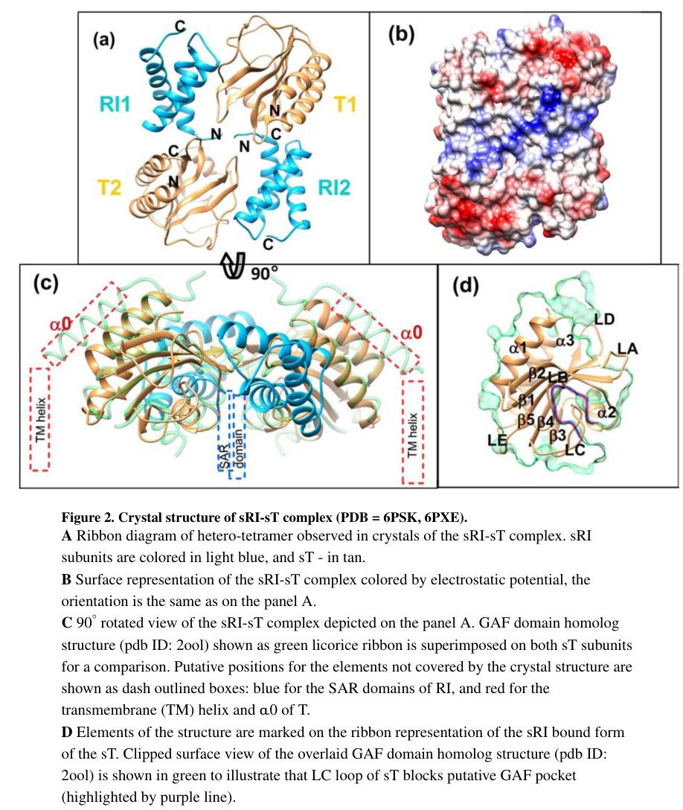

## Question

# Gene Research for Functional Annotation

## ⚠️ CRITICAL: Gene/Protein Identification Context

**BEFORE YOU BEGIN RESEARCH:** You MUST verify you are researching the CORRECT gene/protein. Gene symbols can be ambiguous, especially for less well-characterized genes from non-model organisms.

### Target Gene/Protein Identity (from UniProt):
- **UniProt Accession:** P06808
- **Protein Description:** RecName: Full=Holin {ECO:0000255|HAMAP-Rule:MF_04104}; AltName: Full=Lysis protein; AltName: Full=Protein rV;
- **Gene Information:** Name=t; Synonyms=rV;
- **Organism (full):** Enterobacteria phage T4 (Bacteriophage T4).
- **Protein Family:** Belongs to the T4likevirus holin family.
- **Key Domains:** Phage_T4_GpT_holin. (IPR020982); Phage_holin_T (PF11031)

### MANDATORY VERIFICATION STEPS:

1. **Check if the gene symbol "t" matches the protein description above**
2. **Verify the organism is correct:** Enterobacteria phage T4 (Bacteriophage T4).
3. **Check if protein family/domains align with what you find in literature**
4. **If you find literature for a DIFFERENT gene with the same or similar symbol, STOP**

### If Gene Symbol is Ambiguous or You Cannot Find Relevant Literature:

**DO NOT PROCEED WITH RESEARCH ON A DIFFERENT GENE.** Instead:
- State clearly: "The gene symbol 't' is ambiguous or literature is limited for this specific protein"
- Explain what you found (e.g., "Found extensive literature on a different gene with the same symbol in a different organism")
- Describe the protein based ONLY on the UniProt information provided above
- Suggest that the protein function can be inferred from domain/family information

### Research Target:

Please provide a comprehensive research report on the gene **t** (gene ID: t, UniProt: P06808) in BPT4.

The research report should be a detailed narrative explaining the function, biological processes, and localization of the gene product. Citations should be given for all claims.

You should prioritize authoritative reviews and primary scientific literature when conducting research. You can supplement
this with annotations you find in gene/protein databases, but these can be outdated or inaccurate.

We are specifically interested in the primary function of the gene - for enzymes, what reaction is catalyzed, and what is the substrate specificity? For transporters, what is the substrate? For structural proteins or adapters, what is the broader structural role? For signaling molecules, what is the role in the pathway.

We are interested in where in or outside the cell the gene product carries out its function.

We are also interested in the signaling or biochemical pathways in which the gene functions. We are less interested in broad pleiotropic effects, except where these elucidate the precise role.

Include evidence where possible. We are interested in both experimental evidence as well as inference from structure, evolution, or bioinformatic analysis. Precise studies should be prioritized over high-throughput, where available.

## Output

Question: You are an expert researcher providing comprehensive, well-cited information.

Provide detailed information focusing on:
1. Key concepts and definitions with current understanding
2. Recent developments and latest research (prioritize 2023-2024 sources)
3. Current applications and real-world implementations
4. Expert opinions and analysis from authoritative sources
5. Relevant statistics and data from recent studies

Format as a comprehensive research report with proper citations. Include URLs and publication dates where available.
Always prioritize recent, authoritative sources and provide specific citations for all major claims.

# Gene Research for Functional Annotation

## ⚠️ CRITICAL: Gene/Protein Identification Context

**BEFORE YOU BEGIN RESEARCH:** You MUST verify you are researching the CORRECT gene/protein. Gene symbols can be ambiguous, especially for less well-characterized genes from non-model organisms.

### Target Gene/Protein Identity (from UniProt):
- **UniProt Accession:** P06808
- **Protein Description:** RecName: Full=Holin {ECO:0000255|HAMAP-Rule:MF_04104}; AltName: Full=Lysis protein; AltName: Full=Protein rV;
- **Gene Information:** Name=t; Synonyms=rV;
- **Organism (full):** Enterobacteria phage T4 (Bacteriophage T4).
- **Protein Family:** Belongs to the T4likevirus holin family.
- **Key Domains:** Phage_T4_GpT_holin. (IPR020982); Phage_holin_T (PF11031)

### MANDATORY VERIFICATION STEPS:

1. **Check if the gene symbol "t" matches the protein description above**
2. **Verify the organism is correct:** Enterobacteria phage T4 (Bacteriophage T4).
3. **Check if protein family/domains align with what you find in literature**
4. **If you find literature for a DIFFERENT gene with the same or similar symbol, STOP**

### If Gene Symbol is Ambiguous or You Cannot Find Relevant Literature:

**DO NOT PROCEED WITH RESEARCH ON A DIFFERENT GENE.** Instead:
- State clearly: "The gene symbol 't' is ambiguous or literature is limited for this specific protein"
- Explain what you found (e.g., "Found extensive literature on a different gene with the same symbol in a different organism")
- Describe the protein based ONLY on the UniProt information provided above
- Suggest that the protein function can be inferred from domain/family information

### Research Target:

Please provide a comprehensive research report on the gene **t** (gene ID: t, UniProt: P06808) in BPT4.

The research report should be a detailed narrative explaining the function, biological processes, and localization of the gene product. Citations should be given for all claims.

You should prioritize authoritative reviews and primary scientific literature when conducting research. You can supplement
this with annotations you find in gene/protein databases, but these can be outdated or inaccurate.

We are specifically interested in the primary function of the gene - for enzymes, what reaction is catalyzed, and what is the substrate specificity? For transporters, what is the substrate? For structural proteins or adapters, what is the broader structural role? For signaling molecules, what is the role in the pathway.

We are interested in where in or outside the cell the gene product carries out its function.

We are also interested in the signaling or biochemical pathways in which the gene functions. We are less interested in broad pleiotropic effects, except where these elucidate the precise role.

Include evidence where possible. We are interested in both experimental evidence as well as inference from structure, evolution, or bioinformatic analysis. Precise studies should be prioritized over high-throughput, where available.

# Research report: Enterobacteria phage T4 gene **t** (rV), holin **T** (UniProt P06808)

## 0) Executive summary
Gene **t** (synonym **rV**) of *Enterobacteria phage T4* encodes **holin T**, a 218-aa bitopic (single-pass) inner-membrane protein that acts as the **lysis timer/trigger** for phage release. Holin T accumulates harmlessly in the host cytoplasmic membrane and then **triggers** to permeabilize the membrane, enabling the phage endolysin **E** (cytoplasmically accumulated) to access the periplasm and degrade peptidoglycan. T4’s distinctive feature is **lysis inhibition (LIN)**—a superinfection-triggered delay of lysis—mediated largely through direct **periplasmic-domain interactions** between holin T and the periplasmic antiholin **RI**, with an additional cytoplasmic antiholin **RIII** that contributes to LIN stability. Quantitatively, wild-type T4 lysis in *E. coli* at 37°C occurs at ~**25 min** with ~**200** progeny released, whereas LIN can prolong the vegetative cycle for **hours**. (tran2005periplasmicdomainsdefine pages 1-1, ramanculov2001anancientplayer pages 1-3, young2002bacteriophageholinsdeadly pages 10-11)

## 1) Mandatory identity verification (avoid symbol ambiguity)
The short gene symbol **t** is ambiguous across biology, but the relevant literature unambiguously identifies **T4 gene t** as encoding the holin **T** and states that **rV is allelic to t**. Tran et al. explicitly describe “T (rV), the T4 holin” responsible for lysis timing and LIN. Moussa et al. likewise state “gene t (also called rV) encodes the T4 holin T.” These statements match the UniProt context (P06808; holin/lysis protein; *Enterobacteria phage T4*; T4-like holin family). (tran2005periplasmicdomainsdefine pages 1-1, moussa2014geneticdissectionof pages 1-2, ramanculov2001anancientplayer pages 1-3)

## 2) Key concepts and definitions (current understanding)

### 2.1 Holins and the holin–endolysin lysis pathway
In Gram-negative phage infections, host lysis is commonly executed by a **holin–endolysin** system: the endolysin is produced during infection but is topologically separated from the peptidoglycan by the inner membrane; the holin provides **regulated membrane permeabilization** that suddenly grants endolysin access to the periplasm to degrade cell wall. For T4 specifically, Tran et al. describe holin T triggering to disrupt the cytoplasmic membrane, permitting endolysin **E** entry into the periplasm to digest peptidoglycan. (tran2005periplasmicdomainsdefine pages 1-1)

### 2.2 Lysis inhibition (LIN)
**LIN** is a T-even-phage strategy in which **secondary infection/superinfection** delays lysis, increasing the time for virion accumulation and thereby increasing total progeny released at eventual burst. In T4, LIN is mediated post-translationally by antiholins that inhibit holin triggering; LIN can be overridden by treatments that collapse the membrane potential (energy poisons), consistent with holin triggering being tied to membrane energization state. (tran2005periplasmicdomainsdefine pages 1-1, young2002bacteriophageholinsdeadly pages 11-12)

## 3) T4 holin T (gene t/rV): function, mechanism, and localization

### 3.1 Primary function
Holin T is the **essential membrane trigger** that initiates the terminal lysis event of T4 infection by forming membrane lesions/holes. T null mutants show an **absolute lysis defect** with intracellular accumulation of virions and lysozyme, indicating that other T4 proteins do not compensate for this membrane-triggering role. (young2002bacteriophageholinsdeadly pages 10-11)

### 3.2 Subcellular localization and topology
Multiple lines of evidence indicate holin T is an **integral inner (cytoplasmic) membrane** protein with **N-in/C-out (Nin–Cout)** topology and a single N-terminal transmembrane helix. Young (2002) reports the single TMD spans roughly residues **35–55**, with N-terminus cytoplasmic and C-terminus periplasmic. Tran et al. (2005) characterize T as a 218-residue bitopic holin with a ~**163-residue** C-terminal periplasmic domain. Moussa et al. (2014) similarly describe T as a 218-aa integral membrane protein with Nin–Cout topology and a single transmembrane domain. (young2002bacteriophageholinsdeadly pages 10-11, tran2005periplasmicdomainsdefine pages 1-1, moussa2014geneticdissectionof pages 1-2)

### 3.3 Triggering and oligomerization
T4 holin T appears to undergo a **switch-like transition** involving oligomerization/assembly into higher-order complexes during triggering. During LIN, T accumulates in the membrane as **SDS-resistant oligomers**, and cross-linking experiments detect a **T–RI heterodimer**, supporting the existence of specific holin–antiholin complexes in vivo. Review-level synthesis also notes transitions from monomer/dimer to higher-order SDS-resistant oligomers consistent with a conformational transition during hole formation. (ramanculov2001anancientplayer pages 1-3, young2002bacteriophageholinsdeadly pages 11-12)

## 4) Lysis inhibition pathway: RI–T regulation and the role of RIII

### 4.1 RI antiholin is the core LIN inhibitor of holin T
Tran et al. provide direct evidence that LIN regulation is mediated by **periplasmic domain interactions**: holin T contains a large C-terminal periplasmic domain (TCTD), and the **periplasmic domain of RI is necessary and sufficient** to block T-mediated lysis. RI–T complexes can be detected biochemically (e.g., via stabilization with GFP–RI fusions and complex formation with TCTD), supporting direct binding. (tran2005periplasmicdomainsdefine pages 1-1, tran2005periplasmicdomainsdefine pages 7-9)

### 4.2 Periplasmic-domain competition experiments support the model
A particularly strong functional test is that providing T’s periplasmic domain (TCTD) **in trans** abolishes LIN and shifts plaque morphology toward **rapid-lysis “r”** plaques, consistent with competitive inhibition/sequestration of RI and demonstrating that TCTD is a functional interaction interface for LIN control. (tran2005periplasmicdomainsdefine pages 1-1, tran2005periplasmicdomainsdefine pages 6-7)

### 4.3 Role of membrane potential and superinfection signals
LIN is sensitive to **energy poisons** that collapse the proton motive force; such depolarization can subvert antiholin inhibition and promote holin triggering. This provides mechanistic support for models in which membrane energization status and antiholin positioning/conformation control the holin’s transition to the lethal state. (tran2005periplasmicdomainsdefine pages 1-1, tran2005periplasmicdomainsdefine pages 7-9)

### 4.4 Structural basis (authoritative 2020 structural study)
Krieger et al. (2020) provide a structural framework for the RI–T interaction, proposing a heterotetrameric complex that forms early and is disrupted during triggering, with **SAR-domain exit upon depolarization** contributing to complex dissociation and release of T to oligomerize. This work also identifies the soluble periplasmic region of T as **GAF-like**, supporting a model where ligand-pocket accessibility and conformational rearrangements influence LIN sensitivity and triggering. Their figures include (i) a membrane-topology/structure model of the RI–T complex and (ii) a schematic model of LIN and triggering transitions. (krieger2020thestructuralbasis pages 8-9, krieger2020thestructuralbasis media 0171b127, krieger2020thestructuralbasis media 7d022c0f)

### 4.5 RIII (secondary antiholin)
Young (2002) summarizes that the cytoplasmic antiholin **RIII** contributes to LIN stability but does not substitute for RI, consistent with RI’s direct periplasmic inhibition of holin T. (young2002bacteriophageholinsdeadly pages 11-12)

## 5) Quantitative data and phenotypes relevant to functional annotation

### 5.1 Lysis timing and burst output (T4-specific)
Tran et al. report that wild-type T4 infection at 37°C lyses at ~**25 min** and releases ~**200 progeny virions**. (tran2005periplasmicdomainsdefine pages 1-1)

### 5.2 LIN duration (T4-specific)
LIN can extend the vegetative cycle “up to **several hours**” while virions accumulate, as described by Ramanculov & Young and by Young’s review synthesis. (ramanculov2001anancientplayer pages 1-3, young2002bacteriophageholinsdeadly pages 10-11)

### 5.3 Holin lesion statistics (general holin context, not unique to T4)
Moussa et al. (2014) summarize canonical holin-triggered lesions as **micrometer-scale** holes, typically **1–3 per cell** (general holin concept), and distinguish this from pinholins that form ~10^3 small pinholes with ~2 nm lumens. This provides a conceptual reference frame for holin lesion formation; however, these values are not measurements specifically reported for T4 holin T in the retrieved excerpts. (moussa2014geneticdissectionof pages 1-2)

## 6) Recent developments (2023–2024) relevant to holin biology and T4-like holins
Direct experimental updates specifically on **T4 holin T (gene t/rV)** in 2023–2024 were not retrieved in this tool session. However, several 2024 publications advance concepts directly relevant to understanding and applying holin-regulated lysis:

1. **Quantitative modeling of T-even LIN as a competitive strategy (2024):** Hvid & Mitarai modeled secondary-adsorption-triggered LIN and found that LIN can provide competitive advantages by increasing yield and by inactivating competing phages via adsorption to already infected cells, including in spatial plaque simulations. This supports LIN as an adaptive timing-control module in T-even phages (context for T4’s RI–T regulation). (hvid2024competitiveadvantagesof pages 1-4)

2. **Physicochemical predictors of holin-trigger timing (2024):** Mondal et al. report correlations between holin mutant physicochemical properties (notably hydrophobicity) and lysis times, and cite membrane lesions on the order of ~**300–350 nm** diameter (general holin context). Such approaches may eventually help predict effects of T4 holin T mutations on timing/LIN behavior. (mondal2024elucidatingphysicochemicalfeatures pages 1-2)

3. **Expanded lysis modules beyond holin/endolysin/spanin (2024):** Thöneböhn et al. identified an additional small transmembrane factor (**Lcc6**) acting at the holin level and strictly required for lysis in a prophage system, reinforcing that lysis timing and membrane permeabilization can be modulated by accessory proteins—conceptually analogous to antiholin regulation in T4. (thonebohn2024identifyingcomponentsof pages 1-2)

4. **Holin-modulating proteins that tune lysis timing (2024):** Kim et al. identify a phage gene (orf52) whose product modulates holin function to fine-tune lysis timing, offering a contemporary example of proteins evolving to regulate holin triggering for replication advantages at high phage density (a conceptual parallel to LIN, though in a different phage system). (kim2024elucidationofmolecular pages 1-2)

## 7) Current applications and real-world implementations
Although T4 holin T itself is mainly a foundational model for lysis timing and lysis inhibition, the broader holin/antiholin concept is increasingly leveraged as an engineering module for controlling membrane permeability and programmed lysis. The 2024 studies above illustrate active work identifying proteins that modulate holin timing (fine-tuning lysis for fitness) and additional factors needed for lysis in some systems, which are relevant to engineering robust lysis cassettes for biotechnology and antimicrobial strategies. (kim2024elucidationofmolecular pages 1-2, thonebohn2024identifyingcomponentsof pages 1-2)

## 8) Expert opinions and synthesis from authoritative sources
Young (2002) synthesizes genetic and physiological evidence supporting holins as “protein clocks” for phage infection, and highlights T4 holin T as an unusual, largely hydrophilic holin with a large periplasmic regulatory domain; “clock” mutations mapping to the C-terminal domain support a model in which the periplasmic region governs timing and LIN sensitivity, while the N-terminal membrane anchor is critical for lethal hole formation. (young2002bacteriophageholinsdeadly pages 11-12, young2002bacteriophageholinsdeadly pages 10-11)

## 9) Visual evidence (key figures)
Krieger et al. provide (i) a structural/topology depiction of the RI–T complex (including membrane topology features) and (ii) a schematic model of LIN and triggering transitions; these figures are useful for functional annotation because they explicitly connect topology, complex formation, and depolarization-dependent transitions. (krieger2020thestructuralbasis media 0171b127, krieger2020thestructuralbasis media 7d022c0f)

## 10) Structured annotation summary table
| Feature | Summary statement | Key supporting citations with DOI URLs and publication years |
|---|---|---|
| Verified identity | UniProt P06808 matches **Enterobacteria phage T4 gene t**, also called **rV**, encoding **holin T**, the T4 lysis protein; multiple T4-focused studies explicitly state that **rV is allelic to t** and that T is the holin controlling lysis timing. (tran2005periplasmicdomainsdefine pages 1-1, ramanculov2001anancientplayer pages 1-3, moussa2014geneticdissectionof pages 1-2) | Tran et al., 2005, *J Bacteriol*, https://doi.org/10.1128/jb.187.19.6631-6640.2005; Ramanculov & Young, 2001, *Mol Microbiol*, https://doi.org/10.1046/j.1365-2958.2001.02491.x; Moussa et al., 2014, *J Bacteriol*, https://doi.org/10.1128/jb.01548-14 |
| Primary function (T4-specific) | Holin T is the **inner-membrane timer/trigger** for host lysis: it accumulates in the membrane and then suddenly triggers to permeabilize the cytoplasmic membrane, allowing **endolysin E** access to the periplasmic peptidoglycan and thereby terminating infection. (tran2005periplasmicdomainsdefine pages 1-1, ramanculov2001anancientplayer pages 1-3, moussa2014geneticdissectionof pages 1-2) | Tran et al., 2005, https://doi.org/10.1128/jb.187.19.6631-6640.2005; Ramanculov & Young, 2001, https://doi.org/10.1046/j.1365-2958.2001.02491.x; Moussa et al., 2014, https://doi.org/10.1128/jb.01548-14 |
| Mechanistic class | T is an atypical **class III holin / bitopic holin** with **one N-terminal transmembrane domain** and a **large periplasmic C-terminal domain**; compared with canonical multi-TM holins, much of its regulatory behavior is mediated by this unusually large periplasmic region. (tran2005periplasmicdomainsdefine pages 1-1, young2002bacteriophageholinsdeadly pages 10-11, moussa2014geneticdissectionof pages 1-2) | Tran et al., 2005, https://doi.org/10.1128/jb.187.19.6631-6640.2005; Young, 2002; Moussa et al., 2014, https://doi.org/10.1128/jb.01548-14 |
| Localization/topology | Experimental work supports **N-in/C-out topology**: the **N terminus is cytoplasmic**, residues around **35-55 form the single TMD**, and the bulk **C-terminal ~163 aa region is periplasmic**. T therefore acts at the **host inner membrane** while sensing/regulation occurs largely through its periplasmic domain. (tran2005periplasmicdomainsdefine pages 1-1, young2002bacteriophageholinsdeadly pages 10-11, ramanculov2001anancientplayer pages 1-3, moussa2014geneticdissectionof pages 1-2) | Tran et al., 2005, https://doi.org/10.1128/jb.187.19.6631-6640.2005; Young, 2002; Ramanculov & Young, 2001, https://doi.org/10.1046/j.1365-2958.2001.02491.x; Moussa et al., 2014, https://doi.org/10.1128/jb.01548-14 |
| Key domains | Functionally important regions include the **N-terminal cytoplasmic segment**, the **single TMD**, and the **C-terminal periplasmic domain (TCTD)**. Genetic dissection recovered lysis-defective mutations in all three regions, indicating that membrane triggering and regulation both require distributed determinants. (young2002bacteriophageholinsdeadly pages 11-12, moussa2014geneticdissectionof pages 1-2) | Young, 2002; Moussa et al., 2014, https://doi.org/10.1128/jb.01548-14 |
| Role of the periplasmic domain | The large periplasmic domain acts as a major **regulatory/timing domain** and as the **binding site for antiholin-mediated lysis inhibition**. Deleting or supplying this domain in trans strongly alters lysis timing/LIN behavior, while many “clock” mutations map there. (tran2005periplasmicdomainsdefine pages 7-9, young2002bacteriophageholinsdeadly pages 11-12, tran2005periplasmicdomainsdefine pages 6-7) | Tran et al., 2005, https://doi.org/10.1128/jb.187.19.6631-6640.2005; Young, 2002 |
| LIN regulation (T4-specific) | During **lysis inhibition (LIN)**, secondary infection delays lysis for extended periods by preventing T from triggering. The central T4-specific model is that **RI antiholin**, activated/stabilized during superinfection, binds the **periplasmic domain of T** and blocks hole formation; membrane depolarization can subvert this block. (tran2005periplasmicdomainsdefine pages 7-9, tran2005periplasmicdomainsdefine pages 1-1, ramanculov2001anancientplayer pages 1-3, young2002bacteriophageholinsdeadly pages 11-12) | Tran et al., 2005, https://doi.org/10.1128/jb.187.19.6631-6640.2005; Ramanculov & Young, 2001, https://doi.org/10.1046/j.1365-2958.2001.02491.x; Young, 2002 |
| RI antiholin interaction | The **periplasmic domains of T and RI** are necessary/sufficient for authentic LIN signaling. RI-T complex formation was supported by **co-immunoprecipitation/crosslinking**, and TCTD fragments expressed in trans can **abolish LIN**, consistent with competitive sequestration of RI. (tran2005periplasmicdomainsdefine pages 7-9, ramanculov2001anancientplayer pages 1-3, tran2005periplasmicdomainsdefine pages 6-7) | Tran et al., 2005, https://doi.org/10.1128/jb.187.19.6631-6640.2005; Ramanculov & Young, 2001, https://doi.org/10.1046/j.1365-2958.2001.02491.x |
| RIII contribution | **RIII** is a second antiholin regulator in T4 lysis inhibition, acting from the **cytoplasmic side**; available evidence indicates it contributes to **LIN stability** but does **not replace RI**, whose periplasmic interaction with T is the core inhibitory mechanism. (young2002bacteriophageholinsdeadly pages 10-11, young2002bacteriophageholinsdeadly pages 11-12) | Young, 2002; Chen & Young, 2016 background summarized in evidence stream (not used for table claims beyond contextual mention in gathered evidence) |
| Structural model (2020) | Structural analysis supports a model in which **RI and T form a heterotetrameric complex** early in infection; membrane depolarization and/or signal-dependent rearrangements disrupt the complex, freeing T to oligomerize. The soluble C-terminal domain of T shows a **GAF-like fold**, offering a structural framework for how LIN-regulated conformational changes may control triggering. (krieger2020thestructuralbasis pages 8-9, krieger2020thestructuralbasis media 0171b127) | Krieger et al., 2020, *J Mol Biol*, https://doi.org/10.1016/j.jmb.2020.06.013 |
| Oligomerization and triggering | T accumulates in the membrane and transitions from monomer/dimer states to **higher-order SDS-resistant oligomers** during triggering; this supports the view that T hole formation is an oligomerization-dependent switch rather than gradual leakage. (ramanculov2001anancientplayer pages 1-3, young2002bacteriophageholinsdeadly pages 11-12) | Ramanculov & Young, 2001, https://doi.org/10.1046/j.1365-2958.2001.02491.x; Young, 2002 |
| Key interacting partners | The most direct T4-relevant partners are **endolysin E** (downstream effector released after T triggering), **RI antiholin** (periplasmic inhibitor binding TCTD), and **RIII** (cytoplasmic LIN stabilizer/modulator). (tran2005periplasmicdomainsdefine pages 1-1, ramanculov2001anancientplayer pages 1-3, young2002bacteriophageholinsdeadly pages 11-12) | Tran et al., 2005, https://doi.org/10.1128/jb.187.19.6631-6640.2005; Ramanculov & Young, 2001, https://doi.org/10.1046/j.1365-2958.2001.02491.x; Young, 2002 |
| Key phenotypes of mutation | **t null mutants** show an **absolute lysis defect** with intracellular accumulation of virions and lysozyme; **rV/t missense mutants** are often **LIN defective** and form classic **rapid-lysis (“r”) plaques**. Some mutations allow lysis but impair LIN specifically, showing that lethal triggering and LIN sensitivity are genetically separable. (young2002bacteriophageholinsdeadly pages 10-11, young2002bacteriophageholinsdeadly pages 11-12, moussa2014geneticdissectionof pages 1-2) | Young, 2002; Moussa et al., 2014, https://doi.org/10.1128/jb.01548-14 |
| Quantitative timings/data (T4-specific) | In ordinary T4 infection, lysis is reported at about **~25 min**; under LIN, the vegetative cycle can be extended **for several hours**. In heterologous λ-based tests, **energy poisons** can trigger **T-mediated lysis at ~20 min**, compared with **~50 min** for λ S in the cited comparison. (young2002bacteriophageholinsdeadly pages 10-11, ramanculov2001anancientplayer pages 1-3) | Young, 2002; Ramanculov & Young, 2001, https://doi.org/10.1046/j.1365-2958.2001.02491.x |
| Quantitative structural/biophysical details | Holin lesions in general are described as **micrometer-scale holes** for canonical holins, often **1-3 per cell** in review-level discussion; more recent general holin modeling cites membrane lesions around **~300-350 nm** diameter, but this value is **general holin context, not T4-specific**. (moussa2014geneticdissectionof pages 1-2, mondal2024elucidatingphysicochemicalfeatures pages 1-2) | Moussa et al., 2014, https://doi.org/10.1128/jb.01548-14; Mondal et al., 2024, https://doi.org/10.1021/acs.jpcb.4c03040 |
| Evidence type | Functional annotation for T4 gene t is supported by **genetics** (t/rV allelism; mutant phenotypes), **heterologous complementation**, **fusion/deletion topology studies**, **crosslinking/co-IP**, and **structural biology** of the RI-T soluble complex. (tran2005periplasmicdomainsdefine pages 7-9, ramanculov2001anancientplayer pages 1-3, moussa2014geneticdissectionof pages 1-2, krieger2020thestructuralbasis pages 8-9) | Tran et al., 2005, https://doi.org/10.1128/jb.187.19.6631-6640.2005; Ramanculov & Young, 2001, https://doi.org/10.1046/j.1365-2958.2001.02491.x; Moussa et al., 2014, https://doi.org/10.1128/jb.01548-14; Krieger et al., 2020, https://doi.org/10.1016/j.jmb.2020.06.013 |
| 2023-2024 contextual developments (general, not T4-specific unless stated) | Recent work broadens holin biology beyond the classic holin-endolysin pair: 2024 studies describe **extra lysis factors acting at the holin level** (e.g., LambdaSo **Lcc6**), **holin-modulating proteins** that fine-tune lysis timing, and **predictive physicochemical models** linking holin hydrophobicity to lysis time; 2024 theoretical work on **T-even LIN** argues LIN can confer competitive advantage by increasing yield under high secondary adsorption. These developments are relevant context for interpreting T4 T as a regulated lysis-timing module. (kim2024elucidationofmolecular pages 1-2, mondal2024elucidatingphysicochemicalfeatures pages 1-2, hvid2024competitiveadvantagesof pages 1-4, thonebohn2024identifyingcomponentsof pages 1-2) | Kim et al., 2024, *BMC Microbiol*, https://doi.org/10.1186/s12866-024-03684-9; Mondal et al., 2024, *J Phys Chem B*, https://doi.org/10.1021/acs.jpcb.4c03040; Hvid & Mitarai, 2024, https://doi.org/10.1101/2024.02.07.579269; Thöneböhn et al., 2024, *J Bacteriol*, https://doi.org/10.1128/jb.00022-24 |

*Table: This table summarizes the experimentally supported functional annotation of Enterobacteria phage T4 gene t/rV (holin T, UniProt P06808), separating T4-specific findings from broader recent holin literature. It highlights function, topology, regulation by lysis inhibition, key interaction partners, phenotypes, and quantitative details with citation-linked sources.*

## References (URLs and publication dates)
- Tran TAT, Struck DK, Young R. *Periplasmic domains define holin-antiholin interactions in T4 lysis inhibition.* **Journal of Bacteriology** (Oct 2005). https://doi.org/10.1128/jb.187.19.6631-6640.2005 (tran2005periplasmicdomainsdefine pages 1-1)
- Ramanculov E, Young R. *An ancient player unmasked: T4 rI encodes a t-specific antiholin.* **Molecular Microbiology** (Aug 2001). https://doi.org/10.1046/j.1365-2958.2001.02491.x (ramanculov2001anancientplayer pages 1-3)
- Moussa SH, Lawler JL, Young R. *Genetic Dissection of T4 Lysis.* **Journal of Bacteriology** (Jun 2014). https://doi.org/10.1128/jb.01548-14 (moussa2014geneticdissectionof pages 1-2)
- Krieger IV et al. *The Structural Basis of T4 Phage Lysis Control: DNA as the Signal for Lysis Inhibition.* **Journal of Molecular Biology** (Jul 2020). https://doi.org/10.1016/j.jmb.2020.06.013 (krieger2020thestructuralbasis pages 8-9)
- Hvid U, Mitarai N. *Competitive advantages of T-even phage lysis inhibition in response to secondary infection.* **PLOS Computational Biology** / preprint record cited (May 2024). https://doi.org/10.1101/2024.02.07.579269 (hvid2024competitiveadvantagesof pages 1-4)
- Mondal A, Teimouri H, Kolomeisky AB. *Elucidating Physicochemical Features of Holin Proteins Responsible for Bacterial Cell Lysis.* **J. Phys. Chem. B** (Jul 2024). https://doi.org/10.1021/acs.jpcb.4c03040 (mondal2024elucidatingphysicochemicalfeatures pages 1-2)
- Thöneböhn S et al. *Identifying components of the Shewanella phage LambdaSo lysis system.* **Journal of Bacteriology** (Jun 2024). https://doi.org/10.1128/jb.00022-24 (thonebohn2024identifyingcomponentsof pages 1-2)
- Kim J, Kim J, Ryu S. *Elucidation of molecular function of phage protein responsible for optimization of host cell lysis.* **BMC Microbiology** (Dec 2024). https://doi.org/10.1186/s12866-024-03684-9 (kim2024elucidationofmolecular pages 1-2)

References

1. (tran2005periplasmicdomainsdefine pages 1-1): Tram Anh T. Tran, Douglas K. Struck, and Ry Young. Periplasmic domains define holin-antiholin interactions in t4 lysis inhibition. Journal of Bacteriology, 187:6631-6640, Oct 2005. URL: https://doi.org/10.1128/jb.187.19.6631-6640.2005, doi:10.1128/jb.187.19.6631-6640.2005. This article has 98 citations and is from a peer-reviewed journal.

2. (ramanculov2001anancientplayer pages 1-3): Erlan Ramanculov and Ry Young. An ancient player unmasked: t4 ri encodes a t‐specific antiholin. Molecular Microbiology, 41:575-583, Aug 2001. URL: https://doi.org/10.1046/j.1365-2958.2001.02491.x, doi:10.1046/j.1365-2958.2001.02491.x. This article has 76 citations and is from a domain leading peer-reviewed journal.

3. (young2002bacteriophageholinsdeadly pages 10-11): RY Young. Bacteriophage holins: deadly diversity. Unknown journal, 2002.

4. (moussa2014geneticdissectionof pages 1-2): Samir H. Moussa, Jessica L. Lawler, and Ry Young. Genetic dissection of t4 lysis. Journal of Bacteriology, 196:2201-2209, Jun 2014. URL: https://doi.org/10.1128/jb.01548-14, doi:10.1128/jb.01548-14. This article has 22 citations and is from a peer-reviewed journal.

5. (young2002bacteriophageholinsdeadly pages 11-12): RY Young. Bacteriophage holins: deadly diversity. Unknown journal, 2002.

6. (tran2005periplasmicdomainsdefine pages 7-9): Tram Anh T. Tran, Douglas K. Struck, and Ry Young. Periplasmic domains define holin-antiholin interactions in t4 lysis inhibition. Journal of Bacteriology, 187:6631-6640, Oct 2005. URL: https://doi.org/10.1128/jb.187.19.6631-6640.2005, doi:10.1128/jb.187.19.6631-6640.2005. This article has 98 citations and is from a peer-reviewed journal.

7. (tran2005periplasmicdomainsdefine pages 6-7): Tram Anh T. Tran, Douglas K. Struck, and Ry Young. Periplasmic domains define holin-antiholin interactions in t4 lysis inhibition. Journal of Bacteriology, 187:6631-6640, Oct 2005. URL: https://doi.org/10.1128/jb.187.19.6631-6640.2005, doi:10.1128/jb.187.19.6631-6640.2005. This article has 98 citations and is from a peer-reviewed journal.

8. (krieger2020thestructuralbasis pages 8-9): Inna V. Krieger, Vladimir Kuznetsov, Jeng-Yih Chang, Junjie Zhang, Samir H. Moussa, Ryland F. Young, and James C. Sacchettini. The structural basis of t4 phage lysis control: dna as the signal for lysis inhibition. Journal of Molecular Biology, 432:4623-4636, Jul 2020. URL: https://doi.org/10.1016/j.jmb.2020.06.013, doi:10.1016/j.jmb.2020.06.013. This article has 35 citations and is from a domain leading peer-reviewed journal.

9. (krieger2020thestructuralbasis media 0171b127): Inna V. Krieger, Vladimir Kuznetsov, Jeng-Yih Chang, Junjie Zhang, Samir H. Moussa, Ryland F. Young, and James C. Sacchettini. The structural basis of t4 phage lysis control: dna as the signal for lysis inhibition. Journal of Molecular Biology, 432:4623-4636, Jul 2020. URL: https://doi.org/10.1016/j.jmb.2020.06.013, doi:10.1016/j.jmb.2020.06.013. This article has 35 citations and is from a domain leading peer-reviewed journal.

10. (krieger2020thestructuralbasis media 7d022c0f): Inna V. Krieger, Vladimir Kuznetsov, Jeng-Yih Chang, Junjie Zhang, Samir H. Moussa, Ryland F. Young, and James C. Sacchettini. The structural basis of t4 phage lysis control: dna as the signal for lysis inhibition. Journal of Molecular Biology, 432:4623-4636, Jul 2020. URL: https://doi.org/10.1016/j.jmb.2020.06.013, doi:10.1016/j.jmb.2020.06.013. This article has 35 citations and is from a domain leading peer-reviewed journal.

11. (hvid2024competitiveadvantagesof pages 1-4): Ulrik Hvid and Namiko Mitarai. Competitive advantages of t-even phage lysis inhibition in response to secondary infection. PLOS Computational Biology, May 2024. URL: https://doi.org/10.1101/2024.02.07.579269, doi:10.1101/2024.02.07.579269. This article has 8 citations and is from a highest quality peer-reviewed journal.

12. (mondal2024elucidatingphysicochemicalfeatures pages 1-2): Anupam Mondal, Hamid Teimouri, and Anatoly B. Kolomeisky. Elucidating physicochemical features of holin proteins responsible for bacterial cell lysis. The journal of physical chemistry. B, 128:7129-7140, Jul 2024. URL: https://doi.org/10.1021/acs.jpcb.4c03040, doi:10.1021/acs.jpcb.4c03040. This article has 7 citations.

13. (thonebohn2024identifyingcomponentsof pages 1-2): Svenja Thöneböhn, Dorian Fischer, Vanessa Kreiling, Alina Kemmler, Isabella Oberheim, Fabian Hager, Nicole E. Schmid, and Kai M. Thormann. Identifying components of the <i>shewanella</i> phage lambdaso lysis system. Journal of Bacteriology, Jun 2024. URL: https://doi.org/10.1128/jb.00022-24, doi:10.1128/jb.00022-24. This article has 5 citations and is from a peer-reviewed journal.

14. (kim2024elucidationofmolecular pages 1-2): Jinwoo Kim, Joonbeom Kim, and Sangryeol Ryu. Elucidation of molecular function of phage protein responsible for optimization of host cell lysis. BMC Microbiology, Dec 2024. URL: https://doi.org/10.1186/s12866-024-03684-9, doi:10.1186/s12866-024-03684-9. This article has 6 citations and is from a peer-reviewed journal.

## Artifacts

- [Edison artifact artifact-00](t-deep-research-falcon_artifacts/artifact-00.md)

## Citations

1. tran2005periplasmicdomainsdefine pages 1-1
2. young2002bacteriophageholinsdeadly pages 10-11
3. young2002bacteriophageholinsdeadly pages 11-12
4. moussa2014geneticdissectionof pages 1-2
5. hvid2024competitiveadvantagesof pages 1-4
6. mondal2024elucidatingphysicochemicalfeatures pages 1-2
7. thonebohn2024identifyingcomponentsof pages 1-2
8. kim2024elucidationofmolecular pages 1-2
9. ramanculov2001anancientplayer pages 1-3
10. krieger2020thestructuralbasis pages 8-9
11. tran2005periplasmicdomainsdefine pages 7-9
12. tran2005periplasmicdomainsdefine pages 6-7
13. https://doi.org/10.1128/jb.187.19.6631-6640.2005;
14. https://doi.org/10.1046/j.1365-2958.2001.02491.x;
15. https://doi.org/10.1128/jb.01548-14
16. https://doi.org/10.1046/j.1365-2958.2001.02491.x
17. https://doi.org/10.1016/j.jmb.2020.06.013
18. https://doi.org/10.1128/jb.01548-14;
19. https://doi.org/10.1021/acs.jpcb.4c03040
20. https://doi.org/10.1186/s12866-024-03684-9;
21. https://doi.org/10.1021/acs.jpcb.4c03040;
22. https://doi.org/10.1101/2024.02.07.579269;
23. https://doi.org/10.1128/jb.00022-24
24. https://doi.org/10.1128/jb.187.19.6631-6640.2005
25. https://doi.org/10.1101/2024.02.07.579269
26. https://doi.org/10.1186/s12866-024-03684-9
27. https://doi.org/10.1128/jb.187.19.6631-6640.2005,
28. https://doi.org/10.1046/j.1365-2958.2001.02491.x,
29. https://doi.org/10.1128/jb.01548-14,
30. https://doi.org/10.1016/j.jmb.2020.06.013,
31. https://doi.org/10.1101/2024.02.07.579269,
32. https://doi.org/10.1021/acs.jpcb.4c03040,
33. https://doi.org/10.1128/jb.00022-24,
34. https://doi.org/10.1186/s12866-024-03684-9,