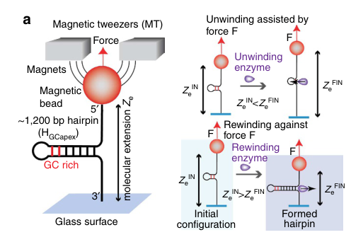

## Question

# Gene Research for Functional Annotation

## ⚠️ CRITICAL: Gene/Protein Identification Context

**BEFORE YOU BEGIN RESEARCH:** You MUST verify you are researching the CORRECT gene/protein. Gene symbols can be ambiguous, especially for less well-characterized genes from non-model organisms.

### Target Gene/Protein Identity (from UniProt):
- **UniProt Accession:** P0DXF1
- **Protein Description:** RecName: Full=ATP-dependent DNA helicase uvsW; EC=5.6.2.4 {ECO:0000305|PubMed:17092935}; AltName: Full=DNA 3'-5' helicase UvsW {ECO:0000305}; AltName: Full=Dar protein;
- **Gene Information:** Name=uvsW {ECO:0000303|PubMed:2388264}; Synonyms=dar;
- **Organism (full):** Enterobacteria phage T4 (Bacteriophage T4).
- **Protein Family:** Not specified in UniProt
- **Key Domains:** Helicase/UvrB_N. (IPR006935); Helicase_ATP-bd. (IPR014001); Helicase_C-like. (IPR001650); Helicase_Restrict-Modif_Enz. (IPR050742); P-loop_NTPase. (IPR027417)

### MANDATORY VERIFICATION STEPS:

1. **Check if the gene symbol "uvsW" matches the protein description above**
2. **Verify the organism is correct:** Enterobacteria phage T4 (Bacteriophage T4).
3. **Check if protein family/domains align with what you find in literature**
4. **If you find literature for a DIFFERENT gene with the same or similar symbol, STOP**

### If Gene Symbol is Ambiguous or You Cannot Find Relevant Literature:

**DO NOT PROCEED WITH RESEARCH ON A DIFFERENT GENE.** Instead:
- State clearly: "The gene symbol 'uvsW' is ambiguous or literature is limited for this specific protein"
- Explain what you found (e.g., "Found extensive literature on a different gene with the same symbol in a different organism")
- Describe the protein based ONLY on the UniProt information provided above
- Suggest that the protein function can be inferred from domain/family information

### Research Target:

Please provide a comprehensive research report on the gene **uvsW** (gene ID: uvsW, UniProt: P0DXF1) in BPT4.

The research report should be a detailed narrative explaining the function, biological processes, and localization of the gene product. Citations should be given for all claims.

You should prioritize authoritative reviews and primary scientific literature when conducting research. You can supplement
this with annotations you find in gene/protein databases, but these can be outdated or inaccurate.

We are specifically interested in the primary function of the gene - for enzymes, what reaction is catalyzed, and what is the substrate specificity? For transporters, what is the substrate? For structural proteins or adapters, what is the broader structural role? For signaling molecules, what is the role in the pathway.

We are interested in where in or outside the cell the gene product carries out its function.

We are also interested in the signaling or biochemical pathways in which the gene functions. We are less interested in broad pleiotropic effects, except where these elucidate the precise role.

Include evidence where possible. We are interested in both experimental evidence as well as inference from structure, evolution, or bioinformatic analysis. Precise studies should be prioritized over high-throughput, where available.

## Output

Question: You are an expert researcher providing comprehensive, well-cited information.

Provide detailed information focusing on:
1. Key concepts and definitions with current understanding
2. Recent developments and latest research (prioritize 2023-2024 sources)
3. Current applications and real-world implementations
4. Expert opinions and analysis from authoritative sources
5. Relevant statistics and data from recent studies

Format as a comprehensive research report with proper citations. Include URLs and publication dates where available.
Always prioritize recent, authoritative sources and provide specific citations for all major claims.

# Gene Research for Functional Annotation

## ⚠️ CRITICAL: Gene/Protein Identification Context

**BEFORE YOU BEGIN RESEARCH:** You MUST verify you are researching the CORRECT gene/protein. Gene symbols can be ambiguous, especially for less well-characterized genes from non-model organisms.

### Target Gene/Protein Identity (from UniProt):
- **UniProt Accession:** P0DXF1
- **Protein Description:** RecName: Full=ATP-dependent DNA helicase uvsW; EC=5.6.2.4 {ECO:0000305|PubMed:17092935}; AltName: Full=DNA 3'-5' helicase UvsW {ECO:0000305}; AltName: Full=Dar protein;
- **Gene Information:** Name=uvsW {ECO:0000303|PubMed:2388264}; Synonyms=dar;
- **Organism (full):** Enterobacteria phage T4 (Bacteriophage T4).
- **Protein Family:** Not specified in UniProt
- **Key Domains:** Helicase/UvrB_N. (IPR006935); Helicase_ATP-bd. (IPR014001); Helicase_C-like. (IPR001650); Helicase_Restrict-Modif_Enz. (IPR050742); P-loop_NTPase. (IPR027417)

### MANDATORY VERIFICATION STEPS:

1. **Check if the gene symbol "uvsW" matches the protein description above**
2. **Verify the organism is correct:** Enterobacteria phage T4 (Bacteriophage T4).
3. **Check if protein family/domains align with what you find in literature**
4. **If you find literature for a DIFFERENT gene with the same or similar symbol, STOP**

### If Gene Symbol is Ambiguous or You Cannot Find Relevant Literature:

**DO NOT PROCEED WITH RESEARCH ON A DIFFERENT GENE.** Instead:
- State clearly: "The gene symbol 'uvsW' is ambiguous or literature is limited for this specific protein"
- Explain what you found (e.g., "Found extensive literature on a different gene with the same symbol in a different organism")
- Describe the protein based ONLY on the UniProt information provided above
- Suggest that the protein function can be inferred from domain/family information

### Research Target:

Please provide a comprehensive research report on the gene **uvsW** (gene ID: uvsW, UniProt: P0DXF1) in BPT4.

The research report should be a detailed narrative explaining the function, biological processes, and localization of the gene product. Citations should be given for all claims.

You should prioritize authoritative reviews and primary scientific literature when conducting research. You can supplement
this with annotations you find in gene/protein databases, but these can be outdated or inaccurate.

We are specifically interested in the primary function of the gene - for enzymes, what reaction is catalyzed, and what is the substrate specificity? For transporters, what is the substrate? For structural proteins or adapters, what is the broader structural role? For signaling molecules, what is the role in the pathway.

We are interested in where in or outside the cell the gene product carries out its function.

We are also interested in the signaling or biochemical pathways in which the gene functions. We are less interested in broad pleiotropic effects, except where these elucidate the precise role.

Include evidence where possible. We are interested in both experimental evidence as well as inference from structure, evolution, or bioinformatic analysis. Precise studies should be prioritized over high-throughput, where available.

## Research Report: Functional Annotation of **uvsW** (UniProt **P0DXF1**) from **Enterobacteria phage T4**

### 0) Target verification (critical identity check)
The queried protein corresponds to bacteriophage T4 gene **uvsW** (synonym **dar**) encoding an ATP-dependent helicase that participates in DNA replication, recombination, and repair. Multiple primary studies explicitly identify T4 **UvsW** as a **superfamily 2 (SF2)** helicase with conserved helicase motifs (including Walker A Lys **K141**) and a two–RecA-like domain architecture, matching the UniProt context provided (P0DXF1; EC 5.6.2.4) and the stated domain composition (RecA-like helicase core/P-loop NTPase). (sickmier2004thecrystalstructure pages 1-2, carleskinch1997bacteriophaget4uvsw pages 1-2, nelson2007thet4phage pages 1-1)

### 1) Key concepts and definitions (current understanding)

#### 1.1 What UvsW is (molecular identity)
UvsW is a T4-encoded **ATP-dependent DNA helicase** in the **SF2** helicase superfamily that functions primarily on **branched nucleic-acid substrates** rather than simple linear duplexes. It contains canonical helicase ATPase motifs (Walker A) and is described as ~55–58 kDa in size depending on constructs/annotation. (sickmier2004thecrystalstructure pages 1-2, nelson2007thet4phage pages 1-1, nelson2007thet4phage pages 4-4)

#### 1.2 Directionality and substrate preference
Biochemical characterization supports that UvsW is a **3′→5′** helicase/translocase with strong substrate-polarity dependence: branched substrates with a **3′ ssDNA overhang** are processed more efficiently than those with a 5′ overhang, consistent with 3′→5′ translocation. (perumal2013interactionoft4 pages 1-2, nelson2007thet4phage pages 6-7)

#### 1.3 Core biological roles: replication initiation switch, fork remodeling, recombination intermediates
UvsW is best understood as a **branch-specific DNA motor** that:
- **Dissociates RNA–DNA hybrids (R-loops)** at T4 replication origins.
- Catalyzes **replication fork regression/fork reversal**, producing Holliday junction-like intermediates.
- Drives **Holliday junction branch migration** over long distances.
- Acts on recombination intermediates such as **D-loops**.
- Additionally displays **ssDNA strand annealing** activity.
These activities fit a single conceptual role: a helicase that remodels branched DNA structures to coordinate the transition between replication-initiation modes and to rescue stalled replication forks. (webb2007thephaget4 pages 1-1, nelson2007thet4phage pages 1-1, long2009forkregressionis pages 3-4, kreuzer2010initiationofbacteriophage pages 5-7, dudas2001uvswproteinregulates pages 1-2)

### 2) Mechanistic and functional annotation (with evidence)

#### 2.1 Enzymatic activity and reaction type
UvsW is an **ATP-dependent helicase** (EC 5.6.2.4 in UniProt context) that couples ATP hydrolysis to nucleic-acid remodeling. In functional assays, mutation of the Walker A lysine (**K141R**) abolishes key ATP-dependent activities (e.g., complementation of recG defects; branch migration; fork regression), indicating catalysis depends on canonical ATPase function. (carleskinch1997bacteriophaget4uvsw pages 1-2, webb2007thephaget4 pages 1-1, garciarodriguez2024similarmechanismsof pages 8-12)

**Substrate specificity (supported substrates):**
- **Origin R-loops** (RNA–DNA hybrids): UvsW dissociates RNA from origin R-loops, serving as a regulatory switch in replication initiation. (dudas2001uvswproteinregulates pages 1-2)
- **Branched DNA junctions** (X- and Y-shaped substrates; replication forks): UvsW acts efficiently on branched substrates and replication intermediates. (webb2007thephaget4 pages 1-1, nelson2007thet4phage pages 7-7)
- **Holliday junctions:** UvsW promotes long-range branch migration. (webb2007thephaget4 pages 1-1)
- **D-loops/recombination intermediates:** UvsW can unwind recombination intermediates, and review synthesis argues it can stabilize D-loops via 3-strand branch migration in recombination-dependent replication. (nelson2007thet4phage pages 7-7, kreuzer2010initiationofbacteriophage pages 7-8)

#### 2.2 Replication-mode switching: origin-dependent → recombination-dependent replication
A consistent genetic and mechanistic model is that early in infection, T4 uses **origin-dependent initiation** (R-loop priming), but later switches to **recombination-dependent replication (RDR)** that initiates from D-loop recombination intermediates. UvsW is described as **late expressed** and, upon synthesis, **unwinds origin R-loops** at key origins (e.g., oriF/oriG), contributing to origin inactivation and the switch to RDR. (kreuzer2010initiationofbacteriophage pages 5-7, dudas2001uvswproteinregulates pages 1-2, kreuzer2010initiationofbacteriophage pages 1-2)

#### 2.3 Fork regression/fork reversal and restart (stalled fork rescue)
UvsW catalyzes **fork regression** (formation of a Holliday-junction-like “chicken foot”), both in vivo and in vitro. Long & Kreuzer (2009) show UvsW is required for accumulation of a diagnostic regressed-fork cleavage fragment in vivo, and purified UvsW catalyzes fork regression/branch migration on fork intermediates isolated from infection. (long2009forkregressionis pages 3-4, kreuzer2010initiationofbacteriophage pages 10-12)

Single-molecule work provides direct mechanistic support that UvsW-driven fork regression and branch migration enable **template switching and lesion bypass**, dramatically increasing completion of replication past a lesion. (manosas2012directobservationof pages 3-4)

#### 2.4 Holliday junction branch migration
UvsW is a robust Holliday junction branch migration motor: it promotes ATP-dependent migration through **>1000 bp**, and ATPase-defective K141R cannot promote migration (though it can stabilize junctions without ATP), tying the activity to ATP hydrolysis. (webb2007thephaget4 pages 1-1)

#### 2.5 Strand annealing activity (dual-function helicase/annealase)
UvsW has a potent **ssDNA annealing** activity, which is **enhanced by ATP hydrolysis but does not require it**; this activity is inhibited by ATPγS and by interaction with other proteins (gp32, UvsW.1). The dual capability (unwinding + annealing) is frequently interpreted as particularly suitable for repair pathways such as lesion bypass and synthesis-dependent strand annealing-like reactions. (nelson2007thet4phage pages 1-1, nelson2007thet4phage pages 1-2)

### 3) Interaction partners and pathway integration

#### 3.1 UvsW.1 (small polypeptide partner)
UvsW forms a complex with a small ~8.8–9 kDa polypeptide **UvsW.1** (also referred to in constructs as UvsW/W.1). FRET and fusion-protein experiments support complex formation, and UvsW.1 modulates UvsW’s annealing activity. (nelson2007thet4phage pages 1-1, nelson2007thet4phage pages 4-4)

#### 3.2 gp32 (T4 ssDNA-binding protein)
UvsW function is modulated by T4 ssDNA-binding protein **gp32**. gp32 can inhibit annealing and translocation on gp32-coated ssDNA, but gp32 can also enhance UvsW-catalyzed unwinding of recombination intermediates in a manner dependent on gp32’s acidic C-terminal protein-interaction domain. This supports a model in which UvsW–gp32 interactions tune access to ssDNA and promote coordinated recombination/repair. (perumal2013interactionoft4 pages 1-2)

#### 3.3 Recombination proteins (UvsX/UvsY) and nucleases (EndoVII)
UvsW is integrated with the **UvsWXY** recombination/repair module. Review synthesis places UvsW among proteins required for DSB-directed replication (RDR) and suggests a direct role in stabilizing strand invasion intermediates (D-loops) via branch migration. Fork regression products may be processed by nucleases such as **Endonuclease VII** (gene 49), with genetic evidence linking EndoVII cleavage to regressed intermediates. (kreuzer2010initiationofbacteriophage pages 7-8, long2009forkregressionis pages 3-4)

### 4) Localization: where the gene product acts
Direct microscopy-based subcellular localization was not identified in the retrieved excerpts. However, the functional evidence consistently places UvsW activity **on T4 DNA replication, recombination, and repair intermediates during infection**, including origin R-loops and replication forks. Given T4 DNA replication occurs in infected *E. coli* and UvsW acts on these intermediates “in vivo” during infection, its operational localization is best described as **intracellular (host cytoplasm/nucleoid region) at phage replication/recombination DNA structures**. (kreuzer2010initiationofbacteriophage pages 10-12, kreuzer2010initiationofbacteriophage pages 1-2)

### 5) Recent developments and latest research (prioritizing 2023–2024)

#### 5.1 2024: UvsW as an experimental tool for mapping pathological R-loops in bacteria
Pandiyan et al. (2024, *Nucleic Acids Research*, published Apr 2024) used phage T4 UvsW as an **R-loop helicase tool** in *E. coli*. They report that some cryptic antisense RNAs that form R-loops are detectable only in the combined condition of **Rho deficiency plus UvsW expression**, because such transcripts “require unwinding by UvsW helicase for them to be synthesized in quantity and to be identified.” This is a modern real-world implementation: heterologous UvsW expression enables functional discrimination of R-loop-forming loci and supports mechanistic studies of R-loop–dependent transcription/replication conflicts in bacteria. https://doi.org/10.1093/nar/gkae839 (pandiyan2024pathologicalrloopsin pages 1-2)

#### 5.2 2024: UvsW as a trigger in retron-mediated anti-phage defense
García-Rodríguez et al. (2024, bioRxiv preprint posted Feb 2024) report that a tripartite retron defense system (Retron-Eco11) detects and is triggered by phage helicases including **T4 UvsW** (and T5 D10). The study provides evidence that UvsW’s **catalytic activity** is important for triggering toxicity: the ATPase-defective **UvsW K141R** mutant does not trigger retron-dependent toxicity, supporting a model where the defense senses helicase activity rather than simple binding. https://doi.org/10.1101/2024.02.09.579579 (garciarodriguez2024similarmechanismsof pages 8-12, garciarodriguez2025structurallyrelatedphage pages 8-10, garciarodriguez2024similarmechanismsof pages 1-5)

Although outside the requested 2023–2024 window, a peer-reviewed follow-up (Nov 2025, *Nucleic Acids Research*) further substantiates helicase-triggered retron defense, reporting downstream metabolic effects including ~50% PRPP depletion upon activation, underscoring the biological importance of UvsW-like helicase activities as “molecular signatures” sensed by bacterial immunity. https://doi.org/10.1093/nar/gkaf1396 (garciarodriguez2025structurallyrelatedphage pages 10-13)

### 6) Current applications and real-world implementations

1) **Model helicase in mechanistic enzymology**: UvsW is used in standardized assays of helicase translocation/unwinding (expression/purification and assay workflows described in a Methods paper), supporting broad adoption as a tractable model for helicase mechanisms and mutational studies. https://doi.org/10.1016/j.ymeth.2010.02.011 (perumal2010analysisofthe pages 1-2)

2) **Single-molecule force spectroscopy model**: UvsW is used as a model rewinding/fork-regression motor in magnetic/optical tweezer assays, enabling direct measurement of force dependence, direction switching, and coupling of rewinding to fork rescue. https://doi.org/10.1038/ncomms3368 (manosas2013recganduvsw pages 1-2, manosas2013recganduvsw media 08589400)

3) **Bacterial R-loop biology tool (2024)**: heterologous UvsW expression is used to reveal R-loop–blocked transcription and classify antisense loci, a direct laboratory implementation that leverages UvsW substrate specificity. https://doi.org/10.1093/nar/gkae839 (pandiyan2024pathologicalrloopsin pages 1-2)

4) **Phage–host conflict biology (2024)**: UvsW functions as a trigger for retron anti-phage systems, providing a new context for why phage helicase activities are evolutionarily “visible” to bacterial immunity. https://doi.org/10.1101/2024.02.09.579579 (garciarodriguez2024similarmechanismsof pages 8-12)

### 7) Expert opinions and synthesis from authoritative sources

- A dedicated review on T4 replication initiation and fork dynamics describes UvsW as a **late-expressed helicase** with **branched nucleic-acid specificity** that unwinds origin R-loops and is genetically/biochemically required for RDR and fork processing, emphasizing that earlier interpretations about origins/R-loops can be misleading without considering UvsW timing and activity. https://doi.org/10.1186/1743-422x-7-358 (kreuzer2010initiationofbacteriophage pages 5-7)

- Primary biochemical characterization explicitly anticipates broader utility: authors state they “expect [UvsW] will become an excellent model system” for studying these replication/recombination/repair processes, reflecting expert judgement that the combination of unwinding + annealing and branched-substrate specificity makes UvsW unusually informative as a mechanistic model. https://doi.org/10.1074/jbc.m608153200 (nelson2007thet4phage pages 6-7)

### 8) Key quantitative statistics (selected)

- **Single-molecule rates and mechanics (Science 2012):** at ~15 pN, UvsW annealing rate ~**1300 bp/s** with processivity ~**9 kbp**; HJ migration rate ~**1000–1300 bp/s**; direction switching characteristic time ~**2 s**; UvsW increases complete replication past a lesion by **>30-fold**, where a lesion otherwise arrested **98%** of molecules. https://doi.org/10.1126/science.1225437 (manosas2012directobservationof pages 3-4)

- **Force tolerance and motor energetics (Nat Commun 2013):** UvsW-driven rewinding proceeds against opposing forces of **~30–35 pN**, with only moderate rate reduction; modeled step size **1–2 bp**, stabilization energy ~**5–5.5 kBT**, and estimated motor efficiency **~40–75%**. https://doi.org/10.1038/ncomms3368 (manosas2013recganduvsw pages 4-5, manosas2013recganduvsw pages 1-2, manosas2013recganduvsw media 08589400)

- **Fork regression efficiency (EMBO Rep 2009):** in vitro fork regression product formation rises to **~94%** at **250 nM UvsW** (30 min at 37°C); uvsW mutants in vivo are nearly deficient for accumulation of a diagnostic **1.48 kb** regressed-fork cleavage product. https://doi.org/10.1038/embor.2009.13 (long2009forkregressionis pages 3-4)

- **Binding kinetics (Nat Commun 2013):** reported association rate on forks **~5 × 10^6 M⁻1 s⁻1** and residence times on the order of **~15–20 s** (depending on fork substrate/conditions). https://doi.org/10.1038/ncomms3368 (manosas2013recganduvsw pages 6-7)

### 9) Consolidated functional summary (for annotation)

**Primary function:** UvsW is an ATP-dependent, SF2, 3′→5′ **branch-specific helicase/rewinding motor** that remodels R-loops, replication forks, Holliday junctions, and recombination intermediates. Its most supported physiological roles in T4 are (i) **turning off origin R-loop initiation** late in infection to favor recombination-dependent initiation, and (ii) **processing stalled/blocked replication forks** via fork regression and branch migration to enable repair, template switching, and restart. (kreuzer2010initiationofbacteriophage pages 5-7, dudas2001uvswproteinregulates pages 1-2, long2009forkregressionis pages 3-4, webb2007thephaget4 pages 1-1)

**Where it acts:** intracellularly during infection on phage DNA replication/recombination structures (origin R-loops and fork/HJ intermediates). (kreuzer2010initiationofbacteriophage pages 10-12, kreuzer2010initiationofbacteriophage pages 1-2)

**Recent (2024) relevance:** beyond canonical T4 replication biology, UvsW is now used as (a) a bacterial R-loop tool and (b) a key trigger of retron anti-phage immunity, highlighting its broader importance in modern bacterial genome stability and phage-defense research. (pandiyan2024pathologicalrloopsin pages 1-2, garciarodriguez2024similarmechanismsof pages 8-12)

---

### Evidence map table
| Functional role/process | Molecular activity (substrate specificity/polarity) | Key interaction partners/modulators | Key quantitative/statistical findings | Evidence type (genetic/biochemical/structural/single-molecule) | Key citations (with year, journal, DOI URL) |
|---|---|---|---|---|---|
| Verified protein identity / core annotation | Bacteriophage T4 UvsW (Dar) is a ~55 kDa SF2 ATP-dependent helicase with canonical Walker A Lys141 and two RecA-like domains; branched-DNA specificity and 3′→5′ polarity are consistent with UniProt P0DXF1 | ATP; catalytic Lys141; structural similarity/function overlap with RecG and some biochemical similarity to RecQ | Walker A mutant K141R abolishes ATPase-dependent helicase functions; protein described as ~55 kDa | Structural, biochemical, genetic | Sickmier et al., 2004, *Structure*, https://doi.org/10.1016/j.str.2004.02.016; Carles-Kinch et al., 1997, *EMBO J.*, https://doi.org/10.1093/emboj/16.13.4142; Nelson & Benkovic, 2007, *J. Biol. Chem.*, https://doi.org/10.1074/jbc.m608153200 (sickmier2004thecrystalstructure pages 1-2, carleskinch1997bacteriophaget4uvsw pages 1-2, nelson2007thet4phage pages 1-1) |
| Regulation of T4 replication-mode switch | Unwinds RNA–DNA hybrids/R-loops at T4 origins, promoting the switch from origin-dependent to recombination-dependent (origin-independent) replication | Origin R-loops; ATP hydrolysis; late expression timing; RecG-like activity | Purified UvsW efficiently dissociates RNA from synthetic origin R-loops; UvsW expression increases recovery of *E. coli* rnhA::cat recG double mutants (example table entries 0.5 without UvsW vs 175 with UvsW in the cited excerpt) | Genetic and biochemical | Dudas & Kreuzer, 2001, *Mol. Cell. Biol.*, https://doi.org/10.1128/MCB.21.8.2706-2715.2001; Carles-Kinch et al., 1997, *EMBO J.*, https://doi.org/10.1093/emboj/16.13.4142 (dudas2001uvswproteinregulates pages 1-2, carleskinch1997bacteriophaget4uvsw pages 1-2) |
| Branched-DNA helicase in recombination/repair | Unwinds a wide range of branched substrates, including stalled-fork mimics, D-loops, X- and Y-structures; 3′→5′ helicase/translocase | ATP; ATPγS inhibits annealing; gp32 can inhibit annealing and modulate helicase action; UvsW.1 forms a complex with UvsW | Strong polarity preference: 3′ overhang substrates are efficiently unwound/annealed relative to 5′ overhangs; example in vitro conditions in excerpt include 5 mM ATP, 2 nM DNA substrate, 200 nM protein at 37°C | Biochemical | Nelson & Benkovic, 2007, *J. Biol. Chem.*, https://doi.org/10.1074/jbc.m608153200; Perumal et al., 2013, *J. Mol. Biol.*, https://doi.org/10.1016/j.jmb.2013.05.012 (nelson2007thet4phage pages 7-7, perumal2013interactionoft4 pages 1-2, nelson2007thet4phage pages 6-7) |
| Holliday junction branch migration | Drives ATP-dependent branch migration of Holliday junctions and acts on X-shaped replication intermediates | ATP required; K141R mutant binds/stabilizes HJs without productive ATP-driven migration; functionally linked with UvsX/UvsY pathways | Promotes branch migration efficiently through **>1000 bp** of DNA; ATPase-dead K141R fails to promote migration | Biochemical, 2D-gel, genetic | Webb et al., 2007, *J. Biol. Chem.*, https://doi.org/10.1074/jbc.m705913200 (webb2007thephaget4 pages 1-1) |
| Active replication-fork regression / fork reversal | Catalyzes regression of origin-fork intermediates, converting forks into regressed Holliday-junction-like products by coupled unwinding/rewinding | ATP; Endonuclease VII (gene 49) implicated downstream in cleavage of regressed forks; K141R used as inactive control | In vivo, 46/uvsW infections are almost completely deficient for the **1.48-kb DSE fragment**; in vitro, increasing UvsW up to **250 nM** converts fork intermediates to **6.2- and 5.2-kb** products; example product fractions in excerpt rise to **94%** at highest enzyme condition | Genetic, biochemical, 2D-gel | Long & Kreuzer, 2009, *EMBO Rep.*, https://doi.org/10.1038/embor.2009.13 (long2009forkregressionis pages 3-4) |
| Stalled-fork restart and template switching | Couples fork regression with branch migration and fork restoration to enable lesion bypass and restart of T4 replication forks | T4 replisome/holoenzyme; ATP; reversible branch migration | Single-molecule assays measured annealing rates of about **1300 bp/s** at **15 pN**, processivity of about **9 kbp**, HJ migration rates about **1000–1300 bp/s**, characteristic direction-switching time about **2 s**; UvsW increased full replication past a leading-strand lesion by **>30-fold** and allowed bypass of a roadblock that otherwise arrested **98%** of molecules | Single-molecule | Manosas et al., 2012, *Science*, https://doi.org/10.1126/science.1225437 (manosas2012directobservationof pages 3-4) |
| Robust DNA rewinding motor for fork rescue | Active rewinding enzyme that couples duplex rewinding to unwinding/protein displacement during fork regression; functional analog of RecG | ATP; fork junction ssDNA tails; parental duplex interaction over ~10 bp; divalent ions modulate branch-migration direction switching | Works against opposing loads up to **35 pN**; modeled step size **~1–2 bp**; fork-stabilization energy **~5–5.5 kBT**; maximum work per bp **~7.5 kBT**; estimated motor efficiency **~40–75%**; fork-binding on-rates **~5 × 10^6 M^-1 s^-1**; residence times roughly **15–20 s** in cited conditions | Single-molecule and modeling | Manosas et al., 2013, *Nat. Commun.*, https://doi.org/10.1038/ncomms3368 (manosas2013recganduvsw pages 4-5, manosas2013recganduvsw pages 5-6, manosas2013recganduvsw pages 6-7, manosas2013recganduvsw pages 1-2, manosas2013recganduvsw pages 10-10) |
| Strand annealing activity | Potent ssDNA annealing activity in addition to helicase function; annealing is enhanced by ATP hydrolysis but does not strictly require hydrolysis | gp32 inhibits annealing; ATPγS inhibits annealing; UvsW.1 inhibits/modulates annealing and forms complex with UvsW | Fusion with UvsW.1 yields a **68-kDa** protein with properties similar to the UvsW–UvsW.1 complex | Biochemical, FRET | Nelson & Benkovic, 2007, *J. Biol. Chem.*, https://doi.org/10.1074/jbc.m608153200 (nelson2007thet4phage pages 1-1, nelson2007thet4phage pages 6-7) |
| Functional interaction with T4 gp32 SSB | UvsW-catalyzed unwinding of recombination intermediates is enhanced by gp32, but gp32-coated ssDNA can suppress UvsW annealing/translocation unless the gp32 acidic tail mediates productive interaction | gp32 acidic C-terminal protein-interaction domain; ssDNA; ATP | Excerpt reports functional fluorescence assays using **500 nM** UvsW and gp32 variants; no direct affinity constant given in snippets | Biochemical | Perumal et al., 2013, *J. Mol. Biol.*, https://doi.org/10.1016/j.jmb.2013.05.012 (perumal2013interactionoft4 pages 1-2) |
| Heterologous tool for bacterial R-loop biology | In *E. coli*, heterologous UvsW acts as an R-loop helicase and can reveal or relieve transcriptional blocks caused by pathological antisense R-loops | Rho deficiency context; bacterial antisense RNAs that form R-loops | 2024 study used UvsW expression to distinguish antisense loci detectable only under combined **Rho deficiency + UvsW**; these transcripts required UvsW unwinding to be synthesized in quantity and identified | Functional genomics / bacterial application | Pandiyan et al., 2024, *Nucleic Acids Res.*, https://doi.org/10.1093/nar/gkae839 (pandiyan2024pathologicalrloopsin pages 1-2, pandiyan2024pathologicalrloopsin pages 4-6) |
| Target/trigger in anti-phage defense | Phage-encoded UvsW is sensed by Retron-Eco11 as a defense trigger; retron activation depends on helicase catalytic activity rather than mere DNA binding | Retron-Eco11 msDNA, RT, PRTase-like effector; ATPase/helicase catalytic motifs; D10 is a functional analog trigger in T5 | Escape mapping placed **all five** T4 escape mutants in uvsW and **all five** T5 escape mutants in d10 in the cited excerpt; UvsW K141R fails to trigger toxicity; Retron-Eco11 activation linked to about **50% PRPP depletion** in later peer-reviewed follow-up | 2024 preprint genetics/heterologous expression; later peer-reviewed confirmation | García-Rodríguez et al., 2024, *bioRxiv*, https://doi.org/10.1101/2024.02.09.579579; García-Rodríguez et al., 2025, *Nucleic Acids Res.*, https://doi.org/10.1093/nar/gkaf1396 (garciarodriguez2024similarmechanismsof pages 8-12, garciarodriguez2025structurallyrelatedphage pages 8-10, garciarodriguez2024similarmechanismsof pages 1-5, garciarodriguez2025structurallyrelatedphage pages 10-13) |

*Table: This table summarizes the experimentally supported functional annotation of bacteriophage T4 UvsW/Dar, including its molecular activities, pathway roles, modulators, quantitative properties, and newer 2024 biological contexts. It is useful as a compact evidence map linking classical T4 replication/recombination studies with recent R-loop and anti-phage defense findings.*

### Visual evidence (figure crops)
A schematic and quantitative force-dependence plots for UvsW rewinding in single-molecule assays were retrieved from Manosas et al. (2013). (manosas2013recganduvsw media 08589400, manosas2013recganduvsw media 4c764a72)

References

1. (sickmier2004thecrystalstructure pages 1-2): E.Allen Sickmier, Kenneth N Kreuzer, and Stephen W White. The crystal structure of the uvsw helicase from bacteriophage t4. Structure, 12:583-592, Apr 2004. URL: https://doi.org/10.1016/j.str.2004.02.016, doi:10.1016/j.str.2004.02.016. This article has 33 citations and is from a domain leading peer-reviewed journal.

2. (carleskinch1997bacteriophaget4uvsw pages 1-2): Kelly Carles-Kinch, James W. George, and Kenneth N. Kreuzer. Bacteriophage t4 uvsw protein is a helicase involved in recombination, repair and the regulation of dna replication origins. The EMBO Journal, 16:4142-4151, Jul 1997. URL: https://doi.org/10.1093/emboj/16.13.4142, doi:10.1093/emboj/16.13.4142. This article has 104 citations.

3. (nelson2007thet4phage pages 1-1): Scott W. Nelson and Stephen J. Benkovic. The t4 phage uvsw protein contains both dna unwinding and strand annealing activities*. Journal of Biological Chemistry, 282:407-416, Jan 2007. URL: https://doi.org/10.1074/jbc.m608153200, doi:10.1074/jbc.m608153200. This article has 38 citations and is from a domain leading peer-reviewed journal.

4. (nelson2007thet4phage pages 4-4): Scott W. Nelson and Stephen J. Benkovic. The t4 phage uvsw protein contains both dna unwinding and strand annealing activities*. Journal of Biological Chemistry, 282:407-416, Jan 2007. URL: https://doi.org/10.1074/jbc.m608153200, doi:10.1074/jbc.m608153200. This article has 38 citations and is from a domain leading peer-reviewed journal.

5. (perumal2013interactionoft4 pages 1-2): Senthil K. Perumal, Scott W. Nelson, and Stephen J. Benkovic. Interaction of t4 uvsw helicase and single-stranded dna binding protein gp32 through its carboxy-terminal acidic tail. Journal of molecular biology, 425 16:2823-39, Aug 2013. URL: https://doi.org/10.1016/j.jmb.2013.05.012, doi:10.1016/j.jmb.2013.05.012. This article has 17 citations and is from a domain leading peer-reviewed journal.

6. (nelson2007thet4phage pages 6-7): Scott W. Nelson and Stephen J. Benkovic. The t4 phage uvsw protein contains both dna unwinding and strand annealing activities*. Journal of Biological Chemistry, 282:407-416, Jan 2007. URL: https://doi.org/10.1074/jbc.m608153200, doi:10.1074/jbc.m608153200. This article has 38 citations and is from a domain leading peer-reviewed journal.

7. (webb2007thephaget4 pages 1-1): Michael R. Webb, Jody L. Plank, David T. Long, Tao-shih Hsieh, and Kenneth N. Kreuzer. The phage t4 protein uvsw drives holliday junction branch migration*. Journal of Biological Chemistry, 282:34401-34411, Nov 2007. URL: https://doi.org/10.1074/jbc.m705913200, doi:10.1074/jbc.m705913200. This article has 32 citations and is from a domain leading peer-reviewed journal.

8. (long2009forkregressionis pages 3-4): David T Long and Kenneth N Kreuzer. Fork regression is an active helicase‐driven pathway in bacteriophage t4. EMBO reports, Apr 2009. URL: https://doi.org/10.1038/embor.2009.13, doi:10.1038/embor.2009.13. This article has 29 citations and is from a highest quality peer-reviewed journal.

9. (kreuzer2010initiationofbacteriophage pages 5-7): Kenneth N Kreuzer and J Rodney Brister. Initiation of bacteriophage t4 dna replication and replication fork dynamics: a review in the virology journal series on bacteriophage t4 and its relatives. Virology Journal, 7:358-358, Dec 2010. URL: https://doi.org/10.1186/1743-422x-7-358, doi:10.1186/1743-422x-7-358. This article has 129 citations and is from a peer-reviewed journal.

10. (dudas2001uvswproteinregulates pages 1-2): Kathleen C. Dudas and Kenneth N. Kreuzer. Uvsw protein regulates bacteriophage t4 origin-dependent replication by unwinding r-loops. Molecular and Cellular Biology, 21:2706-2715, Apr 2001. URL: https://doi.org/10.1128/mcb.21.8.2706-2715.2001, doi:10.1128/mcb.21.8.2706-2715.2001. This article has 59 citations and is from a domain leading peer-reviewed journal.

11. (garciarodriguez2024similarmechanismsof pages 8-12): Fernando Manuel García-Rodríguez, Francisco Martínez-Abarca, Max E. Wilkinson, and Nicolás Toro. Similar mechanisms of retron-mediated anti-phage defense for different families of tailed phages. bioRxiv, Feb 2024. URL: https://doi.org/10.1101/2024.02.09.579579, doi:10.1101/2024.02.09.579579. This article has 5 citations.

12. (nelson2007thet4phage pages 7-7): Scott W. Nelson and Stephen J. Benkovic. The t4 phage uvsw protein contains both dna unwinding and strand annealing activities*. Journal of Biological Chemistry, 282:407-416, Jan 2007. URL: https://doi.org/10.1074/jbc.m608153200, doi:10.1074/jbc.m608153200. This article has 38 citations and is from a domain leading peer-reviewed journal.

13. (kreuzer2010initiationofbacteriophage pages 7-8): Kenneth N Kreuzer and J Rodney Brister. Initiation of bacteriophage t4 dna replication and replication fork dynamics: a review in the virology journal series on bacteriophage t4 and its relatives. Virology Journal, 7:358-358, Dec 2010. URL: https://doi.org/10.1186/1743-422x-7-358, doi:10.1186/1743-422x-7-358. This article has 129 citations and is from a peer-reviewed journal.

14. (kreuzer2010initiationofbacteriophage pages 1-2): Kenneth N Kreuzer and J Rodney Brister. Initiation of bacteriophage t4 dna replication and replication fork dynamics: a review in the virology journal series on bacteriophage t4 and its relatives. Virology Journal, 7:358-358, Dec 2010. URL: https://doi.org/10.1186/1743-422x-7-358, doi:10.1186/1743-422x-7-358. This article has 129 citations and is from a peer-reviewed journal.

15. (kreuzer2010initiationofbacteriophage pages 10-12): Kenneth N Kreuzer and J Rodney Brister. Initiation of bacteriophage t4 dna replication and replication fork dynamics: a review in the virology journal series on bacteriophage t4 and its relatives. Virology Journal, 7:358-358, Dec 2010. URL: https://doi.org/10.1186/1743-422x-7-358, doi:10.1186/1743-422x-7-358. This article has 129 citations and is from a peer-reviewed journal.

16. (manosas2012directobservationof pages 3-4): Maria Manosas, Senthil K. Perumal, Vincent Croquette, and Stephen J. Benkovic. Direct observation of stalled fork restart via fork regression in the t4 replication system. Science, 338:1217-1220, Nov 2012. URL: https://doi.org/10.1126/science.1225437, doi:10.1126/science.1225437. This article has 104 citations and is from a highest quality peer-reviewed journal.

17. (nelson2007thet4phage pages 1-2): Scott W. Nelson and Stephen J. Benkovic. The t4 phage uvsw protein contains both dna unwinding and strand annealing activities*. Journal of Biological Chemistry, 282:407-416, Jan 2007. URL: https://doi.org/10.1074/jbc.m608153200, doi:10.1074/jbc.m608153200. This article has 38 citations and is from a domain leading peer-reviewed journal.

18. (pandiyan2024pathologicalrloopsin pages 1-2): Apuratha Pandiyan, Jillella Mallikarjun, Himanshi Maheshwari, and Jayaraman Gowrishankar. Pathological r-loops in bacteria from engineered expression of endogenous antisense rnas whose synthesis is ordinarily terminated by rho. Nucleic Acids Research, 52:12438-12455, Apr 2024. URL: https://doi.org/10.1093/nar/gkae839, doi:10.1093/nar/gkae839. This article has 4 citations and is from a highest quality peer-reviewed journal.

19. (garciarodriguez2025structurallyrelatedphage pages 8-10): Fernando M García-Rodríguez, Francisco Martínez-Abarca, Alejandro González-Delgado, David J Wen, Seth L Shipman, Max E Wilkinson, and Nicolás Toro. Structurally related phage helicases trigger type iii-a3 retron-mediated anti-phage defense across diverse tailed phage families. Nucleic Acids Research, Nov 2025. URL: https://doi.org/10.1093/nar/gkaf1396, doi:10.1093/nar/gkaf1396. This article has 2 citations and is from a highest quality peer-reviewed journal.

20. (garciarodriguez2024similarmechanismsof pages 1-5): Fernando Manuel García-Rodríguez, Francisco Martínez-Abarca, Max E. Wilkinson, and Nicolás Toro. Similar mechanisms of retron-mediated anti-phage defense for different families of tailed phages. bioRxiv, Feb 2024. URL: https://doi.org/10.1101/2024.02.09.579579, doi:10.1101/2024.02.09.579579. This article has 5 citations.

21. (garciarodriguez2025structurallyrelatedphage pages 10-13): Fernando M García-Rodríguez, Francisco Martínez-Abarca, Alejandro González-Delgado, David J Wen, Seth L Shipman, Max E Wilkinson, and Nicolás Toro. Structurally related phage helicases trigger type iii-a3 retron-mediated anti-phage defense across diverse tailed phage families. Nucleic Acids Research, Nov 2025. URL: https://doi.org/10.1093/nar/gkaf1396, doi:10.1093/nar/gkaf1396. This article has 2 citations and is from a highest quality peer-reviewed journal.

22. (perumal2010analysisofthe pages 1-2): Senthil K. Perumal, Kevin D. Raney, and Stephen J. Benkovic. Analysis of the dna translocation and unwinding activities of t4 phage helicases. Methods, 51 3:277-88, Jul 2010. URL: https://doi.org/10.1016/j.ymeth.2010.02.011, doi:10.1016/j.ymeth.2010.02.011. This article has 18 citations and is from a peer-reviewed journal.

23. (manosas2013recganduvsw pages 1-2): Maria Manosas, Senthil K. Perumal, Piero R. Bianco, Felix Ritort, Stephen J. Benkovic, and Vincent Croquette. Recg and uvsw catalyse robust dna rewinding critical for stalled dna replication fork rescue. Nature Communications, Sep 2013. URL: https://doi.org/10.1038/ncomms3368, doi:10.1038/ncomms3368. This article has 97 citations and is from a highest quality peer-reviewed journal.

24. (manosas2013recganduvsw media 08589400): Maria Manosas, Senthil K. Perumal, Piero R. Bianco, Felix Ritort, Stephen J. Benkovic, and Vincent Croquette. Recg and uvsw catalyse robust dna rewinding critical for stalled dna replication fork rescue. Nature Communications, Sep 2013. URL: https://doi.org/10.1038/ncomms3368, doi:10.1038/ncomms3368. This article has 97 citations and is from a highest quality peer-reviewed journal.

25. (manosas2013recganduvsw pages 4-5): Maria Manosas, Senthil K. Perumal, Piero R. Bianco, Felix Ritort, Stephen J. Benkovic, and Vincent Croquette. Recg and uvsw catalyse robust dna rewinding critical for stalled dna replication fork rescue. Nature Communications, Sep 2013. URL: https://doi.org/10.1038/ncomms3368, doi:10.1038/ncomms3368. This article has 97 citations and is from a highest quality peer-reviewed journal.

26. (manosas2013recganduvsw pages 6-7): Maria Manosas, Senthil K. Perumal, Piero R. Bianco, Felix Ritort, Stephen J. Benkovic, and Vincent Croquette. Recg and uvsw catalyse robust dna rewinding critical for stalled dna replication fork rescue. Nature Communications, Sep 2013. URL: https://doi.org/10.1038/ncomms3368, doi:10.1038/ncomms3368. This article has 97 citations and is from a highest quality peer-reviewed journal.

27. (manosas2013recganduvsw pages 5-6): Maria Manosas, Senthil K. Perumal, Piero R. Bianco, Felix Ritort, Stephen J. Benkovic, and Vincent Croquette. Recg and uvsw catalyse robust dna rewinding critical for stalled dna replication fork rescue. Nature Communications, Sep 2013. URL: https://doi.org/10.1038/ncomms3368, doi:10.1038/ncomms3368. This article has 97 citations and is from a highest quality peer-reviewed journal.

28. (manosas2013recganduvsw pages 10-10): Maria Manosas, Senthil K. Perumal, Piero R. Bianco, Felix Ritort, Stephen J. Benkovic, and Vincent Croquette. Recg and uvsw catalyse robust dna rewinding critical for stalled dna replication fork rescue. Nature Communications, Sep 2013. URL: https://doi.org/10.1038/ncomms3368, doi:10.1038/ncomms3368. This article has 97 citations and is from a highest quality peer-reviewed journal.

29. (pandiyan2024pathologicalrloopsin pages 4-6): Apuratha Pandiyan, Jillella Mallikarjun, Himanshi Maheshwari, and Jayaraman Gowrishankar. Pathological r-loops in bacteria from engineered expression of endogenous antisense rnas whose synthesis is ordinarily terminated by rho. Nucleic Acids Research, 52:12438-12455, Apr 2024. URL: https://doi.org/10.1093/nar/gkae839, doi:10.1093/nar/gkae839. This article has 4 citations and is from a highest quality peer-reviewed journal.

30. (manosas2013recganduvsw media 4c764a72): Maria Manosas, Senthil K. Perumal, Piero R. Bianco, Felix Ritort, Stephen J. Benkovic, and Vincent Croquette. Recg and uvsw catalyse robust dna rewinding critical for stalled dna replication fork rescue. Nature Communications, Sep 2013. URL: https://doi.org/10.1038/ncomms3368, doi:10.1038/ncomms3368. This article has 97 citations and is from a highest quality peer-reviewed journal.

## Artifacts

- [Edison artifact artifact-00](uvsW-deep-research-falcon_artifacts/artifact-00.md)

## Citations

1. dudas2001uvswproteinregulates pages 1-2
2. manosas2012directobservationof pages 3-4
3. pandiyan2024pathologicalrloopsin pages 1-2
4. garciarodriguez2025structurallyrelatedphage pages 10-13
5. perumal2010analysisofthe pages 1-2
6. garciarodriguez2024similarmechanismsof pages 8-12
7. kreuzer2010initiationofbacteriophage pages 5-7
8. long2009forkregressionis pages 3-4
9. manosas2013recganduvsw pages 6-7
10. sickmier2004thecrystalstructure pages 1-2
11. kreuzer2010initiationofbacteriophage pages 7-8
12. kreuzer2010initiationofbacteriophage pages 1-2
13. kreuzer2010initiationofbacteriophage pages 10-12
14. garciarodriguez2025structurallyrelatedphage pages 8-10
15. garciarodriguez2024similarmechanismsof pages 1-5
16. manosas2013recganduvsw pages 1-2
17. manosas2013recganduvsw pages 4-5
18. manosas2013recganduvsw pages 5-6
19. manosas2013recganduvsw pages 10-10
20. pandiyan2024pathologicalrloopsin pages 4-6
21. UvsW
22. https://doi.org/10.1093/nar/gkae839
23. https://doi.org/10.1101/2024.02.09.579579
24. https://doi.org/10.1093/nar/gkaf1396
25. https://doi.org/10.1016/j.ymeth.2010.02.011
26. https://doi.org/10.1038/ncomms3368
27. https://doi.org/10.1186/1743-422x-7-358
28. https://doi.org/10.1074/jbc.m608153200
29. https://doi.org/10.1126/science.1225437
30. https://doi.org/10.1038/embor.2009.13
31. https://doi.org/10.1016/j.str.2004.02.016;
32. https://doi.org/10.1093/emboj/16.13.4142;
33. https://doi.org/10.1128/MCB.21.8.2706-2715.2001;
34. https://doi.org/10.1093/emboj/16.13.4142
35. https://doi.org/10.1074/jbc.m608153200;
36. https://doi.org/10.1016/j.jmb.2013.05.012
37. https://doi.org/10.1074/jbc.m705913200
38. https://doi.org/10.1101/2024.02.09.579579;
39. https://doi.org/10.1016/j.str.2004.02.016,
40. https://doi.org/10.1093/emboj/16.13.4142,
41. https://doi.org/10.1074/jbc.m608153200,
42. https://doi.org/10.1016/j.jmb.2013.05.012,
43. https://doi.org/10.1074/jbc.m705913200,
44. https://doi.org/10.1038/embor.2009.13,
45. https://doi.org/10.1186/1743-422x-7-358,
46. https://doi.org/10.1128/mcb.21.8.2706-2715.2001,
47. https://doi.org/10.1101/2024.02.09.579579,
48. https://doi.org/10.1126/science.1225437,
49. https://doi.org/10.1093/nar/gkae839,
50. https://doi.org/10.1093/nar/gkaf1396,
51. https://doi.org/10.1016/j.ymeth.2010.02.011,
52. https://doi.org/10.1038/ncomms3368,