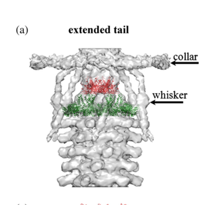

## Question

# Gene Research for Functional Annotation

## ⚠️ CRITICAL: Gene/Protein Identification Context

**BEFORE YOU BEGIN RESEARCH:** You MUST verify you are researching the CORRECT gene/protein. Gene symbols can be ambiguous, especially for less well-characterized genes from non-model organisms.

### Target Gene/Protein Identity (from UniProt):
- **UniProt Accession:** P10104
- **Protein Description:** RecName: Full=Fibritin {ECO:0000303|PubMed:7932704}; AltName: Full=Collar protein; AltName: Full=Whisker antigen control protein {ECO:0000303|PubMed:3194206};
- **Gene Information:** Name=wac {ECO:0000303|PubMed:3194206};
- **Organism (full):** Enterobacteria phage T4 (Bacteriophage T4).
- **Protein Family:** Not specified in UniProt
- **Key Domains:** Fibritin_C. (IPR012473); Fibritin_C (PF07921)

### MANDATORY VERIFICATION STEPS:

1. **Check if the gene symbol "wac" matches the protein description above**
2. **Verify the organism is correct:** Enterobacteria phage T4 (Bacteriophage T4).
3. **Check if protein family/domains align with what you find in literature**
4. **If you find literature for a DIFFERENT gene with the same or similar symbol, STOP**

### If Gene Symbol is Ambiguous or You Cannot Find Relevant Literature:

**DO NOT PROCEED WITH RESEARCH ON A DIFFERENT GENE.** Instead:
- State clearly: "The gene symbol 'wac' is ambiguous or literature is limited for this specific protein"
- Explain what you found (e.g., "Found extensive literature on a different gene with the same symbol in a different organism")
- Describe the protein based ONLY on the UniProt information provided above
- Suggest that the protein function can be inferred from domain/family information

### Research Target:

Please provide a comprehensive research report on the gene **wac** (gene ID: wac, UniProt: P10104) in BPT4.

The research report should be a detailed narrative explaining the function, biological processes, and localization of the gene product. Citations should be given for all claims.

You should prioritize authoritative reviews and primary scientific literature when conducting research. You can supplement
this with annotations you find in gene/protein databases, but these can be outdated or inaccurate.

We are specifically interested in the primary function of the gene - for enzymes, what reaction is catalyzed, and what is the substrate specificity? For transporters, what is the substrate? For structural proteins or adapters, what is the broader structural role? For signaling molecules, what is the role in the pathway.

We are interested in where in or outside the cell the gene product carries out its function.

We are also interested in the signaling or biochemical pathways in which the gene functions. We are less interested in broad pleiotropic effects, except where these elucidate the precise role.

Include evidence where possible. We are interested in both experimental evidence as well as inference from structure, evolution, or bioinformatic analysis. Precise studies should be prioritized over high-throughput, where available.

## Output

Question: You are an expert researcher providing comprehensive, well-cited information.

Provide detailed information focusing on:
1. Key concepts and definitions with current understanding
2. Recent developments and latest research (prioritize 2023-2024 sources)
3. Current applications and real-world implementations
4. Expert opinions and analysis from authoritative sources
5. Relevant statistics and data from recent studies

Format as a comprehensive research report with proper citations. Include URLs and publication dates where available.
Always prioritize recent, authoritative sources and provide specific citations for all major claims.

# Gene Research for Functional Annotation

## ⚠️ CRITICAL: Gene/Protein Identification Context

**BEFORE YOU BEGIN RESEARCH:** You MUST verify you are researching the CORRECT gene/protein. Gene symbols can be ambiguous, especially for less well-characterized genes from non-model organisms.

### Target Gene/Protein Identity (from UniProt):
- **UniProt Accession:** P10104
- **Protein Description:** RecName: Full=Fibritin {ECO:0000303|PubMed:7932704}; AltName: Full=Collar protein; AltName: Full=Whisker antigen control protein {ECO:0000303|PubMed:3194206};
- **Gene Information:** Name=wac {ECO:0000303|PubMed:3194206};
- **Organism (full):** Enterobacteria phage T4 (Bacteriophage T4).
- **Protein Family:** Not specified in UniProt
- **Key Domains:** Fibritin_C. (IPR012473); Fibritin_C (PF07921)

### MANDATORY VERIFICATION STEPS:

1. **Check if the gene symbol "wac" matches the protein description above**
2. **Verify the organism is correct:** Enterobacteria phage T4 (Bacteriophage T4).
3. **Check if protein family/domains align with what you find in literature**
4. **If you find literature for a DIFFERENT gene with the same or similar symbol, STOP**

### If Gene Symbol is Ambiguous or You Cannot Find Relevant Literature:

**DO NOT PROCEED WITH RESEARCH ON A DIFFERENT GENE.** Instead:
- State clearly: "The gene symbol 'wac' is ambiguous or literature is limited for this specific protein"
- Explain what you found (e.g., "Found extensive literature on a different gene with the same symbol in a different organism")
- Describe the protein based ONLY on the UniProt information provided above
- Suggest that the protein function can be inferred from domain/family information

### Research Target:

Please provide a comprehensive research report on the gene **wac** (gene ID: wac, UniProt: P10104) in BPT4.

The research report should be a detailed narrative explaining the function, biological processes, and localization of the gene product. Citations should be given for all claims.

You should prioritize authoritative reviews and primary scientific literature when conducting research. You can supplement
this with annotations you find in gene/protein databases, but these can be outdated or inaccurate.

We are specifically interested in the primary function of the gene - for enzymes, what reaction is catalyzed, and what is the substrate specificity? For transporters, what is the substrate? For structural proteins or adapters, what is the broader structural role? For signaling molecules, what is the role in the pathway.

We are interested in where in or outside the cell the gene product carries out its function.

We are also interested in the signaling or biochemical pathways in which the gene functions. We are less interested in broad pleiotropic effects, except where these elucidate the precise role.

Include evidence where possible. We are interested in both experimental evidence as well as inference from structure, evolution, or bioinformatic analysis. Precise studies should be prioritized over high-throughput, where available.

## Research report: functional annotation of **wac** (UniProt **P10104**) in Enterobacteria phage T4 (BPT4)

### Executive summary
The bacteriophage T4 gene **wac** (UniProt P10104) encodes **fibritin** (also called **Wac** or **gpwac**), a trimeric fibrous structural protein that decorates the **virion neck** as the **collar and whiskers**. Its primary biological role is to (i) promote efficient **attachment/positioning of long tail fibers (LTFs)** during late virion assembly and (ii) contribute to **control of LTF retraction/availability**, which modulates adsorption and infectivity under different environmental conditions. wac is **nonessential** but affects infectivity/fitness (e.g., small-plaque phenotype). (letarov2005gpwacofthe pages 1-2, fokine2013themoleculararchitecture pages 1-2, hu2015structuralremodelingof pages 1-3)

### 1) Target verification and definitions (disambiguation)
**Verified identity.** Multiple independent sources explicitly link T4 **wac** to **fibritin** and to the **collar/whiskers** structure at the phage neck. Efimov et al. describe “late gene **wac**” as encoding fibritin (named for “**whisker’s antigen control**”) and state that fibritin “builds the collar/whiskers complex on the phage neck.” (Jun 2005; https://doi.org/10.1007/bf01702598) (efimov2005bacteriophaget4as pages 1-3). Letarov et al. likewise identify the “wac gene product (gpwac) or fibritin of bacteriophage T4,” forming the fibers radiating from the neck and functioning in morphogenesis and infectivity control. (Feb 2005; https://doi.org/10.1128/jb.187.3.1055-1066.2005) (letarov2005gpwacofthe pages 1-2).

**Key concept: collar/whiskers.** The **T4 neck** (head–tail connector region) is “decorated” by a collar and whiskers made of fibritin molecules; cryo-EM fitting and genetic/structural interpretation place Wac/fibritin immediately below the head-tail junction. (May 2013; https://doi.org/10.1016/j.jmb.2013.02.012) (fokine2013themoleculararchitecture pages 1-2).

### 2) Current understanding of molecular function
#### 2.1 Primary function: assembly chaperone/scaffold for long tail fibers (LTFs)
A central, repeatedly supported function is that Wac/fibritin helps ensure **efficient incorporation and positioning of the six long tail fibers** during late assembly.

* Letarov et al. describe that during morphogenesis the whiskers (gpwac fibers) **bind LTFs** and help position them for attachment to the baseplate. (Feb 2005; https://doi.org/10.1128/jb.187.3.1055-1066.2005) (letarov2005gpwacofthe pages 1-2).
* Fokine et al. summarize fibritin as functioning as a **chaperone during tail fiber attachment**, based on structural and prior genetic evidence. (May 2013; https://doi.org/10.1016/j.jmb.2013.02.012) (fokine2013themoleculararchitecture pages 1-2).
* Leiman et al. note that without fibritin, long tail fibers attach “very slowly,” consistent with a facilitating role in assembly/attachment. (Dec 2010; https://doi.org/10.1186/1743-422x-7-355) (leiman2010morphogenesisofthe pages 21-22).

**Mechanistic interpretation.** Structural descriptions indicate that fibritin interacts with LTF regions (e.g., the LTF “knee” region and/or distal domains) and that both termini of fibritin can attach to LTFs, consistent with a tethering/positioning function rather than an enzymatic role. (leiman2010morphogenesisofthe pages 21-22, letarov2005gpwacofthe pages 2-3).

#### 2.2 Infectivity control: environmental sensing and tail fiber retraction
Beyond assembly, Wac/fibritin is described as a control element for adsorption competence.

* Letarov et al. describe gpwac acting post-lysis as an **environmental sensing device** that holds long tail fibers **retracted** to prevent adsorption under unfavorable conditions. (Feb 2005; https://doi.org/10.1128/jb.187.3.1055-1066.2005) (letarov2005gpwacofthe pages 1-2).
* Fokine et al. similarly note that collar/whiskers assist assembly and “control tail-fiber retraction under conditions unfavorable for infection,” describing LTF interactions with whiskers/collar in the retracted conformation. (May 2013; https://doi.org/10.1016/j.jmb.2013.02.012) (fokine2013themoleculararchitecture pages 5-7).

**Genetic phenotype consistent with fitness impact.** In situ infection-structural work reports that **wac is nonessential**, but **wac mutants form small plaques**, supporting the view that Wac improves infection efficiency/fitness rather than being absolutely required. (Aug 2015; https://doi.org/10.1073/pnas.1501064112) (hu2015structuralremodelingof pages 1-3).

### 3) Localization and virion architecture
#### 3.1 Where Wac/fibritin is located
Wac/fibritin forms the **collar and whiskers** at the **neck** (below the head–tail junction). (efimov2005bacteriophaget4as pages 1-3, fokine2013themoleculararchitecture pages 1-2, hu2015structuralremodelingof pages 1-3). Visual evidence from cryo-EM reconstructions and schematic models depicts the collar and whiskers surrounding the neck and labels the “wac” elements as the collar/whisker structures. (fokine2013themoleculararchitecture media 5e121c0c, fokine2013themoleculararchitecture media dee2b4cd).

#### 3.2 Copy number and oligomerization state
Two related “copy number” quantities are used in the literature:

* **Trimeric oligomerization:** individual fibritin molecules are **trimers** (a key structural property). (leiman2010morphogenesisofthe pages 21-22, letarov2005gpwacofthe pages 5-6, letarov2005gpwacofthe pages 6-7).
* **Number of fibritin trimers around the neck:** cryo-EM interpretation supports **12 fibritin molecules** at the neck arranged as **two groups of six**, corresponding to collar and whisker components (six forming the collar disk and six forming whiskers extending downward). (fokine2013themoleculararchitecture pages 5-7, fokine2013themoleculararchitecture pages 1-2, hu2015structuralremodelingof pages 1-3).

(These are not contradictory: each “fibritin molecule” in this context is a **trimer**.) (leiman2010morphogenesisofthe pages 21-22, fokine2013themoleculararchitecture pages 5-7).

### 4) Structural organization and domains
#### 4.1 Domain architecture
Wac/fibritin is described as a **segmented coiled-coil fiber** with small globular ends.

* Letarov et al. describe T4 gpwac as a ~486 aa polypeptide that trimerizes into an elongated coiled-coil fiber flanked by N- and C-terminal globular domains; a conserved N-terminal region binds the phage neck and a C-terminal “foldon” is required to initiate trimerization and correct folding. (Feb 2005; https://doi.org/10.1128/jb.187.3.1055-1066.2005) (letarov2005gpwacofthe pages 1-2, letarov2005gpwacofthe pages 5-6).
* Efimov et al. describe fibritin as a **parallel triple-stranded α-helical coiled-coil**, binding the neck via the N-terminal domain, with the C-terminal domain exposed outward. (Jun 2005; https://doi.org/10.1007/bf01702598) (efimov2005bacteriophaget4as pages 1-3).

#### 4.2 Structural biology resources and resolution (statistics)
Fokine et al. model fibritin by combining crystal structures of the **N-terminal residues 1–80** and **C-terminal residues 371–483** with a central coiled-coil model, and fit these into cryo-EM density; they report a deposited model (PDB **3J2O**) and map (EMD-**5528**) and estimate a final cryo-EM reconstruction resolution of ~**25 Å** (FSC 0.5). (May 2013; https://doi.org/10.1016/j.jmb.2013.02.012) (fokine2013themoleculararchitecture pages 10-11).

### 5) Quantitative parameters from recent and foundational studies
* **Neck collar dimensions:** a collar around the neck is described as ~**300 Å** diameter and ~**40 Å** thick, consisting at least in part of fibritin. (Dec 2010; https://doi.org/10.1186/1743-422x-7-355) (leiman2010morphogenesisofthe pages 21-22).
* **Fibritin length:** fibritin is described as a segmented coiled-coil fiber ~**530 Å** long (~**53 nm**) and ~**20 Å** in diameter. (Dec 2010; https://doi.org/10.1186/1743-422x-7-355) (leiman2010morphogenesisofthe pages 21-22). Letarov et al. also report a length on the order of ~**480 Å**. (Feb 2005; https://doi.org/10.1128/jb.187.3.1055-1066.2005) (letarov2005gpwacofthe pages 1-2).
* **2024 update (super-resolution implementation):** a 2024 Exchange 3D DNA-PAINT study describes fibritin as a homotrimeric coiled-coil forming **six 53 nm-long fibers (“whiskers”)** extending from the neck and provides imaging performance metrics (e.g., ~**3 nm** FRC effective resolution; ~**7 nm** linkage error) relevant to measurement precision in that implementation. (Apr 2024; https://doi.org/10.1101/2024.04.04.588072) (gallea2024superresolutiongoingviral pages 7-10).

### 6) Recent developments (prioritizing 2023–2024)
Peer-reviewed 2023–2024 primary literature directly focused on T4 Wac/fibritin structure/function appears limited in the retrieved corpus; however, a notable **2024** preprint leverages fibritin as a spatial landmark in high-precision imaging.

**T4 particles as 3D bio-nanorulers (2024).** Gallea et al. propose bacteriophage T4 as a “nature-designed” 3D ruler for super-resolution microscopy and explicitly label fibritin using anti-fibritin antibodies in dual-color Exchange DNA-PAINT workflows, reporting whisker length and imaging accuracy metrics. While not primarily a mechanistic virology study, it represents a modern real-world deployment of the wac gene product as a defined structural feature for quantitative microscopy and method benchmarking. (Apr 2024; https://doi.org/10.1101/2024.04.04.588072) (gallea2024superresolutiongoingviral pages 7-10, gallea2024superresolutiongoingviral pages 10-14).

### 7) Current applications and real-world implementations
#### 7.1 T4 surface display via fibritin (wac) engineering
Fibritin’s outward-exposed C-terminus and tolerance for C-terminal extensions make it an engineering scaffold.

* Efimov et al. report producing hybrid T4 particles by **lengthening fibritin at its C-terminus** and inserting a **53-residue polypeptide** (45 residues from HBV pre-S2) into fibritin; modified wac was transferred into the T4 genome and the lengthened fibritin incorporated into phage particles. (Jun 2005; https://doi.org/10.1007/bf01702598) (efimov2005bacteriophaget4as pages 1-3).
* A later review of T4 display platforms reiterates that engineered (lengthened) fibritin can be introduced into the genome and assembled onto particles, highlighting this as a practical display route. (May 2014; https://doi.org/10.1007/s00203-014-0989-8) (gamkrelidze2014t4bacteriophageas pages 2-4).

#### 7.2 Viral vector engineering: adenovirus fiber replacement using T4 fibritin
T4 fibritin has been used as a heterologous trimeric scaffold to retarget adenovirus vectors.

* Krasnykh et al. engineered Ad5 vectors by replacing the fiber with a chimeric construct leveraging structural similarity between Ad5 fiber and T4 fibritin; the resulting vector enabled receptor-specific gene delivery. (May 2001; https://doi.org/10.1128/jvi.75.9.4176-4183.2001) (krasnykh2001genetictargetingof pages 1-2).

#### 7.3 Foldon (fibritin C-terminal trimerization domain) as a ubiquitous trimerization tag
The **foldon** domain (a short C-terminal trimerization motif from fibritin) is widely repurposed in protein engineering and structural biology to enforce stable trimer formation.

* Papanikolopoulou et al. show that replacing an adenovirus fiber head with the T4 fibritin foldon yields **highly stable, SDS-resistant trimers**, and conclude that foldon can replace the fiber head in ensuring correct trimerization. (Mar 2004; https://doi.org/10.1074/jbc.m311791200) (papanikolopoulou2004formationofhighly pages 1-1).
* Additional structural/engineering-focused work describes foldon-fusion strategies for solving structures of fibrous proteins and for creating hybrid nanorod-like assemblies, emphasizing foldon as a versatile trimerization module in biomaterials contexts. (Sep 2004; https://doi.org/10.1016/j.jmb.2004.07.008) (papanikolopoulou2004adenovirusfibreshaft pages 8-9) and (Jan 2008; https://doi.org/10.1007/978-1-59745-480-3_2) (papanikolopoulou2008creationofhybrid pages 13-16).

### 8) Expert synthesis and authoritative interpretation
Across genetic, biochemical, and structural literature, Wac/fibritin is best annotated as a **neck-associated, trimeric coiled-coil structural accessory protein** whose mechanistic contributions are (i) **tail fiber handling** during assembly and (ii) **regulation of tail fiber presentation** (retraction/availability) that impacts adsorption competence. The repeated emphasis on binding/positioning of long tail fibers and environmental control of fiber retraction supports a functional annotation centered on **virion morphogenesis and infectivity modulation**, rather than catalysis or transport. (letarov2005gpwacofthe pages 1-2, fokine2013themoleculararchitecture pages 5-7, hu2015structuralremodelingof pages 1-3).

### Summary table of key evidence
| Topic | Key claim/data | Evidence type | Source (first author, year, journal) | Publication date/month | URL/DOI |
|---|---|---|---|---|---|
| Identity | In bacteriophage T4, late gene **wac** encodes **fibritin** (also called **gpwac/Wac**); the name is linked to **“whisker antigen control”** and the protein builds the collar/whiskers complex on the phage neck. (letarov2005gpwacofthe pages 1-2, efimov2005bacteriophaget4as pages 1-3, hu2015structuralremodelingof pages 1-3) | Genetic, structural, review | Letarov 2005, *Journal of Bacteriology*; Efimov 2005, *Virus Genes*; Hu 2015, *PNAS* | Feb 2005; Jun 2005; Aug 2015 | https://doi.org/10.1128/jb.187.3.1055-1066.2005 ; https://doi.org/10.1007/bf01702598 ; https://doi.org/10.1073/pnas.1501064112 |
| Localization | Fibritin/Wac localizes to the **virion neck**, forming the **collar and whiskers** just below the head-tail junction. (letarov2005gpwacofthe pages 1-2, fokine2013themoleculararchitecture pages 1-2, hu2015structuralremodelingof pages 1-3) | Cryo-EM, structural analysis | Letarov 2005, *Journal of Bacteriology*; Fokine 2013, *Journal of Molecular Biology*; Hu 2015, *PNAS* | Feb 2005; May 2013; Aug 2015 | https://doi.org/10.1128/jb.187.3.1055-1066.2005 ; https://doi.org/10.1016/j.jmb.2013.02.012 ; https://doi.org/10.1073/pnas.1501064112 |
| Copy number | Cryo-EM and structural interpretation indicate **12 Wac/fibritin molecules per virion**, arranged as **6 forming the collar** and **6 forming the whiskers**. (fokine2013themoleculararchitecture pages 5-7, fokine2013themoleculararchitecture pages 1-2, hu2015structuralremodelingof pages 1-3) | Cryo-EM, structural modeling | Fokine 2013, *Journal of Molecular Biology*; Hu 2015, *PNAS* | May 2013; Aug 2015 | https://doi.org/10.1016/j.jmb.2013.02.012 ; https://doi.org/10.1073/pnas.1501064112 |
| Oligomeric state | Individual fibritin molecules are **trimers**; the protein is a trimeric elongated fiber and can be SDS-resistant in oligomeric form. (leiman2010morphogenesisofthe pages 21-22, letarov2005gpwacofthe pages 5-6, letarov2005gpwacofthe pages 6-7) | Biochemical, structural | Leiman 2010, *Virology Journal*; Letarov 2005, *Journal of Bacteriology* | Dec 2010; Feb 2005 | https://doi.org/10.1186/1743-422x-7-355 ; https://doi.org/10.1128/jb.187.3.1055-1066.2005 |
| Structure/domains | T4 fibritin is a **~486–487 aa** segmented fibrous protein with a conserved **N-terminal neck-binding domain (~50 aa / residues 1–80 modeled)**, a long **central coiled-coil shaft**, and a **C-terminal foldon (~30 aa)** that initiates trimerization and correct folding. (letarov2005gpwacofthe pages 1-2, fokine2013themoleculararchitecture pages 10-11, letarov2005gpwacofthe pages 3-5, letarov2005gpwacofthe pages 5-6, efimov2005bacteriophaget4as pages 1-3) | X-ray/cryo-EM modeling, biochemical | Letarov 2005, *Journal of Bacteriology*; Fokine 2013, *Journal of Molecular Biology*; Efimov 2005, *Virus Genes* | Feb 2005; May 2013; Jun 2005 | https://doi.org/10.1128/jb.187.3.1055-1066.2005 ; https://doi.org/10.1016/j.jmb.2013.02.012 ; https://doi.org/10.1007/bf01702598 |
| Quantitative dimensions | Reported dimensions include fibritin length of **~480 Å** or **~530 Å / 53 nm**, diameter **~20 Å**, and a neck collar of **~300 Å diameter** and **~40 Å thickness**. (letarov2005gpwacofthe pages 1-2, leiman2010morphogenesisofthe pages 21-22, gallea2024superresolutiongoingviral pages 7-10) | Cryo-EM, structural review, super-resolution implementation | Letarov 2005, *Journal of Bacteriology*; Leiman 2010, *Virology Journal*; Gallea 2024, *bioRxiv* | Feb 2005; Dec 2010; Apr 2024 | https://doi.org/10.1128/jb.187.3.1055-1066.2005 ; https://doi.org/10.1186/1743-422x-7-355 ; https://doi.org/10.1101/2024.04.04.588072 |
| Assembly role | During morphogenesis, fibritin/Wac acts as a **chaperone/scaffold for long tail fiber (LTF) attachment**, helping position assembled LTFs for joining to the baseplate; without fibritin, LTF attachment is very slow. (letarov2005gpwacofthe pages 1-2, leiman2010morphogenesisofthe pages 21-22, fokine2013themoleculararchitecture pages 1-2) | Genetic, structural, morphogenesis studies | Letarov 2005, *Journal of Bacteriology*; Leiman 2010, *Virology Journal*; Fokine 2013, *Journal of Molecular Biology* | Feb 2005; Dec 2010; May 2013 | https://doi.org/10.1128/jb.187.3.1055-1066.2005 ; https://doi.org/10.1186/1743-422x-7-355 ; https://doi.org/10.1016/j.jmb.2013.02.012 |
| Infectivity role | Post-lysis, Wac/fibritin acts as an **environmental sensor** that helps keep long tail fibers **retracted under unfavorable conditions**, thereby modulating adsorption and infectivity. (letarov2005gpwacofthe pages 1-2, fokine2013themoleculararchitecture pages 5-7) | Genetic, functional interpretation | Letarov 2005, *Journal of Bacteriology*; Fokine 2013, *Journal of Molecular Biology* | Feb 2005; May 2013 | https://doi.org/10.1128/jb.187.3.1055-1066.2005 ; https://doi.org/10.1016/j.jmb.2013.02.012 |
| Mutant phenotype | **wac is nonessential** for T4 viability, but **wac mutants form small plaques** and display defective/short-stub long tail fiber presentation in structural analyses. (hu2015structuralremodelingof pages 1-3) | Genetic, cryo-EM | Hu 2015, *PNAS* | Aug 2015 | https://doi.org/10.1073/pnas.1501064112 |
| Cryo-EM / structural resources | Fokine et al. fitted fibritin models built from **N-terminal residues 1–80** and **C-terminal residues 371–483** plus modeled coiled-coil into T4 neck density; reported resources include **PDB 3J2O** and **EMD-5528**, with final cryo-EM reconstruction at **~25 Å**. (fokine2013themoleculararchitecture pages 10-11) | Cryo-EM, model fitting | Fokine 2013, *Journal of Molecular Biology* | May 2013 | https://doi.org/10.1016/j.jmb.2013.02.012 |
| Application: T4 display | The outward-exposed C terminus of fibritin can be **lengthened/fused to foreign peptides** without abolishing folding or neck binding; engineered T4 particles displayed a **53-residue insert** including **45 aa from HBV pre-S2**. (efimov2005bacteriophaget4as pages 1-3, gamkrelidze2014t4bacteriophageas pages 2-4) | Engineering, phage display | Efimov 2005, *Virus Genes*; Gamkrelidze 2014, *Archives of Microbiology* | Jun 2005; May 2014 | https://doi.org/10.1007/bf01702598 ; https://doi.org/10.1007/s00203-014-0989-8 |
| Application: super-resolution bionanoruler | A 2024 preprint used **anti-fibritin/Wac labeling** in **Exchange 3D DNA-PAINT** to image T4 as a **3D bio-nanoruler**, resolving the expected fibrous collar morphology and reporting **six 53 nm whiskers**; instrumentation metrics included **~3 nm FRC effective resolution** and **~7 nm linkage error**. (gallea2024superresolutiongoingviral pages 7-10, gallea2024superresolutiongoingviral pages 10-14, gallea2024superresolutiongoingviral pages 14-16) | Super-resolution imaging, engineering | Gallea 2024, *bioRxiv* | Apr 2024 | https://doi.org/10.1101/2024.04.04.588072 |
| Application: adenovirus targeting | T4 fibritin was used to engineer **adenovirus vectors** by replacing the native fiber with a **fiber-fibritin chimera**, enabling **receptor-specific gene delivery**. (krasnykh2001genetictargetingof pages 1-2) | Viral engineering, gene delivery | Krasnykh 2001, *Journal of Virology* | May 2001 | https://doi.org/10.1128/jvi.75.9.4176-4183.2001 |
| Application: foldon as trimerization tag | The fibritin **foldon** is an autonomously folding trimerization domain that has been widely repurposed as a **trimerization/registration tag** for chimeric fibrous proteins, producing **highly stable SDS-resistant trimers** and aiding structural biology and nanostructure engineering. (papanikolopoulou2008creationofhybrid pages 13-16, papanikolopoulou2004adenovirusfibreshaft pages 8-9, papanikolopoulou2004formationofhighly pages 1-1, boudko2002domainorganizationfolding pages 8-9) | Protein engineering, structural biology | Papanikolopoulou 2004, *J Mol Biol*; Papanikolopoulou 2004, *JBC*; Papanikolopoulou 2008, *Methods Mol Biol*; Boudko 2002, *Eur J Biochem* | Sep 2004; Mar 2004; Jan 2008; Feb 2002 | https://doi.org/10.1016/j.jmb.2004.07.008 ; https://doi.org/10.1074/jbc.m311791200 ; https://doi.org/10.1007/978-1-59745-480-3_2 ; https://doi.org/10.1046/j.1432-1033.2002.02734.x |

*Table: This table summarizes the core functional annotation, structural biology, and applied engineering evidence for bacteriophage T4 gene wac/fibritin. It highlights identity verification, virion localization, quantitative structural parameters, and validated applications supported by the gathered sources.*

### Notes on scope and limitations
* The most detailed mechanistic and structural evidence for wac/fibritin comes from 2005–2015 peer-reviewed studies; within the retrieved set, 2023–2024 literature is primarily methodological/application-focused (super-resolution imaging) rather than new mechanistic virology, though it provides updated quantitative measurements in a modern context. (gallea2024superresolutiongoingviral pages 7-10, gallea2024superresolutiongoingviral pages 10-14).
* This report is restricted to **Enterobacteria phage T4 wac/fibritin** and does not generalize to unrelated genes named “wac” in other organisms.

References

1. (letarov2005gpwacofthe pages 1-2): A. Letarov, X. Manival, C. Desplats, and H. M. Krisch. Gpwac of the t4-type bacteriophages: structure, function, and evolution of a segmented coiled-coil protein that controls viral infectivity. Journal of Bacteriology, 187:1055-1066, Feb 2005. URL: https://doi.org/10.1128/jb.187.3.1055-1066.2005, doi:10.1128/jb.187.3.1055-1066.2005. This article has 39 citations and is from a peer-reviewed journal.

2. (fokine2013themoleculararchitecture pages 1-2): Andrei Fokine, Zhihong Zhang, Shuji Kanamaru, Valorie D. Bowman, Anastasia A. Aksyuk, Fumio Arisaka, Venigalla B. Rao, and Michael G. Rossmann. The molecular architecture of the bacteriophage t4 neck. Journal of molecular biology, 425 10:1731-44, May 2013. URL: https://doi.org/10.1016/j.jmb.2013.02.012, doi:10.1016/j.jmb.2013.02.012. This article has 101 citations and is from a domain leading peer-reviewed journal.

3. (hu2015structuralremodelingof pages 1-3): Bo Hu, William Margolin, Ian J. Molineux, and Jun Liu. Structural remodeling of bacteriophage t4 and host membranes during infection initiation. Proceedings of the National Academy of Sciences, 112:E4919-E4928, Aug 2015. URL: https://doi.org/10.1073/pnas.1501064112, doi:10.1073/pnas.1501064112. This article has 317 citations and is from a highest quality peer-reviewed journal.

4. (efimov2005bacteriophaget4as pages 1-3): Vladimir P. Efimov, Igor V. Nepluev, and Vadim V. Mesyanzhinov. Bacteriophage t4 as a surface display vector. Virus Genes, 10:173-177, Jun 2005. URL: https://doi.org/10.1007/bf01702598, doi:10.1007/bf01702598. This article has 131 citations and is from a peer-reviewed journal.

5. (leiman2010morphogenesisofthe pages 21-22): Petr G Leiman, Fumio Arisaka, Mark J van Raaij, Victor A Kostyuchenko, Anastasia A Aksyuk, Shuji Kanamaru, and Michael G Rossmann. Morphogenesis of the t4 tail and tail fibers. Virology Journal, 7:355-355, Dec 2010. URL: https://doi.org/10.1186/1743-422x-7-355, doi:10.1186/1743-422x-7-355. This article has 319 citations and is from a peer-reviewed journal.

6. (letarov2005gpwacofthe pages 2-3): A. Letarov, X. Manival, C. Desplats, and H. M. Krisch. Gpwac of the t4-type bacteriophages: structure, function, and evolution of a segmented coiled-coil protein that controls viral infectivity. Journal of Bacteriology, 187:1055-1066, Feb 2005. URL: https://doi.org/10.1128/jb.187.3.1055-1066.2005, doi:10.1128/jb.187.3.1055-1066.2005. This article has 39 citations and is from a peer-reviewed journal.

7. (fokine2013themoleculararchitecture pages 5-7): Andrei Fokine, Zhihong Zhang, Shuji Kanamaru, Valorie D. Bowman, Anastasia A. Aksyuk, Fumio Arisaka, Venigalla B. Rao, and Michael G. Rossmann. The molecular architecture of the bacteriophage t4 neck. Journal of molecular biology, 425 10:1731-44, May 2013. URL: https://doi.org/10.1016/j.jmb.2013.02.012, doi:10.1016/j.jmb.2013.02.012. This article has 101 citations and is from a domain leading peer-reviewed journal.

8. (fokine2013themoleculararchitecture media 5e121c0c): Andrei Fokine, Zhihong Zhang, Shuji Kanamaru, Valorie D. Bowman, Anastasia A. Aksyuk, Fumio Arisaka, Venigalla B. Rao, and Michael G. Rossmann. The molecular architecture of the bacteriophage t4 neck. Journal of molecular biology, 425 10:1731-44, May 2013. URL: https://doi.org/10.1016/j.jmb.2013.02.012, doi:10.1016/j.jmb.2013.02.012. This article has 101 citations and is from a domain leading peer-reviewed journal.

9. (fokine2013themoleculararchitecture media dee2b4cd): Andrei Fokine, Zhihong Zhang, Shuji Kanamaru, Valorie D. Bowman, Anastasia A. Aksyuk, Fumio Arisaka, Venigalla B. Rao, and Michael G. Rossmann. The molecular architecture of the bacteriophage t4 neck. Journal of molecular biology, 425 10:1731-44, May 2013. URL: https://doi.org/10.1016/j.jmb.2013.02.012, doi:10.1016/j.jmb.2013.02.012. This article has 101 citations and is from a domain leading peer-reviewed journal.

10. (letarov2005gpwacofthe pages 5-6): A. Letarov, X. Manival, C. Desplats, and H. M. Krisch. Gpwac of the t4-type bacteriophages: structure, function, and evolution of a segmented coiled-coil protein that controls viral infectivity. Journal of Bacteriology, 187:1055-1066, Feb 2005. URL: https://doi.org/10.1128/jb.187.3.1055-1066.2005, doi:10.1128/jb.187.3.1055-1066.2005. This article has 39 citations and is from a peer-reviewed journal.

11. (letarov2005gpwacofthe pages 6-7): A. Letarov, X. Manival, C. Desplats, and H. M. Krisch. Gpwac of the t4-type bacteriophages: structure, function, and evolution of a segmented coiled-coil protein that controls viral infectivity. Journal of Bacteriology, 187:1055-1066, Feb 2005. URL: https://doi.org/10.1128/jb.187.3.1055-1066.2005, doi:10.1128/jb.187.3.1055-1066.2005. This article has 39 citations and is from a peer-reviewed journal.

12. (fokine2013themoleculararchitecture pages 10-11): Andrei Fokine, Zhihong Zhang, Shuji Kanamaru, Valorie D. Bowman, Anastasia A. Aksyuk, Fumio Arisaka, Venigalla B. Rao, and Michael G. Rossmann. The molecular architecture of the bacteriophage t4 neck. Journal of molecular biology, 425 10:1731-44, May 2013. URL: https://doi.org/10.1016/j.jmb.2013.02.012, doi:10.1016/j.jmb.2013.02.012. This article has 101 citations and is from a domain leading peer-reviewed journal.

13. (gallea2024superresolutiongoingviral pages 7-10): José Ignacio Gallea, Oleksii Nevskyi, Zuzanna Kaźmierczak, Tao Chen, Paulina Miernikiewicz, Anna Chizhik, Krystyna Dąbrowska, Mark Bates, and Jörg Enderlein. Super-resolution going viral: t4 virus particles as perfect nature-designed 3d-bio-nanorulers. bioRxiv, Apr 2024. URL: https://doi.org/10.1101/2024.04.04.588072, doi:10.1101/2024.04.04.588072. This article has 0 citations.

14. (gallea2024superresolutiongoingviral pages 10-14): José Ignacio Gallea, Oleksii Nevskyi, Zuzanna Kaźmierczak, Tao Chen, Paulina Miernikiewicz, Anna Chizhik, Krystyna Dąbrowska, Mark Bates, and Jörg Enderlein. Super-resolution going viral: t4 virus particles as perfect nature-designed 3d-bio-nanorulers. bioRxiv, Apr 2024. URL: https://doi.org/10.1101/2024.04.04.588072, doi:10.1101/2024.04.04.588072. This article has 0 citations.

15. (gamkrelidze2014t4bacteriophageas pages 2-4): Mariam Gamkrelidze and Krystyna Dąbrowska. T4 bacteriophage as a phage display platform. Archives of Microbiology, 196:473-479, May 2014. URL: https://doi.org/10.1007/s00203-014-0989-8, doi:10.1007/s00203-014-0989-8. This article has 77 citations and is from a peer-reviewed journal.

16. (krasnykh2001genetictargetingof pages 1-2): Victor Krasnykh, Natalya Belousova, Nikolay Korokhov, Galina Mikheeva, and David T. Curiel. Genetic targeting of an adenovirus vector via replacement of the fiber protein with the phage t4 fibritin. Journal of Virology, 75:4176-4183, May 2001. URL: https://doi.org/10.1128/jvi.75.9.4176-4183.2001, doi:10.1128/jvi.75.9.4176-4183.2001. This article has 243 citations and is from a domain leading peer-reviewed journal.

17. (papanikolopoulou2004formationofhighly pages 1-1): Katerina Papanikolopoulou, Vincent Forge, Pierrette Goeltz, and Anna Mitraki. Formation of highly stable chimeric trimers by fusion of an adenovirus fiber shaft fragment with the foldon domain of bacteriophage t4 fibritin*. Journal of Biological Chemistry, 279:8991-8998, Mar 2004. URL: https://doi.org/10.1074/jbc.m311791200, doi:10.1074/jbc.m311791200. This article has 91 citations and is from a domain leading peer-reviewed journal.

18. (papanikolopoulou2004adenovirusfibreshaft pages 8-9): Katerina Papanikolopoulou, Susana Teixeira, Hassan Belrhali, V. Trevor Forsyth, Anna Mitraki, and Mark J. van Raaij. Adenovirus fibre shaft sequences fold into the native triple beta-spiral fold when n-terminally fused to the bacteriophage t4 fibritin foldon trimerisation motif. Journal of molecular biology, 342 1:219-27, Sep 2004. URL: https://doi.org/10.1016/j.jmb.2004.07.008, doi:10.1016/j.jmb.2004.07.008. This article has 52 citations and is from a domain leading peer-reviewed journal.

19. (papanikolopoulou2008creationofhybrid pages 13-16): Katerina Papanikolopoulou, Mark J. Raaij, and Anna Mitraki. Creation of hybrid nanorods from sequences of natural trimeric fibrous proteins using the fibritin trimerization motif. Methods in molecular biology, 474:15-33, Jan 2008. URL: https://doi.org/10.1007/978-1-59745-480-3\_2, doi:10.1007/978-1-59745-480-3\_2. This article has 12 citations and is from a peer-reviewed journal.

20. (letarov2005gpwacofthe pages 3-5): A. Letarov, X. Manival, C. Desplats, and H. M. Krisch. Gpwac of the t4-type bacteriophages: structure, function, and evolution of a segmented coiled-coil protein that controls viral infectivity. Journal of Bacteriology, 187:1055-1066, Feb 2005. URL: https://doi.org/10.1128/jb.187.3.1055-1066.2005, doi:10.1128/jb.187.3.1055-1066.2005. This article has 39 citations and is from a peer-reviewed journal.

21. (gallea2024superresolutiongoingviral pages 14-16): José Ignacio Gallea, Oleksii Nevskyi, Zuzanna Kaźmierczak, Tao Chen, Paulina Miernikiewicz, Anna Chizhik, Krystyna Dąbrowska, Mark Bates, and Jörg Enderlein. Super-resolution going viral: t4 virus particles as perfect nature-designed 3d-bio-nanorulers. bioRxiv, Apr 2024. URL: https://doi.org/10.1101/2024.04.04.588072, doi:10.1101/2024.04.04.588072. This article has 0 citations.

22. (boudko2002domainorganizationfolding pages 8-9): Sergei P. Boudko, Yuri Y. Londer, Andrei V. Letarov, Natalia V. Sernova, Juergen Engel, and Vadim V. Mesyanzhinov. Domain organization, folding and stability of bacteriophage t4 fibritin, a segmented coiled-coil protein. European journal of biochemistry, 269 3:833-41, Feb 2002. URL: https://doi.org/10.1046/j.1432-1033.2002.02734.x, doi:10.1046/j.1432-1033.2002.02734.x. This article has 58 citations.

## Artifacts

- [Edison artifact artifact-00](wac-deep-research-falcon_artifacts/artifact-00.md)

## Citations

1. letarov2005gpwacofthe pages 1-2
2. fokine2013themoleculararchitecture pages 1-2
3. leiman2010morphogenesisofthe pages 21-22
4. fokine2013themoleculararchitecture pages 5-7
5. hu2015structuralremodelingof pages 1-3
6. fokine2013themoleculararchitecture pages 10-11
7. gallea2024superresolutiongoingviral pages 7-10
8. krasnykh2001genetictargetingof pages 1-2
9. papanikolopoulou2004formationofhighly pages 1-1
10. papanikolopoulou2004adenovirusfibreshaft pages 8-9
11. papanikolopoulou2008creationofhybrid pages 13-16
12. letarov2005gpwacofthe pages 2-3
13. letarov2005gpwacofthe pages 5-6
14. letarov2005gpwacofthe pages 6-7
15. gallea2024superresolutiongoingviral pages 10-14
16. letarov2005gpwacofthe pages 3-5
17. gallea2024superresolutiongoingviral pages 14-16
18. boudko2002domainorganizationfolding pages 8-9
19. https://doi.org/10.1007/bf01702598
20. https://doi.org/10.1128/jb.187.3.1055-1066.2005
21. https://doi.org/10.1016/j.jmb.2013.02.012
22. https://doi.org/10.1186/1743-422x-7-355
23. https://doi.org/10.1073/pnas.1501064112
24. https://doi.org/10.1101/2024.04.04.588072
25. https://doi.org/10.1007/s00203-014-0989-8
26. https://doi.org/10.1128/jvi.75.9.4176-4183.2001
27. https://doi.org/10.1074/jbc.m311791200
28. https://doi.org/10.1016/j.jmb.2004.07.008
29. https://doi.org/10.1007/978-1-59745-480-3_2
30. https://doi.org/10.1046/j.1432-1033.2002.02734.x
31. https://doi.org/10.1128/jb.187.3.1055-1066.2005,
32. https://doi.org/10.1016/j.jmb.2013.02.012,
33. https://doi.org/10.1073/pnas.1501064112,
34. https://doi.org/10.1007/bf01702598,
35. https://doi.org/10.1186/1743-422x-7-355,
36. https://doi.org/10.1101/2024.04.04.588072,
37. https://doi.org/10.1007/s00203-014-0989-8,
38. https://doi.org/10.1128/jvi.75.9.4176-4183.2001,
39. https://doi.org/10.1074/jbc.m311791200,
40. https://doi.org/10.1016/j.jmb.2004.07.008,
41. https://doi.org/10.1007/978-1-59745-480-3\_2,
42. https://doi.org/10.1046/j.1432-1033.2002.02734.x,