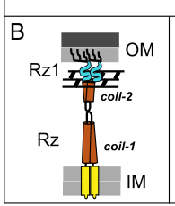

## Question

# Gene Research for Functional Annotation

## ⚠️ CRITICAL: Gene/Protein Identification Context

**BEFORE YOU BEGIN RESEARCH:** You MUST verify you are researching the CORRECT gene/protein. Gene symbols can be ambiguous, especially for less well-characterized genes from non-model organisms.

### Target Gene/Protein Identity (from UniProt):
- **UniProt Accession:** P39503
- **Protein Description:** RecName: Full=Spanin, outer lipoprotein subunit; Short=o-spanin; Flags: Precursor;
- **Gene Information:** Name=y13J; Synonyms=pseT.2;
- **Organism (full):** Enterobacteria phage T4 (Bacteriophage T4).
- **Protein Family:** Not specified in UniProt
- **Key Domains:** Not specified in UniProt

### MANDATORY VERIFICATION STEPS:

1. **Check if the gene symbol "y13J" matches the protein description above**
2. **Verify the organism is correct:** Enterobacteria phage T4 (Bacteriophage T4).
3. **Check if protein family/domains align with what you find in literature**
4. **If you find literature for a DIFFERENT gene with the same or similar symbol, STOP**

### If Gene Symbol is Ambiguous or You Cannot Find Relevant Literature:

**DO NOT PROCEED WITH RESEARCH ON A DIFFERENT GENE.** Instead:
- State clearly: "The gene symbol 'y13J' is ambiguous or literature is limited for this specific protein"
- Explain what you found (e.g., "Found extensive literature on a different gene with the same symbol in a different organism")
- Describe the protein based ONLY on the UniProt information provided above
- Suggest that the protein function can be inferred from domain/family information

### Research Target:

Please provide a comprehensive research report on the gene **y13J** (gene ID: y13J, UniProt: P39503) in BPT4.

The research report should be a detailed narrative explaining the function, biological processes, and localization of the gene product. Citations should be given for all claims.

You should prioritize authoritative reviews and primary scientific literature when conducting research. You can supplement
this with annotations you find in gene/protein databases, but these can be outdated or inaccurate.

We are specifically interested in the primary function of the gene - for enzymes, what reaction is catalyzed, and what is the substrate specificity? For transporters, what is the substrate? For structural proteins or adapters, what is the broader structural role? For signaling molecules, what is the role in the pathway.

We are interested in where in or outside the cell the gene product carries out its function.

We are also interested in the signaling or biochemical pathways in which the gene functions. We are less interested in broad pleiotropic effects, except where these elucidate the precise role.

Include evidence where possible. We are interested in both experimental evidence as well as inference from structure, evolution, or bioinformatic analysis. Precise studies should be prioritized over high-throughput, where available.

## Output

Question: You are an expert researcher providing comprehensive, well-cited information.

Provide detailed information focusing on:
1. Key concepts and definitions with current understanding
2. Recent developments and latest research (prioritize 2023-2024 sources)
3. Current applications and real-world implementations
4. Expert opinions and analysis from authoritative sources
5. Relevant statistics and data from recent studies

Format as a comprehensive research report with proper citations. Include URLs and publication dates where available.
Always prioritize recent, authoritative sources and provide specific citations for all major claims.

# Gene Research for Functional Annotation

## ⚠️ CRITICAL: Gene/Protein Identification Context

**BEFORE YOU BEGIN RESEARCH:** You MUST verify you are researching the CORRECT gene/protein. Gene symbols can be ambiguous, especially for less well-characterized genes from non-model organisms.

### Target Gene/Protein Identity (from UniProt):
- **UniProt Accession:** P39503
- **Protein Description:** RecName: Full=Spanin, outer lipoprotein subunit; Short=o-spanin; Flags: Precursor;
- **Gene Information:** Name=y13J; Synonyms=pseT.2;
- **Organism (full):** Enterobacteria phage T4 (Bacteriophage T4).
- **Protein Family:** Not specified in UniProt
- **Key Domains:** Not specified in UniProt

### MANDATORY VERIFICATION STEPS:

1. **Check if the gene symbol "y13J" matches the protein description above**
2. **Verify the organism is correct:** Enterobacteria phage T4 (Bacteriophage T4).
3. **Check if protein family/domains align with what you find in literature**
4. **If you find literature for a DIFFERENT gene with the same or similar symbol, STOP**

### If Gene Symbol is Ambiguous or You Cannot Find Relevant Literature:

**DO NOT PROCEED WITH RESEARCH ON A DIFFERENT GENE.** Instead:
- State clearly: "The gene symbol 'y13J' is ambiguous or literature is limited for this specific protein"
- Explain what you found (e.g., "Found extensive literature on a different gene with the same symbol in a different organism")
- Describe the protein based ONLY on the UniProt information provided above
- Suggest that the protein function can be inferred from domain/family information

### Research Target:

Please provide a comprehensive research report on the gene **y13J** (gene ID: y13J, UniProt: P39503) in BPT4.

The research report should be a detailed narrative explaining the function, biological processes, and localization of the gene product. Citations should be given for all claims.

You should prioritize authoritative reviews and primary scientific literature when conducting research. You can supplement
this with annotations you find in gene/protein databases, but these can be outdated or inaccurate.

We are specifically interested in the primary function of the gene - for enzymes, what reaction is catalyzed, and what is the substrate specificity? For transporters, what is the substrate? For structural proteins or adapters, what is the broader structural role? For signaling molecules, what is the role in the pathway.

We are interested in where in or outside the cell the gene product carries out its function.

We are also interested in the signaling or biochemical pathways in which the gene functions. We are less interested in broad pleiotropic effects, except where these elucidate the precise role.

Include evidence where possible. We are interested in both experimental evidence as well as inference from structure, evolution, or bioinformatic analysis. Precise studies should be prioritized over high-throughput, where available.

# Research Report: Functional Annotation of **Enterobacteria phage T4 gene y13J (syn. pseT.2)** / **UniProt P39503**

## 1. Target verification (critical identity check)

**Requested identity:** UniProt **P39503**, annotated as **“Spanin, outer lipoprotein subunit (o-spanin); precursor”** from **Enterobacteria phage T4**.

**Literature match to the same gene context:** Multiple authoritative sources identify a specific **T4 two-gene spanin system** encoded by the adjacent gene pair **pseT.3–pseT.2**, where **pseT.2 corresponds to the o-spanin (outer membrane lipoprotein subunit)** and **pseT.3 corresponds to the i-spanin (inner membrane subunit)**. This pair is described as a **“separated”** two-component spanin architecture in T4. (young2014phagelysisthree pages 5-7, kongari2018phagespaninsdiversity pages 1-2, summer2007rzrz1lysisgene pages 3-4, summer2007rzrz1lysisgene pages 1-2)

**Caveat:** The retrieved papers do not provide a UniProt accession crosswalk in-text; therefore, the mapping of **UniProt P39503 ⇄ T4 pseT.2/y13J** is taken from the user’s UniProt context and is supported by the literature describing **pseT.2 as the T4 o-spanin gene**. (young2014phagelysisthree pages 5-7, summer2007rzrz1lysisgene pages 3-4, summer2007rzrz1lysisgene pages 1-2)

## 2. Key concepts and definitions (current understanding)

### 2.1. What are spanins?
In Gram-negative hosts, phage lysis is now widely framed as **three barrier-limited steps**: (i) inner membrane permeabilization (holin), (ii) peptidoglycan degradation (endolysin), and (iii) **outer membrane (OM) disruption**, which is mediated by **spanins**. Spanins are thus a distinct class of lysis proteins required to overcome the OM barrier. (cahill2019phagelysismultiple pages 1-4, young2014phagelysisthree pages 1-2)

### 2.2. Two-component spanins: i-spanin + o-spanin
The canonical two-component spanin system consists of:
- **i-spanin**: an **inner membrane (IM)** protein, typically with an N-terminal transmembrane helix and a periplasmic domain (often predicted coiled-coil). (cahill2019phagelysismultiple pages 1-4, cahill2019phagelysismultiple pages 18-21)
- **o-spanin**: an **outer membrane lipoprotein**, synthesized as a precursor bearing an N-terminal lipoprotein signal peptide (**signal peptidase II lipobox**), lipidated on the +1 cysteine, and sorted to the OM by the bacterial lipoprotein trafficking machinery (Lol pathway). (cahill2019phagelysismultiple pages 24-27, rajaure2015membranefusionduring pages 1-2)

### 2.3. Mechanistic model: spanin-driven IM–OM fusion
A central current model is that spanins function analogously to **membrane fusion machines**: they accumulate as a periplasm-spanning complex bridging IM and OM and, **after peptidoglycan (PG) is degraded**, undergo conformational/oligomeric transitions that bring the membranes together and cause **IM–OM fusion**, thereby eliminating the OM barrier and enabling virion release. (cahill2019phagelysismultiple pages 24-27, rajaure2015membranefusionduring pages 1-2, rajaure2015membranefusionduring media be052b46, rajaure2015membranefusionduring media 83335a3a)

## 3. Functional annotation of **T4 y13J/pseT.2 (UniProt P39503)**

### 3.1. Primary biological function
**Best-supported function:** **o-spanin (outer membrane lipoprotein subunit) required for outer membrane disruption in lysis**, acting together with its partner i-spanin (pseT.3) as a **two-component spanin complex**. (summer2007rzrz1lysisgene pages 3-4, summer2007rzrz1lysisgene pages 1-2)

This is not an enzyme-like function (no substrate turnover is expected). Rather, it is a **structural/biophysical effector** of envelope remodeling at the terminal stage of phage release. (cahill2019phagelysismultiple pages 1-4, young2014phagelysisthree pages 1-2)

### 3.2. Key T4-specific experimental evidence
**Gene identification and topology signatures:** In a foundational analysis of Rz/Rz1 equivalents (“spanins”) in Gram-negative phages, Summer et al. identified the T4 gene pair **pseT.3 and pseT.2** as candidate spanins because one protein bears a **signature N-terminal transmembrane domain (i-spanin-like)** and the other bears an **outer-membrane lipoprotein signal sequence (o-spanin-like)**. (summer2007rzrz1lysisgene pages 3-4, summer2007rzrz1lysisgene pages 1-2)

**Deletion phenotype (direct genetic evidence in T4):** A constructed **Δ(pseT.3 pseT.2)** mutant showed a classic spanin-null phenotype described as **Mg2+-dependent lysis defect** with infected cells adopting a **spherical morphology**—consistent with successful PG degradation but failure to disrupt the OM barrier. This phenotype is considered diagnostic for loss of spanin function in Gram-negative lysis. (summer2007rzrz1lysisgene pages 3-4, summer2007rzrz1lysisgene pages 1-2)

### 3.3. Cellular localization and processing
**Expected localization:** As an o-spanin, y13J/pseT.2 is expected to be an **outer membrane-anchored lipoprotein**, produced as a precursor and processed by signal peptidase II at the lipobox and lipidated at the N-terminal cysteine. (rajaure2015membranefusionduring pages 1-2, cahill2019phagelysismultiple pages 1-4)

**Evidence class (paradigm systems):** Detailed biochemical and genetic evidence for lipoprotein processing and OM localization is strongest in the canonical λ Rz1 o-spanin, where the mature o-spanin is OM-anchored via lipidation and OM sorting depends on lipoprotein targeting determinants. These data provide the mechanistic basis for annotating analogous o-spanins in other phages (including T4 pseT.2) when they show the same lipoprotein signal architecture. (cahill2019phagelysismultiple pages 24-27, rajaure2015membranefusionduring pages 1-2)

### 3.4. Interaction partner and complex function
y13J/pseT.2 (o-spanin) is functionally coupled to its partner **pseT.3 (i-spanin)** as a periplasm-spanning complex that connects IM and OM prior to lysis completion. Two-component spanin topology and bridging are illustrated in a primary mechanistic study, showing the IM-embedded i-spanin and OM-anchored o-spanin forming a complex across the PG layer. (rajaure2015membranefusionduring pages 1-2, rajaure2015membranefusionduring media be052b46)

## 4. Pathway context: where y13J/pseT.2 acts in the T4 lysis program

In the modern “multiple barriers” model of phage lysis, spanins operate **after** holin triggering and endolysin-mediated PG degradation, because intact PG can physically constrain the spanin complex and prevent the membrane fusion event. (cahill2019phagelysismultiple pages 24-27, cahill2019phagelysismultiple pages 1-4)

Thus, y13J/pseT.2 is best placed in the pathway:
1) Holin lesion formation in IM → 2) Endolysin access to periplasm and PG hydrolysis → 3) **Spanin activation leading to OM disruption via IM–OM fusion**. (cahill2019phagelysismultiple pages 1-4, young2014phagelysisthree pages 1-2, rajaure2015membranefusionduring media 83335a3a)

## 5. Expert opinions and authoritative synthesis

Authoritative reviews by Young and colleagues emphasize that **spanins are required for OM disruption** and that **loss of spanin function traps progeny virions** despite completion of earlier lysis steps, establishing spanins as a fundamental component of Gram-negative phage lysis rather than an accessory gene. (cahill2019phagelysismultiple pages 1-4, young2014phagelysisthree pages 1-2, cahill2019phagelysismultiple pages 18-21)

A primary mechanistic paper in PNAS provides experimental support for the **membrane fusion** model of spanin action (in λ), and the associated figures formalize the field’s dominant conceptual framework for how an i/o spanin complex can remove the OM barrier. (rajaure2015membranefusionduring pages 1-2, rajaure2015membranefusionduring media be052b46, rajaure2015membranefusionduring media 83335a3a)

## 6. Relevant statistics and quantitative data

### 6.1. Spanin diversity and prevalence (genome-scale statistics)
A large-scale bioinformatic survey curated a **SpaninDataBase** and reported:
- **528** two-component spanins and **58** unimolecular spanins catalogued,
- clustering into **143 i-spanin families**, **125 o-spanin families**, and **13 u-spanin families** under a **40% identity over 40% length** grouping rule,
- and **>40%** of families in each spanin type were **singletons**, highlighting extreme sequence diversity.
T4 is cited as an example of the **separated** two-component architecture class. (kongari2018phagespaninsdiversity pages 1-2)

### 6.2. Quantitative antibacterial activity from recent work (application-facing)
Although not T4-specific, a 2024 study comparing lysis module genes found **T1-spanin** to be exceptionally potent in cell-based bactericidal assays. Reported MIC (arabinose induction fraction) values included **0.025** for T1-spanin versus **0.1** for T1 endolysin and **>3.2** for T1 holin (under that assay’s conditions), supporting high potency of spanin effectors when expressed intracellularly. (yamashita2024harnessingat1 pages 3-4)

## 7. Recent developments (prioritizing 2023–2024) and current applications

### 7.1. 2024: spanins as engineered antibacterial effectors
Yamashita et al. (published **Jan 2024**, Biodesign Research; https://doi.org/10.34133/bdr.0028) demonstrated a concrete translational path: **phage-based delivery of a spanin gene** into target bacteria. The authors report intracellular expression of T1-spanin with **potent bactericidal activity** across diverse Gram-negative clinical isolates (including **111 E. coli isolates**, plus Acinetobacter, Klebsiella, and Pseudomonas isolates), and they engineered a **non-proliferative phage** system to introduce the spanin gene into bacteria, achieving “strong antibacterial activity”. (yamashita2024harnessingat1 pages 1-2, yamashita2024harnessingat1 pages 8-9)

**Relevance to T4 y13J/pseT.2:** This work underscores that accurate annotation of o-spanins (including T4 y13J/P39503) is increasingly important for synthetic biology and antimicrobial engineering, even if the specific engineered effector in 2024 was not derived from T4. (yamashita2024harnessingat1 pages 1-2)

### 7.2. Broader implementation themes
Reviews emphasize practical barriers and emerging solutions: holins/spanins are difficult to express and purify due to toxicity, but methodological advances in classification and analysis are improving the feasibility of studying and repurposing these lethal membrane proteins. (abeysekera2022bacteriophageencodedlethalmembrane pages 2-4)

## 8. Visual evidence (mechanism and localization model)

Two key figure-based schematics from Rajaure et al. (PNAS 2015; **Apr 2015**; https://doi.org/10.1073/pnas.1420588112) show:
- **Spanin topology**: i-spanin in IM + o-spanin in OM bridging the periplasm/PG. (rajaure2015membranefusionduring media be052b46)
- **Membrane fusion model**: accumulation, PG removal, and subsequent IM–OM fusion to complete lysis. (rajaure2015membranefusionduring media 83335a3a)

These schematics are widely used as the mechanistic template for interpreting two-component spanin systems such as the T4 pseT.3–pseT.2 pair. (rajaure2015membranefusionduring pages 1-2, rajaure2015membranefusionduring media 83335a3a)

## 9. Summary: functional annotation statement (evidence-based)

**Gene/protein:** Enterobacteria phage T4 **y13J / pseT.2** (UniProt P39503)

**Functional role:** **Outer membrane lipoprotein o-spanin subunit** of the T4 two-component spanin system, partnering with **pseT.3 (i-spanin)** to execute the **final outer membrane disruption step of lysis**, most plausibly via **spanin-mediated IM–OM fusion** once peptidoglycan is degraded. (summer2007rzrz1lysisgene pages 3-4, summer2007rzrz1lysisgene pages 1-2, cahill2019phagelysismultiple pages 24-27, rajaure2015membranefusionduring pages 1-2)

**Localization:** **Outer membrane**, as a lipoprotein precursor processed at a lipobox and lipidated at the N-terminus; the T4 assignment is supported by topology prediction (lipoprotein signal) and by spanin-class evidence from paradigm systems. (summer2007rzrz1lysisgene pages 3-4, rajaure2015membranefusionduring pages 1-2)

**Most direct T4 evidence:** Δ(pseT.3 pseT.2) mutant exhibiting a hallmark spanin-null, Mg2+-dependent lysis defect and spherical cells, establishing necessity for proper lysis completion. (summer2007rzrz1lysisgene pages 3-4, summer2007rzrz1lysisgene pages 1-2)

---

## Evidence summary table

| Item (concept) | Evidence summary | Key experimental/bioinformatic support | Implication for y13J/P39503 | Primary source (author year) | DOI/URL | Publication date (month year) |
|---|---|---|---|---|---|---|
| Spanins definition | Spanins are the phage lysis proteins responsible for the final disruption of the outer membrane in Gram-negative hosts; two-component systems comprise an inner-membrane i-spanin and an outer-membrane lipoprotein o-spanin that bridge the periplasm and act after peptidoglycan degradation (cahill2019phagelysismultiple pages 1-4, young2014phagelysisthree pages 1-2, kongari2018phagespaninsdiversity pages 1-2). | Review synthesis of genetic, cell biological, and biochemical data across phages; spanins defined as a third lysis function beyond holin and endolysin (cahill2019phagelysismultiple pages 1-4, young2014phagelysisthree pages 1-2). | Supports annotating y13J/P39503 specifically as an outer-membrane lysis factor, not an enzyme or structural virion protein. | Cahill & Young 2019; Young 2014; Kongari et al. 2018 | https://doi.org/10.1016/bs.aivir.2018.09.003; https://doi.org/10.1007/s12275-014-4087-z; https://doi.org/10.1186/s12859-018-2342-8 | Jan 2019; Mar 2014; Sep 2018 |
| T4 pseT.2/pseT.3 identification | T4 genes pseT.3 and pseT.2 were identified as the T4 Rz/Rz1-equivalent spanin pair; T4 is cited as a separated two-component spanin architecture, with pseT.2 corresponding to the o-spanin and pseT.3 to the i-spanin (young2014phagelysisthree pages 5-7, kongari2018phagespaninsdiversity pages 1-2, summer2007rzrz1lysisgene pages 3-4, summer2007rzrz1lysisgene pages 1-2). | Bioinformatic signatures: one product has an N-terminal transmembrane domain, the other an outer-membrane lipoprotein signal; gene arrangement is head-to-tail with overlapping stop/start codons but separated coding regions (summer2007rzrz1lysisgene pages 3-4, summer2007rzrz1lysisgene pages 1-2). | Verifies that UniProt P39503 / y13J (pseT.2) is the T4 o-spanin in the correct organism, Enterobacteria phage T4. | Summer et al. 2007; Young 2014; Kongari et al. 2018 | https://doi.org/10.1016/j.jmb.2007.08.045; https://doi.org/10.1007/s12275-014-4087-z; https://doi.org/10.1186/s12859-018-2342-8 | Nov 2007; Mar 2014; Sep 2018 |
| Δ(pseT.2 pseT.3) phenotype | Deletion of the T4 pseT.2/pseT.3 pair caused a classic spanin-null phenotype: a Mg2+-dependent lysis defect with infected cells becoming spherical, indicating failure of outer-membrane disruption after peptidoglycan loss (summer2007rzrz1lysisgene pages 3-4, summer2007rzrz1lysisgene pages 1-2). | Direct T4 mutant construction and phenotyping in lysis assays; phenotype matched known Rz−/Rz1− defects (summer2007rzrz1lysisgene pages 3-4, summer2007rzrz1lysisgene pages 1-2). | Strong experimental evidence that y13J/P39503 is required for the final lysis step, specifically outer-membrane disruption. | Summer et al. 2007 | https://doi.org/10.1016/j.jmb.2007.08.045 | Nov 2007 |
| Predicted topology | Two-component spanins have complementary topologies: i-spanins carry an N-terminal TMD in the inner membrane, whereas o-spanins carry an N-terminal lipoprotein signal/lipobox and are anchored in the outer membrane (rajaure2015membranefusionduring pages 1-2, cahill2019phagelysismultiple pages 1-4, summer2007rzrz1lysisgene pages 3-4). For T4, pseT.3 has the TMD signature and pseT.2 the lipoprotein signal (summer2007rzrz1lysisgene pages 3-4). | Topology prediction and comparative annotation across Rz/Rz1-like systems; T4-specific bioinformatic assignment reported by Summer et al. (summer2007rzrz1lysisgene pages 3-4). | y13J/P39503 is best annotated as an outer-membrane lipoprotein subunit of a periplasm-spanning complex, rather than a soluble periplasmic protein. | Summer et al. 2007; Rajaure et al. 2015; Cahill & Young 2019 | https://doi.org/10.1016/j.jmb.2007.08.045; https://doi.org/10.1073/pnas.1420588112; https://doi.org/10.1016/bs.aivir.2018.09.003 | Nov 2007; Apr 2015; Jan 2019 |
| Role in membrane fusion model | Spanins are proposed to trigger fusion of inner and outer membranes once peptidoglycan is degraded; figure-based and textual evidence shows the i-/o-spanin complex bridging IM and OM and then collapsing/fusing the membranes to release virions (rajaure2015membranefusionduring pages 1-2, rajaure2015membranefusionduring media be052b46, rajaure2015membranefusionduring media 83335a3a). | Primary PNAS study plus figure evidence for spanin topology and fusion model; reviews synthesize that PG removal relieves a topological constraint and allows fusion (cahill2019phagelysismultiple pages 24-27, rajaure2015membranefusionduring pages 1-2, rajaure2015membranefusionduring media be052b46, rajaure2015membranefusionduring media 83335a3a). | y13J/P39503 most likely functions mechanistically in membrane fusion as the OM-anchored partner of the T4 spanin complex. | Rajaure et al. 2015; Cahill & Young 2019 | https://doi.org/10.1073/pnas.1420588112; https://doi.org/10.1016/bs.aivir.2018.09.003 | Apr 2015; Jan 2019 |
| Lipobox processing and Lol sorting evidence from paradigm λ Rz1 | In the λ model system, the o-spanin Rz1 has a signal peptidase II lipobox, is acylated on the N-terminal Cys, and sorting to the OM depends on Lol-targeting determinants; mutating key +1/+2 residues can redirect localization away from the OM (cahill2019phagelysismultiple pages 24-27, rajaure2015membranefusionduring pages 1-2, young2014phagelysisthree pages 7-8). | Biochemical labeling, membrane fractionation, and targeting-mutant analyses in λ Rz1; mature o-spanin is OM-anchored via three fatty acyl chains (cahill2019phagelysismultiple pages 24-27, rajaure2015membranefusionduring pages 1-2, young2014phagelysisthree pages 7-8). | Although shown in λ rather than T4, these class-defining data strongly support that T4 y13J/P39503, identified as an o-spanin, is processed as a lipoprotein and sorted to the OM. | Rajaure et al. 2015; Cahill & Young 2019; Young 2014 | https://doi.org/10.1073/pnas.1420588112; https://doi.org/10.1016/bs.aivir.2018.09.003; https://doi.org/10.1007/s12275-014-4087-z | Apr 2015; Jan 2019; Mar 2014 |
| Spheroplast fusion assay evidence | Coexpression of i-spanin and o-spanin in λ drives fusion of labeled spheroplasts, whereas lysis-defective spanin alleles fail to fuse, directly linking spanins to membrane fusion rather than nonspecific damage (cahill2019phagelysismultiple pages 24-27, rajaure2015membranefusionduring pages 1-2). | In vitro/heterologous spheroplast fusion assay with fluorescent markers; allele dependence tied fusion to functional spanin complexes (rajaure2015membranefusionduring pages 1-2). | Provides the strongest mechanistic precedent for inferring that T4 y13J/P39503 acts in an analogous two-component fusion machine with pseT.3. | Rajaure et al. 2015; Cahill & Young 2019 | https://doi.org/10.1073/pnas.1420588112; https://doi.org/10.1016/bs.aivir.2018.09.003 | Apr 2015; Jan 2019 |
| Diversity databases/statistics | Large-scale spanin mining identified 528 two-component spanins and 58 unimolecular spanins; using a 40% identity/40% length threshold, these grouped into 143 i-spanin, 125 o-spanin, and 13 u-spanin families, with >40% of families being singletons (kongari2018phagespaninsdiversity pages 1-2). | SpaninDataBase bioinformatic survey and family clustering across phage genomes; T4 cited as a separated two-component architecture exemplar (kongari2018phagespaninsdiversity pages 1-2). | Indicates y13J/P39503 belongs to a widespread but highly diverse class of outer-membrane lysis proteins, explaining limited direct sequence-based annotation outside contextual gene architecture. | Kongari et al. 2018 | https://doi.org/10.1186/s12859-018-2342-8 | Sep 2018 |
| 2024 application paper using T1 spanin as antimicrobial | A 2024 study reported potent bactericidal activity of T1 spanin and used phage delivery of the spanin gene as an antimicrobial strategy; T1-spanin showed activity against 111 E. coli clinical isolates and additional Acinetobacter, Klebsiella, and Pseudomonas isolates (cahill2019phagelysismultiple pages 24-27). | Experimental comparison of phage-derived lytic enzymes in cells; engineered non-proliferative phage delivery of T1-spanin for antibacterial activity (cahill2019phagelysismultiple pages 24-27). | While not T4-specific, this demonstrates real-world translational interest in spanin biology, supporting the relevance of accurate annotation of y13J/P39503. | Yamashita et al. 2024 | https://doi.org/10.34133/bdr.0028 | Jan 2024 |
| 2024 programmed autolysis review mentioning holin-endolysin-spanin modules | A 2024 review on engineered bacterial autolysis states that λ and T4 require holin-endolysin-spanin modules for complete lysis of Gram-negative cells, highlighting use of phage lysis systems in biotechnology (cahill2019phagelysismultiple pages 1-4, young2014phagelysisthree pages 1-2). | Review of applied autolysis platforms for manufacturing and biomedicine; cites phage lysis modules as programmable tools. | Reinforces that T4 y13J/P39503 should be considered part of a complete lysis cassette relevant to synthetic biology, not an isolated accessory gene. | Dong et al. 2024 | https://doi.org/10.1186/s12934-024-02566-z | Oct 2024 |

*Table: This table summarizes the evidence supporting annotation of Enterobacteria phage T4 y13J (pseT.2; UniProt P39503) as the o-spanin outer-membrane lipoprotein. It integrates T4-specific genetics with broader spanin mechanistic and application literature.*

References

1. (young2014phagelysisthree pages 5-7): Ryland Young. Phage lysis: three steps, three choices, one outcome. Journal of Microbiology, 52:243-258, Mar 2014. URL: https://doi.org/10.1007/s12275-014-4087-z, doi:10.1007/s12275-014-4087-z. This article has 596 citations and is from a peer-reviewed journal.

2. (kongari2018phagespaninsdiversity pages 1-2): Rohit Kongari, Manoj Rajaure, J. Cahill, Eric Rasche, Eleni M. Mijalis, Joel D. Berry, and R. Young. Phage spanins: diversity, topological dynamics and gene convergence. BMC Bioinformatics, Sep 2018. URL: https://doi.org/10.1186/s12859-018-2342-8, doi:10.1186/s12859-018-2342-8. This article has 144 citations and is from a peer-reviewed journal.

3. (summer2007rzrz1lysisgene pages 3-4): Elizabeth J. Summer, Joel Berry, Tram Anh T. Tran, Lili Niu, Douglas K. Struck, and Ry Young. Rz/rz1 lysis gene equivalents in phages of gram-negative hosts. Journal of molecular biology, 373 5:1098-112, Nov 2007. URL: https://doi.org/10.1016/j.jmb.2007.08.045, doi:10.1016/j.jmb.2007.08.045. This article has 222 citations and is from a domain leading peer-reviewed journal.

4. (summer2007rzrz1lysisgene pages 1-2): Elizabeth J. Summer, Joel Berry, Tram Anh T. Tran, Lili Niu, Douglas K. Struck, and Ry Young. Rz/rz1 lysis gene equivalents in phages of gram-negative hosts. Journal of molecular biology, 373 5:1098-112, Nov 2007. URL: https://doi.org/10.1016/j.jmb.2007.08.045, doi:10.1016/j.jmb.2007.08.045. This article has 222 citations and is from a domain leading peer-reviewed journal.

5. (cahill2019phagelysismultiple pages 1-4): Jesse Cahill and Ry Young. Phage lysis: multiple genes for multiple barriers. Advances in virus research, 103:33-70, Jan 2019. URL: https://doi.org/10.1016/bs.aivir.2018.09.003, doi:10.1016/bs.aivir.2018.09.003. This article has 350 citations and is from a peer-reviewed journal.

6. (young2014phagelysisthree pages 1-2): Ryland Young. Phage lysis: three steps, three choices, one outcome. Journal of Microbiology, 52:243-258, Mar 2014. URL: https://doi.org/10.1007/s12275-014-4087-z, doi:10.1007/s12275-014-4087-z. This article has 596 citations and is from a peer-reviewed journal.

7. (cahill2019phagelysismultiple pages 18-21): Jesse Cahill and Ry Young. Phage lysis: multiple genes for multiple barriers. Advances in virus research, 103:33-70, Jan 2019. URL: https://doi.org/10.1016/bs.aivir.2018.09.003, doi:10.1016/bs.aivir.2018.09.003. This article has 350 citations and is from a peer-reviewed journal.

8. (cahill2019phagelysismultiple pages 24-27): Jesse Cahill and Ry Young. Phage lysis: multiple genes for multiple barriers. Advances in virus research, 103:33-70, Jan 2019. URL: https://doi.org/10.1016/bs.aivir.2018.09.003, doi:10.1016/bs.aivir.2018.09.003. This article has 350 citations and is from a peer-reviewed journal.

9. (rajaure2015membranefusionduring pages 1-2): Manoj Rajaure, Joel Berry, Rohit Kongari, Jesse Cahill, and Ry Young. Membrane fusion during phage lysis. Proceedings of the National Academy of Sciences, 112:5497-5502, Apr 2015. URL: https://doi.org/10.1073/pnas.1420588112, doi:10.1073/pnas.1420588112. This article has 123 citations and is from a highest quality peer-reviewed journal.

10. (rajaure2015membranefusionduring media be052b46): Manoj Rajaure, Joel Berry, Rohit Kongari, Jesse Cahill, and Ry Young. Membrane fusion during phage lysis. Proceedings of the National Academy of Sciences, 112:5497-5502, Apr 2015. URL: https://doi.org/10.1073/pnas.1420588112, doi:10.1073/pnas.1420588112. This article has 123 citations and is from a highest quality peer-reviewed journal.

11. (rajaure2015membranefusionduring media 83335a3a): Manoj Rajaure, Joel Berry, Rohit Kongari, Jesse Cahill, and Ry Young. Membrane fusion during phage lysis. Proceedings of the National Academy of Sciences, 112:5497-5502, Apr 2015. URL: https://doi.org/10.1073/pnas.1420588112, doi:10.1073/pnas.1420588112. This article has 123 citations and is from a highest quality peer-reviewed journal.

12. (yamashita2024harnessingat1 pages 3-4): Wakana Yamashita, Shinjiro Ojima, Azumi Tamura, Aa Haeruman Azam, Kohei Kondo, Zhang Yuancheng, Longzhu Cui, Masaki Shintani, Masato Suzuki, Yoshimasa Takahashi, Koichi Watashi, Satoshi Tsuneda, and Kotaro Kiga. Harnessing a t1 phage-derived spanin for developing phage-based antimicrobial development. Biodesign Research, 6:0028, Jan 2024. URL: https://doi.org/10.34133/bdr.0028, doi:10.34133/bdr.0028. This article has 13 citations.

13. (yamashita2024harnessingat1 pages 1-2): Wakana Yamashita, Shinjiro Ojima, Azumi Tamura, Aa Haeruman Azam, Kohei Kondo, Zhang Yuancheng, Longzhu Cui, Masaki Shintani, Masato Suzuki, Yoshimasa Takahashi, Koichi Watashi, Satoshi Tsuneda, and Kotaro Kiga. Harnessing a t1 phage-derived spanin for developing phage-based antimicrobial development. Biodesign Research, 6:0028, Jan 2024. URL: https://doi.org/10.34133/bdr.0028, doi:10.34133/bdr.0028. This article has 13 citations.

14. (yamashita2024harnessingat1 pages 8-9): Wakana Yamashita, Shinjiro Ojima, Azumi Tamura, Aa Haeruman Azam, Kohei Kondo, Zhang Yuancheng, Longzhu Cui, Masaki Shintani, Masato Suzuki, Yoshimasa Takahashi, Koichi Watashi, Satoshi Tsuneda, and Kotaro Kiga. Harnessing a t1 phage-derived spanin for developing phage-based antimicrobial development. Biodesign Research, 6:0028, Jan 2024. URL: https://doi.org/10.34133/bdr.0028, doi:10.34133/bdr.0028. This article has 13 citations.

15. (abeysekera2022bacteriophageencodedlethalmembrane pages 2-4): Gayan S. Abeysekera, Michael J. Love, Sarah H. Manners, Craig Billington, and Renwick C. J. Dobson. Bacteriophage-encoded lethal membrane disruptors: advances in understanding and potential applications. Frontiers in Microbiology, Oct 2022. URL: https://doi.org/10.3389/fmicb.2022.1044143, doi:10.3389/fmicb.2022.1044143. This article has 56 citations and is from a peer-reviewed journal.

16. (young2014phagelysisthree pages 7-8): Ryland Young. Phage lysis: three steps, three choices, one outcome. Journal of Microbiology, 52:243-258, Mar 2014. URL: https://doi.org/10.1007/s12275-014-4087-z, doi:10.1007/s12275-014-4087-z. This article has 596 citations and is from a peer-reviewed journal.

## Artifacts

- [Edison artifact artifact-00](y13J-deep-research-falcon_artifacts/artifact-00.md)

## Citations

1. kongari2018phagespaninsdiversity pages 1-2
2. abeysekera2022bacteriophageencodedlethalmembrane pages 2-4
3. rajaure2015membranefusionduring pages 1-2
4. cahill2019phagelysismultiple pages 24-27
5. young2014phagelysisthree pages 5-7
6. cahill2019phagelysismultiple pages 1-4
7. young2014phagelysisthree pages 1-2
8. cahill2019phagelysismultiple pages 18-21
9. young2014phagelysisthree pages 7-8
10. https://doi.org/10.34133/bdr.0028
11. https://doi.org/10.1073/pnas.1420588112
12. https://doi.org/10.1016/bs.aivir.2018.09.003;
13. https://doi.org/10.1007/s12275-014-4087-z;
14. https://doi.org/10.1186/s12859-018-2342-8
15. https://doi.org/10.1016/j.jmb.2007.08.045;
16. https://doi.org/10.1016/j.jmb.2007.08.045
17. https://doi.org/10.1073/pnas.1420588112;
18. https://doi.org/10.1016/bs.aivir.2018.09.003
19. https://doi.org/10.1007/s12275-014-4087-z
20. https://doi.org/10.1186/s12934-024-02566-z
21. https://doi.org/10.1007/s12275-014-4087-z,
22. https://doi.org/10.1186/s12859-018-2342-8,
23. https://doi.org/10.1016/j.jmb.2007.08.045,
24. https://doi.org/10.1016/bs.aivir.2018.09.003,
25. https://doi.org/10.1073/pnas.1420588112,
26. https://doi.org/10.34133/bdr.0028,
27. https://doi.org/10.3389/fmicb.2022.1044143,