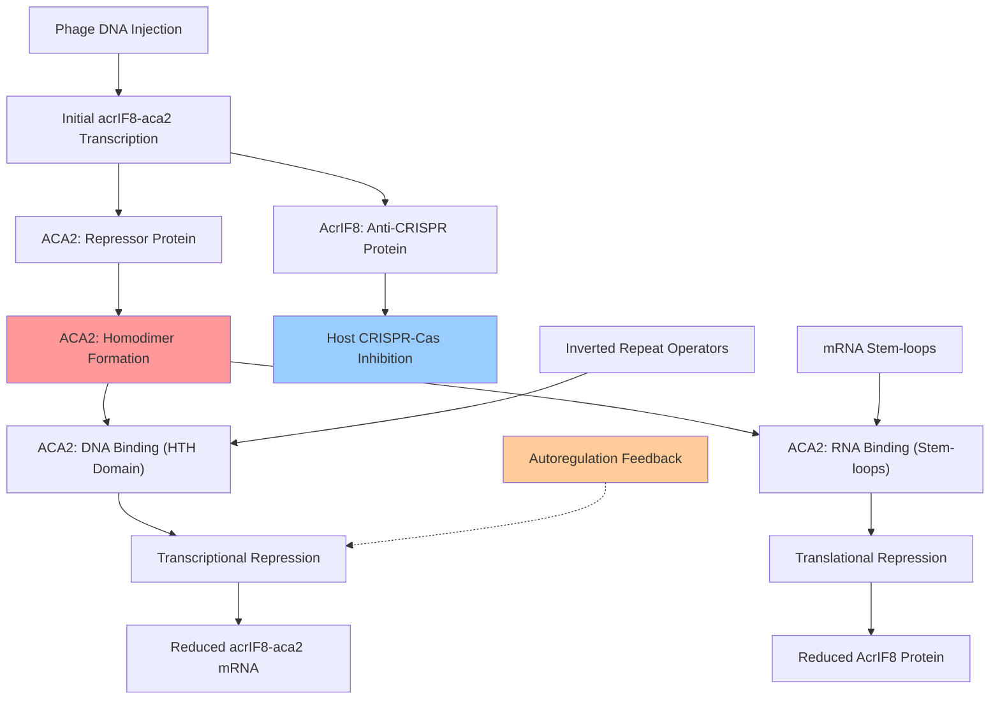

# Pathway Summary for ACA2

## Overview
ACA2 participates in the anti-CRISPR regulation pathway where it functions as a dual transcriptional and translational repressor [PMID:31428783, PMID:38987591]. This bacteriophage-encoded regulatory protein ensures tight control of anti-CRISPR (AcrIF8) expression during phage infection, preventing toxic overexpression while allowing sufficient production to evade host CRISPR-Cas immunity through a sophisticated negative feedback mechanism.

## Anti-CRISPR Regulation Pathway
The anti-CRISPR regulation pathway represents a critical phage survival mechanism that balances immune evasion with host cell fitness during infection [PMID:31428783]. ACA2 serves as the master regulator of this pathway by controlling the expression of the acrIF8-aca2 operon through both transcriptional and translational mechanisms.

ACA2 functions as a homodimeric repressor that binds specific inverted repeat operator sequences in the acrIF8-aca2 promoter region through its N-terminal helix-turn-helix domain [PMID:31428783]. This DNA binding blocks RNA polymerase access to the promoter, preventing transcription initiation and establishing the first level of regulatory control over anti-CRISPR gene expression.

Additionally, ACA2 provides a second layer of regulation by binding conserved RNA stem-loops in the acrIF8-aca2 mRNA to block ribosome access and inhibit translation [PMID:38987591]. This dual regulatory mechanism creates a robust negative feedback loop that ensures rapid deployment of anti-CRISPR proteins immediately after infection, followed by swift repression to prevent cellular toxicity.

## Phage-Host Interaction and CRISPR Evasion
ACA2-mediated regulation is essential for successful phage infection in CRISPR-containing hosts [PMID:31474367]. The protein coordinates the temporal expression of anti-CRISPR proteins, allowing for immediate neutralization of host CRISPR-Cas defenses while preventing the deleterious effects of prolonged anti-CRISPR overexpression on both phage replication and host cell physiology.

The regulatory architecture ensures that anti-CRISPR genes are expressed quickly and at high levels immediately after phage DNA injection, providing rapid protection against host immune responses [PMID:31474367]. Subsequently, ACA2 represses this transcription through the autoregulatory feedback loop, maintaining anti-CRISPR protein levels at appropriate concentrations for sustained immune evasion without cellular toxicity.

## Anti-CRISPR Regulation Pathway Diagram

## Gene Expression Control and Temporal Dynamics
ACA2 creates a sophisticated temporal control system that governs the kinetics of anti-CRISPR expression throughout the phage infection cycle [PMID:31474367]. The regulatory mechanism enables rapid initial expression followed by precise titration of anti-CRISPR levels to optimize phage survival while minimizing host cell burden.

The dual DNA and RNA binding capability of ACA2's HTH domain provides redundant regulatory control that ensures tight repression of the acrIF8-aca2 operon [PMID:38987591]. This redundancy is critical for phage fitness, as uncontrolled anti-CRISPR expression can be detrimental to both phage replication efficiency and host cell viability.

## Evolutionary Significance and Phage Adaptation
The ACA2 regulatory system represents a sophisticated evolutionary adaptation that enables bacteriophages to successfully infect hosts with CRISPR-Cas immune systems [PMID:31474367]. The conservation of aca genes across diverse anti-CRISPR systems suggests that this regulatory architecture is essential for the ecological success of phages in CRISPR-rich microbial environments.

The ability of ACA2 to coordinate anti-CRISPR expression provides phages with a competitive advantage by allowing them to rapidly adapt to host immune defenses while maintaining cellular fitness. This regulatory flexibility is crucial for phage survival in natural microbial communities where CRISPR-Cas systems are prevalent and diverse.