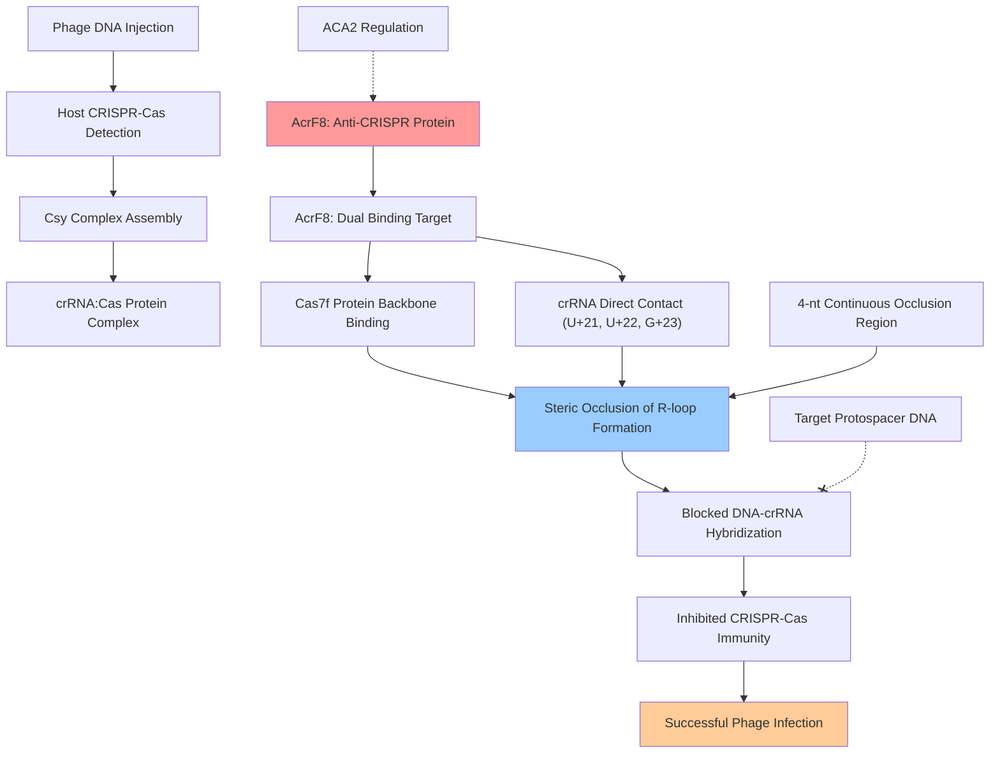

# Pathway Summary for AcrF8

## Overview
AcrF8 participates in the bacteriophage anti-CRISPR immune evasion pathway where it functions as a potent inhibitor of host Type I-F CRISPR-Cas systems [PMID:32170016, PDB:6VQW]. This 92-amino acid anti-CRISPR protein employs a unique dual-targeting strategy that involves binding to both the Cas7f protein backbone and directly contacting the crRNA within the surveillance complex, physically blocking R-loop formation and preventing target DNA recognition.

## Type I-F CRISPR-Cas Inhibition Pathway
The Type I-F CRISPR-Cas inhibition pathway represents a sophisticated molecular mechanism by which bacteriophages neutralize host adaptive immune defenses [PMID:32170016]. AcrF8 targets the Type I-F CRISPR-Cas surveillance complex (Csy complex) through direct binding interactions that prevent the formation of R-loop structures necessary for target DNA recognition and cleavage.

AcrF8 binds as a monomer to the cavity surrounded by Cas5f, Cas7.4-7.6f, and Cas8f proteins within the Csy complex [PMID:32170016]. The protein makes critical contacts with the Cas7f spiral backbone while simultaneously interacting with specific nucleotides of the crRNA scaffold. This dual-targeting approach creates a continuous 4-nucleotide occlusion region that interferes with DNA-crRNA hybridization.

The inhibition mechanism involves AcrF8 residues T29, I31, A32, and N33 forming hydrogen bonds and nonbonded interactions with crRNA nucleotides U+21, U+22, and G+23 [PMID:32170016]. These interactions sterically block the crRNA from base-pairing with complementary protospacer DNA, effectively preventing the formation of R-loop structures required for CRISPR-Cas-mediated DNA cleavage.

## Phage Immune Evasion Strategy
AcrF8-mediated CRISPR inhibition represents a critical component of bacteriophage survival strategies in hosts equipped with Type I-F CRISPR-Cas systems [PMID:31474367]. The protein enables rapid neutralization of host adaptive immune responses immediately after phage DNA injection, allowing successful establishment of infection in CRISPR-protected bacterial cells.

The effectiveness of AcrF8 inhibition is demonstrated by its ability to completely block Type I-F CRISPR-Cas activity through its dual protein-RNA binding mechanism [PMID:32170016]. Mutations at critical residues I31A and A32G abolish inhibitory activity, confirming the importance of direct crRNA interactions for anti-CRISPR function.

## Anti-CRISPR Immune Evasion Pathway Diagram

## Regulatory Integration and Temporal Control
AcrF8 expression is tightly integrated with the broader anti-CRISPR regulatory network through its co-transcription with the Aca2 repressor [PMID:38987591]. This regulatory coupling ensures that anti-CRISPR proteins are deployed rapidly upon infection but then repressed to prevent cellular toxicity and maintain optimal phage replication conditions.

The autoregulatory feedback loop mediated by Aca2 creates precise temporal control over AcrF8 levels throughout the infection cycle [PMID:31474367]. This regulation is essential for phage viability, as uncontrolled AcrF8 expression can be detrimental to both phage replication efficiency and host cell fitness.

## Evolutionary Arms Race and Host-Phage Coevolution
AcrF8 represents an evolutionary adaptation in the ongoing arms race between bacteriophages and CRISPR-Cas immune systems [PMID:32170016]. The protein's unique dual-targeting mechanism provides a robust inhibition strategy that is more difficult for hosts to overcome through simple point mutations in either Cas proteins or crRNA sequences.

The structural sophistication of AcrF8's binding mechanism, involving precise contacts with both protein and RNA components, reflects the evolutionary pressure to develop effective anti-CRISPR strategies [PDB:6VQW]. This dual-targeting approach represents an advanced evolutionary solution that maximizes inhibitory potency while minimizing the likelihood of host escape mutations.

## Biotechnological Applications
Understanding AcrF8's inhibition mechanism has important implications for biotechnological applications of CRISPR-Cas systems [PMID:32170016]. The protein's ability to specifically inhibit Type I-F CRISPR-Cas activity provides a tool for controlling CRISPR-Cas function in engineered systems and for understanding the molecular basis of CRISPR-Cas immunity.