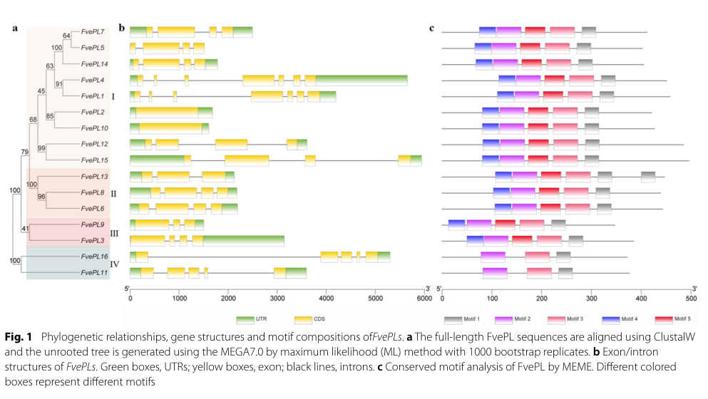

## Question

# Gene Research for Functional Annotation

## ⚠️ CRITICAL: Gene/Protein Identification Context

**BEFORE YOU BEGIN RESEARCH:** You MUST verify you are researching the CORRECT gene/protein. Gene symbols can be ambiguous, especially for less well-characterized genes from non-model organisms.

### Target Gene/Protein Identity (from UniProt):
- **UniProt Accession:** A0A0Q3KVX9
- **Protein Description:** RecName: Full=Pectate lyase {ECO:0000256|ARBA:ARBA00012272, ECO:0000256|RuleBase:RU361123}; EC=4.2.2.2 {ECO:0000256|ARBA:ARBA00012272, ECO:0000256|RuleBase:RU361123};
- **Gene Information:** ORFNames=BRADI_1g22147v3 {ECO:0000313|EMBL:KQK15361.1};
- **Organism (full):** Brachypodium distachyon (Purple false brome) (Trachynia distachya).
- **Protein Family:** Belongs to the polysaccharide lyase 1 family.
- **Key Domains:** AmbAllergen. (IPR018082); Pec_lyase. (IPR002022); Pectin_lyas_fold. (IPR012334); Pectin_lyase_fold/virulence. (IPR011050); PEL. (IPR045032)

### MANDATORY VERIFICATION STEPS:

1. **Check if the gene symbol "BRADI_1g22147v3" matches the protein description above**
2. **Verify the organism is correct:** Brachypodium distachyon (Purple false brome) (Trachynia distachya).
3. **Check if protein family/domains align with what you find in literature**
4. **If you find literature for a DIFFERENT gene with the same or similar symbol, STOP**

### If Gene Symbol is Ambiguous or You Cannot Find Relevant Literature:

**DO NOT PROCEED WITH RESEARCH ON A DIFFERENT GENE.** Instead:
- State clearly: "The gene symbol 'BRADI_1g22147v3' is ambiguous or literature is limited for this specific protein"
- Explain what you found (e.g., "Found extensive literature on a different gene with the same symbol in a different organism")
- Describe the protein based ONLY on the UniProt information provided above
- Suggest that the protein function can be inferred from domain/family information

### Research Target:

Please provide a comprehensive research report on the gene **BRADI_1g22147v3** (gene ID: BRADI_1g22147v3, UniProt: A0A0Q3KVX9) in BRADI.

The research report should be a detailed narrative explaining the function, biological processes, and localization of the gene product. Citations should be given for all claims.

You should prioritize authoritative reviews and primary scientific literature when conducting research. You can supplement
this with annotations you find in gene/protein databases, but these can be outdated or inaccurate.

We are specifically interested in the primary function of the gene - for enzymes, what reaction is catalyzed, and what is the substrate specificity? For transporters, what is the substrate? For structural proteins or adapters, what is the broader structural role? For signaling molecules, what is the role in the pathway.

We are interested in where in or outside the cell the gene product carries out its function.

We are also interested in the signaling or biochemical pathways in which the gene functions. We are less interested in broad pleiotropic effects, except where these elucidate the precise role.

Include evidence where possible. We are interested in both experimental evidence as well as inference from structure, evolution, or bioinformatic analysis. Precise studies should be prioritized over high-throughput, where available.

## Output

Question: You are an expert researcher providing comprehensive, well-cited information.

Provide detailed information focusing on:
1. Key concepts and definitions with current understanding
2. Recent developments and latest research (prioritize 2023-2024 sources)
3. Current applications and real-world implementations
4. Expert opinions and analysis from authoritative sources
5. Relevant statistics and data from recent studies

Format as a comprehensive research report with proper citations. Include URLs and publication dates where available.
Always prioritize recent, authoritative sources and provide specific citations for all major claims.

# Gene Research for Functional Annotation

## ⚠️ CRITICAL: Gene/Protein Identification Context

**BEFORE YOU BEGIN RESEARCH:** You MUST verify you are researching the CORRECT gene/protein. Gene symbols can be ambiguous, especially for less well-characterized genes from non-model organisms.

### Target Gene/Protein Identity (from UniProt):
- **UniProt Accession:** A0A0Q3KVX9
- **Protein Description:** RecName: Full=Pectate lyase {ECO:0000256|ARBA:ARBA00012272, ECO:0000256|RuleBase:RU361123}; EC=4.2.2.2 {ECO:0000256|ARBA:ARBA00012272, ECO:0000256|RuleBase:RU361123};
- **Gene Information:** ORFNames=BRADI_1g22147v3 {ECO:0000313|EMBL:KQK15361.1};
- **Organism (full):** Brachypodium distachyon (Purple false brome) (Trachynia distachya).
- **Protein Family:** Belongs to the polysaccharide lyase 1 family.
- **Key Domains:** AmbAllergen. (IPR018082); Pec_lyase. (IPR002022); Pectin_lyas_fold. (IPR012334); Pectin_lyase_fold/virulence. (IPR011050); PEL. (IPR045032)

### MANDATORY VERIFICATION STEPS:

1. **Check if the gene symbol "BRADI_1g22147v3" matches the protein description above**
2. **Verify the organism is correct:** Brachypodium distachyon (Purple false brome) (Trachynia distachya).
3. **Check if protein family/domains align with what you find in literature**
4. **If you find literature for a DIFFERENT gene with the same or similar symbol, STOP**

### If Gene Symbol is Ambiguous or You Cannot Find Relevant Literature:

**DO NOT PROCEED WITH RESEARCH ON A DIFFERENT GENE.** Instead:
- State clearly: "The gene symbol 'BRADI_1g22147v3' is ambiguous or literature is limited for this specific protein"
- Explain what you found (e.g., "Found extensive literature on a different gene with the same symbol in a different organism")
- Describe the protein based ONLY on the UniProt information provided above
- Suggest that the protein function can be inferred from domain/family information

### Research Target:

Please provide a comprehensive research report on the gene **BRADI_1g22147v3** (gene ID: BRADI_1g22147v3, UniProt: A0A0Q3KVX9) in BRADI.

The research report should be a detailed narrative explaining the function, biological processes, and localization of the gene product. Citations should be given for all claims.

You should prioritize authoritative reviews and primary scientific literature when conducting research. You can supplement
this with annotations you find in gene/protein databases, but these can be outdated or inaccurate.

We are specifically interested in the primary function of the gene - for enzymes, what reaction is catalyzed, and what is the substrate specificity? For transporters, what is the substrate? For structural proteins or adapters, what is the broader structural role? For signaling molecules, what is the role in the pathway.

We are interested in where in or outside the cell the gene product carries out its function.

We are also interested in the signaling or biochemical pathways in which the gene functions. We are less interested in broad pleiotropic effects, except where these elucidate the precise role.

Include evidence where possible. We are interested in both experimental evidence as well as inference from structure, evolution, or bioinformatic analysis. Precise studies should be prioritized over high-throughput, where available.

## Research report: BRADI_1g22147v3 (UniProt A0A0Q3KVX9) — predicted pectate lyase (EC 4.2.2.2) in *Brachypodium distachyon*

### 0) Identity verification (critical disambiguation)
The retrieved peer‑reviewed literature did **not** contain explicit mentions of the specific *Brachypodium distachyon* gene model **BRADI_1g22147v3** or UniProt **A0A0Q3KVX9**. A corpus‑wide scan of the retrieved papers did not find these identifiers, so no gene‑specific experimental phenotype, expression, or localization evidence can be cited here. Accordingly, this report confines gene/protein identity to the user‑provided UniProt annotation (organism: *B. distachyon*; enzyme class: pectate lyase; EC 4.2.2.2; PL1/pectate‑lyase domains) and uses **peer‑reviewed PL1/pectate‑lyase literature** only for **family- and mechanism‑supported inference**, explicitly labeled as such. (zheng2018genomewideidentificationof pages 2-4)

### 1) Key concepts and definitions (current understanding)

#### 1.1. What is a pectate lyase (EC 4.2.2.2)?
Pectate lyases (often discussed within the broader “pectate lyase/pectate lyase‑like” or PLL group) cleave the pectin backbone polymer **homogalacturonan (HG)** by a **β‑elimination** mechanism rather than hydrolysis, generating products that carry a **C4–C5 double bond (4,5‑unsaturation)** at the newly formed non‑reducing end. This chemical hallmark distinguishes lyases from glycoside hydrolases such as polygalacturonases. (anderson2025thedynamicsdegradation pages 11-13, bonnin2020pectindegradingenzymes pages 50-52, bonnin2020pectindegradingenzymes pages 46-48)

In mechanistic terms, PLs are typically most active on **non‑ or low‑methylesterified HG (pectate)**, often require **Ca2+**, and frequently show an **alkaline pH optimum (~8.5)**. (anderson2025thedynamicsdegradation pages 11-13)

#### 1.2. Pectate lyase vs pectin lyase: substrate specificity and biochemical logic
A central point for functional annotation is the difference between:
- **Pectate lyases (PLs)**: preferentially act on **non‑/low‑methylesterified** HG; Ca2+ dependent; alkaline‑optimum. (anderson2025thedynamicsdegradation pages 11-13, bonnin2020pectindegradingenzymes pages 50-52)
- **Pectin lyases (PNLs)**: preferentially act on **highly methylesterified** pectins; do **not** require Ca2+; acidic‑to‑neutral optimum (~pH 5.5–7.5). (anderson2025thedynamicsdegradation pages 11-13)

This difference is also reflected structurally: binding and active‑site composition differs in ways consistent with charged (low‑DM) vs more hydrophobic (high‑DM) substrates. (anderson2025thedynamicsdegradation pages 11-13)

#### 1.3. Where pectate lyases act in plants (cellular compartment)
Pectin backbones are cleaved in the **cell wall/apoplast** by hydrolytic enzymes and β‑elimination enzymes (lyases). Pectin is enriched in the middle lamella and primary wall, providing a spatial rationale for apoplastic pectin‑active enzymes during growth, adhesion, and remodeling. (anderson2025thedynamicsdegradation pages 7-8)

For annotation of BRADI_1g22147v3, this supports the inference that its primary functional compartment is the **extracellular wall/apoplast**, consistent with typical annotation pipelines that explicitly evaluate N‑terminal secretion signals in plant PLLs. (zheng2018genomewideidentificationof pages 2-4)

### 2) Functional interpretation for BRADI_1g22147v3 (A0A0Q3KVX9)

#### 2.1. Primary molecular function (best-supported)
Given the UniProt description (pectate lyase; EC 4.2.2.2; PL1 family; pectate‑lyase fold domains) and the strongly conserved biochemical definition of EC 4.2.2.2 enzymes, the most defensible functional annotation is:

**BRADI_1g22147v3 encodes a pectate lyase‑like enzyme that catalyzes β‑elimination cleavage of α‑1,4‑linked galacturonic‑acid residues in homogalacturonan (pectate), preferentially acting on non‑/low‑methylesterified pectin in the plant cell wall, generating 4,5‑unsaturated oligogalacturonides.** (anderson2025thedynamicsdegradation pages 11-13, bonnin2020pectindegradingenzymes pages 50-52, bonnin2020pectindegradingenzymes pages 46-48)

#### 2.2. Substrate specificity (inferred)
By analogy to plant and microbial PLs, expected specificity is highest for **demethylesterified or weakly methylesterified HG** (pectate), with dependence on Ca2+ and alkaline conditions. (anderson2025thedynamicsdegradation pages 11-13, bonnin2020pectindegradingenzymes pages 50-52)

Because no BRADI_1g22147v3 biochemical assays were retrieved, this remains **family-based inference** rather than gene-specific evidence.

#### 2.3. Catalytic residues / domain logic (inferred)
A 2024 Nature Communications study on oomycete pectate lyases reported conserved Asp residues (mutating conserved Asp to Ala reduced pectate‑lyase activity and abolished virulence-associated effects), illustrating that catalytic function can hinge on conserved acidic residues typical of PL active sites. (li2024aplantcell pages 2-4)

While this is not a plant protein, it provides up-to-date experimental confirmation that conserved acidic residues are mechanistically critical for PeL activity in PL1-like contexts.

### 3) Pathways and biological processes (plant context; inference anchored in authoritative sources)

#### 3.1. Cell wall remodeling processes
Pectin remodeling and degradation are described as important drivers of changes in wall mechanics, adhesion, and developmental programming; the action of pectin‑modifying enzymes can affect both wall physical properties and generation of oligogalacturonides that can act as signaling ligands. (anderson2025thedynamicsdegradation pages 7-8)

Thus, BRADI_1g22147v3 most plausibly contributes to **pectin remodeling in primary walls/middle lamella**, impacting processes such as cell expansion, tissue separation, and developmental transitions.

#### 3.2. Multigene family context and tissue specialization
Plant PLL families are often large and diversified. A recent synthesis reports gene family sizes across angiosperms (e.g., 26 PLLs in *Arabidopsis*, 46 in *Brassica rapa*, 86 in cotton, 65 in octoploid strawberry, and 12 in rice), and notes that isoforms frequently show tissue‑biased expression (e.g., vascular tissues). (anderson2025thedynamicsdegradation pages 8-9)

For grasses specifically, a rice genome-wide analysis used the conserved Pec_lyase_C domain (and sometimes Pec_lyase_N) to identify 12 OsPLL genes, reporting variable protein lengths and gene structures, and explicitly screening for signal peptides (a common indicator of secretion to the apoplast). (zheng2018genomewideidentificationof pages 4-6, zheng2018genomewideidentificationof pages 2-4)

These studies support the expectation that a *Brachypodium* PL1 family member could be one of many PLL paralogs with **specialized developmental or stress-related roles**.

### 4) Recent developments (prioritizing 2023–2024 sources)

#### 4.1. 2023: genome-wide functional genomics paradigm for PL annotation
A 2023 *Fragaria vesca* study provides a contemporary workflow for functional annotation of PL genes: HMM/Pfam identification of Pec_lyase_C, motif analysis, phylogeny, RNA-seq expression atlases, co-expression networks, and experimental validation including GFP localization and RNAi phenotypes. (huang2023genomewideidentificationand pages 2-4)

Key quantitative findings from this 2023 study (not in *Brachypodium*, but informative as a plant PL functional paradigm) include: RNAi of selected PL genes increased fruit firmness by ~38% and increased total pectin and water‑soluble pectin by 41.14% and 65.42%, respectively, linking PL activity to measurable pectin and tissue-mechanics phenotypes. (huang2023genomewideidentificationand pages 10-13)

#### 4.2. 2024: pectate lyases in plant–pathogen interactions (apoplastic battlefield)
A 2024 *Nature Communications* paper demonstrated that secreted pathogen pectate lyases are detectable in apoplastic fluid, contribute to virulence, and are directly targeted by plant extracellular immune regulators; importantly, enzymatic activity depended on conserved catalytic residues. (li2024aplantcell pages 1-2, li2024aplantcell pages 2-4)

Although pathogen PeLs differ from endogenous plant wall enzymes, this work underscores that pectate‑lyase activity in the **apoplast** is biologically impactful and that pectin‑derived oligomers can couple wall degradation to immune signaling.

### 5) Current applications and real-world implementations

#### 5.1. Plant biology and crop traits
Empirically, plant PL gene perturbation can alter wall polysaccharide solubilization and firmness (demonstrated in 2023 strawberry PL RNAi lines with quantifiable increases in firmness and pectin pools). This provides a direct example of how PL activity can be leveraged (or avoided) in crop-quality contexts, and suggests that grass PL/PLL genes could be candidate levers for modifying wall properties, albeit with species‑ and tissue‑specific effects. (huang2023genomewideidentificationand pages 10-13)

#### 5.2. Monocot/grass systems and biomass engineering context
A monocot-focused cell-wall proteomics review emphasized that monocot/type II walls generally exhibit lower representation of pectin-related CW proteins than dicots, while compiling 1,159 CW proteins across monocot datasets and highlighting the need for more quantitative proteomics to infer abundance robustly. This positions grass pectin enzymes as present but potentially less abundant or more specialized—relevant for applications in grass biomass tailoring and cell-wall engineering strategies. (calderanrodrigues2019plantcellwall pages 12-14)

### 6) Expert opinions and authoritative synthesis
A high-authority, field-leading review (Annual Review of Plant Biology; 2025 publication, but synthesizing “recent advances”) provides consensus definitions and mechanistic distinctions between PLs and PNLs (substrate methylesterification dependence, Ca2+ dependence, pH optima, and structural determinants), and situates pectin remodeling as central to wall function and signaling. These points represent current expert consensus suitable for guiding careful functional annotation when gene-specific data are missing. (anderson2025thedynamicsdegradation pages 11-13, anderson2025thedynamicsdegradation pages 7-8)

### 7) Statistics and data (compiled; most relevant to annotation)
- PLL gene family sizes reported across plants: 26 (*Arabidopsis*), 46 (*Brassica rapa*), 86 (cotton), 65 (octoploid strawberry), and 12 (rice). (anderson2025thedynamicsdegradation pages 8-9)
- Rice PLL complement: 12 OsPLLs; all contain Pec_lyase_C domain; subset contain Pec_lyase_N; protein lengths ~309–685 aa; predicted pIs ~4.9–10.3. (zheng2018genomewideidentificationof pages 4-6)
- Strawberry (2023) functional perturbation: PL RNAi increased fruit firmness by ~38%, total pectin by 41.14%, and water‑soluble pectin by 65.42%. (huang2023genomewideidentificationand pages 10-13)
- Monocot cell-wall proteomics synthesis: 1,159 CW proteins aggregated across monocot datasets, with caution about lack of quantitative proteomics in many studies. (calderanrodrigues2019plantcellwall pages 12-14)

### 8) Visual evidence supporting functional-annotation workflows
Huang et al. (2023) provides visuals that exemplify the standard evidence used to annotate PL gene families: (i) phylogeny/gene structure/motif composition; and (ii) experimental subcellular localization using GFP fusions in protoplasts. (huang2023genomewideidentificationand media 083abceb, huang2023genomewideidentificationand media 736875c3)

### 9) Conclusions and annotation-grade summary for BRADI_1g22147v3
1. **Most likely molecular function:** pectate lyase (endo‑acting; EC 4.2.2.2) catalyzing β‑elimination cleavage of homogalacturonan/pectate, yielding 4,5‑unsaturated oligogalacturonides, with preference for non‑/low‑methylesterified substrates. (anderson2025thedynamicsdegradation pages 11-13, bonnin2020pectindegradingenzymes pages 50-52, bonnin2020pectindegradingenzymes pages 46-48)
2. **Likely cellular localization:** extracellular/apoplastic cell wall compartment (typical for pectin-backbone cleavage enzymes; plant PLL pipelines assess signal peptides consistent with secretion). (zheng2018genomewideidentificationof pages 2-4, anderson2025thedynamicsdegradation pages 7-8)
3. **Biological role (inferred):** cell wall pectin remodeling affecting wall mechanics/adhesion and potentially generating signaling-active oligogalacturonides; precise tissue role in *Brachypodium* remains unknown without gene-specific studies. (anderson2025thedynamicsdegradation pages 7-8)
4. **Evidence limitations:** no BRADI_1g22147v3‑specific literature evidence (expression, mutants, localization) was retrieved; therefore, functional statements beyond the enzymatic definition remain inference from family-level plant literature. (zheng2018genomewideidentificationof pages 2-4)

---

### Evidence summary table
| Claim/Topic | Key takeaway | Quantitative/statistical details | Best supporting source (citation id) | Publication year | URL |
|---|---|---|---|---|---|
| Target-family assignment for BRADI_1g22147v3 / A0A0Q3KVX9 | The UniProt annotation is consistent with a plant pectate lyase-like protein in polysaccharide lyase family 1 (PL1/PLL): plant PLLs are typically identified by the conserved Pec_lyase_C domain, sometimes with additional N-terminal regions and secretion signals; this is the appropriate family context for annotating the Brachypodium protein. | Rice PLL annotation framework identified 12 PLL genes; all carried a Pec_lyase_C domain, and a subset also carried Pec_lyase_N. Comparative analysis included Brachypodium sequences, supporting use of this framework for grass ortholog annotation. (zheng2018genomewideidentificationof pages 4-6, zheng2018genomewideidentificationof pages 2-4) | pqac-00000000 | 2018 | https://doi.org/10.1007/s00438-018-1466-x |
| Core enzymatic function | Pectate lyase (EC 4.2.2.2) cleaves homogalacturonan/pectate in the cell wall by a lyase, not hydrolase, mechanism. This supports annotating BRADI_1g22147v3 primarily as a pectin-remodeling/degrading enzyme. | Endo-PL = EC 4.2.2.2; exo-PL = EC 4.2.2.9. Substrates are α-1,4-linked galacturonic acid-rich homogalacturonan chains. (bonnin2020pectindegradingenzymes pages 50-52, anderson2025thedynamicsdegradation pages 7-8, bonnin2020pectindegradingenzymes pages 46-48) | pqac-00000003 | 2020 | https://doi.org/10.1007/978-3-030-53421-9_3 |
| Reaction mechanism | Plant/microbial pectate lyases cleave by β-elimination, generating a 4,5-unsaturated product at the nonreducing end rather than hydrolytic products. | Mechanistic hallmark: formation of a C4–C5 unsaturated bond in the product; distinguishes lyases from polygalacturonase hydrolases. (anderson2025thedynamicsdegradation pages 11-13, qianyue2024characterisationofpectate pages 24-30, bonnin2020pectindegradingenzymes pages 46-48) | pqac-00000002 | 2025 | https://doi.org/10.1146/annurev-arplant-083023-034055 |
| Substrate specificity: pectate lyase vs pectin lyase | Pectate lyases preferentially attack non- or low-methylesterified homogalacturonan (pectate), whereas pectin lyases act mainly on highly methylesterified pectin. This is central to predicting BRADI_1g22147v3 substrate preference. | PLs: active on low-DM pectin/pectate, usually Ca2+-dependent, alkaline optimum around pH ~8.5. PNLs: active on high-DM pectin, Ca2+-independent, acidic-to-neutral optimum ~5.5–7.5. (anderson2025thedynamicsdegradation pages 11-13, bonnin2020pectindegradingenzymes pages 50-52, bonnin2020pectindegradingenzymes pages 46-48) | pqac-00000002 | 2025 | https://doi.org/10.1146/annurev-arplant-083023-034055 |
| Catalytic/structural features supporting lyase annotation | Pectate lyase active sites are associated with acidic residues and Ca2+ coordination; this is compatible with domain-based annotation of BRADI_1g22147v3 as a canonical pectate lyase rather than a pectin lyase. | Review evidence notes PL active sites enriched for charged residues and three Asp residues involved in catalysis/Ca2+ coordination; a 2024 PeL study found seven conserved Asp residues, and Asp→Ala mutations reduced activity and virulence-associated function. (anderson2025thedynamicsdegradation pages 11-13, li2024aplantcell pages 2-4) | pqac-00000014 | 2024 | https://doi.org/10.1038/s41467-023-44356-y |
| Likely cellular localization | Pectate lyase activity relevant to plant development occurs in the extracellular cell wall/apoplast, especially around pectin-rich middle lamella/primary wall regions. BRADI_1g22147v3 is therefore most plausibly a secreted/apoplastic enzyme. | Rice PLL annotation pipelines explicitly assessed N-terminal signal peptides; pathogen and plant-related PeLs are detected in apoplastic fluid in functional studies. (zheng2018genomewideidentificationof pages 2-4, anderson2025thedynamicsdegradation pages 7-8, li2024aplantcell pages 1-2) | pqac-00000011 | 2024 | https://doi.org/10.1038/s41467-023-44356-y |
| Biological process context in plants | PLL/PL proteins contribute to cell wall remodeling linked to growth, tissue softening, vascular development, pollen function, and reproductive development; BRADI_1g22147v3 likely participates in a similar cell-wall remodeling process in Brachypodium. | Reported family sizes/roles: 26 PLLs in Arabidopsis, 46 in Brassica rapa, 86 in Gossypium hirsutum, 65 in octoploid strawberry, 12 in rice; many are expressed in vascular tissues, and others function in ripening, senescence, fiber elongation, and xylem modification. (anderson2025thedynamicsdegradation pages 8-9) | pqac-00000013 | 2025 | https://doi.org/10.1146/annurev-arplant-083023-034055 |
| Monocot-specific context | Monocots generally have fewer pectin-related cell wall proteins than dicots, but grasses still retain PLL family members; this fits a plausible but possibly more specialized pectin-remodeling role for BRADI_1g22147v3 in Brachypodium. | Review of monocot cell wall proteomics reported 1,159 CWPs across surveyed monocot datasets overall and emphasized relatively low representation of pectin-related CWPs in monocots; rice has 12 PLL genes. (calderanrodrigues2019plantcellwall pages 12-14, anderson2025thedynamicsdegradation pages 8-9) | pqac-00000007 | 2019 | https://doi.org/10.3390/ijms20081975 |
| Brachypodium-specific evidence status | Direct literature on BRADI_1g22147v3 itself appears limited. However, Brachypodium PLL sequences were included in grass comparative analyses, so annotation must rely mainly on UniProt/domain evidence plus family-level inference rather than gene-specific experiments. | No gene-specific expression/localization/phenotype for BRADI_1g22147v3 was extracted from the gathered literature; available comparative work confirms Brachypodium PLLs were part of phylogenetic datasets. (zheng2018genomewideidentificationof pages 2-4) | pqac-00000001 | 2018 | https://doi.org/10.1007/s00438-018-1466-x |
| Recent family-level evidence for developmental functions | Recent plant studies reinforce that PL genes often show strong tissue specificity and measurable developmental phenotypes, supporting cautious functional inference for uncharacterized homologs like BRADI_1g22147v3. | In Fragaria vesca, 16 PL genes were identified; RNAi of FvePL1/4/7 increased fruit firmness by ~38%, total pectin by 41.14%, and water-soluble pectin by 65.42%; reproductive PLs showed strong co-expression networks (up to 727 correlated genes). (huang2023genomewideidentificationand pages 2-4, huang2023genomewideidentificationand pages 1-2, huang2023genomewideidentificationand pages 10-13) | pqac-00000010 | 2023 | https://doi.org/10.1186/s12864-023-09533-9 |

*Table: This table compiles the strongest available evidence supporting annotation of BRADI_1g22147v3/A0A0Q3KVX9 as a PL1-family pectate lyase, while clearly distinguishing direct Brachypodium evidence from broader plant family-level inference. It is useful for transparent functional annotation because it links each major claim to a specific citation, quantitative detail, and source URL.*

References

1. (zheng2018genomewideidentificationof pages 2-4): Yinzhen Zheng, Junjie Yan, Shuzhen Wang, Meiling Xu, Keke Huang, Guanglong Chen, and Yi Ding. Genome-wide identification of the pectate lyase-like (pll) gene family and functional analysis of two pll genes in rice. Molecular Genetics and Genomics, 293:1317-1331, Jun 2018. URL: https://doi.org/10.1007/s00438-018-1466-x, doi:10.1007/s00438-018-1466-x. This article has 40 citations and is from a peer-reviewed journal.

2. (anderson2025thedynamicsdegradation pages 11-13): Charles T. Anderson and Jérôme Pelloux. The dynamics, degradation, and afterlives of pectins: influences on cell wall assembly and structure, plant development and physiology, agronomy, and biotechnology. Annual review of plant biology, Jan 2025. URL: https://doi.org/10.1146/annurev-arplant-083023-034055, doi:10.1146/annurev-arplant-083023-034055. This article has 50 citations and is from a domain leading peer-reviewed journal.

3. (bonnin2020pectindegradingenzymes pages 50-52): Estelle Bonnin and Jérôme Pelloux. Pectin degrading enzymes. ArXiv, pages 37-60, Jan 2020. URL: https://doi.org/10.1007/978-3-030-53421-9\_3, doi:10.1007/978-3-030-53421-9\_3. This article has 46 citations.

4. (bonnin2020pectindegradingenzymes pages 46-48): Estelle Bonnin and Jérôme Pelloux. Pectin degrading enzymes. ArXiv, pages 37-60, Jan 2020. URL: https://doi.org/10.1007/978-3-030-53421-9\_3, doi:10.1007/978-3-030-53421-9\_3. This article has 46 citations.

5. (anderson2025thedynamicsdegradation pages 7-8): Charles T. Anderson and Jérôme Pelloux. The dynamics, degradation, and afterlives of pectins: influences on cell wall assembly and structure, plant development and physiology, agronomy, and biotechnology. Annual review of plant biology, Jan 2025. URL: https://doi.org/10.1146/annurev-arplant-083023-034055, doi:10.1146/annurev-arplant-083023-034055. This article has 50 citations and is from a domain leading peer-reviewed journal.

6. (li2024aplantcell pages 2-4): Wen Li, Peng Li, Yizhen Deng, Junjian Situ, Zhuoyuan He, Wenzhe Zhou, Minhui Li, Pinggen Xi, Xiangxiu Liang, Guanghui Kong, and Zide Jiang. A plant cell death-inducing protein from litchi interacts with peronophythora litchii pectate lyase and enhances plant resistance. Nature Communications, Jan 2024. URL: https://doi.org/10.1038/s41467-023-44356-y, doi:10.1038/s41467-023-44356-y. This article has 44 citations and is from a highest quality peer-reviewed journal.

7. (anderson2025thedynamicsdegradation pages 8-9): Charles T. Anderson and Jérôme Pelloux. The dynamics, degradation, and afterlives of pectins: influences on cell wall assembly and structure, plant development and physiology, agronomy, and biotechnology. Annual review of plant biology, Jan 2025. URL: https://doi.org/10.1146/annurev-arplant-083023-034055, doi:10.1146/annurev-arplant-083023-034055. This article has 50 citations and is from a domain leading peer-reviewed journal.

8. (zheng2018genomewideidentificationof pages 4-6): Yinzhen Zheng, Junjie Yan, Shuzhen Wang, Meiling Xu, Keke Huang, Guanglong Chen, and Yi Ding. Genome-wide identification of the pectate lyase-like (pll) gene family and functional analysis of two pll genes in rice. Molecular Genetics and Genomics, 293:1317-1331, Jun 2018. URL: https://doi.org/10.1007/s00438-018-1466-x, doi:10.1007/s00438-018-1466-x. This article has 40 citations and is from a peer-reviewed journal.

9. (huang2023genomewideidentificationand pages 2-4): Xiaolong Huang, Guilian Sun, Zongmin Wu, Yu Jiang, Qiaohong Li, Yin Yi, and Huiqing Yan. Genome-wide identification and expression analyses of the pectate lyase (pl) gene family in fragaria vesca. BMC Genomics, Aug 2023. URL: https://doi.org/10.1186/s12864-023-09533-9, doi:10.1186/s12864-023-09533-9. This article has 14 citations and is from a peer-reviewed journal.

10. (huang2023genomewideidentificationand pages 10-13): Xiaolong Huang, Guilian Sun, Zongmin Wu, Yu Jiang, Qiaohong Li, Yin Yi, and Huiqing Yan. Genome-wide identification and expression analyses of the pectate lyase (pl) gene family in fragaria vesca. BMC Genomics, Aug 2023. URL: https://doi.org/10.1186/s12864-023-09533-9, doi:10.1186/s12864-023-09533-9. This article has 14 citations and is from a peer-reviewed journal.

11. (li2024aplantcell pages 1-2): Wen Li, Peng Li, Yizhen Deng, Junjian Situ, Zhuoyuan He, Wenzhe Zhou, Minhui Li, Pinggen Xi, Xiangxiu Liang, Guanghui Kong, and Zide Jiang. A plant cell death-inducing protein from litchi interacts with peronophythora litchii pectate lyase and enhances plant resistance. Nature Communications, Jan 2024. URL: https://doi.org/10.1038/s41467-023-44356-y, doi:10.1038/s41467-023-44356-y. This article has 44 citations and is from a highest quality peer-reviewed journal.

12. (calderanrodrigues2019plantcellwall pages 12-14): Maria Juliana Calderan-Rodrigues, Juliana Guimarães Fonseca, Fabrício Edgar de Moraes, Laís Vaz Setem, Amanda Carmanhanis Begossi, and Carlos Alberto Labate. Plant cell wall proteomics: a focus on monocot species, brachypodium distachyon, saccharum spp. and oryza sativa. International Journal of Molecular Sciences, 20:1975, Apr 2019. URL: https://doi.org/10.3390/ijms20081975, doi:10.3390/ijms20081975. This article has 50 citations.

13. (huang2023genomewideidentificationand media 083abceb): Xiaolong Huang, Guilian Sun, Zongmin Wu, Yu Jiang, Qiaohong Li, Yin Yi, and Huiqing Yan. Genome-wide identification and expression analyses of the pectate lyase (pl) gene family in fragaria vesca. BMC Genomics, Aug 2023. URL: https://doi.org/10.1186/s12864-023-09533-9, doi:10.1186/s12864-023-09533-9. This article has 14 citations and is from a peer-reviewed journal.

14. (huang2023genomewideidentificationand media 736875c3): Xiaolong Huang, Guilian Sun, Zongmin Wu, Yu Jiang, Qiaohong Li, Yin Yi, and Huiqing Yan. Genome-wide identification and expression analyses of the pectate lyase (pl) gene family in fragaria vesca. BMC Genomics, Aug 2023. URL: https://doi.org/10.1186/s12864-023-09533-9, doi:10.1186/s12864-023-09533-9. This article has 14 citations and is from a peer-reviewed journal.

15. (qianyue2024characterisationofpectate pages 24-30): ML QIANYUE. Characterisation of pectate lyase pelq1 from saccharobesus litoralis. Unknown journal, 2024.

16. (huang2023genomewideidentificationand pages 1-2): Xiaolong Huang, Guilian Sun, Zongmin Wu, Yu Jiang, Qiaohong Li, Yin Yi, and Huiqing Yan. Genome-wide identification and expression analyses of the pectate lyase (pl) gene family in fragaria vesca. BMC Genomics, Aug 2023. URL: https://doi.org/10.1186/s12864-023-09533-9, doi:10.1186/s12864-023-09533-9. This article has 14 citations and is from a peer-reviewed journal.

## Artifacts

- [Edison artifact artifact-00](BRADI_1g22147v3-deep-research-falcon_artifacts/artifact-00.md)

## Citations

1. zheng2018genomewideidentificationof pages 2-4
2. anderson2025thedynamicsdegradation pages 11-13
3. anderson2025thedynamicsdegradation pages 7-8
4. li2024aplantcell pages 2-4
5. anderson2025thedynamicsdegradation pages 8-9
6. huang2023genomewideidentificationand pages 2-4
7. huang2023genomewideidentificationand pages 10-13
8. calderanrodrigues2019plantcellwall pages 12-14
9. zheng2018genomewideidentificationof pages 4-6
10. bonnin2020pectindegradingenzymes pages 50-52
11. bonnin2020pectindegradingenzymes pages 46-48
12. li2024aplantcell pages 1-2
13. qianyue2024characterisationofpectate pages 24-30
14. huang2023genomewideidentificationand pages 1-2
15. https://doi.org/10.1007/s00438-018-1466-x
16. https://doi.org/10.1007/978-3-030-53421-9_3
17. https://doi.org/10.1146/annurev-arplant-083023-034055
18. https://doi.org/10.1038/s41467-023-44356-y
19. https://doi.org/10.3390/ijms20081975
20. https://doi.org/10.1186/s12864-023-09533-9
21. https://doi.org/10.1007/s00438-018-1466-x,
22. https://doi.org/10.1146/annurev-arplant-083023-034055,
23. https://doi.org/10.1007/978-3-030-53421-9\_3,
24. https://doi.org/10.1038/s41467-023-44356-y,
25. https://doi.org/10.1186/s12864-023-09533-9,
26. https://doi.org/10.3390/ijms20081975,