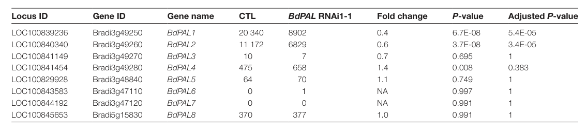

## Question

# Gene Research for Functional Annotation

## ⚠️ CRITICAL: Gene/Protein Identification Context

**BEFORE YOU BEGIN RESEARCH:** You MUST verify you are researching the CORRECT gene/protein. Gene symbols can be ambiguous, especially for less well-characterized genes from non-model organisms.

### Target Gene/Protein Identity (from UniProt):
- **UniProt Accession:** I1IBL7
- **Protein Description:** RecName: Full=Phenylalanine ammonia-lyase {ECO:0000256|ARBA:ARBA00070019, ECO:0000256|RuleBase:RU003955}; EC=4.3.1.24 {ECO:0000256|RuleBase:RU003955};
- **Gene Information:** Name=LOC100829928 {ECO:0000313|EnsemblPlants:KQK00357}; ORFNames=BRADI_3g48840v3 {ECO:0000313|EMBL:KQK00357.1};
- **Organism (full):** Brachypodium distachyon (Purple false brome) (Trachynia distachya).
- **Protein Family:** Belongs to the PAL/histidase family.
- **Key Domains:** Aromatic_Lyase. (IPR001106); Fumarase/histidase_N. (IPR024083); L-Aspartase-like. (IPR008948); Phe/His_NH3-lyase_AS. (IPR022313); Phe_NH3-lyase. (IPR005922)

### MANDATORY VERIFICATION STEPS:

1. **Check if the gene symbol "LOC100829928" matches the protein description above**
2. **Verify the organism is correct:** Brachypodium distachyon (Purple false brome) (Trachynia distachya).
3. **Check if protein family/domains align with what you find in literature**
4. **If you find literature for a DIFFERENT gene with the same or similar symbol, STOP**

### If Gene Symbol is Ambiguous or You Cannot Find Relevant Literature:

**DO NOT PROCEED WITH RESEARCH ON A DIFFERENT GENE.** Instead:
- State clearly: "The gene symbol 'LOC100829928' is ambiguous or literature is limited for this specific protein"
- Explain what you found (e.g., "Found extensive literature on a different gene with the same symbol in a different organism")
- Describe the protein based ONLY on the UniProt information provided above
- Suggest that the protein function can be inferred from domain/family information

### Research Target:

Please provide a comprehensive research report on the gene **LOC100829928** (gene ID: LOC100829928, UniProt: I1IBL7) in BRADI.

The research report should be a detailed narrative explaining the function, biological processes, and localization of the gene product. Citations should be given for all claims.

You should prioritize authoritative reviews and primary scientific literature when conducting research. You can supplement
this with annotations you find in gene/protein databases, but these can be outdated or inaccurate.

We are specifically interested in the primary function of the gene - for enzymes, what reaction is catalyzed, and what is the substrate specificity? For transporters, what is the substrate? For structural proteins or adapters, what is the broader structural role? For signaling molecules, what is the role in the pathway.

We are interested in where in or outside the cell the gene product carries out its function.

We are also interested in the signaling or biochemical pathways in which the gene functions. We are less interested in broad pleiotropic effects, except where these elucidate the precise role.

Include evidence where possible. We are interested in both experimental evidence as well as inference from structure, evolution, or bioinformatic analysis. Precise studies should be prioritized over high-throughput, where available.

## Output

Question: You are an expert researcher providing comprehensive, well-cited information.

Provide detailed information focusing on:
1. Key concepts and definitions with current understanding
2. Recent developments and latest research (prioritize 2023-2024 sources)
3. Current applications and real-world implementations
4. Expert opinions and analysis from authoritative sources
5. Relevant statistics and data from recent studies

Format as a comprehensive research report with proper citations. Include URLs and publication dates where available.
Always prioritize recent, authoritative sources and provide specific citations for all major claims.

# Gene Research for Functional Annotation

## ⚠️ CRITICAL: Gene/Protein Identification Context

**BEFORE YOU BEGIN RESEARCH:** You MUST verify you are researching the CORRECT gene/protein. Gene symbols can be ambiguous, especially for less well-characterized genes from non-model organisms.

### Target Gene/Protein Identity (from UniProt):
- **UniProt Accession:** I1IBL7
- **Protein Description:** RecName: Full=Phenylalanine ammonia-lyase {ECO:0000256|ARBA:ARBA00070019, ECO:0000256|RuleBase:RU003955}; EC=4.3.1.24 {ECO:0000256|RuleBase:RU003955};
- **Gene Information:** Name=LOC100829928 {ECO:0000313|EnsemblPlants:KQK00357}; ORFNames=BRADI_3g48840v3 {ECO:0000313|EMBL:KQK00357.1};
- **Organism (full):** Brachypodium distachyon (Purple false brome) (Trachynia distachya).
- **Protein Family:** Belongs to the PAL/histidase family.
- **Key Domains:** Aromatic_Lyase. (IPR001106); Fumarase/histidase_N. (IPR024083); L-Aspartase-like. (IPR008948); Phe/His_NH3-lyase_AS. (IPR022313); Phe_NH3-lyase. (IPR005922)

### MANDATORY VERIFICATION STEPS:

1. **Check if the gene symbol "LOC100829928" matches the protein description above**
2. **Verify the organism is correct:** Brachypodium distachyon (Purple false brome) (Trachynia distachya).
3. **Check if protein family/domains align with what you find in literature**
4. **If you find literature for a DIFFERENT gene with the same or similar symbol, STOP**

### If Gene Symbol is Ambiguous or You Cannot Find Relevant Literature:

**DO NOT PROCEED WITH RESEARCH ON A DIFFERENT GENE.** Instead:
- State clearly: "The gene symbol 'LOC100829928' is ambiguous or literature is limited for this specific protein"
- Explain what you found (e.g., "Found extensive literature on a different gene with the same symbol in a different organism")
- Describe the protein based ONLY on the UniProt information provided above
- Suggest that the protein function can be inferred from domain/family information

### Research Target:

Please provide a comprehensive research report on the gene **LOC100829928** (gene ID: LOC100829928, UniProt: I1IBL7) in BRADI.

The research report should be a detailed narrative explaining the function, biological processes, and localization of the gene product. Citations should be given for all claims.

You should prioritize authoritative reviews and primary scientific literature when conducting research. You can supplement
this with annotations you find in gene/protein databases, but these can be outdated or inaccurate.

We are specifically interested in the primary function of the gene - for enzymes, what reaction is catalyzed, and what is the substrate specificity? For transporters, what is the substrate? For structural proteins or adapters, what is the broader structural role? For signaling molecules, what is the role in the pathway.

We are interested in where in or outside the cell the gene product carries out its function.

We are also interested in the signaling or biochemical pathways in which the gene functions. We are less interested in broad pleiotropic effects, except where these elucidate the precise role.

Include evidence where possible. We are interested in both experimental evidence as well as inference from structure, evolution, or bioinformatic analysis. Precise studies should be prioritized over high-throughput, where available.

# Functional Annotation Research Report: *Brachypodium distachyon* LOC100829928 (UniProt I1IBL7; Bradi3g48840v3; BdPAL5)

## Executive summary
LOC100829928 (Bradi3g48840v3; UniProt I1IBL7) encodes a phenylalanine ammonia-lyase (PAL)-family aromatic ammonia-lyase in *Brachypodium distachyon* (purple false brome). In the *Brachypodium* genome, Bradi3g48840 is one of eight PAL-family loci and is referred to as BdPAL5 in a primary functional study of PAL knockdown (Cass et al., 2015, *J. Exp. Bot.*, 2015-06; https://doi.org/10.1093/jxb/erv269) (cass2015effectsofphenylalanine pages 4-4, cass2015effectsofphenylalanine media 0e2f129d). While BdPAL5 itself has not been individually biochemically characterized in the retrieved sources, its family/domain context and the *Brachypodium* PAL-pathway literature strongly support its annotation as a cytosolic PAL catalyzing L-phenylalanine → trans-cinnamate + NH3, feeding phenylpropanoid metabolism (lignin and hydroxycinnamate formation) (cass2015effectsofphenylalanine pages 2-3, barros2016roleofbifunctional pages 1-2). In *Brachypodium*, a distinct PAL-family member (BdPTAL1) is bifunctional (PAL/TAL) and supplies a major tyrosine-derived entry route to lignin, illustrating grass-specific dual entry into lignification (barros2016roleofbifunctional pages 1-2, barros2016roleofbifunctional pages 2-3, yokoyama2024evolutionofaromatic pages 8-9).

## 1. Mandatory verification of gene/protein identity
### 1.1 Locus, organism, and PAL-family assignment
Cass et al. explicitly lists Bradi3g48840 (LOC100829928) among eight *Brachypodium distachyon* PAL genes and links it to BdPAL5 (Cass et al., 2015; publication date 2015-06) (cass2015effectsofphenylalanine pages 4-4, cass2015effectsofphenylalanine media 0e2f129d). This satisfies the requirement that the gene symbol and locus correspond to the PAL-family enzyme in the correct organism.

### 1.2 Family features consistent with PAL/histidase (aromatic ammonia-lyase) enzymes
All eight *Brachypodium* PAL-family genes (including Bradi3g48840) carry the conserved Ala-Ser-Gly motif required to form the autocatalytic 4-methylidene-imidazole-5-one (MIO) electrophilic prosthetic group characteristic of aromatic ammonia-lyases (cass2015effectsofphenylalanine pages 4-4, wu2025phenylalanineammonialyasea pages 2-4). This is consistent with the UniProt description of an Aromatic_Lyase-domain enzyme in the PAL/histidase family.

## 2. Key concepts and current understanding (definitions and pathway context)
### 2.1 What PAL does (reaction and metabolic role)
PAL is the entry enzyme of phenylpropanoid metabolism, catalyzing the non-oxidative deamination of L-phenylalanine (L-Phe) to trans-cinnamic acid (t-cinnamate) and ammonia, committing carbon flux from aromatic amino acid metabolism into phenylpropanoid products (including lignin) (Cass et al., 2015; Barros et al., 2016; Wu et al., 2025) (cass2015effectsofphenylalanine pages 2-3, barros2016roleofbifunctional pages 1-2, wu2025phenylalanineammonialyasea pages 2-4). In grasses, an additional route exists via tyrosine ammonia-lyase (TAL) activity, where L-tyrosine (L-Tyr) can be deaminated directly to p-coumarate (4-coumaric acid), bypassing the PAL→C4H step (barros2016roleofbifunctional pages 1-2).

### 2.2 PAL vs TAL vs PTAL (substrate specificity concept)
PALs are often phenylalanine-preferred enzymes, whereas TALs act on tyrosine; grasses can possess bifunctional phenylalanine/tyrosine ammonia-lyases (PTALs) that catalyze both reactions in a single enzyme and can contribute substantially to lignification (barros2016roleofbifunctional pages 1-2, yokoyama2024evolutionofaromatic pages 8-9). In *Brachypodium*, BdPTAL1 is the single PAL-family member identified as bifunctional (PAL/TAL), while other members are considered monofunctional PALs in that study’s framework (barros2016roleofbifunctional pages 2-3, barros2016roleofbifunctional pages 1-2).

### 2.3 Mechanistic/structural concept: MIO prosthetic group and oligomeric state
A defining mechanistic feature of PAL-family enzymes is the MIO prosthetic group, which forms autocatalytically from an internal Ala-Ser-Gly tripeptide and supports the ammonia-lyase elimination chemistry; plant PAL is typically homotetrameric (wu2025phenylalanineammonialyasea pages 2-4). In *Brachypodium*, native BdPTAL1 was observed as a tetramer (~290 kDa native complex, ~77 kDa subunits) (Barros et al., 2016; publication date 2016-05; https://doi.org/10.1038/nplants.2016.50) (barros2016roleofbifunctional pages 2-3).

### 2.4 Cell biology concept: pathway organization and likely cellular location
While specific experimental subcellular localization for BdPAL5 is not reported in the retrieved sources, Brachypodium PTAL activity is largely cytosolic with only minor plastid/microsomal presence (barros2016roleofbifunctional pages 2-3). More broadly, phenylpropanoid metabolism is increasingly understood as spatially organized at the cytosolic face of the endoplasmic reticulum (ER), anchored by ER-localized cytochrome P450 enzymes such as cinnamate 4-hydroxylase (C4H) (aravenacalvo2024globalorganizationof pages 1-3, aravenacalvo2024globalorganizationof pages 6-9). This organization is consistent with functional/flux evidence for substrate channeling and suggests that soluble entry enzymes (like PALs) may be positioned near ER-associated steps via transient interactions, even if not always captured in proximity proteomics (aravenacalvo2024globalorganizationof pages 1-3, aravenacalvo2024globalorganizationof pages 6-9).

## 3. Brachypodium-specific functional context for LOC100829928 (BdPAL5)
### 3.1 Gene family context and expression
In Cass et al. (2015), Bradi3g48840/LOC100829928 (BdPAL5) is listed as part of the eight-member BdPAL family; in the tissues assayed, Bradi3g48840 transcript abundance was low or undetected compared with the two highest stem-expressed PAL genes (Bradi3g49250 and Bradi3g49260) (cass2015effectsofphenylalanine pages 4-4, cass2015effectsofphenylalanine media 0e2f129d). This suggests BdPAL5 is not the dominant PAL transcript in the sampled stem/leaf tissues but does not preclude inducible or condition-specific roles.

### 3.2 Hormone-responsive expression (defense signaling connection)
Kouzai et al. (2016, *BMC Plant Biology*, publication date 2016-03; https://doi.org/10.1186/s12870-016-0749-9) measured qRT-PCR responses to phytohormones and classified Bradi3g48840 as strongly induced by jasmonate (MeJA): “++” corresponding to >10-fold induction vs mock within the 24–48 h window (kouzai2016expressionprofilingof pages 4-5). They further describe Bradi3g48840 as markedly induced at 24 h after JA treatment, with higher levels at 48 h (kouzai2016expressionprofilingof pages 5-6). This supports an inducible role of BdPAL5 in JA-associated defense/stress programs.

### 3.3 Phenylpropanoid/lignin pathway role inferred from PAL knockdown phenotypes
Cass et al. used RNAi targeting PAL transcripts (with potential multi-gene targeting) and observed large lignin and wall-phenolic changes alongside growth and disease-resistance tradeoffs, demonstrating that PAL-family activity is central to grass wall phenylpropanoid flux (cass2015effectsofphenylalanine pages 2-3, cass2015effectsofphenylalanine pages 1-2). Quantitatively, RNAi lines showed large lignin reductions (acid-insoluble lignin 49% and 37% less in two lines; overall lignin 43% and 30% less) (cass2015effectsofphenylalanine pages 8-9, cass2015effectsofphenylalanine media 4f2f604d). They also observed major increases in digestibility after alkaline pretreatment + enzymatic hydrolysis (93% higher glucose release and 96% higher pentose release vs WT in one line), and a 57% reduction in released cell-wall ferulate (FA) (cass2015effectsofphenylalanine pages 14-15). Although these phenotypes cannot be attributed uniquely to BdPAL5 (because the RNAi perturbs multiple PALs), they provide strong pathway-level evidence supporting PAL annotation and its linkage to lignin, hydroxycinnamate crosslinking, and biomass recalcitrance in *Brachypodium* (cass2015effectsofphenylalanine pages 14-15, cass2015effectsofphenylalanine pages 8-9).

## 4. Substrate specificity and grass-specific dual lignin entry: implications for BdPAL5 annotation
### 4.1 Dual-entry lignification in grasses: Phe route (PAL→C4H) and Tyr route (PTAL)
A major development in grass phenylpropanoid biology is the mechanistic and quantitative demonstration of a Tyr-derived lignin entry route. Barros et al. (2016) show *Brachypodium* contains a single bifunctional PTAL (BdPTAL1) whose TAL activity can supply nearly half of the lignin deposited in *Brachypodium* (barros2016roleofbifunctional pages 1-2). Yokoyama (2024, *Phil. Trans. R. Soc. B*, publication date 2024-09; https://doi.org/10.1098/rstb.2023.0352) summarizes this as evidence that PTAL-mediated Tyr flux can account for roughly half of total lignin in *Brachypodium* and highlights multi-layer regulation and feedback inhibition in PAL control (yokoyama2024evolutionofaromatic pages 8-9).

### 4.2 What this means for BdPAL5
Cass et al. reports that a key active-site residue correlates with PAL vs PTAL behavior (His at position ~123 associated with dual activity in Bradi3g49250, while other BdPALs have Phe at that site favoring Phe specificity) (cass2015effectsofphenylalanine pages 14-15, cass2015effectsofphenylalanine pages 4-4). Because Bradi3g48840 is not identified as the bifunctional member in these studies, the most conservative functional inference is that BdPAL5 primarily catalyzes the canonical PAL reaction on L-phenylalanine, contributing to the Phe-derived phenylpropanoid/lignin entry route rather than serving as the major Tyr-utilizing enzyme (barros2016roleofbifunctional pages 1-2, cass2015effectsofphenylalanine pages 4-4).

## 5. Subcellular localization and pathway organization (current evidence)
### 5.1 Likely localization for BdPAL5
The available sources do not directly localize BdPAL5 protein. However, for the closely related *Brachypodium* PTAL enzyme, activities are “mainly cytosolic,” with smaller fractions detected in plastid/microsomal compartments (barros2016roleofbifunctional pages 2-3). Given that PAL-family enzymes are soluble and the phenylpropanoid entry reaction occurs before ER-bound P450 steps, a cytosolic localization proximal to ER-associated phenylpropanoid enzymes is currently the best-supported model for BdPAL5.

### 5.2 Metabolon / ER-anchoring evidence (2024)
A 2024 proximity-labeling study in *Petunia inflata* mapped proteins proximal to ER-anchored C4H using TurboID and recovered multiple soluble downstream enzymes and ER P450s, supporting the model that C4H can act as an ER “anchoring point” for metabolon-like assemblies at the ER surface (Aravena-Calvo et al., 2024, *Frontiers in Plant Science*, publication date 2024-09; https://doi.org/10.3389/fpls.2024.1295750) (aravenacalvo2024globalorganizationof pages 1-3, aravenacalvo2024globalorganizationof pages 6-9). Notably, PAL itself was not reported among the enriched hits in the shown excerpts, implying either weak/transient association, tissue/context dependence, or technical limitations for detecting PAL proximity under those conditions (aravenacalvo2024globalorganizationof pages 6-9).

## 6. Recent developments (prioritizing 2023–2024)
### 6.1 Evolutionary framing of grass PAL/PTAL innovation (2024)
Recent synthesis work emphasizes that grass chemodiversity and lignification are supported by innovations in aromatic amino acid metabolism and PAL-family entry enzymes. Yokoyama (2024-09) highlights dual lignin entry in grasses and discusses regulatory features such as PAL feedback inhibition by cinnamate and ubiquitination-based degradation control, framing PAL as a flux-control node (yokoyama2024evolutionofaromatic pages 8-9). A 2024 preprint analyzing genomes of Poaceae sister lineages argues PTAL originated by tandem duplication of an ancestral PAL and that the PTAL pathway contributes to nearly half of grass lignin biosynthesis, suggesting a concrete evolutionary route to engineering “dual lignin entry” into non-grass plants (Takeda-Kimura et al., 2024-12, bioRxiv; https://doi.org/10.1101/2024.11.06.622220) (takedakimura2024genomesofpoaceae pages 1-4).

### 6.2 Pathway spatial organization (2024)
The TurboID-C4H proximity interactome approach (Aravena-Calvo et al., 2024-09) is a recent methodological advance for resolving where phenylpropanoid enzymes are organized in cells and supports ER-centered organization (aravenacalvo2024globalorganizationof pages 1-3, aravenacalvo2024globalorganizationof pages 6-9). This supports modern “where/how” questions in secondary metabolism emphasized in recent historical/technology-focused reviews (Dixon & Dickinson, 2024-01, *Plant Physiology*; https://doi.org/10.1093/plphys/kiad596) (aravenacalvo2024globalorganizationof pages 6-9).

## 7. Current applications and real-world implementations
### 7.1 Biomass and bioenergy applications: reducing recalcitrance
A major practical implication of PAL-pathway manipulation in grasses is improved biomass deconstruction. In *Brachypodium*, PAL RNAi lines showed strongly improved saccharification after pretreatment and enzymatic hydrolysis (e.g., +93% glucose and +96% pentose release) largely explained by reduced lignin and altered wall phenolics (Cass et al., 2015) (cass2015effectsofphenylalanine pages 14-15, cass2015effectsofphenylalanine pages 8-9). These results illustrate how manipulating phenylpropanoid entry can increase fermentable sugar yield—a key metric for biofuel/bioproduct pipelines.

### 7.2 Engineering lignin in grasses
Recent reviews of lignin engineering (e.g., focusing on saccharification efficiency) explicitly include PAL as a key entry point and discuss the existence of PTAL-mediated bypass routes in grasses that complicate single-step engineering strategies (Martarello et al., 2023-01, *Biomass Conversion and Biorefinery*; https://doi.org/10.1007/s13399-021-01291-6) (wu2025phenylalanineammonialyasea pages 1-2). This is relevant when interpreting BdPAL5’s role: even if a Phe-entry PAL is suppressed, grass lignification may partially persist via Tyr/PTAL flux depending on the genetic perturbation.

## 8. Expert opinion and authoritative analysis
### 8.1 PAL as a flux-control “valve” and regulated node
Recent synthesis articles emphasize PAL as a “core branch-point” enzyme controlling carbon partitioning from primary metabolism into phenylpropanoids and note multilayer regulation (transcriptional control, ubiquitin-mediated turnover, and feedback inhibition by cinnamate) (Yokoyama, 2024-09) (yokoyama2024evolutionofaromatic pages 8-9). This supports interpreting BdPAL5 induction by jasmonate as a biologically meaningful increase in phenylpropanoid entry capacity during defense signaling rather than a passive marker response (kouzai2016expressionprofilingof pages 4-5, kouzai2016expressionprofilingof pages 5-6).

### 8.2 Dual entry to lignin is a defining feature of grasses
Authoritative primary data and recent review synthesis converge on the conclusion that grasses (including *Brachypodium*) have a quantitatively important Tyr-derived lignin entry route via PTAL, potentially supplying ~half of lignin (Barros et al., 2016; Yokoyama, 2024; Takeda-Kimura et al., 2024 preprint) (barros2016roleofbifunctional pages 1-2, yokoyama2024evolutionofaromatic pages 8-9, takedakimura2024genomesofpoaceae pages 1-4). This informs BdPAL5 annotation by clarifying that “PAL-family enzyme” in grasses does not necessarily mean the enzyme is Tyr-active; instead, substrate preferences may be distributed among family members.

## 9. Quantitative summary (recent data and key statistics)
- **JA inducibility of Bradi3g48840 (BdPAL5):** classified as **>10-fold** (“++”) induction after MeJA treatment within **24–48 h** in seedlings (Kouzai et al., 2016-03) (kouzai2016expressionprofilingof pages 4-5, kouzai2016expressionprofilingof pages 5-6).
- **PAL RNAi impact on lignin (multi-gene PAL targeting):** acid-insoluble lignin reduced **49%** and **37%** in two lines; overall lignin reduced **43%** and **30%** (Cass et al., 2015-06) (cass2015effectsofphenylalanine pages 8-9, cass2015effectsofphenylalanine media 4f2f604d).
- **PAL RNAi impact on saccharification:** after alkaline pretreatment + enzymatic hydrolysis, **+93% glucose** and **+96% pentose** release (Cass et al., 2015-06) (cass2015effectsofphenylalanine pages 14-15).
- **Cell-wall phenolics:** released ferulate reduced by **57%** in a PAL RNAi line (Cass et al., 2015-06) (cass2015effectsofphenylalanine pages 14-15).
- **Brachypodium PTAL kinetics (benchmark for grass PAL-family specificity):** recombinant BdPTAL1 has Km(L-Phe) ≈ **201.2 µM** vs Km(L-Tyr) ≈ **11.9 µM** and ~2× higher catalytic efficiency for Tyr (kcat/Km ≈ **5.9** vs **2.8 s−1 mM−1**) (Barros et al., 2016-05) (barros2016roleofbifunctional pages 2-3).

## 10. Evidence gaps and how they affect annotation confidence
### 10.1 What is not yet directly shown for BdPAL5 in retrieved literature
- No retrieved source provides **purified BdPAL5 enzymology** (Km/kcat for L-Phe vs L-Tyr) or **subcellular localization imaging** for Bradi3g48840 specifically.
- The strongest *Brachypodium* PAL phenotypes are from **RNAi targeting multiple PAL transcripts**, so gene-specific attribution to BdPAL5 cannot be made from those phenotypes alone (cass2015effectsofphenylalanine pages 5-6, cass2015effectsofphenylalanine pages 14-15).

### 10.2 Conservative functional conclusion
Given direct locus-to-family mapping (BdPAL5), conserved catalytic motif (MIO-forming triad), and hormone-responsive expression, LOC100829928 is best annotated as a **PAL-family phenylalanine ammonia-lyase contributing to Phe-derived phenylpropanoid flux**, likely functioning in the cytosol near ER-anchored downstream enzymes (cass2015effectsofphenylalanine pages 4-4, wu2025phenylalanineammonialyasea pages 2-4, kouzai2016expressionprofilingof pages 4-5, aravenacalvo2024globalorganizationof pages 1-3).

## Evidence summary table
The following table consolidates the main evidence types supporting this annotation.

| Evidence type | Key finding | Quantitative details (with units) | Source (first author year journal) | URL | Citation ID |
|---|---|---|---|---|---|
| Gene ID mapping | Bradi3g48840 (LOC100829928) is explicitly listed as one of eight Brachypodium PAL-family genes and mapped to **BdPAL5**; all eight carry the conserved Ala-Ser-Gly triad required for the MIO catalytic group. | 8 PAL-family genes in *B. distachyon*; Bradi3g48840 transcripts were low/undetected in sampled tissues. | Cass 2015 *Journal of Experimental Botany* | https://doi.org/10.1093/jxb/erv269 | (cass2015effectsofphenylalanine pages 4-4) |
| Enzyme function | Plant PAL is the entry enzyme of phenylpropanoid metabolism, catalyzing deamination of L-phenylalanine to trans-cinnamate; in grasses, related PTAL enzymes can also deaminate L-tyrosine to p-coumarate. | Reaction products measured as trans-cinnamic acid from L-Phe; in culm extracts PAL activity was ~25-fold higher than TAL activity. | Cass 2015 *Journal of Experimental Botany* | https://doi.org/10.1093/jxb/erv269 | (cass2015effectsofphenylalanine pages 5-6, cass2015effectsofphenylalanine pages 2-3) |
| Expression/regulation | Bradi3g48840 is hormone responsive and behaves as a JA marker gene in *Brachypodium*. | JA induction classified as **++** (>10-fold vs mock) within 24–48 h; markedly induced at 24 h and further increased at 48 h; not induced by SA or ET in the summary table. | Kouzai 2016 *BMC Plant Biology* | https://doi.org/10.1186/s12870-016-0749-9 | (kouzai2016expressionprofilingof pages 4-5, kouzai2016expressionprofilingof pages 5-6) |
| Localization/pathway organization | Direct localization for BdPAL5 is not reported in the retrieved gene-specific papers, but Brachypodium PTAL activity is mainly cytosolic with minor plastid/microsomal presence, and recent proximity-labeling work supports phenylpropanoid pathway organization on the cytosolic face of the ER around C4H. | Native BdPTAL1 is a tetramer of ~290 kDa with ~77 kDa subunits; Petunia C4H-TurboID identified 185 enriched proteins at 0 h and 69 at 3 h biotin labeling. | Barros 2016 *Nature Plants*; Aravena-Calvo 2024 *Frontiers in Plant Science* | https://doi.org/10.1038/nplants.2016.50 ; https://doi.org/10.3389/fpls.2024.1295750 | (barros2016roleofbifunctional pages 2-3, aravenacalvo2024globalorganizationof pages 1-3, aravenacalvo2024globalorganizationof pages 6-9) |
| Phenotypes/traits | PAL knockdown in *Brachypodium* reduces lignification, alters wall phenolics, increases digestibility, and compromises some pathogen resistance, showing PAL-family genes are central to cell-wall phenylpropanoid flux. | Acid-insoluble lignin reduced by 49% and 37% in two RNAi lines; total lignin reduced by 43% and 30%; FA release reduced by 57%; glucose release increased by 93% and pentose release by 96% after alkali pretreatment + hydrolysis. | Cass 2015 *Journal of Experimental Botany* | https://doi.org/10.1093/jxb/erv269 | (cass2015effectsofphenylalanine pages 8-9, cass2015effectsofphenylalanine pages 14-15, cass2015effectsofphenylalanine pages 1-2) |
| Quantitative data | Grass PAL/PTAL studies provide benchmark kinetic and flux values that contextualize PAL-family function in *Brachypodium*; one PTAL can contribute major lignin flux from Tyr. | BdPTAL1: Km(L-Phe) ≈ 201.2 µM, kcat ≈ 0.56 s^-1, kcat/Km ≈ 2.8 s^-1 mM^-1; Km(L-Tyr) ≈ 11.9 µM, kcat ≈ 0.07 s^-1, kcat/Km ≈ 5.9 s^-1 mM^-1; Tyr-derived route can supply nearly half of total lignin. | Barros 2016 *Nature Plants*; Yokoyama 2024 *Philosophical Transactions B* | https://doi.org/10.1038/nplants.2016.50 ; https://doi.org/10.1098/rstb.2023.0352 | (barros2016roleofbifunctional pages 2-3, yokoyama2024evolutionofaromatic pages 8-9, barros2016roleofbifunctional pages 1-2) |

*Table: This table summarizes the strongest literature-backed evidence supporting annotation of LOC100829928 / Bradi3g48840 as a PAL-family enzyme in Brachypodium. It combines locus mapping, functional biochemistry, regulation, pathway context, and phenotype data relevant to annotation.*

## Key cited sources (URLs and publication dates)
- Cass CL et al. 2015-06. *Journal of Experimental Botany*. “Effects of PAL knockdown…” https://doi.org/10.1093/jxb/erv269 (cass2015effectsofphenylalanine pages 8-9, cass2015effectsofphenylalanine pages 14-15, cass2015effectsofphenylalanine pages 4-4, cass2015effectsofphenylalanine media 0e2f129d, cass2015effectsofphenylalanine media 4f2f604d)
- Barros J et al. 2016-05. *Nature Plants*. “Role of bifunctional ammonia-lyase…” https://doi.org/10.1038/nplants.2016.50 (barros2016roleofbifunctional pages 1-2, barros2016roleofbifunctional pages 2-3)
- Kouzai Y et al. 2016-03. *BMC Plant Biology*. “Expression profiling…” https://doi.org/10.1186/s12870-016-0749-9 (kouzai2016expressionprofilingof pages 4-5, kouzai2016expressionprofilingof pages 5-6)
- Yokoyama R. 2024-09. *Philosophical Transactions B*. “Evolution of aromatic amino acid metabolism…” https://doi.org/10.1098/rstb.2023.0352 (yokoyama2024evolutionofaromatic pages 8-9)
- Aravena-Calvo J et al. 2024-09. *Frontiers in Plant Science*. “Global organization… by proximity labeling of C4H” https://doi.org/10.3389/fpls.2024.1295750 (aravenacalvo2024globalorganizationof pages 1-3, aravenacalvo2024globalorganizationof pages 6-9)
- Takeda-Kimura Y et al. 2024-12. bioRxiv. “Genomes of Poaceae sisters…” https://doi.org/10.1101/2024.11.06.622220 (takedakimura2024genomesofpoaceae pages 1-4)

References

1. (cass2015effectsofphenylalanine pages 4-4): Cynthia L. Cass, A. Peraldi, P. Dowd, Y. Mottiar, N. Santoro, S. D. Karlen, Y. Bukhman, Cliff E. Foster, Nicholas Thrower, Laura C. Bruno, O. Moskvin, Eric T. Johnson, Megan E. Willhoit, Megha Phutane, J. Ralph, S. Mansfield, P. Nicholson, and J. Sedbrook. Effects of phenylalanine ammonia lyase (pal) knockdown on cell wall composition, biomass digestibility, and biotic and abiotic stress responses in brachypodium. Journal of Experimental Botany, 66:4317-4335, Jun 2015. URL: https://doi.org/10.1093/jxb/erv269, doi:10.1093/jxb/erv269. This article has 244 citations and is from a domain leading peer-reviewed journal.

2. (cass2015effectsofphenylalanine media 0e2f129d): Cynthia L. Cass, A. Peraldi, P. Dowd, Y. Mottiar, N. Santoro, S. D. Karlen, Y. Bukhman, Cliff E. Foster, Nicholas Thrower, Laura C. Bruno, O. Moskvin, Eric T. Johnson, Megan E. Willhoit, Megha Phutane, J. Ralph, S. Mansfield, P. Nicholson, and J. Sedbrook. Effects of phenylalanine ammonia lyase (pal) knockdown on cell wall composition, biomass digestibility, and biotic and abiotic stress responses in brachypodium. Journal of Experimental Botany, 66:4317-4335, Jun 2015. URL: https://doi.org/10.1093/jxb/erv269, doi:10.1093/jxb/erv269. This article has 244 citations and is from a domain leading peer-reviewed journal.

3. (cass2015effectsofphenylalanine pages 2-3): Cynthia L. Cass, A. Peraldi, P. Dowd, Y. Mottiar, N. Santoro, S. D. Karlen, Y. Bukhman, Cliff E. Foster, Nicholas Thrower, Laura C. Bruno, O. Moskvin, Eric T. Johnson, Megan E. Willhoit, Megha Phutane, J. Ralph, S. Mansfield, P. Nicholson, and J. Sedbrook. Effects of phenylalanine ammonia lyase (pal) knockdown on cell wall composition, biomass digestibility, and biotic and abiotic stress responses in brachypodium. Journal of Experimental Botany, 66:4317-4335, Jun 2015. URL: https://doi.org/10.1093/jxb/erv269, doi:10.1093/jxb/erv269. This article has 244 citations and is from a domain leading peer-reviewed journal.

4. (barros2016roleofbifunctional pages 1-2): Jaime Barros, Juan C. Serrani-Yarce, Fang Chen, David Baxter, Barney J. Venables, and Richard A. Dixon. Role of bifunctional ammonia-lyase in grass cell wall biosynthesis. Nature Plants, May 2016. URL: https://doi.org/10.1038/nplants.2016.50, doi:10.1038/nplants.2016.50. This article has 381 citations and is from a highest quality peer-reviewed journal.

5. (barros2016roleofbifunctional pages 2-3): Jaime Barros, Juan C. Serrani-Yarce, Fang Chen, David Baxter, Barney J. Venables, and Richard A. Dixon. Role of bifunctional ammonia-lyase in grass cell wall biosynthesis. Nature Plants, May 2016. URL: https://doi.org/10.1038/nplants.2016.50, doi:10.1038/nplants.2016.50. This article has 381 citations and is from a highest quality peer-reviewed journal.

6. (yokoyama2024evolutionofaromatic pages 8-9): Ryo Yokoyama. Evolution of aromatic amino acid metabolism in plants: a key driving force behind plant chemical diversity in aromatic natural products. Philosophical Transactions of the Royal Society B: Biological Sciences, Sep 2024. URL: https://doi.org/10.1098/rstb.2023.0352, doi:10.1098/rstb.2023.0352. This article has 23 citations and is from a domain leading peer-reviewed journal.

7. (wu2025phenylalanineammonialyasea pages 2-4): Xiaozhu Wu, Suqing Zhu, Lisi He, Gongmin Cheng, Tongjian Li, Wenying Meng, and Feng Wen. Phenylalanine ammonia-lyase: a core regulator of plant carbon metabolic flux redistribution—from molecular mechanisms and growth modulation to stress adaptability. Plants, 14:3811, Dec 2025. URL: https://doi.org/10.3390/plants14243811, doi:10.3390/plants14243811. This article has 14 citations.

8. (aravenacalvo2024globalorganizationof pages 1-3): Javiera Aravena-Calvo, Silas Busck-Mellor, and Tomas Laursen. Global organization of phenylpropanoid and anthocyanin pathways revealed by proximity labeling of trans-cinnamic acid 4-hydroxylase in petunia inflata petal protoplasts. Frontiers in Plant Science, Sep 2024. URL: https://doi.org/10.3389/fpls.2024.1295750, doi:10.3389/fpls.2024.1295750. This article has 8 citations.

9. (aravenacalvo2024globalorganizationof pages 6-9): Javiera Aravena-Calvo, Silas Busck-Mellor, and Tomas Laursen. Global organization of phenylpropanoid and anthocyanin pathways revealed by proximity labeling of trans-cinnamic acid 4-hydroxylase in petunia inflata petal protoplasts. Frontiers in Plant Science, Sep 2024. URL: https://doi.org/10.3389/fpls.2024.1295750, doi:10.3389/fpls.2024.1295750. This article has 8 citations.

10. (kouzai2016expressionprofilingof pages 4-5): Yusuke Kouzai, Mamiko Kimura, Yurie Yamanaka, Megumi Watanabe, Hidenori Matsui, Mikihiro Yamamoto, Yuki Ichinose, Kazuhiro Toyoda, Yoshihiko Onda, Keiichi Mochida, and Yoshiteru Noutoshi. Expression profiling of marker genes responsive to the defence-associated phytohormones salicylic acid, jasmonic acid and ethylene in brachypodium distachyon. BMC Plant Biology, Mar 2016. URL: https://doi.org/10.1186/s12870-016-0749-9, doi:10.1186/s12870-016-0749-9. This article has 66 citations and is from a peer-reviewed journal.

11. (kouzai2016expressionprofilingof pages 5-6): Yusuke Kouzai, Mamiko Kimura, Yurie Yamanaka, Megumi Watanabe, Hidenori Matsui, Mikihiro Yamamoto, Yuki Ichinose, Kazuhiro Toyoda, Yoshihiko Onda, Keiichi Mochida, and Yoshiteru Noutoshi. Expression profiling of marker genes responsive to the defence-associated phytohormones salicylic acid, jasmonic acid and ethylene in brachypodium distachyon. BMC Plant Biology, Mar 2016. URL: https://doi.org/10.1186/s12870-016-0749-9, doi:10.1186/s12870-016-0749-9. This article has 66 citations and is from a peer-reviewed journal.

12. (cass2015effectsofphenylalanine pages 1-2): Cynthia L. Cass, A. Peraldi, P. Dowd, Y. Mottiar, N. Santoro, S. D. Karlen, Y. Bukhman, Cliff E. Foster, Nicholas Thrower, Laura C. Bruno, O. Moskvin, Eric T. Johnson, Megan E. Willhoit, Megha Phutane, J. Ralph, S. Mansfield, P. Nicholson, and J. Sedbrook. Effects of phenylalanine ammonia lyase (pal) knockdown on cell wall composition, biomass digestibility, and biotic and abiotic stress responses in brachypodium. Journal of Experimental Botany, 66:4317-4335, Jun 2015. URL: https://doi.org/10.1093/jxb/erv269, doi:10.1093/jxb/erv269. This article has 244 citations and is from a domain leading peer-reviewed journal.

13. (cass2015effectsofphenylalanine pages 8-9): Cynthia L. Cass, A. Peraldi, P. Dowd, Y. Mottiar, N. Santoro, S. D. Karlen, Y. Bukhman, Cliff E. Foster, Nicholas Thrower, Laura C. Bruno, O. Moskvin, Eric T. Johnson, Megan E. Willhoit, Megha Phutane, J. Ralph, S. Mansfield, P. Nicholson, and J. Sedbrook. Effects of phenylalanine ammonia lyase (pal) knockdown on cell wall composition, biomass digestibility, and biotic and abiotic stress responses in brachypodium. Journal of Experimental Botany, 66:4317-4335, Jun 2015. URL: https://doi.org/10.1093/jxb/erv269, doi:10.1093/jxb/erv269. This article has 244 citations and is from a domain leading peer-reviewed journal.

14. (cass2015effectsofphenylalanine media 4f2f604d): Cynthia L. Cass, A. Peraldi, P. Dowd, Y. Mottiar, N. Santoro, S. D. Karlen, Y. Bukhman, Cliff E. Foster, Nicholas Thrower, Laura C. Bruno, O. Moskvin, Eric T. Johnson, Megan E. Willhoit, Megha Phutane, J. Ralph, S. Mansfield, P. Nicholson, and J. Sedbrook. Effects of phenylalanine ammonia lyase (pal) knockdown on cell wall composition, biomass digestibility, and biotic and abiotic stress responses in brachypodium. Journal of Experimental Botany, 66:4317-4335, Jun 2015. URL: https://doi.org/10.1093/jxb/erv269, doi:10.1093/jxb/erv269. This article has 244 citations and is from a domain leading peer-reviewed journal.

15. (cass2015effectsofphenylalanine pages 14-15): Cynthia L. Cass, A. Peraldi, P. Dowd, Y. Mottiar, N. Santoro, S. D. Karlen, Y. Bukhman, Cliff E. Foster, Nicholas Thrower, Laura C. Bruno, O. Moskvin, Eric T. Johnson, Megan E. Willhoit, Megha Phutane, J. Ralph, S. Mansfield, P. Nicholson, and J. Sedbrook. Effects of phenylalanine ammonia lyase (pal) knockdown on cell wall composition, biomass digestibility, and biotic and abiotic stress responses in brachypodium. Journal of Experimental Botany, 66:4317-4335, Jun 2015. URL: https://doi.org/10.1093/jxb/erv269, doi:10.1093/jxb/erv269. This article has 244 citations and is from a domain leading peer-reviewed journal.

16. (takedakimura2024genomesofpoaceae pages 1-4): Yuri Takeda-Kimura, Bethany Moore, Samuel Holden, Sontosh K. Deb, Matt Barrett, David Lorence, Marcos V. V. de Oliveira, Jane Grimwood, Melissa Williams, Lori Beth Boston, Jerry Jenkins, Christopher Plott, Shengqiang Shu, Kerrie Barry, David M. Goodstein, Jeremy Schmutz, Matthew J. Moscou, Michael R. McKain, James H. Leebens-Mack, and Hiroshi A. Maeda. Genomes of poaceae sisters reveal key metabolic innovations preceding the evolution of grasses. bioRxiv, Dec 2024. URL: https://doi.org/10.1101/2024.11.06.622220, doi:10.1101/2024.11.06.622220. This article has 9 citations.

17. (wu2025phenylalanineammonialyasea pages 1-2): Xiaozhu Wu, Suqing Zhu, Lisi He, Gongmin Cheng, Tongjian Li, Wenying Meng, and Feng Wen. Phenylalanine ammonia-lyase: a core regulator of plant carbon metabolic flux redistribution—from molecular mechanisms and growth modulation to stress adaptability. Plants, 14:3811, Dec 2025. URL: https://doi.org/10.3390/plants14243811, doi:10.3390/plants14243811. This article has 14 citations.

18. (cass2015effectsofphenylalanine pages 5-6): Cynthia L. Cass, A. Peraldi, P. Dowd, Y. Mottiar, N. Santoro, S. D. Karlen, Y. Bukhman, Cliff E. Foster, Nicholas Thrower, Laura C. Bruno, O. Moskvin, Eric T. Johnson, Megan E. Willhoit, Megha Phutane, J. Ralph, S. Mansfield, P. Nicholson, and J. Sedbrook. Effects of phenylalanine ammonia lyase (pal) knockdown on cell wall composition, biomass digestibility, and biotic and abiotic stress responses in brachypodium. Journal of Experimental Botany, 66:4317-4335, Jun 2015. URL: https://doi.org/10.1093/jxb/erv269, doi:10.1093/jxb/erv269. This article has 244 citations and is from a domain leading peer-reviewed journal.

## Artifacts

- [Edison artifact artifact-00](LOC100829928-deep-research-falcon_artifacts/artifact-00.md)

## Citations

1. barros2016roleofbifunctional pages 1-2
2. wu2025phenylalanineammonialyasea pages 2-4
3. barros2016roleofbifunctional pages 2-3
4. kouzai2016expressionprofilingof pages 4-5
5. kouzai2016expressionprofilingof pages 5-6
6. cass2015effectsofphenylalanine pages 14-15
7. yokoyama2024evolutionofaromatic pages 8-9
8. aravenacalvo2024globalorganizationof pages 6-9
9. takedakimura2024genomesofpoaceae pages 1-4
10. wu2025phenylalanineammonialyasea pages 1-2
11. cass2015effectsofphenylalanine pages 4-4
12. cass2015effectsofphenylalanine pages 2-3
13. aravenacalvo2024globalorganizationof pages 1-3
14. cass2015effectsofphenylalanine pages 1-2
15. cass2015effectsofphenylalanine pages 8-9
16. cass2015effectsofphenylalanine pages 5-6
17. https://doi.org/10.1093/jxb/erv269
18. https://doi.org/10.1038/nplants.2016.50
19. https://doi.org/10.1186/s12870-016-0749-9
20. https://doi.org/10.1098/rstb.2023.0352
21. https://doi.org/10.3389/fpls.2024.1295750
22. https://doi.org/10.1101/2024.11.06.622220
23. https://doi.org/10.1093/plphys/kiad596
24. https://doi.org/10.1007/s13399-021-01291-6
25. https://doi.org/10.1093/jxb/erv269,
26. https://doi.org/10.1038/nplants.2016.50,
27. https://doi.org/10.1098/rstb.2023.0352,
28. https://doi.org/10.3390/plants14243811,
29. https://doi.org/10.3389/fpls.2024.1295750,
30. https://doi.org/10.1186/s12870-016-0749-9,
31. https://doi.org/10.1101/2024.11.06.622220,